cola Report for recount2:SRP059775
==================

**Date**: 2019-12-26 01:11:07 CET, **cola version**: 1.3.2

----------------------------------------------------------------

<style type='text/css'>

body, td, th {
   font-family: Arial,Helvetica,sans-serif;
   background-color: white;
   font-size: 13px;
  max-width: 800px;
  margin: auto;
  margin-left:210px;
  padding: 0px 10px 0px 10px;
  border-left: 1px solid #EEEEEE;
  line-height: 150%;
}

tt, code, pre {
   font-family: 'DejaVu Sans Mono', 'Droid Sans Mono', 'Lucida Console', Consolas, Monaco, 

monospace;
}

h1 {
   font-size:2.2em;
}

h2 {
   font-size:1.8em;
}

h3 {
   font-size:1.4em;
}

h4 {
   font-size:1.0em;
}

h5 {
   font-size:0.9em;
}

h6 {
   font-size:0.8em;
}

a {
  text-decoration: none;
  color: #0366d6;
}

a:hover {
  text-decoration: underline;
}

a:visited {
   color: #0366d6;
}

pre, img {
  max-width: 100%;
}
pre {
  overflow-x: auto;
}
pre code {
   display: block; padding: 0.5em;
}

code {
  font-size: 92%;
  border: 1px solid #ccc;
}

code[class] {
  background-color: #F8F8F8;
}

table, td, th {
  border: 1px solid #ccc;
}

blockquote {
   color:#666666;
   margin:0;
   padding-left: 1em;
   border-left: 0.5em #EEE solid;
}

hr {
   height: 0px;
   border-bottom: none;
   border-top-width: thin;
   border-top-style: dotted;
   border-top-color: #999999;
}

@media print {
   * {
      background: transparent !important;
      color: black !important;
      filter:none !important;
      -ms-filter: none !important;
   }

   body {
      font-size:12pt;
      max-width:100%;
   }

   a, a:visited {
      text-decoration: underline;
   }

   hr {
      visibility: hidden;
      page-break-before: always;
   }

   pre, blockquote {
      padding-right: 1em;
      page-break-inside: avoid;
   }

   tr, img {
      page-break-inside: avoid;
   }

   img {
      max-width: 100% !important;
   }

   @page :left {
      margin: 15mm 20mm 15mm 10mm;
   }

   @page :right {
      margin: 15mm 10mm 15mm 20mm;
   }

   p, h2, h3 {
      orphans: 3; widows: 3;
   }

   h2, h3 {
      page-break-after: avoid;
   }
}
</style>


## Summary


All available functions which can be applied to this `res_list` object:


```r
res_list
```

```
#> A 'ConsensusPartitionList' object with 24 methods.
#>   On a matrix with 9126 rows and 192 columns.
#>   Top rows are extracted by 'SD, CV, MAD, ATC' methods.
#>   Subgroups are detected by 'hclust, kmeans, skmeans, pam, mclust, NMF' method.
#>   Number of partitions are tried for k = 2, 3, 4, 5, 6.
#>   Performed in total 30000 partitions by row resampling.
#> 
#> Following methods can be applied to this 'ConsensusPartitionList' object:
#>  [1] "cola_report"           "collect_classes"       "collect_plots"         "collect_stats"        
#>  [5] "colnames"              "functional_enrichment" "get_anno_col"          "get_anno"             
#>  [9] "get_classes"           "get_matrix"            "get_membership"        "get_stats"            
#> [13] "is_best_k"             "is_stable_k"           "ncol"                  "nrow"                 
#> [17] "rownames"              "show"                  "suggest_best_k"        "test_to_known_factors"
#> [21] "top_rows_heatmap"      "top_rows_overlap"     
#> 
#> You can get result for a single method by, e.g. object["SD", "hclust"] or object["SD:hclust"]
#> or a subset of methods by object[c("SD", "CV")], c("hclust", "kmeans")]
```

The call of `run_all_consensus_partition_methods()` was:


```
#> run_all_consensus_partition_methods(data = mat, mc.cores = 4)
```

Dimension of the input matrix:


```r
mat = get_matrix(res_list)
dim(mat)
```

```
#> [1] 9126  192
```

### Density distribution

The density distribution for each sample is visualized as in one column in the
following heatmap. The clustering is based on the distance which is the
Kolmogorov-Smirnov statistic between two distributions.


```r
library(ComplexHeatmap)
densityHeatmap(mat, ylab = "value", cluster_columns = TRUE, show_column_names = FALSE,
    mc.cores = 4)
```


### Suggest the best k


Folowing table shows the best `k` (number of partitions) for each combination
of top-value methods and partition methods. Clicking on the method name in
the table goes to the section for a single combination of methods.

[The cola vignette](http://bioconductor.org/packages/devel/bioc/vignettes/cola/inst/doc/cola.html#toc_13)
explains the definition of the metrics used for determining the best
number of partitions.


```r
suggest_best_k(res_list)
```


|                            | The best k| 1-PAC| Mean silhouette| Concordance|   |Optional k |
|:---------------------------|----------:|-----:|---------------:|-----------:|:--|:----------|
|[SD:hclust](#SD-hclust)     |          3| 1.000|           0.993|       0.997|** |2          |
|[SD:kmeans](#SD-kmeans)     |          2| 1.000|           0.996|       0.981|** |           |
|[SD:skmeans](#SD-skmeans)   |          2| 1.000|           0.996|       0.998|** |           |
|[CV:kmeans](#CV-kmeans)     |          2| 1.000|           0.994|       0.998|** |           |
|[CV:skmeans](#CV-skmeans)   |          3| 1.000|           0.989|       0.996|** |2          |
|[CV:pam](#CV-pam)           |          3| 1.000|           0.976|       0.981|** |2          |
|[CV:NMF](#CV-NMF)           |          2| 1.000|           0.995|       0.998|** |           |
|[MAD:hclust](#MAD-hclust)   |          3| 1.000|           0.995|       0.998|** |2          |
|[MAD:kmeans](#MAD-kmeans)   |          2| 1.000|           0.999|       0.995|** |           |
|[MAD:skmeans](#MAD-skmeans) |          2| 1.000|           0.997|       0.999|** |           |
|[MAD:mclust](#MAD-mclust)   |          4| 1.000|           0.966|       0.983|** |2          |
|[MAD:NMF](#MAD-NMF)         |          2| 1.000|           0.997|       0.999|** |           |
|[ATC:kmeans](#ATC-kmeans)   |          2| 1.000|           1.000|       1.000|** |           |
|[ATC:skmeans](#ATC-skmeans) |          2| 1.000|           0.994|       0.998|** |           |
|[ATC:mclust](#ATC-mclust)   |          4| 1.000|           0.966|       0.984|** |2          |
|[ATC:NMF](#ATC-NMF)         |          3| 1.000|           0.977|       0.987|** |2          |
|[CV:hclust](#CV-hclust)     |          3| 0.985|           0.985|       0.978|** |2          |
|[ATC:hclust](#ATC-hclust)   |          4| 0.980|           0.964|       0.980|** |2          |
|[MAD:pam](#MAD-pam)         |          4| 0.948|           0.903|       0.964|*  |2          |
|[SD:mclust](#SD-mclust)     |          5| 0.947|           0.916|       0.948|*  |2          |
|[ATC:pam](#ATC-pam)         |          4| 0.942|           0.906|       0.960|*  |2,3        |
|[SD:pam](#SD-pam)           |          4| 0.938|           0.890|       0.959|*  |2          |
|[CV:mclust](#CV-mclust)     |          4| 0.932|           0.912|       0.947|*  |2          |
|[SD:NMF](#SD-NMF)           |          3| 0.919|           0.900|       0.949|*  |2          |

\*\*: 1-PAC > 0.95, \*: 1-PAC > 0.9


### CDF of consensus matrices

Cumulative distribution function curves of consensus matrix for all methods.


```r
collect_plots(res_list, fun = plot_ecdf)
```


### Consensus heatmap

Consensus heatmaps for all methods. ([What is a consensus heatmap?](http://bioconductor.org/packages/devel/bioc/vignettes/cola/inst/doc/cola.html#toc_9))


<style type='text/css'>


.ui-helper-hidden {
	display: none;
}
.ui-helper-hidden-accessible {
	border: 0;
	clip: rect(0 0 0 0);
	height: 1px;
	margin: -1px;
	overflow: hidden;
	padding: 0;
	position: absolute;
	width: 1px;
}
.ui-helper-reset {
	margin: 0;
	padding: 0;
	border: 0;
	outline: 0;
	line-height: 1.3;
	text-decoration: none;
	font-size: 100%;
	list-style: none;
}
.ui-helper-clearfix:before,
.ui-helper-clearfix:after {
	content: "";
	display: table;
	border-collapse: collapse;
}
.ui-helper-clearfix:after {
	clear: both;
}
.ui-helper-zfix {
	width: 100%;
	height: 100%;
	top: 0;
	left: 0;
	position: absolute;
	opacity: 0;
	filter:Alpha(Opacity=0); 
}

.ui-front {
	z-index: 100;
}


.ui-state-disabled {
	cursor: default !important;
	pointer-events: none;
}


.ui-icon {
	display: inline-block;
	vertical-align: middle;
	margin-top: -.25em;
	position: relative;
	text-indent: -99999px;
	overflow: hidden;
	background-repeat: no-repeat;
}

.ui-widget-icon-block {
	left: 50%;
	margin-left: -8px;
	display: block;
}


.ui-widget-overlay {
	position: fixed;
	top: 0;
	left: 0;
	width: 100%;
	height: 100%;
}
.ui-accordion .ui-accordion-header {
	display: block;
	cursor: pointer;
	position: relative;
	margin: 2px 0 0 0;
	padding: .5em .5em .5em .7em;
	font-size: 100%;
}
.ui-accordion .ui-accordion-content {
	padding: 1em 2.2em;
	border-top: 0;
	overflow: auto;
}
.ui-autocomplete {
	position: absolute;
	top: 0;
	left: 0;
	cursor: default;
}
.ui-menu {
	list-style: none;
	padding: 0;
	margin: 0;
	display: block;
	outline: 0;
}
.ui-menu .ui-menu {
	position: absolute;
}
.ui-menu .ui-menu-item {
	margin: 0;
	cursor: pointer;
	
	list-style-image: url("data:image/gif;base64,R0lGODlhAQABAIAAAAAAAP///yH5BAEAAAAALAAAAAABAAEAAAIBRAA7");
}
.ui-menu .ui-menu-item-wrapper {
	position: relative;
	padding: 3px 1em 3px .4em;
}
.ui-menu .ui-menu-divider {
	margin: 5px 0;
	height: 0;
	font-size: 0;
	line-height: 0;
	border-width: 1px 0 0 0;
}
.ui-menu .ui-state-focus,
.ui-menu .ui-state-active {
	margin: -1px;
}


.ui-menu-icons {
	position: relative;
}
.ui-menu-icons .ui-menu-item-wrapper {
	padding-left: 2em;
}


.ui-menu .ui-icon {
	position: absolute;
	top: 0;
	bottom: 0;
	left: .2em;
	margin: auto 0;
}


.ui-menu .ui-menu-icon {
	left: auto;
	right: 0;
}
.ui-button {
	padding: .4em 1em;
	display: inline-block;
	position: relative;
	line-height: normal;
	margin-right: .1em;
	cursor: pointer;
	vertical-align: middle;
	text-align: center;
	-webkit-user-select: none;
	-moz-user-select: none;
	-ms-user-select: none;
	user-select: none;

	
	overflow: visible;
}

.ui-button,
.ui-button:link,
.ui-button:visited,
.ui-button:hover,
.ui-button:active {
	text-decoration: none;
}


.ui-button-icon-only {
	width: 2em;
	box-sizing: border-box;
	text-indent: -9999px;
	white-space: nowrap;
}


input.ui-button.ui-button-icon-only {
	text-indent: 0;
}


.ui-button-icon-only .ui-icon {
	position: absolute;
	top: 50%;
	left: 50%;
	margin-top: -8px;
	margin-left: -8px;
}

.ui-button.ui-icon-notext .ui-icon {
	padding: 0;
	width: 2.1em;
	height: 2.1em;
	text-indent: -9999px;
	white-space: nowrap;

}

input.ui-button.ui-icon-notext .ui-icon {
	width: auto;
	height: auto;
	text-indent: 0;
	white-space: normal;
	padding: .4em 1em;
}


input.ui-button::-moz-focus-inner,
button.ui-button::-moz-focus-inner {
	border: 0;
	padding: 0;
}
.ui-controlgroup {
	vertical-align: middle;
	display: inline-block;
}
.ui-controlgroup > .ui-controlgroup-item {
	float: left;
	margin-left: 0;
	margin-right: 0;
}
.ui-controlgroup > .ui-controlgroup-item:focus,
.ui-controlgroup > .ui-controlgroup-item.ui-visual-focus {
	z-index: 9999;
}
.ui-controlgroup-vertical > .ui-controlgroup-item {
	display: block;
	float: none;
	width: 100%;
	margin-top: 0;
	margin-bottom: 0;
	text-align: left;
}
.ui-controlgroup-vertical .ui-controlgroup-item {
	box-sizing: border-box;
}
.ui-controlgroup .ui-controlgroup-label {
	padding: .4em 1em;
}
.ui-controlgroup .ui-controlgroup-label span {
	font-size: 80%;
}
.ui-controlgroup-horizontal .ui-controlgroup-label + .ui-controlgroup-item {
	border-left: none;
}
.ui-controlgroup-vertical .ui-controlgroup-label + .ui-controlgroup-item {
	border-top: none;
}
.ui-controlgroup-horizontal .ui-controlgroup-label.ui-widget-content {
	border-right: none;
}
.ui-controlgroup-vertical .ui-controlgroup-label.ui-widget-content {
	border-bottom: none;
}


.ui-controlgroup-vertical .ui-spinner-input {

	
	width: 75%;
	width: calc( 100% - 2.4em );
}
.ui-controlgroup-vertical .ui-spinner .ui-spinner-up {
	border-top-style: solid;
}

.ui-checkboxradio-label .ui-icon-background {
	box-shadow: inset 1px 1px 1px #ccc;
	border-radius: .12em;
	border: none;
}
.ui-checkboxradio-radio-label .ui-icon-background {
	width: 16px;
	height: 16px;
	border-radius: 1em;
	overflow: visible;
	border: none;
}
.ui-checkboxradio-radio-label.ui-checkboxradio-checked .ui-icon,
.ui-checkboxradio-radio-label.ui-checkboxradio-checked:hover .ui-icon {
	background-image: none;
	width: 8px;
	height: 8px;
	border-width: 4px;
	border-style: solid;
}
.ui-checkboxradio-disabled {
	pointer-events: none;
}
.ui-datepicker {
	width: 17em;
	padding: .2em .2em 0;
	display: none;
}
.ui-datepicker .ui-datepicker-header {
	position: relative;
	padding: .2em 0;
}
.ui-datepicker .ui-datepicker-prev,
.ui-datepicker .ui-datepicker-next {
	position: absolute;
	top: 2px;
	width: 1.8em;
	height: 1.8em;
}
.ui-datepicker .ui-datepicker-prev-hover,
.ui-datepicker .ui-datepicker-next-hover {
	top: 1px;
}
.ui-datepicker .ui-datepicker-prev {
	left: 2px;
}
.ui-datepicker .ui-datepicker-next {
	right: 2px;
}
.ui-datepicker .ui-datepicker-prev-hover {
	left: 1px;
}
.ui-datepicker .ui-datepicker-next-hover {
	right: 1px;
}
.ui-datepicker .ui-datepicker-prev span,
.ui-datepicker .ui-datepicker-next span {
	display: block;
	position: absolute;
	left: 50%;
	margin-left: -8px;
	top: 50%;
	margin-top: -8px;
}
.ui-datepicker .ui-datepicker-title {
	margin: 0 2.3em;
	line-height: 1.8em;
	text-align: center;
}
.ui-datepicker .ui-datepicker-title select {
	font-size: 1em;
	margin: 1px 0;
}
.ui-datepicker select.ui-datepicker-month,
.ui-datepicker select.ui-datepicker-year {
	width: 45%;
}
.ui-datepicker table {
	width: 100%;
	font-size: .9em;
	border-collapse: collapse;
	margin: 0 0 .4em;
}
.ui-datepicker th {
	padding: .7em .3em;
	text-align: center;
	font-weight: bold;
	border: 0;
}
.ui-datepicker td {
	border: 0;
	padding: 1px;
}
.ui-datepicker td span,
.ui-datepicker td a {
	display: block;
	padding: .2em;
	text-align: right;
	text-decoration: none;
}
.ui-datepicker .ui-datepicker-buttonpane {
	background-image: none;
	margin: .7em 0 0 0;
	padding: 0 .2em;
	border-left: 0;
	border-right: 0;
	border-bottom: 0;
}
.ui-datepicker .ui-datepicker-buttonpane button {
	float: right;
	margin: .5em .2em .4em;
	cursor: pointer;
	padding: .2em .6em .3em .6em;
	width: auto;
	overflow: visible;
}
.ui-datepicker .ui-datepicker-buttonpane button.ui-datepicker-current {
	float: left;
}


.ui-datepicker.ui-datepicker-multi {
	width: auto;
}
.ui-datepicker-multi .ui-datepicker-group {
	float: left;
}
.ui-datepicker-multi .ui-datepicker-group table {
	width: 95%;
	margin: 0 auto .4em;
}
.ui-datepicker-multi-2 .ui-datepicker-group {
	width: 50%;
}
.ui-datepicker-multi-3 .ui-datepicker-group {
	width: 33.3%;
}
.ui-datepicker-multi-4 .ui-datepicker-group {
	width: 25%;
}
.ui-datepicker-multi .ui-datepicker-group-last .ui-datepicker-header,
.ui-datepicker-multi .ui-datepicker-group-middle .ui-datepicker-header {
	border-left-width: 0;
}
.ui-datepicker-multi .ui-datepicker-buttonpane {
	clear: left;
}
.ui-datepicker-row-break {
	clear: both;
	width: 100%;
	font-size: 0;
}


.ui-datepicker-rtl {
	direction: rtl;
}
.ui-datepicker-rtl .ui-datepicker-prev {
	right: 2px;
	left: auto;
}
.ui-datepicker-rtl .ui-datepicker-next {
	left: 2px;
	right: auto;
}
.ui-datepicker-rtl .ui-datepicker-prev:hover {
	right: 1px;
	left: auto;
}
.ui-datepicker-rtl .ui-datepicker-next:hover {
	left: 1px;
	right: auto;
}
.ui-datepicker-rtl .ui-datepicker-buttonpane {
	clear: right;
}
.ui-datepicker-rtl .ui-datepicker-buttonpane button {
	float: left;
}
.ui-datepicker-rtl .ui-datepicker-buttonpane button.ui-datepicker-current,
.ui-datepicker-rtl .ui-datepicker-group {
	float: right;
}
.ui-datepicker-rtl .ui-datepicker-group-last .ui-datepicker-header,
.ui-datepicker-rtl .ui-datepicker-group-middle .ui-datepicker-header {
	border-right-width: 0;
	border-left-width: 1px;
}


.ui-datepicker .ui-icon {
	display: block;
	text-indent: -99999px;
	overflow: hidden;
	background-repeat: no-repeat;
	left: .5em;
	top: .3em;
}
.ui-dialog {
	position: absolute;
	top: 0;
	left: 0;
	padding: .2em;
	outline: 0;
}
.ui-dialog .ui-dialog-titlebar {
	padding: .4em 1em;
	position: relative;
}
.ui-dialog .ui-dialog-title {
	float: left;
	margin: .1em 0;
	white-space: nowrap;
	width: 90%;
	overflow: hidden;
	text-overflow: ellipsis;
}
.ui-dialog .ui-dialog-titlebar-close {
	position: absolute;
	right: .3em;
	top: 50%;
	width: 20px;
	margin: -10px 0 0 0;
	padding: 1px;
	height: 20px;
}
.ui-dialog .ui-dialog-content {
	position: relative;
	border: 0;
	padding: .5em 1em;
	background: none;
	overflow: auto;
}
.ui-dialog .ui-dialog-buttonpane {
	text-align: left;
	border-width: 1px 0 0 0;
	background-image: none;
	margin-top: .5em;
	padding: .3em 1em .5em .4em;
}
.ui-dialog .ui-dialog-buttonpane .ui-dialog-buttonset {
	float: right;
}
.ui-dialog .ui-dialog-buttonpane button {
	margin: .5em .4em .5em 0;
	cursor: pointer;
}
.ui-dialog .ui-resizable-n {
	height: 2px;
	top: 0;
}
.ui-dialog .ui-resizable-e {
	width: 2px;
	right: 0;
}
.ui-dialog .ui-resizable-s {
	height: 2px;
	bottom: 0;
}
.ui-dialog .ui-resizable-w {
	width: 2px;
	left: 0;
}
.ui-dialog .ui-resizable-se,
.ui-dialog .ui-resizable-sw,
.ui-dialog .ui-resizable-ne,
.ui-dialog .ui-resizable-nw {
	width: 7px;
	height: 7px;
}
.ui-dialog .ui-resizable-se {
	right: 0;
	bottom: 0;
}
.ui-dialog .ui-resizable-sw {
	left: 0;
	bottom: 0;
}
.ui-dialog .ui-resizable-ne {
	right: 0;
	top: 0;
}
.ui-dialog .ui-resizable-nw {
	left: 0;
	top: 0;
}
.ui-draggable .ui-dialog-titlebar {
	cursor: move;
}
.ui-draggable-handle {
	-ms-touch-action: none;
	touch-action: none;
}
.ui-resizable {
	position: relative;
}
.ui-resizable-handle {
	position: absolute;
	font-size: 0.1px;
	display: block;
	-ms-touch-action: none;
	touch-action: none;
}
.ui-resizable-disabled .ui-resizable-handle,
.ui-resizable-autohide .ui-resizable-handle {
	display: none;
}
.ui-resizable-n {
	cursor: n-resize;
	height: 7px;
	width: 100%;
	top: -5px;
	left: 0;
}
.ui-resizable-s {
	cursor: s-resize;
	height: 7px;
	width: 100%;
	bottom: -5px;
	left: 0;
}
.ui-resizable-e {
	cursor: e-resize;
	width: 7px;
	right: -5px;
	top: 0;
	height: 100%;
}
.ui-resizable-w {
	cursor: w-resize;
	width: 7px;
	left: -5px;
	top: 0;
	height: 100%;
}
.ui-resizable-se {
	cursor: se-resize;
	width: 12px;
	height: 12px;
	right: 1px;
	bottom: 1px;
}
.ui-resizable-sw {
	cursor: sw-resize;
	width: 9px;
	height: 9px;
	left: -5px;
	bottom: -5px;
}
.ui-resizable-nw {
	cursor: nw-resize;
	width: 9px;
	height: 9px;
	left: -5px;
	top: -5px;
}
.ui-resizable-ne {
	cursor: ne-resize;
	width: 9px;
	height: 9px;
	right: -5px;
	top: -5px;
}
.ui-progressbar {
	height: 2em;
	text-align: left;
	overflow: hidden;
}
.ui-progressbar .ui-progressbar-value {
	margin: -1px;
	height: 100%;
}
.ui-progressbar .ui-progressbar-overlay {
	background: url("data:image/gif;base64,R0lGODlhKAAoAIABAAAAAP///yH/C05FVFNDQVBFMi4wAwEAAAAh+QQJAQABACwAAAAAKAAoAAACkYwNqXrdC52DS06a7MFZI+4FHBCKoDeWKXqymPqGqxvJrXZbMx7Ttc+w9XgU2FB3lOyQRWET2IFGiU9m1frDVpxZZc6bfHwv4c1YXP6k1Vdy292Fb6UkuvFtXpvWSzA+HycXJHUXiGYIiMg2R6W459gnWGfHNdjIqDWVqemH2ekpObkpOlppWUqZiqr6edqqWQAAIfkECQEAAQAsAAAAACgAKAAAApSMgZnGfaqcg1E2uuzDmmHUBR8Qil95hiPKqWn3aqtLsS18y7G1SzNeowWBENtQd+T1JktP05nzPTdJZlR6vUxNWWjV+vUWhWNkWFwxl9VpZRedYcflIOLafaa28XdsH/ynlcc1uPVDZxQIR0K25+cICCmoqCe5mGhZOfeYSUh5yJcJyrkZWWpaR8doJ2o4NYq62lAAACH5BAkBAAEALAAAAAAoACgAAAKVDI4Yy22ZnINRNqosw0Bv7i1gyHUkFj7oSaWlu3ovC8GxNso5fluz3qLVhBVeT/Lz7ZTHyxL5dDalQWPVOsQWtRnuwXaFTj9jVVh8pma9JjZ4zYSj5ZOyma7uuolffh+IR5aW97cHuBUXKGKXlKjn+DiHWMcYJah4N0lYCMlJOXipGRr5qdgoSTrqWSq6WFl2ypoaUAAAIfkECQEAAQAsAAAAACgAKAAAApaEb6HLgd/iO7FNWtcFWe+ufODGjRfoiJ2akShbueb0wtI50zm02pbvwfWEMWBQ1zKGlLIhskiEPm9R6vRXxV4ZzWT2yHOGpWMyorblKlNp8HmHEb/lCXjcW7bmtXP8Xt229OVWR1fod2eWqNfHuMjXCPkIGNileOiImVmCOEmoSfn3yXlJWmoHGhqp6ilYuWYpmTqKUgAAIfkECQEAAQAsAAAAACgAKAAAApiEH6kb58biQ3FNWtMFWW3eNVcojuFGfqnZqSebuS06w5V80/X02pKe8zFwP6EFWOT1lDFk8rGERh1TTNOocQ61Hm4Xm2VexUHpzjymViHrFbiELsefVrn6XKfnt2Q9G/+Xdie499XHd2g4h7ioOGhXGJboGAnXSBnoBwKYyfioubZJ2Hn0RuRZaflZOil56Zp6iioKSXpUAAAh+QQJAQABACwAAAAAKAAoAAACkoQRqRvnxuI7kU1a1UU5bd5tnSeOZXhmn5lWK3qNTWvRdQxP8qvaC+/yaYQzXO7BMvaUEmJRd3TsiMAgswmNYrSgZdYrTX6tSHGZO73ezuAw2uxuQ+BbeZfMxsexY35+/Qe4J1inV0g4x3WHuMhIl2jXOKT2Q+VU5fgoSUI52VfZyfkJGkha6jmY+aaYdirq+lQAACH5BAkBAAEALAAAAAAoACgAAAKWBIKpYe0L3YNKToqswUlvznigd4wiR4KhZrKt9Upqip61i9E3vMvxRdHlbEFiEXfk9YARYxOZZD6VQ2pUunBmtRXo1Lf8hMVVcNl8JafV38aM2/Fu5V16Bn63r6xt97j09+MXSFi4BniGFae3hzbH9+hYBzkpuUh5aZmHuanZOZgIuvbGiNeomCnaxxap2upaCZsq+1kAACH5BAkBAAEALAAAAAAoACgAAAKXjI8By5zf4kOxTVrXNVlv1X0d8IGZGKLnNpYtm8Lr9cqVeuOSvfOW79D9aDHizNhDJidFZhNydEahOaDH6nomtJjp1tutKoNWkvA6JqfRVLHU/QUfau9l2x7G54d1fl995xcIGAdXqMfBNadoYrhH+Mg2KBlpVpbluCiXmMnZ2Sh4GBqJ+ckIOqqJ6LmKSllZmsoq6wpQAAAh+QQJAQABACwAAAAAKAAoAAAClYx/oLvoxuJDkU1a1YUZbJ59nSd2ZXhWqbRa2/gF8Gu2DY3iqs7yrq+xBYEkYvFSM8aSSObE+ZgRl1BHFZNr7pRCavZ5BW2142hY3AN/zWtsmf12p9XxxFl2lpLn1rseztfXZjdIWIf2s5dItwjYKBgo9yg5pHgzJXTEeGlZuenpyPmpGQoKOWkYmSpaSnqKileI2FAAACH5BAkBAAEALAAAAAAoACgAAAKVjB+gu+jG4kORTVrVhRlsnn2dJ3ZleFaptFrb+CXmO9OozeL5VfP99HvAWhpiUdcwkpBH3825AwYdU8xTqlLGhtCosArKMpvfa1mMRae9VvWZfeB2XfPkeLmm18lUcBj+p5dnN8jXZ3YIGEhYuOUn45aoCDkp16hl5IjYJvjWKcnoGQpqyPlpOhr3aElaqrq56Bq7VAAAOw==");
	height: 100%;
	filter: alpha(opacity=25); 
	opacity: 0.25;
}
.ui-progressbar-indeterminate .ui-progressbar-value {
	background-image: none;
}
.ui-selectable {
	-ms-touch-action: none;
	touch-action: none;
}
.ui-selectable-helper {
	position: absolute;
	z-index: 100;
	border: 1px dotted black;
}
.ui-selectmenu-menu {
	padding: 0;
	margin: 0;
	position: absolute;
	top: 0;
	left: 0;
	display: none;
}
.ui-selectmenu-menu .ui-menu {
	overflow: auto;
	overflow-x: hidden;
	padding-bottom: 1px;
}
.ui-selectmenu-menu .ui-menu .ui-selectmenu-optgroup {
	font-size: 1em;
	font-weight: bold;
	line-height: 1.5;
	padding: 2px 0.4em;
	margin: 0.5em 0 0 0;
	height: auto;
	border: 0;
}
.ui-selectmenu-open {
	display: block;
}
.ui-selectmenu-text {
	display: block;
	margin-right: 20px;
	overflow: hidden;
	text-overflow: ellipsis;
}
.ui-selectmenu-button.ui-button {
	text-align: left;
	white-space: nowrap;
	width: 14em;
}
.ui-selectmenu-icon.ui-icon {
	float: right;
	margin-top: 0;
}
.ui-slider {
	position: relative;
	text-align: left;
}
.ui-slider .ui-slider-handle {
	position: absolute;
	z-index: 2;
	width: 1.2em;
	height: 1.2em;
	cursor: default;
	-ms-touch-action: none;
	touch-action: none;
}
.ui-slider .ui-slider-range {
	position: absolute;
	z-index: 1;
	font-size: .7em;
	display: block;
	border: 0;
	background-position: 0 0;
}


.ui-slider.ui-state-disabled .ui-slider-handle,
.ui-slider.ui-state-disabled .ui-slider-range {
	filter: inherit;
}

.ui-slider-horizontal {
	height: .8em;
}
.ui-slider-horizontal .ui-slider-handle {
	top: -.3em;
	margin-left: -.6em;
}
.ui-slider-horizontal .ui-slider-range {
	top: 0;
	height: 100%;
}
.ui-slider-horizontal .ui-slider-range-min {
	left: 0;
}
.ui-slider-horizontal .ui-slider-range-max {
	right: 0;
}

.ui-slider-vertical {
	width: .8em;
	height: 100px;
}
.ui-slider-vertical .ui-slider-handle {
	left: -.3em;
	margin-left: 0;
	margin-bottom: -.6em;
}
.ui-slider-vertical .ui-slider-range {
	left: 0;
	width: 100%;
}
.ui-slider-vertical .ui-slider-range-min {
	bottom: 0;
}
.ui-slider-vertical .ui-slider-range-max {
	top: 0;
}
.ui-sortable-handle {
	-ms-touch-action: none;
	touch-action: none;
}
.ui-spinner {
	position: relative;
	display: inline-block;
	overflow: hidden;
	padding: 0;
	vertical-align: middle;
}
.ui-spinner-input {
	border: none;
	background: none;
	color: inherit;
	padding: .222em 0;
	margin: .2em 0;
	vertical-align: middle;
	margin-left: .4em;
	margin-right: 2em;
}
.ui-spinner-button {
	width: 1.6em;
	height: 50%;
	font-size: .5em;
	padding: 0;
	margin: 0;
	text-align: center;
	position: absolute;
	cursor: default;
	display: block;
	overflow: hidden;
	right: 0;
}

.ui-spinner a.ui-spinner-button {
	border-top-style: none;
	border-bottom-style: none;
	border-right-style: none;
}
.ui-spinner-up {
	top: 0;
}
.ui-spinner-down {
	bottom: 0;
}
.ui-tabs {
	position: relative;
	padding: .2em;
}
.ui-tabs .ui-tabs-nav {
	margin: 0;
	padding: .2em .2em 0;
}
.ui-tabs .ui-tabs-nav li {
	list-style: none;
	float: left;
	position: relative;
	top: 0;
	margin: 1px .2em 0 0;
	border-bottom-width: 0;
	padding: 0;
	white-space: nowrap;
}
.ui-tabs .ui-tabs-nav .ui-tabs-anchor {
	float: left;
	padding: .5em 1em;
	text-decoration: none;
}
.ui-tabs .ui-tabs-nav li.ui-tabs-active {
	margin-bottom: -1px;
	padding-bottom: 1px;
}
.ui-tabs .ui-tabs-nav li.ui-tabs-active .ui-tabs-anchor,
.ui-tabs .ui-tabs-nav li.ui-state-disabled .ui-tabs-anchor,
.ui-tabs .ui-tabs-nav li.ui-tabs-loading .ui-tabs-anchor {
	cursor: text;
}
.ui-tabs-collapsible .ui-tabs-nav li.ui-tabs-active .ui-tabs-anchor {
	cursor: pointer;
}
.ui-tabs .ui-tabs-panel {
	display: block;
	border-width: 0;
	padding: 1em 1.4em;
	background: none;
}
.ui-tooltip {
	padding: 8px;
	position: absolute;
	z-index: 9999;
	max-width: 300px;
}
body .ui-tooltip {
	border-width: 2px;
}

.ui-widget {
	font-family: Arial,Helvetica,sans-serif;
	font-size: 1em;
}
.ui-widget .ui-widget {
	font-size: 1em;
}
.ui-widget input,
.ui-widget select,
.ui-widget textarea,
.ui-widget button {
	font-family: Arial,Helvetica,sans-serif;
	font-size: 1em;
}
.ui-widget.ui-widget-content {
	border: 1px solid #c5c5c5;
}
.ui-widget-content {
	border: 1px solid #dddddd;
	background: #ffffff;
	color: #333333;
}
.ui-widget-content a {
	color: #333333;
}
.ui-widget-header {
	border: 1px solid #dddddd;
	background: #e9e9e9;
	color: #333333;
	font-weight: bold;
}
.ui-widget-header a {
	color: #333333;
}


.ui-state-default,
.ui-widget-content .ui-state-default,
.ui-widget-header .ui-state-default,
.ui-button,


html .ui-button.ui-state-disabled:hover,
html .ui-button.ui-state-disabled:active {
	border: 1px solid #c5c5c5;
	background: #f6f6f6;
	font-weight: normal;
	color: #454545;
}
.ui-state-default a,
.ui-state-default a:link,
.ui-state-default a:visited,
a.ui-button,
a:link.ui-button,
a:visited.ui-button,
.ui-button {
	color: #454545;
	text-decoration: none;
}
.ui-state-hover,
.ui-widget-content .ui-state-hover,
.ui-widget-header .ui-state-hover,
.ui-state-focus,
.ui-widget-content .ui-state-focus,
.ui-widget-header .ui-state-focus,
.ui-button:hover,
.ui-button:focus {
	border: 1px solid #cccccc;
	background: #ededed;
	font-weight: normal;
	color: #2b2b2b;
}
.ui-state-hover a,
.ui-state-hover a:hover,
.ui-state-hover a:link,
.ui-state-hover a:visited,
.ui-state-focus a,
.ui-state-focus a:hover,
.ui-state-focus a:link,
.ui-state-focus a:visited,
a.ui-button:hover,
a.ui-button:focus {
	color: #2b2b2b;
	text-decoration: none;
}

.ui-visual-focus {
	box-shadow: 0 0 3px 1px rgb(94, 158, 214);
}
.ui-state-active,
.ui-widget-content .ui-state-active,
.ui-widget-header .ui-state-active,
a.ui-button:active,
.ui-button:active,
.ui-button.ui-state-active:hover {
	border: 1px solid #003eff;
	background: #007fff;
	font-weight: normal;
	color: #ffffff;
}
.ui-icon-background,
.ui-state-active .ui-icon-background {
	border: #003eff;
	background-color: #ffffff;
}
.ui-state-active a,
.ui-state-active a:link,
.ui-state-active a:visited {
	color: #ffffff;
	text-decoration: none;
}


.ui-state-highlight,
.ui-widget-content .ui-state-highlight,
.ui-widget-header .ui-state-highlight {
	border: 1px solid #dad55e;
	background: #fffa90;
	color: #777620;
}
.ui-state-checked {
	border: 1px solid #dad55e;
	background: #fffa90;
}
.ui-state-highlight a,
.ui-widget-content .ui-state-highlight a,
.ui-widget-header .ui-state-highlight a {
	color: #777620;
}
.ui-state-error,
.ui-widget-content .ui-state-error,
.ui-widget-header .ui-state-error {
	border: 1px solid #f1a899;
	background: #fddfdf;
	color: #5f3f3f;
}
.ui-state-error a,
.ui-widget-content .ui-state-error a,
.ui-widget-header .ui-state-error a {
	color: #5f3f3f;
}
.ui-state-error-text,
.ui-widget-content .ui-state-error-text,
.ui-widget-header .ui-state-error-text {
	color: #5f3f3f;
}
.ui-priority-primary,
.ui-widget-content .ui-priority-primary,
.ui-widget-header .ui-priority-primary {
	font-weight: bold;
}
.ui-priority-secondary,
.ui-widget-content .ui-priority-secondary,
.ui-widget-header .ui-priority-secondary {
	opacity: .7;
	filter:Alpha(Opacity=70); 
	font-weight: normal;
}
.ui-state-disabled,
.ui-widget-content .ui-state-disabled,
.ui-widget-header .ui-state-disabled {
	opacity: .35;
	filter:Alpha(Opacity=35); 
	background-image: none;
}
.ui-state-disabled .ui-icon {
	filter:Alpha(Opacity=35); 
}


.ui-icon {
	width: 16px;
	height: 16px;
}
.ui-icon,
.ui-widget-content .ui-icon {
	background-image: url("images/ui-icons_444444_256x240.png");
}
.ui-widget-header .ui-icon {
	background-image: url("images/ui-icons_444444_256x240.png");
}
.ui-state-hover .ui-icon,
.ui-state-focus .ui-icon,
.ui-button:hover .ui-icon,
.ui-button:focus .ui-icon {
	background-image: url("images/ui-icons_555555_256x240.png");
}
.ui-state-active .ui-icon,
.ui-button:active .ui-icon {
	background-image: url("images/ui-icons_ffffff_256x240.png");
}
.ui-state-highlight .ui-icon,
.ui-button .ui-state-highlight.ui-icon {
	background-image: url("images/ui-icons_777620_256x240.png");
}
.ui-state-error .ui-icon,
.ui-state-error-text .ui-icon {
	background-image: url("images/ui-icons_cc0000_256x240.png");
}
.ui-button .ui-icon {
	background-image: url("images/ui-icons_777777_256x240.png");
}


.ui-icon-blank { background-position: 16px 16px; }
.ui-icon-caret-1-n { background-position: 0 0; }
.ui-icon-caret-1-ne { background-position: -16px 0; }
.ui-icon-caret-1-e { background-position: -32px 0; }
.ui-icon-caret-1-se { background-position: -48px 0; }
.ui-icon-caret-1-s { background-position: -65px 0; }
.ui-icon-caret-1-sw { background-position: -80px 0; }
.ui-icon-caret-1-w { background-position: -96px 0; }
.ui-icon-caret-1-nw { background-position: -112px 0; }
.ui-icon-caret-2-n-s { background-position: -128px 0; }
.ui-icon-caret-2-e-w { background-position: -144px 0; }
.ui-icon-triangle-1-n { background-position: 0 -16px; }
.ui-icon-triangle-1-ne { background-position: -16px -16px; }
.ui-icon-triangle-1-e { background-position: -32px -16px; }
.ui-icon-triangle-1-se { background-position: -48px -16px; }
.ui-icon-triangle-1-s { background-position: -65px -16px; }
.ui-icon-triangle-1-sw { background-position: -80px -16px; }
.ui-icon-triangle-1-w { background-position: -96px -16px; }
.ui-icon-triangle-1-nw { background-position: -112px -16px; }
.ui-icon-triangle-2-n-s { background-position: -128px -16px; }
.ui-icon-triangle-2-e-w { background-position: -144px -16px; }
.ui-icon-arrow-1-n { background-position: 0 -32px; }
.ui-icon-arrow-1-ne { background-position: -16px -32px; }
.ui-icon-arrow-1-e { background-position: -32px -32px; }
.ui-icon-arrow-1-se { background-position: -48px -32px; }
.ui-icon-arrow-1-s { background-position: -65px -32px; }
.ui-icon-arrow-1-sw { background-position: -80px -32px; }
.ui-icon-arrow-1-w { background-position: -96px -32px; }
.ui-icon-arrow-1-nw { background-position: -112px -32px; }
.ui-icon-arrow-2-n-s { background-position: -128px -32px; }
.ui-icon-arrow-2-ne-sw { background-position: -144px -32px; }
.ui-icon-arrow-2-e-w { background-position: -160px -32px; }
.ui-icon-arrow-2-se-nw { background-position: -176px -32px; }
.ui-icon-arrowstop-1-n { background-position: -192px -32px; }
.ui-icon-arrowstop-1-e { background-position: -208px -32px; }
.ui-icon-arrowstop-1-s { background-position: -224px -32px; }
.ui-icon-arrowstop-1-w { background-position: -240px -32px; }
.ui-icon-arrowthick-1-n { background-position: 1px -48px; }
.ui-icon-arrowthick-1-ne { background-position: -16px -48px; }
.ui-icon-arrowthick-1-e { background-position: -32px -48px; }
.ui-icon-arrowthick-1-se { background-position: -48px -48px; }
.ui-icon-arrowthick-1-s { background-position: -64px -48px; }
.ui-icon-arrowthick-1-sw { background-position: -80px -48px; }
.ui-icon-arrowthick-1-w { background-position: -96px -48px; }
.ui-icon-arrowthick-1-nw { background-position: -112px -48px; }
.ui-icon-arrowthick-2-n-s { background-position: -128px -48px; }
.ui-icon-arrowthick-2-ne-sw { background-position: -144px -48px; }
.ui-icon-arrowthick-2-e-w { background-position: -160px -48px; }
.ui-icon-arrowthick-2-se-nw { background-position: -176px -48px; }
.ui-icon-arrowthickstop-1-n { background-position: -192px -48px; }
.ui-icon-arrowthickstop-1-e { background-position: -208px -48px; }
.ui-icon-arrowthickstop-1-s { background-position: -224px -48px; }
.ui-icon-arrowthickstop-1-w { background-position: -240px -48px; }
.ui-icon-arrowreturnthick-1-w { background-position: 0 -64px; }
.ui-icon-arrowreturnthick-1-n { background-position: -16px -64px; }
.ui-icon-arrowreturnthick-1-e { background-position: -32px -64px; }
.ui-icon-arrowreturnthick-1-s { background-position: -48px -64px; }
.ui-icon-arrowreturn-1-w { background-position: -64px -64px; }
.ui-icon-arrowreturn-1-n { background-position: -80px -64px; }
.ui-icon-arrowreturn-1-e { background-position: -96px -64px; }
.ui-icon-arrowreturn-1-s { background-position: -112px -64px; }
.ui-icon-arrowrefresh-1-w { background-position: -128px -64px; }
.ui-icon-arrowrefresh-1-n { background-position: -144px -64px; }
.ui-icon-arrowrefresh-1-e { background-position: -160px -64px; }
.ui-icon-arrowrefresh-1-s { background-position: -176px -64px; }
.ui-icon-arrow-4 { background-position: 0 -80px; }
.ui-icon-arrow-4-diag { background-position: -16px -80px; }
.ui-icon-extlink { background-position: -32px -80px; }
.ui-icon-newwin { background-position: -48px -80px; }
.ui-icon-refresh { background-position: -64px -80px; }
.ui-icon-shuffle { background-position: -80px -80px; }
.ui-icon-transfer-e-w { background-position: -96px -80px; }
.ui-icon-transferthick-e-w { background-position: -112px -80px; }
.ui-icon-folder-collapsed { background-position: 0 -96px; }
.ui-icon-folder-open { background-position: -16px -96px; }
.ui-icon-document { background-position: -32px -96px; }
.ui-icon-document-b { background-position: -48px -96px; }
.ui-icon-note { background-position: -64px -96px; }
.ui-icon-mail-closed { background-position: -80px -96px; }
.ui-icon-mail-open { background-position: -96px -96px; }
.ui-icon-suitcase { background-position: -112px -96px; }
.ui-icon-comment { background-position: -128px -96px; }
.ui-icon-person { background-position: -144px -96px; }
.ui-icon-print { background-position: -160px -96px; }
.ui-icon-trash { background-position: -176px -96px; }
.ui-icon-locked { background-position: -192px -96px; }
.ui-icon-unlocked { background-position: -208px -96px; }
.ui-icon-bookmark { background-position: -224px -96px; }
.ui-icon-tag { background-position: -240px -96px; }
.ui-icon-home { background-position: 0 -112px; }
.ui-icon-flag { background-position: -16px -112px; }
.ui-icon-calendar { background-position: -32px -112px; }
.ui-icon-cart { background-position: -48px -112px; }
.ui-icon-pencil { background-position: -64px -112px; }
.ui-icon-clock { background-position: -80px -112px; }
.ui-icon-disk { background-position: -96px -112px; }
.ui-icon-calculator { background-position: -112px -112px; }
.ui-icon-zoomin { background-position: -128px -112px; }
.ui-icon-zoomout { background-position: -144px -112px; }
.ui-icon-search { background-position: -160px -112px; }
.ui-icon-wrench { background-position: -176px -112px; }
.ui-icon-gear { background-position: -192px -112px; }
.ui-icon-heart { background-position: -208px -112px; }
.ui-icon-star { background-position: -224px -112px; }
.ui-icon-link { background-position: -240px -112px; }
.ui-icon-cancel { background-position: 0 -128px; }
.ui-icon-plus { background-position: -16px -128px; }
.ui-icon-plusthick { background-position: -32px -128px; }
.ui-icon-minus { background-position: -48px -128px; }
.ui-icon-minusthick { background-position: -64px -128px; }
.ui-icon-close { background-position: -80px -128px; }
.ui-icon-closethick { background-position: -96px -128px; }
.ui-icon-key { background-position: -112px -128px; }
.ui-icon-lightbulb { background-position: -128px -128px; }
.ui-icon-scissors { background-position: -144px -128px; }
.ui-icon-clipboard { background-position: -160px -128px; }
.ui-icon-copy { background-position: -176px -128px; }
.ui-icon-contact { background-position: -192px -128px; }
.ui-icon-image { background-position: -208px -128px; }
.ui-icon-video { background-position: -224px -128px; }
.ui-icon-script { background-position: -240px -128px; }
.ui-icon-alert { background-position: 0 -144px; }
.ui-icon-info { background-position: -16px -144px; }
.ui-icon-notice { background-position: -32px -144px; }
.ui-icon-help { background-position: -48px -144px; }
.ui-icon-check { background-position: -64px -144px; }
.ui-icon-bullet { background-position: -80px -144px; }
.ui-icon-radio-on { background-position: -96px -144px; }
.ui-icon-radio-off { background-position: -112px -144px; }
.ui-icon-pin-w { background-position: -128px -144px; }
.ui-icon-pin-s { background-position: -144px -144px; }
.ui-icon-play { background-position: 0 -160px; }
.ui-icon-pause { background-position: -16px -160px; }
.ui-icon-seek-next { background-position: -32px -160px; }
.ui-icon-seek-prev { background-position: -48px -160px; }
.ui-icon-seek-end { background-position: -64px -160px; }
.ui-icon-seek-start { background-position: -80px -160px; }

.ui-icon-seek-first { background-position: -80px -160px; }
.ui-icon-stop { background-position: -96px -160px; }
.ui-icon-eject { background-position: -112px -160px; }
.ui-icon-volume-off { background-position: -128px -160px; }
.ui-icon-volume-on { background-position: -144px -160px; }
.ui-icon-power { background-position: 0 -176px; }
.ui-icon-signal-diag { background-position: -16px -176px; }
.ui-icon-signal { background-position: -32px -176px; }
.ui-icon-battery-0 { background-position: -48px -176px; }
.ui-icon-battery-1 { background-position: -64px -176px; }
.ui-icon-battery-2 { background-position: -80px -176px; }
.ui-icon-battery-3 { background-position: -96px -176px; }
.ui-icon-circle-plus { background-position: 0 -192px; }
.ui-icon-circle-minus { background-position: -16px -192px; }
.ui-icon-circle-close { background-position: -32px -192px; }
.ui-icon-circle-triangle-e { background-position: -48px -192px; }
.ui-icon-circle-triangle-s { background-position: -64px -192px; }
.ui-icon-circle-triangle-w { background-position: -80px -192px; }
.ui-icon-circle-triangle-n { background-position: -96px -192px; }
.ui-icon-circle-arrow-e { background-position: -112px -192px; }
.ui-icon-circle-arrow-s { background-position: -128px -192px; }
.ui-icon-circle-arrow-w { background-position: -144px -192px; }
.ui-icon-circle-arrow-n { background-position: -160px -192px; }
.ui-icon-circle-zoomin { background-position: -176px -192px; }
.ui-icon-circle-zoomout { background-position: -192px -192px; }
.ui-icon-circle-check { background-position: -208px -192px; }
.ui-icon-circlesmall-plus { background-position: 0 -208px; }
.ui-icon-circlesmall-minus { background-position: -16px -208px; }
.ui-icon-circlesmall-close { background-position: -32px -208px; }
.ui-icon-squaresmall-plus { background-position: -48px -208px; }
.ui-icon-squaresmall-minus { background-position: -64px -208px; }
.ui-icon-squaresmall-close { background-position: -80px -208px; }
.ui-icon-grip-dotted-vertical { background-position: 0 -224px; }
.ui-icon-grip-dotted-horizontal { background-position: -16px -224px; }
.ui-icon-grip-solid-vertical { background-position: -32px -224px; }
.ui-icon-grip-solid-horizontal { background-position: -48px -224px; }
.ui-icon-gripsmall-diagonal-se { background-position: -64px -224px; }
.ui-icon-grip-diagonal-se { background-position: -80px -224px; }


.ui-corner-all,
.ui-corner-top,
.ui-corner-left,
.ui-corner-tl {
	border-top-left-radius: 3px;
}
.ui-corner-all,
.ui-corner-top,
.ui-corner-right,
.ui-corner-tr {
	border-top-right-radius: 3px;
}
.ui-corner-all,
.ui-corner-bottom,
.ui-corner-left,
.ui-corner-bl {
	border-bottom-left-radius: 3px;
}
.ui-corner-all,
.ui-corner-bottom,
.ui-corner-right,
.ui-corner-br {
	border-bottom-right-radius: 3px;
}


.ui-widget-overlay {
	background: #aaaaaa;
	opacity: .3;
	filter: Alpha(Opacity=30); 
}
.ui-widget-shadow {
	-webkit-box-shadow: 0px 0px 5px #666666;
	box-shadow: 0px 0px 5px #666666;
} 
</style>
<script src='js/jquery-1.12.4.js'></script>
<script src='js/jquery-ui.js'></script>

<script>
$( function() {
	$( '#tabs-collect-consensus-heatmap' ).tabs();
} );
</script>
<div id='tabs-collect-consensus-heatmap'>
<ul>
<li><a href='#tab-collect-consensus-heatmap-1'>k = 2</a></li>
<li><a href='#tab-collect-consensus-heatmap-2'>k = 3</a></li>
<li><a href='#tab-collect-consensus-heatmap-3'>k = 4</a></li>
<li><a href='#tab-collect-consensus-heatmap-4'>k = 5</a></li>
<li><a href='#tab-collect-consensus-heatmap-5'>k = 6</a></li>
</ul>
<div id='tab-collect-consensus-heatmap-1'>
<pre><code class="r">collect_plots(res_list, k = 2, fun = consensus_heatmap, mc.cores = 4)
</code></pre>

<p></p>

</div>
<div id='tab-collect-consensus-heatmap-2'>
<pre><code class="r">collect_plots(res_list, k = 3, fun = consensus_heatmap, mc.cores = 4)
</code></pre>

<p></p>

</div>
<div id='tab-collect-consensus-heatmap-3'>
<pre><code class="r">collect_plots(res_list, k = 4, fun = consensus_heatmap, mc.cores = 4)
</code></pre>

<p></p>

</div>
<div id='tab-collect-consensus-heatmap-4'>
<pre><code class="r">collect_plots(res_list, k = 5, fun = consensus_heatmap, mc.cores = 4)
</code></pre>

<p></p>

</div>
<div id='tab-collect-consensus-heatmap-5'>
<pre><code class="r">collect_plots(res_list, k = 6, fun = consensus_heatmap, mc.cores = 4)
</code></pre>

<p></p>

</div>
</div>


### Membership heatmap

Membership heatmaps for all methods. ([What is a membership heatmap?](http://bioconductor.org/packages/devel/bioc/vignettes/cola/inst/doc/cola.html#toc_12))


<script>
$( function() {
	$( '#tabs-collect-membership-heatmap' ).tabs();
} );
</script>
<div id='tabs-collect-membership-heatmap'>
<ul>
<li><a href='#tab-collect-membership-heatmap-1'>k = 2</a></li>
<li><a href='#tab-collect-membership-heatmap-2'>k = 3</a></li>
<li><a href='#tab-collect-membership-heatmap-3'>k = 4</a></li>
<li><a href='#tab-collect-membership-heatmap-4'>k = 5</a></li>
<li><a href='#tab-collect-membership-heatmap-5'>k = 6</a></li>
</ul>
<div id='tab-collect-membership-heatmap-1'>
<pre><code class="r">collect_plots(res_list, k = 2, fun = membership_heatmap, mc.cores = 4)
</code></pre>

<p></p>

</div>
<div id='tab-collect-membership-heatmap-2'>
<pre><code class="r">collect_plots(res_list, k = 3, fun = membership_heatmap, mc.cores = 4)
</code></pre>

<p></p>

</div>
<div id='tab-collect-membership-heatmap-3'>
<pre><code class="r">collect_plots(res_list, k = 4, fun = membership_heatmap, mc.cores = 4)
</code></pre>

<p></p>

</div>
<div id='tab-collect-membership-heatmap-4'>
<pre><code class="r">collect_plots(res_list, k = 5, fun = membership_heatmap, mc.cores = 4)
</code></pre>

<p></p>

</div>
<div id='tab-collect-membership-heatmap-5'>
<pre><code class="r">collect_plots(res_list, k = 6, fun = membership_heatmap, mc.cores = 4)
</code></pre>

<p></p>

</div>
</div>


### Signature heatmap

Signature heatmaps for all methods. ([What is a signature heatmap?](http://bioconductor.org/packages/devel/bioc/vignettes/cola/inst/doc/cola.html#toc_22))


Note in following heatmaps, rows are scaled.


<script>
$( function() {
	$( '#tabs-collect-get-signatures' ).tabs();
} );
</script>
<div id='tabs-collect-get-signatures'>
<ul>
<li><a href='#tab-collect-get-signatures-1'>k = 2</a></li>
<li><a href='#tab-collect-get-signatures-2'>k = 3</a></li>
<li><a href='#tab-collect-get-signatures-3'>k = 4</a></li>
<li><a href='#tab-collect-get-signatures-4'>k = 5</a></li>
<li><a href='#tab-collect-get-signatures-5'>k = 6</a></li>
</ul>
<div id='tab-collect-get-signatures-1'>
<pre><code class="r">collect_plots(res_list, k = 2, fun = get_signatures, mc.cores = 4)
</code></pre>

<p></p>

</div>
<div id='tab-collect-get-signatures-2'>
<pre><code class="r">collect_plots(res_list, k = 3, fun = get_signatures, mc.cores = 4)
</code></pre>

<p></p>

</div>
<div id='tab-collect-get-signatures-3'>
<pre><code class="r">collect_plots(res_list, k = 4, fun = get_signatures, mc.cores = 4)
</code></pre>

<p></p>

</div>
<div id='tab-collect-get-signatures-4'>
<pre><code class="r">collect_plots(res_list, k = 5, fun = get_signatures, mc.cores = 4)
</code></pre>

<p></p>

</div>
<div id='tab-collect-get-signatures-5'>
<pre><code class="r">collect_plots(res_list, k = 6, fun = get_signatures, mc.cores = 4)
</code></pre>

<p></p>

</div>
</div>


### Statistics table

The statistics used for measuring the stability of consensus partitioning.
([How are they
defined?](http://bioconductor.org/packages/devel/bioc/vignettes/cola/inst/doc/cola.html#toc_13))


<script>
$( function() {
	$( '#tabs-get-stats-from-consensus-partition-list' ).tabs();
} );
</script>
<div id='tabs-get-stats-from-consensus-partition-list'>
<ul>
<li><a href='#tab-get-stats-from-consensus-partition-list-1'>k = 2</a></li>
<li><a href='#tab-get-stats-from-consensus-partition-list-2'>k = 3</a></li>
<li><a href='#tab-get-stats-from-consensus-partition-list-3'>k = 4</a></li>
<li><a href='#tab-get-stats-from-consensus-partition-list-4'>k = 5</a></li>
<li><a href='#tab-get-stats-from-consensus-partition-list-5'>k = 6</a></li>
</ul>
<div id='tab-get-stats-from-consensus-partition-list-1'>
<pre><code class="r">get_stats(res_list, k = 2)
</code></pre>

<pre><code>#&gt;             k 1-PAC mean_silhouette concordance area_increased  Rand Jaccard
#&gt; SD:NMF      2     1           0.994       0.998          0.499 0.502   0.502
#&gt; CV:NMF      2     1           0.995       0.998          0.499 0.502   0.502
#&gt; MAD:NMF     2     1           0.997       0.999          0.499 0.502   0.502
#&gt; ATC:NMF     2     1           0.996       0.998          0.499 0.502   0.502
#&gt; SD:skmeans  2     1           0.996       0.998          0.501 0.499   0.499
#&gt; CV:skmeans  2     1           0.999       1.000          0.503 0.498   0.498
#&gt; MAD:skmeans 2     1           0.997       0.999          0.501 0.499   0.499
#&gt; ATC:skmeans 2     1           0.994       0.998          0.501 0.499   0.499
#&gt; SD:mclust   2     1           0.980       0.990          0.499 0.501   0.501
#&gt; CV:mclust   2     1           0.992       0.996          0.495 0.507   0.507
#&gt; MAD:mclust  2     1           0.988       0.994          0.493 0.507   0.507
#&gt; ATC:mclust  2     1           0.992       0.997          0.493 0.507   0.507
#&gt; SD:kmeans   2     1           0.996       0.981          0.483 0.499   0.499
#&gt; CV:kmeans   2     1           0.994       0.998          0.502 0.498   0.498
#&gt; MAD:kmeans  2     1           0.999       0.995          0.497 0.499   0.499
#&gt; ATC:kmeans  2     1           1.000       1.000          0.501 0.499   0.499
#&gt; SD:pam      2     1           1.000       1.000          0.502 0.499   0.499
#&gt; CV:pam      2     1           0.994       0.998          0.503 0.498   0.498
#&gt; MAD:pam     2     1           1.000       1.000          0.502 0.499   0.499
#&gt; ATC:pam     2     1           0.997       0.999          0.502 0.499   0.499
#&gt; SD:hclust   2     1           0.998       0.999          0.501 0.500   0.500
#&gt; CV:hclust   2     1           0.992       0.997          0.503 0.497   0.497
#&gt; MAD:hclust  2     1           0.998       0.999          0.501 0.500   0.500
#&gt; ATC:hclust  2     1           0.995       0.998          0.501 0.500   0.500
</code></pre>

</div>
<div id='tab-get-stats-from-consensus-partition-list-2'>
<pre><code class="r">get_stats(res_list, k = 3)
</code></pre>

<pre><code>#&gt;             k 1-PAC mean_silhouette concordance area_increased  Rand Jaccard
#&gt; SD:NMF      3 0.919           0.900       0.949         0.0886 0.953   0.906
#&gt; CV:NMF      3 0.814           0.859       0.920         0.1658 0.925   0.852
#&gt; MAD:NMF     3 0.832           0.713       0.916         0.1169 0.984   0.968
#&gt; ATC:NMF     3 1.000           0.977       0.987         0.0578 0.958   0.916
#&gt; SD:skmeans  3 0.856           0.925       0.947         0.1280 0.950   0.900
#&gt; CV:skmeans  3 1.000           0.989       0.996         0.1029 0.942   0.883
#&gt; MAD:skmeans 3 0.841           0.930       0.950         0.1240 0.950   0.900
#&gt; ATC:skmeans 3 0.845           0.919       0.939         0.1121 0.951   0.903
#&gt; SD:mclust   3 0.829           0.820       0.897         0.2016 0.924   0.848
#&gt; CV:mclust   3 0.838           0.896       0.943         0.2076 0.907   0.816
#&gt; MAD:mclust  3 0.881           0.918       0.939         0.2897 0.855   0.713
#&gt; ATC:mclust  3 0.828           0.916       0.917         0.2749 0.838   0.680
#&gt; SD:kmeans   3 0.838           0.904       0.922         0.1712 0.967   0.933
#&gt; CV:kmeans   3 0.844           0.855       0.882         0.1619 0.947   0.894
#&gt; MAD:kmeans  3 0.838           0.893       0.917         0.1440 0.967   0.933
#&gt; ATC:kmeans  3 0.844           0.878       0.911         0.1311 0.967   0.933
#&gt; SD:pam      3 0.825           0.839       0.863         0.1939 0.854   0.709
#&gt; CV:pam      3 1.000           0.976       0.981         0.1080 0.948   0.896
#&gt; MAD:pam     3 0.823           0.884       0.897         0.2211 0.856   0.713
#&gt; ATC:pam     3 0.963           0.923       0.970         0.2765 0.854   0.709
#&gt; SD:hclust   3 1.000           0.993       0.997         0.0520 0.973   0.946
#&gt; CV:hclust   3 0.985           0.985       0.978         0.0746 0.949   0.897
#&gt; MAD:hclust  3 1.000           0.995       0.998         0.0524 0.973   0.946
#&gt; ATC:hclust  3 1.000           0.978       0.985         0.0318 0.977   0.954
</code></pre>

</div>
<div id='tab-get-stats-from-consensus-partition-list-3'>
<pre><code class="r">get_stats(res_list, k = 4)
</code></pre>

<pre><code>#&gt;             k 1-PAC mean_silhouette concordance area_increased  Rand Jaccard
#&gt; SD:NMF      4 0.802           0.881       0.909        0.06348 1.000   1.000
#&gt; CV:NMF      4 0.753           0.882       0.902        0.03195 0.978   0.952
#&gt; MAD:NMF     4 0.760           0.844       0.902        0.04021 0.973   0.946
#&gt; ATC:NMF     4 0.980           0.934       0.963        0.04303 0.990   0.978
#&gt; SD:skmeans  4 0.747           0.764       0.786        0.13949 0.870   0.713
#&gt; CV:skmeans  4 0.974           0.938       0.963        0.04279 0.998   0.996
#&gt; MAD:skmeans 4 0.792           0.889       0.830        0.13625 0.865   0.705
#&gt; ATC:skmeans 4 0.832           0.723       0.866        0.09287 0.973   0.942
#&gt; SD:mclust   4 0.794           0.921       0.887        0.14603 0.864   0.686
#&gt; CV:mclust   4 0.932           0.912       0.947        0.15098 0.883   0.723
#&gt; MAD:mclust  4 1.000           0.966       0.983        0.09113 0.933   0.816
#&gt; ATC:mclust  4 1.000           0.966       0.984        0.09876 0.964   0.895
#&gt; SD:kmeans   4 0.773           0.918       0.864        0.13101 0.867   0.715
#&gt; CV:kmeans   4 0.783           0.920       0.895        0.12522 0.866   0.705
#&gt; MAD:kmeans  4 0.768           0.918       0.860        0.12762 0.867   0.715
#&gt; ATC:kmeans  4 0.764           0.913       0.857        0.12338 0.863   0.709
#&gt; SD:pam      4 0.938           0.890       0.959        0.11573 0.956   0.881
#&gt; CV:pam      4 0.899           0.889       0.943        0.19013 0.891   0.757
#&gt; MAD:pam     4 0.948           0.903       0.964        0.09165 0.914   0.778
#&gt; ATC:pam     4 0.942           0.906       0.960        0.03460 0.977   0.935
#&gt; SD:hclust   4 0.988           0.980       0.992        0.02881 0.984   0.965
#&gt; CV:hclust   4 0.964           0.961       0.976        0.00507 0.999   0.999
#&gt; MAD:hclust  4 1.000           0.975       0.991        0.03328 0.984   0.965
#&gt; ATC:hclust  4 0.980           0.964       0.980        0.03401 0.973   0.944
</code></pre>

</div>
<div id='tab-get-stats-from-consensus-partition-list-4'>
<pre><code class="r">get_stats(res_list, k = 5)
</code></pre>

<pre><code>#&gt;             k 1-PAC mean_silhouette concordance area_increased  Rand Jaccard
#&gt; SD:NMF      5 0.732           0.700       0.857         0.0613 0.956   0.905
#&gt; CV:NMF      5 0.671           0.819       0.863         0.0396 0.999   0.997
#&gt; MAD:NMF     5 0.656           0.677       0.852         0.0563 0.977   0.952
#&gt; ATC:NMF     5 0.963           0.890       0.938         0.0378 1.000   1.000
#&gt; SD:skmeans  5 0.725           0.825       0.810         0.0902 0.871   0.627
#&gt; CV:skmeans  5 0.774           0.879       0.907         0.0635 0.995   0.988
#&gt; MAD:skmeans 5 0.726           0.778       0.762         0.0596 0.967   0.904
#&gt; ATC:skmeans 5 0.821           0.887       0.875         0.0659 0.871   0.709
#&gt; SD:mclust   5 0.947           0.916       0.948         0.1213 0.917   0.725
#&gt; CV:mclust   5 0.731           0.645       0.814         0.0998 0.964   0.884
#&gt; MAD:mclust  5 0.883           0.890       0.921         0.0908 0.924   0.752
#&gt; ATC:mclust  5 0.882           0.913       0.920         0.0441 0.996   0.986
#&gt; SD:kmeans   5 0.757           0.866       0.857         0.0708 0.993   0.979
#&gt; CV:kmeans   5 0.736           0.841       0.865         0.0671 0.994   0.980
#&gt; MAD:kmeans  5 0.749           0.746       0.820         0.0818 0.979   0.938
#&gt; ATC:kmeans  5 0.752           0.809       0.843         0.0864 0.989   0.967
#&gt; SD:pam      5 0.792           0.781       0.893         0.0942 0.923   0.768
#&gt; CV:pam      5 0.722           0.850       0.878         0.0455 0.998   0.994
#&gt; MAD:pam     5 0.761           0.680       0.786         0.0877 0.893   0.681
#&gt; ATC:pam     5 0.774           0.801       0.846         0.1037 0.909   0.728
#&gt; SD:hclust   5 1.000           0.965       0.990         0.0067 1.000   1.000
#&gt; CV:hclust   5 0.964           0.967       0.976         0.0131 0.990   0.977
#&gt; MAD:hclust  5 1.000           0.968       0.988         0.0179 0.984   0.965
#&gt; ATC:hclust  5 1.000           0.969       0.985         0.0124 1.000   0.999
</code></pre>

</div>
<div id='tab-get-stats-from-consensus-partition-list-5'>
<pre><code class="r">get_stats(res_list, k = 6)
</code></pre>

<pre><code>#&gt;             k 1-PAC mean_silhouette concordance area_increased  Rand Jaccard
#&gt; SD:NMF      6 0.716           0.717       0.841        0.04422 0.925   0.830
#&gt; CV:NMF      6 0.687           0.687       0.842        0.02229 0.958   0.905
#&gt; MAD:NMF     6 0.665           0.666       0.821        0.03670 0.953   0.896
#&gt; ATC:NMF     6 0.851           0.870       0.921        0.03350 0.980   0.956
#&gt; SD:skmeans  6 0.696           0.828       0.825        0.04161 0.973   0.893
#&gt; CV:skmeans  6 0.637           0.812       0.840        0.05887 1.000   0.999
#&gt; MAD:skmeans 6 0.669           0.350       0.615        0.03913 0.801   0.508
#&gt; ATC:skmeans 6 0.725           0.857       0.850        0.05096 0.987   0.960
#&gt; SD:mclust   6 0.875           0.862       0.900        0.03073 0.988   0.949
#&gt; CV:mclust   6 0.696           0.593       0.770        0.05028 0.925   0.736
#&gt; MAD:mclust  6 0.781           0.753       0.845        0.03875 0.968   0.863
#&gt; ATC:mclust  6 0.824           0.830       0.880        0.06258 0.927   0.759
#&gt; SD:kmeans   6 0.734           0.893       0.858        0.06104 0.899   0.690
#&gt; CV:kmeans   6 0.802           0.810       0.842        0.04232 0.976   0.928
#&gt; MAD:kmeans  6 0.736           0.880       0.847        0.05393 0.908   0.710
#&gt; ATC:kmeans  6 0.726           0.898       0.857        0.06113 0.894   0.678
#&gt; SD:pam      6 0.799           0.784       0.908        0.01966 0.979   0.918
#&gt; CV:pam      6 0.713           0.820       0.866        0.01132 0.998   0.994
#&gt; MAD:pam     6 0.772           0.760       0.868        0.01579 0.948   0.801
#&gt; ATC:pam     6 0.759           0.759       0.864        0.01731 0.974   0.897
#&gt; SD:hclust   6 1.000           0.964       0.989        0.01762 0.984   0.965
#&gt; CV:hclust   6 0.975           0.973       0.980        0.00425 1.000   0.999
#&gt; MAD:hclust  6 0.994           0.963       0.991        0.01135 0.994   0.988
#&gt; ATC:hclust  6 1.000           0.962       0.990        0.01599 1.000   1.000
</code></pre>

</div>
</div>

Following heatmap plots the partition for each combination of methods and the
lightness correspond to the silhouette scores for samples in each method. On
top the consensus subgroup is inferred from all methods by taking the mean
silhouette scores as weight.


<script>
$( function() {
	$( '#tabs-collect-stats-from-consensus-partition-list' ).tabs();
} );
</script>
<div id='tabs-collect-stats-from-consensus-partition-list'>
<ul>
<li><a href='#tab-collect-stats-from-consensus-partition-list-1'>k = 2</a></li>
<li><a href='#tab-collect-stats-from-consensus-partition-list-2'>k = 3</a></li>
<li><a href='#tab-collect-stats-from-consensus-partition-list-3'>k = 4</a></li>
<li><a href='#tab-collect-stats-from-consensus-partition-list-4'>k = 5</a></li>
<li><a href='#tab-collect-stats-from-consensus-partition-list-5'>k = 6</a></li>
</ul>
<div id='tab-collect-stats-from-consensus-partition-list-1'>
<pre><code class="r">collect_stats(res_list, k = 2)
</code></pre>

<p></p>

</div>
<div id='tab-collect-stats-from-consensus-partition-list-2'>
<pre><code class="r">collect_stats(res_list, k = 3)
</code></pre>

<p></p>

</div>
<div id='tab-collect-stats-from-consensus-partition-list-3'>
<pre><code class="r">collect_stats(res_list, k = 4)
</code></pre>

<p></p>

</div>
<div id='tab-collect-stats-from-consensus-partition-list-4'>
<pre><code class="r">collect_stats(res_list, k = 5)
</code></pre>

<p></p>

</div>
<div id='tab-collect-stats-from-consensus-partition-list-5'>
<pre><code class="r">collect_stats(res_list, k = 6)
</code></pre>

<p></p>

</div>
</div>

### Partition from all methods


Collect partitions from all methods:


<script>
$( function() {
	$( '#tabs-collect-classes-from-consensus-partition-list' ).tabs();
} );
</script>
<div id='tabs-collect-classes-from-consensus-partition-list'>
<ul>
<li><a href='#tab-collect-classes-from-consensus-partition-list-1'>k = 2</a></li>
<li><a href='#tab-collect-classes-from-consensus-partition-list-2'>k = 3</a></li>
<li><a href='#tab-collect-classes-from-consensus-partition-list-3'>k = 4</a></li>
<li><a href='#tab-collect-classes-from-consensus-partition-list-4'>k = 5</a></li>
<li><a href='#tab-collect-classes-from-consensus-partition-list-5'>k = 6</a></li>
</ul>
<div id='tab-collect-classes-from-consensus-partition-list-1'>
<pre><code class="r">collect_classes(res_list, k = 2)
</code></pre>

<p></p>

</div>
<div id='tab-collect-classes-from-consensus-partition-list-2'>
<pre><code class="r">collect_classes(res_list, k = 3)
</code></pre>

<p></p>

</div>
<div id='tab-collect-classes-from-consensus-partition-list-3'>
<pre><code class="r">collect_classes(res_list, k = 4)
</code></pre>

<p></p>

</div>
<div id='tab-collect-classes-from-consensus-partition-list-4'>
<pre><code class="r">collect_classes(res_list, k = 5)
</code></pre>

<p></p>

</div>
<div id='tab-collect-classes-from-consensus-partition-list-5'>
<pre><code class="r">collect_classes(res_list, k = 6)
</code></pre>

<p></p>

</div>
</div>


### Top rows overlap


Overlap of top rows from different top-row methods:


<script>
$( function() {
	$( '#tabs-top-rows-overlap-by-euler' ).tabs();
} );
</script>
<div id='tabs-top-rows-overlap-by-euler'>
<ul>
<li><a href='#tab-top-rows-overlap-by-euler-1'>top_n = 913</a></li>
<li><a href='#tab-top-rows-overlap-by-euler-2'>top_n = 1826</a></li>
<li><a href='#tab-top-rows-overlap-by-euler-3'>top_n = 2738</a></li>
<li><a href='#tab-top-rows-overlap-by-euler-4'>top_n = 3650</a></li>
<li><a href='#tab-top-rows-overlap-by-euler-5'>top_n = 4563</a></li>
</ul>
<div id='tab-top-rows-overlap-by-euler-1'>
<pre><code class="r">top_rows_overlap(res_list, top_n = 913, method = &quot;euler&quot;)
</code></pre>

<p></p>

</div>
<div id='tab-top-rows-overlap-by-euler-2'>
<pre><code class="r">top_rows_overlap(res_list, top_n = 1826, method = &quot;euler&quot;)
</code></pre>

<p>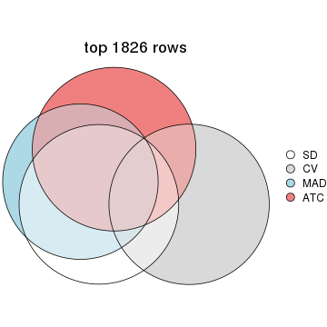</p>

</div>
<div id='tab-top-rows-overlap-by-euler-3'>
<pre><code class="r">top_rows_overlap(res_list, top_n = 2738, method = &quot;euler&quot;)
</code></pre>

<p></p>

</div>
<div id='tab-top-rows-overlap-by-euler-4'>
<pre><code class="r">top_rows_overlap(res_list, top_n = 3650, method = &quot;euler&quot;)
</code></pre>

<p></p>

</div>
<div id='tab-top-rows-overlap-by-euler-5'>
<pre><code class="r">top_rows_overlap(res_list, top_n = 4563, method = &quot;euler&quot;)
</code></pre>

<p></p>

</div>
</div>

Also visualize the correspondance of rankings between different top-row methods:


<script>
$( function() {
	$( '#tabs-top-rows-overlap-by-correspondance' ).tabs();
} );
</script>
<div id='tabs-top-rows-overlap-by-correspondance'>
<ul>
<li><a href='#tab-top-rows-overlap-by-correspondance-1'>top_n = 913</a></li>
<li><a href='#tab-top-rows-overlap-by-correspondance-2'>top_n = 1826</a></li>
<li><a href='#tab-top-rows-overlap-by-correspondance-3'>top_n = 2738</a></li>
<li><a href='#tab-top-rows-overlap-by-correspondance-4'>top_n = 3650</a></li>
<li><a href='#tab-top-rows-overlap-by-correspondance-5'>top_n = 4563</a></li>
</ul>
<div id='tab-top-rows-overlap-by-correspondance-1'>
<pre><code class="r">top_rows_overlap(res_list, top_n = 913, method = &quot;correspondance&quot;)
</code></pre>

<p>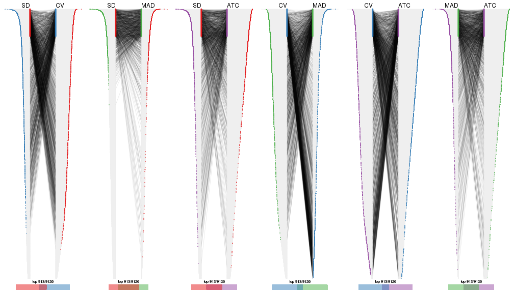</p>

</div>
<div id='tab-top-rows-overlap-by-correspondance-2'>
<pre><code class="r">top_rows_overlap(res_list, top_n = 1826, method = &quot;correspondance&quot;)
</code></pre>

<p></p>

</div>
<div id='tab-top-rows-overlap-by-correspondance-3'>
<pre><code class="r">top_rows_overlap(res_list, top_n = 2738, method = &quot;correspondance&quot;)
</code></pre>

<p></p>

</div>
<div id='tab-top-rows-overlap-by-correspondance-4'>
<pre><code class="r">top_rows_overlap(res_list, top_n = 3650, method = &quot;correspondance&quot;)
</code></pre>

<p></p>

</div>
<div id='tab-top-rows-overlap-by-correspondance-5'>
<pre><code class="r">top_rows_overlap(res_list, top_n = 4563, method = &quot;correspondance&quot;)
</code></pre>

<p></p>

</div>
</div>


Heatmaps of the top rows:


<script>
$( function() {
	$( '#tabs-top-rows-heatmap' ).tabs();
} );
</script>
<div id='tabs-top-rows-heatmap'>
<ul>
<li><a href='#tab-top-rows-heatmap-1'>top_n = 913</a></li>
<li><a href='#tab-top-rows-heatmap-2'>top_n = 1826</a></li>
<li><a href='#tab-top-rows-heatmap-3'>top_n = 2738</a></li>
<li><a href='#tab-top-rows-heatmap-4'>top_n = 3650</a></li>
<li><a href='#tab-top-rows-heatmap-5'>top_n = 4563</a></li>
</ul>
<div id='tab-top-rows-heatmap-1'>
<pre><code class="r">top_rows_heatmap(res_list, top_n = 913)
</code></pre>

<p></p>

</div>
<div id='tab-top-rows-heatmap-2'>
<pre><code class="r">top_rows_heatmap(res_list, top_n = 1826)
</code></pre>

<p></p>

</div>
<div id='tab-top-rows-heatmap-3'>
<pre><code class="r">top_rows_heatmap(res_list, top_n = 2738)
</code></pre>

<p></p>

</div>
<div id='tab-top-rows-heatmap-4'>
<pre><code class="r">top_rows_heatmap(res_list, top_n = 3650)
</code></pre>

<p></p>

</div>
<div id='tab-top-rows-heatmap-5'>
<pre><code class="r">top_rows_heatmap(res_list, top_n = 4563)
</code></pre>

<p></p>

</div>
</div>


 
## Results for each method


---------------------------------------------------


### SD:hclust**


The object with results only for a single top-value method and a single partition method 
can be extracted as:

```r
res = res_list["SD", "hclust"]
# you can also extract it by
# res = res_list["SD:hclust"]
```

A summary of `res` and all the functions that can be applied to it:

```r
res
```

```
#> A 'ConsensusPartition' object with k = 2, 3, 4, 5, 6.
#>   On a matrix with 9126 rows and 192 columns.
#>   Top rows (913, 1826, 2738, 3650, 4563) are extracted by 'SD' method.
#>   Subgroups are detected by 'hclust' method.
#>   Performed in total 1250 partitions by row resampling.
#>   Best k for subgroups seems to be 3.
#> 
#> Following methods can be applied to this 'ConsensusPartition' object:
#>  [1] "cola_report"             "collect_classes"         "collect_plots"          
#>  [4] "collect_stats"           "colnames"                "compare_signatures"     
#>  [7] "consensus_heatmap"       "dimension_reduction"     "functional_enrichment"  
#> [10] "get_anno_col"            "get_anno"                "get_classes"            
#> [13] "get_consensus"           "get_matrix"              "get_membership"         
#> [16] "get_param"               "get_signatures"          "get_stats"              
#> [19] "is_best_k"               "is_stable_k"             "membership_heatmap"     
#> [22] "ncol"                    "nrow"                    "plot_ecdf"              
#> [25] "rownames"                "select_partition_number" "show"                   
#> [28] "suggest_best_k"          "test_to_known_factors"
```

`collect_plots()` function collects all the plots made from `res` for all `k` (number of partitions)
into one single page to provide an easy and fast comparison between different `k`.

```r
collect_plots(res)
```


The plots are:

- The first row: a plot of the ECDF (empirical cumulative distribution
  function) curves of the consensus matrix for each `k` and the heatmap of
  predicted classes for each `k`.
- The second row: heatmaps of the consensus matrix for each `k`.
- The third row: heatmaps of the membership matrix for each `k`.
- The fouth row: heatmaps of the signatures for each `k`.

All the plots in panels can be made by individual functions and they are
plotted later in this section.

`select_partition_number()` produces several plots showing different
statistics for choosing "optimized" `k`. There are following statistics:

- ECDF curves of the consensus matrix for each `k`;
- 1-PAC. [The PAC
  score](https://en.wikipedia.org/wiki/Consensus_clustering#Over-interpretation_potential_of_consensus_clustering)
  measures the proportion of the ambiguous subgrouping.
- Mean silhouette score.
- Concordance. The mean probability of fiting the consensus class ids in all
  partitions.
- Area increased. Denote $A_k$ as the area under the ECDF curve for current
  `k`, the area increased is defined as $A_k - A_{k-1}$.
- Rand index. The percent of pairs of samples that are both in a same cluster
  or both are not in a same cluster in the partition of k and k-1.
- Jaccard index. The ratio of pairs of samples are both in a same cluster in
  the partition of k and k-1 and the pairs of samples are both in a same
  cluster in the partition k or k-1.

The detailed explanations of these statistics can be found in [the _cola_
vignette](http://bioconductor.org/packages/devel/bioc/vignettes/cola/inst/doc/cola.html#toc_13).

Generally speaking, lower PAC score, higher mean silhouette score or higher
concordance corresponds to better partition. Rand index and Jaccard index
measure how similar the current partition is compared to partition with `k-1`.
If they are too similar, we won't accept `k` is better than `k-1`.

```r
select_partition_number(res)
```


The numeric values for all these statistics can be obtained by `get_stats()`.

```r
get_stats(res)
```

```
#>   k 1-PAC mean_silhouette concordance area_increased  Rand Jaccard
#> 2 2 1.000           0.998       0.999         0.5006 0.500   0.500
#> 3 3 1.000           0.993       0.997         0.0520 0.973   0.946
#> 4 4 0.988           0.980       0.992         0.0288 0.984   0.965
#> 5 5 1.000           0.965       0.990         0.0067 1.000   1.000
#> 6 6 1.000           0.964       0.989         0.0176 0.984   0.965
```

`suggest_best_k()` suggests the best $k$ based on these statistics. The rules are as follows:

- All $k$ with Jaccard index larger than 0.95 are removed because increasing
  $k$ does not provide enough extra information. If all $k$ are removed, it is
  marked as no subgroup is detected.
- For all $k$ with 1-PAC score larger than 0.9, the maximal $k$ is taken as
  the best $k$, and other $k$ are marked as optional $k$.
- If it does not fit the second rule. The $k$ with the maximal vote of the
  highest 1-PAC score, highest mean silhouette, and highest concordance is
  taken as the best $k$.

```r
suggest_best_k(res)
```

```
#> [1] 3
#> attr(,"optional")
#> [1] 2
```

There is also optional best $k$ = 2 that is worth to check.

Following shows the table of the partitions (You need to click the **show/hide
code output** link to see it). The membership matrix (columns with name `p*`)
is inferred by
[`clue::cl_consensus()`](https://www.rdocumentation.org/link/cl_consensus?package=clue)
function with the `SE` method. Basically the value in the membership matrix
represents the probability to belong to a certain group. The finall class
label for an item is determined with the group with highest probability it
belongs to.

In `get_classes()` function, the entropy is calculated from the membership
matrix and the silhouette score is calculated from the consensus matrix.


<script>
$( function() {
	$( '#tabs-SD-hclust-get-classes' ).tabs();
} );
</script>
<div id='tabs-SD-hclust-get-classes'>
<ul>
<li><a href='#tab-SD-hclust-get-classes-1'>k = 2</a></li>
<li><a href='#tab-SD-hclust-get-classes-2'>k = 3</a></li>
<li><a href='#tab-SD-hclust-get-classes-3'>k = 4</a></li>
<li><a href='#tab-SD-hclust-get-classes-4'>k = 5</a></li>
<li><a href='#tab-SD-hclust-get-classes-5'>k = 6</a></li>
</ul>

<div id='tab-SD-hclust-get-classes-1'>
<p><a id='tab-SD-hclust-get-classes-1-a' style='color:#0366d6' href='#'>show/hide code output</a></p>
<pre><code class="r">cbind(get_classes(res, k = 2), get_membership(res, k = 2))
</code></pre>

<pre><code>#&gt;            class entropy silhouette    p1    p2
#&gt; SRR2074921     1  0.0000      1.000 1.000 0.000
#&gt; SRR2074919     1  0.0000      1.000 1.000 0.000
#&gt; SRR2074920     1  0.0000      1.000 1.000 0.000
#&gt; SRR2074917     1  0.0000      1.000 1.000 0.000
#&gt; SRR2074918     2  0.0000      0.998 0.000 1.000
#&gt; SRR2074916     2  0.0000      0.998 0.000 1.000
#&gt; SRR2074915     2  0.0000      0.998 0.000 1.000
#&gt; SRR2074914     1  0.0000      1.000 1.000 0.000
#&gt; SRR2074913     2  0.0000      0.998 0.000 1.000
#&gt; SRR2074912     1  0.0000      1.000 1.000 0.000
#&gt; SRR2074911     2  0.0000      0.998 0.000 1.000
#&gt; SRR2074910     2  0.0376      0.995 0.004 0.996
#&gt; SRR2074909     1  0.0000      1.000 1.000 0.000
#&gt; SRR2074907     1  0.0000      1.000 1.000 0.000
#&gt; SRR2074908     2  0.0000      0.998 0.000 1.000
#&gt; SRR2074906     2  0.0000      0.998 0.000 1.000
#&gt; SRR2074905     1  0.0000      1.000 1.000 0.000
#&gt; SRR2074904     2  0.0000      0.998 0.000 1.000
#&gt; SRR2074903     2  0.0000      0.998 0.000 1.000
#&gt; SRR2074902     1  0.0000      1.000 1.000 0.000
#&gt; SRR2074901     2  0.0000      0.998 0.000 1.000
#&gt; SRR2074900     1  0.0000      1.000 1.000 0.000
#&gt; SRR2074899     2  0.0000      0.998 0.000 1.000
#&gt; SRR2074898     2  0.0000      0.998 0.000 1.000
#&gt; SRR2074897     2  0.0000      0.998 0.000 1.000
#&gt; SRR2074896     2  0.0000      0.998 0.000 1.000
#&gt; SRR2074895     1  0.0000      1.000 1.000 0.000
#&gt; SRR2074894     2  0.3274      0.936 0.060 0.940
#&gt; SRR2074893     2  0.0000      0.998 0.000 1.000
#&gt; SRR2074892     1  0.0000      1.000 1.000 0.000
#&gt; SRR2074891     1  0.0000      1.000 1.000 0.000
#&gt; SRR2074890     2  0.0000      0.998 0.000 1.000
#&gt; SRR2074887     2  0.0000      0.998 0.000 1.000
#&gt; SRR2074889     2  0.0000      0.998 0.000 1.000
#&gt; SRR2074886     2  0.0000      0.998 0.000 1.000
#&gt; SRR2074888     2  0.0000      0.998 0.000 1.000
#&gt; SRR2074885     1  0.0000      1.000 1.000 0.000
#&gt; SRR2074884     2  0.0000      0.998 0.000 1.000
#&gt; SRR2074883     2  0.0000      0.998 0.000 1.000
#&gt; SRR2074882     1  0.0000      1.000 1.000 0.000
#&gt; SRR2074880     2  0.0000      0.998 0.000 1.000
#&gt; SRR2074881     2  0.0000      0.998 0.000 1.000
#&gt; SRR2074879     1  0.0000      1.000 1.000 0.000
#&gt; SRR2074878     1  0.0000      1.000 1.000 0.000
#&gt; SRR2074877     2  0.0000      0.998 0.000 1.000
#&gt; SRR2074876     1  0.0000      1.000 1.000 0.000
#&gt; SRR2074875     2  0.0000      0.998 0.000 1.000
#&gt; SRR2074874     1  0.0000      1.000 1.000 0.000
#&gt; SRR2074873     2  0.0000      0.998 0.000 1.000
#&gt; SRR2074872     1  0.0000      1.000 1.000 0.000
#&gt; SRR2074871     2  0.0000      0.998 0.000 1.000
#&gt; SRR2074870     1  0.0000      1.000 1.000 0.000
#&gt; SRR2074869     1  0.0000      1.000 1.000 0.000
#&gt; SRR2074868     1  0.0000      1.000 1.000 0.000
#&gt; SRR2074867     2  0.0000      0.998 0.000 1.000
#&gt; SRR2074866     2  0.0000      0.998 0.000 1.000
#&gt; SRR2074865     1  0.0000      1.000 1.000 0.000
#&gt; SRR2074864     1  0.0000      1.000 1.000 0.000
#&gt; SRR2074863     1  0.0000      1.000 1.000 0.000
#&gt; SRR2074862     1  0.0000      1.000 1.000 0.000
#&gt; SRR2074861     1  0.0000      1.000 1.000 0.000
#&gt; SRR2074860     1  0.0000      1.000 1.000 0.000
#&gt; SRR2074859     1  0.0000      1.000 1.000 0.000
#&gt; SRR2074858     2  0.0000      0.998 0.000 1.000
#&gt; SRR2074855     2  0.0000      0.998 0.000 1.000
#&gt; SRR2074857     1  0.0000      1.000 1.000 0.000
#&gt; SRR2074856     1  0.0000      1.000 1.000 0.000
#&gt; SRR2074854     1  0.0000      1.000 1.000 0.000
#&gt; SRR2074853     1  0.0000      1.000 1.000 0.000
#&gt; SRR2074852     2  0.0000      0.998 0.000 1.000
#&gt; SRR2074851     1  0.0000      1.000 1.000 0.000
#&gt; SRR2074850     1  0.0000      1.000 1.000 0.000
#&gt; SRR2074849     1  0.0000      1.000 1.000 0.000
#&gt; SRR2074848     1  0.0000      1.000 1.000 0.000
#&gt; SRR2074847     1  0.0000      1.000 1.000 0.000
#&gt; SRR2074846     1  0.0000      1.000 1.000 0.000
#&gt; SRR2074845     1  0.0000      1.000 1.000 0.000
#&gt; SRR2074843     1  0.0000      1.000 1.000 0.000
#&gt; SRR2074842     2  0.0000      0.998 0.000 1.000
#&gt; SRR2074844     2  0.0000      0.998 0.000 1.000
#&gt; SRR2074841     2  0.0000      0.998 0.000 1.000
#&gt; SRR2074840     2  0.0000      0.998 0.000 1.000
#&gt; SRR2074839     1  0.0000      1.000 1.000 0.000
#&gt; SRR2074838     2  0.0000      0.998 0.000 1.000
#&gt; SRR2074836     2  0.0000      0.998 0.000 1.000
#&gt; SRR2074835     2  0.0000      0.998 0.000 1.000
#&gt; SRR2074837     1  0.0000      1.000 1.000 0.000
#&gt; SRR2074834     2  0.0000      0.998 0.000 1.000
#&gt; SRR2074833     1  0.0000      1.000 1.000 0.000
#&gt; SRR2074832     2  0.0000      0.998 0.000 1.000
#&gt; SRR2074831     1  0.0000      1.000 1.000 0.000
#&gt; SRR2074829     1  0.0000      1.000 1.000 0.000
#&gt; SRR2074830     1  0.0000      1.000 1.000 0.000
#&gt; SRR2074828     1  0.0000      1.000 1.000 0.000
#&gt; SRR2074827     2  0.0000      0.998 0.000 1.000
#&gt; SRR2074826     2  0.0000      0.998 0.000 1.000
#&gt; SRR2074825     2  0.0000      0.998 0.000 1.000
#&gt; SRR2074824     2  0.0000      0.998 0.000 1.000
#&gt; SRR2074823     1  0.0000      1.000 1.000 0.000
#&gt; SRR2074822     2  0.0000      0.998 0.000 1.000
#&gt; SRR2074821     2  0.0000      0.998 0.000 1.000
#&gt; SRR2074820     2  0.0000      0.998 0.000 1.000
#&gt; SRR2074819     2  0.0000      0.998 0.000 1.000
#&gt; SRR2074817     2  0.0000      0.998 0.000 1.000
#&gt; SRR2074818     2  0.0000      0.998 0.000 1.000
#&gt; SRR2074816     1  0.0000      1.000 1.000 0.000
#&gt; SRR2074815     2  0.0000      0.998 0.000 1.000
#&gt; SRR2074814     1  0.0000      1.000 1.000 0.000
#&gt; SRR2074812     2  0.0000      0.998 0.000 1.000
#&gt; SRR2074813     2  0.0000      0.998 0.000 1.000
#&gt; SRR2074809     2  0.0000      0.998 0.000 1.000
#&gt; SRR2074810     2  0.0000      0.998 0.000 1.000
#&gt; SRR2074811     2  0.0000      0.998 0.000 1.000
#&gt; SRR2074808     2  0.0000      0.998 0.000 1.000
#&gt; SRR2074807     2  0.0000      0.998 0.000 1.000
#&gt; SRR2074806     1  0.0000      1.000 1.000 0.000
#&gt; SRR2074805     2  0.0000      0.998 0.000 1.000
#&gt; SRR2074804     1  0.0000      1.000 1.000 0.000
#&gt; SRR2074803     1  0.0000      1.000 1.000 0.000
#&gt; SRR2074801     1  0.0000      1.000 1.000 0.000
#&gt; SRR2074802     2  0.0000      0.998 0.000 1.000
#&gt; SRR2074799     2  0.0000      0.998 0.000 1.000
#&gt; SRR2074800     1  0.0000      1.000 1.000 0.000
#&gt; SRR2074798     1  0.0000      1.000 1.000 0.000
#&gt; SRR2074797     1  0.0000      1.000 1.000 0.000
#&gt; SRR2074795     2  0.0000      0.998 0.000 1.000
#&gt; SRR2074796     2  0.0000      0.998 0.000 1.000
#&gt; SRR2074794     2  0.0000      0.998 0.000 1.000
#&gt; SRR2074793     2  0.0000      0.998 0.000 1.000
#&gt; SRR2074792     1  0.0000      1.000 1.000 0.000
#&gt; SRR2074791     1  0.0000      1.000 1.000 0.000
#&gt; SRR2074790     2  0.0000      0.998 0.000 1.000
#&gt; SRR2074789     1  0.0000      1.000 1.000 0.000
#&gt; SRR2074788     1  0.0000      1.000 1.000 0.000
#&gt; SRR2074787     1  0.0000      1.000 1.000 0.000
#&gt; SRR2074786     2  0.0000      0.998 0.000 1.000
#&gt; SRR2074785     1  0.0000      1.000 1.000 0.000
#&gt; SRR2074784     1  0.0000      1.000 1.000 0.000
#&gt; SRR2074783     2  0.0000      0.998 0.000 1.000
#&gt; SRR2074782     1  0.0000      1.000 1.000 0.000
#&gt; SRR2074779     2  0.0000      0.998 0.000 1.000
#&gt; SRR2074781     2  0.0000      0.998 0.000 1.000
#&gt; SRR2074780     1  0.0000      1.000 1.000 0.000
#&gt; SRR2074778     2  0.0000      0.998 0.000 1.000
#&gt; SRR2074777     2  0.0000      0.998 0.000 1.000
#&gt; SRR2074776     2  0.0000      0.998 0.000 1.000
#&gt; SRR2074775     1  0.0000      1.000 1.000 0.000
#&gt; SRR2074774     1  0.0000      1.000 1.000 0.000
#&gt; SRR2074773     2  0.0000      0.998 0.000 1.000
#&gt; SRR2074771     2  0.0000      0.998 0.000 1.000
#&gt; SRR2074772     1  0.0000      1.000 1.000 0.000
#&gt; SRR2074770     1  0.0000      1.000 1.000 0.000
#&gt; SRR2074769     2  0.0000      0.998 0.000 1.000
#&gt; SRR2074768     2  0.0000      0.998 0.000 1.000
#&gt; SRR2074766     2  0.0000      0.998 0.000 1.000
#&gt; SRR2074767     1  0.0000      1.000 1.000 0.000
#&gt; SRR2074765     1  0.0000      1.000 1.000 0.000
#&gt; SRR2074764     2  0.0000      0.998 0.000 1.000
#&gt; SRR2074763     2  0.0000      0.998 0.000 1.000
#&gt; SRR2074761     1  0.0000      1.000 1.000 0.000
#&gt; SRR2074762     2  0.0000      0.998 0.000 1.000
#&gt; SRR2074760     2  0.0000      0.998 0.000 1.000
#&gt; SRR2074759     1  0.0000      1.000 1.000 0.000
#&gt; SRR2074757     2  0.0000      0.998 0.000 1.000
#&gt; SRR2074758     2  0.0000      0.998 0.000 1.000
#&gt; SRR2074756     2  0.0000      0.998 0.000 1.000
#&gt; SRR2074755     1  0.0000      1.000 1.000 0.000
#&gt; SRR2074754     1  0.0000      1.000 1.000 0.000
#&gt; SRR2074753     2  0.0000      0.998 0.000 1.000
#&gt; SRR2074752     1  0.0000      1.000 1.000 0.000
#&gt; SRR2074751     1  0.0000      1.000 1.000 0.000
#&gt; SRR2074749     2  0.0000      0.998 0.000 1.000
#&gt; SRR2074750     1  0.0000      1.000 1.000 0.000
#&gt; SRR2074748     1  0.0000      1.000 1.000 0.000
#&gt; SRR2074747     2  0.0000      0.998 0.000 1.000
#&gt; SRR2074745     1  0.0000      1.000 1.000 0.000
#&gt; SRR2074746     2  0.4815      0.885 0.104 0.896
#&gt; SRR2074744     2  0.0000      0.998 0.000 1.000
#&gt; SRR2074743     2  0.0000      0.998 0.000 1.000
#&gt; SRR2074742     2  0.0000      0.998 0.000 1.000
#&gt; SRR2074741     1  0.0000      1.000 1.000 0.000
#&gt; SRR2074740     2  0.0000      0.998 0.000 1.000
#&gt; SRR2074739     1  0.0000      1.000 1.000 0.000
#&gt; SRR2074738     2  0.0000      0.998 0.000 1.000
#&gt; SRR2074737     2  0.0000      0.998 0.000 1.000
#&gt; SRR2074736     2  0.0000      0.998 0.000 1.000
#&gt; SRR2074735     1  0.0000      1.000 1.000 0.000
#&gt; SRR2074734     2  0.0000      0.998 0.000 1.000
#&gt; SRR2074733     1  0.0000      1.000 1.000 0.000
#&gt; SRR2074732     2  0.0000      0.998 0.000 1.000
#&gt; SRR2074731     2  0.0000      0.998 0.000 1.000
#&gt; SRR2074730     1  0.0000      1.000 1.000 0.000
</code></pre>

<script>
$('#tab-SD-hclust-get-classes-1-a').parent().next().next().hide();
$('#tab-SD-hclust-get-classes-1-a').click(function(){
  $('#tab-SD-hclust-get-classes-1-a').parent().next().next().toggle();
  return(false);
});
</script>
</div>

<div id='tab-SD-hclust-get-classes-2'>
<p><a id='tab-SD-hclust-get-classes-2-a' style='color:#0366d6' href='#'>show/hide code output</a></p>
<pre><code class="r">cbind(get_classes(res, k = 3), get_membership(res, k = 3))
</code></pre>

<pre><code>#&gt;            class entropy silhouette    p1    p2    p3
#&gt; SRR2074921     3  0.0000      0.933 0.000 0.000 1.000
#&gt; SRR2074919     3  0.0237      0.936 0.004 0.000 0.996
#&gt; SRR2074920     3  0.0237      0.936 0.004 0.000 0.996
#&gt; SRR2074917     3  0.5678      0.542 0.316 0.000 0.684
#&gt; SRR2074918     2  0.0000      0.998 0.000 1.000 0.000
#&gt; SRR2074916     2  0.0000      0.998 0.000 1.000 0.000
#&gt; SRR2074915     2  0.0000      0.998 0.000 1.000 0.000
#&gt; SRR2074914     1  0.0000      0.999 1.000 0.000 0.000
#&gt; SRR2074913     2  0.0000      0.998 0.000 1.000 0.000
#&gt; SRR2074912     3  0.0237      0.936 0.004 0.000 0.996
#&gt; SRR2074911     2  0.0000      0.998 0.000 1.000 0.000
#&gt; SRR2074910     2  0.0237      0.993 0.004 0.996 0.000
#&gt; SRR2074909     1  0.0000      0.999 1.000 0.000 0.000
#&gt; SRR2074907     1  0.0000      0.999 1.000 0.000 0.000
#&gt; SRR2074908     2  0.0000      0.998 0.000 1.000 0.000
#&gt; SRR2074906     2  0.0000      0.998 0.000 1.000 0.000
#&gt; SRR2074905     1  0.0000      0.999 1.000 0.000 0.000
#&gt; SRR2074904     2  0.0000      0.998 0.000 1.000 0.000
#&gt; SRR2074903     2  0.0000      0.998 0.000 1.000 0.000
#&gt; SRR2074902     1  0.0000      0.999 1.000 0.000 0.000
#&gt; SRR2074901     2  0.0000      0.998 0.000 1.000 0.000
#&gt; SRR2074900     1  0.0000      0.999 1.000 0.000 0.000
#&gt; SRR2074899     2  0.0000      0.998 0.000 1.000 0.000
#&gt; SRR2074898     2  0.0000      0.998 0.000 1.000 0.000
#&gt; SRR2074897     2  0.0000      0.998 0.000 1.000 0.000
#&gt; SRR2074896     2  0.0000      0.998 0.000 1.000 0.000
#&gt; SRR2074895     1  0.0000      0.999 1.000 0.000 0.000
#&gt; SRR2074894     2  0.2066      0.918 0.060 0.940 0.000
#&gt; SRR2074893     2  0.0000      0.998 0.000 1.000 0.000
#&gt; SRR2074892     1  0.0000      0.999 1.000 0.000 0.000
#&gt; SRR2074891     1  0.0000      0.999 1.000 0.000 0.000
#&gt; SRR2074890     2  0.0000      0.998 0.000 1.000 0.000
#&gt; SRR2074887     2  0.0000      0.998 0.000 1.000 0.000
#&gt; SRR2074889     2  0.0000      0.998 0.000 1.000 0.000
#&gt; SRR2074886     2  0.0000      0.998 0.000 1.000 0.000
#&gt; SRR2074888     2  0.0000      0.998 0.000 1.000 0.000
#&gt; SRR2074885     1  0.0000      0.999 1.000 0.000 0.000
#&gt; SRR2074884     2  0.0000      0.998 0.000 1.000 0.000
#&gt; SRR2074883     2  0.0000      0.998 0.000 1.000 0.000
#&gt; SRR2074882     1  0.0000      0.999 1.000 0.000 0.000
#&gt; SRR2074880     2  0.0000      0.998 0.000 1.000 0.000
#&gt; SRR2074881     2  0.0000      0.998 0.000 1.000 0.000
#&gt; SRR2074879     3  0.0237      0.936 0.004 0.000 0.996
#&gt; SRR2074878     1  0.0000      0.999 1.000 0.000 0.000
#&gt; SRR2074877     2  0.0000      0.998 0.000 1.000 0.000
#&gt; SRR2074876     1  0.0000      0.999 1.000 0.000 0.000
#&gt; SRR2074875     2  0.0000      0.998 0.000 1.000 0.000
#&gt; SRR2074874     1  0.0000      0.999 1.000 0.000 0.000
#&gt; SRR2074873     2  0.0000      0.998 0.000 1.000 0.000
#&gt; SRR2074872     1  0.0000      0.999 1.000 0.000 0.000
#&gt; SRR2074871     2  0.0000      0.998 0.000 1.000 0.000
#&gt; SRR2074870     1  0.0000      0.999 1.000 0.000 0.000
#&gt; SRR2074869     1  0.0000      0.999 1.000 0.000 0.000
#&gt; SRR2074868     1  0.0000      0.999 1.000 0.000 0.000
#&gt; SRR2074867     2  0.0000      0.998 0.000 1.000 0.000
#&gt; SRR2074866     2  0.0000      0.998 0.000 1.000 0.000
#&gt; SRR2074865     1  0.0000      0.999 1.000 0.000 0.000
#&gt; SRR2074864     1  0.0000      0.999 1.000 0.000 0.000
#&gt; SRR2074863     1  0.0000      0.999 1.000 0.000 0.000
#&gt; SRR2074862     1  0.0000      0.999 1.000 0.000 0.000
#&gt; SRR2074861     1  0.0000      0.999 1.000 0.000 0.000
#&gt; SRR2074860     1  0.1964      0.936 0.944 0.000 0.056
#&gt; SRR2074859     1  0.0000      0.999 1.000 0.000 0.000
#&gt; SRR2074858     2  0.0000      0.998 0.000 1.000 0.000
#&gt; SRR2074855     2  0.0000      0.998 0.000 1.000 0.000
#&gt; SRR2074857     1  0.0000      0.999 1.000 0.000 0.000
#&gt; SRR2074856     1  0.0000      0.999 1.000 0.000 0.000
#&gt; SRR2074854     1  0.0000      0.999 1.000 0.000 0.000
#&gt; SRR2074853     1  0.0000      0.999 1.000 0.000 0.000
#&gt; SRR2074852     2  0.0000      0.998 0.000 1.000 0.000
#&gt; SRR2074851     1  0.0000      0.999 1.000 0.000 0.000
#&gt; SRR2074850     1  0.0000      0.999 1.000 0.000 0.000
#&gt; SRR2074849     1  0.0000      0.999 1.000 0.000 0.000
#&gt; SRR2074848     1  0.0000      0.999 1.000 0.000 0.000
#&gt; SRR2074847     1  0.0000      0.999 1.000 0.000 0.000
#&gt; SRR2074846     1  0.0000      0.999 1.000 0.000 0.000
#&gt; SRR2074845     1  0.0000      0.999 1.000 0.000 0.000
#&gt; SRR2074843     1  0.0000      0.999 1.000 0.000 0.000
#&gt; SRR2074842     2  0.0000      0.998 0.000 1.000 0.000
#&gt; SRR2074844     2  0.0000      0.998 0.000 1.000 0.000
#&gt; SRR2074841     2  0.0000      0.998 0.000 1.000 0.000
#&gt; SRR2074840     2  0.0000      0.998 0.000 1.000 0.000
#&gt; SRR2074839     1  0.0000      0.999 1.000 0.000 0.000
#&gt; SRR2074838     2  0.0000      0.998 0.000 1.000 0.000
#&gt; SRR2074836     2  0.0000      0.998 0.000 1.000 0.000
#&gt; SRR2074835     2  0.0000      0.998 0.000 1.000 0.000
#&gt; SRR2074837     1  0.0000      0.999 1.000 0.000 0.000
#&gt; SRR2074834     2  0.0000      0.998 0.000 1.000 0.000
#&gt; SRR2074833     1  0.0000      0.999 1.000 0.000 0.000
#&gt; SRR2074832     2  0.0000      0.998 0.000 1.000 0.000
#&gt; SRR2074831     1  0.0000      0.999 1.000 0.000 0.000
#&gt; SRR2074829     1  0.0000      0.999 1.000 0.000 0.000
#&gt; SRR2074830     1  0.0000      0.999 1.000 0.000 0.000
#&gt; SRR2074828     1  0.0000      0.999 1.000 0.000 0.000
#&gt; SRR2074827     2  0.0000      0.998 0.000 1.000 0.000
#&gt; SRR2074826     2  0.0000      0.998 0.000 1.000 0.000
#&gt; SRR2074825     2  0.0000      0.998 0.000 1.000 0.000
#&gt; SRR2074824     2  0.0000      0.998 0.000 1.000 0.000
#&gt; SRR2074823     1  0.0000      0.999 1.000 0.000 0.000
#&gt; SRR2074822     2  0.0000      0.998 0.000 1.000 0.000
#&gt; SRR2074821     2  0.0000      0.998 0.000 1.000 0.000
#&gt; SRR2074820     2  0.0000      0.998 0.000 1.000 0.000
#&gt; SRR2074819     2  0.0000      0.998 0.000 1.000 0.000
#&gt; SRR2074817     2  0.0000      0.998 0.000 1.000 0.000
#&gt; SRR2074818     2  0.0000      0.998 0.000 1.000 0.000
#&gt; SRR2074816     1  0.0000      0.999 1.000 0.000 0.000
#&gt; SRR2074815     2  0.0000      0.998 0.000 1.000 0.000
#&gt; SRR2074814     1  0.0000      0.999 1.000 0.000 0.000
#&gt; SRR2074812     2  0.0000      0.998 0.000 1.000 0.000
#&gt; SRR2074813     2  0.0000      0.998 0.000 1.000 0.000
#&gt; SRR2074809     2  0.0000      0.998 0.000 1.000 0.000
#&gt; SRR2074810     2  0.0000      0.998 0.000 1.000 0.000
#&gt; SRR2074811     2  0.0000      0.998 0.000 1.000 0.000
#&gt; SRR2074808     2  0.0000      0.998 0.000 1.000 0.000
#&gt; SRR2074807     2  0.0000      0.998 0.000 1.000 0.000
#&gt; SRR2074806     1  0.0000      0.999 1.000 0.000 0.000
#&gt; SRR2074805     2  0.0000      0.998 0.000 1.000 0.000
#&gt; SRR2074804     1  0.0000      0.999 1.000 0.000 0.000
#&gt; SRR2074803     1  0.0000      0.999 1.000 0.000 0.000
#&gt; SRR2074801     1  0.0000      0.999 1.000 0.000 0.000
#&gt; SRR2074802     2  0.0000      0.998 0.000 1.000 0.000
#&gt; SRR2074799     2  0.0000      0.998 0.000 1.000 0.000
#&gt; SRR2074800     1  0.0000      0.999 1.000 0.000 0.000
#&gt; SRR2074798     1  0.0000      0.999 1.000 0.000 0.000
#&gt; SRR2074797     1  0.0000      0.999 1.000 0.000 0.000
#&gt; SRR2074795     2  0.0000      0.998 0.000 1.000 0.000
#&gt; SRR2074796     2  0.0000      0.998 0.000 1.000 0.000
#&gt; SRR2074794     2  0.0000      0.998 0.000 1.000 0.000
#&gt; SRR2074793     2  0.0000      0.998 0.000 1.000 0.000
#&gt; SRR2074792     1  0.0000      0.999 1.000 0.000 0.000
#&gt; SRR2074791     1  0.0000      0.999 1.000 0.000 0.000
#&gt; SRR2074790     2  0.0000      0.998 0.000 1.000 0.000
#&gt; SRR2074789     1  0.0000      0.999 1.000 0.000 0.000
#&gt; SRR2074788     1  0.0000      0.999 1.000 0.000 0.000
#&gt; SRR2074787     1  0.0000      0.999 1.000 0.000 0.000
#&gt; SRR2074786     2  0.0000      0.998 0.000 1.000 0.000
#&gt; SRR2074785     1  0.0000      0.999 1.000 0.000 0.000
#&gt; SRR2074784     1  0.0000      0.999 1.000 0.000 0.000
#&gt; SRR2074783     2  0.0000      0.998 0.000 1.000 0.000
#&gt; SRR2074782     1  0.0000      0.999 1.000 0.000 0.000
#&gt; SRR2074779     2  0.0000      0.998 0.000 1.000 0.000
#&gt; SRR2074781     2  0.0000      0.998 0.000 1.000 0.000
#&gt; SRR2074780     1  0.0000      0.999 1.000 0.000 0.000
#&gt; SRR2074778     2  0.0000      0.998 0.000 1.000 0.000
#&gt; SRR2074777     2  0.0000      0.998 0.000 1.000 0.000
#&gt; SRR2074776     2  0.0000      0.998 0.000 1.000 0.000
#&gt; SRR2074775     1  0.0000      0.999 1.000 0.000 0.000
#&gt; SRR2074774     1  0.0000      0.999 1.000 0.000 0.000
#&gt; SRR2074773     2  0.0000      0.998 0.000 1.000 0.000
#&gt; SRR2074771     2  0.0000      0.998 0.000 1.000 0.000
#&gt; SRR2074772     1  0.0000      0.999 1.000 0.000 0.000
#&gt; SRR2074770     1  0.0000      0.999 1.000 0.000 0.000
#&gt; SRR2074769     2  0.0000      0.998 0.000 1.000 0.000
#&gt; SRR2074768     2  0.0000      0.998 0.000 1.000 0.000
#&gt; SRR2074766     2  0.0000      0.998 0.000 1.000 0.000
#&gt; SRR2074767     1  0.0000      0.999 1.000 0.000 0.000
#&gt; SRR2074765     1  0.0000      0.999 1.000 0.000 0.000
#&gt; SRR2074764     2  0.0000      0.998 0.000 1.000 0.000
#&gt; SRR2074763     2  0.0000      0.998 0.000 1.000 0.000
#&gt; SRR2074761     1  0.0000      0.999 1.000 0.000 0.000
#&gt; SRR2074762     2  0.0000      0.998 0.000 1.000 0.000
#&gt; SRR2074760     2  0.0000      0.998 0.000 1.000 0.000
#&gt; SRR2074759     1  0.0000      0.999 1.000 0.000 0.000
#&gt; SRR2074757     2  0.0000      0.998 0.000 1.000 0.000
#&gt; SRR2074758     2  0.0000      0.998 0.000 1.000 0.000
#&gt; SRR2074756     2  0.0000      0.998 0.000 1.000 0.000
#&gt; SRR2074755     1  0.0000      0.999 1.000 0.000 0.000
#&gt; SRR2074754     1  0.0000      0.999 1.000 0.000 0.000
#&gt; SRR2074753     2  0.0000      0.998 0.000 1.000 0.000
#&gt; SRR2074752     1  0.0000      0.999 1.000 0.000 0.000
#&gt; SRR2074751     1  0.0000      0.999 1.000 0.000 0.000
#&gt; SRR2074749     2  0.0000      0.998 0.000 1.000 0.000
#&gt; SRR2074750     1  0.0000      0.999 1.000 0.000 0.000
#&gt; SRR2074748     1  0.0000      0.999 1.000 0.000 0.000
#&gt; SRR2074747     2  0.0000      0.998 0.000 1.000 0.000
#&gt; SRR2074745     1  0.0000      0.999 1.000 0.000 0.000
#&gt; SRR2074746     2  0.3038      0.852 0.104 0.896 0.000
#&gt; SRR2074744     2  0.0000      0.998 0.000 1.000 0.000
#&gt; SRR2074743     2  0.0000      0.998 0.000 1.000 0.000
#&gt; SRR2074742     2  0.0000      0.998 0.000 1.000 0.000
#&gt; SRR2074741     1  0.0000      0.999 1.000 0.000 0.000
#&gt; SRR2074740     2  0.0000      0.998 0.000 1.000 0.000
#&gt; SRR2074739     1  0.0000      0.999 1.000 0.000 0.000
#&gt; SRR2074738     2  0.0000      0.998 0.000 1.000 0.000
#&gt; SRR2074737     2  0.0000      0.998 0.000 1.000 0.000
#&gt; SRR2074736     2  0.0000      0.998 0.000 1.000 0.000
#&gt; SRR2074735     1  0.0000      0.999 1.000 0.000 0.000
#&gt; SRR2074734     2  0.0000      0.998 0.000 1.000 0.000
#&gt; SRR2074733     1  0.0000      0.999 1.000 0.000 0.000
#&gt; SRR2074732     2  0.0000      0.998 0.000 1.000 0.000
#&gt; SRR2074731     2  0.0000      0.998 0.000 1.000 0.000
#&gt; SRR2074730     1  0.0000      0.999 1.000 0.000 0.000
</code></pre>

<script>
$('#tab-SD-hclust-get-classes-2-a').parent().next().next().hide();
$('#tab-SD-hclust-get-classes-2-a').click(function(){
  $('#tab-SD-hclust-get-classes-2-a').parent().next().next().toggle();
  return(false);
});
</script>
</div>

<div id='tab-SD-hclust-get-classes-3'>
<p><a id='tab-SD-hclust-get-classes-3-a' style='color:#0366d6' href='#'>show/hide code output</a></p>
<pre><code class="r">cbind(get_classes(res, k = 4), get_membership(res, k = 4))
</code></pre>

<pre><code>#&gt;            class entropy silhouette    p1    p2    p3    p4
#&gt; SRR2074921     3   0.121      0.810 0.000 0.000 0.960 0.040
#&gt; SRR2074919     3   0.000      0.828 0.000 0.000 1.000 0.000
#&gt; SRR2074920     3   0.000      0.828 0.000 0.000 1.000 0.000
#&gt; SRR2074917     3   0.448      0.317 0.312 0.000 0.688 0.000
#&gt; SRR2074918     4   0.331      0.841 0.000 0.172 0.000 0.828
#&gt; SRR2074916     2   0.000      0.993 0.000 1.000 0.000 0.000
#&gt; SRR2074915     2   0.000      0.993 0.000 1.000 0.000 0.000
#&gt; SRR2074914     1   0.000      0.999 1.000 0.000 0.000 0.000
#&gt; SRR2074913     2   0.000      0.993 0.000 1.000 0.000 0.000
#&gt; SRR2074912     3   0.000      0.828 0.000 0.000 1.000 0.000
#&gt; SRR2074911     4   0.428      0.731 0.000 0.280 0.000 0.720
#&gt; SRR2074910     2   0.281      0.805 0.000 0.868 0.000 0.132
#&gt; SRR2074909     1   0.000      0.999 1.000 0.000 0.000 0.000
#&gt; SRR2074907     1   0.000      0.999 1.000 0.000 0.000 0.000
#&gt; SRR2074908     2   0.000      0.993 0.000 1.000 0.000 0.000
#&gt; SRR2074906     2   0.000      0.993 0.000 1.000 0.000 0.000
#&gt; SRR2074905     1   0.000      0.999 1.000 0.000 0.000 0.000
#&gt; SRR2074904     2   0.000      0.993 0.000 1.000 0.000 0.000
#&gt; SRR2074903     2   0.000      0.993 0.000 1.000 0.000 0.000
#&gt; SRR2074902     1   0.000      0.999 1.000 0.000 0.000 0.000
#&gt; SRR2074901     2   0.000      0.993 0.000 1.000 0.000 0.000
#&gt; SRR2074900     1   0.000      0.999 1.000 0.000 0.000 0.000
#&gt; SRR2074899     2   0.000      0.993 0.000 1.000 0.000 0.000
#&gt; SRR2074898     2   0.000      0.993 0.000 1.000 0.000 0.000
#&gt; SRR2074897     2   0.000      0.993 0.000 1.000 0.000 0.000
#&gt; SRR2074896     2   0.000      0.993 0.000 1.000 0.000 0.000
#&gt; SRR2074895     1   0.000      0.999 1.000 0.000 0.000 0.000
#&gt; SRR2074894     2   0.431      0.697 0.056 0.812 0.000 0.132
#&gt; SRR2074893     2   0.000      0.993 0.000 1.000 0.000 0.000
#&gt; SRR2074892     1   0.000      0.999 1.000 0.000 0.000 0.000
#&gt; SRR2074891     1   0.000      0.999 1.000 0.000 0.000 0.000
#&gt; SRR2074890     2   0.000      0.993 0.000 1.000 0.000 0.000
#&gt; SRR2074887     2   0.000      0.993 0.000 1.000 0.000 0.000
#&gt; SRR2074889     2   0.000      0.993 0.000 1.000 0.000 0.000
#&gt; SRR2074886     2   0.000      0.993 0.000 1.000 0.000 0.000
#&gt; SRR2074888     2   0.000      0.993 0.000 1.000 0.000 0.000
#&gt; SRR2074885     1   0.000      0.999 1.000 0.000 0.000 0.000
#&gt; SRR2074884     2   0.000      0.993 0.000 1.000 0.000 0.000
#&gt; SRR2074883     2   0.000      0.993 0.000 1.000 0.000 0.000
#&gt; SRR2074882     1   0.000      0.999 1.000 0.000 0.000 0.000
#&gt; SRR2074880     2   0.000      0.993 0.000 1.000 0.000 0.000
#&gt; SRR2074881     2   0.000      0.993 0.000 1.000 0.000 0.000
#&gt; SRR2074879     3   0.000      0.828 0.000 0.000 1.000 0.000
#&gt; SRR2074878     1   0.000      0.999 1.000 0.000 0.000 0.000
#&gt; SRR2074877     2   0.000      0.993 0.000 1.000 0.000 0.000
#&gt; SRR2074876     1   0.000      0.999 1.000 0.000 0.000 0.000
#&gt; SRR2074875     2   0.000      0.993 0.000 1.000 0.000 0.000
#&gt; SRR2074874     1   0.000      0.999 1.000 0.000 0.000 0.000
#&gt; SRR2074873     2   0.000      0.993 0.000 1.000 0.000 0.000
#&gt; SRR2074872     1   0.000      0.999 1.000 0.000 0.000 0.000
#&gt; SRR2074871     2   0.000      0.993 0.000 1.000 0.000 0.000
#&gt; SRR2074870     1   0.000      0.999 1.000 0.000 0.000 0.000
#&gt; SRR2074869     1   0.000      0.999 1.000 0.000 0.000 0.000
#&gt; SRR2074868     1   0.000      0.999 1.000 0.000 0.000 0.000
#&gt; SRR2074867     2   0.000      0.993 0.000 1.000 0.000 0.000
#&gt; SRR2074866     2   0.000      0.993 0.000 1.000 0.000 0.000
#&gt; SRR2074865     1   0.000      0.999 1.000 0.000 0.000 0.000
#&gt; SRR2074864     1   0.000      0.999 1.000 0.000 0.000 0.000
#&gt; SRR2074863     1   0.000      0.999 1.000 0.000 0.000 0.000
#&gt; SRR2074862     1   0.000      0.999 1.000 0.000 0.000 0.000
#&gt; SRR2074861     1   0.000      0.999 1.000 0.000 0.000 0.000
#&gt; SRR2074860     1   0.156      0.936 0.944 0.000 0.056 0.000
#&gt; SRR2074859     1   0.000      0.999 1.000 0.000 0.000 0.000
#&gt; SRR2074858     2   0.000      0.993 0.000 1.000 0.000 0.000
#&gt; SRR2074855     2   0.000      0.993 0.000 1.000 0.000 0.000
#&gt; SRR2074857     1   0.000      0.999 1.000 0.000 0.000 0.000
#&gt; SRR2074856     1   0.000      0.999 1.000 0.000 0.000 0.000
#&gt; SRR2074854     1   0.000      0.999 1.000 0.000 0.000 0.000
#&gt; SRR2074853     1   0.000      0.999 1.000 0.000 0.000 0.000
#&gt; SRR2074852     2   0.000      0.993 0.000 1.000 0.000 0.000
#&gt; SRR2074851     1   0.000      0.999 1.000 0.000 0.000 0.000
#&gt; SRR2074850     1   0.000      0.999 1.000 0.000 0.000 0.000
#&gt; SRR2074849     1   0.000      0.999 1.000 0.000 0.000 0.000
#&gt; SRR2074848     1   0.000      0.999 1.000 0.000 0.000 0.000
#&gt; SRR2074847     1   0.000      0.999 1.000 0.000 0.000 0.000
#&gt; SRR2074846     1   0.000      0.999 1.000 0.000 0.000 0.000
#&gt; SRR2074845     1   0.000      0.999 1.000 0.000 0.000 0.000
#&gt; SRR2074843     1   0.000      0.999 1.000 0.000 0.000 0.000
#&gt; SRR2074842     2   0.000      0.993 0.000 1.000 0.000 0.000
#&gt; SRR2074844     2   0.000      0.993 0.000 1.000 0.000 0.000
#&gt; SRR2074841     2   0.000      0.993 0.000 1.000 0.000 0.000
#&gt; SRR2074840     2   0.000      0.993 0.000 1.000 0.000 0.000
#&gt; SRR2074839     1   0.000      0.999 1.000 0.000 0.000 0.000
#&gt; SRR2074838     2   0.000      0.993 0.000 1.000 0.000 0.000
#&gt; SRR2074836     2   0.000      0.993 0.000 1.000 0.000 0.000
#&gt; SRR2074835     2   0.000      0.993 0.000 1.000 0.000 0.000
#&gt; SRR2074837     1   0.000      0.999 1.000 0.000 0.000 0.000
#&gt; SRR2074834     2   0.000      0.993 0.000 1.000 0.000 0.000
#&gt; SRR2074833     1   0.000      0.999 1.000 0.000 0.000 0.000
#&gt; SRR2074832     2   0.000      0.993 0.000 1.000 0.000 0.000
#&gt; SRR2074831     1   0.000      0.999 1.000 0.000 0.000 0.000
#&gt; SRR2074829     1   0.000      0.999 1.000 0.000 0.000 0.000
#&gt; SRR2074830     1   0.000      0.999 1.000 0.000 0.000 0.000
#&gt; SRR2074828     1   0.000      0.999 1.000 0.000 0.000 0.000
#&gt; SRR2074827     2   0.000      0.993 0.000 1.000 0.000 0.000
#&gt; SRR2074826     2   0.000      0.993 0.000 1.000 0.000 0.000
#&gt; SRR2074825     2   0.000      0.993 0.000 1.000 0.000 0.000
#&gt; SRR2074824     2   0.000      0.993 0.000 1.000 0.000 0.000
#&gt; SRR2074823     1   0.000      0.999 1.000 0.000 0.000 0.000
#&gt; SRR2074822     2   0.000      0.993 0.000 1.000 0.000 0.000
#&gt; SRR2074821     2   0.000      0.993 0.000 1.000 0.000 0.000
#&gt; SRR2074820     2   0.000      0.993 0.000 1.000 0.000 0.000
#&gt; SRR2074819     2   0.000      0.993 0.000 1.000 0.000 0.000
#&gt; SRR2074817     2   0.000      0.993 0.000 1.000 0.000 0.000
#&gt; SRR2074818     2   0.000      0.993 0.000 1.000 0.000 0.000
#&gt; SRR2074816     1   0.000      0.999 1.000 0.000 0.000 0.000
#&gt; SRR2074815     2   0.000      0.993 0.000 1.000 0.000 0.000
#&gt; SRR2074814     1   0.000      0.999 1.000 0.000 0.000 0.000
#&gt; SRR2074812     2   0.000      0.993 0.000 1.000 0.000 0.000
#&gt; SRR2074813     2   0.000      0.993 0.000 1.000 0.000 0.000
#&gt; SRR2074809     2   0.000      0.993 0.000 1.000 0.000 0.000
#&gt; SRR2074810     2   0.000      0.993 0.000 1.000 0.000 0.000
#&gt; SRR2074811     2   0.000      0.993 0.000 1.000 0.000 0.000
#&gt; SRR2074808     2   0.000      0.993 0.000 1.000 0.000 0.000
#&gt; SRR2074807     2   0.000      0.993 0.000 1.000 0.000 0.000
#&gt; SRR2074806     1   0.000      0.999 1.000 0.000 0.000 0.000
#&gt; SRR2074805     2   0.000      0.993 0.000 1.000 0.000 0.000
#&gt; SRR2074804     1   0.000      0.999 1.000 0.000 0.000 0.000
#&gt; SRR2074803     1   0.000      0.999 1.000 0.000 0.000 0.000
#&gt; SRR2074801     1   0.000      0.999 1.000 0.000 0.000 0.000
#&gt; SRR2074802     2   0.000      0.993 0.000 1.000 0.000 0.000
#&gt; SRR2074799     2   0.000      0.993 0.000 1.000 0.000 0.000
#&gt; SRR2074800     1   0.000      0.999 1.000 0.000 0.000 0.000
#&gt; SRR2074798     1   0.000      0.999 1.000 0.000 0.000 0.000
#&gt; SRR2074797     1   0.000      0.999 1.000 0.000 0.000 0.000
#&gt; SRR2074795     2   0.000      0.993 0.000 1.000 0.000 0.000
#&gt; SRR2074796     2   0.000      0.993 0.000 1.000 0.000 0.000
#&gt; SRR2074794     2   0.000      0.993 0.000 1.000 0.000 0.000
#&gt; SRR2074793     2   0.000      0.993 0.000 1.000 0.000 0.000
#&gt; SRR2074792     1   0.000      0.999 1.000 0.000 0.000 0.000
#&gt; SRR2074791     1   0.000      0.999 1.000 0.000 0.000 0.000
#&gt; SRR2074790     2   0.000      0.993 0.000 1.000 0.000 0.000
#&gt; SRR2074789     1   0.000      0.999 1.000 0.000 0.000 0.000
#&gt; SRR2074788     1   0.000      0.999 1.000 0.000 0.000 0.000
#&gt; SRR2074787     1   0.000      0.999 1.000 0.000 0.000 0.000
#&gt; SRR2074786     2   0.000      0.993 0.000 1.000 0.000 0.000
#&gt; SRR2074785     1   0.000      0.999 1.000 0.000 0.000 0.000
#&gt; SRR2074784     1   0.000      0.999 1.000 0.000 0.000 0.000
#&gt; SRR2074783     2   0.000      0.993 0.000 1.000 0.000 0.000
#&gt; SRR2074782     1   0.000      0.999 1.000 0.000 0.000 0.000
#&gt; SRR2074779     2   0.000      0.993 0.000 1.000 0.000 0.000
#&gt; SRR2074781     2   0.000      0.993 0.000 1.000 0.000 0.000
#&gt; SRR2074780     1   0.000      0.999 1.000 0.000 0.000 0.000
#&gt; SRR2074778     2   0.000      0.993 0.000 1.000 0.000 0.000
#&gt; SRR2074777     2   0.000      0.993 0.000 1.000 0.000 0.000
#&gt; SRR2074776     2   0.000      0.993 0.000 1.000 0.000 0.000
#&gt; SRR2074775     1   0.000      0.999 1.000 0.000 0.000 0.000
#&gt; SRR2074774     1   0.000      0.999 1.000 0.000 0.000 0.000
#&gt; SRR2074773     2   0.000      0.993 0.000 1.000 0.000 0.000
#&gt; SRR2074771     2   0.000      0.993 0.000 1.000 0.000 0.000
#&gt; SRR2074772     1   0.000      0.999 1.000 0.000 0.000 0.000
#&gt; SRR2074770     1   0.000      0.999 1.000 0.000 0.000 0.000
#&gt; SRR2074769     2   0.000      0.993 0.000 1.000 0.000 0.000
#&gt; SRR2074768     2   0.000      0.993 0.000 1.000 0.000 0.000
#&gt; SRR2074766     2   0.000      0.993 0.000 1.000 0.000 0.000
#&gt; SRR2074767     1   0.000      0.999 1.000 0.000 0.000 0.000
#&gt; SRR2074765     1   0.000      0.999 1.000 0.000 0.000 0.000
#&gt; SRR2074764     2   0.000      0.993 0.000 1.000 0.000 0.000
#&gt; SRR2074763     2   0.000      0.993 0.000 1.000 0.000 0.000
#&gt; SRR2074761     1   0.000      0.999 1.000 0.000 0.000 0.000
#&gt; SRR2074762     2   0.000      0.993 0.000 1.000 0.000 0.000
#&gt; SRR2074760     2   0.000      0.993 0.000 1.000 0.000 0.000
#&gt; SRR2074759     1   0.000      0.999 1.000 0.000 0.000 0.000
#&gt; SRR2074757     2   0.000      0.993 0.000 1.000 0.000 0.000
#&gt; SRR2074758     2   0.000      0.993 0.000 1.000 0.000 0.000
#&gt; SRR2074756     2   0.000      0.993 0.000 1.000 0.000 0.000
#&gt; SRR2074755     1   0.000      0.999 1.000 0.000 0.000 0.000
#&gt; SRR2074754     1   0.000      0.999 1.000 0.000 0.000 0.000
#&gt; SRR2074753     2   0.000      0.993 0.000 1.000 0.000 0.000
#&gt; SRR2074752     1   0.000      0.999 1.000 0.000 0.000 0.000
#&gt; SRR2074751     1   0.000      0.999 1.000 0.000 0.000 0.000
#&gt; SRR2074749     2   0.000      0.993 0.000 1.000 0.000 0.000
#&gt; SRR2074750     1   0.000      0.999 1.000 0.000 0.000 0.000
#&gt; SRR2074748     1   0.000      0.999 1.000 0.000 0.000 0.000
#&gt; SRR2074747     2   0.000      0.993 0.000 1.000 0.000 0.000
#&gt; SRR2074745     1   0.000      0.999 1.000 0.000 0.000 0.000
#&gt; SRR2074746     2   0.505      0.590 0.100 0.768 0.000 0.132
#&gt; SRR2074744     2   0.000      0.993 0.000 1.000 0.000 0.000
#&gt; SRR2074743     2   0.000      0.993 0.000 1.000 0.000 0.000
#&gt; SRR2074742     4   0.331      0.841 0.000 0.172 0.000 0.828
#&gt; SRR2074741     1   0.000      0.999 1.000 0.000 0.000 0.000
#&gt; SRR2074740     2   0.000      0.993 0.000 1.000 0.000 0.000
#&gt; SRR2074739     1   0.000      0.999 1.000 0.000 0.000 0.000
#&gt; SRR2074738     2   0.000      0.993 0.000 1.000 0.000 0.000
#&gt; SRR2074737     2   0.000      0.993 0.000 1.000 0.000 0.000
#&gt; SRR2074736     2   0.000      0.993 0.000 1.000 0.000 0.000
#&gt; SRR2074735     1   0.000      0.999 1.000 0.000 0.000 0.000
#&gt; SRR2074734     2   0.000      0.993 0.000 1.000 0.000 0.000
#&gt; SRR2074733     1   0.000      0.999 1.000 0.000 0.000 0.000
#&gt; SRR2074732     2   0.000      0.993 0.000 1.000 0.000 0.000
#&gt; SRR2074731     2   0.000      0.993 0.000 1.000 0.000 0.000
#&gt; SRR2074730     1   0.000      0.999 1.000 0.000 0.000 0.000
</code></pre>

<script>
$('#tab-SD-hclust-get-classes-3-a').parent().next().next().hide();
$('#tab-SD-hclust-get-classes-3-a').click(function(){
  $('#tab-SD-hclust-get-classes-3-a').parent().next().next().toggle();
  return(false);
});
</script>
</div>

<div id='tab-SD-hclust-get-classes-4'>
<p><a id='tab-SD-hclust-get-classes-4-a' style='color:#0366d6' href='#'>show/hide code output</a></p>
<pre><code class="r">cbind(get_classes(res, k = 5), get_membership(res, k = 5))
</code></pre>

<pre><code>#&gt;            class entropy silhouette    p1    p2    p3    p4    p5
#&gt; SRR2074921     3   0.181     0.7284 0.000 0.000 0.928 0.012 0.060
#&gt; SRR2074919     3   0.000     0.7750 0.000 0.000 1.000 0.000 0.000
#&gt; SRR2074920     3   0.000     0.7750 0.000 0.000 1.000 0.000 0.000
#&gt; SRR2074917     3   0.386     0.2066 0.312 0.000 0.688 0.000 0.000
#&gt; SRR2074918     5   0.141     1.0000 0.000 0.060 0.000 0.000 0.940
#&gt; SRR2074916     2   0.000     0.9861 0.000 1.000 0.000 0.000 0.000
#&gt; SRR2074915     2   0.000     0.9861 0.000 1.000 0.000 0.000 0.000
#&gt; SRR2074914     1   0.000     0.9993 1.000 0.000 0.000 0.000 0.000
#&gt; SRR2074913     2   0.000     0.9861 0.000 1.000 0.000 0.000 0.000
#&gt; SRR2074912     3   0.000     0.7750 0.000 0.000 1.000 0.000 0.000
#&gt; SRR2074911     4   0.404     0.0000 0.000 0.276 0.000 0.712 0.012
#&gt; SRR2074910     2   0.366     0.4308 0.000 0.724 0.000 0.276 0.000
#&gt; SRR2074909     1   0.000     0.9993 1.000 0.000 0.000 0.000 0.000
#&gt; SRR2074907     1   0.000     0.9993 1.000 0.000 0.000 0.000 0.000
#&gt; SRR2074908     2   0.000     0.9861 0.000 1.000 0.000 0.000 0.000
#&gt; SRR2074906     2   0.000     0.9861 0.000 1.000 0.000 0.000 0.000
#&gt; SRR2074905     1   0.000     0.9993 1.000 0.000 0.000 0.000 0.000
#&gt; SRR2074904     2   0.000     0.9861 0.000 1.000 0.000 0.000 0.000
#&gt; SRR2074903     2   0.000     0.9861 0.000 1.000 0.000 0.000 0.000
#&gt; SRR2074902     1   0.000     0.9993 1.000 0.000 0.000 0.000 0.000
#&gt; SRR2074901     2   0.000     0.9861 0.000 1.000 0.000 0.000 0.000
#&gt; SRR2074900     1   0.000     0.9993 1.000 0.000 0.000 0.000 0.000
#&gt; SRR2074899     2   0.000     0.9861 0.000 1.000 0.000 0.000 0.000
#&gt; SRR2074898     2   0.000     0.9861 0.000 1.000 0.000 0.000 0.000
#&gt; SRR2074897     2   0.000     0.9861 0.000 1.000 0.000 0.000 0.000
#&gt; SRR2074896     2   0.000     0.9861 0.000 1.000 0.000 0.000 0.000
#&gt; SRR2074895     1   0.000     0.9993 1.000 0.000 0.000 0.000 0.000
#&gt; SRR2074894     2   0.489     0.2408 0.056 0.668 0.000 0.276 0.000
#&gt; SRR2074893     2   0.000     0.9861 0.000 1.000 0.000 0.000 0.000
#&gt; SRR2074892     1   0.000     0.9993 1.000 0.000 0.000 0.000 0.000
#&gt; SRR2074891     1   0.000     0.9993 1.000 0.000 0.000 0.000 0.000
#&gt; SRR2074890     2   0.000     0.9861 0.000 1.000 0.000 0.000 0.000
#&gt; SRR2074887     2   0.000     0.9861 0.000 1.000 0.000 0.000 0.000
#&gt; SRR2074889     2   0.000     0.9861 0.000 1.000 0.000 0.000 0.000
#&gt; SRR2074886     2   0.000     0.9861 0.000 1.000 0.000 0.000 0.000
#&gt; SRR2074888     2   0.000     0.9861 0.000 1.000 0.000 0.000 0.000
#&gt; SRR2074885     1   0.000     0.9993 1.000 0.000 0.000 0.000 0.000
#&gt; SRR2074884     2   0.000     0.9861 0.000 1.000 0.000 0.000 0.000
#&gt; SRR2074883     2   0.000     0.9861 0.000 1.000 0.000 0.000 0.000
#&gt; SRR2074882     1   0.000     0.9993 1.000 0.000 0.000 0.000 0.000
#&gt; SRR2074880     2   0.000     0.9861 0.000 1.000 0.000 0.000 0.000
#&gt; SRR2074881     2   0.000     0.9861 0.000 1.000 0.000 0.000 0.000
#&gt; SRR2074879     3   0.000     0.7750 0.000 0.000 1.000 0.000 0.000
#&gt; SRR2074878     1   0.000     0.9993 1.000 0.000 0.000 0.000 0.000
#&gt; SRR2074877     2   0.000     0.9861 0.000 1.000 0.000 0.000 0.000
#&gt; SRR2074876     1   0.000     0.9993 1.000 0.000 0.000 0.000 0.000
#&gt; SRR2074875     2   0.000     0.9861 0.000 1.000 0.000 0.000 0.000
#&gt; SRR2074874     1   0.000     0.9993 1.000 0.000 0.000 0.000 0.000
#&gt; SRR2074873     2   0.000     0.9861 0.000 1.000 0.000 0.000 0.000
#&gt; SRR2074872     1   0.000     0.9993 1.000 0.000 0.000 0.000 0.000
#&gt; SRR2074871     2   0.000     0.9861 0.000 1.000 0.000 0.000 0.000
#&gt; SRR2074870     1   0.000     0.9993 1.000 0.000 0.000 0.000 0.000
#&gt; SRR2074869     1   0.000     0.9993 1.000 0.000 0.000 0.000 0.000
#&gt; SRR2074868     1   0.000     0.9993 1.000 0.000 0.000 0.000 0.000
#&gt; SRR2074867     2   0.000     0.9861 0.000 1.000 0.000 0.000 0.000
#&gt; SRR2074866     2   0.000     0.9861 0.000 1.000 0.000 0.000 0.000
#&gt; SRR2074865     1   0.000     0.9993 1.000 0.000 0.000 0.000 0.000
#&gt; SRR2074864     1   0.000     0.9993 1.000 0.000 0.000 0.000 0.000
#&gt; SRR2074863     1   0.000     0.9993 1.000 0.000 0.000 0.000 0.000
#&gt; SRR2074862     1   0.000     0.9993 1.000 0.000 0.000 0.000 0.000
#&gt; SRR2074861     1   0.000     0.9993 1.000 0.000 0.000 0.000 0.000
#&gt; SRR2074860     1   0.134     0.9362 0.944 0.000 0.056 0.000 0.000
#&gt; SRR2074859     1   0.000     0.9993 1.000 0.000 0.000 0.000 0.000
#&gt; SRR2074858     2   0.000     0.9861 0.000 1.000 0.000 0.000 0.000
#&gt; SRR2074855     2   0.000     0.9861 0.000 1.000 0.000 0.000 0.000
#&gt; SRR2074857     1   0.000     0.9993 1.000 0.000 0.000 0.000 0.000
#&gt; SRR2074856     1   0.000     0.9993 1.000 0.000 0.000 0.000 0.000
#&gt; SRR2074854     1   0.000     0.9993 1.000 0.000 0.000 0.000 0.000
#&gt; SRR2074853     1   0.000     0.9993 1.000 0.000 0.000 0.000 0.000
#&gt; SRR2074852     2   0.000     0.9861 0.000 1.000 0.000 0.000 0.000
#&gt; SRR2074851     1   0.000     0.9993 1.000 0.000 0.000 0.000 0.000
#&gt; SRR2074850     1   0.000     0.9993 1.000 0.000 0.000 0.000 0.000
#&gt; SRR2074849     1   0.000     0.9993 1.000 0.000 0.000 0.000 0.000
#&gt; SRR2074848     1   0.000     0.9993 1.000 0.000 0.000 0.000 0.000
#&gt; SRR2074847     1   0.000     0.9993 1.000 0.000 0.000 0.000 0.000
#&gt; SRR2074846     1   0.000     0.9993 1.000 0.000 0.000 0.000 0.000
#&gt; SRR2074845     1   0.000     0.9993 1.000 0.000 0.000 0.000 0.000
#&gt; SRR2074843     1   0.000     0.9993 1.000 0.000 0.000 0.000 0.000
#&gt; SRR2074842     2   0.000     0.9861 0.000 1.000 0.000 0.000 0.000
#&gt; SRR2074844     2   0.000     0.9861 0.000 1.000 0.000 0.000 0.000
#&gt; SRR2074841     2   0.000     0.9861 0.000 1.000 0.000 0.000 0.000
#&gt; SRR2074840     2   0.000     0.9861 0.000 1.000 0.000 0.000 0.000
#&gt; SRR2074839     1   0.000     0.9993 1.000 0.000 0.000 0.000 0.000
#&gt; SRR2074838     2   0.000     0.9861 0.000 1.000 0.000 0.000 0.000
#&gt; SRR2074836     2   0.000     0.9861 0.000 1.000 0.000 0.000 0.000
#&gt; SRR2074835     2   0.000     0.9861 0.000 1.000 0.000 0.000 0.000
#&gt; SRR2074837     1   0.000     0.9993 1.000 0.000 0.000 0.000 0.000
#&gt; SRR2074834     2   0.000     0.9861 0.000 1.000 0.000 0.000 0.000
#&gt; SRR2074833     1   0.000     0.9993 1.000 0.000 0.000 0.000 0.000
#&gt; SRR2074832     2   0.000     0.9861 0.000 1.000 0.000 0.000 0.000
#&gt; SRR2074831     1   0.000     0.9993 1.000 0.000 0.000 0.000 0.000
#&gt; SRR2074829     1   0.000     0.9993 1.000 0.000 0.000 0.000 0.000
#&gt; SRR2074830     1   0.000     0.9993 1.000 0.000 0.000 0.000 0.000
#&gt; SRR2074828     1   0.000     0.9993 1.000 0.000 0.000 0.000 0.000
#&gt; SRR2074827     2   0.000     0.9861 0.000 1.000 0.000 0.000 0.000
#&gt; SRR2074826     2   0.000     0.9861 0.000 1.000 0.000 0.000 0.000
#&gt; SRR2074825     2   0.000     0.9861 0.000 1.000 0.000 0.000 0.000
#&gt; SRR2074824     2   0.000     0.9861 0.000 1.000 0.000 0.000 0.000
#&gt; SRR2074823     1   0.000     0.9993 1.000 0.000 0.000 0.000 0.000
#&gt; SRR2074822     2   0.000     0.9861 0.000 1.000 0.000 0.000 0.000
#&gt; SRR2074821     2   0.000     0.9861 0.000 1.000 0.000 0.000 0.000
#&gt; SRR2074820     2   0.000     0.9861 0.000 1.000 0.000 0.000 0.000
#&gt; SRR2074819     2   0.000     0.9861 0.000 1.000 0.000 0.000 0.000
#&gt; SRR2074817     2   0.000     0.9861 0.000 1.000 0.000 0.000 0.000
#&gt; SRR2074818     2   0.000     0.9861 0.000 1.000 0.000 0.000 0.000
#&gt; SRR2074816     1   0.000     0.9993 1.000 0.000 0.000 0.000 0.000
#&gt; SRR2074815     2   0.000     0.9861 0.000 1.000 0.000 0.000 0.000
#&gt; SRR2074814     1   0.000     0.9993 1.000 0.000 0.000 0.000 0.000
#&gt; SRR2074812     2   0.000     0.9861 0.000 1.000 0.000 0.000 0.000
#&gt; SRR2074813     2   0.000     0.9861 0.000 1.000 0.000 0.000 0.000
#&gt; SRR2074809     2   0.000     0.9861 0.000 1.000 0.000 0.000 0.000
#&gt; SRR2074810     2   0.000     0.9861 0.000 1.000 0.000 0.000 0.000
#&gt; SRR2074811     2   0.000     0.9861 0.000 1.000 0.000 0.000 0.000
#&gt; SRR2074808     2   0.000     0.9861 0.000 1.000 0.000 0.000 0.000
#&gt; SRR2074807     2   0.000     0.9861 0.000 1.000 0.000 0.000 0.000
#&gt; SRR2074806     1   0.000     0.9993 1.000 0.000 0.000 0.000 0.000
#&gt; SRR2074805     2   0.000     0.9861 0.000 1.000 0.000 0.000 0.000
#&gt; SRR2074804     1   0.000     0.9993 1.000 0.000 0.000 0.000 0.000
#&gt; SRR2074803     1   0.000     0.9993 1.000 0.000 0.000 0.000 0.000
#&gt; SRR2074801     1   0.000     0.9993 1.000 0.000 0.000 0.000 0.000
#&gt; SRR2074802     2   0.000     0.9861 0.000 1.000 0.000 0.000 0.000
#&gt; SRR2074799     2   0.000     0.9861 0.000 1.000 0.000 0.000 0.000
#&gt; SRR2074800     1   0.000     0.9993 1.000 0.000 0.000 0.000 0.000
#&gt; SRR2074798     1   0.000     0.9993 1.000 0.000 0.000 0.000 0.000
#&gt; SRR2074797     1   0.000     0.9993 1.000 0.000 0.000 0.000 0.000
#&gt; SRR2074795     2   0.000     0.9861 0.000 1.000 0.000 0.000 0.000
#&gt; SRR2074796     2   0.000     0.9861 0.000 1.000 0.000 0.000 0.000
#&gt; SRR2074794     2   0.000     0.9861 0.000 1.000 0.000 0.000 0.000
#&gt; SRR2074793     2   0.000     0.9861 0.000 1.000 0.000 0.000 0.000
#&gt; SRR2074792     1   0.000     0.9993 1.000 0.000 0.000 0.000 0.000
#&gt; SRR2074791     1   0.000     0.9993 1.000 0.000 0.000 0.000 0.000
#&gt; SRR2074790     2   0.000     0.9861 0.000 1.000 0.000 0.000 0.000
#&gt; SRR2074789     1   0.000     0.9993 1.000 0.000 0.000 0.000 0.000
#&gt; SRR2074788     1   0.000     0.9993 1.000 0.000 0.000 0.000 0.000
#&gt; SRR2074787     1   0.000     0.9993 1.000 0.000 0.000 0.000 0.000
#&gt; SRR2074786     2   0.000     0.9861 0.000 1.000 0.000 0.000 0.000
#&gt; SRR2074785     1   0.000     0.9993 1.000 0.000 0.000 0.000 0.000
#&gt; SRR2074784     1   0.000     0.9993 1.000 0.000 0.000 0.000 0.000
#&gt; SRR2074783     2   0.000     0.9861 0.000 1.000 0.000 0.000 0.000
#&gt; SRR2074782     1   0.000     0.9993 1.000 0.000 0.000 0.000 0.000
#&gt; SRR2074779     2   0.000     0.9861 0.000 1.000 0.000 0.000 0.000
#&gt; SRR2074781     2   0.000     0.9861 0.000 1.000 0.000 0.000 0.000
#&gt; SRR2074780     1   0.000     0.9993 1.000 0.000 0.000 0.000 0.000
#&gt; SRR2074778     2   0.000     0.9861 0.000 1.000 0.000 0.000 0.000
#&gt; SRR2074777     2   0.000     0.9861 0.000 1.000 0.000 0.000 0.000
#&gt; SRR2074776     2   0.000     0.9861 0.000 1.000 0.000 0.000 0.000
#&gt; SRR2074775     1   0.000     0.9993 1.000 0.000 0.000 0.000 0.000
#&gt; SRR2074774     1   0.000     0.9993 1.000 0.000 0.000 0.000 0.000
#&gt; SRR2074773     2   0.000     0.9861 0.000 1.000 0.000 0.000 0.000
#&gt; SRR2074771     2   0.000     0.9861 0.000 1.000 0.000 0.000 0.000
#&gt; SRR2074772     1   0.000     0.9993 1.000 0.000 0.000 0.000 0.000
#&gt; SRR2074770     1   0.000     0.9993 1.000 0.000 0.000 0.000 0.000
#&gt; SRR2074769     2   0.000     0.9861 0.000 1.000 0.000 0.000 0.000
#&gt; SRR2074768     2   0.000     0.9861 0.000 1.000 0.000 0.000 0.000
#&gt; SRR2074766     2   0.000     0.9861 0.000 1.000 0.000 0.000 0.000
#&gt; SRR2074767     1   0.000     0.9993 1.000 0.000 0.000 0.000 0.000
#&gt; SRR2074765     1   0.000     0.9993 1.000 0.000 0.000 0.000 0.000
#&gt; SRR2074764     2   0.000     0.9861 0.000 1.000 0.000 0.000 0.000
#&gt; SRR2074763     2   0.000     0.9861 0.000 1.000 0.000 0.000 0.000
#&gt; SRR2074761     1   0.000     0.9993 1.000 0.000 0.000 0.000 0.000
#&gt; SRR2074762     2   0.000     0.9861 0.000 1.000 0.000 0.000 0.000
#&gt; SRR2074760     2   0.000     0.9861 0.000 1.000 0.000 0.000 0.000
#&gt; SRR2074759     1   0.000     0.9993 1.000 0.000 0.000 0.000 0.000
#&gt; SRR2074757     2   0.000     0.9861 0.000 1.000 0.000 0.000 0.000
#&gt; SRR2074758     2   0.000     0.9861 0.000 1.000 0.000 0.000 0.000
#&gt; SRR2074756     2   0.000     0.9861 0.000 1.000 0.000 0.000 0.000
#&gt; SRR2074755     1   0.000     0.9993 1.000 0.000 0.000 0.000 0.000
#&gt; SRR2074754     1   0.000     0.9993 1.000 0.000 0.000 0.000 0.000
#&gt; SRR2074753     2   0.000     0.9861 0.000 1.000 0.000 0.000 0.000
#&gt; SRR2074752     1   0.000     0.9993 1.000 0.000 0.000 0.000 0.000
#&gt; SRR2074751     1   0.000     0.9993 1.000 0.000 0.000 0.000 0.000
#&gt; SRR2074749     2   0.000     0.9861 0.000 1.000 0.000 0.000 0.000
#&gt; SRR2074750     1   0.000     0.9993 1.000 0.000 0.000 0.000 0.000
#&gt; SRR2074748     1   0.000     0.9993 1.000 0.000 0.000 0.000 0.000
#&gt; SRR2074747     2   0.000     0.9861 0.000 1.000 0.000 0.000 0.000
#&gt; SRR2074745     1   0.000     0.9993 1.000 0.000 0.000 0.000 0.000
#&gt; SRR2074746     2   0.547     0.0593 0.100 0.624 0.000 0.276 0.000
#&gt; SRR2074744     2   0.000     0.9861 0.000 1.000 0.000 0.000 0.000
#&gt; SRR2074743     2   0.000     0.9861 0.000 1.000 0.000 0.000 0.000
#&gt; SRR2074742     5   0.141     1.0000 0.000 0.060 0.000 0.000 0.940
#&gt; SRR2074741     1   0.000     0.9993 1.000 0.000 0.000 0.000 0.000
#&gt; SRR2074740     2   0.000     0.9861 0.000 1.000 0.000 0.000 0.000
#&gt; SRR2074739     1   0.000     0.9993 1.000 0.000 0.000 0.000 0.000
#&gt; SRR2074738     2   0.000     0.9861 0.000 1.000 0.000 0.000 0.000
#&gt; SRR2074737     2   0.000     0.9861 0.000 1.000 0.000 0.000 0.000
#&gt; SRR2074736     2   0.000     0.9861 0.000 1.000 0.000 0.000 0.000
#&gt; SRR2074735     1   0.000     0.9993 1.000 0.000 0.000 0.000 0.000
#&gt; SRR2074734     2   0.000     0.9861 0.000 1.000 0.000 0.000 0.000
#&gt; SRR2074733     1   0.000     0.9993 1.000 0.000 0.000 0.000 0.000
#&gt; SRR2074732     2   0.000     0.9861 0.000 1.000 0.000 0.000 0.000
#&gt; SRR2074731     2   0.000     0.9861 0.000 1.000 0.000 0.000 0.000
#&gt; SRR2074730     1   0.000     0.9993 1.000 0.000 0.000 0.000 0.000
</code></pre>

<script>
$('#tab-SD-hclust-get-classes-4-a').parent().next().next().hide();
$('#tab-SD-hclust-get-classes-4-a').click(function(){
  $('#tab-SD-hclust-get-classes-4-a').parent().next().next().toggle();
  return(false);
});
</script>
</div>

<div id='tab-SD-hclust-get-classes-5'>
<p><a id='tab-SD-hclust-get-classes-5-a' style='color:#0366d6' href='#'>show/hide code output</a></p>
<pre><code class="r">cbind(get_classes(res, k = 6), get_membership(res, k = 6))
</code></pre>

<pre><code>#&gt;            class entropy silhouette    p1    p2    p3    p4    p5    p6
#&gt; SRR2074921     3  0.3752      0.569 0.000 0.000 0.772 0.064 0.000 0.164
#&gt; SRR2074919     3  0.0000      0.734 0.000 0.000 1.000 0.000 0.000 0.000
#&gt; SRR2074920     3  0.0000      0.734 0.000 0.000 1.000 0.000 0.000 0.000
#&gt; SRR2074917     3  0.4493      0.174 0.312 0.000 0.636 0.052 0.000 0.000
#&gt; SRR2074918     5  0.0000      0.998 0.000 0.000 0.000 0.000 1.000 0.000
#&gt; SRR2074916     2  0.0000      0.995 0.000 1.000 0.000 0.000 0.000 0.000
#&gt; SRR2074915     2  0.2527      0.712 0.000 0.832 0.000 0.168 0.000 0.000
#&gt; SRR2074914     1  0.0000      0.999 1.000 0.000 0.000 0.000 0.000 0.000
#&gt; SRR2074913     2  0.2562      0.703 0.000 0.828 0.000 0.172 0.000 0.000
#&gt; SRR2074912     3  0.0000      0.734 0.000 0.000 1.000 0.000 0.000 0.000
#&gt; SRR2074911     6  0.2527      0.000 0.000 0.168 0.000 0.000 0.000 0.832
#&gt; SRR2074910     4  0.2003     -0.218 0.000 0.116 0.000 0.884 0.000 0.000
#&gt; SRR2074909     1  0.0000      0.999 1.000 0.000 0.000 0.000 0.000 0.000
#&gt; SRR2074907     1  0.0000      0.999 1.000 0.000 0.000 0.000 0.000 0.000
#&gt; SRR2074908     2  0.0000      0.995 0.000 1.000 0.000 0.000 0.000 0.000
#&gt; SRR2074906     2  0.0000      0.995 0.000 1.000 0.000 0.000 0.000 0.000
#&gt; SRR2074905     1  0.0000      0.999 1.000 0.000 0.000 0.000 0.000 0.000
#&gt; SRR2074904     2  0.0000      0.995 0.000 1.000 0.000 0.000 0.000 0.000
#&gt; SRR2074903     2  0.0000      0.995 0.000 1.000 0.000 0.000 0.000 0.000
#&gt; SRR2074902     1  0.0000      0.999 1.000 0.000 0.000 0.000 0.000 0.000
#&gt; SRR2074901     2  0.0000      0.995 0.000 1.000 0.000 0.000 0.000 0.000
#&gt; SRR2074900     1  0.0000      0.999 1.000 0.000 0.000 0.000 0.000 0.000
#&gt; SRR2074899     2  0.0000      0.995 0.000 1.000 0.000 0.000 0.000 0.000
#&gt; SRR2074898     2  0.0000      0.995 0.000 1.000 0.000 0.000 0.000 0.000
#&gt; SRR2074897     2  0.0000      0.995 0.000 1.000 0.000 0.000 0.000 0.000
#&gt; SRR2074896     2  0.0000      0.995 0.000 1.000 0.000 0.000 0.000 0.000
#&gt; SRR2074895     1  0.0000      0.999 1.000 0.000 0.000 0.000 0.000 0.000
#&gt; SRR2074894     4  0.4672      0.430 0.056 0.348 0.000 0.596 0.000 0.000
#&gt; SRR2074893     2  0.0000      0.995 0.000 1.000 0.000 0.000 0.000 0.000
#&gt; SRR2074892     1  0.0000      0.999 1.000 0.000 0.000 0.000 0.000 0.000
#&gt; SRR2074891     1  0.0000      0.999 1.000 0.000 0.000 0.000 0.000 0.000
#&gt; SRR2074890     2  0.0000      0.995 0.000 1.000 0.000 0.000 0.000 0.000
#&gt; SRR2074887     2  0.0000      0.995 0.000 1.000 0.000 0.000 0.000 0.000
#&gt; SRR2074889     2  0.0000      0.995 0.000 1.000 0.000 0.000 0.000 0.000
#&gt; SRR2074886     2  0.0000      0.995 0.000 1.000 0.000 0.000 0.000 0.000
#&gt; SRR2074888     2  0.0000      0.995 0.000 1.000 0.000 0.000 0.000 0.000
#&gt; SRR2074885     1  0.0000      0.999 1.000 0.000 0.000 0.000 0.000 0.000
#&gt; SRR2074884     2  0.0000      0.995 0.000 1.000 0.000 0.000 0.000 0.000
#&gt; SRR2074883     2  0.0000      0.995 0.000 1.000 0.000 0.000 0.000 0.000
#&gt; SRR2074882     1  0.0000      0.999 1.000 0.000 0.000 0.000 0.000 0.000
#&gt; SRR2074880     2  0.0000      0.995 0.000 1.000 0.000 0.000 0.000 0.000
#&gt; SRR2074881     2  0.0000      0.995 0.000 1.000 0.000 0.000 0.000 0.000
#&gt; SRR2074879     3  0.0000      0.734 0.000 0.000 1.000 0.000 0.000 0.000
#&gt; SRR2074878     1  0.0000      0.999 1.000 0.000 0.000 0.000 0.000 0.000
#&gt; SRR2074877     2  0.0000      0.995 0.000 1.000 0.000 0.000 0.000 0.000
#&gt; SRR2074876     1  0.0000      0.999 1.000 0.000 0.000 0.000 0.000 0.000
#&gt; SRR2074875     2  0.0000      0.995 0.000 1.000 0.000 0.000 0.000 0.000
#&gt; SRR2074874     1  0.0000      0.999 1.000 0.000 0.000 0.000 0.000 0.000
#&gt; SRR2074873     2  0.0000      0.995 0.000 1.000 0.000 0.000 0.000 0.000
#&gt; SRR2074872     1  0.0000      0.999 1.000 0.000 0.000 0.000 0.000 0.000
#&gt; SRR2074871     2  0.0000      0.995 0.000 1.000 0.000 0.000 0.000 0.000
#&gt; SRR2074870     1  0.0000      0.999 1.000 0.000 0.000 0.000 0.000 0.000
#&gt; SRR2074869     1  0.0000      0.999 1.000 0.000 0.000 0.000 0.000 0.000
#&gt; SRR2074868     1  0.0000      0.999 1.000 0.000 0.000 0.000 0.000 0.000
#&gt; SRR2074867     2  0.0000      0.995 0.000 1.000 0.000 0.000 0.000 0.000
#&gt; SRR2074866     2  0.0000      0.995 0.000 1.000 0.000 0.000 0.000 0.000
#&gt; SRR2074865     1  0.0000      0.999 1.000 0.000 0.000 0.000 0.000 0.000
#&gt; SRR2074864     1  0.0000      0.999 1.000 0.000 0.000 0.000 0.000 0.000
#&gt; SRR2074863     1  0.0000      0.999 1.000 0.000 0.000 0.000 0.000 0.000
#&gt; SRR2074862     1  0.0000      0.999 1.000 0.000 0.000 0.000 0.000 0.000
#&gt; SRR2074861     1  0.0000      0.999 1.000 0.000 0.000 0.000 0.000 0.000
#&gt; SRR2074860     1  0.1285      0.938 0.944 0.000 0.004 0.052 0.000 0.000
#&gt; SRR2074859     1  0.0000      0.999 1.000 0.000 0.000 0.000 0.000 0.000
#&gt; SRR2074858     2  0.0000      0.995 0.000 1.000 0.000 0.000 0.000 0.000
#&gt; SRR2074855     2  0.0000      0.995 0.000 1.000 0.000 0.000 0.000 0.000
#&gt; SRR2074857     1  0.0000      0.999 1.000 0.000 0.000 0.000 0.000 0.000
#&gt; SRR2074856     1  0.0000      0.999 1.000 0.000 0.000 0.000 0.000 0.000
#&gt; SRR2074854     1  0.0000      0.999 1.000 0.000 0.000 0.000 0.000 0.000
#&gt; SRR2074853     1  0.0000      0.999 1.000 0.000 0.000 0.000 0.000 0.000
#&gt; SRR2074852     2  0.0000      0.995 0.000 1.000 0.000 0.000 0.000 0.000
#&gt; SRR2074851     1  0.0000      0.999 1.000 0.000 0.000 0.000 0.000 0.000
#&gt; SRR2074850     1  0.0000      0.999 1.000 0.000 0.000 0.000 0.000 0.000
#&gt; SRR2074849     1  0.0000      0.999 1.000 0.000 0.000 0.000 0.000 0.000
#&gt; SRR2074848     1  0.0000      0.999 1.000 0.000 0.000 0.000 0.000 0.000
#&gt; SRR2074847     1  0.0000      0.999 1.000 0.000 0.000 0.000 0.000 0.000
#&gt; SRR2074846     1  0.0000      0.999 1.000 0.000 0.000 0.000 0.000 0.000
#&gt; SRR2074845     1  0.0000      0.999 1.000 0.000 0.000 0.000 0.000 0.000
#&gt; SRR2074843     1  0.0000      0.999 1.000 0.000 0.000 0.000 0.000 0.000
#&gt; SRR2074842     2  0.0000      0.995 0.000 1.000 0.000 0.000 0.000 0.000
#&gt; SRR2074844     2  0.0000      0.995 0.000 1.000 0.000 0.000 0.000 0.000
#&gt; SRR2074841     2  0.0000      0.995 0.000 1.000 0.000 0.000 0.000 0.000
#&gt; SRR2074840     2  0.0000      0.995 0.000 1.000 0.000 0.000 0.000 0.000
#&gt; SRR2074839     1  0.0000      0.999 1.000 0.000 0.000 0.000 0.000 0.000
#&gt; SRR2074838     2  0.0000      0.995 0.000 1.000 0.000 0.000 0.000 0.000
#&gt; SRR2074836     2  0.0000      0.995 0.000 1.000 0.000 0.000 0.000 0.000
#&gt; SRR2074835     2  0.0000      0.995 0.000 1.000 0.000 0.000 0.000 0.000
#&gt; SRR2074837     1  0.0000      0.999 1.000 0.000 0.000 0.000 0.000 0.000
#&gt; SRR2074834     2  0.0000      0.995 0.000 1.000 0.000 0.000 0.000 0.000
#&gt; SRR2074833     1  0.0000      0.999 1.000 0.000 0.000 0.000 0.000 0.000
#&gt; SRR2074832     2  0.0000      0.995 0.000 1.000 0.000 0.000 0.000 0.000
#&gt; SRR2074831     1  0.0000      0.999 1.000 0.000 0.000 0.000 0.000 0.000
#&gt; SRR2074829     1  0.0000      0.999 1.000 0.000 0.000 0.000 0.000 0.000
#&gt; SRR2074830     1  0.0000      0.999 1.000 0.000 0.000 0.000 0.000 0.000
#&gt; SRR2074828     1  0.0000      0.999 1.000 0.000 0.000 0.000 0.000 0.000
#&gt; SRR2074827     2  0.0000      0.995 0.000 1.000 0.000 0.000 0.000 0.000
#&gt; SRR2074826     2  0.0000      0.995 0.000 1.000 0.000 0.000 0.000 0.000
#&gt; SRR2074825     2  0.0000      0.995 0.000 1.000 0.000 0.000 0.000 0.000
#&gt; SRR2074824     2  0.0000      0.995 0.000 1.000 0.000 0.000 0.000 0.000
#&gt; SRR2074823     1  0.0000      0.999 1.000 0.000 0.000 0.000 0.000 0.000
#&gt; SRR2074822     2  0.0000      0.995 0.000 1.000 0.000 0.000 0.000 0.000
#&gt; SRR2074821     2  0.0000      0.995 0.000 1.000 0.000 0.000 0.000 0.000
#&gt; SRR2074820     2  0.0000      0.995 0.000 1.000 0.000 0.000 0.000 0.000
#&gt; SRR2074819     2  0.0000      0.995 0.000 1.000 0.000 0.000 0.000 0.000
#&gt; SRR2074817     2  0.0000      0.995 0.000 1.000 0.000 0.000 0.000 0.000
#&gt; SRR2074818     2  0.0000      0.995 0.000 1.000 0.000 0.000 0.000 0.000
#&gt; SRR2074816     1  0.0000      0.999 1.000 0.000 0.000 0.000 0.000 0.000
#&gt; SRR2074815     2  0.0000      0.995 0.000 1.000 0.000 0.000 0.000 0.000
#&gt; SRR2074814     1  0.0000      0.999 1.000 0.000 0.000 0.000 0.000 0.000
#&gt; SRR2074812     2  0.0000      0.995 0.000 1.000 0.000 0.000 0.000 0.000
#&gt; SRR2074813     2  0.0000      0.995 0.000 1.000 0.000 0.000 0.000 0.000
#&gt; SRR2074809     2  0.0000      0.995 0.000 1.000 0.000 0.000 0.000 0.000
#&gt; SRR2074810     2  0.0000      0.995 0.000 1.000 0.000 0.000 0.000 0.000
#&gt; SRR2074811     2  0.0000      0.995 0.000 1.000 0.000 0.000 0.000 0.000
#&gt; SRR2074808     2  0.0000      0.995 0.000 1.000 0.000 0.000 0.000 0.000
#&gt; SRR2074807     2  0.0000      0.995 0.000 1.000 0.000 0.000 0.000 0.000
#&gt; SRR2074806     1  0.0000      0.999 1.000 0.000 0.000 0.000 0.000 0.000
#&gt; SRR2074805     2  0.0000      0.995 0.000 1.000 0.000 0.000 0.000 0.000
#&gt; SRR2074804     1  0.0000      0.999 1.000 0.000 0.000 0.000 0.000 0.000
#&gt; SRR2074803     1  0.0000      0.999 1.000 0.000 0.000 0.000 0.000 0.000
#&gt; SRR2074801     1  0.0000      0.999 1.000 0.000 0.000 0.000 0.000 0.000
#&gt; SRR2074802     2  0.0000      0.995 0.000 1.000 0.000 0.000 0.000 0.000
#&gt; SRR2074799     2  0.0000      0.995 0.000 1.000 0.000 0.000 0.000 0.000
#&gt; SRR2074800     1  0.0000      0.999 1.000 0.000 0.000 0.000 0.000 0.000
#&gt; SRR2074798     1  0.0000      0.999 1.000 0.000 0.000 0.000 0.000 0.000
#&gt; SRR2074797     1  0.0000      0.999 1.000 0.000 0.000 0.000 0.000 0.000
#&gt; SRR2074795     2  0.0000      0.995 0.000 1.000 0.000 0.000 0.000 0.000
#&gt; SRR2074796     2  0.0000      0.995 0.000 1.000 0.000 0.000 0.000 0.000
#&gt; SRR2074794     2  0.0000      0.995 0.000 1.000 0.000 0.000 0.000 0.000
#&gt; SRR2074793     2  0.0000      0.995 0.000 1.000 0.000 0.000 0.000 0.000
#&gt; SRR2074792     1  0.0000      0.999 1.000 0.000 0.000 0.000 0.000 0.000
#&gt; SRR2074791     1  0.0000      0.999 1.000 0.000 0.000 0.000 0.000 0.000
#&gt; SRR2074790     2  0.0000      0.995 0.000 1.000 0.000 0.000 0.000 0.000
#&gt; SRR2074789     1  0.0000      0.999 1.000 0.000 0.000 0.000 0.000 0.000
#&gt; SRR2074788     1  0.0000      0.999 1.000 0.000 0.000 0.000 0.000 0.000
#&gt; SRR2074787     1  0.0000      0.999 1.000 0.000 0.000 0.000 0.000 0.000
#&gt; SRR2074786     2  0.0000      0.995 0.000 1.000 0.000 0.000 0.000 0.000
#&gt; SRR2074785     1  0.0000      0.999 1.000 0.000 0.000 0.000 0.000 0.000
#&gt; SRR2074784     1  0.0000      0.999 1.000 0.000 0.000 0.000 0.000 0.000
#&gt; SRR2074783     2  0.0000      0.995 0.000 1.000 0.000 0.000 0.000 0.000
#&gt; SRR2074782     1  0.0000      0.999 1.000 0.000 0.000 0.000 0.000 0.000
#&gt; SRR2074779     2  0.0000      0.995 0.000 1.000 0.000 0.000 0.000 0.000
#&gt; SRR2074781     2  0.0000      0.995 0.000 1.000 0.000 0.000 0.000 0.000
#&gt; SRR2074780     1  0.0000      0.999 1.000 0.000 0.000 0.000 0.000 0.000
#&gt; SRR2074778     2  0.0000      0.995 0.000 1.000 0.000 0.000 0.000 0.000
#&gt; SRR2074777     2  0.0000      0.995 0.000 1.000 0.000 0.000 0.000 0.000
#&gt; SRR2074776     2  0.0000      0.995 0.000 1.000 0.000 0.000 0.000 0.000
#&gt; SRR2074775     1  0.0000      0.999 1.000 0.000 0.000 0.000 0.000 0.000
#&gt; SRR2074774     1  0.0000      0.999 1.000 0.000 0.000 0.000 0.000 0.000
#&gt; SRR2074773     2  0.0000      0.995 0.000 1.000 0.000 0.000 0.000 0.000
#&gt; SRR2074771     2  0.0000      0.995 0.000 1.000 0.000 0.000 0.000 0.000
#&gt; SRR2074772     1  0.0000      0.999 1.000 0.000 0.000 0.000 0.000 0.000
#&gt; SRR2074770     1  0.0000      0.999 1.000 0.000 0.000 0.000 0.000 0.000
#&gt; SRR2074769     2  0.0000      0.995 0.000 1.000 0.000 0.000 0.000 0.000
#&gt; SRR2074768     2  0.0000      0.995 0.000 1.000 0.000 0.000 0.000 0.000
#&gt; SRR2074766     2  0.0000      0.995 0.000 1.000 0.000 0.000 0.000 0.000
#&gt; SRR2074767     1  0.0000      0.999 1.000 0.000 0.000 0.000 0.000 0.000
#&gt; SRR2074765     1  0.0000      0.999 1.000 0.000 0.000 0.000 0.000 0.000
#&gt; SRR2074764     2  0.0000      0.995 0.000 1.000 0.000 0.000 0.000 0.000
#&gt; SRR2074763     2  0.0000      0.995 0.000 1.000 0.000 0.000 0.000 0.000
#&gt; SRR2074761     1  0.0000      0.999 1.000 0.000 0.000 0.000 0.000 0.000
#&gt; SRR2074762     2  0.0000      0.995 0.000 1.000 0.000 0.000 0.000 0.000
#&gt; SRR2074760     2  0.0000      0.995 0.000 1.000 0.000 0.000 0.000 0.000
#&gt; SRR2074759     1  0.0000      0.999 1.000 0.000 0.000 0.000 0.000 0.000
#&gt; SRR2074757     2  0.0000      0.995 0.000 1.000 0.000 0.000 0.000 0.000
#&gt; SRR2074758     2  0.0000      0.995 0.000 1.000 0.000 0.000 0.000 0.000
#&gt; SRR2074756     2  0.0000      0.995 0.000 1.000 0.000 0.000 0.000 0.000
#&gt; SRR2074755     1  0.0000      0.999 1.000 0.000 0.000 0.000 0.000 0.000
#&gt; SRR2074754     1  0.0000      0.999 1.000 0.000 0.000 0.000 0.000 0.000
#&gt; SRR2074753     2  0.0000      0.995 0.000 1.000 0.000 0.000 0.000 0.000
#&gt; SRR2074752     1  0.0000      0.999 1.000 0.000 0.000 0.000 0.000 0.000
#&gt; SRR2074751     1  0.0000      0.999 1.000 0.000 0.000 0.000 0.000 0.000
#&gt; SRR2074749     2  0.0000      0.995 0.000 1.000 0.000 0.000 0.000 0.000
#&gt; SRR2074750     1  0.0000      0.999 1.000 0.000 0.000 0.000 0.000 0.000
#&gt; SRR2074748     1  0.0000      0.999 1.000 0.000 0.000 0.000 0.000 0.000
#&gt; SRR2074747     2  0.0000      0.995 0.000 1.000 0.000 0.000 0.000 0.000
#&gt; SRR2074745     1  0.0000      0.999 1.000 0.000 0.000 0.000 0.000 0.000
#&gt; SRR2074746     4  0.5027      0.448 0.100 0.304 0.000 0.596 0.000 0.000
#&gt; SRR2074744     2  0.0000      0.995 0.000 1.000 0.000 0.000 0.000 0.000
#&gt; SRR2074743     2  0.0000      0.995 0.000 1.000 0.000 0.000 0.000 0.000
#&gt; SRR2074742     5  0.0146      0.998 0.000 0.000 0.000 0.000 0.996 0.004
#&gt; SRR2074741     1  0.0000      0.999 1.000 0.000 0.000 0.000 0.000 0.000
#&gt; SRR2074740     2  0.0000      0.995 0.000 1.000 0.000 0.000 0.000 0.000
#&gt; SRR2074739     1  0.0000      0.999 1.000 0.000 0.000 0.000 0.000 0.000
#&gt; SRR2074738     2  0.0000      0.995 0.000 1.000 0.000 0.000 0.000 0.000
#&gt; SRR2074737     2  0.0000      0.995 0.000 1.000 0.000 0.000 0.000 0.000
#&gt; SRR2074736     2  0.0000      0.995 0.000 1.000 0.000 0.000 0.000 0.000
#&gt; SRR2074735     1  0.0000      0.999 1.000 0.000 0.000 0.000 0.000 0.000
#&gt; SRR2074734     2  0.0000      0.995 0.000 1.000 0.000 0.000 0.000 0.000
#&gt; SRR2074733     1  0.0000      0.999 1.000 0.000 0.000 0.000 0.000 0.000
#&gt; SRR2074732     2  0.0000      0.995 0.000 1.000 0.000 0.000 0.000 0.000
#&gt; SRR2074731     2  0.0000      0.995 0.000 1.000 0.000 0.000 0.000 0.000
#&gt; SRR2074730     1  0.0000      0.999 1.000 0.000 0.000 0.000 0.000 0.000
</code></pre>

<script>
$('#tab-SD-hclust-get-classes-5-a').parent().next().next().hide();
$('#tab-SD-hclust-get-classes-5-a').click(function(){
  $('#tab-SD-hclust-get-classes-5-a').parent().next().next().toggle();
  return(false);
});
</script>
</div>
</div>

Heatmaps for the consensus matrix. It visualizes the probability of two
samples to be in a same group.


<script>
$( function() {
	$( '#tabs-SD-hclust-consensus-heatmap' ).tabs();
} );
</script>
<div id='tabs-SD-hclust-consensus-heatmap'>
<ul>
<li><a href='#tab-SD-hclust-consensus-heatmap-1'>k = 2</a></li>
<li><a href='#tab-SD-hclust-consensus-heatmap-2'>k = 3</a></li>
<li><a href='#tab-SD-hclust-consensus-heatmap-3'>k = 4</a></li>
<li><a href='#tab-SD-hclust-consensus-heatmap-4'>k = 5</a></li>
<li><a href='#tab-SD-hclust-consensus-heatmap-5'>k = 6</a></li>
</ul>
<div id='tab-SD-hclust-consensus-heatmap-1'>
<pre><code class="r">consensus_heatmap(res, k = 2)
</code></pre>

<p></p>

</div>
<div id='tab-SD-hclust-consensus-heatmap-2'>
<pre><code class="r">consensus_heatmap(res, k = 3)
</code></pre>

<p></p>

</div>
<div id='tab-SD-hclust-consensus-heatmap-3'>
<pre><code class="r">consensus_heatmap(res, k = 4)
</code></pre>

<p></p>

</div>
<div id='tab-SD-hclust-consensus-heatmap-4'>
<pre><code class="r">consensus_heatmap(res, k = 5)
</code></pre>

<p></p>

</div>
<div id='tab-SD-hclust-consensus-heatmap-5'>
<pre><code class="r">consensus_heatmap(res, k = 6)
</code></pre>

<p></p>

</div>
</div>

Heatmaps for the membership of samples in all partitions to see how consistent they are:


<script>
$( function() {
	$( '#tabs-SD-hclust-membership-heatmap' ).tabs();
} );
</script>
<div id='tabs-SD-hclust-membership-heatmap'>
<ul>
<li><a href='#tab-SD-hclust-membership-heatmap-1'>k = 2</a></li>
<li><a href='#tab-SD-hclust-membership-heatmap-2'>k = 3</a></li>
<li><a href='#tab-SD-hclust-membership-heatmap-3'>k = 4</a></li>
<li><a href='#tab-SD-hclust-membership-heatmap-4'>k = 5</a></li>
<li><a href='#tab-SD-hclust-membership-heatmap-5'>k = 6</a></li>
</ul>
<div id='tab-SD-hclust-membership-heatmap-1'>
<pre><code class="r">membership_heatmap(res, k = 2)
</code></pre>

<p></p>

</div>
<div id='tab-SD-hclust-membership-heatmap-2'>
<pre><code class="r">membership_heatmap(res, k = 3)
</code></pre>

<p></p>

</div>
<div id='tab-SD-hclust-membership-heatmap-3'>
<pre><code class="r">membership_heatmap(res, k = 4)
</code></pre>

<p></p>

</div>
<div id='tab-SD-hclust-membership-heatmap-4'>
<pre><code class="r">membership_heatmap(res, k = 5)
</code></pre>

<p></p>

</div>
<div id='tab-SD-hclust-membership-heatmap-5'>
<pre><code class="r">membership_heatmap(res, k = 6)
</code></pre>

<p></p>

</div>
</div>

As soon as we have had the classes for columns, we can look for signatures
which are significantly different between classes which can be candidate marks
for certain classes. Following are the heatmaps for signatures.


Signature heatmaps where rows are scaled:


<script>
$( function() {
	$( '#tabs-SD-hclust-get-signatures' ).tabs();
} );
</script>
<div id='tabs-SD-hclust-get-signatures'>
<ul>
<li><a href='#tab-SD-hclust-get-signatures-1'>k = 2</a></li>
<li><a href='#tab-SD-hclust-get-signatures-2'>k = 3</a></li>
<li><a href='#tab-SD-hclust-get-signatures-3'>k = 4</a></li>
<li><a href='#tab-SD-hclust-get-signatures-4'>k = 5</a></li>
<li><a href='#tab-SD-hclust-get-signatures-5'>k = 6</a></li>
</ul>
<div id='tab-SD-hclust-get-signatures-1'>
<pre><code class="r">get_signatures(res, k = 2)
</code></pre>

<p></p>

</div>
<div id='tab-SD-hclust-get-signatures-2'>
<pre><code class="r">get_signatures(res, k = 3)
</code></pre>

<p></p>

</div>
<div id='tab-SD-hclust-get-signatures-3'>
<pre><code class="r">get_signatures(res, k = 4)
</code></pre>

<p></p>

</div>
<div id='tab-SD-hclust-get-signatures-4'>
<pre><code class="r">get_signatures(res, k = 5)
</code></pre>

<p></p>

</div>
<div id='tab-SD-hclust-get-signatures-5'>
<pre><code class="r">get_signatures(res, k = 6)
</code></pre>

<p></p>

</div>
</div>


Signature heatmaps where rows are not scaled:


<script>
$( function() {
	$( '#tabs-SD-hclust-get-signatures-no-scale' ).tabs();
} );
</script>
<div id='tabs-SD-hclust-get-signatures-no-scale'>
<ul>
<li><a href='#tab-SD-hclust-get-signatures-no-scale-1'>k = 2</a></li>
<li><a href='#tab-SD-hclust-get-signatures-no-scale-2'>k = 3</a></li>
<li><a href='#tab-SD-hclust-get-signatures-no-scale-3'>k = 4</a></li>
<li><a href='#tab-SD-hclust-get-signatures-no-scale-4'>k = 5</a></li>
<li><a href='#tab-SD-hclust-get-signatures-no-scale-5'>k = 6</a></li>
</ul>
<div id='tab-SD-hclust-get-signatures-no-scale-1'>
<pre><code class="r">get_signatures(res, k = 2, scale_rows = FALSE)
</code></pre>

<p></p>

</div>
<div id='tab-SD-hclust-get-signatures-no-scale-2'>
<pre><code class="r">get_signatures(res, k = 3, scale_rows = FALSE)
</code></pre>

<p></p>

</div>
<div id='tab-SD-hclust-get-signatures-no-scale-3'>
<pre><code class="r">get_signatures(res, k = 4, scale_rows = FALSE)
</code></pre>

<p></p>

</div>
<div id='tab-SD-hclust-get-signatures-no-scale-4'>
<pre><code class="r">get_signatures(res, k = 5, scale_rows = FALSE)
</code></pre>

<p></p>

</div>
<div id='tab-SD-hclust-get-signatures-no-scale-5'>
<pre><code class="r">get_signatures(res, k = 6, scale_rows = FALSE)
</code></pre>

<p></p>

</div>
</div>


Compare the overlap of signatures from different k:

```r
compare_signatures(res)
```


`get_signature()` returns a data frame invisibly. TO get the list of signatures, the function
call should be assigned to a variable explicitly. In following code, if `plot` argument is set
to `FALSE`, no heatmap is plotted while only the differential analysis is performed.

```r
# code only for demonstration
tb = get_signature(res, k = ..., plot = FALSE)
```

An example of the output of `tb` is:

```
#>   which_row         fdr    mean_1    mean_2 scaled_mean_1 scaled_mean_2 km
#> 1        38 0.042760348  8.373488  9.131774    -0.5533452     0.5164555  1
#> 2        40 0.018707592  7.106213  8.469186    -0.6173731     0.5762149  1
#> 3        55 0.019134737 10.221463 11.207825    -0.6159697     0.5749050  1
#> 4        59 0.006059896  5.921854  7.869574    -0.6899429     0.6439467  1
#> 5        60 0.018055526  8.928898 10.211722    -0.6204761     0.5791110  1
#> 6        98 0.009384629 15.714769 14.887706     0.6635654    -0.6193277  2
...
```

The columns in `tb` are:

1. `which_row`: row indices corresponding to the input matrix.
2. `fdr`: FDR for the differential test. 
3. `mean_x`: The mean value in group x.
4. `scaled_mean_x`: The mean value in group x after rows are scaled.
5. `km`: Row groups if k-means clustering is applied to rows.


UMAP plot which shows how samples are separated.


<script>
$( function() {
	$( '#tabs-SD-hclust-dimension-reduction' ).tabs();
} );
</script>
<div id='tabs-SD-hclust-dimension-reduction'>
<ul>
<li><a href='#tab-SD-hclust-dimension-reduction-1'>k = 2</a></li>
<li><a href='#tab-SD-hclust-dimension-reduction-2'>k = 3</a></li>
<li><a href='#tab-SD-hclust-dimension-reduction-3'>k = 4</a></li>
<li><a href='#tab-SD-hclust-dimension-reduction-4'>k = 5</a></li>
<li><a href='#tab-SD-hclust-dimension-reduction-5'>k = 6</a></li>
</ul>
<div id='tab-SD-hclust-dimension-reduction-1'>
<pre><code class="r">dimension_reduction(res, k = 2, method = &quot;UMAP&quot;)
</code></pre>

<p></p>

</div>
<div id='tab-SD-hclust-dimension-reduction-2'>
<pre><code class="r">dimension_reduction(res, k = 3, method = &quot;UMAP&quot;)
</code></pre>

<p></p>

</div>
<div id='tab-SD-hclust-dimension-reduction-3'>
<pre><code class="r">dimension_reduction(res, k = 4, method = &quot;UMAP&quot;)
</code></pre>

<p></p>

</div>
<div id='tab-SD-hclust-dimension-reduction-4'>
<pre><code class="r">dimension_reduction(res, k = 5, method = &quot;UMAP&quot;)
</code></pre>

<p></p>

</div>
<div id='tab-SD-hclust-dimension-reduction-5'>
<pre><code class="r">dimension_reduction(res, k = 6, method = &quot;UMAP&quot;)
</code></pre>

<p></p>

</div>
</div>


Following heatmap shows how subgroups are split when increasing `k`:

```r
collect_classes(res)
```


If matrix rows can be associated to genes, consider to use `functional_enrichment(res,
...)` to perform function enrichment for the signature genes. See [this vignette](http://bioconductor.org/packages/devel/bioc/vignettes/cola/inst/doc/functional_enrichment.html) for more detailed explanations.


 

---------------------------------------------------


### SD:kmeans**


The object with results only for a single top-value method and a single partition method 
can be extracted as:

```r
res = res_list["SD", "kmeans"]
# you can also extract it by
# res = res_list["SD:kmeans"]
```

A summary of `res` and all the functions that can be applied to it:

```r
res
```

```
#> A 'ConsensusPartition' object with k = 2, 3, 4, 5, 6.
#>   On a matrix with 9126 rows and 192 columns.
#>   Top rows (913, 1826, 2738, 3650, 4563) are extracted by 'SD' method.
#>   Subgroups are detected by 'kmeans' method.
#>   Performed in total 1250 partitions by row resampling.
#>   Best k for subgroups seems to be 2.
#> 
#> Following methods can be applied to this 'ConsensusPartition' object:
#>  [1] "cola_report"             "collect_classes"         "collect_plots"          
#>  [4] "collect_stats"           "colnames"                "compare_signatures"     
#>  [7] "consensus_heatmap"       "dimension_reduction"     "functional_enrichment"  
#> [10] "get_anno_col"            "get_anno"                "get_classes"            
#> [13] "get_consensus"           "get_matrix"              "get_membership"         
#> [16] "get_param"               "get_signatures"          "get_stats"              
#> [19] "is_best_k"               "is_stable_k"             "membership_heatmap"     
#> [22] "ncol"                    "nrow"                    "plot_ecdf"              
#> [25] "rownames"                "select_partition_number" "show"                   
#> [28] "suggest_best_k"          "test_to_known_factors"
```

`collect_plots()` function collects all the plots made from `res` for all `k` (number of partitions)
into one single page to provide an easy and fast comparison between different `k`.

```r
collect_plots(res)
```


The plots are:

- The first row: a plot of the ECDF (empirical cumulative distribution
  function) curves of the consensus matrix for each `k` and the heatmap of
  predicted classes for each `k`.
- The second row: heatmaps of the consensus matrix for each `k`.
- The third row: heatmaps of the membership matrix for each `k`.
- The fouth row: heatmaps of the signatures for each `k`.

All the plots in panels can be made by individual functions and they are
plotted later in this section.

`select_partition_number()` produces several plots showing different
statistics for choosing "optimized" `k`. There are following statistics:

- ECDF curves of the consensus matrix for each `k`;
- 1-PAC. [The PAC
  score](https://en.wikipedia.org/wiki/Consensus_clustering#Over-interpretation_potential_of_consensus_clustering)
  measures the proportion of the ambiguous subgrouping.
- Mean silhouette score.
- Concordance. The mean probability of fiting the consensus class ids in all
  partitions.
- Area increased. Denote $A_k$ as the area under the ECDF curve for current
  `k`, the area increased is defined as $A_k - A_{k-1}$.
- Rand index. The percent of pairs of samples that are both in a same cluster
  or both are not in a same cluster in the partition of k and k-1.
- Jaccard index. The ratio of pairs of samples are both in a same cluster in
  the partition of k and k-1 and the pairs of samples are both in a same
  cluster in the partition k or k-1.

The detailed explanations of these statistics can be found in [the _cola_
vignette](http://bioconductor.org/packages/devel/bioc/vignettes/cola/inst/doc/cola.html#toc_13).

Generally speaking, lower PAC score, higher mean silhouette score or higher
concordance corresponds to better partition. Rand index and Jaccard index
measure how similar the current partition is compared to partition with `k-1`.
If they are too similar, we won't accept `k` is better than `k-1`.

```r
select_partition_number(res)
```


The numeric values for all these statistics can be obtained by `get_stats()`.

```r
get_stats(res)
```

```
#>   k 1-PAC mean_silhouette concordance area_increased  Rand Jaccard
#> 2 2 1.000           0.996       0.981         0.4834 0.499   0.499
#> 3 3 0.838           0.904       0.922         0.1712 0.967   0.933
#> 4 4 0.773           0.918       0.864         0.1310 0.867   0.715
#> 5 5 0.757           0.866       0.857         0.0708 0.993   0.979
#> 6 6 0.734           0.893       0.858         0.0610 0.899   0.690
```

`suggest_best_k()` suggests the best $k$ based on these statistics. The rules are as follows:

- All $k$ with Jaccard index larger than 0.95 are removed because increasing
  $k$ does not provide enough extra information. If all $k$ are removed, it is
  marked as no subgroup is detected.
- For all $k$ with 1-PAC score larger than 0.9, the maximal $k$ is taken as
  the best $k$, and other $k$ are marked as optional $k$.
- If it does not fit the second rule. The $k$ with the maximal vote of the
  highest 1-PAC score, highest mean silhouette, and highest concordance is
  taken as the best $k$.

```r
suggest_best_k(res)
```

```
#> [1] 2
```


Following shows the table of the partitions (You need to click the **show/hide
code output** link to see it). The membership matrix (columns with name `p*`)
is inferred by
[`clue::cl_consensus()`](https://www.rdocumentation.org/link/cl_consensus?package=clue)
function with the `SE` method. Basically the value in the membership matrix
represents the probability to belong to a certain group. The finall class
label for an item is determined with the group with highest probability it
belongs to.

In `get_classes()` function, the entropy is calculated from the membership
matrix and the silhouette score is calculated from the consensus matrix.


<script>
$( function() {
	$( '#tabs-SD-kmeans-get-classes' ).tabs();
} );
</script>
<div id='tabs-SD-kmeans-get-classes'>
<ul>
<li><a href='#tab-SD-kmeans-get-classes-1'>k = 2</a></li>
<li><a href='#tab-SD-kmeans-get-classes-2'>k = 3</a></li>
<li><a href='#tab-SD-kmeans-get-classes-3'>k = 4</a></li>
<li><a href='#tab-SD-kmeans-get-classes-4'>k = 5</a></li>
<li><a href='#tab-SD-kmeans-get-classes-5'>k = 6</a></li>
</ul>

<div id='tab-SD-kmeans-get-classes-1'>
<p><a id='tab-SD-kmeans-get-classes-1-a' style='color:#0366d6' href='#'>show/hide code output</a></p>
<pre><code class="r">cbind(get_classes(res, k = 2), get_membership(res, k = 2))
</code></pre>

<pre><code>#&gt;            class entropy silhouette    p1    p2
#&gt; SRR2074921     1   0.000      0.957 1.000 0.000
#&gt; SRR2074919     1   0.000      0.957 1.000 0.000
#&gt; SRR2074920     1   0.000      0.957 1.000 0.000
#&gt; SRR2074917     1   0.000      0.957 1.000 0.000
#&gt; SRR2074918     2   0.260      0.954 0.044 0.956
#&gt; SRR2074916     2   0.000      0.999 0.000 1.000
#&gt; SRR2074915     2   0.000      0.999 0.000 1.000
#&gt; SRR2074914     1   0.260      0.996 0.956 0.044
#&gt; SRR2074913     2   0.000      0.999 0.000 1.000
#&gt; SRR2074912     1   0.000      0.957 1.000 0.000
#&gt; SRR2074911     2   0.000      0.999 0.000 1.000
#&gt; SRR2074910     2   0.000      0.999 0.000 1.000
#&gt; SRR2074909     1   0.260      0.996 0.956 0.044
#&gt; SRR2074907     1   0.260      0.996 0.956 0.044
#&gt; SRR2074908     2   0.000      0.999 0.000 1.000
#&gt; SRR2074906     2   0.000      0.999 0.000 1.000
#&gt; SRR2074905     1   0.260      0.996 0.956 0.044
#&gt; SRR2074904     2   0.000      0.999 0.000 1.000
#&gt; SRR2074903     2   0.000      0.999 0.000 1.000
#&gt; SRR2074902     1   0.260      0.996 0.956 0.044
#&gt; SRR2074901     2   0.000      0.999 0.000 1.000
#&gt; SRR2074900     1   0.260      0.996 0.956 0.044
#&gt; SRR2074899     2   0.000      0.999 0.000 1.000
#&gt; SRR2074898     2   0.000      0.999 0.000 1.000
#&gt; SRR2074897     2   0.000      0.999 0.000 1.000
#&gt; SRR2074896     2   0.000      0.999 0.000 1.000
#&gt; SRR2074895     1   0.260      0.996 0.956 0.044
#&gt; SRR2074894     2   0.000      0.999 0.000 1.000
#&gt; SRR2074893     2   0.000      0.999 0.000 1.000
#&gt; SRR2074892     1   0.260      0.996 0.956 0.044
#&gt; SRR2074891     1   0.260      0.996 0.956 0.044
#&gt; SRR2074890     2   0.000      0.999 0.000 1.000
#&gt; SRR2074887     2   0.000      0.999 0.000 1.000
#&gt; SRR2074889     2   0.000      0.999 0.000 1.000
#&gt; SRR2074886     2   0.000      0.999 0.000 1.000
#&gt; SRR2074888     2   0.000      0.999 0.000 1.000
#&gt; SRR2074885     1   0.260      0.996 0.956 0.044
#&gt; SRR2074884     2   0.000      0.999 0.000 1.000
#&gt; SRR2074883     2   0.000      0.999 0.000 1.000
#&gt; SRR2074882     1   0.260      0.996 0.956 0.044
#&gt; SRR2074880     2   0.000      0.999 0.000 1.000
#&gt; SRR2074881     2   0.000      0.999 0.000 1.000
#&gt; SRR2074879     1   0.000      0.957 1.000 0.000
#&gt; SRR2074878     1   0.260      0.996 0.956 0.044
#&gt; SRR2074877     2   0.000      0.999 0.000 1.000
#&gt; SRR2074876     1   0.260      0.996 0.956 0.044
#&gt; SRR2074875     2   0.000      0.999 0.000 1.000
#&gt; SRR2074874     1   0.260      0.996 0.956 0.044
#&gt; SRR2074873     2   0.000      0.999 0.000 1.000
#&gt; SRR2074872     1   0.260      0.996 0.956 0.044
#&gt; SRR2074871     2   0.000      0.999 0.000 1.000
#&gt; SRR2074870     1   0.260      0.996 0.956 0.044
#&gt; SRR2074869     1   0.260      0.996 0.956 0.044
#&gt; SRR2074868     1   0.260      0.996 0.956 0.044
#&gt; SRR2074867     2   0.000      0.999 0.000 1.000
#&gt; SRR2074866     2   0.000      0.999 0.000 1.000
#&gt; SRR2074865     1   0.260      0.996 0.956 0.044
#&gt; SRR2074864     1   0.260      0.996 0.956 0.044
#&gt; SRR2074863     1   0.260      0.996 0.956 0.044
#&gt; SRR2074862     1   0.260      0.996 0.956 0.044
#&gt; SRR2074861     1   0.260      0.996 0.956 0.044
#&gt; SRR2074860     1   0.000      0.957 1.000 0.000
#&gt; SRR2074859     1   0.260      0.996 0.956 0.044
#&gt; SRR2074858     2   0.000      0.999 0.000 1.000
#&gt; SRR2074855     2   0.000      0.999 0.000 1.000
#&gt; SRR2074857     1   0.260      0.996 0.956 0.044
#&gt; SRR2074856     1   0.260      0.996 0.956 0.044
#&gt; SRR2074854     1   0.260      0.996 0.956 0.044
#&gt; SRR2074853     1   0.260      0.996 0.956 0.044
#&gt; SRR2074852     2   0.000      0.999 0.000 1.000
#&gt; SRR2074851     1   0.260      0.996 0.956 0.044
#&gt; SRR2074850     1   0.260      0.996 0.956 0.044
#&gt; SRR2074849     1   0.260      0.996 0.956 0.044
#&gt; SRR2074848     1   0.260      0.996 0.956 0.044
#&gt; SRR2074847     1   0.260      0.996 0.956 0.044
#&gt; SRR2074846     1   0.260      0.996 0.956 0.044
#&gt; SRR2074845     1   0.260      0.996 0.956 0.044
#&gt; SRR2074843     1   0.260      0.996 0.956 0.044
#&gt; SRR2074842     2   0.000      0.999 0.000 1.000
#&gt; SRR2074844     2   0.000      0.999 0.000 1.000
#&gt; SRR2074841     2   0.000      0.999 0.000 1.000
#&gt; SRR2074840     2   0.000      0.999 0.000 1.000
#&gt; SRR2074839     1   0.260      0.996 0.956 0.044
#&gt; SRR2074838     2   0.000      0.999 0.000 1.000
#&gt; SRR2074836     2   0.000      0.999 0.000 1.000
#&gt; SRR2074835     2   0.000      0.999 0.000 1.000
#&gt; SRR2074837     1   0.260      0.996 0.956 0.044
#&gt; SRR2074834     2   0.000      0.999 0.000 1.000
#&gt; SRR2074833     1   0.260      0.996 0.956 0.044
#&gt; SRR2074832     2   0.000      0.999 0.000 1.000
#&gt; SRR2074831     1   0.260      0.996 0.956 0.044
#&gt; SRR2074829     1   0.260      0.996 0.956 0.044
#&gt; SRR2074830     1   0.260      0.996 0.956 0.044
#&gt; SRR2074828     1   0.260      0.996 0.956 0.044
#&gt; SRR2074827     2   0.000      0.999 0.000 1.000
#&gt; SRR2074826     2   0.000      0.999 0.000 1.000
#&gt; SRR2074825     2   0.000      0.999 0.000 1.000
#&gt; SRR2074824     2   0.000      0.999 0.000 1.000
#&gt; SRR2074823     1   0.260      0.996 0.956 0.044
#&gt; SRR2074822     2   0.000      0.999 0.000 1.000
#&gt; SRR2074821     2   0.000      0.999 0.000 1.000
#&gt; SRR2074820     2   0.000      0.999 0.000 1.000
#&gt; SRR2074819     2   0.000      0.999 0.000 1.000
#&gt; SRR2074817     2   0.000      0.999 0.000 1.000
#&gt; SRR2074818     2   0.000      0.999 0.000 1.000
#&gt; SRR2074816     1   0.260      0.996 0.956 0.044
#&gt; SRR2074815     2   0.000      0.999 0.000 1.000
#&gt; SRR2074814     1   0.260      0.996 0.956 0.044
#&gt; SRR2074812     2   0.000      0.999 0.000 1.000
#&gt; SRR2074813     2   0.000      0.999 0.000 1.000
#&gt; SRR2074809     2   0.000      0.999 0.000 1.000
#&gt; SRR2074810     2   0.000      0.999 0.000 1.000
#&gt; SRR2074811     2   0.000      0.999 0.000 1.000
#&gt; SRR2074808     2   0.000      0.999 0.000 1.000
#&gt; SRR2074807     2   0.000      0.999 0.000 1.000
#&gt; SRR2074806     1   0.260      0.996 0.956 0.044
#&gt; SRR2074805     2   0.000      0.999 0.000 1.000
#&gt; SRR2074804     1   0.260      0.996 0.956 0.044
#&gt; SRR2074803     1   0.260      0.996 0.956 0.044
#&gt; SRR2074801     1   0.260      0.996 0.956 0.044
#&gt; SRR2074802     2   0.000      0.999 0.000 1.000
#&gt; SRR2074799     2   0.000      0.999 0.000 1.000
#&gt; SRR2074800     1   0.260      0.996 0.956 0.044
#&gt; SRR2074798     1   0.260      0.996 0.956 0.044
#&gt; SRR2074797     1   0.260      0.996 0.956 0.044
#&gt; SRR2074795     2   0.000      0.999 0.000 1.000
#&gt; SRR2074796     2   0.000      0.999 0.000 1.000
#&gt; SRR2074794     2   0.000      0.999 0.000 1.000
#&gt; SRR2074793     2   0.000      0.999 0.000 1.000
#&gt; SRR2074792     1   0.260      0.996 0.956 0.044
#&gt; SRR2074791     1   0.260      0.996 0.956 0.044
#&gt; SRR2074790     2   0.000      0.999 0.000 1.000
#&gt; SRR2074789     1   0.260      0.996 0.956 0.044
#&gt; SRR2074788     1   0.260      0.996 0.956 0.044
#&gt; SRR2074787     1   0.260      0.996 0.956 0.044
#&gt; SRR2074786     2   0.000      0.999 0.000 1.000
#&gt; SRR2074785     1   0.260      0.996 0.956 0.044
#&gt; SRR2074784     1   0.260      0.996 0.956 0.044
#&gt; SRR2074783     2   0.000      0.999 0.000 1.000
#&gt; SRR2074782     1   0.260      0.996 0.956 0.044
#&gt; SRR2074779     2   0.000      0.999 0.000 1.000
#&gt; SRR2074781     2   0.000      0.999 0.000 1.000
#&gt; SRR2074780     1   0.260      0.996 0.956 0.044
#&gt; SRR2074778     2   0.000      0.999 0.000 1.000
#&gt; SRR2074777     2   0.000      0.999 0.000 1.000
#&gt; SRR2074776     2   0.000      0.999 0.000 1.000
#&gt; SRR2074775     1   0.260      0.996 0.956 0.044
#&gt; SRR2074774     1   0.260      0.996 0.956 0.044
#&gt; SRR2074773     2   0.000      0.999 0.000 1.000
#&gt; SRR2074771     2   0.000      0.999 0.000 1.000
#&gt; SRR2074772     1   0.260      0.996 0.956 0.044
#&gt; SRR2074770     1   0.260      0.996 0.956 0.044
#&gt; SRR2074769     2   0.000      0.999 0.000 1.000
#&gt; SRR2074768     2   0.000      0.999 0.000 1.000
#&gt; SRR2074766     2   0.000      0.999 0.000 1.000
#&gt; SRR2074767     1   0.260      0.996 0.956 0.044
#&gt; SRR2074765     1   0.260      0.996 0.956 0.044
#&gt; SRR2074764     2   0.000      0.999 0.000 1.000
#&gt; SRR2074763     2   0.000      0.999 0.000 1.000
#&gt; SRR2074761     1   0.260      0.996 0.956 0.044
#&gt; SRR2074762     2   0.000      0.999 0.000 1.000
#&gt; SRR2074760     2   0.000      0.999 0.000 1.000
#&gt; SRR2074759     1   0.260      0.996 0.956 0.044
#&gt; SRR2074757     2   0.000      0.999 0.000 1.000
#&gt; SRR2074758     2   0.000      0.999 0.000 1.000
#&gt; SRR2074756     2   0.000      0.999 0.000 1.000
#&gt; SRR2074755     1   0.260      0.996 0.956 0.044
#&gt; SRR2074754     1   0.260      0.996 0.956 0.044
#&gt; SRR2074753     2   0.000      0.999 0.000 1.000
#&gt; SRR2074752     1   0.260      0.996 0.956 0.044
#&gt; SRR2074751     1   0.260      0.996 0.956 0.044
#&gt; SRR2074749     2   0.000      0.999 0.000 1.000
#&gt; SRR2074750     1   0.260      0.996 0.956 0.044
#&gt; SRR2074748     1   0.260      0.996 0.956 0.044
#&gt; SRR2074747     2   0.000      0.999 0.000 1.000
#&gt; SRR2074745     1   0.260      0.996 0.956 0.044
#&gt; SRR2074746     1   0.260      0.996 0.956 0.044
#&gt; SRR2074744     2   0.000      0.999 0.000 1.000
#&gt; SRR2074743     2   0.000      0.999 0.000 1.000
#&gt; SRR2074742     2   0.224      0.963 0.036 0.964
#&gt; SRR2074741     1   0.260      0.996 0.956 0.044
#&gt; SRR2074740     2   0.000      0.999 0.000 1.000
#&gt; SRR2074739     1   0.260      0.996 0.956 0.044
#&gt; SRR2074738     2   0.000      0.999 0.000 1.000
#&gt; SRR2074737     2   0.000      0.999 0.000 1.000
#&gt; SRR2074736     2   0.000      0.999 0.000 1.000
#&gt; SRR2074735     1   0.260      0.996 0.956 0.044
#&gt; SRR2074734     2   0.000      0.999 0.000 1.000
#&gt; SRR2074733     1   0.260      0.996 0.956 0.044
#&gt; SRR2074732     2   0.000      0.999 0.000 1.000
#&gt; SRR2074731     2   0.000      0.999 0.000 1.000
#&gt; SRR2074730     1   0.260      0.996 0.956 0.044
</code></pre>

<script>
$('#tab-SD-kmeans-get-classes-1-a').parent().next().next().hide();
$('#tab-SD-kmeans-get-classes-1-a').click(function(){
  $('#tab-SD-kmeans-get-classes-1-a').parent().next().next().toggle();
  return(false);
});
</script>
</div>

<div id='tab-SD-kmeans-get-classes-2'>
<p><a id='tab-SD-kmeans-get-classes-2-a' style='color:#0366d6' href='#'>show/hide code output</a></p>
<pre><code class="r">cbind(get_classes(res, k = 3), get_membership(res, k = 3))
</code></pre>

<pre><code>#&gt;            class entropy silhouette    p1    p2    p3
#&gt; SRR2074921     3  0.5529      0.900 0.296 0.000 0.704
#&gt; SRR2074919     3  0.5529      0.900 0.296 0.000 0.704
#&gt; SRR2074920     3  0.5529      0.900 0.296 0.000 0.704
#&gt; SRR2074917     3  0.5529      0.900 0.296 0.000 0.704
#&gt; SRR2074918     3  0.5650      0.376 0.000 0.312 0.688
#&gt; SRR2074916     2  0.5397      0.808 0.000 0.720 0.280
#&gt; SRR2074915     2  0.0000      0.872 0.000 1.000 0.000
#&gt; SRR2074914     1  0.1031      0.983 0.976 0.000 0.024
#&gt; SRR2074913     2  0.0000      0.872 0.000 1.000 0.000
#&gt; SRR2074912     3  0.5529      0.900 0.296 0.000 0.704
#&gt; SRR2074911     2  0.2878      0.851 0.000 0.904 0.096
#&gt; SRR2074910     2  0.0000      0.872 0.000 1.000 0.000
#&gt; SRR2074909     1  0.1031      0.983 0.976 0.000 0.024
#&gt; SRR2074907     1  0.1031      0.983 0.976 0.000 0.024
#&gt; SRR2074908     2  0.0000      0.872 0.000 1.000 0.000
#&gt; SRR2074906     2  0.5431      0.807 0.000 0.716 0.284
#&gt; SRR2074905     1  0.0424      0.987 0.992 0.000 0.008
#&gt; SRR2074904     2  0.0000      0.872 0.000 1.000 0.000
#&gt; SRR2074903     2  0.0000      0.872 0.000 1.000 0.000
#&gt; SRR2074902     1  0.0000      0.988 1.000 0.000 0.000
#&gt; SRR2074901     2  0.0000      0.872 0.000 1.000 0.000
#&gt; SRR2074900     1  0.0000      0.988 1.000 0.000 0.000
#&gt; SRR2074899     2  0.0000      0.872 0.000 1.000 0.000
#&gt; SRR2074898     2  0.5431      0.807 0.000 0.716 0.284
#&gt; SRR2074897     2  0.5431      0.807 0.000 0.716 0.284
#&gt; SRR2074896     2  0.0000      0.872 0.000 1.000 0.000
#&gt; SRR2074895     1  0.1031      0.983 0.976 0.000 0.024
#&gt; SRR2074894     2  0.0000      0.872 0.000 1.000 0.000
#&gt; SRR2074893     2  0.0000      0.872 0.000 1.000 0.000
#&gt; SRR2074892     1  0.0000      0.988 1.000 0.000 0.000
#&gt; SRR2074891     1  0.1031      0.983 0.976 0.000 0.024
#&gt; SRR2074890     2  0.0000      0.872 0.000 1.000 0.000
#&gt; SRR2074887     2  0.0000      0.872 0.000 1.000 0.000
#&gt; SRR2074889     2  0.5431      0.807 0.000 0.716 0.284
#&gt; SRR2074886     2  0.0000      0.872 0.000 1.000 0.000
#&gt; SRR2074888     2  0.5431      0.807 0.000 0.716 0.284
#&gt; SRR2074885     1  0.0424      0.987 0.992 0.000 0.008
#&gt; SRR2074884     2  0.5431      0.807 0.000 0.716 0.284
#&gt; SRR2074883     2  0.5431      0.807 0.000 0.716 0.284
#&gt; SRR2074882     1  0.0237      0.987 0.996 0.000 0.004
#&gt; SRR2074880     2  0.5431      0.807 0.000 0.716 0.284
#&gt; SRR2074881     2  0.0000      0.872 0.000 1.000 0.000
#&gt; SRR2074879     3  0.5529      0.900 0.296 0.000 0.704
#&gt; SRR2074878     1  0.0000      0.988 1.000 0.000 0.000
#&gt; SRR2074877     2  0.0000      0.872 0.000 1.000 0.000
#&gt; SRR2074876     1  0.0000      0.988 1.000 0.000 0.000
#&gt; SRR2074875     2  0.5431      0.807 0.000 0.716 0.284
#&gt; SRR2074874     1  0.0000      0.988 1.000 0.000 0.000
#&gt; SRR2074873     2  0.5431      0.807 0.000 0.716 0.284
#&gt; SRR2074872     1  0.0000      0.988 1.000 0.000 0.000
#&gt; SRR2074871     2  0.0000      0.872 0.000 1.000 0.000
#&gt; SRR2074870     1  0.0424      0.987 0.992 0.000 0.008
#&gt; SRR2074869     1  0.0747      0.985 0.984 0.000 0.016
#&gt; SRR2074868     1  0.0000      0.988 1.000 0.000 0.000
#&gt; SRR2074867     2  0.0000      0.872 0.000 1.000 0.000
#&gt; SRR2074866     2  0.0000      0.872 0.000 1.000 0.000
#&gt; SRR2074865     1  0.1031      0.983 0.976 0.000 0.024
#&gt; SRR2074864     1  0.1031      0.983 0.976 0.000 0.024
#&gt; SRR2074863     1  0.1031      0.983 0.976 0.000 0.024
#&gt; SRR2074862     1  0.0000      0.988 1.000 0.000 0.000
#&gt; SRR2074861     1  0.0000      0.988 1.000 0.000 0.000
#&gt; SRR2074860     1  0.1031      0.983 0.976 0.000 0.024
#&gt; SRR2074859     1  0.0000      0.988 1.000 0.000 0.000
#&gt; SRR2074858     2  0.0000      0.872 0.000 1.000 0.000
#&gt; SRR2074855     2  0.5431      0.807 0.000 0.716 0.284
#&gt; SRR2074857     1  0.0000      0.988 1.000 0.000 0.000
#&gt; SRR2074856     1  0.0000      0.988 1.000 0.000 0.000
#&gt; SRR2074854     1  0.0000      0.988 1.000 0.000 0.000
#&gt; SRR2074853     1  0.0592      0.986 0.988 0.000 0.012
#&gt; SRR2074852     2  0.5431      0.807 0.000 0.716 0.284
#&gt; SRR2074851     1  0.0000      0.988 1.000 0.000 0.000
#&gt; SRR2074850     1  0.0000      0.988 1.000 0.000 0.000
#&gt; SRR2074849     1  0.0000      0.988 1.000 0.000 0.000
#&gt; SRR2074848     1  0.0000      0.988 1.000 0.000 0.000
#&gt; SRR2074847     1  0.0000      0.988 1.000 0.000 0.000
#&gt; SRR2074846     1  0.0424      0.987 0.992 0.000 0.008
#&gt; SRR2074845     1  0.0000      0.988 1.000 0.000 0.000
#&gt; SRR2074843     1  0.0000      0.988 1.000 0.000 0.000
#&gt; SRR2074842     2  0.0000      0.872 0.000 1.000 0.000
#&gt; SRR2074844     2  0.0000      0.872 0.000 1.000 0.000
#&gt; SRR2074841     2  0.5431      0.807 0.000 0.716 0.284
#&gt; SRR2074840     2  0.5431      0.807 0.000 0.716 0.284
#&gt; SRR2074839     1  0.0000      0.988 1.000 0.000 0.000
#&gt; SRR2074838     2  0.5431      0.807 0.000 0.716 0.284
#&gt; SRR2074836     2  0.0000      0.872 0.000 1.000 0.000
#&gt; SRR2074835     2  0.5431      0.807 0.000 0.716 0.284
#&gt; SRR2074837     1  0.1031      0.983 0.976 0.000 0.024
#&gt; SRR2074834     2  0.0000      0.872 0.000 1.000 0.000
#&gt; SRR2074833     1  0.0747      0.985 0.984 0.000 0.016
#&gt; SRR2074832     2  0.0000      0.872 0.000 1.000 0.000
#&gt; SRR2074831     1  0.0000      0.988 1.000 0.000 0.000
#&gt; SRR2074829     1  0.0000      0.988 1.000 0.000 0.000
#&gt; SRR2074830     1  0.0000      0.988 1.000 0.000 0.000
#&gt; SRR2074828     1  0.1031      0.983 0.976 0.000 0.024
#&gt; SRR2074827     2  0.0000      0.872 0.000 1.000 0.000
#&gt; SRR2074826     2  0.0000      0.872 0.000 1.000 0.000
#&gt; SRR2074825     2  0.5431      0.807 0.000 0.716 0.284
#&gt; SRR2074824     2  0.5431      0.807 0.000 0.716 0.284
#&gt; SRR2074823     1  0.0000      0.988 1.000 0.000 0.000
#&gt; SRR2074822     2  0.5431      0.807 0.000 0.716 0.284
#&gt; SRR2074821     2  0.1031      0.868 0.000 0.976 0.024
#&gt; SRR2074820     2  0.5431      0.807 0.000 0.716 0.284
#&gt; SRR2074819     2  0.0000      0.872 0.000 1.000 0.000
#&gt; SRR2074817     2  0.0000      0.872 0.000 1.000 0.000
#&gt; SRR2074818     2  0.5431      0.807 0.000 0.716 0.284
#&gt; SRR2074816     1  0.1031      0.983 0.976 0.000 0.024
#&gt; SRR2074815     2  0.0000      0.872 0.000 1.000 0.000
#&gt; SRR2074814     1  0.0000      0.988 1.000 0.000 0.000
#&gt; SRR2074812     2  0.5431      0.807 0.000 0.716 0.284
#&gt; SRR2074813     2  0.5431      0.807 0.000 0.716 0.284
#&gt; SRR2074809     2  0.5431      0.807 0.000 0.716 0.284
#&gt; SRR2074810     2  0.0000      0.872 0.000 1.000 0.000
#&gt; SRR2074811     2  0.5431      0.807 0.000 0.716 0.284
#&gt; SRR2074808     2  0.0000      0.872 0.000 1.000 0.000
#&gt; SRR2074807     2  0.0000      0.872 0.000 1.000 0.000
#&gt; SRR2074806     1  0.1031      0.983 0.976 0.000 0.024
#&gt; SRR2074805     2  0.5431      0.807 0.000 0.716 0.284
#&gt; SRR2074804     1  0.1031      0.983 0.976 0.000 0.024
#&gt; SRR2074803     1  0.0424      0.987 0.992 0.000 0.008
#&gt; SRR2074801     1  0.0592      0.986 0.988 0.000 0.012
#&gt; SRR2074802     2  0.0000      0.872 0.000 1.000 0.000
#&gt; SRR2074799     2  0.5431      0.807 0.000 0.716 0.284
#&gt; SRR2074800     1  0.0000      0.988 1.000 0.000 0.000
#&gt; SRR2074798     1  0.1031      0.983 0.976 0.000 0.024
#&gt; SRR2074797     1  0.0000      0.988 1.000 0.000 0.000
#&gt; SRR2074795     2  0.5431      0.807 0.000 0.716 0.284
#&gt; SRR2074796     2  0.0000      0.872 0.000 1.000 0.000
#&gt; SRR2074794     2  0.5431      0.807 0.000 0.716 0.284
#&gt; SRR2074793     2  0.0000      0.872 0.000 1.000 0.000
#&gt; SRR2074792     1  0.1031      0.983 0.976 0.000 0.024
#&gt; SRR2074791     1  0.0000      0.988 1.000 0.000 0.000
#&gt; SRR2074790     2  0.5431      0.807 0.000 0.716 0.284
#&gt; SRR2074789     1  0.0592      0.985 0.988 0.000 0.012
#&gt; SRR2074788     1  0.0000      0.988 1.000 0.000 0.000
#&gt; SRR2074787     1  0.0000      0.988 1.000 0.000 0.000
#&gt; SRR2074786     2  0.0000      0.872 0.000 1.000 0.000
#&gt; SRR2074785     1  0.1031      0.983 0.976 0.000 0.024
#&gt; SRR2074784     1  0.1031      0.983 0.976 0.000 0.024
#&gt; SRR2074783     2  0.5431      0.807 0.000 0.716 0.284
#&gt; SRR2074782     1  0.0424      0.986 0.992 0.000 0.008
#&gt; SRR2074779     2  0.0000      0.872 0.000 1.000 0.000
#&gt; SRR2074781     2  0.0000      0.872 0.000 1.000 0.000
#&gt; SRR2074780     1  0.0000      0.988 1.000 0.000 0.000
#&gt; SRR2074778     2  0.0000      0.872 0.000 1.000 0.000
#&gt; SRR2074777     2  0.0000      0.872 0.000 1.000 0.000
#&gt; SRR2074776     2  0.5431      0.807 0.000 0.716 0.284
#&gt; SRR2074775     1  0.1031      0.983 0.976 0.000 0.024
#&gt; SRR2074774     1  0.0000      0.988 1.000 0.000 0.000
#&gt; SRR2074773     2  0.0000      0.872 0.000 1.000 0.000
#&gt; SRR2074771     2  0.0000      0.872 0.000 1.000 0.000
#&gt; SRR2074772     1  0.1031      0.983 0.976 0.000 0.024
#&gt; SRR2074770     1  0.1031      0.983 0.976 0.000 0.024
#&gt; SRR2074769     2  0.5431      0.807 0.000 0.716 0.284
#&gt; SRR2074768     2  0.5431      0.807 0.000 0.716 0.284
#&gt; SRR2074766     2  0.0000      0.872 0.000 1.000 0.000
#&gt; SRR2074767     1  0.0000      0.988 1.000 0.000 0.000
#&gt; SRR2074765     1  0.0000      0.988 1.000 0.000 0.000
#&gt; SRR2074764     2  0.0000      0.872 0.000 1.000 0.000
#&gt; SRR2074763     2  0.5431      0.807 0.000 0.716 0.284
#&gt; SRR2074761     1  0.0000      0.988 1.000 0.000 0.000
#&gt; SRR2074762     2  0.0000      0.872 0.000 1.000 0.000
#&gt; SRR2074760     2  0.0000      0.872 0.000 1.000 0.000
#&gt; SRR2074759     1  0.1031      0.983 0.976 0.000 0.024
#&gt; SRR2074757     2  0.0000      0.872 0.000 1.000 0.000
#&gt; SRR2074758     2  0.5431      0.807 0.000 0.716 0.284
#&gt; SRR2074756     2  0.0000      0.872 0.000 1.000 0.000
#&gt; SRR2074755     1  0.1031      0.983 0.976 0.000 0.024
#&gt; SRR2074754     1  0.1031      0.983 0.976 0.000 0.024
#&gt; SRR2074753     2  0.0000      0.872 0.000 1.000 0.000
#&gt; SRR2074752     1  0.0000      0.988 1.000 0.000 0.000
#&gt; SRR2074751     1  0.1031      0.983 0.976 0.000 0.024
#&gt; SRR2074749     2  0.2261      0.859 0.000 0.932 0.068
#&gt; SRR2074750     1  0.0000      0.988 1.000 0.000 0.000
#&gt; SRR2074748     1  0.1031      0.983 0.976 0.000 0.024
#&gt; SRR2074747     2  0.0000      0.872 0.000 1.000 0.000
#&gt; SRR2074745     1  0.0000      0.988 1.000 0.000 0.000
#&gt; SRR2074746     1  0.1031      0.983 0.976 0.000 0.024
#&gt; SRR2074744     2  0.0000      0.872 0.000 1.000 0.000
#&gt; SRR2074743     2  0.0000      0.872 0.000 1.000 0.000
#&gt; SRR2074742     2  0.6154      0.374 0.000 0.592 0.408
#&gt; SRR2074741     1  0.1031      0.983 0.976 0.000 0.024
#&gt; SRR2074740     2  0.0000      0.872 0.000 1.000 0.000
#&gt; SRR2074739     1  0.0237      0.987 0.996 0.000 0.004
#&gt; SRR2074738     2  0.0000      0.872 0.000 1.000 0.000
#&gt; SRR2074737     2  0.5058      0.816 0.000 0.756 0.244
#&gt; SRR2074736     2  0.0000      0.872 0.000 1.000 0.000
#&gt; SRR2074735     1  0.1031      0.983 0.976 0.000 0.024
#&gt; SRR2074734     2  0.2165      0.860 0.000 0.936 0.064
#&gt; SRR2074733     1  0.1031      0.983 0.976 0.000 0.024
#&gt; SRR2074732     2  0.5431      0.807 0.000 0.716 0.284
#&gt; SRR2074731     2  0.5431      0.807 0.000 0.716 0.284
#&gt; SRR2074730     1  0.0000      0.988 1.000 0.000 0.000
</code></pre>

<script>
$('#tab-SD-kmeans-get-classes-2-a').parent().next().next().hide();
$('#tab-SD-kmeans-get-classes-2-a').click(function(){
  $('#tab-SD-kmeans-get-classes-2-a').parent().next().next().toggle();
  return(false);
});
</script>
</div>

<div id='tab-SD-kmeans-get-classes-3'>
<p><a id='tab-SD-kmeans-get-classes-3-a' style='color:#0366d6' href='#'>show/hide code output</a></p>
<pre><code class="r">cbind(get_classes(res, k = 4), get_membership(res, k = 4))
</code></pre>

<pre><code>#&gt;            class entropy silhouette    p1    p2    p3    p4
#&gt; SRR2074921     3  0.0469     0.9606 0.012 0.000 0.988 0.000
#&gt; SRR2074919     3  0.0469     0.9606 0.012 0.000 0.988 0.000
#&gt; SRR2074920     3  0.0469     0.9606 0.012 0.000 0.988 0.000
#&gt; SRR2074917     3  0.0804     0.9583 0.012 0.000 0.980 0.008
#&gt; SRR2074918     3  0.6238     0.7146 0.000 0.084 0.620 0.296
#&gt; SRR2074916     4  0.4776     0.9435 0.000 0.376 0.000 0.624
#&gt; SRR2074915     2  0.3444     0.7070 0.000 0.816 0.000 0.184
#&gt; SRR2074914     1  0.4406     0.8519 0.780 0.000 0.028 0.192
#&gt; SRR2074913     2  0.3626     0.7062 0.000 0.812 0.004 0.184
#&gt; SRR2074912     3  0.0469     0.9606 0.012 0.000 0.988 0.000
#&gt; SRR2074911     2  0.4624     0.4676 0.000 0.660 0.000 0.340
#&gt; SRR2074910     2  0.3668     0.7006 0.000 0.808 0.004 0.188
#&gt; SRR2074909     1  0.4485     0.8494 0.772 0.000 0.028 0.200
#&gt; SRR2074907     1  0.3760     0.8741 0.836 0.000 0.028 0.136
#&gt; SRR2074908     2  0.0188     0.9507 0.000 0.996 0.004 0.000
#&gt; SRR2074906     4  0.4877     0.9965 0.000 0.408 0.000 0.592
#&gt; SRR2074905     1  0.1109     0.9109 0.968 0.000 0.004 0.028
#&gt; SRR2074904     2  0.0188     0.9507 0.000 0.996 0.004 0.000
#&gt; SRR2074903     2  0.0000     0.9514 0.000 1.000 0.000 0.000
#&gt; SRR2074902     1  0.0000     0.9130 1.000 0.000 0.000 0.000
#&gt; SRR2074901     2  0.0000     0.9514 0.000 1.000 0.000 0.000
#&gt; SRR2074900     1  0.0188     0.9124 0.996 0.000 0.000 0.004
#&gt; SRR2074899     2  0.0000     0.9514 0.000 1.000 0.000 0.000
#&gt; SRR2074898     4  0.4877     0.9965 0.000 0.408 0.000 0.592
#&gt; SRR2074897     4  0.4877     0.9965 0.000 0.408 0.000 0.592
#&gt; SRR2074896     2  0.0188     0.9507 0.000 0.996 0.004 0.000
#&gt; SRR2074895     1  0.4010     0.8646 0.816 0.000 0.028 0.156
#&gt; SRR2074894     2  0.3632     0.7339 0.008 0.832 0.004 0.156
#&gt; SRR2074893     2  0.0000     0.9514 0.000 1.000 0.000 0.000
#&gt; SRR2074892     1  0.0592     0.9105 0.984 0.000 0.000 0.016
#&gt; SRR2074891     1  0.4406     0.8519 0.780 0.000 0.028 0.192
#&gt; SRR2074890     2  0.0188     0.9507 0.000 0.996 0.004 0.000
#&gt; SRR2074887     2  0.0188     0.9507 0.000 0.996 0.004 0.000
#&gt; SRR2074889     4  0.4877     0.9965 0.000 0.408 0.000 0.592
#&gt; SRR2074886     2  0.0000     0.9514 0.000 1.000 0.000 0.000
#&gt; SRR2074888     4  0.4877     0.9965 0.000 0.408 0.000 0.592
#&gt; SRR2074885     1  0.0895     0.9123 0.976 0.000 0.004 0.020
#&gt; SRR2074884     4  0.4877     0.9965 0.000 0.408 0.000 0.592
#&gt; SRR2074883     4  0.4877     0.9965 0.000 0.408 0.000 0.592
#&gt; SRR2074882     1  0.0376     0.9130 0.992 0.000 0.004 0.004
#&gt; SRR2074880     4  0.4877     0.9965 0.000 0.408 0.000 0.592
#&gt; SRR2074881     2  0.0000     0.9514 0.000 1.000 0.000 0.000
#&gt; SRR2074879     3  0.0469     0.9606 0.012 0.000 0.988 0.000
#&gt; SRR2074878     1  0.0188     0.9122 0.996 0.000 0.000 0.004
#&gt; SRR2074877     2  0.0000     0.9514 0.000 1.000 0.000 0.000
#&gt; SRR2074876     1  0.0000     0.9130 1.000 0.000 0.000 0.000
#&gt; SRR2074875     4  0.4877     0.9965 0.000 0.408 0.000 0.592
#&gt; SRR2074874     1  0.0000     0.9130 1.000 0.000 0.000 0.000
#&gt; SRR2074873     4  0.4877     0.9965 0.000 0.408 0.000 0.592
#&gt; SRR2074872     1  0.0188     0.9122 0.996 0.000 0.000 0.004
#&gt; SRR2074871     2  0.0188     0.9507 0.000 0.996 0.004 0.000
#&gt; SRR2074870     1  0.0921     0.9116 0.972 0.000 0.000 0.028
#&gt; SRR2074869     1  0.2142     0.9022 0.928 0.000 0.016 0.056
#&gt; SRR2074868     1  0.0188     0.9122 0.996 0.000 0.000 0.004
#&gt; SRR2074867     2  0.0000     0.9514 0.000 1.000 0.000 0.000
#&gt; SRR2074866     2  0.0000     0.9514 0.000 1.000 0.000 0.000
#&gt; SRR2074865     1  0.4406     0.8519 0.780 0.000 0.028 0.192
#&gt; SRR2074864     1  0.4406     0.8519 0.780 0.000 0.028 0.192
#&gt; SRR2074863     1  0.4406     0.8519 0.780 0.000 0.028 0.192
#&gt; SRR2074862     1  0.0000     0.9130 1.000 0.000 0.000 0.000
#&gt; SRR2074861     1  0.0000     0.9130 1.000 0.000 0.000 0.000
#&gt; SRR2074860     1  0.4104     0.8625 0.808 0.000 0.028 0.164
#&gt; SRR2074859     1  0.0188     0.9122 0.996 0.000 0.000 0.004
#&gt; SRR2074858     2  0.0000     0.9514 0.000 1.000 0.000 0.000
#&gt; SRR2074855     4  0.4877     0.9965 0.000 0.408 0.000 0.592
#&gt; SRR2074857     1  0.0000     0.9130 1.000 0.000 0.000 0.000
#&gt; SRR2074856     1  0.0188     0.9122 0.996 0.000 0.000 0.004
#&gt; SRR2074854     1  0.0188     0.9123 0.996 0.000 0.000 0.004
#&gt; SRR2074853     1  0.2060     0.9030 0.932 0.000 0.016 0.052
#&gt; SRR2074852     4  0.4877     0.9965 0.000 0.408 0.000 0.592
#&gt; SRR2074851     1  0.0000     0.9130 1.000 0.000 0.000 0.000
#&gt; SRR2074850     1  0.0817     0.9075 0.976 0.000 0.000 0.024
#&gt; SRR2074849     1  0.0000     0.9130 1.000 0.000 0.000 0.000
#&gt; SRR2074848     1  0.0000     0.9130 1.000 0.000 0.000 0.000
#&gt; SRR2074847     1  0.0188     0.9134 0.996 0.000 0.000 0.004
#&gt; SRR2074846     1  0.0188     0.9124 0.996 0.000 0.000 0.004
#&gt; SRR2074845     1  0.0000     0.9130 1.000 0.000 0.000 0.000
#&gt; SRR2074843     1  0.0817     0.9075 0.976 0.000 0.000 0.024
#&gt; SRR2074842     2  0.0188     0.9507 0.000 0.996 0.004 0.000
#&gt; SRR2074844     2  0.0000     0.9514 0.000 1.000 0.000 0.000
#&gt; SRR2074841     4  0.4877     0.9965 0.000 0.408 0.000 0.592
#&gt; SRR2074840     4  0.4877     0.9965 0.000 0.408 0.000 0.592
#&gt; SRR2074839     1  0.0817     0.9075 0.976 0.000 0.000 0.024
#&gt; SRR2074838     4  0.4877     0.9965 0.000 0.408 0.000 0.592
#&gt; SRR2074836     2  0.0000     0.9514 0.000 1.000 0.000 0.000
#&gt; SRR2074835     4  0.4877     0.9965 0.000 0.408 0.000 0.592
#&gt; SRR2074837     1  0.4406     0.8519 0.780 0.000 0.028 0.192
#&gt; SRR2074834     2  0.0188     0.9507 0.000 0.996 0.004 0.000
#&gt; SRR2074833     1  0.2861     0.8931 0.888 0.000 0.016 0.096
#&gt; SRR2074832     2  0.0000     0.9514 0.000 1.000 0.000 0.000
#&gt; SRR2074831     1  0.0707     0.9068 0.980 0.000 0.000 0.020
#&gt; SRR2074829     1  0.0188     0.9124 0.996 0.000 0.000 0.004
#&gt; SRR2074830     1  0.0188     0.9122 0.996 0.000 0.000 0.004
#&gt; SRR2074828     1  0.4307     0.8538 0.784 0.000 0.024 0.192
#&gt; SRR2074827     2  0.0000     0.9514 0.000 1.000 0.000 0.000
#&gt; SRR2074826     2  0.0188     0.9507 0.000 0.996 0.004 0.000
#&gt; SRR2074825     4  0.4877     0.9965 0.000 0.408 0.000 0.592
#&gt; SRR2074824     4  0.4877     0.9965 0.000 0.408 0.000 0.592
#&gt; SRR2074823     1  0.0817     0.9075 0.976 0.000 0.000 0.024
#&gt; SRR2074822     4  0.4877     0.9965 0.000 0.408 0.000 0.592
#&gt; SRR2074821     2  0.0000     0.9514 0.000 1.000 0.000 0.000
#&gt; SRR2074820     4  0.4877     0.9965 0.000 0.408 0.000 0.592
#&gt; SRR2074819     2  0.0000     0.9514 0.000 1.000 0.000 0.000
#&gt; SRR2074817     2  0.0188     0.9507 0.000 0.996 0.004 0.000
#&gt; SRR2074818     4  0.4877     0.9965 0.000 0.408 0.000 0.592
#&gt; SRR2074816     1  0.4485     0.8494 0.772 0.000 0.028 0.200
#&gt; SRR2074815     2  0.0000     0.9514 0.000 1.000 0.000 0.000
#&gt; SRR2074814     1  0.0000     0.9130 1.000 0.000 0.000 0.000
#&gt; SRR2074812     4  0.4877     0.9965 0.000 0.408 0.000 0.592
#&gt; SRR2074813     4  0.4877     0.9965 0.000 0.408 0.000 0.592
#&gt; SRR2074809     4  0.4877     0.9965 0.000 0.408 0.000 0.592
#&gt; SRR2074810     2  0.0188     0.9507 0.000 0.996 0.004 0.000
#&gt; SRR2074811     4  0.4877     0.9965 0.000 0.408 0.000 0.592
#&gt; SRR2074808     2  0.0000     0.9514 0.000 1.000 0.000 0.000
#&gt; SRR2074807     2  0.0000     0.9514 0.000 1.000 0.000 0.000
#&gt; SRR2074806     1  0.4406     0.8519 0.780 0.000 0.028 0.192
#&gt; SRR2074805     4  0.4877     0.9965 0.000 0.408 0.000 0.592
#&gt; SRR2074804     1  0.4406     0.8519 0.780 0.000 0.028 0.192
#&gt; SRR2074803     1  0.1389     0.9079 0.952 0.000 0.000 0.048
#&gt; SRR2074801     1  0.2271     0.9011 0.916 0.000 0.008 0.076
#&gt; SRR2074802     2  0.0188     0.9507 0.000 0.996 0.004 0.000
#&gt; SRR2074799     4  0.4877     0.9965 0.000 0.408 0.000 0.592
#&gt; SRR2074800     1  0.0817     0.9075 0.976 0.000 0.000 0.024
#&gt; SRR2074798     1  0.4524     0.8478 0.768 0.000 0.028 0.204
#&gt; SRR2074797     1  0.0817     0.9075 0.976 0.000 0.000 0.024
#&gt; SRR2074795     4  0.4877     0.9965 0.000 0.408 0.000 0.592
#&gt; SRR2074796     2  0.0000     0.9514 0.000 1.000 0.000 0.000
#&gt; SRR2074794     4  0.4877     0.9965 0.000 0.408 0.000 0.592
#&gt; SRR2074793     2  0.0000     0.9514 0.000 1.000 0.000 0.000
#&gt; SRR2074792     1  0.4406     0.8519 0.780 0.000 0.028 0.192
#&gt; SRR2074791     1  0.0707     0.9068 0.980 0.000 0.000 0.020
#&gt; SRR2074790     4  0.4877     0.9965 0.000 0.408 0.000 0.592
#&gt; SRR2074789     1  0.0927     0.9123 0.976 0.000 0.016 0.008
#&gt; SRR2074788     1  0.0000     0.9130 1.000 0.000 0.000 0.000
#&gt; SRR2074787     1  0.0000     0.9130 1.000 0.000 0.000 0.000
#&gt; SRR2074786     2  0.0000     0.9514 0.000 1.000 0.000 0.000
#&gt; SRR2074785     1  0.4406     0.8519 0.780 0.000 0.028 0.192
#&gt; SRR2074784     1  0.4406     0.8519 0.780 0.000 0.028 0.192
#&gt; SRR2074783     4  0.4877     0.9965 0.000 0.408 0.000 0.592
#&gt; SRR2074782     1  0.0469     0.9137 0.988 0.000 0.000 0.012
#&gt; SRR2074779     2  0.0000     0.9514 0.000 1.000 0.000 0.000
#&gt; SRR2074781     2  0.0188     0.9507 0.000 0.996 0.004 0.000
#&gt; SRR2074780     1  0.0000     0.9130 1.000 0.000 0.000 0.000
#&gt; SRR2074778     2  0.0000     0.9514 0.000 1.000 0.000 0.000
#&gt; SRR2074777     2  0.0188     0.9507 0.000 0.996 0.004 0.000
#&gt; SRR2074776     4  0.4877     0.9965 0.000 0.408 0.000 0.592
#&gt; SRR2074775     1  0.4406     0.8519 0.780 0.000 0.028 0.192
#&gt; SRR2074774     1  0.0000     0.9130 1.000 0.000 0.000 0.000
#&gt; SRR2074773     2  0.0188     0.9507 0.000 0.996 0.004 0.000
#&gt; SRR2074771     2  0.0188     0.9507 0.000 0.996 0.004 0.000
#&gt; SRR2074772     1  0.4406     0.8519 0.780 0.000 0.028 0.192
#&gt; SRR2074770     1  0.4406     0.8519 0.780 0.000 0.028 0.192
#&gt; SRR2074769     4  0.4877     0.9965 0.000 0.408 0.000 0.592
#&gt; SRR2074768     4  0.4877     0.9965 0.000 0.408 0.000 0.592
#&gt; SRR2074766     2  0.0000     0.9514 0.000 1.000 0.000 0.000
#&gt; SRR2074767     1  0.0592     0.9105 0.984 0.000 0.000 0.016
#&gt; SRR2074765     1  0.0188     0.9122 0.996 0.000 0.000 0.004
#&gt; SRR2074764     2  0.0188     0.9507 0.000 0.996 0.004 0.000
#&gt; SRR2074763     4  0.4877     0.9965 0.000 0.408 0.000 0.592
#&gt; SRR2074761     1  0.0000     0.9130 1.000 0.000 0.000 0.000
#&gt; SRR2074762     2  0.0188     0.9507 0.000 0.996 0.004 0.000
#&gt; SRR2074760     2  0.0000     0.9514 0.000 1.000 0.000 0.000
#&gt; SRR2074759     1  0.4365     0.8526 0.784 0.000 0.028 0.188
#&gt; SRR2074757     2  0.0000     0.9514 0.000 1.000 0.000 0.000
#&gt; SRR2074758     4  0.4877     0.9965 0.000 0.408 0.000 0.592
#&gt; SRR2074756     2  0.0188     0.9507 0.000 0.996 0.004 0.000
#&gt; SRR2074755     1  0.4406     0.8519 0.780 0.000 0.028 0.192
#&gt; SRR2074754     1  0.4406     0.8519 0.780 0.000 0.028 0.192
#&gt; SRR2074753     2  0.2888     0.7867 0.000 0.872 0.004 0.124
#&gt; SRR2074752     1  0.0188     0.9134 0.996 0.000 0.000 0.004
#&gt; SRR2074751     1  0.4406     0.8519 0.780 0.000 0.028 0.192
#&gt; SRR2074749     2  0.0817     0.9165 0.000 0.976 0.000 0.024
#&gt; SRR2074750     1  0.0592     0.9105 0.984 0.000 0.000 0.016
#&gt; SRR2074748     1  0.4485     0.8494 0.772 0.000 0.028 0.200
#&gt; SRR2074747     2  0.0000     0.9514 0.000 1.000 0.000 0.000
#&gt; SRR2074745     1  0.0000     0.9130 1.000 0.000 0.000 0.000
#&gt; SRR2074746     1  0.4485     0.8515 0.772 0.000 0.028 0.200
#&gt; SRR2074744     2  0.0188     0.9507 0.000 0.996 0.004 0.000
#&gt; SRR2074743     2  0.0188     0.9507 0.000 0.996 0.004 0.000
#&gt; SRR2074742     2  0.7782    -0.0713 0.000 0.428 0.276 0.296
#&gt; SRR2074741     1  0.4406     0.8519 0.780 0.000 0.028 0.192
#&gt; SRR2074740     2  0.0188     0.9507 0.000 0.996 0.004 0.000
#&gt; SRR2074739     1  0.0469     0.9117 0.988 0.000 0.000 0.012
#&gt; SRR2074738     2  0.0000     0.9514 0.000 1.000 0.000 0.000
#&gt; SRR2074737     4  0.4972     0.9113 0.000 0.456 0.000 0.544
#&gt; SRR2074736     2  0.0000     0.9514 0.000 1.000 0.000 0.000
#&gt; SRR2074735     1  0.4406     0.8519 0.780 0.000 0.028 0.192
#&gt; SRR2074734     2  0.1792     0.8366 0.000 0.932 0.000 0.068
#&gt; SRR2074733     1  0.4406     0.8519 0.780 0.000 0.028 0.192
#&gt; SRR2074732     4  0.4877     0.9965 0.000 0.408 0.000 0.592
#&gt; SRR2074731     4  0.4877     0.9965 0.000 0.408 0.000 0.592
#&gt; SRR2074730     1  0.0000     0.9130 1.000 0.000 0.000 0.000
</code></pre>

<script>
$('#tab-SD-kmeans-get-classes-3-a').parent().next().next().hide();
$('#tab-SD-kmeans-get-classes-3-a').click(function(){
  $('#tab-SD-kmeans-get-classes-3-a').parent().next().next().toggle();
  return(false);
});
</script>
</div>

<div id='tab-SD-kmeans-get-classes-4'>
<p><a id='tab-SD-kmeans-get-classes-4-a' style='color:#0366d6' href='#'>show/hide code output</a></p>
<pre><code class="r">cbind(get_classes(res, k = 5), get_membership(res, k = 5))
</code></pre>

<pre><code>#&gt;            class entropy silhouette    p1    p2    p3    p4    p5
#&gt; SRR2074921     3  0.0609      0.980 0.000 0.000 0.980 0.000 0.020
#&gt; SRR2074919     3  0.0162      0.989 0.000 0.000 0.996 0.000 0.004
#&gt; SRR2074920     3  0.0162      0.989 0.000 0.000 0.996 0.000 0.004
#&gt; SRR2074917     3  0.1282      0.962 0.000 0.000 0.952 0.004 0.044
#&gt; SRR2074918     5  0.7365      0.413 0.000 0.096 0.232 0.148 0.524
#&gt; SRR2074916     2  0.1522      0.908 0.000 0.944 0.000 0.044 0.012
#&gt; SRR2074915     4  0.4795      0.153 0.000 0.072 0.000 0.704 0.224
#&gt; SRR2074914     1  0.4182      0.711 0.600 0.000 0.000 0.000 0.400
#&gt; SRR2074913     4  0.4676      0.208 0.000 0.072 0.000 0.720 0.208
#&gt; SRR2074912     3  0.0162      0.989 0.000 0.000 0.996 0.000 0.004
#&gt; SRR2074911     5  0.6188      0.627 0.000 0.160 0.000 0.316 0.524
#&gt; SRR2074910     4  0.5500     -0.393 0.000 0.072 0.000 0.552 0.376
#&gt; SRR2074909     1  0.4547      0.708 0.588 0.000 0.000 0.012 0.400
#&gt; SRR2074907     1  0.4165      0.743 0.672 0.000 0.000 0.008 0.320
#&gt; SRR2074908     4  0.3508      0.962 0.000 0.252 0.000 0.748 0.000
#&gt; SRR2074906     2  0.0609      0.982 0.000 0.980 0.000 0.000 0.020
#&gt; SRR2074905     1  0.1877      0.828 0.924 0.000 0.000 0.012 0.064
#&gt; SRR2074904     4  0.3508      0.962 0.000 0.252 0.000 0.748 0.000
#&gt; SRR2074903     4  0.3508      0.962 0.000 0.252 0.000 0.748 0.000
#&gt; SRR2074902     1  0.0162      0.832 0.996 0.000 0.000 0.004 0.000
#&gt; SRR2074901     4  0.3508      0.962 0.000 0.252 0.000 0.748 0.000
#&gt; SRR2074900     1  0.0992      0.829 0.968 0.000 0.000 0.024 0.008
#&gt; SRR2074899     4  0.3508      0.962 0.000 0.252 0.000 0.748 0.000
#&gt; SRR2074898     2  0.0000      0.989 0.000 1.000 0.000 0.000 0.000
#&gt; SRR2074897     2  0.0000      0.989 0.000 1.000 0.000 0.000 0.000
#&gt; SRR2074896     4  0.3508      0.962 0.000 0.252 0.000 0.748 0.000
#&gt; SRR2074895     1  0.4060      0.726 0.640 0.000 0.000 0.000 0.360
#&gt; SRR2074894     4  0.2189      0.692 0.000 0.084 0.000 0.904 0.012
#&gt; SRR2074893     4  0.3508      0.962 0.000 0.252 0.000 0.748 0.000
#&gt; SRR2074892     1  0.1469      0.824 0.948 0.000 0.000 0.036 0.016
#&gt; SRR2074891     1  0.4182      0.711 0.600 0.000 0.000 0.000 0.400
#&gt; SRR2074890     4  0.3508      0.962 0.000 0.252 0.000 0.748 0.000
#&gt; SRR2074887     4  0.3508      0.962 0.000 0.252 0.000 0.748 0.000
#&gt; SRR2074889     2  0.0162      0.988 0.000 0.996 0.000 0.000 0.004
#&gt; SRR2074886     4  0.3508      0.962 0.000 0.252 0.000 0.748 0.000
#&gt; SRR2074888     2  0.0000      0.989 0.000 1.000 0.000 0.000 0.000
#&gt; SRR2074885     1  0.1597      0.830 0.940 0.000 0.000 0.012 0.048
#&gt; SRR2074884     2  0.0000      0.989 0.000 1.000 0.000 0.000 0.000
#&gt; SRR2074883     2  0.0000      0.989 0.000 1.000 0.000 0.000 0.000
#&gt; SRR2074882     1  0.0324      0.833 0.992 0.000 0.000 0.004 0.004
#&gt; SRR2074880     2  0.0000      0.989 0.000 1.000 0.000 0.000 0.000
#&gt; SRR2074881     4  0.3508      0.962 0.000 0.252 0.000 0.748 0.000
#&gt; SRR2074879     3  0.0162      0.989 0.000 0.000 0.996 0.000 0.004
#&gt; SRR2074878     1  0.0162      0.831 0.996 0.000 0.000 0.000 0.004
#&gt; SRR2074877     4  0.3508      0.962 0.000 0.252 0.000 0.748 0.000
#&gt; SRR2074876     1  0.0703      0.831 0.976 0.000 0.000 0.024 0.000
#&gt; SRR2074875     2  0.0000      0.989 0.000 1.000 0.000 0.000 0.000
#&gt; SRR2074874     1  0.0000      0.831 1.000 0.000 0.000 0.000 0.000
#&gt; SRR2074873     2  0.0000      0.989 0.000 1.000 0.000 0.000 0.000
#&gt; SRR2074872     1  0.0566      0.828 0.984 0.000 0.000 0.004 0.012
#&gt; SRR2074871     4  0.3508      0.962 0.000 0.252 0.000 0.748 0.000
#&gt; SRR2074870     1  0.2153      0.826 0.916 0.000 0.000 0.044 0.040
#&gt; SRR2074869     1  0.2707      0.809 0.860 0.000 0.000 0.008 0.132
#&gt; SRR2074868     1  0.0566      0.828 0.984 0.000 0.000 0.004 0.012
#&gt; SRR2074867     4  0.3508      0.962 0.000 0.252 0.000 0.748 0.000
#&gt; SRR2074866     4  0.3508      0.962 0.000 0.252 0.000 0.748 0.000
#&gt; SRR2074865     1  0.4182      0.711 0.600 0.000 0.000 0.000 0.400
#&gt; SRR2074864     1  0.4425      0.711 0.600 0.000 0.000 0.008 0.392
#&gt; SRR2074863     1  0.4182      0.711 0.600 0.000 0.000 0.000 0.400
#&gt; SRR2074862     1  0.0162      0.831 0.996 0.000 0.000 0.004 0.000
#&gt; SRR2074861     1  0.0000      0.831 1.000 0.000 0.000 0.000 0.000
#&gt; SRR2074860     1  0.4088      0.713 0.632 0.000 0.000 0.000 0.368
#&gt; SRR2074859     1  0.0566      0.832 0.984 0.000 0.000 0.012 0.004
#&gt; SRR2074858     4  0.3508      0.962 0.000 0.252 0.000 0.748 0.000
#&gt; SRR2074855     2  0.0510      0.984 0.000 0.984 0.000 0.000 0.016
#&gt; SRR2074857     1  0.0290      0.831 0.992 0.000 0.000 0.008 0.000
#&gt; SRR2074856     1  0.0000      0.831 1.000 0.000 0.000 0.000 0.000
#&gt; SRR2074854     1  0.0833      0.831 0.976 0.000 0.004 0.016 0.004
#&gt; SRR2074853     1  0.2905      0.818 0.868 0.000 0.000 0.036 0.096
#&gt; SRR2074852     2  0.0000      0.989 0.000 1.000 0.000 0.000 0.000
#&gt; SRR2074851     1  0.0566      0.832 0.984 0.000 0.004 0.012 0.000
#&gt; SRR2074850     1  0.1774      0.820 0.932 0.000 0.000 0.052 0.016
#&gt; SRR2074849     1  0.0671      0.831 0.980 0.000 0.000 0.016 0.004
#&gt; SRR2074848     1  0.0162      0.832 0.996 0.000 0.000 0.004 0.000
#&gt; SRR2074847     1  0.0854      0.832 0.976 0.000 0.004 0.012 0.008
#&gt; SRR2074846     1  0.0880      0.832 0.968 0.000 0.000 0.032 0.000
#&gt; SRR2074845     1  0.0000      0.831 1.000 0.000 0.000 0.000 0.000
#&gt; SRR2074843     1  0.2005      0.819 0.924 0.000 0.004 0.056 0.016
#&gt; SRR2074842     4  0.3508      0.962 0.000 0.252 0.000 0.748 0.000
#&gt; SRR2074844     4  0.3508      0.962 0.000 0.252 0.000 0.748 0.000
#&gt; SRR2074841     2  0.0290      0.987 0.000 0.992 0.000 0.000 0.008
#&gt; SRR2074840     2  0.0609      0.982 0.000 0.980 0.000 0.000 0.020
#&gt; SRR2074839     1  0.2005      0.819 0.924 0.000 0.004 0.056 0.016
#&gt; SRR2074838     2  0.0000      0.989 0.000 1.000 0.000 0.000 0.000
#&gt; SRR2074836     4  0.3508      0.962 0.000 0.252 0.000 0.748 0.000
#&gt; SRR2074835     2  0.0000      0.989 0.000 1.000 0.000 0.000 0.000
#&gt; SRR2074837     1  0.4182      0.711 0.600 0.000 0.000 0.000 0.400
#&gt; SRR2074834     4  0.3508      0.962 0.000 0.252 0.000 0.748 0.000
#&gt; SRR2074833     1  0.3595      0.806 0.816 0.000 0.000 0.044 0.140
#&gt; SRR2074832     4  0.4080      0.941 0.000 0.252 0.000 0.728 0.020
#&gt; SRR2074831     1  0.1845      0.819 0.928 0.000 0.000 0.056 0.016
#&gt; SRR2074829     1  0.0898      0.829 0.972 0.000 0.000 0.020 0.008
#&gt; SRR2074830     1  0.0000      0.831 1.000 0.000 0.000 0.000 0.000
#&gt; SRR2074828     1  0.4425      0.711 0.600 0.000 0.000 0.008 0.392
#&gt; SRR2074827     4  0.3508      0.962 0.000 0.252 0.000 0.748 0.000
#&gt; SRR2074826     4  0.3508      0.962 0.000 0.252 0.000 0.748 0.000
#&gt; SRR2074825     2  0.0000      0.989 0.000 1.000 0.000 0.000 0.000
#&gt; SRR2074824     2  0.0510      0.984 0.000 0.984 0.000 0.000 0.016
#&gt; SRR2074823     1  0.2005      0.819 0.924 0.000 0.004 0.056 0.016
#&gt; SRR2074822     2  0.0609      0.982 0.000 0.980 0.000 0.000 0.020
#&gt; SRR2074821     4  0.4080      0.941 0.000 0.252 0.000 0.728 0.020
#&gt; SRR2074820     2  0.0609      0.982 0.000 0.980 0.000 0.000 0.020
#&gt; SRR2074819     4  0.3508      0.962 0.000 0.252 0.000 0.748 0.000
#&gt; SRR2074817     4  0.3508      0.962 0.000 0.252 0.000 0.748 0.000
#&gt; SRR2074818     2  0.0609      0.982 0.000 0.980 0.000 0.000 0.020
#&gt; SRR2074816     1  0.4547      0.707 0.588 0.000 0.000 0.012 0.400
#&gt; SRR2074815     4  0.3508      0.962 0.000 0.252 0.000 0.748 0.000
#&gt; SRR2074814     1  0.0162      0.832 0.996 0.000 0.000 0.004 0.000
#&gt; SRR2074812     2  0.0609      0.982 0.000 0.980 0.000 0.000 0.020
#&gt; SRR2074813     2  0.0000      0.989 0.000 1.000 0.000 0.000 0.000
#&gt; SRR2074809     2  0.0510      0.984 0.000 0.984 0.000 0.000 0.016
#&gt; SRR2074810     4  0.3508      0.962 0.000 0.252 0.000 0.748 0.000
#&gt; SRR2074811     2  0.0609      0.982 0.000 0.980 0.000 0.000 0.020
#&gt; SRR2074808     4  0.3508      0.962 0.000 0.252 0.000 0.748 0.000
#&gt; SRR2074807     4  0.3508      0.962 0.000 0.252 0.000 0.748 0.000
#&gt; SRR2074806     1  0.4182      0.711 0.600 0.000 0.000 0.000 0.400
#&gt; SRR2074805     2  0.0000      0.989 0.000 1.000 0.000 0.000 0.000
#&gt; SRR2074804     1  0.4321      0.711 0.600 0.000 0.000 0.004 0.396
#&gt; SRR2074803     1  0.2304      0.825 0.908 0.000 0.000 0.044 0.048
#&gt; SRR2074801     1  0.3460      0.809 0.828 0.000 0.000 0.044 0.128
#&gt; SRR2074802     4  0.3508      0.962 0.000 0.252 0.000 0.748 0.000
#&gt; SRR2074799     2  0.0000      0.989 0.000 1.000 0.000 0.000 0.000
#&gt; SRR2074800     1  0.2005      0.819 0.924 0.000 0.004 0.056 0.016
#&gt; SRR2074798     1  0.4350      0.707 0.588 0.000 0.000 0.004 0.408
#&gt; SRR2074797     1  0.2005      0.819 0.924 0.000 0.004 0.056 0.016
#&gt; SRR2074795     2  0.0000      0.989 0.000 1.000 0.000 0.000 0.000
#&gt; SRR2074796     4  0.3508      0.962 0.000 0.252 0.000 0.748 0.000
#&gt; SRR2074794     2  0.0000      0.989 0.000 1.000 0.000 0.000 0.000
#&gt; SRR2074793     4  0.3508      0.962 0.000 0.252 0.000 0.748 0.000
#&gt; SRR2074792     1  0.4425      0.711 0.600 0.000 0.000 0.008 0.392
#&gt; SRR2074791     1  0.1774      0.820 0.932 0.000 0.000 0.052 0.016
#&gt; SRR2074790     2  0.0000      0.989 0.000 1.000 0.000 0.000 0.000
#&gt; SRR2074789     1  0.1168      0.831 0.960 0.000 0.000 0.008 0.032
#&gt; SRR2074788     1  0.0162      0.831 0.996 0.000 0.000 0.004 0.000
#&gt; SRR2074787     1  0.0000      0.831 1.000 0.000 0.000 0.000 0.000
#&gt; SRR2074786     4  0.3508      0.962 0.000 0.252 0.000 0.748 0.000
#&gt; SRR2074785     1  0.4182      0.711 0.600 0.000 0.000 0.000 0.400
#&gt; SRR2074784     1  0.4321      0.711 0.600 0.000 0.000 0.004 0.396
#&gt; SRR2074783     2  0.0000      0.989 0.000 1.000 0.000 0.000 0.000
#&gt; SRR2074782     1  0.1195      0.833 0.960 0.000 0.000 0.012 0.028
#&gt; SRR2074779     4  0.3508      0.962 0.000 0.252 0.000 0.748 0.000
#&gt; SRR2074781     4  0.3508      0.962 0.000 0.252 0.000 0.748 0.000
#&gt; SRR2074780     1  0.0671      0.832 0.980 0.000 0.004 0.016 0.000
#&gt; SRR2074778     4  0.3508      0.962 0.000 0.252 0.000 0.748 0.000
#&gt; SRR2074777     4  0.3508      0.962 0.000 0.252 0.000 0.748 0.000
#&gt; SRR2074776     2  0.0000      0.989 0.000 1.000 0.000 0.000 0.000
#&gt; SRR2074775     1  0.4425      0.711 0.600 0.000 0.000 0.008 0.392
#&gt; SRR2074774     1  0.0865      0.832 0.972 0.000 0.004 0.024 0.000
#&gt; SRR2074773     4  0.3508      0.962 0.000 0.252 0.000 0.748 0.000
#&gt; SRR2074771     4  0.3508      0.962 0.000 0.252 0.000 0.748 0.000
#&gt; SRR2074772     1  0.4182      0.711 0.600 0.000 0.000 0.000 0.400
#&gt; SRR2074770     1  0.4425      0.711 0.600 0.000 0.000 0.008 0.392
#&gt; SRR2074769     2  0.0000      0.989 0.000 1.000 0.000 0.000 0.000
#&gt; SRR2074768     2  0.0000      0.989 0.000 1.000 0.000 0.000 0.000
#&gt; SRR2074766     4  0.3508      0.962 0.000 0.252 0.000 0.748 0.000
#&gt; SRR2074767     1  0.1787      0.828 0.936 0.000 0.004 0.044 0.016
#&gt; SRR2074765     1  0.0162      0.831 0.996 0.000 0.000 0.004 0.000
#&gt; SRR2074764     4  0.3508      0.962 0.000 0.252 0.000 0.748 0.000
#&gt; SRR2074763     2  0.0000      0.989 0.000 1.000 0.000 0.000 0.000
#&gt; SRR2074761     1  0.0771      0.830 0.976 0.000 0.000 0.020 0.004
#&gt; SRR2074762     4  0.3508      0.962 0.000 0.252 0.000 0.748 0.000
#&gt; SRR2074760     4  0.3508      0.962 0.000 0.252 0.000 0.748 0.000
#&gt; SRR2074759     1  0.4403      0.715 0.608 0.000 0.000 0.008 0.384
#&gt; SRR2074757     4  0.3508      0.962 0.000 0.252 0.000 0.748 0.000
#&gt; SRR2074758     2  0.0000      0.989 0.000 1.000 0.000 0.000 0.000
#&gt; SRR2074756     4  0.3508      0.962 0.000 0.252 0.000 0.748 0.000
#&gt; SRR2074755     1  0.4425      0.711 0.600 0.000 0.000 0.008 0.392
#&gt; SRR2074754     1  0.4182      0.711 0.600 0.000 0.000 0.000 0.400
#&gt; SRR2074753     4  0.2329      0.766 0.000 0.124 0.000 0.876 0.000
#&gt; SRR2074752     1  0.0968      0.833 0.972 0.000 0.004 0.012 0.012
#&gt; SRR2074751     1  0.4182      0.711 0.600 0.000 0.000 0.000 0.400
#&gt; SRR2074749     4  0.4132      0.932 0.000 0.260 0.000 0.720 0.020
#&gt; SRR2074750     1  0.1364      0.826 0.952 0.000 0.000 0.036 0.012
#&gt; SRR2074748     1  0.4547      0.707 0.588 0.000 0.000 0.012 0.400
#&gt; SRR2074747     4  0.3508      0.962 0.000 0.252 0.000 0.748 0.000
#&gt; SRR2074745     1  0.0000      0.831 1.000 0.000 0.000 0.000 0.000
#&gt; SRR2074746     1  0.5291      0.715 0.596 0.000 0.004 0.052 0.348
#&gt; SRR2074744     4  0.3508      0.962 0.000 0.252 0.000 0.748 0.000
#&gt; SRR2074743     4  0.3508      0.962 0.000 0.252 0.000 0.748 0.000
#&gt; SRR2074742     5  0.7344      0.691 0.000 0.124 0.108 0.244 0.524
#&gt; SRR2074741     1  0.4321      0.711 0.600 0.000 0.000 0.004 0.396
#&gt; SRR2074740     4  0.3508      0.962 0.000 0.252 0.000 0.748 0.000
#&gt; SRR2074739     1  0.1364      0.826 0.952 0.000 0.000 0.036 0.012
#&gt; SRR2074738     4  0.3508      0.962 0.000 0.252 0.000 0.748 0.000
#&gt; SRR2074737     2  0.1568      0.928 0.000 0.944 0.000 0.036 0.020
#&gt; SRR2074736     4  0.3508      0.962 0.000 0.252 0.000 0.748 0.000
#&gt; SRR2074735     1  0.4517      0.711 0.600 0.000 0.000 0.012 0.388
#&gt; SRR2074734     4  0.3861      0.918 0.000 0.284 0.000 0.712 0.004
#&gt; SRR2074733     1  0.4425      0.711 0.600 0.000 0.000 0.008 0.392
#&gt; SRR2074732     2  0.0609      0.982 0.000 0.980 0.000 0.000 0.020
#&gt; SRR2074731     2  0.0510      0.984 0.000 0.984 0.000 0.000 0.016
#&gt; SRR2074730     1  0.0162      0.832 0.996 0.000 0.000 0.004 0.000
</code></pre>

<script>
$('#tab-SD-kmeans-get-classes-4-a').parent().next().next().hide();
$('#tab-SD-kmeans-get-classes-4-a').click(function(){
  $('#tab-SD-kmeans-get-classes-4-a').parent().next().next().toggle();
  return(false);
});
</script>
</div>

<div id='tab-SD-kmeans-get-classes-5'>
<p><a id='tab-SD-kmeans-get-classes-5-a' style='color:#0366d6' href='#'>show/hide code output</a></p>
<pre><code class="r">cbind(get_classes(res, k = 6), get_membership(res, k = 6))
</code></pre>

<pre><code>#&gt;            class entropy silhouette    p1    p2    p3    p4    p5    p6
#&gt; SRR2074921     3  0.1088      0.961 0.016 0.000 0.960 0.000 0.024 0.000
#&gt; SRR2074919     3  0.0000      0.982 0.000 0.000 1.000 0.000 0.000 0.000
#&gt; SRR2074920     3  0.0000      0.982 0.000 0.000 1.000 0.000 0.000 0.000
#&gt; SRR2074917     3  0.2032      0.940 0.024 0.036 0.920 0.000 0.020 0.000
#&gt; SRR2074918     5  0.5052      0.236 0.220 0.024 0.076 0.004 0.676 0.000
#&gt; SRR2074916     2  0.4461      0.700 0.000 0.704 0.000 0.104 0.192 0.000
#&gt; SRR2074915     5  0.4609      0.508 0.000 0.040 0.000 0.420 0.540 0.000
#&gt; SRR2074914     6  0.0000      0.904 0.000 0.000 0.000 0.000 0.000 1.000
#&gt; SRR2074913     5  0.4760      0.465 0.004 0.040 0.000 0.436 0.520 0.000
#&gt; SRR2074912     3  0.0000      0.982 0.000 0.000 1.000 0.000 0.000 0.000
#&gt; SRR2074911     5  0.3516      0.429 0.056 0.036 0.000 0.076 0.832 0.000
#&gt; SRR2074910     5  0.4448      0.531 0.016 0.040 0.000 0.252 0.692 0.000
#&gt; SRR2074909     6  0.0767      0.895 0.004 0.012 0.000 0.000 0.008 0.976
#&gt; SRR2074907     6  0.2766      0.677 0.140 0.008 0.000 0.000 0.008 0.844
#&gt; SRR2074908     4  0.0547      0.961 0.000 0.000 0.000 0.980 0.020 0.000
#&gt; SRR2074906     2  0.3351      0.972 0.028 0.800 0.000 0.168 0.004 0.000
#&gt; SRR2074905     1  0.4172      0.836 0.564 0.004 0.000 0.000 0.008 0.424
#&gt; SRR2074904     4  0.0547      0.961 0.000 0.000 0.000 0.980 0.020 0.000
#&gt; SRR2074903     4  0.0713      0.965 0.028 0.000 0.000 0.972 0.000 0.000
#&gt; SRR2074902     1  0.4139      0.931 0.644 0.012 0.000 0.000 0.008 0.336
#&gt; SRR2074901     4  0.0713      0.965 0.028 0.000 0.000 0.972 0.000 0.000
#&gt; SRR2074900     1  0.4610      0.921 0.620 0.032 0.000 0.000 0.012 0.336
#&gt; SRR2074899     4  0.0713      0.965 0.028 0.000 0.000 0.972 0.000 0.000
#&gt; SRR2074898     2  0.2778      0.979 0.008 0.824 0.000 0.168 0.000 0.000
#&gt; SRR2074897     2  0.2527      0.980 0.000 0.832 0.000 0.168 0.000 0.000
#&gt; SRR2074896     4  0.0146      0.968 0.000 0.000 0.000 0.996 0.004 0.000
#&gt; SRR2074895     6  0.2468      0.768 0.096 0.008 0.000 0.000 0.016 0.880
#&gt; SRR2074894     4  0.4117      0.582 0.020 0.056 0.000 0.776 0.144 0.004
#&gt; SRR2074893     4  0.0713      0.965 0.028 0.000 0.000 0.972 0.000 0.000
#&gt; SRR2074892     1  0.4894      0.901 0.600 0.044 0.000 0.000 0.016 0.340
#&gt; SRR2074891     6  0.0000      0.904 0.000 0.000 0.000 0.000 0.000 1.000
#&gt; SRR2074890     4  0.0146      0.968 0.000 0.000 0.000 0.996 0.004 0.000
#&gt; SRR2074887     4  0.0458      0.964 0.000 0.000 0.000 0.984 0.016 0.000
#&gt; SRR2074889     2  0.2968      0.977 0.016 0.816 0.000 0.168 0.000 0.000
#&gt; SRR2074886     4  0.0713      0.965 0.028 0.000 0.000 0.972 0.000 0.000
#&gt; SRR2074888     2  0.2668      0.980 0.004 0.828 0.000 0.168 0.000 0.000
#&gt; SRR2074885     1  0.4510      0.890 0.588 0.008 0.000 0.000 0.024 0.380
#&gt; SRR2074884     2  0.2527      0.980 0.000 0.832 0.000 0.168 0.000 0.000
#&gt; SRR2074883     2  0.2527      0.980 0.000 0.832 0.000 0.168 0.000 0.000
#&gt; SRR2074882     1  0.4641      0.922 0.616 0.016 0.000 0.000 0.028 0.340
#&gt; SRR2074880     2  0.2527      0.980 0.000 0.832 0.000 0.168 0.000 0.000
#&gt; SRR2074881     4  0.0000      0.968 0.000 0.000 0.000 1.000 0.000 0.000
#&gt; SRR2074879     3  0.0000      0.982 0.000 0.000 1.000 0.000 0.000 0.000
#&gt; SRR2074878     1  0.4457      0.925 0.632 0.012 0.000 0.000 0.024 0.332
#&gt; SRR2074877     4  0.0260      0.969 0.008 0.000 0.000 0.992 0.000 0.000
#&gt; SRR2074876     1  0.4450      0.924 0.628 0.028 0.000 0.000 0.008 0.336
#&gt; SRR2074875     2  0.2527      0.980 0.000 0.832 0.000 0.168 0.000 0.000
#&gt; SRR2074874     1  0.3898      0.930 0.652 0.012 0.000 0.000 0.000 0.336
#&gt; SRR2074873     2  0.2527      0.980 0.000 0.832 0.000 0.168 0.000 0.000
#&gt; SRR2074872     1  0.4457      0.923 0.632 0.012 0.000 0.000 0.024 0.332
#&gt; SRR2074871     4  0.0146      0.968 0.000 0.000 0.000 0.996 0.004 0.000
#&gt; SRR2074870     1  0.5141      0.850 0.548 0.048 0.000 0.000 0.020 0.384
#&gt; SRR2074869     6  0.4553     -0.569 0.452 0.008 0.000 0.000 0.020 0.520
#&gt; SRR2074868     1  0.4610      0.923 0.620 0.012 0.000 0.000 0.032 0.336
#&gt; SRR2074867     4  0.0000      0.968 0.000 0.000 0.000 1.000 0.000 0.000
#&gt; SRR2074866     4  0.0146      0.968 0.000 0.000 0.000 0.996 0.004 0.000
#&gt; SRR2074865     6  0.0000      0.904 0.000 0.000 0.000 0.000 0.000 1.000
#&gt; SRR2074864     6  0.0291      0.902 0.000 0.004 0.000 0.000 0.004 0.992
#&gt; SRR2074863     6  0.0000      0.904 0.000 0.000 0.000 0.000 0.000 1.000
#&gt; SRR2074862     1  0.4034      0.929 0.648 0.004 0.000 0.000 0.012 0.336
#&gt; SRR2074861     1  0.4224      0.927 0.640 0.008 0.000 0.000 0.016 0.336
#&gt; SRR2074860     6  0.3996      0.664 0.148 0.036 0.000 0.000 0.036 0.780
#&gt; SRR2074859     1  0.4637      0.920 0.612 0.012 0.000 0.000 0.032 0.344
#&gt; SRR2074858     4  0.0363      0.968 0.012 0.000 0.000 0.988 0.000 0.000
#&gt; SRR2074855     2  0.3351      0.972 0.028 0.800 0.000 0.168 0.004 0.000
#&gt; SRR2074857     1  0.4379      0.927 0.632 0.008 0.000 0.000 0.024 0.336
#&gt; SRR2074856     1  0.4304      0.927 0.636 0.008 0.000 0.000 0.020 0.336
#&gt; SRR2074854     1  0.4710      0.922 0.620 0.012 0.000 0.000 0.040 0.328
#&gt; SRR2074853     1  0.4559      0.737 0.512 0.020 0.000 0.000 0.008 0.460
#&gt; SRR2074852     2  0.2527      0.980 0.000 0.832 0.000 0.168 0.000 0.000
#&gt; SRR2074851     1  0.4569      0.926 0.624 0.008 0.000 0.000 0.036 0.332
#&gt; SRR2074850     1  0.5294      0.883 0.580 0.044 0.000 0.000 0.040 0.336
#&gt; SRR2074849     1  0.4139      0.927 0.640 0.024 0.000 0.000 0.000 0.336
#&gt; SRR2074848     1  0.4034      0.931 0.648 0.012 0.000 0.000 0.004 0.336
#&gt; SRR2074847     1  0.4558      0.921 0.612 0.008 0.000 0.000 0.032 0.348
#&gt; SRR2074846     1  0.4695      0.924 0.616 0.032 0.000 0.000 0.016 0.336
#&gt; SRR2074845     1  0.4199      0.929 0.640 0.004 0.000 0.000 0.020 0.336
#&gt; SRR2074843     1  0.5488      0.873 0.560 0.048 0.000 0.000 0.048 0.344
#&gt; SRR2074842     4  0.0547      0.961 0.000 0.000 0.000 0.980 0.020 0.000
#&gt; SRR2074844     4  0.0000      0.968 0.000 0.000 0.000 1.000 0.000 0.000
#&gt; SRR2074841     2  0.3053      0.976 0.020 0.812 0.000 0.168 0.000 0.000
#&gt; SRR2074840     2  0.3351      0.972 0.028 0.800 0.000 0.168 0.004 0.000
#&gt; SRR2074839     1  0.5465      0.881 0.568 0.048 0.000 0.000 0.048 0.336
#&gt; SRR2074838     2  0.2668      0.980 0.004 0.828 0.000 0.168 0.000 0.000
#&gt; SRR2074836     4  0.0547      0.967 0.020 0.000 0.000 0.980 0.000 0.000
#&gt; SRR2074835     2  0.2668      0.980 0.004 0.828 0.000 0.168 0.000 0.000
#&gt; SRR2074837     6  0.0000      0.904 0.000 0.000 0.000 0.000 0.000 1.000
#&gt; SRR2074834     4  0.0508      0.969 0.012 0.000 0.000 0.984 0.004 0.000
#&gt; SRR2074833     6  0.4991     -0.460 0.396 0.036 0.000 0.000 0.020 0.548
#&gt; SRR2074832     4  0.1007      0.953 0.044 0.000 0.000 0.956 0.000 0.000
#&gt; SRR2074831     1  0.5313      0.897 0.588 0.040 0.000 0.000 0.048 0.324
#&gt; SRR2074829     1  0.4274      0.926 0.636 0.024 0.000 0.000 0.004 0.336
#&gt; SRR2074830     1  0.4224      0.928 0.640 0.008 0.000 0.000 0.016 0.336
#&gt; SRR2074828     6  0.0291      0.902 0.000 0.004 0.000 0.000 0.004 0.992
#&gt; SRR2074827     4  0.0000      0.968 0.000 0.000 0.000 1.000 0.000 0.000
#&gt; SRR2074826     4  0.0547      0.961 0.000 0.000 0.000 0.980 0.020 0.000
#&gt; SRR2074825     2  0.2527      0.980 0.000 0.832 0.000 0.168 0.000 0.000
#&gt; SRR2074824     2  0.3351      0.972 0.028 0.800 0.000 0.168 0.004 0.000
#&gt; SRR2074823     1  0.5477      0.877 0.564 0.048 0.000 0.000 0.048 0.340
#&gt; SRR2074822     2  0.3351      0.972 0.028 0.800 0.000 0.168 0.004 0.000
#&gt; SRR2074821     4  0.1007      0.953 0.044 0.000 0.000 0.956 0.000 0.000
#&gt; SRR2074820     2  0.3351      0.972 0.028 0.800 0.000 0.168 0.004 0.000
#&gt; SRR2074819     4  0.0713      0.965 0.028 0.000 0.000 0.972 0.000 0.000
#&gt; SRR2074817     4  0.0458      0.964 0.000 0.000 0.000 0.984 0.016 0.000
#&gt; SRR2074818     2  0.3351      0.972 0.028 0.800 0.000 0.168 0.004 0.000
#&gt; SRR2074816     6  0.0436      0.900 0.004 0.004 0.000 0.000 0.004 0.988
#&gt; SRR2074815     4  0.0713      0.965 0.028 0.000 0.000 0.972 0.000 0.000
#&gt; SRR2074814     1  0.3804      0.931 0.656 0.000 0.000 0.000 0.008 0.336
#&gt; SRR2074812     2  0.3351      0.972 0.028 0.800 0.000 0.168 0.004 0.000
#&gt; SRR2074813     2  0.2527      0.980 0.000 0.832 0.000 0.168 0.000 0.000
#&gt; SRR2074809     2  0.3351      0.972 0.028 0.800 0.000 0.168 0.004 0.000
#&gt; SRR2074810     4  0.0692      0.963 0.004 0.000 0.000 0.976 0.020 0.000
#&gt; SRR2074811     2  0.3351      0.972 0.028 0.800 0.000 0.168 0.004 0.000
#&gt; SRR2074808     4  0.0547      0.967 0.020 0.000 0.000 0.980 0.000 0.000
#&gt; SRR2074807     4  0.0632      0.966 0.024 0.000 0.000 0.976 0.000 0.000
#&gt; SRR2074806     6  0.0000      0.904 0.000 0.000 0.000 0.000 0.000 1.000
#&gt; SRR2074805     2  0.2527      0.980 0.000 0.832 0.000 0.168 0.000 0.000
#&gt; SRR2074804     6  0.0000      0.904 0.000 0.000 0.000 0.000 0.000 1.000
#&gt; SRR2074803     1  0.5161      0.745 0.496 0.044 0.000 0.000 0.020 0.440
#&gt; SRR2074801     6  0.5162     -0.573 0.424 0.040 0.000 0.000 0.024 0.512
#&gt; SRR2074802     4  0.0458      0.964 0.000 0.000 0.000 0.984 0.016 0.000
#&gt; SRR2074799     2  0.2527      0.980 0.000 0.832 0.000 0.168 0.000 0.000
#&gt; SRR2074800     1  0.5465      0.881 0.568 0.048 0.000 0.000 0.048 0.336
#&gt; SRR2074798     6  0.0146      0.901 0.004 0.000 0.000 0.000 0.000 0.996
#&gt; SRR2074797     1  0.5488      0.873 0.560 0.048 0.000 0.000 0.048 0.344
#&gt; SRR2074795     2  0.2527      0.980 0.000 0.832 0.000 0.168 0.000 0.000
#&gt; SRR2074796     4  0.0713      0.965 0.028 0.000 0.000 0.972 0.000 0.000
#&gt; SRR2074794     2  0.2527      0.980 0.000 0.832 0.000 0.168 0.000 0.000
#&gt; SRR2074793     4  0.0713      0.965 0.028 0.000 0.000 0.972 0.000 0.000
#&gt; SRR2074792     6  0.0291      0.902 0.000 0.004 0.000 0.000 0.004 0.992
#&gt; SRR2074791     1  0.5071      0.901 0.604 0.040 0.000 0.000 0.032 0.324
#&gt; SRR2074790     2  0.2527      0.980 0.000 0.832 0.000 0.168 0.000 0.000
#&gt; SRR2074789     1  0.4674      0.910 0.600 0.012 0.000 0.000 0.032 0.356
#&gt; SRR2074788     1  0.3940      0.931 0.652 0.004 0.000 0.000 0.008 0.336
#&gt; SRR2074787     1  0.3804      0.930 0.656 0.000 0.000 0.000 0.008 0.336
#&gt; SRR2074786     4  0.0363      0.969 0.012 0.000 0.000 0.988 0.000 0.000
#&gt; SRR2074785     6  0.0000      0.904 0.000 0.000 0.000 0.000 0.000 1.000
#&gt; SRR2074784     6  0.0000      0.904 0.000 0.000 0.000 0.000 0.000 1.000
#&gt; SRR2074783     2  0.2527      0.980 0.000 0.832 0.000 0.168 0.000 0.000
#&gt; SRR2074782     1  0.4685      0.906 0.596 0.012 0.000 0.000 0.032 0.360
#&gt; SRR2074779     4  0.0547      0.967 0.020 0.000 0.000 0.980 0.000 0.000
#&gt; SRR2074781     4  0.0146      0.968 0.000 0.000 0.000 0.996 0.004 0.000
#&gt; SRR2074780     1  0.4224      0.932 0.640 0.008 0.000 0.000 0.016 0.336
#&gt; SRR2074778     4  0.0713      0.965 0.028 0.000 0.000 0.972 0.000 0.000
#&gt; SRR2074777     4  0.0547      0.961 0.000 0.000 0.000 0.980 0.020 0.000
#&gt; SRR2074776     2  0.2527      0.980 0.000 0.832 0.000 0.168 0.000 0.000
#&gt; SRR2074775     6  0.0000      0.904 0.000 0.000 0.000 0.000 0.000 1.000
#&gt; SRR2074774     1  0.4556      0.929 0.624 0.024 0.000 0.000 0.016 0.336
#&gt; SRR2074773     4  0.0458      0.964 0.000 0.000 0.000 0.984 0.016 0.000
#&gt; SRR2074771     4  0.0146      0.968 0.000 0.000 0.000 0.996 0.004 0.000
#&gt; SRR2074772     6  0.0000      0.904 0.000 0.000 0.000 0.000 0.000 1.000
#&gt; SRR2074770     6  0.0508      0.898 0.000 0.004 0.000 0.000 0.012 0.984
#&gt; SRR2074769     2  0.2527      0.980 0.000 0.832 0.000 0.168 0.000 0.000
#&gt; SRR2074768     2  0.2527      0.980 0.000 0.832 0.000 0.168 0.000 0.000
#&gt; SRR2074766     4  0.0146      0.968 0.000 0.000 0.000 0.996 0.004 0.000
#&gt; SRR2074767     1  0.4807      0.922 0.604 0.028 0.000 0.000 0.024 0.344
#&gt; SRR2074765     1  0.4543      0.924 0.624 0.012 0.000 0.000 0.028 0.336
#&gt; SRR2074764     4  0.0547      0.961 0.000 0.000 0.000 0.980 0.020 0.000
#&gt; SRR2074763     2  0.2527      0.980 0.000 0.832 0.000 0.168 0.000 0.000
#&gt; SRR2074761     1  0.4274      0.926 0.636 0.024 0.000 0.000 0.004 0.336
#&gt; SRR2074762     4  0.0547      0.961 0.000 0.000 0.000 0.980 0.020 0.000
#&gt; SRR2074760     4  0.0713      0.965 0.028 0.000 0.000 0.972 0.000 0.000
#&gt; SRR2074759     6  0.0665      0.896 0.008 0.004 0.000 0.000 0.008 0.980
#&gt; SRR2074757     4  0.0713      0.965 0.028 0.000 0.000 0.972 0.000 0.000
#&gt; SRR2074758     2  0.2668      0.980 0.004 0.828 0.000 0.168 0.000 0.000
#&gt; SRR2074756     4  0.0692      0.963 0.004 0.000 0.000 0.976 0.020 0.000
#&gt; SRR2074755     6  0.0291      0.902 0.000 0.004 0.000 0.000 0.004 0.992
#&gt; SRR2074754     6  0.0000      0.904 0.000 0.000 0.000 0.000 0.000 1.000
#&gt; SRR2074753     4  0.3343      0.669 0.004 0.040 0.000 0.812 0.144 0.000
#&gt; SRR2074752     1  0.4558      0.921 0.612 0.008 0.000 0.000 0.032 0.348
#&gt; SRR2074751     6  0.0000      0.904 0.000 0.000 0.000 0.000 0.000 1.000
#&gt; SRR2074749     4  0.1349      0.935 0.056 0.000 0.000 0.940 0.004 0.000
#&gt; SRR2074750     1  0.4906      0.903 0.596 0.044 0.000 0.000 0.016 0.344
#&gt; SRR2074748     6  0.0436      0.900 0.004 0.004 0.000 0.000 0.004 0.988
#&gt; SRR2074747     4  0.0000      0.968 0.000 0.000 0.000 1.000 0.000 0.000
#&gt; SRR2074745     1  0.3984      0.930 0.648 0.000 0.000 0.000 0.016 0.336
#&gt; SRR2074746     6  0.2645      0.812 0.056 0.044 0.000 0.000 0.016 0.884
#&gt; SRR2074744     4  0.0806      0.964 0.008 0.000 0.000 0.972 0.020 0.000
#&gt; SRR2074743     4  0.0603      0.968 0.016 0.000 0.000 0.980 0.004 0.000
#&gt; SRR2074742     5  0.5264      0.360 0.220 0.024 0.032 0.048 0.676 0.000
#&gt; SRR2074741     6  0.0000      0.904 0.000 0.000 0.000 0.000 0.000 1.000
#&gt; SRR2074740     4  0.0363      0.966 0.000 0.000 0.000 0.988 0.012 0.000
#&gt; SRR2074739     1  0.4985      0.901 0.592 0.044 0.000 0.000 0.020 0.344
#&gt; SRR2074738     4  0.0713      0.965 0.028 0.000 0.000 0.972 0.000 0.000
#&gt; SRR2074737     2  0.4230      0.868 0.056 0.716 0.000 0.224 0.004 0.000
#&gt; SRR2074736     4  0.0713      0.965 0.028 0.000 0.000 0.972 0.000 0.000
#&gt; SRR2074735     6  0.0291      0.902 0.000 0.004 0.000 0.000 0.004 0.992
#&gt; SRR2074734     4  0.1074      0.956 0.028 0.012 0.000 0.960 0.000 0.000
#&gt; SRR2074733     6  0.0291      0.902 0.000 0.004 0.000 0.000 0.004 0.992
#&gt; SRR2074732     2  0.3351      0.972 0.028 0.800 0.000 0.168 0.004 0.000
#&gt; SRR2074731     2  0.3351      0.972 0.028 0.800 0.000 0.168 0.004 0.000
#&gt; SRR2074730     1  0.4260      0.931 0.640 0.004 0.000 0.000 0.024 0.332
</code></pre>

<script>
$('#tab-SD-kmeans-get-classes-5-a').parent().next().next().hide();
$('#tab-SD-kmeans-get-classes-5-a').click(function(){
  $('#tab-SD-kmeans-get-classes-5-a').parent().next().next().toggle();
  return(false);
});
</script>
</div>
</div>

Heatmaps for the consensus matrix. It visualizes the probability of two
samples to be in a same group.


<script>
$( function() {
	$( '#tabs-SD-kmeans-consensus-heatmap' ).tabs();
} );
</script>
<div id='tabs-SD-kmeans-consensus-heatmap'>
<ul>
<li><a href='#tab-SD-kmeans-consensus-heatmap-1'>k = 2</a></li>
<li><a href='#tab-SD-kmeans-consensus-heatmap-2'>k = 3</a></li>
<li><a href='#tab-SD-kmeans-consensus-heatmap-3'>k = 4</a></li>
<li><a href='#tab-SD-kmeans-consensus-heatmap-4'>k = 5</a></li>
<li><a href='#tab-SD-kmeans-consensus-heatmap-5'>k = 6</a></li>
</ul>
<div id='tab-SD-kmeans-consensus-heatmap-1'>
<pre><code class="r">consensus_heatmap(res, k = 2)
</code></pre>

<p></p>

</div>
<div id='tab-SD-kmeans-consensus-heatmap-2'>
<pre><code class="r">consensus_heatmap(res, k = 3)
</code></pre>

<p></p>

</div>
<div id='tab-SD-kmeans-consensus-heatmap-3'>
<pre><code class="r">consensus_heatmap(res, k = 4)
</code></pre>

<p></p>

</div>
<div id='tab-SD-kmeans-consensus-heatmap-4'>
<pre><code class="r">consensus_heatmap(res, k = 5)
</code></pre>

<p></p>

</div>
<div id='tab-SD-kmeans-consensus-heatmap-5'>
<pre><code class="r">consensus_heatmap(res, k = 6)
</code></pre>

<p></p>

</div>
</div>

Heatmaps for the membership of samples in all partitions to see how consistent they are:


<script>
$( function() {
	$( '#tabs-SD-kmeans-membership-heatmap' ).tabs();
} );
</script>
<div id='tabs-SD-kmeans-membership-heatmap'>
<ul>
<li><a href='#tab-SD-kmeans-membership-heatmap-1'>k = 2</a></li>
<li><a href='#tab-SD-kmeans-membership-heatmap-2'>k = 3</a></li>
<li><a href='#tab-SD-kmeans-membership-heatmap-3'>k = 4</a></li>
<li><a href='#tab-SD-kmeans-membership-heatmap-4'>k = 5</a></li>
<li><a href='#tab-SD-kmeans-membership-heatmap-5'>k = 6</a></li>
</ul>
<div id='tab-SD-kmeans-membership-heatmap-1'>
<pre><code class="r">membership_heatmap(res, k = 2)
</code></pre>

<p></p>

</div>
<div id='tab-SD-kmeans-membership-heatmap-2'>
<pre><code class="r">membership_heatmap(res, k = 3)
</code></pre>

<p></p>

</div>
<div id='tab-SD-kmeans-membership-heatmap-3'>
<pre><code class="r">membership_heatmap(res, k = 4)
</code></pre>

<p></p>

</div>
<div id='tab-SD-kmeans-membership-heatmap-4'>
<pre><code class="r">membership_heatmap(res, k = 5)
</code></pre>

<p></p>

</div>
<div id='tab-SD-kmeans-membership-heatmap-5'>
<pre><code class="r">membership_heatmap(res, k = 6)
</code></pre>

<p></p>

</div>
</div>

As soon as we have had the classes for columns, we can look for signatures
which are significantly different between classes which can be candidate marks
for certain classes. Following are the heatmaps for signatures.


Signature heatmaps where rows are scaled:


<script>
$( function() {
	$( '#tabs-SD-kmeans-get-signatures' ).tabs();
} );
</script>
<div id='tabs-SD-kmeans-get-signatures'>
<ul>
<li><a href='#tab-SD-kmeans-get-signatures-1'>k = 2</a></li>
<li><a href='#tab-SD-kmeans-get-signatures-2'>k = 3</a></li>
<li><a href='#tab-SD-kmeans-get-signatures-3'>k = 4</a></li>
<li><a href='#tab-SD-kmeans-get-signatures-4'>k = 5</a></li>
<li><a href='#tab-SD-kmeans-get-signatures-5'>k = 6</a></li>
</ul>
<div id='tab-SD-kmeans-get-signatures-1'>
<pre><code class="r">get_signatures(res, k = 2)
</code></pre>

<p></p>

</div>
<div id='tab-SD-kmeans-get-signatures-2'>
<pre><code class="r">get_signatures(res, k = 3)
</code></pre>

<p></p>

</div>
<div id='tab-SD-kmeans-get-signatures-3'>
<pre><code class="r">get_signatures(res, k = 4)
</code></pre>

<p></p>

</div>
<div id='tab-SD-kmeans-get-signatures-4'>
<pre><code class="r">get_signatures(res, k = 5)
</code></pre>

<p></p>

</div>
<div id='tab-SD-kmeans-get-signatures-5'>
<pre><code class="r">get_signatures(res, k = 6)
</code></pre>

<p></p>

</div>
</div>


Signature heatmaps where rows are not scaled:


<script>
$( function() {
	$( '#tabs-SD-kmeans-get-signatures-no-scale' ).tabs();
} );
</script>
<div id='tabs-SD-kmeans-get-signatures-no-scale'>
<ul>
<li><a href='#tab-SD-kmeans-get-signatures-no-scale-1'>k = 2</a></li>
<li><a href='#tab-SD-kmeans-get-signatures-no-scale-2'>k = 3</a></li>
<li><a href='#tab-SD-kmeans-get-signatures-no-scale-3'>k = 4</a></li>
<li><a href='#tab-SD-kmeans-get-signatures-no-scale-4'>k = 5</a></li>
<li><a href='#tab-SD-kmeans-get-signatures-no-scale-5'>k = 6</a></li>
</ul>
<div id='tab-SD-kmeans-get-signatures-no-scale-1'>
<pre><code class="r">get_signatures(res, k = 2, scale_rows = FALSE)
</code></pre>

<p></p>

</div>
<div id='tab-SD-kmeans-get-signatures-no-scale-2'>
<pre><code class="r">get_signatures(res, k = 3, scale_rows = FALSE)
</code></pre>

<p></p>

</div>
<div id='tab-SD-kmeans-get-signatures-no-scale-3'>
<pre><code class="r">get_signatures(res, k = 4, scale_rows = FALSE)
</code></pre>

<p></p>

</div>
<div id='tab-SD-kmeans-get-signatures-no-scale-4'>
<pre><code class="r">get_signatures(res, k = 5, scale_rows = FALSE)
</code></pre>

<p></p>

</div>
<div id='tab-SD-kmeans-get-signatures-no-scale-5'>
<pre><code class="r">get_signatures(res, k = 6, scale_rows = FALSE)
</code></pre>

<p></p>

</div>
</div>


Compare the overlap of signatures from different k:

```r
compare_signatures(res)
```


`get_signature()` returns a data frame invisibly. TO get the list of signatures, the function
call should be assigned to a variable explicitly. In following code, if `plot` argument is set
to `FALSE`, no heatmap is plotted while only the differential analysis is performed.

```r
# code only for demonstration
tb = get_signature(res, k = ..., plot = FALSE)
```

An example of the output of `tb` is:

```
#>   which_row         fdr    mean_1    mean_2 scaled_mean_1 scaled_mean_2 km
#> 1        38 0.042760348  8.373488  9.131774    -0.5533452     0.5164555  1
#> 2        40 0.018707592  7.106213  8.469186    -0.6173731     0.5762149  1
#> 3        55 0.019134737 10.221463 11.207825    -0.6159697     0.5749050  1
#> 4        59 0.006059896  5.921854  7.869574    -0.6899429     0.6439467  1
#> 5        60 0.018055526  8.928898 10.211722    -0.6204761     0.5791110  1
#> 6        98 0.009384629 15.714769 14.887706     0.6635654    -0.6193277  2
...
```

The columns in `tb` are:

1. `which_row`: row indices corresponding to the input matrix.
2. `fdr`: FDR for the differential test. 
3. `mean_x`: The mean value in group x.
4. `scaled_mean_x`: The mean value in group x after rows are scaled.
5. `km`: Row groups if k-means clustering is applied to rows.


UMAP plot which shows how samples are separated.


<script>
$( function() {
	$( '#tabs-SD-kmeans-dimension-reduction' ).tabs();
} );
</script>
<div id='tabs-SD-kmeans-dimension-reduction'>
<ul>
<li><a href='#tab-SD-kmeans-dimension-reduction-1'>k = 2</a></li>
<li><a href='#tab-SD-kmeans-dimension-reduction-2'>k = 3</a></li>
<li><a href='#tab-SD-kmeans-dimension-reduction-3'>k = 4</a></li>
<li><a href='#tab-SD-kmeans-dimension-reduction-4'>k = 5</a></li>
<li><a href='#tab-SD-kmeans-dimension-reduction-5'>k = 6</a></li>
</ul>
<div id='tab-SD-kmeans-dimension-reduction-1'>
<pre><code class="r">dimension_reduction(res, k = 2, method = &quot;UMAP&quot;)
</code></pre>

<p></p>

</div>
<div id='tab-SD-kmeans-dimension-reduction-2'>
<pre><code class="r">dimension_reduction(res, k = 3, method = &quot;UMAP&quot;)
</code></pre>

<p></p>

</div>
<div id='tab-SD-kmeans-dimension-reduction-3'>
<pre><code class="r">dimension_reduction(res, k = 4, method = &quot;UMAP&quot;)
</code></pre>

<p></p>

</div>
<div id='tab-SD-kmeans-dimension-reduction-4'>
<pre><code class="r">dimension_reduction(res, k = 5, method = &quot;UMAP&quot;)
</code></pre>

<p></p>

</div>
<div id='tab-SD-kmeans-dimension-reduction-5'>
<pre><code class="r">dimension_reduction(res, k = 6, method = &quot;UMAP&quot;)
</code></pre>

<p></p>

</div>
</div>


Following heatmap shows how subgroups are split when increasing `k`:

```r
collect_classes(res)
```


If matrix rows can be associated to genes, consider to use `functional_enrichment(res,
...)` to perform function enrichment for the signature genes. See [this vignette](http://bioconductor.org/packages/devel/bioc/vignettes/cola/inst/doc/functional_enrichment.html) for more detailed explanations.


 

---------------------------------------------------


### SD:skmeans**


The object with results only for a single top-value method and a single partition method 
can be extracted as:

```r
res = res_list["SD", "skmeans"]
# you can also extract it by
# res = res_list["SD:skmeans"]
```

A summary of `res` and all the functions that can be applied to it:

```r
res
```

```
#> A 'ConsensusPartition' object with k = 2, 3, 4, 5, 6.
#>   On a matrix with 9126 rows and 192 columns.
#>   Top rows (913, 1826, 2738, 3650, 4563) are extracted by 'SD' method.
#>   Subgroups are detected by 'skmeans' method.
#>   Performed in total 1250 partitions by row resampling.
#>   Best k for subgroups seems to be 2.
#> 
#> Following methods can be applied to this 'ConsensusPartition' object:
#>  [1] "cola_report"             "collect_classes"         "collect_plots"          
#>  [4] "collect_stats"           "colnames"                "compare_signatures"     
#>  [7] "consensus_heatmap"       "dimension_reduction"     "functional_enrichment"  
#> [10] "get_anno_col"            "get_anno"                "get_classes"            
#> [13] "get_consensus"           "get_matrix"              "get_membership"         
#> [16] "get_param"               "get_signatures"          "get_stats"              
#> [19] "is_best_k"               "is_stable_k"             "membership_heatmap"     
#> [22] "ncol"                    "nrow"                    "plot_ecdf"              
#> [25] "rownames"                "select_partition_number" "show"                   
#> [28] "suggest_best_k"          "test_to_known_factors"
```

`collect_plots()` function collects all the plots made from `res` for all `k` (number of partitions)
into one single page to provide an easy and fast comparison between different `k`.

```r
collect_plots(res)
```


The plots are:

- The first row: a plot of the ECDF (empirical cumulative distribution
  function) curves of the consensus matrix for each `k` and the heatmap of
  predicted classes for each `k`.
- The second row: heatmaps of the consensus matrix for each `k`.
- The third row: heatmaps of the membership matrix for each `k`.
- The fouth row: heatmaps of the signatures for each `k`.

All the plots in panels can be made by individual functions and they are
plotted later in this section.

`select_partition_number()` produces several plots showing different
statistics for choosing "optimized" `k`. There are following statistics:

- ECDF curves of the consensus matrix for each `k`;
- 1-PAC. [The PAC
  score](https://en.wikipedia.org/wiki/Consensus_clustering#Over-interpretation_potential_of_consensus_clustering)
  measures the proportion of the ambiguous subgrouping.
- Mean silhouette score.
- Concordance. The mean probability of fiting the consensus class ids in all
  partitions.
- Area increased. Denote $A_k$ as the area under the ECDF curve for current
  `k`, the area increased is defined as $A_k - A_{k-1}$.
- Rand index. The percent of pairs of samples that are both in a same cluster
  or both are not in a same cluster in the partition of k and k-1.
- Jaccard index. The ratio of pairs of samples are both in a same cluster in
  the partition of k and k-1 and the pairs of samples are both in a same
  cluster in the partition k or k-1.

The detailed explanations of these statistics can be found in [the _cola_
vignette](http://bioconductor.org/packages/devel/bioc/vignettes/cola/inst/doc/cola.html#toc_13).

Generally speaking, lower PAC score, higher mean silhouette score or higher
concordance corresponds to better partition. Rand index and Jaccard index
measure how similar the current partition is compared to partition with `k-1`.
If they are too similar, we won't accept `k` is better than `k-1`.

```r
select_partition_number(res)
```


The numeric values for all these statistics can be obtained by `get_stats()`.

```r
get_stats(res)
```

```
#>   k 1-PAC mean_silhouette concordance area_increased  Rand Jaccard
#> 2 2 1.000           0.996       0.998         0.5013 0.499   0.499
#> 3 3 0.856           0.925       0.947         0.1280 0.950   0.900
#> 4 4 0.747           0.764       0.786         0.1395 0.870   0.713
#> 5 5 0.725           0.825       0.810         0.0902 0.871   0.627
#> 6 6 0.696           0.828       0.825         0.0416 0.973   0.893
```

`suggest_best_k()` suggests the best $k$ based on these statistics. The rules are as follows:

- All $k$ with Jaccard index larger than 0.95 are removed because increasing
  $k$ does not provide enough extra information. If all $k$ are removed, it is
  marked as no subgroup is detected.
- For all $k$ with 1-PAC score larger than 0.9, the maximal $k$ is taken as
  the best $k$, and other $k$ are marked as optional $k$.
- If it does not fit the second rule. The $k$ with the maximal vote of the
  highest 1-PAC score, highest mean silhouette, and highest concordance is
  taken as the best $k$.

```r
suggest_best_k(res)
```

```
#> [1] 2
```


Following shows the table of the partitions (You need to click the **show/hide
code output** link to see it). The membership matrix (columns with name `p*`)
is inferred by
[`clue::cl_consensus()`](https://www.rdocumentation.org/link/cl_consensus?package=clue)
function with the `SE` method. Basically the value in the membership matrix
represents the probability to belong to a certain group. The finall class
label for an item is determined with the group with highest probability it
belongs to.

In `get_classes()` function, the entropy is calculated from the membership
matrix and the silhouette score is calculated from the consensus matrix.


<script>
$( function() {
	$( '#tabs-SD-skmeans-get-classes' ).tabs();
} );
</script>
<div id='tabs-SD-skmeans-get-classes'>
<ul>
<li><a href='#tab-SD-skmeans-get-classes-1'>k = 2</a></li>
<li><a href='#tab-SD-skmeans-get-classes-2'>k = 3</a></li>
<li><a href='#tab-SD-skmeans-get-classes-3'>k = 4</a></li>
<li><a href='#tab-SD-skmeans-get-classes-4'>k = 5</a></li>
<li><a href='#tab-SD-skmeans-get-classes-5'>k = 6</a></li>
</ul>

<div id='tab-SD-skmeans-get-classes-1'>
<p><a id='tab-SD-skmeans-get-classes-1-a' style='color:#0366d6' href='#'>show/hide code output</a></p>
<pre><code class="r">cbind(get_classes(res, k = 2), get_membership(res, k = 2))
</code></pre>

<pre><code>#&gt;            class entropy silhouette    p1    p2
#&gt; SRR2074921     1     0.0      1.000 1.000 0.000
#&gt; SRR2074919     1     0.0      1.000 1.000 0.000
#&gt; SRR2074920     1     0.0      1.000 1.000 0.000
#&gt; SRR2074917     1     0.0      1.000 1.000 0.000
#&gt; SRR2074918     2     0.0      0.997 0.000 1.000
#&gt; SRR2074916     2     0.0      0.997 0.000 1.000
#&gt; SRR2074915     2     0.0      0.997 0.000 1.000
#&gt; SRR2074914     1     0.0      1.000 1.000 0.000
#&gt; SRR2074913     2     0.0      0.997 0.000 1.000
#&gt; SRR2074912     1     0.0      1.000 1.000 0.000
#&gt; SRR2074911     2     0.0      0.997 0.000 1.000
#&gt; SRR2074910     2     0.0      0.997 0.000 1.000
#&gt; SRR2074909     1     0.0      1.000 1.000 0.000
#&gt; SRR2074907     1     0.0      1.000 1.000 0.000
#&gt; SRR2074908     2     0.0      0.997 0.000 1.000
#&gt; SRR2074906     2     0.0      0.997 0.000 1.000
#&gt; SRR2074905     1     0.0      1.000 1.000 0.000
#&gt; SRR2074904     2     0.0      0.997 0.000 1.000
#&gt; SRR2074903     2     0.0      0.997 0.000 1.000
#&gt; SRR2074902     1     0.0      1.000 1.000 0.000
#&gt; SRR2074901     2     0.0      0.997 0.000 1.000
#&gt; SRR2074900     1     0.0      1.000 1.000 0.000
#&gt; SRR2074899     2     0.0      0.997 0.000 1.000
#&gt; SRR2074898     2     0.0      0.997 0.000 1.000
#&gt; SRR2074897     2     0.0      0.997 0.000 1.000
#&gt; SRR2074896     2     0.0      0.997 0.000 1.000
#&gt; SRR2074895     1     0.0      1.000 1.000 0.000
#&gt; SRR2074894     2     0.9      0.538 0.316 0.684
#&gt; SRR2074893     2     0.0      0.997 0.000 1.000
#&gt; SRR2074892     1     0.0      1.000 1.000 0.000
#&gt; SRR2074891     1     0.0      1.000 1.000 0.000
#&gt; SRR2074890     2     0.0      0.997 0.000 1.000
#&gt; SRR2074887     2     0.0      0.997 0.000 1.000
#&gt; SRR2074889     2     0.0      0.997 0.000 1.000
#&gt; SRR2074886     2     0.0      0.997 0.000 1.000
#&gt; SRR2074888     2     0.0      0.997 0.000 1.000
#&gt; SRR2074885     1     0.0      1.000 1.000 0.000
#&gt; SRR2074884     2     0.0      0.997 0.000 1.000
#&gt; SRR2074883     2     0.0      0.997 0.000 1.000
#&gt; SRR2074882     1     0.0      1.000 1.000 0.000
#&gt; SRR2074880     2     0.0      0.997 0.000 1.000
#&gt; SRR2074881     2     0.0      0.997 0.000 1.000
#&gt; SRR2074879     1     0.0      1.000 1.000 0.000
#&gt; SRR2074878     1     0.0      1.000 1.000 0.000
#&gt; SRR2074877     2     0.0      0.997 0.000 1.000
#&gt; SRR2074876     1     0.0      1.000 1.000 0.000
#&gt; SRR2074875     2     0.0      0.997 0.000 1.000
#&gt; SRR2074874     1     0.0      1.000 1.000 0.000
#&gt; SRR2074873     2     0.0      0.997 0.000 1.000
#&gt; SRR2074872     1     0.0      1.000 1.000 0.000
#&gt; SRR2074871     2     0.0      0.997 0.000 1.000
#&gt; SRR2074870     1     0.0      1.000 1.000 0.000
#&gt; SRR2074869     1     0.0      1.000 1.000 0.000
#&gt; SRR2074868     1     0.0      1.000 1.000 0.000
#&gt; SRR2074867     2     0.0      0.997 0.000 1.000
#&gt; SRR2074866     2     0.0      0.997 0.000 1.000
#&gt; SRR2074865     1     0.0      1.000 1.000 0.000
#&gt; SRR2074864     1     0.0      1.000 1.000 0.000
#&gt; SRR2074863     1     0.0      1.000 1.000 0.000
#&gt; SRR2074862     1     0.0      1.000 1.000 0.000
#&gt; SRR2074861     1     0.0      1.000 1.000 0.000
#&gt; SRR2074860     1     0.0      1.000 1.000 0.000
#&gt; SRR2074859     1     0.0      1.000 1.000 0.000
#&gt; SRR2074858     2     0.0      0.997 0.000 1.000
#&gt; SRR2074855     2     0.0      0.997 0.000 1.000
#&gt; SRR2074857     1     0.0      1.000 1.000 0.000
#&gt; SRR2074856     1     0.0      1.000 1.000 0.000
#&gt; SRR2074854     1     0.0      1.000 1.000 0.000
#&gt; SRR2074853     1     0.0      1.000 1.000 0.000
#&gt; SRR2074852     2     0.0      0.997 0.000 1.000
#&gt; SRR2074851     1     0.0      1.000 1.000 0.000
#&gt; SRR2074850     1     0.0      1.000 1.000 0.000
#&gt; SRR2074849     1     0.0      1.000 1.000 0.000
#&gt; SRR2074848     1     0.0      1.000 1.000 0.000
#&gt; SRR2074847     1     0.0      1.000 1.000 0.000
#&gt; SRR2074846     1     0.0      1.000 1.000 0.000
#&gt; SRR2074845     1     0.0      1.000 1.000 0.000
#&gt; SRR2074843     1     0.0      1.000 1.000 0.000
#&gt; SRR2074842     2     0.0      0.997 0.000 1.000
#&gt; SRR2074844     2     0.0      0.997 0.000 1.000
#&gt; SRR2074841     2     0.0      0.997 0.000 1.000
#&gt; SRR2074840     2     0.0      0.997 0.000 1.000
#&gt; SRR2074839     1     0.0      1.000 1.000 0.000
#&gt; SRR2074838     2     0.0      0.997 0.000 1.000
#&gt; SRR2074836     2     0.0      0.997 0.000 1.000
#&gt; SRR2074835     2     0.0      0.997 0.000 1.000
#&gt; SRR2074837     1     0.0      1.000 1.000 0.000
#&gt; SRR2074834     2     0.0      0.997 0.000 1.000
#&gt; SRR2074833     1     0.0      1.000 1.000 0.000
#&gt; SRR2074832     2     0.0      0.997 0.000 1.000
#&gt; SRR2074831     1     0.0      1.000 1.000 0.000
#&gt; SRR2074829     1     0.0      1.000 1.000 0.000
#&gt; SRR2074830     1     0.0      1.000 1.000 0.000
#&gt; SRR2074828     1     0.0      1.000 1.000 0.000
#&gt; SRR2074827     2     0.0      0.997 0.000 1.000
#&gt; SRR2074826     2     0.0      0.997 0.000 1.000
#&gt; SRR2074825     2     0.0      0.997 0.000 1.000
#&gt; SRR2074824     2     0.0      0.997 0.000 1.000
#&gt; SRR2074823     1     0.0      1.000 1.000 0.000
#&gt; SRR2074822     2     0.0      0.997 0.000 1.000
#&gt; SRR2074821     2     0.0      0.997 0.000 1.000
#&gt; SRR2074820     2     0.0      0.997 0.000 1.000
#&gt; SRR2074819     2     0.0      0.997 0.000 1.000
#&gt; SRR2074817     2     0.0      0.997 0.000 1.000
#&gt; SRR2074818     2     0.0      0.997 0.000 1.000
#&gt; SRR2074816     1     0.0      1.000 1.000 0.000
#&gt; SRR2074815     2     0.0      0.997 0.000 1.000
#&gt; SRR2074814     1     0.0      1.000 1.000 0.000
#&gt; SRR2074812     2     0.0      0.997 0.000 1.000
#&gt; SRR2074813     2     0.0      0.997 0.000 1.000
#&gt; SRR2074809     2     0.0      0.997 0.000 1.000
#&gt; SRR2074810     2     0.0      0.997 0.000 1.000
#&gt; SRR2074811     2     0.0      0.997 0.000 1.000
#&gt; SRR2074808     2     0.0      0.997 0.000 1.000
#&gt; SRR2074807     2     0.0      0.997 0.000 1.000
#&gt; SRR2074806     1     0.0      1.000 1.000 0.000
#&gt; SRR2074805     2     0.0      0.997 0.000 1.000
#&gt; SRR2074804     1     0.0      1.000 1.000 0.000
#&gt; SRR2074803     1     0.0      1.000 1.000 0.000
#&gt; SRR2074801     1     0.0      1.000 1.000 0.000
#&gt; SRR2074802     2     0.0      0.997 0.000 1.000
#&gt; SRR2074799     2     0.0      0.997 0.000 1.000
#&gt; SRR2074800     1     0.0      1.000 1.000 0.000
#&gt; SRR2074798     1     0.0      1.000 1.000 0.000
#&gt; SRR2074797     1     0.0      1.000 1.000 0.000
#&gt; SRR2074795     2     0.0      0.997 0.000 1.000
#&gt; SRR2074796     2     0.0      0.997 0.000 1.000
#&gt; SRR2074794     2     0.0      0.997 0.000 1.000
#&gt; SRR2074793     2     0.0      0.997 0.000 1.000
#&gt; SRR2074792     1     0.0      1.000 1.000 0.000
#&gt; SRR2074791     1     0.0      1.000 1.000 0.000
#&gt; SRR2074790     2     0.0      0.997 0.000 1.000
#&gt; SRR2074789     1     0.0      1.000 1.000 0.000
#&gt; SRR2074788     1     0.0      1.000 1.000 0.000
#&gt; SRR2074787     1     0.0      1.000 1.000 0.000
#&gt; SRR2074786     2     0.0      0.997 0.000 1.000
#&gt; SRR2074785     1     0.0      1.000 1.000 0.000
#&gt; SRR2074784     1     0.0      1.000 1.000 0.000
#&gt; SRR2074783     2     0.0      0.997 0.000 1.000
#&gt; SRR2074782     1     0.0      1.000 1.000 0.000
#&gt; SRR2074779     2     0.0      0.997 0.000 1.000
#&gt; SRR2074781     2     0.0      0.997 0.000 1.000
#&gt; SRR2074780     1     0.0      1.000 1.000 0.000
#&gt; SRR2074778     2     0.0      0.997 0.000 1.000
#&gt; SRR2074777     2     0.0      0.997 0.000 1.000
#&gt; SRR2074776     2     0.0      0.997 0.000 1.000
#&gt; SRR2074775     1     0.0      1.000 1.000 0.000
#&gt; SRR2074774     1     0.0      1.000 1.000 0.000
#&gt; SRR2074773     2     0.0      0.997 0.000 1.000
#&gt; SRR2074771     2     0.0      0.997 0.000 1.000
#&gt; SRR2074772     1     0.0      1.000 1.000 0.000
#&gt; SRR2074770     1     0.0      1.000 1.000 0.000
#&gt; SRR2074769     2     0.0      0.997 0.000 1.000
#&gt; SRR2074768     2     0.0      0.997 0.000 1.000
#&gt; SRR2074766     2     0.0      0.997 0.000 1.000
#&gt; SRR2074767     1     0.0      1.000 1.000 0.000
#&gt; SRR2074765     1     0.0      1.000 1.000 0.000
#&gt; SRR2074764     2     0.0      0.997 0.000 1.000
#&gt; SRR2074763     2     0.0      0.997 0.000 1.000
#&gt; SRR2074761     1     0.0      1.000 1.000 0.000
#&gt; SRR2074762     2     0.0      0.997 0.000 1.000
#&gt; SRR2074760     2     0.0      0.997 0.000 1.000
#&gt; SRR2074759     1     0.0      1.000 1.000 0.000
#&gt; SRR2074757     2     0.0      0.997 0.000 1.000
#&gt; SRR2074758     2     0.0      0.997 0.000 1.000
#&gt; SRR2074756     2     0.0      0.997 0.000 1.000
#&gt; SRR2074755     1     0.0      1.000 1.000 0.000
#&gt; SRR2074754     1     0.0      1.000 1.000 0.000
#&gt; SRR2074753     2     0.0      0.997 0.000 1.000
#&gt; SRR2074752     1     0.0      1.000 1.000 0.000
#&gt; SRR2074751     1     0.0      1.000 1.000 0.000
#&gt; SRR2074749     2     0.0      0.997 0.000 1.000
#&gt; SRR2074750     1     0.0      1.000 1.000 0.000
#&gt; SRR2074748     1     0.0      1.000 1.000 0.000
#&gt; SRR2074747     2     0.0      0.997 0.000 1.000
#&gt; SRR2074745     1     0.0      1.000 1.000 0.000
#&gt; SRR2074746     1     0.0      1.000 1.000 0.000
#&gt; SRR2074744     2     0.0      0.997 0.000 1.000
#&gt; SRR2074743     2     0.0      0.997 0.000 1.000
#&gt; SRR2074742     2     0.0      0.997 0.000 1.000
#&gt; SRR2074741     1     0.0      1.000 1.000 0.000
#&gt; SRR2074740     2     0.0      0.997 0.000 1.000
#&gt; SRR2074739     1     0.0      1.000 1.000 0.000
#&gt; SRR2074738     2     0.0      0.997 0.000 1.000
#&gt; SRR2074737     2     0.0      0.997 0.000 1.000
#&gt; SRR2074736     2     0.0      0.997 0.000 1.000
#&gt; SRR2074735     1     0.0      1.000 1.000 0.000
#&gt; SRR2074734     2     0.0      0.997 0.000 1.000
#&gt; SRR2074733     1     0.0      1.000 1.000 0.000
#&gt; SRR2074732     2     0.0      0.997 0.000 1.000
#&gt; SRR2074731     2     0.0      0.997 0.000 1.000
#&gt; SRR2074730     1     0.0      1.000 1.000 0.000
</code></pre>

<script>
$('#tab-SD-skmeans-get-classes-1-a').parent().next().next().hide();
$('#tab-SD-skmeans-get-classes-1-a').click(function(){
  $('#tab-SD-skmeans-get-classes-1-a').parent().next().next().toggle();
  return(false);
});
</script>
</div>

<div id='tab-SD-skmeans-get-classes-2'>
<p><a id='tab-SD-skmeans-get-classes-2-a' style='color:#0366d6' href='#'>show/hide code output</a></p>
<pre><code class="r">cbind(get_classes(res, k = 3), get_membership(res, k = 3))
</code></pre>

<pre><code>#&gt;            class entropy silhouette    p1    p2    p3
#&gt; SRR2074921     3  0.4452      0.835 0.192 0.000 0.808
#&gt; SRR2074919     3  0.4504      0.834 0.196 0.000 0.804
#&gt; SRR2074920     3  0.4504      0.834 0.196 0.000 0.804
#&gt; SRR2074917     3  0.5058      0.777 0.244 0.000 0.756
#&gt; SRR2074918     3  0.0237      0.765 0.000 0.004 0.996
#&gt; SRR2074916     2  0.4504      0.862 0.000 0.804 0.196
#&gt; SRR2074915     2  0.4504      0.862 0.000 0.804 0.196
#&gt; SRR2074914     1  0.0237      0.997 0.996 0.000 0.004
#&gt; SRR2074913     2  0.4062      0.869 0.000 0.836 0.164
#&gt; SRR2074912     3  0.4504      0.834 0.196 0.000 0.804
#&gt; SRR2074911     3  0.3619      0.638 0.000 0.136 0.864
#&gt; SRR2074910     3  0.5785      0.557 0.000 0.332 0.668
#&gt; SRR2074909     1  0.0237      0.997 0.996 0.000 0.004
#&gt; SRR2074907     1  0.0237      0.997 0.996 0.000 0.004
#&gt; SRR2074908     2  0.0000      0.902 0.000 1.000 0.000
#&gt; SRR2074906     2  0.4504      0.862 0.000 0.804 0.196
#&gt; SRR2074905     1  0.0000      0.998 1.000 0.000 0.000
#&gt; SRR2074904     2  0.0000      0.902 0.000 1.000 0.000
#&gt; SRR2074903     2  0.0000      0.902 0.000 1.000 0.000
#&gt; SRR2074902     1  0.0000      0.998 1.000 0.000 0.000
#&gt; SRR2074901     2  0.0000      0.902 0.000 1.000 0.000
#&gt; SRR2074900     1  0.0000      0.998 1.000 0.000 0.000
#&gt; SRR2074899     2  0.0000      0.902 0.000 1.000 0.000
#&gt; SRR2074898     2  0.4504      0.862 0.000 0.804 0.196
#&gt; SRR2074897     2  0.4504      0.862 0.000 0.804 0.196
#&gt; SRR2074896     2  0.0000      0.902 0.000 1.000 0.000
#&gt; SRR2074895     1  0.0237      0.997 0.996 0.000 0.004
#&gt; SRR2074894     2  0.6318      0.202 0.356 0.636 0.008
#&gt; SRR2074893     2  0.0000      0.902 0.000 1.000 0.000
#&gt; SRR2074892     1  0.0000      0.998 1.000 0.000 0.000
#&gt; SRR2074891     1  0.0237      0.997 0.996 0.000 0.004
#&gt; SRR2074890     2  0.0000      0.902 0.000 1.000 0.000
#&gt; SRR2074887     2  0.0000      0.902 0.000 1.000 0.000
#&gt; SRR2074889     2  0.4504      0.862 0.000 0.804 0.196
#&gt; SRR2074886     2  0.0000      0.902 0.000 1.000 0.000
#&gt; SRR2074888     2  0.4504      0.862 0.000 0.804 0.196
#&gt; SRR2074885     1  0.0000      0.998 1.000 0.000 0.000
#&gt; SRR2074884     2  0.4504      0.862 0.000 0.804 0.196
#&gt; SRR2074883     2  0.4504      0.862 0.000 0.804 0.196
#&gt; SRR2074882     1  0.0000      0.998 1.000 0.000 0.000
#&gt; SRR2074880     2  0.4504      0.862 0.000 0.804 0.196
#&gt; SRR2074881     2  0.0000      0.902 0.000 1.000 0.000
#&gt; SRR2074879     3  0.4504      0.834 0.196 0.000 0.804
#&gt; SRR2074878     1  0.0000      0.998 1.000 0.000 0.000
#&gt; SRR2074877     2  0.1031      0.898 0.000 0.976 0.024
#&gt; SRR2074876     1  0.0000      0.998 1.000 0.000 0.000
#&gt; SRR2074875     2  0.4504      0.862 0.000 0.804 0.196
#&gt; SRR2074874     1  0.0000      0.998 1.000 0.000 0.000
#&gt; SRR2074873     2  0.4504      0.862 0.000 0.804 0.196
#&gt; SRR2074872     1  0.0000      0.998 1.000 0.000 0.000
#&gt; SRR2074871     2  0.0000      0.902 0.000 1.000 0.000
#&gt; SRR2074870     1  0.0000      0.998 1.000 0.000 0.000
#&gt; SRR2074869     1  0.0237      0.997 0.996 0.000 0.004
#&gt; SRR2074868     1  0.0000      0.998 1.000 0.000 0.000
#&gt; SRR2074867     2  0.0000      0.902 0.000 1.000 0.000
#&gt; SRR2074866     2  0.0000      0.902 0.000 1.000 0.000
#&gt; SRR2074865     1  0.0237      0.997 0.996 0.000 0.004
#&gt; SRR2074864     1  0.0237      0.997 0.996 0.000 0.004
#&gt; SRR2074863     1  0.0237      0.997 0.996 0.000 0.004
#&gt; SRR2074862     1  0.0000      0.998 1.000 0.000 0.000
#&gt; SRR2074861     1  0.0000      0.998 1.000 0.000 0.000
#&gt; SRR2074860     1  0.0237      0.997 0.996 0.000 0.004
#&gt; SRR2074859     1  0.0000      0.998 1.000 0.000 0.000
#&gt; SRR2074858     2  0.0000      0.902 0.000 1.000 0.000
#&gt; SRR2074855     2  0.4504      0.862 0.000 0.804 0.196
#&gt; SRR2074857     1  0.0000      0.998 1.000 0.000 0.000
#&gt; SRR2074856     1  0.0000      0.998 1.000 0.000 0.000
#&gt; SRR2074854     1  0.0000      0.998 1.000 0.000 0.000
#&gt; SRR2074853     1  0.0237      0.997 0.996 0.000 0.004
#&gt; SRR2074852     2  0.4504      0.862 0.000 0.804 0.196
#&gt; SRR2074851     1  0.0000      0.998 1.000 0.000 0.000
#&gt; SRR2074850     1  0.0000      0.998 1.000 0.000 0.000
#&gt; SRR2074849     1  0.0000      0.998 1.000 0.000 0.000
#&gt; SRR2074848     1  0.0000      0.998 1.000 0.000 0.000
#&gt; SRR2074847     1  0.0000      0.998 1.000 0.000 0.000
#&gt; SRR2074846     1  0.0000      0.998 1.000 0.000 0.000
#&gt; SRR2074845     1  0.0000      0.998 1.000 0.000 0.000
#&gt; SRR2074843     1  0.0000      0.998 1.000 0.000 0.000
#&gt; SRR2074842     2  0.0000      0.902 0.000 1.000 0.000
#&gt; SRR2074844     2  0.0000      0.902 0.000 1.000 0.000
#&gt; SRR2074841     2  0.4504      0.862 0.000 0.804 0.196
#&gt; SRR2074840     2  0.4504      0.862 0.000 0.804 0.196
#&gt; SRR2074839     1  0.0000      0.998 1.000 0.000 0.000
#&gt; SRR2074838     2  0.4504      0.862 0.000 0.804 0.196
#&gt; SRR2074836     2  0.0000      0.902 0.000 1.000 0.000
#&gt; SRR2074835     2  0.4504      0.862 0.000 0.804 0.196
#&gt; SRR2074837     1  0.0237      0.997 0.996 0.000 0.004
#&gt; SRR2074834     2  0.0000      0.902 0.000 1.000 0.000
#&gt; SRR2074833     1  0.0237      0.997 0.996 0.000 0.004
#&gt; SRR2074832     2  0.0000      0.902 0.000 1.000 0.000
#&gt; SRR2074831     1  0.0000      0.998 1.000 0.000 0.000
#&gt; SRR2074829     1  0.0000      0.998 1.000 0.000 0.000
#&gt; SRR2074830     1  0.0000      0.998 1.000 0.000 0.000
#&gt; SRR2074828     1  0.0237      0.997 0.996 0.000 0.004
#&gt; SRR2074827     2  0.0000      0.902 0.000 1.000 0.000
#&gt; SRR2074826     2  0.0000      0.902 0.000 1.000 0.000
#&gt; SRR2074825     2  0.4504      0.862 0.000 0.804 0.196
#&gt; SRR2074824     2  0.4504      0.862 0.000 0.804 0.196
#&gt; SRR2074823     1  0.0000      0.998 1.000 0.000 0.000
#&gt; SRR2074822     2  0.4504      0.862 0.000 0.804 0.196
#&gt; SRR2074821     2  0.0000      0.902 0.000 1.000 0.000
#&gt; SRR2074820     2  0.4504      0.862 0.000 0.804 0.196
#&gt; SRR2074819     2  0.0000      0.902 0.000 1.000 0.000
#&gt; SRR2074817     2  0.0000      0.902 0.000 1.000 0.000
#&gt; SRR2074818     2  0.4504      0.862 0.000 0.804 0.196
#&gt; SRR2074816     1  0.0237      0.997 0.996 0.000 0.004
#&gt; SRR2074815     2  0.0000      0.902 0.000 1.000 0.000
#&gt; SRR2074814     1  0.0000      0.998 1.000 0.000 0.000
#&gt; SRR2074812     2  0.4504      0.862 0.000 0.804 0.196
#&gt; SRR2074813     2  0.4504      0.862 0.000 0.804 0.196
#&gt; SRR2074809     2  0.4504      0.862 0.000 0.804 0.196
#&gt; SRR2074810     2  0.0000      0.902 0.000 1.000 0.000
#&gt; SRR2074811     2  0.4504      0.862 0.000 0.804 0.196
#&gt; SRR2074808     2  0.0000      0.902 0.000 1.000 0.000
#&gt; SRR2074807     2  0.0000      0.902 0.000 1.000 0.000
#&gt; SRR2074806     1  0.0237      0.997 0.996 0.000 0.004
#&gt; SRR2074805     2  0.4504      0.862 0.000 0.804 0.196
#&gt; SRR2074804     1  0.0237      0.997 0.996 0.000 0.004
#&gt; SRR2074803     1  0.0000      0.998 1.000 0.000 0.000
#&gt; SRR2074801     1  0.0000      0.998 1.000 0.000 0.000
#&gt; SRR2074802     2  0.0000      0.902 0.000 1.000 0.000
#&gt; SRR2074799     2  0.4504      0.862 0.000 0.804 0.196
#&gt; SRR2074800     1  0.0000      0.998 1.000 0.000 0.000
#&gt; SRR2074798     1  0.0237      0.997 0.996 0.000 0.004
#&gt; SRR2074797     1  0.0000      0.998 1.000 0.000 0.000
#&gt; SRR2074795     2  0.4504      0.862 0.000 0.804 0.196
#&gt; SRR2074796     2  0.0000      0.902 0.000 1.000 0.000
#&gt; SRR2074794     2  0.4504      0.862 0.000 0.804 0.196
#&gt; SRR2074793     2  0.0000      0.902 0.000 1.000 0.000
#&gt; SRR2074792     1  0.0237      0.997 0.996 0.000 0.004
#&gt; SRR2074791     1  0.0000      0.998 1.000 0.000 0.000
#&gt; SRR2074790     2  0.4504      0.862 0.000 0.804 0.196
#&gt; SRR2074789     1  0.0237      0.997 0.996 0.000 0.004
#&gt; SRR2074788     1  0.0000      0.998 1.000 0.000 0.000
#&gt; SRR2074787     1  0.0000      0.998 1.000 0.000 0.000
#&gt; SRR2074786     2  0.0000      0.902 0.000 1.000 0.000
#&gt; SRR2074785     1  0.0237      0.997 0.996 0.000 0.004
#&gt; SRR2074784     1  0.0237      0.997 0.996 0.000 0.004
#&gt; SRR2074783     2  0.4504      0.862 0.000 0.804 0.196
#&gt; SRR2074782     1  0.0237      0.997 0.996 0.000 0.004
#&gt; SRR2074779     2  0.0000      0.902 0.000 1.000 0.000
#&gt; SRR2074781     2  0.0000      0.902 0.000 1.000 0.000
#&gt; SRR2074780     1  0.0000      0.998 1.000 0.000 0.000
#&gt; SRR2074778     2  0.0000      0.902 0.000 1.000 0.000
#&gt; SRR2074777     2  0.0000      0.902 0.000 1.000 0.000
#&gt; SRR2074776     2  0.4504      0.862 0.000 0.804 0.196
#&gt; SRR2074775     1  0.0237      0.997 0.996 0.000 0.004
#&gt; SRR2074774     1  0.0000      0.998 1.000 0.000 0.000
#&gt; SRR2074773     2  0.0000      0.902 0.000 1.000 0.000
#&gt; SRR2074771     2  0.0000      0.902 0.000 1.000 0.000
#&gt; SRR2074772     1  0.0237      0.997 0.996 0.000 0.004
#&gt; SRR2074770     1  0.0237      0.997 0.996 0.000 0.004
#&gt; SRR2074769     2  0.4504      0.862 0.000 0.804 0.196
#&gt; SRR2074768     2  0.4504      0.862 0.000 0.804 0.196
#&gt; SRR2074766     2  0.0000      0.902 0.000 1.000 0.000
#&gt; SRR2074767     1  0.0000      0.998 1.000 0.000 0.000
#&gt; SRR2074765     1  0.0000      0.998 1.000 0.000 0.000
#&gt; SRR2074764     2  0.0000      0.902 0.000 1.000 0.000
#&gt; SRR2074763     2  0.4504      0.862 0.000 0.804 0.196
#&gt; SRR2074761     1  0.0000      0.998 1.000 0.000 0.000
#&gt; SRR2074762     2  0.0000      0.902 0.000 1.000 0.000
#&gt; SRR2074760     2  0.0000      0.902 0.000 1.000 0.000
#&gt; SRR2074759     1  0.0237      0.997 0.996 0.000 0.004
#&gt; SRR2074757     2  0.0000      0.902 0.000 1.000 0.000
#&gt; SRR2074758     2  0.4504      0.862 0.000 0.804 0.196
#&gt; SRR2074756     2  0.0000      0.902 0.000 1.000 0.000
#&gt; SRR2074755     1  0.0237      0.997 0.996 0.000 0.004
#&gt; SRR2074754     1  0.0237      0.997 0.996 0.000 0.004
#&gt; SRR2074753     2  0.0000      0.902 0.000 1.000 0.000
#&gt; SRR2074752     1  0.0000      0.998 1.000 0.000 0.000
#&gt; SRR2074751     1  0.0237      0.997 0.996 0.000 0.004
#&gt; SRR2074749     2  0.0000      0.902 0.000 1.000 0.000
#&gt; SRR2074750     1  0.0000      0.998 1.000 0.000 0.000
#&gt; SRR2074748     1  0.0237      0.997 0.996 0.000 0.004
#&gt; SRR2074747     2  0.0000      0.902 0.000 1.000 0.000
#&gt; SRR2074745     1  0.0000      0.998 1.000 0.000 0.000
#&gt; SRR2074746     1  0.0237      0.997 0.996 0.000 0.004
#&gt; SRR2074744     2  0.0000      0.902 0.000 1.000 0.000
#&gt; SRR2074743     2  0.0000      0.902 0.000 1.000 0.000
#&gt; SRR2074742     3  0.0237      0.765 0.000 0.004 0.996
#&gt; SRR2074741     1  0.0237      0.997 0.996 0.000 0.004
#&gt; SRR2074740     2  0.0000      0.902 0.000 1.000 0.000
#&gt; SRR2074739     1  0.0000      0.998 1.000 0.000 0.000
#&gt; SRR2074738     2  0.0000      0.902 0.000 1.000 0.000
#&gt; SRR2074737     2  0.0000      0.902 0.000 1.000 0.000
#&gt; SRR2074736     2  0.0000      0.902 0.000 1.000 0.000
#&gt; SRR2074735     1  0.0237      0.997 0.996 0.000 0.004
#&gt; SRR2074734     2  0.0000      0.902 0.000 1.000 0.000
#&gt; SRR2074733     1  0.0237      0.997 0.996 0.000 0.004
#&gt; SRR2074732     2  0.4504      0.862 0.000 0.804 0.196
#&gt; SRR2074731     2  0.4504      0.862 0.000 0.804 0.196
#&gt; SRR2074730     1  0.0000      0.998 1.000 0.000 0.000
</code></pre>

<script>
$('#tab-SD-skmeans-get-classes-2-a').parent().next().next().hide();
$('#tab-SD-skmeans-get-classes-2-a').click(function(){
  $('#tab-SD-skmeans-get-classes-2-a').parent().next().next().toggle();
  return(false);
});
</script>
</div>

<div id='tab-SD-skmeans-get-classes-3'>
<p><a id='tab-SD-skmeans-get-classes-3-a' style='color:#0366d6' href='#'>show/hide code output</a></p>
<pre><code class="r">cbind(get_classes(res, k = 4), get_membership(res, k = 4))
</code></pre>

<pre><code>#&gt;            class entropy silhouette    p1    p2    p3    p4
#&gt; SRR2074921     3  0.0000      0.881 0.000 0.000 1.000 0.000
#&gt; SRR2074919     3  0.0000      0.881 0.000 0.000 1.000 0.000
#&gt; SRR2074920     3  0.0000      0.881 0.000 0.000 1.000 0.000
#&gt; SRR2074917     3  0.0707      0.872 0.020 0.000 0.980 0.000
#&gt; SRR2074918     3  0.4163      0.803 0.000 0.188 0.792 0.020
#&gt; SRR2074916     2  0.1867      0.700 0.000 0.928 0.000 0.072
#&gt; SRR2074915     2  0.3569      0.542 0.000 0.804 0.000 0.196
#&gt; SRR2074914     1  0.4799      0.824 0.744 0.000 0.032 0.224
#&gt; SRR2074913     2  0.3873      0.528 0.000 0.772 0.000 0.228
#&gt; SRR2074912     3  0.0000      0.881 0.000 0.000 1.000 0.000
#&gt; SRR2074911     3  0.7363      0.583 0.000 0.356 0.476 0.168
#&gt; SRR2074910     3  0.7026      0.593 0.000 0.120 0.476 0.404
#&gt; SRR2074909     1  0.4764      0.826 0.748 0.000 0.032 0.220
#&gt; SRR2074907     1  0.3581      0.870 0.852 0.000 0.032 0.116
#&gt; SRR2074908     4  0.4996      0.919 0.000 0.484 0.000 0.516
#&gt; SRR2074906     2  0.0000      0.794 0.000 1.000 0.000 0.000
#&gt; SRR2074905     1  0.1510      0.903 0.956 0.000 0.016 0.028
#&gt; SRR2074904     4  0.4989      0.928 0.000 0.472 0.000 0.528
#&gt; SRR2074903     4  0.5000      0.885 0.000 0.500 0.000 0.500
#&gt; SRR2074902     1  0.0188      0.906 0.996 0.000 0.000 0.004
#&gt; SRR2074901     4  0.4967      0.936 0.000 0.452 0.000 0.548
#&gt; SRR2074900     1  0.0000      0.906 1.000 0.000 0.000 0.000
#&gt; SRR2074899     2  0.4877     -0.632 0.000 0.592 0.000 0.408
#&gt; SRR2074898     2  0.0000      0.794 0.000 1.000 0.000 0.000
#&gt; SRR2074897     2  0.0000      0.794 0.000 1.000 0.000 0.000
#&gt; SRR2074896     4  0.4972      0.936 0.000 0.456 0.000 0.544
#&gt; SRR2074895     1  0.3749      0.865 0.840 0.000 0.032 0.128
#&gt; SRR2074894     4  0.3504      0.256 0.024 0.080 0.020 0.876
#&gt; SRR2074893     2  0.4994     -0.845 0.000 0.520 0.000 0.480
#&gt; SRR2074892     1  0.0188      0.907 0.996 0.000 0.000 0.004
#&gt; SRR2074891     1  0.4799      0.824 0.744 0.000 0.032 0.224
#&gt; SRR2074890     4  0.4967      0.935 0.000 0.452 0.000 0.548
#&gt; SRR2074887     4  0.4985      0.933 0.000 0.468 0.000 0.532
#&gt; SRR2074889     2  0.0000      0.794 0.000 1.000 0.000 0.000
#&gt; SRR2074886     2  0.4941     -0.723 0.000 0.564 0.000 0.436
#&gt; SRR2074888     2  0.0000      0.794 0.000 1.000 0.000 0.000
#&gt; SRR2074885     1  0.0469      0.907 0.988 0.000 0.012 0.000
#&gt; SRR2074884     2  0.0000      0.794 0.000 1.000 0.000 0.000
#&gt; SRR2074883     2  0.0000      0.794 0.000 1.000 0.000 0.000
#&gt; SRR2074882     1  0.0657      0.907 0.984 0.000 0.012 0.004
#&gt; SRR2074880     2  0.0000      0.794 0.000 1.000 0.000 0.000
#&gt; SRR2074881     4  0.4992      0.929 0.000 0.476 0.000 0.524
#&gt; SRR2074879     3  0.0000      0.881 0.000 0.000 1.000 0.000
#&gt; SRR2074878     1  0.0188      0.906 0.996 0.000 0.000 0.004
#&gt; SRR2074877     2  0.3400      0.432 0.000 0.820 0.000 0.180
#&gt; SRR2074876     1  0.0188      0.906 0.996 0.000 0.000 0.004
#&gt; SRR2074875     2  0.0000      0.794 0.000 1.000 0.000 0.000
#&gt; SRR2074874     1  0.0188      0.906 0.996 0.000 0.000 0.004
#&gt; SRR2074873     2  0.0000      0.794 0.000 1.000 0.000 0.000
#&gt; SRR2074872     1  0.0188      0.906 0.996 0.000 0.000 0.004
#&gt; SRR2074871     4  0.4985      0.934 0.000 0.468 0.000 0.532
#&gt; SRR2074870     1  0.1118      0.903 0.964 0.000 0.000 0.036
#&gt; SRR2074869     1  0.2021      0.897 0.936 0.000 0.024 0.040
#&gt; SRR2074868     1  0.0188      0.906 0.996 0.000 0.000 0.004
#&gt; SRR2074867     4  0.4981      0.935 0.000 0.464 0.000 0.536
#&gt; SRR2074866     2  0.3873      0.262 0.000 0.772 0.000 0.228
#&gt; SRR2074865     1  0.4799      0.824 0.744 0.000 0.032 0.224
#&gt; SRR2074864     1  0.4764      0.826 0.748 0.000 0.032 0.220
#&gt; SRR2074863     1  0.4764      0.826 0.748 0.000 0.032 0.220
#&gt; SRR2074862     1  0.0188      0.906 0.996 0.000 0.000 0.004
#&gt; SRR2074861     1  0.0188      0.906 0.996 0.000 0.000 0.004
#&gt; SRR2074860     1  0.3793      0.867 0.844 0.000 0.044 0.112
#&gt; SRR2074859     1  0.0524      0.907 0.988 0.000 0.008 0.004
#&gt; SRR2074858     2  0.4925     -0.688 0.000 0.572 0.000 0.428
#&gt; SRR2074855     2  0.0000      0.794 0.000 1.000 0.000 0.000
#&gt; SRR2074857     1  0.0188      0.906 0.996 0.000 0.000 0.004
#&gt; SRR2074856     1  0.0188      0.906 0.996 0.000 0.000 0.004
#&gt; SRR2074854     1  0.0188      0.906 0.996 0.000 0.000 0.004
#&gt; SRR2074853     1  0.0707      0.906 0.980 0.000 0.020 0.000
#&gt; SRR2074852     2  0.0000      0.794 0.000 1.000 0.000 0.000
#&gt; SRR2074851     1  0.0188      0.906 0.996 0.000 0.000 0.004
#&gt; SRR2074850     1  0.0188      0.907 0.996 0.000 0.000 0.004
#&gt; SRR2074849     1  0.0188      0.906 0.996 0.000 0.000 0.004
#&gt; SRR2074848     1  0.0188      0.906 0.996 0.000 0.000 0.004
#&gt; SRR2074847     1  0.0336      0.907 0.992 0.000 0.008 0.000
#&gt; SRR2074846     1  0.0376      0.907 0.992 0.000 0.004 0.004
#&gt; SRR2074845     1  0.0188      0.906 0.996 0.000 0.000 0.004
#&gt; SRR2074843     1  0.0817      0.905 0.976 0.000 0.000 0.024
#&gt; SRR2074842     4  0.4985      0.934 0.000 0.468 0.000 0.532
#&gt; SRR2074844     2  0.4999     -0.875 0.000 0.508 0.000 0.492
#&gt; SRR2074841     2  0.0000      0.794 0.000 1.000 0.000 0.000
#&gt; SRR2074840     2  0.0000      0.794 0.000 1.000 0.000 0.000
#&gt; SRR2074839     1  0.0188      0.907 0.996 0.000 0.000 0.004
#&gt; SRR2074838     2  0.0000      0.794 0.000 1.000 0.000 0.000
#&gt; SRR2074836     4  0.4967      0.935 0.000 0.452 0.000 0.548
#&gt; SRR2074835     2  0.0000      0.794 0.000 1.000 0.000 0.000
#&gt; SRR2074837     1  0.4799      0.824 0.744 0.000 0.032 0.224
#&gt; SRR2074834     4  0.4961      0.932 0.000 0.448 0.000 0.552
#&gt; SRR2074833     1  0.2124      0.896 0.932 0.000 0.028 0.040
#&gt; SRR2074832     4  0.4989      0.933 0.000 0.472 0.000 0.528
#&gt; SRR2074831     1  0.0000      0.906 1.000 0.000 0.000 0.000
#&gt; SRR2074829     1  0.0188      0.906 0.996 0.000 0.000 0.004
#&gt; SRR2074830     1  0.0188      0.906 0.996 0.000 0.000 0.004
#&gt; SRR2074828     1  0.4764      0.826 0.748 0.000 0.032 0.220
#&gt; SRR2074827     4  0.4977      0.938 0.000 0.460 0.000 0.540
#&gt; SRR2074826     4  0.4948      0.921 0.000 0.440 0.000 0.560
#&gt; SRR2074825     2  0.0000      0.794 0.000 1.000 0.000 0.000
#&gt; SRR2074824     2  0.0000      0.794 0.000 1.000 0.000 0.000
#&gt; SRR2074823     1  0.0469      0.907 0.988 0.000 0.000 0.012
#&gt; SRR2074822     2  0.0000      0.794 0.000 1.000 0.000 0.000
#&gt; SRR2074821     2  0.4996     -0.853 0.000 0.516 0.000 0.484
#&gt; SRR2074820     2  0.0000      0.794 0.000 1.000 0.000 0.000
#&gt; SRR2074819     4  0.4992      0.929 0.000 0.476 0.000 0.524
#&gt; SRR2074817     4  0.4967      0.935 0.000 0.452 0.000 0.548
#&gt; SRR2074818     2  0.0000      0.794 0.000 1.000 0.000 0.000
#&gt; SRR2074816     1  0.4799      0.824 0.744 0.000 0.032 0.224
#&gt; SRR2074815     4  0.4967      0.936 0.000 0.452 0.000 0.548
#&gt; SRR2074814     1  0.0188      0.906 0.996 0.000 0.000 0.004
#&gt; SRR2074812     2  0.0000      0.794 0.000 1.000 0.000 0.000
#&gt; SRR2074813     2  0.0188      0.789 0.000 0.996 0.000 0.004
#&gt; SRR2074809     2  0.0000      0.794 0.000 1.000 0.000 0.000
#&gt; SRR2074810     4  0.4961      0.932 0.000 0.448 0.000 0.552
#&gt; SRR2074811     2  0.0000      0.794 0.000 1.000 0.000 0.000
#&gt; SRR2074808     4  0.4989      0.932 0.000 0.472 0.000 0.528
#&gt; SRR2074807     2  0.4981     -0.805 0.000 0.536 0.000 0.464
#&gt; SRR2074806     1  0.4799      0.824 0.744 0.000 0.032 0.224
#&gt; SRR2074805     2  0.0000      0.794 0.000 1.000 0.000 0.000
#&gt; SRR2074804     1  0.4799      0.824 0.744 0.000 0.032 0.224
#&gt; SRR2074803     1  0.2149      0.888 0.912 0.000 0.000 0.088
#&gt; SRR2074801     1  0.1576      0.900 0.948 0.000 0.004 0.048
#&gt; SRR2074802     4  0.4967      0.936 0.000 0.452 0.000 0.548
#&gt; SRR2074799     2  0.0000      0.794 0.000 1.000 0.000 0.000
#&gt; SRR2074800     1  0.0188      0.907 0.996 0.000 0.000 0.004
#&gt; SRR2074798     1  0.4799      0.824 0.744 0.000 0.032 0.224
#&gt; SRR2074797     1  0.0469      0.907 0.988 0.000 0.000 0.012
#&gt; SRR2074795     2  0.0000      0.794 0.000 1.000 0.000 0.000
#&gt; SRR2074796     4  0.4985      0.935 0.000 0.468 0.000 0.532
#&gt; SRR2074794     2  0.0000      0.794 0.000 1.000 0.000 0.000
#&gt; SRR2074793     2  0.4817     -0.547 0.000 0.612 0.000 0.388
#&gt; SRR2074792     1  0.4799      0.824 0.744 0.000 0.032 0.224
#&gt; SRR2074791     1  0.0000      0.906 1.000 0.000 0.000 0.000
#&gt; SRR2074790     2  0.0000      0.794 0.000 1.000 0.000 0.000
#&gt; SRR2074789     1  0.1004      0.905 0.972 0.000 0.024 0.004
#&gt; SRR2074788     1  0.0188      0.906 0.996 0.000 0.000 0.004
#&gt; SRR2074787     1  0.0188      0.906 0.996 0.000 0.000 0.004
#&gt; SRR2074786     4  0.4989      0.933 0.000 0.472 0.000 0.528
#&gt; SRR2074785     1  0.4799      0.824 0.744 0.000 0.032 0.224
#&gt; SRR2074784     1  0.4799      0.824 0.744 0.000 0.032 0.224
#&gt; SRR2074783     2  0.0000      0.794 0.000 1.000 0.000 0.000
#&gt; SRR2074782     1  0.0895      0.906 0.976 0.000 0.020 0.004
#&gt; SRR2074779     4  0.4985      0.936 0.000 0.468 0.000 0.532
#&gt; SRR2074781     4  0.4961      0.925 0.000 0.448 0.000 0.552
#&gt; SRR2074780     1  0.0188      0.906 0.996 0.000 0.000 0.004
#&gt; SRR2074778     4  0.4998      0.912 0.000 0.488 0.000 0.512
#&gt; SRR2074777     4  0.4996      0.903 0.000 0.484 0.000 0.516
#&gt; SRR2074776     2  0.0000      0.794 0.000 1.000 0.000 0.000
#&gt; SRR2074775     1  0.4799      0.824 0.744 0.000 0.032 0.224
#&gt; SRR2074774     1  0.0188      0.906 0.996 0.000 0.000 0.004
#&gt; SRR2074773     4  0.4972      0.937 0.000 0.456 0.000 0.544
#&gt; SRR2074771     4  0.4981      0.936 0.000 0.464 0.000 0.536
#&gt; SRR2074772     1  0.4799      0.824 0.744 0.000 0.032 0.224
#&gt; SRR2074770     1  0.4617      0.833 0.764 0.000 0.032 0.204
#&gt; SRR2074769     2  0.0000      0.794 0.000 1.000 0.000 0.000
#&gt; SRR2074768     2  0.0000      0.794 0.000 1.000 0.000 0.000
#&gt; SRR2074766     2  0.4992     -0.832 0.000 0.524 0.000 0.476
#&gt; SRR2074767     1  0.0469      0.907 0.988 0.000 0.000 0.012
#&gt; SRR2074765     1  0.0188      0.906 0.996 0.000 0.000 0.004
#&gt; SRR2074764     4  0.4967      0.931 0.000 0.452 0.000 0.548
#&gt; SRR2074763     2  0.0000      0.794 0.000 1.000 0.000 0.000
#&gt; SRR2074761     1  0.0000      0.906 1.000 0.000 0.000 0.000
#&gt; SRR2074762     4  0.4977      0.936 0.000 0.460 0.000 0.540
#&gt; SRR2074760     4  0.4985      0.935 0.000 0.468 0.000 0.532
#&gt; SRR2074759     1  0.4289      0.846 0.796 0.000 0.032 0.172
#&gt; SRR2074757     4  0.5000      0.897 0.000 0.496 0.000 0.504
#&gt; SRR2074758     2  0.0000      0.794 0.000 1.000 0.000 0.000
#&gt; SRR2074756     4  0.4961      0.932 0.000 0.448 0.000 0.552
#&gt; SRR2074755     1  0.4799      0.824 0.744 0.000 0.032 0.224
#&gt; SRR2074754     1  0.4799      0.824 0.744 0.000 0.032 0.224
#&gt; SRR2074753     4  0.4955      0.358 0.000 0.444 0.000 0.556
#&gt; SRR2074752     1  0.0524      0.907 0.988 0.000 0.008 0.004
#&gt; SRR2074751     1  0.4799      0.824 0.744 0.000 0.032 0.224
#&gt; SRR2074749     4  0.4981      0.936 0.000 0.464 0.000 0.536
#&gt; SRR2074750     1  0.0188      0.907 0.996 0.000 0.000 0.004
#&gt; SRR2074748     1  0.4799      0.824 0.744 0.000 0.032 0.224
#&gt; SRR2074747     4  0.4985      0.933 0.000 0.468 0.000 0.532
#&gt; SRR2074745     1  0.0188      0.906 0.996 0.000 0.000 0.004
#&gt; SRR2074746     1  0.4764      0.828 0.748 0.000 0.032 0.220
#&gt; SRR2074744     4  0.4989      0.932 0.000 0.472 0.000 0.528
#&gt; SRR2074743     4  0.4967      0.935 0.000 0.452 0.000 0.548
#&gt; SRR2074742     3  0.5073      0.790 0.000 0.200 0.744 0.056
#&gt; SRR2074741     1  0.4799      0.824 0.744 0.000 0.032 0.224
#&gt; SRR2074740     4  0.4955      0.927 0.000 0.444 0.000 0.556
#&gt; SRR2074739     1  0.0000      0.906 1.000 0.000 0.000 0.000
#&gt; SRR2074738     4  0.4967      0.935 0.000 0.452 0.000 0.548
#&gt; SRR2074737     2  0.4999     -0.872 0.000 0.508 0.000 0.492
#&gt; SRR2074736     4  0.4977      0.938 0.000 0.460 0.000 0.540
#&gt; SRR2074735     1  0.4799      0.824 0.744 0.000 0.032 0.224
#&gt; SRR2074734     2  0.3942      0.183 0.000 0.764 0.000 0.236
#&gt; SRR2074733     1  0.4799      0.824 0.744 0.000 0.032 0.224
#&gt; SRR2074732     2  0.0000      0.794 0.000 1.000 0.000 0.000
#&gt; SRR2074731     2  0.0000      0.794 0.000 1.000 0.000 0.000
#&gt; SRR2074730     1  0.0188      0.906 0.996 0.000 0.000 0.004
</code></pre>

<script>
$('#tab-SD-skmeans-get-classes-3-a').parent().next().next().hide();
$('#tab-SD-skmeans-get-classes-3-a').click(function(){
  $('#tab-SD-skmeans-get-classes-3-a').parent().next().next().toggle();
  return(false);
});
</script>
</div>

<div id='tab-SD-skmeans-get-classes-4'>
<p><a id='tab-SD-skmeans-get-classes-4-a' style='color:#0366d6' href='#'>show/hide code output</a></p>
<pre><code class="r">cbind(get_classes(res, k = 5), get_membership(res, k = 5))
</code></pre>

<pre><code>#&gt;            class entropy silhouette    p1    p2    p3    p4    p5
#&gt; SRR2074921     3  0.0000      0.891 0.000 0.000 1.000 0.000 0.000
#&gt; SRR2074919     3  0.0000      0.891 0.000 0.000 1.000 0.000 0.000
#&gt; SRR2074920     3  0.0000      0.891 0.000 0.000 1.000 0.000 0.000
#&gt; SRR2074917     3  0.0290      0.886 0.008 0.000 0.992 0.000 0.000
#&gt; SRR2074918     3  0.5290      0.801 0.000 0.156 0.724 0.036 0.084
#&gt; SRR2074916     2  0.2409      0.814 0.000 0.900 0.000 0.068 0.032
#&gt; SRR2074915     2  0.5684      0.349 0.000 0.644 0.004 0.196 0.156
#&gt; SRR2074914     5  0.4138      0.981 0.384 0.000 0.000 0.000 0.616
#&gt; SRR2074913     2  0.5787      0.349 0.000 0.616 0.000 0.204 0.180
#&gt; SRR2074912     3  0.0000      0.891 0.000 0.000 1.000 0.000 0.000
#&gt; SRR2074911     3  0.8122      0.469 0.000 0.344 0.352 0.148 0.156
#&gt; SRR2074910     4  0.7823     -0.560 0.000 0.068 0.288 0.384 0.260
#&gt; SRR2074909     5  0.4227      0.929 0.420 0.000 0.000 0.000 0.580
#&gt; SRR2074907     1  0.4192     -0.438 0.596 0.000 0.000 0.000 0.404
#&gt; SRR2074908     4  0.3906      0.906 0.000 0.292 0.000 0.704 0.004
#&gt; SRR2074906     2  0.0000      0.936 0.000 1.000 0.000 0.000 0.000
#&gt; SRR2074905     1  0.2813      0.646 0.832 0.000 0.000 0.000 0.168
#&gt; SRR2074904     4  0.4147      0.903 0.000 0.316 0.000 0.676 0.008
#&gt; SRR2074903     4  0.4310      0.834 0.000 0.392 0.000 0.604 0.004
#&gt; SRR2074902     1  0.0290      0.890 0.992 0.000 0.000 0.000 0.008
#&gt; SRR2074901     4  0.3884      0.905 0.000 0.288 0.000 0.708 0.004
#&gt; SRR2074900     1  0.0290      0.890 0.992 0.000 0.000 0.000 0.008
#&gt; SRR2074899     4  0.4307      0.622 0.000 0.496 0.000 0.504 0.000
#&gt; SRR2074898     2  0.0000      0.936 0.000 1.000 0.000 0.000 0.000
#&gt; SRR2074897     2  0.0000      0.936 0.000 1.000 0.000 0.000 0.000
#&gt; SRR2074896     4  0.3906      0.906 0.000 0.292 0.000 0.704 0.004
#&gt; SRR2074895     1  0.4242     -0.546 0.572 0.000 0.000 0.000 0.428
#&gt; SRR2074894     4  0.4602      0.111 0.000 0.016 0.004 0.640 0.340
#&gt; SRR2074893     4  0.4074      0.868 0.000 0.364 0.000 0.636 0.000
#&gt; SRR2074892     1  0.0771      0.884 0.976 0.000 0.000 0.004 0.020
#&gt; SRR2074891     5  0.4138      0.981 0.384 0.000 0.000 0.000 0.616
#&gt; SRR2074890     4  0.3990      0.905 0.000 0.308 0.000 0.688 0.004
#&gt; SRR2074887     4  0.4088      0.907 0.000 0.304 0.000 0.688 0.008
#&gt; SRR2074889     2  0.0000      0.936 0.000 1.000 0.000 0.000 0.000
#&gt; SRR2074886     4  0.4302      0.671 0.000 0.480 0.000 0.520 0.000
#&gt; SRR2074888     2  0.0000      0.936 0.000 1.000 0.000 0.000 0.000
#&gt; SRR2074885     1  0.1732      0.807 0.920 0.000 0.000 0.000 0.080
#&gt; SRR2074884     2  0.0000      0.936 0.000 1.000 0.000 0.000 0.000
#&gt; SRR2074883     2  0.0000      0.936 0.000 1.000 0.000 0.000 0.000
#&gt; SRR2074882     1  0.0703      0.881 0.976 0.000 0.000 0.000 0.024
#&gt; SRR2074880     2  0.0000      0.936 0.000 1.000 0.000 0.000 0.000
#&gt; SRR2074881     4  0.3969      0.907 0.000 0.304 0.000 0.692 0.004
#&gt; SRR2074879     3  0.0000      0.891 0.000 0.000 1.000 0.000 0.000
#&gt; SRR2074878     1  0.0000      0.890 1.000 0.000 0.000 0.000 0.000
#&gt; SRR2074877     2  0.2471      0.713 0.000 0.864 0.000 0.136 0.000
#&gt; SRR2074876     1  0.0290      0.890 0.992 0.000 0.000 0.000 0.008
#&gt; SRR2074875     2  0.0000      0.936 0.000 1.000 0.000 0.000 0.000
#&gt; SRR2074874     1  0.0000      0.890 1.000 0.000 0.000 0.000 0.000
#&gt; SRR2074873     2  0.0000      0.936 0.000 1.000 0.000 0.000 0.000
#&gt; SRR2074872     1  0.0000      0.890 1.000 0.000 0.000 0.000 0.000
#&gt; SRR2074871     4  0.4009      0.906 0.000 0.312 0.000 0.684 0.004
#&gt; SRR2074870     1  0.2124      0.796 0.900 0.000 0.000 0.004 0.096
#&gt; SRR2074869     1  0.3210      0.516 0.788 0.000 0.000 0.000 0.212
#&gt; SRR2074868     1  0.0000      0.890 1.000 0.000 0.000 0.000 0.000
#&gt; SRR2074867     4  0.4183      0.899 0.000 0.324 0.000 0.668 0.008
#&gt; SRR2074866     2  0.3395      0.452 0.000 0.764 0.000 0.236 0.000
#&gt; SRR2074865     5  0.4138      0.981 0.384 0.000 0.000 0.000 0.616
#&gt; SRR2074864     5  0.4161      0.972 0.392 0.000 0.000 0.000 0.608
#&gt; SRR2074863     5  0.4138      0.981 0.384 0.000 0.000 0.000 0.616
#&gt; SRR2074862     1  0.0000      0.890 1.000 0.000 0.000 0.000 0.000
#&gt; SRR2074861     1  0.0000      0.890 1.000 0.000 0.000 0.000 0.000
#&gt; SRR2074860     1  0.5646     -0.563 0.520 0.000 0.080 0.000 0.400
#&gt; SRR2074859     1  0.0290      0.889 0.992 0.000 0.000 0.000 0.008
#&gt; SRR2074858     4  0.4302      0.672 0.000 0.480 0.000 0.520 0.000
#&gt; SRR2074855     2  0.0000      0.936 0.000 1.000 0.000 0.000 0.000
#&gt; SRR2074857     1  0.0000      0.890 1.000 0.000 0.000 0.000 0.000
#&gt; SRR2074856     1  0.0000      0.890 1.000 0.000 0.000 0.000 0.000
#&gt; SRR2074854     1  0.0162      0.888 0.996 0.000 0.000 0.000 0.004
#&gt; SRR2074853     1  0.2891      0.621 0.824 0.000 0.000 0.000 0.176
#&gt; SRR2074852     2  0.0000      0.936 0.000 1.000 0.000 0.000 0.000
#&gt; SRR2074851     1  0.0000      0.890 1.000 0.000 0.000 0.000 0.000
#&gt; SRR2074850     1  0.0955      0.879 0.968 0.000 0.000 0.004 0.028
#&gt; SRR2074849     1  0.0162      0.890 0.996 0.000 0.000 0.000 0.004
#&gt; SRR2074848     1  0.0162      0.890 0.996 0.000 0.000 0.000 0.004
#&gt; SRR2074847     1  0.0510      0.887 0.984 0.000 0.000 0.000 0.016
#&gt; SRR2074846     1  0.0510      0.887 0.984 0.000 0.000 0.000 0.016
#&gt; SRR2074845     1  0.0000      0.890 1.000 0.000 0.000 0.000 0.000
#&gt; SRR2074843     1  0.1571      0.850 0.936 0.000 0.000 0.004 0.060
#&gt; SRR2074842     4  0.4108      0.906 0.000 0.308 0.000 0.684 0.008
#&gt; SRR2074844     4  0.4196      0.875 0.000 0.356 0.000 0.640 0.004
#&gt; SRR2074841     2  0.0000      0.936 0.000 1.000 0.000 0.000 0.000
#&gt; SRR2074840     2  0.0000      0.936 0.000 1.000 0.000 0.000 0.000
#&gt; SRR2074839     1  0.1282      0.867 0.952 0.000 0.000 0.004 0.044
#&gt; SRR2074838     2  0.0000      0.936 0.000 1.000 0.000 0.000 0.000
#&gt; SRR2074836     4  0.3684      0.901 0.000 0.280 0.000 0.720 0.000
#&gt; SRR2074835     2  0.0000      0.936 0.000 1.000 0.000 0.000 0.000
#&gt; SRR2074837     5  0.4138      0.981 0.384 0.000 0.000 0.000 0.616
#&gt; SRR2074834     4  0.3790      0.897 0.000 0.272 0.000 0.724 0.004
#&gt; SRR2074833     1  0.3684      0.277 0.720 0.000 0.000 0.000 0.280
#&gt; SRR2074832     4  0.3752      0.904 0.000 0.292 0.000 0.708 0.000
#&gt; SRR2074831     1  0.0566      0.887 0.984 0.000 0.000 0.004 0.012
#&gt; SRR2074829     1  0.0000      0.890 1.000 0.000 0.000 0.000 0.000
#&gt; SRR2074830     1  0.0000      0.890 1.000 0.000 0.000 0.000 0.000
#&gt; SRR2074828     5  0.4219      0.936 0.416 0.000 0.000 0.000 0.584
#&gt; SRR2074827     4  0.3906      0.906 0.000 0.292 0.000 0.704 0.004
#&gt; SRR2074826     4  0.3992      0.892 0.000 0.268 0.000 0.720 0.012
#&gt; SRR2074825     2  0.0000      0.936 0.000 1.000 0.000 0.000 0.000
#&gt; SRR2074824     2  0.0000      0.936 0.000 1.000 0.000 0.000 0.000
#&gt; SRR2074823     1  0.1124      0.875 0.960 0.000 0.000 0.004 0.036
#&gt; SRR2074822     2  0.0000      0.936 0.000 1.000 0.000 0.000 0.000
#&gt; SRR2074821     4  0.4126      0.833 0.000 0.380 0.000 0.620 0.000
#&gt; SRR2074820     2  0.0000      0.936 0.000 1.000 0.000 0.000 0.000
#&gt; SRR2074819     4  0.3876      0.904 0.000 0.316 0.000 0.684 0.000
#&gt; SRR2074817     4  0.3884      0.904 0.000 0.288 0.000 0.708 0.004
#&gt; SRR2074818     2  0.0000      0.936 0.000 1.000 0.000 0.000 0.000
#&gt; SRR2074816     5  0.4288      0.978 0.384 0.000 0.000 0.004 0.612
#&gt; SRR2074815     4  0.3814      0.899 0.000 0.276 0.000 0.720 0.004
#&gt; SRR2074814     1  0.0000      0.890 1.000 0.000 0.000 0.000 0.000
#&gt; SRR2074812     2  0.0000      0.936 0.000 1.000 0.000 0.000 0.000
#&gt; SRR2074813     2  0.0000      0.936 0.000 1.000 0.000 0.000 0.000
#&gt; SRR2074809     2  0.0000      0.936 0.000 1.000 0.000 0.000 0.000
#&gt; SRR2074810     4  0.3814      0.900 0.000 0.276 0.000 0.720 0.004
#&gt; SRR2074811     2  0.0000      0.936 0.000 1.000 0.000 0.000 0.000
#&gt; SRR2074808     4  0.3774      0.906 0.000 0.296 0.000 0.704 0.000
#&gt; SRR2074807     4  0.4171      0.823 0.000 0.396 0.000 0.604 0.000
#&gt; SRR2074806     5  0.4138      0.981 0.384 0.000 0.000 0.000 0.616
#&gt; SRR2074805     2  0.0000      0.936 0.000 1.000 0.000 0.000 0.000
#&gt; SRR2074804     5  0.4138      0.981 0.384 0.000 0.000 0.000 0.616
#&gt; SRR2074803     1  0.2930      0.664 0.832 0.000 0.000 0.004 0.164
#&gt; SRR2074801     1  0.3461      0.502 0.772 0.000 0.000 0.004 0.224
#&gt; SRR2074802     4  0.3814      0.901 0.000 0.276 0.000 0.720 0.004
#&gt; SRR2074799     2  0.0000      0.936 0.000 1.000 0.000 0.000 0.000
#&gt; SRR2074800     1  0.0955      0.880 0.968 0.000 0.000 0.004 0.028
#&gt; SRR2074798     5  0.4138      0.981 0.384 0.000 0.000 0.000 0.616
#&gt; SRR2074797     1  0.1571      0.850 0.936 0.000 0.000 0.004 0.060
#&gt; SRR2074795     2  0.0000      0.936 0.000 1.000 0.000 0.000 0.000
#&gt; SRR2074796     4  0.3990      0.907 0.000 0.308 0.000 0.688 0.004
#&gt; SRR2074794     2  0.0000      0.936 0.000 1.000 0.000 0.000 0.000
#&gt; SRR2074793     2  0.4287     -0.534 0.000 0.540 0.000 0.460 0.000
#&gt; SRR2074792     5  0.4138      0.981 0.384 0.000 0.000 0.000 0.616
#&gt; SRR2074791     1  0.0451      0.889 0.988 0.000 0.000 0.004 0.008
#&gt; SRR2074790     2  0.0000      0.936 0.000 1.000 0.000 0.000 0.000
#&gt; SRR2074789     1  0.0703      0.878 0.976 0.000 0.000 0.000 0.024
#&gt; SRR2074788     1  0.0000      0.890 1.000 0.000 0.000 0.000 0.000
#&gt; SRR2074787     1  0.0000      0.890 1.000 0.000 0.000 0.000 0.000
#&gt; SRR2074786     4  0.4066      0.901 0.000 0.324 0.000 0.672 0.004
#&gt; SRR2074785     5  0.4138      0.981 0.384 0.000 0.000 0.000 0.616
#&gt; SRR2074784     5  0.4138      0.981 0.384 0.000 0.000 0.000 0.616
#&gt; SRR2074783     2  0.0000      0.936 0.000 1.000 0.000 0.000 0.000
#&gt; SRR2074782     1  0.0880      0.870 0.968 0.000 0.000 0.000 0.032
#&gt; SRR2074779     4  0.4009      0.905 0.000 0.312 0.000 0.684 0.004
#&gt; SRR2074781     4  0.3990      0.906 0.000 0.308 0.000 0.688 0.004
#&gt; SRR2074780     1  0.0000      0.890 1.000 0.000 0.000 0.000 0.000
#&gt; SRR2074778     4  0.4084      0.897 0.000 0.328 0.000 0.668 0.004
#&gt; SRR2074777     4  0.4045      0.875 0.000 0.356 0.000 0.644 0.000
#&gt; SRR2074776     2  0.0000      0.936 0.000 1.000 0.000 0.000 0.000
#&gt; SRR2074775     5  0.4138      0.981 0.384 0.000 0.000 0.000 0.616
#&gt; SRR2074774     1  0.0609      0.885 0.980 0.000 0.000 0.000 0.020
#&gt; SRR2074773     4  0.3884      0.905 0.000 0.288 0.000 0.708 0.004
#&gt; SRR2074771     4  0.4047      0.902 0.000 0.320 0.000 0.676 0.004
#&gt; SRR2074772     5  0.4138      0.981 0.384 0.000 0.000 0.000 0.616
#&gt; SRR2074770     5  0.4278      0.868 0.452 0.000 0.000 0.000 0.548
#&gt; SRR2074769     2  0.0000      0.936 0.000 1.000 0.000 0.000 0.000
#&gt; SRR2074768     2  0.0000      0.936 0.000 1.000 0.000 0.000 0.000
#&gt; SRR2074766     4  0.4380      0.849 0.000 0.376 0.000 0.616 0.008
#&gt; SRR2074767     1  0.1121      0.870 0.956 0.000 0.000 0.000 0.044
#&gt; SRR2074765     1  0.0000      0.890 1.000 0.000 0.000 0.000 0.000
#&gt; SRR2074764     4  0.4109      0.891 0.000 0.288 0.000 0.700 0.012
#&gt; SRR2074763     2  0.0000      0.936 0.000 1.000 0.000 0.000 0.000
#&gt; SRR2074761     1  0.0162      0.890 0.996 0.000 0.000 0.000 0.004
#&gt; SRR2074762     4  0.4046      0.907 0.000 0.296 0.000 0.696 0.008
#&gt; SRR2074760     4  0.3816      0.906 0.000 0.304 0.000 0.696 0.000
#&gt; SRR2074759     1  0.4304     -0.723 0.516 0.000 0.000 0.000 0.484
#&gt; SRR2074757     4  0.4166      0.885 0.000 0.348 0.000 0.648 0.004
#&gt; SRR2074758     2  0.0000      0.936 0.000 1.000 0.000 0.000 0.000
#&gt; SRR2074756     4  0.3741      0.891 0.000 0.264 0.000 0.732 0.004
#&gt; SRR2074755     5  0.4138      0.981 0.384 0.000 0.000 0.000 0.616
#&gt; SRR2074754     5  0.4138      0.981 0.384 0.000 0.000 0.000 0.616
#&gt; SRR2074753     4  0.5895      0.376 0.000 0.260 0.000 0.588 0.152
#&gt; SRR2074752     1  0.0510      0.884 0.984 0.000 0.000 0.000 0.016
#&gt; SRR2074751     5  0.4138      0.981 0.384 0.000 0.000 0.000 0.616
#&gt; SRR2074749     4  0.3861      0.902 0.000 0.284 0.000 0.712 0.004
#&gt; SRR2074750     1  0.1124      0.872 0.960 0.000 0.000 0.004 0.036
#&gt; SRR2074748     5  0.4138      0.981 0.384 0.000 0.000 0.000 0.616
#&gt; SRR2074747     4  0.3913      0.900 0.000 0.324 0.000 0.676 0.000
#&gt; SRR2074745     1  0.0000      0.890 1.000 0.000 0.000 0.000 0.000
#&gt; SRR2074746     5  0.4262      0.802 0.440 0.000 0.000 0.000 0.560
#&gt; SRR2074744     4  0.3949      0.907 0.000 0.300 0.000 0.696 0.004
#&gt; SRR2074743     4  0.3790      0.895 0.000 0.272 0.000 0.724 0.004
#&gt; SRR2074742     3  0.5861      0.777 0.000 0.176 0.676 0.044 0.104
#&gt; SRR2074741     5  0.4138      0.981 0.384 0.000 0.000 0.000 0.616
#&gt; SRR2074740     4  0.3715      0.887 0.000 0.260 0.000 0.736 0.004
#&gt; SRR2074739     1  0.0955      0.879 0.968 0.000 0.000 0.004 0.028
#&gt; SRR2074738     4  0.3790      0.897 0.000 0.272 0.000 0.724 0.004
#&gt; SRR2074737     4  0.4201      0.806 0.000 0.408 0.000 0.592 0.000
#&gt; SRR2074736     4  0.3752      0.905 0.000 0.292 0.000 0.708 0.000
#&gt; SRR2074735     5  0.4138      0.981 0.384 0.000 0.000 0.000 0.616
#&gt; SRR2074734     2  0.3612      0.314 0.000 0.732 0.000 0.268 0.000
#&gt; SRR2074733     5  0.4161      0.972 0.392 0.000 0.000 0.000 0.608
#&gt; SRR2074732     2  0.0000      0.936 0.000 1.000 0.000 0.000 0.000
#&gt; SRR2074731     2  0.0000      0.936 0.000 1.000 0.000 0.000 0.000
#&gt; SRR2074730     1  0.0000      0.890 1.000 0.000 0.000 0.000 0.000
</code></pre>

<script>
$('#tab-SD-skmeans-get-classes-4-a').parent().next().next().hide();
$('#tab-SD-skmeans-get-classes-4-a').click(function(){
  $('#tab-SD-skmeans-get-classes-4-a').parent().next().next().toggle();
  return(false);
});
</script>
</div>

<div id='tab-SD-skmeans-get-classes-5'>
<p><a id='tab-SD-skmeans-get-classes-5-a' style='color:#0366d6' href='#'>show/hide code output</a></p>
<pre><code class="r">cbind(get_classes(res, k = 6), get_membership(res, k = 6))
</code></pre>

<pre><code>#&gt;            class entropy silhouette    p1    p2    p3    p4    p5    p6
#&gt; SRR2074921     3  0.0000      0.859 0.000 0.000 1.000 0.000 0.000 0.000
#&gt; SRR2074919     3  0.0000      0.859 0.000 0.000 1.000 0.000 0.000 0.000
#&gt; SRR2074920     3  0.0000      0.859 0.000 0.000 1.000 0.000 0.000 0.000
#&gt; SRR2074917     3  0.0713      0.814 0.028 0.000 0.972 0.000 0.000 0.000
#&gt; SRR2074918     3  0.4789      0.560 0.000 0.104 0.684 0.000 0.204 0.008
#&gt; SRR2074916     2  0.2537      0.762 0.000 0.872 0.000 0.096 0.032 0.000
#&gt; SRR2074915     2  0.4130      0.065 0.000 0.700 0.000 0.028 0.264 0.008
#&gt; SRR2074914     6  0.2793      0.939 0.200 0.000 0.000 0.000 0.000 0.800
#&gt; SRR2074913     2  0.5670     -0.299 0.000 0.536 0.004 0.088 0.352 0.020
#&gt; SRR2074912     3  0.0000      0.859 0.000 0.000 1.000 0.000 0.000 0.000
#&gt; SRR2074911     2  0.6269     -0.549 0.000 0.408 0.296 0.000 0.288 0.008
#&gt; SRR2074910     5  0.6626      0.287 0.000 0.148 0.196 0.076 0.564 0.016
#&gt; SRR2074909     6  0.3076      0.899 0.240 0.000 0.000 0.000 0.000 0.760
#&gt; SRR2074907     1  0.3999     -0.377 0.500 0.000 0.000 0.000 0.004 0.496
#&gt; SRR2074908     4  0.2230      0.903 0.000 0.084 0.000 0.892 0.024 0.000
#&gt; SRR2074906     2  0.2697      0.923 0.000 0.812 0.000 0.188 0.000 0.000
#&gt; SRR2074905     1  0.3290      0.588 0.744 0.000 0.000 0.000 0.004 0.252
#&gt; SRR2074904     4  0.2163      0.903 0.000 0.092 0.000 0.892 0.016 0.000
#&gt; SRR2074903     4  0.2933      0.809 0.000 0.200 0.000 0.796 0.000 0.004
#&gt; SRR2074902     1  0.0692      0.910 0.976 0.000 0.000 0.000 0.004 0.020
#&gt; SRR2074901     4  0.1843      0.907 0.000 0.080 0.000 0.912 0.004 0.004
#&gt; SRR2074900     1  0.0260      0.911 0.992 0.000 0.000 0.000 0.000 0.008
#&gt; SRR2074899     4  0.3371      0.654 0.000 0.292 0.000 0.708 0.000 0.000
#&gt; SRR2074898     2  0.2697      0.923 0.000 0.812 0.000 0.188 0.000 0.000
#&gt; SRR2074897     2  0.2697      0.923 0.000 0.812 0.000 0.188 0.000 0.000
#&gt; SRR2074896     4  0.1624      0.875 0.000 0.040 0.000 0.936 0.020 0.004
#&gt; SRR2074895     6  0.3991      0.462 0.472 0.000 0.000 0.000 0.004 0.524
#&gt; SRR2074894     5  0.5146      0.466 0.000 0.004 0.000 0.172 0.640 0.184
#&gt; SRR2074893     4  0.2631      0.848 0.000 0.180 0.000 0.820 0.000 0.000
#&gt; SRR2074892     1  0.1196      0.899 0.952 0.000 0.000 0.000 0.008 0.040
#&gt; SRR2074891     6  0.2762      0.942 0.196 0.000 0.000 0.000 0.000 0.804
#&gt; SRR2074890     4  0.1787      0.896 0.000 0.068 0.000 0.920 0.008 0.004
#&gt; SRR2074887     4  0.1757      0.905 0.000 0.076 0.000 0.916 0.008 0.000
#&gt; SRR2074889     2  0.2697      0.923 0.000 0.812 0.000 0.188 0.000 0.000
#&gt; SRR2074886     4  0.3468      0.718 0.000 0.264 0.000 0.728 0.008 0.000
#&gt; SRR2074888     2  0.2697      0.923 0.000 0.812 0.000 0.188 0.000 0.000
#&gt; SRR2074885     1  0.2738      0.741 0.820 0.000 0.000 0.000 0.004 0.176
#&gt; SRR2074884     2  0.2697      0.923 0.000 0.812 0.000 0.188 0.000 0.000
#&gt; SRR2074883     2  0.2697      0.923 0.000 0.812 0.000 0.188 0.000 0.000
#&gt; SRR2074882     1  0.1524      0.878 0.932 0.000 0.000 0.000 0.008 0.060
#&gt; SRR2074880     2  0.2697      0.923 0.000 0.812 0.000 0.188 0.000 0.000
#&gt; SRR2074881     4  0.2006      0.905 0.000 0.104 0.000 0.892 0.004 0.000
#&gt; SRR2074879     3  0.0000      0.859 0.000 0.000 1.000 0.000 0.000 0.000
#&gt; SRR2074878     1  0.0146      0.910 0.996 0.000 0.000 0.000 0.000 0.004
#&gt; SRR2074877     2  0.3833      0.660 0.000 0.648 0.000 0.344 0.008 0.000
#&gt; SRR2074876     1  0.0692      0.909 0.976 0.000 0.000 0.000 0.004 0.020
#&gt; SRR2074875     2  0.2697      0.923 0.000 0.812 0.000 0.188 0.000 0.000
#&gt; SRR2074874     1  0.0000      0.911 1.000 0.000 0.000 0.000 0.000 0.000
#&gt; SRR2074873     2  0.2697      0.923 0.000 0.812 0.000 0.188 0.000 0.000
#&gt; SRR2074872     1  0.0291      0.910 0.992 0.000 0.000 0.000 0.004 0.004
#&gt; SRR2074871     4  0.2020      0.906 0.000 0.096 0.000 0.896 0.008 0.000
#&gt; SRR2074870     1  0.2706      0.768 0.832 0.000 0.000 0.000 0.008 0.160
#&gt; SRR2074869     1  0.3499      0.383 0.680 0.000 0.000 0.000 0.000 0.320
#&gt; SRR2074868     1  0.0291      0.910 0.992 0.000 0.000 0.000 0.004 0.004
#&gt; SRR2074867     4  0.2408      0.900 0.000 0.108 0.000 0.876 0.012 0.004
#&gt; SRR2074866     2  0.4172      0.302 0.000 0.528 0.000 0.460 0.012 0.000
#&gt; SRR2074865     6  0.2762      0.942 0.196 0.000 0.000 0.000 0.000 0.804
#&gt; SRR2074864     6  0.2793      0.940 0.200 0.000 0.000 0.000 0.000 0.800
#&gt; SRR2074863     6  0.2730      0.939 0.192 0.000 0.000 0.000 0.000 0.808
#&gt; SRR2074862     1  0.0146      0.910 0.996 0.000 0.000 0.000 0.000 0.004
#&gt; SRR2074861     1  0.0146      0.910 0.996 0.000 0.000 0.000 0.000 0.004
#&gt; SRR2074860     6  0.5097      0.547 0.420 0.000 0.068 0.000 0.004 0.508
#&gt; SRR2074859     1  0.0405      0.910 0.988 0.000 0.000 0.000 0.004 0.008
#&gt; SRR2074858     4  0.3126      0.744 0.000 0.248 0.000 0.752 0.000 0.000
#&gt; SRR2074855     2  0.2697      0.923 0.000 0.812 0.000 0.188 0.000 0.000
#&gt; SRR2074857     1  0.0146      0.911 0.996 0.000 0.000 0.000 0.004 0.000
#&gt; SRR2074856     1  0.0291      0.910 0.992 0.000 0.000 0.000 0.004 0.004
#&gt; SRR2074854     1  0.0291      0.910 0.992 0.000 0.000 0.000 0.004 0.004
#&gt; SRR2074853     1  0.3175      0.574 0.744 0.000 0.000 0.000 0.000 0.256
#&gt; SRR2074852     2  0.2697      0.923 0.000 0.812 0.000 0.188 0.000 0.000
#&gt; SRR2074851     1  0.0405      0.909 0.988 0.000 0.000 0.000 0.004 0.008
#&gt; SRR2074850     1  0.1124      0.902 0.956 0.000 0.000 0.000 0.008 0.036
#&gt; SRR2074849     1  0.0146      0.911 0.996 0.000 0.000 0.000 0.004 0.000
#&gt; SRR2074848     1  0.0000      0.911 1.000 0.000 0.000 0.000 0.000 0.000
#&gt; SRR2074847     1  0.0935      0.903 0.964 0.000 0.000 0.000 0.004 0.032
#&gt; SRR2074846     1  0.1501      0.869 0.924 0.000 0.000 0.000 0.000 0.076
#&gt; SRR2074845     1  0.0146      0.911 0.996 0.000 0.000 0.000 0.004 0.000
#&gt; SRR2074843     1  0.2062      0.864 0.900 0.004 0.000 0.000 0.008 0.088
#&gt; SRR2074842     4  0.1757      0.907 0.000 0.076 0.000 0.916 0.008 0.000
#&gt; SRR2074844     4  0.2520      0.882 0.000 0.152 0.000 0.844 0.004 0.000
#&gt; SRR2074841     2  0.2697      0.923 0.000 0.812 0.000 0.188 0.000 0.000
#&gt; SRR2074840     2  0.2697      0.923 0.000 0.812 0.000 0.188 0.000 0.000
#&gt; SRR2074839     1  0.1668      0.887 0.928 0.004 0.000 0.000 0.008 0.060
#&gt; SRR2074838     2  0.2697      0.923 0.000 0.812 0.000 0.188 0.000 0.000
#&gt; SRR2074836     4  0.1644      0.905 0.000 0.076 0.000 0.920 0.004 0.000
#&gt; SRR2074835     2  0.2697      0.923 0.000 0.812 0.000 0.188 0.000 0.000
#&gt; SRR2074837     6  0.2762      0.942 0.196 0.000 0.000 0.000 0.000 0.804
#&gt; SRR2074834     4  0.0806      0.856 0.000 0.008 0.000 0.972 0.020 0.000
#&gt; SRR2074833     1  0.3852      0.184 0.612 0.000 0.000 0.000 0.004 0.384
#&gt; SRR2074832     4  0.1845      0.897 0.000 0.072 0.000 0.916 0.008 0.004
#&gt; SRR2074831     1  0.0748      0.908 0.976 0.004 0.000 0.000 0.004 0.016
#&gt; SRR2074829     1  0.0000      0.911 1.000 0.000 0.000 0.000 0.000 0.000
#&gt; SRR2074830     1  0.0000      0.911 1.000 0.000 0.000 0.000 0.000 0.000
#&gt; SRR2074828     6  0.2969      0.918 0.224 0.000 0.000 0.000 0.000 0.776
#&gt; SRR2074827     4  0.1471      0.898 0.000 0.064 0.000 0.932 0.004 0.000
#&gt; SRR2074826     4  0.1850      0.876 0.000 0.052 0.000 0.924 0.016 0.008
#&gt; SRR2074825     2  0.2697      0.923 0.000 0.812 0.000 0.188 0.000 0.000
#&gt; SRR2074824     2  0.2697      0.923 0.000 0.812 0.000 0.188 0.000 0.000
#&gt; SRR2074823     1  0.1410      0.897 0.944 0.004 0.000 0.000 0.008 0.044
#&gt; SRR2074822     2  0.2697      0.923 0.000 0.812 0.000 0.188 0.000 0.000
#&gt; SRR2074821     4  0.2964      0.806 0.000 0.204 0.000 0.792 0.004 0.000
#&gt; SRR2074820     2  0.2697      0.923 0.000 0.812 0.000 0.188 0.000 0.000
#&gt; SRR2074819     4  0.2149      0.906 0.000 0.104 0.000 0.888 0.004 0.004
#&gt; SRR2074817     4  0.1285      0.888 0.000 0.052 0.000 0.944 0.004 0.000
#&gt; SRR2074818     2  0.2697      0.923 0.000 0.812 0.000 0.188 0.000 0.000
#&gt; SRR2074816     6  0.2730      0.939 0.192 0.000 0.000 0.000 0.000 0.808
#&gt; SRR2074815     4  0.1049      0.874 0.000 0.032 0.000 0.960 0.008 0.000
#&gt; SRR2074814     1  0.0000      0.911 1.000 0.000 0.000 0.000 0.000 0.000
#&gt; SRR2074812     2  0.2697      0.923 0.000 0.812 0.000 0.188 0.000 0.000
#&gt; SRR2074813     2  0.2631      0.914 0.000 0.820 0.000 0.180 0.000 0.000
#&gt; SRR2074809     2  0.2697      0.923 0.000 0.812 0.000 0.188 0.000 0.000
#&gt; SRR2074810     4  0.1890      0.879 0.000 0.060 0.000 0.916 0.024 0.000
#&gt; SRR2074811     2  0.2697      0.923 0.000 0.812 0.000 0.188 0.000 0.000
#&gt; SRR2074808     4  0.1610      0.906 0.000 0.084 0.000 0.916 0.000 0.000
#&gt; SRR2074807     4  0.2838      0.837 0.000 0.188 0.000 0.808 0.004 0.000
#&gt; SRR2074806     6  0.2762      0.942 0.196 0.000 0.000 0.000 0.000 0.804
#&gt; SRR2074805     2  0.2697      0.923 0.000 0.812 0.000 0.188 0.000 0.000
#&gt; SRR2074804     6  0.2730      0.939 0.192 0.000 0.000 0.000 0.000 0.808
#&gt; SRR2074803     1  0.3490      0.554 0.724 0.000 0.000 0.000 0.008 0.268
#&gt; SRR2074801     1  0.3619      0.422 0.680 0.000 0.000 0.000 0.004 0.316
#&gt; SRR2074802     4  0.1334      0.882 0.000 0.032 0.000 0.948 0.020 0.000
#&gt; SRR2074799     2  0.2697      0.923 0.000 0.812 0.000 0.188 0.000 0.000
#&gt; SRR2074800     1  0.1194      0.901 0.956 0.004 0.000 0.000 0.008 0.032
#&gt; SRR2074798     6  0.2697      0.935 0.188 0.000 0.000 0.000 0.000 0.812
#&gt; SRR2074797     1  0.1901      0.876 0.912 0.004 0.000 0.000 0.008 0.076
#&gt; SRR2074795     2  0.2697      0.923 0.000 0.812 0.000 0.188 0.000 0.000
#&gt; SRR2074796     4  0.1970      0.906 0.000 0.092 0.000 0.900 0.008 0.000
#&gt; SRR2074794     2  0.2697      0.923 0.000 0.812 0.000 0.188 0.000 0.000
#&gt; SRR2074793     4  0.3684      0.539 0.000 0.332 0.000 0.664 0.004 0.000
#&gt; SRR2074792     6  0.2762      0.942 0.196 0.000 0.000 0.000 0.000 0.804
#&gt; SRR2074791     1  0.0458      0.910 0.984 0.000 0.000 0.000 0.000 0.016
#&gt; SRR2074790     2  0.2697      0.923 0.000 0.812 0.000 0.188 0.000 0.000
#&gt; SRR2074789     1  0.1082      0.893 0.956 0.000 0.000 0.000 0.004 0.040
#&gt; SRR2074788     1  0.0146      0.910 0.996 0.000 0.000 0.000 0.000 0.004
#&gt; SRR2074787     1  0.0000      0.911 1.000 0.000 0.000 0.000 0.000 0.000
#&gt; SRR2074786     4  0.1918      0.906 0.000 0.088 0.000 0.904 0.008 0.000
#&gt; SRR2074785     6  0.2762      0.942 0.196 0.000 0.000 0.000 0.000 0.804
#&gt; SRR2074784     6  0.2762      0.942 0.196 0.000 0.000 0.000 0.000 0.804
#&gt; SRR2074783     2  0.2697      0.923 0.000 0.812 0.000 0.188 0.000 0.000
#&gt; SRR2074782     1  0.1700      0.857 0.916 0.000 0.000 0.000 0.004 0.080
#&gt; SRR2074779     4  0.2191      0.898 0.000 0.120 0.000 0.876 0.004 0.000
#&gt; SRR2074781     4  0.1897      0.903 0.000 0.084 0.000 0.908 0.004 0.004
#&gt; SRR2074780     1  0.0146      0.911 0.996 0.000 0.000 0.000 0.000 0.004
#&gt; SRR2074778     4  0.2053      0.901 0.000 0.108 0.000 0.888 0.004 0.000
#&gt; SRR2074777     4  0.2588      0.887 0.000 0.124 0.000 0.860 0.004 0.012
#&gt; SRR2074776     2  0.2697      0.923 0.000 0.812 0.000 0.188 0.000 0.000
#&gt; SRR2074775     6  0.2762      0.942 0.196 0.000 0.000 0.000 0.000 0.804
#&gt; SRR2074774     1  0.0632      0.908 0.976 0.000 0.000 0.000 0.000 0.024
#&gt; SRR2074773     4  0.1866      0.907 0.000 0.084 0.000 0.908 0.008 0.000
#&gt; SRR2074771     4  0.1946      0.901 0.000 0.072 0.000 0.912 0.012 0.004
#&gt; SRR2074772     6  0.2762      0.942 0.196 0.000 0.000 0.000 0.000 0.804
#&gt; SRR2074770     6  0.3390      0.840 0.296 0.000 0.000 0.000 0.000 0.704
#&gt; SRR2074769     2  0.2697      0.923 0.000 0.812 0.000 0.188 0.000 0.000
#&gt; SRR2074768     2  0.2697      0.923 0.000 0.812 0.000 0.188 0.000 0.000
#&gt; SRR2074766     4  0.2743      0.860 0.000 0.164 0.000 0.828 0.008 0.000
#&gt; SRR2074767     1  0.1588      0.880 0.924 0.000 0.000 0.000 0.004 0.072
#&gt; SRR2074765     1  0.0146      0.911 0.996 0.000 0.000 0.000 0.004 0.000
#&gt; SRR2074764     4  0.2696      0.870 0.000 0.076 0.000 0.872 0.048 0.004
#&gt; SRR2074763     2  0.2697      0.923 0.000 0.812 0.000 0.188 0.000 0.000
#&gt; SRR2074761     1  0.0260      0.911 0.992 0.000 0.000 0.000 0.000 0.008
#&gt; SRR2074762     4  0.1707      0.899 0.000 0.056 0.000 0.928 0.012 0.004
#&gt; SRR2074760     4  0.2006      0.904 0.000 0.104 0.000 0.892 0.004 0.000
#&gt; SRR2074759     6  0.3659      0.739 0.364 0.000 0.000 0.000 0.000 0.636
#&gt; SRR2074757     4  0.2234      0.897 0.000 0.124 0.000 0.872 0.004 0.000
#&gt; SRR2074758     2  0.2697      0.923 0.000 0.812 0.000 0.188 0.000 0.000
#&gt; SRR2074756     4  0.1572      0.835 0.000 0.028 0.000 0.936 0.036 0.000
#&gt; SRR2074755     6  0.2762      0.942 0.196 0.000 0.000 0.000 0.000 0.804
#&gt; SRR2074754     6  0.2762      0.942 0.196 0.000 0.000 0.000 0.000 0.804
#&gt; SRR2074753     4  0.6657     -0.227 0.000 0.292 0.000 0.396 0.280 0.032
#&gt; SRR2074752     1  0.1285      0.887 0.944 0.000 0.000 0.000 0.004 0.052
#&gt; SRR2074751     6  0.2762      0.942 0.196 0.000 0.000 0.000 0.000 0.804
#&gt; SRR2074749     4  0.1584      0.896 0.000 0.064 0.000 0.928 0.008 0.000
#&gt; SRR2074750     1  0.1411      0.887 0.936 0.000 0.000 0.000 0.004 0.060
#&gt; SRR2074748     6  0.2730      0.939 0.192 0.000 0.000 0.000 0.000 0.808
#&gt; SRR2074747     4  0.2146      0.902 0.000 0.116 0.000 0.880 0.000 0.004
#&gt; SRR2074745     1  0.0146      0.911 0.996 0.000 0.000 0.000 0.004 0.000
#&gt; SRR2074746     6  0.4996      0.719 0.296 0.000 0.000 0.000 0.100 0.604
#&gt; SRR2074744     4  0.1866      0.906 0.000 0.084 0.000 0.908 0.008 0.000
#&gt; SRR2074743     4  0.1088      0.864 0.000 0.024 0.000 0.960 0.016 0.000
#&gt; SRR2074742     3  0.5645      0.396 0.000 0.144 0.580 0.000 0.260 0.016
#&gt; SRR2074741     6  0.2762      0.942 0.196 0.000 0.000 0.000 0.000 0.804
#&gt; SRR2074740     4  0.1401      0.866 0.000 0.028 0.000 0.948 0.020 0.004
#&gt; SRR2074739     1  0.1152      0.899 0.952 0.000 0.000 0.000 0.004 0.044
#&gt; SRR2074738     4  0.1398      0.892 0.000 0.052 0.000 0.940 0.008 0.000
#&gt; SRR2074737     4  0.2631      0.845 0.000 0.180 0.000 0.820 0.000 0.000
#&gt; SRR2074736     4  0.1866      0.902 0.000 0.084 0.000 0.908 0.008 0.000
#&gt; SRR2074735     6  0.2762      0.942 0.196 0.000 0.000 0.000 0.000 0.804
#&gt; SRR2074734     2  0.3868      0.153 0.000 0.508 0.000 0.492 0.000 0.000
#&gt; SRR2074733     6  0.2883      0.932 0.212 0.000 0.000 0.000 0.000 0.788
#&gt; SRR2074732     2  0.2697      0.923 0.000 0.812 0.000 0.188 0.000 0.000
#&gt; SRR2074731     2  0.2697      0.923 0.000 0.812 0.000 0.188 0.000 0.000
#&gt; SRR2074730     1  0.0291      0.910 0.992 0.000 0.000 0.000 0.004 0.004
</code></pre>

<script>
$('#tab-SD-skmeans-get-classes-5-a').parent().next().next().hide();
$('#tab-SD-skmeans-get-classes-5-a').click(function(){
  $('#tab-SD-skmeans-get-classes-5-a').parent().next().next().toggle();
  return(false);
});
</script>
</div>
</div>

Heatmaps for the consensus matrix. It visualizes the probability of two
samples to be in a same group.


<script>
$( function() {
	$( '#tabs-SD-skmeans-consensus-heatmap' ).tabs();
} );
</script>
<div id='tabs-SD-skmeans-consensus-heatmap'>
<ul>
<li><a href='#tab-SD-skmeans-consensus-heatmap-1'>k = 2</a></li>
<li><a href='#tab-SD-skmeans-consensus-heatmap-2'>k = 3</a></li>
<li><a href='#tab-SD-skmeans-consensus-heatmap-3'>k = 4</a></li>
<li><a href='#tab-SD-skmeans-consensus-heatmap-4'>k = 5</a></li>
<li><a href='#tab-SD-skmeans-consensus-heatmap-5'>k = 6</a></li>
</ul>
<div id='tab-SD-skmeans-consensus-heatmap-1'>
<pre><code class="r">consensus_heatmap(res, k = 2)
</code></pre>

<p></p>

</div>
<div id='tab-SD-skmeans-consensus-heatmap-2'>
<pre><code class="r">consensus_heatmap(res, k = 3)
</code></pre>

<p></p>

</div>
<div id='tab-SD-skmeans-consensus-heatmap-3'>
<pre><code class="r">consensus_heatmap(res, k = 4)
</code></pre>

<p></p>

</div>
<div id='tab-SD-skmeans-consensus-heatmap-4'>
<pre><code class="r">consensus_heatmap(res, k = 5)
</code></pre>

<p></p>

</div>
<div id='tab-SD-skmeans-consensus-heatmap-5'>
<pre><code class="r">consensus_heatmap(res, k = 6)
</code></pre>

<p></p>

</div>
</div>

Heatmaps for the membership of samples in all partitions to see how consistent they are:


<script>
$( function() {
	$( '#tabs-SD-skmeans-membership-heatmap' ).tabs();
} );
</script>
<div id='tabs-SD-skmeans-membership-heatmap'>
<ul>
<li><a href='#tab-SD-skmeans-membership-heatmap-1'>k = 2</a></li>
<li><a href='#tab-SD-skmeans-membership-heatmap-2'>k = 3</a></li>
<li><a href='#tab-SD-skmeans-membership-heatmap-3'>k = 4</a></li>
<li><a href='#tab-SD-skmeans-membership-heatmap-4'>k = 5</a></li>
<li><a href='#tab-SD-skmeans-membership-heatmap-5'>k = 6</a></li>
</ul>
<div id='tab-SD-skmeans-membership-heatmap-1'>
<pre><code class="r">membership_heatmap(res, k = 2)
</code></pre>

<p></p>

</div>
<div id='tab-SD-skmeans-membership-heatmap-2'>
<pre><code class="r">membership_heatmap(res, k = 3)
</code></pre>

<p></p>

</div>
<div id='tab-SD-skmeans-membership-heatmap-3'>
<pre><code class="r">membership_heatmap(res, k = 4)
</code></pre>

<p></p>

</div>
<div id='tab-SD-skmeans-membership-heatmap-4'>
<pre><code class="r">membership_heatmap(res, k = 5)
</code></pre>

<p>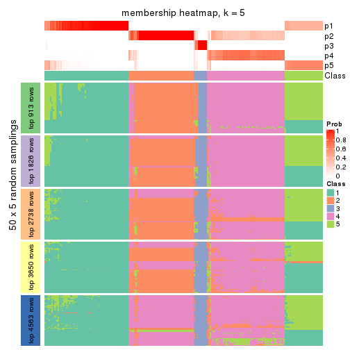</p>

</div>
<div id='tab-SD-skmeans-membership-heatmap-5'>
<pre><code class="r">membership_heatmap(res, k = 6)
</code></pre>

<p></p>

</div>
</div>

As soon as we have had the classes for columns, we can look for signatures
which are significantly different between classes which can be candidate marks
for certain classes. Following are the heatmaps for signatures.


Signature heatmaps where rows are scaled:


<script>
$( function() {
	$( '#tabs-SD-skmeans-get-signatures' ).tabs();
} );
</script>
<div id='tabs-SD-skmeans-get-signatures'>
<ul>
<li><a href='#tab-SD-skmeans-get-signatures-1'>k = 2</a></li>
<li><a href='#tab-SD-skmeans-get-signatures-2'>k = 3</a></li>
<li><a href='#tab-SD-skmeans-get-signatures-3'>k = 4</a></li>
<li><a href='#tab-SD-skmeans-get-signatures-4'>k = 5</a></li>
<li><a href='#tab-SD-skmeans-get-signatures-5'>k = 6</a></li>
</ul>
<div id='tab-SD-skmeans-get-signatures-1'>
<pre><code class="r">get_signatures(res, k = 2)
</code></pre>

<p></p>

</div>
<div id='tab-SD-skmeans-get-signatures-2'>
<pre><code class="r">get_signatures(res, k = 3)
</code></pre>

<p></p>

</div>
<div id='tab-SD-skmeans-get-signatures-3'>
<pre><code class="r">get_signatures(res, k = 4)
</code></pre>

<p></p>

</div>
<div id='tab-SD-skmeans-get-signatures-4'>
<pre><code class="r">get_signatures(res, k = 5)
</code></pre>

<p></p>

</div>
<div id='tab-SD-skmeans-get-signatures-5'>
<pre><code class="r">get_signatures(res, k = 6)
</code></pre>

<p>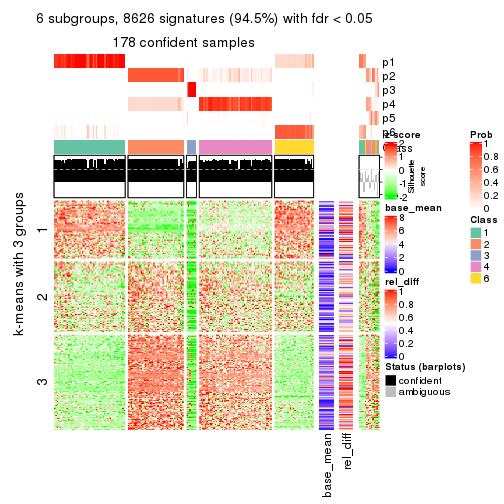</p>

</div>
</div>


Signature heatmaps where rows are not scaled:


<script>
$( function() {
	$( '#tabs-SD-skmeans-get-signatures-no-scale' ).tabs();
} );
</script>
<div id='tabs-SD-skmeans-get-signatures-no-scale'>
<ul>
<li><a href='#tab-SD-skmeans-get-signatures-no-scale-1'>k = 2</a></li>
<li><a href='#tab-SD-skmeans-get-signatures-no-scale-2'>k = 3</a></li>
<li><a href='#tab-SD-skmeans-get-signatures-no-scale-3'>k = 4</a></li>
<li><a href='#tab-SD-skmeans-get-signatures-no-scale-4'>k = 5</a></li>
<li><a href='#tab-SD-skmeans-get-signatures-no-scale-5'>k = 6</a></li>
</ul>
<div id='tab-SD-skmeans-get-signatures-no-scale-1'>
<pre><code class="r">get_signatures(res, k = 2, scale_rows = FALSE)
</code></pre>

<p></p>

</div>
<div id='tab-SD-skmeans-get-signatures-no-scale-2'>
<pre><code class="r">get_signatures(res, k = 3, scale_rows = FALSE)
</code></pre>

<p></p>

</div>
<div id='tab-SD-skmeans-get-signatures-no-scale-3'>
<pre><code class="r">get_signatures(res, k = 4, scale_rows = FALSE)
</code></pre>

<p></p>

</div>
<div id='tab-SD-skmeans-get-signatures-no-scale-4'>
<pre><code class="r">get_signatures(res, k = 5, scale_rows = FALSE)
</code></pre>

<p></p>

</div>
<div id='tab-SD-skmeans-get-signatures-no-scale-5'>
<pre><code class="r">get_signatures(res, k = 6, scale_rows = FALSE)
</code></pre>

<p></p>

</div>
</div>


Compare the overlap of signatures from different k:

```r
compare_signatures(res)
```


`get_signature()` returns a data frame invisibly. TO get the list of signatures, the function
call should be assigned to a variable explicitly. In following code, if `plot` argument is set
to `FALSE`, no heatmap is plotted while only the differential analysis is performed.

```r
# code only for demonstration
tb = get_signature(res, k = ..., plot = FALSE)
```

An example of the output of `tb` is:

```
#>   which_row         fdr    mean_1    mean_2 scaled_mean_1 scaled_mean_2 km
#> 1        38 0.042760348  8.373488  9.131774    -0.5533452     0.5164555  1
#> 2        40 0.018707592  7.106213  8.469186    -0.6173731     0.5762149  1
#> 3        55 0.019134737 10.221463 11.207825    -0.6159697     0.5749050  1
#> 4        59 0.006059896  5.921854  7.869574    -0.6899429     0.6439467  1
#> 5        60 0.018055526  8.928898 10.211722    -0.6204761     0.5791110  1
#> 6        98 0.009384629 15.714769 14.887706     0.6635654    -0.6193277  2
...
```

The columns in `tb` are:

1. `which_row`: row indices corresponding to the input matrix.
2. `fdr`: FDR for the differential test. 
3. `mean_x`: The mean value in group x.
4. `scaled_mean_x`: The mean value in group x after rows are scaled.
5. `km`: Row groups if k-means clustering is applied to rows.


UMAP plot which shows how samples are separated.


<script>
$( function() {
	$( '#tabs-SD-skmeans-dimension-reduction' ).tabs();
} );
</script>
<div id='tabs-SD-skmeans-dimension-reduction'>
<ul>
<li><a href='#tab-SD-skmeans-dimension-reduction-1'>k = 2</a></li>
<li><a href='#tab-SD-skmeans-dimension-reduction-2'>k = 3</a></li>
<li><a href='#tab-SD-skmeans-dimension-reduction-3'>k = 4</a></li>
<li><a href='#tab-SD-skmeans-dimension-reduction-4'>k = 5</a></li>
<li><a href='#tab-SD-skmeans-dimension-reduction-5'>k = 6</a></li>
</ul>
<div id='tab-SD-skmeans-dimension-reduction-1'>
<pre><code class="r">dimension_reduction(res, k = 2, method = &quot;UMAP&quot;)
</code></pre>

<p></p>

</div>
<div id='tab-SD-skmeans-dimension-reduction-2'>
<pre><code class="r">dimension_reduction(res, k = 3, method = &quot;UMAP&quot;)
</code></pre>

<p></p>

</div>
<div id='tab-SD-skmeans-dimension-reduction-3'>
<pre><code class="r">dimension_reduction(res, k = 4, method = &quot;UMAP&quot;)
</code></pre>

<p></p>

</div>
<div id='tab-SD-skmeans-dimension-reduction-4'>
<pre><code class="r">dimension_reduction(res, k = 5, method = &quot;UMAP&quot;)
</code></pre>

<p></p>

</div>
<div id='tab-SD-skmeans-dimension-reduction-5'>
<pre><code class="r">dimension_reduction(res, k = 6, method = &quot;UMAP&quot;)
</code></pre>

<p></p>

</div>
</div>


Following heatmap shows how subgroups are split when increasing `k`:

```r
collect_classes(res)
```


If matrix rows can be associated to genes, consider to use `functional_enrichment(res,
...)` to perform function enrichment for the signature genes. See [this vignette](http://bioconductor.org/packages/devel/bioc/vignettes/cola/inst/doc/functional_enrichment.html) for more detailed explanations.


 

---------------------------------------------------


### SD:pam*


The object with results only for a single top-value method and a single partition method 
can be extracted as:

```r
res = res_list["SD", "pam"]
# you can also extract it by
# res = res_list["SD:pam"]
```

A summary of `res` and all the functions that can be applied to it:

```r
res
```

```
#> A 'ConsensusPartition' object with k = 2, 3, 4, 5, 6.
#>   On a matrix with 9126 rows and 192 columns.
#>   Top rows (913, 1826, 2738, 3650, 4563) are extracted by 'SD' method.
#>   Subgroups are detected by 'pam' method.
#>   Performed in total 1250 partitions by row resampling.
#>   Best k for subgroups seems to be 4.
#> 
#> Following methods can be applied to this 'ConsensusPartition' object:
#>  [1] "cola_report"             "collect_classes"         "collect_plots"          
#>  [4] "collect_stats"           "colnames"                "compare_signatures"     
#>  [7] "consensus_heatmap"       "dimension_reduction"     "functional_enrichment"  
#> [10] "get_anno_col"            "get_anno"                "get_classes"            
#> [13] "get_consensus"           "get_matrix"              "get_membership"         
#> [16] "get_param"               "get_signatures"          "get_stats"              
#> [19] "is_best_k"               "is_stable_k"             "membership_heatmap"     
#> [22] "ncol"                    "nrow"                    "plot_ecdf"              
#> [25] "rownames"                "select_partition_number" "show"                   
#> [28] "suggest_best_k"          "test_to_known_factors"
```

`collect_plots()` function collects all the plots made from `res` for all `k` (number of partitions)
into one single page to provide an easy and fast comparison between different `k`.

```r
collect_plots(res)
```


The plots are:

- The first row: a plot of the ECDF (empirical cumulative distribution
  function) curves of the consensus matrix for each `k` and the heatmap of
  predicted classes for each `k`.
- The second row: heatmaps of the consensus matrix for each `k`.
- The third row: heatmaps of the membership matrix for each `k`.
- The fouth row: heatmaps of the signatures for each `k`.

All the plots in panels can be made by individual functions and they are
plotted later in this section.

`select_partition_number()` produces several plots showing different
statistics for choosing "optimized" `k`. There are following statistics:

- ECDF curves of the consensus matrix for each `k`;
- 1-PAC. [The PAC
  score](https://en.wikipedia.org/wiki/Consensus_clustering#Over-interpretation_potential_of_consensus_clustering)
  measures the proportion of the ambiguous subgrouping.
- Mean silhouette score.
- Concordance. The mean probability of fiting the consensus class ids in all
  partitions.
- Area increased. Denote $A_k$ as the area under the ECDF curve for current
  `k`, the area increased is defined as $A_k - A_{k-1}$.
- Rand index. The percent of pairs of samples that are both in a same cluster
  or both are not in a same cluster in the partition of k and k-1.
- Jaccard index. The ratio of pairs of samples are both in a same cluster in
  the partition of k and k-1 and the pairs of samples are both in a same
  cluster in the partition k or k-1.

The detailed explanations of these statistics can be found in [the _cola_
vignette](http://bioconductor.org/packages/devel/bioc/vignettes/cola/inst/doc/cola.html#toc_13).

Generally speaking, lower PAC score, higher mean silhouette score or higher
concordance corresponds to better partition. Rand index and Jaccard index
measure how similar the current partition is compared to partition with `k-1`.
If they are too similar, we won't accept `k` is better than `k-1`.

```r
select_partition_number(res)
```


The numeric values for all these statistics can be obtained by `get_stats()`.

```r
get_stats(res)
```

```
#>   k 1-PAC mean_silhouette concordance area_increased  Rand Jaccard
#> 2 2 1.000           1.000       1.000         0.5017 0.499   0.499
#> 3 3 0.825           0.839       0.863         0.1939 0.854   0.709
#> 4 4 0.938           0.890       0.959         0.1157 0.956   0.881
#> 5 5 0.792           0.781       0.893         0.0942 0.923   0.768
#> 6 6 0.799           0.784       0.908         0.0197 0.979   0.918
```

`suggest_best_k()` suggests the best $k$ based on these statistics. The rules are as follows:

- All $k$ with Jaccard index larger than 0.95 are removed because increasing
  $k$ does not provide enough extra information. If all $k$ are removed, it is
  marked as no subgroup is detected.
- For all $k$ with 1-PAC score larger than 0.9, the maximal $k$ is taken as
  the best $k$, and other $k$ are marked as optional $k$.
- If it does not fit the second rule. The $k$ with the maximal vote of the
  highest 1-PAC score, highest mean silhouette, and highest concordance is
  taken as the best $k$.

```r
suggest_best_k(res)
```

```
#> [1] 4
#> attr(,"optional")
#> [1] 2
```

There is also optional best $k$ = 2 that is worth to check.

Following shows the table of the partitions (You need to click the **show/hide
code output** link to see it). The membership matrix (columns with name `p*`)
is inferred by
[`clue::cl_consensus()`](https://www.rdocumentation.org/link/cl_consensus?package=clue)
function with the `SE` method. Basically the value in the membership matrix
represents the probability to belong to a certain group. The finall class
label for an item is determined with the group with highest probability it
belongs to.

In `get_classes()` function, the entropy is calculated from the membership
matrix and the silhouette score is calculated from the consensus matrix.


<script>
$( function() {
	$( '#tabs-SD-pam-get-classes' ).tabs();
} );
</script>
<div id='tabs-SD-pam-get-classes'>
<ul>
<li><a href='#tab-SD-pam-get-classes-1'>k = 2</a></li>
<li><a href='#tab-SD-pam-get-classes-2'>k = 3</a></li>
<li><a href='#tab-SD-pam-get-classes-3'>k = 4</a></li>
<li><a href='#tab-SD-pam-get-classes-4'>k = 5</a></li>
<li><a href='#tab-SD-pam-get-classes-5'>k = 6</a></li>
</ul>

<div id='tab-SD-pam-get-classes-1'>
<p><a id='tab-SD-pam-get-classes-1-a' style='color:#0366d6' href='#'>show/hide code output</a></p>
<pre><code class="r">cbind(get_classes(res, k = 2), get_membership(res, k = 2))
</code></pre>

<pre><code>#&gt;            class entropy silhouette    p1    p2
#&gt; SRR2074921     1   0.000      1.000 1.000 0.000
#&gt; SRR2074919     1   0.000      1.000 1.000 0.000
#&gt; SRR2074920     1   0.000      1.000 1.000 0.000
#&gt; SRR2074917     1   0.000      1.000 1.000 0.000
#&gt; SRR2074918     2   0.000      1.000 0.000 1.000
#&gt; SRR2074916     2   0.000      1.000 0.000 1.000
#&gt; SRR2074915     2   0.000      1.000 0.000 1.000
#&gt; SRR2074914     1   0.000      1.000 1.000 0.000
#&gt; SRR2074913     2   0.000      1.000 0.000 1.000
#&gt; SRR2074912     1   0.000      1.000 1.000 0.000
#&gt; SRR2074911     2   0.000      1.000 0.000 1.000
#&gt; SRR2074910     2   0.000      1.000 0.000 1.000
#&gt; SRR2074909     1   0.000      1.000 1.000 0.000
#&gt; SRR2074907     1   0.000      1.000 1.000 0.000
#&gt; SRR2074908     2   0.000      1.000 0.000 1.000
#&gt; SRR2074906     2   0.000      1.000 0.000 1.000
#&gt; SRR2074905     1   0.000      1.000 1.000 0.000
#&gt; SRR2074904     2   0.000      1.000 0.000 1.000
#&gt; SRR2074903     2   0.000      1.000 0.000 1.000
#&gt; SRR2074902     1   0.000      1.000 1.000 0.000
#&gt; SRR2074901     2   0.000      1.000 0.000 1.000
#&gt; SRR2074900     1   0.000      1.000 1.000 0.000
#&gt; SRR2074899     2   0.000      1.000 0.000 1.000
#&gt; SRR2074898     2   0.000      1.000 0.000 1.000
#&gt; SRR2074897     2   0.000      1.000 0.000 1.000
#&gt; SRR2074896     2   0.000      1.000 0.000 1.000
#&gt; SRR2074895     1   0.000      1.000 1.000 0.000
#&gt; SRR2074894     1   0.163      0.975 0.976 0.024
#&gt; SRR2074893     2   0.000      1.000 0.000 1.000
#&gt; SRR2074892     1   0.000      1.000 1.000 0.000
#&gt; SRR2074891     1   0.000      1.000 1.000 0.000
#&gt; SRR2074890     2   0.000      1.000 0.000 1.000
#&gt; SRR2074887     2   0.000      1.000 0.000 1.000
#&gt; SRR2074889     2   0.000      1.000 0.000 1.000
#&gt; SRR2074886     2   0.000      1.000 0.000 1.000
#&gt; SRR2074888     2   0.000      1.000 0.000 1.000
#&gt; SRR2074885     1   0.000      1.000 1.000 0.000
#&gt; SRR2074884     2   0.000      1.000 0.000 1.000
#&gt; SRR2074883     2   0.000      1.000 0.000 1.000
#&gt; SRR2074882     1   0.000      1.000 1.000 0.000
#&gt; SRR2074880     2   0.000      1.000 0.000 1.000
#&gt; SRR2074881     2   0.000      1.000 0.000 1.000
#&gt; SRR2074879     1   0.000      1.000 1.000 0.000
#&gt; SRR2074878     1   0.000      1.000 1.000 0.000
#&gt; SRR2074877     2   0.000      1.000 0.000 1.000
#&gt; SRR2074876     1   0.000      1.000 1.000 0.000
#&gt; SRR2074875     2   0.000      1.000 0.000 1.000
#&gt; SRR2074874     1   0.000      1.000 1.000 0.000
#&gt; SRR2074873     2   0.000      1.000 0.000 1.000
#&gt; SRR2074872     1   0.000      1.000 1.000 0.000
#&gt; SRR2074871     2   0.000      1.000 0.000 1.000
#&gt; SRR2074870     1   0.000      1.000 1.000 0.000
#&gt; SRR2074869     1   0.000      1.000 1.000 0.000
#&gt; SRR2074868     1   0.000      1.000 1.000 0.000
#&gt; SRR2074867     2   0.000      1.000 0.000 1.000
#&gt; SRR2074866     2   0.000      1.000 0.000 1.000
#&gt; SRR2074865     1   0.000      1.000 1.000 0.000
#&gt; SRR2074864     1   0.000      1.000 1.000 0.000
#&gt; SRR2074863     1   0.000      1.000 1.000 0.000
#&gt; SRR2074862     1   0.000      1.000 1.000 0.000
#&gt; SRR2074861     1   0.000      1.000 1.000 0.000
#&gt; SRR2074860     1   0.000      1.000 1.000 0.000
#&gt; SRR2074859     1   0.000      1.000 1.000 0.000
#&gt; SRR2074858     2   0.000      1.000 0.000 1.000
#&gt; SRR2074855     2   0.000      1.000 0.000 1.000
#&gt; SRR2074857     1   0.000      1.000 1.000 0.000
#&gt; SRR2074856     1   0.000      1.000 1.000 0.000
#&gt; SRR2074854     1   0.000      1.000 1.000 0.000
#&gt; SRR2074853     1   0.000      1.000 1.000 0.000
#&gt; SRR2074852     2   0.000      1.000 0.000 1.000
#&gt; SRR2074851     1   0.000      1.000 1.000 0.000
#&gt; SRR2074850     1   0.000      1.000 1.000 0.000
#&gt; SRR2074849     1   0.000      1.000 1.000 0.000
#&gt; SRR2074848     1   0.000      1.000 1.000 0.000
#&gt; SRR2074847     1   0.000      1.000 1.000 0.000
#&gt; SRR2074846     1   0.000      1.000 1.000 0.000
#&gt; SRR2074845     1   0.000      1.000 1.000 0.000
#&gt; SRR2074843     1   0.000      1.000 1.000 0.000
#&gt; SRR2074842     2   0.000      1.000 0.000 1.000
#&gt; SRR2074844     2   0.000      1.000 0.000 1.000
#&gt; SRR2074841     2   0.000      1.000 0.000 1.000
#&gt; SRR2074840     2   0.000      1.000 0.000 1.000
#&gt; SRR2074839     1   0.000      1.000 1.000 0.000
#&gt; SRR2074838     2   0.000      1.000 0.000 1.000
#&gt; SRR2074836     2   0.000      1.000 0.000 1.000
#&gt; SRR2074835     2   0.000      1.000 0.000 1.000
#&gt; SRR2074837     1   0.000      1.000 1.000 0.000
#&gt; SRR2074834     2   0.000      1.000 0.000 1.000
#&gt; SRR2074833     1   0.000      1.000 1.000 0.000
#&gt; SRR2074832     2   0.000      1.000 0.000 1.000
#&gt; SRR2074831     1   0.000      1.000 1.000 0.000
#&gt; SRR2074829     1   0.000      1.000 1.000 0.000
#&gt; SRR2074830     1   0.000      1.000 1.000 0.000
#&gt; SRR2074828     1   0.000      1.000 1.000 0.000
#&gt; SRR2074827     2   0.000      1.000 0.000 1.000
#&gt; SRR2074826     2   0.000      1.000 0.000 1.000
#&gt; SRR2074825     2   0.000      1.000 0.000 1.000
#&gt; SRR2074824     2   0.000      1.000 0.000 1.000
#&gt; SRR2074823     1   0.000      1.000 1.000 0.000
#&gt; SRR2074822     2   0.000      1.000 0.000 1.000
#&gt; SRR2074821     2   0.000      1.000 0.000 1.000
#&gt; SRR2074820     2   0.000      1.000 0.000 1.000
#&gt; SRR2074819     2   0.000      1.000 0.000 1.000
#&gt; SRR2074817     2   0.000      1.000 0.000 1.000
#&gt; SRR2074818     2   0.000      1.000 0.000 1.000
#&gt; SRR2074816     1   0.000      1.000 1.000 0.000
#&gt; SRR2074815     2   0.000      1.000 0.000 1.000
#&gt; SRR2074814     1   0.000      1.000 1.000 0.000
#&gt; SRR2074812     2   0.000      1.000 0.000 1.000
#&gt; SRR2074813     2   0.000      1.000 0.000 1.000
#&gt; SRR2074809     2   0.000      1.000 0.000 1.000
#&gt; SRR2074810     2   0.000      1.000 0.000 1.000
#&gt; SRR2074811     2   0.000      1.000 0.000 1.000
#&gt; SRR2074808     2   0.000      1.000 0.000 1.000
#&gt; SRR2074807     2   0.000      1.000 0.000 1.000
#&gt; SRR2074806     1   0.000      1.000 1.000 0.000
#&gt; SRR2074805     2   0.000      1.000 0.000 1.000
#&gt; SRR2074804     1   0.000      1.000 1.000 0.000
#&gt; SRR2074803     1   0.000      1.000 1.000 0.000
#&gt; SRR2074801     1   0.000      1.000 1.000 0.000
#&gt; SRR2074802     2   0.000      1.000 0.000 1.000
#&gt; SRR2074799     2   0.000      1.000 0.000 1.000
#&gt; SRR2074800     1   0.000      1.000 1.000 0.000
#&gt; SRR2074798     1   0.000      1.000 1.000 0.000
#&gt; SRR2074797     1   0.000      1.000 1.000 0.000
#&gt; SRR2074795     2   0.000      1.000 0.000 1.000
#&gt; SRR2074796     2   0.000      1.000 0.000 1.000
#&gt; SRR2074794     2   0.000      1.000 0.000 1.000
#&gt; SRR2074793     2   0.000      1.000 0.000 1.000
#&gt; SRR2074792     1   0.000      1.000 1.000 0.000
#&gt; SRR2074791     1   0.000      1.000 1.000 0.000
#&gt; SRR2074790     2   0.000      1.000 0.000 1.000
#&gt; SRR2074789     1   0.000      1.000 1.000 0.000
#&gt; SRR2074788     1   0.000      1.000 1.000 0.000
#&gt; SRR2074787     1   0.000      1.000 1.000 0.000
#&gt; SRR2074786     2   0.000      1.000 0.000 1.000
#&gt; SRR2074785     1   0.000      1.000 1.000 0.000
#&gt; SRR2074784     1   0.000      1.000 1.000 0.000
#&gt; SRR2074783     2   0.000      1.000 0.000 1.000
#&gt; SRR2074782     1   0.000      1.000 1.000 0.000
#&gt; SRR2074779     2   0.000      1.000 0.000 1.000
#&gt; SRR2074781     2   0.000      1.000 0.000 1.000
#&gt; SRR2074780     1   0.000      1.000 1.000 0.000
#&gt; SRR2074778     2   0.000      1.000 0.000 1.000
#&gt; SRR2074777     2   0.000      1.000 0.000 1.000
#&gt; SRR2074776     2   0.000      1.000 0.000 1.000
#&gt; SRR2074775     1   0.000      1.000 1.000 0.000
#&gt; SRR2074774     1   0.000      1.000 1.000 0.000
#&gt; SRR2074773     2   0.000      1.000 0.000 1.000
#&gt; SRR2074771     2   0.000      1.000 0.000 1.000
#&gt; SRR2074772     1   0.000      1.000 1.000 0.000
#&gt; SRR2074770     1   0.000      1.000 1.000 0.000
#&gt; SRR2074769     2   0.000      1.000 0.000 1.000
#&gt; SRR2074768     2   0.000      1.000 0.000 1.000
#&gt; SRR2074766     2   0.000      1.000 0.000 1.000
#&gt; SRR2074767     1   0.000      1.000 1.000 0.000
#&gt; SRR2074765     1   0.000      1.000 1.000 0.000
#&gt; SRR2074764     2   0.000      1.000 0.000 1.000
#&gt; SRR2074763     2   0.000      1.000 0.000 1.000
#&gt; SRR2074761     1   0.000      1.000 1.000 0.000
#&gt; SRR2074762     2   0.000      1.000 0.000 1.000
#&gt; SRR2074760     2   0.000      1.000 0.000 1.000
#&gt; SRR2074759     1   0.000      1.000 1.000 0.000
#&gt; SRR2074757     2   0.000      1.000 0.000 1.000
#&gt; SRR2074758     2   0.000      1.000 0.000 1.000
#&gt; SRR2074756     2   0.000      1.000 0.000 1.000
#&gt; SRR2074755     1   0.000      1.000 1.000 0.000
#&gt; SRR2074754     1   0.000      1.000 1.000 0.000
#&gt; SRR2074753     2   0.000      1.000 0.000 1.000
#&gt; SRR2074752     1   0.000      1.000 1.000 0.000
#&gt; SRR2074751     1   0.000      1.000 1.000 0.000
#&gt; SRR2074749     2   0.000      1.000 0.000 1.000
#&gt; SRR2074750     1   0.000      1.000 1.000 0.000
#&gt; SRR2074748     1   0.000      1.000 1.000 0.000
#&gt; SRR2074747     2   0.000      1.000 0.000 1.000
#&gt; SRR2074745     1   0.000      1.000 1.000 0.000
#&gt; SRR2074746     1   0.000      1.000 1.000 0.000
#&gt; SRR2074744     2   0.000      1.000 0.000 1.000
#&gt; SRR2074743     2   0.000      1.000 0.000 1.000
#&gt; SRR2074742     2   0.000      1.000 0.000 1.000
#&gt; SRR2074741     1   0.000      1.000 1.000 0.000
#&gt; SRR2074740     2   0.000      1.000 0.000 1.000
#&gt; SRR2074739     1   0.000      1.000 1.000 0.000
#&gt; SRR2074738     2   0.000      1.000 0.000 1.000
#&gt; SRR2074737     2   0.000      1.000 0.000 1.000
#&gt; SRR2074736     2   0.000      1.000 0.000 1.000
#&gt; SRR2074735     1   0.000      1.000 1.000 0.000
#&gt; SRR2074734     2   0.000      1.000 0.000 1.000
#&gt; SRR2074733     1   0.000      1.000 1.000 0.000
#&gt; SRR2074732     2   0.000      1.000 0.000 1.000
#&gt; SRR2074731     2   0.000      1.000 0.000 1.000
#&gt; SRR2074730     1   0.000      1.000 1.000 0.000
</code></pre>

<script>
$('#tab-SD-pam-get-classes-1-a').parent().next().next().hide();
$('#tab-SD-pam-get-classes-1-a').click(function(){
  $('#tab-SD-pam-get-classes-1-a').parent().next().next().toggle();
  return(false);
});
</script>
</div>

<div id='tab-SD-pam-get-classes-2'>
<p><a id='tab-SD-pam-get-classes-2-a' style='color:#0366d6' href='#'>show/hide code output</a></p>
<pre><code class="r">cbind(get_classes(res, k = 3), get_membership(res, k = 3))
</code></pre>

<pre><code>#&gt;            class entropy silhouette    p1    p2    p3
#&gt; SRR2074921     1   0.611      0.622 0.604 0.000 0.396
#&gt; SRR2074919     1   0.611      0.622 0.604 0.000 0.396
#&gt; SRR2074920     1   0.611      0.622 0.604 0.000 0.396
#&gt; SRR2074917     1   0.611      0.622 0.604 0.000 0.396
#&gt; SRR2074918     3   0.593     -0.162 0.000 0.356 0.644
#&gt; SRR2074916     2   0.000      0.841 0.000 1.000 0.000
#&gt; SRR2074915     3   0.611      0.944 0.000 0.396 0.604
#&gt; SRR2074914     1   0.000      0.978 1.000 0.000 0.000
#&gt; SRR2074913     3   0.611      0.944 0.000 0.396 0.604
#&gt; SRR2074912     1   0.611      0.622 0.604 0.000 0.396
#&gt; SRR2074911     2   0.484      0.420 0.000 0.776 0.224
#&gt; SRR2074910     3   0.611      0.944 0.000 0.396 0.604
#&gt; SRR2074909     1   0.000      0.978 1.000 0.000 0.000
#&gt; SRR2074907     1   0.000      0.978 1.000 0.000 0.000
#&gt; SRR2074908     3   0.611      0.944 0.000 0.396 0.604
#&gt; SRR2074906     2   0.000      0.841 0.000 1.000 0.000
#&gt; SRR2074905     1   0.000      0.978 1.000 0.000 0.000
#&gt; SRR2074904     3   0.611      0.944 0.000 0.396 0.604
#&gt; SRR2074903     2   0.601     -0.213 0.000 0.628 0.372
#&gt; SRR2074902     1   0.000      0.978 1.000 0.000 0.000
#&gt; SRR2074901     3   0.611      0.944 0.000 0.396 0.604
#&gt; SRR2074900     1   0.000      0.978 1.000 0.000 0.000
#&gt; SRR2074899     2   0.550      0.175 0.000 0.708 0.292
#&gt; SRR2074898     2   0.000      0.841 0.000 1.000 0.000
#&gt; SRR2074897     2   0.000      0.841 0.000 1.000 0.000
#&gt; SRR2074896     3   0.611      0.944 0.000 0.396 0.604
#&gt; SRR2074895     1   0.000      0.978 1.000 0.000 0.000
#&gt; SRR2074894     3   0.611      0.238 0.396 0.000 0.604
#&gt; SRR2074893     2   0.614     -0.353 0.000 0.596 0.404
#&gt; SRR2074892     1   0.000      0.978 1.000 0.000 0.000
#&gt; SRR2074891     1   0.000      0.978 1.000 0.000 0.000
#&gt; SRR2074890     3   0.611      0.944 0.000 0.396 0.604
#&gt; SRR2074887     3   0.611      0.944 0.000 0.396 0.604
#&gt; SRR2074889     2   0.000      0.841 0.000 1.000 0.000
#&gt; SRR2074886     2   0.604     -0.248 0.000 0.620 0.380
#&gt; SRR2074888     2   0.000      0.841 0.000 1.000 0.000
#&gt; SRR2074885     1   0.000      0.978 1.000 0.000 0.000
#&gt; SRR2074884     2   0.000      0.841 0.000 1.000 0.000
#&gt; SRR2074883     2   0.000      0.841 0.000 1.000 0.000
#&gt; SRR2074882     1   0.000      0.978 1.000 0.000 0.000
#&gt; SRR2074880     2   0.000      0.841 0.000 1.000 0.000
#&gt; SRR2074881     3   0.611      0.944 0.000 0.396 0.604
#&gt; SRR2074879     1   0.611      0.622 0.604 0.000 0.396
#&gt; SRR2074878     1   0.000      0.978 1.000 0.000 0.000
#&gt; SRR2074877     2   0.627     -0.542 0.000 0.548 0.452
#&gt; SRR2074876     1   0.000      0.978 1.000 0.000 0.000
#&gt; SRR2074875     2   0.000      0.841 0.000 1.000 0.000
#&gt; SRR2074874     1   0.000      0.978 1.000 0.000 0.000
#&gt; SRR2074873     2   0.000      0.841 0.000 1.000 0.000
#&gt; SRR2074872     1   0.000      0.978 1.000 0.000 0.000
#&gt; SRR2074871     3   0.611      0.944 0.000 0.396 0.604
#&gt; SRR2074870     1   0.000      0.978 1.000 0.000 0.000
#&gt; SRR2074869     1   0.000      0.978 1.000 0.000 0.000
#&gt; SRR2074868     1   0.000      0.978 1.000 0.000 0.000
#&gt; SRR2074867     3   0.611      0.944 0.000 0.396 0.604
#&gt; SRR2074866     3   0.611      0.944 0.000 0.396 0.604
#&gt; SRR2074865     1   0.000      0.978 1.000 0.000 0.000
#&gt; SRR2074864     1   0.000      0.978 1.000 0.000 0.000
#&gt; SRR2074863     1   0.000      0.978 1.000 0.000 0.000
#&gt; SRR2074862     1   0.000      0.978 1.000 0.000 0.000
#&gt; SRR2074861     1   0.000      0.978 1.000 0.000 0.000
#&gt; SRR2074860     1   0.000      0.978 1.000 0.000 0.000
#&gt; SRR2074859     1   0.000      0.978 1.000 0.000 0.000
#&gt; SRR2074858     3   0.613      0.937 0.000 0.400 0.600
#&gt; SRR2074855     2   0.000      0.841 0.000 1.000 0.000
#&gt; SRR2074857     1   0.000      0.978 1.000 0.000 0.000
#&gt; SRR2074856     1   0.000      0.978 1.000 0.000 0.000
#&gt; SRR2074854     1   0.000      0.978 1.000 0.000 0.000
#&gt; SRR2074853     1   0.000      0.978 1.000 0.000 0.000
#&gt; SRR2074852     2   0.000      0.841 0.000 1.000 0.000
#&gt; SRR2074851     1   0.000      0.978 1.000 0.000 0.000
#&gt; SRR2074850     1   0.000      0.978 1.000 0.000 0.000
#&gt; SRR2074849     1   0.000      0.978 1.000 0.000 0.000
#&gt; SRR2074848     1   0.000      0.978 1.000 0.000 0.000
#&gt; SRR2074847     1   0.000      0.978 1.000 0.000 0.000
#&gt; SRR2074846     1   0.000      0.978 1.000 0.000 0.000
#&gt; SRR2074845     1   0.000      0.978 1.000 0.000 0.000
#&gt; SRR2074843     1   0.000      0.978 1.000 0.000 0.000
#&gt; SRR2074842     3   0.611      0.944 0.000 0.396 0.604
#&gt; SRR2074844     3   0.611      0.944 0.000 0.396 0.604
#&gt; SRR2074841     2   0.000      0.841 0.000 1.000 0.000
#&gt; SRR2074840     2   0.000      0.841 0.000 1.000 0.000
#&gt; SRR2074839     1   0.000      0.978 1.000 0.000 0.000
#&gt; SRR2074838     2   0.000      0.841 0.000 1.000 0.000
#&gt; SRR2074836     3   0.611      0.944 0.000 0.396 0.604
#&gt; SRR2074835     2   0.000      0.841 0.000 1.000 0.000
#&gt; SRR2074837     1   0.000      0.978 1.000 0.000 0.000
#&gt; SRR2074834     3   0.611      0.944 0.000 0.396 0.604
#&gt; SRR2074833     1   0.000      0.978 1.000 0.000 0.000
#&gt; SRR2074832     2   0.613     -0.335 0.000 0.600 0.400
#&gt; SRR2074831     1   0.000      0.978 1.000 0.000 0.000
#&gt; SRR2074829     1   0.000      0.978 1.000 0.000 0.000
#&gt; SRR2074830     1   0.000      0.978 1.000 0.000 0.000
#&gt; SRR2074828     1   0.000      0.978 1.000 0.000 0.000
#&gt; SRR2074827     3   0.611      0.944 0.000 0.396 0.604
#&gt; SRR2074826     3   0.611      0.944 0.000 0.396 0.604
#&gt; SRR2074825     2   0.000      0.841 0.000 1.000 0.000
#&gt; SRR2074824     2   0.000      0.841 0.000 1.000 0.000
#&gt; SRR2074823     1   0.000      0.978 1.000 0.000 0.000
#&gt; SRR2074822     2   0.000      0.841 0.000 1.000 0.000
#&gt; SRR2074821     2   0.603     -0.232 0.000 0.624 0.376
#&gt; SRR2074820     2   0.000      0.841 0.000 1.000 0.000
#&gt; SRR2074819     3   0.611      0.944 0.000 0.396 0.604
#&gt; SRR2074817     3   0.611      0.944 0.000 0.396 0.604
#&gt; SRR2074818     2   0.000      0.841 0.000 1.000 0.000
#&gt; SRR2074816     1   0.000      0.978 1.000 0.000 0.000
#&gt; SRR2074815     3   0.611      0.944 0.000 0.396 0.604
#&gt; SRR2074814     1   0.000      0.978 1.000 0.000 0.000
#&gt; SRR2074812     2   0.000      0.841 0.000 1.000 0.000
#&gt; SRR2074813     2   0.000      0.841 0.000 1.000 0.000
#&gt; SRR2074809     2   0.000      0.841 0.000 1.000 0.000
#&gt; SRR2074810     3   0.611      0.944 0.000 0.396 0.604
#&gt; SRR2074811     2   0.000      0.841 0.000 1.000 0.000
#&gt; SRR2074808     3   0.611      0.944 0.000 0.396 0.604
#&gt; SRR2074807     3   0.611      0.944 0.000 0.396 0.604
#&gt; SRR2074806     1   0.000      0.978 1.000 0.000 0.000
#&gt; SRR2074805     2   0.000      0.841 0.000 1.000 0.000
#&gt; SRR2074804     1   0.000      0.978 1.000 0.000 0.000
#&gt; SRR2074803     1   0.000      0.978 1.000 0.000 0.000
#&gt; SRR2074801     1   0.000      0.978 1.000 0.000 0.000
#&gt; SRR2074802     3   0.611      0.944 0.000 0.396 0.604
#&gt; SRR2074799     2   0.000      0.841 0.000 1.000 0.000
#&gt; SRR2074800     1   0.000      0.978 1.000 0.000 0.000
#&gt; SRR2074798     1   0.000      0.978 1.000 0.000 0.000
#&gt; SRR2074797     1   0.000      0.978 1.000 0.000 0.000
#&gt; SRR2074795     2   0.000      0.841 0.000 1.000 0.000
#&gt; SRR2074796     3   0.611      0.944 0.000 0.396 0.604
#&gt; SRR2074794     2   0.000      0.841 0.000 1.000 0.000
#&gt; SRR2074793     2   0.630     -0.653 0.000 0.516 0.484
#&gt; SRR2074792     1   0.000      0.978 1.000 0.000 0.000
#&gt; SRR2074791     1   0.000      0.978 1.000 0.000 0.000
#&gt; SRR2074790     2   0.000      0.841 0.000 1.000 0.000
#&gt; SRR2074789     1   0.000      0.978 1.000 0.000 0.000
#&gt; SRR2074788     1   0.000      0.978 1.000 0.000 0.000
#&gt; SRR2074787     1   0.000      0.978 1.000 0.000 0.000
#&gt; SRR2074786     3   0.611      0.944 0.000 0.396 0.604
#&gt; SRR2074785     1   0.000      0.978 1.000 0.000 0.000
#&gt; SRR2074784     1   0.000      0.978 1.000 0.000 0.000
#&gt; SRR2074783     2   0.000      0.841 0.000 1.000 0.000
#&gt; SRR2074782     1   0.000      0.978 1.000 0.000 0.000
#&gt; SRR2074779     3   0.611      0.944 0.000 0.396 0.604
#&gt; SRR2074781     3   0.611      0.944 0.000 0.396 0.604
#&gt; SRR2074780     1   0.000      0.978 1.000 0.000 0.000
#&gt; SRR2074778     3   0.613      0.938 0.000 0.400 0.600
#&gt; SRR2074777     3   0.611      0.944 0.000 0.396 0.604
#&gt; SRR2074776     2   0.000      0.841 0.000 1.000 0.000
#&gt; SRR2074775     1   0.000      0.978 1.000 0.000 0.000
#&gt; SRR2074774     1   0.000      0.978 1.000 0.000 0.000
#&gt; SRR2074773     3   0.611      0.944 0.000 0.396 0.604
#&gt; SRR2074771     3   0.611      0.944 0.000 0.396 0.604
#&gt; SRR2074772     1   0.000      0.978 1.000 0.000 0.000
#&gt; SRR2074770     1   0.000      0.978 1.000 0.000 0.000
#&gt; SRR2074769     2   0.000      0.841 0.000 1.000 0.000
#&gt; SRR2074768     2   0.000      0.841 0.000 1.000 0.000
#&gt; SRR2074766     3   0.611      0.944 0.000 0.396 0.604
#&gt; SRR2074767     1   0.000      0.978 1.000 0.000 0.000
#&gt; SRR2074765     1   0.000      0.978 1.000 0.000 0.000
#&gt; SRR2074764     3   0.611      0.944 0.000 0.396 0.604
#&gt; SRR2074763     2   0.000      0.841 0.000 1.000 0.000
#&gt; SRR2074761     1   0.000      0.978 1.000 0.000 0.000
#&gt; SRR2074762     3   0.611      0.944 0.000 0.396 0.604
#&gt; SRR2074760     2   0.610     -0.301 0.000 0.608 0.392
#&gt; SRR2074759     1   0.000      0.978 1.000 0.000 0.000
#&gt; SRR2074757     3   0.627      0.830 0.000 0.452 0.548
#&gt; SRR2074758     2   0.000      0.841 0.000 1.000 0.000
#&gt; SRR2074756     3   0.611      0.944 0.000 0.396 0.604
#&gt; SRR2074755     1   0.000      0.978 1.000 0.000 0.000
#&gt; SRR2074754     1   0.000      0.978 1.000 0.000 0.000
#&gt; SRR2074753     3   0.611      0.944 0.000 0.396 0.604
#&gt; SRR2074752     1   0.000      0.978 1.000 0.000 0.000
#&gt; SRR2074751     1   0.000      0.978 1.000 0.000 0.000
#&gt; SRR2074749     2   0.597     -0.177 0.000 0.636 0.364
#&gt; SRR2074750     1   0.000      0.978 1.000 0.000 0.000
#&gt; SRR2074748     1   0.000      0.978 1.000 0.000 0.000
#&gt; SRR2074747     3   0.611      0.944 0.000 0.396 0.604
#&gt; SRR2074745     1   0.000      0.978 1.000 0.000 0.000
#&gt; SRR2074746     1   0.000      0.978 1.000 0.000 0.000
#&gt; SRR2074744     3   0.611      0.944 0.000 0.396 0.604
#&gt; SRR2074743     3   0.614      0.930 0.000 0.404 0.596
#&gt; SRR2074742     2   0.506      0.362 0.000 0.756 0.244
#&gt; SRR2074741     1   0.000      0.978 1.000 0.000 0.000
#&gt; SRR2074740     3   0.611      0.944 0.000 0.396 0.604
#&gt; SRR2074739     1   0.000      0.978 1.000 0.000 0.000
#&gt; SRR2074738     2   0.613     -0.335 0.000 0.600 0.400
#&gt; SRR2074737     2   0.000      0.841 0.000 1.000 0.000
#&gt; SRR2074736     3   0.630      0.764 0.000 0.476 0.524
#&gt; SRR2074735     1   0.000      0.978 1.000 0.000 0.000
#&gt; SRR2074734     2   0.245      0.740 0.000 0.924 0.076
#&gt; SRR2074733     1   0.000      0.978 1.000 0.000 0.000
#&gt; SRR2074732     2   0.000      0.841 0.000 1.000 0.000
#&gt; SRR2074731     2   0.000      0.841 0.000 1.000 0.000
#&gt; SRR2074730     1   0.000      0.978 1.000 0.000 0.000
</code></pre>

<script>
$('#tab-SD-pam-get-classes-2-a').parent().next().next().hide();
$('#tab-SD-pam-get-classes-2-a').click(function(){
  $('#tab-SD-pam-get-classes-2-a').parent().next().next().toggle();
  return(false);
});
</script>
</div>

<div id='tab-SD-pam-get-classes-3'>
<p><a id='tab-SD-pam-get-classes-3-a' style='color:#0366d6' href='#'>show/hide code output</a></p>
<pre><code class="r">cbind(get_classes(res, k = 4), get_membership(res, k = 4))
</code></pre>

<pre><code>#&gt;            class entropy silhouette p1    p2 p3    p4
#&gt; SRR2074921     3  0.0000     1.0000  0 0.000  1 0.000
#&gt; SRR2074919     3  0.0000     1.0000  0 0.000  1 0.000
#&gt; SRR2074920     3  0.0000     1.0000  0 0.000  1 0.000
#&gt; SRR2074917     3  0.0000     1.0000  0 0.000  1 0.000
#&gt; SRR2074918     4  0.4697     0.4188  0 0.356  0 0.644
#&gt; SRR2074916     2  0.0000     0.8921  0 1.000  0 0.000
#&gt; SRR2074915     4  0.0000     0.8944  0 0.000  0 1.000
#&gt; SRR2074914     1  0.0000     1.0000  1 0.000  0 0.000
#&gt; SRR2074913     4  0.0000     0.8944  0 0.000  0 1.000
#&gt; SRR2074912     3  0.0000     1.0000  0 0.000  1 0.000
#&gt; SRR2074911     4  0.4790     0.3774  0 0.380  0 0.620
#&gt; SRR2074910     4  0.0000     0.8944  0 0.000  0 1.000
#&gt; SRR2074909     1  0.0000     1.0000  1 0.000  0 0.000
#&gt; SRR2074907     1  0.0000     1.0000  1 0.000  0 0.000
#&gt; SRR2074908     4  0.0000     0.8944  0 0.000  0 1.000
#&gt; SRR2074906     2  0.0000     0.8921  0 1.000  0 0.000
#&gt; SRR2074905     1  0.0000     1.0000  1 0.000  0 0.000
#&gt; SRR2074904     4  0.0000     0.8944  0 0.000  0 1.000
#&gt; SRR2074903     2  0.4761     0.4295  0 0.628  0 0.372
#&gt; SRR2074902     1  0.0000     1.0000  1 0.000  0 0.000
#&gt; SRR2074901     4  0.0469     0.8879  0 0.012  0 0.988
#&gt; SRR2074900     1  0.0000     1.0000  1 0.000  0 0.000
#&gt; SRR2074899     2  0.4382     0.5680  0 0.704  0 0.296
#&gt; SRR2074898     2  0.0000     0.8921  0 1.000  0 0.000
#&gt; SRR2074897     2  0.0000     0.8921  0 1.000  0 0.000
#&gt; SRR2074896     4  0.0000     0.8944  0 0.000  0 1.000
#&gt; SRR2074895     1  0.0000     1.0000  1 0.000  0 0.000
#&gt; SRR2074894     4  0.0000     0.8944  0 0.000  0 1.000
#&gt; SRR2074893     2  0.4866     0.3546  0 0.596  0 0.404
#&gt; SRR2074892     1  0.0000     1.0000  1 0.000  0 0.000
#&gt; SRR2074891     1  0.0000     1.0000  1 0.000  0 0.000
#&gt; SRR2074890     4  0.0000     0.8944  0 0.000  0 1.000
#&gt; SRR2074887     4  0.0000     0.8944  0 0.000  0 1.000
#&gt; SRR2074889     2  0.0000     0.8921  0 1.000  0 0.000
#&gt; SRR2074886     2  0.4790     0.4124  0 0.620  0 0.380
#&gt; SRR2074888     2  0.0000     0.8921  0 1.000  0 0.000
#&gt; SRR2074885     1  0.0000     1.0000  1 0.000  0 0.000
#&gt; SRR2074884     2  0.0000     0.8921  0 1.000  0 0.000
#&gt; SRR2074883     2  0.0000     0.8921  0 1.000  0 0.000
#&gt; SRR2074882     1  0.0000     1.0000  1 0.000  0 0.000
#&gt; SRR2074880     2  0.0000     0.8921  0 1.000  0 0.000
#&gt; SRR2074881     4  0.0000     0.8944  0 0.000  0 1.000
#&gt; SRR2074879     3  0.0000     1.0000  0 0.000  1 0.000
#&gt; SRR2074878     1  0.0000     1.0000  1 0.000  0 0.000
#&gt; SRR2074877     4  0.4522     0.5451  0 0.320  0 0.680
#&gt; SRR2074876     1  0.0000     1.0000  1 0.000  0 0.000
#&gt; SRR2074875     2  0.0000     0.8921  0 1.000  0 0.000
#&gt; SRR2074874     1  0.0000     1.0000  1 0.000  0 0.000
#&gt; SRR2074873     2  0.0000     0.8921  0 1.000  0 0.000
#&gt; SRR2074872     1  0.0000     1.0000  1 0.000  0 0.000
#&gt; SRR2074871     4  0.0000     0.8944  0 0.000  0 1.000
#&gt; SRR2074870     1  0.0000     1.0000  1 0.000  0 0.000
#&gt; SRR2074869     1  0.0000     1.0000  1 0.000  0 0.000
#&gt; SRR2074868     1  0.0000     1.0000  1 0.000  0 0.000
#&gt; SRR2074867     4  0.0000     0.8944  0 0.000  0 1.000
#&gt; SRR2074866     4  0.0000     0.8944  0 0.000  0 1.000
#&gt; SRR2074865     1  0.0000     1.0000  1 0.000  0 0.000
#&gt; SRR2074864     1  0.0000     1.0000  1 0.000  0 0.000
#&gt; SRR2074863     1  0.0000     1.0000  1 0.000  0 0.000
#&gt; SRR2074862     1  0.0000     1.0000  1 0.000  0 0.000
#&gt; SRR2074861     1  0.0000     1.0000  1 0.000  0 0.000
#&gt; SRR2074860     1  0.0000     1.0000  1 0.000  0 0.000
#&gt; SRR2074859     1  0.0000     1.0000  1 0.000  0 0.000
#&gt; SRR2074858     4  0.0592     0.8862  0 0.016  0 0.984
#&gt; SRR2074855     2  0.0000     0.8921  0 1.000  0 0.000
#&gt; SRR2074857     1  0.0000     1.0000  1 0.000  0 0.000
#&gt; SRR2074856     1  0.0000     1.0000  1 0.000  0 0.000
#&gt; SRR2074854     1  0.0000     1.0000  1 0.000  0 0.000
#&gt; SRR2074853     1  0.0000     1.0000  1 0.000  0 0.000
#&gt; SRR2074852     2  0.0000     0.8921  0 1.000  0 0.000
#&gt; SRR2074851     1  0.0000     1.0000  1 0.000  0 0.000
#&gt; SRR2074850     1  0.0000     1.0000  1 0.000  0 0.000
#&gt; SRR2074849     1  0.0000     1.0000  1 0.000  0 0.000
#&gt; SRR2074848     1  0.0000     1.0000  1 0.000  0 0.000
#&gt; SRR2074847     1  0.0000     1.0000  1 0.000  0 0.000
#&gt; SRR2074846     1  0.0000     1.0000  1 0.000  0 0.000
#&gt; SRR2074845     1  0.0000     1.0000  1 0.000  0 0.000
#&gt; SRR2074843     1  0.0000     1.0000  1 0.000  0 0.000
#&gt; SRR2074842     4  0.0000     0.8944  0 0.000  0 1.000
#&gt; SRR2074844     4  0.0336     0.8901  0 0.008  0 0.992
#&gt; SRR2074841     2  0.0000     0.8921  0 1.000  0 0.000
#&gt; SRR2074840     2  0.0000     0.8921  0 1.000  0 0.000
#&gt; SRR2074839     1  0.0000     1.0000  1 0.000  0 0.000
#&gt; SRR2074838     2  0.0000     0.8921  0 1.000  0 0.000
#&gt; SRR2074836     4  0.1022     0.8743  0 0.032  0 0.968
#&gt; SRR2074835     2  0.0000     0.8921  0 1.000  0 0.000
#&gt; SRR2074837     1  0.0000     1.0000  1 0.000  0 0.000
#&gt; SRR2074834     4  0.0000     0.8944  0 0.000  0 1.000
#&gt; SRR2074833     1  0.0000     1.0000  1 0.000  0 0.000
#&gt; SRR2074832     2  0.4855     0.3654  0 0.600  0 0.400
#&gt; SRR2074831     1  0.0000     1.0000  1 0.000  0 0.000
#&gt; SRR2074829     1  0.0000     1.0000  1 0.000  0 0.000
#&gt; SRR2074830     1  0.0000     1.0000  1 0.000  0 0.000
#&gt; SRR2074828     1  0.0000     1.0000  1 0.000  0 0.000
#&gt; SRR2074827     4  0.0000     0.8944  0 0.000  0 1.000
#&gt; SRR2074826     4  0.0000     0.8944  0 0.000  0 1.000
#&gt; SRR2074825     2  0.0000     0.8921  0 1.000  0 0.000
#&gt; SRR2074824     2  0.0000     0.8921  0 1.000  0 0.000
#&gt; SRR2074823     1  0.0000     1.0000  1 0.000  0 0.000
#&gt; SRR2074822     2  0.0000     0.8921  0 1.000  0 0.000
#&gt; SRR2074821     2  0.4776     0.4209  0 0.624  0 0.376
#&gt; SRR2074820     2  0.0000     0.8921  0 1.000  0 0.000
#&gt; SRR2074819     4  0.3726     0.6974  0 0.212  0 0.788
#&gt; SRR2074817     4  0.0000     0.8944  0 0.000  0 1.000
#&gt; SRR2074818     2  0.0000     0.8921  0 1.000  0 0.000
#&gt; SRR2074816     1  0.0000     1.0000  1 0.000  0 0.000
#&gt; SRR2074815     4  0.2921     0.7798  0 0.140  0 0.860
#&gt; SRR2074814     1  0.0000     1.0000  1 0.000  0 0.000
#&gt; SRR2074812     2  0.0000     0.8921  0 1.000  0 0.000
#&gt; SRR2074813     2  0.0000     0.8921  0 1.000  0 0.000
#&gt; SRR2074809     2  0.0000     0.8921  0 1.000  0 0.000
#&gt; SRR2074810     4  0.0000     0.8944  0 0.000  0 1.000
#&gt; SRR2074811     2  0.0000     0.8921  0 1.000  0 0.000
#&gt; SRR2074808     4  0.1940     0.8407  0 0.076  0 0.924
#&gt; SRR2074807     4  0.2345     0.8196  0 0.100  0 0.900
#&gt; SRR2074806     1  0.0000     1.0000  1 0.000  0 0.000
#&gt; SRR2074805     2  0.0000     0.8921  0 1.000  0 0.000
#&gt; SRR2074804     1  0.0000     1.0000  1 0.000  0 0.000
#&gt; SRR2074803     1  0.0000     1.0000  1 0.000  0 0.000
#&gt; SRR2074801     1  0.0000     1.0000  1 0.000  0 0.000
#&gt; SRR2074802     4  0.0000     0.8944  0 0.000  0 1.000
#&gt; SRR2074799     2  0.0000     0.8921  0 1.000  0 0.000
#&gt; SRR2074800     1  0.0000     1.0000  1 0.000  0 0.000
#&gt; SRR2074798     1  0.0000     1.0000  1 0.000  0 0.000
#&gt; SRR2074797     1  0.0000     1.0000  1 0.000  0 0.000
#&gt; SRR2074795     2  0.0000     0.8921  0 1.000  0 0.000
#&gt; SRR2074796     4  0.2973     0.7751  0 0.144  0 0.856
#&gt; SRR2074794     2  0.0000     0.8921  0 1.000  0 0.000
#&gt; SRR2074793     2  0.4998     0.0805  0 0.512  0 0.488
#&gt; SRR2074792     1  0.0000     1.0000  1 0.000  0 0.000
#&gt; SRR2074791     1  0.0000     1.0000  1 0.000  0 0.000
#&gt; SRR2074790     2  0.0000     0.8921  0 1.000  0 0.000
#&gt; SRR2074789     1  0.0000     1.0000  1 0.000  0 0.000
#&gt; SRR2074788     1  0.0000     1.0000  1 0.000  0 0.000
#&gt; SRR2074787     1  0.0000     1.0000  1 0.000  0 0.000
#&gt; SRR2074786     4  0.0000     0.8944  0 0.000  0 1.000
#&gt; SRR2074785     1  0.0000     1.0000  1 0.000  0 0.000
#&gt; SRR2074784     1  0.0000     1.0000  1 0.000  0 0.000
#&gt; SRR2074783     2  0.0000     0.8921  0 1.000  0 0.000
#&gt; SRR2074782     1  0.0000     1.0000  1 0.000  0 0.000
#&gt; SRR2074779     4  0.0188     0.8923  0 0.004  0 0.996
#&gt; SRR2074781     4  0.0000     0.8944  0 0.000  0 1.000
#&gt; SRR2074780     1  0.0000     1.0000  1 0.000  0 0.000
#&gt; SRR2074778     4  0.4843     0.3113  0 0.396  0 0.604
#&gt; SRR2074777     4  0.0000     0.8944  0 0.000  0 1.000
#&gt; SRR2074776     2  0.0000     0.8921  0 1.000  0 0.000
#&gt; SRR2074775     1  0.0000     1.0000  1 0.000  0 0.000
#&gt; SRR2074774     1  0.0000     1.0000  1 0.000  0 0.000
#&gt; SRR2074773     4  0.0000     0.8944  0 0.000  0 1.000
#&gt; SRR2074771     4  0.0000     0.8944  0 0.000  0 1.000
#&gt; SRR2074772     1  0.0000     1.0000  1 0.000  0 0.000
#&gt; SRR2074770     1  0.0000     1.0000  1 0.000  0 0.000
#&gt; SRR2074769     2  0.0000     0.8921  0 1.000  0 0.000
#&gt; SRR2074768     2  0.0000     0.8921  0 1.000  0 0.000
#&gt; SRR2074766     4  0.0000     0.8944  0 0.000  0 1.000
#&gt; SRR2074767     1  0.0000     1.0000  1 0.000  0 0.000
#&gt; SRR2074765     1  0.0000     1.0000  1 0.000  0 0.000
#&gt; SRR2074764     4  0.0000     0.8944  0 0.000  0 1.000
#&gt; SRR2074763     2  0.0000     0.8921  0 1.000  0 0.000
#&gt; SRR2074761     1  0.0000     1.0000  1 0.000  0 0.000
#&gt; SRR2074762     4  0.0000     0.8944  0 0.000  0 1.000
#&gt; SRR2074760     2  0.4830     0.3848  0 0.608  0 0.392
#&gt; SRR2074759     1  0.0000     1.0000  1 0.000  0 0.000
#&gt; SRR2074757     4  0.4967     0.1320  0 0.452  0 0.548
#&gt; SRR2074758     2  0.0000     0.8921  0 1.000  0 0.000
#&gt; SRR2074756     4  0.0000     0.8944  0 0.000  0 1.000
#&gt; SRR2074755     1  0.0000     1.0000  1 0.000  0 0.000
#&gt; SRR2074754     1  0.0000     1.0000  1 0.000  0 0.000
#&gt; SRR2074753     4  0.0000     0.8944  0 0.000  0 1.000
#&gt; SRR2074752     1  0.0000     1.0000  1 0.000  0 0.000
#&gt; SRR2074751     1  0.0000     1.0000  1 0.000  0 0.000
#&gt; SRR2074749     2  0.4730     0.4453  0 0.636  0 0.364
#&gt; SRR2074750     1  0.0000     1.0000  1 0.000  0 0.000
#&gt; SRR2074748     1  0.0000     1.0000  1 0.000  0 0.000
#&gt; SRR2074747     4  0.0000     0.8944  0 0.000  0 1.000
#&gt; SRR2074745     1  0.0000     1.0000  1 0.000  0 0.000
#&gt; SRR2074746     1  0.0000     1.0000  1 0.000  0 0.000
#&gt; SRR2074744     4  0.2149     0.8305  0 0.088  0 0.912
#&gt; SRR2074743     4  0.4643     0.4486  0 0.344  0 0.656
#&gt; SRR2074742     4  0.4713     0.4116  0 0.360  0 0.640
#&gt; SRR2074741     1  0.0000     1.0000  1 0.000  0 0.000
#&gt; SRR2074740     4  0.0000     0.8944  0 0.000  0 1.000
#&gt; SRR2074739     1  0.0000     1.0000  1 0.000  0 0.000
#&gt; SRR2074738     2  0.4855     0.3650  0 0.600  0 0.400
#&gt; SRR2074737     2  0.0000     0.8921  0 1.000  0 0.000
#&gt; SRR2074736     4  0.4992     0.0336  0 0.476  0 0.524
#&gt; SRR2074735     1  0.0000     1.0000  1 0.000  0 0.000
#&gt; SRR2074734     2  0.1940     0.8227  0 0.924  0 0.076
#&gt; SRR2074733     1  0.0000     1.0000  1 0.000  0 0.000
#&gt; SRR2074732     2  0.0000     0.8921  0 1.000  0 0.000
#&gt; SRR2074731     2  0.0000     0.8921  0 1.000  0 0.000
#&gt; SRR2074730     1  0.0000     1.0000  1 0.000  0 0.000
</code></pre>

<script>
$('#tab-SD-pam-get-classes-3-a').parent().next().next().hide();
$('#tab-SD-pam-get-classes-3-a').click(function(){
  $('#tab-SD-pam-get-classes-3-a').parent().next().next().toggle();
  return(false);
});
</script>
</div>

<div id='tab-SD-pam-get-classes-4'>
<p><a id='tab-SD-pam-get-classes-4-a' style='color:#0366d6' href='#'>show/hide code output</a></p>
<pre><code class="r">cbind(get_classes(res, k = 5), get_membership(res, k = 5))
</code></pre>

<pre><code>#&gt;            class entropy silhouette    p1    p2 p3    p4    p5
#&gt; SRR2074921     3  0.0000     1.0000 0.000 0.000  1 0.000 0.000
#&gt; SRR2074919     3  0.0000     1.0000 0.000 0.000  1 0.000 0.000
#&gt; SRR2074920     3  0.0000     1.0000 0.000 0.000  1 0.000 0.000
#&gt; SRR2074917     3  0.0000     1.0000 0.000 0.000  1 0.000 0.000
#&gt; SRR2074918     4  0.6687     0.0652 0.000 0.332  0 0.420 0.248
#&gt; SRR2074916     2  0.0000     0.8901 0.000 1.000  0 0.000 0.000
#&gt; SRR2074915     4  0.0000     0.8911 0.000 0.000  0 1.000 0.000
#&gt; SRR2074914     5  0.4150     0.7752 0.388 0.000  0 0.000 0.612
#&gt; SRR2074913     4  0.0000     0.8911 0.000 0.000  0 1.000 0.000
#&gt; SRR2074912     3  0.0000     1.0000 0.000 0.000  1 0.000 0.000
#&gt; SRR2074911     4  0.4161     0.3429 0.000 0.392  0 0.608 0.000
#&gt; SRR2074910     4  0.0000     0.8911 0.000 0.000  0 1.000 0.000
#&gt; SRR2074909     5  0.4287     0.6204 0.460 0.000  0 0.000 0.540
#&gt; SRR2074907     1  0.4278    -0.3353 0.548 0.000  0 0.000 0.452
#&gt; SRR2074908     4  0.0000     0.8911 0.000 0.000  0 1.000 0.000
#&gt; SRR2074906     2  0.0000     0.8901 0.000 1.000  0 0.000 0.000
#&gt; SRR2074905     1  0.2377     0.7618 0.872 0.000  0 0.000 0.128
#&gt; SRR2074904     4  0.0000     0.8911 0.000 0.000  0 1.000 0.000
#&gt; SRR2074903     2  0.4114     0.4145 0.000 0.624  0 0.376 0.000
#&gt; SRR2074902     1  0.0880     0.8735 0.968 0.000  0 0.000 0.032
#&gt; SRR2074901     4  0.0404     0.8846 0.000 0.012  0 0.988 0.000
#&gt; SRR2074900     1  0.0880     0.8723 0.968 0.000  0 0.000 0.032
#&gt; SRR2074899     2  0.3774     0.5631 0.000 0.704  0 0.296 0.000
#&gt; SRR2074898     2  0.0000     0.8901 0.000 1.000  0 0.000 0.000
#&gt; SRR2074897     2  0.0000     0.8901 0.000 1.000  0 0.000 0.000
#&gt; SRR2074896     4  0.0000     0.8911 0.000 0.000  0 1.000 0.000
#&gt; SRR2074895     1  0.4045     0.0765 0.644 0.000  0 0.000 0.356
#&gt; SRR2074894     4  0.0000     0.8911 0.000 0.000  0 1.000 0.000
#&gt; SRR2074893     2  0.4192     0.3499 0.000 0.596  0 0.404 0.000
#&gt; SRR2074892     1  0.2020     0.8165 0.900 0.000  0 0.000 0.100
#&gt; SRR2074891     5  0.3684     0.8777 0.280 0.000  0 0.000 0.720
#&gt; SRR2074890     4  0.0000     0.8911 0.000 0.000  0 1.000 0.000
#&gt; SRR2074887     4  0.0000     0.8911 0.000 0.000  0 1.000 0.000
#&gt; SRR2074889     2  0.0000     0.8901 0.000 1.000  0 0.000 0.000
#&gt; SRR2074886     2  0.4171     0.3697 0.000 0.604  0 0.396 0.000
#&gt; SRR2074888     2  0.0000     0.8901 0.000 1.000  0 0.000 0.000
#&gt; SRR2074885     1  0.1478     0.8386 0.936 0.000  0 0.000 0.064
#&gt; SRR2074884     2  0.0000     0.8901 0.000 1.000  0 0.000 0.000
#&gt; SRR2074883     2  0.0000     0.8901 0.000 1.000  0 0.000 0.000
#&gt; SRR2074882     1  0.2329     0.7518 0.876 0.000  0 0.000 0.124
#&gt; SRR2074880     2  0.0000     0.8901 0.000 1.000  0 0.000 0.000
#&gt; SRR2074881     4  0.0000     0.8911 0.000 0.000  0 1.000 0.000
#&gt; SRR2074879     3  0.0000     1.0000 0.000 0.000  1 0.000 0.000
#&gt; SRR2074878     1  0.0000     0.8752 1.000 0.000  0 0.000 0.000
#&gt; SRR2074877     4  0.3949     0.5161 0.000 0.332  0 0.668 0.000
#&gt; SRR2074876     1  0.0290     0.8762 0.992 0.000  0 0.000 0.008
#&gt; SRR2074875     2  0.0000     0.8901 0.000 1.000  0 0.000 0.000
#&gt; SRR2074874     1  0.0000     0.8752 1.000 0.000  0 0.000 0.000
#&gt; SRR2074873     2  0.0000     0.8901 0.000 1.000  0 0.000 0.000
#&gt; SRR2074872     1  0.0000     0.8752 1.000 0.000  0 0.000 0.000
#&gt; SRR2074871     4  0.0000     0.8911 0.000 0.000  0 1.000 0.000
#&gt; SRR2074870     1  0.4171    -0.1169 0.604 0.000  0 0.000 0.396
#&gt; SRR2074869     1  0.3983     0.1680 0.660 0.000  0 0.000 0.340
#&gt; SRR2074868     1  0.0000     0.8752 1.000 0.000  0 0.000 0.000
#&gt; SRR2074867     4  0.0000     0.8911 0.000 0.000  0 1.000 0.000
#&gt; SRR2074866     4  0.0000     0.8911 0.000 0.000  0 1.000 0.000
#&gt; SRR2074865     5  0.3480     0.8855 0.248 0.000  0 0.000 0.752
#&gt; SRR2074864     5  0.4161     0.7760 0.392 0.000  0 0.000 0.608
#&gt; SRR2074863     5  0.4114     0.7926 0.376 0.000  0 0.000 0.624
#&gt; SRR2074862     1  0.0404     0.8763 0.988 0.000  0 0.000 0.012
#&gt; SRR2074861     1  0.0162     0.8749 0.996 0.000  0 0.000 0.004
#&gt; SRR2074860     1  0.3336     0.5468 0.772 0.000  0 0.000 0.228
#&gt; SRR2074859     1  0.1043     0.8595 0.960 0.000  0 0.000 0.040
#&gt; SRR2074858     4  0.0510     0.8828 0.000 0.016  0 0.984 0.000
#&gt; SRR2074855     2  0.0000     0.8901 0.000 1.000  0 0.000 0.000
#&gt; SRR2074857     1  0.0000     0.8752 1.000 0.000  0 0.000 0.000
#&gt; SRR2074856     1  0.0000     0.8752 1.000 0.000  0 0.000 0.000
#&gt; SRR2074854     1  0.0162     0.8758 0.996 0.000  0 0.000 0.004
#&gt; SRR2074853     1  0.1197     0.8602 0.952 0.000  0 0.000 0.048
#&gt; SRR2074852     2  0.0000     0.8901 0.000 1.000  0 0.000 0.000
#&gt; SRR2074851     1  0.0000     0.8752 1.000 0.000  0 0.000 0.000
#&gt; SRR2074850     1  0.2280     0.7872 0.880 0.000  0 0.000 0.120
#&gt; SRR2074849     1  0.0703     0.8744 0.976 0.000  0 0.000 0.024
#&gt; SRR2074848     1  0.0880     0.8723 0.968 0.000  0 0.000 0.032
#&gt; SRR2074847     1  0.0963     0.8609 0.964 0.000  0 0.000 0.036
#&gt; SRR2074846     1  0.0290     0.8750 0.992 0.000  0 0.000 0.008
#&gt; SRR2074845     1  0.0000     0.8752 1.000 0.000  0 0.000 0.000
#&gt; SRR2074843     1  0.0963     0.8711 0.964 0.000  0 0.000 0.036
#&gt; SRR2074842     4  0.0000     0.8911 0.000 0.000  0 1.000 0.000
#&gt; SRR2074844     4  0.0290     0.8868 0.000 0.008  0 0.992 0.000
#&gt; SRR2074841     2  0.0000     0.8901 0.000 1.000  0 0.000 0.000
#&gt; SRR2074840     2  0.0000     0.8901 0.000 1.000  0 0.000 0.000
#&gt; SRR2074839     1  0.0963     0.8711 0.964 0.000  0 0.000 0.036
#&gt; SRR2074838     2  0.0000     0.8901 0.000 1.000  0 0.000 0.000
#&gt; SRR2074836     4  0.0880     0.8710 0.000 0.032  0 0.968 0.000
#&gt; SRR2074835     2  0.0000     0.8901 0.000 1.000  0 0.000 0.000
#&gt; SRR2074837     1  0.3336     0.5428 0.772 0.000  0 0.000 0.228
#&gt; SRR2074834     4  0.0000     0.8911 0.000 0.000  0 1.000 0.000
#&gt; SRR2074833     1  0.2605     0.7548 0.852 0.000  0 0.000 0.148
#&gt; SRR2074832     2  0.4201     0.3401 0.000 0.592  0 0.408 0.000
#&gt; SRR2074831     1  0.0880     0.8723 0.968 0.000  0 0.000 0.032
#&gt; SRR2074829     1  0.0000     0.8752 1.000 0.000  0 0.000 0.000
#&gt; SRR2074830     1  0.0000     0.8752 1.000 0.000  0 0.000 0.000
#&gt; SRR2074828     1  0.4294    -0.4064 0.532 0.000  0 0.000 0.468
#&gt; SRR2074827     4  0.0000     0.8911 0.000 0.000  0 1.000 0.000
#&gt; SRR2074826     4  0.0000     0.8911 0.000 0.000  0 1.000 0.000
#&gt; SRR2074825     2  0.0000     0.8901 0.000 1.000  0 0.000 0.000
#&gt; SRR2074824     2  0.0000     0.8901 0.000 1.000  0 0.000 0.000
#&gt; SRR2074823     1  0.0963     0.8711 0.964 0.000  0 0.000 0.036
#&gt; SRR2074822     2  0.0000     0.8901 0.000 1.000  0 0.000 0.000
#&gt; SRR2074821     2  0.4126     0.4059 0.000 0.620  0 0.380 0.000
#&gt; SRR2074820     2  0.0000     0.8901 0.000 1.000  0 0.000 0.000
#&gt; SRR2074819     4  0.3210     0.6957 0.000 0.212  0 0.788 0.000
#&gt; SRR2074817     4  0.0000     0.8911 0.000 0.000  0 1.000 0.000
#&gt; SRR2074818     2  0.0000     0.8901 0.000 1.000  0 0.000 0.000
#&gt; SRR2074816     5  0.3480     0.8855 0.248 0.000  0 0.000 0.752
#&gt; SRR2074815     4  0.2516     0.7771 0.000 0.140  0 0.860 0.000
#&gt; SRR2074814     1  0.0880     0.8723 0.968 0.000  0 0.000 0.032
#&gt; SRR2074812     2  0.0000     0.8901 0.000 1.000  0 0.000 0.000
#&gt; SRR2074813     2  0.0000     0.8901 0.000 1.000  0 0.000 0.000
#&gt; SRR2074809     2  0.0000     0.8901 0.000 1.000  0 0.000 0.000
#&gt; SRR2074810     4  0.0000     0.8911 0.000 0.000  0 1.000 0.000
#&gt; SRR2074811     2  0.0000     0.8901 0.000 1.000  0 0.000 0.000
#&gt; SRR2074808     4  0.1671     0.8376 0.000 0.076  0 0.924 0.000
#&gt; SRR2074807     4  0.2020     0.8167 0.000 0.100  0 0.900 0.000
#&gt; SRR2074806     5  0.3949     0.8533 0.332 0.000  0 0.000 0.668
#&gt; SRR2074805     2  0.0000     0.8901 0.000 1.000  0 0.000 0.000
#&gt; SRR2074804     5  0.4300     0.5496 0.476 0.000  0 0.000 0.524
#&gt; SRR2074803     1  0.1908     0.8315 0.908 0.000  0 0.000 0.092
#&gt; SRR2074801     1  0.4192    -0.1900 0.596 0.000  0 0.000 0.404
#&gt; SRR2074802     4  0.0000     0.8911 0.000 0.000  0 1.000 0.000
#&gt; SRR2074799     2  0.0000     0.8901 0.000 1.000  0 0.000 0.000
#&gt; SRR2074800     1  0.0609     0.8757 0.980 0.000  0 0.000 0.020
#&gt; SRR2074798     5  0.3480     0.8855 0.248 0.000  0 0.000 0.752
#&gt; SRR2074797     1  0.0963     0.8711 0.964 0.000  0 0.000 0.036
#&gt; SRR2074795     2  0.0000     0.8901 0.000 1.000  0 0.000 0.000
#&gt; SRR2074796     4  0.2561     0.7725 0.000 0.144  0 0.856 0.000
#&gt; SRR2074794     2  0.0000     0.8901 0.000 1.000  0 0.000 0.000
#&gt; SRR2074793     2  0.4307     0.0293 0.000 0.500  0 0.500 0.000
#&gt; SRR2074792     5  0.3480     0.8855 0.248 0.000  0 0.000 0.752
#&gt; SRR2074791     1  0.0794     0.8734 0.972 0.000  0 0.000 0.028
#&gt; SRR2074790     2  0.0000     0.8901 0.000 1.000  0 0.000 0.000
#&gt; SRR2074789     1  0.0703     0.8695 0.976 0.000  0 0.000 0.024
#&gt; SRR2074788     1  0.0000     0.8752 1.000 0.000  0 0.000 0.000
#&gt; SRR2074787     1  0.0000     0.8752 1.000 0.000  0 0.000 0.000
#&gt; SRR2074786     4  0.0000     0.8911 0.000 0.000  0 1.000 0.000
#&gt; SRR2074785     5  0.4283     0.6250 0.456 0.000  0 0.000 0.544
#&gt; SRR2074784     5  0.3480     0.8855 0.248 0.000  0 0.000 0.752
#&gt; SRR2074783     2  0.0000     0.8901 0.000 1.000  0 0.000 0.000
#&gt; SRR2074782     1  0.2424     0.7530 0.868 0.000  0 0.000 0.132
#&gt; SRR2074779     4  0.0162     0.8890 0.000 0.004  0 0.996 0.000
#&gt; SRR2074781     4  0.0000     0.8911 0.000 0.000  0 1.000 0.000
#&gt; SRR2074780     1  0.0000     0.8752 1.000 0.000  0 0.000 0.000
#&gt; SRR2074778     4  0.4171     0.3118 0.000 0.396  0 0.604 0.000
#&gt; SRR2074777     4  0.0000     0.8911 0.000 0.000  0 1.000 0.000
#&gt; SRR2074776     2  0.0000     0.8901 0.000 1.000  0 0.000 0.000
#&gt; SRR2074775     5  0.3684     0.8686 0.280 0.000  0 0.000 0.720
#&gt; SRR2074774     1  0.1043     0.8655 0.960 0.000  0 0.000 0.040
#&gt; SRR2074773     4  0.0000     0.8911 0.000 0.000  0 1.000 0.000
#&gt; SRR2074771     4  0.0000     0.8911 0.000 0.000  0 1.000 0.000
#&gt; SRR2074772     5  0.4201     0.7701 0.408 0.000  0 0.000 0.592
#&gt; SRR2074770     1  0.3774     0.3491 0.704 0.000  0 0.000 0.296
#&gt; SRR2074769     2  0.0000     0.8901 0.000 1.000  0 0.000 0.000
#&gt; SRR2074768     2  0.0000     0.8901 0.000 1.000  0 0.000 0.000
#&gt; SRR2074766     4  0.0000     0.8911 0.000 0.000  0 1.000 0.000
#&gt; SRR2074767     1  0.0510     0.8723 0.984 0.000  0 0.000 0.016
#&gt; SRR2074765     1  0.0000     0.8752 1.000 0.000  0 0.000 0.000
#&gt; SRR2074764     4  0.0000     0.8911 0.000 0.000  0 1.000 0.000
#&gt; SRR2074763     2  0.0000     0.8901 0.000 1.000  0 0.000 0.000
#&gt; SRR2074761     1  0.0794     0.8734 0.972 0.000  0 0.000 0.028
#&gt; SRR2074762     4  0.0000     0.8911 0.000 0.000  0 1.000 0.000
#&gt; SRR2074760     2  0.4192     0.3502 0.000 0.596  0 0.404 0.000
#&gt; SRR2074759     5  0.3966     0.8461 0.336 0.000  0 0.000 0.664
#&gt; SRR2074757     4  0.4278     0.1368 0.000 0.452  0 0.548 0.000
#&gt; SRR2074758     2  0.0000     0.8901 0.000 1.000  0 0.000 0.000
#&gt; SRR2074756     4  0.0000     0.8911 0.000 0.000  0 1.000 0.000
#&gt; SRR2074755     5  0.3508     0.8844 0.252 0.000  0 0.000 0.748
#&gt; SRR2074754     5  0.3480     0.8855 0.248 0.000  0 0.000 0.752
#&gt; SRR2074753     4  0.0000     0.8911 0.000 0.000  0 1.000 0.000
#&gt; SRR2074752     1  0.1197     0.8524 0.952 0.000  0 0.000 0.048
#&gt; SRR2074751     5  0.3480     0.8855 0.248 0.000  0 0.000 0.752
#&gt; SRR2074749     2  0.4101     0.4227 0.000 0.628  0 0.372 0.000
#&gt; SRR2074750     1  0.0963     0.8711 0.964 0.000  0 0.000 0.036
#&gt; SRR2074748     5  0.3480     0.8855 0.248 0.000  0 0.000 0.752
#&gt; SRR2074747     4  0.0000     0.8911 0.000 0.000  0 1.000 0.000
#&gt; SRR2074745     1  0.0000     0.8752 1.000 0.000  0 0.000 0.000
#&gt; SRR2074746     1  0.2516     0.7422 0.860 0.000  0 0.000 0.140
#&gt; SRR2074744     4  0.1851     0.8274 0.000 0.088  0 0.912 0.000
#&gt; SRR2074743     4  0.3999     0.4479 0.000 0.344  0 0.656 0.000
#&gt; SRR2074742     4  0.4088     0.3906 0.000 0.368  0 0.632 0.000
#&gt; SRR2074741     5  0.3561     0.8808 0.260 0.000  0 0.000 0.740
#&gt; SRR2074740     4  0.0000     0.8911 0.000 0.000  0 1.000 0.000
#&gt; SRR2074739     1  0.0880     0.8723 0.968 0.000  0 0.000 0.032
#&gt; SRR2074738     2  0.4210     0.3289 0.000 0.588  0 0.412 0.000
#&gt; SRR2074737     2  0.0000     0.8901 0.000 1.000  0 0.000 0.000
#&gt; SRR2074736     4  0.4294     0.0681 0.000 0.468  0 0.532 0.000
#&gt; SRR2074735     5  0.3480     0.8855 0.248 0.000  0 0.000 0.752
#&gt; SRR2074734     2  0.1671     0.8204 0.000 0.924  0 0.076 0.000
#&gt; SRR2074733     5  0.4201     0.7440 0.408 0.000  0 0.000 0.592
#&gt; SRR2074732     2  0.0000     0.8901 0.000 1.000  0 0.000 0.000
#&gt; SRR2074731     2  0.0000     0.8901 0.000 1.000  0 0.000 0.000
#&gt; SRR2074730     1  0.0880     0.8723 0.968 0.000  0 0.000 0.032
</code></pre>

<script>
$('#tab-SD-pam-get-classes-4-a').parent().next().next().hide();
$('#tab-SD-pam-get-classes-4-a').click(function(){
  $('#tab-SD-pam-get-classes-4-a').parent().next().next().toggle();
  return(false);
});
</script>
</div>

<div id='tab-SD-pam-get-classes-5'>
<p><a id='tab-SD-pam-get-classes-5-a' style='color:#0366d6' href='#'>show/hide code output</a></p>
<pre><code class="r">cbind(get_classes(res, k = 6), get_membership(res, k = 6))
</code></pre>

<pre><code>#&gt;            class entropy silhouette    p1    p2    p3    p4    p5    p6
#&gt; SRR2074921     3  0.0790    0.96978 0.000 0.000 0.968 0.000 0.032 0.000
#&gt; SRR2074919     3  0.0000    0.99407 0.000 0.000 1.000 0.000 0.000 0.000
#&gt; SRR2074920     3  0.0000    0.99407 0.000 0.000 1.000 0.000 0.000 0.000
#&gt; SRR2074917     3  0.0000    0.99407 0.000 0.000 1.000 0.000 0.000 0.000
#&gt; SRR2074918     5  0.0790    0.00000 0.000 0.032 0.000 0.000 0.968 0.000
#&gt; SRR2074916     2  0.0000    0.89122 0.000 1.000 0.000 0.000 0.000 0.000
#&gt; SRR2074915     4  0.0000    0.88272 0.000 0.000 0.000 1.000 0.000 0.000
#&gt; SRR2074914     6  0.3351    0.71727 0.288 0.000 0.000 0.000 0.000 0.712
#&gt; SRR2074913     4  0.0000    0.88272 0.000 0.000 0.000 1.000 0.000 0.000
#&gt; SRR2074912     3  0.0000    0.99407 0.000 0.000 1.000 0.000 0.000 0.000
#&gt; SRR2074911     4  0.4814    0.12773 0.000 0.412 0.000 0.532 0.000 0.056
#&gt; SRR2074910     4  0.0000    0.88272 0.000 0.000 0.000 1.000 0.000 0.000
#&gt; SRR2074909     6  0.3695    0.59806 0.376 0.000 0.000 0.000 0.000 0.624
#&gt; SRR2074907     6  0.3843    0.42618 0.452 0.000 0.000 0.000 0.000 0.548
#&gt; SRR2074908     4  0.0000    0.88272 0.000 0.000 0.000 1.000 0.000 0.000
#&gt; SRR2074906     2  0.0000    0.89122 0.000 1.000 0.000 0.000 0.000 0.000
#&gt; SRR2074905     1  0.2178    0.80864 0.868 0.000 0.000 0.000 0.000 0.132
#&gt; SRR2074904     4  0.0000    0.88272 0.000 0.000 0.000 1.000 0.000 0.000
#&gt; SRR2074903     2  0.3706    0.38636 0.000 0.620 0.000 0.380 0.000 0.000
#&gt; SRR2074902     1  0.0865    0.90370 0.964 0.000 0.000 0.000 0.000 0.036
#&gt; SRR2074901     4  0.0260    0.87832 0.000 0.008 0.000 0.992 0.000 0.000
#&gt; SRR2074900     1  0.0937    0.90167 0.960 0.000 0.000 0.000 0.000 0.040
#&gt; SRR2074899     2  0.3351    0.56187 0.000 0.712 0.000 0.288 0.000 0.000
#&gt; SRR2074898     2  0.0000    0.89122 0.000 1.000 0.000 0.000 0.000 0.000
#&gt; SRR2074897     2  0.0000    0.89122 0.000 1.000 0.000 0.000 0.000 0.000
#&gt; SRR2074896     4  0.0000    0.88272 0.000 0.000 0.000 1.000 0.000 0.000
#&gt; SRR2074895     1  0.3695    0.24635 0.624 0.000 0.000 0.000 0.000 0.376
#&gt; SRR2074894     4  0.0000    0.88272 0.000 0.000 0.000 1.000 0.000 0.000
#&gt; SRR2074893     2  0.3774    0.31809 0.000 0.592 0.000 0.408 0.000 0.000
#&gt; SRR2074892     1  0.2092    0.82884 0.876 0.000 0.000 0.000 0.000 0.124
#&gt; SRR2074891     6  0.2340    0.78007 0.148 0.000 0.000 0.000 0.000 0.852
#&gt; SRR2074890     4  0.0000    0.88272 0.000 0.000 0.000 1.000 0.000 0.000
#&gt; SRR2074887     4  0.0000    0.88272 0.000 0.000 0.000 1.000 0.000 0.000
#&gt; SRR2074889     2  0.0000    0.89122 0.000 1.000 0.000 0.000 0.000 0.000
#&gt; SRR2074886     2  0.3789    0.29621 0.000 0.584 0.000 0.416 0.000 0.000
#&gt; SRR2074888     2  0.0000    0.89122 0.000 1.000 0.000 0.000 0.000 0.000
#&gt; SRR2074885     1  0.1327    0.87402 0.936 0.000 0.000 0.000 0.000 0.064
#&gt; SRR2074884     2  0.0000    0.89122 0.000 1.000 0.000 0.000 0.000 0.000
#&gt; SRR2074883     2  0.0000    0.89122 0.000 1.000 0.000 0.000 0.000 0.000
#&gt; SRR2074882     1  0.2597    0.71391 0.824 0.000 0.000 0.000 0.000 0.176
#&gt; SRR2074880     2  0.0000    0.89122 0.000 1.000 0.000 0.000 0.000 0.000
#&gt; SRR2074881     4  0.0000    0.88272 0.000 0.000 0.000 1.000 0.000 0.000
#&gt; SRR2074879     3  0.0000    0.99407 0.000 0.000 1.000 0.000 0.000 0.000
#&gt; SRR2074878     1  0.0146    0.90595 0.996 0.000 0.000 0.000 0.000 0.004
#&gt; SRR2074877     4  0.3620    0.46863 0.000 0.352 0.000 0.648 0.000 0.000
#&gt; SRR2074876     1  0.0363    0.90656 0.988 0.000 0.000 0.000 0.000 0.012
#&gt; SRR2074875     2  0.0000    0.89122 0.000 1.000 0.000 0.000 0.000 0.000
#&gt; SRR2074874     1  0.0000    0.90517 1.000 0.000 0.000 0.000 0.000 0.000
#&gt; SRR2074873     2  0.0000    0.89122 0.000 1.000 0.000 0.000 0.000 0.000
#&gt; SRR2074872     1  0.0000    0.90517 1.000 0.000 0.000 0.000 0.000 0.000
#&gt; SRR2074871     4  0.0000    0.88272 0.000 0.000 0.000 1.000 0.000 0.000
#&gt; SRR2074870     6  0.3851    0.41315 0.460 0.000 0.000 0.000 0.000 0.540
#&gt; SRR2074869     1  0.3797   -0.00553 0.580 0.000 0.000 0.000 0.000 0.420
#&gt; SRR2074868     1  0.0000    0.90517 1.000 0.000 0.000 0.000 0.000 0.000
#&gt; SRR2074867     4  0.0000    0.88272 0.000 0.000 0.000 1.000 0.000 0.000
#&gt; SRR2074866     4  0.0000    0.88272 0.000 0.000 0.000 1.000 0.000 0.000
#&gt; SRR2074865     6  0.1663    0.77435 0.088 0.000 0.000 0.000 0.000 0.912
#&gt; SRR2074864     6  0.3126    0.73917 0.248 0.000 0.000 0.000 0.000 0.752
#&gt; SRR2074863     6  0.3351    0.71943 0.288 0.000 0.000 0.000 0.000 0.712
#&gt; SRR2074862     1  0.0458    0.90656 0.984 0.000 0.000 0.000 0.000 0.016
#&gt; SRR2074861     1  0.0146    0.90512 0.996 0.000 0.000 0.000 0.000 0.004
#&gt; SRR2074860     1  0.3076    0.61271 0.760 0.000 0.000 0.000 0.000 0.240
#&gt; SRR2074859     1  0.0937    0.89193 0.960 0.000 0.000 0.000 0.000 0.040
#&gt; SRR2074858     4  0.0632    0.86850 0.000 0.024 0.000 0.976 0.000 0.000
#&gt; SRR2074855     2  0.0000    0.89122 0.000 1.000 0.000 0.000 0.000 0.000
#&gt; SRR2074857     1  0.0000    0.90517 1.000 0.000 0.000 0.000 0.000 0.000
#&gt; SRR2074856     1  0.0000    0.90517 1.000 0.000 0.000 0.000 0.000 0.000
#&gt; SRR2074854     1  0.0146    0.90608 0.996 0.000 0.000 0.000 0.000 0.004
#&gt; SRR2074853     1  0.1141    0.89265 0.948 0.000 0.000 0.000 0.000 0.052
#&gt; SRR2074852     2  0.0000    0.89122 0.000 1.000 0.000 0.000 0.000 0.000
#&gt; SRR2074851     1  0.0000    0.90517 1.000 0.000 0.000 0.000 0.000 0.000
#&gt; SRR2074850     1  0.2454    0.77626 0.840 0.000 0.000 0.000 0.000 0.160
#&gt; SRR2074849     1  0.0713    0.90466 0.972 0.000 0.000 0.000 0.000 0.028
#&gt; SRR2074848     1  0.0865    0.90262 0.964 0.000 0.000 0.000 0.000 0.036
#&gt; SRR2074847     1  0.0937    0.89063 0.960 0.000 0.000 0.000 0.000 0.040
#&gt; SRR2074846     1  0.0260    0.90534 0.992 0.000 0.000 0.000 0.000 0.008
#&gt; SRR2074845     1  0.0000    0.90517 1.000 0.000 0.000 0.000 0.000 0.000
#&gt; SRR2074843     1  0.1007    0.89999 0.956 0.000 0.000 0.000 0.000 0.044
#&gt; SRR2074842     4  0.0000    0.88272 0.000 0.000 0.000 1.000 0.000 0.000
#&gt; SRR2074844     4  0.0260    0.87817 0.000 0.008 0.000 0.992 0.000 0.000
#&gt; SRR2074841     2  0.0000    0.89122 0.000 1.000 0.000 0.000 0.000 0.000
#&gt; SRR2074840     2  0.0000    0.89122 0.000 1.000 0.000 0.000 0.000 0.000
#&gt; SRR2074839     1  0.0937    0.90158 0.960 0.000 0.000 0.000 0.000 0.040
#&gt; SRR2074838     2  0.0000    0.89122 0.000 1.000 0.000 0.000 0.000 0.000
#&gt; SRR2074836     4  0.0790    0.86174 0.000 0.032 0.000 0.968 0.000 0.000
#&gt; SRR2074835     2  0.0000    0.89122 0.000 1.000 0.000 0.000 0.000 0.000
#&gt; SRR2074837     1  0.3126    0.59968 0.752 0.000 0.000 0.000 0.000 0.248
#&gt; SRR2074834     4  0.0000    0.88272 0.000 0.000 0.000 1.000 0.000 0.000
#&gt; SRR2074833     1  0.2378    0.80177 0.848 0.000 0.000 0.000 0.000 0.152
#&gt; SRR2074832     2  0.3782    0.30783 0.000 0.588 0.000 0.412 0.000 0.000
#&gt; SRR2074831     1  0.0865    0.90262 0.964 0.000 0.000 0.000 0.000 0.036
#&gt; SRR2074829     1  0.0146    0.90595 0.996 0.000 0.000 0.000 0.000 0.004
#&gt; SRR2074830     1  0.0000    0.90517 1.000 0.000 0.000 0.000 0.000 0.000
#&gt; SRR2074828     1  0.3868   -0.22062 0.508 0.000 0.000 0.000 0.000 0.492
#&gt; SRR2074827     4  0.0000    0.88272 0.000 0.000 0.000 1.000 0.000 0.000
#&gt; SRR2074826     4  0.0000    0.88272 0.000 0.000 0.000 1.000 0.000 0.000
#&gt; SRR2074825     2  0.0000    0.89122 0.000 1.000 0.000 0.000 0.000 0.000
#&gt; SRR2074824     2  0.0000    0.89122 0.000 1.000 0.000 0.000 0.000 0.000
#&gt; SRR2074823     1  0.0937    0.90158 0.960 0.000 0.000 0.000 0.000 0.040
#&gt; SRR2074822     2  0.0000    0.89122 0.000 1.000 0.000 0.000 0.000 0.000
#&gt; SRR2074821     2  0.3727    0.36838 0.000 0.612 0.000 0.388 0.000 0.000
#&gt; SRR2074820     2  0.0000    0.89122 0.000 1.000 0.000 0.000 0.000 0.000
#&gt; SRR2074819     4  0.2854    0.67949 0.000 0.208 0.000 0.792 0.000 0.000
#&gt; SRR2074817     4  0.0000    0.88272 0.000 0.000 0.000 1.000 0.000 0.000
#&gt; SRR2074818     2  0.0000    0.89122 0.000 1.000 0.000 0.000 0.000 0.000
#&gt; SRR2074816     6  0.1765    0.77624 0.096 0.000 0.000 0.000 0.000 0.904
#&gt; SRR2074815     4  0.2219    0.76613 0.000 0.136 0.000 0.864 0.000 0.000
#&gt; SRR2074814     1  0.0865    0.90262 0.964 0.000 0.000 0.000 0.000 0.036
#&gt; SRR2074812     2  0.0000    0.89122 0.000 1.000 0.000 0.000 0.000 0.000
#&gt; SRR2074813     2  0.0000    0.89122 0.000 1.000 0.000 0.000 0.000 0.000
#&gt; SRR2074809     2  0.0000    0.89122 0.000 1.000 0.000 0.000 0.000 0.000
#&gt; SRR2074810     4  0.0000    0.88272 0.000 0.000 0.000 1.000 0.000 0.000
#&gt; SRR2074811     2  0.0000    0.89122 0.000 1.000 0.000 0.000 0.000 0.000
#&gt; SRR2074808     4  0.1501    0.82654 0.000 0.076 0.000 0.924 0.000 0.000
#&gt; SRR2074807     4  0.1814    0.80414 0.000 0.100 0.000 0.900 0.000 0.000
#&gt; SRR2074806     6  0.2823    0.76717 0.204 0.000 0.000 0.000 0.000 0.796
#&gt; SRR2074805     2  0.0000    0.89122 0.000 1.000 0.000 0.000 0.000 0.000
#&gt; SRR2074804     6  0.3782    0.45824 0.412 0.000 0.000 0.000 0.000 0.588
#&gt; SRR2074803     1  0.1910    0.85434 0.892 0.000 0.000 0.000 0.000 0.108
#&gt; SRR2074801     6  0.3847    0.45373 0.456 0.000 0.000 0.000 0.000 0.544
#&gt; SRR2074802     4  0.0000    0.88272 0.000 0.000 0.000 1.000 0.000 0.000
#&gt; SRR2074799     2  0.0000    0.89122 0.000 1.000 0.000 0.000 0.000 0.000
#&gt; SRR2074800     1  0.0632    0.90594 0.976 0.000 0.000 0.000 0.000 0.024
#&gt; SRR2074798     6  0.1663    0.77435 0.088 0.000 0.000 0.000 0.000 0.912
#&gt; SRR2074797     1  0.1007    0.89999 0.956 0.000 0.000 0.000 0.000 0.044
#&gt; SRR2074795     2  0.0000    0.89122 0.000 1.000 0.000 0.000 0.000 0.000
#&gt; SRR2074796     4  0.2260    0.76121 0.000 0.140 0.000 0.860 0.000 0.000
#&gt; SRR2074794     2  0.0000    0.89122 0.000 1.000 0.000 0.000 0.000 0.000
#&gt; SRR2074793     4  0.3868   -0.01391 0.000 0.496 0.000 0.504 0.000 0.000
#&gt; SRR2074792     6  0.1663    0.77435 0.088 0.000 0.000 0.000 0.000 0.912
#&gt; SRR2074791     1  0.0790    0.90362 0.968 0.000 0.000 0.000 0.000 0.032
#&gt; SRR2074790     2  0.0000    0.89122 0.000 1.000 0.000 0.000 0.000 0.000
#&gt; SRR2074789     1  0.0632    0.90056 0.976 0.000 0.000 0.000 0.000 0.024
#&gt; SRR2074788     1  0.0000    0.90517 1.000 0.000 0.000 0.000 0.000 0.000
#&gt; SRR2074787     1  0.0000    0.90517 1.000 0.000 0.000 0.000 0.000 0.000
#&gt; SRR2074786     4  0.0000    0.88272 0.000 0.000 0.000 1.000 0.000 0.000
#&gt; SRR2074785     6  0.3789    0.47708 0.416 0.000 0.000 0.000 0.000 0.584
#&gt; SRR2074784     6  0.1663    0.77435 0.088 0.000 0.000 0.000 0.000 0.912
#&gt; SRR2074783     2  0.0000    0.89122 0.000 1.000 0.000 0.000 0.000 0.000
#&gt; SRR2074782     1  0.2300    0.78581 0.856 0.000 0.000 0.000 0.000 0.144
#&gt; SRR2074779     4  0.0146    0.88055 0.000 0.004 0.000 0.996 0.000 0.000
#&gt; SRR2074781     4  0.0000    0.88272 0.000 0.000 0.000 1.000 0.000 0.000
#&gt; SRR2074780     1  0.0000    0.90517 1.000 0.000 0.000 0.000 0.000 0.000
#&gt; SRR2074778     4  0.3747    0.33179 0.000 0.396 0.000 0.604 0.000 0.000
#&gt; SRR2074777     4  0.0000    0.88272 0.000 0.000 0.000 1.000 0.000 0.000
#&gt; SRR2074776     2  0.0000    0.89122 0.000 1.000 0.000 0.000 0.000 0.000
#&gt; SRR2074775     6  0.2092    0.75763 0.124 0.000 0.000 0.000 0.000 0.876
#&gt; SRR2074774     1  0.0937    0.89749 0.960 0.000 0.000 0.000 0.000 0.040
#&gt; SRR2074773     4  0.0000    0.88272 0.000 0.000 0.000 1.000 0.000 0.000
#&gt; SRR2074771     4  0.0000    0.88272 0.000 0.000 0.000 1.000 0.000 0.000
#&gt; SRR2074772     6  0.3409    0.71855 0.300 0.000 0.000 0.000 0.000 0.700
#&gt; SRR2074770     1  0.3464    0.44707 0.688 0.000 0.000 0.000 0.000 0.312
#&gt; SRR2074769     2  0.0000    0.89122 0.000 1.000 0.000 0.000 0.000 0.000
#&gt; SRR2074768     2  0.0000    0.89122 0.000 1.000 0.000 0.000 0.000 0.000
#&gt; SRR2074766     4  0.0000    0.88272 0.000 0.000 0.000 1.000 0.000 0.000
#&gt; SRR2074767     1  0.0458    0.90290 0.984 0.000 0.000 0.000 0.000 0.016
#&gt; SRR2074765     1  0.0146    0.90595 0.996 0.000 0.000 0.000 0.000 0.004
#&gt; SRR2074764     4  0.0000    0.88272 0.000 0.000 0.000 1.000 0.000 0.000
#&gt; SRR2074763     2  0.0000    0.89122 0.000 1.000 0.000 0.000 0.000 0.000
#&gt; SRR2074761     1  0.0790    0.90362 0.968 0.000 0.000 0.000 0.000 0.032
#&gt; SRR2074762     4  0.0000    0.88272 0.000 0.000 0.000 1.000 0.000 0.000
#&gt; SRR2074760     2  0.3789    0.29636 0.000 0.584 0.000 0.416 0.000 0.000
#&gt; SRR2074759     6  0.2941    0.76593 0.220 0.000 0.000 0.000 0.000 0.780
#&gt; SRR2074757     4  0.3847    0.15173 0.000 0.456 0.000 0.544 0.000 0.000
#&gt; SRR2074758     2  0.0000    0.89122 0.000 1.000 0.000 0.000 0.000 0.000
#&gt; SRR2074756     4  0.0000    0.88272 0.000 0.000 0.000 1.000 0.000 0.000
#&gt; SRR2074755     6  0.1863    0.77633 0.104 0.000 0.000 0.000 0.000 0.896
#&gt; SRR2074754     6  0.1663    0.77435 0.088 0.000 0.000 0.000 0.000 0.912
#&gt; SRR2074753     4  0.0000    0.88272 0.000 0.000 0.000 1.000 0.000 0.000
#&gt; SRR2074752     1  0.1204    0.88001 0.944 0.000 0.000 0.000 0.000 0.056
#&gt; SRR2074751     6  0.1663    0.77435 0.088 0.000 0.000 0.000 0.000 0.912
#&gt; SRR2074749     2  0.3727    0.36834 0.000 0.612 0.000 0.388 0.000 0.000
#&gt; SRR2074750     1  0.1007    0.89999 0.956 0.000 0.000 0.000 0.000 0.044
#&gt; SRR2074748     6  0.1663    0.77435 0.088 0.000 0.000 0.000 0.000 0.912
#&gt; SRR2074747     4  0.0000    0.88272 0.000 0.000 0.000 1.000 0.000 0.000
#&gt; SRR2074745     1  0.0000    0.90517 1.000 0.000 0.000 0.000 0.000 0.000
#&gt; SRR2074746     1  0.2378    0.77732 0.848 0.000 0.000 0.000 0.000 0.152
#&gt; SRR2074744     4  0.1610    0.81917 0.000 0.084 0.000 0.916 0.000 0.000
#&gt; SRR2074743     4  0.3578    0.46995 0.000 0.340 0.000 0.660 0.000 0.000
#&gt; SRR2074742     4  0.4400    0.23535 0.000 0.376 0.000 0.592 0.000 0.032
#&gt; SRR2074741     6  0.1814    0.77098 0.100 0.000 0.000 0.000 0.000 0.900
#&gt; SRR2074740     4  0.0000    0.88272 0.000 0.000 0.000 1.000 0.000 0.000
#&gt; SRR2074739     1  0.0865    0.90262 0.964 0.000 0.000 0.000 0.000 0.036
#&gt; SRR2074738     2  0.3797    0.28467 0.000 0.580 0.000 0.420 0.000 0.000
#&gt; SRR2074737     2  0.0000    0.89122 0.000 1.000 0.000 0.000 0.000 0.000
#&gt; SRR2074736     4  0.3857    0.10042 0.000 0.468 0.000 0.532 0.000 0.000
#&gt; SRR2074735     6  0.1663    0.77435 0.088 0.000 0.000 0.000 0.000 0.912
#&gt; SRR2074734     2  0.1501    0.81165 0.000 0.924 0.000 0.076 0.000 0.000
#&gt; SRR2074733     6  0.3244    0.72480 0.268 0.000 0.000 0.000 0.000 0.732
#&gt; SRR2074732     2  0.0000    0.89122 0.000 1.000 0.000 0.000 0.000 0.000
#&gt; SRR2074731     2  0.0000    0.89122 0.000 1.000 0.000 0.000 0.000 0.000
#&gt; SRR2074730     1  0.0865    0.90262 0.964 0.000 0.000 0.000 0.000 0.036
</code></pre>

<script>
$('#tab-SD-pam-get-classes-5-a').parent().next().next().hide();
$('#tab-SD-pam-get-classes-5-a').click(function(){
  $('#tab-SD-pam-get-classes-5-a').parent().next().next().toggle();
  return(false);
});
</script>
</div>
</div>

Heatmaps for the consensus matrix. It visualizes the probability of two
samples to be in a same group.


<script>
$( function() {
	$( '#tabs-SD-pam-consensus-heatmap' ).tabs();
} );
</script>
<div id='tabs-SD-pam-consensus-heatmap'>
<ul>
<li><a href='#tab-SD-pam-consensus-heatmap-1'>k = 2</a></li>
<li><a href='#tab-SD-pam-consensus-heatmap-2'>k = 3</a></li>
<li><a href='#tab-SD-pam-consensus-heatmap-3'>k = 4</a></li>
<li><a href='#tab-SD-pam-consensus-heatmap-4'>k = 5</a></li>
<li><a href='#tab-SD-pam-consensus-heatmap-5'>k = 6</a></li>
</ul>
<div id='tab-SD-pam-consensus-heatmap-1'>
<pre><code class="r">consensus_heatmap(res, k = 2)
</code></pre>

<p></p>

</div>
<div id='tab-SD-pam-consensus-heatmap-2'>
<pre><code class="r">consensus_heatmap(res, k = 3)
</code></pre>

<p></p>

</div>
<div id='tab-SD-pam-consensus-heatmap-3'>
<pre><code class="r">consensus_heatmap(res, k = 4)
</code></pre>

<p></p>

</div>
<div id='tab-SD-pam-consensus-heatmap-4'>
<pre><code class="r">consensus_heatmap(res, k = 5)
</code></pre>

<p></p>

</div>
<div id='tab-SD-pam-consensus-heatmap-5'>
<pre><code class="r">consensus_heatmap(res, k = 6)
</code></pre>

<p></p>

</div>
</div>

Heatmaps for the membership of samples in all partitions to see how consistent they are:


<script>
$( function() {
	$( '#tabs-SD-pam-membership-heatmap' ).tabs();
} );
</script>
<div id='tabs-SD-pam-membership-heatmap'>
<ul>
<li><a href='#tab-SD-pam-membership-heatmap-1'>k = 2</a></li>
<li><a href='#tab-SD-pam-membership-heatmap-2'>k = 3</a></li>
<li><a href='#tab-SD-pam-membership-heatmap-3'>k = 4</a></li>
<li><a href='#tab-SD-pam-membership-heatmap-4'>k = 5</a></li>
<li><a href='#tab-SD-pam-membership-heatmap-5'>k = 6</a></li>
</ul>
<div id='tab-SD-pam-membership-heatmap-1'>
<pre><code class="r">membership_heatmap(res, k = 2)
</code></pre>

<p></p>

</div>
<div id='tab-SD-pam-membership-heatmap-2'>
<pre><code class="r">membership_heatmap(res, k = 3)
</code></pre>

<p>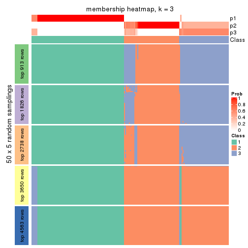</p>

</div>
<div id='tab-SD-pam-membership-heatmap-3'>
<pre><code class="r">membership_heatmap(res, k = 4)
</code></pre>

<p></p>

</div>
<div id='tab-SD-pam-membership-heatmap-4'>
<pre><code class="r">membership_heatmap(res, k = 5)
</code></pre>

<p>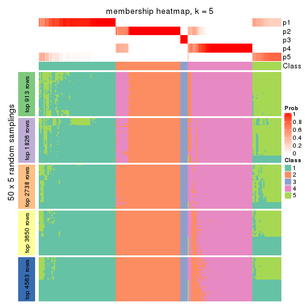</p>

</div>
<div id='tab-SD-pam-membership-heatmap-5'>
<pre><code class="r">membership_heatmap(res, k = 6)
</code></pre>

<p></p>

</div>
</div>

As soon as we have had the classes for columns, we can look for signatures
which are significantly different between classes which can be candidate marks
for certain classes. Following are the heatmaps for signatures.


Signature heatmaps where rows are scaled:


<script>
$( function() {
	$( '#tabs-SD-pam-get-signatures' ).tabs();
} );
</script>
<div id='tabs-SD-pam-get-signatures'>
<ul>
<li><a href='#tab-SD-pam-get-signatures-1'>k = 2</a></li>
<li><a href='#tab-SD-pam-get-signatures-2'>k = 3</a></li>
<li><a href='#tab-SD-pam-get-signatures-3'>k = 4</a></li>
<li><a href='#tab-SD-pam-get-signatures-4'>k = 5</a></li>
<li><a href='#tab-SD-pam-get-signatures-5'>k = 6</a></li>
</ul>
<div id='tab-SD-pam-get-signatures-1'>
<pre><code class="r">get_signatures(res, k = 2)
</code></pre>

<p></p>

</div>
<div id='tab-SD-pam-get-signatures-2'>
<pre><code class="r">get_signatures(res, k = 3)
</code></pre>

<p></p>

</div>
<div id='tab-SD-pam-get-signatures-3'>
<pre><code class="r">get_signatures(res, k = 4)
</code></pre>

<p></p>

</div>
<div id='tab-SD-pam-get-signatures-4'>
<pre><code class="r">get_signatures(res, k = 5)
</code></pre>

<p></p>

</div>
<div id='tab-SD-pam-get-signatures-5'>
<pre><code class="r">get_signatures(res, k = 6)
</code></pre>

<p></p>

</div>
</div>


Signature heatmaps where rows are not scaled:


<script>
$( function() {
	$( '#tabs-SD-pam-get-signatures-no-scale' ).tabs();
} );
</script>
<div id='tabs-SD-pam-get-signatures-no-scale'>
<ul>
<li><a href='#tab-SD-pam-get-signatures-no-scale-1'>k = 2</a></li>
<li><a href='#tab-SD-pam-get-signatures-no-scale-2'>k = 3</a></li>
<li><a href='#tab-SD-pam-get-signatures-no-scale-3'>k = 4</a></li>
<li><a href='#tab-SD-pam-get-signatures-no-scale-4'>k = 5</a></li>
<li><a href='#tab-SD-pam-get-signatures-no-scale-5'>k = 6</a></li>
</ul>
<div id='tab-SD-pam-get-signatures-no-scale-1'>
<pre><code class="r">get_signatures(res, k = 2, scale_rows = FALSE)
</code></pre>

<p></p>

</div>
<div id='tab-SD-pam-get-signatures-no-scale-2'>
<pre><code class="r">get_signatures(res, k = 3, scale_rows = FALSE)
</code></pre>

<p></p>

</div>
<div id='tab-SD-pam-get-signatures-no-scale-3'>
<pre><code class="r">get_signatures(res, k = 4, scale_rows = FALSE)
</code></pre>

<p></p>

</div>
<div id='tab-SD-pam-get-signatures-no-scale-4'>
<pre><code class="r">get_signatures(res, k = 5, scale_rows = FALSE)
</code></pre>

<p></p>

</div>
<div id='tab-SD-pam-get-signatures-no-scale-5'>
<pre><code class="r">get_signatures(res, k = 6, scale_rows = FALSE)
</code></pre>

<p></p>

</div>
</div>


Compare the overlap of signatures from different k:

```r
compare_signatures(res)
```


`get_signature()` returns a data frame invisibly. TO get the list of signatures, the function
call should be assigned to a variable explicitly. In following code, if `plot` argument is set
to `FALSE`, no heatmap is plotted while only the differential analysis is performed.

```r
# code only for demonstration
tb = get_signature(res, k = ..., plot = FALSE)
```

An example of the output of `tb` is:

```
#>   which_row         fdr    mean_1    mean_2 scaled_mean_1 scaled_mean_2 km
#> 1        38 0.042760348  8.373488  9.131774    -0.5533452     0.5164555  1
#> 2        40 0.018707592  7.106213  8.469186    -0.6173731     0.5762149  1
#> 3        55 0.019134737 10.221463 11.207825    -0.6159697     0.5749050  1
#> 4        59 0.006059896  5.921854  7.869574    -0.6899429     0.6439467  1
#> 5        60 0.018055526  8.928898 10.211722    -0.6204761     0.5791110  1
#> 6        98 0.009384629 15.714769 14.887706     0.6635654    -0.6193277  2
...
```

The columns in `tb` are:

1. `which_row`: row indices corresponding to the input matrix.
2. `fdr`: FDR for the differential test. 
3. `mean_x`: The mean value in group x.
4. `scaled_mean_x`: The mean value in group x after rows are scaled.
5. `km`: Row groups if k-means clustering is applied to rows.


UMAP plot which shows how samples are separated.


<script>
$( function() {
	$( '#tabs-SD-pam-dimension-reduction' ).tabs();
} );
</script>
<div id='tabs-SD-pam-dimension-reduction'>
<ul>
<li><a href='#tab-SD-pam-dimension-reduction-1'>k = 2</a></li>
<li><a href='#tab-SD-pam-dimension-reduction-2'>k = 3</a></li>
<li><a href='#tab-SD-pam-dimension-reduction-3'>k = 4</a></li>
<li><a href='#tab-SD-pam-dimension-reduction-4'>k = 5</a></li>
<li><a href='#tab-SD-pam-dimension-reduction-5'>k = 6</a></li>
</ul>
<div id='tab-SD-pam-dimension-reduction-1'>
<pre><code class="r">dimension_reduction(res, k = 2, method = &quot;UMAP&quot;)
</code></pre>

<p></p>

</div>
<div id='tab-SD-pam-dimension-reduction-2'>
<pre><code class="r">dimension_reduction(res, k = 3, method = &quot;UMAP&quot;)
</code></pre>

<p></p>

</div>
<div id='tab-SD-pam-dimension-reduction-3'>
<pre><code class="r">dimension_reduction(res, k = 4, method = &quot;UMAP&quot;)
</code></pre>

<p></p>

</div>
<div id='tab-SD-pam-dimension-reduction-4'>
<pre><code class="r">dimension_reduction(res, k = 5, method = &quot;UMAP&quot;)
</code></pre>

<p></p>

</div>
<div id='tab-SD-pam-dimension-reduction-5'>
<pre><code class="r">dimension_reduction(res, k = 6, method = &quot;UMAP&quot;)
</code></pre>

<p></p>

</div>
</div>


Following heatmap shows how subgroups are split when increasing `k`:

```r
collect_classes(res)
```


If matrix rows can be associated to genes, consider to use `functional_enrichment(res,
...)` to perform function enrichment for the signature genes. See [this vignette](http://bioconductor.org/packages/devel/bioc/vignettes/cola/inst/doc/functional_enrichment.html) for more detailed explanations.


 

---------------------------------------------------


### SD:mclust*


The object with results only for a single top-value method and a single partition method 
can be extracted as:

```r
res = res_list["SD", "mclust"]
# you can also extract it by
# res = res_list["SD:mclust"]
```

A summary of `res` and all the functions that can be applied to it:

```r
res
```

```
#> A 'ConsensusPartition' object with k = 2, 3, 4, 5, 6.
#>   On a matrix with 9126 rows and 192 columns.
#>   Top rows (913, 1826, 2738, 3650, 4563) are extracted by 'SD' method.
#>   Subgroups are detected by 'mclust' method.
#>   Performed in total 1250 partitions by row resampling.
#>   Best k for subgroups seems to be 5.
#> 
#> Following methods can be applied to this 'ConsensusPartition' object:
#>  [1] "cola_report"             "collect_classes"         "collect_plots"          
#>  [4] "collect_stats"           "colnames"                "compare_signatures"     
#>  [7] "consensus_heatmap"       "dimension_reduction"     "functional_enrichment"  
#> [10] "get_anno_col"            "get_anno"                "get_classes"            
#> [13] "get_consensus"           "get_matrix"              "get_membership"         
#> [16] "get_param"               "get_signatures"          "get_stats"              
#> [19] "is_best_k"               "is_stable_k"             "membership_heatmap"     
#> [22] "ncol"                    "nrow"                    "plot_ecdf"              
#> [25] "rownames"                "select_partition_number" "show"                   
#> [28] "suggest_best_k"          "test_to_known_factors"
```

`collect_plots()` function collects all the plots made from `res` for all `k` (number of partitions)
into one single page to provide an easy and fast comparison between different `k`.

```r
collect_plots(res)
```


The plots are:

- The first row: a plot of the ECDF (empirical cumulative distribution
  function) curves of the consensus matrix for each `k` and the heatmap of
  predicted classes for each `k`.
- The second row: heatmaps of the consensus matrix for each `k`.
- The third row: heatmaps of the membership matrix for each `k`.
- The fouth row: heatmaps of the signatures for each `k`.

All the plots in panels can be made by individual functions and they are
plotted later in this section.

`select_partition_number()` produces several plots showing different
statistics for choosing "optimized" `k`. There are following statistics:

- ECDF curves of the consensus matrix for each `k`;
- 1-PAC. [The PAC
  score](https://en.wikipedia.org/wiki/Consensus_clustering#Over-interpretation_potential_of_consensus_clustering)
  measures the proportion of the ambiguous subgrouping.
- Mean silhouette score.
- Concordance. The mean probability of fiting the consensus class ids in all
  partitions.
- Area increased. Denote $A_k$ as the area under the ECDF curve for current
  `k`, the area increased is defined as $A_k - A_{k-1}$.
- Rand index. The percent of pairs of samples that are both in a same cluster
  or both are not in a same cluster in the partition of k and k-1.
- Jaccard index. The ratio of pairs of samples are both in a same cluster in
  the partition of k and k-1 and the pairs of samples are both in a same
  cluster in the partition k or k-1.

The detailed explanations of these statistics can be found in [the _cola_
vignette](http://bioconductor.org/packages/devel/bioc/vignettes/cola/inst/doc/cola.html#toc_13).

Generally speaking, lower PAC score, higher mean silhouette score or higher
concordance corresponds to better partition. Rand index and Jaccard index
measure how similar the current partition is compared to partition with `k-1`.
If they are too similar, we won't accept `k` is better than `k-1`.

```r
select_partition_number(res)
```


The numeric values for all these statistics can be obtained by `get_stats()`.

```r
get_stats(res)
```

```
#>   k 1-PAC mean_silhouette concordance area_increased  Rand Jaccard
#> 2 2 1.000           0.980       0.990         0.4986 0.501   0.501
#> 3 3 0.829           0.820       0.897         0.2016 0.924   0.848
#> 4 4 0.794           0.921       0.887         0.1460 0.864   0.686
#> 5 5 0.947           0.916       0.948         0.1213 0.917   0.725
#> 6 6 0.875           0.862       0.900         0.0307 0.988   0.949
```

`suggest_best_k()` suggests the best $k$ based on these statistics. The rules are as follows:

- All $k$ with Jaccard index larger than 0.95 are removed because increasing
  $k$ does not provide enough extra information. If all $k$ are removed, it is
  marked as no subgroup is detected.
- For all $k$ with 1-PAC score larger than 0.9, the maximal $k$ is taken as
  the best $k$, and other $k$ are marked as optional $k$.
- If it does not fit the second rule. The $k$ with the maximal vote of the
  highest 1-PAC score, highest mean silhouette, and highest concordance is
  taken as the best $k$.

```r
suggest_best_k(res)
```

```
#> [1] 5
#> attr(,"optional")
#> [1] 2
```

There is also optional best $k$ = 2 that is worth to check.

Following shows the table of the partitions (You need to click the **show/hide
code output** link to see it). The membership matrix (columns with name `p*`)
is inferred by
[`clue::cl_consensus()`](https://www.rdocumentation.org/link/cl_consensus?package=clue)
function with the `SE` method. Basically the value in the membership matrix
represents the probability to belong to a certain group. The finall class
label for an item is determined with the group with highest probability it
belongs to.

In `get_classes()` function, the entropy is calculated from the membership
matrix and the silhouette score is calculated from the consensus matrix.


<script>
$( function() {
	$( '#tabs-SD-mclust-get-classes' ).tabs();
} );
</script>
<div id='tabs-SD-mclust-get-classes'>
<ul>
<li><a href='#tab-SD-mclust-get-classes-1'>k = 2</a></li>
<li><a href='#tab-SD-mclust-get-classes-2'>k = 3</a></li>
<li><a href='#tab-SD-mclust-get-classes-3'>k = 4</a></li>
<li><a href='#tab-SD-mclust-get-classes-4'>k = 5</a></li>
<li><a href='#tab-SD-mclust-get-classes-5'>k = 6</a></li>
</ul>

<div id='tab-SD-mclust-get-classes-1'>
<p><a id='tab-SD-mclust-get-classes-1-a' style='color:#0366d6' href='#'>show/hide code output</a></p>
<pre><code class="r">cbind(get_classes(res, k = 2), get_membership(res, k = 2))
</code></pre>

<pre><code>#&gt;            class entropy silhouette    p1    p2
#&gt; SRR2074921     2   0.833      0.640 0.264 0.736
#&gt; SRR2074919     1   0.680      0.792 0.820 0.180
#&gt; SRR2074920     1   0.680      0.792 0.820 0.180
#&gt; SRR2074917     1   0.680      0.792 0.820 0.180
#&gt; SRR2074918     2   0.278      0.950 0.048 0.952
#&gt; SRR2074916     2   0.000      0.993 0.000 1.000
#&gt; SRR2074915     2   0.260      0.954 0.044 0.956
#&gt; SRR2074914     1   0.000      0.986 1.000 0.000
#&gt; SRR2074913     2   0.260      0.954 0.044 0.956
#&gt; SRR2074912     1   0.680      0.792 0.820 0.180
#&gt; SRR2074911     2   0.260      0.954 0.044 0.956
#&gt; SRR2074910     2   0.260      0.954 0.044 0.956
#&gt; SRR2074909     1   0.000      0.986 1.000 0.000
#&gt; SRR2074907     1   0.000      0.986 1.000 0.000
#&gt; SRR2074908     2   0.000      0.993 0.000 1.000
#&gt; SRR2074906     2   0.000      0.993 0.000 1.000
#&gt; SRR2074905     1   0.000      0.986 1.000 0.000
#&gt; SRR2074904     2   0.000      0.993 0.000 1.000
#&gt; SRR2074903     2   0.000      0.993 0.000 1.000
#&gt; SRR2074902     1   0.000      0.986 1.000 0.000
#&gt; SRR2074901     2   0.000      0.993 0.000 1.000
#&gt; SRR2074900     1   0.000      0.986 1.000 0.000
#&gt; SRR2074899     2   0.000      0.993 0.000 1.000
#&gt; SRR2074898     2   0.000      0.993 0.000 1.000
#&gt; SRR2074897     2   0.000      0.993 0.000 1.000
#&gt; SRR2074896     2   0.000      0.993 0.000 1.000
#&gt; SRR2074895     1   0.000      0.986 1.000 0.000
#&gt; SRR2074894     2   0.260      0.954 0.044 0.956
#&gt; SRR2074893     2   0.000      0.993 0.000 1.000
#&gt; SRR2074892     1   0.000      0.986 1.000 0.000
#&gt; SRR2074891     1   0.000      0.986 1.000 0.000
#&gt; SRR2074890     2   0.000      0.993 0.000 1.000
#&gt; SRR2074887     2   0.000      0.993 0.000 1.000
#&gt; SRR2074889     2   0.000      0.993 0.000 1.000
#&gt; SRR2074886     2   0.000      0.993 0.000 1.000
#&gt; SRR2074888     2   0.000      0.993 0.000 1.000
#&gt; SRR2074885     1   0.000      0.986 1.000 0.000
#&gt; SRR2074884     2   0.000      0.993 0.000 1.000
#&gt; SRR2074883     2   0.000      0.993 0.000 1.000
#&gt; SRR2074882     1   0.000      0.986 1.000 0.000
#&gt; SRR2074880     2   0.000      0.993 0.000 1.000
#&gt; SRR2074881     2   0.000      0.993 0.000 1.000
#&gt; SRR2074879     1   0.680      0.792 0.820 0.180
#&gt; SRR2074878     1   0.000      0.986 1.000 0.000
#&gt; SRR2074877     2   0.000      0.993 0.000 1.000
#&gt; SRR2074876     1   0.000      0.986 1.000 0.000
#&gt; SRR2074875     2   0.000      0.993 0.000 1.000
#&gt; SRR2074874     1   0.000      0.986 1.000 0.000
#&gt; SRR2074873     2   0.000      0.993 0.000 1.000
#&gt; SRR2074872     1   0.000      0.986 1.000 0.000
#&gt; SRR2074871     2   0.000      0.993 0.000 1.000
#&gt; SRR2074870     1   0.000      0.986 1.000 0.000
#&gt; SRR2074869     1   0.000      0.986 1.000 0.000
#&gt; SRR2074868     1   0.000      0.986 1.000 0.000
#&gt; SRR2074867     2   0.000      0.993 0.000 1.000
#&gt; SRR2074866     2   0.000      0.993 0.000 1.000
#&gt; SRR2074865     1   0.000      0.986 1.000 0.000
#&gt; SRR2074864     1   0.000      0.986 1.000 0.000
#&gt; SRR2074863     1   0.000      0.986 1.000 0.000
#&gt; SRR2074862     1   0.000      0.986 1.000 0.000
#&gt; SRR2074861     1   0.000      0.986 1.000 0.000
#&gt; SRR2074860     1   0.574      0.848 0.864 0.136
#&gt; SRR2074859     1   0.000      0.986 1.000 0.000
#&gt; SRR2074858     2   0.000      0.993 0.000 1.000
#&gt; SRR2074855     2   0.000      0.993 0.000 1.000
#&gt; SRR2074857     1   0.000      0.986 1.000 0.000
#&gt; SRR2074856     1   0.000      0.986 1.000 0.000
#&gt; SRR2074854     1   0.000      0.986 1.000 0.000
#&gt; SRR2074853     1   0.000      0.986 1.000 0.000
#&gt; SRR2074852     2   0.000      0.993 0.000 1.000
#&gt; SRR2074851     1   0.000      0.986 1.000 0.000
#&gt; SRR2074850     1   0.000      0.986 1.000 0.000
#&gt; SRR2074849     1   0.000      0.986 1.000 0.000
#&gt; SRR2074848     1   0.000      0.986 1.000 0.000
#&gt; SRR2074847     1   0.000      0.986 1.000 0.000
#&gt; SRR2074846     1   0.482      0.885 0.896 0.104
#&gt; SRR2074845     1   0.000      0.986 1.000 0.000
#&gt; SRR2074843     1   0.000      0.986 1.000 0.000
#&gt; SRR2074842     2   0.000      0.993 0.000 1.000
#&gt; SRR2074844     2   0.000      0.993 0.000 1.000
#&gt; SRR2074841     2   0.000      0.993 0.000 1.000
#&gt; SRR2074840     2   0.000      0.993 0.000 1.000
#&gt; SRR2074839     1   0.000      0.986 1.000 0.000
#&gt; SRR2074838     2   0.000      0.993 0.000 1.000
#&gt; SRR2074836     2   0.000      0.993 0.000 1.000
#&gt; SRR2074835     2   0.000      0.993 0.000 1.000
#&gt; SRR2074837     1   0.000      0.986 1.000 0.000
#&gt; SRR2074834     2   0.000      0.993 0.000 1.000
#&gt; SRR2074833     1   0.000      0.986 1.000 0.000
#&gt; SRR2074832     2   0.000      0.993 0.000 1.000
#&gt; SRR2074831     1   0.000      0.986 1.000 0.000
#&gt; SRR2074829     1   0.000      0.986 1.000 0.000
#&gt; SRR2074830     1   0.000      0.986 1.000 0.000
#&gt; SRR2074828     1   0.000      0.986 1.000 0.000
#&gt; SRR2074827     2   0.000      0.993 0.000 1.000
#&gt; SRR2074826     2   0.000      0.993 0.000 1.000
#&gt; SRR2074825     2   0.000      0.993 0.000 1.000
#&gt; SRR2074824     2   0.000      0.993 0.000 1.000
#&gt; SRR2074823     1   0.000      0.986 1.000 0.000
#&gt; SRR2074822     2   0.000      0.993 0.000 1.000
#&gt; SRR2074821     2   0.000      0.993 0.000 1.000
#&gt; SRR2074820     2   0.000      0.993 0.000 1.000
#&gt; SRR2074819     2   0.000      0.993 0.000 1.000
#&gt; SRR2074817     2   0.000      0.993 0.000 1.000
#&gt; SRR2074818     2   0.000      0.993 0.000 1.000
#&gt; SRR2074816     1   0.000      0.986 1.000 0.000
#&gt; SRR2074815     2   0.000      0.993 0.000 1.000
#&gt; SRR2074814     1   0.000      0.986 1.000 0.000
#&gt; SRR2074812     2   0.000      0.993 0.000 1.000
#&gt; SRR2074813     2   0.000      0.993 0.000 1.000
#&gt; SRR2074809     2   0.000      0.993 0.000 1.000
#&gt; SRR2074810     2   0.000      0.993 0.000 1.000
#&gt; SRR2074811     2   0.000      0.993 0.000 1.000
#&gt; SRR2074808     2   0.000      0.993 0.000 1.000
#&gt; SRR2074807     2   0.000      0.993 0.000 1.000
#&gt; SRR2074806     1   0.000      0.986 1.000 0.000
#&gt; SRR2074805     2   0.000      0.993 0.000 1.000
#&gt; SRR2074804     1   0.000      0.986 1.000 0.000
#&gt; SRR2074803     1   0.000      0.986 1.000 0.000
#&gt; SRR2074801     1   0.000      0.986 1.000 0.000
#&gt; SRR2074802     2   0.000      0.993 0.000 1.000
#&gt; SRR2074799     2   0.000      0.993 0.000 1.000
#&gt; SRR2074800     1   0.000      0.986 1.000 0.000
#&gt; SRR2074798     1   0.000      0.986 1.000 0.000
#&gt; SRR2074797     1   0.000      0.986 1.000 0.000
#&gt; SRR2074795     2   0.000      0.993 0.000 1.000
#&gt; SRR2074796     2   0.000      0.993 0.000 1.000
#&gt; SRR2074794     2   0.000      0.993 0.000 1.000
#&gt; SRR2074793     2   0.000      0.993 0.000 1.000
#&gt; SRR2074792     1   0.000      0.986 1.000 0.000
#&gt; SRR2074791     1   0.000      0.986 1.000 0.000
#&gt; SRR2074790     2   0.000      0.993 0.000 1.000
#&gt; SRR2074789     1   0.000      0.986 1.000 0.000
#&gt; SRR2074788     1   0.000      0.986 1.000 0.000
#&gt; SRR2074787     1   0.000      0.986 1.000 0.000
#&gt; SRR2074786     2   0.000      0.993 0.000 1.000
#&gt; SRR2074785     1   0.000      0.986 1.000 0.000
#&gt; SRR2074784     1   0.000      0.986 1.000 0.000
#&gt; SRR2074783     2   0.000      0.993 0.000 1.000
#&gt; SRR2074782     1   0.000      0.986 1.000 0.000
#&gt; SRR2074779     2   0.000      0.993 0.000 1.000
#&gt; SRR2074781     2   0.000      0.993 0.000 1.000
#&gt; SRR2074780     1   0.000      0.986 1.000 0.000
#&gt; SRR2074778     2   0.000      0.993 0.000 1.000
#&gt; SRR2074777     2   0.000      0.993 0.000 1.000
#&gt; SRR2074776     2   0.000      0.993 0.000 1.000
#&gt; SRR2074775     1   0.118      0.972 0.984 0.016
#&gt; SRR2074774     1   0.000      0.986 1.000 0.000
#&gt; SRR2074773     2   0.000      0.993 0.000 1.000
#&gt; SRR2074771     2   0.000      0.993 0.000 1.000
#&gt; SRR2074772     1   0.000      0.986 1.000 0.000
#&gt; SRR2074770     1   0.000      0.986 1.000 0.000
#&gt; SRR2074769     2   0.000      0.993 0.000 1.000
#&gt; SRR2074768     2   0.000      0.993 0.000 1.000
#&gt; SRR2074766     2   0.000      0.993 0.000 1.000
#&gt; SRR2074767     1   0.000      0.986 1.000 0.000
#&gt; SRR2074765     1   0.000      0.986 1.000 0.000
#&gt; SRR2074764     2   0.000      0.993 0.000 1.000
#&gt; SRR2074763     2   0.000      0.993 0.000 1.000
#&gt; SRR2074761     1   0.000      0.986 1.000 0.000
#&gt; SRR2074762     2   0.000      0.993 0.000 1.000
#&gt; SRR2074760     2   0.000      0.993 0.000 1.000
#&gt; SRR2074759     1   0.000      0.986 1.000 0.000
#&gt; SRR2074757     2   0.000      0.993 0.000 1.000
#&gt; SRR2074758     2   0.000      0.993 0.000 1.000
#&gt; SRR2074756     2   0.000      0.993 0.000 1.000
#&gt; SRR2074755     1   0.000      0.986 1.000 0.000
#&gt; SRR2074754     1   0.000      0.986 1.000 0.000
#&gt; SRR2074753     2   0.000      0.993 0.000 1.000
#&gt; SRR2074752     1   0.000      0.986 1.000 0.000
#&gt; SRR2074751     1   0.000      0.986 1.000 0.000
#&gt; SRR2074749     2   0.000      0.993 0.000 1.000
#&gt; SRR2074750     1   0.000      0.986 1.000 0.000
#&gt; SRR2074748     1   0.000      0.986 1.000 0.000
#&gt; SRR2074747     2   0.000      0.993 0.000 1.000
#&gt; SRR2074745     1   0.000      0.986 1.000 0.000
#&gt; SRR2074746     2   0.443      0.900 0.092 0.908
#&gt; SRR2074744     2   0.000      0.993 0.000 1.000
#&gt; SRR2074743     2   0.000      0.993 0.000 1.000
#&gt; SRR2074742     2   0.278      0.950 0.048 0.952
#&gt; SRR2074741     1   0.000      0.986 1.000 0.000
#&gt; SRR2074740     2   0.000      0.993 0.000 1.000
#&gt; SRR2074739     1   0.000      0.986 1.000 0.000
#&gt; SRR2074738     2   0.000      0.993 0.000 1.000
#&gt; SRR2074737     2   0.000      0.993 0.000 1.000
#&gt; SRR2074736     2   0.000      0.993 0.000 1.000
#&gt; SRR2074735     1   0.000      0.986 1.000 0.000
#&gt; SRR2074734     2   0.000      0.993 0.000 1.000
#&gt; SRR2074733     1   0.000      0.986 1.000 0.000
#&gt; SRR2074732     2   0.000      0.993 0.000 1.000
#&gt; SRR2074731     2   0.000      0.993 0.000 1.000
#&gt; SRR2074730     1   0.000      0.986 1.000 0.000
</code></pre>

<script>
$('#tab-SD-mclust-get-classes-1-a').parent().next().next().hide();
$('#tab-SD-mclust-get-classes-1-a').click(function(){
  $('#tab-SD-mclust-get-classes-1-a').parent().next().next().toggle();
  return(false);
});
</script>
</div>

<div id='tab-SD-mclust-get-classes-2'>
<p><a id='tab-SD-mclust-get-classes-2-a' style='color:#0366d6' href='#'>show/hide code output</a></p>
<pre><code class="r">cbind(get_classes(res, k = 3), get_membership(res, k = 3))
</code></pre>

<pre><code>#&gt;            class entropy silhouette    p1    p2    p3
#&gt; SRR2074921     3  0.2878      0.741 0.000 0.096 0.904
#&gt; SRR2074919     3  0.3030      0.741 0.004 0.092 0.904
#&gt; SRR2074920     3  0.3030      0.741 0.004 0.092 0.904
#&gt; SRR2074917     3  0.8089      0.567 0.308 0.092 0.600
#&gt; SRR2074918     3  0.2878      0.741 0.000 0.096 0.904
#&gt; SRR2074916     3  0.5098      0.592 0.000 0.248 0.752
#&gt; SRR2074915     3  0.6252      0.512 0.000 0.444 0.556
#&gt; SRR2074914     1  0.0000      0.990 1.000 0.000 0.000
#&gt; SRR2074913     3  0.6286      0.468 0.000 0.464 0.536
#&gt; SRR2074912     3  0.7642      0.646 0.248 0.092 0.660
#&gt; SRR2074911     3  0.2959      0.741 0.000 0.100 0.900
#&gt; SRR2074910     3  0.6180      0.554 0.000 0.416 0.584
#&gt; SRR2074909     1  0.0000      0.990 1.000 0.000 0.000
#&gt; SRR2074907     1  0.0000      0.990 1.000 0.000 0.000
#&gt; SRR2074908     2  0.0592      0.784 0.000 0.988 0.012
#&gt; SRR2074906     2  0.5905      0.685 0.000 0.648 0.352
#&gt; SRR2074905     1  0.0000      0.990 1.000 0.000 0.000
#&gt; SRR2074904     2  0.0000      0.786 0.000 1.000 0.000
#&gt; SRR2074903     2  0.0000      0.786 0.000 1.000 0.000
#&gt; SRR2074902     1  0.0000      0.990 1.000 0.000 0.000
#&gt; SRR2074901     2  0.0000      0.786 0.000 1.000 0.000
#&gt; SRR2074900     1  0.0000      0.990 1.000 0.000 0.000
#&gt; SRR2074899     2  0.0000      0.786 0.000 1.000 0.000
#&gt; SRR2074898     2  0.5905      0.685 0.000 0.648 0.352
#&gt; SRR2074897     2  0.5905      0.685 0.000 0.648 0.352
#&gt; SRR2074896     2  0.0000      0.786 0.000 1.000 0.000
#&gt; SRR2074895     1  0.0000      0.990 1.000 0.000 0.000
#&gt; SRR2074894     2  0.5733      0.244 0.000 0.676 0.324
#&gt; SRR2074893     2  0.0000      0.786 0.000 1.000 0.000
#&gt; SRR2074892     1  0.0000      0.990 1.000 0.000 0.000
#&gt; SRR2074891     1  0.0000      0.990 1.000 0.000 0.000
#&gt; SRR2074890     2  0.0000      0.786 0.000 1.000 0.000
#&gt; SRR2074887     2  0.0000      0.786 0.000 1.000 0.000
#&gt; SRR2074889     2  0.5905      0.685 0.000 0.648 0.352
#&gt; SRR2074886     2  0.0747      0.783 0.000 0.984 0.016
#&gt; SRR2074888     2  0.5905      0.685 0.000 0.648 0.352
#&gt; SRR2074885     1  0.0000      0.990 1.000 0.000 0.000
#&gt; SRR2074884     2  0.5905      0.685 0.000 0.648 0.352
#&gt; SRR2074883     2  0.5905      0.685 0.000 0.648 0.352
#&gt; SRR2074882     1  0.0000      0.990 1.000 0.000 0.000
#&gt; SRR2074880     2  0.5905      0.685 0.000 0.648 0.352
#&gt; SRR2074881     2  0.0000      0.786 0.000 1.000 0.000
#&gt; SRR2074879     3  0.7642      0.646 0.248 0.092 0.660
#&gt; SRR2074878     1  0.0000      0.990 1.000 0.000 0.000
#&gt; SRR2074877     2  0.2066      0.767 0.000 0.940 0.060
#&gt; SRR2074876     1  0.0000      0.990 1.000 0.000 0.000
#&gt; SRR2074875     2  0.5905      0.685 0.000 0.648 0.352
#&gt; SRR2074874     1  0.0000      0.990 1.000 0.000 0.000
#&gt; SRR2074873     2  0.5905      0.685 0.000 0.648 0.352
#&gt; SRR2074872     1  0.0000      0.990 1.000 0.000 0.000
#&gt; SRR2074871     2  0.0000      0.786 0.000 1.000 0.000
#&gt; SRR2074870     1  0.0000      0.990 1.000 0.000 0.000
#&gt; SRR2074869     1  0.0000      0.990 1.000 0.000 0.000
#&gt; SRR2074868     1  0.0000      0.990 1.000 0.000 0.000
#&gt; SRR2074867     2  0.0000      0.786 0.000 1.000 0.000
#&gt; SRR2074866     2  0.1031      0.781 0.000 0.976 0.024
#&gt; SRR2074865     1  0.0000      0.990 1.000 0.000 0.000
#&gt; SRR2074864     1  0.0000      0.990 1.000 0.000 0.000
#&gt; SRR2074863     1  0.0000      0.990 1.000 0.000 0.000
#&gt; SRR2074862     1  0.0000      0.990 1.000 0.000 0.000
#&gt; SRR2074861     1  0.0000      0.990 1.000 0.000 0.000
#&gt; SRR2074860     3  0.8131      0.431 0.376 0.076 0.548
#&gt; SRR2074859     1  0.0000      0.990 1.000 0.000 0.000
#&gt; SRR2074858     2  0.0000      0.786 0.000 1.000 0.000
#&gt; SRR2074855     2  0.5905      0.685 0.000 0.648 0.352
#&gt; SRR2074857     1  0.0000      0.990 1.000 0.000 0.000
#&gt; SRR2074856     1  0.0000      0.990 1.000 0.000 0.000
#&gt; SRR2074854     1  0.0000      0.990 1.000 0.000 0.000
#&gt; SRR2074853     1  0.0000      0.990 1.000 0.000 0.000
#&gt; SRR2074852     2  0.5905      0.685 0.000 0.648 0.352
#&gt; SRR2074851     1  0.0000      0.990 1.000 0.000 0.000
#&gt; SRR2074850     1  0.0000      0.990 1.000 0.000 0.000
#&gt; SRR2074849     1  0.0000      0.990 1.000 0.000 0.000
#&gt; SRR2074848     1  0.0000      0.990 1.000 0.000 0.000
#&gt; SRR2074847     1  0.0000      0.990 1.000 0.000 0.000
#&gt; SRR2074846     1  0.8203     -0.177 0.484 0.072 0.444
#&gt; SRR2074845     1  0.0000      0.990 1.000 0.000 0.000
#&gt; SRR2074843     1  0.0000      0.990 1.000 0.000 0.000
#&gt; SRR2074842     2  0.0000      0.786 0.000 1.000 0.000
#&gt; SRR2074844     2  0.0000      0.786 0.000 1.000 0.000
#&gt; SRR2074841     2  0.5905      0.685 0.000 0.648 0.352
#&gt; SRR2074840     2  0.5905      0.685 0.000 0.648 0.352
#&gt; SRR2074839     1  0.0000      0.990 1.000 0.000 0.000
#&gt; SRR2074838     2  0.5905      0.685 0.000 0.648 0.352
#&gt; SRR2074836     2  0.0000      0.786 0.000 1.000 0.000
#&gt; SRR2074835     2  0.5905      0.685 0.000 0.648 0.352
#&gt; SRR2074837     1  0.0000      0.990 1.000 0.000 0.000
#&gt; SRR2074834     2  0.1753      0.738 0.000 0.952 0.048
#&gt; SRR2074833     1  0.0000      0.990 1.000 0.000 0.000
#&gt; SRR2074832     2  0.1643      0.774 0.000 0.956 0.044
#&gt; SRR2074831     1  0.0000      0.990 1.000 0.000 0.000
#&gt; SRR2074829     1  0.0000      0.990 1.000 0.000 0.000
#&gt; SRR2074830     1  0.0000      0.990 1.000 0.000 0.000
#&gt; SRR2074828     1  0.0000      0.990 1.000 0.000 0.000
#&gt; SRR2074827     2  0.0000      0.786 0.000 1.000 0.000
#&gt; SRR2074826     2  0.0000      0.786 0.000 1.000 0.000
#&gt; SRR2074825     2  0.5905      0.685 0.000 0.648 0.352
#&gt; SRR2074824     2  0.5905      0.685 0.000 0.648 0.352
#&gt; SRR2074823     1  0.0000      0.990 1.000 0.000 0.000
#&gt; SRR2074822     2  0.5905      0.685 0.000 0.648 0.352
#&gt; SRR2074821     2  0.1289      0.778 0.000 0.968 0.032
#&gt; SRR2074820     2  0.5905      0.685 0.000 0.648 0.352
#&gt; SRR2074819     2  0.0000      0.786 0.000 1.000 0.000
#&gt; SRR2074817     2  0.0000      0.786 0.000 1.000 0.000
#&gt; SRR2074818     2  0.6062      0.645 0.000 0.616 0.384
#&gt; SRR2074816     1  0.0000      0.990 1.000 0.000 0.000
#&gt; SRR2074815     2  0.0000      0.786 0.000 1.000 0.000
#&gt; SRR2074814     1  0.0000      0.990 1.000 0.000 0.000
#&gt; SRR2074812     2  0.5905      0.685 0.000 0.648 0.352
#&gt; SRR2074813     2  0.6225      0.432 0.000 0.568 0.432
#&gt; SRR2074809     2  0.5905      0.685 0.000 0.648 0.352
#&gt; SRR2074810     2  0.0000      0.786 0.000 1.000 0.000
#&gt; SRR2074811     2  0.5905      0.685 0.000 0.648 0.352
#&gt; SRR2074808     2  0.0000      0.786 0.000 1.000 0.000
#&gt; SRR2074807     2  0.0000      0.786 0.000 1.000 0.000
#&gt; SRR2074806     1  0.0000      0.990 1.000 0.000 0.000
#&gt; SRR2074805     2  0.5905      0.685 0.000 0.648 0.352
#&gt; SRR2074804     1  0.0000      0.990 1.000 0.000 0.000
#&gt; SRR2074803     1  0.0000      0.990 1.000 0.000 0.000
#&gt; SRR2074801     1  0.0000      0.990 1.000 0.000 0.000
#&gt; SRR2074802     2  0.0000      0.786 0.000 1.000 0.000
#&gt; SRR2074799     2  0.5905      0.685 0.000 0.648 0.352
#&gt; SRR2074800     1  0.0000      0.990 1.000 0.000 0.000
#&gt; SRR2074798     1  0.0000      0.990 1.000 0.000 0.000
#&gt; SRR2074797     1  0.0000      0.990 1.000 0.000 0.000
#&gt; SRR2074795     2  0.5905      0.685 0.000 0.648 0.352
#&gt; SRR2074796     2  0.0000      0.786 0.000 1.000 0.000
#&gt; SRR2074794     2  0.5905      0.685 0.000 0.648 0.352
#&gt; SRR2074793     2  0.0592      0.784 0.000 0.988 0.012
#&gt; SRR2074792     1  0.0000      0.990 1.000 0.000 0.000
#&gt; SRR2074791     1  0.0000      0.990 1.000 0.000 0.000
#&gt; SRR2074790     2  0.5905      0.685 0.000 0.648 0.352
#&gt; SRR2074789     1  0.0000      0.990 1.000 0.000 0.000
#&gt; SRR2074788     1  0.0000      0.990 1.000 0.000 0.000
#&gt; SRR2074787     1  0.0000      0.990 1.000 0.000 0.000
#&gt; SRR2074786     2  0.0000      0.786 0.000 1.000 0.000
#&gt; SRR2074785     1  0.0000      0.990 1.000 0.000 0.000
#&gt; SRR2074784     1  0.0000      0.990 1.000 0.000 0.000
#&gt; SRR2074783     2  0.5905      0.685 0.000 0.648 0.352
#&gt; SRR2074782     1  0.0000      0.990 1.000 0.000 0.000
#&gt; SRR2074779     2  0.0000      0.786 0.000 1.000 0.000
#&gt; SRR2074781     2  0.0000      0.786 0.000 1.000 0.000
#&gt; SRR2074780     1  0.0000      0.990 1.000 0.000 0.000
#&gt; SRR2074778     2  0.0000      0.786 0.000 1.000 0.000
#&gt; SRR2074777     2  0.0000      0.786 0.000 1.000 0.000
#&gt; SRR2074776     2  0.5905      0.685 0.000 0.648 0.352
#&gt; SRR2074775     1  0.5639      0.633 0.752 0.016 0.232
#&gt; SRR2074774     1  0.0000      0.990 1.000 0.000 0.000
#&gt; SRR2074773     2  0.0000      0.786 0.000 1.000 0.000
#&gt; SRR2074771     2  0.0000      0.786 0.000 1.000 0.000
#&gt; SRR2074772     1  0.0000      0.990 1.000 0.000 0.000
#&gt; SRR2074770     1  0.0000      0.990 1.000 0.000 0.000
#&gt; SRR2074769     2  0.5905      0.685 0.000 0.648 0.352
#&gt; SRR2074768     2  0.5905      0.685 0.000 0.648 0.352
#&gt; SRR2074766     2  0.0000      0.786 0.000 1.000 0.000
#&gt; SRR2074767     1  0.0000      0.990 1.000 0.000 0.000
#&gt; SRR2074765     1  0.0000      0.990 1.000 0.000 0.000
#&gt; SRR2074764     2  0.0000      0.786 0.000 1.000 0.000
#&gt; SRR2074763     2  0.5905      0.685 0.000 0.648 0.352
#&gt; SRR2074761     1  0.0000      0.990 1.000 0.000 0.000
#&gt; SRR2074762     2  0.0000      0.786 0.000 1.000 0.000
#&gt; SRR2074760     2  0.0000      0.786 0.000 1.000 0.000
#&gt; SRR2074759     1  0.0000      0.990 1.000 0.000 0.000
#&gt; SRR2074757     2  0.0000      0.786 0.000 1.000 0.000
#&gt; SRR2074758     2  0.5905      0.685 0.000 0.648 0.352
#&gt; SRR2074756     2  0.0000      0.786 0.000 1.000 0.000
#&gt; SRR2074755     1  0.0000      0.990 1.000 0.000 0.000
#&gt; SRR2074754     1  0.0000      0.990 1.000 0.000 0.000
#&gt; SRR2074753     2  0.6302     -0.364 0.000 0.520 0.480
#&gt; SRR2074752     1  0.0000      0.990 1.000 0.000 0.000
#&gt; SRR2074751     1  0.0000      0.990 1.000 0.000 0.000
#&gt; SRR2074749     2  0.5058      0.485 0.000 0.756 0.244
#&gt; SRR2074750     1  0.0000      0.990 1.000 0.000 0.000
#&gt; SRR2074748     1  0.0000      0.990 1.000 0.000 0.000
#&gt; SRR2074747     2  0.0000      0.786 0.000 1.000 0.000
#&gt; SRR2074745     1  0.0000      0.990 1.000 0.000 0.000
#&gt; SRR2074746     3  0.6451      0.526 0.004 0.436 0.560
#&gt; SRR2074744     2  0.0000      0.786 0.000 1.000 0.000
#&gt; SRR2074743     2  0.1163      0.780 0.000 0.972 0.028
#&gt; SRR2074742     3  0.2878      0.741 0.000 0.096 0.904
#&gt; SRR2074741     1  0.0000      0.990 1.000 0.000 0.000
#&gt; SRR2074740     2  0.0000      0.786 0.000 1.000 0.000
#&gt; SRR2074739     1  0.0000      0.990 1.000 0.000 0.000
#&gt; SRR2074738     2  0.0000      0.786 0.000 1.000 0.000
#&gt; SRR2074737     2  0.0747      0.783 0.000 0.984 0.016
#&gt; SRR2074736     2  0.0000      0.786 0.000 1.000 0.000
#&gt; SRR2074735     1  0.0000      0.990 1.000 0.000 0.000
#&gt; SRR2074734     2  0.1860      0.771 0.000 0.948 0.052
#&gt; SRR2074733     1  0.0000      0.990 1.000 0.000 0.000
#&gt; SRR2074732     2  0.5905      0.685 0.000 0.648 0.352
#&gt; SRR2074731     2  0.5905      0.685 0.000 0.648 0.352
#&gt; SRR2074730     1  0.0000      0.990 1.000 0.000 0.000
</code></pre>

<script>
$('#tab-SD-mclust-get-classes-2-a').parent().next().next().hide();
$('#tab-SD-mclust-get-classes-2-a').click(function(){
  $('#tab-SD-mclust-get-classes-2-a').parent().next().next().toggle();
  return(false);
});
</script>
</div>

<div id='tab-SD-mclust-get-classes-3'>
<p><a id='tab-SD-mclust-get-classes-3-a' style='color:#0366d6' href='#'>show/hide code output</a></p>
<pre><code class="r">cbind(get_classes(res, k = 4), get_membership(res, k = 4))
</code></pre>

<pre><code>#&gt;            class entropy silhouette    p1    p2    p3    p4
#&gt; SRR2074921     3  0.0000      0.912 0.000 0.000 1.000 0.000
#&gt; SRR2074919     3  0.0000      0.912 0.000 0.000 1.000 0.000
#&gt; SRR2074920     3  0.0000      0.912 0.000 0.000 1.000 0.000
#&gt; SRR2074917     3  0.0000      0.912 0.000 0.000 1.000 0.000
#&gt; SRR2074918     3  0.0000      0.912 0.000 0.000 1.000 0.000
#&gt; SRR2074916     3  0.2635      0.867 0.000 0.076 0.904 0.020
#&gt; SRR2074915     3  0.2197      0.869 0.000 0.080 0.916 0.004
#&gt; SRR2074914     1  0.4222      0.814 0.728 0.272 0.000 0.000
#&gt; SRR2074913     3  0.3626      0.778 0.000 0.184 0.812 0.004
#&gt; SRR2074912     3  0.0000      0.912 0.000 0.000 1.000 0.000
#&gt; SRR2074911     3  0.0000      0.912 0.000 0.000 1.000 0.000
#&gt; SRR2074910     3  0.0000      0.912 0.000 0.000 1.000 0.000
#&gt; SRR2074909     1  0.4250      0.812 0.724 0.276 0.000 0.000
#&gt; SRR2074907     1  0.3726      0.840 0.788 0.212 0.000 0.000
#&gt; SRR2074908     2  0.4509      0.991 0.000 0.708 0.004 0.288
#&gt; SRR2074906     4  0.0000      0.987 0.000 0.000 0.000 1.000
#&gt; SRR2074905     1  0.1389      0.895 0.952 0.048 0.000 0.000
#&gt; SRR2074904     2  0.4356      0.996 0.000 0.708 0.000 0.292
#&gt; SRR2074903     2  0.4356      0.996 0.000 0.708 0.000 0.292
#&gt; SRR2074902     1  0.1118      0.897 0.964 0.036 0.000 0.000
#&gt; SRR2074901     2  0.4356      0.996 0.000 0.708 0.000 0.292
#&gt; SRR2074900     1  0.0336      0.898 0.992 0.008 0.000 0.000
#&gt; SRR2074899     2  0.4356      0.996 0.000 0.708 0.000 0.292
#&gt; SRR2074898     4  0.0000      0.987 0.000 0.000 0.000 1.000
#&gt; SRR2074897     4  0.0000      0.987 0.000 0.000 0.000 1.000
#&gt; SRR2074896     2  0.4356      0.996 0.000 0.708 0.000 0.292
#&gt; SRR2074895     1  0.4008      0.827 0.756 0.244 0.000 0.000
#&gt; SRR2074894     3  0.3498      0.723 0.000 0.008 0.832 0.160
#&gt; SRR2074893     2  0.4356      0.996 0.000 0.708 0.000 0.292
#&gt; SRR2074892     1  0.0188      0.898 0.996 0.004 0.000 0.000
#&gt; SRR2074891     1  0.4277      0.810 0.720 0.280 0.000 0.000
#&gt; SRR2074890     2  0.4356      0.996 0.000 0.708 0.000 0.292
#&gt; SRR2074887     2  0.4356      0.996 0.000 0.708 0.000 0.292
#&gt; SRR2074889     4  0.0000      0.987 0.000 0.000 0.000 1.000
#&gt; SRR2074886     2  0.4356      0.996 0.000 0.708 0.000 0.292
#&gt; SRR2074888     4  0.0000      0.987 0.000 0.000 0.000 1.000
#&gt; SRR2074885     1  0.1211      0.896 0.960 0.040 0.000 0.000
#&gt; SRR2074884     4  0.0000      0.987 0.000 0.000 0.000 1.000
#&gt; SRR2074883     4  0.0000      0.987 0.000 0.000 0.000 1.000
#&gt; SRR2074882     1  0.1118      0.897 0.964 0.036 0.000 0.000
#&gt; SRR2074880     4  0.0000      0.987 0.000 0.000 0.000 1.000
#&gt; SRR2074881     2  0.4356      0.996 0.000 0.708 0.000 0.292
#&gt; SRR2074879     3  0.0000      0.912 0.000 0.000 1.000 0.000
#&gt; SRR2074878     1  0.0188      0.898 0.996 0.004 0.000 0.000
#&gt; SRR2074877     2  0.4356      0.996 0.000 0.708 0.000 0.292
#&gt; SRR2074876     1  0.0188      0.898 0.996 0.004 0.000 0.000
#&gt; SRR2074875     4  0.0000      0.987 0.000 0.000 0.000 1.000
#&gt; SRR2074874     1  0.0336      0.898 0.992 0.008 0.000 0.000
#&gt; SRR2074873     4  0.0000      0.987 0.000 0.000 0.000 1.000
#&gt; SRR2074872     1  0.0188      0.898 0.996 0.004 0.000 0.000
#&gt; SRR2074871     2  0.4356      0.996 0.000 0.708 0.000 0.292
#&gt; SRR2074870     1  0.0921      0.897 0.972 0.028 0.000 0.000
#&gt; SRR2074869     1  0.2011      0.887 0.920 0.080 0.000 0.000
#&gt; SRR2074868     1  0.0188      0.898 0.996 0.004 0.000 0.000
#&gt; SRR2074867     2  0.4356      0.996 0.000 0.708 0.000 0.292
#&gt; SRR2074866     2  0.4356      0.996 0.000 0.708 0.000 0.292
#&gt; SRR2074865     1  0.4277      0.810 0.720 0.280 0.000 0.000
#&gt; SRR2074864     1  0.4277      0.810 0.720 0.280 0.000 0.000
#&gt; SRR2074863     1  0.4277      0.810 0.720 0.280 0.000 0.000
#&gt; SRR2074862     1  0.0336      0.898 0.992 0.008 0.000 0.000
#&gt; SRR2074861     1  0.0817      0.898 0.976 0.024 0.000 0.000
#&gt; SRR2074860     3  0.2032      0.880 0.036 0.028 0.936 0.000
#&gt; SRR2074859     1  0.0469      0.899 0.988 0.012 0.000 0.000
#&gt; SRR2074858     2  0.4356      0.996 0.000 0.708 0.000 0.292
#&gt; SRR2074855     4  0.0000      0.987 0.000 0.000 0.000 1.000
#&gt; SRR2074857     1  0.0188      0.898 0.996 0.004 0.000 0.000
#&gt; SRR2074856     1  0.0188      0.898 0.996 0.004 0.000 0.000
#&gt; SRR2074854     1  0.0336      0.898 0.992 0.008 0.000 0.000
#&gt; SRR2074853     1  0.1474      0.894 0.948 0.052 0.000 0.000
#&gt; SRR2074852     4  0.0000      0.987 0.000 0.000 0.000 1.000
#&gt; SRR2074851     1  0.0336      0.898 0.992 0.008 0.000 0.000
#&gt; SRR2074850     1  0.0336      0.898 0.992 0.008 0.000 0.000
#&gt; SRR2074849     1  0.0469      0.899 0.988 0.012 0.000 0.000
#&gt; SRR2074848     1  0.0336      0.898 0.992 0.008 0.000 0.000
#&gt; SRR2074847     1  0.1302      0.896 0.956 0.044 0.000 0.000
#&gt; SRR2074846     3  0.3196      0.812 0.136 0.008 0.856 0.000
#&gt; SRR2074845     1  0.0188      0.898 0.996 0.004 0.000 0.000
#&gt; SRR2074843     1  0.0336      0.898 0.992 0.008 0.000 0.000
#&gt; SRR2074842     2  0.4356      0.996 0.000 0.708 0.000 0.292
#&gt; SRR2074844     2  0.4356      0.996 0.000 0.708 0.000 0.292
#&gt; SRR2074841     4  0.0000      0.987 0.000 0.000 0.000 1.000
#&gt; SRR2074840     4  0.0000      0.987 0.000 0.000 0.000 1.000
#&gt; SRR2074839     1  0.0336      0.898 0.992 0.008 0.000 0.000
#&gt; SRR2074838     4  0.0000      0.987 0.000 0.000 0.000 1.000
#&gt; SRR2074836     2  0.4356      0.996 0.000 0.708 0.000 0.292
#&gt; SRR2074835     4  0.0000      0.987 0.000 0.000 0.000 1.000
#&gt; SRR2074837     1  0.4277      0.810 0.720 0.280 0.000 0.000
#&gt; SRR2074834     2  0.5631      0.886 0.000 0.700 0.076 0.224
#&gt; SRR2074833     1  0.2345      0.881 0.900 0.100 0.000 0.000
#&gt; SRR2074832     2  0.4356      0.996 0.000 0.708 0.000 0.292
#&gt; SRR2074831     1  0.0336      0.898 0.992 0.008 0.000 0.000
#&gt; SRR2074829     1  0.0336      0.898 0.992 0.008 0.000 0.000
#&gt; SRR2074830     1  0.0336      0.898 0.992 0.008 0.000 0.000
#&gt; SRR2074828     1  0.4164      0.818 0.736 0.264 0.000 0.000
#&gt; SRR2074827     2  0.4356      0.996 0.000 0.708 0.000 0.292
#&gt; SRR2074826     2  0.4356      0.996 0.000 0.708 0.000 0.292
#&gt; SRR2074825     4  0.0000      0.987 0.000 0.000 0.000 1.000
#&gt; SRR2074824     4  0.0000      0.987 0.000 0.000 0.000 1.000
#&gt; SRR2074823     1  0.0336      0.898 0.992 0.008 0.000 0.000
#&gt; SRR2074822     4  0.0000      0.987 0.000 0.000 0.000 1.000
#&gt; SRR2074821     2  0.4356      0.996 0.000 0.708 0.000 0.292
#&gt; SRR2074820     4  0.0000      0.987 0.000 0.000 0.000 1.000
#&gt; SRR2074819     2  0.4356      0.996 0.000 0.708 0.000 0.292
#&gt; SRR2074817     2  0.4356      0.996 0.000 0.708 0.000 0.292
#&gt; SRR2074818     4  0.0336      0.976 0.000 0.000 0.008 0.992
#&gt; SRR2074816     1  0.4164      0.818 0.736 0.264 0.000 0.000
#&gt; SRR2074815     2  0.4356      0.996 0.000 0.708 0.000 0.292
#&gt; SRR2074814     1  0.0188      0.898 0.996 0.004 0.000 0.000
#&gt; SRR2074812     4  0.0000      0.987 0.000 0.000 0.000 1.000
#&gt; SRR2074813     4  0.6532      0.301 0.000 0.084 0.368 0.548
#&gt; SRR2074809     4  0.0000      0.987 0.000 0.000 0.000 1.000
#&gt; SRR2074810     2  0.4356      0.996 0.000 0.708 0.000 0.292
#&gt; SRR2074811     4  0.0000      0.987 0.000 0.000 0.000 1.000
#&gt; SRR2074808     2  0.4356      0.996 0.000 0.708 0.000 0.292
#&gt; SRR2074807     2  0.4356      0.996 0.000 0.708 0.000 0.292
#&gt; SRR2074806     1  0.4277      0.810 0.720 0.280 0.000 0.000
#&gt; SRR2074805     4  0.0000      0.987 0.000 0.000 0.000 1.000
#&gt; SRR2074804     1  0.4277      0.810 0.720 0.280 0.000 0.000
#&gt; SRR2074803     1  0.0336      0.899 0.992 0.008 0.000 0.000
#&gt; SRR2074801     1  0.2149      0.885 0.912 0.088 0.000 0.000
#&gt; SRR2074802     2  0.4356      0.996 0.000 0.708 0.000 0.292
#&gt; SRR2074799     4  0.0000      0.987 0.000 0.000 0.000 1.000
#&gt; SRR2074800     1  0.0336      0.898 0.992 0.008 0.000 0.000
#&gt; SRR2074798     1  0.4134      0.820 0.740 0.260 0.000 0.000
#&gt; SRR2074797     1  0.0336      0.898 0.992 0.008 0.000 0.000
#&gt; SRR2074795     4  0.0000      0.987 0.000 0.000 0.000 1.000
#&gt; SRR2074796     2  0.4356      0.996 0.000 0.708 0.000 0.292
#&gt; SRR2074794     4  0.0000      0.987 0.000 0.000 0.000 1.000
#&gt; SRR2074793     2  0.4356      0.996 0.000 0.708 0.000 0.292
#&gt; SRR2074792     1  0.4277      0.810 0.720 0.280 0.000 0.000
#&gt; SRR2074791     1  0.0336      0.898 0.992 0.008 0.000 0.000
#&gt; SRR2074790     4  0.0000      0.987 0.000 0.000 0.000 1.000
#&gt; SRR2074789     1  0.1398      0.873 0.956 0.004 0.040 0.000
#&gt; SRR2074788     1  0.0188      0.898 0.996 0.004 0.000 0.000
#&gt; SRR2074787     1  0.0188      0.898 0.996 0.004 0.000 0.000
#&gt; SRR2074786     2  0.4356      0.996 0.000 0.708 0.000 0.292
#&gt; SRR2074785     1  0.4277      0.810 0.720 0.280 0.000 0.000
#&gt; SRR2074784     1  0.4277      0.810 0.720 0.280 0.000 0.000
#&gt; SRR2074783     4  0.0000      0.987 0.000 0.000 0.000 1.000
#&gt; SRR2074782     1  0.1716      0.892 0.936 0.064 0.000 0.000
#&gt; SRR2074779     2  0.4356      0.996 0.000 0.708 0.000 0.292
#&gt; SRR2074781     2  0.4356      0.996 0.000 0.708 0.000 0.292
#&gt; SRR2074780     1  0.0188      0.898 0.996 0.004 0.000 0.000
#&gt; SRR2074778     2  0.4356      0.996 0.000 0.708 0.000 0.292
#&gt; SRR2074777     2  0.4356      0.996 0.000 0.708 0.000 0.292
#&gt; SRR2074776     4  0.0000      0.987 0.000 0.000 0.000 1.000
#&gt; SRR2074775     3  0.7457      0.365 0.220 0.276 0.504 0.000
#&gt; SRR2074774     1  0.0707      0.898 0.980 0.020 0.000 0.000
#&gt; SRR2074773     2  0.4356      0.996 0.000 0.708 0.000 0.292
#&gt; SRR2074771     2  0.4356      0.996 0.000 0.708 0.000 0.292
#&gt; SRR2074772     1  0.4277      0.810 0.720 0.280 0.000 0.000
#&gt; SRR2074770     1  0.4277      0.810 0.720 0.280 0.000 0.000
#&gt; SRR2074769     4  0.0000      0.987 0.000 0.000 0.000 1.000
#&gt; SRR2074768     4  0.0000      0.987 0.000 0.000 0.000 1.000
#&gt; SRR2074766     2  0.4356      0.996 0.000 0.708 0.000 0.292
#&gt; SRR2074767     1  0.0188      0.898 0.996 0.004 0.000 0.000
#&gt; SRR2074765     1  0.0000      0.899 1.000 0.000 0.000 0.000
#&gt; SRR2074764     2  0.4356      0.996 0.000 0.708 0.000 0.292
#&gt; SRR2074763     4  0.0000      0.987 0.000 0.000 0.000 1.000
#&gt; SRR2074761     1  0.0336      0.898 0.992 0.008 0.000 0.000
#&gt; SRR2074762     2  0.4356      0.996 0.000 0.708 0.000 0.292
#&gt; SRR2074760     2  0.4356      0.996 0.000 0.708 0.000 0.292
#&gt; SRR2074759     1  0.4134      0.820 0.740 0.260 0.000 0.000
#&gt; SRR2074757     2  0.4356      0.996 0.000 0.708 0.000 0.292
#&gt; SRR2074758     4  0.0000      0.987 0.000 0.000 0.000 1.000
#&gt; SRR2074756     2  0.4356      0.996 0.000 0.708 0.000 0.292
#&gt; SRR2074755     1  0.4277      0.810 0.720 0.280 0.000 0.000
#&gt; SRR2074754     1  0.4277      0.810 0.720 0.280 0.000 0.000
#&gt; SRR2074753     3  0.4253      0.735 0.000 0.208 0.776 0.016
#&gt; SRR2074752     1  0.1211      0.896 0.960 0.040 0.000 0.000
#&gt; SRR2074751     1  0.4277      0.810 0.720 0.280 0.000 0.000
#&gt; SRR2074749     2  0.5343      0.920 0.000 0.708 0.052 0.240
#&gt; SRR2074750     1  0.0336      0.898 0.992 0.008 0.000 0.000
#&gt; SRR2074748     1  0.4277      0.810 0.720 0.280 0.000 0.000
#&gt; SRR2074747     2  0.4356      0.996 0.000 0.708 0.000 0.292
#&gt; SRR2074745     1  0.0336      0.898 0.992 0.008 0.000 0.000
#&gt; SRR2074746     3  0.0376      0.910 0.000 0.004 0.992 0.004
#&gt; SRR2074744     2  0.4356      0.996 0.000 0.708 0.000 0.292
#&gt; SRR2074743     2  0.4356      0.996 0.000 0.708 0.000 0.292
#&gt; SRR2074742     3  0.0000      0.912 0.000 0.000 1.000 0.000
#&gt; SRR2074741     1  0.4277      0.810 0.720 0.280 0.000 0.000
#&gt; SRR2074740     2  0.4356      0.996 0.000 0.708 0.000 0.292
#&gt; SRR2074739     1  0.0817      0.898 0.976 0.024 0.000 0.000
#&gt; SRR2074738     2  0.4356      0.996 0.000 0.708 0.000 0.292
#&gt; SRR2074737     2  0.4356      0.996 0.000 0.708 0.000 0.292
#&gt; SRR2074736     2  0.4356      0.996 0.000 0.708 0.000 0.292
#&gt; SRR2074735     1  0.4277      0.810 0.720 0.280 0.000 0.000
#&gt; SRR2074734     2  0.4356      0.996 0.000 0.708 0.000 0.292
#&gt; SRR2074733     1  0.4277      0.810 0.720 0.280 0.000 0.000
#&gt; SRR2074732     4  0.0188      0.981 0.000 0.004 0.000 0.996
#&gt; SRR2074731     4  0.0000      0.987 0.000 0.000 0.000 1.000
#&gt; SRR2074730     1  0.0336      0.898 0.992 0.008 0.000 0.000
</code></pre>

<script>
$('#tab-SD-mclust-get-classes-3-a').parent().next().next().hide();
$('#tab-SD-mclust-get-classes-3-a').click(function(){
  $('#tab-SD-mclust-get-classes-3-a').parent().next().next().toggle();
  return(false);
});
</script>
</div>

<div id='tab-SD-mclust-get-classes-4'>
<p><a id='tab-SD-mclust-get-classes-4-a' style='color:#0366d6' href='#'>show/hide code output</a></p>
<pre><code class="r">cbind(get_classes(res, k = 5), get_membership(res, k = 5))
</code></pre>

<pre><code>#&gt;            class entropy silhouette    p1    p2    p3    p4    p5
#&gt; SRR2074921     3  0.0000      0.907 0.000 0.000 1.000 0.000 0.000
#&gt; SRR2074919     3  0.0000      0.907 0.000 0.000 1.000 0.000 0.000
#&gt; SRR2074920     3  0.0000      0.907 0.000 0.000 1.000 0.000 0.000
#&gt; SRR2074917     3  0.0000      0.907 0.000 0.000 1.000 0.000 0.000
#&gt; SRR2074918     3  0.0000      0.907 0.000 0.000 1.000 0.000 0.000
#&gt; SRR2074916     3  0.2784      0.844 0.000 0.028 0.888 0.072 0.012
#&gt; SRR2074915     3  0.2011      0.843 0.000 0.000 0.908 0.088 0.004
#&gt; SRR2074914     5  0.2929      0.848 0.180 0.000 0.000 0.000 0.820
#&gt; SRR2074913     3  0.3980      0.620 0.000 0.000 0.708 0.284 0.008
#&gt; SRR2074912     3  0.0000      0.907 0.000 0.000 1.000 0.000 0.000
#&gt; SRR2074911     3  0.0000      0.907 0.000 0.000 1.000 0.000 0.000
#&gt; SRR2074910     3  0.0609      0.898 0.000 0.000 0.980 0.020 0.000
#&gt; SRR2074909     5  0.2020      0.872 0.100 0.000 0.000 0.000 0.900
#&gt; SRR2074907     5  0.4473      0.675 0.324 0.020 0.000 0.000 0.656
#&gt; SRR2074908     4  0.0162      0.989 0.000 0.000 0.000 0.996 0.004
#&gt; SRR2074906     2  0.0703      0.987 0.000 0.976 0.000 0.024 0.000
#&gt; SRR2074905     1  0.3438      0.720 0.808 0.020 0.000 0.000 0.172
#&gt; SRR2074904     4  0.0000      0.991 0.000 0.000 0.000 1.000 0.000
#&gt; SRR2074903     4  0.0000      0.991 0.000 0.000 0.000 1.000 0.000
#&gt; SRR2074902     1  0.0162      0.961 0.996 0.000 0.000 0.000 0.004
#&gt; SRR2074901     4  0.0000      0.991 0.000 0.000 0.000 1.000 0.000
#&gt; SRR2074900     1  0.0290      0.961 0.992 0.000 0.000 0.000 0.008
#&gt; SRR2074899     4  0.0290      0.987 0.000 0.000 0.000 0.992 0.008
#&gt; SRR2074898     2  0.0703      0.987 0.000 0.976 0.000 0.024 0.000
#&gt; SRR2074897     2  0.0703      0.987 0.000 0.976 0.000 0.024 0.000
#&gt; SRR2074896     4  0.0000      0.991 0.000 0.000 0.000 1.000 0.000
#&gt; SRR2074895     5  0.3796      0.722 0.300 0.000 0.000 0.000 0.700
#&gt; SRR2074894     3  0.0566      0.904 0.000 0.000 0.984 0.004 0.012
#&gt; SRR2074893     4  0.0000      0.991 0.000 0.000 0.000 1.000 0.000
#&gt; SRR2074892     1  0.0290      0.961 0.992 0.000 0.000 0.000 0.008
#&gt; SRR2074891     5  0.1410      0.863 0.060 0.000 0.000 0.000 0.940
#&gt; SRR2074890     4  0.0000      0.991 0.000 0.000 0.000 1.000 0.000
#&gt; SRR2074887     4  0.0000      0.991 0.000 0.000 0.000 1.000 0.000
#&gt; SRR2074889     2  0.0703      0.987 0.000 0.976 0.000 0.024 0.000
#&gt; SRR2074886     4  0.0404      0.985 0.000 0.000 0.000 0.988 0.012
#&gt; SRR2074888     2  0.0703      0.987 0.000 0.976 0.000 0.024 0.000
#&gt; SRR2074885     1  0.1568      0.928 0.944 0.020 0.000 0.000 0.036
#&gt; SRR2074884     2  0.0703      0.987 0.000 0.976 0.000 0.024 0.000
#&gt; SRR2074883     2  0.0703      0.987 0.000 0.976 0.000 0.024 0.000
#&gt; SRR2074882     1  0.0404      0.958 0.988 0.000 0.000 0.000 0.012
#&gt; SRR2074880     2  0.0703      0.987 0.000 0.976 0.000 0.024 0.000
#&gt; SRR2074881     4  0.0000      0.991 0.000 0.000 0.000 1.000 0.000
#&gt; SRR2074879     3  0.0000      0.907 0.000 0.000 1.000 0.000 0.000
#&gt; SRR2074878     1  0.0290      0.961 0.992 0.000 0.000 0.000 0.008
#&gt; SRR2074877     4  0.0404      0.985 0.000 0.000 0.000 0.988 0.012
#&gt; SRR2074876     1  0.0955      0.948 0.968 0.004 0.000 0.000 0.028
#&gt; SRR2074875     2  0.0703      0.987 0.000 0.976 0.000 0.024 0.000
#&gt; SRR2074874     1  0.0162      0.961 0.996 0.000 0.000 0.000 0.004
#&gt; SRR2074873     2  0.0703      0.987 0.000 0.976 0.000 0.024 0.000
#&gt; SRR2074872     1  0.0609      0.953 0.980 0.000 0.000 0.000 0.020
#&gt; SRR2074871     4  0.0000      0.991 0.000 0.000 0.000 1.000 0.000
#&gt; SRR2074870     1  0.0451      0.960 0.988 0.004 0.000 0.000 0.008
#&gt; SRR2074869     1  0.4774     -0.034 0.556 0.020 0.000 0.000 0.424
#&gt; SRR2074868     1  0.0609      0.953 0.980 0.000 0.000 0.000 0.020
#&gt; SRR2074867     4  0.0000      0.991 0.000 0.000 0.000 1.000 0.000
#&gt; SRR2074866     4  0.0404      0.985 0.000 0.000 0.000 0.988 0.012
#&gt; SRR2074865     5  0.2020      0.878 0.100 0.000 0.000 0.000 0.900
#&gt; SRR2074864     5  0.2230      0.877 0.116 0.000 0.000 0.000 0.884
#&gt; SRR2074863     5  0.3074      0.837 0.196 0.000 0.000 0.000 0.804
#&gt; SRR2074862     1  0.0162      0.961 0.996 0.000 0.000 0.000 0.004
#&gt; SRR2074861     1  0.0162      0.961 0.996 0.000 0.000 0.000 0.004
#&gt; SRR2074860     3  0.0798      0.899 0.008 0.000 0.976 0.000 0.016
#&gt; SRR2074859     1  0.0912      0.955 0.972 0.016 0.000 0.000 0.012
#&gt; SRR2074858     4  0.0162      0.989 0.000 0.000 0.000 0.996 0.004
#&gt; SRR2074855     2  0.0703      0.987 0.000 0.976 0.000 0.024 0.000
#&gt; SRR2074857     1  0.0162      0.960 0.996 0.000 0.000 0.000 0.004
#&gt; SRR2074856     1  0.0404      0.960 0.988 0.000 0.000 0.000 0.012
#&gt; SRR2074854     1  0.0162      0.960 0.996 0.000 0.000 0.000 0.004
#&gt; SRR2074853     1  0.4663      0.162 0.604 0.020 0.000 0.000 0.376
#&gt; SRR2074852     2  0.0703      0.987 0.000 0.976 0.000 0.024 0.000
#&gt; SRR2074851     1  0.0162      0.960 0.996 0.000 0.000 0.000 0.004
#&gt; SRR2074850     1  0.0510      0.956 0.984 0.000 0.000 0.000 0.016
#&gt; SRR2074849     1  0.0290      0.961 0.992 0.000 0.000 0.000 0.008
#&gt; SRR2074848     1  0.0290      0.961 0.992 0.000 0.000 0.000 0.008
#&gt; SRR2074847     1  0.0671      0.957 0.980 0.004 0.000 0.000 0.016
#&gt; SRR2074846     3  0.5612      0.623 0.160 0.024 0.688 0.000 0.128
#&gt; SRR2074845     1  0.0000      0.961 1.000 0.000 0.000 0.000 0.000
#&gt; SRR2074843     1  0.0703      0.951 0.976 0.000 0.000 0.000 0.024
#&gt; SRR2074842     4  0.0000      0.991 0.000 0.000 0.000 1.000 0.000
#&gt; SRR2074844     4  0.0000      0.991 0.000 0.000 0.000 1.000 0.000
#&gt; SRR2074841     2  0.0703      0.987 0.000 0.976 0.000 0.024 0.000
#&gt; SRR2074840     2  0.0703      0.987 0.000 0.976 0.000 0.024 0.000
#&gt; SRR2074839     1  0.0703      0.951 0.976 0.000 0.000 0.000 0.024
#&gt; SRR2074838     2  0.0703      0.987 0.000 0.976 0.000 0.024 0.000
#&gt; SRR2074836     4  0.0000      0.991 0.000 0.000 0.000 1.000 0.000
#&gt; SRR2074835     2  0.0703      0.987 0.000 0.976 0.000 0.024 0.000
#&gt; SRR2074837     5  0.2648      0.865 0.152 0.000 0.000 0.000 0.848
#&gt; SRR2074834     4  0.4066      0.464 0.000 0.000 0.324 0.672 0.004
#&gt; SRR2074833     5  0.4841      0.421 0.416 0.024 0.000 0.000 0.560
#&gt; SRR2074832     4  0.0404      0.985 0.000 0.000 0.000 0.988 0.012
#&gt; SRR2074831     1  0.0000      0.961 1.000 0.000 0.000 0.000 0.000
#&gt; SRR2074829     1  0.0162      0.961 0.996 0.000 0.000 0.000 0.004
#&gt; SRR2074830     1  0.0162      0.961 0.996 0.000 0.000 0.000 0.004
#&gt; SRR2074828     5  0.2230      0.870 0.116 0.000 0.000 0.000 0.884
#&gt; SRR2074827     4  0.0000      0.991 0.000 0.000 0.000 1.000 0.000
#&gt; SRR2074826     4  0.0000      0.991 0.000 0.000 0.000 1.000 0.000
#&gt; SRR2074825     2  0.0703      0.987 0.000 0.976 0.000 0.024 0.000
#&gt; SRR2074824     2  0.0703      0.987 0.000 0.976 0.000 0.024 0.000
#&gt; SRR2074823     1  0.0880      0.946 0.968 0.000 0.000 0.000 0.032
#&gt; SRR2074822     2  0.0703      0.987 0.000 0.976 0.000 0.024 0.000
#&gt; SRR2074821     4  0.0404      0.985 0.000 0.000 0.000 0.988 0.012
#&gt; SRR2074820     2  0.0703      0.987 0.000 0.976 0.000 0.024 0.000
#&gt; SRR2074819     4  0.0000      0.991 0.000 0.000 0.000 1.000 0.000
#&gt; SRR2074817     4  0.0000      0.991 0.000 0.000 0.000 1.000 0.000
#&gt; SRR2074818     2  0.0865      0.984 0.000 0.972 0.004 0.024 0.000
#&gt; SRR2074816     5  0.2561      0.868 0.144 0.000 0.000 0.000 0.856
#&gt; SRR2074815     4  0.0162      0.989 0.000 0.000 0.000 0.996 0.004
#&gt; SRR2074814     1  0.0290      0.961 0.992 0.000 0.000 0.000 0.008
#&gt; SRR2074812     2  0.0703      0.987 0.000 0.976 0.000 0.024 0.000
#&gt; SRR2074813     2  0.6159      0.217 0.000 0.520 0.368 0.100 0.012
#&gt; SRR2074809     2  0.0703      0.987 0.000 0.976 0.000 0.024 0.000
#&gt; SRR2074810     4  0.0000      0.991 0.000 0.000 0.000 1.000 0.000
#&gt; SRR2074811     2  0.0703      0.987 0.000 0.976 0.000 0.024 0.000
#&gt; SRR2074808     4  0.0000      0.991 0.000 0.000 0.000 1.000 0.000
#&gt; SRR2074807     4  0.0000      0.991 0.000 0.000 0.000 1.000 0.000
#&gt; SRR2074806     5  0.1410      0.863 0.060 0.000 0.000 0.000 0.940
#&gt; SRR2074805     2  0.0703      0.987 0.000 0.976 0.000 0.024 0.000
#&gt; SRR2074804     5  0.1410      0.863 0.060 0.000 0.000 0.000 0.940
#&gt; SRR2074803     1  0.0798      0.954 0.976 0.016 0.000 0.000 0.008
#&gt; SRR2074801     5  0.4781      0.412 0.428 0.020 0.000 0.000 0.552
#&gt; SRR2074802     4  0.0000      0.991 0.000 0.000 0.000 1.000 0.000
#&gt; SRR2074799     2  0.0703      0.987 0.000 0.976 0.000 0.024 0.000
#&gt; SRR2074800     1  0.0794      0.949 0.972 0.000 0.000 0.000 0.028
#&gt; SRR2074798     5  0.3395      0.793 0.236 0.000 0.000 0.000 0.764
#&gt; SRR2074797     1  0.0703      0.951 0.976 0.000 0.000 0.000 0.024
#&gt; SRR2074795     2  0.0703      0.987 0.000 0.976 0.000 0.024 0.000
#&gt; SRR2074796     4  0.0000      0.991 0.000 0.000 0.000 1.000 0.000
#&gt; SRR2074794     2  0.0703      0.987 0.000 0.976 0.000 0.024 0.000
#&gt; SRR2074793     4  0.0404      0.985 0.000 0.000 0.000 0.988 0.012
#&gt; SRR2074792     5  0.1478      0.866 0.064 0.000 0.000 0.000 0.936
#&gt; SRR2074791     1  0.0162      0.961 0.996 0.000 0.000 0.000 0.004
#&gt; SRR2074790     2  0.0703      0.987 0.000 0.976 0.000 0.024 0.000
#&gt; SRR2074789     1  0.0703      0.952 0.976 0.000 0.000 0.000 0.024
#&gt; SRR2074788     1  0.0510      0.960 0.984 0.000 0.000 0.000 0.016
#&gt; SRR2074787     1  0.0162      0.961 0.996 0.000 0.000 0.000 0.004
#&gt; SRR2074786     4  0.0000      0.991 0.000 0.000 0.000 1.000 0.000
#&gt; SRR2074785     5  0.1544      0.869 0.068 0.000 0.000 0.000 0.932
#&gt; SRR2074784     5  0.1732      0.874 0.080 0.000 0.000 0.000 0.920
#&gt; SRR2074783     2  0.0703      0.987 0.000 0.976 0.000 0.024 0.000
#&gt; SRR2074782     1  0.1568      0.936 0.944 0.020 0.000 0.000 0.036
#&gt; SRR2074779     4  0.0000      0.991 0.000 0.000 0.000 1.000 0.000
#&gt; SRR2074781     4  0.0000      0.991 0.000 0.000 0.000 1.000 0.000
#&gt; SRR2074780     1  0.0290      0.961 0.992 0.000 0.000 0.000 0.008
#&gt; SRR2074778     4  0.0000      0.991 0.000 0.000 0.000 1.000 0.000
#&gt; SRR2074777     4  0.0000      0.991 0.000 0.000 0.000 1.000 0.000
#&gt; SRR2074776     2  0.0703      0.987 0.000 0.976 0.000 0.024 0.000
#&gt; SRR2074775     5  0.5177     -0.132 0.040 0.000 0.472 0.000 0.488
#&gt; SRR2074774     1  0.0898      0.953 0.972 0.020 0.000 0.000 0.008
#&gt; SRR2074773     4  0.0000      0.991 0.000 0.000 0.000 1.000 0.000
#&gt; SRR2074771     4  0.0000      0.991 0.000 0.000 0.000 1.000 0.000
#&gt; SRR2074772     5  0.2020      0.877 0.100 0.000 0.000 0.000 0.900
#&gt; SRR2074770     5  0.2813      0.855 0.168 0.000 0.000 0.000 0.832
#&gt; SRR2074769     2  0.0703      0.987 0.000 0.976 0.000 0.024 0.000
#&gt; SRR2074768     2  0.0703      0.987 0.000 0.976 0.000 0.024 0.000
#&gt; SRR2074766     4  0.0000      0.991 0.000 0.000 0.000 1.000 0.000
#&gt; SRR2074767     1  0.1661      0.931 0.940 0.024 0.000 0.000 0.036
#&gt; SRR2074765     1  0.0000      0.961 1.000 0.000 0.000 0.000 0.000
#&gt; SRR2074764     4  0.0000      0.991 0.000 0.000 0.000 1.000 0.000
#&gt; SRR2074763     2  0.0703      0.987 0.000 0.976 0.000 0.024 0.000
#&gt; SRR2074761     1  0.0290      0.961 0.992 0.000 0.000 0.000 0.008
#&gt; SRR2074762     4  0.0000      0.991 0.000 0.000 0.000 1.000 0.000
#&gt; SRR2074760     4  0.0290      0.987 0.000 0.000 0.000 0.992 0.008
#&gt; SRR2074759     5  0.4109      0.742 0.288 0.012 0.000 0.000 0.700
#&gt; SRR2074757     4  0.0000      0.991 0.000 0.000 0.000 1.000 0.000
#&gt; SRR2074758     2  0.0703      0.987 0.000 0.976 0.000 0.024 0.000
#&gt; SRR2074756     4  0.0000      0.991 0.000 0.000 0.000 1.000 0.000
#&gt; SRR2074755     5  0.1671      0.873 0.076 0.000 0.000 0.000 0.924
#&gt; SRR2074754     5  0.1410      0.863 0.060 0.000 0.000 0.000 0.940
#&gt; SRR2074753     3  0.4273      0.246 0.000 0.000 0.552 0.448 0.000
#&gt; SRR2074752     1  0.1216      0.945 0.960 0.020 0.000 0.000 0.020
#&gt; SRR2074751     5  0.1608      0.871 0.072 0.000 0.000 0.000 0.928
#&gt; SRR2074749     4  0.0566      0.982 0.000 0.000 0.004 0.984 0.012
#&gt; SRR2074750     1  0.0290      0.961 0.992 0.000 0.000 0.000 0.008
#&gt; SRR2074748     5  0.1908      0.877 0.092 0.000 0.000 0.000 0.908
#&gt; SRR2074747     4  0.0000      0.991 0.000 0.000 0.000 1.000 0.000
#&gt; SRR2074745     1  0.0162      0.961 0.996 0.000 0.000 0.000 0.004
#&gt; SRR2074746     3  0.0404      0.904 0.000 0.000 0.988 0.000 0.012
#&gt; SRR2074744     4  0.0162      0.989 0.000 0.000 0.000 0.996 0.004
#&gt; SRR2074743     4  0.0404      0.985 0.000 0.000 0.000 0.988 0.012
#&gt; SRR2074742     3  0.0000      0.907 0.000 0.000 1.000 0.000 0.000
#&gt; SRR2074741     5  0.1732      0.874 0.080 0.000 0.000 0.000 0.920
#&gt; SRR2074740     4  0.0000      0.991 0.000 0.000 0.000 1.000 0.000
#&gt; SRR2074739     1  0.0290      0.961 0.992 0.000 0.000 0.000 0.008
#&gt; SRR2074738     4  0.0000      0.991 0.000 0.000 0.000 1.000 0.000
#&gt; SRR2074737     4  0.0162      0.988 0.000 0.000 0.004 0.996 0.000
#&gt; SRR2074736     4  0.0000      0.991 0.000 0.000 0.000 1.000 0.000
#&gt; SRR2074735     5  0.1732      0.872 0.080 0.000 0.000 0.000 0.920
#&gt; SRR2074734     4  0.0404      0.985 0.000 0.000 0.000 0.988 0.012
#&gt; SRR2074733     5  0.2230      0.876 0.116 0.000 0.000 0.000 0.884
#&gt; SRR2074732     2  0.0963      0.972 0.000 0.964 0.000 0.036 0.000
#&gt; SRR2074731     2  0.0703      0.987 0.000 0.976 0.000 0.024 0.000
#&gt; SRR2074730     1  0.0162      0.960 0.996 0.000 0.000 0.000 0.004
</code></pre>

<script>
$('#tab-SD-mclust-get-classes-4-a').parent().next().next().hide();
$('#tab-SD-mclust-get-classes-4-a').click(function(){
  $('#tab-SD-mclust-get-classes-4-a').parent().next().next().toggle();
  return(false);
});
</script>
</div>

<div id='tab-SD-mclust-get-classes-5'>
<p><a id='tab-SD-mclust-get-classes-5-a' style='color:#0366d6' href='#'>show/hide code output</a></p>
<pre><code class="r">cbind(get_classes(res, k = 6), get_membership(res, k = 6))
</code></pre>

<pre><code>#&gt;            class entropy silhouette    p1    p2    p3    p4    p5 p6
#&gt; SRR2074921     3  0.0632     0.8703 0.000 0.000 0.976 0.000 0.000 NA
#&gt; SRR2074919     3  0.0790     0.8696 0.000 0.000 0.968 0.000 0.000 NA
#&gt; SRR2074920     3  0.0790     0.8696 0.000 0.000 0.968 0.000 0.000 NA
#&gt; SRR2074917     3  0.0713     0.8699 0.000 0.000 0.972 0.000 0.000 NA
#&gt; SRR2074918     3  0.0146     0.8696 0.000 0.000 0.996 0.000 0.000 NA
#&gt; SRR2074916     3  0.4233     0.7691 0.000 0.008 0.740 0.036 0.012 NA
#&gt; SRR2074915     3  0.3680     0.7834 0.000 0.000 0.784 0.072 0.000 NA
#&gt; SRR2074914     5  0.3269     0.8245 0.184 0.000 0.000 0.000 0.792 NA
#&gt; SRR2074913     3  0.4701     0.7007 0.000 0.000 0.684 0.148 0.000 NA
#&gt; SRR2074912     3  0.0790     0.8696 0.000 0.000 0.968 0.000 0.000 NA
#&gt; SRR2074911     3  0.0260     0.8697 0.000 0.000 0.992 0.000 0.000 NA
#&gt; SRR2074910     3  0.1257     0.8610 0.000 0.000 0.952 0.028 0.000 NA
#&gt; SRR2074909     5  0.2060     0.8650 0.084 0.000 0.000 0.000 0.900 NA
#&gt; SRR2074907     5  0.5232     0.5423 0.320 0.000 0.000 0.000 0.564 NA
#&gt; SRR2074908     4  0.1663     0.9223 0.000 0.000 0.000 0.912 0.000 NA
#&gt; SRR2074906     2  0.0291     0.9937 0.000 0.992 0.000 0.000 0.004 NA
#&gt; SRR2074905     1  0.3854     0.7400 0.772 0.000 0.000 0.000 0.092 NA
#&gt; SRR2074904     4  0.0937     0.9349 0.000 0.000 0.000 0.960 0.000 NA
#&gt; SRR2074903     4  0.0865     0.9342 0.000 0.000 0.000 0.964 0.000 NA
#&gt; SRR2074902     1  0.0993     0.8712 0.964 0.000 0.000 0.000 0.024 NA
#&gt; SRR2074901     4  0.0865     0.9342 0.000 0.000 0.000 0.964 0.000 NA
#&gt; SRR2074900     1  0.0993     0.8737 0.964 0.000 0.000 0.000 0.024 NA
#&gt; SRR2074899     4  0.2340     0.8828 0.000 0.000 0.000 0.852 0.000 NA
#&gt; SRR2074898     2  0.0000     0.9968 0.000 1.000 0.000 0.000 0.000 NA
#&gt; SRR2074897     2  0.0000     0.9968 0.000 1.000 0.000 0.000 0.000 NA
#&gt; SRR2074896     4  0.0865     0.9324 0.000 0.000 0.000 0.964 0.000 NA
#&gt; SRR2074895     5  0.4362     0.4893 0.388 0.000 0.000 0.000 0.584 NA
#&gt; SRR2074894     3  0.1296     0.8664 0.000 0.000 0.952 0.012 0.004 NA
#&gt; SRR2074893     4  0.1663     0.9189 0.000 0.000 0.000 0.912 0.000 NA
#&gt; SRR2074892     1  0.1261     0.8764 0.952 0.000 0.000 0.000 0.024 NA
#&gt; SRR2074891     5  0.1082     0.8619 0.040 0.000 0.000 0.000 0.956 NA
#&gt; SRR2074890     4  0.0937     0.9315 0.000 0.000 0.000 0.960 0.000 NA
#&gt; SRR2074887     4  0.0547     0.9369 0.000 0.000 0.000 0.980 0.000 NA
#&gt; SRR2074889     2  0.0146     0.9955 0.000 0.996 0.000 0.000 0.000 NA
#&gt; SRR2074886     4  0.2793     0.8449 0.000 0.000 0.000 0.800 0.000 NA
#&gt; SRR2074888     2  0.0000     0.9968 0.000 1.000 0.000 0.000 0.000 NA
#&gt; SRR2074885     1  0.3083     0.8096 0.828 0.000 0.000 0.000 0.040 NA
#&gt; SRR2074884     2  0.0000     0.9968 0.000 1.000 0.000 0.000 0.000 NA
#&gt; SRR2074883     2  0.0000     0.9968 0.000 1.000 0.000 0.000 0.000 NA
#&gt; SRR2074882     1  0.1257     0.8710 0.952 0.000 0.000 0.000 0.020 NA
#&gt; SRR2074880     2  0.0000     0.9968 0.000 1.000 0.000 0.000 0.000 NA
#&gt; SRR2074881     4  0.0713     0.9337 0.000 0.000 0.000 0.972 0.000 NA
#&gt; SRR2074879     3  0.0790     0.8696 0.000 0.000 0.968 0.000 0.000 NA
#&gt; SRR2074878     1  0.0632     0.8757 0.976 0.000 0.000 0.000 0.000 NA
#&gt; SRR2074877     4  0.3271     0.8111 0.000 0.000 0.000 0.760 0.008 NA
#&gt; SRR2074876     1  0.2662     0.8413 0.856 0.000 0.000 0.000 0.024 NA
#&gt; SRR2074875     2  0.0291     0.9937 0.000 0.992 0.000 0.000 0.004 NA
#&gt; SRR2074874     1  0.0717     0.8743 0.976 0.000 0.000 0.000 0.016 NA
#&gt; SRR2074873     2  0.0000     0.9968 0.000 1.000 0.000 0.000 0.000 NA
#&gt; SRR2074872     1  0.1524     0.8662 0.932 0.000 0.000 0.000 0.008 NA
#&gt; SRR2074871     4  0.0937     0.9349 0.000 0.000 0.000 0.960 0.000 NA
#&gt; SRR2074870     1  0.2697     0.8551 0.864 0.000 0.000 0.000 0.044 NA
#&gt; SRR2074869     1  0.5269     0.4246 0.596 0.000 0.000 0.000 0.248 NA
#&gt; SRR2074868     1  0.1643     0.8631 0.924 0.000 0.000 0.000 0.008 NA
#&gt; SRR2074867     4  0.0937     0.9315 0.000 0.000 0.000 0.960 0.000 NA
#&gt; SRR2074866     4  0.2823     0.8396 0.000 0.000 0.000 0.796 0.000 NA
#&gt; SRR2074865     5  0.1757     0.8786 0.076 0.000 0.000 0.000 0.916 NA
#&gt; SRR2074864     5  0.2312     0.8716 0.112 0.000 0.000 0.000 0.876 NA
#&gt; SRR2074863     5  0.3514     0.7810 0.228 0.000 0.000 0.000 0.752 NA
#&gt; SRR2074862     1  0.0458     0.8727 0.984 0.000 0.000 0.000 0.016 NA
#&gt; SRR2074861     1  0.0820     0.8724 0.972 0.000 0.000 0.000 0.016 NA
#&gt; SRR2074860     3  0.1268     0.8642 0.008 0.000 0.952 0.000 0.004 NA
#&gt; SRR2074859     1  0.1807     0.8638 0.920 0.000 0.000 0.000 0.020 NA
#&gt; SRR2074858     4  0.0937     0.9367 0.000 0.000 0.000 0.960 0.000 NA
#&gt; SRR2074855     2  0.0146     0.9955 0.000 0.996 0.000 0.000 0.000 NA
#&gt; SRR2074857     1  0.0000     0.8741 1.000 0.000 0.000 0.000 0.000 NA
#&gt; SRR2074856     1  0.1616     0.8708 0.932 0.000 0.000 0.000 0.020 NA
#&gt; SRR2074854     1  0.1327     0.8658 0.936 0.000 0.000 0.000 0.000 NA
#&gt; SRR2074853     1  0.5092     0.4675 0.624 0.000 0.000 0.000 0.232 NA
#&gt; SRR2074852     2  0.0000     0.9968 0.000 1.000 0.000 0.000 0.000 NA
#&gt; SRR2074851     1  0.0790     0.8720 0.968 0.000 0.000 0.000 0.000 NA
#&gt; SRR2074850     1  0.3071     0.7938 0.804 0.000 0.000 0.000 0.016 NA
#&gt; SRR2074849     1  0.0891     0.8724 0.968 0.000 0.000 0.000 0.024 NA
#&gt; SRR2074848     1  0.0458     0.8736 0.984 0.000 0.000 0.000 0.016 NA
#&gt; SRR2074847     1  0.2046     0.8519 0.908 0.000 0.000 0.000 0.032 NA
#&gt; SRR2074846     3  0.6174     0.5976 0.096 0.000 0.580 0.000 0.100 NA
#&gt; SRR2074845     1  0.0291     0.8744 0.992 0.000 0.000 0.000 0.004 NA
#&gt; SRR2074843     1  0.4093     0.5807 0.584 0.000 0.000 0.000 0.012 NA
#&gt; SRR2074842     4  0.0865     0.9351 0.000 0.000 0.000 0.964 0.000 NA
#&gt; SRR2074844     4  0.0865     0.9342 0.000 0.000 0.000 0.964 0.000 NA
#&gt; SRR2074841     2  0.0000     0.9968 0.000 1.000 0.000 0.000 0.000 NA
#&gt; SRR2074840     2  0.0000     0.9968 0.000 1.000 0.000 0.000 0.000 NA
#&gt; SRR2074839     1  0.4093     0.5807 0.584 0.000 0.000 0.000 0.012 NA
#&gt; SRR2074838     2  0.0000     0.9968 0.000 1.000 0.000 0.000 0.000 NA
#&gt; SRR2074836     4  0.0790     0.9333 0.000 0.000 0.000 0.968 0.000 NA
#&gt; SRR2074835     2  0.0000     0.9968 0.000 1.000 0.000 0.000 0.000 NA
#&gt; SRR2074837     5  0.2872     0.8579 0.140 0.000 0.000 0.000 0.836 NA
#&gt; SRR2074834     4  0.3377     0.7574 0.000 0.000 0.188 0.784 0.000 NA
#&gt; SRR2074833     1  0.5682     0.0431 0.460 0.000 0.000 0.000 0.380 NA
#&gt; SRR2074832     4  0.3076     0.8097 0.000 0.000 0.000 0.760 0.000 NA
#&gt; SRR2074831     1  0.3954     0.6419 0.636 0.000 0.000 0.000 0.012 NA
#&gt; SRR2074829     1  0.1151     0.8750 0.956 0.000 0.000 0.000 0.012 NA
#&gt; SRR2074830     1  0.0820     0.8755 0.972 0.000 0.000 0.000 0.012 NA
#&gt; SRR2074828     5  0.2795     0.8580 0.100 0.000 0.000 0.000 0.856 NA
#&gt; SRR2074827     4  0.0632     0.9374 0.000 0.000 0.000 0.976 0.000 NA
#&gt; SRR2074826     4  0.0790     0.9368 0.000 0.000 0.000 0.968 0.000 NA
#&gt; SRR2074825     2  0.0000     0.9968 0.000 1.000 0.000 0.000 0.000 NA
#&gt; SRR2074824     2  0.0291     0.9937 0.000 0.992 0.000 0.000 0.004 NA
#&gt; SRR2074823     1  0.4176     0.5782 0.580 0.000 0.000 0.000 0.016 NA
#&gt; SRR2074822     2  0.0291     0.9937 0.000 0.992 0.000 0.000 0.004 NA
#&gt; SRR2074821     4  0.3052     0.8289 0.000 0.000 0.004 0.780 0.000 NA
#&gt; SRR2074820     2  0.0146     0.9937 0.000 0.996 0.000 0.004 0.000 NA
#&gt; SRR2074819     4  0.1204     0.9302 0.000 0.000 0.000 0.944 0.000 NA
#&gt; SRR2074817     4  0.0458     0.9364 0.000 0.000 0.000 0.984 0.000 NA
#&gt; SRR2074818     2  0.0777     0.9715 0.000 0.972 0.024 0.000 0.000 NA
#&gt; SRR2074816     5  0.2872     0.8547 0.140 0.000 0.000 0.000 0.836 NA
#&gt; SRR2074815     4  0.0865     0.9381 0.000 0.000 0.000 0.964 0.000 NA
#&gt; SRR2074814     1  0.0508     0.8744 0.984 0.000 0.000 0.000 0.012 NA
#&gt; SRR2074812     2  0.0291     0.9937 0.000 0.992 0.000 0.000 0.004 NA
#&gt; SRR2074813     3  0.6770     0.4468 0.000 0.296 0.456 0.036 0.012 NA
#&gt; SRR2074809     2  0.0000     0.9968 0.000 1.000 0.000 0.000 0.000 NA
#&gt; SRR2074810     4  0.0865     0.9324 0.000 0.000 0.000 0.964 0.000 NA
#&gt; SRR2074811     2  0.0000     0.9968 0.000 1.000 0.000 0.000 0.000 NA
#&gt; SRR2074808     4  0.0260     0.9381 0.000 0.000 0.000 0.992 0.000 NA
#&gt; SRR2074807     4  0.0790     0.9361 0.000 0.000 0.000 0.968 0.000 NA
#&gt; SRR2074806     5  0.1082     0.8619 0.040 0.000 0.000 0.000 0.956 NA
#&gt; SRR2074805     2  0.0146     0.9955 0.000 0.996 0.000 0.000 0.000 NA
#&gt; SRR2074804     5  0.1285     0.8715 0.052 0.000 0.000 0.000 0.944 NA
#&gt; SRR2074803     1  0.2647     0.8549 0.868 0.000 0.000 0.000 0.044 NA
#&gt; SRR2074801     1  0.5418     0.1311 0.492 0.000 0.000 0.000 0.388 NA
#&gt; SRR2074802     4  0.1007     0.9351 0.000 0.000 0.000 0.956 0.000 NA
#&gt; SRR2074799     2  0.0000     0.9968 0.000 1.000 0.000 0.000 0.000 NA
#&gt; SRR2074800     1  0.4057     0.5987 0.600 0.000 0.000 0.000 0.012 NA
#&gt; SRR2074798     5  0.4515     0.7240 0.244 0.000 0.008 0.000 0.688 NA
#&gt; SRR2074797     1  0.4093     0.5807 0.584 0.000 0.000 0.000 0.012 NA
#&gt; SRR2074795     2  0.0291     0.9937 0.000 0.992 0.000 0.000 0.004 NA
#&gt; SRR2074796     4  0.0865     0.9342 0.000 0.000 0.000 0.964 0.000 NA
#&gt; SRR2074794     2  0.0000     0.9968 0.000 1.000 0.000 0.000 0.000 NA
#&gt; SRR2074793     4  0.2762     0.8481 0.000 0.000 0.000 0.804 0.000 NA
#&gt; SRR2074792     5  0.1434     0.8702 0.048 0.000 0.000 0.000 0.940 NA
#&gt; SRR2074791     1  0.1967     0.8594 0.904 0.000 0.000 0.000 0.012 NA
#&gt; SRR2074790     2  0.0000     0.9968 0.000 1.000 0.000 0.000 0.000 NA
#&gt; SRR2074789     1  0.2728     0.8482 0.872 0.000 0.040 0.000 0.008 NA
#&gt; SRR2074788     1  0.1408     0.8757 0.944 0.000 0.000 0.000 0.020 NA
#&gt; SRR2074787     1  0.0508     0.8741 0.984 0.000 0.000 0.000 0.012 NA
#&gt; SRR2074786     4  0.0937     0.9334 0.000 0.000 0.000 0.960 0.000 NA
#&gt; SRR2074785     5  0.1462     0.8747 0.056 0.000 0.000 0.000 0.936 NA
#&gt; SRR2074784     5  0.1584     0.8754 0.064 0.000 0.000 0.000 0.928 NA
#&gt; SRR2074783     2  0.0146     0.9955 0.000 0.996 0.000 0.000 0.000 NA
#&gt; SRR2074782     1  0.2728     0.8333 0.860 0.000 0.000 0.000 0.040 NA
#&gt; SRR2074779     4  0.0790     0.9340 0.000 0.000 0.000 0.968 0.000 NA
#&gt; SRR2074781     4  0.1007     0.9329 0.000 0.000 0.000 0.956 0.000 NA
#&gt; SRR2074780     1  0.0891     0.8753 0.968 0.000 0.000 0.000 0.008 NA
#&gt; SRR2074778     4  0.0865     0.9342 0.000 0.000 0.000 0.964 0.000 NA
#&gt; SRR2074777     4  0.0865     0.9363 0.000 0.000 0.000 0.964 0.000 NA
#&gt; SRR2074776     2  0.0000     0.9968 0.000 1.000 0.000 0.000 0.000 NA
#&gt; SRR2074775     5  0.5749     0.0861 0.032 0.000 0.376 0.000 0.508 NA
#&gt; SRR2074774     1  0.2066     0.8589 0.904 0.000 0.000 0.000 0.024 NA
#&gt; SRR2074773     4  0.1007     0.9344 0.000 0.000 0.000 0.956 0.000 NA
#&gt; SRR2074771     4  0.0790     0.9371 0.000 0.000 0.000 0.968 0.000 NA
#&gt; SRR2074772     5  0.1757     0.8780 0.076 0.000 0.000 0.000 0.916 NA
#&gt; SRR2074770     5  0.3301     0.8317 0.188 0.000 0.000 0.000 0.788 NA
#&gt; SRR2074769     2  0.0000     0.9968 0.000 1.000 0.000 0.000 0.000 NA
#&gt; SRR2074768     2  0.0146     0.9946 0.000 0.996 0.000 0.000 0.000 NA
#&gt; SRR2074766     4  0.1007     0.9327 0.000 0.000 0.000 0.956 0.000 NA
#&gt; SRR2074767     1  0.3841     0.7558 0.724 0.000 0.000 0.000 0.032 NA
#&gt; SRR2074765     1  0.0858     0.8745 0.968 0.000 0.000 0.000 0.004 NA
#&gt; SRR2074764     4  0.1141     0.9336 0.000 0.000 0.000 0.948 0.000 NA
#&gt; SRR2074763     2  0.0000     0.9968 0.000 1.000 0.000 0.000 0.000 NA
#&gt; SRR2074761     1  0.0603     0.8733 0.980 0.000 0.000 0.000 0.016 NA
#&gt; SRR2074762     4  0.0458     0.9368 0.000 0.000 0.000 0.984 0.000 NA
#&gt; SRR2074760     4  0.2562     0.8663 0.000 0.000 0.000 0.828 0.000 NA
#&gt; SRR2074759     5  0.4736     0.6191 0.308 0.000 0.000 0.000 0.620 NA
#&gt; SRR2074757     4  0.0937     0.9349 0.000 0.000 0.000 0.960 0.000 NA
#&gt; SRR2074758     2  0.0000     0.9968 0.000 1.000 0.000 0.000 0.000 NA
#&gt; SRR2074756     4  0.0547     0.9367 0.000 0.000 0.000 0.980 0.000 NA
#&gt; SRR2074755     5  0.1528     0.8687 0.048 0.000 0.000 0.000 0.936 NA
#&gt; SRR2074754     5  0.1196     0.8636 0.040 0.000 0.000 0.000 0.952 NA
#&gt; SRR2074753     3  0.5697     0.2850 0.000 0.000 0.476 0.356 0.000 NA
#&gt; SRR2074752     1  0.2436     0.8436 0.880 0.000 0.000 0.000 0.032 NA
#&gt; SRR2074751     5  0.1524     0.8757 0.060 0.000 0.000 0.000 0.932 NA
#&gt; SRR2074749     4  0.3641     0.7789 0.000 0.000 0.020 0.732 0.000 NA
#&gt; SRR2074750     1  0.1418     0.8746 0.944 0.000 0.000 0.000 0.024 NA
#&gt; SRR2074748     5  0.1983     0.8778 0.072 0.000 0.000 0.000 0.908 NA
#&gt; SRR2074747     4  0.0713     0.9337 0.000 0.000 0.000 0.972 0.000 NA
#&gt; SRR2074745     1  0.0405     0.8738 0.988 0.000 0.000 0.000 0.008 NA
#&gt; SRR2074746     3  0.1349     0.8608 0.000 0.000 0.940 0.000 0.004 NA
#&gt; SRR2074744     4  0.1075     0.9321 0.000 0.000 0.000 0.952 0.000 NA
#&gt; SRR2074743     4  0.2135     0.9066 0.000 0.000 0.000 0.872 0.000 NA
#&gt; SRR2074742     3  0.0363     0.8693 0.000 0.000 0.988 0.000 0.000 NA
#&gt; SRR2074741     5  0.1584     0.8753 0.064 0.000 0.000 0.000 0.928 NA
#&gt; SRR2074740     4  0.0790     0.9336 0.000 0.000 0.000 0.968 0.000 NA
#&gt; SRR2074739     1  0.1088     0.8713 0.960 0.000 0.000 0.000 0.024 NA
#&gt; SRR2074738     4  0.1075     0.9350 0.000 0.000 0.000 0.952 0.000 NA
#&gt; SRR2074737     4  0.3087     0.8529 0.000 0.012 0.004 0.808 0.000 NA
#&gt; SRR2074736     4  0.1075     0.9318 0.000 0.000 0.000 0.952 0.000 NA
#&gt; SRR2074735     5  0.1625     0.8719 0.060 0.000 0.000 0.000 0.928 NA
#&gt; SRR2074734     4  0.3050     0.8135 0.000 0.000 0.000 0.764 0.000 NA
#&gt; SRR2074733     5  0.1970     0.8762 0.092 0.000 0.000 0.000 0.900 NA
#&gt; SRR2074732     2  0.0767     0.9755 0.000 0.976 0.000 0.012 0.004 NA
#&gt; SRR2074731     2  0.0000     0.9968 0.000 1.000 0.000 0.000 0.000 NA
#&gt; SRR2074730     1  0.0458     0.8742 0.984 0.000 0.000 0.000 0.000 NA
</code></pre>

<script>
$('#tab-SD-mclust-get-classes-5-a').parent().next().next().hide();
$('#tab-SD-mclust-get-classes-5-a').click(function(){
  $('#tab-SD-mclust-get-classes-5-a').parent().next().next().toggle();
  return(false);
});
</script>
</div>
</div>

Heatmaps for the consensus matrix. It visualizes the probability of two
samples to be in a same group.


<script>
$( function() {
	$( '#tabs-SD-mclust-consensus-heatmap' ).tabs();
} );
</script>
<div id='tabs-SD-mclust-consensus-heatmap'>
<ul>
<li><a href='#tab-SD-mclust-consensus-heatmap-1'>k = 2</a></li>
<li><a href='#tab-SD-mclust-consensus-heatmap-2'>k = 3</a></li>
<li><a href='#tab-SD-mclust-consensus-heatmap-3'>k = 4</a></li>
<li><a href='#tab-SD-mclust-consensus-heatmap-4'>k = 5</a></li>
<li><a href='#tab-SD-mclust-consensus-heatmap-5'>k = 6</a></li>
</ul>
<div id='tab-SD-mclust-consensus-heatmap-1'>
<pre><code class="r">consensus_heatmap(res, k = 2)
</code></pre>

<p>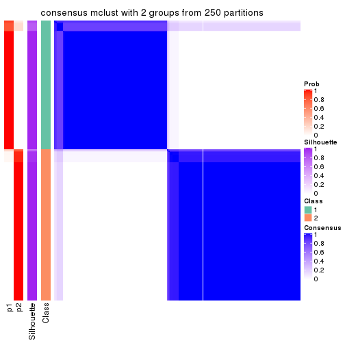</p>

</div>
<div id='tab-SD-mclust-consensus-heatmap-2'>
<pre><code class="r">consensus_heatmap(res, k = 3)
</code></pre>

<p></p>

</div>
<div id='tab-SD-mclust-consensus-heatmap-3'>
<pre><code class="r">consensus_heatmap(res, k = 4)
</code></pre>

<p></p>

</div>
<div id='tab-SD-mclust-consensus-heatmap-4'>
<pre><code class="r">consensus_heatmap(res, k = 5)
</code></pre>

<p></p>

</div>
<div id='tab-SD-mclust-consensus-heatmap-5'>
<pre><code class="r">consensus_heatmap(res, k = 6)
</code></pre>

<p></p>

</div>
</div>

Heatmaps for the membership of samples in all partitions to see how consistent they are:


<script>
$( function() {
	$( '#tabs-SD-mclust-membership-heatmap' ).tabs();
} );
</script>
<div id='tabs-SD-mclust-membership-heatmap'>
<ul>
<li><a href='#tab-SD-mclust-membership-heatmap-1'>k = 2</a></li>
<li><a href='#tab-SD-mclust-membership-heatmap-2'>k = 3</a></li>
<li><a href='#tab-SD-mclust-membership-heatmap-3'>k = 4</a></li>
<li><a href='#tab-SD-mclust-membership-heatmap-4'>k = 5</a></li>
<li><a href='#tab-SD-mclust-membership-heatmap-5'>k = 6</a></li>
</ul>
<div id='tab-SD-mclust-membership-heatmap-1'>
<pre><code class="r">membership_heatmap(res, k = 2)
</code></pre>

<p></p>

</div>
<div id='tab-SD-mclust-membership-heatmap-2'>
<pre><code class="r">membership_heatmap(res, k = 3)
</code></pre>

<p></p>

</div>
<div id='tab-SD-mclust-membership-heatmap-3'>
<pre><code class="r">membership_heatmap(res, k = 4)
</code></pre>

<p></p>

</div>
<div id='tab-SD-mclust-membership-heatmap-4'>
<pre><code class="r">membership_heatmap(res, k = 5)
</code></pre>

<p></p>

</div>
<div id='tab-SD-mclust-membership-heatmap-5'>
<pre><code class="r">membership_heatmap(res, k = 6)
</code></pre>

<p></p>

</div>
</div>

As soon as we have had the classes for columns, we can look for signatures
which are significantly different between classes which can be candidate marks
for certain classes. Following are the heatmaps for signatures.


Signature heatmaps where rows are scaled:


<script>
$( function() {
	$( '#tabs-SD-mclust-get-signatures' ).tabs();
} );
</script>
<div id='tabs-SD-mclust-get-signatures'>
<ul>
<li><a href='#tab-SD-mclust-get-signatures-1'>k = 2</a></li>
<li><a href='#tab-SD-mclust-get-signatures-2'>k = 3</a></li>
<li><a href='#tab-SD-mclust-get-signatures-3'>k = 4</a></li>
<li><a href='#tab-SD-mclust-get-signatures-4'>k = 5</a></li>
<li><a href='#tab-SD-mclust-get-signatures-5'>k = 6</a></li>
</ul>
<div id='tab-SD-mclust-get-signatures-1'>
<pre><code class="r">get_signatures(res, k = 2)
</code></pre>

<p></p>

</div>
<div id='tab-SD-mclust-get-signatures-2'>
<pre><code class="r">get_signatures(res, k = 3)
</code></pre>

<p></p>

</div>
<div id='tab-SD-mclust-get-signatures-3'>
<pre><code class="r">get_signatures(res, k = 4)
</code></pre>

<p></p>

</div>
<div id='tab-SD-mclust-get-signatures-4'>
<pre><code class="r">get_signatures(res, k = 5)
</code></pre>

<p></p>

</div>
<div id='tab-SD-mclust-get-signatures-5'>
<pre><code class="r">get_signatures(res, k = 6)
</code></pre>

<p></p>

</div>
</div>


Signature heatmaps where rows are not scaled:


<script>
$( function() {
	$( '#tabs-SD-mclust-get-signatures-no-scale' ).tabs();
} );
</script>
<div id='tabs-SD-mclust-get-signatures-no-scale'>
<ul>
<li><a href='#tab-SD-mclust-get-signatures-no-scale-1'>k = 2</a></li>
<li><a href='#tab-SD-mclust-get-signatures-no-scale-2'>k = 3</a></li>
<li><a href='#tab-SD-mclust-get-signatures-no-scale-3'>k = 4</a></li>
<li><a href='#tab-SD-mclust-get-signatures-no-scale-4'>k = 5</a></li>
<li><a href='#tab-SD-mclust-get-signatures-no-scale-5'>k = 6</a></li>
</ul>
<div id='tab-SD-mclust-get-signatures-no-scale-1'>
<pre><code class="r">get_signatures(res, k = 2, scale_rows = FALSE)
</code></pre>

<p></p>

</div>
<div id='tab-SD-mclust-get-signatures-no-scale-2'>
<pre><code class="r">get_signatures(res, k = 3, scale_rows = FALSE)
</code></pre>

<p></p>

</div>
<div id='tab-SD-mclust-get-signatures-no-scale-3'>
<pre><code class="r">get_signatures(res, k = 4, scale_rows = FALSE)
</code></pre>

<p></p>

</div>
<div id='tab-SD-mclust-get-signatures-no-scale-4'>
<pre><code class="r">get_signatures(res, k = 5, scale_rows = FALSE)
</code></pre>

<p></p>

</div>
<div id='tab-SD-mclust-get-signatures-no-scale-5'>
<pre><code class="r">get_signatures(res, k = 6, scale_rows = FALSE)
</code></pre>

<p></p>

</div>
</div>


Compare the overlap of signatures from different k:

```r
compare_signatures(res)
```


`get_signature()` returns a data frame invisibly. TO get the list of signatures, the function
call should be assigned to a variable explicitly. In following code, if `plot` argument is set
to `FALSE`, no heatmap is plotted while only the differential analysis is performed.

```r
# code only for demonstration
tb = get_signature(res, k = ..., plot = FALSE)
```

An example of the output of `tb` is:

```
#>   which_row         fdr    mean_1    mean_2 scaled_mean_1 scaled_mean_2 km
#> 1        38 0.042760348  8.373488  9.131774    -0.5533452     0.5164555  1
#> 2        40 0.018707592  7.106213  8.469186    -0.6173731     0.5762149  1
#> 3        55 0.019134737 10.221463 11.207825    -0.6159697     0.5749050  1
#> 4        59 0.006059896  5.921854  7.869574    -0.6899429     0.6439467  1
#> 5        60 0.018055526  8.928898 10.211722    -0.6204761     0.5791110  1
#> 6        98 0.009384629 15.714769 14.887706     0.6635654    -0.6193277  2
...
```

The columns in `tb` are:

1. `which_row`: row indices corresponding to the input matrix.
2. `fdr`: FDR for the differential test. 
3. `mean_x`: The mean value in group x.
4. `scaled_mean_x`: The mean value in group x after rows are scaled.
5. `km`: Row groups if k-means clustering is applied to rows.


UMAP plot which shows how samples are separated.


<script>
$( function() {
	$( '#tabs-SD-mclust-dimension-reduction' ).tabs();
} );
</script>
<div id='tabs-SD-mclust-dimension-reduction'>
<ul>
<li><a href='#tab-SD-mclust-dimension-reduction-1'>k = 2</a></li>
<li><a href='#tab-SD-mclust-dimension-reduction-2'>k = 3</a></li>
<li><a href='#tab-SD-mclust-dimension-reduction-3'>k = 4</a></li>
<li><a href='#tab-SD-mclust-dimension-reduction-4'>k = 5</a></li>
<li><a href='#tab-SD-mclust-dimension-reduction-5'>k = 6</a></li>
</ul>
<div id='tab-SD-mclust-dimension-reduction-1'>
<pre><code class="r">dimension_reduction(res, k = 2, method = &quot;UMAP&quot;)
</code></pre>

<p></p>

</div>
<div id='tab-SD-mclust-dimension-reduction-2'>
<pre><code class="r">dimension_reduction(res, k = 3, method = &quot;UMAP&quot;)
</code></pre>

<p></p>

</div>
<div id='tab-SD-mclust-dimension-reduction-3'>
<pre><code class="r">dimension_reduction(res, k = 4, method = &quot;UMAP&quot;)
</code></pre>

<p></p>

</div>
<div id='tab-SD-mclust-dimension-reduction-4'>
<pre><code class="r">dimension_reduction(res, k = 5, method = &quot;UMAP&quot;)
</code></pre>

<p></p>

</div>
<div id='tab-SD-mclust-dimension-reduction-5'>
<pre><code class="r">dimension_reduction(res, k = 6, method = &quot;UMAP&quot;)
</code></pre>

<p></p>

</div>
</div>


Following heatmap shows how subgroups are split when increasing `k`:

```r
collect_classes(res)
```


If matrix rows can be associated to genes, consider to use `functional_enrichment(res,
...)` to perform function enrichment for the signature genes. See [this vignette](http://bioconductor.org/packages/devel/bioc/vignettes/cola/inst/doc/functional_enrichment.html) for more detailed explanations.


 

---------------------------------------------------


### SD:NMF*


The object with results only for a single top-value method and a single partition method 
can be extracted as:

```r
res = res_list["SD", "NMF"]
# you can also extract it by
# res = res_list["SD:NMF"]
```

A summary of `res` and all the functions that can be applied to it:

```r
res
```

```
#> A 'ConsensusPartition' object with k = 2, 3, 4, 5, 6.
#>   On a matrix with 9126 rows and 192 columns.
#>   Top rows (913, 1826, 2738, 3650, 4563) are extracted by 'SD' method.
#>   Subgroups are detected by 'NMF' method.
#>   Performed in total 1250 partitions by row resampling.
#>   Best k for subgroups seems to be 3.
#> 
#> Following methods can be applied to this 'ConsensusPartition' object:
#>  [1] "cola_report"             "collect_classes"         "collect_plots"          
#>  [4] "collect_stats"           "colnames"                "compare_signatures"     
#>  [7] "consensus_heatmap"       "dimension_reduction"     "functional_enrichment"  
#> [10] "get_anno_col"            "get_anno"                "get_classes"            
#> [13] "get_consensus"           "get_matrix"              "get_membership"         
#> [16] "get_param"               "get_signatures"          "get_stats"              
#> [19] "is_best_k"               "is_stable_k"             "membership_heatmap"     
#> [22] "ncol"                    "nrow"                    "plot_ecdf"              
#> [25] "rownames"                "select_partition_number" "show"                   
#> [28] "suggest_best_k"          "test_to_known_factors"
```

`collect_plots()` function collects all the plots made from `res` for all `k` (number of partitions)
into one single page to provide an easy and fast comparison between different `k`.

```r
collect_plots(res)
```


The plots are:

- The first row: a plot of the ECDF (empirical cumulative distribution
  function) curves of the consensus matrix for each `k` and the heatmap of
  predicted classes for each `k`.
- The second row: heatmaps of the consensus matrix for each `k`.
- The third row: heatmaps of the membership matrix for each `k`.
- The fouth row: heatmaps of the signatures for each `k`.

All the plots in panels can be made by individual functions and they are
plotted later in this section.

`select_partition_number()` produces several plots showing different
statistics for choosing "optimized" `k`. There are following statistics:

- ECDF curves of the consensus matrix for each `k`;
- 1-PAC. [The PAC
  score](https://en.wikipedia.org/wiki/Consensus_clustering#Over-interpretation_potential_of_consensus_clustering)
  measures the proportion of the ambiguous subgrouping.
- Mean silhouette score.
- Concordance. The mean probability of fiting the consensus class ids in all
  partitions.
- Area increased. Denote $A_k$ as the area under the ECDF curve for current
  `k`, the area increased is defined as $A_k - A_{k-1}$.
- Rand index. The percent of pairs of samples that are both in a same cluster
  or both are not in a same cluster in the partition of k and k-1.
- Jaccard index. The ratio of pairs of samples are both in a same cluster in
  the partition of k and k-1 and the pairs of samples are both in a same
  cluster in the partition k or k-1.

The detailed explanations of these statistics can be found in [the _cola_
vignette](http://bioconductor.org/packages/devel/bioc/vignettes/cola/inst/doc/cola.html#toc_13).

Generally speaking, lower PAC score, higher mean silhouette score or higher
concordance corresponds to better partition. Rand index and Jaccard index
measure how similar the current partition is compared to partition with `k-1`.
If they are too similar, we won't accept `k` is better than `k-1`.

```r
select_partition_number(res)
```

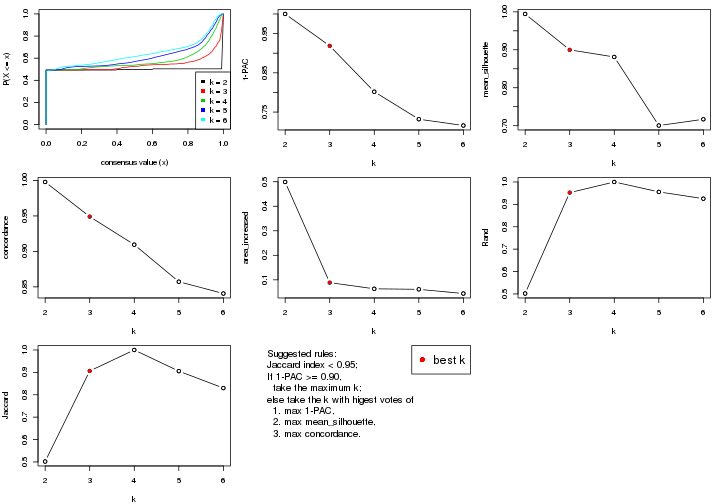

The numeric values for all these statistics can be obtained by `get_stats()`.

```r
get_stats(res)
```

```
#>   k 1-PAC mean_silhouette concordance area_increased  Rand Jaccard
#> 2 2 1.000           0.994       0.998         0.4991 0.502   0.502
#> 3 3 0.919           0.900       0.949         0.0886 0.953   0.906
#> 4 4 0.802           0.881       0.909         0.0635 1.000   1.000
#> 5 5 0.732           0.700       0.857         0.0613 0.956   0.905
#> 6 6 0.716           0.717       0.841         0.0442 0.925   0.830
```

`suggest_best_k()` suggests the best $k$ based on these statistics. The rules are as follows:

- All $k$ with Jaccard index larger than 0.95 are removed because increasing
  $k$ does not provide enough extra information. If all $k$ are removed, it is
  marked as no subgroup is detected.
- For all $k$ with 1-PAC score larger than 0.9, the maximal $k$ is taken as
  the best $k$, and other $k$ are marked as optional $k$.
- If it does not fit the second rule. The $k$ with the maximal vote of the
  highest 1-PAC score, highest mean silhouette, and highest concordance is
  taken as the best $k$.

```r
suggest_best_k(res)
```

```
#> [1] 3
#> attr(,"optional")
#> [1] 2
```

There is also optional best $k$ = 2 that is worth to check.

Following shows the table of the partitions (You need to click the **show/hide
code output** link to see it). The membership matrix (columns with name `p*`)
is inferred by
[`clue::cl_consensus()`](https://www.rdocumentation.org/link/cl_consensus?package=clue)
function with the `SE` method. Basically the value in the membership matrix
represents the probability to belong to a certain group. The finall class
label for an item is determined with the group with highest probability it
belongs to.

In `get_classes()` function, the entropy is calculated from the membership
matrix and the silhouette score is calculated from the consensus matrix.


<script>
$( function() {
	$( '#tabs-SD-NMF-get-classes' ).tabs();
} );
</script>
<div id='tabs-SD-NMF-get-classes'>
<ul>
<li><a href='#tab-SD-NMF-get-classes-1'>k = 2</a></li>
<li><a href='#tab-SD-NMF-get-classes-2'>k = 3</a></li>
<li><a href='#tab-SD-NMF-get-classes-3'>k = 4</a></li>
<li><a href='#tab-SD-NMF-get-classes-4'>k = 5</a></li>
<li><a href='#tab-SD-NMF-get-classes-5'>k = 6</a></li>
</ul>

<div id='tab-SD-NMF-get-classes-1'>
<p><a id='tab-SD-NMF-get-classes-1-a' style='color:#0366d6' href='#'>show/hide code output</a></p>
<pre><code class="r">cbind(get_classes(res, k = 2), get_membership(res, k = 2))
</code></pre>

<pre><code>#&gt;            class entropy silhouette    p1    p2
#&gt; SRR2074921     2   0.000      0.996 0.000 1.000
#&gt; SRR2074919     2   0.000      0.996 0.000 1.000
#&gt; SRR2074920     2   0.000      0.996 0.000 1.000
#&gt; SRR2074917     1   0.000      1.000 1.000 0.000
#&gt; SRR2074918     2   0.000      0.996 0.000 1.000
#&gt; SRR2074916     2   0.000      0.996 0.000 1.000
#&gt; SRR2074915     2   0.000      0.996 0.000 1.000
#&gt; SRR2074914     1   0.000      1.000 1.000 0.000
#&gt; SRR2074913     2   0.000      0.996 0.000 1.000
#&gt; SRR2074912     1   0.000      1.000 1.000 0.000
#&gt; SRR2074911     2   0.000      0.996 0.000 1.000
#&gt; SRR2074910     2   0.000      0.996 0.000 1.000
#&gt; SRR2074909     1   0.000      1.000 1.000 0.000
#&gt; SRR2074907     1   0.000      1.000 1.000 0.000
#&gt; SRR2074908     2   0.000      0.996 0.000 1.000
#&gt; SRR2074906     2   0.000      0.996 0.000 1.000
#&gt; SRR2074905     1   0.000      1.000 1.000 0.000
#&gt; SRR2074904     2   0.000      0.996 0.000 1.000
#&gt; SRR2074903     2   0.000      0.996 0.000 1.000
#&gt; SRR2074902     1   0.000      1.000 1.000 0.000
#&gt; SRR2074901     2   0.000      0.996 0.000 1.000
#&gt; SRR2074900     1   0.000      1.000 1.000 0.000
#&gt; SRR2074899     2   0.000      0.996 0.000 1.000
#&gt; SRR2074898     2   0.000      0.996 0.000 1.000
#&gt; SRR2074897     2   0.000      0.996 0.000 1.000
#&gt; SRR2074896     2   0.000      0.996 0.000 1.000
#&gt; SRR2074895     1   0.000      1.000 1.000 0.000
#&gt; SRR2074894     2   0.973      0.322 0.404 0.596
#&gt; SRR2074893     2   0.000      0.996 0.000 1.000
#&gt; SRR2074892     1   0.000      1.000 1.000 0.000
#&gt; SRR2074891     1   0.000      1.000 1.000 0.000
#&gt; SRR2074890     2   0.000      0.996 0.000 1.000
#&gt; SRR2074887     2   0.000      0.996 0.000 1.000
#&gt; SRR2074889     2   0.000      0.996 0.000 1.000
#&gt; SRR2074886     2   0.000      0.996 0.000 1.000
#&gt; SRR2074888     2   0.000      0.996 0.000 1.000
#&gt; SRR2074885     1   0.000      1.000 1.000 0.000
#&gt; SRR2074884     2   0.000      0.996 0.000 1.000
#&gt; SRR2074883     2   0.000      0.996 0.000 1.000
#&gt; SRR2074882     1   0.000      1.000 1.000 0.000
#&gt; SRR2074880     2   0.000      0.996 0.000 1.000
#&gt; SRR2074881     2   0.000      0.996 0.000 1.000
#&gt; SRR2074879     1   0.000      1.000 1.000 0.000
#&gt; SRR2074878     1   0.000      1.000 1.000 0.000
#&gt; SRR2074877     2   0.000      0.996 0.000 1.000
#&gt; SRR2074876     1   0.000      1.000 1.000 0.000
#&gt; SRR2074875     2   0.000      0.996 0.000 1.000
#&gt; SRR2074874     1   0.000      1.000 1.000 0.000
#&gt; SRR2074873     2   0.000      0.996 0.000 1.000
#&gt; SRR2074872     1   0.000      1.000 1.000 0.000
#&gt; SRR2074871     2   0.000      0.996 0.000 1.000
#&gt; SRR2074870     1   0.000      1.000 1.000 0.000
#&gt; SRR2074869     1   0.000      1.000 1.000 0.000
#&gt; SRR2074868     1   0.000      1.000 1.000 0.000
#&gt; SRR2074867     2   0.000      0.996 0.000 1.000
#&gt; SRR2074866     2   0.000      0.996 0.000 1.000
#&gt; SRR2074865     1   0.000      1.000 1.000 0.000
#&gt; SRR2074864     1   0.000      1.000 1.000 0.000
#&gt; SRR2074863     1   0.000      1.000 1.000 0.000
#&gt; SRR2074862     1   0.000      1.000 1.000 0.000
#&gt; SRR2074861     1   0.000      1.000 1.000 0.000
#&gt; SRR2074860     1   0.000      1.000 1.000 0.000
#&gt; SRR2074859     1   0.000      1.000 1.000 0.000
#&gt; SRR2074858     2   0.000      0.996 0.000 1.000
#&gt; SRR2074855     2   0.000      0.996 0.000 1.000
#&gt; SRR2074857     1   0.000      1.000 1.000 0.000
#&gt; SRR2074856     1   0.000      1.000 1.000 0.000
#&gt; SRR2074854     1   0.000      1.000 1.000 0.000
#&gt; SRR2074853     1   0.000      1.000 1.000 0.000
#&gt; SRR2074852     2   0.000      0.996 0.000 1.000
#&gt; SRR2074851     1   0.000      1.000 1.000 0.000
#&gt; SRR2074850     1   0.000      1.000 1.000 0.000
#&gt; SRR2074849     1   0.000      1.000 1.000 0.000
#&gt; SRR2074848     1   0.000      1.000 1.000 0.000
#&gt; SRR2074847     1   0.000      1.000 1.000 0.000
#&gt; SRR2074846     1   0.000      1.000 1.000 0.000
#&gt; SRR2074845     1   0.000      1.000 1.000 0.000
#&gt; SRR2074843     1   0.000      1.000 1.000 0.000
#&gt; SRR2074842     2   0.000      0.996 0.000 1.000
#&gt; SRR2074844     2   0.000      0.996 0.000 1.000
#&gt; SRR2074841     2   0.000      0.996 0.000 1.000
#&gt; SRR2074840     2   0.000      0.996 0.000 1.000
#&gt; SRR2074839     1   0.000      1.000 1.000 0.000
#&gt; SRR2074838     2   0.000      0.996 0.000 1.000
#&gt; SRR2074836     2   0.000      0.996 0.000 1.000
#&gt; SRR2074835     2   0.000      0.996 0.000 1.000
#&gt; SRR2074837     1   0.000      1.000 1.000 0.000
#&gt; SRR2074834     2   0.000      0.996 0.000 1.000
#&gt; SRR2074833     1   0.000      1.000 1.000 0.000
#&gt; SRR2074832     2   0.000      0.996 0.000 1.000
#&gt; SRR2074831     1   0.000      1.000 1.000 0.000
#&gt; SRR2074829     1   0.000      1.000 1.000 0.000
#&gt; SRR2074830     1   0.000      1.000 1.000 0.000
#&gt; SRR2074828     1   0.000      1.000 1.000 0.000
#&gt; SRR2074827     2   0.000      0.996 0.000 1.000
#&gt; SRR2074826     2   0.000      0.996 0.000 1.000
#&gt; SRR2074825     2   0.000      0.996 0.000 1.000
#&gt; SRR2074824     2   0.000      0.996 0.000 1.000
#&gt; SRR2074823     1   0.000      1.000 1.000 0.000
#&gt; SRR2074822     2   0.000      0.996 0.000 1.000
#&gt; SRR2074821     2   0.000      0.996 0.000 1.000
#&gt; SRR2074820     2   0.000      0.996 0.000 1.000
#&gt; SRR2074819     2   0.000      0.996 0.000 1.000
#&gt; SRR2074817     2   0.000      0.996 0.000 1.000
#&gt; SRR2074818     2   0.000      0.996 0.000 1.000
#&gt; SRR2074816     1   0.000      1.000 1.000 0.000
#&gt; SRR2074815     2   0.000      0.996 0.000 1.000
#&gt; SRR2074814     1   0.000      1.000 1.000 0.000
#&gt; SRR2074812     2   0.000      0.996 0.000 1.000
#&gt; SRR2074813     2   0.000      0.996 0.000 1.000
#&gt; SRR2074809     2   0.000      0.996 0.000 1.000
#&gt; SRR2074810     2   0.000      0.996 0.000 1.000
#&gt; SRR2074811     2   0.000      0.996 0.000 1.000
#&gt; SRR2074808     2   0.000      0.996 0.000 1.000
#&gt; SRR2074807     2   0.000      0.996 0.000 1.000
#&gt; SRR2074806     1   0.000      1.000 1.000 0.000
#&gt; SRR2074805     2   0.000      0.996 0.000 1.000
#&gt; SRR2074804     1   0.000      1.000 1.000 0.000
#&gt; SRR2074803     1   0.000      1.000 1.000 0.000
#&gt; SRR2074801     1   0.000      1.000 1.000 0.000
#&gt; SRR2074802     2   0.000      0.996 0.000 1.000
#&gt; SRR2074799     2   0.000      0.996 0.000 1.000
#&gt; SRR2074800     1   0.000      1.000 1.000 0.000
#&gt; SRR2074798     1   0.000      1.000 1.000 0.000
#&gt; SRR2074797     1   0.000      1.000 1.000 0.000
#&gt; SRR2074795     2   0.000      0.996 0.000 1.000
#&gt; SRR2074796     2   0.000      0.996 0.000 1.000
#&gt; SRR2074794     2   0.000      0.996 0.000 1.000
#&gt; SRR2074793     2   0.000      0.996 0.000 1.000
#&gt; SRR2074792     1   0.000      1.000 1.000 0.000
#&gt; SRR2074791     1   0.000      1.000 1.000 0.000
#&gt; SRR2074790     2   0.000      0.996 0.000 1.000
#&gt; SRR2074789     1   0.000      1.000 1.000 0.000
#&gt; SRR2074788     1   0.000      1.000 1.000 0.000
#&gt; SRR2074787     1   0.000      1.000 1.000 0.000
#&gt; SRR2074786     2   0.000      0.996 0.000 1.000
#&gt; SRR2074785     1   0.000      1.000 1.000 0.000
#&gt; SRR2074784     1   0.000      1.000 1.000 0.000
#&gt; SRR2074783     2   0.000      0.996 0.000 1.000
#&gt; SRR2074782     1   0.000      1.000 1.000 0.000
#&gt; SRR2074779     2   0.000      0.996 0.000 1.000
#&gt; SRR2074781     2   0.000      0.996 0.000 1.000
#&gt; SRR2074780     1   0.000      1.000 1.000 0.000
#&gt; SRR2074778     2   0.000      0.996 0.000 1.000
#&gt; SRR2074777     2   0.000      0.996 0.000 1.000
#&gt; SRR2074776     2   0.000      0.996 0.000 1.000
#&gt; SRR2074775     1   0.000      1.000 1.000 0.000
#&gt; SRR2074774     1   0.000      1.000 1.000 0.000
#&gt; SRR2074773     2   0.000      0.996 0.000 1.000
#&gt; SRR2074771     2   0.000      0.996 0.000 1.000
#&gt; SRR2074772     1   0.000      1.000 1.000 0.000
#&gt; SRR2074770     1   0.000      1.000 1.000 0.000
#&gt; SRR2074769     2   0.000      0.996 0.000 1.000
#&gt; SRR2074768     2   0.000      0.996 0.000 1.000
#&gt; SRR2074766     2   0.000      0.996 0.000 1.000
#&gt; SRR2074767     1   0.000      1.000 1.000 0.000
#&gt; SRR2074765     1   0.000      1.000 1.000 0.000
#&gt; SRR2074764     2   0.000      0.996 0.000 1.000
#&gt; SRR2074763     2   0.000      0.996 0.000 1.000
#&gt; SRR2074761     1   0.000      1.000 1.000 0.000
#&gt; SRR2074762     2   0.000      0.996 0.000 1.000
#&gt; SRR2074760     2   0.000      0.996 0.000 1.000
#&gt; SRR2074759     1   0.000      1.000 1.000 0.000
#&gt; SRR2074757     2   0.000      0.996 0.000 1.000
#&gt; SRR2074758     2   0.000      0.996 0.000 1.000
#&gt; SRR2074756     2   0.000      0.996 0.000 1.000
#&gt; SRR2074755     1   0.000      1.000 1.000 0.000
#&gt; SRR2074754     1   0.000      1.000 1.000 0.000
#&gt; SRR2074753     2   0.000      0.996 0.000 1.000
#&gt; SRR2074752     1   0.000      1.000 1.000 0.000
#&gt; SRR2074751     1   0.000      1.000 1.000 0.000
#&gt; SRR2074749     2   0.000      0.996 0.000 1.000
#&gt; SRR2074750     1   0.000      1.000 1.000 0.000
#&gt; SRR2074748     1   0.000      1.000 1.000 0.000
#&gt; SRR2074747     2   0.000      0.996 0.000 1.000
#&gt; SRR2074745     1   0.000      1.000 1.000 0.000
#&gt; SRR2074746     1   0.000      1.000 1.000 0.000
#&gt; SRR2074744     2   0.000      0.996 0.000 1.000
#&gt; SRR2074743     2   0.000      0.996 0.000 1.000
#&gt; SRR2074742     2   0.000      0.996 0.000 1.000
#&gt; SRR2074741     1   0.000      1.000 1.000 0.000
#&gt; SRR2074740     2   0.000      0.996 0.000 1.000
#&gt; SRR2074739     1   0.000      1.000 1.000 0.000
#&gt; SRR2074738     2   0.000      0.996 0.000 1.000
#&gt; SRR2074737     2   0.000      0.996 0.000 1.000
#&gt; SRR2074736     2   0.000      0.996 0.000 1.000
#&gt; SRR2074735     1   0.000      1.000 1.000 0.000
#&gt; SRR2074734     2   0.000      0.996 0.000 1.000
#&gt; SRR2074733     1   0.000      1.000 1.000 0.000
#&gt; SRR2074732     2   0.000      0.996 0.000 1.000
#&gt; SRR2074731     2   0.000      0.996 0.000 1.000
#&gt; SRR2074730     1   0.000      1.000 1.000 0.000
</code></pre>

<script>
$('#tab-SD-NMF-get-classes-1-a').parent().next().next().hide();
$('#tab-SD-NMF-get-classes-1-a').click(function(){
  $('#tab-SD-NMF-get-classes-1-a').parent().next().next().toggle();
  return(false);
});
</script>
</div>

<div id='tab-SD-NMF-get-classes-2'>
<p><a id='tab-SD-NMF-get-classes-2-a' style='color:#0366d6' href='#'>show/hide code output</a></p>
<pre><code class="r">cbind(get_classes(res, k = 3), get_membership(res, k = 3))
</code></pre>

<pre><code>#&gt;            class entropy silhouette    p1    p2    p3
#&gt; SRR2074921     3  0.6204      0.949 0.000 0.424 0.576
#&gt; SRR2074919     3  0.6095      0.924 0.000 0.392 0.608
#&gt; SRR2074920     3  0.6062      0.914 0.000 0.384 0.616
#&gt; SRR2074917     1  0.1860      0.964 0.948 0.000 0.052
#&gt; SRR2074918     3  0.6180      0.948 0.000 0.416 0.584
#&gt; SRR2074916     2  0.5591      0.180 0.000 0.696 0.304
#&gt; SRR2074915     2  0.6274     -0.664 0.000 0.544 0.456
#&gt; SRR2074914     1  0.0000      0.990 1.000 0.000 0.000
#&gt; SRR2074913     2  0.6280     -0.678 0.000 0.540 0.460
#&gt; SRR2074912     1  0.1411      0.971 0.964 0.000 0.036
#&gt; SRR2074911     3  0.6286      0.884 0.000 0.464 0.536
#&gt; SRR2074910     3  0.6235      0.939 0.000 0.436 0.564
#&gt; SRR2074909     1  0.0000      0.990 1.000 0.000 0.000
#&gt; SRR2074907     1  0.0000      0.990 1.000 0.000 0.000
#&gt; SRR2074908     2  0.1289      0.892 0.000 0.968 0.032
#&gt; SRR2074906     2  0.0592      0.893 0.000 0.988 0.012
#&gt; SRR2074905     1  0.0000      0.990 1.000 0.000 0.000
#&gt; SRR2074904     2  0.3941      0.741 0.000 0.844 0.156
#&gt; SRR2074903     2  0.2959      0.836 0.000 0.900 0.100
#&gt; SRR2074902     1  0.0424      0.989 0.992 0.000 0.008
#&gt; SRR2074901     2  0.2356      0.865 0.000 0.928 0.072
#&gt; SRR2074900     1  0.0592      0.988 0.988 0.000 0.012
#&gt; SRR2074899     2  0.0592      0.896 0.000 0.988 0.012
#&gt; SRR2074898     2  0.0424      0.896 0.000 0.992 0.008
#&gt; SRR2074897     2  0.0424      0.896 0.000 0.992 0.008
#&gt; SRR2074896     2  0.2537      0.859 0.000 0.920 0.080
#&gt; SRR2074895     1  0.0000      0.990 1.000 0.000 0.000
#&gt; SRR2074894     1  0.4978      0.635 0.780 0.216 0.004
#&gt; SRR2074893     2  0.0424      0.897 0.000 0.992 0.008
#&gt; SRR2074892     1  0.0000      0.990 1.000 0.000 0.000
#&gt; SRR2074891     1  0.0237      0.988 0.996 0.000 0.004
#&gt; SRR2074890     2  0.3686      0.774 0.000 0.860 0.140
#&gt; SRR2074887     2  0.3340      0.808 0.000 0.880 0.120
#&gt; SRR2074889     2  0.0424      0.896 0.000 0.992 0.008
#&gt; SRR2074886     2  0.1031      0.895 0.000 0.976 0.024
#&gt; SRR2074888     2  0.0424      0.896 0.000 0.992 0.008
#&gt; SRR2074885     1  0.0000      0.990 1.000 0.000 0.000
#&gt; SRR2074884     2  0.0424      0.896 0.000 0.992 0.008
#&gt; SRR2074883     2  0.0424      0.896 0.000 0.992 0.008
#&gt; SRR2074882     1  0.0000      0.990 1.000 0.000 0.000
#&gt; SRR2074880     2  0.0000      0.897 0.000 1.000 0.000
#&gt; SRR2074881     2  0.2066      0.876 0.000 0.940 0.060
#&gt; SRR2074879     1  0.1643      0.962 0.956 0.000 0.044
#&gt; SRR2074878     1  0.1031      0.984 0.976 0.000 0.024
#&gt; SRR2074877     2  0.4178      0.704 0.000 0.828 0.172
#&gt; SRR2074876     1  0.0237      0.989 0.996 0.000 0.004
#&gt; SRR2074875     2  0.0424      0.896 0.000 0.992 0.008
#&gt; SRR2074874     1  0.0747      0.987 0.984 0.000 0.016
#&gt; SRR2074873     2  0.0424      0.896 0.000 0.992 0.008
#&gt; SRR2074872     1  0.1643      0.970 0.956 0.000 0.044
#&gt; SRR2074871     2  0.2796      0.845 0.000 0.908 0.092
#&gt; SRR2074870     1  0.0000      0.990 1.000 0.000 0.000
#&gt; SRR2074869     1  0.0000      0.990 1.000 0.000 0.000
#&gt; SRR2074868     1  0.1289      0.979 0.968 0.000 0.032
#&gt; SRR2074867     2  0.3816      0.758 0.000 0.852 0.148
#&gt; SRR2074866     2  0.4452      0.654 0.000 0.808 0.192
#&gt; SRR2074865     1  0.0237      0.988 0.996 0.000 0.004
#&gt; SRR2074864     1  0.0000      0.990 1.000 0.000 0.000
#&gt; SRR2074863     1  0.0000      0.990 1.000 0.000 0.000
#&gt; SRR2074862     1  0.0592      0.988 0.988 0.000 0.012
#&gt; SRR2074861     1  0.0237      0.989 0.996 0.000 0.004
#&gt; SRR2074860     1  0.0237      0.989 0.996 0.000 0.004
#&gt; SRR2074859     1  0.0237      0.989 0.996 0.000 0.004
#&gt; SRR2074858     2  0.3340      0.808 0.000 0.880 0.120
#&gt; SRR2074855     2  0.0747      0.891 0.000 0.984 0.016
#&gt; SRR2074857     1  0.0747      0.987 0.984 0.000 0.016
#&gt; SRR2074856     1  0.1031      0.984 0.976 0.000 0.024
#&gt; SRR2074854     1  0.0892      0.985 0.980 0.000 0.020
#&gt; SRR2074853     1  0.0000      0.990 1.000 0.000 0.000
#&gt; SRR2074852     2  0.0592      0.894 0.000 0.988 0.012
#&gt; SRR2074851     1  0.0747      0.987 0.984 0.000 0.016
#&gt; SRR2074850     1  0.0424      0.989 0.992 0.000 0.008
#&gt; SRR2074849     1  0.0747      0.987 0.984 0.000 0.016
#&gt; SRR2074848     1  0.0747      0.987 0.984 0.000 0.016
#&gt; SRR2074847     1  0.0424      0.989 0.992 0.000 0.008
#&gt; SRR2074846     1  0.0000      0.990 1.000 0.000 0.000
#&gt; SRR2074845     1  0.0747      0.987 0.984 0.000 0.016
#&gt; SRR2074843     1  0.0747      0.987 0.984 0.000 0.016
#&gt; SRR2074842     2  0.3267      0.818 0.000 0.884 0.116
#&gt; SRR2074844     2  0.3267      0.816 0.000 0.884 0.116
#&gt; SRR2074841     2  0.0424      0.896 0.000 0.992 0.008
#&gt; SRR2074840     2  0.0424      0.896 0.000 0.992 0.008
#&gt; SRR2074839     1  0.0892      0.985 0.980 0.000 0.020
#&gt; SRR2074838     2  0.0424      0.896 0.000 0.992 0.008
#&gt; SRR2074836     2  0.2448      0.865 0.000 0.924 0.076
#&gt; SRR2074835     2  0.0424      0.896 0.000 0.992 0.008
#&gt; SRR2074837     1  0.0000      0.990 1.000 0.000 0.000
#&gt; SRR2074834     2  0.1860      0.882 0.000 0.948 0.052
#&gt; SRR2074833     1  0.0000      0.990 1.000 0.000 0.000
#&gt; SRR2074832     2  0.0000      0.897 0.000 1.000 0.000
#&gt; SRR2074831     1  0.0747      0.987 0.984 0.000 0.016
#&gt; SRR2074829     1  0.0747      0.987 0.984 0.000 0.016
#&gt; SRR2074830     1  0.0747      0.987 0.984 0.000 0.016
#&gt; SRR2074828     1  0.0000      0.990 1.000 0.000 0.000
#&gt; SRR2074827     2  0.2066      0.879 0.000 0.940 0.060
#&gt; SRR2074826     2  0.4605      0.623 0.000 0.796 0.204
#&gt; SRR2074825     2  0.0237      0.897 0.000 0.996 0.004
#&gt; SRR2074824     2  0.0592      0.893 0.000 0.988 0.012
#&gt; SRR2074823     1  0.0747      0.987 0.984 0.000 0.016
#&gt; SRR2074822     2  0.0592      0.893 0.000 0.988 0.012
#&gt; SRR2074821     2  0.0000      0.897 0.000 1.000 0.000
#&gt; SRR2074820     2  0.0424      0.896 0.000 0.992 0.008
#&gt; SRR2074819     2  0.1964      0.881 0.000 0.944 0.056
#&gt; SRR2074817     2  0.2356      0.866 0.000 0.928 0.072
#&gt; SRR2074818     2  0.0424      0.896 0.000 0.992 0.008
#&gt; SRR2074816     1  0.0000      0.990 1.000 0.000 0.000
#&gt; SRR2074815     2  0.0237      0.897 0.000 0.996 0.004
#&gt; SRR2074814     1  0.0747      0.987 0.984 0.000 0.016
#&gt; SRR2074812     2  0.0424      0.896 0.000 0.992 0.008
#&gt; SRR2074813     2  0.2537      0.862 0.000 0.920 0.080
#&gt; SRR2074809     2  0.0424      0.896 0.000 0.992 0.008
#&gt; SRR2074810     2  0.2165      0.877 0.000 0.936 0.064
#&gt; SRR2074811     2  0.0592      0.894 0.000 0.988 0.012
#&gt; SRR2074808     2  0.1643      0.886 0.000 0.956 0.044
#&gt; SRR2074807     2  0.1860      0.881 0.000 0.948 0.052
#&gt; SRR2074806     1  0.0237      0.988 0.996 0.000 0.004
#&gt; SRR2074805     2  0.0592      0.894 0.000 0.988 0.012
#&gt; SRR2074804     1  0.0237      0.988 0.996 0.000 0.004
#&gt; SRR2074803     1  0.0000      0.990 1.000 0.000 0.000
#&gt; SRR2074801     1  0.0000      0.990 1.000 0.000 0.000
#&gt; SRR2074802     2  0.2165      0.873 0.000 0.936 0.064
#&gt; SRR2074799     2  0.0424      0.896 0.000 0.992 0.008
#&gt; SRR2074800     1  0.0892      0.985 0.980 0.000 0.020
#&gt; SRR2074798     1  0.0747      0.982 0.984 0.000 0.016
#&gt; SRR2074797     1  0.0747      0.987 0.984 0.000 0.016
#&gt; SRR2074795     2  0.0424      0.896 0.000 0.992 0.008
#&gt; SRR2074796     2  0.2066      0.878 0.000 0.940 0.060
#&gt; SRR2074794     2  0.0424      0.896 0.000 0.992 0.008
#&gt; SRR2074793     2  0.0237      0.897 0.000 0.996 0.004
#&gt; SRR2074792     1  0.0000      0.990 1.000 0.000 0.000
#&gt; SRR2074791     1  0.0892      0.985 0.980 0.000 0.020
#&gt; SRR2074790     2  0.0424      0.896 0.000 0.992 0.008
#&gt; SRR2074789     1  0.0592      0.988 0.988 0.000 0.012
#&gt; SRR2074788     1  0.0000      0.990 1.000 0.000 0.000
#&gt; SRR2074787     1  0.0424      0.989 0.992 0.000 0.008
#&gt; SRR2074786     2  0.1163      0.892 0.000 0.972 0.028
#&gt; SRR2074785     1  0.0000      0.990 1.000 0.000 0.000
#&gt; SRR2074784     1  0.0747      0.982 0.984 0.000 0.016
#&gt; SRR2074783     2  0.0592      0.894 0.000 0.988 0.012
#&gt; SRR2074782     1  0.0000      0.990 1.000 0.000 0.000
#&gt; SRR2074779     2  0.1163      0.892 0.000 0.972 0.028
#&gt; SRR2074781     2  0.4702      0.601 0.000 0.788 0.212
#&gt; SRR2074780     1  0.0747      0.987 0.984 0.000 0.016
#&gt; SRR2074778     2  0.1860      0.881 0.000 0.948 0.052
#&gt; SRR2074777     2  0.3619      0.781 0.000 0.864 0.136
#&gt; SRR2074776     2  0.0424      0.896 0.000 0.992 0.008
#&gt; SRR2074775     1  0.0000      0.990 1.000 0.000 0.000
#&gt; SRR2074774     1  0.0000      0.990 1.000 0.000 0.000
#&gt; SRR2074773     2  0.1964      0.880 0.000 0.944 0.056
#&gt; SRR2074771     2  0.2711      0.850 0.000 0.912 0.088
#&gt; SRR2074772     1  0.0237      0.988 0.996 0.000 0.004
#&gt; SRR2074770     1  0.0000      0.990 1.000 0.000 0.000
#&gt; SRR2074769     2  0.0237      0.897 0.000 0.996 0.004
#&gt; SRR2074768     2  0.0424      0.896 0.000 0.992 0.008
#&gt; SRR2074766     2  0.2959      0.839 0.000 0.900 0.100
#&gt; SRR2074767     1  0.0592      0.988 0.988 0.000 0.012
#&gt; SRR2074765     1  0.1163      0.981 0.972 0.000 0.028
#&gt; SRR2074764     2  0.4002      0.733 0.000 0.840 0.160
#&gt; SRR2074763     2  0.0424      0.896 0.000 0.992 0.008
#&gt; SRR2074761     1  0.0592      0.988 0.988 0.000 0.012
#&gt; SRR2074762     2  0.3267      0.818 0.000 0.884 0.116
#&gt; SRR2074760     2  0.0000      0.897 0.000 1.000 0.000
#&gt; SRR2074759     1  0.0000      0.990 1.000 0.000 0.000
#&gt; SRR2074757     2  0.1289      0.890 0.000 0.968 0.032
#&gt; SRR2074758     2  0.0424      0.896 0.000 0.992 0.008
#&gt; SRR2074756     2  0.2959      0.836 0.000 0.900 0.100
#&gt; SRR2074755     1  0.0000      0.990 1.000 0.000 0.000
#&gt; SRR2074754     1  0.0237      0.988 0.996 0.000 0.004
#&gt; SRR2074753     2  0.5138      0.445 0.000 0.748 0.252
#&gt; SRR2074752     1  0.0000      0.990 1.000 0.000 0.000
#&gt; SRR2074751     1  0.0000      0.990 1.000 0.000 0.000
#&gt; SRR2074749     2  0.0424      0.896 0.000 0.992 0.008
#&gt; SRR2074750     1  0.0424      0.989 0.992 0.000 0.008
#&gt; SRR2074748     1  0.0000      0.990 1.000 0.000 0.000
#&gt; SRR2074747     2  0.1860      0.883 0.000 0.948 0.052
#&gt; SRR2074745     1  0.0747      0.987 0.984 0.000 0.016
#&gt; SRR2074746     1  0.0000      0.990 1.000 0.000 0.000
#&gt; SRR2074744     2  0.1529      0.888 0.000 0.960 0.040
#&gt; SRR2074743     2  0.0000      0.897 0.000 1.000 0.000
#&gt; SRR2074742     3  0.6215      0.946 0.000 0.428 0.572
#&gt; SRR2074741     1  0.0592      0.985 0.988 0.000 0.012
#&gt; SRR2074740     2  0.3412      0.808 0.000 0.876 0.124
#&gt; SRR2074739     1  0.0000      0.990 1.000 0.000 0.000
#&gt; SRR2074738     2  0.0747      0.897 0.000 0.984 0.016
#&gt; SRR2074737     2  0.0592      0.894 0.000 0.988 0.012
#&gt; SRR2074736     2  0.0424      0.897 0.000 0.992 0.008
#&gt; SRR2074735     1  0.0237      0.988 0.996 0.000 0.004
#&gt; SRR2074734     2  0.0237      0.897 0.000 0.996 0.004
#&gt; SRR2074733     1  0.0000      0.990 1.000 0.000 0.000
#&gt; SRR2074732     2  0.0592      0.893 0.000 0.988 0.012
#&gt; SRR2074731     2  0.0592      0.893 0.000 0.988 0.012
#&gt; SRR2074730     1  0.0892      0.985 0.980 0.000 0.020
</code></pre>

<script>
$('#tab-SD-NMF-get-classes-2-a').parent().next().next().hide();
$('#tab-SD-NMF-get-classes-2-a').click(function(){
  $('#tab-SD-NMF-get-classes-2-a').parent().next().next().toggle();
  return(false);
});
</script>
</div>

<div id='tab-SD-NMF-get-classes-3'>
<p><a id='tab-SD-NMF-get-classes-3-a' style='color:#0366d6' href='#'>show/hide code output</a></p>
<pre><code class="r">cbind(get_classes(res, k = 4), get_membership(res, k = 4))
</code></pre>

<pre><code>#&gt;            class entropy silhouette    p1    p2    p3 p4
#&gt; SRR2074921     3  0.5022      0.891 0.000 0.220 0.736 NA
#&gt; SRR2074919     3  0.5458      0.877 0.000 0.204 0.720 NA
#&gt; SRR2074920     3  0.5256      0.879 0.000 0.204 0.732 NA
#&gt; SRR2074917     1  0.5165      0.515 0.512 0.000 0.004 NA
#&gt; SRR2074918     3  0.5850      0.892 0.000 0.244 0.676 NA
#&gt; SRR2074916     2  0.4509      0.514 0.000 0.708 0.288 NA
#&gt; SRR2074915     2  0.5277     -0.297 0.000 0.532 0.460 NA
#&gt; SRR2074914     1  0.1022      0.909 0.968 0.000 0.000 NA
#&gt; SRR2074913     2  0.5590     -0.298 0.000 0.524 0.456 NA
#&gt; SRR2074912     1  0.3837      0.813 0.776 0.000 0.000 NA
#&gt; SRR2074911     3  0.5159      0.759 0.000 0.364 0.624 NA
#&gt; SRR2074910     3  0.6069      0.784 0.000 0.356 0.588 NA
#&gt; SRR2074909     1  0.1118      0.908 0.964 0.000 0.000 NA
#&gt; SRR2074907     1  0.0817      0.911 0.976 0.000 0.000 NA
#&gt; SRR2074908     2  0.0921      0.929 0.000 0.972 0.028 NA
#&gt; SRR2074906     2  0.1629      0.914 0.000 0.952 0.024 NA
#&gt; SRR2074905     1  0.0469      0.912 0.988 0.000 0.000 NA
#&gt; SRR2074904     2  0.2530      0.869 0.000 0.888 0.112 NA
#&gt; SRR2074903     2  0.1557      0.919 0.000 0.944 0.056 NA
#&gt; SRR2074902     1  0.1940      0.909 0.924 0.000 0.000 NA
#&gt; SRR2074901     2  0.1474      0.919 0.000 0.948 0.052 NA
#&gt; SRR2074900     1  0.2469      0.901 0.892 0.000 0.000 NA
#&gt; SRR2074899     2  0.0707      0.929 0.000 0.980 0.020 NA
#&gt; SRR2074898     2  0.1174      0.924 0.000 0.968 0.012 NA
#&gt; SRR2074897     2  0.1059      0.926 0.000 0.972 0.016 NA
#&gt; SRR2074896     2  0.2011      0.906 0.000 0.920 0.080 NA
#&gt; SRR2074895     1  0.1022      0.909 0.968 0.000 0.000 NA
#&gt; SRR2074894     1  0.4715      0.735 0.808 0.128 0.040 NA
#&gt; SRR2074893     2  0.0927      0.931 0.000 0.976 0.016 NA
#&gt; SRR2074892     1  0.1792      0.910 0.932 0.000 0.000 NA
#&gt; SRR2074891     1  0.1661      0.902 0.944 0.000 0.004 NA
#&gt; SRR2074890     2  0.2469      0.878 0.000 0.892 0.108 NA
#&gt; SRR2074887     2  0.2011      0.899 0.000 0.920 0.080 NA
#&gt; SRR2074889     2  0.1520      0.917 0.000 0.956 0.024 NA
#&gt; SRR2074886     2  0.1022      0.929 0.000 0.968 0.032 NA
#&gt; SRR2074888     2  0.1284      0.922 0.000 0.964 0.024 NA
#&gt; SRR2074885     1  0.0592      0.914 0.984 0.000 0.000 NA
#&gt; SRR2074884     2  0.0937      0.926 0.000 0.976 0.012 NA
#&gt; SRR2074883     2  0.1151      0.927 0.000 0.968 0.024 NA
#&gt; SRR2074882     1  0.2011      0.909 0.920 0.000 0.000 NA
#&gt; SRR2074880     2  0.0188      0.930 0.000 0.996 0.000 NA
#&gt; SRR2074881     2  0.1302      0.922 0.000 0.956 0.044 NA
#&gt; SRR2074879     1  0.5233      0.682 0.648 0.000 0.020 NA
#&gt; SRR2074878     1  0.3688      0.860 0.792 0.000 0.000 NA
#&gt; SRR2074877     2  0.2760      0.848 0.000 0.872 0.128 NA
#&gt; SRR2074876     1  0.1557      0.911 0.944 0.000 0.000 NA
#&gt; SRR2074875     2  0.1520      0.917 0.000 0.956 0.024 NA
#&gt; SRR2074874     1  0.3266      0.879 0.832 0.000 0.000 NA
#&gt; SRR2074873     2  0.0937      0.927 0.000 0.976 0.012 NA
#&gt; SRR2074872     1  0.4967      0.587 0.548 0.000 0.000 NA
#&gt; SRR2074871     2  0.1902      0.912 0.000 0.932 0.064 NA
#&gt; SRR2074870     1  0.0336      0.913 0.992 0.000 0.000 NA
#&gt; SRR2074869     1  0.0469      0.912 0.988 0.000 0.000 NA
#&gt; SRR2074868     1  0.4564      0.752 0.672 0.000 0.000 NA
#&gt; SRR2074867     2  0.2345      0.881 0.000 0.900 0.100 NA
#&gt; SRR2074866     2  0.2760      0.855 0.000 0.872 0.128 NA
#&gt; SRR2074865     1  0.1576      0.903 0.948 0.000 0.004 NA
#&gt; SRR2074864     1  0.1022      0.909 0.968 0.000 0.000 NA
#&gt; SRR2074863     1  0.0921      0.909 0.972 0.000 0.000 NA
#&gt; SRR2074862     1  0.2647      0.899 0.880 0.000 0.000 NA
#&gt; SRR2074861     1  0.1792      0.910 0.932 0.000 0.000 NA
#&gt; SRR2074860     1  0.1211      0.908 0.960 0.000 0.000 NA
#&gt; SRR2074859     1  0.1474      0.911 0.948 0.000 0.000 NA
#&gt; SRR2074858     2  0.2266      0.893 0.000 0.912 0.084 NA
#&gt; SRR2074855     2  0.1406      0.920 0.000 0.960 0.024 NA
#&gt; SRR2074857     1  0.2814      0.894 0.868 0.000 0.000 NA
#&gt; SRR2074856     1  0.4624      0.742 0.660 0.000 0.000 NA
#&gt; SRR2074854     1  0.4277      0.802 0.720 0.000 0.000 NA
#&gt; SRR2074853     1  0.0469      0.913 0.988 0.000 0.000 NA
#&gt; SRR2074852     2  0.0779      0.928 0.000 0.980 0.004 NA
#&gt; SRR2074851     1  0.3444      0.872 0.816 0.000 0.000 NA
#&gt; SRR2074850     1  0.2868      0.896 0.864 0.000 0.000 NA
#&gt; SRR2074849     1  0.3123      0.884 0.844 0.000 0.000 NA
#&gt; SRR2074848     1  0.2814      0.894 0.868 0.000 0.000 NA
#&gt; SRR2074847     1  0.1474      0.913 0.948 0.000 0.000 NA
#&gt; SRR2074846     1  0.1118      0.914 0.964 0.000 0.000 NA
#&gt; SRR2074845     1  0.2281      0.904 0.904 0.000 0.000 NA
#&gt; SRR2074843     1  0.3400      0.877 0.820 0.000 0.000 NA
#&gt; SRR2074842     2  0.2124      0.905 0.000 0.924 0.068 NA
#&gt; SRR2074844     2  0.1792      0.909 0.000 0.932 0.068 NA
#&gt; SRR2074841     2  0.1182      0.923 0.000 0.968 0.016 NA
#&gt; SRR2074840     2  0.0657      0.928 0.000 0.984 0.004 NA
#&gt; SRR2074839     1  0.3726      0.855 0.788 0.000 0.000 NA
#&gt; SRR2074838     2  0.1059      0.925 0.000 0.972 0.012 NA
#&gt; SRR2074836     2  0.1398      0.924 0.000 0.956 0.040 NA
#&gt; SRR2074835     2  0.1059      0.927 0.000 0.972 0.016 NA
#&gt; SRR2074837     1  0.1022      0.908 0.968 0.000 0.000 NA
#&gt; SRR2074834     2  0.1888      0.927 0.000 0.940 0.044 NA
#&gt; SRR2074833     1  0.0921      0.909 0.972 0.000 0.000 NA
#&gt; SRR2074832     2  0.0524      0.930 0.000 0.988 0.008 NA
#&gt; SRR2074831     1  0.3764      0.853 0.784 0.000 0.000 NA
#&gt; SRR2074829     1  0.3123      0.886 0.844 0.000 0.000 NA
#&gt; SRR2074830     1  0.3266      0.880 0.832 0.000 0.000 NA
#&gt; SRR2074828     1  0.0921      0.909 0.972 0.000 0.000 NA
#&gt; SRR2074827     2  0.1452      0.927 0.000 0.956 0.036 NA
#&gt; SRR2074826     2  0.3351      0.805 0.000 0.844 0.148 NA
#&gt; SRR2074825     2  0.0672      0.929 0.000 0.984 0.008 NA
#&gt; SRR2074824     2  0.1520      0.917 0.000 0.956 0.020 NA
#&gt; SRR2074823     1  0.3219      0.885 0.836 0.000 0.000 NA
#&gt; SRR2074822     2  0.1624      0.914 0.000 0.952 0.020 NA
#&gt; SRR2074821     2  0.0937      0.927 0.000 0.976 0.012 NA
#&gt; SRR2074820     2  0.1182      0.924 0.000 0.968 0.016 NA
#&gt; SRR2074819     2  0.0921      0.927 0.000 0.972 0.028 NA
#&gt; SRR2074817     2  0.1211      0.924 0.000 0.960 0.040 NA
#&gt; SRR2074818     2  0.1059      0.930 0.000 0.972 0.012 NA
#&gt; SRR2074816     1  0.1305      0.907 0.960 0.000 0.004 NA
#&gt; SRR2074815     2  0.0927      0.931 0.000 0.976 0.016 NA
#&gt; SRR2074814     1  0.3123      0.885 0.844 0.000 0.000 NA
#&gt; SRR2074812     2  0.1284      0.923 0.000 0.964 0.024 NA
#&gt; SRR2074813     2  0.1743      0.917 0.000 0.940 0.056 NA
#&gt; SRR2074809     2  0.1059      0.925 0.000 0.972 0.016 NA
#&gt; SRR2074810     2  0.1557      0.924 0.000 0.944 0.056 NA
#&gt; SRR2074811     2  0.1042      0.926 0.000 0.972 0.008 NA
#&gt; SRR2074808     2  0.1389      0.921 0.000 0.952 0.048 NA
#&gt; SRR2074807     2  0.1118      0.925 0.000 0.964 0.036 NA
#&gt; SRR2074806     1  0.1635      0.904 0.948 0.000 0.008 NA
#&gt; SRR2074805     2  0.0336      0.930 0.000 0.992 0.008 NA
#&gt; SRR2074804     1  0.1767      0.903 0.944 0.000 0.012 NA
#&gt; SRR2074803     1  0.0817      0.913 0.976 0.000 0.000 NA
#&gt; SRR2074801     1  0.0921      0.909 0.972 0.000 0.000 NA
#&gt; SRR2074802     2  0.1302      0.922 0.000 0.956 0.044 NA
#&gt; SRR2074799     2  0.1059      0.926 0.000 0.972 0.012 NA
#&gt; SRR2074800     1  0.4008      0.832 0.756 0.000 0.000 NA
#&gt; SRR2074798     1  0.2101      0.898 0.928 0.000 0.012 NA
#&gt; SRR2074797     1  0.2868      0.897 0.864 0.000 0.000 NA
#&gt; SRR2074795     2  0.0524      0.930 0.000 0.988 0.008 NA
#&gt; SRR2074796     2  0.1211      0.925 0.000 0.960 0.040 NA
#&gt; SRR2074794     2  0.0937      0.926 0.000 0.976 0.012 NA
#&gt; SRR2074793     2  0.0707      0.932 0.000 0.980 0.020 NA
#&gt; SRR2074792     1  0.1489      0.905 0.952 0.000 0.004 NA
#&gt; SRR2074791     1  0.3649      0.861 0.796 0.000 0.000 NA
#&gt; SRR2074790     2  0.1059      0.925 0.000 0.972 0.016 NA
#&gt; SRR2074789     1  0.2760      0.897 0.872 0.000 0.000 NA
#&gt; SRR2074788     1  0.1792      0.910 0.932 0.000 0.000 NA
#&gt; SRR2074787     1  0.2589      0.899 0.884 0.000 0.000 NA
#&gt; SRR2074786     2  0.1109      0.928 0.000 0.968 0.028 NA
#&gt; SRR2074785     1  0.0921      0.909 0.972 0.000 0.000 NA
#&gt; SRR2074784     1  0.2142      0.897 0.928 0.000 0.016 NA
#&gt; SRR2074783     2  0.1042      0.926 0.000 0.972 0.020 NA
#&gt; SRR2074782     1  0.0921      0.913 0.972 0.000 0.000 NA
#&gt; SRR2074779     2  0.0779      0.930 0.000 0.980 0.016 NA
#&gt; SRR2074781     2  0.3266      0.787 0.000 0.832 0.168 NA
#&gt; SRR2074780     1  0.2647      0.899 0.880 0.000 0.000 NA
#&gt; SRR2074778     2  0.1118      0.925 0.000 0.964 0.036 NA
#&gt; SRR2074777     2  0.2469      0.875 0.000 0.892 0.108 NA
#&gt; SRR2074776     2  0.0672      0.929 0.000 0.984 0.008 NA
#&gt; SRR2074775     1  0.1576      0.904 0.948 0.000 0.004 NA
#&gt; SRR2074774     1  0.0707      0.914 0.980 0.000 0.000 NA
#&gt; SRR2074773     2  0.1576      0.920 0.000 0.948 0.048 NA
#&gt; SRR2074771     2  0.1867      0.907 0.000 0.928 0.072 NA
#&gt; SRR2074772     1  0.1722      0.902 0.944 0.000 0.008 NA
#&gt; SRR2074770     1  0.0921      0.909 0.972 0.000 0.000 NA
#&gt; SRR2074769     2  0.1174      0.930 0.000 0.968 0.020 NA
#&gt; SRR2074768     2  0.0524      0.930 0.000 0.988 0.004 NA
#&gt; SRR2074766     2  0.1743      0.914 0.000 0.940 0.056 NA
#&gt; SRR2074767     1  0.2011      0.913 0.920 0.000 0.000 NA
#&gt; SRR2074765     1  0.4543      0.756 0.676 0.000 0.000 NA
#&gt; SRR2074764     2  0.2831      0.854 0.000 0.876 0.120 NA
#&gt; SRR2074763     2  0.1297      0.922 0.000 0.964 0.020 NA
#&gt; SRR2074761     1  0.2081      0.906 0.916 0.000 0.000 NA
#&gt; SRR2074762     2  0.1902      0.909 0.000 0.932 0.064 NA
#&gt; SRR2074760     2  0.0927      0.930 0.000 0.976 0.016 NA
#&gt; SRR2074759     1  0.0817      0.910 0.976 0.000 0.000 NA
#&gt; SRR2074757     2  0.0707      0.929 0.000 0.980 0.020 NA
#&gt; SRR2074758     2  0.1297      0.921 0.000 0.964 0.020 NA
#&gt; SRR2074756     2  0.1940      0.903 0.000 0.924 0.076 NA
#&gt; SRR2074755     1  0.1209      0.908 0.964 0.000 0.004 NA
#&gt; SRR2074754     1  0.1854      0.901 0.940 0.000 0.012 NA
#&gt; SRR2074753     2  0.3649      0.713 0.000 0.796 0.204 NA
#&gt; SRR2074752     1  0.0707      0.913 0.980 0.000 0.000 NA
#&gt; SRR2074751     1  0.1576      0.904 0.948 0.000 0.004 NA
#&gt; SRR2074749     2  0.1297      0.922 0.000 0.964 0.020 NA
#&gt; SRR2074750     1  0.1867      0.910 0.928 0.000 0.000 NA
#&gt; SRR2074748     1  0.1356      0.907 0.960 0.000 0.008 NA
#&gt; SRR2074747     2  0.1807      0.926 0.000 0.940 0.052 NA
#&gt; SRR2074745     1  0.3486      0.869 0.812 0.000 0.000 NA
#&gt; SRR2074746     1  0.0921      0.911 0.972 0.000 0.000 NA
#&gt; SRR2074744     2  0.1022      0.928 0.000 0.968 0.032 NA
#&gt; SRR2074743     2  0.0927      0.931 0.000 0.976 0.016 NA
#&gt; SRR2074742     3  0.6377      0.888 0.000 0.256 0.632 NA
#&gt; SRR2074741     1  0.2021      0.898 0.932 0.000 0.012 NA
#&gt; SRR2074740     2  0.2675      0.873 0.000 0.892 0.100 NA
#&gt; SRR2074739     1  0.0817      0.914 0.976 0.000 0.000 NA
#&gt; SRR2074738     2  0.1284      0.931 0.000 0.964 0.024 NA
#&gt; SRR2074737     2  0.0524      0.929 0.000 0.988 0.004 NA
#&gt; SRR2074736     2  0.0336      0.930 0.000 0.992 0.008 NA
#&gt; SRR2074735     1  0.1635      0.903 0.948 0.000 0.008 NA
#&gt; SRR2074734     2  0.0336      0.929 0.000 0.992 0.000 NA
#&gt; SRR2074733     1  0.1022      0.909 0.968 0.000 0.000 NA
#&gt; SRR2074732     2  0.1411      0.920 0.000 0.960 0.020 NA
#&gt; SRR2074731     2  0.1406      0.920 0.000 0.960 0.016 NA
#&gt; SRR2074730     1  0.3907      0.840 0.768 0.000 0.000 NA
</code></pre>

<script>
$('#tab-SD-NMF-get-classes-3-a').parent().next().next().hide();
$('#tab-SD-NMF-get-classes-3-a').click(function(){
  $('#tab-SD-NMF-get-classes-3-a').parent().next().next().toggle();
  return(false);
});
</script>
</div>

<div id='tab-SD-NMF-get-classes-4'>
<p><a id='tab-SD-NMF-get-classes-4-a' style='color:#0366d6' href='#'>show/hide code output</a></p>
<pre><code class="r">cbind(get_classes(res, k = 5), get_membership(res, k = 5))
</code></pre>

<pre><code>#&gt;            class entropy silhouette    p1    p2    p3    p4 p5
#&gt; SRR2074921     3  0.4349     0.8153 0.000 0.112 0.788 0.012 NA
#&gt; SRR2074919     3  0.4918     0.8021 0.000 0.108 0.764 0.044 NA
#&gt; SRR2074920     3  0.4428     0.8062 0.000 0.104 0.796 0.036 NA
#&gt; SRR2074917     4  0.5575     0.5381 0.280 0.000 0.000 0.612 NA
#&gt; SRR2074918     3  0.5057     0.8171 0.000 0.120 0.728 0.012 NA
#&gt; SRR2074916     2  0.4414     0.7108 0.000 0.764 0.160 0.004 NA
#&gt; SRR2074915     2  0.5533     0.4487 0.000 0.656 0.248 0.016 NA
#&gt; SRR2074914     1  0.0703     0.6915 0.976 0.000 0.000 0.000 NA
#&gt; SRR2074913     2  0.5953     0.3700 0.000 0.624 0.264 0.032 NA
#&gt; SRR2074912     1  0.6467    -0.3262 0.504 0.000 0.012 0.344 NA
#&gt; SRR2074911     3  0.5686     0.5196 0.000 0.356 0.552 0.000 NA
#&gt; SRR2074910     2  0.7297    -0.3067 0.000 0.460 0.348 0.096 NA
#&gt; SRR2074909     1  0.0963     0.6853 0.964 0.000 0.000 0.000 NA
#&gt; SRR2074907     1  0.0865     0.6925 0.972 0.000 0.000 0.004 NA
#&gt; SRR2074908     2  0.0693     0.9324 0.000 0.980 0.008 0.000 NA
#&gt; SRR2074906     2  0.1671     0.9164 0.000 0.924 0.000 0.000 NA
#&gt; SRR2074905     1  0.0992     0.6918 0.968 0.000 0.000 0.008 NA
#&gt; SRR2074904     2  0.1877     0.9128 0.000 0.924 0.064 0.000 NA
#&gt; SRR2074903     2  0.1469     0.9289 0.000 0.948 0.036 0.000 NA
#&gt; SRR2074902     1  0.3695     0.5884 0.800 0.000 0.000 0.164 NA
#&gt; SRR2074901     2  0.1469     0.9236 0.000 0.948 0.036 0.000 NA
#&gt; SRR2074900     1  0.4067     0.3874 0.692 0.000 0.000 0.300 NA
#&gt; SRR2074899     2  0.0671     0.9340 0.000 0.980 0.004 0.000 NA
#&gt; SRR2074898     2  0.1830     0.9171 0.000 0.924 0.008 0.000 NA
#&gt; SRR2074897     2  0.1444     0.9314 0.000 0.948 0.012 0.000 NA
#&gt; SRR2074896     2  0.1741     0.9234 0.000 0.936 0.040 0.000 NA
#&gt; SRR2074895     1  0.1205     0.6922 0.956 0.000 0.000 0.004 NA
#&gt; SRR2074894     1  0.4955     0.3977 0.760 0.072 0.136 0.008 NA
#&gt; SRR2074893     2  0.1012     0.9333 0.000 0.968 0.012 0.000 NA
#&gt; SRR2074892     1  0.3759     0.5358 0.764 0.000 0.000 0.220 NA
#&gt; SRR2074891     1  0.1671     0.6628 0.924 0.000 0.000 0.000 NA
#&gt; SRR2074890     2  0.2139     0.9107 0.000 0.916 0.052 0.000 NA
#&gt; SRR2074887     2  0.1965     0.9196 0.000 0.924 0.052 0.000 NA
#&gt; SRR2074889     2  0.2046     0.9156 0.000 0.916 0.016 0.000 NA
#&gt; SRR2074886     2  0.1117     0.9346 0.000 0.964 0.020 0.000 NA
#&gt; SRR2074888     2  0.1697     0.9193 0.000 0.932 0.008 0.000 NA
#&gt; SRR2074885     1  0.1568     0.6902 0.944 0.000 0.000 0.036 NA
#&gt; SRR2074884     2  0.1121     0.9272 0.000 0.956 0.000 0.000 NA
#&gt; SRR2074883     2  0.1121     0.9280 0.000 0.956 0.000 0.000 NA
#&gt; SRR2074882     1  0.4215     0.5545 0.772 0.000 0.004 0.172 NA
#&gt; SRR2074880     2  0.1251     0.9330 0.000 0.956 0.008 0.000 NA
#&gt; SRR2074881     2  0.1195     0.9310 0.000 0.960 0.012 0.000 NA
#&gt; SRR2074879     4  0.7450     0.4391 0.368 0.000 0.064 0.412 NA
#&gt; SRR2074878     1  0.4881    -0.3224 0.520 0.000 0.004 0.460 NA
#&gt; SRR2074877     2  0.2171     0.9054 0.000 0.912 0.064 0.000 NA
#&gt; SRR2074876     1  0.3562     0.5714 0.788 0.000 0.000 0.196 NA
#&gt; SRR2074875     2  0.1740     0.9251 0.000 0.932 0.012 0.000 NA
#&gt; SRR2074874     1  0.4390    -0.0970 0.568 0.000 0.000 0.428 NA
#&gt; SRR2074873     2  0.1357     0.9290 0.000 0.948 0.004 0.000 NA
#&gt; SRR2074872     4  0.4209     0.6154 0.224 0.000 0.004 0.744 NA
#&gt; SRR2074871     2  0.1701     0.9234 0.000 0.936 0.048 0.000 NA
#&gt; SRR2074870     1  0.1725     0.6886 0.936 0.000 0.000 0.044 NA
#&gt; SRR2074869     1  0.0992     0.6921 0.968 0.000 0.000 0.008 NA
#&gt; SRR2074868     4  0.4630     0.6497 0.396 0.000 0.000 0.588 NA
#&gt; SRR2074867     2  0.2139     0.9108 0.000 0.916 0.052 0.000 NA
#&gt; SRR2074866     2  0.2894     0.8736 0.000 0.876 0.084 0.004 NA
#&gt; SRR2074865     1  0.1270     0.6782 0.948 0.000 0.000 0.000 NA
#&gt; SRR2074864     1  0.0510     0.6918 0.984 0.000 0.000 0.000 NA
#&gt; SRR2074863     1  0.0510     0.6903 0.984 0.000 0.000 0.000 NA
#&gt; SRR2074862     1  0.4238     0.1893 0.628 0.000 0.000 0.368 NA
#&gt; SRR2074861     1  0.3536     0.6000 0.812 0.000 0.000 0.156 NA
#&gt; SRR2074860     1  0.2046     0.6719 0.916 0.000 0.000 0.016 NA
#&gt; SRR2074859     1  0.3326     0.6129 0.824 0.000 0.000 0.152 NA
#&gt; SRR2074858     2  0.1800     0.9161 0.000 0.932 0.048 0.000 NA
#&gt; SRR2074855     2  0.1704     0.9190 0.000 0.928 0.004 0.000 NA
#&gt; SRR2074857     1  0.4127     0.3635 0.680 0.000 0.000 0.312 NA
#&gt; SRR2074856     4  0.4808     0.6754 0.348 0.000 0.000 0.620 NA
#&gt; SRR2074854     4  0.5213     0.6395 0.396 0.000 0.000 0.556 NA
#&gt; SRR2074853     1  0.1211     0.6922 0.960 0.000 0.000 0.016 NA
#&gt; SRR2074852     2  0.1357     0.9272 0.000 0.948 0.004 0.000 NA
#&gt; SRR2074851     1  0.4696    -0.1700 0.556 0.000 0.000 0.428 NA
#&gt; SRR2074850     1  0.4387     0.2455 0.640 0.000 0.000 0.348 NA
#&gt; SRR2074849     1  0.4380     0.1323 0.616 0.000 0.000 0.376 NA
#&gt; SRR2074848     1  0.4402     0.2201 0.636 0.000 0.000 0.352 NA
#&gt; SRR2074847     1  0.2984     0.6445 0.860 0.000 0.000 0.108 NA
#&gt; SRR2074846     1  0.2654     0.6629 0.884 0.000 0.000 0.084 NA
#&gt; SRR2074845     1  0.4132     0.4558 0.720 0.000 0.000 0.260 NA
#&gt; SRR2074843     1  0.5221    -0.2016 0.552 0.000 0.000 0.400 NA
#&gt; SRR2074842     2  0.1872     0.9167 0.000 0.928 0.052 0.000 NA
#&gt; SRR2074844     2  0.1818     0.9199 0.000 0.932 0.044 0.000 NA
#&gt; SRR2074841     2  0.1697     0.9238 0.000 0.932 0.008 0.000 NA
#&gt; SRR2074840     2  0.1124     0.9306 0.000 0.960 0.004 0.000 NA
#&gt; SRR2074839     1  0.5230    -0.3920 0.504 0.000 0.000 0.452 NA
#&gt; SRR2074838     2  0.1484     0.9263 0.000 0.944 0.008 0.000 NA
#&gt; SRR2074836     2  0.1522     0.9243 0.000 0.944 0.044 0.000 NA
#&gt; SRR2074835     2  0.1331     0.9299 0.000 0.952 0.008 0.000 NA
#&gt; SRR2074837     1  0.0510     0.6903 0.984 0.000 0.000 0.000 NA
#&gt; SRR2074834     2  0.1605     0.9289 0.004 0.944 0.040 0.000 NA
#&gt; SRR2074833     1  0.1356     0.6938 0.956 0.000 0.004 0.012 NA
#&gt; SRR2074832     2  0.0771     0.9328 0.000 0.976 0.004 0.000 NA
#&gt; SRR2074831     4  0.4747     0.3990 0.484 0.000 0.000 0.500 NA
#&gt; SRR2074829     1  0.4457     0.1631 0.620 0.000 0.000 0.368 NA
#&gt; SRR2074830     1  0.4674    -0.1106 0.568 0.000 0.000 0.416 NA
#&gt; SRR2074828     1  0.0671     0.6932 0.980 0.000 0.000 0.004 NA
#&gt; SRR2074827     2  0.1168     0.9300 0.000 0.960 0.032 0.000 NA
#&gt; SRR2074826     2  0.3161     0.8516 0.000 0.860 0.100 0.008 NA
#&gt; SRR2074825     2  0.1205     0.9311 0.000 0.956 0.004 0.000 NA
#&gt; SRR2074824     2  0.1831     0.9123 0.000 0.920 0.004 0.000 NA
#&gt; SRR2074823     1  0.4921     0.0888 0.604 0.000 0.000 0.360 NA
#&gt; SRR2074822     2  0.2017     0.9069 0.000 0.912 0.008 0.000 NA
#&gt; SRR2074821     2  0.1469     0.9328 0.000 0.948 0.016 0.000 NA
#&gt; SRR2074820     2  0.1502     0.9260 0.000 0.940 0.004 0.000 NA
#&gt; SRR2074819     2  0.1310     0.9285 0.000 0.956 0.024 0.000 NA
#&gt; SRR2074817     2  0.1018     0.9307 0.000 0.968 0.016 0.000 NA
#&gt; SRR2074818     2  0.1484     0.9309 0.000 0.944 0.008 0.000 NA
#&gt; SRR2074816     1  0.1341     0.6799 0.944 0.000 0.000 0.000 NA
#&gt; SRR2074815     2  0.0912     0.9338 0.000 0.972 0.012 0.000 NA
#&gt; SRR2074814     1  0.4392     0.1260 0.612 0.000 0.000 0.380 NA
#&gt; SRR2074812     2  0.1571     0.9217 0.000 0.936 0.004 0.000 NA
#&gt; SRR2074813     2  0.2124     0.9229 0.000 0.916 0.056 0.000 NA
#&gt; SRR2074809     2  0.1430     0.9262 0.000 0.944 0.004 0.000 NA
#&gt; SRR2074810     2  0.1661     0.9279 0.000 0.940 0.036 0.000 NA
#&gt; SRR2074811     2  0.1410     0.9246 0.000 0.940 0.000 0.000 NA
#&gt; SRR2074808     2  0.1106     0.9272 0.000 0.964 0.024 0.000 NA
#&gt; SRR2074807     2  0.1211     0.9327 0.000 0.960 0.024 0.000 NA
#&gt; SRR2074806     1  0.1608     0.6629 0.928 0.000 0.000 0.000 NA
#&gt; SRR2074805     2  0.1774     0.9277 0.000 0.932 0.016 0.000 NA
#&gt; SRR2074804     1  0.1478     0.6706 0.936 0.000 0.000 0.000 NA
#&gt; SRR2074803     1  0.1549     0.6907 0.944 0.000 0.000 0.040 NA
#&gt; SRR2074801     1  0.0798     0.6934 0.976 0.000 0.000 0.008 NA
#&gt; SRR2074802     2  0.1117     0.9286 0.000 0.964 0.016 0.000 NA
#&gt; SRR2074799     2  0.1408     0.9280 0.000 0.948 0.008 0.000 NA
#&gt; SRR2074800     4  0.5458     0.4686 0.464 0.000 0.000 0.476 NA
#&gt; SRR2074798     1  0.2124     0.6519 0.900 0.000 0.000 0.004 NA
#&gt; SRR2074797     1  0.5066     0.1169 0.608 0.000 0.000 0.344 NA
#&gt; SRR2074795     2  0.1670     0.9284 0.000 0.936 0.012 0.000 NA
#&gt; SRR2074796     2  0.1300     0.9273 0.000 0.956 0.028 0.000 NA
#&gt; SRR2074794     2  0.1043     0.9298 0.000 0.960 0.000 0.000 NA
#&gt; SRR2074793     2  0.1211     0.9342 0.000 0.960 0.016 0.000 NA
#&gt; SRR2074792     1  0.1121     0.6822 0.956 0.000 0.000 0.000 NA
#&gt; SRR2074791     1  0.4659    -0.3966 0.500 0.000 0.000 0.488 NA
#&gt; SRR2074790     2  0.1557     0.9261 0.000 0.940 0.008 0.000 NA
#&gt; SRR2074789     1  0.4428     0.3985 0.700 0.000 0.000 0.268 NA
#&gt; SRR2074788     1  0.3563     0.5587 0.780 0.000 0.000 0.208 NA
#&gt; SRR2074787     1  0.4290     0.3639 0.680 0.000 0.000 0.304 NA
#&gt; SRR2074786     2  0.1211     0.9319 0.000 0.960 0.024 0.000 NA
#&gt; SRR2074785     1  0.0609     0.6902 0.980 0.000 0.000 0.000 NA
#&gt; SRR2074784     1  0.2011     0.6430 0.908 0.000 0.000 0.004 NA
#&gt; SRR2074783     2  0.1430     0.9244 0.000 0.944 0.004 0.000 NA
#&gt; SRR2074782     1  0.1750     0.6865 0.936 0.000 0.000 0.028 NA
#&gt; SRR2074779     2  0.0912     0.9331 0.000 0.972 0.012 0.000 NA
#&gt; SRR2074781     2  0.2390     0.8944 0.000 0.896 0.084 0.000 NA
#&gt; SRR2074780     1  0.4193     0.3658 0.684 0.000 0.000 0.304 NA
#&gt; SRR2074778     2  0.1493     0.9297 0.000 0.948 0.024 0.000 NA
#&gt; SRR2074777     2  0.2196     0.9098 0.000 0.916 0.056 0.004 NA
#&gt; SRR2074776     2  0.1282     0.9303 0.000 0.952 0.004 0.000 NA
#&gt; SRR2074775     1  0.1341     0.6759 0.944 0.000 0.000 0.000 NA
#&gt; SRR2074774     1  0.2408     0.6654 0.892 0.000 0.000 0.092 NA
#&gt; SRR2074773     2  0.1403     0.9294 0.000 0.952 0.024 0.000 NA
#&gt; SRR2074771     2  0.1907     0.9160 0.000 0.928 0.044 0.000 NA
#&gt; SRR2074772     1  0.1410     0.6735 0.940 0.000 0.000 0.000 NA
#&gt; SRR2074770     1  0.0703     0.6911 0.976 0.000 0.000 0.000 NA
#&gt; SRR2074769     2  0.1205     0.9301 0.000 0.956 0.004 0.000 NA
#&gt; SRR2074768     2  0.1628     0.9262 0.000 0.936 0.008 0.000 NA
#&gt; SRR2074766     2  0.1331     0.9247 0.000 0.952 0.040 0.000 NA
#&gt; SRR2074767     1  0.4180     0.5201 0.744 0.000 0.000 0.220 NA
#&gt; SRR2074765     4  0.4620     0.6564 0.392 0.000 0.000 0.592 NA
#&gt; SRR2074764     2  0.2012     0.9111 0.000 0.920 0.060 0.000 NA
#&gt; SRR2074763     2  0.1557     0.9252 0.000 0.940 0.008 0.000 NA
#&gt; SRR2074761     1  0.3928     0.4026 0.700 0.000 0.000 0.296 NA
#&gt; SRR2074762     2  0.1444     0.9261 0.000 0.948 0.040 0.000 NA
#&gt; SRR2074760     2  0.0693     0.9343 0.000 0.980 0.008 0.000 NA
#&gt; SRR2074759     1  0.0290     0.6926 0.992 0.000 0.000 0.000 NA
#&gt; SRR2074757     2  0.0912     0.9314 0.000 0.972 0.012 0.000 NA
#&gt; SRR2074758     2  0.1544     0.9208 0.000 0.932 0.000 0.000 NA
#&gt; SRR2074756     2  0.1965     0.9158 0.000 0.924 0.052 0.000 NA
#&gt; SRR2074755     1  0.0963     0.6865 0.964 0.000 0.000 0.000 NA
#&gt; SRR2074754     1  0.1410     0.6742 0.940 0.000 0.000 0.000 NA
#&gt; SRR2074753     2  0.3285     0.8537 0.000 0.856 0.092 0.008 NA
#&gt; SRR2074752     1  0.2208     0.6756 0.908 0.000 0.000 0.072 NA
#&gt; SRR2074751     1  0.1121     0.6829 0.956 0.000 0.000 0.000 NA
#&gt; SRR2074749     2  0.1809     0.9208 0.000 0.928 0.012 0.000 NA
#&gt; SRR2074750     1  0.3355     0.5859 0.804 0.000 0.000 0.184 NA
#&gt; SRR2074748     1  0.1270     0.6811 0.948 0.000 0.000 0.000 NA
#&gt; SRR2074747     2  0.1493     0.9272 0.000 0.948 0.028 0.000 NA
#&gt; SRR2074745     1  0.4434    -0.2360 0.536 0.000 0.000 0.460 NA
#&gt; SRR2074746     1  0.0566     0.6931 0.984 0.000 0.004 0.000 NA
#&gt; SRR2074744     2  0.0798     0.9323 0.000 0.976 0.016 0.000 NA
#&gt; SRR2074743     2  0.0798     0.9348 0.000 0.976 0.008 0.000 NA
#&gt; SRR2074742     3  0.5846     0.8044 0.000 0.124 0.632 0.012 NA
#&gt; SRR2074741     1  0.1952     0.6458 0.912 0.000 0.000 0.004 NA
#&gt; SRR2074740     2  0.2079     0.9092 0.000 0.916 0.064 0.000 NA
#&gt; SRR2074739     1  0.2570     0.6670 0.888 0.000 0.000 0.084 NA
#&gt; SRR2074738     2  0.1216     0.9334 0.000 0.960 0.020 0.000 NA
#&gt; SRR2074737     2  0.1270     0.9289 0.000 0.948 0.000 0.000 NA
#&gt; SRR2074736     2  0.0579     0.9331 0.000 0.984 0.008 0.000 NA
#&gt; SRR2074735     1  0.1478     0.6706 0.936 0.000 0.000 0.000 NA
#&gt; SRR2074734     2  0.1043     0.9301 0.000 0.960 0.000 0.000 NA
#&gt; SRR2074733     1  0.0404     0.6915 0.988 0.000 0.000 0.000 NA
#&gt; SRR2074732     2  0.1544     0.9208 0.000 0.932 0.000 0.000 NA
#&gt; SRR2074731     2  0.1831     0.9125 0.000 0.920 0.004 0.000 NA
#&gt; SRR2074730     1  0.4448    -0.3316 0.516 0.000 0.000 0.480 NA
</code></pre>

<script>
$('#tab-SD-NMF-get-classes-4-a').parent().next().next().hide();
$('#tab-SD-NMF-get-classes-4-a').click(function(){
  $('#tab-SD-NMF-get-classes-4-a').parent().next().next().toggle();
  return(false);
});
</script>
</div>

<div id='tab-SD-NMF-get-classes-5'>
<p><a id='tab-SD-NMF-get-classes-5-a' style='color:#0366d6' href='#'>show/hide code output</a></p>
<pre><code class="r">cbind(get_classes(res, k = 6), get_membership(res, k = 6))
</code></pre>

<pre><code>#&gt;            class entropy silhouette    p1    p2    p3    p4    p5    p6
#&gt; SRR2074921     3  0.5625    -0.2037 0.000 0.072 0.464 0.028 0.436 0.000
#&gt; SRR2074919     3  0.6460     0.0313 0.000 0.092 0.548 0.092 0.260 0.008
#&gt; SRR2074920     3  0.5730    -0.1305 0.000 0.048 0.528 0.064 0.360 0.000
#&gt; SRR2074917     6  0.5502    -0.6329 0.136 0.000 0.000 0.364 0.000 0.500
#&gt; SRR2074918     5  0.4108     0.6710 0.000 0.060 0.172 0.012 0.756 0.000
#&gt; SRR2074916     2  0.4678     0.6559 0.000 0.712 0.212 0.028 0.040 0.008
#&gt; SRR2074915     2  0.5175     0.5061 0.000 0.644 0.276 0.028 0.032 0.020
#&gt; SRR2074914     1  0.0891     0.7511 0.968 0.000 0.000 0.024 0.000 0.008
#&gt; SRR2074913     2  0.6098     0.2259 0.000 0.556 0.312 0.024 0.064 0.044
#&gt; SRR2074912     4  0.6589     0.7642 0.328 0.000 0.032 0.408 0.000 0.232
#&gt; SRR2074911     3  0.5851     0.1002 0.000 0.276 0.536 0.012 0.176 0.000
#&gt; SRR2074910     2  0.7725    -0.3900 0.000 0.404 0.316 0.068 0.128 0.084
#&gt; SRR2074909     1  0.1116     0.7540 0.960 0.000 0.004 0.028 0.000 0.008
#&gt; SRR2074907     1  0.1168     0.7497 0.956 0.000 0.000 0.028 0.000 0.016
#&gt; SRR2074908     2  0.1434     0.9350 0.000 0.940 0.048 0.000 0.012 0.000
#&gt; SRR2074906     2  0.1781     0.9177 0.000 0.924 0.060 0.008 0.008 0.000
#&gt; SRR2074905     1  0.1780     0.7414 0.924 0.000 0.000 0.048 0.000 0.028
#&gt; SRR2074904     2  0.1700     0.9151 0.000 0.916 0.080 0.000 0.004 0.000
#&gt; SRR2074903     2  0.1367     0.9335 0.000 0.944 0.044 0.000 0.012 0.000
#&gt; SRR2074902     1  0.4725     0.0893 0.604 0.000 0.000 0.064 0.000 0.332
#&gt; SRR2074901     2  0.1267     0.9275 0.000 0.940 0.060 0.000 0.000 0.000
#&gt; SRR2074900     1  0.4258    -0.4081 0.516 0.000 0.000 0.016 0.000 0.468
#&gt; SRR2074899     2  0.0363     0.9346 0.000 0.988 0.012 0.000 0.000 0.000
#&gt; SRR2074898     2  0.1349     0.9275 0.000 0.940 0.056 0.000 0.004 0.000
#&gt; SRR2074897     2  0.1141     0.9348 0.000 0.948 0.052 0.000 0.000 0.000
#&gt; SRR2074896     2  0.1732     0.9242 0.000 0.920 0.072 0.004 0.004 0.000
#&gt; SRR2074895     1  0.1708     0.7505 0.932 0.000 0.000 0.040 0.004 0.024
#&gt; SRR2074894     1  0.5853    -0.1421 0.544 0.060 0.024 0.012 0.352 0.008
#&gt; SRR2074893     2  0.0547     0.9342 0.000 0.980 0.020 0.000 0.000 0.000
#&gt; SRR2074892     1  0.4580     0.0529 0.608 0.000 0.004 0.040 0.000 0.348
#&gt; SRR2074891     1  0.0632     0.7486 0.976 0.000 0.000 0.024 0.000 0.000
#&gt; SRR2074890     2  0.2070     0.9015 0.000 0.892 0.100 0.008 0.000 0.000
#&gt; SRR2074887     2  0.1732     0.9244 0.000 0.920 0.072 0.004 0.004 0.000
#&gt; SRR2074889     2  0.1524     0.9252 0.000 0.932 0.060 0.000 0.008 0.000
#&gt; SRR2074886     2  0.0717     0.9360 0.000 0.976 0.016 0.000 0.008 0.000
#&gt; SRR2074888     2  0.1075     0.9304 0.000 0.952 0.048 0.000 0.000 0.000
#&gt; SRR2074885     1  0.2822     0.6846 0.852 0.000 0.000 0.040 0.000 0.108
#&gt; SRR2074884     2  0.1075     0.9325 0.000 0.952 0.048 0.000 0.000 0.000
#&gt; SRR2074883     2  0.0790     0.9323 0.000 0.968 0.032 0.000 0.000 0.000
#&gt; SRR2074882     1  0.5254    -0.0223 0.564 0.000 0.004 0.100 0.000 0.332
#&gt; SRR2074880     2  0.0632     0.9356 0.000 0.976 0.024 0.000 0.000 0.000
#&gt; SRR2074881     2  0.0937     0.9348 0.000 0.960 0.040 0.000 0.000 0.000
#&gt; SRR2074879     4  0.7038     0.7384 0.220 0.000 0.048 0.408 0.012 0.312
#&gt; SRR2074878     6  0.4738     0.6113 0.268 0.000 0.012 0.060 0.000 0.660
#&gt; SRR2074877     2  0.2146     0.8961 0.000 0.880 0.116 0.004 0.000 0.000
#&gt; SRR2074876     1  0.4269     0.2261 0.648 0.000 0.000 0.036 0.000 0.316
#&gt; SRR2074875     2  0.1845     0.9205 0.000 0.916 0.072 0.004 0.008 0.000
#&gt; SRR2074874     6  0.4238     0.7441 0.344 0.000 0.000 0.028 0.000 0.628
#&gt; SRR2074873     2  0.1007     0.9339 0.000 0.956 0.044 0.000 0.000 0.000
#&gt; SRR2074872     6  0.2282     0.3033 0.088 0.000 0.000 0.024 0.000 0.888
#&gt; SRR2074871     2  0.1471     0.9253 0.000 0.932 0.064 0.000 0.004 0.000
#&gt; SRR2074870     1  0.3207     0.6614 0.828 0.000 0.004 0.044 0.000 0.124
#&gt; SRR2074869     1  0.1829     0.7421 0.920 0.000 0.000 0.056 0.000 0.024
#&gt; SRR2074868     6  0.3139     0.5258 0.160 0.000 0.000 0.028 0.000 0.812
#&gt; SRR2074867     2  0.1958     0.9059 0.000 0.896 0.100 0.004 0.000 0.000
#&gt; SRR2074866     2  0.2402     0.8737 0.000 0.856 0.140 0.004 0.000 0.000
#&gt; SRR2074865     1  0.1364     0.7403 0.944 0.000 0.000 0.048 0.004 0.004
#&gt; SRR2074864     1  0.0717     0.7537 0.976 0.000 0.000 0.008 0.000 0.016
#&gt; SRR2074863     1  0.0508     0.7545 0.984 0.000 0.000 0.012 0.000 0.004
#&gt; SRR2074862     6  0.4212     0.6535 0.424 0.000 0.000 0.016 0.000 0.560
#&gt; SRR2074861     1  0.4234     0.3453 0.676 0.000 0.000 0.044 0.000 0.280
#&gt; SRR2074860     1  0.3061     0.6426 0.840 0.000 0.004 0.128 0.008 0.020
#&gt; SRR2074859     1  0.3909     0.4527 0.720 0.000 0.000 0.036 0.000 0.244
#&gt; SRR2074858     2  0.1524     0.9219 0.000 0.932 0.060 0.000 0.008 0.000
#&gt; SRR2074855     2  0.1204     0.9258 0.000 0.944 0.056 0.000 0.000 0.000
#&gt; SRR2074857     6  0.4184     0.4850 0.488 0.000 0.000 0.012 0.000 0.500
#&gt; SRR2074856     6  0.2841     0.5420 0.164 0.000 0.000 0.012 0.000 0.824
#&gt; SRR2074854     6  0.4400     0.6168 0.216 0.000 0.012 0.048 0.004 0.720
#&gt; SRR2074853     1  0.2711     0.7143 0.872 0.000 0.004 0.056 0.000 0.068
#&gt; SRR2074852     2  0.1285     0.9356 0.000 0.944 0.052 0.004 0.000 0.000
#&gt; SRR2074851     6  0.4161     0.7400 0.348 0.000 0.000 0.016 0.004 0.632
#&gt; SRR2074850     6  0.4570     0.7030 0.392 0.000 0.004 0.032 0.000 0.572
#&gt; SRR2074849     6  0.4543     0.7072 0.380 0.000 0.004 0.032 0.000 0.584
#&gt; SRR2074848     6  0.4161     0.5950 0.448 0.000 0.000 0.012 0.000 0.540
#&gt; SRR2074847     1  0.3578     0.6098 0.784 0.000 0.000 0.052 0.000 0.164
#&gt; SRR2074846     1  0.4461     0.5097 0.716 0.000 0.008 0.080 0.000 0.196
#&gt; SRR2074845     1  0.4434    -0.2862 0.544 0.000 0.000 0.028 0.000 0.428
#&gt; SRR2074843     6  0.5014     0.7125 0.368 0.000 0.008 0.060 0.000 0.564
#&gt; SRR2074842     2  0.1913     0.9118 0.000 0.908 0.080 0.000 0.012 0.000
#&gt; SRR2074844     2  0.1757     0.9197 0.000 0.916 0.076 0.000 0.008 0.000
#&gt; SRR2074841     2  0.1219     0.9345 0.000 0.948 0.048 0.000 0.004 0.000
#&gt; SRR2074840     2  0.0713     0.9355 0.000 0.972 0.028 0.000 0.000 0.000
#&gt; SRR2074839     6  0.4824     0.7237 0.308 0.000 0.008 0.060 0.000 0.624
#&gt; SRR2074838     2  0.0865     0.9320 0.000 0.964 0.036 0.000 0.000 0.000
#&gt; SRR2074836     2  0.1492     0.9316 0.000 0.940 0.036 0.000 0.024 0.000
#&gt; SRR2074835     2  0.1010     0.9346 0.000 0.960 0.036 0.000 0.004 0.000
#&gt; SRR2074837     1  0.0458     0.7538 0.984 0.000 0.000 0.016 0.000 0.000
#&gt; SRR2074834     2  0.1873     0.9268 0.004 0.932 0.036 0.012 0.012 0.004
#&gt; SRR2074833     1  0.2663     0.7315 0.884 0.000 0.008 0.052 0.004 0.052
#&gt; SRR2074832     2  0.0363     0.9347 0.000 0.988 0.012 0.000 0.000 0.000
#&gt; SRR2074831     6  0.3915     0.7292 0.284 0.000 0.008 0.012 0.000 0.696
#&gt; SRR2074829     6  0.4474     0.6719 0.412 0.000 0.004 0.024 0.000 0.560
#&gt; SRR2074830     6  0.4631     0.6987 0.352 0.000 0.000 0.052 0.000 0.596
#&gt; SRR2074828     1  0.0520     0.7537 0.984 0.000 0.000 0.008 0.000 0.008
#&gt; SRR2074827     2  0.1930     0.9212 0.000 0.916 0.048 0.000 0.036 0.000
#&gt; SRR2074826     2  0.2937     0.8629 0.000 0.848 0.096 0.000 0.056 0.000
#&gt; SRR2074825     2  0.0790     0.9366 0.000 0.968 0.032 0.000 0.000 0.000
#&gt; SRR2074824     2  0.1615     0.9212 0.000 0.928 0.064 0.004 0.004 0.000
#&gt; SRR2074823     6  0.4989     0.6631 0.408 0.000 0.008 0.052 0.000 0.532
#&gt; SRR2074822     2  0.1644     0.9244 0.000 0.932 0.052 0.012 0.004 0.000
#&gt; SRR2074821     2  0.0632     0.9357 0.000 0.976 0.024 0.000 0.000 0.000
#&gt; SRR2074820     2  0.1010     0.9345 0.000 0.960 0.036 0.004 0.000 0.000
#&gt; SRR2074819     2  0.1285     0.9307 0.000 0.944 0.052 0.000 0.004 0.000
#&gt; SRR2074817     2  0.1285     0.9328 0.000 0.944 0.052 0.000 0.004 0.000
#&gt; SRR2074818     2  0.1657     0.9244 0.000 0.928 0.056 0.000 0.016 0.000
#&gt; SRR2074816     1  0.1152     0.7507 0.952 0.000 0.000 0.044 0.000 0.004
#&gt; SRR2074815     2  0.0363     0.9344 0.000 0.988 0.012 0.000 0.000 0.000
#&gt; SRR2074814     6  0.4010     0.6837 0.408 0.000 0.000 0.008 0.000 0.584
#&gt; SRR2074812     2  0.1477     0.9284 0.000 0.940 0.048 0.004 0.008 0.000
#&gt; SRR2074813     2  0.1908     0.9278 0.000 0.916 0.056 0.000 0.028 0.000
#&gt; SRR2074809     2  0.1075     0.9323 0.000 0.952 0.048 0.000 0.000 0.000
#&gt; SRR2074810     2  0.1644     0.9241 0.000 0.920 0.076 0.000 0.004 0.000
#&gt; SRR2074811     2  0.1477     0.9270 0.000 0.940 0.048 0.004 0.008 0.000
#&gt; SRR2074808     2  0.1007     0.9318 0.000 0.956 0.044 0.000 0.000 0.000
#&gt; SRR2074807     2  0.0937     0.9378 0.000 0.960 0.040 0.000 0.000 0.000
#&gt; SRR2074806     1  0.0865     0.7466 0.964 0.000 0.000 0.036 0.000 0.000
#&gt; SRR2074805     2  0.1151     0.9377 0.000 0.956 0.032 0.000 0.012 0.000
#&gt; SRR2074804     1  0.0937     0.7428 0.960 0.000 0.000 0.040 0.000 0.000
#&gt; SRR2074803     1  0.2870     0.6896 0.856 0.000 0.004 0.040 0.000 0.100
#&gt; SRR2074801     1  0.2400     0.7354 0.900 0.000 0.008 0.040 0.004 0.048
#&gt; SRR2074802     2  0.1124     0.9353 0.000 0.956 0.036 0.000 0.008 0.000
#&gt; SRR2074799     2  0.1219     0.9300 0.000 0.948 0.048 0.000 0.004 0.000
#&gt; SRR2074800     6  0.4590     0.7009 0.268 0.000 0.008 0.056 0.000 0.668
#&gt; SRR2074798     1  0.1501     0.7292 0.924 0.000 0.000 0.076 0.000 0.000
#&gt; SRR2074797     6  0.4921     0.6127 0.436 0.000 0.004 0.052 0.000 0.508
#&gt; SRR2074795     2  0.0935     0.9376 0.000 0.964 0.032 0.000 0.004 0.000
#&gt; SRR2074796     2  0.1265     0.9340 0.000 0.948 0.044 0.000 0.008 0.000
#&gt; SRR2074794     2  0.0632     0.9321 0.000 0.976 0.024 0.000 0.000 0.000
#&gt; SRR2074793     2  0.0937     0.9382 0.000 0.960 0.040 0.000 0.000 0.000
#&gt; SRR2074792     1  0.0692     0.7527 0.976 0.000 0.000 0.020 0.000 0.004
#&gt; SRR2074791     6  0.3670     0.7277 0.284 0.000 0.000 0.012 0.000 0.704
#&gt; SRR2074790     2  0.0937     0.9324 0.000 0.960 0.040 0.000 0.000 0.000
#&gt; SRR2074789     1  0.5033    -0.4784 0.476 0.000 0.000 0.072 0.000 0.452
#&gt; SRR2074788     1  0.4218     0.0760 0.616 0.000 0.000 0.024 0.000 0.360
#&gt; SRR2074787     6  0.4473     0.4769 0.484 0.000 0.000 0.028 0.000 0.488
#&gt; SRR2074786     2  0.0865     0.9348 0.000 0.964 0.036 0.000 0.000 0.000
#&gt; SRR2074785     1  0.0547     0.7516 0.980 0.000 0.000 0.020 0.000 0.000
#&gt; SRR2074784     1  0.1327     0.7264 0.936 0.000 0.000 0.064 0.000 0.000
#&gt; SRR2074783     2  0.1075     0.9295 0.000 0.952 0.048 0.000 0.000 0.000
#&gt; SRR2074782     1  0.2511     0.7196 0.880 0.000 0.000 0.056 0.000 0.064
#&gt; SRR2074779     2  0.1007     0.9379 0.000 0.956 0.044 0.000 0.000 0.000
#&gt; SRR2074781     2  0.2355     0.8876 0.000 0.876 0.112 0.004 0.008 0.000
#&gt; SRR2074780     1  0.4407    -0.4859 0.496 0.000 0.000 0.024 0.000 0.480
#&gt; SRR2074778     2  0.1204     0.9315 0.000 0.944 0.056 0.000 0.000 0.000
#&gt; SRR2074777     2  0.2135     0.8853 0.000 0.872 0.128 0.000 0.000 0.000
#&gt; SRR2074776     2  0.0632     0.9340 0.000 0.976 0.024 0.000 0.000 0.000
#&gt; SRR2074775     1  0.0858     0.7510 0.968 0.000 0.000 0.028 0.000 0.004
#&gt; SRR2074774     1  0.3470     0.5564 0.772 0.000 0.000 0.028 0.000 0.200
#&gt; SRR2074773     2  0.1219     0.9315 0.000 0.948 0.048 0.000 0.004 0.000
#&gt; SRR2074771     2  0.1501     0.9241 0.000 0.924 0.076 0.000 0.000 0.000
#&gt; SRR2074772     1  0.1007     0.7410 0.956 0.000 0.000 0.044 0.000 0.000
#&gt; SRR2074770     1  0.0777     0.7554 0.972 0.000 0.000 0.024 0.000 0.004
#&gt; SRR2074769     2  0.0790     0.9355 0.000 0.968 0.032 0.000 0.000 0.000
#&gt; SRR2074768     2  0.1398     0.9275 0.000 0.940 0.052 0.000 0.008 0.000
#&gt; SRR2074766     2  0.1657     0.9235 0.000 0.928 0.056 0.000 0.016 0.000
#&gt; SRR2074767     1  0.4479     0.1036 0.624 0.000 0.004 0.036 0.000 0.336
#&gt; SRR2074765     6  0.2703     0.5593 0.172 0.000 0.000 0.004 0.000 0.824
#&gt; SRR2074764     2  0.1858     0.9115 0.000 0.904 0.092 0.000 0.004 0.000
#&gt; SRR2074763     2  0.1219     0.9295 0.000 0.948 0.048 0.000 0.004 0.000
#&gt; SRR2074761     1  0.4157    -0.3146 0.544 0.000 0.000 0.012 0.000 0.444
#&gt; SRR2074762     2  0.1672     0.9272 0.000 0.932 0.048 0.004 0.016 0.000
#&gt; SRR2074760     2  0.0405     0.9357 0.000 0.988 0.008 0.000 0.004 0.000
#&gt; SRR2074759     1  0.0993     0.7525 0.964 0.000 0.000 0.024 0.000 0.012
#&gt; SRR2074757     2  0.0547     0.9343 0.000 0.980 0.020 0.000 0.000 0.000
#&gt; SRR2074758     2  0.1219     0.9286 0.000 0.948 0.048 0.000 0.004 0.000
#&gt; SRR2074756     2  0.1806     0.9141 0.000 0.908 0.088 0.000 0.004 0.000
#&gt; SRR2074755     1  0.0547     0.7523 0.980 0.000 0.000 0.020 0.000 0.000
#&gt; SRR2074754     1  0.1007     0.7369 0.956 0.000 0.000 0.044 0.000 0.000
#&gt; SRR2074753     2  0.3526     0.8069 0.000 0.792 0.176 0.012 0.016 0.004
#&gt; SRR2074752     1  0.3123     0.6577 0.824 0.000 0.000 0.040 0.000 0.136
#&gt; SRR2074751     1  0.0858     0.7458 0.968 0.000 0.000 0.028 0.000 0.004
#&gt; SRR2074749     2  0.1411     0.9274 0.000 0.936 0.060 0.004 0.000 0.000
#&gt; SRR2074750     1  0.4370     0.2045 0.640 0.000 0.004 0.032 0.000 0.324
#&gt; SRR2074748     1  0.0937     0.7469 0.960 0.000 0.000 0.040 0.000 0.000
#&gt; SRR2074747     2  0.1007     0.9342 0.000 0.956 0.044 0.000 0.000 0.000
#&gt; SRR2074745     6  0.3883     0.7476 0.332 0.000 0.000 0.012 0.000 0.656
#&gt; SRR2074746     1  0.2689     0.7110 0.888 0.000 0.008 0.032 0.056 0.016
#&gt; SRR2074744     2  0.0935     0.9366 0.000 0.964 0.032 0.000 0.004 0.000
#&gt; SRR2074743     2  0.0862     0.9369 0.000 0.972 0.016 0.004 0.008 0.000
#&gt; SRR2074742     5  0.3901     0.6965 0.000 0.064 0.056 0.048 0.820 0.012
#&gt; SRR2074741     1  0.1349     0.7309 0.940 0.000 0.000 0.056 0.000 0.004
#&gt; SRR2074740     2  0.1989     0.9204 0.004 0.916 0.052 0.000 0.028 0.000
#&gt; SRR2074739     1  0.4049     0.5186 0.740 0.000 0.008 0.044 0.000 0.208
#&gt; SRR2074738     2  0.1536     0.9325 0.000 0.940 0.040 0.004 0.016 0.000
#&gt; SRR2074737     2  0.1285     0.9313 0.000 0.944 0.052 0.000 0.004 0.000
#&gt; SRR2074736     2  0.0547     0.9368 0.000 0.980 0.020 0.000 0.000 0.000
#&gt; SRR2074735     1  0.1141     0.7366 0.948 0.000 0.000 0.052 0.000 0.000
#&gt; SRR2074734     2  0.0547     0.9352 0.000 0.980 0.020 0.000 0.000 0.000
#&gt; SRR2074733     1  0.0603     0.7533 0.980 0.000 0.000 0.004 0.000 0.016
#&gt; SRR2074732     2  0.1267     0.9253 0.000 0.940 0.060 0.000 0.000 0.000
#&gt; SRR2074731     2  0.1787     0.9159 0.000 0.920 0.068 0.004 0.008 0.000
#&gt; SRR2074730     6  0.3753     0.7348 0.292 0.000 0.000 0.008 0.004 0.696
</code></pre>

<script>
$('#tab-SD-NMF-get-classes-5-a').parent().next().next().hide();
$('#tab-SD-NMF-get-classes-5-a').click(function(){
  $('#tab-SD-NMF-get-classes-5-a').parent().next().next().toggle();
  return(false);
});
</script>
</div>
</div>

Heatmaps for the consensus matrix. It visualizes the probability of two
samples to be in a same group.


<script>
$( function() {
	$( '#tabs-SD-NMF-consensus-heatmap' ).tabs();
} );
</script>
<div id='tabs-SD-NMF-consensus-heatmap'>
<ul>
<li><a href='#tab-SD-NMF-consensus-heatmap-1'>k = 2</a></li>
<li><a href='#tab-SD-NMF-consensus-heatmap-2'>k = 3</a></li>
<li><a href='#tab-SD-NMF-consensus-heatmap-3'>k = 4</a></li>
<li><a href='#tab-SD-NMF-consensus-heatmap-4'>k = 5</a></li>
<li><a href='#tab-SD-NMF-consensus-heatmap-5'>k = 6</a></li>
</ul>
<div id='tab-SD-NMF-consensus-heatmap-1'>
<pre><code class="r">consensus_heatmap(res, k = 2)
</code></pre>

<p></p>

</div>
<div id='tab-SD-NMF-consensus-heatmap-2'>
<pre><code class="r">consensus_heatmap(res, k = 3)
</code></pre>

<p></p>

</div>
<div id='tab-SD-NMF-consensus-heatmap-3'>
<pre><code class="r">consensus_heatmap(res, k = 4)
</code></pre>

<p></p>

</div>
<div id='tab-SD-NMF-consensus-heatmap-4'>
<pre><code class="r">consensus_heatmap(res, k = 5)
</code></pre>

<p></p>

</div>
<div id='tab-SD-NMF-consensus-heatmap-5'>
<pre><code class="r">consensus_heatmap(res, k = 6)
</code></pre>

<p></p>

</div>
</div>

Heatmaps for the membership of samples in all partitions to see how consistent they are:


<script>
$( function() {
	$( '#tabs-SD-NMF-membership-heatmap' ).tabs();
} );
</script>
<div id='tabs-SD-NMF-membership-heatmap'>
<ul>
<li><a href='#tab-SD-NMF-membership-heatmap-1'>k = 2</a></li>
<li><a href='#tab-SD-NMF-membership-heatmap-2'>k = 3</a></li>
<li><a href='#tab-SD-NMF-membership-heatmap-3'>k = 4</a></li>
<li><a href='#tab-SD-NMF-membership-heatmap-4'>k = 5</a></li>
<li><a href='#tab-SD-NMF-membership-heatmap-5'>k = 6</a></li>
</ul>
<div id='tab-SD-NMF-membership-heatmap-1'>
<pre><code class="r">membership_heatmap(res, k = 2)
</code></pre>

<p></p>

</div>
<div id='tab-SD-NMF-membership-heatmap-2'>
<pre><code class="r">membership_heatmap(res, k = 3)
</code></pre>

<p></p>

</div>
<div id='tab-SD-NMF-membership-heatmap-3'>
<pre><code class="r">membership_heatmap(res, k = 4)
</code></pre>

<p></p>

</div>
<div id='tab-SD-NMF-membership-heatmap-4'>
<pre><code class="r">membership_heatmap(res, k = 5)
</code></pre>

<p></p>

</div>
<div id='tab-SD-NMF-membership-heatmap-5'>
<pre><code class="r">membership_heatmap(res, k = 6)
</code></pre>

<p></p>

</div>
</div>

As soon as we have had the classes for columns, we can look for signatures
which are significantly different between classes which can be candidate marks
for certain classes. Following are the heatmaps for signatures.


Signature heatmaps where rows are scaled:


<script>
$( function() {
	$( '#tabs-SD-NMF-get-signatures' ).tabs();
} );
</script>
<div id='tabs-SD-NMF-get-signatures'>
<ul>
<li><a href='#tab-SD-NMF-get-signatures-1'>k = 2</a></li>
<li><a href='#tab-SD-NMF-get-signatures-2'>k = 3</a></li>
<li><a href='#tab-SD-NMF-get-signatures-3'>k = 4</a></li>
<li><a href='#tab-SD-NMF-get-signatures-4'>k = 5</a></li>
<li><a href='#tab-SD-NMF-get-signatures-5'>k = 6</a></li>
</ul>
<div id='tab-SD-NMF-get-signatures-1'>
<pre><code class="r">get_signatures(res, k = 2)
</code></pre>

<p></p>

</div>
<div id='tab-SD-NMF-get-signatures-2'>
<pre><code class="r">get_signatures(res, k = 3)
</code></pre>

<p>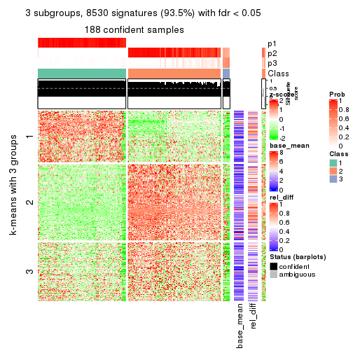</p>

</div>
<div id='tab-SD-NMF-get-signatures-3'>
<pre><code class="r">get_signatures(res, k = 4)
</code></pre>

<p></p>

</div>
<div id='tab-SD-NMF-get-signatures-4'>
<pre><code class="r">get_signatures(res, k = 5)
</code></pre>

<p></p>

</div>
<div id='tab-SD-NMF-get-signatures-5'>
<pre><code class="r">get_signatures(res, k = 6)
</code></pre>

<p></p>

</div>
</div>


Signature heatmaps where rows are not scaled:


<script>
$( function() {
	$( '#tabs-SD-NMF-get-signatures-no-scale' ).tabs();
} );
</script>
<div id='tabs-SD-NMF-get-signatures-no-scale'>
<ul>
<li><a href='#tab-SD-NMF-get-signatures-no-scale-1'>k = 2</a></li>
<li><a href='#tab-SD-NMF-get-signatures-no-scale-2'>k = 3</a></li>
<li><a href='#tab-SD-NMF-get-signatures-no-scale-3'>k = 4</a></li>
<li><a href='#tab-SD-NMF-get-signatures-no-scale-4'>k = 5</a></li>
<li><a href='#tab-SD-NMF-get-signatures-no-scale-5'>k = 6</a></li>
</ul>
<div id='tab-SD-NMF-get-signatures-no-scale-1'>
<pre><code class="r">get_signatures(res, k = 2, scale_rows = FALSE)
</code></pre>

<p></p>

</div>
<div id='tab-SD-NMF-get-signatures-no-scale-2'>
<pre><code class="r">get_signatures(res, k = 3, scale_rows = FALSE)
</code></pre>

<p></p>

</div>
<div id='tab-SD-NMF-get-signatures-no-scale-3'>
<pre><code class="r">get_signatures(res, k = 4, scale_rows = FALSE)
</code></pre>

<p></p>

</div>
<div id='tab-SD-NMF-get-signatures-no-scale-4'>
<pre><code class="r">get_signatures(res, k = 5, scale_rows = FALSE)
</code></pre>

<p></p>

</div>
<div id='tab-SD-NMF-get-signatures-no-scale-5'>
<pre><code class="r">get_signatures(res, k = 6, scale_rows = FALSE)
</code></pre>

<p></p>

</div>
</div>


Compare the overlap of signatures from different k:

```r
compare_signatures(res)
```


`get_signature()` returns a data frame invisibly. TO get the list of signatures, the function
call should be assigned to a variable explicitly. In following code, if `plot` argument is set
to `FALSE`, no heatmap is plotted while only the differential analysis is performed.

```r
# code only for demonstration
tb = get_signature(res, k = ..., plot = FALSE)
```

An example of the output of `tb` is:

```
#>   which_row         fdr    mean_1    mean_2 scaled_mean_1 scaled_mean_2 km
#> 1        38 0.042760348  8.373488  9.131774    -0.5533452     0.5164555  1
#> 2        40 0.018707592  7.106213  8.469186    -0.6173731     0.5762149  1
#> 3        55 0.019134737 10.221463 11.207825    -0.6159697     0.5749050  1
#> 4        59 0.006059896  5.921854  7.869574    -0.6899429     0.6439467  1
#> 5        60 0.018055526  8.928898 10.211722    -0.6204761     0.5791110  1
#> 6        98 0.009384629 15.714769 14.887706     0.6635654    -0.6193277  2
...
```

The columns in `tb` are:

1. `which_row`: row indices corresponding to the input matrix.
2. `fdr`: FDR for the differential test. 
3. `mean_x`: The mean value in group x.
4. `scaled_mean_x`: The mean value in group x after rows are scaled.
5. `km`: Row groups if k-means clustering is applied to rows.


UMAP plot which shows how samples are separated.


<script>
$( function() {
	$( '#tabs-SD-NMF-dimension-reduction' ).tabs();
} );
</script>
<div id='tabs-SD-NMF-dimension-reduction'>
<ul>
<li><a href='#tab-SD-NMF-dimension-reduction-1'>k = 2</a></li>
<li><a href='#tab-SD-NMF-dimension-reduction-2'>k = 3</a></li>
<li><a href='#tab-SD-NMF-dimension-reduction-3'>k = 4</a></li>
<li><a href='#tab-SD-NMF-dimension-reduction-4'>k = 5</a></li>
<li><a href='#tab-SD-NMF-dimension-reduction-5'>k = 6</a></li>
</ul>
<div id='tab-SD-NMF-dimension-reduction-1'>
<pre><code class="r">dimension_reduction(res, k = 2, method = &quot;UMAP&quot;)
</code></pre>

<p></p>

</div>
<div id='tab-SD-NMF-dimension-reduction-2'>
<pre><code class="r">dimension_reduction(res, k = 3, method = &quot;UMAP&quot;)
</code></pre>

<p></p>

</div>
<div id='tab-SD-NMF-dimension-reduction-3'>
<pre><code class="r">dimension_reduction(res, k = 4, method = &quot;UMAP&quot;)
</code></pre>

<p></p>

</div>
<div id='tab-SD-NMF-dimension-reduction-4'>
<pre><code class="r">dimension_reduction(res, k = 5, method = &quot;UMAP&quot;)
</code></pre>

<p></p>

</div>
<div id='tab-SD-NMF-dimension-reduction-5'>
<pre><code class="r">dimension_reduction(res, k = 6, method = &quot;UMAP&quot;)
</code></pre>

<p>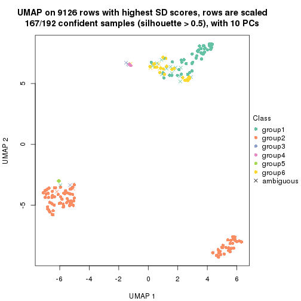</p>

</div>
</div>


Following heatmap shows how subgroups are split when increasing `k`:

```r
collect_classes(res)
```

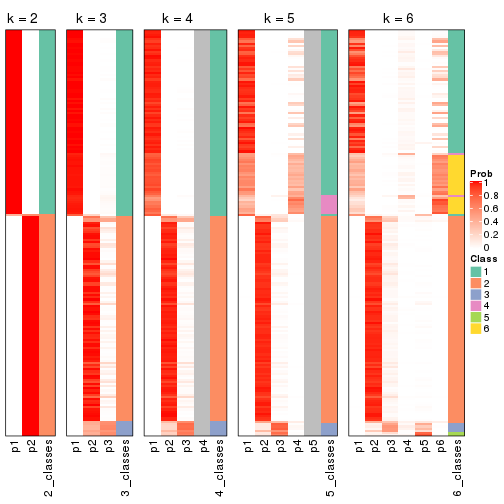


If matrix rows can be associated to genes, consider to use `functional_enrichment(res,
...)` to perform function enrichment for the signature genes. See [this vignette](http://bioconductor.org/packages/devel/bioc/vignettes/cola/inst/doc/functional_enrichment.html) for more detailed explanations.


 

---------------------------------------------------


### CV:hclust**


The object with results only for a single top-value method and a single partition method 
can be extracted as:

```r
res = res_list["CV", "hclust"]
# you can also extract it by
# res = res_list["CV:hclust"]
```

A summary of `res` and all the functions that can be applied to it:

```r
res
```

```
#> A 'ConsensusPartition' object with k = 2, 3, 4, 5, 6.
#>   On a matrix with 9126 rows and 192 columns.
#>   Top rows (913, 1826, 2738, 3650, 4563) are extracted by 'CV' method.
#>   Subgroups are detected by 'hclust' method.
#>   Performed in total 1250 partitions by row resampling.
#>   Best k for subgroups seems to be 3.
#> 
#> Following methods can be applied to this 'ConsensusPartition' object:
#>  [1] "cola_report"             "collect_classes"         "collect_plots"          
#>  [4] "collect_stats"           "colnames"                "compare_signatures"     
#>  [7] "consensus_heatmap"       "dimension_reduction"     "functional_enrichment"  
#> [10] "get_anno_col"            "get_anno"                "get_classes"            
#> [13] "get_consensus"           "get_matrix"              "get_membership"         
#> [16] "get_param"               "get_signatures"          "get_stats"              
#> [19] "is_best_k"               "is_stable_k"             "membership_heatmap"     
#> [22] "ncol"                    "nrow"                    "plot_ecdf"              
#> [25] "rownames"                "select_partition_number" "show"                   
#> [28] "suggest_best_k"          "test_to_known_factors"
```

`collect_plots()` function collects all the plots made from `res` for all `k` (number of partitions)
into one single page to provide an easy and fast comparison between different `k`.

```r
collect_plots(res)
```


The plots are:

- The first row: a plot of the ECDF (empirical cumulative distribution
  function) curves of the consensus matrix for each `k` and the heatmap of
  predicted classes for each `k`.
- The second row: heatmaps of the consensus matrix for each `k`.
- The third row: heatmaps of the membership matrix for each `k`.
- The fouth row: heatmaps of the signatures for each `k`.

All the plots in panels can be made by individual functions and they are
plotted later in this section.

`select_partition_number()` produces several plots showing different
statistics for choosing "optimized" `k`. There are following statistics:

- ECDF curves of the consensus matrix for each `k`;
- 1-PAC. [The PAC
  score](https://en.wikipedia.org/wiki/Consensus_clustering#Over-interpretation_potential_of_consensus_clustering)
  measures the proportion of the ambiguous subgrouping.
- Mean silhouette score.
- Concordance. The mean probability of fiting the consensus class ids in all
  partitions.
- Area increased. Denote $A_k$ as the area under the ECDF curve for current
  `k`, the area increased is defined as $A_k - A_{k-1}$.
- Rand index. The percent of pairs of samples that are both in a same cluster
  or both are not in a same cluster in the partition of k and k-1.
- Jaccard index. The ratio of pairs of samples are both in a same cluster in
  the partition of k and k-1 and the pairs of samples are both in a same
  cluster in the partition k or k-1.

The detailed explanations of these statistics can be found in [the _cola_
vignette](http://bioconductor.org/packages/devel/bioc/vignettes/cola/inst/doc/cola.html#toc_13).

Generally speaking, lower PAC score, higher mean silhouette score or higher
concordance corresponds to better partition. Rand index and Jaccard index
measure how similar the current partition is compared to partition with `k-1`.
If they are too similar, we won't accept `k` is better than `k-1`.

```r
select_partition_number(res)
```


The numeric values for all these statistics can be obtained by `get_stats()`.

```r
get_stats(res)
```

```
#>   k 1-PAC mean_silhouette concordance area_increased  Rand Jaccard
#> 2 2 1.000           0.992       0.997        0.50304 0.497   0.497
#> 3 3 0.985           0.985       0.978        0.07462 0.949   0.897
#> 4 4 0.964           0.961       0.976        0.00507 0.999   0.999
#> 5 5 0.964           0.967       0.976        0.01308 0.990   0.977
#> 6 6 0.975           0.973       0.980        0.00425 1.000   0.999
```

`suggest_best_k()` suggests the best $k$ based on these statistics. The rules are as follows:

- All $k$ with Jaccard index larger than 0.95 are removed because increasing
  $k$ does not provide enough extra information. If all $k$ are removed, it is
  marked as no subgroup is detected.
- For all $k$ with 1-PAC score larger than 0.9, the maximal $k$ is taken as
  the best $k$, and other $k$ are marked as optional $k$.
- If it does not fit the second rule. The $k$ with the maximal vote of the
  highest 1-PAC score, highest mean silhouette, and highest concordance is
  taken as the best $k$.

```r
suggest_best_k(res)
```

```
#> [1] 3
#> attr(,"optional")
#> [1] 2
```

There is also optional best $k$ = 2 that is worth to check.

Following shows the table of the partitions (You need to click the **show/hide
code output** link to see it). The membership matrix (columns with name `p*`)
is inferred by
[`clue::cl_consensus()`](https://www.rdocumentation.org/link/cl_consensus?package=clue)
function with the `SE` method. Basically the value in the membership matrix
represents the probability to belong to a certain group. The finall class
label for an item is determined with the group with highest probability it
belongs to.

In `get_classes()` function, the entropy is calculated from the membership
matrix and the silhouette score is calculated from the consensus matrix.


<script>
$( function() {
	$( '#tabs-CV-hclust-get-classes' ).tabs();
} );
</script>
<div id='tabs-CV-hclust-get-classes'>
<ul>
<li><a href='#tab-CV-hclust-get-classes-1'>k = 2</a></li>
<li><a href='#tab-CV-hclust-get-classes-2'>k = 3</a></li>
<li><a href='#tab-CV-hclust-get-classes-3'>k = 4</a></li>
<li><a href='#tab-CV-hclust-get-classes-4'>k = 5</a></li>
<li><a href='#tab-CV-hclust-get-classes-5'>k = 6</a></li>
</ul>

<div id='tab-CV-hclust-get-classes-1'>
<p><a id='tab-CV-hclust-get-classes-1-a' style='color:#0366d6' href='#'>show/hide code output</a></p>
<pre><code class="r">cbind(get_classes(res, k = 2), get_membership(res, k = 2))
</code></pre>

<pre><code>#&gt;            class entropy silhouette    p1    p2
#&gt; SRR2074921     1  0.0000      0.993 1.000 0.000
#&gt; SRR2074919     1  0.0000      0.993 1.000 0.000
#&gt; SRR2074920     1  0.0000      0.993 1.000 0.000
#&gt; SRR2074917     1  0.0000      0.993 1.000 0.000
#&gt; SRR2074918     1  0.0000      0.993 1.000 0.000
#&gt; SRR2074916     2  0.0000      1.000 0.000 1.000
#&gt; SRR2074915     2  0.0376      0.996 0.004 0.996
#&gt; SRR2074914     1  0.0000      0.993 1.000 0.000
#&gt; SRR2074913     1  0.9000      0.544 0.684 0.316
#&gt; SRR2074912     1  0.0000      0.993 1.000 0.000
#&gt; SRR2074911     1  0.8955      0.552 0.688 0.312
#&gt; SRR2074910     1  0.1633      0.970 0.976 0.024
#&gt; SRR2074909     1  0.0000      0.993 1.000 0.000
#&gt; SRR2074907     1  0.0000      0.993 1.000 0.000
#&gt; SRR2074908     2  0.0000      1.000 0.000 1.000
#&gt; SRR2074906     2  0.0000      1.000 0.000 1.000
#&gt; SRR2074905     1  0.0000      0.993 1.000 0.000
#&gt; SRR2074904     2  0.0000      1.000 0.000 1.000
#&gt; SRR2074903     2  0.0000      1.000 0.000 1.000
#&gt; SRR2074902     1  0.0000      0.993 1.000 0.000
#&gt; SRR2074901     2  0.0000      1.000 0.000 1.000
#&gt; SRR2074900     1  0.0000      0.993 1.000 0.000
#&gt; SRR2074899     2  0.0000      1.000 0.000 1.000
#&gt; SRR2074898     2  0.0000      1.000 0.000 1.000
#&gt; SRR2074897     2  0.0000      1.000 0.000 1.000
#&gt; SRR2074896     2  0.0000      1.000 0.000 1.000
#&gt; SRR2074895     1  0.0000      0.993 1.000 0.000
#&gt; SRR2074894     1  0.0000      0.993 1.000 0.000
#&gt; SRR2074893     2  0.0000      1.000 0.000 1.000
#&gt; SRR2074892     1  0.0000      0.993 1.000 0.000
#&gt; SRR2074891     1  0.0000      0.993 1.000 0.000
#&gt; SRR2074890     2  0.0000      1.000 0.000 1.000
#&gt; SRR2074887     2  0.0000      1.000 0.000 1.000
#&gt; SRR2074889     2  0.0000      1.000 0.000 1.000
#&gt; SRR2074886     2  0.0000      1.000 0.000 1.000
#&gt; SRR2074888     2  0.0000      1.000 0.000 1.000
#&gt; SRR2074885     1  0.0000      0.993 1.000 0.000
#&gt; SRR2074884     2  0.0000      1.000 0.000 1.000
#&gt; SRR2074883     2  0.0000      1.000 0.000 1.000
#&gt; SRR2074882     1  0.0000      0.993 1.000 0.000
#&gt; SRR2074880     2  0.0000      1.000 0.000 1.000
#&gt; SRR2074881     2  0.0000      1.000 0.000 1.000
#&gt; SRR2074879     1  0.0000      0.993 1.000 0.000
#&gt; SRR2074878     1  0.0000      0.993 1.000 0.000
#&gt; SRR2074877     2  0.0000      1.000 0.000 1.000
#&gt; SRR2074876     1  0.0000      0.993 1.000 0.000
#&gt; SRR2074875     2  0.0000      1.000 0.000 1.000
#&gt; SRR2074874     1  0.0000      0.993 1.000 0.000
#&gt; SRR2074873     2  0.0000      1.000 0.000 1.000
#&gt; SRR2074872     1  0.0000      0.993 1.000 0.000
#&gt; SRR2074871     2  0.0000      1.000 0.000 1.000
#&gt; SRR2074870     1  0.0000      0.993 1.000 0.000
#&gt; SRR2074869     1  0.0000      0.993 1.000 0.000
#&gt; SRR2074868     1  0.0000      0.993 1.000 0.000
#&gt; SRR2074867     2  0.0000      1.000 0.000 1.000
#&gt; SRR2074866     2  0.0000      1.000 0.000 1.000
#&gt; SRR2074865     1  0.0000      0.993 1.000 0.000
#&gt; SRR2074864     1  0.0000      0.993 1.000 0.000
#&gt; SRR2074863     1  0.0000      0.993 1.000 0.000
#&gt; SRR2074862     1  0.0000      0.993 1.000 0.000
#&gt; SRR2074861     1  0.0000      0.993 1.000 0.000
#&gt; SRR2074860     1  0.0000      0.993 1.000 0.000
#&gt; SRR2074859     1  0.0000      0.993 1.000 0.000
#&gt; SRR2074858     2  0.0000      1.000 0.000 1.000
#&gt; SRR2074855     2  0.0000      1.000 0.000 1.000
#&gt; SRR2074857     1  0.0000      0.993 1.000 0.000
#&gt; SRR2074856     1  0.0000      0.993 1.000 0.000
#&gt; SRR2074854     1  0.0000      0.993 1.000 0.000
#&gt; SRR2074853     1  0.0000      0.993 1.000 0.000
#&gt; SRR2074852     2  0.0000      1.000 0.000 1.000
#&gt; SRR2074851     1  0.0000      0.993 1.000 0.000
#&gt; SRR2074850     1  0.0000      0.993 1.000 0.000
#&gt; SRR2074849     1  0.0000      0.993 1.000 0.000
#&gt; SRR2074848     1  0.0000      0.993 1.000 0.000
#&gt; SRR2074847     1  0.0000      0.993 1.000 0.000
#&gt; SRR2074846     1  0.0000      0.993 1.000 0.000
#&gt; SRR2074845     1  0.0000      0.993 1.000 0.000
#&gt; SRR2074843     1  0.0000      0.993 1.000 0.000
#&gt; SRR2074842     2  0.0000      1.000 0.000 1.000
#&gt; SRR2074844     2  0.0000      1.000 0.000 1.000
#&gt; SRR2074841     2  0.0000      1.000 0.000 1.000
#&gt; SRR2074840     2  0.0000      1.000 0.000 1.000
#&gt; SRR2074839     1  0.0000      0.993 1.000 0.000
#&gt; SRR2074838     2  0.0000      1.000 0.000 1.000
#&gt; SRR2074836     2  0.0000      1.000 0.000 1.000
#&gt; SRR2074835     2  0.0000      1.000 0.000 1.000
#&gt; SRR2074837     1  0.0000      0.993 1.000 0.000
#&gt; SRR2074834     2  0.0000      1.000 0.000 1.000
#&gt; SRR2074833     1  0.0000      0.993 1.000 0.000
#&gt; SRR2074832     2  0.0000      1.000 0.000 1.000
#&gt; SRR2074831     1  0.0000      0.993 1.000 0.000
#&gt; SRR2074829     1  0.0000      0.993 1.000 0.000
#&gt; SRR2074830     1  0.0000      0.993 1.000 0.000
#&gt; SRR2074828     1  0.0000      0.993 1.000 0.000
#&gt; SRR2074827     2  0.0000      1.000 0.000 1.000
#&gt; SRR2074826     2  0.0000      1.000 0.000 1.000
#&gt; SRR2074825     2  0.0000      1.000 0.000 1.000
#&gt; SRR2074824     2  0.0000      1.000 0.000 1.000
#&gt; SRR2074823     1  0.0000      0.993 1.000 0.000
#&gt; SRR2074822     2  0.0000      1.000 0.000 1.000
#&gt; SRR2074821     2  0.0000      1.000 0.000 1.000
#&gt; SRR2074820     2  0.0000      1.000 0.000 1.000
#&gt; SRR2074819     2  0.0000      1.000 0.000 1.000
#&gt; SRR2074817     2  0.0000      1.000 0.000 1.000
#&gt; SRR2074818     2  0.0000      1.000 0.000 1.000
#&gt; SRR2074816     1  0.0000      0.993 1.000 0.000
#&gt; SRR2074815     2  0.0000      1.000 0.000 1.000
#&gt; SRR2074814     1  0.0000      0.993 1.000 0.000
#&gt; SRR2074812     2  0.0000      1.000 0.000 1.000
#&gt; SRR2074813     2  0.0000      1.000 0.000 1.000
#&gt; SRR2074809     2  0.0000      1.000 0.000 1.000
#&gt; SRR2074810     2  0.0000      1.000 0.000 1.000
#&gt; SRR2074811     2  0.0000      1.000 0.000 1.000
#&gt; SRR2074808     2  0.0000      1.000 0.000 1.000
#&gt; SRR2074807     2  0.0000      1.000 0.000 1.000
#&gt; SRR2074806     1  0.0000      0.993 1.000 0.000
#&gt; SRR2074805     2  0.0000      1.000 0.000 1.000
#&gt; SRR2074804     1  0.0000      0.993 1.000 0.000
#&gt; SRR2074803     1  0.0000      0.993 1.000 0.000
#&gt; SRR2074801     1  0.0000      0.993 1.000 0.000
#&gt; SRR2074802     2  0.0000      1.000 0.000 1.000
#&gt; SRR2074799     2  0.0000      1.000 0.000 1.000
#&gt; SRR2074800     1  0.0000      0.993 1.000 0.000
#&gt; SRR2074798     1  0.0000      0.993 1.000 0.000
#&gt; SRR2074797     1  0.0000      0.993 1.000 0.000
#&gt; SRR2074795     2  0.0000      1.000 0.000 1.000
#&gt; SRR2074796     2  0.0000      1.000 0.000 1.000
#&gt; SRR2074794     2  0.0000      1.000 0.000 1.000
#&gt; SRR2074793     2  0.0000      1.000 0.000 1.000
#&gt; SRR2074792     1  0.0000      0.993 1.000 0.000
#&gt; SRR2074791     1  0.0000      0.993 1.000 0.000
#&gt; SRR2074790     2  0.0000      1.000 0.000 1.000
#&gt; SRR2074789     1  0.0000      0.993 1.000 0.000
#&gt; SRR2074788     1  0.0000      0.993 1.000 0.000
#&gt; SRR2074787     1  0.0000      0.993 1.000 0.000
#&gt; SRR2074786     2  0.0000      1.000 0.000 1.000
#&gt; SRR2074785     1  0.0000      0.993 1.000 0.000
#&gt; SRR2074784     1  0.0000      0.993 1.000 0.000
#&gt; SRR2074783     2  0.0000      1.000 0.000 1.000
#&gt; SRR2074782     1  0.0000      0.993 1.000 0.000
#&gt; SRR2074779     2  0.0000      1.000 0.000 1.000
#&gt; SRR2074781     2  0.0000      1.000 0.000 1.000
#&gt; SRR2074780     1  0.0000      0.993 1.000 0.000
#&gt; SRR2074778     2  0.0000      1.000 0.000 1.000
#&gt; SRR2074777     2  0.0000      1.000 0.000 1.000
#&gt; SRR2074776     2  0.0000      1.000 0.000 1.000
#&gt; SRR2074775     1  0.0000      0.993 1.000 0.000
#&gt; SRR2074774     1  0.0000      0.993 1.000 0.000
#&gt; SRR2074773     2  0.0000      1.000 0.000 1.000
#&gt; SRR2074771     2  0.0000      1.000 0.000 1.000
#&gt; SRR2074772     1  0.0000      0.993 1.000 0.000
#&gt; SRR2074770     1  0.0000      0.993 1.000 0.000
#&gt; SRR2074769     2  0.0000      1.000 0.000 1.000
#&gt; SRR2074768     2  0.0000      1.000 0.000 1.000
#&gt; SRR2074766     2  0.0000      1.000 0.000 1.000
#&gt; SRR2074767     1  0.0000      0.993 1.000 0.000
#&gt; SRR2074765     1  0.0000      0.993 1.000 0.000
#&gt; SRR2074764     2  0.0000      1.000 0.000 1.000
#&gt; SRR2074763     2  0.0000      1.000 0.000 1.000
#&gt; SRR2074761     1  0.0000      0.993 1.000 0.000
#&gt; SRR2074762     2  0.0000      1.000 0.000 1.000
#&gt; SRR2074760     2  0.0000      1.000 0.000 1.000
#&gt; SRR2074759     1  0.0000      0.993 1.000 0.000
#&gt; SRR2074757     2  0.0000      1.000 0.000 1.000
#&gt; SRR2074758     2  0.0000      1.000 0.000 1.000
#&gt; SRR2074756     2  0.0000      1.000 0.000 1.000
#&gt; SRR2074755     1  0.0000      0.993 1.000 0.000
#&gt; SRR2074754     1  0.0000      0.993 1.000 0.000
#&gt; SRR2074753     2  0.0376      0.996 0.004 0.996
#&gt; SRR2074752     1  0.0000      0.993 1.000 0.000
#&gt; SRR2074751     1  0.0000      0.993 1.000 0.000
#&gt; SRR2074749     2  0.0000      1.000 0.000 1.000
#&gt; SRR2074750     1  0.0000      0.993 1.000 0.000
#&gt; SRR2074748     1  0.0000      0.993 1.000 0.000
#&gt; SRR2074747     2  0.0000      1.000 0.000 1.000
#&gt; SRR2074745     1  0.0000      0.993 1.000 0.000
#&gt; SRR2074746     1  0.0000      0.993 1.000 0.000
#&gt; SRR2074744     2  0.0000      1.000 0.000 1.000
#&gt; SRR2074743     2  0.0000      1.000 0.000 1.000
#&gt; SRR2074742     1  0.0000      0.993 1.000 0.000
#&gt; SRR2074741     1  0.0000      0.993 1.000 0.000
#&gt; SRR2074740     2  0.0000      1.000 0.000 1.000
#&gt; SRR2074739     1  0.0000      0.993 1.000 0.000
#&gt; SRR2074738     2  0.0000      1.000 0.000 1.000
#&gt; SRR2074737     2  0.0000      1.000 0.000 1.000
#&gt; SRR2074736     2  0.0000      1.000 0.000 1.000
#&gt; SRR2074735     1  0.0000      0.993 1.000 0.000
#&gt; SRR2074734     2  0.0000      1.000 0.000 1.000
#&gt; SRR2074733     1  0.0000      0.993 1.000 0.000
#&gt; SRR2074732     2  0.0000      1.000 0.000 1.000
#&gt; SRR2074731     2  0.0000      1.000 0.000 1.000
#&gt; SRR2074730     1  0.0000      0.993 1.000 0.000
</code></pre>

<script>
$('#tab-CV-hclust-get-classes-1-a').parent().next().next().hide();
$('#tab-CV-hclust-get-classes-1-a').click(function(){
  $('#tab-CV-hclust-get-classes-1-a').parent().next().next().toggle();
  return(false);
});
</script>
</div>

<div id='tab-CV-hclust-get-classes-2'>
<p><a id='tab-CV-hclust-get-classes-2-a' style='color:#0366d6' href='#'>show/hide code output</a></p>
<pre><code class="r">cbind(get_classes(res, k = 3), get_membership(res, k = 3))
</code></pre>

<pre><code>#&gt;            class entropy silhouette    p1    p2    p3
#&gt; SRR2074921     3  0.6062      0.862 0.384 0.000 0.616
#&gt; SRR2074919     3  0.6079      0.861 0.388 0.000 0.612
#&gt; SRR2074920     3  0.6079      0.861 0.388 0.000 0.612
#&gt; SRR2074917     3  0.6079      0.861 0.388 0.000 0.612
#&gt; SRR2074918     3  0.6062      0.862 0.384 0.000 0.616
#&gt; SRR2074916     2  0.2261      0.937 0.000 0.932 0.068
#&gt; SRR2074915     2  0.2625      0.925 0.000 0.916 0.084
#&gt; SRR2074914     1  0.0000      1.000 1.000 0.000 0.000
#&gt; SRR2074913     3  0.1711      0.644 0.008 0.032 0.960
#&gt; SRR2074912     3  0.6079      0.861 0.388 0.000 0.612
#&gt; SRR2074911     3  0.0237      0.641 0.000 0.004 0.996
#&gt; SRR2074910     3  0.5678      0.823 0.316 0.000 0.684
#&gt; SRR2074909     1  0.0000      1.000 1.000 0.000 0.000
#&gt; SRR2074907     1  0.0000      1.000 1.000 0.000 0.000
#&gt; SRR2074908     2  0.0424      0.993 0.000 0.992 0.008
#&gt; SRR2074906     2  0.0237      0.993 0.000 0.996 0.004
#&gt; SRR2074905     1  0.0000      1.000 1.000 0.000 0.000
#&gt; SRR2074904     2  0.0424      0.993 0.000 0.992 0.008
#&gt; SRR2074903     2  0.0747      0.989 0.000 0.984 0.016
#&gt; SRR2074902     1  0.0000      1.000 1.000 0.000 0.000
#&gt; SRR2074901     2  0.0424      0.993 0.000 0.992 0.008
#&gt; SRR2074900     1  0.0000      1.000 1.000 0.000 0.000
#&gt; SRR2074899     2  0.0424      0.993 0.000 0.992 0.008
#&gt; SRR2074898     2  0.0237      0.993 0.000 0.996 0.004
#&gt; SRR2074897     2  0.0237      0.993 0.000 0.996 0.004
#&gt; SRR2074896     2  0.0424      0.993 0.000 0.992 0.008
#&gt; SRR2074895     1  0.0000      1.000 1.000 0.000 0.000
#&gt; SRR2074894     1  0.0000      1.000 1.000 0.000 0.000
#&gt; SRR2074893     2  0.0000      0.993 0.000 1.000 0.000
#&gt; SRR2074892     1  0.0000      1.000 1.000 0.000 0.000
#&gt; SRR2074891     1  0.0000      1.000 1.000 0.000 0.000
#&gt; SRR2074890     2  0.0424      0.993 0.000 0.992 0.008
#&gt; SRR2074887     2  0.0424      0.993 0.000 0.992 0.008
#&gt; SRR2074889     2  0.0237      0.993 0.000 0.996 0.004
#&gt; SRR2074886     2  0.0424      0.993 0.000 0.992 0.008
#&gt; SRR2074888     2  0.0237      0.993 0.000 0.996 0.004
#&gt; SRR2074885     1  0.0000      1.000 1.000 0.000 0.000
#&gt; SRR2074884     2  0.0237      0.993 0.000 0.996 0.004
#&gt; SRR2074883     2  0.0237      0.993 0.000 0.996 0.004
#&gt; SRR2074882     1  0.0000      1.000 1.000 0.000 0.000
#&gt; SRR2074880     2  0.0237      0.993 0.000 0.996 0.004
#&gt; SRR2074881     2  0.0424      0.993 0.000 0.992 0.008
#&gt; SRR2074879     3  0.6079      0.861 0.388 0.000 0.612
#&gt; SRR2074878     1  0.0000      1.000 1.000 0.000 0.000
#&gt; SRR2074877     2  0.0237      0.994 0.000 0.996 0.004
#&gt; SRR2074876     1  0.0000      1.000 1.000 0.000 0.000
#&gt; SRR2074875     2  0.0237      0.993 0.000 0.996 0.004
#&gt; SRR2074874     1  0.0000      1.000 1.000 0.000 0.000
#&gt; SRR2074873     2  0.0237      0.993 0.000 0.996 0.004
#&gt; SRR2074872     1  0.0000      1.000 1.000 0.000 0.000
#&gt; SRR2074871     2  0.0424      0.993 0.000 0.992 0.008
#&gt; SRR2074870     1  0.0000      1.000 1.000 0.000 0.000
#&gt; SRR2074869     1  0.0000      1.000 1.000 0.000 0.000
#&gt; SRR2074868     1  0.0000      1.000 1.000 0.000 0.000
#&gt; SRR2074867     2  0.0424      0.993 0.000 0.992 0.008
#&gt; SRR2074866     2  0.0237      0.994 0.000 0.996 0.004
#&gt; SRR2074865     1  0.0000      1.000 1.000 0.000 0.000
#&gt; SRR2074864     1  0.0000      1.000 1.000 0.000 0.000
#&gt; SRR2074863     1  0.0000      1.000 1.000 0.000 0.000
#&gt; SRR2074862     1  0.0000      1.000 1.000 0.000 0.000
#&gt; SRR2074861     1  0.0000      1.000 1.000 0.000 0.000
#&gt; SRR2074860     1  0.0424      0.988 0.992 0.000 0.008
#&gt; SRR2074859     1  0.0000      1.000 1.000 0.000 0.000
#&gt; SRR2074858     2  0.0424      0.993 0.000 0.992 0.008
#&gt; SRR2074855     2  0.0237      0.993 0.000 0.996 0.004
#&gt; SRR2074857     1  0.0000      1.000 1.000 0.000 0.000
#&gt; SRR2074856     1  0.0000      1.000 1.000 0.000 0.000
#&gt; SRR2074854     1  0.0000      1.000 1.000 0.000 0.000
#&gt; SRR2074853     1  0.0000      1.000 1.000 0.000 0.000
#&gt; SRR2074852     2  0.0237      0.993 0.000 0.996 0.004
#&gt; SRR2074851     1  0.0000      1.000 1.000 0.000 0.000
#&gt; SRR2074850     1  0.0000      1.000 1.000 0.000 0.000
#&gt; SRR2074849     1  0.0000      1.000 1.000 0.000 0.000
#&gt; SRR2074848     1  0.0000      1.000 1.000 0.000 0.000
#&gt; SRR2074847     1  0.0000      1.000 1.000 0.000 0.000
#&gt; SRR2074846     1  0.0000      1.000 1.000 0.000 0.000
#&gt; SRR2074845     1  0.0000      1.000 1.000 0.000 0.000
#&gt; SRR2074843     1  0.0000      1.000 1.000 0.000 0.000
#&gt; SRR2074842     2  0.0424      0.993 0.000 0.992 0.008
#&gt; SRR2074844     2  0.0424      0.993 0.000 0.992 0.008
#&gt; SRR2074841     2  0.0237      0.993 0.000 0.996 0.004
#&gt; SRR2074840     2  0.0237      0.993 0.000 0.996 0.004
#&gt; SRR2074839     1  0.0000      1.000 1.000 0.000 0.000
#&gt; SRR2074838     2  0.0237      0.993 0.000 0.996 0.004
#&gt; SRR2074836     2  0.0424      0.993 0.000 0.992 0.008
#&gt; SRR2074835     2  0.0237      0.993 0.000 0.996 0.004
#&gt; SRR2074837     1  0.0000      1.000 1.000 0.000 0.000
#&gt; SRR2074834     2  0.0424      0.993 0.000 0.992 0.008
#&gt; SRR2074833     1  0.0000      1.000 1.000 0.000 0.000
#&gt; SRR2074832     2  0.0237      0.993 0.000 0.996 0.004
#&gt; SRR2074831     1  0.0000      1.000 1.000 0.000 0.000
#&gt; SRR2074829     1  0.0000      1.000 1.000 0.000 0.000
#&gt; SRR2074830     1  0.0000      1.000 1.000 0.000 0.000
#&gt; SRR2074828     1  0.0000      1.000 1.000 0.000 0.000
#&gt; SRR2074827     2  0.0424      0.993 0.000 0.992 0.008
#&gt; SRR2074826     2  0.0424      0.993 0.000 0.992 0.008
#&gt; SRR2074825     2  0.0237      0.993 0.000 0.996 0.004
#&gt; SRR2074824     2  0.0237      0.993 0.000 0.996 0.004
#&gt; SRR2074823     1  0.0000      1.000 1.000 0.000 0.000
#&gt; SRR2074822     2  0.0237      0.993 0.000 0.996 0.004
#&gt; SRR2074821     2  0.0237      0.993 0.000 0.996 0.004
#&gt; SRR2074820     2  0.0237      0.993 0.000 0.996 0.004
#&gt; SRR2074819     2  0.0424      0.993 0.000 0.992 0.008
#&gt; SRR2074817     2  0.0424      0.993 0.000 0.992 0.008
#&gt; SRR2074818     2  0.0237      0.993 0.000 0.996 0.004
#&gt; SRR2074816     1  0.0000      1.000 1.000 0.000 0.000
#&gt; SRR2074815     2  0.0237      0.993 0.000 0.996 0.004
#&gt; SRR2074814     1  0.0000      1.000 1.000 0.000 0.000
#&gt; SRR2074812     2  0.0237      0.993 0.000 0.996 0.004
#&gt; SRR2074813     2  0.0424      0.993 0.000 0.992 0.008
#&gt; SRR2074809     2  0.0237      0.993 0.000 0.996 0.004
#&gt; SRR2074810     2  0.0424      0.993 0.000 0.992 0.008
#&gt; SRR2074811     2  0.0237      0.993 0.000 0.996 0.004
#&gt; SRR2074808     2  0.0237      0.993 0.000 0.996 0.004
#&gt; SRR2074807     2  0.0237      0.994 0.000 0.996 0.004
#&gt; SRR2074806     1  0.0000      1.000 1.000 0.000 0.000
#&gt; SRR2074805     2  0.0237      0.993 0.000 0.996 0.004
#&gt; SRR2074804     1  0.0000      1.000 1.000 0.000 0.000
#&gt; SRR2074803     1  0.0000      1.000 1.000 0.000 0.000
#&gt; SRR2074801     1  0.0000      1.000 1.000 0.000 0.000
#&gt; SRR2074802     2  0.0424      0.993 0.000 0.992 0.008
#&gt; SRR2074799     2  0.0237      0.993 0.000 0.996 0.004
#&gt; SRR2074800     1  0.0000      1.000 1.000 0.000 0.000
#&gt; SRR2074798     1  0.0000      1.000 1.000 0.000 0.000
#&gt; SRR2074797     1  0.0000      1.000 1.000 0.000 0.000
#&gt; SRR2074795     2  0.0237      0.993 0.000 0.996 0.004
#&gt; SRR2074796     2  0.0424      0.993 0.000 0.992 0.008
#&gt; SRR2074794     2  0.0237      0.993 0.000 0.996 0.004
#&gt; SRR2074793     2  0.0424      0.993 0.000 0.992 0.008
#&gt; SRR2074792     1  0.0000      1.000 1.000 0.000 0.000
#&gt; SRR2074791     1  0.0000      1.000 1.000 0.000 0.000
#&gt; SRR2074790     2  0.0237      0.993 0.000 0.996 0.004
#&gt; SRR2074789     1  0.0000      1.000 1.000 0.000 0.000
#&gt; SRR2074788     1  0.0000      1.000 1.000 0.000 0.000
#&gt; SRR2074787     1  0.0000      1.000 1.000 0.000 0.000
#&gt; SRR2074786     2  0.0424      0.993 0.000 0.992 0.008
#&gt; SRR2074785     1  0.0000      1.000 1.000 0.000 0.000
#&gt; SRR2074784     1  0.0000      1.000 1.000 0.000 0.000
#&gt; SRR2074783     2  0.0237      0.993 0.000 0.996 0.004
#&gt; SRR2074782     1  0.0000      1.000 1.000 0.000 0.000
#&gt; SRR2074779     2  0.0424      0.993 0.000 0.992 0.008
#&gt; SRR2074781     2  0.0424      0.993 0.000 0.992 0.008
#&gt; SRR2074780     1  0.0000      1.000 1.000 0.000 0.000
#&gt; SRR2074778     2  0.0237      0.993 0.000 0.996 0.004
#&gt; SRR2074777     2  0.0424      0.993 0.000 0.992 0.008
#&gt; SRR2074776     2  0.0237      0.993 0.000 0.996 0.004
#&gt; SRR2074775     1  0.0000      1.000 1.000 0.000 0.000
#&gt; SRR2074774     1  0.0000      1.000 1.000 0.000 0.000
#&gt; SRR2074773     2  0.0424      0.993 0.000 0.992 0.008
#&gt; SRR2074771     2  0.0424      0.993 0.000 0.992 0.008
#&gt; SRR2074772     1  0.0000      1.000 1.000 0.000 0.000
#&gt; SRR2074770     1  0.0000      1.000 1.000 0.000 0.000
#&gt; SRR2074769     2  0.0237      0.993 0.000 0.996 0.004
#&gt; SRR2074768     2  0.0237      0.993 0.000 0.996 0.004
#&gt; SRR2074766     2  0.0424      0.993 0.000 0.992 0.008
#&gt; SRR2074767     1  0.0000      1.000 1.000 0.000 0.000
#&gt; SRR2074765     1  0.0000      1.000 1.000 0.000 0.000
#&gt; SRR2074764     2  0.0424      0.993 0.000 0.992 0.008
#&gt; SRR2074763     2  0.0237      0.993 0.000 0.996 0.004
#&gt; SRR2074761     1  0.0000      1.000 1.000 0.000 0.000
#&gt; SRR2074762     2  0.0424      0.993 0.000 0.992 0.008
#&gt; SRR2074760     2  0.0424      0.993 0.000 0.992 0.008
#&gt; SRR2074759     1  0.0000      1.000 1.000 0.000 0.000
#&gt; SRR2074757     2  0.0237      0.993 0.000 0.996 0.004
#&gt; SRR2074758     2  0.0237      0.993 0.000 0.996 0.004
#&gt; SRR2074756     2  0.0424      0.993 0.000 0.992 0.008
#&gt; SRR2074755     1  0.0000      1.000 1.000 0.000 0.000
#&gt; SRR2074754     1  0.0000      1.000 1.000 0.000 0.000
#&gt; SRR2074753     2  0.0661      0.990 0.004 0.988 0.008
#&gt; SRR2074752     1  0.0000      1.000 1.000 0.000 0.000
#&gt; SRR2074751     1  0.0000      1.000 1.000 0.000 0.000
#&gt; SRR2074749     2  0.0237      0.993 0.000 0.996 0.004
#&gt; SRR2074750     1  0.0000      1.000 1.000 0.000 0.000
#&gt; SRR2074748     1  0.0000      1.000 1.000 0.000 0.000
#&gt; SRR2074747     2  0.0424      0.993 0.000 0.992 0.008
#&gt; SRR2074745     1  0.0000      1.000 1.000 0.000 0.000
#&gt; SRR2074746     1  0.0000      1.000 1.000 0.000 0.000
#&gt; SRR2074744     2  0.0424      0.993 0.000 0.992 0.008
#&gt; SRR2074743     2  0.0424      0.993 0.000 0.992 0.008
#&gt; SRR2074742     3  0.6062      0.862 0.384 0.000 0.616
#&gt; SRR2074741     1  0.0000      1.000 1.000 0.000 0.000
#&gt; SRR2074740     2  0.0424      0.993 0.000 0.992 0.008
#&gt; SRR2074739     1  0.0000      1.000 1.000 0.000 0.000
#&gt; SRR2074738     2  0.0424      0.993 0.000 0.992 0.008
#&gt; SRR2074737     2  0.0237      0.993 0.000 0.996 0.004
#&gt; SRR2074736     2  0.0000      0.993 0.000 1.000 0.000
#&gt; SRR2074735     1  0.0000      1.000 1.000 0.000 0.000
#&gt; SRR2074734     2  0.0237      0.994 0.000 0.996 0.004
#&gt; SRR2074733     1  0.0000      1.000 1.000 0.000 0.000
#&gt; SRR2074732     2  0.0237      0.993 0.000 0.996 0.004
#&gt; SRR2074731     2  0.0237      0.993 0.000 0.996 0.004
#&gt; SRR2074730     1  0.0000      1.000 1.000 0.000 0.000
</code></pre>

<script>
$('#tab-CV-hclust-get-classes-2-a').parent().next().next().hide();
$('#tab-CV-hclust-get-classes-2-a').click(function(){
  $('#tab-CV-hclust-get-classes-2-a').parent().next().next().toggle();
  return(false);
});
</script>
</div>

<div id='tab-CV-hclust-get-classes-3'>
<p><a id='tab-CV-hclust-get-classes-3-a' style='color:#0366d6' href='#'>show/hide code output</a></p>
<pre><code class="r">cbind(get_classes(res, k = 4), get_membership(res, k = 4))
</code></pre>

<pre><code>#&gt;            class entropy silhouette    p1    p2    p3    p4
#&gt; SRR2074921     3  0.4790      0.698 0.380 0.000 0.620 0.000
#&gt; SRR2074919     3  0.4804      0.701 0.384 0.000 0.616 0.000
#&gt; SRR2074920     3  0.4804      0.701 0.384 0.000 0.616 0.000
#&gt; SRR2074917     3  0.4804      0.701 0.384 0.000 0.616 0.000
#&gt; SRR2074918     3  0.4790      0.698 0.380 0.000 0.620 0.000
#&gt; SRR2074916     2  0.4332      0.766 0.000 0.800 0.040 0.160
#&gt; SRR2074915     2  0.4589      0.749 0.000 0.784 0.048 0.168
#&gt; SRR2074914     1  0.0000      1.000 1.000 0.000 0.000 0.000
#&gt; SRR2074913     3  0.4188     -0.341 0.000 0.004 0.752 0.244
#&gt; SRR2074912     3  0.4804      0.701 0.384 0.000 0.616 0.000
#&gt; SRR2074911     3  0.1211     -0.331 0.000 0.000 0.960 0.040
#&gt; SRR2074910     4  0.6401      0.000 0.176 0.000 0.172 0.652
#&gt; SRR2074909     1  0.0000      1.000 1.000 0.000 0.000 0.000
#&gt; SRR2074907     1  0.0000      1.000 1.000 0.000 0.000 0.000
#&gt; SRR2074908     2  0.0376      0.990 0.000 0.992 0.004 0.004
#&gt; SRR2074906     2  0.0188      0.990 0.000 0.996 0.000 0.004
#&gt; SRR2074905     1  0.0000      1.000 1.000 0.000 0.000 0.000
#&gt; SRR2074904     2  0.0376      0.990 0.000 0.992 0.004 0.004
#&gt; SRR2074903     2  0.0672      0.985 0.000 0.984 0.008 0.008
#&gt; SRR2074902     1  0.0000      1.000 1.000 0.000 0.000 0.000
#&gt; SRR2074901     2  0.0376      0.990 0.000 0.992 0.004 0.004
#&gt; SRR2074900     1  0.0000      1.000 1.000 0.000 0.000 0.000
#&gt; SRR2074899     2  0.0376      0.990 0.000 0.992 0.004 0.004
#&gt; SRR2074898     2  0.0188      0.990 0.000 0.996 0.000 0.004
#&gt; SRR2074897     2  0.0188      0.990 0.000 0.996 0.000 0.004
#&gt; SRR2074896     2  0.0376      0.990 0.000 0.992 0.004 0.004
#&gt; SRR2074895     1  0.0000      1.000 1.000 0.000 0.000 0.000
#&gt; SRR2074894     1  0.0000      1.000 1.000 0.000 0.000 0.000
#&gt; SRR2074893     2  0.0000      0.990 0.000 1.000 0.000 0.000
#&gt; SRR2074892     1  0.0000      1.000 1.000 0.000 0.000 0.000
#&gt; SRR2074891     1  0.0000      1.000 1.000 0.000 0.000 0.000
#&gt; SRR2074890     2  0.0376      0.990 0.000 0.992 0.004 0.004
#&gt; SRR2074887     2  0.0376      0.990 0.000 0.992 0.004 0.004
#&gt; SRR2074889     2  0.0188      0.990 0.000 0.996 0.000 0.004
#&gt; SRR2074886     2  0.0376      0.990 0.000 0.992 0.004 0.004
#&gt; SRR2074888     2  0.0188      0.990 0.000 0.996 0.000 0.004
#&gt; SRR2074885     1  0.0000      1.000 1.000 0.000 0.000 0.000
#&gt; SRR2074884     2  0.0188      0.990 0.000 0.996 0.000 0.004
#&gt; SRR2074883     2  0.0188      0.990 0.000 0.996 0.000 0.004
#&gt; SRR2074882     1  0.0000      1.000 1.000 0.000 0.000 0.000
#&gt; SRR2074880     2  0.0188      0.990 0.000 0.996 0.000 0.004
#&gt; SRR2074881     2  0.0376      0.990 0.000 0.992 0.004 0.004
#&gt; SRR2074879     3  0.4804      0.701 0.384 0.000 0.616 0.000
#&gt; SRR2074878     1  0.0000      1.000 1.000 0.000 0.000 0.000
#&gt; SRR2074877     2  0.0188      0.990 0.000 0.996 0.000 0.004
#&gt; SRR2074876     1  0.0000      1.000 1.000 0.000 0.000 0.000
#&gt; SRR2074875     2  0.0188      0.990 0.000 0.996 0.000 0.004
#&gt; SRR2074874     1  0.0000      1.000 1.000 0.000 0.000 0.000
#&gt; SRR2074873     2  0.0188      0.990 0.000 0.996 0.000 0.004
#&gt; SRR2074872     1  0.0000      1.000 1.000 0.000 0.000 0.000
#&gt; SRR2074871     2  0.0376      0.990 0.000 0.992 0.004 0.004
#&gt; SRR2074870     1  0.0000      1.000 1.000 0.000 0.000 0.000
#&gt; SRR2074869     1  0.0000      1.000 1.000 0.000 0.000 0.000
#&gt; SRR2074868     1  0.0000      1.000 1.000 0.000 0.000 0.000
#&gt; SRR2074867     2  0.0376      0.990 0.000 0.992 0.004 0.004
#&gt; SRR2074866     2  0.0188      0.990 0.000 0.996 0.000 0.004
#&gt; SRR2074865     1  0.0000      1.000 1.000 0.000 0.000 0.000
#&gt; SRR2074864     1  0.0000      1.000 1.000 0.000 0.000 0.000
#&gt; SRR2074863     1  0.0000      1.000 1.000 0.000 0.000 0.000
#&gt; SRR2074862     1  0.0000      1.000 1.000 0.000 0.000 0.000
#&gt; SRR2074861     1  0.0000      1.000 1.000 0.000 0.000 0.000
#&gt; SRR2074860     1  0.0336      0.988 0.992 0.000 0.008 0.000
#&gt; SRR2074859     1  0.0000      1.000 1.000 0.000 0.000 0.000
#&gt; SRR2074858     2  0.0376      0.990 0.000 0.992 0.004 0.004
#&gt; SRR2074855     2  0.0188      0.990 0.000 0.996 0.000 0.004
#&gt; SRR2074857     1  0.0000      1.000 1.000 0.000 0.000 0.000
#&gt; SRR2074856     1  0.0000      1.000 1.000 0.000 0.000 0.000
#&gt; SRR2074854     1  0.0000      1.000 1.000 0.000 0.000 0.000
#&gt; SRR2074853     1  0.0000      1.000 1.000 0.000 0.000 0.000
#&gt; SRR2074852     2  0.0188      0.990 0.000 0.996 0.000 0.004
#&gt; SRR2074851     1  0.0000      1.000 1.000 0.000 0.000 0.000
#&gt; SRR2074850     1  0.0000      1.000 1.000 0.000 0.000 0.000
#&gt; SRR2074849     1  0.0000      1.000 1.000 0.000 0.000 0.000
#&gt; SRR2074848     1  0.0000      1.000 1.000 0.000 0.000 0.000
#&gt; SRR2074847     1  0.0000      1.000 1.000 0.000 0.000 0.000
#&gt; SRR2074846     1  0.0000      1.000 1.000 0.000 0.000 0.000
#&gt; SRR2074845     1  0.0000      1.000 1.000 0.000 0.000 0.000
#&gt; SRR2074843     1  0.0000      1.000 1.000 0.000 0.000 0.000
#&gt; SRR2074842     2  0.0376      0.990 0.000 0.992 0.004 0.004
#&gt; SRR2074844     2  0.0376      0.990 0.000 0.992 0.004 0.004
#&gt; SRR2074841     2  0.0188      0.990 0.000 0.996 0.000 0.004
#&gt; SRR2074840     2  0.0188      0.990 0.000 0.996 0.000 0.004
#&gt; SRR2074839     1  0.0000      1.000 1.000 0.000 0.000 0.000
#&gt; SRR2074838     2  0.0188      0.990 0.000 0.996 0.000 0.004
#&gt; SRR2074836     2  0.0376      0.990 0.000 0.992 0.004 0.004
#&gt; SRR2074835     2  0.0188      0.990 0.000 0.996 0.000 0.004
#&gt; SRR2074837     1  0.0000      1.000 1.000 0.000 0.000 0.000
#&gt; SRR2074834     2  0.0376      0.990 0.000 0.992 0.004 0.004
#&gt; SRR2074833     1  0.0000      1.000 1.000 0.000 0.000 0.000
#&gt; SRR2074832     2  0.0188      0.990 0.000 0.996 0.000 0.004
#&gt; SRR2074831     1  0.0000      1.000 1.000 0.000 0.000 0.000
#&gt; SRR2074829     1  0.0000      1.000 1.000 0.000 0.000 0.000
#&gt; SRR2074830     1  0.0000      1.000 1.000 0.000 0.000 0.000
#&gt; SRR2074828     1  0.0000      1.000 1.000 0.000 0.000 0.000
#&gt; SRR2074827     2  0.0376      0.990 0.000 0.992 0.004 0.004
#&gt; SRR2074826     2  0.0376      0.990 0.000 0.992 0.004 0.004
#&gt; SRR2074825     2  0.0188      0.990 0.000 0.996 0.000 0.004
#&gt; SRR2074824     2  0.0188      0.990 0.000 0.996 0.000 0.004
#&gt; SRR2074823     1  0.0000      1.000 1.000 0.000 0.000 0.000
#&gt; SRR2074822     2  0.0188      0.990 0.000 0.996 0.000 0.004
#&gt; SRR2074821     2  0.0188      0.990 0.000 0.996 0.000 0.004
#&gt; SRR2074820     2  0.0188      0.990 0.000 0.996 0.000 0.004
#&gt; SRR2074819     2  0.0376      0.990 0.000 0.992 0.004 0.004
#&gt; SRR2074817     2  0.0376      0.990 0.000 0.992 0.004 0.004
#&gt; SRR2074818     2  0.0188      0.990 0.000 0.996 0.000 0.004
#&gt; SRR2074816     1  0.0000      1.000 1.000 0.000 0.000 0.000
#&gt; SRR2074815     2  0.0188      0.990 0.000 0.996 0.000 0.004
#&gt; SRR2074814     1  0.0000      1.000 1.000 0.000 0.000 0.000
#&gt; SRR2074812     2  0.0188      0.990 0.000 0.996 0.000 0.004
#&gt; SRR2074813     2  0.0336      0.990 0.000 0.992 0.000 0.008
#&gt; SRR2074809     2  0.0188      0.990 0.000 0.996 0.000 0.004
#&gt; SRR2074810     2  0.0376      0.990 0.000 0.992 0.004 0.004
#&gt; SRR2074811     2  0.0188      0.990 0.000 0.996 0.000 0.004
#&gt; SRR2074808     2  0.0188      0.990 0.000 0.996 0.004 0.000
#&gt; SRR2074807     2  0.0188      0.990 0.000 0.996 0.000 0.004
#&gt; SRR2074806     1  0.0000      1.000 1.000 0.000 0.000 0.000
#&gt; SRR2074805     2  0.0188      0.990 0.000 0.996 0.000 0.004
#&gt; SRR2074804     1  0.0000      1.000 1.000 0.000 0.000 0.000
#&gt; SRR2074803     1  0.0000      1.000 1.000 0.000 0.000 0.000
#&gt; SRR2074801     1  0.0000      1.000 1.000 0.000 0.000 0.000
#&gt; SRR2074802     2  0.0376      0.990 0.000 0.992 0.004 0.004
#&gt; SRR2074799     2  0.0188      0.990 0.000 0.996 0.000 0.004
#&gt; SRR2074800     1  0.0000      1.000 1.000 0.000 0.000 0.000
#&gt; SRR2074798     1  0.0000      1.000 1.000 0.000 0.000 0.000
#&gt; SRR2074797     1  0.0000      1.000 1.000 0.000 0.000 0.000
#&gt; SRR2074795     2  0.0188      0.990 0.000 0.996 0.000 0.004
#&gt; SRR2074796     2  0.0376      0.990 0.000 0.992 0.004 0.004
#&gt; SRR2074794     2  0.0188      0.990 0.000 0.996 0.000 0.004
#&gt; SRR2074793     2  0.0376      0.990 0.000 0.992 0.004 0.004
#&gt; SRR2074792     1  0.0000      1.000 1.000 0.000 0.000 0.000
#&gt; SRR2074791     1  0.0000      1.000 1.000 0.000 0.000 0.000
#&gt; SRR2074790     2  0.0188      0.990 0.000 0.996 0.000 0.004
#&gt; SRR2074789     1  0.0000      1.000 1.000 0.000 0.000 0.000
#&gt; SRR2074788     1  0.0000      1.000 1.000 0.000 0.000 0.000
#&gt; SRR2074787     1  0.0000      1.000 1.000 0.000 0.000 0.000
#&gt; SRR2074786     2  0.0376      0.990 0.000 0.992 0.004 0.004
#&gt; SRR2074785     1  0.0000      1.000 1.000 0.000 0.000 0.000
#&gt; SRR2074784     1  0.0000      1.000 1.000 0.000 0.000 0.000
#&gt; SRR2074783     2  0.0188      0.990 0.000 0.996 0.000 0.004
#&gt; SRR2074782     1  0.0000      1.000 1.000 0.000 0.000 0.000
#&gt; SRR2074779     2  0.0376      0.990 0.000 0.992 0.004 0.004
#&gt; SRR2074781     2  0.0376      0.990 0.000 0.992 0.004 0.004
#&gt; SRR2074780     1  0.0000      1.000 1.000 0.000 0.000 0.000
#&gt; SRR2074778     2  0.0188      0.990 0.000 0.996 0.004 0.000
#&gt; SRR2074777     2  0.0376      0.990 0.000 0.992 0.004 0.004
#&gt; SRR2074776     2  0.0188      0.990 0.000 0.996 0.000 0.004
#&gt; SRR2074775     1  0.0000      1.000 1.000 0.000 0.000 0.000
#&gt; SRR2074774     1  0.0000      1.000 1.000 0.000 0.000 0.000
#&gt; SRR2074773     2  0.0376      0.990 0.000 0.992 0.004 0.004
#&gt; SRR2074771     2  0.0376      0.990 0.000 0.992 0.004 0.004
#&gt; SRR2074772     1  0.0000      1.000 1.000 0.000 0.000 0.000
#&gt; SRR2074770     1  0.0000      1.000 1.000 0.000 0.000 0.000
#&gt; SRR2074769     2  0.0188      0.990 0.000 0.996 0.000 0.004
#&gt; SRR2074768     2  0.0188      0.990 0.000 0.996 0.000 0.004
#&gt; SRR2074766     2  0.0376      0.990 0.000 0.992 0.004 0.004
#&gt; SRR2074767     1  0.0000      1.000 1.000 0.000 0.000 0.000
#&gt; SRR2074765     1  0.0000      1.000 1.000 0.000 0.000 0.000
#&gt; SRR2074764     2  0.0376      0.990 0.000 0.992 0.004 0.004
#&gt; SRR2074763     2  0.0188      0.990 0.000 0.996 0.000 0.004
#&gt; SRR2074761     1  0.0000      1.000 1.000 0.000 0.000 0.000
#&gt; SRR2074762     2  0.0376      0.990 0.000 0.992 0.004 0.004
#&gt; SRR2074760     2  0.0376      0.990 0.000 0.992 0.004 0.004
#&gt; SRR2074759     1  0.0000      1.000 1.000 0.000 0.000 0.000
#&gt; SRR2074757     2  0.0188      0.990 0.000 0.996 0.004 0.000
#&gt; SRR2074758     2  0.0188      0.990 0.000 0.996 0.000 0.004
#&gt; SRR2074756     2  0.0376      0.990 0.000 0.992 0.004 0.004
#&gt; SRR2074755     1  0.0000      1.000 1.000 0.000 0.000 0.000
#&gt; SRR2074754     1  0.0000      1.000 1.000 0.000 0.000 0.000
#&gt; SRR2074753     2  0.0564      0.987 0.004 0.988 0.004 0.004
#&gt; SRR2074752     1  0.0000      1.000 1.000 0.000 0.000 0.000
#&gt; SRR2074751     1  0.0000      1.000 1.000 0.000 0.000 0.000
#&gt; SRR2074749     2  0.0188      0.990 0.000 0.996 0.000 0.004
#&gt; SRR2074750     1  0.0000      1.000 1.000 0.000 0.000 0.000
#&gt; SRR2074748     1  0.0000      1.000 1.000 0.000 0.000 0.000
#&gt; SRR2074747     2  0.0376      0.990 0.000 0.992 0.004 0.004
#&gt; SRR2074745     1  0.0000      1.000 1.000 0.000 0.000 0.000
#&gt; SRR2074746     1  0.0000      1.000 1.000 0.000 0.000 0.000
#&gt; SRR2074744     2  0.0376      0.990 0.000 0.992 0.004 0.004
#&gt; SRR2074743     2  0.0376      0.990 0.000 0.992 0.004 0.004
#&gt; SRR2074742     3  0.4790      0.698 0.380 0.000 0.620 0.000
#&gt; SRR2074741     1  0.0000      1.000 1.000 0.000 0.000 0.000
#&gt; SRR2074740     2  0.0376      0.990 0.000 0.992 0.004 0.004
#&gt; SRR2074739     1  0.0000      1.000 1.000 0.000 0.000 0.000
#&gt; SRR2074738     2  0.0376      0.990 0.000 0.992 0.004 0.004
#&gt; SRR2074737     2  0.0188      0.990 0.000 0.996 0.000 0.004
#&gt; SRR2074736     2  0.0000      0.990 0.000 1.000 0.000 0.000
#&gt; SRR2074735     1  0.0000      1.000 1.000 0.000 0.000 0.000
#&gt; SRR2074734     2  0.0188      0.990 0.000 0.996 0.000 0.004
#&gt; SRR2074733     1  0.0000      1.000 1.000 0.000 0.000 0.000
#&gt; SRR2074732     2  0.0188      0.990 0.000 0.996 0.000 0.004
#&gt; SRR2074731     2  0.0188      0.990 0.000 0.996 0.000 0.004
#&gt; SRR2074730     1  0.0000      1.000 1.000 0.000 0.000 0.000
</code></pre>

<script>
$('#tab-CV-hclust-get-classes-3-a').parent().next().next().hide();
$('#tab-CV-hclust-get-classes-3-a').click(function(){
  $('#tab-CV-hclust-get-classes-3-a').parent().next().next().toggle();
  return(false);
});
</script>
</div>

<div id='tab-CV-hclust-get-classes-4'>
<p><a id='tab-CV-hclust-get-classes-4-a' style='color:#0366d6' href='#'>show/hide code output</a></p>
<pre><code class="r">cbind(get_classes(res, k = 5), get_membership(res, k = 5))
</code></pre>

<pre><code>#&gt;            class entropy silhouette    p1    p2    p3    p4    p5
#&gt; SRR2074921     3  0.4126      0.796 0.380 0.000 0.620 0.000 0.000
#&gt; SRR2074919     3  0.4138      0.797 0.384 0.000 0.616 0.000 0.000
#&gt; SRR2074920     3  0.4138      0.797 0.384 0.000 0.616 0.000 0.000
#&gt; SRR2074917     3  0.4138      0.797 0.384 0.000 0.616 0.000 0.000
#&gt; SRR2074918     3  0.4126      0.796 0.380 0.000 0.620 0.000 0.000
#&gt; SRR2074916     5  0.2929      0.943 0.000 0.180 0.000 0.000 0.820
#&gt; SRR2074915     5  0.2891      0.942 0.000 0.176 0.000 0.000 0.824
#&gt; SRR2074914     1  0.0000      1.000 1.000 0.000 0.000 0.000 0.000
#&gt; SRR2074913     3  0.3584     -0.432 0.000 0.008 0.840 0.076 0.076
#&gt; SRR2074912     3  0.4138      0.797 0.384 0.000 0.616 0.000 0.000
#&gt; SRR2074911     3  0.4322     -0.395 0.000 0.000 0.768 0.088 0.144
#&gt; SRR2074910     4  0.2491      0.000 0.036 0.000 0.068 0.896 0.000
#&gt; SRR2074909     1  0.0000      1.000 1.000 0.000 0.000 0.000 0.000
#&gt; SRR2074907     1  0.0000      1.000 1.000 0.000 0.000 0.000 0.000
#&gt; SRR2074908     2  0.0162      0.993 0.000 0.996 0.000 0.000 0.004
#&gt; SRR2074906     2  0.0290      0.993 0.000 0.992 0.000 0.000 0.008
#&gt; SRR2074905     1  0.0000      1.000 1.000 0.000 0.000 0.000 0.000
#&gt; SRR2074904     2  0.0162      0.993 0.000 0.996 0.000 0.000 0.004
#&gt; SRR2074903     2  0.0404      0.986 0.000 0.988 0.000 0.000 0.012
#&gt; SRR2074902     1  0.0000      1.000 1.000 0.000 0.000 0.000 0.000
#&gt; SRR2074901     2  0.0162      0.993 0.000 0.996 0.000 0.000 0.004
#&gt; SRR2074900     1  0.0000      1.000 1.000 0.000 0.000 0.000 0.000
#&gt; SRR2074899     2  0.0162      0.993 0.000 0.996 0.000 0.000 0.004
#&gt; SRR2074898     2  0.0290      0.993 0.000 0.992 0.000 0.000 0.008
#&gt; SRR2074897     2  0.0290      0.993 0.000 0.992 0.000 0.000 0.008
#&gt; SRR2074896     2  0.0162      0.993 0.000 0.996 0.000 0.000 0.004
#&gt; SRR2074895     1  0.0000      1.000 1.000 0.000 0.000 0.000 0.000
#&gt; SRR2074894     1  0.0000      1.000 1.000 0.000 0.000 0.000 0.000
#&gt; SRR2074893     2  0.0162      0.993 0.000 0.996 0.000 0.000 0.004
#&gt; SRR2074892     1  0.0000      1.000 1.000 0.000 0.000 0.000 0.000
#&gt; SRR2074891     1  0.0000      1.000 1.000 0.000 0.000 0.000 0.000
#&gt; SRR2074890     2  0.0162      0.993 0.000 0.996 0.000 0.000 0.004
#&gt; SRR2074887     2  0.0162      0.993 0.000 0.996 0.000 0.000 0.004
#&gt; SRR2074889     2  0.0290      0.993 0.000 0.992 0.000 0.000 0.008
#&gt; SRR2074886     2  0.0162      0.993 0.000 0.996 0.000 0.000 0.004
#&gt; SRR2074888     2  0.0290      0.993 0.000 0.992 0.000 0.000 0.008
#&gt; SRR2074885     1  0.0000      1.000 1.000 0.000 0.000 0.000 0.000
#&gt; SRR2074884     2  0.0290      0.993 0.000 0.992 0.000 0.000 0.008
#&gt; SRR2074883     2  0.0290      0.993 0.000 0.992 0.000 0.000 0.008
#&gt; SRR2074882     1  0.0000      1.000 1.000 0.000 0.000 0.000 0.000
#&gt; SRR2074880     2  0.0290      0.993 0.000 0.992 0.000 0.000 0.008
#&gt; SRR2074881     2  0.0162      0.993 0.000 0.996 0.000 0.000 0.004
#&gt; SRR2074879     3  0.4138      0.797 0.384 0.000 0.616 0.000 0.000
#&gt; SRR2074878     1  0.0000      1.000 1.000 0.000 0.000 0.000 0.000
#&gt; SRR2074877     2  0.0000      0.993 0.000 1.000 0.000 0.000 0.000
#&gt; SRR2074876     1  0.0000      1.000 1.000 0.000 0.000 0.000 0.000
#&gt; SRR2074875     2  0.0290      0.993 0.000 0.992 0.000 0.000 0.008
#&gt; SRR2074874     1  0.0000      1.000 1.000 0.000 0.000 0.000 0.000
#&gt; SRR2074873     2  0.0290      0.993 0.000 0.992 0.000 0.000 0.008
#&gt; SRR2074872     1  0.0000      1.000 1.000 0.000 0.000 0.000 0.000
#&gt; SRR2074871     2  0.0162      0.993 0.000 0.996 0.000 0.000 0.004
#&gt; SRR2074870     1  0.0000      1.000 1.000 0.000 0.000 0.000 0.000
#&gt; SRR2074869     1  0.0000      1.000 1.000 0.000 0.000 0.000 0.000
#&gt; SRR2074868     1  0.0000      1.000 1.000 0.000 0.000 0.000 0.000
#&gt; SRR2074867     2  0.0162      0.993 0.000 0.996 0.000 0.000 0.004
#&gt; SRR2074866     2  0.0000      0.993 0.000 1.000 0.000 0.000 0.000
#&gt; SRR2074865     1  0.0000      1.000 1.000 0.000 0.000 0.000 0.000
#&gt; SRR2074864     1  0.0000      1.000 1.000 0.000 0.000 0.000 0.000
#&gt; SRR2074863     1  0.0000      1.000 1.000 0.000 0.000 0.000 0.000
#&gt; SRR2074862     1  0.0000      1.000 1.000 0.000 0.000 0.000 0.000
#&gt; SRR2074861     1  0.0000      1.000 1.000 0.000 0.000 0.000 0.000
#&gt; SRR2074860     1  0.0290      0.988 0.992 0.000 0.008 0.000 0.000
#&gt; SRR2074859     1  0.0000      1.000 1.000 0.000 0.000 0.000 0.000
#&gt; SRR2074858     2  0.0162      0.993 0.000 0.996 0.000 0.000 0.004
#&gt; SRR2074855     2  0.0290      0.993 0.000 0.992 0.000 0.000 0.008
#&gt; SRR2074857     1  0.0000      1.000 1.000 0.000 0.000 0.000 0.000
#&gt; SRR2074856     1  0.0000      1.000 1.000 0.000 0.000 0.000 0.000
#&gt; SRR2074854     1  0.0000      1.000 1.000 0.000 0.000 0.000 0.000
#&gt; SRR2074853     1  0.0000      1.000 1.000 0.000 0.000 0.000 0.000
#&gt; SRR2074852     2  0.0290      0.993 0.000 0.992 0.000 0.000 0.008
#&gt; SRR2074851     1  0.0000      1.000 1.000 0.000 0.000 0.000 0.000
#&gt; SRR2074850     1  0.0000      1.000 1.000 0.000 0.000 0.000 0.000
#&gt; SRR2074849     1  0.0000      1.000 1.000 0.000 0.000 0.000 0.000
#&gt; SRR2074848     1  0.0000      1.000 1.000 0.000 0.000 0.000 0.000
#&gt; SRR2074847     1  0.0000      1.000 1.000 0.000 0.000 0.000 0.000
#&gt; SRR2074846     1  0.0000      1.000 1.000 0.000 0.000 0.000 0.000
#&gt; SRR2074845     1  0.0000      1.000 1.000 0.000 0.000 0.000 0.000
#&gt; SRR2074843     1  0.0000      1.000 1.000 0.000 0.000 0.000 0.000
#&gt; SRR2074842     2  0.0162      0.993 0.000 0.996 0.000 0.000 0.004
#&gt; SRR2074844     2  0.0162      0.993 0.000 0.996 0.000 0.000 0.004
#&gt; SRR2074841     2  0.0290      0.993 0.000 0.992 0.000 0.000 0.008
#&gt; SRR2074840     2  0.0290      0.993 0.000 0.992 0.000 0.000 0.008
#&gt; SRR2074839     1  0.0000      1.000 1.000 0.000 0.000 0.000 0.000
#&gt; SRR2074838     2  0.0290      0.993 0.000 0.992 0.000 0.000 0.008
#&gt; SRR2074836     2  0.0162      0.993 0.000 0.996 0.000 0.000 0.004
#&gt; SRR2074835     2  0.0290      0.993 0.000 0.992 0.000 0.000 0.008
#&gt; SRR2074837     1  0.0000      1.000 1.000 0.000 0.000 0.000 0.000
#&gt; SRR2074834     2  0.0162      0.993 0.000 0.996 0.000 0.000 0.004
#&gt; SRR2074833     1  0.0000      1.000 1.000 0.000 0.000 0.000 0.000
#&gt; SRR2074832     2  0.0290      0.993 0.000 0.992 0.000 0.000 0.008
#&gt; SRR2074831     1  0.0000      1.000 1.000 0.000 0.000 0.000 0.000
#&gt; SRR2074829     1  0.0000      1.000 1.000 0.000 0.000 0.000 0.000
#&gt; SRR2074830     1  0.0000      1.000 1.000 0.000 0.000 0.000 0.000
#&gt; SRR2074828     1  0.0000      1.000 1.000 0.000 0.000 0.000 0.000
#&gt; SRR2074827     2  0.0162      0.993 0.000 0.996 0.000 0.000 0.004
#&gt; SRR2074826     2  0.0162      0.993 0.000 0.996 0.000 0.000 0.004
#&gt; SRR2074825     2  0.0290      0.993 0.000 0.992 0.000 0.000 0.008
#&gt; SRR2074824     2  0.0290      0.993 0.000 0.992 0.000 0.000 0.008
#&gt; SRR2074823     1  0.0000      1.000 1.000 0.000 0.000 0.000 0.000
#&gt; SRR2074822     2  0.0290      0.993 0.000 0.992 0.000 0.000 0.008
#&gt; SRR2074821     2  0.0290      0.993 0.000 0.992 0.000 0.000 0.008
#&gt; SRR2074820     2  0.0290      0.993 0.000 0.992 0.000 0.000 0.008
#&gt; SRR2074819     2  0.0162      0.993 0.000 0.996 0.000 0.000 0.004
#&gt; SRR2074817     2  0.0162      0.993 0.000 0.996 0.000 0.000 0.004
#&gt; SRR2074818     2  0.0290      0.993 0.000 0.992 0.000 0.000 0.008
#&gt; SRR2074816     1  0.0000      1.000 1.000 0.000 0.000 0.000 0.000
#&gt; SRR2074815     2  0.0290      0.993 0.000 0.992 0.000 0.000 0.008
#&gt; SRR2074814     1  0.0000      1.000 1.000 0.000 0.000 0.000 0.000
#&gt; SRR2074812     2  0.0290      0.993 0.000 0.992 0.000 0.000 0.008
#&gt; SRR2074813     2  0.0162      0.993 0.000 0.996 0.000 0.000 0.004
#&gt; SRR2074809     2  0.0290      0.993 0.000 0.992 0.000 0.000 0.008
#&gt; SRR2074810     2  0.0162      0.993 0.000 0.996 0.000 0.000 0.004
#&gt; SRR2074811     2  0.0290      0.993 0.000 0.992 0.000 0.000 0.008
#&gt; SRR2074808     2  0.0290      0.993 0.000 0.992 0.000 0.000 0.008
#&gt; SRR2074807     2  0.0000      0.993 0.000 1.000 0.000 0.000 0.000
#&gt; SRR2074806     1  0.0000      1.000 1.000 0.000 0.000 0.000 0.000
#&gt; SRR2074805     2  0.0290      0.993 0.000 0.992 0.000 0.000 0.008
#&gt; SRR2074804     1  0.0000      1.000 1.000 0.000 0.000 0.000 0.000
#&gt; SRR2074803     1  0.0000      1.000 1.000 0.000 0.000 0.000 0.000
#&gt; SRR2074801     1  0.0000      1.000 1.000 0.000 0.000 0.000 0.000
#&gt; SRR2074802     2  0.0162      0.993 0.000 0.996 0.000 0.000 0.004
#&gt; SRR2074799     2  0.0290      0.993 0.000 0.992 0.000 0.000 0.008
#&gt; SRR2074800     1  0.0000      1.000 1.000 0.000 0.000 0.000 0.000
#&gt; SRR2074798     1  0.0000      1.000 1.000 0.000 0.000 0.000 0.000
#&gt; SRR2074797     1  0.0000      1.000 1.000 0.000 0.000 0.000 0.000
#&gt; SRR2074795     2  0.0290      0.993 0.000 0.992 0.000 0.000 0.008
#&gt; SRR2074796     2  0.0162      0.993 0.000 0.996 0.000 0.000 0.004
#&gt; SRR2074794     2  0.0290      0.993 0.000 0.992 0.000 0.000 0.008
#&gt; SRR2074793     2  0.0162      0.993 0.000 0.996 0.000 0.000 0.004
#&gt; SRR2074792     1  0.0000      1.000 1.000 0.000 0.000 0.000 0.000
#&gt; SRR2074791     1  0.0000      1.000 1.000 0.000 0.000 0.000 0.000
#&gt; SRR2074790     2  0.0290      0.993 0.000 0.992 0.000 0.000 0.008
#&gt; SRR2074789     1  0.0000      1.000 1.000 0.000 0.000 0.000 0.000
#&gt; SRR2074788     1  0.0000      1.000 1.000 0.000 0.000 0.000 0.000
#&gt; SRR2074787     1  0.0000      1.000 1.000 0.000 0.000 0.000 0.000
#&gt; SRR2074786     2  0.0162      0.993 0.000 0.996 0.000 0.000 0.004
#&gt; SRR2074785     1  0.0000      1.000 1.000 0.000 0.000 0.000 0.000
#&gt; SRR2074784     1  0.0000      1.000 1.000 0.000 0.000 0.000 0.000
#&gt; SRR2074783     2  0.0290      0.993 0.000 0.992 0.000 0.000 0.008
#&gt; SRR2074782     1  0.0000      1.000 1.000 0.000 0.000 0.000 0.000
#&gt; SRR2074779     2  0.0162      0.993 0.000 0.996 0.000 0.000 0.004
#&gt; SRR2074781     2  0.0162      0.993 0.000 0.996 0.000 0.000 0.004
#&gt; SRR2074780     1  0.0000      1.000 1.000 0.000 0.000 0.000 0.000
#&gt; SRR2074778     2  0.0290      0.993 0.000 0.992 0.000 0.000 0.008
#&gt; SRR2074777     2  0.0162      0.993 0.000 0.996 0.000 0.000 0.004
#&gt; SRR2074776     2  0.0290      0.993 0.000 0.992 0.000 0.000 0.008
#&gt; SRR2074775     1  0.0000      1.000 1.000 0.000 0.000 0.000 0.000
#&gt; SRR2074774     1  0.0000      1.000 1.000 0.000 0.000 0.000 0.000
#&gt; SRR2074773     2  0.0162      0.993 0.000 0.996 0.000 0.000 0.004
#&gt; SRR2074771     2  0.0162      0.993 0.000 0.996 0.000 0.000 0.004
#&gt; SRR2074772     1  0.0000      1.000 1.000 0.000 0.000 0.000 0.000
#&gt; SRR2074770     1  0.0000      1.000 1.000 0.000 0.000 0.000 0.000
#&gt; SRR2074769     2  0.0290      0.993 0.000 0.992 0.000 0.000 0.008
#&gt; SRR2074768     2  0.0290      0.993 0.000 0.992 0.000 0.000 0.008
#&gt; SRR2074766     2  0.0162      0.993 0.000 0.996 0.000 0.000 0.004
#&gt; SRR2074767     1  0.0000      1.000 1.000 0.000 0.000 0.000 0.000
#&gt; SRR2074765     1  0.0000      1.000 1.000 0.000 0.000 0.000 0.000
#&gt; SRR2074764     2  0.0162      0.993 0.000 0.996 0.000 0.000 0.004
#&gt; SRR2074763     2  0.0290      0.993 0.000 0.992 0.000 0.000 0.008
#&gt; SRR2074761     1  0.0000      1.000 1.000 0.000 0.000 0.000 0.000
#&gt; SRR2074762     2  0.0162      0.993 0.000 0.996 0.000 0.000 0.004
#&gt; SRR2074760     2  0.0162      0.993 0.000 0.996 0.000 0.000 0.004
#&gt; SRR2074759     1  0.0000      1.000 1.000 0.000 0.000 0.000 0.000
#&gt; SRR2074757     2  0.0290      0.993 0.000 0.992 0.000 0.000 0.008
#&gt; SRR2074758     2  0.0290      0.993 0.000 0.992 0.000 0.000 0.008
#&gt; SRR2074756     2  0.0162      0.993 0.000 0.996 0.000 0.000 0.004
#&gt; SRR2074755     1  0.0000      1.000 1.000 0.000 0.000 0.000 0.000
#&gt; SRR2074754     1  0.0000      1.000 1.000 0.000 0.000 0.000 0.000
#&gt; SRR2074753     2  0.0324      0.989 0.004 0.992 0.000 0.000 0.004
#&gt; SRR2074752     1  0.0000      1.000 1.000 0.000 0.000 0.000 0.000
#&gt; SRR2074751     1  0.0000      1.000 1.000 0.000 0.000 0.000 0.000
#&gt; SRR2074749     2  0.0290      0.993 0.000 0.992 0.000 0.000 0.008
#&gt; SRR2074750     1  0.0000      1.000 1.000 0.000 0.000 0.000 0.000
#&gt; SRR2074748     1  0.0000      1.000 1.000 0.000 0.000 0.000 0.000
#&gt; SRR2074747     2  0.0162      0.993 0.000 0.996 0.000 0.000 0.004
#&gt; SRR2074745     1  0.0000      1.000 1.000 0.000 0.000 0.000 0.000
#&gt; SRR2074746     1  0.0000      1.000 1.000 0.000 0.000 0.000 0.000
#&gt; SRR2074744     2  0.0162      0.993 0.000 0.996 0.000 0.000 0.004
#&gt; SRR2074743     2  0.0162      0.993 0.000 0.996 0.000 0.000 0.004
#&gt; SRR2074742     3  0.4126      0.796 0.380 0.000 0.620 0.000 0.000
#&gt; SRR2074741     1  0.0000      1.000 1.000 0.000 0.000 0.000 0.000
#&gt; SRR2074740     2  0.0162      0.993 0.000 0.996 0.000 0.000 0.004
#&gt; SRR2074739     1  0.0000      1.000 1.000 0.000 0.000 0.000 0.000
#&gt; SRR2074738     2  0.0162      0.993 0.000 0.996 0.000 0.000 0.004
#&gt; SRR2074737     2  0.0290      0.993 0.000 0.992 0.000 0.000 0.008
#&gt; SRR2074736     2  0.0162      0.993 0.000 0.996 0.000 0.000 0.004
#&gt; SRR2074735     1  0.0000      1.000 1.000 0.000 0.000 0.000 0.000
#&gt; SRR2074734     2  0.0000      0.993 0.000 1.000 0.000 0.000 0.000
#&gt; SRR2074733     1  0.0000      1.000 1.000 0.000 0.000 0.000 0.000
#&gt; SRR2074732     2  0.0290      0.993 0.000 0.992 0.000 0.000 0.008
#&gt; SRR2074731     2  0.0290      0.993 0.000 0.992 0.000 0.000 0.008
#&gt; SRR2074730     1  0.0000      1.000 1.000 0.000 0.000 0.000 0.000
</code></pre>

<script>
$('#tab-CV-hclust-get-classes-4-a').parent().next().next().hide();
$('#tab-CV-hclust-get-classes-4-a').click(function(){
  $('#tab-CV-hclust-get-classes-4-a').parent().next().next().toggle();
  return(false);
});
</script>
</div>

<div id='tab-CV-hclust-get-classes-5'>
<p><a id='tab-CV-hclust-get-classes-5-a' style='color:#0366d6' href='#'>show/hide code output</a></p>
<pre><code class="r">cbind(get_classes(res, k = 6), get_membership(res, k = 6))
</code></pre>

<pre><code>#&gt;            class entropy silhouette    p1    p2    p3    p4    p5    p6
#&gt; SRR2074921     3  0.3695      0.892 0.376 0.000 0.624 0.000 0.000 0.000
#&gt; SRR2074919     3  0.3706      0.893 0.380 0.000 0.620 0.000 0.000 0.000
#&gt; SRR2074920     3  0.3706      0.893 0.380 0.000 0.620 0.000 0.000 0.000
#&gt; SRR2074917     3  0.3706      0.893 0.380 0.000 0.620 0.000 0.000 0.000
#&gt; SRR2074918     3  0.3695      0.892 0.376 0.000 0.624 0.000 0.000 0.000
#&gt; SRR2074916     5  0.0547      0.901 0.000 0.020 0.000 0.000 0.980 0.000
#&gt; SRR2074915     5  0.0508      0.901 0.000 0.012 0.000 0.004 0.984 0.000
#&gt; SRR2074914     1  0.0000      1.000 1.000 0.000 0.000 0.000 0.000 0.000
#&gt; SRR2074913     6  0.0000      0.000 0.000 0.000 0.000 0.000 0.000 1.000
#&gt; SRR2074912     3  0.3706      0.893 0.380 0.000 0.620 0.000 0.000 0.000
#&gt; SRR2074911     3  0.1411     -0.466 0.000 0.000 0.936 0.060 0.000 0.004
#&gt; SRR2074910     4  0.1267      0.000 0.000 0.000 0.060 0.940 0.000 0.000
#&gt; SRR2074909     1  0.0000      1.000 1.000 0.000 0.000 0.000 0.000 0.000
#&gt; SRR2074907     1  0.0000      1.000 1.000 0.000 0.000 0.000 0.000 0.000
#&gt; SRR2074908     2  0.0146      0.994 0.000 0.996 0.000 0.000 0.004 0.000
#&gt; SRR2074906     2  0.0260      0.994 0.000 0.992 0.000 0.000 0.008 0.000
#&gt; SRR2074905     1  0.0000      1.000 1.000 0.000 0.000 0.000 0.000 0.000
#&gt; SRR2074904     2  0.0146      0.994 0.000 0.996 0.000 0.000 0.004 0.000
#&gt; SRR2074903     2  0.0547      0.981 0.000 0.980 0.000 0.000 0.020 0.000
#&gt; SRR2074902     1  0.0000      1.000 1.000 0.000 0.000 0.000 0.000 0.000
#&gt; SRR2074901     2  0.0146      0.994 0.000 0.996 0.000 0.000 0.004 0.000
#&gt; SRR2074900     1  0.0000      1.000 1.000 0.000 0.000 0.000 0.000 0.000
#&gt; SRR2074899     2  0.0146      0.994 0.000 0.996 0.000 0.000 0.004 0.000
#&gt; SRR2074898     2  0.0260      0.994 0.000 0.992 0.000 0.000 0.008 0.000
#&gt; SRR2074897     2  0.0260      0.994 0.000 0.992 0.000 0.000 0.008 0.000
#&gt; SRR2074896     2  0.0146      0.994 0.000 0.996 0.000 0.000 0.004 0.000
#&gt; SRR2074895     1  0.0000      1.000 1.000 0.000 0.000 0.000 0.000 0.000
#&gt; SRR2074894     1  0.0000      1.000 1.000 0.000 0.000 0.000 0.000 0.000
#&gt; SRR2074893     2  0.0146      0.994 0.000 0.996 0.000 0.000 0.004 0.000
#&gt; SRR2074892     1  0.0000      1.000 1.000 0.000 0.000 0.000 0.000 0.000
#&gt; SRR2074891     1  0.0000      1.000 1.000 0.000 0.000 0.000 0.000 0.000
#&gt; SRR2074890     2  0.0146      0.994 0.000 0.996 0.000 0.000 0.004 0.000
#&gt; SRR2074887     2  0.0146      0.994 0.000 0.996 0.000 0.000 0.004 0.000
#&gt; SRR2074889     2  0.0260      0.994 0.000 0.992 0.000 0.000 0.008 0.000
#&gt; SRR2074886     2  0.0146      0.994 0.000 0.996 0.000 0.000 0.004 0.000
#&gt; SRR2074888     2  0.0260      0.994 0.000 0.992 0.000 0.000 0.008 0.000
#&gt; SRR2074885     1  0.0000      1.000 1.000 0.000 0.000 0.000 0.000 0.000
#&gt; SRR2074884     2  0.0260      0.994 0.000 0.992 0.000 0.000 0.008 0.000
#&gt; SRR2074883     2  0.0260      0.994 0.000 0.992 0.000 0.000 0.008 0.000
#&gt; SRR2074882     1  0.0000      1.000 1.000 0.000 0.000 0.000 0.000 0.000
#&gt; SRR2074880     2  0.0260      0.994 0.000 0.992 0.000 0.000 0.008 0.000
#&gt; SRR2074881     2  0.0146      0.994 0.000 0.996 0.000 0.000 0.004 0.000
#&gt; SRR2074879     3  0.3706      0.893 0.380 0.000 0.620 0.000 0.000 0.000
#&gt; SRR2074878     1  0.0000      1.000 1.000 0.000 0.000 0.000 0.000 0.000
#&gt; SRR2074877     2  0.0000      0.994 0.000 1.000 0.000 0.000 0.000 0.000
#&gt; SRR2074876     1  0.0000      1.000 1.000 0.000 0.000 0.000 0.000 0.000
#&gt; SRR2074875     2  0.0260      0.994 0.000 0.992 0.000 0.000 0.008 0.000
#&gt; SRR2074874     1  0.0000      1.000 1.000 0.000 0.000 0.000 0.000 0.000
#&gt; SRR2074873     2  0.0260      0.994 0.000 0.992 0.000 0.000 0.008 0.000
#&gt; SRR2074872     1  0.0000      1.000 1.000 0.000 0.000 0.000 0.000 0.000
#&gt; SRR2074871     2  0.0146      0.994 0.000 0.996 0.000 0.000 0.004 0.000
#&gt; SRR2074870     1  0.0000      1.000 1.000 0.000 0.000 0.000 0.000 0.000
#&gt; SRR2074869     1  0.0000      1.000 1.000 0.000 0.000 0.000 0.000 0.000
#&gt; SRR2074868     1  0.0000      1.000 1.000 0.000 0.000 0.000 0.000 0.000
#&gt; SRR2074867     2  0.0146      0.994 0.000 0.996 0.000 0.000 0.004 0.000
#&gt; SRR2074866     2  0.0000      0.994 0.000 1.000 0.000 0.000 0.000 0.000
#&gt; SRR2074865     1  0.0000      1.000 1.000 0.000 0.000 0.000 0.000 0.000
#&gt; SRR2074864     1  0.0000      1.000 1.000 0.000 0.000 0.000 0.000 0.000
#&gt; SRR2074863     1  0.0000      1.000 1.000 0.000 0.000 0.000 0.000 0.000
#&gt; SRR2074862     1  0.0000      1.000 1.000 0.000 0.000 0.000 0.000 0.000
#&gt; SRR2074861     1  0.0000      1.000 1.000 0.000 0.000 0.000 0.000 0.000
#&gt; SRR2074860     1  0.0363      0.981 0.988 0.000 0.012 0.000 0.000 0.000
#&gt; SRR2074859     1  0.0000      1.000 1.000 0.000 0.000 0.000 0.000 0.000
#&gt; SRR2074858     2  0.0146      0.994 0.000 0.996 0.000 0.000 0.004 0.000
#&gt; SRR2074855     2  0.0260      0.994 0.000 0.992 0.000 0.000 0.008 0.000
#&gt; SRR2074857     1  0.0000      1.000 1.000 0.000 0.000 0.000 0.000 0.000
#&gt; SRR2074856     1  0.0000      1.000 1.000 0.000 0.000 0.000 0.000 0.000
#&gt; SRR2074854     1  0.0000      1.000 1.000 0.000 0.000 0.000 0.000 0.000
#&gt; SRR2074853     1  0.0000      1.000 1.000 0.000 0.000 0.000 0.000 0.000
#&gt; SRR2074852     2  0.0260      0.994 0.000 0.992 0.000 0.000 0.008 0.000
#&gt; SRR2074851     1  0.0000      1.000 1.000 0.000 0.000 0.000 0.000 0.000
#&gt; SRR2074850     1  0.0000      1.000 1.000 0.000 0.000 0.000 0.000 0.000
#&gt; SRR2074849     1  0.0000      1.000 1.000 0.000 0.000 0.000 0.000 0.000
#&gt; SRR2074848     1  0.0000      1.000 1.000 0.000 0.000 0.000 0.000 0.000
#&gt; SRR2074847     1  0.0000      1.000 1.000 0.000 0.000 0.000 0.000 0.000
#&gt; SRR2074846     1  0.0000      1.000 1.000 0.000 0.000 0.000 0.000 0.000
#&gt; SRR2074845     1  0.0000      1.000 1.000 0.000 0.000 0.000 0.000 0.000
#&gt; SRR2074843     1  0.0000      1.000 1.000 0.000 0.000 0.000 0.000 0.000
#&gt; SRR2074842     2  0.0146      0.994 0.000 0.996 0.000 0.000 0.004 0.000
#&gt; SRR2074844     2  0.0146      0.994 0.000 0.996 0.000 0.000 0.004 0.000
#&gt; SRR2074841     2  0.0260      0.994 0.000 0.992 0.000 0.000 0.008 0.000
#&gt; SRR2074840     2  0.0260      0.994 0.000 0.992 0.000 0.000 0.008 0.000
#&gt; SRR2074839     1  0.0000      1.000 1.000 0.000 0.000 0.000 0.000 0.000
#&gt; SRR2074838     2  0.0260      0.994 0.000 0.992 0.000 0.000 0.008 0.000
#&gt; SRR2074836     2  0.0146      0.994 0.000 0.996 0.000 0.000 0.004 0.000
#&gt; SRR2074835     2  0.0260      0.994 0.000 0.992 0.000 0.000 0.008 0.000
#&gt; SRR2074837     1  0.0000      1.000 1.000 0.000 0.000 0.000 0.000 0.000
#&gt; SRR2074834     2  0.0146      0.994 0.000 0.996 0.000 0.000 0.004 0.000
#&gt; SRR2074833     1  0.0000      1.000 1.000 0.000 0.000 0.000 0.000 0.000
#&gt; SRR2074832     2  0.0260      0.994 0.000 0.992 0.000 0.000 0.008 0.000
#&gt; SRR2074831     1  0.0000      1.000 1.000 0.000 0.000 0.000 0.000 0.000
#&gt; SRR2074829     1  0.0000      1.000 1.000 0.000 0.000 0.000 0.000 0.000
#&gt; SRR2074830     1  0.0000      1.000 1.000 0.000 0.000 0.000 0.000 0.000
#&gt; SRR2074828     1  0.0000      1.000 1.000 0.000 0.000 0.000 0.000 0.000
#&gt; SRR2074827     2  0.0146      0.994 0.000 0.996 0.000 0.000 0.004 0.000
#&gt; SRR2074826     2  0.0146      0.994 0.000 0.996 0.000 0.000 0.004 0.000
#&gt; SRR2074825     2  0.0260      0.994 0.000 0.992 0.000 0.000 0.008 0.000
#&gt; SRR2074824     2  0.0260      0.994 0.000 0.992 0.000 0.000 0.008 0.000
#&gt; SRR2074823     1  0.0000      1.000 1.000 0.000 0.000 0.000 0.000 0.000
#&gt; SRR2074822     2  0.0260      0.994 0.000 0.992 0.000 0.000 0.008 0.000
#&gt; SRR2074821     2  0.0260      0.994 0.000 0.992 0.000 0.000 0.008 0.000
#&gt; SRR2074820     2  0.0260      0.994 0.000 0.992 0.000 0.000 0.008 0.000
#&gt; SRR2074819     2  0.0146      0.994 0.000 0.996 0.000 0.000 0.004 0.000
#&gt; SRR2074817     2  0.0146      0.994 0.000 0.996 0.000 0.000 0.004 0.000
#&gt; SRR2074818     2  0.0260      0.994 0.000 0.992 0.000 0.000 0.008 0.000
#&gt; SRR2074816     1  0.0000      1.000 1.000 0.000 0.000 0.000 0.000 0.000
#&gt; SRR2074815     2  0.0260      0.994 0.000 0.992 0.000 0.000 0.008 0.000
#&gt; SRR2074814     1  0.0000      1.000 1.000 0.000 0.000 0.000 0.000 0.000
#&gt; SRR2074812     2  0.0260      0.994 0.000 0.992 0.000 0.000 0.008 0.000
#&gt; SRR2074813     2  0.0146      0.994 0.000 0.996 0.000 0.000 0.004 0.000
#&gt; SRR2074809     2  0.0260      0.994 0.000 0.992 0.000 0.000 0.008 0.000
#&gt; SRR2074810     2  0.0146      0.994 0.000 0.996 0.000 0.000 0.004 0.000
#&gt; SRR2074811     2  0.0260      0.994 0.000 0.992 0.000 0.000 0.008 0.000
#&gt; SRR2074808     2  0.0260      0.994 0.000 0.992 0.000 0.000 0.008 0.000
#&gt; SRR2074807     2  0.0000      0.994 0.000 1.000 0.000 0.000 0.000 0.000
#&gt; SRR2074806     1  0.0000      1.000 1.000 0.000 0.000 0.000 0.000 0.000
#&gt; SRR2074805     2  0.0260      0.994 0.000 0.992 0.000 0.000 0.008 0.000
#&gt; SRR2074804     1  0.0000      1.000 1.000 0.000 0.000 0.000 0.000 0.000
#&gt; SRR2074803     1  0.0000      1.000 1.000 0.000 0.000 0.000 0.000 0.000
#&gt; SRR2074801     1  0.0000      1.000 1.000 0.000 0.000 0.000 0.000 0.000
#&gt; SRR2074802     2  0.0146      0.994 0.000 0.996 0.000 0.000 0.004 0.000
#&gt; SRR2074799     2  0.0260      0.994 0.000 0.992 0.000 0.000 0.008 0.000
#&gt; SRR2074800     1  0.0000      1.000 1.000 0.000 0.000 0.000 0.000 0.000
#&gt; SRR2074798     1  0.0000      1.000 1.000 0.000 0.000 0.000 0.000 0.000
#&gt; SRR2074797     1  0.0000      1.000 1.000 0.000 0.000 0.000 0.000 0.000
#&gt; SRR2074795     2  0.0260      0.994 0.000 0.992 0.000 0.000 0.008 0.000
#&gt; SRR2074796     2  0.0146      0.994 0.000 0.996 0.000 0.000 0.004 0.000
#&gt; SRR2074794     2  0.0260      0.994 0.000 0.992 0.000 0.000 0.008 0.000
#&gt; SRR2074793     2  0.0146      0.994 0.000 0.996 0.000 0.000 0.004 0.000
#&gt; SRR2074792     1  0.0000      1.000 1.000 0.000 0.000 0.000 0.000 0.000
#&gt; SRR2074791     1  0.0000      1.000 1.000 0.000 0.000 0.000 0.000 0.000
#&gt; SRR2074790     2  0.0260      0.994 0.000 0.992 0.000 0.000 0.008 0.000
#&gt; SRR2074789     1  0.0000      1.000 1.000 0.000 0.000 0.000 0.000 0.000
#&gt; SRR2074788     1  0.0000      1.000 1.000 0.000 0.000 0.000 0.000 0.000
#&gt; SRR2074787     1  0.0000      1.000 1.000 0.000 0.000 0.000 0.000 0.000
#&gt; SRR2074786     2  0.0146      0.994 0.000 0.996 0.000 0.000 0.004 0.000
#&gt; SRR2074785     1  0.0000      1.000 1.000 0.000 0.000 0.000 0.000 0.000
#&gt; SRR2074784     1  0.0000      1.000 1.000 0.000 0.000 0.000 0.000 0.000
#&gt; SRR2074783     2  0.0260      0.994 0.000 0.992 0.000 0.000 0.008 0.000
#&gt; SRR2074782     1  0.0000      1.000 1.000 0.000 0.000 0.000 0.000 0.000
#&gt; SRR2074779     2  0.0146      0.994 0.000 0.996 0.000 0.000 0.004 0.000
#&gt; SRR2074781     2  0.0146      0.994 0.000 0.996 0.000 0.000 0.004 0.000
#&gt; SRR2074780     1  0.0000      1.000 1.000 0.000 0.000 0.000 0.000 0.000
#&gt; SRR2074778     2  0.0260      0.994 0.000 0.992 0.000 0.000 0.008 0.000
#&gt; SRR2074777     2  0.0146      0.994 0.000 0.996 0.000 0.000 0.004 0.000
#&gt; SRR2074776     2  0.0260      0.994 0.000 0.992 0.000 0.000 0.008 0.000
#&gt; SRR2074775     1  0.0000      1.000 1.000 0.000 0.000 0.000 0.000 0.000
#&gt; SRR2074774     1  0.0000      1.000 1.000 0.000 0.000 0.000 0.000 0.000
#&gt; SRR2074773     2  0.0146      0.994 0.000 0.996 0.000 0.000 0.004 0.000
#&gt; SRR2074771     2  0.0146      0.994 0.000 0.996 0.000 0.000 0.004 0.000
#&gt; SRR2074772     1  0.0000      1.000 1.000 0.000 0.000 0.000 0.000 0.000
#&gt; SRR2074770     1  0.0000      1.000 1.000 0.000 0.000 0.000 0.000 0.000
#&gt; SRR2074769     2  0.0260      0.994 0.000 0.992 0.000 0.000 0.008 0.000
#&gt; SRR2074768     2  0.0260      0.994 0.000 0.992 0.000 0.000 0.008 0.000
#&gt; SRR2074766     2  0.0146      0.994 0.000 0.996 0.000 0.000 0.004 0.000
#&gt; SRR2074767     1  0.0000      1.000 1.000 0.000 0.000 0.000 0.000 0.000
#&gt; SRR2074765     1  0.0000      1.000 1.000 0.000 0.000 0.000 0.000 0.000
#&gt; SRR2074764     2  0.0146      0.994 0.000 0.996 0.000 0.000 0.004 0.000
#&gt; SRR2074763     2  0.0260      0.994 0.000 0.992 0.000 0.000 0.008 0.000
#&gt; SRR2074761     1  0.0000      1.000 1.000 0.000 0.000 0.000 0.000 0.000
#&gt; SRR2074762     2  0.0146      0.994 0.000 0.996 0.000 0.000 0.004 0.000
#&gt; SRR2074760     2  0.0146      0.994 0.000 0.996 0.000 0.000 0.004 0.000
#&gt; SRR2074759     1  0.0000      1.000 1.000 0.000 0.000 0.000 0.000 0.000
#&gt; SRR2074757     2  0.0260      0.994 0.000 0.992 0.000 0.000 0.008 0.000
#&gt; SRR2074758     2  0.0260      0.994 0.000 0.992 0.000 0.000 0.008 0.000
#&gt; SRR2074756     2  0.0146      0.994 0.000 0.996 0.000 0.000 0.004 0.000
#&gt; SRR2074755     1  0.0000      1.000 1.000 0.000 0.000 0.000 0.000 0.000
#&gt; SRR2074754     1  0.0000      1.000 1.000 0.000 0.000 0.000 0.000 0.000
#&gt; SRR2074753     2  0.0291      0.991 0.004 0.992 0.000 0.000 0.004 0.000
#&gt; SRR2074752     1  0.0000      1.000 1.000 0.000 0.000 0.000 0.000 0.000
#&gt; SRR2074751     1  0.0000      1.000 1.000 0.000 0.000 0.000 0.000 0.000
#&gt; SRR2074749     2  0.0260      0.994 0.000 0.992 0.000 0.000 0.008 0.000
#&gt; SRR2074750     1  0.0000      1.000 1.000 0.000 0.000 0.000 0.000 0.000
#&gt; SRR2074748     1  0.0000      1.000 1.000 0.000 0.000 0.000 0.000 0.000
#&gt; SRR2074747     2  0.0146      0.994 0.000 0.996 0.000 0.000 0.004 0.000
#&gt; SRR2074745     1  0.0000      1.000 1.000 0.000 0.000 0.000 0.000 0.000
#&gt; SRR2074746     1  0.0000      1.000 1.000 0.000 0.000 0.000 0.000 0.000
#&gt; SRR2074744     2  0.0146      0.994 0.000 0.996 0.000 0.000 0.004 0.000
#&gt; SRR2074743     2  0.0146      0.994 0.000 0.996 0.000 0.000 0.004 0.000
#&gt; SRR2074742     3  0.3695      0.892 0.376 0.000 0.624 0.000 0.000 0.000
#&gt; SRR2074741     1  0.0000      1.000 1.000 0.000 0.000 0.000 0.000 0.000
#&gt; SRR2074740     2  0.0146      0.994 0.000 0.996 0.000 0.000 0.004 0.000
#&gt; SRR2074739     1  0.0000      1.000 1.000 0.000 0.000 0.000 0.000 0.000
#&gt; SRR2074738     2  0.0146      0.994 0.000 0.996 0.000 0.000 0.004 0.000
#&gt; SRR2074737     2  0.0260      0.994 0.000 0.992 0.000 0.000 0.008 0.000
#&gt; SRR2074736     2  0.0146      0.994 0.000 0.996 0.000 0.000 0.004 0.000
#&gt; SRR2074735     1  0.0000      1.000 1.000 0.000 0.000 0.000 0.000 0.000
#&gt; SRR2074734     2  0.0000      0.994 0.000 1.000 0.000 0.000 0.000 0.000
#&gt; SRR2074733     1  0.0000      1.000 1.000 0.000 0.000 0.000 0.000 0.000
#&gt; SRR2074732     2  0.0260      0.994 0.000 0.992 0.000 0.000 0.008 0.000
#&gt; SRR2074731     2  0.0260      0.994 0.000 0.992 0.000 0.000 0.008 0.000
#&gt; SRR2074730     1  0.0000      1.000 1.000 0.000 0.000 0.000 0.000 0.000
</code></pre>

<script>
$('#tab-CV-hclust-get-classes-5-a').parent().next().next().hide();
$('#tab-CV-hclust-get-classes-5-a').click(function(){
  $('#tab-CV-hclust-get-classes-5-a').parent().next().next().toggle();
  return(false);
});
</script>
</div>
</div>

Heatmaps for the consensus matrix. It visualizes the probability of two
samples to be in a same group.


<script>
$( function() {
	$( '#tabs-CV-hclust-consensus-heatmap' ).tabs();
} );
</script>
<div id='tabs-CV-hclust-consensus-heatmap'>
<ul>
<li><a href='#tab-CV-hclust-consensus-heatmap-1'>k = 2</a></li>
<li><a href='#tab-CV-hclust-consensus-heatmap-2'>k = 3</a></li>
<li><a href='#tab-CV-hclust-consensus-heatmap-3'>k = 4</a></li>
<li><a href='#tab-CV-hclust-consensus-heatmap-4'>k = 5</a></li>
<li><a href='#tab-CV-hclust-consensus-heatmap-5'>k = 6</a></li>
</ul>
<div id='tab-CV-hclust-consensus-heatmap-1'>
<pre><code class="r">consensus_heatmap(res, k = 2)
</code></pre>

<p></p>

</div>
<div id='tab-CV-hclust-consensus-heatmap-2'>
<pre><code class="r">consensus_heatmap(res, k = 3)
</code></pre>

<p></p>

</div>
<div id='tab-CV-hclust-consensus-heatmap-3'>
<pre><code class="r">consensus_heatmap(res, k = 4)
</code></pre>

<p></p>

</div>
<div id='tab-CV-hclust-consensus-heatmap-4'>
<pre><code class="r">consensus_heatmap(res, k = 5)
</code></pre>

<p></p>

</div>
<div id='tab-CV-hclust-consensus-heatmap-5'>
<pre><code class="r">consensus_heatmap(res, k = 6)
</code></pre>

<p></p>

</div>
</div>

Heatmaps for the membership of samples in all partitions to see how consistent they are:


<script>
$( function() {
	$( '#tabs-CV-hclust-membership-heatmap' ).tabs();
} );
</script>
<div id='tabs-CV-hclust-membership-heatmap'>
<ul>
<li><a href='#tab-CV-hclust-membership-heatmap-1'>k = 2</a></li>
<li><a href='#tab-CV-hclust-membership-heatmap-2'>k = 3</a></li>
<li><a href='#tab-CV-hclust-membership-heatmap-3'>k = 4</a></li>
<li><a href='#tab-CV-hclust-membership-heatmap-4'>k = 5</a></li>
<li><a href='#tab-CV-hclust-membership-heatmap-5'>k = 6</a></li>
</ul>
<div id='tab-CV-hclust-membership-heatmap-1'>
<pre><code class="r">membership_heatmap(res, k = 2)
</code></pre>

<p></p>

</div>
<div id='tab-CV-hclust-membership-heatmap-2'>
<pre><code class="r">membership_heatmap(res, k = 3)
</code></pre>

<p></p>

</div>
<div id='tab-CV-hclust-membership-heatmap-3'>
<pre><code class="r">membership_heatmap(res, k = 4)
</code></pre>

<p></p>

</div>
<div id='tab-CV-hclust-membership-heatmap-4'>
<pre><code class="r">membership_heatmap(res, k = 5)
</code></pre>

<p></p>

</div>
<div id='tab-CV-hclust-membership-heatmap-5'>
<pre><code class="r">membership_heatmap(res, k = 6)
</code></pre>

<p></p>

</div>
</div>

As soon as we have had the classes for columns, we can look for signatures
which are significantly different between classes which can be candidate marks
for certain classes. Following are the heatmaps for signatures.


Signature heatmaps where rows are scaled:


<script>
$( function() {
	$( '#tabs-CV-hclust-get-signatures' ).tabs();
} );
</script>
<div id='tabs-CV-hclust-get-signatures'>
<ul>
<li><a href='#tab-CV-hclust-get-signatures-1'>k = 2</a></li>
<li><a href='#tab-CV-hclust-get-signatures-2'>k = 3</a></li>
<li><a href='#tab-CV-hclust-get-signatures-3'>k = 4</a></li>
<li><a href='#tab-CV-hclust-get-signatures-4'>k = 5</a></li>
<li><a href='#tab-CV-hclust-get-signatures-5'>k = 6</a></li>
</ul>
<div id='tab-CV-hclust-get-signatures-1'>
<pre><code class="r">get_signatures(res, k = 2)
</code></pre>

<p>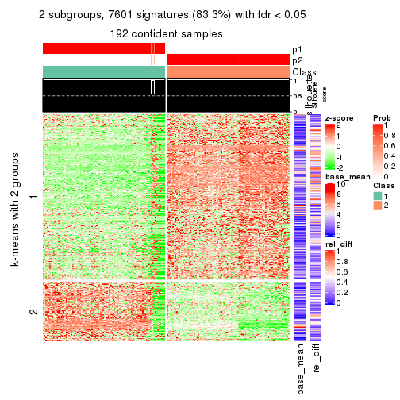</p>

</div>
<div id='tab-CV-hclust-get-signatures-2'>
<pre><code class="r">get_signatures(res, k = 3)
</code></pre>

<p></p>

</div>
<div id='tab-CV-hclust-get-signatures-3'>
<pre><code class="r">get_signatures(res, k = 4)
</code></pre>

<p></p>

</div>
<div id='tab-CV-hclust-get-signatures-4'>
<pre><code class="r">get_signatures(res, k = 5)
</code></pre>

<p></p>

</div>
<div id='tab-CV-hclust-get-signatures-5'>
<pre><code class="r">get_signatures(res, k = 6)
</code></pre>

<p></p>

</div>
</div>


Signature heatmaps where rows are not scaled:


<script>
$( function() {
	$( '#tabs-CV-hclust-get-signatures-no-scale' ).tabs();
} );
</script>
<div id='tabs-CV-hclust-get-signatures-no-scale'>
<ul>
<li><a href='#tab-CV-hclust-get-signatures-no-scale-1'>k = 2</a></li>
<li><a href='#tab-CV-hclust-get-signatures-no-scale-2'>k = 3</a></li>
<li><a href='#tab-CV-hclust-get-signatures-no-scale-3'>k = 4</a></li>
<li><a href='#tab-CV-hclust-get-signatures-no-scale-4'>k = 5</a></li>
<li><a href='#tab-CV-hclust-get-signatures-no-scale-5'>k = 6</a></li>
</ul>
<div id='tab-CV-hclust-get-signatures-no-scale-1'>
<pre><code class="r">get_signatures(res, k = 2, scale_rows = FALSE)
</code></pre>

<p></p>

</div>
<div id='tab-CV-hclust-get-signatures-no-scale-2'>
<pre><code class="r">get_signatures(res, k = 3, scale_rows = FALSE)
</code></pre>

<p></p>

</div>
<div id='tab-CV-hclust-get-signatures-no-scale-3'>
<pre><code class="r">get_signatures(res, k = 4, scale_rows = FALSE)
</code></pre>

<p></p>

</div>
<div id='tab-CV-hclust-get-signatures-no-scale-4'>
<pre><code class="r">get_signatures(res, k = 5, scale_rows = FALSE)
</code></pre>

<p></p>

</div>
<div id='tab-CV-hclust-get-signatures-no-scale-5'>
<pre><code class="r">get_signatures(res, k = 6, scale_rows = FALSE)
</code></pre>

<p></p>

</div>
</div>


Compare the overlap of signatures from different k:

```r
compare_signatures(res)
```


`get_signature()` returns a data frame invisibly. TO get the list of signatures, the function
call should be assigned to a variable explicitly. In following code, if `plot` argument is set
to `FALSE`, no heatmap is plotted while only the differential analysis is performed.

```r
# code only for demonstration
tb = get_signature(res, k = ..., plot = FALSE)
```

An example of the output of `tb` is:

```
#>   which_row         fdr    mean_1    mean_2 scaled_mean_1 scaled_mean_2 km
#> 1        38 0.042760348  8.373488  9.131774    -0.5533452     0.5164555  1
#> 2        40 0.018707592  7.106213  8.469186    -0.6173731     0.5762149  1
#> 3        55 0.019134737 10.221463 11.207825    -0.6159697     0.5749050  1
#> 4        59 0.006059896  5.921854  7.869574    -0.6899429     0.6439467  1
#> 5        60 0.018055526  8.928898 10.211722    -0.6204761     0.5791110  1
#> 6        98 0.009384629 15.714769 14.887706     0.6635654    -0.6193277  2
...
```

The columns in `tb` are:

1. `which_row`: row indices corresponding to the input matrix.
2. `fdr`: FDR for the differential test. 
3. `mean_x`: The mean value in group x.
4. `scaled_mean_x`: The mean value in group x after rows are scaled.
5. `km`: Row groups if k-means clustering is applied to rows.


UMAP plot which shows how samples are separated.


<script>
$( function() {
	$( '#tabs-CV-hclust-dimension-reduction' ).tabs();
} );
</script>
<div id='tabs-CV-hclust-dimension-reduction'>
<ul>
<li><a href='#tab-CV-hclust-dimension-reduction-1'>k = 2</a></li>
<li><a href='#tab-CV-hclust-dimension-reduction-2'>k = 3</a></li>
<li><a href='#tab-CV-hclust-dimension-reduction-3'>k = 4</a></li>
<li><a href='#tab-CV-hclust-dimension-reduction-4'>k = 5</a></li>
<li><a href='#tab-CV-hclust-dimension-reduction-5'>k = 6</a></li>
</ul>
<div id='tab-CV-hclust-dimension-reduction-1'>
<pre><code class="r">dimension_reduction(res, k = 2, method = &quot;UMAP&quot;)
</code></pre>

<p></p>

</div>
<div id='tab-CV-hclust-dimension-reduction-2'>
<pre><code class="r">dimension_reduction(res, k = 3, method = &quot;UMAP&quot;)
</code></pre>

<p></p>

</div>
<div id='tab-CV-hclust-dimension-reduction-3'>
<pre><code class="r">dimension_reduction(res, k = 4, method = &quot;UMAP&quot;)
</code></pre>

<p></p>

</div>
<div id='tab-CV-hclust-dimension-reduction-4'>
<pre><code class="r">dimension_reduction(res, k = 5, method = &quot;UMAP&quot;)
</code></pre>

<p></p>

</div>
<div id='tab-CV-hclust-dimension-reduction-5'>
<pre><code class="r">dimension_reduction(res, k = 6, method = &quot;UMAP&quot;)
</code></pre>

<p></p>

</div>
</div>


Following heatmap shows how subgroups are split when increasing `k`:

```r
collect_classes(res)
```


If matrix rows can be associated to genes, consider to use `functional_enrichment(res,
...)` to perform function enrichment for the signature genes. See [this vignette](http://bioconductor.org/packages/devel/bioc/vignettes/cola/inst/doc/functional_enrichment.html) for more detailed explanations.


 

---------------------------------------------------


### CV:kmeans**


The object with results only for a single top-value method and a single partition method 
can be extracted as:

```r
res = res_list["CV", "kmeans"]
# you can also extract it by
# res = res_list["CV:kmeans"]
```

A summary of `res` and all the functions that can be applied to it:

```r
res
```

```
#> A 'ConsensusPartition' object with k = 2, 3, 4, 5, 6.
#>   On a matrix with 9126 rows and 192 columns.
#>   Top rows (913, 1826, 2738, 3650, 4563) are extracted by 'CV' method.
#>   Subgroups are detected by 'kmeans' method.
#>   Performed in total 1250 partitions by row resampling.
#>   Best k for subgroups seems to be 2.
#> 
#> Following methods can be applied to this 'ConsensusPartition' object:
#>  [1] "cola_report"             "collect_classes"         "collect_plots"          
#>  [4] "collect_stats"           "colnames"                "compare_signatures"     
#>  [7] "consensus_heatmap"       "dimension_reduction"     "functional_enrichment"  
#> [10] "get_anno_col"            "get_anno"                "get_classes"            
#> [13] "get_consensus"           "get_matrix"              "get_membership"         
#> [16] "get_param"               "get_signatures"          "get_stats"              
#> [19] "is_best_k"               "is_stable_k"             "membership_heatmap"     
#> [22] "ncol"                    "nrow"                    "plot_ecdf"              
#> [25] "rownames"                "select_partition_number" "show"                   
#> [28] "suggest_best_k"          "test_to_known_factors"
```

`collect_plots()` function collects all the plots made from `res` for all `k` (number of partitions)
into one single page to provide an easy and fast comparison between different `k`.

```r
collect_plots(res)
```


The plots are:

- The first row: a plot of the ECDF (empirical cumulative distribution
  function) curves of the consensus matrix for each `k` and the heatmap of
  predicted classes for each `k`.
- The second row: heatmaps of the consensus matrix for each `k`.
- The third row: heatmaps of the membership matrix for each `k`.
- The fouth row: heatmaps of the signatures for each `k`.

All the plots in panels can be made by individual functions and they are
plotted later in this section.

`select_partition_number()` produces several plots showing different
statistics for choosing "optimized" `k`. There are following statistics:

- ECDF curves of the consensus matrix for each `k`;
- 1-PAC. [The PAC
  score](https://en.wikipedia.org/wiki/Consensus_clustering#Over-interpretation_potential_of_consensus_clustering)
  measures the proportion of the ambiguous subgrouping.
- Mean silhouette score.
- Concordance. The mean probability of fiting the consensus class ids in all
  partitions.
- Area increased. Denote $A_k$ as the area under the ECDF curve for current
  `k`, the area increased is defined as $A_k - A_{k-1}$.
- Rand index. The percent of pairs of samples that are both in a same cluster
  or both are not in a same cluster in the partition of k and k-1.
- Jaccard index. The ratio of pairs of samples are both in a same cluster in
  the partition of k and k-1 and the pairs of samples are both in a same
  cluster in the partition k or k-1.

The detailed explanations of these statistics can be found in [the _cola_
vignette](http://bioconductor.org/packages/devel/bioc/vignettes/cola/inst/doc/cola.html#toc_13).

Generally speaking, lower PAC score, higher mean silhouette score or higher
concordance corresponds to better partition. Rand index and Jaccard index
measure how similar the current partition is compared to partition with `k-1`.
If they are too similar, we won't accept `k` is better than `k-1`.

```r
select_partition_number(res)
```


The numeric values for all these statistics can be obtained by `get_stats()`.

```r
get_stats(res)
```

```
#>   k 1-PAC mean_silhouette concordance area_increased  Rand Jaccard
#> 2 2 1.000           0.994       0.998         0.5024 0.498   0.498
#> 3 3 0.844           0.855       0.882         0.1619 0.947   0.894
#> 4 4 0.783           0.920       0.895         0.1252 0.866   0.705
#> 5 5 0.736           0.841       0.865         0.0671 0.994   0.980
#> 6 6 0.802           0.810       0.842         0.0423 0.976   0.928
```

`suggest_best_k()` suggests the best $k$ based on these statistics. The rules are as follows:

- All $k$ with Jaccard index larger than 0.95 are removed because increasing
  $k$ does not provide enough extra information. If all $k$ are removed, it is
  marked as no subgroup is detected.
- For all $k$ with 1-PAC score larger than 0.9, the maximal $k$ is taken as
  the best $k$, and other $k$ are marked as optional $k$.
- If it does not fit the second rule. The $k$ with the maximal vote of the
  highest 1-PAC score, highest mean silhouette, and highest concordance is
  taken as the best $k$.

```r
suggest_best_k(res)
```

```
#> [1] 2
```


Following shows the table of the partitions (You need to click the **show/hide
code output** link to see it). The membership matrix (columns with name `p*`)
is inferred by
[`clue::cl_consensus()`](https://www.rdocumentation.org/link/cl_consensus?package=clue)
function with the `SE` method. Basically the value in the membership matrix
represents the probability to belong to a certain group. The finall class
label for an item is determined with the group with highest probability it
belongs to.

In `get_classes()` function, the entropy is calculated from the membership
matrix and the silhouette score is calculated from the consensus matrix.


<script>
$( function() {
	$( '#tabs-CV-kmeans-get-classes' ).tabs();
} );
</script>
<div id='tabs-CV-kmeans-get-classes'>
<ul>
<li><a href='#tab-CV-kmeans-get-classes-1'>k = 2</a></li>
<li><a href='#tab-CV-kmeans-get-classes-2'>k = 3</a></li>
<li><a href='#tab-CV-kmeans-get-classes-3'>k = 4</a></li>
<li><a href='#tab-CV-kmeans-get-classes-4'>k = 5</a></li>
<li><a href='#tab-CV-kmeans-get-classes-5'>k = 6</a></li>
</ul>

<div id='tab-CV-kmeans-get-classes-1'>
<p><a id='tab-CV-kmeans-get-classes-1-a' style='color:#0366d6' href='#'>show/hide code output</a></p>
<pre><code class="r">cbind(get_classes(res, k = 2), get_membership(res, k = 2))
</code></pre>

<pre><code>#&gt;            class entropy silhouette    p1    p2
#&gt; SRR2074921     1  0.0000      0.995 1.000 0.000
#&gt; SRR2074919     1  0.0000      0.995 1.000 0.000
#&gt; SRR2074920     1  0.0000      0.995 1.000 0.000
#&gt; SRR2074917     1  0.0000      0.995 1.000 0.000
#&gt; SRR2074918     1  0.5294      0.862 0.880 0.120
#&gt; SRR2074916     2  0.0000      1.000 0.000 1.000
#&gt; SRR2074915     2  0.0000      1.000 0.000 1.000
#&gt; SRR2074914     1  0.0000      0.995 1.000 0.000
#&gt; SRR2074913     2  0.0000      1.000 0.000 1.000
#&gt; SRR2074912     1  0.0000      0.995 1.000 0.000
#&gt; SRR2074911     2  0.0000      1.000 0.000 1.000
#&gt; SRR2074910     2  0.0000      1.000 0.000 1.000
#&gt; SRR2074909     1  0.0000      0.995 1.000 0.000
#&gt; SRR2074907     1  0.0000      0.995 1.000 0.000
#&gt; SRR2074908     2  0.0000      1.000 0.000 1.000
#&gt; SRR2074906     2  0.0000      1.000 0.000 1.000
#&gt; SRR2074905     1  0.0000      0.995 1.000 0.000
#&gt; SRR2074904     2  0.0000      1.000 0.000 1.000
#&gt; SRR2074903     2  0.0000      1.000 0.000 1.000
#&gt; SRR2074902     1  0.0000      0.995 1.000 0.000
#&gt; SRR2074901     2  0.0000      1.000 0.000 1.000
#&gt; SRR2074900     1  0.0000      0.995 1.000 0.000
#&gt; SRR2074899     2  0.0000      1.000 0.000 1.000
#&gt; SRR2074898     2  0.0000      1.000 0.000 1.000
#&gt; SRR2074897     2  0.0000      1.000 0.000 1.000
#&gt; SRR2074896     2  0.0000      1.000 0.000 1.000
#&gt; SRR2074895     1  0.0000      0.995 1.000 0.000
#&gt; SRR2074894     1  0.0672      0.987 0.992 0.008
#&gt; SRR2074893     2  0.0000      1.000 0.000 1.000
#&gt; SRR2074892     1  0.0000      0.995 1.000 0.000
#&gt; SRR2074891     1  0.0000      0.995 1.000 0.000
#&gt; SRR2074890     2  0.0000      1.000 0.000 1.000
#&gt; SRR2074887     2  0.0000      1.000 0.000 1.000
#&gt; SRR2074889     2  0.0000      1.000 0.000 1.000
#&gt; SRR2074886     2  0.0000      1.000 0.000 1.000
#&gt; SRR2074888     2  0.0000      1.000 0.000 1.000
#&gt; SRR2074885     1  0.0000      0.995 1.000 0.000
#&gt; SRR2074884     2  0.0000      1.000 0.000 1.000
#&gt; SRR2074883     2  0.0000      1.000 0.000 1.000
#&gt; SRR2074882     1  0.0000      0.995 1.000 0.000
#&gt; SRR2074880     2  0.0000      1.000 0.000 1.000
#&gt; SRR2074881     2  0.0000      1.000 0.000 1.000
#&gt; SRR2074879     1  0.0000      0.995 1.000 0.000
#&gt; SRR2074878     1  0.0000      0.995 1.000 0.000
#&gt; SRR2074877     2  0.0000      1.000 0.000 1.000
#&gt; SRR2074876     1  0.0000      0.995 1.000 0.000
#&gt; SRR2074875     2  0.0000      1.000 0.000 1.000
#&gt; SRR2074874     1  0.0000      0.995 1.000 0.000
#&gt; SRR2074873     2  0.0000      1.000 0.000 1.000
#&gt; SRR2074872     1  0.0000      0.995 1.000 0.000
#&gt; SRR2074871     2  0.0000      1.000 0.000 1.000
#&gt; SRR2074870     1  0.0000      0.995 1.000 0.000
#&gt; SRR2074869     1  0.0000      0.995 1.000 0.000
#&gt; SRR2074868     1  0.0000      0.995 1.000 0.000
#&gt; SRR2074867     2  0.0000      1.000 0.000 1.000
#&gt; SRR2074866     2  0.0000      1.000 0.000 1.000
#&gt; SRR2074865     1  0.0000      0.995 1.000 0.000
#&gt; SRR2074864     1  0.0000      0.995 1.000 0.000
#&gt; SRR2074863     1  0.0000      0.995 1.000 0.000
#&gt; SRR2074862     1  0.0000      0.995 1.000 0.000
#&gt; SRR2074861     1  0.0000      0.995 1.000 0.000
#&gt; SRR2074860     1  0.0000      0.995 1.000 0.000
#&gt; SRR2074859     1  0.0000      0.995 1.000 0.000
#&gt; SRR2074858     2  0.0000      1.000 0.000 1.000
#&gt; SRR2074855     2  0.0000      1.000 0.000 1.000
#&gt; SRR2074857     1  0.0000      0.995 1.000 0.000
#&gt; SRR2074856     1  0.0000      0.995 1.000 0.000
#&gt; SRR2074854     1  0.0000      0.995 1.000 0.000
#&gt; SRR2074853     1  0.0000      0.995 1.000 0.000
#&gt; SRR2074852     2  0.0000      1.000 0.000 1.000
#&gt; SRR2074851     1  0.0000      0.995 1.000 0.000
#&gt; SRR2074850     1  0.0000      0.995 1.000 0.000
#&gt; SRR2074849     1  0.0000      0.995 1.000 0.000
#&gt; SRR2074848     1  0.0000      0.995 1.000 0.000
#&gt; SRR2074847     1  0.0000      0.995 1.000 0.000
#&gt; SRR2074846     1  0.0000      0.995 1.000 0.000
#&gt; SRR2074845     1  0.0000      0.995 1.000 0.000
#&gt; SRR2074843     1  0.0000      0.995 1.000 0.000
#&gt; SRR2074842     2  0.0000      1.000 0.000 1.000
#&gt; SRR2074844     2  0.0000      1.000 0.000 1.000
#&gt; SRR2074841     2  0.0000      1.000 0.000 1.000
#&gt; SRR2074840     2  0.0000      1.000 0.000 1.000
#&gt; SRR2074839     1  0.0000      0.995 1.000 0.000
#&gt; SRR2074838     2  0.0000      1.000 0.000 1.000
#&gt; SRR2074836     2  0.0000      1.000 0.000 1.000
#&gt; SRR2074835     2  0.0000      1.000 0.000 1.000
#&gt; SRR2074837     1  0.0000      0.995 1.000 0.000
#&gt; SRR2074834     2  0.0000      1.000 0.000 1.000
#&gt; SRR2074833     1  0.0000      0.995 1.000 0.000
#&gt; SRR2074832     2  0.0000      1.000 0.000 1.000
#&gt; SRR2074831     1  0.0000      0.995 1.000 0.000
#&gt; SRR2074829     1  0.0000      0.995 1.000 0.000
#&gt; SRR2074830     1  0.0000      0.995 1.000 0.000
#&gt; SRR2074828     1  0.0000      0.995 1.000 0.000
#&gt; SRR2074827     2  0.0000      1.000 0.000 1.000
#&gt; SRR2074826     2  0.0000      1.000 0.000 1.000
#&gt; SRR2074825     2  0.0000      1.000 0.000 1.000
#&gt; SRR2074824     2  0.0000      1.000 0.000 1.000
#&gt; SRR2074823     1  0.0000      0.995 1.000 0.000
#&gt; SRR2074822     2  0.0000      1.000 0.000 1.000
#&gt; SRR2074821     2  0.0000      1.000 0.000 1.000
#&gt; SRR2074820     2  0.0000      1.000 0.000 1.000
#&gt; SRR2074819     2  0.0000      1.000 0.000 1.000
#&gt; SRR2074817     2  0.0000      1.000 0.000 1.000
#&gt; SRR2074818     2  0.0000      1.000 0.000 1.000
#&gt; SRR2074816     1  0.0000      0.995 1.000 0.000
#&gt; SRR2074815     2  0.0000      1.000 0.000 1.000
#&gt; SRR2074814     1  0.0000      0.995 1.000 0.000
#&gt; SRR2074812     2  0.0000      1.000 0.000 1.000
#&gt; SRR2074813     2  0.0000      1.000 0.000 1.000
#&gt; SRR2074809     2  0.0000      1.000 0.000 1.000
#&gt; SRR2074810     2  0.0000      1.000 0.000 1.000
#&gt; SRR2074811     2  0.0000      1.000 0.000 1.000
#&gt; SRR2074808     2  0.0000      1.000 0.000 1.000
#&gt; SRR2074807     2  0.0000      1.000 0.000 1.000
#&gt; SRR2074806     1  0.0000      0.995 1.000 0.000
#&gt; SRR2074805     2  0.0000      1.000 0.000 1.000
#&gt; SRR2074804     1  0.0000      0.995 1.000 0.000
#&gt; SRR2074803     1  0.0000      0.995 1.000 0.000
#&gt; SRR2074801     1  0.0000      0.995 1.000 0.000
#&gt; SRR2074802     2  0.0000      1.000 0.000 1.000
#&gt; SRR2074799     2  0.0000      1.000 0.000 1.000
#&gt; SRR2074800     1  0.0000      0.995 1.000 0.000
#&gt; SRR2074798     1  0.0000      0.995 1.000 0.000
#&gt; SRR2074797     1  0.0000      0.995 1.000 0.000
#&gt; SRR2074795     2  0.0000      1.000 0.000 1.000
#&gt; SRR2074796     2  0.0000      1.000 0.000 1.000
#&gt; SRR2074794     2  0.0000      1.000 0.000 1.000
#&gt; SRR2074793     2  0.0000      1.000 0.000 1.000
#&gt; SRR2074792     1  0.0000      0.995 1.000 0.000
#&gt; SRR2074791     1  0.0000      0.995 1.000 0.000
#&gt; SRR2074790     2  0.0000      1.000 0.000 1.000
#&gt; SRR2074789     1  0.0000      0.995 1.000 0.000
#&gt; SRR2074788     1  0.0000      0.995 1.000 0.000
#&gt; SRR2074787     1  0.0000      0.995 1.000 0.000
#&gt; SRR2074786     2  0.0000      1.000 0.000 1.000
#&gt; SRR2074785     1  0.0000      0.995 1.000 0.000
#&gt; SRR2074784     1  0.0000      0.995 1.000 0.000
#&gt; SRR2074783     2  0.0000      1.000 0.000 1.000
#&gt; SRR2074782     1  0.0000      0.995 1.000 0.000
#&gt; SRR2074779     2  0.0000      1.000 0.000 1.000
#&gt; SRR2074781     2  0.0000      1.000 0.000 1.000
#&gt; SRR2074780     1  0.0000      0.995 1.000 0.000
#&gt; SRR2074778     2  0.0000      1.000 0.000 1.000
#&gt; SRR2074777     2  0.0000      1.000 0.000 1.000
#&gt; SRR2074776     2  0.0000      1.000 0.000 1.000
#&gt; SRR2074775     1  0.0000      0.995 1.000 0.000
#&gt; SRR2074774     1  0.0000      0.995 1.000 0.000
#&gt; SRR2074773     2  0.0000      1.000 0.000 1.000
#&gt; SRR2074771     2  0.0000      1.000 0.000 1.000
#&gt; SRR2074772     1  0.0000      0.995 1.000 0.000
#&gt; SRR2074770     1  0.0000      0.995 1.000 0.000
#&gt; SRR2074769     2  0.0000      1.000 0.000 1.000
#&gt; SRR2074768     2  0.0000      1.000 0.000 1.000
#&gt; SRR2074766     2  0.0000      1.000 0.000 1.000
#&gt; SRR2074767     1  0.0000      0.995 1.000 0.000
#&gt; SRR2074765     1  0.0000      0.995 1.000 0.000
#&gt; SRR2074764     2  0.0000      1.000 0.000 1.000
#&gt; SRR2074763     2  0.0000      1.000 0.000 1.000
#&gt; SRR2074761     1  0.0000      0.995 1.000 0.000
#&gt; SRR2074762     2  0.0000      1.000 0.000 1.000
#&gt; SRR2074760     2  0.0000      1.000 0.000 1.000
#&gt; SRR2074759     1  0.0000      0.995 1.000 0.000
#&gt; SRR2074757     2  0.0000      1.000 0.000 1.000
#&gt; SRR2074758     2  0.0000      1.000 0.000 1.000
#&gt; SRR2074756     2  0.0000      1.000 0.000 1.000
#&gt; SRR2074755     1  0.0000      0.995 1.000 0.000
#&gt; SRR2074754     1  0.0000      0.995 1.000 0.000
#&gt; SRR2074753     2  0.0000      1.000 0.000 1.000
#&gt; SRR2074752     1  0.0000      0.995 1.000 0.000
#&gt; SRR2074751     1  0.0000      0.995 1.000 0.000
#&gt; SRR2074749     2  0.0000      1.000 0.000 1.000
#&gt; SRR2074750     1  0.0000      0.995 1.000 0.000
#&gt; SRR2074748     1  0.0000      0.995 1.000 0.000
#&gt; SRR2074747     2  0.0000      1.000 0.000 1.000
#&gt; SRR2074745     1  0.0000      0.995 1.000 0.000
#&gt; SRR2074746     1  0.0000      0.995 1.000 0.000
#&gt; SRR2074744     2  0.0000      1.000 0.000 1.000
#&gt; SRR2074743     2  0.0000      1.000 0.000 1.000
#&gt; SRR2074742     1  0.9129      0.515 0.672 0.328
#&gt; SRR2074741     1  0.0000      0.995 1.000 0.000
#&gt; SRR2074740     2  0.0000      1.000 0.000 1.000
#&gt; SRR2074739     1  0.0000      0.995 1.000 0.000
#&gt; SRR2074738     2  0.0000      1.000 0.000 1.000
#&gt; SRR2074737     2  0.0000      1.000 0.000 1.000
#&gt; SRR2074736     2  0.0000      1.000 0.000 1.000
#&gt; SRR2074735     1  0.0000      0.995 1.000 0.000
#&gt; SRR2074734     2  0.0000      1.000 0.000 1.000
#&gt; SRR2074733     1  0.0000      0.995 1.000 0.000
#&gt; SRR2074732     2  0.0000      1.000 0.000 1.000
#&gt; SRR2074731     2  0.0000      1.000 0.000 1.000
#&gt; SRR2074730     1  0.0000      0.995 1.000 0.000
</code></pre>

<script>
$('#tab-CV-kmeans-get-classes-1-a').parent().next().next().hide();
$('#tab-CV-kmeans-get-classes-1-a').click(function(){
  $('#tab-CV-kmeans-get-classes-1-a').parent().next().next().toggle();
  return(false);
});
</script>
</div>

<div id='tab-CV-kmeans-get-classes-2'>
<p><a id='tab-CV-kmeans-get-classes-2-a' style='color:#0366d6' href='#'>show/hide code output</a></p>
<pre><code class="r">cbind(get_classes(res, k = 3), get_membership(res, k = 3))
</code></pre>

<pre><code>#&gt;            class entropy silhouette    p1    p2    p3
#&gt; SRR2074921     3  0.6140      0.567 0.404 0.000 0.596
#&gt; SRR2074919     3  0.6291      0.525 0.468 0.000 0.532
#&gt; SRR2074920     3  0.6291      0.525 0.468 0.000 0.532
#&gt; SRR2074917     3  0.6302      0.499 0.480 0.000 0.520
#&gt; SRR2074918     3  0.3038      0.564 0.104 0.000 0.896
#&gt; SRR2074916     2  0.6045      0.789 0.000 0.620 0.380
#&gt; SRR2074915     2  0.6267      0.727 0.000 0.548 0.452
#&gt; SRR2074914     1  0.0000      0.999 1.000 0.000 0.000
#&gt; SRR2074913     2  0.6295      0.705 0.000 0.528 0.472
#&gt; SRR2074912     3  0.6291      0.525 0.468 0.000 0.532
#&gt; SRR2074911     3  0.1860      0.356 0.000 0.052 0.948
#&gt; SRR2074910     3  0.0000      0.437 0.000 0.000 1.000
#&gt; SRR2074909     1  0.0000      0.999 1.000 0.000 0.000
#&gt; SRR2074907     1  0.0000      0.999 1.000 0.000 0.000
#&gt; SRR2074908     2  0.6062      0.787 0.000 0.616 0.384
#&gt; SRR2074906     2  0.0000      0.756 0.000 1.000 0.000
#&gt; SRR2074905     1  0.0000      0.999 1.000 0.000 0.000
#&gt; SRR2074904     2  0.6026      0.791 0.000 0.624 0.376
#&gt; SRR2074903     2  0.6026      0.791 0.000 0.624 0.376
#&gt; SRR2074902     1  0.0000      0.999 1.000 0.000 0.000
#&gt; SRR2074901     2  0.6026      0.791 0.000 0.624 0.376
#&gt; SRR2074900     1  0.0000      0.999 1.000 0.000 0.000
#&gt; SRR2074899     2  0.6026      0.791 0.000 0.624 0.376
#&gt; SRR2074898     2  0.0000      0.756 0.000 1.000 0.000
#&gt; SRR2074897     2  0.0000      0.756 0.000 1.000 0.000
#&gt; SRR2074896     2  0.6045      0.789 0.000 0.620 0.380
#&gt; SRR2074895     1  0.0000      0.999 1.000 0.000 0.000
#&gt; SRR2074894     3  0.6154      0.413 0.408 0.000 0.592
#&gt; SRR2074893     2  0.1964      0.763 0.000 0.944 0.056
#&gt; SRR2074892     1  0.0000      0.999 1.000 0.000 0.000
#&gt; SRR2074891     1  0.0000      0.999 1.000 0.000 0.000
#&gt; SRR2074890     2  0.6026      0.791 0.000 0.624 0.376
#&gt; SRR2074887     2  0.6026      0.791 0.000 0.624 0.376
#&gt; SRR2074889     2  0.0000      0.756 0.000 1.000 0.000
#&gt; SRR2074886     2  0.6008      0.792 0.000 0.628 0.372
#&gt; SRR2074888     2  0.0000      0.756 0.000 1.000 0.000
#&gt; SRR2074885     1  0.0000      0.999 1.000 0.000 0.000
#&gt; SRR2074884     2  0.0000      0.756 0.000 1.000 0.000
#&gt; SRR2074883     2  0.0000      0.756 0.000 1.000 0.000
#&gt; SRR2074882     1  0.0000      0.999 1.000 0.000 0.000
#&gt; SRR2074880     2  0.0000      0.756 0.000 1.000 0.000
#&gt; SRR2074881     2  0.6026      0.791 0.000 0.624 0.376
#&gt; SRR2074879     3  0.6291      0.525 0.468 0.000 0.532
#&gt; SRR2074878     1  0.0000      0.999 1.000 0.000 0.000
#&gt; SRR2074877     2  0.6026      0.791 0.000 0.624 0.376
#&gt; SRR2074876     1  0.0000      0.999 1.000 0.000 0.000
#&gt; SRR2074875     2  0.0000      0.756 0.000 1.000 0.000
#&gt; SRR2074874     1  0.0000      0.999 1.000 0.000 0.000
#&gt; SRR2074873     2  0.0000      0.756 0.000 1.000 0.000
#&gt; SRR2074872     1  0.0000      0.999 1.000 0.000 0.000
#&gt; SRR2074871     2  0.6026      0.791 0.000 0.624 0.376
#&gt; SRR2074870     1  0.0000      0.999 1.000 0.000 0.000
#&gt; SRR2074869     1  0.0000      0.999 1.000 0.000 0.000
#&gt; SRR2074868     1  0.0000      0.999 1.000 0.000 0.000
#&gt; SRR2074867     2  0.6026      0.791 0.000 0.624 0.376
#&gt; SRR2074866     2  0.6045      0.789 0.000 0.620 0.380
#&gt; SRR2074865     1  0.0000      0.999 1.000 0.000 0.000
#&gt; SRR2074864     1  0.0000      0.999 1.000 0.000 0.000
#&gt; SRR2074863     1  0.0000      0.999 1.000 0.000 0.000
#&gt; SRR2074862     1  0.0000      0.999 1.000 0.000 0.000
#&gt; SRR2074861     1  0.0000      0.999 1.000 0.000 0.000
#&gt; SRR2074860     1  0.0000      0.999 1.000 0.000 0.000
#&gt; SRR2074859     1  0.0000      0.999 1.000 0.000 0.000
#&gt; SRR2074858     2  0.6026      0.791 0.000 0.624 0.376
#&gt; SRR2074855     2  0.0000      0.756 0.000 1.000 0.000
#&gt; SRR2074857     1  0.0000      0.999 1.000 0.000 0.000
#&gt; SRR2074856     1  0.0000      0.999 1.000 0.000 0.000
#&gt; SRR2074854     1  0.0000      0.999 1.000 0.000 0.000
#&gt; SRR2074853     1  0.0000      0.999 1.000 0.000 0.000
#&gt; SRR2074852     2  0.0000      0.756 0.000 1.000 0.000
#&gt; SRR2074851     1  0.0000      0.999 1.000 0.000 0.000
#&gt; SRR2074850     1  0.0000      0.999 1.000 0.000 0.000
#&gt; SRR2074849     1  0.0000      0.999 1.000 0.000 0.000
#&gt; SRR2074848     1  0.0000      0.999 1.000 0.000 0.000
#&gt; SRR2074847     1  0.0000      0.999 1.000 0.000 0.000
#&gt; SRR2074846     1  0.0000      0.999 1.000 0.000 0.000
#&gt; SRR2074845     1  0.0000      0.999 1.000 0.000 0.000
#&gt; SRR2074843     1  0.0000      0.999 1.000 0.000 0.000
#&gt; SRR2074842     2  0.6026      0.791 0.000 0.624 0.376
#&gt; SRR2074844     2  0.6026      0.791 0.000 0.624 0.376
#&gt; SRR2074841     2  0.0000      0.756 0.000 1.000 0.000
#&gt; SRR2074840     2  0.0000      0.756 0.000 1.000 0.000
#&gt; SRR2074839     1  0.0000      0.999 1.000 0.000 0.000
#&gt; SRR2074838     2  0.0000      0.756 0.000 1.000 0.000
#&gt; SRR2074836     2  0.6026      0.791 0.000 0.624 0.376
#&gt; SRR2074835     2  0.0000      0.756 0.000 1.000 0.000
#&gt; SRR2074837     1  0.0000      0.999 1.000 0.000 0.000
#&gt; SRR2074834     2  0.6026      0.791 0.000 0.624 0.376
#&gt; SRR2074833     1  0.0000      0.999 1.000 0.000 0.000
#&gt; SRR2074832     2  0.5497      0.789 0.000 0.708 0.292
#&gt; SRR2074831     1  0.0000      0.999 1.000 0.000 0.000
#&gt; SRR2074829     1  0.0000      0.999 1.000 0.000 0.000
#&gt; SRR2074830     1  0.0000      0.999 1.000 0.000 0.000
#&gt; SRR2074828     1  0.0000      0.999 1.000 0.000 0.000
#&gt; SRR2074827     2  0.6026      0.791 0.000 0.624 0.376
#&gt; SRR2074826     2  0.6192      0.758 0.000 0.580 0.420
#&gt; SRR2074825     2  0.0000      0.756 0.000 1.000 0.000
#&gt; SRR2074824     2  0.0000      0.756 0.000 1.000 0.000
#&gt; SRR2074823     1  0.0000      0.999 1.000 0.000 0.000
#&gt; SRR2074822     2  0.0000      0.756 0.000 1.000 0.000
#&gt; SRR2074821     2  0.0000      0.756 0.000 1.000 0.000
#&gt; SRR2074820     2  0.0000      0.756 0.000 1.000 0.000
#&gt; SRR2074819     2  0.6026      0.791 0.000 0.624 0.376
#&gt; SRR2074817     2  0.6026      0.791 0.000 0.624 0.376
#&gt; SRR2074818     2  0.0000      0.756 0.000 1.000 0.000
#&gt; SRR2074816     1  0.0000      0.999 1.000 0.000 0.000
#&gt; SRR2074815     2  0.4654      0.780 0.000 0.792 0.208
#&gt; SRR2074814     1  0.0000      0.999 1.000 0.000 0.000
#&gt; SRR2074812     2  0.0000      0.756 0.000 1.000 0.000
#&gt; SRR2074813     2  0.5926      0.792 0.000 0.644 0.356
#&gt; SRR2074809     2  0.0000      0.756 0.000 1.000 0.000
#&gt; SRR2074810     2  0.6026      0.791 0.000 0.624 0.376
#&gt; SRR2074811     2  0.0000      0.756 0.000 1.000 0.000
#&gt; SRR2074808     2  0.6026      0.791 0.000 0.624 0.376
#&gt; SRR2074807     2  0.5988      0.792 0.000 0.632 0.368
#&gt; SRR2074806     1  0.0000      0.999 1.000 0.000 0.000
#&gt; SRR2074805     2  0.0000      0.756 0.000 1.000 0.000
#&gt; SRR2074804     1  0.0000      0.999 1.000 0.000 0.000
#&gt; SRR2074803     1  0.0000      0.999 1.000 0.000 0.000
#&gt; SRR2074801     1  0.0000      0.999 1.000 0.000 0.000
#&gt; SRR2074802     2  0.6111      0.778 0.000 0.604 0.396
#&gt; SRR2074799     2  0.0000      0.756 0.000 1.000 0.000
#&gt; SRR2074800     1  0.0000      0.999 1.000 0.000 0.000
#&gt; SRR2074798     1  0.0000      0.999 1.000 0.000 0.000
#&gt; SRR2074797     1  0.0000      0.999 1.000 0.000 0.000
#&gt; SRR2074795     2  0.0000      0.756 0.000 1.000 0.000
#&gt; SRR2074796     2  0.6026      0.791 0.000 0.624 0.376
#&gt; SRR2074794     2  0.0000      0.756 0.000 1.000 0.000
#&gt; SRR2074793     2  0.6026      0.791 0.000 0.624 0.376
#&gt; SRR2074792     1  0.0000      0.999 1.000 0.000 0.000
#&gt; SRR2074791     1  0.0000      0.999 1.000 0.000 0.000
#&gt; SRR2074790     2  0.0000      0.756 0.000 1.000 0.000
#&gt; SRR2074789     1  0.0000      0.999 1.000 0.000 0.000
#&gt; SRR2074788     1  0.0000      0.999 1.000 0.000 0.000
#&gt; SRR2074787     1  0.0000      0.999 1.000 0.000 0.000
#&gt; SRR2074786     2  0.6026      0.791 0.000 0.624 0.376
#&gt; SRR2074785     1  0.0000      0.999 1.000 0.000 0.000
#&gt; SRR2074784     1  0.0000      0.999 1.000 0.000 0.000
#&gt; SRR2074783     2  0.0000      0.756 0.000 1.000 0.000
#&gt; SRR2074782     1  0.0000      0.999 1.000 0.000 0.000
#&gt; SRR2074779     2  0.6026      0.791 0.000 0.624 0.376
#&gt; SRR2074781     2  0.6079      0.784 0.000 0.612 0.388
#&gt; SRR2074780     1  0.0000      0.999 1.000 0.000 0.000
#&gt; SRR2074778     2  0.5363      0.786 0.000 0.724 0.276
#&gt; SRR2074777     2  0.6026      0.791 0.000 0.624 0.376
#&gt; SRR2074776     2  0.0000      0.756 0.000 1.000 0.000
#&gt; SRR2074775     1  0.0000      0.999 1.000 0.000 0.000
#&gt; SRR2074774     1  0.0000      0.999 1.000 0.000 0.000
#&gt; SRR2074773     2  0.6026      0.791 0.000 0.624 0.376
#&gt; SRR2074771     2  0.6045      0.789 0.000 0.620 0.380
#&gt; SRR2074772     1  0.0000      0.999 1.000 0.000 0.000
#&gt; SRR2074770     1  0.0000      0.999 1.000 0.000 0.000
#&gt; SRR2074769     2  0.0000      0.756 0.000 1.000 0.000
#&gt; SRR2074768     2  0.3412      0.769 0.000 0.876 0.124
#&gt; SRR2074766     2  0.6045      0.789 0.000 0.620 0.380
#&gt; SRR2074767     1  0.0000      0.999 1.000 0.000 0.000
#&gt; SRR2074765     1  0.0000      0.999 1.000 0.000 0.000
#&gt; SRR2074764     2  0.6225      0.747 0.000 0.568 0.432
#&gt; SRR2074763     2  0.0000      0.756 0.000 1.000 0.000
#&gt; SRR2074761     1  0.0000      0.999 1.000 0.000 0.000
#&gt; SRR2074762     2  0.6026      0.791 0.000 0.624 0.376
#&gt; SRR2074760     2  0.6026      0.791 0.000 0.624 0.376
#&gt; SRR2074759     1  0.0000      0.999 1.000 0.000 0.000
#&gt; SRR2074757     2  0.5497      0.788 0.000 0.708 0.292
#&gt; SRR2074758     2  0.0000      0.756 0.000 1.000 0.000
#&gt; SRR2074756     2  0.6026      0.791 0.000 0.624 0.376
#&gt; SRR2074755     1  0.0000      0.999 1.000 0.000 0.000
#&gt; SRR2074754     1  0.0000      0.999 1.000 0.000 0.000
#&gt; SRR2074753     2  0.6267      0.727 0.000 0.548 0.452
#&gt; SRR2074752     1  0.0000      0.999 1.000 0.000 0.000
#&gt; SRR2074751     1  0.0000      0.999 1.000 0.000 0.000
#&gt; SRR2074749     2  0.0000      0.756 0.000 1.000 0.000
#&gt; SRR2074750     1  0.0000      0.999 1.000 0.000 0.000
#&gt; SRR2074748     1  0.0000      0.999 1.000 0.000 0.000
#&gt; SRR2074747     2  0.6026      0.791 0.000 0.624 0.376
#&gt; SRR2074745     1  0.0000      0.999 1.000 0.000 0.000
#&gt; SRR2074746     1  0.1860      0.921 0.948 0.000 0.052
#&gt; SRR2074744     2  0.6026      0.791 0.000 0.624 0.376
#&gt; SRR2074743     2  0.6026      0.791 0.000 0.624 0.376
#&gt; SRR2074742     3  0.0892      0.469 0.020 0.000 0.980
#&gt; SRR2074741     1  0.0000      0.999 1.000 0.000 0.000
#&gt; SRR2074740     2  0.6154      0.768 0.000 0.592 0.408
#&gt; SRR2074739     1  0.0000      0.999 1.000 0.000 0.000
#&gt; SRR2074738     2  0.6026      0.791 0.000 0.624 0.376
#&gt; SRR2074737     2  0.0000      0.756 0.000 1.000 0.000
#&gt; SRR2074736     2  0.1964      0.764 0.000 0.944 0.056
#&gt; SRR2074735     1  0.0000      0.999 1.000 0.000 0.000
#&gt; SRR2074734     2  0.0592      0.758 0.000 0.988 0.012
#&gt; SRR2074733     1  0.0000      0.999 1.000 0.000 0.000
#&gt; SRR2074732     2  0.0000      0.756 0.000 1.000 0.000
#&gt; SRR2074731     2  0.0000      0.756 0.000 1.000 0.000
#&gt; SRR2074730     1  0.0000      0.999 1.000 0.000 0.000
</code></pre>

<script>
$('#tab-CV-kmeans-get-classes-2-a').parent().next().next().hide();
$('#tab-CV-kmeans-get-classes-2-a').click(function(){
  $('#tab-CV-kmeans-get-classes-2-a').parent().next().next().toggle();
  return(false);
});
</script>
</div>

<div id='tab-CV-kmeans-get-classes-3'>
<p><a id='tab-CV-kmeans-get-classes-3-a' style='color:#0366d6' href='#'>show/hide code output</a></p>
<pre><code class="r">cbind(get_classes(res, k = 4), get_membership(res, k = 4))
</code></pre>

<pre><code>#&gt;            class entropy silhouette    p1    p2    p3    p4
#&gt; SRR2074921     3  0.0707      0.894 0.020 0.000 0.980 0.000
#&gt; SRR2074919     3  0.1716      0.908 0.064 0.000 0.936 0.000
#&gt; SRR2074920     3  0.2081      0.907 0.084 0.000 0.916 0.000
#&gt; SRR2074917     3  0.2281      0.899 0.096 0.000 0.904 0.000
#&gt; SRR2074918     3  0.1118      0.880 0.000 0.036 0.964 0.000
#&gt; SRR2074916     2  0.3539      0.866 0.000 0.820 0.004 0.176
#&gt; SRR2074915     2  0.3123      0.845 0.000 0.844 0.000 0.156
#&gt; SRR2074914     1  0.2973      0.917 0.856 0.144 0.000 0.000
#&gt; SRR2074913     2  0.4532      0.806 0.000 0.792 0.052 0.156
#&gt; SRR2074912     3  0.2081      0.907 0.084 0.000 0.916 0.000
#&gt; SRR2074911     3  0.5536      0.491 0.000 0.384 0.592 0.024
#&gt; SRR2074910     2  0.4406      0.297 0.000 0.700 0.300 0.000
#&gt; SRR2074909     1  0.2814      0.922 0.868 0.132 0.000 0.000
#&gt; SRR2074907     1  0.2149      0.935 0.912 0.088 0.000 0.000
#&gt; SRR2074908     2  0.4134      0.955 0.000 0.740 0.000 0.260
#&gt; SRR2074906     4  0.0000      0.968 0.000 0.000 0.000 1.000
#&gt; SRR2074905     1  0.0921      0.943 0.972 0.028 0.000 0.000
#&gt; SRR2074904     2  0.4134      0.955 0.000 0.740 0.000 0.260
#&gt; SRR2074903     2  0.4134      0.955 0.000 0.740 0.000 0.260
#&gt; SRR2074902     1  0.0000      0.941 1.000 0.000 0.000 0.000
#&gt; SRR2074901     2  0.4134      0.955 0.000 0.740 0.000 0.260
#&gt; SRR2074900     1  0.1211      0.942 0.960 0.040 0.000 0.000
#&gt; SRR2074899     2  0.4134      0.955 0.000 0.740 0.000 0.260
#&gt; SRR2074898     4  0.0000      0.968 0.000 0.000 0.000 1.000
#&gt; SRR2074897     4  0.0000      0.968 0.000 0.000 0.000 1.000
#&gt; SRR2074896     2  0.4134      0.955 0.000 0.740 0.000 0.260
#&gt; SRR2074895     1  0.2408      0.931 0.896 0.104 0.000 0.000
#&gt; SRR2074894     2  0.5994      0.366 0.156 0.692 0.152 0.000
#&gt; SRR2074893     4  0.4040      0.508 0.000 0.248 0.000 0.752
#&gt; SRR2074892     1  0.0707      0.941 0.980 0.020 0.000 0.000
#&gt; SRR2074891     1  0.3024      0.916 0.852 0.148 0.000 0.000
#&gt; SRR2074890     2  0.4134      0.955 0.000 0.740 0.000 0.260
#&gt; SRR2074887     2  0.4134      0.955 0.000 0.740 0.000 0.260
#&gt; SRR2074889     4  0.0000      0.968 0.000 0.000 0.000 1.000
#&gt; SRR2074886     2  0.4134      0.955 0.000 0.740 0.000 0.260
#&gt; SRR2074888     4  0.0000      0.968 0.000 0.000 0.000 1.000
#&gt; SRR2074885     1  0.0707      0.941 0.980 0.020 0.000 0.000
#&gt; SRR2074884     4  0.0000      0.968 0.000 0.000 0.000 1.000
#&gt; SRR2074883     4  0.0000      0.968 0.000 0.000 0.000 1.000
#&gt; SRR2074882     1  0.0188      0.940 0.996 0.004 0.000 0.000
#&gt; SRR2074880     4  0.0000      0.968 0.000 0.000 0.000 1.000
#&gt; SRR2074881     2  0.4134      0.955 0.000 0.740 0.000 0.260
#&gt; SRR2074879     3  0.2081      0.907 0.084 0.000 0.916 0.000
#&gt; SRR2074878     1  0.0000      0.941 1.000 0.000 0.000 0.000
#&gt; SRR2074877     2  0.4134      0.955 0.000 0.740 0.000 0.260
#&gt; SRR2074876     1  0.1022      0.942 0.968 0.032 0.000 0.000
#&gt; SRR2074875     4  0.0000      0.968 0.000 0.000 0.000 1.000
#&gt; SRR2074874     1  0.0000      0.941 1.000 0.000 0.000 0.000
#&gt; SRR2074873     4  0.0000      0.968 0.000 0.000 0.000 1.000
#&gt; SRR2074872     1  0.0000      0.941 1.000 0.000 0.000 0.000
#&gt; SRR2074871     2  0.4134      0.955 0.000 0.740 0.000 0.260
#&gt; SRR2074870     1  0.2589      0.926 0.884 0.116 0.000 0.000
#&gt; SRR2074869     1  0.0921      0.943 0.972 0.028 0.000 0.000
#&gt; SRR2074868     1  0.0000      0.941 1.000 0.000 0.000 0.000
#&gt; SRR2074867     2  0.4134      0.955 0.000 0.740 0.000 0.260
#&gt; SRR2074866     2  0.4134      0.955 0.000 0.740 0.000 0.260
#&gt; SRR2074865     1  0.3024      0.916 0.852 0.148 0.000 0.000
#&gt; SRR2074864     1  0.3024      0.916 0.852 0.148 0.000 0.000
#&gt; SRR2074863     1  0.3024      0.916 0.852 0.148 0.000 0.000
#&gt; SRR2074862     1  0.0188      0.940 0.996 0.004 0.000 0.000
#&gt; SRR2074861     1  0.0000      0.941 1.000 0.000 0.000 0.000
#&gt; SRR2074860     1  0.0000      0.941 1.000 0.000 0.000 0.000
#&gt; SRR2074859     1  0.0188      0.941 0.996 0.004 0.000 0.000
#&gt; SRR2074858     2  0.4134      0.955 0.000 0.740 0.000 0.260
#&gt; SRR2074855     4  0.0000      0.968 0.000 0.000 0.000 1.000
#&gt; SRR2074857     1  0.0000      0.941 1.000 0.000 0.000 0.000
#&gt; SRR2074856     1  0.0000      0.941 1.000 0.000 0.000 0.000
#&gt; SRR2074854     1  0.1867      0.939 0.928 0.072 0.000 0.000
#&gt; SRR2074853     1  0.0817      0.941 0.976 0.024 0.000 0.000
#&gt; SRR2074852     4  0.0000      0.968 0.000 0.000 0.000 1.000
#&gt; SRR2074851     1  0.0000      0.941 1.000 0.000 0.000 0.000
#&gt; SRR2074850     1  0.0592      0.941 0.984 0.016 0.000 0.000
#&gt; SRR2074849     1  0.0188      0.940 0.996 0.004 0.000 0.000
#&gt; SRR2074848     1  0.0000      0.941 1.000 0.000 0.000 0.000
#&gt; SRR2074847     1  0.0817      0.943 0.976 0.024 0.000 0.000
#&gt; SRR2074846     1  0.0188      0.940 0.996 0.004 0.000 0.000
#&gt; SRR2074845     1  0.0000      0.941 1.000 0.000 0.000 0.000
#&gt; SRR2074843     1  0.2281      0.932 0.904 0.096 0.000 0.000
#&gt; SRR2074842     2  0.4134      0.955 0.000 0.740 0.000 0.260
#&gt; SRR2074844     2  0.4134      0.955 0.000 0.740 0.000 0.260
#&gt; SRR2074841     4  0.0000      0.968 0.000 0.000 0.000 1.000
#&gt; SRR2074840     4  0.0000      0.968 0.000 0.000 0.000 1.000
#&gt; SRR2074839     1  0.2281      0.932 0.904 0.096 0.000 0.000
#&gt; SRR2074838     4  0.0000      0.968 0.000 0.000 0.000 1.000
#&gt; SRR2074836     2  0.4134      0.955 0.000 0.740 0.000 0.260
#&gt; SRR2074835     4  0.0000      0.968 0.000 0.000 0.000 1.000
#&gt; SRR2074837     1  0.3024      0.916 0.852 0.148 0.000 0.000
#&gt; SRR2074834     2  0.4134      0.955 0.000 0.740 0.000 0.260
#&gt; SRR2074833     1  0.0188      0.940 0.996 0.004 0.000 0.000
#&gt; SRR2074832     2  0.4564      0.872 0.000 0.672 0.000 0.328
#&gt; SRR2074831     1  0.0336      0.938 0.992 0.008 0.000 0.000
#&gt; SRR2074829     1  0.0000      0.941 1.000 0.000 0.000 0.000
#&gt; SRR2074830     1  0.0000      0.941 1.000 0.000 0.000 0.000
#&gt; SRR2074828     1  0.2973      0.917 0.856 0.144 0.000 0.000
#&gt; SRR2074827     2  0.4134      0.955 0.000 0.740 0.000 0.260
#&gt; SRR2074826     2  0.4122      0.933 0.000 0.760 0.004 0.236
#&gt; SRR2074825     4  0.0000      0.968 0.000 0.000 0.000 1.000
#&gt; SRR2074824     4  0.0000      0.968 0.000 0.000 0.000 1.000
#&gt; SRR2074823     1  0.2149      0.936 0.912 0.088 0.000 0.000
#&gt; SRR2074822     4  0.0000      0.968 0.000 0.000 0.000 1.000
#&gt; SRR2074821     4  0.0000      0.968 0.000 0.000 0.000 1.000
#&gt; SRR2074820     4  0.0000      0.968 0.000 0.000 0.000 1.000
#&gt; SRR2074819     2  0.4134      0.955 0.000 0.740 0.000 0.260
#&gt; SRR2074817     2  0.4134      0.955 0.000 0.740 0.000 0.260
#&gt; SRR2074818     4  0.0188      0.965 0.000 0.000 0.004 0.996
#&gt; SRR2074816     1  0.3024      0.916 0.852 0.148 0.000 0.000
#&gt; SRR2074815     2  0.4933      0.681 0.000 0.568 0.000 0.432
#&gt; SRR2074814     1  0.0000      0.941 1.000 0.000 0.000 0.000
#&gt; SRR2074812     4  0.0188      0.965 0.000 0.000 0.004 0.996
#&gt; SRR2074813     2  0.4800      0.849 0.000 0.656 0.004 0.340
#&gt; SRR2074809     4  0.0000      0.968 0.000 0.000 0.000 1.000
#&gt; SRR2074810     2  0.4134      0.955 0.000 0.740 0.000 0.260
#&gt; SRR2074811     4  0.0000      0.968 0.000 0.000 0.000 1.000
#&gt; SRR2074808     2  0.4134      0.955 0.000 0.740 0.000 0.260
#&gt; SRR2074807     2  0.4164      0.951 0.000 0.736 0.000 0.264
#&gt; SRR2074806     1  0.3024      0.916 0.852 0.148 0.000 0.000
#&gt; SRR2074805     4  0.0188      0.965 0.000 0.000 0.004 0.996
#&gt; SRR2074804     1  0.3024      0.917 0.852 0.148 0.000 0.000
#&gt; SRR2074803     1  0.2973      0.917 0.856 0.144 0.000 0.000
#&gt; SRR2074801     1  0.2647      0.925 0.880 0.120 0.000 0.000
#&gt; SRR2074802     2  0.4134      0.955 0.000 0.740 0.000 0.260
#&gt; SRR2074799     4  0.0000      0.968 0.000 0.000 0.000 1.000
#&gt; SRR2074800     1  0.2408      0.931 0.896 0.104 0.000 0.000
#&gt; SRR2074798     1  0.3074      0.914 0.848 0.152 0.000 0.000
#&gt; SRR2074797     1  0.2469      0.930 0.892 0.108 0.000 0.000
#&gt; SRR2074795     4  0.0376      0.961 0.000 0.004 0.004 0.992
#&gt; SRR2074796     2  0.4134      0.955 0.000 0.740 0.000 0.260
#&gt; SRR2074794     4  0.0000      0.968 0.000 0.000 0.000 1.000
#&gt; SRR2074793     2  0.4134      0.955 0.000 0.740 0.000 0.260
#&gt; SRR2074792     1  0.2868      0.921 0.864 0.136 0.000 0.000
#&gt; SRR2074791     1  0.0921      0.943 0.972 0.028 0.000 0.000
#&gt; SRR2074790     4  0.0000      0.968 0.000 0.000 0.000 1.000
#&gt; SRR2074789     1  0.0188      0.941 0.996 0.004 0.000 0.000
#&gt; SRR2074788     1  0.0188      0.940 0.996 0.004 0.000 0.000
#&gt; SRR2074787     1  0.0000      0.941 1.000 0.000 0.000 0.000
#&gt; SRR2074786     2  0.4134      0.955 0.000 0.740 0.000 0.260
#&gt; SRR2074785     1  0.3024      0.916 0.852 0.148 0.000 0.000
#&gt; SRR2074784     1  0.3024      0.916 0.852 0.148 0.000 0.000
#&gt; SRR2074783     4  0.0000      0.968 0.000 0.000 0.000 1.000
#&gt; SRR2074782     1  0.0817      0.942 0.976 0.024 0.000 0.000
#&gt; SRR2074779     2  0.4134      0.955 0.000 0.740 0.000 0.260
#&gt; SRR2074781     2  0.4134      0.955 0.000 0.740 0.000 0.260
#&gt; SRR2074780     1  0.0188      0.941 0.996 0.004 0.000 0.000
#&gt; SRR2074778     2  0.4925      0.693 0.000 0.572 0.000 0.428
#&gt; SRR2074777     2  0.4134      0.955 0.000 0.740 0.000 0.260
#&gt; SRR2074776     4  0.0000      0.968 0.000 0.000 0.000 1.000
#&gt; SRR2074775     1  0.2973      0.917 0.856 0.144 0.000 0.000
#&gt; SRR2074774     1  0.0188      0.941 0.996 0.004 0.000 0.000
#&gt; SRR2074773     2  0.4134      0.955 0.000 0.740 0.000 0.260
#&gt; SRR2074771     2  0.4134      0.955 0.000 0.740 0.000 0.260
#&gt; SRR2074772     1  0.2814      0.922 0.868 0.132 0.000 0.000
#&gt; SRR2074770     1  0.1022      0.941 0.968 0.032 0.000 0.000
#&gt; SRR2074769     4  0.0188      0.965 0.000 0.000 0.004 0.996
#&gt; SRR2074768     4  0.4372      0.444 0.000 0.268 0.004 0.728
#&gt; SRR2074766     2  0.4134      0.955 0.000 0.740 0.000 0.260
#&gt; SRR2074767     1  0.0469      0.940 0.988 0.012 0.000 0.000
#&gt; SRR2074765     1  0.0000      0.941 1.000 0.000 0.000 0.000
#&gt; SRR2074764     2  0.4122      0.933 0.000 0.760 0.004 0.236
#&gt; SRR2074763     4  0.0000      0.968 0.000 0.000 0.000 1.000
#&gt; SRR2074761     1  0.0817      0.942 0.976 0.024 0.000 0.000
#&gt; SRR2074762     2  0.4134      0.955 0.000 0.740 0.000 0.260
#&gt; SRR2074760     2  0.4134      0.955 0.000 0.740 0.000 0.260
#&gt; SRR2074759     1  0.2973      0.917 0.856 0.144 0.000 0.000
#&gt; SRR2074757     2  0.4776      0.794 0.000 0.624 0.000 0.376
#&gt; SRR2074758     4  0.0000      0.968 0.000 0.000 0.000 1.000
#&gt; SRR2074756     2  0.4134      0.955 0.000 0.740 0.000 0.260
#&gt; SRR2074755     1  0.3024      0.916 0.852 0.148 0.000 0.000
#&gt; SRR2074754     1  0.3024      0.916 0.852 0.148 0.000 0.000
#&gt; SRR2074753     2  0.3831      0.899 0.000 0.792 0.004 0.204
#&gt; SRR2074752     1  0.1022      0.941 0.968 0.032 0.000 0.000
#&gt; SRR2074751     1  0.3024      0.916 0.852 0.148 0.000 0.000
#&gt; SRR2074749     4  0.0000      0.968 0.000 0.000 0.000 1.000
#&gt; SRR2074750     1  0.2216      0.932 0.908 0.092 0.000 0.000
#&gt; SRR2074748     1  0.3024      0.916 0.852 0.148 0.000 0.000
#&gt; SRR2074747     2  0.4134      0.955 0.000 0.740 0.000 0.260
#&gt; SRR2074745     1  0.0000      0.941 1.000 0.000 0.000 0.000
#&gt; SRR2074746     1  0.1388      0.932 0.960 0.012 0.028 0.000
#&gt; SRR2074744     2  0.4134      0.955 0.000 0.740 0.000 0.260
#&gt; SRR2074743     2  0.4134      0.955 0.000 0.740 0.000 0.260
#&gt; SRR2074742     3  0.1118      0.880 0.000 0.036 0.964 0.000
#&gt; SRR2074741     1  0.3024      0.916 0.852 0.148 0.000 0.000
#&gt; SRR2074740     2  0.4072      0.948 0.000 0.748 0.000 0.252
#&gt; SRR2074739     1  0.0188      0.940 0.996 0.004 0.000 0.000
#&gt; SRR2074738     2  0.4134      0.955 0.000 0.740 0.000 0.260
#&gt; SRR2074737     4  0.0000      0.968 0.000 0.000 0.000 1.000
#&gt; SRR2074736     4  0.4103      0.483 0.000 0.256 0.000 0.744
#&gt; SRR2074735     1  0.2814      0.922 0.868 0.132 0.000 0.000
#&gt; SRR2074734     4  0.3444      0.674 0.000 0.184 0.000 0.816
#&gt; SRR2074733     1  0.2760      0.924 0.872 0.128 0.000 0.000
#&gt; SRR2074732     4  0.0000      0.968 0.000 0.000 0.000 1.000
#&gt; SRR2074731     4  0.0000      0.968 0.000 0.000 0.000 1.000
#&gt; SRR2074730     1  0.0000      0.941 1.000 0.000 0.000 0.000
</code></pre>

<script>
$('#tab-CV-kmeans-get-classes-3-a').parent().next().next().hide();
$('#tab-CV-kmeans-get-classes-3-a').click(function(){
  $('#tab-CV-kmeans-get-classes-3-a').parent().next().next().toggle();
  return(false);
});
</script>
</div>

<div id='tab-CV-kmeans-get-classes-4'>
<p><a id='tab-CV-kmeans-get-classes-4-a' style='color:#0366d6' href='#'>show/hide code output</a></p>
<pre><code class="r">cbind(get_classes(res, k = 5), get_membership(res, k = 5))
</code></pre>

<pre><code>#&gt;            class entropy silhouette    p1    p2    p3    p4    p5
#&gt; SRR2074921     3  0.0162      0.913 0.004 0.000 0.996 0.000 0.000
#&gt; SRR2074919     3  0.0404      0.923 0.012 0.000 0.988 0.000 0.000
#&gt; SRR2074920     3  0.0703      0.929 0.024 0.000 0.976 0.000 0.000
#&gt; SRR2074917     3  0.0865      0.924 0.024 0.000 0.972 0.000 0.004
#&gt; SRR2074918     3  0.3500      0.812 0.004 0.000 0.808 0.016 0.172
#&gt; SRR2074916     4  0.4127     -0.233 0.000 0.008 0.000 0.680 0.312
#&gt; SRR2074915     4  0.4446     -0.597 0.000 0.000 0.008 0.592 0.400
#&gt; SRR2074914     1  0.0510      0.804 0.984 0.000 0.000 0.000 0.016
#&gt; SRR2074913     5  0.4517      0.746 0.000 0.000 0.008 0.436 0.556
#&gt; SRR2074912     3  0.0703      0.929 0.024 0.000 0.976 0.000 0.000
#&gt; SRR2074911     5  0.6120      0.579 0.000 0.000 0.184 0.256 0.560
#&gt; SRR2074910     5  0.5541      0.789 0.000 0.000 0.076 0.372 0.552
#&gt; SRR2074909     1  0.1121      0.811 0.956 0.000 0.000 0.000 0.044
#&gt; SRR2074907     1  0.2732      0.845 0.840 0.000 0.000 0.000 0.160
#&gt; SRR2074908     4  0.2179      0.928 0.000 0.112 0.000 0.888 0.000
#&gt; SRR2074906     2  0.1372      0.935 0.000 0.956 0.004 0.024 0.016
#&gt; SRR2074905     1  0.3508      0.854 0.748 0.000 0.000 0.000 0.252
#&gt; SRR2074904     4  0.2179      0.928 0.000 0.112 0.000 0.888 0.000
#&gt; SRR2074903     4  0.2574      0.921 0.000 0.112 0.000 0.876 0.012
#&gt; SRR2074902     1  0.4030      0.848 0.648 0.000 0.000 0.000 0.352
#&gt; SRR2074901     4  0.2462      0.924 0.000 0.112 0.000 0.880 0.008
#&gt; SRR2074900     1  0.3519      0.850 0.776 0.008 0.000 0.000 0.216
#&gt; SRR2074899     4  0.2462      0.924 0.000 0.112 0.000 0.880 0.008
#&gt; SRR2074898     2  0.0703      0.942 0.000 0.976 0.000 0.024 0.000
#&gt; SRR2074897     2  0.0703      0.942 0.000 0.976 0.000 0.024 0.000
#&gt; SRR2074896     4  0.2179      0.928 0.000 0.112 0.000 0.888 0.000
#&gt; SRR2074895     1  0.1908      0.831 0.908 0.000 0.000 0.000 0.092
#&gt; SRR2074894     4  0.6208     -0.429 0.032 0.016 0.040 0.556 0.356
#&gt; SRR2074893     2  0.4666      0.178 0.000 0.572 0.000 0.412 0.016
#&gt; SRR2074892     1  0.4269      0.852 0.684 0.016 0.000 0.000 0.300
#&gt; SRR2074891     1  0.0000      0.796 1.000 0.000 0.000 0.000 0.000
#&gt; SRR2074890     4  0.2179      0.928 0.000 0.112 0.000 0.888 0.000
#&gt; SRR2074887     4  0.2179      0.928 0.000 0.112 0.000 0.888 0.000
#&gt; SRR2074889     2  0.0865      0.942 0.000 0.972 0.000 0.024 0.004
#&gt; SRR2074886     4  0.2563      0.916 0.000 0.120 0.000 0.872 0.008
#&gt; SRR2074888     2  0.0992      0.941 0.000 0.968 0.000 0.024 0.008
#&gt; SRR2074885     1  0.3774      0.851 0.704 0.000 0.000 0.000 0.296
#&gt; SRR2074884     2  0.0703      0.942 0.000 0.976 0.000 0.024 0.000
#&gt; SRR2074883     2  0.0865      0.941 0.000 0.972 0.000 0.024 0.004
#&gt; SRR2074882     1  0.4030      0.848 0.648 0.000 0.000 0.000 0.352
#&gt; SRR2074880     2  0.0865      0.942 0.000 0.972 0.000 0.024 0.004
#&gt; SRR2074881     4  0.2179      0.928 0.000 0.112 0.000 0.888 0.000
#&gt; SRR2074879     3  0.0703      0.929 0.024 0.000 0.976 0.000 0.000
#&gt; SRR2074878     1  0.4030      0.848 0.648 0.000 0.000 0.000 0.352
#&gt; SRR2074877     4  0.2462      0.924 0.000 0.112 0.000 0.880 0.008
#&gt; SRR2074876     1  0.3421      0.848 0.788 0.008 0.000 0.000 0.204
#&gt; SRR2074875     2  0.0703      0.942 0.000 0.976 0.000 0.024 0.000
#&gt; SRR2074874     1  0.4030      0.848 0.648 0.000 0.000 0.000 0.352
#&gt; SRR2074873     2  0.0703      0.942 0.000 0.976 0.000 0.024 0.000
#&gt; SRR2074872     1  0.4030      0.848 0.648 0.000 0.000 0.000 0.352
#&gt; SRR2074871     4  0.2179      0.928 0.000 0.112 0.000 0.888 0.000
#&gt; SRR2074870     1  0.1430      0.815 0.944 0.004 0.000 0.000 0.052
#&gt; SRR2074869     1  0.3395      0.855 0.764 0.000 0.000 0.000 0.236
#&gt; SRR2074868     1  0.4030      0.848 0.648 0.000 0.000 0.000 0.352
#&gt; SRR2074867     4  0.2179      0.928 0.000 0.112 0.000 0.888 0.000
#&gt; SRR2074866     4  0.2338      0.926 0.000 0.112 0.000 0.884 0.004
#&gt; SRR2074865     1  0.0000      0.796 1.000 0.000 0.000 0.000 0.000
#&gt; SRR2074864     1  0.0162      0.798 0.996 0.000 0.000 0.000 0.004
#&gt; SRR2074863     1  0.0000      0.796 1.000 0.000 0.000 0.000 0.000
#&gt; SRR2074862     1  0.4030      0.848 0.648 0.000 0.000 0.000 0.352
#&gt; SRR2074861     1  0.4030      0.848 0.648 0.000 0.000 0.000 0.352
#&gt; SRR2074860     1  0.4182      0.847 0.644 0.000 0.004 0.000 0.352
#&gt; SRR2074859     1  0.4015      0.849 0.652 0.000 0.000 0.000 0.348
#&gt; SRR2074858     4  0.2179      0.928 0.000 0.112 0.000 0.888 0.000
#&gt; SRR2074855     2  0.0703      0.942 0.000 0.976 0.000 0.024 0.000
#&gt; SRR2074857     1  0.4030      0.848 0.648 0.000 0.000 0.000 0.352
#&gt; SRR2074856     1  0.4166      0.849 0.648 0.004 0.000 0.000 0.348
#&gt; SRR2074854     1  0.3368      0.841 0.820 0.024 0.000 0.000 0.156
#&gt; SRR2074853     1  0.3837      0.851 0.692 0.000 0.000 0.000 0.308
#&gt; SRR2074852     2  0.0865      0.941 0.000 0.972 0.000 0.024 0.004
#&gt; SRR2074851     1  0.4268      0.849 0.648 0.008 0.000 0.000 0.344
#&gt; SRR2074850     1  0.4292      0.849 0.704 0.024 0.000 0.000 0.272
#&gt; SRR2074849     1  0.4030      0.848 0.648 0.000 0.000 0.000 0.352
#&gt; SRR2074848     1  0.4151      0.850 0.652 0.004 0.000 0.000 0.344
#&gt; SRR2074847     1  0.3684      0.853 0.720 0.000 0.000 0.000 0.280
#&gt; SRR2074846     1  0.4045      0.848 0.644 0.000 0.000 0.000 0.356
#&gt; SRR2074845     1  0.4030      0.848 0.648 0.000 0.000 0.000 0.352
#&gt; SRR2074843     1  0.2653      0.817 0.880 0.024 0.000 0.000 0.096
#&gt; SRR2074842     4  0.2179      0.928 0.000 0.112 0.000 0.888 0.000
#&gt; SRR2074844     4  0.2179      0.928 0.000 0.112 0.000 0.888 0.000
#&gt; SRR2074841     2  0.0703      0.942 0.000 0.976 0.000 0.024 0.000
#&gt; SRR2074840     2  0.1403      0.934 0.000 0.952 0.000 0.024 0.024
#&gt; SRR2074839     1  0.2653      0.817 0.880 0.024 0.000 0.000 0.096
#&gt; SRR2074838     2  0.0992      0.941 0.000 0.968 0.000 0.024 0.008
#&gt; SRR2074836     4  0.2179      0.928 0.000 0.112 0.000 0.888 0.000
#&gt; SRR2074835     2  0.0865      0.942 0.000 0.972 0.000 0.024 0.004
#&gt; SRR2074837     1  0.0000      0.796 1.000 0.000 0.000 0.000 0.000
#&gt; SRR2074834     4  0.2338      0.926 0.000 0.112 0.000 0.884 0.004
#&gt; SRR2074833     1  0.3966      0.853 0.664 0.000 0.000 0.000 0.336
#&gt; SRR2074832     4  0.3887      0.818 0.000 0.160 0.004 0.796 0.040
#&gt; SRR2074831     1  0.4608      0.844 0.640 0.024 0.000 0.000 0.336
#&gt; SRR2074829     1  0.4030      0.848 0.648 0.000 0.000 0.000 0.352
#&gt; SRR2074830     1  0.4030      0.848 0.648 0.000 0.000 0.000 0.352
#&gt; SRR2074828     1  0.0290      0.800 0.992 0.000 0.000 0.000 0.008
#&gt; SRR2074827     4  0.2179      0.928 0.000 0.112 0.000 0.888 0.000
#&gt; SRR2074826     4  0.2136      0.888 0.000 0.088 0.000 0.904 0.008
#&gt; SRR2074825     2  0.0703      0.942 0.000 0.976 0.000 0.024 0.000
#&gt; SRR2074824     2  0.0703      0.942 0.000 0.976 0.000 0.024 0.000
#&gt; SRR2074823     1  0.2761      0.827 0.872 0.024 0.000 0.000 0.104
#&gt; SRR2074822     2  0.1403      0.934 0.000 0.952 0.000 0.024 0.024
#&gt; SRR2074821     2  0.1493      0.932 0.000 0.948 0.000 0.024 0.028
#&gt; SRR2074820     2  0.0992      0.941 0.000 0.968 0.000 0.024 0.008
#&gt; SRR2074819     4  0.2179      0.928 0.000 0.112 0.000 0.888 0.000
#&gt; SRR2074817     4  0.2179      0.928 0.000 0.112 0.000 0.888 0.000
#&gt; SRR2074818     2  0.1828      0.925 0.000 0.936 0.004 0.028 0.032
#&gt; SRR2074816     1  0.0162      0.794 0.996 0.000 0.000 0.000 0.004
#&gt; SRR2074815     4  0.4801      0.574 0.000 0.284 0.000 0.668 0.048
#&gt; SRR2074814     1  0.4268      0.849 0.648 0.008 0.000 0.000 0.344
#&gt; SRR2074812     2  0.1739      0.927 0.000 0.940 0.004 0.024 0.032
#&gt; SRR2074813     4  0.4063      0.623 0.000 0.280 0.000 0.708 0.012
#&gt; SRR2074809     2  0.0865      0.942 0.000 0.972 0.000 0.024 0.004
#&gt; SRR2074810     4  0.2179      0.928 0.000 0.112 0.000 0.888 0.000
#&gt; SRR2074811     2  0.1653      0.929 0.000 0.944 0.004 0.024 0.028
#&gt; SRR2074808     4  0.2179      0.928 0.000 0.112 0.000 0.888 0.000
#&gt; SRR2074807     4  0.2513      0.920 0.000 0.116 0.000 0.876 0.008
#&gt; SRR2074806     1  0.0000      0.796 1.000 0.000 0.000 0.000 0.000
#&gt; SRR2074805     2  0.0865      0.941 0.000 0.972 0.000 0.024 0.004
#&gt; SRR2074804     1  0.0794      0.806 0.972 0.000 0.000 0.000 0.028
#&gt; SRR2074803     1  0.1041      0.808 0.964 0.004 0.000 0.000 0.032
#&gt; SRR2074801     1  0.2230      0.835 0.884 0.000 0.000 0.000 0.116
#&gt; SRR2074802     4  0.2338      0.925 0.000 0.112 0.000 0.884 0.004
#&gt; SRR2074799     2  0.0703      0.942 0.000 0.976 0.000 0.024 0.000
#&gt; SRR2074800     1  0.2104      0.810 0.916 0.024 0.000 0.000 0.060
#&gt; SRR2074798     1  0.0510      0.788 0.984 0.000 0.000 0.000 0.016
#&gt; SRR2074797     1  0.2597      0.816 0.884 0.024 0.000 0.000 0.092
#&gt; SRR2074795     2  0.0865      0.941 0.000 0.972 0.000 0.024 0.004
#&gt; SRR2074796     4  0.2179      0.928 0.000 0.112 0.000 0.888 0.000
#&gt; SRR2074794     2  0.0703      0.942 0.000 0.976 0.000 0.024 0.000
#&gt; SRR2074793     4  0.2338      0.926 0.000 0.112 0.000 0.884 0.004
#&gt; SRR2074792     1  0.1792      0.824 0.916 0.000 0.000 0.000 0.084
#&gt; SRR2074791     1  0.4315      0.852 0.700 0.024 0.000 0.000 0.276
#&gt; SRR2074790     2  0.0703      0.942 0.000 0.976 0.000 0.024 0.000
#&gt; SRR2074789     1  0.4015      0.849 0.652 0.000 0.000 0.000 0.348
#&gt; SRR2074788     1  0.4030      0.848 0.648 0.000 0.000 0.000 0.352
#&gt; SRR2074787     1  0.4030      0.848 0.648 0.000 0.000 0.000 0.352
#&gt; SRR2074786     4  0.2179      0.928 0.000 0.112 0.000 0.888 0.000
#&gt; SRR2074785     1  0.0000      0.796 1.000 0.000 0.000 0.000 0.000
#&gt; SRR2074784     1  0.0162      0.794 0.996 0.000 0.000 0.000 0.004
#&gt; SRR2074783     2  0.0865      0.941 0.000 0.972 0.000 0.024 0.004
#&gt; SRR2074782     1  0.3684      0.850 0.720 0.000 0.000 0.000 0.280
#&gt; SRR2074779     4  0.2338      0.926 0.000 0.112 0.000 0.884 0.004
#&gt; SRR2074781     4  0.2179      0.928 0.000 0.112 0.000 0.888 0.000
#&gt; SRR2074780     1  0.4030      0.848 0.648 0.000 0.000 0.000 0.352
#&gt; SRR2074778     4  0.3928      0.618 0.000 0.296 0.000 0.700 0.004
#&gt; SRR2074777     4  0.2179      0.928 0.000 0.112 0.000 0.888 0.000
#&gt; SRR2074776     2  0.0703      0.942 0.000 0.976 0.000 0.024 0.000
#&gt; SRR2074775     1  0.0609      0.803 0.980 0.000 0.000 0.000 0.020
#&gt; SRR2074774     1  0.3983      0.850 0.660 0.000 0.000 0.000 0.340
#&gt; SRR2074773     4  0.2179      0.928 0.000 0.112 0.000 0.888 0.000
#&gt; SRR2074771     4  0.2179      0.928 0.000 0.112 0.000 0.888 0.000
#&gt; SRR2074772     1  0.1341      0.816 0.944 0.000 0.000 0.000 0.056
#&gt; SRR2074770     1  0.3707      0.851 0.716 0.000 0.000 0.000 0.284
#&gt; SRR2074769     2  0.1106      0.938 0.000 0.964 0.000 0.024 0.012
#&gt; SRR2074768     2  0.4416      0.353 0.000 0.632 0.000 0.356 0.012
#&gt; SRR2074766     4  0.2179      0.928 0.000 0.112 0.000 0.888 0.000
#&gt; SRR2074767     1  0.4288      0.852 0.664 0.012 0.000 0.000 0.324
#&gt; SRR2074765     1  0.4030      0.848 0.648 0.000 0.000 0.000 0.352
#&gt; SRR2074764     4  0.2136      0.888 0.000 0.088 0.000 0.904 0.008
#&gt; SRR2074763     2  0.0992      0.941 0.000 0.968 0.000 0.024 0.008
#&gt; SRR2074761     1  0.3728      0.851 0.748 0.008 0.000 0.000 0.244
#&gt; SRR2074762     4  0.2179      0.928 0.000 0.112 0.000 0.888 0.000
#&gt; SRR2074760     4  0.2574      0.921 0.000 0.112 0.000 0.876 0.012
#&gt; SRR2074759     1  0.0290      0.801 0.992 0.000 0.000 0.000 0.008
#&gt; SRR2074757     4  0.3759      0.751 0.000 0.220 0.000 0.764 0.016
#&gt; SRR2074758     2  0.0992      0.941 0.000 0.968 0.000 0.024 0.008
#&gt; SRR2074756     4  0.2179      0.928 0.000 0.112 0.000 0.888 0.000
#&gt; SRR2074755     1  0.0000      0.796 1.000 0.000 0.000 0.000 0.000
#&gt; SRR2074754     1  0.0162      0.794 0.996 0.000 0.000 0.000 0.004
#&gt; SRR2074753     4  0.2359      0.803 0.000 0.060 0.000 0.904 0.036
#&gt; SRR2074752     1  0.3561      0.851 0.740 0.000 0.000 0.000 0.260
#&gt; SRR2074751     1  0.0000      0.796 1.000 0.000 0.000 0.000 0.000
#&gt; SRR2074749     2  0.2597      0.881 0.000 0.896 0.004 0.060 0.040
#&gt; SRR2074750     1  0.2077      0.822 0.908 0.008 0.000 0.000 0.084
#&gt; SRR2074748     1  0.0000      0.796 1.000 0.000 0.000 0.000 0.000
#&gt; SRR2074747     4  0.2179      0.928 0.000 0.112 0.000 0.888 0.000
#&gt; SRR2074745     1  0.4030      0.848 0.648 0.000 0.000 0.000 0.352
#&gt; SRR2074746     1  0.4227      0.846 0.692 0.000 0.016 0.000 0.292
#&gt; SRR2074744     4  0.2179      0.928 0.000 0.112 0.000 0.888 0.000
#&gt; SRR2074743     4  0.2574      0.920 0.000 0.112 0.000 0.876 0.012
#&gt; SRR2074742     3  0.3513      0.798 0.000 0.000 0.800 0.020 0.180
#&gt; SRR2074741     1  0.0162      0.794 0.996 0.000 0.000 0.000 0.004
#&gt; SRR2074740     4  0.2462      0.922 0.000 0.112 0.000 0.880 0.008
#&gt; SRR2074739     1  0.3999      0.851 0.656 0.000 0.000 0.000 0.344
#&gt; SRR2074738     4  0.2677      0.916 0.000 0.112 0.000 0.872 0.016
#&gt; SRR2074737     2  0.1741      0.925 0.000 0.936 0.000 0.024 0.040
#&gt; SRR2074736     2  0.4835      0.269 0.000 0.592 0.000 0.380 0.028
#&gt; SRR2074735     1  0.1478      0.821 0.936 0.000 0.000 0.000 0.064
#&gt; SRR2074734     2  0.4416      0.374 0.000 0.632 0.000 0.356 0.012
#&gt; SRR2074733     1  0.1671      0.826 0.924 0.000 0.000 0.000 0.076
#&gt; SRR2074732     2  0.0865      0.942 0.000 0.972 0.000 0.024 0.004
#&gt; SRR2074731     2  0.0865      0.942 0.000 0.972 0.000 0.024 0.004
#&gt; SRR2074730     1  0.4268      0.849 0.648 0.008 0.000 0.000 0.344
</code></pre>

<script>
$('#tab-CV-kmeans-get-classes-4-a').parent().next().next().hide();
$('#tab-CV-kmeans-get-classes-4-a').click(function(){
  $('#tab-CV-kmeans-get-classes-4-a').parent().next().next().toggle();
  return(false);
});
</script>
</div>

<div id='tab-CV-kmeans-get-classes-5'>
<p><a id='tab-CV-kmeans-get-classes-5-a' style='color:#0366d6' href='#'>show/hide code output</a></p>
<pre><code class="r">cbind(get_classes(res, k = 6), get_membership(res, k = 6))
</code></pre>

<pre><code>#&gt;            class entropy silhouette    p1    p2    p3    p4    p5 p6
#&gt; SRR2074921     3  0.0146     0.8784 0.000 0.000 0.996 0.000 0.004 NA
#&gt; SRR2074919     3  0.0146     0.8841 0.004 0.000 0.996 0.000 0.000 NA
#&gt; SRR2074920     3  0.0458     0.8914 0.016 0.000 0.984 0.000 0.000 NA
#&gt; SRR2074917     3  0.0603     0.8864 0.016 0.000 0.980 0.000 0.000 NA
#&gt; SRR2074918     3  0.3809     0.6520 0.000 0.008 0.684 0.000 0.304 NA
#&gt; SRR2074916     5  0.6737     0.5188 0.000 0.036 0.000 0.288 0.376 NA
#&gt; SRR2074915     5  0.6433     0.5776 0.000 0.036 0.000 0.204 0.480 NA
#&gt; SRR2074914     1  0.1151     0.7202 0.956 0.000 0.000 0.000 0.012 NA
#&gt; SRR2074913     5  0.1787     0.5944 0.000 0.004 0.000 0.068 0.920 NA
#&gt; SRR2074912     3  0.0458     0.8914 0.016 0.000 0.984 0.000 0.000 NA
#&gt; SRR2074911     5  0.3489     0.5451 0.000 0.024 0.024 0.044 0.848 NA
#&gt; SRR2074910     5  0.2706     0.5794 0.000 0.020 0.016 0.060 0.888 NA
#&gt; SRR2074909     1  0.1707     0.7289 0.928 0.004 0.000 0.000 0.012 NA
#&gt; SRR2074907     1  0.2883     0.7785 0.788 0.000 0.000 0.000 0.000 NA
#&gt; SRR2074908     4  0.1584     0.8799 0.000 0.000 0.000 0.928 0.008 NA
#&gt; SRR2074906     2  0.2750     0.9415 0.000 0.868 0.000 0.080 0.004 NA
#&gt; SRR2074905     1  0.4052     0.7956 0.628 0.000 0.000 0.000 0.016 NA
#&gt; SRR2074904     4  0.1141     0.8904 0.000 0.000 0.000 0.948 0.000 NA
#&gt; SRR2074903     4  0.2062     0.8622 0.000 0.000 0.004 0.900 0.008 NA
#&gt; SRR2074902     1  0.3860     0.7894 0.528 0.000 0.000 0.000 0.000 NA
#&gt; SRR2074901     4  0.1204     0.8855 0.000 0.000 0.000 0.944 0.000 NA
#&gt; SRR2074900     1  0.4087     0.7850 0.692 0.004 0.000 0.000 0.028 NA
#&gt; SRR2074899     4  0.1644     0.8757 0.000 0.000 0.000 0.920 0.004 NA
#&gt; SRR2074898     2  0.1700     0.9641 0.000 0.916 0.000 0.080 0.000 NA
#&gt; SRR2074897     2  0.1556     0.9645 0.000 0.920 0.000 0.080 0.000 NA
#&gt; SRR2074896     4  0.1668     0.8796 0.000 0.000 0.004 0.928 0.008 NA
#&gt; SRR2074895     1  0.2623     0.7555 0.852 0.000 0.000 0.000 0.016 NA
#&gt; SRR2074894     5  0.6207     0.4356 0.008 0.020 0.016 0.320 0.536 NA
#&gt; SRR2074893     4  0.5183     0.1895 0.000 0.388 0.000 0.528 0.004 NA
#&gt; SRR2074892     1  0.4845     0.7917 0.560 0.016 0.000 0.000 0.032 NA
#&gt; SRR2074891     1  0.0260     0.7016 0.992 0.000 0.000 0.000 0.008 NA
#&gt; SRR2074890     4  0.1471     0.8842 0.000 0.000 0.000 0.932 0.004 NA
#&gt; SRR2074887     4  0.1204     0.8940 0.000 0.000 0.000 0.944 0.000 NA
#&gt; SRR2074889     2  0.1556     0.9645 0.000 0.920 0.000 0.080 0.000 NA
#&gt; SRR2074886     4  0.1075     0.8876 0.000 0.000 0.000 0.952 0.000 NA
#&gt; SRR2074888     2  0.1556     0.9645 0.000 0.920 0.000 0.080 0.000 NA
#&gt; SRR2074885     1  0.4144     0.7932 0.580 0.004 0.000 0.000 0.008 NA
#&gt; SRR2074884     2  0.1700     0.9644 0.000 0.916 0.000 0.080 0.000 NA
#&gt; SRR2074883     2  0.1812     0.9637 0.000 0.912 0.000 0.080 0.000 NA
#&gt; SRR2074882     1  0.3991     0.7885 0.524 0.000 0.000 0.000 0.004 NA
#&gt; SRR2074880     2  0.1700     0.9644 0.000 0.916 0.000 0.080 0.000 NA
#&gt; SRR2074881     4  0.0790     0.8907 0.000 0.000 0.000 0.968 0.000 NA
#&gt; SRR2074879     3  0.0458     0.8914 0.016 0.000 0.984 0.000 0.000 NA
#&gt; SRR2074878     1  0.3862     0.7887 0.524 0.000 0.000 0.000 0.000 NA
#&gt; SRR2074877     4  0.1863     0.8803 0.000 0.000 0.000 0.896 0.000 NA
#&gt; SRR2074876     1  0.4025     0.7888 0.668 0.004 0.000 0.000 0.016 NA
#&gt; SRR2074875     2  0.1556     0.9645 0.000 0.920 0.000 0.080 0.000 NA
#&gt; SRR2074874     1  0.3862     0.7887 0.524 0.000 0.000 0.000 0.000 NA
#&gt; SRR2074873     2  0.1812     0.9637 0.000 0.912 0.000 0.080 0.000 NA
#&gt; SRR2074872     1  0.3862     0.7887 0.524 0.000 0.000 0.000 0.000 NA
#&gt; SRR2074871     4  0.1267     0.8949 0.000 0.000 0.000 0.940 0.000 NA
#&gt; SRR2074870     1  0.1866     0.7340 0.908 0.000 0.000 0.000 0.008 NA
#&gt; SRR2074869     1  0.3728     0.7979 0.652 0.000 0.000 0.000 0.004 NA
#&gt; SRR2074868     1  0.3991     0.7885 0.524 0.000 0.000 0.000 0.004 NA
#&gt; SRR2074867     4  0.1471     0.8842 0.000 0.000 0.000 0.932 0.004 NA
#&gt; SRR2074866     4  0.2006     0.8790 0.000 0.004 0.000 0.892 0.000 NA
#&gt; SRR2074865     1  0.0260     0.7016 0.992 0.000 0.000 0.000 0.008 NA
#&gt; SRR2074864     1  0.0000     0.7026 1.000 0.000 0.000 0.000 0.000 NA
#&gt; SRR2074863     1  0.0260     0.7016 0.992 0.000 0.000 0.000 0.008 NA
#&gt; SRR2074862     1  0.3991     0.7890 0.524 0.000 0.000 0.000 0.004 NA
#&gt; SRR2074861     1  0.3862     0.7887 0.524 0.000 0.000 0.000 0.000 NA
#&gt; SRR2074860     1  0.4484     0.7852 0.516 0.000 0.016 0.000 0.008 NA
#&gt; SRR2074859     1  0.4083     0.7900 0.532 0.000 0.000 0.000 0.008 NA
#&gt; SRR2074858     4  0.1349     0.8874 0.000 0.000 0.000 0.940 0.004 NA
#&gt; SRR2074855     2  0.1812     0.9636 0.000 0.912 0.000 0.080 0.000 NA
#&gt; SRR2074857     1  0.4089     0.7889 0.524 0.000 0.000 0.000 0.008 NA
#&gt; SRR2074856     1  0.3862     0.7887 0.524 0.000 0.000 0.000 0.000 NA
#&gt; SRR2074854     1  0.4190     0.7726 0.724 0.012 0.000 0.000 0.040 NA
#&gt; SRR2074853     1  0.4049     0.7941 0.580 0.004 0.000 0.000 0.004 NA
#&gt; SRR2074852     2  0.2176     0.9575 0.000 0.896 0.000 0.080 0.000 NA
#&gt; SRR2074851     1  0.4305     0.7935 0.544 0.000 0.000 0.000 0.020 NA
#&gt; SRR2074850     1  0.4821     0.7882 0.584 0.012 0.000 0.000 0.040 NA
#&gt; SRR2074849     1  0.3991     0.7890 0.524 0.000 0.000 0.000 0.004 NA
#&gt; SRR2074848     1  0.4246     0.7910 0.532 0.000 0.000 0.000 0.016 NA
#&gt; SRR2074847     1  0.3852     0.7979 0.612 0.000 0.000 0.000 0.004 NA
#&gt; SRR2074846     1  0.3862     0.7887 0.524 0.000 0.000 0.000 0.000 NA
#&gt; SRR2074845     1  0.3860     0.7902 0.528 0.000 0.000 0.000 0.000 NA
#&gt; SRR2074843     1  0.3219     0.7341 0.836 0.012 0.000 0.000 0.040 NA
#&gt; SRR2074842     4  0.1010     0.8941 0.000 0.000 0.000 0.960 0.004 NA
#&gt; SRR2074844     4  0.1219     0.8940 0.000 0.000 0.000 0.948 0.004 NA
#&gt; SRR2074841     2  0.1556     0.9645 0.000 0.920 0.000 0.080 0.000 NA
#&gt; SRR2074840     2  0.2320     0.9536 0.000 0.892 0.000 0.080 0.004 NA
#&gt; SRR2074839     1  0.3080     0.7315 0.848 0.012 0.000 0.000 0.040 NA
#&gt; SRR2074838     2  0.1700     0.9644 0.000 0.916 0.000 0.080 0.000 NA
#&gt; SRR2074836     4  0.0458     0.8929 0.000 0.000 0.000 0.984 0.000 NA
#&gt; SRR2074835     2  0.1700     0.9644 0.000 0.916 0.000 0.080 0.000 NA
#&gt; SRR2074837     1  0.0405     0.7044 0.988 0.000 0.000 0.000 0.008 NA
#&gt; SRR2074834     4  0.0935     0.8924 0.000 0.000 0.000 0.964 0.004 NA
#&gt; SRR2074833     1  0.4103     0.7946 0.544 0.004 0.000 0.000 0.004 NA
#&gt; SRR2074832     4  0.3163     0.7840 0.000 0.024 0.000 0.824 0.008 NA
#&gt; SRR2074831     1  0.4995     0.7866 0.536 0.016 0.000 0.000 0.040 NA
#&gt; SRR2074829     1  0.3862     0.7887 0.524 0.000 0.000 0.000 0.000 NA
#&gt; SRR2074830     1  0.3862     0.7887 0.524 0.000 0.000 0.000 0.000 NA
#&gt; SRR2074828     1  0.0622     0.7095 0.980 0.000 0.000 0.000 0.008 NA
#&gt; SRR2074827     4  0.0547     0.8946 0.000 0.000 0.000 0.980 0.000 NA
#&gt; SRR2074826     4  0.1524     0.8796 0.000 0.000 0.000 0.932 0.008 NA
#&gt; SRR2074825     2  0.1556     0.9645 0.000 0.920 0.000 0.080 0.000 NA
#&gt; SRR2074824     2  0.1812     0.9636 0.000 0.912 0.000 0.080 0.000 NA
#&gt; SRR2074823     1  0.3734     0.7563 0.784 0.012 0.000 0.000 0.040 NA
#&gt; SRR2074822     2  0.2237     0.9557 0.000 0.896 0.000 0.080 0.004 NA
#&gt; SRR2074821     2  0.2255     0.9532 0.000 0.892 0.000 0.080 0.000 NA
#&gt; SRR2074820     2  0.1700     0.9637 0.000 0.916 0.000 0.080 0.000 NA
#&gt; SRR2074819     4  0.1141     0.8851 0.000 0.000 0.000 0.948 0.000 NA
#&gt; SRR2074817     4  0.0632     0.8933 0.000 0.000 0.000 0.976 0.000 NA
#&gt; SRR2074818     2  0.4111     0.8434 0.000 0.764 0.000 0.096 0.008 NA
#&gt; SRR2074816     1  0.0260     0.7016 0.992 0.000 0.000 0.000 0.008 NA
#&gt; SRR2074815     4  0.3976     0.7217 0.000 0.080 0.004 0.784 0.008 NA
#&gt; SRR2074814     1  0.4175     0.7893 0.524 0.000 0.000 0.000 0.012 NA
#&gt; SRR2074812     2  0.2936     0.9304 0.000 0.856 0.000 0.080 0.004 NA
#&gt; SRR2074813     4  0.5135     0.4477 0.000 0.216 0.000 0.636 0.004 NA
#&gt; SRR2074809     2  0.1556     0.9645 0.000 0.920 0.000 0.080 0.000 NA
#&gt; SRR2074810     4  0.0632     0.8950 0.000 0.000 0.000 0.976 0.000 NA
#&gt; SRR2074811     2  0.2994     0.9304 0.000 0.852 0.000 0.080 0.004 NA
#&gt; SRR2074808     4  0.1007     0.8866 0.000 0.000 0.000 0.956 0.000 NA
#&gt; SRR2074807     4  0.1387     0.8827 0.000 0.000 0.000 0.932 0.000 NA
#&gt; SRR2074806     1  0.0405     0.7041 0.988 0.000 0.000 0.000 0.008 NA
#&gt; SRR2074805     2  0.1913     0.9629 0.000 0.908 0.000 0.080 0.000 NA
#&gt; SRR2074804     1  0.1232     0.7171 0.956 0.004 0.000 0.000 0.016 NA
#&gt; SRR2074803     1  0.1168     0.7149 0.956 0.000 0.000 0.000 0.016 NA
#&gt; SRR2074801     1  0.2442     0.7557 0.852 0.000 0.000 0.000 0.004 NA
#&gt; SRR2074802     4  0.1398     0.8837 0.000 0.000 0.000 0.940 0.008 NA
#&gt; SRR2074799     2  0.1556     0.9645 0.000 0.920 0.000 0.080 0.000 NA
#&gt; SRR2074800     1  0.2932     0.7323 0.860 0.012 0.000 0.000 0.040 NA
#&gt; SRR2074798     1  0.0520     0.6969 0.984 0.000 0.000 0.000 0.008 NA
#&gt; SRR2074797     1  0.3032     0.7293 0.852 0.012 0.000 0.000 0.040 NA
#&gt; SRR2074795     2  0.2255     0.9538 0.000 0.892 0.000 0.080 0.000 NA
#&gt; SRR2074796     4  0.1075     0.8894 0.000 0.000 0.000 0.952 0.000 NA
#&gt; SRR2074794     2  0.1700     0.9644 0.000 0.916 0.000 0.080 0.000 NA
#&gt; SRR2074793     4  0.1075     0.8866 0.000 0.000 0.000 0.952 0.000 NA
#&gt; SRR2074792     1  0.1897     0.7404 0.908 0.004 0.000 0.000 0.004 NA
#&gt; SRR2074791     1  0.4851     0.7906 0.572 0.012 0.000 0.000 0.040 NA
#&gt; SRR2074790     2  0.1556     0.9645 0.000 0.920 0.000 0.080 0.000 NA
#&gt; SRR2074789     1  0.4083     0.7899 0.532 0.000 0.000 0.000 0.008 NA
#&gt; SRR2074788     1  0.3991     0.7885 0.524 0.000 0.000 0.000 0.004 NA
#&gt; SRR2074787     1  0.3862     0.7887 0.524 0.000 0.000 0.000 0.000 NA
#&gt; SRR2074786     4  0.0865     0.8891 0.000 0.000 0.000 0.964 0.000 NA
#&gt; SRR2074785     1  0.0260     0.7016 0.992 0.000 0.000 0.000 0.008 NA
#&gt; SRR2074784     1  0.0146     0.7018 0.996 0.000 0.000 0.000 0.004 NA
#&gt; SRR2074783     2  0.2094     0.9593 0.000 0.900 0.000 0.080 0.000 NA
#&gt; SRR2074782     1  0.3945     0.7927 0.612 0.000 0.000 0.000 0.008 NA
#&gt; SRR2074779     4  0.1644     0.8735 0.000 0.000 0.000 0.920 0.004 NA
#&gt; SRR2074781     4  0.1524     0.8821 0.000 0.000 0.000 0.932 0.008 NA
#&gt; SRR2074780     1  0.4086     0.7893 0.528 0.000 0.000 0.000 0.008 NA
#&gt; SRR2074778     4  0.3646     0.6730 0.000 0.172 0.000 0.776 0.000 NA
#&gt; SRR2074777     4  0.1556     0.8817 0.000 0.000 0.000 0.920 0.000 NA
#&gt; SRR2074776     2  0.1700     0.9644 0.000 0.916 0.000 0.080 0.000 NA
#&gt; SRR2074775     1  0.0993     0.7162 0.964 0.000 0.000 0.000 0.012 NA
#&gt; SRR2074774     1  0.4161     0.7941 0.540 0.000 0.000 0.000 0.012 NA
#&gt; SRR2074773     4  0.0547     0.8942 0.000 0.000 0.000 0.980 0.000 NA
#&gt; SRR2074771     4  0.1444     0.8901 0.000 0.000 0.000 0.928 0.000 NA
#&gt; SRR2074772     1  0.2203     0.7390 0.896 0.004 0.000 0.000 0.016 NA
#&gt; SRR2074770     1  0.4069     0.7906 0.612 0.004 0.000 0.000 0.008 NA
#&gt; SRR2074769     2  0.2794     0.9356 0.000 0.860 0.000 0.080 0.000 NA
#&gt; SRR2074768     2  0.5578     0.2380 0.000 0.484 0.000 0.388 0.004 NA
#&gt; SRR2074766     4  0.1219     0.8878 0.000 0.000 0.000 0.948 0.004 NA
#&gt; SRR2074767     1  0.4546     0.7935 0.540 0.012 0.000 0.000 0.016 NA
#&gt; SRR2074765     1  0.3991     0.7885 0.524 0.000 0.000 0.000 0.004 NA
#&gt; SRR2074764     4  0.1584     0.8800 0.000 0.000 0.000 0.928 0.008 NA
#&gt; SRR2074763     2  0.1700     0.9644 0.000 0.916 0.000 0.080 0.000 NA
#&gt; SRR2074761     1  0.4317     0.7912 0.640 0.004 0.000 0.000 0.028 NA
#&gt; SRR2074762     4  0.1007     0.8879 0.000 0.000 0.000 0.956 0.000 NA
#&gt; SRR2074760     4  0.1700     0.8710 0.000 0.000 0.000 0.916 0.004 NA
#&gt; SRR2074759     1  0.0508     0.7109 0.984 0.000 0.000 0.000 0.004 NA
#&gt; SRR2074757     4  0.2705     0.8312 0.000 0.052 0.000 0.872 0.004 NA
#&gt; SRR2074758     2  0.1700     0.9644 0.000 0.916 0.000 0.080 0.000 NA
#&gt; SRR2074756     4  0.0858     0.8919 0.000 0.000 0.000 0.968 0.004 NA
#&gt; SRR2074755     1  0.0146     0.7018 0.996 0.000 0.000 0.000 0.004 NA
#&gt; SRR2074754     1  0.0146     0.7018 0.996 0.000 0.000 0.000 0.004 NA
#&gt; SRR2074753     4  0.2333     0.8563 0.000 0.004 0.000 0.896 0.040 NA
#&gt; SRR2074752     1  0.3899     0.7913 0.628 0.000 0.000 0.000 0.008 NA
#&gt; SRR2074751     1  0.0146     0.7018 0.996 0.000 0.000 0.000 0.004 NA
#&gt; SRR2074749     2  0.4817     0.7335 0.000 0.700 0.004 0.172 0.008 NA
#&gt; SRR2074750     1  0.2633     0.7414 0.864 0.004 0.000 0.000 0.020 NA
#&gt; SRR2074748     1  0.0146     0.7018 0.996 0.000 0.000 0.000 0.004 NA
#&gt; SRR2074747     4  0.0865     0.8926 0.000 0.000 0.000 0.964 0.000 NA
#&gt; SRR2074745     1  0.3991     0.7885 0.524 0.000 0.000 0.000 0.004 NA
#&gt; SRR2074746     1  0.4529     0.7887 0.576 0.004 0.016 0.000 0.008 NA
#&gt; SRR2074744     4  0.0865     0.8887 0.000 0.000 0.000 0.964 0.000 NA
#&gt; SRR2074743     4  0.1398     0.8858 0.000 0.000 0.000 0.940 0.008 NA
#&gt; SRR2074742     3  0.3844     0.6425 0.000 0.008 0.676 0.000 0.312 NA
#&gt; SRR2074741     1  0.0260     0.7016 0.992 0.000 0.000 0.000 0.008 NA
#&gt; SRR2074740     4  0.1524     0.8796 0.000 0.000 0.000 0.932 0.008 NA
#&gt; SRR2074739     1  0.4446     0.7950 0.552 0.008 0.000 0.000 0.016 NA
#&gt; SRR2074738     4  0.1411     0.8785 0.000 0.000 0.000 0.936 0.004 NA
#&gt; SRR2074737     2  0.2685     0.9415 0.000 0.872 0.000 0.080 0.004 NA
#&gt; SRR2074736     4  0.5470     0.0549 0.000 0.412 0.000 0.484 0.008 NA
#&gt; SRR2074735     1  0.2062     0.7419 0.900 0.004 0.000 0.000 0.008 NA
#&gt; SRR2074734     4  0.5243     0.1347 0.000 0.400 0.000 0.512 0.004 NA
#&gt; SRR2074733     1  0.2001     0.7438 0.900 0.004 0.000 0.000 0.004 NA
#&gt; SRR2074732     2  0.1812     0.9628 0.000 0.912 0.000 0.080 0.000 NA
#&gt; SRR2074731     2  0.1812     0.9636 0.000 0.912 0.000 0.080 0.000 NA
#&gt; SRR2074730     1  0.4504     0.7920 0.540 0.004 0.000 0.000 0.024 NA
</code></pre>

<script>
$('#tab-CV-kmeans-get-classes-5-a').parent().next().next().hide();
$('#tab-CV-kmeans-get-classes-5-a').click(function(){
  $('#tab-CV-kmeans-get-classes-5-a').parent().next().next().toggle();
  return(false);
});
</script>
</div>
</div>

Heatmaps for the consensus matrix. It visualizes the probability of two
samples to be in a same group.


<script>
$( function() {
	$( '#tabs-CV-kmeans-consensus-heatmap' ).tabs();
} );
</script>
<div id='tabs-CV-kmeans-consensus-heatmap'>
<ul>
<li><a href='#tab-CV-kmeans-consensus-heatmap-1'>k = 2</a></li>
<li><a href='#tab-CV-kmeans-consensus-heatmap-2'>k = 3</a></li>
<li><a href='#tab-CV-kmeans-consensus-heatmap-3'>k = 4</a></li>
<li><a href='#tab-CV-kmeans-consensus-heatmap-4'>k = 5</a></li>
<li><a href='#tab-CV-kmeans-consensus-heatmap-5'>k = 6</a></li>
</ul>
<div id='tab-CV-kmeans-consensus-heatmap-1'>
<pre><code class="r">consensus_heatmap(res, k = 2)
</code></pre>

<p></p>

</div>
<div id='tab-CV-kmeans-consensus-heatmap-2'>
<pre><code class="r">consensus_heatmap(res, k = 3)
</code></pre>

<p></p>

</div>
<div id='tab-CV-kmeans-consensus-heatmap-3'>
<pre><code class="r">consensus_heatmap(res, k = 4)
</code></pre>

<p></p>

</div>
<div id='tab-CV-kmeans-consensus-heatmap-4'>
<pre><code class="r">consensus_heatmap(res, k = 5)
</code></pre>

<p></p>

</div>
<div id='tab-CV-kmeans-consensus-heatmap-5'>
<pre><code class="r">consensus_heatmap(res, k = 6)
</code></pre>

<p></p>

</div>
</div>

Heatmaps for the membership of samples in all partitions to see how consistent they are:


<script>
$( function() {
	$( '#tabs-CV-kmeans-membership-heatmap' ).tabs();
} );
</script>
<div id='tabs-CV-kmeans-membership-heatmap'>
<ul>
<li><a href='#tab-CV-kmeans-membership-heatmap-1'>k = 2</a></li>
<li><a href='#tab-CV-kmeans-membership-heatmap-2'>k = 3</a></li>
<li><a href='#tab-CV-kmeans-membership-heatmap-3'>k = 4</a></li>
<li><a href='#tab-CV-kmeans-membership-heatmap-4'>k = 5</a></li>
<li><a href='#tab-CV-kmeans-membership-heatmap-5'>k = 6</a></li>
</ul>
<div id='tab-CV-kmeans-membership-heatmap-1'>
<pre><code class="r">membership_heatmap(res, k = 2)
</code></pre>

<p></p>

</div>
<div id='tab-CV-kmeans-membership-heatmap-2'>
<pre><code class="r">membership_heatmap(res, k = 3)
</code></pre>

<p></p>

</div>
<div id='tab-CV-kmeans-membership-heatmap-3'>
<pre><code class="r">membership_heatmap(res, k = 4)
</code></pre>

<p></p>

</div>
<div id='tab-CV-kmeans-membership-heatmap-4'>
<pre><code class="r">membership_heatmap(res, k = 5)
</code></pre>

<p></p>

</div>
<div id='tab-CV-kmeans-membership-heatmap-5'>
<pre><code class="r">membership_heatmap(res, k = 6)
</code></pre>

<p></p>

</div>
</div>

As soon as we have had the classes for columns, we can look for signatures
which are significantly different between classes which can be candidate marks
for certain classes. Following are the heatmaps for signatures.


Signature heatmaps where rows are scaled:


<script>
$( function() {
	$( '#tabs-CV-kmeans-get-signatures' ).tabs();
} );
</script>
<div id='tabs-CV-kmeans-get-signatures'>
<ul>
<li><a href='#tab-CV-kmeans-get-signatures-1'>k = 2</a></li>
<li><a href='#tab-CV-kmeans-get-signatures-2'>k = 3</a></li>
<li><a href='#tab-CV-kmeans-get-signatures-3'>k = 4</a></li>
<li><a href='#tab-CV-kmeans-get-signatures-4'>k = 5</a></li>
<li><a href='#tab-CV-kmeans-get-signatures-5'>k = 6</a></li>
</ul>
<div id='tab-CV-kmeans-get-signatures-1'>
<pre><code class="r">get_signatures(res, k = 2)
</code></pre>

<p></p>

</div>
<div id='tab-CV-kmeans-get-signatures-2'>
<pre><code class="r">get_signatures(res, k = 3)
</code></pre>

<p></p>

</div>
<div id='tab-CV-kmeans-get-signatures-3'>
<pre><code class="r">get_signatures(res, k = 4)
</code></pre>

<p></p>

</div>
<div id='tab-CV-kmeans-get-signatures-4'>
<pre><code class="r">get_signatures(res, k = 5)
</code></pre>

<p></p>

</div>
<div id='tab-CV-kmeans-get-signatures-5'>
<pre><code class="r">get_signatures(res, k = 6)
</code></pre>

<p></p>

</div>
</div>


Signature heatmaps where rows are not scaled:


<script>
$( function() {
	$( '#tabs-CV-kmeans-get-signatures-no-scale' ).tabs();
} );
</script>
<div id='tabs-CV-kmeans-get-signatures-no-scale'>
<ul>
<li><a href='#tab-CV-kmeans-get-signatures-no-scale-1'>k = 2</a></li>
<li><a href='#tab-CV-kmeans-get-signatures-no-scale-2'>k = 3</a></li>
<li><a href='#tab-CV-kmeans-get-signatures-no-scale-3'>k = 4</a></li>
<li><a href='#tab-CV-kmeans-get-signatures-no-scale-4'>k = 5</a></li>
<li><a href='#tab-CV-kmeans-get-signatures-no-scale-5'>k = 6</a></li>
</ul>
<div id='tab-CV-kmeans-get-signatures-no-scale-1'>
<pre><code class="r">get_signatures(res, k = 2, scale_rows = FALSE)
</code></pre>

<p></p>

</div>
<div id='tab-CV-kmeans-get-signatures-no-scale-2'>
<pre><code class="r">get_signatures(res, k = 3, scale_rows = FALSE)
</code></pre>

<p></p>

</div>
<div id='tab-CV-kmeans-get-signatures-no-scale-3'>
<pre><code class="r">get_signatures(res, k = 4, scale_rows = FALSE)
</code></pre>

<p></p>

</div>
<div id='tab-CV-kmeans-get-signatures-no-scale-4'>
<pre><code class="r">get_signatures(res, k = 5, scale_rows = FALSE)
</code></pre>

<p></p>

</div>
<div id='tab-CV-kmeans-get-signatures-no-scale-5'>
<pre><code class="r">get_signatures(res, k = 6, scale_rows = FALSE)
</code></pre>

<p></p>

</div>
</div>


Compare the overlap of signatures from different k:

```r
compare_signatures(res)
```


`get_signature()` returns a data frame invisibly. TO get the list of signatures, the function
call should be assigned to a variable explicitly. In following code, if `plot` argument is set
to `FALSE`, no heatmap is plotted while only the differential analysis is performed.

```r
# code only for demonstration
tb = get_signature(res, k = ..., plot = FALSE)
```

An example of the output of `tb` is:

```
#>   which_row         fdr    mean_1    mean_2 scaled_mean_1 scaled_mean_2 km
#> 1        38 0.042760348  8.373488  9.131774    -0.5533452     0.5164555  1
#> 2        40 0.018707592  7.106213  8.469186    -0.6173731     0.5762149  1
#> 3        55 0.019134737 10.221463 11.207825    -0.6159697     0.5749050  1
#> 4        59 0.006059896  5.921854  7.869574    -0.6899429     0.6439467  1
#> 5        60 0.018055526  8.928898 10.211722    -0.6204761     0.5791110  1
#> 6        98 0.009384629 15.714769 14.887706     0.6635654    -0.6193277  2
...
```

The columns in `tb` are:

1. `which_row`: row indices corresponding to the input matrix.
2. `fdr`: FDR for the differential test. 
3. `mean_x`: The mean value in group x.
4. `scaled_mean_x`: The mean value in group x after rows are scaled.
5. `km`: Row groups if k-means clustering is applied to rows.


UMAP plot which shows how samples are separated.


<script>
$( function() {
	$( '#tabs-CV-kmeans-dimension-reduction' ).tabs();
} );
</script>
<div id='tabs-CV-kmeans-dimension-reduction'>
<ul>
<li><a href='#tab-CV-kmeans-dimension-reduction-1'>k = 2</a></li>
<li><a href='#tab-CV-kmeans-dimension-reduction-2'>k = 3</a></li>
<li><a href='#tab-CV-kmeans-dimension-reduction-3'>k = 4</a></li>
<li><a href='#tab-CV-kmeans-dimension-reduction-4'>k = 5</a></li>
<li><a href='#tab-CV-kmeans-dimension-reduction-5'>k = 6</a></li>
</ul>
<div id='tab-CV-kmeans-dimension-reduction-1'>
<pre><code class="r">dimension_reduction(res, k = 2, method = &quot;UMAP&quot;)
</code></pre>

<p></p>

</div>
<div id='tab-CV-kmeans-dimension-reduction-2'>
<pre><code class="r">dimension_reduction(res, k = 3, method = &quot;UMAP&quot;)
</code></pre>

<p></p>

</div>
<div id='tab-CV-kmeans-dimension-reduction-3'>
<pre><code class="r">dimension_reduction(res, k = 4, method = &quot;UMAP&quot;)
</code></pre>

<p></p>

</div>
<div id='tab-CV-kmeans-dimension-reduction-4'>
<pre><code class="r">dimension_reduction(res, k = 5, method = &quot;UMAP&quot;)
</code></pre>

<p></p>

</div>
<div id='tab-CV-kmeans-dimension-reduction-5'>
<pre><code class="r">dimension_reduction(res, k = 6, method = &quot;UMAP&quot;)
</code></pre>

<p></p>

</div>
</div>


Following heatmap shows how subgroups are split when increasing `k`:

```r
collect_classes(res)
```


If matrix rows can be associated to genes, consider to use `functional_enrichment(res,
...)` to perform function enrichment for the signature genes. See [this vignette](http://bioconductor.org/packages/devel/bioc/vignettes/cola/inst/doc/functional_enrichment.html) for more detailed explanations.


 

---------------------------------------------------


### CV:skmeans**


The object with results only for a single top-value method and a single partition method 
can be extracted as:

```r
res = res_list["CV", "skmeans"]
# you can also extract it by
# res = res_list["CV:skmeans"]
```

A summary of `res` and all the functions that can be applied to it:

```r
res
```

```
#> A 'ConsensusPartition' object with k = 2, 3, 4, 5, 6.
#>   On a matrix with 9126 rows and 192 columns.
#>   Top rows (913, 1826, 2738, 3650, 4563) are extracted by 'CV' method.
#>   Subgroups are detected by 'skmeans' method.
#>   Performed in total 1250 partitions by row resampling.
#>   Best k for subgroups seems to be 3.
#> 
#> Following methods can be applied to this 'ConsensusPartition' object:
#>  [1] "cola_report"             "collect_classes"         "collect_plots"          
#>  [4] "collect_stats"           "colnames"                "compare_signatures"     
#>  [7] "consensus_heatmap"       "dimension_reduction"     "functional_enrichment"  
#> [10] "get_anno_col"            "get_anno"                "get_classes"            
#> [13] "get_consensus"           "get_matrix"              "get_membership"         
#> [16] "get_param"               "get_signatures"          "get_stats"              
#> [19] "is_best_k"               "is_stable_k"             "membership_heatmap"     
#> [22] "ncol"                    "nrow"                    "plot_ecdf"              
#> [25] "rownames"                "select_partition_number" "show"                   
#> [28] "suggest_best_k"          "test_to_known_factors"
```

`collect_plots()` function collects all the plots made from `res` for all `k` (number of partitions)
into one single page to provide an easy and fast comparison between different `k`.

```r
collect_plots(res)
```


The plots are:

- The first row: a plot of the ECDF (empirical cumulative distribution
  function) curves of the consensus matrix for each `k` and the heatmap of
  predicted classes for each `k`.
- The second row: heatmaps of the consensus matrix for each `k`.
- The third row: heatmaps of the membership matrix for each `k`.
- The fouth row: heatmaps of the signatures for each `k`.

All the plots in panels can be made by individual functions and they are
plotted later in this section.

`select_partition_number()` produces several plots showing different
statistics for choosing "optimized" `k`. There are following statistics:

- ECDF curves of the consensus matrix for each `k`;
- 1-PAC. [The PAC
  score](https://en.wikipedia.org/wiki/Consensus_clustering#Over-interpretation_potential_of_consensus_clustering)
  measures the proportion of the ambiguous subgrouping.
- Mean silhouette score.
- Concordance. The mean probability of fiting the consensus class ids in all
  partitions.
- Area increased. Denote $A_k$ as the area under the ECDF curve for current
  `k`, the area increased is defined as $A_k - A_{k-1}$.
- Rand index. The percent of pairs of samples that are both in a same cluster
  or both are not in a same cluster in the partition of k and k-1.
- Jaccard index. The ratio of pairs of samples are both in a same cluster in
  the partition of k and k-1 and the pairs of samples are both in a same
  cluster in the partition k or k-1.

The detailed explanations of these statistics can be found in [the _cola_
vignette](http://bioconductor.org/packages/devel/bioc/vignettes/cola/inst/doc/cola.html#toc_13).

Generally speaking, lower PAC score, higher mean silhouette score or higher
concordance corresponds to better partition. Rand index and Jaccard index
measure how similar the current partition is compared to partition with `k-1`.
If they are too similar, we won't accept `k` is better than `k-1`.

```r
select_partition_number(res)
```


The numeric values for all these statistics can be obtained by `get_stats()`.

```r
get_stats(res)
```

```
#>   k 1-PAC mean_silhouette concordance area_increased  Rand Jaccard
#> 2 2 1.000           0.999       1.000         0.5026 0.498   0.498
#> 3 3 1.000           0.989       0.996         0.1029 0.942   0.883
#> 4 4 0.974           0.938       0.963         0.0428 0.998   0.996
#> 5 5 0.774           0.879       0.907         0.0635 0.995   0.988
#> 6 6 0.637           0.812       0.840         0.0589 1.000   0.999
```

`suggest_best_k()` suggests the best $k$ based on these statistics. The rules are as follows:

- All $k$ with Jaccard index larger than 0.95 are removed because increasing
  $k$ does not provide enough extra information. If all $k$ are removed, it is
  marked as no subgroup is detected.
- For all $k$ with 1-PAC score larger than 0.9, the maximal $k$ is taken as
  the best $k$, and other $k$ are marked as optional $k$.
- If it does not fit the second rule. The $k$ with the maximal vote of the
  highest 1-PAC score, highest mean silhouette, and highest concordance is
  taken as the best $k$.

```r
suggest_best_k(res)
```

```
#> [1] 3
#> attr(,"optional")
#> [1] 2
```

There is also optional best $k$ = 2 that is worth to check.

Following shows the table of the partitions (You need to click the **show/hide
code output** link to see it). The membership matrix (columns with name `p*`)
is inferred by
[`clue::cl_consensus()`](https://www.rdocumentation.org/link/cl_consensus?package=clue)
function with the `SE` method. Basically the value in the membership matrix
represents the probability to belong to a certain group. The finall class
label for an item is determined with the group with highest probability it
belongs to.

In `get_classes()` function, the entropy is calculated from the membership
matrix and the silhouette score is calculated from the consensus matrix.


<script>
$( function() {
	$( '#tabs-CV-skmeans-get-classes' ).tabs();
} );
</script>
<div id='tabs-CV-skmeans-get-classes'>
<ul>
<li><a href='#tab-CV-skmeans-get-classes-1'>k = 2</a></li>
<li><a href='#tab-CV-skmeans-get-classes-2'>k = 3</a></li>
<li><a href='#tab-CV-skmeans-get-classes-3'>k = 4</a></li>
<li><a href='#tab-CV-skmeans-get-classes-4'>k = 5</a></li>
<li><a href='#tab-CV-skmeans-get-classes-5'>k = 6</a></li>
</ul>

<div id='tab-CV-skmeans-get-classes-1'>
<p><a id='tab-CV-skmeans-get-classes-1-a' style='color:#0366d6' href='#'>show/hide code output</a></p>
<pre><code class="r">cbind(get_classes(res, k = 2), get_membership(res, k = 2))
</code></pre>

<pre><code>#&gt;            class entropy silhouette    p1    p2
#&gt; SRR2074921     1   0.000      0.999 1.000 0.000
#&gt; SRR2074919     1   0.000      0.999 1.000 0.000
#&gt; SRR2074920     1   0.000      0.999 1.000 0.000
#&gt; SRR2074917     1   0.000      0.999 1.000 0.000
#&gt; SRR2074918     1   0.000      0.999 1.000 0.000
#&gt; SRR2074916     2   0.000      1.000 0.000 1.000
#&gt; SRR2074915     2   0.000      1.000 0.000 1.000
#&gt; SRR2074914     1   0.000      0.999 1.000 0.000
#&gt; SRR2074913     2   0.000      1.000 0.000 1.000
#&gt; SRR2074912     1   0.000      0.999 1.000 0.000
#&gt; SRR2074911     2   0.000      1.000 0.000 1.000
#&gt; SRR2074910     2   0.000      1.000 0.000 1.000
#&gt; SRR2074909     1   0.000      0.999 1.000 0.000
#&gt; SRR2074907     1   0.000      0.999 1.000 0.000
#&gt; SRR2074908     2   0.000      1.000 0.000 1.000
#&gt; SRR2074906     2   0.000      1.000 0.000 1.000
#&gt; SRR2074905     1   0.000      0.999 1.000 0.000
#&gt; SRR2074904     2   0.000      1.000 0.000 1.000
#&gt; SRR2074903     2   0.000      1.000 0.000 1.000
#&gt; SRR2074902     1   0.000      0.999 1.000 0.000
#&gt; SRR2074901     2   0.000      1.000 0.000 1.000
#&gt; SRR2074900     1   0.000      0.999 1.000 0.000
#&gt; SRR2074899     2   0.000      1.000 0.000 1.000
#&gt; SRR2074898     2   0.000      1.000 0.000 1.000
#&gt; SRR2074897     2   0.000      1.000 0.000 1.000
#&gt; SRR2074896     2   0.000      1.000 0.000 1.000
#&gt; SRR2074895     1   0.000      0.999 1.000 0.000
#&gt; SRR2074894     1   0.000      0.999 1.000 0.000
#&gt; SRR2074893     2   0.000      1.000 0.000 1.000
#&gt; SRR2074892     1   0.000      0.999 1.000 0.000
#&gt; SRR2074891     1   0.000      0.999 1.000 0.000
#&gt; SRR2074890     2   0.000      1.000 0.000 1.000
#&gt; SRR2074887     2   0.000      1.000 0.000 1.000
#&gt; SRR2074889     2   0.000      1.000 0.000 1.000
#&gt; SRR2074886     2   0.000      1.000 0.000 1.000
#&gt; SRR2074888     2   0.000      1.000 0.000 1.000
#&gt; SRR2074885     1   0.000      0.999 1.000 0.000
#&gt; SRR2074884     2   0.000      1.000 0.000 1.000
#&gt; SRR2074883     2   0.000      1.000 0.000 1.000
#&gt; SRR2074882     1   0.000      0.999 1.000 0.000
#&gt; SRR2074880     2   0.000      1.000 0.000 1.000
#&gt; SRR2074881     2   0.000      1.000 0.000 1.000
#&gt; SRR2074879     1   0.000      0.999 1.000 0.000
#&gt; SRR2074878     1   0.000      0.999 1.000 0.000
#&gt; SRR2074877     2   0.000      1.000 0.000 1.000
#&gt; SRR2074876     1   0.000      0.999 1.000 0.000
#&gt; SRR2074875     2   0.000      1.000 0.000 1.000
#&gt; SRR2074874     1   0.000      0.999 1.000 0.000
#&gt; SRR2074873     2   0.000      1.000 0.000 1.000
#&gt; SRR2074872     1   0.000      0.999 1.000 0.000
#&gt; SRR2074871     2   0.000      1.000 0.000 1.000
#&gt; SRR2074870     1   0.000      0.999 1.000 0.000
#&gt; SRR2074869     1   0.000      0.999 1.000 0.000
#&gt; SRR2074868     1   0.000      0.999 1.000 0.000
#&gt; SRR2074867     2   0.000      1.000 0.000 1.000
#&gt; SRR2074866     2   0.000      1.000 0.000 1.000
#&gt; SRR2074865     1   0.000      0.999 1.000 0.000
#&gt; SRR2074864     1   0.000      0.999 1.000 0.000
#&gt; SRR2074863     1   0.000      0.999 1.000 0.000
#&gt; SRR2074862     1   0.000      0.999 1.000 0.000
#&gt; SRR2074861     1   0.000      0.999 1.000 0.000
#&gt; SRR2074860     1   0.000      0.999 1.000 0.000
#&gt; SRR2074859     1   0.000      0.999 1.000 0.000
#&gt; SRR2074858     2   0.000      1.000 0.000 1.000
#&gt; SRR2074855     2   0.000      1.000 0.000 1.000
#&gt; SRR2074857     1   0.000      0.999 1.000 0.000
#&gt; SRR2074856     1   0.000      0.999 1.000 0.000
#&gt; SRR2074854     1   0.000      0.999 1.000 0.000
#&gt; SRR2074853     1   0.000      0.999 1.000 0.000
#&gt; SRR2074852     2   0.000      1.000 0.000 1.000
#&gt; SRR2074851     1   0.000      0.999 1.000 0.000
#&gt; SRR2074850     1   0.000      0.999 1.000 0.000
#&gt; SRR2074849     1   0.000      0.999 1.000 0.000
#&gt; SRR2074848     1   0.000      0.999 1.000 0.000
#&gt; SRR2074847     1   0.000      0.999 1.000 0.000
#&gt; SRR2074846     1   0.000      0.999 1.000 0.000
#&gt; SRR2074845     1   0.000      0.999 1.000 0.000
#&gt; SRR2074843     1   0.000      0.999 1.000 0.000
#&gt; SRR2074842     2   0.000      1.000 0.000 1.000
#&gt; SRR2074844     2   0.000      1.000 0.000 1.000
#&gt; SRR2074841     2   0.000      1.000 0.000 1.000
#&gt; SRR2074840     2   0.000      1.000 0.000 1.000
#&gt; SRR2074839     1   0.000      0.999 1.000 0.000
#&gt; SRR2074838     2   0.000      1.000 0.000 1.000
#&gt; SRR2074836     2   0.000      1.000 0.000 1.000
#&gt; SRR2074835     2   0.000      1.000 0.000 1.000
#&gt; SRR2074837     1   0.000      0.999 1.000 0.000
#&gt; SRR2074834     2   0.000      1.000 0.000 1.000
#&gt; SRR2074833     1   0.000      0.999 1.000 0.000
#&gt; SRR2074832     2   0.000      1.000 0.000 1.000
#&gt; SRR2074831     1   0.000      0.999 1.000 0.000
#&gt; SRR2074829     1   0.000      0.999 1.000 0.000
#&gt; SRR2074830     1   0.000      0.999 1.000 0.000
#&gt; SRR2074828     1   0.000      0.999 1.000 0.000
#&gt; SRR2074827     2   0.000      1.000 0.000 1.000
#&gt; SRR2074826     2   0.000      1.000 0.000 1.000
#&gt; SRR2074825     2   0.000      1.000 0.000 1.000
#&gt; SRR2074824     2   0.000      1.000 0.000 1.000
#&gt; SRR2074823     1   0.000      0.999 1.000 0.000
#&gt; SRR2074822     2   0.000      1.000 0.000 1.000
#&gt; SRR2074821     2   0.000      1.000 0.000 1.000
#&gt; SRR2074820     2   0.000      1.000 0.000 1.000
#&gt; SRR2074819     2   0.000      1.000 0.000 1.000
#&gt; SRR2074817     2   0.000      1.000 0.000 1.000
#&gt; SRR2074818     2   0.000      1.000 0.000 1.000
#&gt; SRR2074816     1   0.000      0.999 1.000 0.000
#&gt; SRR2074815     2   0.000      1.000 0.000 1.000
#&gt; SRR2074814     1   0.000      0.999 1.000 0.000
#&gt; SRR2074812     2   0.000      1.000 0.000 1.000
#&gt; SRR2074813     2   0.000      1.000 0.000 1.000
#&gt; SRR2074809     2   0.000      1.000 0.000 1.000
#&gt; SRR2074810     2   0.000      1.000 0.000 1.000
#&gt; SRR2074811     2   0.000      1.000 0.000 1.000
#&gt; SRR2074808     2   0.000      1.000 0.000 1.000
#&gt; SRR2074807     2   0.000      1.000 0.000 1.000
#&gt; SRR2074806     1   0.000      0.999 1.000 0.000
#&gt; SRR2074805     2   0.000      1.000 0.000 1.000
#&gt; SRR2074804     1   0.000      0.999 1.000 0.000
#&gt; SRR2074803     1   0.000      0.999 1.000 0.000
#&gt; SRR2074801     1   0.000      0.999 1.000 0.000
#&gt; SRR2074802     2   0.000      1.000 0.000 1.000
#&gt; SRR2074799     2   0.000      1.000 0.000 1.000
#&gt; SRR2074800     1   0.000      0.999 1.000 0.000
#&gt; SRR2074798     1   0.000      0.999 1.000 0.000
#&gt; SRR2074797     1   0.000      0.999 1.000 0.000
#&gt; SRR2074795     2   0.000      1.000 0.000 1.000
#&gt; SRR2074796     2   0.000      1.000 0.000 1.000
#&gt; SRR2074794     2   0.000      1.000 0.000 1.000
#&gt; SRR2074793     2   0.000      1.000 0.000 1.000
#&gt; SRR2074792     1   0.000      0.999 1.000 0.000
#&gt; SRR2074791     1   0.000      0.999 1.000 0.000
#&gt; SRR2074790     2   0.000      1.000 0.000 1.000
#&gt; SRR2074789     1   0.000      0.999 1.000 0.000
#&gt; SRR2074788     1   0.000      0.999 1.000 0.000
#&gt; SRR2074787     1   0.000      0.999 1.000 0.000
#&gt; SRR2074786     2   0.000      1.000 0.000 1.000
#&gt; SRR2074785     1   0.000      0.999 1.000 0.000
#&gt; SRR2074784     1   0.000      0.999 1.000 0.000
#&gt; SRR2074783     2   0.000      1.000 0.000 1.000
#&gt; SRR2074782     1   0.000      0.999 1.000 0.000
#&gt; SRR2074779     2   0.000      1.000 0.000 1.000
#&gt; SRR2074781     2   0.000      1.000 0.000 1.000
#&gt; SRR2074780     1   0.000      0.999 1.000 0.000
#&gt; SRR2074778     2   0.000      1.000 0.000 1.000
#&gt; SRR2074777     2   0.000      1.000 0.000 1.000
#&gt; SRR2074776     2   0.000      1.000 0.000 1.000
#&gt; SRR2074775     1   0.000      0.999 1.000 0.000
#&gt; SRR2074774     1   0.000      0.999 1.000 0.000
#&gt; SRR2074773     2   0.000      1.000 0.000 1.000
#&gt; SRR2074771     2   0.000      1.000 0.000 1.000
#&gt; SRR2074772     1   0.000      0.999 1.000 0.000
#&gt; SRR2074770     1   0.000      0.999 1.000 0.000
#&gt; SRR2074769     2   0.000      1.000 0.000 1.000
#&gt; SRR2074768     2   0.000      1.000 0.000 1.000
#&gt; SRR2074766     2   0.000      1.000 0.000 1.000
#&gt; SRR2074767     1   0.000      0.999 1.000 0.000
#&gt; SRR2074765     1   0.000      0.999 1.000 0.000
#&gt; SRR2074764     2   0.000      1.000 0.000 1.000
#&gt; SRR2074763     2   0.000      1.000 0.000 1.000
#&gt; SRR2074761     1   0.000      0.999 1.000 0.000
#&gt; SRR2074762     2   0.000      1.000 0.000 1.000
#&gt; SRR2074760     2   0.000      1.000 0.000 1.000
#&gt; SRR2074759     1   0.000      0.999 1.000 0.000
#&gt; SRR2074757     2   0.000      1.000 0.000 1.000
#&gt; SRR2074758     2   0.000      1.000 0.000 1.000
#&gt; SRR2074756     2   0.000      1.000 0.000 1.000
#&gt; SRR2074755     1   0.000      0.999 1.000 0.000
#&gt; SRR2074754     1   0.000      0.999 1.000 0.000
#&gt; SRR2074753     2   0.000      1.000 0.000 1.000
#&gt; SRR2074752     1   0.000      0.999 1.000 0.000
#&gt; SRR2074751     1   0.000      0.999 1.000 0.000
#&gt; SRR2074749     2   0.000      1.000 0.000 1.000
#&gt; SRR2074750     1   0.000      0.999 1.000 0.000
#&gt; SRR2074748     1   0.000      0.999 1.000 0.000
#&gt; SRR2074747     2   0.000      1.000 0.000 1.000
#&gt; SRR2074745     1   0.000      0.999 1.000 0.000
#&gt; SRR2074746     1   0.000      0.999 1.000 0.000
#&gt; SRR2074744     2   0.000      1.000 0.000 1.000
#&gt; SRR2074743     2   0.000      1.000 0.000 1.000
#&gt; SRR2074742     1   0.343      0.932 0.936 0.064
#&gt; SRR2074741     1   0.000      0.999 1.000 0.000
#&gt; SRR2074740     2   0.000      1.000 0.000 1.000
#&gt; SRR2074739     1   0.000      0.999 1.000 0.000
#&gt; SRR2074738     2   0.000      1.000 0.000 1.000
#&gt; SRR2074737     2   0.000      1.000 0.000 1.000
#&gt; SRR2074736     2   0.000      1.000 0.000 1.000
#&gt; SRR2074735     1   0.000      0.999 1.000 0.000
#&gt; SRR2074734     2   0.000      1.000 0.000 1.000
#&gt; SRR2074733     1   0.000      0.999 1.000 0.000
#&gt; SRR2074732     2   0.000      1.000 0.000 1.000
#&gt; SRR2074731     2   0.000      1.000 0.000 1.000
#&gt; SRR2074730     1   0.000      0.999 1.000 0.000
</code></pre>

<script>
$('#tab-CV-skmeans-get-classes-1-a').parent().next().next().hide();
$('#tab-CV-skmeans-get-classes-1-a').click(function(){
  $('#tab-CV-skmeans-get-classes-1-a').parent().next().next().toggle();
  return(false);
});
</script>
</div>

<div id='tab-CV-skmeans-get-classes-2'>
<p><a id='tab-CV-skmeans-get-classes-2-a' style='color:#0366d6' href='#'>show/hide code output</a></p>
<pre><code class="r">cbind(get_classes(res, k = 3), get_membership(res, k = 3))
</code></pre>

<pre><code>#&gt;            class entropy silhouette    p1    p2    p3
#&gt; SRR2074921     3  0.0237      0.922 0.004 0.000 0.996
#&gt; SRR2074919     3  0.0237      0.922 0.004 0.000 0.996
#&gt; SRR2074920     3  0.0424      0.922 0.008 0.000 0.992
#&gt; SRR2074917     3  0.0424      0.922 0.008 0.000 0.992
#&gt; SRR2074918     3  0.0000      0.920 0.000 0.000 1.000
#&gt; SRR2074916     2  0.0000      1.000 0.000 1.000 0.000
#&gt; SRR2074915     2  0.0000      1.000 0.000 1.000 0.000
#&gt; SRR2074914     1  0.0000      1.000 1.000 0.000 0.000
#&gt; SRR2074913     3  0.6308      0.071 0.000 0.492 0.508
#&gt; SRR2074912     3  0.0424      0.922 0.008 0.000 0.992
#&gt; SRR2074911     3  0.4399      0.754 0.000 0.188 0.812
#&gt; SRR2074910     3  0.0592      0.917 0.000 0.012 0.988
#&gt; SRR2074909     1  0.0000      1.000 1.000 0.000 0.000
#&gt; SRR2074907     1  0.0000      1.000 1.000 0.000 0.000
#&gt; SRR2074908     2  0.0000      1.000 0.000 1.000 0.000
#&gt; SRR2074906     2  0.0000      1.000 0.000 1.000 0.000
#&gt; SRR2074905     1  0.0000      1.000 1.000 0.000 0.000
#&gt; SRR2074904     2  0.0000      1.000 0.000 1.000 0.000
#&gt; SRR2074903     2  0.0000      1.000 0.000 1.000 0.000
#&gt; SRR2074902     1  0.0000      1.000 1.000 0.000 0.000
#&gt; SRR2074901     2  0.0000      1.000 0.000 1.000 0.000
#&gt; SRR2074900     1  0.0000      1.000 1.000 0.000 0.000
#&gt; SRR2074899     2  0.0000      1.000 0.000 1.000 0.000
#&gt; SRR2074898     2  0.0000      1.000 0.000 1.000 0.000
#&gt; SRR2074897     2  0.0000      1.000 0.000 1.000 0.000
#&gt; SRR2074896     2  0.0000      1.000 0.000 1.000 0.000
#&gt; SRR2074895     1  0.0000      1.000 1.000 0.000 0.000
#&gt; SRR2074894     3  0.2959      0.837 0.100 0.000 0.900
#&gt; SRR2074893     2  0.0000      1.000 0.000 1.000 0.000
#&gt; SRR2074892     1  0.0000      1.000 1.000 0.000 0.000
#&gt; SRR2074891     1  0.0000      1.000 1.000 0.000 0.000
#&gt; SRR2074890     2  0.0000      1.000 0.000 1.000 0.000
#&gt; SRR2074887     2  0.0000      1.000 0.000 1.000 0.000
#&gt; SRR2074889     2  0.0000      1.000 0.000 1.000 0.000
#&gt; SRR2074886     2  0.0000      1.000 0.000 1.000 0.000
#&gt; SRR2074888     2  0.0000      1.000 0.000 1.000 0.000
#&gt; SRR2074885     1  0.0000      1.000 1.000 0.000 0.000
#&gt; SRR2074884     2  0.0000      1.000 0.000 1.000 0.000
#&gt; SRR2074883     2  0.0000      1.000 0.000 1.000 0.000
#&gt; SRR2074882     1  0.0000      1.000 1.000 0.000 0.000
#&gt; SRR2074880     2  0.0000      1.000 0.000 1.000 0.000
#&gt; SRR2074881     2  0.0000      1.000 0.000 1.000 0.000
#&gt; SRR2074879     3  0.0424      0.922 0.008 0.000 0.992
#&gt; SRR2074878     1  0.0000      1.000 1.000 0.000 0.000
#&gt; SRR2074877     2  0.0000      1.000 0.000 1.000 0.000
#&gt; SRR2074876     1  0.0000      1.000 1.000 0.000 0.000
#&gt; SRR2074875     2  0.0000      1.000 0.000 1.000 0.000
#&gt; SRR2074874     1  0.0000      1.000 1.000 0.000 0.000
#&gt; SRR2074873     2  0.0000      1.000 0.000 1.000 0.000
#&gt; SRR2074872     1  0.0000      1.000 1.000 0.000 0.000
#&gt; SRR2074871     2  0.0000      1.000 0.000 1.000 0.000
#&gt; SRR2074870     1  0.0000      1.000 1.000 0.000 0.000
#&gt; SRR2074869     1  0.0000      1.000 1.000 0.000 0.000
#&gt; SRR2074868     1  0.0000      1.000 1.000 0.000 0.000
#&gt; SRR2074867     2  0.0000      1.000 0.000 1.000 0.000
#&gt; SRR2074866     2  0.0000      1.000 0.000 1.000 0.000
#&gt; SRR2074865     1  0.0000      1.000 1.000 0.000 0.000
#&gt; SRR2074864     1  0.0000      1.000 1.000 0.000 0.000
#&gt; SRR2074863     1  0.0000      1.000 1.000 0.000 0.000
#&gt; SRR2074862     1  0.0000      1.000 1.000 0.000 0.000
#&gt; SRR2074861     1  0.0000      1.000 1.000 0.000 0.000
#&gt; SRR2074860     1  0.0000      1.000 1.000 0.000 0.000
#&gt; SRR2074859     1  0.0000      1.000 1.000 0.000 0.000
#&gt; SRR2074858     2  0.0000      1.000 0.000 1.000 0.000
#&gt; SRR2074855     2  0.0000      1.000 0.000 1.000 0.000
#&gt; SRR2074857     1  0.0000      1.000 1.000 0.000 0.000
#&gt; SRR2074856     1  0.0000      1.000 1.000 0.000 0.000
#&gt; SRR2074854     1  0.0000      1.000 1.000 0.000 0.000
#&gt; SRR2074853     1  0.0000      1.000 1.000 0.000 0.000
#&gt; SRR2074852     2  0.0000      1.000 0.000 1.000 0.000
#&gt; SRR2074851     1  0.0000      1.000 1.000 0.000 0.000
#&gt; SRR2074850     1  0.0000      1.000 1.000 0.000 0.000
#&gt; SRR2074849     1  0.0000      1.000 1.000 0.000 0.000
#&gt; SRR2074848     1  0.0000      1.000 1.000 0.000 0.000
#&gt; SRR2074847     1  0.0000      1.000 1.000 0.000 0.000
#&gt; SRR2074846     1  0.0000      1.000 1.000 0.000 0.000
#&gt; SRR2074845     1  0.0000      1.000 1.000 0.000 0.000
#&gt; SRR2074843     1  0.0000      1.000 1.000 0.000 0.000
#&gt; SRR2074842     2  0.0000      1.000 0.000 1.000 0.000
#&gt; SRR2074844     2  0.0000      1.000 0.000 1.000 0.000
#&gt; SRR2074841     2  0.0000      1.000 0.000 1.000 0.000
#&gt; SRR2074840     2  0.0000      1.000 0.000 1.000 0.000
#&gt; SRR2074839     1  0.0000      1.000 1.000 0.000 0.000
#&gt; SRR2074838     2  0.0000      1.000 0.000 1.000 0.000
#&gt; SRR2074836     2  0.0000      1.000 0.000 1.000 0.000
#&gt; SRR2074835     2  0.0000      1.000 0.000 1.000 0.000
#&gt; SRR2074837     1  0.0000      1.000 1.000 0.000 0.000
#&gt; SRR2074834     2  0.0000      1.000 0.000 1.000 0.000
#&gt; SRR2074833     1  0.0000      1.000 1.000 0.000 0.000
#&gt; SRR2074832     2  0.0000      1.000 0.000 1.000 0.000
#&gt; SRR2074831     1  0.0000      1.000 1.000 0.000 0.000
#&gt; SRR2074829     1  0.0000      1.000 1.000 0.000 0.000
#&gt; SRR2074830     1  0.0000      1.000 1.000 0.000 0.000
#&gt; SRR2074828     1  0.0000      1.000 1.000 0.000 0.000
#&gt; SRR2074827     2  0.0000      1.000 0.000 1.000 0.000
#&gt; SRR2074826     2  0.0000      1.000 0.000 1.000 0.000
#&gt; SRR2074825     2  0.0000      1.000 0.000 1.000 0.000
#&gt; SRR2074824     2  0.0000      1.000 0.000 1.000 0.000
#&gt; SRR2074823     1  0.0000      1.000 1.000 0.000 0.000
#&gt; SRR2074822     2  0.0000      1.000 0.000 1.000 0.000
#&gt; SRR2074821     2  0.0000      1.000 0.000 1.000 0.000
#&gt; SRR2074820     2  0.0000      1.000 0.000 1.000 0.000
#&gt; SRR2074819     2  0.0000      1.000 0.000 1.000 0.000
#&gt; SRR2074817     2  0.0000      1.000 0.000 1.000 0.000
#&gt; SRR2074818     2  0.0000      1.000 0.000 1.000 0.000
#&gt; SRR2074816     1  0.0000      1.000 1.000 0.000 0.000
#&gt; SRR2074815     2  0.0000      1.000 0.000 1.000 0.000
#&gt; SRR2074814     1  0.0000      1.000 1.000 0.000 0.000
#&gt; SRR2074812     2  0.0000      1.000 0.000 1.000 0.000
#&gt; SRR2074813     2  0.0000      1.000 0.000 1.000 0.000
#&gt; SRR2074809     2  0.0000      1.000 0.000 1.000 0.000
#&gt; SRR2074810     2  0.0000      1.000 0.000 1.000 0.000
#&gt; SRR2074811     2  0.0000      1.000 0.000 1.000 0.000
#&gt; SRR2074808     2  0.0000      1.000 0.000 1.000 0.000
#&gt; SRR2074807     2  0.0000      1.000 0.000 1.000 0.000
#&gt; SRR2074806     1  0.0000      1.000 1.000 0.000 0.000
#&gt; SRR2074805     2  0.0000      1.000 0.000 1.000 0.000
#&gt; SRR2074804     1  0.0000      1.000 1.000 0.000 0.000
#&gt; SRR2074803     1  0.0000      1.000 1.000 0.000 0.000
#&gt; SRR2074801     1  0.0000      1.000 1.000 0.000 0.000
#&gt; SRR2074802     2  0.0000      1.000 0.000 1.000 0.000
#&gt; SRR2074799     2  0.0000      1.000 0.000 1.000 0.000
#&gt; SRR2074800     1  0.0000      1.000 1.000 0.000 0.000
#&gt; SRR2074798     1  0.0000      1.000 1.000 0.000 0.000
#&gt; SRR2074797     1  0.0000      1.000 1.000 0.000 0.000
#&gt; SRR2074795     2  0.0000      1.000 0.000 1.000 0.000
#&gt; SRR2074796     2  0.0000      1.000 0.000 1.000 0.000
#&gt; SRR2074794     2  0.0000      1.000 0.000 1.000 0.000
#&gt; SRR2074793     2  0.0000      1.000 0.000 1.000 0.000
#&gt; SRR2074792     1  0.0000      1.000 1.000 0.000 0.000
#&gt; SRR2074791     1  0.0000      1.000 1.000 0.000 0.000
#&gt; SRR2074790     2  0.0000      1.000 0.000 1.000 0.000
#&gt; SRR2074789     1  0.0000      1.000 1.000 0.000 0.000
#&gt; SRR2074788     1  0.0000      1.000 1.000 0.000 0.000
#&gt; SRR2074787     1  0.0000      1.000 1.000 0.000 0.000
#&gt; SRR2074786     2  0.0000      1.000 0.000 1.000 0.000
#&gt; SRR2074785     1  0.0000      1.000 1.000 0.000 0.000
#&gt; SRR2074784     1  0.0000      1.000 1.000 0.000 0.000
#&gt; SRR2074783     2  0.0000      1.000 0.000 1.000 0.000
#&gt; SRR2074782     1  0.0000      1.000 1.000 0.000 0.000
#&gt; SRR2074779     2  0.0000      1.000 0.000 1.000 0.000
#&gt; SRR2074781     2  0.0000      1.000 0.000 1.000 0.000
#&gt; SRR2074780     1  0.0000      1.000 1.000 0.000 0.000
#&gt; SRR2074778     2  0.0000      1.000 0.000 1.000 0.000
#&gt; SRR2074777     2  0.0000      1.000 0.000 1.000 0.000
#&gt; SRR2074776     2  0.0000      1.000 0.000 1.000 0.000
#&gt; SRR2074775     1  0.0000      1.000 1.000 0.000 0.000
#&gt; SRR2074774     1  0.0000      1.000 1.000 0.000 0.000
#&gt; SRR2074773     2  0.0000      1.000 0.000 1.000 0.000
#&gt; SRR2074771     2  0.0000      1.000 0.000 1.000 0.000
#&gt; SRR2074772     1  0.0000      1.000 1.000 0.000 0.000
#&gt; SRR2074770     1  0.0000      1.000 1.000 0.000 0.000
#&gt; SRR2074769     2  0.0000      1.000 0.000 1.000 0.000
#&gt; SRR2074768     2  0.0000      1.000 0.000 1.000 0.000
#&gt; SRR2074766     2  0.0000      1.000 0.000 1.000 0.000
#&gt; SRR2074767     1  0.0000      1.000 1.000 0.000 0.000
#&gt; SRR2074765     1  0.0000      1.000 1.000 0.000 0.000
#&gt; SRR2074764     2  0.0000      1.000 0.000 1.000 0.000
#&gt; SRR2074763     2  0.0000      1.000 0.000 1.000 0.000
#&gt; SRR2074761     1  0.0000      1.000 1.000 0.000 0.000
#&gt; SRR2074762     2  0.0000      1.000 0.000 1.000 0.000
#&gt; SRR2074760     2  0.0000      1.000 0.000 1.000 0.000
#&gt; SRR2074759     1  0.0000      1.000 1.000 0.000 0.000
#&gt; SRR2074757     2  0.0000      1.000 0.000 1.000 0.000
#&gt; SRR2074758     2  0.0000      1.000 0.000 1.000 0.000
#&gt; SRR2074756     2  0.0000      1.000 0.000 1.000 0.000
#&gt; SRR2074755     1  0.0000      1.000 1.000 0.000 0.000
#&gt; SRR2074754     1  0.0000      1.000 1.000 0.000 0.000
#&gt; SRR2074753     2  0.0000      1.000 0.000 1.000 0.000
#&gt; SRR2074752     1  0.0000      1.000 1.000 0.000 0.000
#&gt; SRR2074751     1  0.0000      1.000 1.000 0.000 0.000
#&gt; SRR2074749     2  0.0000      1.000 0.000 1.000 0.000
#&gt; SRR2074750     1  0.0000      1.000 1.000 0.000 0.000
#&gt; SRR2074748     1  0.0000      1.000 1.000 0.000 0.000
#&gt; SRR2074747     2  0.0000      1.000 0.000 1.000 0.000
#&gt; SRR2074745     1  0.0000      1.000 1.000 0.000 0.000
#&gt; SRR2074746     1  0.0592      0.988 0.988 0.000 0.012
#&gt; SRR2074744     2  0.0000      1.000 0.000 1.000 0.000
#&gt; SRR2074743     2  0.0000      1.000 0.000 1.000 0.000
#&gt; SRR2074742     3  0.0000      0.920 0.000 0.000 1.000
#&gt; SRR2074741     1  0.0000      1.000 1.000 0.000 0.000
#&gt; SRR2074740     2  0.0000      1.000 0.000 1.000 0.000
#&gt; SRR2074739     1  0.0000      1.000 1.000 0.000 0.000
#&gt; SRR2074738     2  0.0000      1.000 0.000 1.000 0.000
#&gt; SRR2074737     2  0.0000      1.000 0.000 1.000 0.000
#&gt; SRR2074736     2  0.0000      1.000 0.000 1.000 0.000
#&gt; SRR2074735     1  0.0000      1.000 1.000 0.000 0.000
#&gt; SRR2074734     2  0.0000      1.000 0.000 1.000 0.000
#&gt; SRR2074733     1  0.0000      1.000 1.000 0.000 0.000
#&gt; SRR2074732     2  0.0000      1.000 0.000 1.000 0.000
#&gt; SRR2074731     2  0.0000      1.000 0.000 1.000 0.000
#&gt; SRR2074730     1  0.0000      1.000 1.000 0.000 0.000
</code></pre>

<script>
$('#tab-CV-skmeans-get-classes-2-a').parent().next().next().hide();
$('#tab-CV-skmeans-get-classes-2-a').click(function(){
  $('#tab-CV-skmeans-get-classes-2-a').parent().next().next().toggle();
  return(false);
});
</script>
</div>

<div id='tab-CV-skmeans-get-classes-3'>
<p><a id='tab-CV-skmeans-get-classes-3-a' style='color:#0366d6' href='#'>show/hide code output</a></p>
<pre><code class="r">cbind(get_classes(res, k = 4), get_membership(res, k = 4))
</code></pre>

<pre><code>#&gt;            class entropy silhouette    p1    p2    p3    p4
#&gt; SRR2074921     3  0.0000     0.9827 0.000 0.000 1.000 0.000
#&gt; SRR2074919     3  0.0000     0.9827 0.000 0.000 1.000 0.000
#&gt; SRR2074920     3  0.0000     0.9827 0.000 0.000 1.000 0.000
#&gt; SRR2074917     3  0.0000     0.9827 0.000 0.000 1.000 0.000
#&gt; SRR2074918     3  0.1022     0.9581 0.000 0.000 0.968 0.032
#&gt; SRR2074916     2  0.3311     0.8123 0.000 0.828 0.000 0.172
#&gt; SRR2074915     2  0.5000     0.0608 0.000 0.500 0.000 0.500
#&gt; SRR2074914     1  0.0707     0.9810 0.980 0.000 0.000 0.020
#&gt; SRR2074913     4  0.5767     0.3024 0.000 0.152 0.136 0.712
#&gt; SRR2074912     3  0.0000     0.9827 0.000 0.000 1.000 0.000
#&gt; SRR2074911     4  0.6305     0.1207 0.000 0.060 0.424 0.516
#&gt; SRR2074910     4  0.4679     0.1289 0.000 0.000 0.352 0.648
#&gt; SRR2074909     1  0.1022     0.9782 0.968 0.000 0.000 0.032
#&gt; SRR2074907     1  0.0592     0.9811 0.984 0.000 0.000 0.016
#&gt; SRR2074908     2  0.1867     0.9323 0.000 0.928 0.000 0.072
#&gt; SRR2074906     2  0.0000     0.9643 0.000 1.000 0.000 0.000
#&gt; SRR2074905     1  0.0469     0.9810 0.988 0.000 0.000 0.012
#&gt; SRR2074904     2  0.1022     0.9580 0.000 0.968 0.000 0.032
#&gt; SRR2074903     2  0.1302     0.9510 0.000 0.956 0.000 0.044
#&gt; SRR2074902     1  0.0469     0.9796 0.988 0.000 0.000 0.012
#&gt; SRR2074901     2  0.0592     0.9625 0.000 0.984 0.000 0.016
#&gt; SRR2074900     1  0.0188     0.9811 0.996 0.000 0.000 0.004
#&gt; SRR2074899     2  0.0000     0.9643 0.000 1.000 0.000 0.000
#&gt; SRR2074898     2  0.0000     0.9643 0.000 1.000 0.000 0.000
#&gt; SRR2074897     2  0.0000     0.9643 0.000 1.000 0.000 0.000
#&gt; SRR2074896     2  0.2530     0.8982 0.000 0.888 0.000 0.112
#&gt; SRR2074895     1  0.0592     0.9805 0.984 0.000 0.000 0.016
#&gt; SRR2074894     4  0.7719     0.1151 0.284 0.000 0.268 0.448
#&gt; SRR2074893     2  0.0000     0.9643 0.000 1.000 0.000 0.000
#&gt; SRR2074892     1  0.0592     0.9801 0.984 0.000 0.000 0.016
#&gt; SRR2074891     1  0.1022     0.9756 0.968 0.000 0.000 0.032
#&gt; SRR2074890     2  0.2345     0.9095 0.000 0.900 0.000 0.100
#&gt; SRR2074887     2  0.1302     0.9518 0.000 0.956 0.000 0.044
#&gt; SRR2074889     2  0.0000     0.9643 0.000 1.000 0.000 0.000
#&gt; SRR2074886     2  0.0000     0.9643 0.000 1.000 0.000 0.000
#&gt; SRR2074888     2  0.0000     0.9643 0.000 1.000 0.000 0.000
#&gt; SRR2074885     1  0.0469     0.9796 0.988 0.000 0.000 0.012
#&gt; SRR2074884     2  0.0000     0.9643 0.000 1.000 0.000 0.000
#&gt; SRR2074883     2  0.0000     0.9643 0.000 1.000 0.000 0.000
#&gt; SRR2074882     1  0.0469     0.9796 0.988 0.000 0.000 0.012
#&gt; SRR2074880     2  0.0000     0.9643 0.000 1.000 0.000 0.000
#&gt; SRR2074881     2  0.0817     0.9607 0.000 0.976 0.000 0.024
#&gt; SRR2074879     3  0.0000     0.9827 0.000 0.000 1.000 0.000
#&gt; SRR2074878     1  0.0469     0.9796 0.988 0.000 0.000 0.012
#&gt; SRR2074877     2  0.1118     0.9528 0.000 0.964 0.000 0.036
#&gt; SRR2074876     1  0.0000     0.9811 1.000 0.000 0.000 0.000
#&gt; SRR2074875     2  0.0000     0.9643 0.000 1.000 0.000 0.000
#&gt; SRR2074874     1  0.0469     0.9796 0.988 0.000 0.000 0.012
#&gt; SRR2074873     2  0.0000     0.9643 0.000 1.000 0.000 0.000
#&gt; SRR2074872     1  0.0657     0.9780 0.984 0.000 0.004 0.012
#&gt; SRR2074871     2  0.1118     0.9562 0.000 0.964 0.000 0.036
#&gt; SRR2074870     1  0.0921     0.9770 0.972 0.000 0.000 0.028
#&gt; SRR2074869     1  0.0336     0.9811 0.992 0.000 0.000 0.008
#&gt; SRR2074868     1  0.0657     0.9780 0.984 0.000 0.004 0.012
#&gt; SRR2074867     2  0.2345     0.9116 0.000 0.900 0.000 0.100
#&gt; SRR2074866     2  0.2149     0.9150 0.000 0.912 0.000 0.088
#&gt; SRR2074865     1  0.1022     0.9756 0.968 0.000 0.000 0.032
#&gt; SRR2074864     1  0.0817     0.9786 0.976 0.000 0.000 0.024
#&gt; SRR2074863     1  0.1022     0.9756 0.968 0.000 0.000 0.032
#&gt; SRR2074862     1  0.0469     0.9796 0.988 0.000 0.000 0.012
#&gt; SRR2074861     1  0.0469     0.9796 0.988 0.000 0.000 0.012
#&gt; SRR2074860     1  0.1854     0.9394 0.940 0.000 0.048 0.012
#&gt; SRR2074859     1  0.0469     0.9796 0.988 0.000 0.000 0.012
#&gt; SRR2074858     2  0.1022     0.9557 0.000 0.968 0.000 0.032
#&gt; SRR2074855     2  0.0000     0.9643 0.000 1.000 0.000 0.000
#&gt; SRR2074857     1  0.0469     0.9796 0.988 0.000 0.000 0.012
#&gt; SRR2074856     1  0.0469     0.9796 0.988 0.000 0.000 0.012
#&gt; SRR2074854     1  0.0188     0.9812 0.996 0.000 0.000 0.004
#&gt; SRR2074853     1  0.0469     0.9796 0.988 0.000 0.000 0.012
#&gt; SRR2074852     2  0.0188     0.9638 0.000 0.996 0.000 0.004
#&gt; SRR2074851     1  0.0336     0.9802 0.992 0.000 0.000 0.008
#&gt; SRR2074850     1  0.0000     0.9811 1.000 0.000 0.000 0.000
#&gt; SRR2074849     1  0.0469     0.9796 0.988 0.000 0.000 0.012
#&gt; SRR2074848     1  0.0469     0.9796 0.988 0.000 0.000 0.012
#&gt; SRR2074847     1  0.0188     0.9808 0.996 0.000 0.000 0.004
#&gt; SRR2074846     1  0.0469     0.9796 0.988 0.000 0.000 0.012
#&gt; SRR2074845     1  0.0469     0.9796 0.988 0.000 0.000 0.012
#&gt; SRR2074843     1  0.0921     0.9770 0.972 0.000 0.000 0.028
#&gt; SRR2074842     2  0.0921     0.9597 0.000 0.972 0.000 0.028
#&gt; SRR2074844     2  0.0336     0.9636 0.000 0.992 0.000 0.008
#&gt; SRR2074841     2  0.0000     0.9643 0.000 1.000 0.000 0.000
#&gt; SRR2074840     2  0.0000     0.9643 0.000 1.000 0.000 0.000
#&gt; SRR2074839     1  0.0817     0.9784 0.976 0.000 0.000 0.024
#&gt; SRR2074838     2  0.0000     0.9643 0.000 1.000 0.000 0.000
#&gt; SRR2074836     2  0.0707     0.9616 0.000 0.980 0.000 0.020
#&gt; SRR2074835     2  0.0000     0.9643 0.000 1.000 0.000 0.000
#&gt; SRR2074837     1  0.1022     0.9756 0.968 0.000 0.000 0.032
#&gt; SRR2074834     2  0.1557     0.9438 0.000 0.944 0.000 0.056
#&gt; SRR2074833     1  0.0469     0.9810 0.988 0.000 0.000 0.012
#&gt; SRR2074832     2  0.0592     0.9619 0.000 0.984 0.000 0.016
#&gt; SRR2074831     1  0.0469     0.9812 0.988 0.000 0.000 0.012
#&gt; SRR2074829     1  0.0469     0.9796 0.988 0.000 0.000 0.012
#&gt; SRR2074830     1  0.0469     0.9796 0.988 0.000 0.000 0.012
#&gt; SRR2074828     1  0.1022     0.9756 0.968 0.000 0.000 0.032
#&gt; SRR2074827     2  0.0817     0.9605 0.000 0.976 0.000 0.024
#&gt; SRR2074826     2  0.3569     0.7944 0.000 0.804 0.000 0.196
#&gt; SRR2074825     2  0.0000     0.9643 0.000 1.000 0.000 0.000
#&gt; SRR2074824     2  0.0000     0.9643 0.000 1.000 0.000 0.000
#&gt; SRR2074823     1  0.0817     0.9784 0.976 0.000 0.000 0.024
#&gt; SRR2074822     2  0.0000     0.9643 0.000 1.000 0.000 0.000
#&gt; SRR2074821     2  0.0188     0.9639 0.000 0.996 0.000 0.004
#&gt; SRR2074820     2  0.0000     0.9643 0.000 1.000 0.000 0.000
#&gt; SRR2074819     2  0.0469     0.9632 0.000 0.988 0.000 0.012
#&gt; SRR2074817     2  0.1302     0.9516 0.000 0.956 0.000 0.044
#&gt; SRR2074818     2  0.0000     0.9643 0.000 1.000 0.000 0.000
#&gt; SRR2074816     1  0.1022     0.9756 0.968 0.000 0.000 0.032
#&gt; SRR2074815     2  0.1022     0.9565 0.000 0.968 0.000 0.032
#&gt; SRR2074814     1  0.0469     0.9796 0.988 0.000 0.000 0.012
#&gt; SRR2074812     2  0.0000     0.9643 0.000 1.000 0.000 0.000
#&gt; SRR2074813     2  0.1474     0.9422 0.000 0.948 0.000 0.052
#&gt; SRR2074809     2  0.0000     0.9643 0.000 1.000 0.000 0.000
#&gt; SRR2074810     2  0.1118     0.9559 0.000 0.964 0.000 0.036
#&gt; SRR2074811     2  0.0000     0.9643 0.000 1.000 0.000 0.000
#&gt; SRR2074808     2  0.0469     0.9625 0.000 0.988 0.000 0.012
#&gt; SRR2074807     2  0.0592     0.9626 0.000 0.984 0.000 0.016
#&gt; SRR2074806     1  0.1022     0.9756 0.968 0.000 0.000 0.032
#&gt; SRR2074805     2  0.0000     0.9643 0.000 1.000 0.000 0.000
#&gt; SRR2074804     1  0.1118     0.9768 0.964 0.000 0.000 0.036
#&gt; SRR2074803     1  0.1022     0.9756 0.968 0.000 0.000 0.032
#&gt; SRR2074801     1  0.0707     0.9794 0.980 0.000 0.000 0.020
#&gt; SRR2074802     2  0.2149     0.9199 0.000 0.912 0.000 0.088
#&gt; SRR2074799     2  0.0000     0.9643 0.000 1.000 0.000 0.000
#&gt; SRR2074800     1  0.0592     0.9801 0.984 0.000 0.000 0.016
#&gt; SRR2074798     1  0.1022     0.9756 0.968 0.000 0.000 0.032
#&gt; SRR2074797     1  0.1022     0.9756 0.968 0.000 0.000 0.032
#&gt; SRR2074795     2  0.0000     0.9643 0.000 1.000 0.000 0.000
#&gt; SRR2074796     2  0.0000     0.9643 0.000 1.000 0.000 0.000
#&gt; SRR2074794     2  0.0000     0.9643 0.000 1.000 0.000 0.000
#&gt; SRR2074793     2  0.0336     0.9634 0.000 0.992 0.000 0.008
#&gt; SRR2074792     1  0.1022     0.9783 0.968 0.000 0.000 0.032
#&gt; SRR2074791     1  0.0592     0.9802 0.984 0.000 0.000 0.016
#&gt; SRR2074790     2  0.0000     0.9643 0.000 1.000 0.000 0.000
#&gt; SRR2074789     1  0.0469     0.9796 0.988 0.000 0.000 0.012
#&gt; SRR2074788     1  0.0469     0.9796 0.988 0.000 0.000 0.012
#&gt; SRR2074787     1  0.0469     0.9796 0.988 0.000 0.000 0.012
#&gt; SRR2074786     2  0.0592     0.9625 0.000 0.984 0.000 0.016
#&gt; SRR2074785     1  0.1022     0.9756 0.968 0.000 0.000 0.032
#&gt; SRR2074784     1  0.1022     0.9756 0.968 0.000 0.000 0.032
#&gt; SRR2074783     2  0.0188     0.9637 0.000 0.996 0.000 0.004
#&gt; SRR2074782     1  0.0469     0.9796 0.988 0.000 0.000 0.012
#&gt; SRR2074779     2  0.0469     0.9629 0.000 0.988 0.000 0.012
#&gt; SRR2074781     2  0.2704     0.8852 0.000 0.876 0.000 0.124
#&gt; SRR2074780     1  0.0469     0.9796 0.988 0.000 0.000 0.012
#&gt; SRR2074778     2  0.0336     0.9634 0.000 0.992 0.000 0.008
#&gt; SRR2074777     2  0.2149     0.9196 0.000 0.912 0.000 0.088
#&gt; SRR2074776     2  0.0000     0.9643 0.000 1.000 0.000 0.000
#&gt; SRR2074775     1  0.0707     0.9797 0.980 0.000 0.000 0.020
#&gt; SRR2074774     1  0.0592     0.9803 0.984 0.000 0.000 0.016
#&gt; SRR2074773     2  0.1474     0.9483 0.000 0.948 0.000 0.052
#&gt; SRR2074771     2  0.1716     0.9394 0.000 0.936 0.000 0.064
#&gt; SRR2074772     1  0.1022     0.9756 0.968 0.000 0.000 0.032
#&gt; SRR2074770     1  0.0817     0.9808 0.976 0.000 0.000 0.024
#&gt; SRR2074769     2  0.0000     0.9643 0.000 1.000 0.000 0.000
#&gt; SRR2074768     2  0.0336     0.9633 0.000 0.992 0.000 0.008
#&gt; SRR2074766     2  0.0707     0.9605 0.000 0.980 0.000 0.020
#&gt; SRR2074767     1  0.0707     0.9810 0.980 0.000 0.000 0.020
#&gt; SRR2074765     1  0.0469     0.9796 0.988 0.000 0.000 0.012
#&gt; SRR2074764     2  0.4382     0.6363 0.000 0.704 0.000 0.296
#&gt; SRR2074763     2  0.0000     0.9643 0.000 1.000 0.000 0.000
#&gt; SRR2074761     1  0.0188     0.9812 0.996 0.000 0.000 0.004
#&gt; SRR2074762     2  0.1637     0.9425 0.000 0.940 0.000 0.060
#&gt; SRR2074760     2  0.0336     0.9638 0.000 0.992 0.000 0.008
#&gt; SRR2074759     1  0.0707     0.9796 0.980 0.000 0.000 0.020
#&gt; SRR2074757     2  0.0592     0.9624 0.000 0.984 0.000 0.016
#&gt; SRR2074758     2  0.0000     0.9643 0.000 1.000 0.000 0.000
#&gt; SRR2074756     2  0.1940     0.9292 0.000 0.924 0.000 0.076
#&gt; SRR2074755     1  0.1022     0.9756 0.968 0.000 0.000 0.032
#&gt; SRR2074754     1  0.1022     0.9756 0.968 0.000 0.000 0.032
#&gt; SRR2074753     2  0.4790     0.4242 0.000 0.620 0.000 0.380
#&gt; SRR2074752     1  0.0592     0.9799 0.984 0.000 0.000 0.016
#&gt; SRR2074751     1  0.1022     0.9756 0.968 0.000 0.000 0.032
#&gt; SRR2074749     2  0.0592     0.9616 0.000 0.984 0.000 0.016
#&gt; SRR2074750     1  0.0921     0.9770 0.972 0.000 0.000 0.028
#&gt; SRR2074748     1  0.1022     0.9756 0.968 0.000 0.000 0.032
#&gt; SRR2074747     2  0.1022     0.9581 0.000 0.968 0.000 0.032
#&gt; SRR2074745     1  0.0469     0.9796 0.988 0.000 0.000 0.012
#&gt; SRR2074746     1  0.3037     0.8637 0.880 0.000 0.100 0.020
#&gt; SRR2074744     2  0.0469     0.9630 0.000 0.988 0.000 0.012
#&gt; SRR2074743     2  0.1557     0.9432 0.000 0.944 0.000 0.056
#&gt; SRR2074742     3  0.1792     0.9191 0.000 0.000 0.932 0.068
#&gt; SRR2074741     1  0.1022     0.9756 0.968 0.000 0.000 0.032
#&gt; SRR2074740     2  0.3311     0.8285 0.000 0.828 0.000 0.172
#&gt; SRR2074739     1  0.0592     0.9813 0.984 0.000 0.000 0.016
#&gt; SRR2074738     2  0.1022     0.9570 0.000 0.968 0.000 0.032
#&gt; SRR2074737     2  0.0000     0.9643 0.000 1.000 0.000 0.000
#&gt; SRR2074736     2  0.0336     0.9633 0.000 0.992 0.000 0.008
#&gt; SRR2074735     1  0.0921     0.9770 0.972 0.000 0.000 0.028
#&gt; SRR2074734     2  0.0188     0.9637 0.000 0.996 0.000 0.004
#&gt; SRR2074733     1  0.0921     0.9772 0.972 0.000 0.000 0.028
#&gt; SRR2074732     2  0.0000     0.9643 0.000 1.000 0.000 0.000
#&gt; SRR2074731     2  0.0000     0.9643 0.000 1.000 0.000 0.000
#&gt; SRR2074730     1  0.0469     0.9796 0.988 0.000 0.000 0.012
</code></pre>

<script>
$('#tab-CV-skmeans-get-classes-3-a').parent().next().next().hide();
$('#tab-CV-skmeans-get-classes-3-a').click(function(){
  $('#tab-CV-skmeans-get-classes-3-a').parent().next().next().toggle();
  return(false);
});
</script>
</div>

<div id='tab-CV-skmeans-get-classes-4'>
<p><a id='tab-CV-skmeans-get-classes-4-a' style='color:#0366d6' href='#'>show/hide code output</a></p>
<pre><code class="r">cbind(get_classes(res, k = 5), get_membership(res, k = 5))
</code></pre>

<pre><code>#&gt;            class entropy silhouette    p1    p2    p3    p4    p5
#&gt; SRR2074921     3  0.0000     0.9701 0.000 0.000 1.000 0.000 0.000
#&gt; SRR2074919     3  0.0000     0.9701 0.000 0.000 1.000 0.000 0.000
#&gt; SRR2074920     3  0.0000     0.9701 0.000 0.000 1.000 0.000 0.000
#&gt; SRR2074917     3  0.0000     0.9701 0.000 0.000 1.000 0.000 0.000
#&gt; SRR2074918     3  0.1557     0.9289 0.000 0.000 0.940 0.052 0.008
#&gt; SRR2074916     2  0.3962     0.7851 0.000 0.800 0.000 0.112 0.088
#&gt; SRR2074915     4  0.6703     0.2609 0.000 0.360 0.000 0.396 0.244
#&gt; SRR2074914     1  0.1877     0.9331 0.924 0.000 0.000 0.012 0.064
#&gt; SRR2074913     4  0.6882     0.3579 0.000 0.112 0.080 0.572 0.236
#&gt; SRR2074912     3  0.0000     0.9701 0.000 0.000 1.000 0.000 0.000
#&gt; SRR2074911     4  0.6741    -0.0451 0.000 0.032 0.396 0.456 0.116
#&gt; SRR2074910     4  0.5026     0.0799 0.000 0.000 0.280 0.656 0.064
#&gt; SRR2074909     1  0.2237     0.9271 0.904 0.000 0.004 0.008 0.084
#&gt; SRR2074907     1  0.1907     0.9371 0.928 0.000 0.000 0.028 0.044
#&gt; SRR2074908     2  0.3339     0.8598 0.000 0.840 0.000 0.048 0.112
#&gt; SRR2074906     2  0.0404     0.9248 0.000 0.988 0.000 0.000 0.012
#&gt; SRR2074905     1  0.1106     0.9367 0.964 0.000 0.000 0.012 0.024
#&gt; SRR2074904     2  0.2293     0.9056 0.000 0.900 0.000 0.016 0.084
#&gt; SRR2074903     2  0.2331     0.9027 0.000 0.900 0.000 0.020 0.080
#&gt; SRR2074902     1  0.1893     0.9337 0.928 0.000 0.000 0.048 0.024
#&gt; SRR2074901     2  0.1430     0.9250 0.000 0.944 0.000 0.004 0.052
#&gt; SRR2074900     1  0.1484     0.9340 0.944 0.000 0.000 0.008 0.048
#&gt; SRR2074899     2  0.0609     0.9259 0.000 0.980 0.000 0.000 0.020
#&gt; SRR2074898     2  0.0404     0.9245 0.000 0.988 0.000 0.000 0.012
#&gt; SRR2074897     2  0.0404     0.9248 0.000 0.988 0.000 0.000 0.012
#&gt; SRR2074896     2  0.4096     0.7913 0.000 0.784 0.000 0.072 0.144
#&gt; SRR2074895     1  0.1907     0.9366 0.928 0.000 0.000 0.028 0.044
#&gt; SRR2074894     4  0.7997     0.0904 0.164 0.000 0.172 0.452 0.212
#&gt; SRR2074893     2  0.0794     0.9263 0.000 0.972 0.000 0.000 0.028
#&gt; SRR2074892     1  0.1549     0.9360 0.944 0.000 0.000 0.016 0.040
#&gt; SRR2074891     1  0.2424     0.9027 0.868 0.000 0.000 0.000 0.132
#&gt; SRR2074890     2  0.3710     0.7998 0.000 0.784 0.000 0.024 0.192
#&gt; SRR2074887     2  0.2172     0.9125 0.000 0.908 0.000 0.016 0.076
#&gt; SRR2074889     2  0.0609     0.9250 0.000 0.980 0.000 0.000 0.020
#&gt; SRR2074886     2  0.0963     0.9270 0.000 0.964 0.000 0.000 0.036
#&gt; SRR2074888     2  0.0404     0.9246 0.000 0.988 0.000 0.000 0.012
#&gt; SRR2074885     1  0.1981     0.9318 0.924 0.000 0.000 0.048 0.028
#&gt; SRR2074884     2  0.0290     0.9241 0.000 0.992 0.000 0.000 0.008
#&gt; SRR2074883     2  0.0162     0.9233 0.000 0.996 0.000 0.000 0.004
#&gt; SRR2074882     1  0.1638     0.9202 0.932 0.000 0.000 0.064 0.004
#&gt; SRR2074880     2  0.0162     0.9233 0.000 0.996 0.000 0.000 0.004
#&gt; SRR2074881     2  0.1502     0.9231 0.000 0.940 0.000 0.004 0.056
#&gt; SRR2074879     3  0.0000     0.9701 0.000 0.000 1.000 0.000 0.000
#&gt; SRR2074878     1  0.1410     0.9228 0.940 0.000 0.000 0.060 0.000
#&gt; SRR2074877     2  0.2110     0.9077 0.000 0.912 0.000 0.016 0.072
#&gt; SRR2074876     1  0.1818     0.9363 0.932 0.000 0.000 0.024 0.044
#&gt; SRR2074875     2  0.0404     0.9245 0.000 0.988 0.000 0.000 0.012
#&gt; SRR2074874     1  0.1798     0.9192 0.928 0.000 0.004 0.064 0.004
#&gt; SRR2074873     2  0.0290     0.9241 0.000 0.992 0.000 0.000 0.008
#&gt; SRR2074872     1  0.1990     0.9160 0.920 0.000 0.008 0.068 0.004
#&gt; SRR2074871     2  0.2249     0.9064 0.000 0.896 0.000 0.008 0.096
#&gt; SRR2074870     1  0.1792     0.9228 0.916 0.000 0.000 0.000 0.084
#&gt; SRR2074869     1  0.1493     0.9362 0.948 0.000 0.000 0.024 0.028
#&gt; SRR2074868     1  0.1864     0.9175 0.924 0.000 0.004 0.068 0.004
#&gt; SRR2074867     2  0.3531     0.8294 0.000 0.816 0.000 0.036 0.148
#&gt; SRR2074866     2  0.3401     0.8449 0.000 0.840 0.000 0.064 0.096
#&gt; SRR2074865     1  0.2516     0.8979 0.860 0.000 0.000 0.000 0.140
#&gt; SRR2074864     1  0.2127     0.9160 0.892 0.000 0.000 0.000 0.108
#&gt; SRR2074863     1  0.2127     0.9152 0.892 0.000 0.000 0.000 0.108
#&gt; SRR2074862     1  0.1704     0.9189 0.928 0.000 0.000 0.068 0.004
#&gt; SRR2074861     1  0.1410     0.9228 0.940 0.000 0.000 0.060 0.000
#&gt; SRR2074860     1  0.3338     0.8649 0.852 0.000 0.076 0.068 0.004
#&gt; SRR2074859     1  0.1864     0.9175 0.924 0.000 0.004 0.068 0.004
#&gt; SRR2074858     2  0.2172     0.9102 0.000 0.908 0.000 0.016 0.076
#&gt; SRR2074855     2  0.0510     0.9251 0.000 0.984 0.000 0.000 0.016
#&gt; SRR2074857     1  0.1704     0.9189 0.928 0.000 0.000 0.068 0.004
#&gt; SRR2074856     1  0.1638     0.9202 0.932 0.000 0.000 0.064 0.004
#&gt; SRR2074854     1  0.1740     0.9356 0.932 0.000 0.000 0.012 0.056
#&gt; SRR2074853     1  0.1764     0.9214 0.928 0.000 0.000 0.064 0.008
#&gt; SRR2074852     2  0.0794     0.9258 0.000 0.972 0.000 0.000 0.028
#&gt; SRR2074851     1  0.1124     0.9318 0.960 0.000 0.000 0.036 0.004
#&gt; SRR2074850     1  0.1281     0.9355 0.956 0.000 0.000 0.012 0.032
#&gt; SRR2074849     1  0.1704     0.9189 0.928 0.000 0.000 0.068 0.004
#&gt; SRR2074848     1  0.1579     0.9346 0.944 0.000 0.000 0.032 0.024
#&gt; SRR2074847     1  0.1485     0.9365 0.948 0.000 0.000 0.020 0.032
#&gt; SRR2074846     1  0.1924     0.9206 0.924 0.000 0.004 0.064 0.008
#&gt; SRR2074845     1  0.1341     0.9246 0.944 0.000 0.000 0.056 0.000
#&gt; SRR2074843     1  0.1965     0.9184 0.904 0.000 0.000 0.000 0.096
#&gt; SRR2074842     2  0.2519     0.8931 0.000 0.884 0.000 0.016 0.100
#&gt; SRR2074844     2  0.1942     0.9169 0.000 0.920 0.000 0.012 0.068
#&gt; SRR2074841     2  0.0404     0.9239 0.000 0.988 0.000 0.000 0.012
#&gt; SRR2074840     2  0.0609     0.9265 0.000 0.980 0.000 0.000 0.020
#&gt; SRR2074839     1  0.1908     0.9201 0.908 0.000 0.000 0.000 0.092
#&gt; SRR2074838     2  0.0162     0.9233 0.000 0.996 0.000 0.000 0.004
#&gt; SRR2074836     2  0.1877     0.9175 0.000 0.924 0.000 0.012 0.064
#&gt; SRR2074835     2  0.0290     0.9236 0.000 0.992 0.000 0.000 0.008
#&gt; SRR2074837     1  0.2329     0.9073 0.876 0.000 0.000 0.000 0.124
#&gt; SRR2074834     2  0.3687     0.8188 0.000 0.792 0.000 0.028 0.180
#&gt; SRR2074833     1  0.1978     0.9357 0.928 0.000 0.004 0.024 0.044
#&gt; SRR2074832     2  0.1892     0.9148 0.000 0.916 0.000 0.004 0.080
#&gt; SRR2074831     1  0.1300     0.9349 0.956 0.000 0.000 0.028 0.016
#&gt; SRR2074829     1  0.1638     0.9202 0.932 0.000 0.000 0.064 0.004
#&gt; SRR2074830     1  0.1864     0.9175 0.924 0.000 0.004 0.068 0.004
#&gt; SRR2074828     1  0.2074     0.9168 0.896 0.000 0.000 0.000 0.104
#&gt; SRR2074827     2  0.2011     0.9123 0.000 0.908 0.000 0.004 0.088
#&gt; SRR2074826     2  0.5891     0.2970 0.000 0.552 0.000 0.120 0.328
#&gt; SRR2074825     2  0.0404     0.9239 0.000 0.988 0.000 0.000 0.012
#&gt; SRR2074824     2  0.0162     0.9232 0.000 0.996 0.000 0.000 0.004
#&gt; SRR2074823     1  0.1831     0.9286 0.920 0.000 0.000 0.004 0.076
#&gt; SRR2074822     2  0.0609     0.9247 0.000 0.980 0.000 0.000 0.020
#&gt; SRR2074821     2  0.0794     0.9256 0.000 0.972 0.000 0.000 0.028
#&gt; SRR2074820     2  0.0404     0.9240 0.000 0.988 0.000 0.000 0.012
#&gt; SRR2074819     2  0.1670     0.9238 0.000 0.936 0.000 0.012 0.052
#&gt; SRR2074817     2  0.2505     0.8981 0.000 0.888 0.000 0.020 0.092
#&gt; SRR2074818     2  0.0609     0.9256 0.000 0.980 0.000 0.000 0.020
#&gt; SRR2074816     1  0.2516     0.8979 0.860 0.000 0.000 0.000 0.140
#&gt; SRR2074815     2  0.1952     0.9132 0.000 0.912 0.000 0.004 0.084
#&gt; SRR2074814     1  0.1478     0.9219 0.936 0.000 0.000 0.064 0.000
#&gt; SRR2074812     2  0.0794     0.9267 0.000 0.972 0.000 0.000 0.028
#&gt; SRR2074813     2  0.2104     0.9067 0.000 0.916 0.000 0.024 0.060
#&gt; SRR2074809     2  0.0404     0.9239 0.000 0.988 0.000 0.000 0.012
#&gt; SRR2074810     2  0.2522     0.8955 0.000 0.880 0.000 0.012 0.108
#&gt; SRR2074811     2  0.0510     0.9255 0.000 0.984 0.000 0.000 0.016
#&gt; SRR2074808     2  0.1341     0.9257 0.000 0.944 0.000 0.000 0.056
#&gt; SRR2074807     2  0.1410     0.9229 0.000 0.940 0.000 0.000 0.060
#&gt; SRR2074806     1  0.2471     0.9003 0.864 0.000 0.000 0.000 0.136
#&gt; SRR2074805     2  0.0566     0.9263 0.000 0.984 0.000 0.004 0.012
#&gt; SRR2074804     1  0.2179     0.9223 0.896 0.000 0.000 0.004 0.100
#&gt; SRR2074803     1  0.2179     0.9124 0.888 0.000 0.000 0.000 0.112
#&gt; SRR2074801     1  0.1697     0.9337 0.932 0.000 0.000 0.008 0.060
#&gt; SRR2074802     2  0.4199     0.7802 0.000 0.772 0.000 0.068 0.160
#&gt; SRR2074799     2  0.0290     0.9235 0.000 0.992 0.000 0.000 0.008
#&gt; SRR2074800     1  0.1671     0.9261 0.924 0.000 0.000 0.000 0.076
#&gt; SRR2074798     1  0.2516     0.8979 0.860 0.000 0.000 0.000 0.140
#&gt; SRR2074797     1  0.1908     0.9200 0.908 0.000 0.000 0.000 0.092
#&gt; SRR2074795     2  0.0404     0.9251 0.000 0.988 0.000 0.000 0.012
#&gt; SRR2074796     2  0.1597     0.9219 0.000 0.940 0.000 0.012 0.048
#&gt; SRR2074794     2  0.0290     0.9241 0.000 0.992 0.000 0.000 0.008
#&gt; SRR2074793     2  0.0963     0.9270 0.000 0.964 0.000 0.000 0.036
#&gt; SRR2074792     1  0.2077     0.9285 0.908 0.000 0.000 0.008 0.084
#&gt; SRR2074791     1  0.1484     0.9346 0.944 0.000 0.000 0.008 0.048
#&gt; SRR2074790     2  0.0290     0.9234 0.000 0.992 0.000 0.000 0.008
#&gt; SRR2074789     1  0.1990     0.9187 0.920 0.000 0.004 0.068 0.008
#&gt; SRR2074788     1  0.1864     0.9175 0.924 0.000 0.004 0.068 0.004
#&gt; SRR2074787     1  0.1704     0.9189 0.928 0.000 0.000 0.068 0.004
#&gt; SRR2074786     2  0.1502     0.9237 0.000 0.940 0.000 0.004 0.056
#&gt; SRR2074785     1  0.2280     0.9095 0.880 0.000 0.000 0.000 0.120
#&gt; SRR2074784     1  0.2516     0.8979 0.860 0.000 0.000 0.000 0.140
#&gt; SRR2074783     2  0.0451     0.9256 0.000 0.988 0.000 0.004 0.008
#&gt; SRR2074782     1  0.1872     0.9302 0.928 0.000 0.000 0.052 0.020
#&gt; SRR2074779     2  0.1041     0.9269 0.000 0.964 0.000 0.004 0.032
#&gt; SRR2074781     2  0.4893     0.6566 0.000 0.704 0.000 0.088 0.208
#&gt; SRR2074780     1  0.1670     0.9298 0.936 0.000 0.000 0.052 0.012
#&gt; SRR2074778     2  0.1124     0.9261 0.000 0.960 0.000 0.004 0.036
#&gt; SRR2074777     2  0.3688     0.8265 0.000 0.816 0.000 0.060 0.124
#&gt; SRR2074776     2  0.0290     0.9241 0.000 0.992 0.000 0.000 0.008
#&gt; SRR2074775     1  0.1671     0.9281 0.924 0.000 0.000 0.000 0.076
#&gt; SRR2074774     1  0.1597     0.9290 0.940 0.000 0.000 0.048 0.012
#&gt; SRR2074773     2  0.2707     0.8939 0.000 0.876 0.000 0.024 0.100
#&gt; SRR2074771     2  0.3099     0.8637 0.000 0.848 0.000 0.028 0.124
#&gt; SRR2074772     1  0.2020     0.9186 0.900 0.000 0.000 0.000 0.100
#&gt; SRR2074770     1  0.2313     0.9339 0.912 0.000 0.004 0.044 0.040
#&gt; SRR2074769     2  0.0510     0.9255 0.000 0.984 0.000 0.000 0.016
#&gt; SRR2074768     2  0.1205     0.9251 0.000 0.956 0.000 0.004 0.040
#&gt; SRR2074766     2  0.2351     0.9043 0.000 0.896 0.000 0.016 0.088
#&gt; SRR2074767     1  0.1750     0.9359 0.936 0.000 0.000 0.036 0.028
#&gt; SRR2074765     1  0.1704     0.9189 0.928 0.000 0.000 0.068 0.004
#&gt; SRR2074764     2  0.6033     0.3451 0.000 0.580 0.000 0.200 0.220
#&gt; SRR2074763     2  0.0162     0.9233 0.000 0.996 0.000 0.000 0.004
#&gt; SRR2074761     1  0.1830     0.9357 0.932 0.000 0.000 0.028 0.040
#&gt; SRR2074762     2  0.3182     0.8640 0.000 0.844 0.000 0.032 0.124
#&gt; SRR2074760     2  0.1341     0.9250 0.000 0.944 0.000 0.000 0.056
#&gt; SRR2074759     1  0.1892     0.9279 0.916 0.000 0.000 0.004 0.080
#&gt; SRR2074757     2  0.1043     0.9267 0.000 0.960 0.000 0.000 0.040
#&gt; SRR2074758     2  0.0000     0.9229 0.000 1.000 0.000 0.000 0.000
#&gt; SRR2074756     2  0.3278     0.8488 0.000 0.824 0.000 0.020 0.156
#&gt; SRR2074755     1  0.2516     0.8979 0.860 0.000 0.000 0.000 0.140
#&gt; SRR2074754     1  0.2516     0.8979 0.860 0.000 0.000 0.000 0.140
#&gt; SRR2074753     2  0.6529    -0.0759 0.000 0.476 0.000 0.296 0.228
#&gt; SRR2074752     1  0.1408     0.9306 0.948 0.000 0.000 0.044 0.008
#&gt; SRR2074751     1  0.2516     0.8979 0.860 0.000 0.000 0.000 0.140
#&gt; SRR2074749     2  0.1544     0.9195 0.000 0.932 0.000 0.000 0.068
#&gt; SRR2074750     1  0.1851     0.9219 0.912 0.000 0.000 0.000 0.088
#&gt; SRR2074748     1  0.2516     0.8979 0.860 0.000 0.000 0.000 0.140
#&gt; SRR2074747     2  0.2304     0.9041 0.000 0.892 0.000 0.008 0.100
#&gt; SRR2074745     1  0.1638     0.9202 0.932 0.000 0.000 0.064 0.004
#&gt; SRR2074746     1  0.5119     0.7572 0.748 0.000 0.124 0.080 0.048
#&gt; SRR2074744     2  0.1341     0.9248 0.000 0.944 0.000 0.000 0.056
#&gt; SRR2074743     2  0.3183     0.8496 0.000 0.828 0.000 0.016 0.156
#&gt; SRR2074742     3  0.2951     0.8522 0.000 0.000 0.860 0.112 0.028
#&gt; SRR2074741     1  0.2471     0.9002 0.864 0.000 0.000 0.000 0.136
#&gt; SRR2074740     2  0.5584     0.4255 0.000 0.592 0.000 0.096 0.312
#&gt; SRR2074739     1  0.1124     0.9301 0.960 0.000 0.000 0.036 0.004
#&gt; SRR2074738     2  0.2286     0.9002 0.000 0.888 0.000 0.004 0.108
#&gt; SRR2074737     2  0.0880     0.9261 0.000 0.968 0.000 0.000 0.032
#&gt; SRR2074736     2  0.1544     0.9220 0.000 0.932 0.000 0.000 0.068
#&gt; SRR2074735     1  0.1894     0.9296 0.920 0.000 0.000 0.008 0.072
#&gt; SRR2074734     2  0.0510     0.9262 0.000 0.984 0.000 0.000 0.016
#&gt; SRR2074733     1  0.1764     0.9327 0.928 0.000 0.000 0.008 0.064
#&gt; SRR2074732     2  0.0404     0.9244 0.000 0.988 0.000 0.000 0.012
#&gt; SRR2074731     2  0.0290     0.9234 0.000 0.992 0.000 0.000 0.008
#&gt; SRR2074730     1  0.1331     0.9314 0.952 0.000 0.000 0.040 0.008
</code></pre>

<script>
$('#tab-CV-skmeans-get-classes-4-a').parent().next().next().hide();
$('#tab-CV-skmeans-get-classes-4-a').click(function(){
  $('#tab-CV-skmeans-get-classes-4-a').parent().next().next().toggle();
  return(false);
});
</script>
</div>

<div id='tab-CV-skmeans-get-classes-5'>
<p><a id='tab-CV-skmeans-get-classes-5-a' style='color:#0366d6' href='#'>show/hide code output</a></p>
<pre><code class="r">cbind(get_classes(res, k = 6), get_membership(res, k = 6))
</code></pre>

<pre><code>#&gt;            class entropy silhouette    p1    p2    p3    p4    p5 p6
#&gt; SRR2074921     3  0.0146     0.9414 0.004 0.000 0.996 0.000 0.000 NA
#&gt; SRR2074919     3  0.0363     0.9512 0.012 0.000 0.988 0.000 0.000 NA
#&gt; SRR2074920     3  0.0363     0.9512 0.012 0.000 0.988 0.000 0.000 NA
#&gt; SRR2074917     3  0.0653     0.9421 0.012 0.000 0.980 0.000 0.004 NA
#&gt; SRR2074918     3  0.2307     0.8764 0.000 0.000 0.900 0.064 0.024 NA
#&gt; SRR2074916     2  0.4911     0.6501 0.000 0.688 0.000 0.208 0.028 NA
#&gt; SRR2074915     4  0.6696     0.1342 0.000 0.300 0.000 0.476 0.088 NA
#&gt; SRR2074914     1  0.3023     0.8311 0.768 0.000 0.000 0.000 0.000 NA
#&gt; SRR2074913     4  0.5931     0.0403 0.000 0.072 0.076 0.668 0.144 NA
#&gt; SRR2074912     3  0.0363     0.9512 0.012 0.000 0.988 0.000 0.000 NA
#&gt; SRR2074911     4  0.6042    -0.0339 0.000 0.012 0.328 0.536 0.092 NA
#&gt; SRR2074910     4  0.6831    -0.1807 0.000 0.000 0.248 0.448 0.240 NA
#&gt; SRR2074909     1  0.3368     0.8329 0.756 0.000 0.000 0.000 0.012 NA
#&gt; SRR2074907     1  0.2100     0.8572 0.884 0.000 0.000 0.000 0.004 NA
#&gt; SRR2074908     2  0.4456     0.7689 0.000 0.748 0.000 0.080 0.028 NA
#&gt; SRR2074906     2  0.0777     0.8995 0.000 0.972 0.000 0.000 0.004 NA
#&gt; SRR2074905     1  0.2340     0.8524 0.852 0.000 0.000 0.000 0.000 NA
#&gt; SRR2074904     2  0.3177     0.8826 0.000 0.852 0.000 0.052 0.024 NA
#&gt; SRR2074903     2  0.3103     0.8778 0.000 0.856 0.000 0.064 0.020 NA
#&gt; SRR2074902     1  0.1838     0.8424 0.916 0.000 0.000 0.000 0.016 NA
#&gt; SRR2074901     2  0.3119     0.8841 0.000 0.856 0.000 0.032 0.036 NA
#&gt; SRR2074900     1  0.2632     0.8489 0.832 0.000 0.000 0.000 0.004 NA
#&gt; SRR2074899     2  0.1010     0.9047 0.000 0.960 0.000 0.004 0.000 NA
#&gt; SRR2074898     2  0.0951     0.8991 0.000 0.968 0.000 0.004 0.008 NA
#&gt; SRR2074897     2  0.1053     0.9000 0.000 0.964 0.000 0.012 0.004 NA
#&gt; SRR2074896     2  0.5062     0.7232 0.000 0.716 0.000 0.100 0.080 NA
#&gt; SRR2074895     1  0.2669     0.8499 0.836 0.000 0.000 0.000 0.008 NA
#&gt; SRR2074894     5  0.4937     0.0000 0.068 0.000 0.112 0.036 0.748 NA
#&gt; SRR2074893     2  0.1838     0.9040 0.000 0.928 0.000 0.020 0.012 NA
#&gt; SRR2074892     1  0.2402     0.8531 0.856 0.000 0.000 0.000 0.004 NA
#&gt; SRR2074891     1  0.3742     0.7659 0.648 0.000 0.000 0.000 0.004 NA
#&gt; SRR2074890     2  0.4742     0.7654 0.000 0.744 0.000 0.084 0.080 NA
#&gt; SRR2074887     2  0.3185     0.8809 0.000 0.848 0.000 0.060 0.016 NA
#&gt; SRR2074889     2  0.0622     0.8995 0.000 0.980 0.000 0.008 0.000 NA
#&gt; SRR2074886     2  0.1875     0.9046 0.000 0.928 0.000 0.020 0.020 NA
#&gt; SRR2074888     2  0.0603     0.8981 0.000 0.980 0.000 0.000 0.004 NA
#&gt; SRR2074885     1  0.1753     0.8510 0.912 0.000 0.000 0.000 0.004 NA
#&gt; SRR2074884     2  0.0837     0.9001 0.000 0.972 0.000 0.004 0.004 NA
#&gt; SRR2074883     2  0.0653     0.8976 0.000 0.980 0.000 0.004 0.004 NA
#&gt; SRR2074882     1  0.1418     0.8158 0.944 0.000 0.000 0.000 0.024 NA
#&gt; SRR2074880     2  0.0837     0.8985 0.000 0.972 0.000 0.004 0.004 NA
#&gt; SRR2074881     2  0.2867     0.8879 0.000 0.872 0.000 0.040 0.024 NA
#&gt; SRR2074879     3  0.0363     0.9512 0.012 0.000 0.988 0.000 0.000 NA
#&gt; SRR2074878     1  0.1257     0.8223 0.952 0.000 0.000 0.000 0.020 NA
#&gt; SRR2074877     2  0.3074     0.8733 0.000 0.856 0.000 0.080 0.020 NA
#&gt; SRR2074876     1  0.2631     0.8551 0.840 0.000 0.000 0.000 0.008 NA
#&gt; SRR2074875     2  0.0767     0.8972 0.000 0.976 0.000 0.004 0.008 NA
#&gt; SRR2074874     1  0.1418     0.8167 0.944 0.000 0.000 0.000 0.024 NA
#&gt; SRR2074873     2  0.0790     0.9001 0.000 0.968 0.000 0.000 0.000 NA
#&gt; SRR2074872     1  0.1421     0.8132 0.944 0.000 0.000 0.000 0.028 NA
#&gt; SRR2074871     2  0.3481     0.8690 0.000 0.836 0.000 0.052 0.044 NA
#&gt; SRR2074870     1  0.3109     0.8335 0.772 0.000 0.000 0.000 0.004 NA
#&gt; SRR2074869     1  0.1863     0.8554 0.896 0.000 0.000 0.000 0.000 NA
#&gt; SRR2074868     1  0.1498     0.8110 0.940 0.000 0.000 0.000 0.028 NA
#&gt; SRR2074867     2  0.5025     0.7523 0.000 0.716 0.000 0.092 0.068 NA
#&gt; SRR2074866     2  0.4712     0.7286 0.000 0.732 0.000 0.144 0.040 NA
#&gt; SRR2074865     1  0.3881     0.7303 0.600 0.000 0.000 0.000 0.004 NA
#&gt; SRR2074864     1  0.3288     0.8147 0.724 0.000 0.000 0.000 0.000 NA
#&gt; SRR2074863     1  0.3482     0.7927 0.684 0.000 0.000 0.000 0.000 NA
#&gt; SRR2074862     1  0.1341     0.8191 0.948 0.000 0.000 0.000 0.024 NA
#&gt; SRR2074861     1  0.0909     0.8254 0.968 0.000 0.000 0.000 0.012 NA
#&gt; SRR2074860     1  0.3078     0.7470 0.856 0.000 0.084 0.000 0.028 NA
#&gt; SRR2074859     1  0.1644     0.8151 0.932 0.000 0.000 0.000 0.028 NA
#&gt; SRR2074858     2  0.3329     0.8652 0.000 0.840 0.000 0.064 0.020 NA
#&gt; SRR2074855     2  0.0622     0.9006 0.000 0.980 0.000 0.000 0.008 NA
#&gt; SRR2074857     1  0.1168     0.8177 0.956 0.000 0.000 0.000 0.016 NA
#&gt; SRR2074856     1  0.1492     0.8175 0.940 0.000 0.000 0.000 0.024 NA
#&gt; SRR2074854     1  0.2632     0.8509 0.832 0.000 0.000 0.000 0.004 NA
#&gt; SRR2074853     1  0.0937     0.8416 0.960 0.000 0.000 0.000 0.000 NA
#&gt; SRR2074852     2  0.0767     0.9002 0.000 0.976 0.000 0.012 0.004 NA
#&gt; SRR2074851     1  0.1700     0.8498 0.916 0.000 0.000 0.000 0.004 NA
#&gt; SRR2074850     1  0.2320     0.8542 0.864 0.000 0.000 0.000 0.004 NA
#&gt; SRR2074849     1  0.1480     0.8166 0.940 0.000 0.000 0.000 0.020 NA
#&gt; SRR2074848     1  0.1524     0.8480 0.932 0.000 0.000 0.000 0.008 NA
#&gt; SRR2074847     1  0.1910     0.8567 0.892 0.000 0.000 0.000 0.000 NA
#&gt; SRR2074846     1  0.1434     0.8375 0.940 0.000 0.000 0.000 0.012 NA
#&gt; SRR2074845     1  0.0935     0.8363 0.964 0.000 0.000 0.000 0.004 NA
#&gt; SRR2074843     1  0.3508     0.8001 0.704 0.000 0.000 0.000 0.004 NA
#&gt; SRR2074842     2  0.3682     0.8578 0.000 0.820 0.000 0.048 0.044 NA
#&gt; SRR2074844     2  0.2419     0.8992 0.000 0.896 0.000 0.016 0.028 NA
#&gt; SRR2074841     2  0.0363     0.8975 0.000 0.988 0.000 0.000 0.000 NA
#&gt; SRR2074840     2  0.1346     0.9026 0.000 0.952 0.000 0.024 0.008 NA
#&gt; SRR2074839     1  0.3330     0.8071 0.716 0.000 0.000 0.000 0.000 NA
#&gt; SRR2074838     2  0.1230     0.9008 0.000 0.956 0.000 0.008 0.008 NA
#&gt; SRR2074836     2  0.3765     0.8546 0.000 0.808 0.000 0.044 0.036 NA
#&gt; SRR2074835     2  0.0777     0.8986 0.000 0.972 0.000 0.000 0.004 NA
#&gt; SRR2074837     1  0.3531     0.7839 0.672 0.000 0.000 0.000 0.000 NA
#&gt; SRR2074834     2  0.4084     0.8262 0.000 0.788 0.000 0.044 0.056 NA
#&gt; SRR2074833     1  0.1757     0.8497 0.916 0.000 0.000 0.000 0.008 NA
#&gt; SRR2074832     2  0.2737     0.8915 0.000 0.880 0.000 0.024 0.036 NA
#&gt; SRR2074831     1  0.1910     0.8523 0.892 0.000 0.000 0.000 0.000 NA
#&gt; SRR2074829     1  0.1176     0.8172 0.956 0.000 0.000 0.000 0.020 NA
#&gt; SRR2074830     1  0.1421     0.8132 0.944 0.000 0.000 0.000 0.028 NA
#&gt; SRR2074828     1  0.3371     0.8054 0.708 0.000 0.000 0.000 0.000 NA
#&gt; SRR2074827     2  0.2669     0.8922 0.000 0.880 0.000 0.032 0.016 NA
#&gt; SRR2074826     2  0.6443     0.3935 0.000 0.560 0.000 0.184 0.096 NA
#&gt; SRR2074825     2  0.0717     0.8994 0.000 0.976 0.000 0.008 0.000 NA
#&gt; SRR2074824     2  0.0972     0.9012 0.000 0.964 0.000 0.000 0.008 NA
#&gt; SRR2074823     1  0.3151     0.8282 0.748 0.000 0.000 0.000 0.000 NA
#&gt; SRR2074822     2  0.0951     0.9001 0.000 0.968 0.000 0.004 0.008 NA
#&gt; SRR2074821     2  0.1167     0.9015 0.000 0.960 0.000 0.012 0.008 NA
#&gt; SRR2074820     2  0.1036     0.9010 0.000 0.964 0.000 0.004 0.008 NA
#&gt; SRR2074819     2  0.3077     0.8883 0.000 0.860 0.000 0.040 0.032 NA
#&gt; SRR2074817     2  0.3368     0.8742 0.000 0.844 0.000 0.060 0.048 NA
#&gt; SRR2074818     2  0.1065     0.9030 0.000 0.964 0.000 0.008 0.008 NA
#&gt; SRR2074816     1  0.3782     0.7212 0.588 0.000 0.000 0.000 0.000 NA
#&gt; SRR2074815     2  0.2915     0.8840 0.000 0.872 0.000 0.036 0.044 NA
#&gt; SRR2074814     1  0.1082     0.8418 0.956 0.000 0.000 0.000 0.004 NA
#&gt; SRR2074812     2  0.1078     0.8994 0.000 0.964 0.000 0.012 0.008 NA
#&gt; SRR2074813     2  0.2565     0.8901 0.000 0.892 0.000 0.032 0.032 NA
#&gt; SRR2074809     2  0.0508     0.8977 0.000 0.984 0.000 0.000 0.004 NA
#&gt; SRR2074810     2  0.3461     0.8586 0.000 0.836 0.000 0.040 0.048 NA
#&gt; SRR2074811     2  0.1065     0.9018 0.000 0.964 0.000 0.008 0.008 NA
#&gt; SRR2074808     2  0.2294     0.8995 0.000 0.896 0.000 0.020 0.008 NA
#&gt; SRR2074807     2  0.2257     0.9016 0.000 0.904 0.000 0.020 0.016 NA
#&gt; SRR2074806     1  0.3756     0.7325 0.600 0.000 0.000 0.000 0.000 NA
#&gt; SRR2074805     2  0.1149     0.9026 0.000 0.960 0.000 0.008 0.008 NA
#&gt; SRR2074804     1  0.3464     0.7963 0.688 0.000 0.000 0.000 0.000 NA
#&gt; SRR2074803     1  0.3547     0.7825 0.668 0.000 0.000 0.000 0.000 NA
#&gt; SRR2074801     1  0.2964     0.8449 0.792 0.000 0.000 0.000 0.004 NA
#&gt; SRR2074802     2  0.4571     0.7728 0.000 0.756 0.000 0.068 0.072 NA
#&gt; SRR2074799     2  0.0748     0.8980 0.000 0.976 0.000 0.004 0.004 NA
#&gt; SRR2074800     1  0.3175     0.8247 0.744 0.000 0.000 0.000 0.000 NA
#&gt; SRR2074798     1  0.3797     0.7136 0.580 0.000 0.000 0.000 0.000 NA
#&gt; SRR2074797     1  0.3468     0.8071 0.712 0.000 0.000 0.000 0.004 NA
#&gt; SRR2074795     2  0.1167     0.9017 0.000 0.960 0.000 0.012 0.008 NA
#&gt; SRR2074796     2  0.2089     0.9020 0.000 0.916 0.000 0.020 0.020 NA
#&gt; SRR2074794     2  0.1080     0.9002 0.000 0.960 0.000 0.004 0.004 NA
#&gt; SRR2074793     2  0.1974     0.9028 0.000 0.920 0.000 0.012 0.020 NA
#&gt; SRR2074792     1  0.2964     0.8418 0.792 0.000 0.000 0.000 0.004 NA
#&gt; SRR2074791     1  0.2553     0.8545 0.848 0.000 0.000 0.000 0.008 NA
#&gt; SRR2074790     2  0.0692     0.8985 0.000 0.976 0.000 0.000 0.004 NA
#&gt; SRR2074789     1  0.1716     0.8110 0.932 0.000 0.004 0.000 0.028 NA
#&gt; SRR2074788     1  0.1151     0.8173 0.956 0.000 0.000 0.000 0.012 NA
#&gt; SRR2074787     1  0.1257     0.8180 0.952 0.000 0.000 0.000 0.028 NA
#&gt; SRR2074786     2  0.2570     0.8976 0.000 0.884 0.000 0.024 0.016 NA
#&gt; SRR2074785     1  0.3672     0.7552 0.632 0.000 0.000 0.000 0.000 NA
#&gt; SRR2074784     1  0.3789     0.7172 0.584 0.000 0.000 0.000 0.000 NA
#&gt; SRR2074783     2  0.1049     0.9008 0.000 0.960 0.000 0.008 0.000 NA
#&gt; SRR2074782     1  0.2094     0.8413 0.900 0.000 0.000 0.000 0.020 NA
#&gt; SRR2074779     2  0.2036     0.9027 0.000 0.916 0.000 0.028 0.008 NA
#&gt; SRR2074781     2  0.5819     0.5820 0.000 0.640 0.000 0.152 0.100 NA
#&gt; SRR2074780     1  0.1858     0.8449 0.912 0.000 0.000 0.000 0.012 NA
#&gt; SRR2074778     2  0.2295     0.9024 0.000 0.904 0.000 0.028 0.016 NA
#&gt; SRR2074777     2  0.3648     0.8429 0.000 0.820 0.000 0.084 0.028 NA
#&gt; SRR2074776     2  0.1036     0.8994 0.000 0.964 0.000 0.008 0.004 NA
#&gt; SRR2074775     1  0.3428     0.7998 0.696 0.000 0.000 0.000 0.000 NA
#&gt; SRR2074774     1  0.1434     0.8381 0.940 0.000 0.000 0.000 0.012 NA
#&gt; SRR2074773     2  0.3365     0.8686 0.000 0.840 0.000 0.040 0.036 NA
#&gt; SRR2074771     2  0.4864     0.7566 0.000 0.732 0.000 0.080 0.076 NA
#&gt; SRR2074772     1  0.3360     0.8162 0.732 0.000 0.000 0.000 0.004 NA
#&gt; SRR2074770     1  0.2553     0.8467 0.848 0.000 0.000 0.000 0.008 NA
#&gt; SRR2074769     2  0.0972     0.9023 0.000 0.964 0.000 0.008 0.000 NA
#&gt; SRR2074768     2  0.1442     0.9035 0.000 0.944 0.000 0.012 0.004 NA
#&gt; SRR2074766     2  0.3516     0.8659 0.000 0.832 0.000 0.056 0.036 NA
#&gt; SRR2074767     1  0.2494     0.8474 0.864 0.000 0.000 0.000 0.016 NA
#&gt; SRR2074765     1  0.1334     0.8144 0.948 0.000 0.000 0.000 0.020 NA
#&gt; SRR2074764     2  0.6697     0.2639 0.000 0.520 0.000 0.220 0.108 NA
#&gt; SRR2074763     2  0.0603     0.8994 0.000 0.980 0.000 0.000 0.004 NA
#&gt; SRR2074761     1  0.2092     0.8556 0.876 0.000 0.000 0.000 0.000 NA
#&gt; SRR2074762     2  0.3982     0.8398 0.000 0.800 0.000 0.072 0.044 NA
#&gt; SRR2074760     2  0.2507     0.8945 0.000 0.892 0.000 0.016 0.036 NA
#&gt; SRR2074759     1  0.2969     0.8388 0.776 0.000 0.000 0.000 0.000 NA
#&gt; SRR2074757     2  0.2386     0.8971 0.000 0.900 0.000 0.024 0.024 NA
#&gt; SRR2074758     2  0.0951     0.9000 0.000 0.968 0.000 0.004 0.008 NA
#&gt; SRR2074756     2  0.4350     0.8048 0.000 0.772 0.000 0.056 0.068 NA
#&gt; SRR2074755     1  0.3782     0.7212 0.588 0.000 0.000 0.000 0.000 NA
#&gt; SRR2074754     1  0.3923     0.7138 0.580 0.000 0.000 0.000 0.004 NA
#&gt; SRR2074753     2  0.6746    -0.0312 0.000 0.476 0.000 0.296 0.116 NA
#&gt; SRR2074752     1  0.1918     0.8515 0.904 0.000 0.000 0.000 0.008 NA
#&gt; SRR2074751     1  0.3747     0.7331 0.604 0.000 0.000 0.000 0.000 NA
#&gt; SRR2074749     2  0.2541     0.8935 0.000 0.892 0.000 0.032 0.024 NA
#&gt; SRR2074750     1  0.3126     0.8265 0.752 0.000 0.000 0.000 0.000 NA
#&gt; SRR2074748     1  0.3774     0.7246 0.592 0.000 0.000 0.000 0.000 NA
#&gt; SRR2074747     2  0.3002     0.8791 0.000 0.864 0.000 0.040 0.028 NA
#&gt; SRR2074745     1  0.1334     0.8187 0.948 0.000 0.000 0.000 0.020 NA
#&gt; SRR2074746     1  0.5486     0.5668 0.676 0.000 0.116 0.000 0.120 NA
#&gt; SRR2074744     2  0.2115     0.9027 0.000 0.916 0.000 0.020 0.032 NA
#&gt; SRR2074743     2  0.4844     0.7660 0.000 0.728 0.000 0.056 0.084 NA
#&gt; SRR2074742     3  0.3128     0.8258 0.000 0.000 0.848 0.088 0.052 NA
#&gt; SRR2074741     1  0.3774     0.7231 0.592 0.000 0.000 0.000 0.000 NA
#&gt; SRR2074740     2  0.6575     0.3568 0.000 0.540 0.000 0.112 0.136 NA
#&gt; SRR2074739     1  0.2053     0.8528 0.888 0.000 0.000 0.000 0.004 NA
#&gt; SRR2074738     2  0.2838     0.8877 0.000 0.872 0.000 0.024 0.032 NA
#&gt; SRR2074737     2  0.1710     0.9029 0.000 0.936 0.000 0.020 0.016 NA
#&gt; SRR2074736     2  0.2683     0.8905 0.000 0.884 0.000 0.032 0.028 NA
#&gt; SRR2074735     1  0.3240     0.8319 0.752 0.000 0.000 0.000 0.004 NA
#&gt; SRR2074734     2  0.1410     0.9031 0.000 0.944 0.000 0.004 0.008 NA
#&gt; SRR2074733     1  0.2805     0.8476 0.812 0.000 0.000 0.000 0.004 NA
#&gt; SRR2074732     2  0.0881     0.8984 0.000 0.972 0.000 0.008 0.008 NA
#&gt; SRR2074731     2  0.0777     0.8987 0.000 0.972 0.000 0.000 0.004 NA
#&gt; SRR2074730     1  0.1588     0.8470 0.924 0.000 0.000 0.000 0.004 NA
</code></pre>

<script>
$('#tab-CV-skmeans-get-classes-5-a').parent().next().next().hide();
$('#tab-CV-skmeans-get-classes-5-a').click(function(){
  $('#tab-CV-skmeans-get-classes-5-a').parent().next().next().toggle();
  return(false);
});
</script>
</div>
</div>

Heatmaps for the consensus matrix. It visualizes the probability of two
samples to be in a same group.


<script>
$( function() {
	$( '#tabs-CV-skmeans-consensus-heatmap' ).tabs();
} );
</script>
<div id='tabs-CV-skmeans-consensus-heatmap'>
<ul>
<li><a href='#tab-CV-skmeans-consensus-heatmap-1'>k = 2</a></li>
<li><a href='#tab-CV-skmeans-consensus-heatmap-2'>k = 3</a></li>
<li><a href='#tab-CV-skmeans-consensus-heatmap-3'>k = 4</a></li>
<li><a href='#tab-CV-skmeans-consensus-heatmap-4'>k = 5</a></li>
<li><a href='#tab-CV-skmeans-consensus-heatmap-5'>k = 6</a></li>
</ul>
<div id='tab-CV-skmeans-consensus-heatmap-1'>
<pre><code class="r">consensus_heatmap(res, k = 2)
</code></pre>

<p></p>

</div>
<div id='tab-CV-skmeans-consensus-heatmap-2'>
<pre><code class="r">consensus_heatmap(res, k = 3)
</code></pre>

<p></p>

</div>
<div id='tab-CV-skmeans-consensus-heatmap-3'>
<pre><code class="r">consensus_heatmap(res, k = 4)
</code></pre>

<p></p>

</div>
<div id='tab-CV-skmeans-consensus-heatmap-4'>
<pre><code class="r">consensus_heatmap(res, k = 5)
</code></pre>

<p></p>

</div>
<div id='tab-CV-skmeans-consensus-heatmap-5'>
<pre><code class="r">consensus_heatmap(res, k = 6)
</code></pre>

<p></p>

</div>
</div>

Heatmaps for the membership of samples in all partitions to see how consistent they are:


<script>
$( function() {
	$( '#tabs-CV-skmeans-membership-heatmap' ).tabs();
} );
</script>
<div id='tabs-CV-skmeans-membership-heatmap'>
<ul>
<li><a href='#tab-CV-skmeans-membership-heatmap-1'>k = 2</a></li>
<li><a href='#tab-CV-skmeans-membership-heatmap-2'>k = 3</a></li>
<li><a href='#tab-CV-skmeans-membership-heatmap-3'>k = 4</a></li>
<li><a href='#tab-CV-skmeans-membership-heatmap-4'>k = 5</a></li>
<li><a href='#tab-CV-skmeans-membership-heatmap-5'>k = 6</a></li>
</ul>
<div id='tab-CV-skmeans-membership-heatmap-1'>
<pre><code class="r">membership_heatmap(res, k = 2)
</code></pre>

<p></p>

</div>
<div id='tab-CV-skmeans-membership-heatmap-2'>
<pre><code class="r">membership_heatmap(res, k = 3)
</code></pre>

<p></p>

</div>
<div id='tab-CV-skmeans-membership-heatmap-3'>
<pre><code class="r">membership_heatmap(res, k = 4)
</code></pre>

<p></p>

</div>
<div id='tab-CV-skmeans-membership-heatmap-4'>
<pre><code class="r">membership_heatmap(res, k = 5)
</code></pre>

<p></p>

</div>
<div id='tab-CV-skmeans-membership-heatmap-5'>
<pre><code class="r">membership_heatmap(res, k = 6)
</code></pre>

<p></p>

</div>
</div>

As soon as we have had the classes for columns, we can look for signatures
which are significantly different between classes which can be candidate marks
for certain classes. Following are the heatmaps for signatures.


Signature heatmaps where rows are scaled:


<script>
$( function() {
	$( '#tabs-CV-skmeans-get-signatures' ).tabs();
} );
</script>
<div id='tabs-CV-skmeans-get-signatures'>
<ul>
<li><a href='#tab-CV-skmeans-get-signatures-1'>k = 2</a></li>
<li><a href='#tab-CV-skmeans-get-signatures-2'>k = 3</a></li>
<li><a href='#tab-CV-skmeans-get-signatures-3'>k = 4</a></li>
<li><a href='#tab-CV-skmeans-get-signatures-4'>k = 5</a></li>
<li><a href='#tab-CV-skmeans-get-signatures-5'>k = 6</a></li>
</ul>
<div id='tab-CV-skmeans-get-signatures-1'>
<pre><code class="r">get_signatures(res, k = 2)
</code></pre>

<p></p>

</div>
<div id='tab-CV-skmeans-get-signatures-2'>
<pre><code class="r">get_signatures(res, k = 3)
</code></pre>

<p></p>

</div>
<div id='tab-CV-skmeans-get-signatures-3'>
<pre><code class="r">get_signatures(res, k = 4)
</code></pre>

<p></p>

</div>
<div id='tab-CV-skmeans-get-signatures-4'>
<pre><code class="r">get_signatures(res, k = 5)
</code></pre>

<p></p>

</div>
<div id='tab-CV-skmeans-get-signatures-5'>
<pre><code class="r">get_signatures(res, k = 6)
</code></pre>

<p></p>

</div>
</div>


Signature heatmaps where rows are not scaled:


<script>
$( function() {
	$( '#tabs-CV-skmeans-get-signatures-no-scale' ).tabs();
} );
</script>
<div id='tabs-CV-skmeans-get-signatures-no-scale'>
<ul>
<li><a href='#tab-CV-skmeans-get-signatures-no-scale-1'>k = 2</a></li>
<li><a href='#tab-CV-skmeans-get-signatures-no-scale-2'>k = 3</a></li>
<li><a href='#tab-CV-skmeans-get-signatures-no-scale-3'>k = 4</a></li>
<li><a href='#tab-CV-skmeans-get-signatures-no-scale-4'>k = 5</a></li>
<li><a href='#tab-CV-skmeans-get-signatures-no-scale-5'>k = 6</a></li>
</ul>
<div id='tab-CV-skmeans-get-signatures-no-scale-1'>
<pre><code class="r">get_signatures(res, k = 2, scale_rows = FALSE)
</code></pre>

<p></p>

</div>
<div id='tab-CV-skmeans-get-signatures-no-scale-2'>
<pre><code class="r">get_signatures(res, k = 3, scale_rows = FALSE)
</code></pre>

<p></p>

</div>
<div id='tab-CV-skmeans-get-signatures-no-scale-3'>
<pre><code class="r">get_signatures(res, k = 4, scale_rows = FALSE)
</code></pre>

<p></p>

</div>
<div id='tab-CV-skmeans-get-signatures-no-scale-4'>
<pre><code class="r">get_signatures(res, k = 5, scale_rows = FALSE)
</code></pre>

<p></p>

</div>
<div id='tab-CV-skmeans-get-signatures-no-scale-5'>
<pre><code class="r">get_signatures(res, k = 6, scale_rows = FALSE)
</code></pre>

<p></p>

</div>
</div>


Compare the overlap of signatures from different k:

```r
compare_signatures(res)
```


`get_signature()` returns a data frame invisibly. TO get the list of signatures, the function
call should be assigned to a variable explicitly. In following code, if `plot` argument is set
to `FALSE`, no heatmap is plotted while only the differential analysis is performed.

```r
# code only for demonstration
tb = get_signature(res, k = ..., plot = FALSE)
```

An example of the output of `tb` is:

```
#>   which_row         fdr    mean_1    mean_2 scaled_mean_1 scaled_mean_2 km
#> 1        38 0.042760348  8.373488  9.131774    -0.5533452     0.5164555  1
#> 2        40 0.018707592  7.106213  8.469186    -0.6173731     0.5762149  1
#> 3        55 0.019134737 10.221463 11.207825    -0.6159697     0.5749050  1
#> 4        59 0.006059896  5.921854  7.869574    -0.6899429     0.6439467  1
#> 5        60 0.018055526  8.928898 10.211722    -0.6204761     0.5791110  1
#> 6        98 0.009384629 15.714769 14.887706     0.6635654    -0.6193277  2
...
```

The columns in `tb` are:

1. `which_row`: row indices corresponding to the input matrix.
2. `fdr`: FDR for the differential test. 
3. `mean_x`: The mean value in group x.
4. `scaled_mean_x`: The mean value in group x after rows are scaled.
5. `km`: Row groups if k-means clustering is applied to rows.


UMAP plot which shows how samples are separated.


<script>
$( function() {
	$( '#tabs-CV-skmeans-dimension-reduction' ).tabs();
} );
</script>
<div id='tabs-CV-skmeans-dimension-reduction'>
<ul>
<li><a href='#tab-CV-skmeans-dimension-reduction-1'>k = 2</a></li>
<li><a href='#tab-CV-skmeans-dimension-reduction-2'>k = 3</a></li>
<li><a href='#tab-CV-skmeans-dimension-reduction-3'>k = 4</a></li>
<li><a href='#tab-CV-skmeans-dimension-reduction-4'>k = 5</a></li>
<li><a href='#tab-CV-skmeans-dimension-reduction-5'>k = 6</a></li>
</ul>
<div id='tab-CV-skmeans-dimension-reduction-1'>
<pre><code class="r">dimension_reduction(res, k = 2, method = &quot;UMAP&quot;)
</code></pre>

<p></p>

</div>
<div id='tab-CV-skmeans-dimension-reduction-2'>
<pre><code class="r">dimension_reduction(res, k = 3, method = &quot;UMAP&quot;)
</code></pre>

<p></p>

</div>
<div id='tab-CV-skmeans-dimension-reduction-3'>
<pre><code class="r">dimension_reduction(res, k = 4, method = &quot;UMAP&quot;)
</code></pre>

<p></p>

</div>
<div id='tab-CV-skmeans-dimension-reduction-4'>
<pre><code class="r">dimension_reduction(res, k = 5, method = &quot;UMAP&quot;)
</code></pre>

<p></p>

</div>
<div id='tab-CV-skmeans-dimension-reduction-5'>
<pre><code class="r">dimension_reduction(res, k = 6, method = &quot;UMAP&quot;)
</code></pre>

<p></p>

</div>
</div>


Following heatmap shows how subgroups are split when increasing `k`:

```r
collect_classes(res)
```


If matrix rows can be associated to genes, consider to use `functional_enrichment(res,
...)` to perform function enrichment for the signature genes. See [this vignette](http://bioconductor.org/packages/devel/bioc/vignettes/cola/inst/doc/functional_enrichment.html) for more detailed explanations.


 

---------------------------------------------------


### CV:pam**


The object with results only for a single top-value method and a single partition method 
can be extracted as:

```r
res = res_list["CV", "pam"]
# you can also extract it by
# res = res_list["CV:pam"]
```

A summary of `res` and all the functions that can be applied to it:

```r
res
```

```
#> A 'ConsensusPartition' object with k = 2, 3, 4, 5, 6.
#>   On a matrix with 9126 rows and 192 columns.
#>   Top rows (913, 1826, 2738, 3650, 4563) are extracted by 'CV' method.
#>   Subgroups are detected by 'pam' method.
#>   Performed in total 1250 partitions by row resampling.
#>   Best k for subgroups seems to be 3.
#> 
#> Following methods can be applied to this 'ConsensusPartition' object:
#>  [1] "cola_report"             "collect_classes"         "collect_plots"          
#>  [4] "collect_stats"           "colnames"                "compare_signatures"     
#>  [7] "consensus_heatmap"       "dimension_reduction"     "functional_enrichment"  
#> [10] "get_anno_col"            "get_anno"                "get_classes"            
#> [13] "get_consensus"           "get_matrix"              "get_membership"         
#> [16] "get_param"               "get_signatures"          "get_stats"              
#> [19] "is_best_k"               "is_stable_k"             "membership_heatmap"     
#> [22] "ncol"                    "nrow"                    "plot_ecdf"              
#> [25] "rownames"                "select_partition_number" "show"                   
#> [28] "suggest_best_k"          "test_to_known_factors"
```

`collect_plots()` function collects all the plots made from `res` for all `k` (number of partitions)
into one single page to provide an easy and fast comparison between different `k`.

```r
collect_plots(res)
```


The plots are:

- The first row: a plot of the ECDF (empirical cumulative distribution
  function) curves of the consensus matrix for each `k` and the heatmap of
  predicted classes for each `k`.
- The second row: heatmaps of the consensus matrix for each `k`.
- The third row: heatmaps of the membership matrix for each `k`.
- The fouth row: heatmaps of the signatures for each `k`.

All the plots in panels can be made by individual functions and they are
plotted later in this section.

`select_partition_number()` produces several plots showing different
statistics for choosing "optimized" `k`. There are following statistics:

- ECDF curves of the consensus matrix for each `k`;
- 1-PAC. [The PAC
  score](https://en.wikipedia.org/wiki/Consensus_clustering#Over-interpretation_potential_of_consensus_clustering)
  measures the proportion of the ambiguous subgrouping.
- Mean silhouette score.
- Concordance. The mean probability of fiting the consensus class ids in all
  partitions.
- Area increased. Denote $A_k$ as the area under the ECDF curve for current
  `k`, the area increased is defined as $A_k - A_{k-1}$.
- Rand index. The percent of pairs of samples that are both in a same cluster
  or both are not in a same cluster in the partition of k and k-1.
- Jaccard index. The ratio of pairs of samples are both in a same cluster in
  the partition of k and k-1 and the pairs of samples are both in a same
  cluster in the partition k or k-1.

The detailed explanations of these statistics can be found in [the _cola_
vignette](http://bioconductor.org/packages/devel/bioc/vignettes/cola/inst/doc/cola.html#toc_13).

Generally speaking, lower PAC score, higher mean silhouette score or higher
concordance corresponds to better partition. Rand index and Jaccard index
measure how similar the current partition is compared to partition with `k-1`.
If they are too similar, we won't accept `k` is better than `k-1`.

```r
select_partition_number(res)
```


The numeric values for all these statistics can be obtained by `get_stats()`.

```r
get_stats(res)
```

```
#>   k 1-PAC mean_silhouette concordance area_increased  Rand Jaccard
#> 2 2 1.000           0.994       0.998         0.5028 0.498   0.498
#> 3 3 1.000           0.976       0.981         0.1080 0.948   0.896
#> 4 4 0.899           0.889       0.943         0.1901 0.891   0.757
#> 5 5 0.722           0.850       0.878         0.0455 0.998   0.994
#> 6 6 0.713           0.820       0.866         0.0113 0.998   0.994
```

`suggest_best_k()` suggests the best $k$ based on these statistics. The rules are as follows:

- All $k$ with Jaccard index larger than 0.95 are removed because increasing
  $k$ does not provide enough extra information. If all $k$ are removed, it is
  marked as no subgroup is detected.
- For all $k$ with 1-PAC score larger than 0.9, the maximal $k$ is taken as
  the best $k$, and other $k$ are marked as optional $k$.
- If it does not fit the second rule. The $k$ with the maximal vote of the
  highest 1-PAC score, highest mean silhouette, and highest concordance is
  taken as the best $k$.

```r
suggest_best_k(res)
```

```
#> [1] 3
#> attr(,"optional")
#> [1] 2
```

There is also optional best $k$ = 2 that is worth to check.

Following shows the table of the partitions (You need to click the **show/hide
code output** link to see it). The membership matrix (columns with name `p*`)
is inferred by
[`clue::cl_consensus()`](https://www.rdocumentation.org/link/cl_consensus?package=clue)
function with the `SE` method. Basically the value in the membership matrix
represents the probability to belong to a certain group. The finall class
label for an item is determined with the group with highest probability it
belongs to.

In `get_classes()` function, the entropy is calculated from the membership
matrix and the silhouette score is calculated from the consensus matrix.


<script>
$( function() {
	$( '#tabs-CV-pam-get-classes' ).tabs();
} );
</script>
<div id='tabs-CV-pam-get-classes'>
<ul>
<li><a href='#tab-CV-pam-get-classes-1'>k = 2</a></li>
<li><a href='#tab-CV-pam-get-classes-2'>k = 3</a></li>
<li><a href='#tab-CV-pam-get-classes-3'>k = 4</a></li>
<li><a href='#tab-CV-pam-get-classes-4'>k = 5</a></li>
<li><a href='#tab-CV-pam-get-classes-5'>k = 6</a></li>
</ul>

<div id='tab-CV-pam-get-classes-1'>
<p><a id='tab-CV-pam-get-classes-1-a' style='color:#0366d6' href='#'>show/hide code output</a></p>
<pre><code class="r">cbind(get_classes(res, k = 2), get_membership(res, k = 2))
</code></pre>

<pre><code>#&gt;            class entropy silhouette   p1   p2
#&gt; SRR2074921     1    0.00      0.995 1.00 0.00
#&gt; SRR2074919     1    0.00      0.995 1.00 0.00
#&gt; SRR2074920     1    0.00      0.995 1.00 0.00
#&gt; SRR2074917     1    0.00      0.995 1.00 0.00
#&gt; SRR2074918     1    0.00      0.995 1.00 0.00
#&gt; SRR2074916     2    0.00      1.000 0.00 1.00
#&gt; SRR2074915     2    0.00      1.000 0.00 1.00
#&gt; SRR2074914     1    0.00      0.995 1.00 0.00
#&gt; SRR2074913     2    0.00      1.000 0.00 1.00
#&gt; SRR2074912     1    0.00      0.995 1.00 0.00
#&gt; SRR2074911     2    0.00      1.000 0.00 1.00
#&gt; SRR2074910     1    0.99      0.214 0.56 0.44
#&gt; SRR2074909     1    0.00      0.995 1.00 0.00
#&gt; SRR2074907     1    0.00      0.995 1.00 0.00
#&gt; SRR2074908     2    0.00      1.000 0.00 1.00
#&gt; SRR2074906     2    0.00      1.000 0.00 1.00
#&gt; SRR2074905     1    0.00      0.995 1.00 0.00
#&gt; SRR2074904     2    0.00      1.000 0.00 1.00
#&gt; SRR2074903     2    0.00      1.000 0.00 1.00
#&gt; SRR2074902     1    0.00      0.995 1.00 0.00
#&gt; SRR2074901     2    0.00      1.000 0.00 1.00
#&gt; SRR2074900     1    0.00      0.995 1.00 0.00
#&gt; SRR2074899     2    0.00      1.000 0.00 1.00
#&gt; SRR2074898     2    0.00      1.000 0.00 1.00
#&gt; SRR2074897     2    0.00      1.000 0.00 1.00
#&gt; SRR2074896     2    0.00      1.000 0.00 1.00
#&gt; SRR2074895     1    0.00      0.995 1.00 0.00
#&gt; SRR2074894     1    0.00      0.995 1.00 0.00
#&gt; SRR2074893     2    0.00      1.000 0.00 1.00
#&gt; SRR2074892     1    0.00      0.995 1.00 0.00
#&gt; SRR2074891     1    0.00      0.995 1.00 0.00
#&gt; SRR2074890     2    0.00      1.000 0.00 1.00
#&gt; SRR2074887     2    0.00      1.000 0.00 1.00
#&gt; SRR2074889     2    0.00      1.000 0.00 1.00
#&gt; SRR2074886     2    0.00      1.000 0.00 1.00
#&gt; SRR2074888     2    0.00      1.000 0.00 1.00
#&gt; SRR2074885     1    0.00      0.995 1.00 0.00
#&gt; SRR2074884     2    0.00      1.000 0.00 1.00
#&gt; SRR2074883     2    0.00      1.000 0.00 1.00
#&gt; SRR2074882     1    0.00      0.995 1.00 0.00
#&gt; SRR2074880     2    0.00      1.000 0.00 1.00
#&gt; SRR2074881     2    0.00      1.000 0.00 1.00
#&gt; SRR2074879     1    0.00      0.995 1.00 0.00
#&gt; SRR2074878     1    0.00      0.995 1.00 0.00
#&gt; SRR2074877     2    0.00      1.000 0.00 1.00
#&gt; SRR2074876     1    0.00      0.995 1.00 0.00
#&gt; SRR2074875     2    0.00      1.000 0.00 1.00
#&gt; SRR2074874     1    0.00      0.995 1.00 0.00
#&gt; SRR2074873     2    0.00      1.000 0.00 1.00
#&gt; SRR2074872     1    0.00      0.995 1.00 0.00
#&gt; SRR2074871     2    0.00      1.000 0.00 1.00
#&gt; SRR2074870     1    0.00      0.995 1.00 0.00
#&gt; SRR2074869     1    0.00      0.995 1.00 0.00
#&gt; SRR2074868     1    0.00      0.995 1.00 0.00
#&gt; SRR2074867     2    0.00      1.000 0.00 1.00
#&gt; SRR2074866     2    0.00      1.000 0.00 1.00
#&gt; SRR2074865     1    0.00      0.995 1.00 0.00
#&gt; SRR2074864     1    0.00      0.995 1.00 0.00
#&gt; SRR2074863     1    0.00      0.995 1.00 0.00
#&gt; SRR2074862     1    0.00      0.995 1.00 0.00
#&gt; SRR2074861     1    0.00      0.995 1.00 0.00
#&gt; SRR2074860     1    0.00      0.995 1.00 0.00
#&gt; SRR2074859     1    0.00      0.995 1.00 0.00
#&gt; SRR2074858     2    0.00      1.000 0.00 1.00
#&gt; SRR2074855     2    0.00      1.000 0.00 1.00
#&gt; SRR2074857     1    0.00      0.995 1.00 0.00
#&gt; SRR2074856     1    0.00      0.995 1.00 0.00
#&gt; SRR2074854     1    0.00      0.995 1.00 0.00
#&gt; SRR2074853     1    0.00      0.995 1.00 0.00
#&gt; SRR2074852     2    0.00      1.000 0.00 1.00
#&gt; SRR2074851     1    0.00      0.995 1.00 0.00
#&gt; SRR2074850     1    0.00      0.995 1.00 0.00
#&gt; SRR2074849     1    0.00      0.995 1.00 0.00
#&gt; SRR2074848     1    0.00      0.995 1.00 0.00
#&gt; SRR2074847     1    0.00      0.995 1.00 0.00
#&gt; SRR2074846     1    0.00      0.995 1.00 0.00
#&gt; SRR2074845     1    0.00      0.995 1.00 0.00
#&gt; SRR2074843     1    0.00      0.995 1.00 0.00
#&gt; SRR2074842     2    0.00      1.000 0.00 1.00
#&gt; SRR2074844     2    0.00      1.000 0.00 1.00
#&gt; SRR2074841     2    0.00      1.000 0.00 1.00
#&gt; SRR2074840     2    0.00      1.000 0.00 1.00
#&gt; SRR2074839     1    0.00      0.995 1.00 0.00
#&gt; SRR2074838     2    0.00      1.000 0.00 1.00
#&gt; SRR2074836     2    0.00      1.000 0.00 1.00
#&gt; SRR2074835     2    0.00      1.000 0.00 1.00
#&gt; SRR2074837     1    0.00      0.995 1.00 0.00
#&gt; SRR2074834     2    0.00      1.000 0.00 1.00
#&gt; SRR2074833     1    0.00      0.995 1.00 0.00
#&gt; SRR2074832     2    0.00      1.000 0.00 1.00
#&gt; SRR2074831     1    0.00      0.995 1.00 0.00
#&gt; SRR2074829     1    0.00      0.995 1.00 0.00
#&gt; SRR2074830     1    0.00      0.995 1.00 0.00
#&gt; SRR2074828     1    0.00      0.995 1.00 0.00
#&gt; SRR2074827     2    0.00      1.000 0.00 1.00
#&gt; SRR2074826     2    0.00      1.000 0.00 1.00
#&gt; SRR2074825     2    0.00      1.000 0.00 1.00
#&gt; SRR2074824     2    0.00      1.000 0.00 1.00
#&gt; SRR2074823     1    0.00      0.995 1.00 0.00
#&gt; SRR2074822     2    0.00      1.000 0.00 1.00
#&gt; SRR2074821     2    0.00      1.000 0.00 1.00
#&gt; SRR2074820     2    0.00      1.000 0.00 1.00
#&gt; SRR2074819     2    0.00      1.000 0.00 1.00
#&gt; SRR2074817     2    0.00      1.000 0.00 1.00
#&gt; SRR2074818     2    0.00      1.000 0.00 1.00
#&gt; SRR2074816     1    0.00      0.995 1.00 0.00
#&gt; SRR2074815     2    0.00      1.000 0.00 1.00
#&gt; SRR2074814     1    0.00      0.995 1.00 0.00
#&gt; SRR2074812     2    0.00      1.000 0.00 1.00
#&gt; SRR2074813     2    0.00      1.000 0.00 1.00
#&gt; SRR2074809     2    0.00      1.000 0.00 1.00
#&gt; SRR2074810     2    0.00      1.000 0.00 1.00
#&gt; SRR2074811     2    0.00      1.000 0.00 1.00
#&gt; SRR2074808     2    0.00      1.000 0.00 1.00
#&gt; SRR2074807     2    0.00      1.000 0.00 1.00
#&gt; SRR2074806     1    0.00      0.995 1.00 0.00
#&gt; SRR2074805     2    0.00      1.000 0.00 1.00
#&gt; SRR2074804     1    0.00      0.995 1.00 0.00
#&gt; SRR2074803     1    0.00      0.995 1.00 0.00
#&gt; SRR2074801     1    0.00      0.995 1.00 0.00
#&gt; SRR2074802     2    0.00      1.000 0.00 1.00
#&gt; SRR2074799     2    0.00      1.000 0.00 1.00
#&gt; SRR2074800     1    0.00      0.995 1.00 0.00
#&gt; SRR2074798     1    0.00      0.995 1.00 0.00
#&gt; SRR2074797     1    0.00      0.995 1.00 0.00
#&gt; SRR2074795     2    0.00      1.000 0.00 1.00
#&gt; SRR2074796     2    0.00      1.000 0.00 1.00
#&gt; SRR2074794     2    0.00      1.000 0.00 1.00
#&gt; SRR2074793     2    0.00      1.000 0.00 1.00
#&gt; SRR2074792     1    0.00      0.995 1.00 0.00
#&gt; SRR2074791     1    0.00      0.995 1.00 0.00
#&gt; SRR2074790     2    0.00      1.000 0.00 1.00
#&gt; SRR2074789     1    0.00      0.995 1.00 0.00
#&gt; SRR2074788     1    0.00      0.995 1.00 0.00
#&gt; SRR2074787     1    0.00      0.995 1.00 0.00
#&gt; SRR2074786     2    0.00      1.000 0.00 1.00
#&gt; SRR2074785     1    0.00      0.995 1.00 0.00
#&gt; SRR2074784     1    0.00      0.995 1.00 0.00
#&gt; SRR2074783     2    0.00      1.000 0.00 1.00
#&gt; SRR2074782     1    0.00      0.995 1.00 0.00
#&gt; SRR2074779     2    0.00      1.000 0.00 1.00
#&gt; SRR2074781     2    0.00      1.000 0.00 1.00
#&gt; SRR2074780     1    0.00      0.995 1.00 0.00
#&gt; SRR2074778     2    0.00      1.000 0.00 1.00
#&gt; SRR2074777     2    0.00      1.000 0.00 1.00
#&gt; SRR2074776     2    0.00      1.000 0.00 1.00
#&gt; SRR2074775     1    0.00      0.995 1.00 0.00
#&gt; SRR2074774     1    0.00      0.995 1.00 0.00
#&gt; SRR2074773     2    0.00      1.000 0.00 1.00
#&gt; SRR2074771     2    0.00      1.000 0.00 1.00
#&gt; SRR2074772     1    0.00      0.995 1.00 0.00
#&gt; SRR2074770     1    0.00      0.995 1.00 0.00
#&gt; SRR2074769     2    0.00      1.000 0.00 1.00
#&gt; SRR2074768     2    0.00      1.000 0.00 1.00
#&gt; SRR2074766     2    0.00      1.000 0.00 1.00
#&gt; SRR2074767     1    0.00      0.995 1.00 0.00
#&gt; SRR2074765     1    0.00      0.995 1.00 0.00
#&gt; SRR2074764     2    0.00      1.000 0.00 1.00
#&gt; SRR2074763     2    0.00      1.000 0.00 1.00
#&gt; SRR2074761     1    0.00      0.995 1.00 0.00
#&gt; SRR2074762     2    0.00      1.000 0.00 1.00
#&gt; SRR2074760     2    0.00      1.000 0.00 1.00
#&gt; SRR2074759     1    0.00      0.995 1.00 0.00
#&gt; SRR2074757     2    0.00      1.000 0.00 1.00
#&gt; SRR2074758     2    0.00      1.000 0.00 1.00
#&gt; SRR2074756     2    0.00      1.000 0.00 1.00
#&gt; SRR2074755     1    0.00      0.995 1.00 0.00
#&gt; SRR2074754     1    0.00      0.995 1.00 0.00
#&gt; SRR2074753     2    0.00      1.000 0.00 1.00
#&gt; SRR2074752     1    0.00      0.995 1.00 0.00
#&gt; SRR2074751     1    0.00      0.995 1.00 0.00
#&gt; SRR2074749     2    0.00      1.000 0.00 1.00
#&gt; SRR2074750     1    0.00      0.995 1.00 0.00
#&gt; SRR2074748     1    0.00      0.995 1.00 0.00
#&gt; SRR2074747     2    0.00      1.000 0.00 1.00
#&gt; SRR2074745     1    0.00      0.995 1.00 0.00
#&gt; SRR2074746     1    0.00      0.995 1.00 0.00
#&gt; SRR2074744     2    0.00      1.000 0.00 1.00
#&gt; SRR2074743     2    0.00      1.000 0.00 1.00
#&gt; SRR2074742     1    0.00      0.995 1.00 0.00
#&gt; SRR2074741     1    0.00      0.995 1.00 0.00
#&gt; SRR2074740     2    0.00      1.000 0.00 1.00
#&gt; SRR2074739     1    0.00      0.995 1.00 0.00
#&gt; SRR2074738     2    0.00      1.000 0.00 1.00
#&gt; SRR2074737     2    0.00      1.000 0.00 1.00
#&gt; SRR2074736     2    0.00      1.000 0.00 1.00
#&gt; SRR2074735     1    0.00      0.995 1.00 0.00
#&gt; SRR2074734     2    0.00      1.000 0.00 1.00
#&gt; SRR2074733     1    0.00      0.995 1.00 0.00
#&gt; SRR2074732     2    0.00      1.000 0.00 1.00
#&gt; SRR2074731     2    0.00      1.000 0.00 1.00
#&gt; SRR2074730     1    0.00      0.995 1.00 0.00
</code></pre>

<script>
$('#tab-CV-pam-get-classes-1-a').parent().next().next().hide();
$('#tab-CV-pam-get-classes-1-a').click(function(){
  $('#tab-CV-pam-get-classes-1-a').parent().next().next().toggle();
  return(false);
});
</script>
</div>

<div id='tab-CV-pam-get-classes-2'>
<p><a id='tab-CV-pam-get-classes-2-a' style='color:#0366d6' href='#'>show/hide code output</a></p>
<pre><code class="r">cbind(get_classes(res, k = 3), get_membership(res, k = 3))
</code></pre>

<pre><code>#&gt;            class entropy silhouette    p1    p2    p3
#&gt; SRR2074921     3  0.1031      0.939 0.024 0.000 0.976
#&gt; SRR2074919     3  0.1031      0.939 0.024 0.000 0.976
#&gt; SRR2074920     3  0.1031      0.939 0.024 0.000 0.976
#&gt; SRR2074917     3  0.1031      0.939 0.024 0.000 0.976
#&gt; SRR2074918     3  0.1031      0.939 0.024 0.000 0.976
#&gt; SRR2074916     2  0.0424      0.991 0.000 0.992 0.008
#&gt; SRR2074915     2  0.1031      0.984 0.000 0.976 0.024
#&gt; SRR2074914     1  0.0424      0.978 0.992 0.000 0.008
#&gt; SRR2074913     2  0.1031      0.984 0.000 0.976 0.024
#&gt; SRR2074912     3  0.1031      0.939 0.024 0.000 0.976
#&gt; SRR2074911     3  0.4235      0.741 0.000 0.176 0.824
#&gt; SRR2074910     3  0.1399      0.919 0.028 0.004 0.968
#&gt; SRR2074909     1  0.2066      0.957 0.940 0.000 0.060
#&gt; SRR2074907     1  0.1031      0.978 0.976 0.000 0.024
#&gt; SRR2074908     2  0.1031      0.984 0.000 0.976 0.024
#&gt; SRR2074906     2  0.0000      0.994 0.000 1.000 0.000
#&gt; SRR2074905     1  0.1753      0.973 0.952 0.000 0.048
#&gt; SRR2074904     2  0.0892      0.986 0.000 0.980 0.020
#&gt; SRR2074903     2  0.0000      0.994 0.000 1.000 0.000
#&gt; SRR2074902     1  0.0592      0.978 0.988 0.000 0.012
#&gt; SRR2074901     2  0.0000      0.994 0.000 1.000 0.000
#&gt; SRR2074900     1  0.0237      0.976 0.996 0.000 0.004
#&gt; SRR2074899     2  0.0000      0.994 0.000 1.000 0.000
#&gt; SRR2074898     2  0.0000      0.994 0.000 1.000 0.000
#&gt; SRR2074897     2  0.0000      0.994 0.000 1.000 0.000
#&gt; SRR2074896     2  0.1031      0.984 0.000 0.976 0.024
#&gt; SRR2074895     1  0.1411      0.976 0.964 0.000 0.036
#&gt; SRR2074894     1  0.1643      0.973 0.956 0.000 0.044
#&gt; SRR2074893     2  0.0000      0.994 0.000 1.000 0.000
#&gt; SRR2074892     1  0.0747      0.978 0.984 0.000 0.016
#&gt; SRR2074891     1  0.1643      0.973 0.956 0.000 0.044
#&gt; SRR2074890     2  0.1031      0.984 0.000 0.976 0.024
#&gt; SRR2074887     2  0.0000      0.994 0.000 1.000 0.000
#&gt; SRR2074889     2  0.0000      0.994 0.000 1.000 0.000
#&gt; SRR2074886     2  0.0000      0.994 0.000 1.000 0.000
#&gt; SRR2074888     2  0.0000      0.994 0.000 1.000 0.000
#&gt; SRR2074885     1  0.1753      0.973 0.952 0.000 0.048
#&gt; SRR2074884     2  0.0000      0.994 0.000 1.000 0.000
#&gt; SRR2074883     2  0.0000      0.994 0.000 1.000 0.000
#&gt; SRR2074882     1  0.1860      0.971 0.948 0.000 0.052
#&gt; SRR2074880     2  0.0000      0.994 0.000 1.000 0.000
#&gt; SRR2074881     2  0.0747      0.988 0.000 0.984 0.016
#&gt; SRR2074879     3  0.1031      0.939 0.024 0.000 0.976
#&gt; SRR2074878     1  0.1753      0.973 0.952 0.000 0.048
#&gt; SRR2074877     2  0.0592      0.990 0.000 0.988 0.012
#&gt; SRR2074876     1  0.0237      0.976 0.996 0.000 0.004
#&gt; SRR2074875     2  0.0000      0.994 0.000 1.000 0.000
#&gt; SRR2074874     1  0.0747      0.979 0.984 0.000 0.016
#&gt; SRR2074873     2  0.0000      0.994 0.000 1.000 0.000
#&gt; SRR2074872     1  0.2356      0.956 0.928 0.000 0.072
#&gt; SRR2074871     2  0.1031      0.984 0.000 0.976 0.024
#&gt; SRR2074870     1  0.1529      0.974 0.960 0.000 0.040
#&gt; SRR2074869     1  0.1753      0.973 0.952 0.000 0.048
#&gt; SRR2074868     1  0.3192      0.916 0.888 0.000 0.112
#&gt; SRR2074867     2  0.0592      0.990 0.000 0.988 0.012
#&gt; SRR2074866     2  0.0892      0.986 0.000 0.980 0.020
#&gt; SRR2074865     1  0.0592      0.978 0.988 0.000 0.012
#&gt; SRR2074864     1  0.1643      0.973 0.956 0.000 0.044
#&gt; SRR2074863     1  0.1529      0.975 0.960 0.000 0.040
#&gt; SRR2074862     1  0.0892      0.979 0.980 0.000 0.020
#&gt; SRR2074861     1  0.1411      0.977 0.964 0.000 0.036
#&gt; SRR2074860     3  0.5905      0.431 0.352 0.000 0.648
#&gt; SRR2074859     1  0.1964      0.967 0.944 0.000 0.056
#&gt; SRR2074858     2  0.1031      0.984 0.000 0.976 0.024
#&gt; SRR2074855     2  0.0000      0.994 0.000 1.000 0.000
#&gt; SRR2074857     1  0.1529      0.974 0.960 0.000 0.040
#&gt; SRR2074856     1  0.0747      0.978 0.984 0.000 0.016
#&gt; SRR2074854     1  0.1753      0.973 0.952 0.000 0.048
#&gt; SRR2074853     1  0.0424      0.978 0.992 0.000 0.008
#&gt; SRR2074852     2  0.0000      0.994 0.000 1.000 0.000
#&gt; SRR2074851     1  0.0424      0.977 0.992 0.000 0.008
#&gt; SRR2074850     1  0.0237      0.976 0.996 0.000 0.004
#&gt; SRR2074849     1  0.0237      0.976 0.996 0.000 0.004
#&gt; SRR2074848     1  0.1031      0.978 0.976 0.000 0.024
#&gt; SRR2074847     1  0.0424      0.977 0.992 0.000 0.008
#&gt; SRR2074846     1  0.0424      0.977 0.992 0.000 0.008
#&gt; SRR2074845     1  0.0237      0.976 0.996 0.000 0.004
#&gt; SRR2074843     1  0.0000      0.976 1.000 0.000 0.000
#&gt; SRR2074842     2  0.1031      0.984 0.000 0.976 0.024
#&gt; SRR2074844     2  0.0424      0.991 0.000 0.992 0.008
#&gt; SRR2074841     2  0.0000      0.994 0.000 1.000 0.000
#&gt; SRR2074840     2  0.0000      0.994 0.000 1.000 0.000
#&gt; SRR2074839     1  0.0237      0.976 0.996 0.000 0.004
#&gt; SRR2074838     2  0.0000      0.994 0.000 1.000 0.000
#&gt; SRR2074836     2  0.0000      0.994 0.000 1.000 0.000
#&gt; SRR2074835     2  0.0000      0.994 0.000 1.000 0.000
#&gt; SRR2074837     1  0.1289      0.977 0.968 0.000 0.032
#&gt; SRR2074834     2  0.0747      0.988 0.000 0.984 0.016
#&gt; SRR2074833     1  0.0592      0.978 0.988 0.000 0.012
#&gt; SRR2074832     2  0.0424      0.991 0.000 0.992 0.008
#&gt; SRR2074831     1  0.0000      0.976 1.000 0.000 0.000
#&gt; SRR2074829     1  0.1860      0.972 0.948 0.000 0.052
#&gt; SRR2074830     1  0.1753      0.973 0.952 0.000 0.048
#&gt; SRR2074828     1  0.0000      0.976 1.000 0.000 0.000
#&gt; SRR2074827     2  0.0000      0.994 0.000 1.000 0.000
#&gt; SRR2074826     2  0.1031      0.984 0.000 0.976 0.024
#&gt; SRR2074825     2  0.0000      0.994 0.000 1.000 0.000
#&gt; SRR2074824     2  0.0000      0.994 0.000 1.000 0.000
#&gt; SRR2074823     1  0.0000      0.976 1.000 0.000 0.000
#&gt; SRR2074822     2  0.0000      0.994 0.000 1.000 0.000
#&gt; SRR2074821     2  0.0000      0.994 0.000 1.000 0.000
#&gt; SRR2074820     2  0.0000      0.994 0.000 1.000 0.000
#&gt; SRR2074819     2  0.0237      0.993 0.000 0.996 0.004
#&gt; SRR2074817     2  0.0424      0.991 0.000 0.992 0.008
#&gt; SRR2074818     2  0.0000      0.994 0.000 1.000 0.000
#&gt; SRR2074816     1  0.0237      0.977 0.996 0.000 0.004
#&gt; SRR2074815     2  0.0000      0.994 0.000 1.000 0.000
#&gt; SRR2074814     1  0.0000      0.976 1.000 0.000 0.000
#&gt; SRR2074812     2  0.0000      0.994 0.000 1.000 0.000
#&gt; SRR2074813     2  0.0000      0.994 0.000 1.000 0.000
#&gt; SRR2074809     2  0.0000      0.994 0.000 1.000 0.000
#&gt; SRR2074810     2  0.1031      0.984 0.000 0.976 0.024
#&gt; SRR2074811     2  0.0000      0.994 0.000 1.000 0.000
#&gt; SRR2074808     2  0.0000      0.994 0.000 1.000 0.000
#&gt; SRR2074807     2  0.0000      0.994 0.000 1.000 0.000
#&gt; SRR2074806     1  0.0892      0.978 0.980 0.000 0.020
#&gt; SRR2074805     2  0.0000      0.994 0.000 1.000 0.000
#&gt; SRR2074804     1  0.0592      0.978 0.988 0.000 0.012
#&gt; SRR2074803     1  0.0000      0.976 1.000 0.000 0.000
#&gt; SRR2074801     1  0.1643      0.973 0.956 0.000 0.044
#&gt; SRR2074802     2  0.0892      0.986 0.000 0.980 0.020
#&gt; SRR2074799     2  0.0000      0.994 0.000 1.000 0.000
#&gt; SRR2074800     1  0.1031      0.978 0.976 0.000 0.024
#&gt; SRR2074798     1  0.0424      0.978 0.992 0.000 0.008
#&gt; SRR2074797     1  0.0237      0.976 0.996 0.000 0.004
#&gt; SRR2074795     2  0.0000      0.994 0.000 1.000 0.000
#&gt; SRR2074796     2  0.0747      0.988 0.000 0.984 0.016
#&gt; SRR2074794     2  0.0000      0.994 0.000 1.000 0.000
#&gt; SRR2074793     2  0.0000      0.994 0.000 1.000 0.000
#&gt; SRR2074792     1  0.1753      0.973 0.952 0.000 0.048
#&gt; SRR2074791     1  0.0000      0.976 1.000 0.000 0.000
#&gt; SRR2074790     2  0.0000      0.994 0.000 1.000 0.000
#&gt; SRR2074789     1  0.3941      0.862 0.844 0.000 0.156
#&gt; SRR2074788     1  0.0424      0.977 0.992 0.000 0.008
#&gt; SRR2074787     1  0.0747      0.978 0.984 0.000 0.016
#&gt; SRR2074786     2  0.0237      0.993 0.000 0.996 0.004
#&gt; SRR2074785     1  0.0892      0.978 0.980 0.000 0.020
#&gt; SRR2074784     1  0.0237      0.977 0.996 0.000 0.004
#&gt; SRR2074783     2  0.0000      0.994 0.000 1.000 0.000
#&gt; SRR2074782     1  0.1643      0.974 0.956 0.000 0.044
#&gt; SRR2074779     2  0.0000      0.994 0.000 1.000 0.000
#&gt; SRR2074781     2  0.1031      0.984 0.000 0.976 0.024
#&gt; SRR2074780     1  0.1529      0.976 0.960 0.000 0.040
#&gt; SRR2074778     2  0.0000      0.994 0.000 1.000 0.000
#&gt; SRR2074777     2  0.0424      0.991 0.000 0.992 0.008
#&gt; SRR2074776     2  0.0000      0.994 0.000 1.000 0.000
#&gt; SRR2074775     1  0.1643      0.973 0.956 0.000 0.044
#&gt; SRR2074774     1  0.0000      0.976 1.000 0.000 0.000
#&gt; SRR2074773     2  0.1031      0.984 0.000 0.976 0.024
#&gt; SRR2074771     2  0.1031      0.984 0.000 0.976 0.024
#&gt; SRR2074772     1  0.0237      0.977 0.996 0.000 0.004
#&gt; SRR2074770     1  0.3038      0.917 0.896 0.000 0.104
#&gt; SRR2074769     2  0.0000      0.994 0.000 1.000 0.000
#&gt; SRR2074768     2  0.0000      0.994 0.000 1.000 0.000
#&gt; SRR2074766     2  0.1031      0.984 0.000 0.976 0.024
#&gt; SRR2074767     1  0.0237      0.976 0.996 0.000 0.004
#&gt; SRR2074765     1  0.1289      0.978 0.968 0.000 0.032
#&gt; SRR2074764     2  0.1031      0.984 0.000 0.976 0.024
#&gt; SRR2074763     2  0.0000      0.994 0.000 1.000 0.000
#&gt; SRR2074761     1  0.0000      0.976 1.000 0.000 0.000
#&gt; SRR2074762     2  0.0892      0.986 0.000 0.980 0.020
#&gt; SRR2074760     2  0.0000      0.994 0.000 1.000 0.000
#&gt; SRR2074759     1  0.1753      0.973 0.952 0.000 0.048
#&gt; SRR2074757     2  0.0000      0.994 0.000 1.000 0.000
#&gt; SRR2074758     2  0.0000      0.994 0.000 1.000 0.000
#&gt; SRR2074756     2  0.0000      0.994 0.000 1.000 0.000
#&gt; SRR2074755     1  0.1643      0.973 0.956 0.000 0.044
#&gt; SRR2074754     1  0.0424      0.978 0.992 0.000 0.008
#&gt; SRR2074753     2  0.1031      0.984 0.000 0.976 0.024
#&gt; SRR2074752     1  0.1411      0.976 0.964 0.000 0.036
#&gt; SRR2074751     1  0.1643      0.973 0.956 0.000 0.044
#&gt; SRR2074749     2  0.0000      0.994 0.000 1.000 0.000
#&gt; SRR2074750     1  0.0237      0.976 0.996 0.000 0.004
#&gt; SRR2074748     1  0.1643      0.973 0.956 0.000 0.044
#&gt; SRR2074747     2  0.0592      0.990 0.000 0.988 0.012
#&gt; SRR2074745     1  0.0237      0.976 0.996 0.000 0.004
#&gt; SRR2074746     1  0.1643      0.973 0.956 0.000 0.044
#&gt; SRR2074744     2  0.0000      0.994 0.000 1.000 0.000
#&gt; SRR2074743     2  0.0000      0.994 0.000 1.000 0.000
#&gt; SRR2074742     3  0.1031      0.939 0.024 0.000 0.976
#&gt; SRR2074741     1  0.0237      0.977 0.996 0.000 0.004
#&gt; SRR2074740     2  0.1031      0.984 0.000 0.976 0.024
#&gt; SRR2074739     1  0.0000      0.976 1.000 0.000 0.000
#&gt; SRR2074738     2  0.0000      0.994 0.000 1.000 0.000
#&gt; SRR2074737     2  0.0000      0.994 0.000 1.000 0.000
#&gt; SRR2074736     2  0.0000      0.994 0.000 1.000 0.000
#&gt; SRR2074735     1  0.1753      0.973 0.952 0.000 0.048
#&gt; SRR2074734     2  0.0000      0.994 0.000 1.000 0.000
#&gt; SRR2074733     1  0.1643      0.973 0.956 0.000 0.044
#&gt; SRR2074732     2  0.0000      0.994 0.000 1.000 0.000
#&gt; SRR2074731     2  0.0000      0.994 0.000 1.000 0.000
#&gt; SRR2074730     1  0.0000      0.976 1.000 0.000 0.000
</code></pre>

<script>
$('#tab-CV-pam-get-classes-2-a').parent().next().next().hide();
$('#tab-CV-pam-get-classes-2-a').click(function(){
  $('#tab-CV-pam-get-classes-2-a').parent().next().next().toggle();
  return(false);
});
</script>
</div>

<div id='tab-CV-pam-get-classes-3'>
<p><a id='tab-CV-pam-get-classes-3-a' style='color:#0366d6' href='#'>show/hide code output</a></p>
<pre><code class="r">cbind(get_classes(res, k = 4), get_membership(res, k = 4))
</code></pre>

<pre><code>#&gt;            class entropy silhouette    p1    p2    p3    p4
#&gt; SRR2074921     3  0.0000    0.92914 0.000 0.000 1.000 0.000
#&gt; SRR2074919     3  0.0000    0.92914 0.000 0.000 1.000 0.000
#&gt; SRR2074920     3  0.0000    0.92914 0.000 0.000 1.000 0.000
#&gt; SRR2074917     3  0.0000    0.92914 0.000 0.000 1.000 0.000
#&gt; SRR2074918     3  0.0000    0.92914 0.000 0.000 1.000 0.000
#&gt; SRR2074916     2  0.0707    0.92476 0.000 0.980 0.000 0.020
#&gt; SRR2074915     4  0.0336    0.83843 0.000 0.008 0.000 0.992
#&gt; SRR2074914     1  0.0188    0.96570 0.996 0.000 0.004 0.000
#&gt; SRR2074913     4  0.0336    0.83843 0.000 0.008 0.000 0.992
#&gt; SRR2074912     3  0.0000    0.92914 0.000 0.000 1.000 0.000
#&gt; SRR2074911     4  0.5294    0.03389 0.000 0.008 0.484 0.508
#&gt; SRR2074910     4  0.0336    0.82684 0.000 0.000 0.008 0.992
#&gt; SRR2074909     1  0.2053    0.94454 0.924 0.000 0.072 0.004
#&gt; SRR2074907     1  0.1398    0.96618 0.956 0.000 0.040 0.004
#&gt; SRR2074908     4  0.0336    0.83843 0.000 0.008 0.000 0.992
#&gt; SRR2074906     2  0.0000    0.93728 0.000 1.000 0.000 0.000
#&gt; SRR2074905     1  0.1557    0.96130 0.944 0.000 0.056 0.000
#&gt; SRR2074904     4  0.2469    0.81913 0.000 0.108 0.000 0.892
#&gt; SRR2074903     2  0.0188    0.93487 0.000 0.996 0.000 0.004
#&gt; SRR2074902     1  0.1004    0.96706 0.972 0.000 0.024 0.004
#&gt; SRR2074901     2  0.2530    0.84295 0.000 0.888 0.000 0.112
#&gt; SRR2074900     1  0.0336    0.96276 0.992 0.000 0.000 0.008
#&gt; SRR2074899     2  0.1022    0.91679 0.000 0.968 0.000 0.032
#&gt; SRR2074898     2  0.0000    0.93728 0.000 1.000 0.000 0.000
#&gt; SRR2074897     2  0.0000    0.93728 0.000 1.000 0.000 0.000
#&gt; SRR2074896     4  0.0336    0.83843 0.000 0.008 0.000 0.992
#&gt; SRR2074895     1  0.1902    0.95972 0.932 0.000 0.064 0.004
#&gt; SRR2074894     1  0.5565    0.57657 0.684 0.000 0.056 0.260
#&gt; SRR2074893     2  0.0000    0.93728 0.000 1.000 0.000 0.000
#&gt; SRR2074892     1  0.0672    0.96574 0.984 0.000 0.008 0.008
#&gt; SRR2074891     1  0.1716    0.95854 0.936 0.000 0.064 0.000
#&gt; SRR2074890     4  0.0336    0.83843 0.000 0.008 0.000 0.992
#&gt; SRR2074887     4  0.4250    0.67689 0.000 0.276 0.000 0.724
#&gt; SRR2074889     2  0.0000    0.93728 0.000 1.000 0.000 0.000
#&gt; SRR2074886     2  0.0000    0.93728 0.000 1.000 0.000 0.000
#&gt; SRR2074888     2  0.0000    0.93728 0.000 1.000 0.000 0.000
#&gt; SRR2074885     1  0.1637    0.96053 0.940 0.000 0.060 0.000
#&gt; SRR2074884     2  0.0000    0.93728 0.000 1.000 0.000 0.000
#&gt; SRR2074883     2  0.0000    0.93728 0.000 1.000 0.000 0.000
#&gt; SRR2074882     1  0.1792    0.95725 0.932 0.000 0.068 0.000
#&gt; SRR2074880     2  0.0000    0.93728 0.000 1.000 0.000 0.000
#&gt; SRR2074881     4  0.4643    0.56494 0.000 0.344 0.000 0.656
#&gt; SRR2074879     3  0.0000    0.92914 0.000 0.000 1.000 0.000
#&gt; SRR2074878     1  0.1716    0.95854 0.936 0.000 0.064 0.000
#&gt; SRR2074877     4  0.4454    0.63660 0.000 0.308 0.000 0.692
#&gt; SRR2074876     1  0.0336    0.96276 0.992 0.000 0.000 0.008
#&gt; SRR2074875     2  0.0000    0.93728 0.000 1.000 0.000 0.000
#&gt; SRR2074874     1  0.0927    0.96686 0.976 0.000 0.016 0.008
#&gt; SRR2074873     2  0.0000    0.93728 0.000 1.000 0.000 0.000
#&gt; SRR2074872     1  0.2011    0.94688 0.920 0.000 0.080 0.000
#&gt; SRR2074871     4  0.0592    0.83950 0.000 0.016 0.000 0.984
#&gt; SRR2074870     1  0.1902    0.95972 0.932 0.000 0.064 0.004
#&gt; SRR2074869     1  0.1716    0.95854 0.936 0.000 0.064 0.000
#&gt; SRR2074868     1  0.2704    0.90930 0.876 0.000 0.124 0.000
#&gt; SRR2074867     4  0.3123    0.78987 0.000 0.156 0.000 0.844
#&gt; SRR2074866     4  0.2704    0.81203 0.000 0.124 0.000 0.876
#&gt; SRR2074865     1  0.0817    0.96761 0.976 0.000 0.024 0.000
#&gt; SRR2074864     1  0.1637    0.95946 0.940 0.000 0.060 0.000
#&gt; SRR2074863     1  0.1389    0.96351 0.952 0.000 0.048 0.000
#&gt; SRR2074862     1  0.0817    0.96761 0.976 0.000 0.024 0.000
#&gt; SRR2074861     1  0.1211    0.96625 0.960 0.000 0.040 0.000
#&gt; SRR2074860     3  0.4605    0.43775 0.336 0.000 0.664 0.000
#&gt; SRR2074859     1  0.2125    0.95371 0.920 0.000 0.076 0.004
#&gt; SRR2074858     4  0.0921    0.83961 0.000 0.028 0.000 0.972
#&gt; SRR2074855     2  0.0000    0.93728 0.000 1.000 0.000 0.000
#&gt; SRR2074857     1  0.1902    0.95972 0.932 0.000 0.064 0.004
#&gt; SRR2074856     1  0.1209    0.96707 0.964 0.000 0.032 0.004
#&gt; SRR2074854     1  0.1637    0.95946 0.940 0.000 0.060 0.000
#&gt; SRR2074853     1  0.0376    0.96524 0.992 0.000 0.004 0.004
#&gt; SRR2074852     2  0.0000    0.93728 0.000 1.000 0.000 0.000
#&gt; SRR2074851     1  0.0657    0.96580 0.984 0.000 0.012 0.004
#&gt; SRR2074850     1  0.0524    0.96334 0.988 0.000 0.004 0.008
#&gt; SRR2074849     1  0.0524    0.96334 0.988 0.000 0.004 0.008
#&gt; SRR2074848     1  0.1209    0.96723 0.964 0.000 0.032 0.004
#&gt; SRR2074847     1  0.0376    0.96436 0.992 0.000 0.004 0.004
#&gt; SRR2074846     1  0.0376    0.96436 0.992 0.000 0.004 0.004
#&gt; SRR2074845     1  0.0927    0.96645 0.976 0.000 0.016 0.008
#&gt; SRR2074843     1  0.0336    0.96276 0.992 0.000 0.000 0.008
#&gt; SRR2074842     4  0.2469    0.81873 0.000 0.108 0.000 0.892
#&gt; SRR2074844     2  0.4855    0.29255 0.000 0.600 0.000 0.400
#&gt; SRR2074841     2  0.0000    0.93728 0.000 1.000 0.000 0.000
#&gt; SRR2074840     2  0.0000    0.93728 0.000 1.000 0.000 0.000
#&gt; SRR2074839     1  0.0524    0.96334 0.988 0.000 0.004 0.008
#&gt; SRR2074838     2  0.0000    0.93728 0.000 1.000 0.000 0.000
#&gt; SRR2074836     2  0.3837    0.69220 0.000 0.776 0.000 0.224
#&gt; SRR2074835     2  0.0000    0.93728 0.000 1.000 0.000 0.000
#&gt; SRR2074837     1  0.1474    0.96360 0.948 0.000 0.052 0.000
#&gt; SRR2074834     4  0.3837    0.72495 0.000 0.224 0.000 0.776
#&gt; SRR2074833     1  0.0927    0.96629 0.976 0.000 0.016 0.008
#&gt; SRR2074832     2  0.1389    0.90270 0.000 0.952 0.000 0.048
#&gt; SRR2074831     1  0.0336    0.96276 0.992 0.000 0.000 0.008
#&gt; SRR2074829     1  0.1792    0.95725 0.932 0.000 0.068 0.000
#&gt; SRR2074830     1  0.1716    0.95854 0.936 0.000 0.064 0.000
#&gt; SRR2074828     1  0.0336    0.96276 0.992 0.000 0.000 0.008
#&gt; SRR2074827     2  0.4776    0.35368 0.000 0.624 0.000 0.376
#&gt; SRR2074826     4  0.0336    0.83843 0.000 0.008 0.000 0.992
#&gt; SRR2074825     2  0.0000    0.93728 0.000 1.000 0.000 0.000
#&gt; SRR2074824     2  0.0000    0.93728 0.000 1.000 0.000 0.000
#&gt; SRR2074823     1  0.0336    0.96276 0.992 0.000 0.000 0.008
#&gt; SRR2074822     2  0.0000    0.93728 0.000 1.000 0.000 0.000
#&gt; SRR2074821     2  0.0000    0.93728 0.000 1.000 0.000 0.000
#&gt; SRR2074820     2  0.0000    0.93728 0.000 1.000 0.000 0.000
#&gt; SRR2074819     2  0.3569    0.73935 0.000 0.804 0.000 0.196
#&gt; SRR2074817     2  0.4989   -0.00198 0.000 0.528 0.000 0.472
#&gt; SRR2074818     2  0.0000    0.93728 0.000 1.000 0.000 0.000
#&gt; SRR2074816     1  0.0000    0.96430 1.000 0.000 0.000 0.000
#&gt; SRR2074815     2  0.0188    0.93499 0.000 0.996 0.000 0.004
#&gt; SRR2074814     1  0.0336    0.96276 0.992 0.000 0.000 0.008
#&gt; SRR2074812     2  0.0000    0.93728 0.000 1.000 0.000 0.000
#&gt; SRR2074813     2  0.0000    0.93728 0.000 1.000 0.000 0.000
#&gt; SRR2074809     2  0.0000    0.93728 0.000 1.000 0.000 0.000
#&gt; SRR2074810     4  0.0592    0.83955 0.000 0.016 0.000 0.984
#&gt; SRR2074811     2  0.0000    0.93728 0.000 1.000 0.000 0.000
#&gt; SRR2074808     2  0.2973    0.80324 0.000 0.856 0.000 0.144
#&gt; SRR2074807     2  0.0000    0.93728 0.000 1.000 0.000 0.000
#&gt; SRR2074806     1  0.1398    0.96622 0.956 0.000 0.040 0.004
#&gt; SRR2074805     2  0.0000    0.93728 0.000 1.000 0.000 0.000
#&gt; SRR2074804     1  0.0657    0.96676 0.984 0.000 0.012 0.004
#&gt; SRR2074803     1  0.0188    0.96353 0.996 0.000 0.000 0.004
#&gt; SRR2074801     1  0.1637    0.96026 0.940 0.000 0.060 0.000
#&gt; SRR2074802     4  0.1792    0.83118 0.000 0.068 0.000 0.932
#&gt; SRR2074799     2  0.0000    0.93728 0.000 1.000 0.000 0.000
#&gt; SRR2074800     1  0.0895    0.96747 0.976 0.000 0.020 0.004
#&gt; SRR2074798     1  0.0657    0.96684 0.984 0.000 0.012 0.004
#&gt; SRR2074797     1  0.0188    0.96353 0.996 0.000 0.000 0.004
#&gt; SRR2074795     2  0.0000    0.93728 0.000 1.000 0.000 0.000
#&gt; SRR2074796     2  0.4877    0.27327 0.000 0.592 0.000 0.408
#&gt; SRR2074794     2  0.0000    0.93728 0.000 1.000 0.000 0.000
#&gt; SRR2074793     2  0.0707    0.92531 0.000 0.980 0.000 0.020
#&gt; SRR2074792     1  0.1637    0.95946 0.940 0.000 0.060 0.000
#&gt; SRR2074791     1  0.0188    0.96353 0.996 0.000 0.000 0.004
#&gt; SRR2074790     2  0.0000    0.93728 0.000 1.000 0.000 0.000
#&gt; SRR2074789     1  0.3356    0.84811 0.824 0.000 0.176 0.000
#&gt; SRR2074788     1  0.0804    0.96594 0.980 0.000 0.012 0.008
#&gt; SRR2074787     1  0.0707    0.96743 0.980 0.000 0.020 0.000
#&gt; SRR2074786     2  0.3610    0.73649 0.000 0.800 0.000 0.200
#&gt; SRR2074785     1  0.1211    0.96624 0.960 0.000 0.040 0.000
#&gt; SRR2074784     1  0.0188    0.96534 0.996 0.000 0.004 0.000
#&gt; SRR2074783     2  0.0000    0.93728 0.000 1.000 0.000 0.000
#&gt; SRR2074782     1  0.2048    0.96046 0.928 0.000 0.064 0.008
#&gt; SRR2074779     2  0.2704    0.82942 0.000 0.876 0.000 0.124
#&gt; SRR2074781     4  0.0336    0.83843 0.000 0.008 0.000 0.992
#&gt; SRR2074780     1  0.1970    0.96215 0.932 0.000 0.060 0.008
#&gt; SRR2074778     2  0.1022    0.91667 0.000 0.968 0.000 0.032
#&gt; SRR2074777     4  0.3219    0.78159 0.000 0.164 0.000 0.836
#&gt; SRR2074776     2  0.0000    0.93728 0.000 1.000 0.000 0.000
#&gt; SRR2074775     1  0.1557    0.96130 0.944 0.000 0.056 0.000
#&gt; SRR2074774     1  0.0188    0.96353 0.996 0.000 0.000 0.004
#&gt; SRR2074773     4  0.3356    0.76434 0.000 0.176 0.000 0.824
#&gt; SRR2074771     4  0.4713    0.51495 0.000 0.360 0.000 0.640
#&gt; SRR2074772     1  0.0376    0.96436 0.992 0.000 0.004 0.004
#&gt; SRR2074770     1  0.2466    0.92681 0.900 0.000 0.096 0.004
#&gt; SRR2074769     2  0.0000    0.93728 0.000 1.000 0.000 0.000
#&gt; SRR2074768     2  0.0000    0.93728 0.000 1.000 0.000 0.000
#&gt; SRR2074766     4  0.0336    0.83843 0.000 0.008 0.000 0.992
#&gt; SRR2074767     1  0.0336    0.96276 0.992 0.000 0.000 0.008
#&gt; SRR2074765     1  0.1398    0.96645 0.956 0.000 0.040 0.004
#&gt; SRR2074764     4  0.0336    0.83843 0.000 0.008 0.000 0.992
#&gt; SRR2074763     2  0.0000    0.93728 0.000 1.000 0.000 0.000
#&gt; SRR2074761     1  0.0336    0.96276 0.992 0.000 0.000 0.008
#&gt; SRR2074762     4  0.1867    0.83230 0.000 0.072 0.000 0.928
#&gt; SRR2074760     2  0.1792    0.88599 0.000 0.932 0.000 0.068
#&gt; SRR2074759     1  0.1557    0.96073 0.944 0.000 0.056 0.000
#&gt; SRR2074757     2  0.3907    0.67674 0.000 0.768 0.000 0.232
#&gt; SRR2074758     2  0.0000    0.93728 0.000 1.000 0.000 0.000
#&gt; SRR2074756     4  0.4382    0.65441 0.000 0.296 0.000 0.704
#&gt; SRR2074755     1  0.1716    0.95854 0.936 0.000 0.064 0.000
#&gt; SRR2074754     1  0.0657    0.96694 0.984 0.000 0.012 0.004
#&gt; SRR2074753     4  0.0336    0.83843 0.000 0.008 0.000 0.992
#&gt; SRR2074752     1  0.1398    0.96567 0.956 0.000 0.040 0.004
#&gt; SRR2074751     1  0.1474    0.96223 0.948 0.000 0.052 0.000
#&gt; SRR2074749     2  0.0000    0.93728 0.000 1.000 0.000 0.000
#&gt; SRR2074750     1  0.0524    0.96334 0.988 0.000 0.004 0.008
#&gt; SRR2074748     1  0.1474    0.96223 0.948 0.000 0.052 0.000
#&gt; SRR2074747     2  0.4356    0.57607 0.000 0.708 0.000 0.292
#&gt; SRR2074745     1  0.0524    0.96334 0.988 0.000 0.004 0.008
#&gt; SRR2074746     1  0.1637    0.95946 0.940 0.000 0.060 0.000
#&gt; SRR2074744     2  0.0817    0.92287 0.000 0.976 0.000 0.024
#&gt; SRR2074743     2  0.4522    0.49762 0.000 0.680 0.000 0.320
#&gt; SRR2074742     3  0.0000    0.92914 0.000 0.000 1.000 0.000
#&gt; SRR2074741     1  0.0376    0.96524 0.992 0.000 0.004 0.004
#&gt; SRR2074740     4  0.0336    0.83843 0.000 0.008 0.000 0.992
#&gt; SRR2074739     1  0.0336    0.96276 0.992 0.000 0.000 0.008
#&gt; SRR2074738     2  0.0188    0.93502 0.000 0.996 0.000 0.004
#&gt; SRR2074737     2  0.0000    0.93728 0.000 1.000 0.000 0.000
#&gt; SRR2074736     2  0.0000    0.93728 0.000 1.000 0.000 0.000
#&gt; SRR2074735     1  0.1474    0.96253 0.948 0.000 0.052 0.000
#&gt; SRR2074734     2  0.0000    0.93728 0.000 1.000 0.000 0.000
#&gt; SRR2074733     1  0.1743    0.96238 0.940 0.000 0.056 0.004
#&gt; SRR2074732     2  0.0000    0.93728 0.000 1.000 0.000 0.000
#&gt; SRR2074731     2  0.0000    0.93728 0.000 1.000 0.000 0.000
#&gt; SRR2074730     1  0.0336    0.96276 0.992 0.000 0.000 0.008
</code></pre>

<script>
$('#tab-CV-pam-get-classes-3-a').parent().next().next().hide();
$('#tab-CV-pam-get-classes-3-a').click(function(){
  $('#tab-CV-pam-get-classes-3-a').parent().next().next().toggle();
  return(false);
});
</script>
</div>

<div id='tab-CV-pam-get-classes-4'>
<p><a id='tab-CV-pam-get-classes-4-a' style='color:#0366d6' href='#'>show/hide code output</a></p>
<pre><code class="r">cbind(get_classes(res, k = 5), get_membership(res, k = 5))
</code></pre>

<pre><code>#&gt;            class entropy silhouette    p1    p2    p3    p4    p5
#&gt; SRR2074921     3  0.0000     0.8864 0.000 0.000 1.000 0.000 0.000
#&gt; SRR2074919     3  0.0000     0.8864 0.000 0.000 1.000 0.000 0.000
#&gt; SRR2074920     3  0.0000     0.8864 0.000 0.000 1.000 0.000 0.000
#&gt; SRR2074917     3  0.0000     0.8864 0.000 0.000 1.000 0.000 0.000
#&gt; SRR2074918     3  0.0000     0.8864 0.000 0.000 1.000 0.000 0.000
#&gt; SRR2074916     2  0.0703     0.9216 0.000 0.976 0.000 0.024 0.000
#&gt; SRR2074915     4  0.0000     0.8200 0.000 0.000 0.000 1.000 0.000
#&gt; SRR2074914     1  0.3534     0.8848 0.744 0.000 0.000 0.000 0.256
#&gt; SRR2074913     4  0.0404     0.8167 0.000 0.000 0.000 0.988 0.012
#&gt; SRR2074912     3  0.0000     0.8864 0.000 0.000 1.000 0.000 0.000
#&gt; SRR2074911     3  0.6236     0.2307 0.000 0.000 0.456 0.400 0.144
#&gt; SRR2074910     4  0.4557     0.2946 0.000 0.000 0.008 0.516 0.476
#&gt; SRR2074909     1  0.2563     0.8852 0.872 0.000 0.008 0.000 0.120
#&gt; SRR2074907     1  0.2074     0.8887 0.896 0.000 0.000 0.000 0.104
#&gt; SRR2074908     4  0.0000     0.8200 0.000 0.000 0.000 1.000 0.000
#&gt; SRR2074906     2  0.0000     0.9371 0.000 1.000 0.000 0.000 0.000
#&gt; SRR2074905     1  0.3143     0.8918 0.796 0.000 0.000 0.000 0.204
#&gt; SRR2074904     4  0.2127     0.8055 0.000 0.108 0.000 0.892 0.000
#&gt; SRR2074903     2  0.0162     0.9346 0.000 0.996 0.000 0.004 0.000
#&gt; SRR2074902     1  0.2179     0.8936 0.888 0.000 0.000 0.000 0.112
#&gt; SRR2074901     2  0.2179     0.8429 0.000 0.888 0.000 0.112 0.000
#&gt; SRR2074900     1  0.3752     0.8671 0.708 0.000 0.000 0.000 0.292
#&gt; SRR2074899     2  0.0880     0.9167 0.000 0.968 0.000 0.032 0.000
#&gt; SRR2074898     2  0.0000     0.9371 0.000 1.000 0.000 0.000 0.000
#&gt; SRR2074897     2  0.0000     0.9371 0.000 1.000 0.000 0.000 0.000
#&gt; SRR2074896     4  0.0000     0.8200 0.000 0.000 0.000 1.000 0.000
#&gt; SRR2074895     1  0.1851     0.8909 0.912 0.000 0.000 0.000 0.088
#&gt; SRR2074894     1  0.6060     0.6204 0.576 0.000 0.000 0.208 0.216
#&gt; SRR2074893     2  0.0000     0.9371 0.000 1.000 0.000 0.000 0.000
#&gt; SRR2074892     1  0.2280     0.8871 0.880 0.000 0.000 0.000 0.120
#&gt; SRR2074891     1  0.3274     0.8805 0.780 0.000 0.000 0.000 0.220
#&gt; SRR2074890     4  0.0000     0.8200 0.000 0.000 0.000 1.000 0.000
#&gt; SRR2074887     4  0.3661     0.6607 0.000 0.276 0.000 0.724 0.000
#&gt; SRR2074889     2  0.0000     0.9371 0.000 1.000 0.000 0.000 0.000
#&gt; SRR2074886     2  0.0000     0.9371 0.000 1.000 0.000 0.000 0.000
#&gt; SRR2074888     2  0.0000     0.9371 0.000 1.000 0.000 0.000 0.000
#&gt; SRR2074885     1  0.1792     0.8718 0.916 0.000 0.000 0.000 0.084
#&gt; SRR2074884     2  0.0000     0.9371 0.000 1.000 0.000 0.000 0.000
#&gt; SRR2074883     2  0.0000     0.9371 0.000 1.000 0.000 0.000 0.000
#&gt; SRR2074882     1  0.1671     0.8688 0.924 0.000 0.000 0.000 0.076
#&gt; SRR2074880     2  0.0000     0.9371 0.000 1.000 0.000 0.000 0.000
#&gt; SRR2074881     4  0.3983     0.5722 0.000 0.340 0.000 0.660 0.000
#&gt; SRR2074879     3  0.0000     0.8864 0.000 0.000 1.000 0.000 0.000
#&gt; SRR2074878     1  0.1270     0.8699 0.948 0.000 0.000 0.000 0.052
#&gt; SRR2074877     4  0.3816     0.6249 0.000 0.304 0.000 0.696 0.000
#&gt; SRR2074876     1  0.3534     0.8876 0.744 0.000 0.000 0.000 0.256
#&gt; SRR2074875     2  0.0000     0.9371 0.000 1.000 0.000 0.000 0.000
#&gt; SRR2074874     1  0.2929     0.8953 0.820 0.000 0.000 0.000 0.180
#&gt; SRR2074873     2  0.0000     0.9371 0.000 1.000 0.000 0.000 0.000
#&gt; SRR2074872     1  0.2390     0.8813 0.896 0.000 0.020 0.000 0.084
#&gt; SRR2074871     4  0.0404     0.8240 0.000 0.012 0.000 0.988 0.000
#&gt; SRR2074870     1  0.2561     0.8903 0.856 0.000 0.000 0.000 0.144
#&gt; SRR2074869     1  0.1341     0.8786 0.944 0.000 0.000 0.000 0.056
#&gt; SRR2074868     1  0.2079     0.8610 0.916 0.000 0.020 0.000 0.064
#&gt; SRR2074867     4  0.2690     0.7760 0.000 0.156 0.000 0.844 0.000
#&gt; SRR2074866     4  0.2280     0.8006 0.000 0.120 0.000 0.880 0.000
#&gt; SRR2074865     1  0.3274     0.8910 0.780 0.000 0.000 0.000 0.220
#&gt; SRR2074864     1  0.2377     0.8922 0.872 0.000 0.000 0.000 0.128
#&gt; SRR2074863     1  0.3534     0.8876 0.744 0.000 0.000 0.000 0.256
#&gt; SRR2074862     1  0.1792     0.8806 0.916 0.000 0.000 0.000 0.084
#&gt; SRR2074861     1  0.3242     0.8903 0.784 0.000 0.000 0.000 0.216
#&gt; SRR2074860     3  0.4824     0.3282 0.376 0.000 0.596 0.000 0.028
#&gt; SRR2074859     1  0.2719     0.9005 0.852 0.000 0.004 0.000 0.144
#&gt; SRR2074858     4  0.0703     0.8248 0.000 0.024 0.000 0.976 0.000
#&gt; SRR2074855     2  0.0000     0.9371 0.000 1.000 0.000 0.000 0.000
#&gt; SRR2074857     1  0.1270     0.8795 0.948 0.000 0.000 0.000 0.052
#&gt; SRR2074856     1  0.1544     0.8795 0.932 0.000 0.000 0.000 0.068
#&gt; SRR2074854     1  0.2020     0.8883 0.900 0.000 0.000 0.000 0.100
#&gt; SRR2074853     1  0.3796     0.8778 0.700 0.000 0.000 0.000 0.300
#&gt; SRR2074852     2  0.0000     0.9371 0.000 1.000 0.000 0.000 0.000
#&gt; SRR2074851     1  0.1671     0.8791 0.924 0.000 0.000 0.000 0.076
#&gt; SRR2074850     1  0.3534     0.8832 0.744 0.000 0.000 0.000 0.256
#&gt; SRR2074849     1  0.2230     0.8815 0.884 0.000 0.000 0.000 0.116
#&gt; SRR2074848     1  0.2074     0.9003 0.896 0.000 0.000 0.000 0.104
#&gt; SRR2074847     1  0.3730     0.8786 0.712 0.000 0.000 0.000 0.288
#&gt; SRR2074846     1  0.3774     0.8748 0.704 0.000 0.000 0.000 0.296
#&gt; SRR2074845     1  0.1792     0.8859 0.916 0.000 0.000 0.000 0.084
#&gt; SRR2074843     1  0.3480     0.8819 0.752 0.000 0.000 0.000 0.248
#&gt; SRR2074842     4  0.2074     0.8069 0.000 0.104 0.000 0.896 0.000
#&gt; SRR2074844     2  0.4192     0.2819 0.000 0.596 0.000 0.404 0.000
#&gt; SRR2074841     2  0.0000     0.9371 0.000 1.000 0.000 0.000 0.000
#&gt; SRR2074840     2  0.0000     0.9371 0.000 1.000 0.000 0.000 0.000
#&gt; SRR2074839     1  0.3424     0.8886 0.760 0.000 0.000 0.000 0.240
#&gt; SRR2074838     2  0.0000     0.9371 0.000 1.000 0.000 0.000 0.000
#&gt; SRR2074836     2  0.3305     0.6921 0.000 0.776 0.000 0.224 0.000
#&gt; SRR2074835     2  0.0000     0.9371 0.000 1.000 0.000 0.000 0.000
#&gt; SRR2074837     1  0.3305     0.8790 0.776 0.000 0.000 0.000 0.224
#&gt; SRR2074834     4  0.3305     0.7099 0.000 0.224 0.000 0.776 0.000
#&gt; SRR2074833     1  0.3508     0.8871 0.748 0.000 0.000 0.000 0.252
#&gt; SRR2074832     2  0.1197     0.9024 0.000 0.952 0.000 0.048 0.000
#&gt; SRR2074831     1  0.2471     0.8769 0.864 0.000 0.000 0.000 0.136
#&gt; SRR2074829     1  0.1571     0.8814 0.936 0.000 0.004 0.000 0.060
#&gt; SRR2074830     1  0.2690     0.8906 0.844 0.000 0.000 0.000 0.156
#&gt; SRR2074828     1  0.3109     0.8866 0.800 0.000 0.000 0.000 0.200
#&gt; SRR2074827     2  0.4114     0.3538 0.000 0.624 0.000 0.376 0.000
#&gt; SRR2074826     4  0.0162     0.8220 0.000 0.004 0.000 0.996 0.000
#&gt; SRR2074825     2  0.0000     0.9371 0.000 1.000 0.000 0.000 0.000
#&gt; SRR2074824     2  0.0000     0.9371 0.000 1.000 0.000 0.000 0.000
#&gt; SRR2074823     1  0.3730     0.8704 0.712 0.000 0.000 0.000 0.288
#&gt; SRR2074822     2  0.0000     0.9371 0.000 1.000 0.000 0.000 0.000
#&gt; SRR2074821     2  0.0000     0.9371 0.000 1.000 0.000 0.000 0.000
#&gt; SRR2074820     2  0.0000     0.9371 0.000 1.000 0.000 0.000 0.000
#&gt; SRR2074819     2  0.3074     0.7393 0.000 0.804 0.000 0.196 0.000
#&gt; SRR2074817     2  0.4300    -0.0178 0.000 0.524 0.000 0.476 0.000
#&gt; SRR2074818     2  0.0000     0.9371 0.000 1.000 0.000 0.000 0.000
#&gt; SRR2074816     1  0.3508     0.8891 0.748 0.000 0.000 0.000 0.252
#&gt; SRR2074815     2  0.0162     0.9348 0.000 0.996 0.000 0.004 0.000
#&gt; SRR2074814     1  0.3774     0.8669 0.704 0.000 0.000 0.000 0.296
#&gt; SRR2074812     2  0.0000     0.9371 0.000 1.000 0.000 0.000 0.000
#&gt; SRR2074813     2  0.0000     0.9371 0.000 1.000 0.000 0.000 0.000
#&gt; SRR2074809     2  0.0000     0.9371 0.000 1.000 0.000 0.000 0.000
#&gt; SRR2074810     4  0.0404     0.8241 0.000 0.012 0.000 0.988 0.000
#&gt; SRR2074811     2  0.0000     0.9371 0.000 1.000 0.000 0.000 0.000
#&gt; SRR2074808     2  0.2561     0.8032 0.000 0.856 0.000 0.144 0.000
#&gt; SRR2074807     2  0.0000     0.9371 0.000 1.000 0.000 0.000 0.000
#&gt; SRR2074806     1  0.1965     0.8818 0.904 0.000 0.000 0.000 0.096
#&gt; SRR2074805     2  0.0000     0.9371 0.000 1.000 0.000 0.000 0.000
#&gt; SRR2074804     1  0.3730     0.8775 0.712 0.000 0.000 0.000 0.288
#&gt; SRR2074803     1  0.3305     0.8939 0.776 0.000 0.000 0.000 0.224
#&gt; SRR2074801     1  0.2966     0.8902 0.816 0.000 0.000 0.000 0.184
#&gt; SRR2074802     4  0.1478     0.8175 0.000 0.064 0.000 0.936 0.000
#&gt; SRR2074799     2  0.0000     0.9371 0.000 1.000 0.000 0.000 0.000
#&gt; SRR2074800     1  0.3242     0.9013 0.784 0.000 0.000 0.000 0.216
#&gt; SRR2074798     1  0.2377     0.9046 0.872 0.000 0.000 0.000 0.128
#&gt; SRR2074797     1  0.1908     0.8918 0.908 0.000 0.000 0.000 0.092
#&gt; SRR2074795     2  0.0000     0.9371 0.000 1.000 0.000 0.000 0.000
#&gt; SRR2074796     2  0.4210     0.2607 0.000 0.588 0.000 0.412 0.000
#&gt; SRR2074794     2  0.0000     0.9371 0.000 1.000 0.000 0.000 0.000
#&gt; SRR2074793     2  0.0609     0.9251 0.000 0.980 0.000 0.020 0.000
#&gt; SRR2074792     1  0.2813     0.8929 0.832 0.000 0.000 0.000 0.168
#&gt; SRR2074791     1  0.2074     0.8857 0.896 0.000 0.000 0.000 0.104
#&gt; SRR2074790     2  0.0000     0.9371 0.000 1.000 0.000 0.000 0.000
#&gt; SRR2074789     1  0.4022     0.8459 0.796 0.000 0.104 0.000 0.100
#&gt; SRR2074788     1  0.3636     0.8860 0.728 0.000 0.000 0.000 0.272
#&gt; SRR2074787     1  0.1608     0.8878 0.928 0.000 0.000 0.000 0.072
#&gt; SRR2074786     2  0.3109     0.7365 0.000 0.800 0.000 0.200 0.000
#&gt; SRR2074785     1  0.2732     0.8979 0.840 0.000 0.000 0.000 0.160
#&gt; SRR2074784     1  0.2891     0.9059 0.824 0.000 0.000 0.000 0.176
#&gt; SRR2074783     2  0.0000     0.9371 0.000 1.000 0.000 0.000 0.000
#&gt; SRR2074782     1  0.2516     0.8882 0.860 0.000 0.000 0.000 0.140
#&gt; SRR2074779     2  0.2329     0.8294 0.000 0.876 0.000 0.124 0.000
#&gt; SRR2074781     4  0.0000     0.8200 0.000 0.000 0.000 1.000 0.000
#&gt; SRR2074780     1  0.3452     0.8883 0.756 0.000 0.000 0.000 0.244
#&gt; SRR2074778     2  0.0880     0.9165 0.000 0.968 0.000 0.032 0.000
#&gt; SRR2074777     4  0.2732     0.7695 0.000 0.160 0.000 0.840 0.000
#&gt; SRR2074776     2  0.0000     0.9371 0.000 1.000 0.000 0.000 0.000
#&gt; SRR2074775     1  0.2852     0.8937 0.828 0.000 0.000 0.000 0.172
#&gt; SRR2074774     1  0.1792     0.8852 0.916 0.000 0.000 0.000 0.084
#&gt; SRR2074773     4  0.2852     0.7526 0.000 0.172 0.000 0.828 0.000
#&gt; SRR2074771     4  0.4060     0.5141 0.000 0.360 0.000 0.640 0.000
#&gt; SRR2074772     1  0.3774     0.8724 0.704 0.000 0.000 0.000 0.296
#&gt; SRR2074770     1  0.4622     0.8716 0.692 0.000 0.044 0.000 0.264
#&gt; SRR2074769     2  0.0000     0.9371 0.000 1.000 0.000 0.000 0.000
#&gt; SRR2074768     2  0.0000     0.9371 0.000 1.000 0.000 0.000 0.000
#&gt; SRR2074766     4  0.0162     0.8220 0.000 0.004 0.000 0.996 0.000
#&gt; SRR2074767     1  0.2929     0.8841 0.820 0.000 0.000 0.000 0.180
#&gt; SRR2074765     1  0.2329     0.8933 0.876 0.000 0.000 0.000 0.124
#&gt; SRR2074764     4  0.0000     0.8200 0.000 0.000 0.000 1.000 0.000
#&gt; SRR2074763     2  0.0000     0.9371 0.000 1.000 0.000 0.000 0.000
#&gt; SRR2074761     1  0.3730     0.8708 0.712 0.000 0.000 0.000 0.288
#&gt; SRR2074762     4  0.1544     0.8194 0.000 0.068 0.000 0.932 0.000
#&gt; SRR2074760     2  0.1544     0.8860 0.000 0.932 0.000 0.068 0.000
#&gt; SRR2074759     1  0.1671     0.8861 0.924 0.000 0.000 0.000 0.076
#&gt; SRR2074757     2  0.3366     0.6774 0.000 0.768 0.000 0.232 0.000
#&gt; SRR2074758     2  0.0000     0.9371 0.000 1.000 0.000 0.000 0.000
#&gt; SRR2074756     4  0.3774     0.6376 0.000 0.296 0.000 0.704 0.000
#&gt; SRR2074755     1  0.3143     0.8854 0.796 0.000 0.000 0.000 0.204
#&gt; SRR2074754     1  0.2891     0.9043 0.824 0.000 0.000 0.000 0.176
#&gt; SRR2074753     4  0.0000     0.8200 0.000 0.000 0.000 1.000 0.000
#&gt; SRR2074752     1  0.2329     0.8996 0.876 0.000 0.000 0.000 0.124
#&gt; SRR2074751     1  0.1544     0.8856 0.932 0.000 0.000 0.000 0.068
#&gt; SRR2074749     2  0.0000     0.9371 0.000 1.000 0.000 0.000 0.000
#&gt; SRR2074750     1  0.3480     0.8885 0.752 0.000 0.000 0.000 0.248
#&gt; SRR2074748     1  0.3424     0.8876 0.760 0.000 0.000 0.000 0.240
#&gt; SRR2074747     2  0.3752     0.5764 0.000 0.708 0.000 0.292 0.000
#&gt; SRR2074745     1  0.2424     0.8791 0.868 0.000 0.000 0.000 0.132
#&gt; SRR2074746     1  0.3274     0.8847 0.780 0.000 0.000 0.000 0.220
#&gt; SRR2074744     2  0.0703     0.9227 0.000 0.976 0.000 0.024 0.000
#&gt; SRR2074743     2  0.3895     0.4978 0.000 0.680 0.000 0.320 0.000
#&gt; SRR2074742     3  0.0000     0.8864 0.000 0.000 1.000 0.000 0.000
#&gt; SRR2074741     1  0.3305     0.8911 0.776 0.000 0.000 0.000 0.224
#&gt; SRR2074740     4  0.0000     0.8200 0.000 0.000 0.000 1.000 0.000
#&gt; SRR2074739     1  0.3452     0.8889 0.756 0.000 0.000 0.000 0.244
#&gt; SRR2074738     2  0.0162     0.9348 0.000 0.996 0.000 0.004 0.000
#&gt; SRR2074737     2  0.0000     0.9371 0.000 1.000 0.000 0.000 0.000
#&gt; SRR2074736     2  0.0000     0.9371 0.000 1.000 0.000 0.000 0.000
#&gt; SRR2074735     1  0.2424     0.8981 0.868 0.000 0.000 0.000 0.132
#&gt; SRR2074734     2  0.0000     0.9371 0.000 1.000 0.000 0.000 0.000
#&gt; SRR2074733     1  0.3661     0.8762 0.724 0.000 0.000 0.000 0.276
#&gt; SRR2074732     2  0.0000     0.9371 0.000 1.000 0.000 0.000 0.000
#&gt; SRR2074731     2  0.0000     0.9371 0.000 1.000 0.000 0.000 0.000
#&gt; SRR2074730     1  0.3752     0.8671 0.708 0.000 0.000 0.000 0.292
</code></pre>

<script>
$('#tab-CV-pam-get-classes-4-a').parent().next().next().hide();
$('#tab-CV-pam-get-classes-4-a').click(function(){
  $('#tab-CV-pam-get-classes-4-a').parent().next().next().toggle();
  return(false);
});
</script>
</div>

<div id='tab-CV-pam-get-classes-5'>
<p><a id='tab-CV-pam-get-classes-5-a' style='color:#0366d6' href='#'>show/hide code output</a></p>
<pre><code class="r">cbind(get_classes(res, k = 6), get_membership(res, k = 6))
</code></pre>

<pre><code>#&gt;            class entropy silhouette    p1    p2    p3    p4    p5    p6
#&gt; SRR2074921     3  0.3817     0.8417 0.000 0.000 0.568 0.000 0.000 0.432
#&gt; SRR2074919     3  0.3817     0.8417 0.000 0.000 0.568 0.000 0.000 0.432
#&gt; SRR2074920     3  0.3817     0.8417 0.000 0.000 0.568 0.000 0.000 0.432
#&gt; SRR2074917     3  0.3817     0.8417 0.000 0.000 0.568 0.000 0.000 0.432
#&gt; SRR2074918     3  0.3817     0.8417 0.000 0.000 0.568 0.000 0.000 0.432
#&gt; SRR2074916     2  0.0806     0.9228 0.000 0.972 0.000 0.020 0.008 0.000
#&gt; SRR2074915     4  0.0000     0.7579 0.000 0.000 0.000 1.000 0.000 0.000
#&gt; SRR2074914     1  0.3309     0.8569 0.720 0.000 0.280 0.000 0.000 0.000
#&gt; SRR2074913     4  0.2302     0.6465 0.000 0.000 0.000 0.872 0.120 0.008
#&gt; SRR2074912     3  0.3817     0.8417 0.000 0.000 0.568 0.000 0.000 0.432
#&gt; SRR2074911     5  0.6718     0.0000 0.000 0.000 0.084 0.260 0.492 0.164
#&gt; SRR2074910     6  0.4756     0.0000 0.000 0.000 0.000 0.056 0.380 0.564
#&gt; SRR2074909     1  0.2402     0.8577 0.856 0.000 0.140 0.000 0.000 0.004
#&gt; SRR2074907     1  0.2048     0.8637 0.880 0.000 0.120 0.000 0.000 0.000
#&gt; SRR2074908     4  0.0000     0.7579 0.000 0.000 0.000 1.000 0.000 0.000
#&gt; SRR2074906     2  0.0260     0.9335 0.000 0.992 0.000 0.000 0.008 0.000
#&gt; SRR2074905     1  0.3330     0.8682 0.716 0.000 0.284 0.000 0.000 0.000
#&gt; SRR2074904     4  0.1910     0.7427 0.000 0.108 0.000 0.892 0.000 0.000
#&gt; SRR2074903     2  0.0508     0.9306 0.000 0.984 0.000 0.004 0.012 0.000
#&gt; SRR2074902     1  0.2048     0.8724 0.880 0.000 0.120 0.000 0.000 0.000
#&gt; SRR2074901     2  0.2212     0.8386 0.000 0.880 0.000 0.112 0.008 0.000
#&gt; SRR2074900     1  0.3390     0.8374 0.704 0.000 0.296 0.000 0.000 0.000
#&gt; SRR2074899     2  0.0790     0.9156 0.000 0.968 0.000 0.032 0.000 0.000
#&gt; SRR2074898     2  0.0000     0.9337 0.000 1.000 0.000 0.000 0.000 0.000
#&gt; SRR2074897     2  0.0260     0.9335 0.000 0.992 0.000 0.000 0.008 0.000
#&gt; SRR2074896     4  0.0000     0.7579 0.000 0.000 0.000 1.000 0.000 0.000
#&gt; SRR2074895     1  0.2219     0.8655 0.864 0.000 0.136 0.000 0.000 0.000
#&gt; SRR2074894     1  0.5743     0.5819 0.504 0.000 0.292 0.204 0.000 0.000
#&gt; SRR2074893     2  0.0260     0.9335 0.000 0.992 0.000 0.000 0.008 0.000
#&gt; SRR2074892     1  0.1501     0.8597 0.924 0.000 0.076 0.000 0.000 0.000
#&gt; SRR2074891     1  0.3482     0.8540 0.684 0.000 0.316 0.000 0.000 0.000
#&gt; SRR2074890     4  0.0000     0.7579 0.000 0.000 0.000 1.000 0.000 0.000
#&gt; SRR2074887     4  0.3405     0.5613 0.000 0.272 0.000 0.724 0.004 0.000
#&gt; SRR2074889     2  0.0260     0.9335 0.000 0.992 0.000 0.000 0.008 0.000
#&gt; SRR2074886     2  0.0000     0.9337 0.000 1.000 0.000 0.000 0.000 0.000
#&gt; SRR2074888     2  0.0146     0.9338 0.000 0.996 0.000 0.000 0.004 0.000
#&gt; SRR2074885     1  0.2219     0.8431 0.864 0.000 0.136 0.000 0.000 0.000
#&gt; SRR2074884     2  0.0146     0.9338 0.000 0.996 0.000 0.000 0.004 0.000
#&gt; SRR2074883     2  0.0260     0.9335 0.000 0.992 0.000 0.000 0.008 0.000
#&gt; SRR2074882     1  0.2219     0.8365 0.864 0.000 0.136 0.000 0.000 0.000
#&gt; SRR2074880     2  0.0000     0.9337 0.000 1.000 0.000 0.000 0.000 0.000
#&gt; SRR2074881     4  0.3714     0.4521 0.000 0.340 0.000 0.656 0.004 0.000
#&gt; SRR2074879     3  0.3817     0.8417 0.000 0.000 0.568 0.000 0.000 0.432
#&gt; SRR2074878     1  0.1957     0.8374 0.888 0.000 0.112 0.000 0.000 0.000
#&gt; SRR2074877     4  0.3446     0.5020 0.000 0.308 0.000 0.692 0.000 0.000
#&gt; SRR2074876     1  0.3266     0.8602 0.728 0.000 0.272 0.000 0.000 0.000
#&gt; SRR2074875     2  0.0260     0.9335 0.000 0.992 0.000 0.000 0.008 0.000
#&gt; SRR2074874     1  0.2491     0.8736 0.836 0.000 0.164 0.000 0.000 0.000
#&gt; SRR2074873     2  0.0000     0.9337 0.000 1.000 0.000 0.000 0.000 0.000
#&gt; SRR2074872     1  0.2494     0.8530 0.864 0.000 0.120 0.000 0.000 0.016
#&gt; SRR2074871     4  0.0260     0.7620 0.000 0.008 0.000 0.992 0.000 0.000
#&gt; SRR2074870     1  0.2883     0.8646 0.788 0.000 0.212 0.000 0.000 0.000
#&gt; SRR2074869     1  0.2048     0.8486 0.880 0.000 0.120 0.000 0.000 0.000
#&gt; SRR2074868     1  0.2234     0.8354 0.872 0.000 0.124 0.000 0.000 0.004
#&gt; SRR2074867     4  0.2482     0.7098 0.000 0.148 0.000 0.848 0.004 0.000
#&gt; SRR2074866     4  0.2234     0.7312 0.000 0.124 0.000 0.872 0.004 0.000
#&gt; SRR2074865     1  0.3309     0.8637 0.720 0.000 0.280 0.000 0.000 0.000
#&gt; SRR2074864     1  0.2793     0.8683 0.800 0.000 0.200 0.000 0.000 0.000
#&gt; SRR2074863     1  0.3592     0.8603 0.656 0.000 0.344 0.000 0.000 0.000
#&gt; SRR2074862     1  0.1863     0.8515 0.896 0.000 0.104 0.000 0.000 0.000
#&gt; SRR2074861     1  0.3351     0.8648 0.712 0.000 0.288 0.000 0.000 0.000
#&gt; SRR2074860     3  0.6041     0.0941 0.360 0.000 0.388 0.000 0.000 0.252
#&gt; SRR2074859     1  0.2871     0.8777 0.804 0.000 0.192 0.000 0.000 0.004
#&gt; SRR2074858     4  0.0777     0.7652 0.000 0.024 0.000 0.972 0.004 0.000
#&gt; SRR2074855     2  0.0000     0.9337 0.000 1.000 0.000 0.000 0.000 0.000
#&gt; SRR2074857     1  0.1765     0.8501 0.904 0.000 0.096 0.000 0.000 0.000
#&gt; SRR2074856     1  0.1501     0.8488 0.924 0.000 0.076 0.000 0.000 0.000
#&gt; SRR2074854     1  0.2664     0.8658 0.816 0.000 0.184 0.000 0.000 0.000
#&gt; SRR2074853     1  0.3499     0.8533 0.680 0.000 0.320 0.000 0.000 0.000
#&gt; SRR2074852     2  0.0146     0.9338 0.000 0.996 0.000 0.000 0.004 0.000
#&gt; SRR2074851     1  0.1267     0.8486 0.940 0.000 0.060 0.000 0.000 0.000
#&gt; SRR2074850     1  0.3151     0.8583 0.748 0.000 0.252 0.000 0.000 0.000
#&gt; SRR2074849     1  0.1501     0.8531 0.924 0.000 0.076 0.000 0.000 0.000
#&gt; SRR2074848     1  0.2092     0.8783 0.876 0.000 0.124 0.000 0.000 0.000
#&gt; SRR2074847     1  0.3464     0.8503 0.688 0.000 0.312 0.000 0.000 0.000
#&gt; SRR2074846     1  0.3464     0.8469 0.688 0.000 0.312 0.000 0.000 0.000
#&gt; SRR2074845     1  0.1444     0.8564 0.928 0.000 0.072 0.000 0.000 0.000
#&gt; SRR2074843     1  0.2996     0.8602 0.772 0.000 0.228 0.000 0.000 0.000
#&gt; SRR2074842     4  0.2006     0.7403 0.000 0.104 0.000 0.892 0.004 0.000
#&gt; SRR2074844     2  0.3765     0.2810 0.000 0.596 0.000 0.404 0.000 0.000
#&gt; SRR2074841     2  0.0260     0.9335 0.000 0.992 0.000 0.000 0.008 0.000
#&gt; SRR2074840     2  0.0000     0.9337 0.000 1.000 0.000 0.000 0.000 0.000
#&gt; SRR2074839     1  0.3126     0.8622 0.752 0.000 0.248 0.000 0.000 0.000
#&gt; SRR2074838     2  0.0000     0.9337 0.000 1.000 0.000 0.000 0.000 0.000
#&gt; SRR2074836     2  0.2969     0.6901 0.000 0.776 0.000 0.224 0.000 0.000
#&gt; SRR2074835     2  0.0000     0.9337 0.000 1.000 0.000 0.000 0.000 0.000
#&gt; SRR2074837     1  0.3482     0.8527 0.684 0.000 0.316 0.000 0.000 0.000
#&gt; SRR2074834     4  0.2912     0.6174 0.000 0.216 0.000 0.784 0.000 0.000
#&gt; SRR2074833     1  0.3244     0.8605 0.732 0.000 0.268 0.000 0.000 0.000
#&gt; SRR2074832     2  0.1075     0.9038 0.000 0.952 0.000 0.048 0.000 0.000
#&gt; SRR2074831     1  0.1765     0.8487 0.904 0.000 0.096 0.000 0.000 0.000
#&gt; SRR2074829     1  0.1765     0.8531 0.904 0.000 0.096 0.000 0.000 0.000
#&gt; SRR2074830     1  0.3101     0.8690 0.756 0.000 0.244 0.000 0.000 0.000
#&gt; SRR2074828     1  0.2562     0.8635 0.828 0.000 0.172 0.000 0.000 0.000
#&gt; SRR2074827     2  0.3706     0.3363 0.000 0.620 0.000 0.380 0.000 0.000
#&gt; SRR2074826     4  0.0000     0.7579 0.000 0.000 0.000 1.000 0.000 0.000
#&gt; SRR2074825     2  0.0146     0.9338 0.000 0.996 0.000 0.000 0.004 0.000
#&gt; SRR2074824     2  0.0000     0.9337 0.000 1.000 0.000 0.000 0.000 0.000
#&gt; SRR2074823     1  0.3351     0.8430 0.712 0.000 0.288 0.000 0.000 0.000
#&gt; SRR2074822     2  0.0000     0.9337 0.000 1.000 0.000 0.000 0.000 0.000
#&gt; SRR2074821     2  0.0260     0.9335 0.000 0.992 0.000 0.000 0.008 0.000
#&gt; SRR2074820     2  0.0260     0.9335 0.000 0.992 0.000 0.000 0.008 0.000
#&gt; SRR2074819     2  0.2902     0.7336 0.000 0.800 0.000 0.196 0.004 0.000
#&gt; SRR2074817     2  0.3996    -0.0644 0.000 0.512 0.000 0.484 0.004 0.000
#&gt; SRR2074818     2  0.0000     0.9337 0.000 1.000 0.000 0.000 0.000 0.000
#&gt; SRR2074816     1  0.3266     0.8643 0.728 0.000 0.272 0.000 0.000 0.000
#&gt; SRR2074815     2  0.0146     0.9327 0.000 0.996 0.000 0.004 0.000 0.000
#&gt; SRR2074814     1  0.3409     0.8371 0.700 0.000 0.300 0.000 0.000 0.000
#&gt; SRR2074812     2  0.0260     0.9335 0.000 0.992 0.000 0.000 0.008 0.000
#&gt; SRR2074813     2  0.0146     0.9329 0.000 0.996 0.000 0.000 0.004 0.000
#&gt; SRR2074809     2  0.0260     0.9335 0.000 0.992 0.000 0.000 0.008 0.000
#&gt; SRR2074810     4  0.0405     0.7616 0.000 0.008 0.000 0.988 0.004 0.000
#&gt; SRR2074811     2  0.0146     0.9337 0.000 0.996 0.000 0.000 0.004 0.000
#&gt; SRR2074808     2  0.2300     0.8017 0.000 0.856 0.000 0.144 0.000 0.000
#&gt; SRR2074807     2  0.0000     0.9337 0.000 1.000 0.000 0.000 0.000 0.000
#&gt; SRR2074806     1  0.2092     0.8540 0.876 0.000 0.124 0.000 0.000 0.000
#&gt; SRR2074805     2  0.0146     0.9337 0.000 0.996 0.000 0.000 0.004 0.000
#&gt; SRR2074804     1  0.3446     0.8509 0.692 0.000 0.308 0.000 0.000 0.000
#&gt; SRR2074803     1  0.2912     0.8717 0.784 0.000 0.216 0.000 0.000 0.000
#&gt; SRR2074801     1  0.3198     0.8668 0.740 0.000 0.260 0.000 0.000 0.000
#&gt; SRR2074802     4  0.1327     0.7549 0.000 0.064 0.000 0.936 0.000 0.000
#&gt; SRR2074799     2  0.0000     0.9337 0.000 1.000 0.000 0.000 0.000 0.000
#&gt; SRR2074800     1  0.3023     0.8785 0.768 0.000 0.232 0.000 0.000 0.000
#&gt; SRR2074798     1  0.2178     0.8830 0.868 0.000 0.132 0.000 0.000 0.000
#&gt; SRR2074797     1  0.1327     0.8643 0.936 0.000 0.064 0.000 0.000 0.000
#&gt; SRR2074795     2  0.0000     0.9337 0.000 1.000 0.000 0.000 0.000 0.000
#&gt; SRR2074796     2  0.3782     0.2618 0.000 0.588 0.000 0.412 0.000 0.000
#&gt; SRR2074794     2  0.0146     0.9338 0.000 0.996 0.000 0.000 0.004 0.000
#&gt; SRR2074793     2  0.0547     0.9239 0.000 0.980 0.000 0.020 0.000 0.000
#&gt; SRR2074792     1  0.3126     0.8711 0.752 0.000 0.248 0.000 0.000 0.000
#&gt; SRR2074791     1  0.1444     0.8573 0.928 0.000 0.072 0.000 0.000 0.000
#&gt; SRR2074790     2  0.0146     0.9337 0.000 0.996 0.000 0.000 0.004 0.000
#&gt; SRR2074789     1  0.4314     0.8324 0.720 0.000 0.184 0.000 0.000 0.096
#&gt; SRR2074788     1  0.3409     0.8601 0.700 0.000 0.300 0.000 0.000 0.000
#&gt; SRR2074787     1  0.1610     0.8590 0.916 0.000 0.084 0.000 0.000 0.000
#&gt; SRR2074786     2  0.3043     0.7305 0.000 0.792 0.000 0.200 0.008 0.000
#&gt; SRR2074785     1  0.2996     0.8745 0.772 0.000 0.228 0.000 0.000 0.000
#&gt; SRR2074784     1  0.2597     0.8845 0.824 0.000 0.176 0.000 0.000 0.000
#&gt; SRR2074783     2  0.0146     0.9337 0.000 0.996 0.000 0.000 0.004 0.000
#&gt; SRR2074782     1  0.2597     0.8610 0.824 0.000 0.176 0.000 0.000 0.000
#&gt; SRR2074779     2  0.2446     0.8247 0.000 0.864 0.000 0.124 0.012 0.000
#&gt; SRR2074781     4  0.0000     0.7579 0.000 0.000 0.000 1.000 0.000 0.000
#&gt; SRR2074780     1  0.3390     0.8623 0.704 0.000 0.296 0.000 0.000 0.000
#&gt; SRR2074778     2  0.1049     0.9135 0.000 0.960 0.000 0.032 0.008 0.000
#&gt; SRR2074777     4  0.2595     0.6960 0.000 0.160 0.000 0.836 0.004 0.000
#&gt; SRR2074776     2  0.0146     0.9337 0.000 0.996 0.000 0.000 0.004 0.000
#&gt; SRR2074775     1  0.3198     0.8701 0.740 0.000 0.260 0.000 0.000 0.000
#&gt; SRR2074774     1  0.1007     0.8574 0.956 0.000 0.044 0.000 0.000 0.000
#&gt; SRR2074773     4  0.2703     0.6622 0.000 0.172 0.000 0.824 0.004 0.000
#&gt; SRR2074771     4  0.3634     0.4059 0.000 0.356 0.000 0.644 0.000 0.000
#&gt; SRR2074772     1  0.3482     0.8424 0.684 0.000 0.316 0.000 0.000 0.000
#&gt; SRR2074770     1  0.4424     0.8449 0.632 0.000 0.324 0.000 0.000 0.044
#&gt; SRR2074769     2  0.0000     0.9337 0.000 1.000 0.000 0.000 0.000 0.000
#&gt; SRR2074768     2  0.0000     0.9337 0.000 1.000 0.000 0.000 0.000 0.000
#&gt; SRR2074766     4  0.0260     0.7615 0.000 0.008 0.000 0.992 0.000 0.000
#&gt; SRR2074767     1  0.2378     0.8582 0.848 0.000 0.152 0.000 0.000 0.000
#&gt; SRR2074765     1  0.2416     0.8694 0.844 0.000 0.156 0.000 0.000 0.000
#&gt; SRR2074764     4  0.0146     0.7573 0.000 0.000 0.000 0.996 0.004 0.000
#&gt; SRR2074763     2  0.0260     0.9335 0.000 0.992 0.000 0.000 0.008 0.000
#&gt; SRR2074761     1  0.3371     0.8414 0.708 0.000 0.292 0.000 0.000 0.000
#&gt; SRR2074762     4  0.1387     0.7597 0.000 0.068 0.000 0.932 0.000 0.000
#&gt; SRR2074760     2  0.1387     0.8853 0.000 0.932 0.000 0.068 0.000 0.000
#&gt; SRR2074759     1  0.2092     0.8564 0.876 0.000 0.124 0.000 0.000 0.000
#&gt; SRR2074757     2  0.3023     0.6764 0.000 0.768 0.000 0.232 0.000 0.000
#&gt; SRR2074758     2  0.0260     0.9335 0.000 0.992 0.000 0.000 0.008 0.000
#&gt; SRR2074756     4  0.3629     0.5438 0.000 0.276 0.000 0.712 0.012 0.000
#&gt; SRR2074755     1  0.3371     0.8584 0.708 0.000 0.292 0.000 0.000 0.000
#&gt; SRR2074754     1  0.2631     0.8827 0.820 0.000 0.180 0.000 0.000 0.000
#&gt; SRR2074753     4  0.0000     0.7579 0.000 0.000 0.000 1.000 0.000 0.000
#&gt; SRR2074752     1  0.2491     0.8761 0.836 0.000 0.164 0.000 0.000 0.000
#&gt; SRR2074751     1  0.1910     0.8559 0.892 0.000 0.108 0.000 0.000 0.000
#&gt; SRR2074749     2  0.0260     0.9335 0.000 0.992 0.000 0.000 0.008 0.000
#&gt; SRR2074750     1  0.3221     0.8609 0.736 0.000 0.264 0.000 0.000 0.000
#&gt; SRR2074748     1  0.3499     0.8620 0.680 0.000 0.320 0.000 0.000 0.000
#&gt; SRR2074747     2  0.3489     0.5794 0.000 0.708 0.000 0.288 0.004 0.000
#&gt; SRR2074745     1  0.1714     0.8509 0.908 0.000 0.092 0.000 0.000 0.000
#&gt; SRR2074746     1  0.3499     0.8574 0.680 0.000 0.320 0.000 0.000 0.000
#&gt; SRR2074744     2  0.0858     0.9171 0.000 0.968 0.000 0.028 0.004 0.000
#&gt; SRR2074743     2  0.3499     0.4937 0.000 0.680 0.000 0.320 0.000 0.000
#&gt; SRR2074742     3  0.3817     0.8417 0.000 0.000 0.568 0.000 0.000 0.432
#&gt; SRR2074741     1  0.2996     0.8676 0.772 0.000 0.228 0.000 0.000 0.000
#&gt; SRR2074740     4  0.0000     0.7579 0.000 0.000 0.000 1.000 0.000 0.000
#&gt; SRR2074739     1  0.2941     0.8676 0.780 0.000 0.220 0.000 0.000 0.000
#&gt; SRR2074738     2  0.0146     0.9327 0.000 0.996 0.000 0.004 0.000 0.000
#&gt; SRR2074737     2  0.0260     0.9335 0.000 0.992 0.000 0.000 0.008 0.000
#&gt; SRR2074736     2  0.0260     0.9335 0.000 0.992 0.000 0.000 0.008 0.000
#&gt; SRR2074735     1  0.2631     0.8787 0.820 0.000 0.180 0.000 0.000 0.000
#&gt; SRR2074734     2  0.0000     0.9337 0.000 1.000 0.000 0.000 0.000 0.000
#&gt; SRR2074733     1  0.3634     0.8471 0.644 0.000 0.356 0.000 0.000 0.000
#&gt; SRR2074732     2  0.0260     0.9335 0.000 0.992 0.000 0.000 0.008 0.000
#&gt; SRR2074731     2  0.0146     0.9338 0.000 0.996 0.000 0.000 0.004 0.000
#&gt; SRR2074730     1  0.3390     0.8374 0.704 0.000 0.296 0.000 0.000 0.000
</code></pre>

<script>
$('#tab-CV-pam-get-classes-5-a').parent().next().next().hide();
$('#tab-CV-pam-get-classes-5-a').click(function(){
  $('#tab-CV-pam-get-classes-5-a').parent().next().next().toggle();
  return(false);
});
</script>
</div>
</div>

Heatmaps for the consensus matrix. It visualizes the probability of two
samples to be in a same group.


<script>
$( function() {
	$( '#tabs-CV-pam-consensus-heatmap' ).tabs();
} );
</script>
<div id='tabs-CV-pam-consensus-heatmap'>
<ul>
<li><a href='#tab-CV-pam-consensus-heatmap-1'>k = 2</a></li>
<li><a href='#tab-CV-pam-consensus-heatmap-2'>k = 3</a></li>
<li><a href='#tab-CV-pam-consensus-heatmap-3'>k = 4</a></li>
<li><a href='#tab-CV-pam-consensus-heatmap-4'>k = 5</a></li>
<li><a href='#tab-CV-pam-consensus-heatmap-5'>k = 6</a></li>
</ul>
<div id='tab-CV-pam-consensus-heatmap-1'>
<pre><code class="r">consensus_heatmap(res, k = 2)
</code></pre>

<p></p>

</div>
<div id='tab-CV-pam-consensus-heatmap-2'>
<pre><code class="r">consensus_heatmap(res, k = 3)
</code></pre>

<p></p>

</div>
<div id='tab-CV-pam-consensus-heatmap-3'>
<pre><code class="r">consensus_heatmap(res, k = 4)
</code></pre>

<p></p>

</div>
<div id='tab-CV-pam-consensus-heatmap-4'>
<pre><code class="r">consensus_heatmap(res, k = 5)
</code></pre>

<p></p>

</div>
<div id='tab-CV-pam-consensus-heatmap-5'>
<pre><code class="r">consensus_heatmap(res, k = 6)
</code></pre>

<p></p>

</div>
</div>

Heatmaps for the membership of samples in all partitions to see how consistent they are:


<script>
$( function() {
	$( '#tabs-CV-pam-membership-heatmap' ).tabs();
} );
</script>
<div id='tabs-CV-pam-membership-heatmap'>
<ul>
<li><a href='#tab-CV-pam-membership-heatmap-1'>k = 2</a></li>
<li><a href='#tab-CV-pam-membership-heatmap-2'>k = 3</a></li>
<li><a href='#tab-CV-pam-membership-heatmap-3'>k = 4</a></li>
<li><a href='#tab-CV-pam-membership-heatmap-4'>k = 5</a></li>
<li><a href='#tab-CV-pam-membership-heatmap-5'>k = 6</a></li>
</ul>
<div id='tab-CV-pam-membership-heatmap-1'>
<pre><code class="r">membership_heatmap(res, k = 2)
</code></pre>

<p></p>

</div>
<div id='tab-CV-pam-membership-heatmap-2'>
<pre><code class="r">membership_heatmap(res, k = 3)
</code></pre>

<p></p>

</div>
<div id='tab-CV-pam-membership-heatmap-3'>
<pre><code class="r">membership_heatmap(res, k = 4)
</code></pre>

<p></p>

</div>
<div id='tab-CV-pam-membership-heatmap-4'>
<pre><code class="r">membership_heatmap(res, k = 5)
</code></pre>

<p></p>

</div>
<div id='tab-CV-pam-membership-heatmap-5'>
<pre><code class="r">membership_heatmap(res, k = 6)
</code></pre>

<p></p>

</div>
</div>

As soon as we have had the classes for columns, we can look for signatures
which are significantly different between classes which can be candidate marks
for certain classes. Following are the heatmaps for signatures.


Signature heatmaps where rows are scaled:


<script>
$( function() {
	$( '#tabs-CV-pam-get-signatures' ).tabs();
} );
</script>
<div id='tabs-CV-pam-get-signatures'>
<ul>
<li><a href='#tab-CV-pam-get-signatures-1'>k = 2</a></li>
<li><a href='#tab-CV-pam-get-signatures-2'>k = 3</a></li>
<li><a href='#tab-CV-pam-get-signatures-3'>k = 4</a></li>
<li><a href='#tab-CV-pam-get-signatures-4'>k = 5</a></li>
<li><a href='#tab-CV-pam-get-signatures-5'>k = 6</a></li>
</ul>
<div id='tab-CV-pam-get-signatures-1'>
<pre><code class="r">get_signatures(res, k = 2)
</code></pre>

<p></p>

</div>
<div id='tab-CV-pam-get-signatures-2'>
<pre><code class="r">get_signatures(res, k = 3)
</code></pre>

<p></p>

</div>
<div id='tab-CV-pam-get-signatures-3'>
<pre><code class="r">get_signatures(res, k = 4)
</code></pre>

<p></p>

</div>
<div id='tab-CV-pam-get-signatures-4'>
<pre><code class="r">get_signatures(res, k = 5)
</code></pre>

<p></p>

</div>
<div id='tab-CV-pam-get-signatures-5'>
<pre><code class="r">get_signatures(res, k = 6)
</code></pre>

<p></p>

</div>
</div>


Signature heatmaps where rows are not scaled:


<script>
$( function() {
	$( '#tabs-CV-pam-get-signatures-no-scale' ).tabs();
} );
</script>
<div id='tabs-CV-pam-get-signatures-no-scale'>
<ul>
<li><a href='#tab-CV-pam-get-signatures-no-scale-1'>k = 2</a></li>
<li><a href='#tab-CV-pam-get-signatures-no-scale-2'>k = 3</a></li>
<li><a href='#tab-CV-pam-get-signatures-no-scale-3'>k = 4</a></li>
<li><a href='#tab-CV-pam-get-signatures-no-scale-4'>k = 5</a></li>
<li><a href='#tab-CV-pam-get-signatures-no-scale-5'>k = 6</a></li>
</ul>
<div id='tab-CV-pam-get-signatures-no-scale-1'>
<pre><code class="r">get_signatures(res, k = 2, scale_rows = FALSE)
</code></pre>

<p></p>

</div>
<div id='tab-CV-pam-get-signatures-no-scale-2'>
<pre><code class="r">get_signatures(res, k = 3, scale_rows = FALSE)
</code></pre>

<p></p>

</div>
<div id='tab-CV-pam-get-signatures-no-scale-3'>
<pre><code class="r">get_signatures(res, k = 4, scale_rows = FALSE)
</code></pre>

<p></p>

</div>
<div id='tab-CV-pam-get-signatures-no-scale-4'>
<pre><code class="r">get_signatures(res, k = 5, scale_rows = FALSE)
</code></pre>

<p></p>

</div>
<div id='tab-CV-pam-get-signatures-no-scale-5'>
<pre><code class="r">get_signatures(res, k = 6, scale_rows = FALSE)
</code></pre>

<p></p>

</div>
</div>


Compare the overlap of signatures from different k:

```r
compare_signatures(res)
```


`get_signature()` returns a data frame invisibly. TO get the list of signatures, the function
call should be assigned to a variable explicitly. In following code, if `plot` argument is set
to `FALSE`, no heatmap is plotted while only the differential analysis is performed.

```r
# code only for demonstration
tb = get_signature(res, k = ..., plot = FALSE)
```

An example of the output of `tb` is:

```
#>   which_row         fdr    mean_1    mean_2 scaled_mean_1 scaled_mean_2 km
#> 1        38 0.042760348  8.373488  9.131774    -0.5533452     0.5164555  1
#> 2        40 0.018707592  7.106213  8.469186    -0.6173731     0.5762149  1
#> 3        55 0.019134737 10.221463 11.207825    -0.6159697     0.5749050  1
#> 4        59 0.006059896  5.921854  7.869574    -0.6899429     0.6439467  1
#> 5        60 0.018055526  8.928898 10.211722    -0.6204761     0.5791110  1
#> 6        98 0.009384629 15.714769 14.887706     0.6635654    -0.6193277  2
...
```

The columns in `tb` are:

1. `which_row`: row indices corresponding to the input matrix.
2. `fdr`: FDR for the differential test. 
3. `mean_x`: The mean value in group x.
4. `scaled_mean_x`: The mean value in group x after rows are scaled.
5. `km`: Row groups if k-means clustering is applied to rows.


UMAP plot which shows how samples are separated.


<script>
$( function() {
	$( '#tabs-CV-pam-dimension-reduction' ).tabs();
} );
</script>
<div id='tabs-CV-pam-dimension-reduction'>
<ul>
<li><a href='#tab-CV-pam-dimension-reduction-1'>k = 2</a></li>
<li><a href='#tab-CV-pam-dimension-reduction-2'>k = 3</a></li>
<li><a href='#tab-CV-pam-dimension-reduction-3'>k = 4</a></li>
<li><a href='#tab-CV-pam-dimension-reduction-4'>k = 5</a></li>
<li><a href='#tab-CV-pam-dimension-reduction-5'>k = 6</a></li>
</ul>
<div id='tab-CV-pam-dimension-reduction-1'>
<pre><code class="r">dimension_reduction(res, k = 2, method = &quot;UMAP&quot;)
</code></pre>

<p></p>

</div>
<div id='tab-CV-pam-dimension-reduction-2'>
<pre><code class="r">dimension_reduction(res, k = 3, method = &quot;UMAP&quot;)
</code></pre>

<p></p>

</div>
<div id='tab-CV-pam-dimension-reduction-3'>
<pre><code class="r">dimension_reduction(res, k = 4, method = &quot;UMAP&quot;)
</code></pre>

<p></p>

</div>
<div id='tab-CV-pam-dimension-reduction-4'>
<pre><code class="r">dimension_reduction(res, k = 5, method = &quot;UMAP&quot;)
</code></pre>

<p></p>

</div>
<div id='tab-CV-pam-dimension-reduction-5'>
<pre><code class="r">dimension_reduction(res, k = 6, method = &quot;UMAP&quot;)
</code></pre>

<p></p>

</div>
</div>


Following heatmap shows how subgroups are split when increasing `k`:

```r
collect_classes(res)
```


If matrix rows can be associated to genes, consider to use `functional_enrichment(res,
...)` to perform function enrichment for the signature genes. See [this vignette](http://bioconductor.org/packages/devel/bioc/vignettes/cola/inst/doc/functional_enrichment.html) for more detailed explanations.


 

---------------------------------------------------


### CV:mclust*


The object with results only for a single top-value method and a single partition method 
can be extracted as:

```r
res = res_list["CV", "mclust"]
# you can also extract it by
# res = res_list["CV:mclust"]
```

A summary of `res` and all the functions that can be applied to it:

```r
res
```

```
#> A 'ConsensusPartition' object with k = 2, 3, 4, 5, 6.
#>   On a matrix with 9126 rows and 192 columns.
#>   Top rows (913, 1826, 2738, 3650, 4563) are extracted by 'CV' method.
#>   Subgroups are detected by 'mclust' method.
#>   Performed in total 1250 partitions by row resampling.
#>   Best k for subgroups seems to be 4.
#> 
#> Following methods can be applied to this 'ConsensusPartition' object:
#>  [1] "cola_report"             "collect_classes"         "collect_plots"          
#>  [4] "collect_stats"           "colnames"                "compare_signatures"     
#>  [7] "consensus_heatmap"       "dimension_reduction"     "functional_enrichment"  
#> [10] "get_anno_col"            "get_anno"                "get_classes"            
#> [13] "get_consensus"           "get_matrix"              "get_membership"         
#> [16] "get_param"               "get_signatures"          "get_stats"              
#> [19] "is_best_k"               "is_stable_k"             "membership_heatmap"     
#> [22] "ncol"                    "nrow"                    "plot_ecdf"              
#> [25] "rownames"                "select_partition_number" "show"                   
#> [28] "suggest_best_k"          "test_to_known_factors"
```

`collect_plots()` function collects all the plots made from `res` for all `k` (number of partitions)
into one single page to provide an easy and fast comparison between different `k`.

```r
collect_plots(res)
```


The plots are:

- The first row: a plot of the ECDF (empirical cumulative distribution
  function) curves of the consensus matrix for each `k` and the heatmap of
  predicted classes for each `k`.
- The second row: heatmaps of the consensus matrix for each `k`.
- The third row: heatmaps of the membership matrix for each `k`.
- The fouth row: heatmaps of the signatures for each `k`.

All the plots in panels can be made by individual functions and they are
plotted later in this section.

`select_partition_number()` produces several plots showing different
statistics for choosing "optimized" `k`. There are following statistics:

- ECDF curves of the consensus matrix for each `k`;
- 1-PAC. [The PAC
  score](https://en.wikipedia.org/wiki/Consensus_clustering#Over-interpretation_potential_of_consensus_clustering)
  measures the proportion of the ambiguous subgrouping.
- Mean silhouette score.
- Concordance. The mean probability of fiting the consensus class ids in all
  partitions.
- Area increased. Denote $A_k$ as the area under the ECDF curve for current
  `k`, the area increased is defined as $A_k - A_{k-1}$.
- Rand index. The percent of pairs of samples that are both in a same cluster
  or both are not in a same cluster in the partition of k and k-1.
- Jaccard index. The ratio of pairs of samples are both in a same cluster in
  the partition of k and k-1 and the pairs of samples are both in a same
  cluster in the partition k or k-1.

The detailed explanations of these statistics can be found in [the _cola_
vignette](http://bioconductor.org/packages/devel/bioc/vignettes/cola/inst/doc/cola.html#toc_13).

Generally speaking, lower PAC score, higher mean silhouette score or higher
concordance corresponds to better partition. Rand index and Jaccard index
measure how similar the current partition is compared to partition with `k-1`.
If they are too similar, we won't accept `k` is better than `k-1`.

```r
select_partition_number(res)
```


The numeric values for all these statistics can be obtained by `get_stats()`.

```r
get_stats(res)
```

```
#>   k 1-PAC mean_silhouette concordance area_increased  Rand Jaccard
#> 2 2 1.000           0.992       0.996         0.4947 0.507   0.507
#> 3 3 0.838           0.896       0.943         0.2076 0.907   0.816
#> 4 4 0.932           0.912       0.947         0.1510 0.883   0.723
#> 5 5 0.731           0.645       0.814         0.0998 0.964   0.884
#> 6 6 0.696           0.593       0.770         0.0503 0.925   0.736
```

`suggest_best_k()` suggests the best $k$ based on these statistics. The rules are as follows:

- All $k$ with Jaccard index larger than 0.95 are removed because increasing
  $k$ does not provide enough extra information. If all $k$ are removed, it is
  marked as no subgroup is detected.
- For all $k$ with 1-PAC score larger than 0.9, the maximal $k$ is taken as
  the best $k$, and other $k$ are marked as optional $k$.
- If it does not fit the second rule. The $k$ with the maximal vote of the
  highest 1-PAC score, highest mean silhouette, and highest concordance is
  taken as the best $k$.

```r
suggest_best_k(res)
```

```
#> [1] 4
#> attr(,"optional")
#> [1] 2
```

There is also optional best $k$ = 2 that is worth to check.

Following shows the table of the partitions (You need to click the **show/hide
code output** link to see it). The membership matrix (columns with name `p*`)
is inferred by
[`clue::cl_consensus()`](https://www.rdocumentation.org/link/cl_consensus?package=clue)
function with the `SE` method. Basically the value in the membership matrix
represents the probability to belong to a certain group. The finall class
label for an item is determined with the group with highest probability it
belongs to.

In `get_classes()` function, the entropy is calculated from the membership
matrix and the silhouette score is calculated from the consensus matrix.


<script>
$( function() {
	$( '#tabs-CV-mclust-get-classes' ).tabs();
} );
</script>
<div id='tabs-CV-mclust-get-classes'>
<ul>
<li><a href='#tab-CV-mclust-get-classes-1'>k = 2</a></li>
<li><a href='#tab-CV-mclust-get-classes-2'>k = 3</a></li>
<li><a href='#tab-CV-mclust-get-classes-3'>k = 4</a></li>
<li><a href='#tab-CV-mclust-get-classes-4'>k = 5</a></li>
<li><a href='#tab-CV-mclust-get-classes-5'>k = 6</a></li>
</ul>

<div id='tab-CV-mclust-get-classes-1'>
<p><a id='tab-CV-mclust-get-classes-1-a' style='color:#0366d6' href='#'>show/hide code output</a></p>
<pre><code class="r">cbind(get_classes(res, k = 2), get_membership(res, k = 2))
</code></pre>

<pre><code>#&gt;            class entropy silhouette    p1    p2
#&gt; SRR2074921     2  0.0000      0.994 0.000 1.000
#&gt; SRR2074919     2  0.0000      0.994 0.000 1.000
#&gt; SRR2074920     2  0.6438      0.809 0.164 0.836
#&gt; SRR2074917     2  0.7056      0.769 0.192 0.808
#&gt; SRR2074918     2  0.0000      0.994 0.000 1.000
#&gt; SRR2074916     2  0.0000      0.994 0.000 1.000
#&gt; SRR2074915     2  0.0000      0.994 0.000 1.000
#&gt; SRR2074914     1  0.0000      1.000 1.000 0.000
#&gt; SRR2074913     2  0.0000      0.994 0.000 1.000
#&gt; SRR2074912     2  0.6623      0.798 0.172 0.828
#&gt; SRR2074911     2  0.0000      0.994 0.000 1.000
#&gt; SRR2074910     2  0.0000      0.994 0.000 1.000
#&gt; SRR2074909     1  0.0000      1.000 1.000 0.000
#&gt; SRR2074907     1  0.0000      1.000 1.000 0.000
#&gt; SRR2074908     2  0.0000      0.994 0.000 1.000
#&gt; SRR2074906     2  0.0000      0.994 0.000 1.000
#&gt; SRR2074905     1  0.0000      1.000 1.000 0.000
#&gt; SRR2074904     2  0.0000      0.994 0.000 1.000
#&gt; SRR2074903     2  0.0000      0.994 0.000 1.000
#&gt; SRR2074902     1  0.0000      1.000 1.000 0.000
#&gt; SRR2074901     2  0.0000      0.994 0.000 1.000
#&gt; SRR2074900     1  0.0000      1.000 1.000 0.000
#&gt; SRR2074899     2  0.0000      0.994 0.000 1.000
#&gt; SRR2074898     2  0.0000      0.994 0.000 1.000
#&gt; SRR2074897     2  0.0000      0.994 0.000 1.000
#&gt; SRR2074896     2  0.0000      0.994 0.000 1.000
#&gt; SRR2074895     1  0.0000      1.000 1.000 0.000
#&gt; SRR2074894     2  0.0000      0.994 0.000 1.000
#&gt; SRR2074893     2  0.0000      0.994 0.000 1.000
#&gt; SRR2074892     1  0.0000      1.000 1.000 0.000
#&gt; SRR2074891     1  0.0000      1.000 1.000 0.000
#&gt; SRR2074890     2  0.0000      0.994 0.000 1.000
#&gt; SRR2074887     2  0.0000      0.994 0.000 1.000
#&gt; SRR2074889     2  0.0000      0.994 0.000 1.000
#&gt; SRR2074886     2  0.0000      0.994 0.000 1.000
#&gt; SRR2074888     2  0.0000      0.994 0.000 1.000
#&gt; SRR2074885     1  0.0000      1.000 1.000 0.000
#&gt; SRR2074884     2  0.0000      0.994 0.000 1.000
#&gt; SRR2074883     2  0.0000      0.994 0.000 1.000
#&gt; SRR2074882     1  0.0000      1.000 1.000 0.000
#&gt; SRR2074880     2  0.0000      0.994 0.000 1.000
#&gt; SRR2074881     2  0.0000      0.994 0.000 1.000
#&gt; SRR2074879     2  0.6531      0.803 0.168 0.832
#&gt; SRR2074878     1  0.0000      1.000 1.000 0.000
#&gt; SRR2074877     2  0.0000      0.994 0.000 1.000
#&gt; SRR2074876     1  0.0000      1.000 1.000 0.000
#&gt; SRR2074875     2  0.0000      0.994 0.000 1.000
#&gt; SRR2074874     1  0.0000      1.000 1.000 0.000
#&gt; SRR2074873     2  0.0000      0.994 0.000 1.000
#&gt; SRR2074872     1  0.0000      1.000 1.000 0.000
#&gt; SRR2074871     2  0.0000      0.994 0.000 1.000
#&gt; SRR2074870     1  0.0000      1.000 1.000 0.000
#&gt; SRR2074869     1  0.0000      1.000 1.000 0.000
#&gt; SRR2074868     1  0.0000      1.000 1.000 0.000
#&gt; SRR2074867     2  0.0000      0.994 0.000 1.000
#&gt; SRR2074866     2  0.0000      0.994 0.000 1.000
#&gt; SRR2074865     1  0.0000      1.000 1.000 0.000
#&gt; SRR2074864     1  0.0000      1.000 1.000 0.000
#&gt; SRR2074863     1  0.0000      1.000 1.000 0.000
#&gt; SRR2074862     1  0.0000      1.000 1.000 0.000
#&gt; SRR2074861     1  0.0000      1.000 1.000 0.000
#&gt; SRR2074860     1  0.0000      1.000 1.000 0.000
#&gt; SRR2074859     1  0.0000      1.000 1.000 0.000
#&gt; SRR2074858     2  0.0000      0.994 0.000 1.000
#&gt; SRR2074855     2  0.0000      0.994 0.000 1.000
#&gt; SRR2074857     1  0.0000      1.000 1.000 0.000
#&gt; SRR2074856     1  0.0000      1.000 1.000 0.000
#&gt; SRR2074854     1  0.0000      1.000 1.000 0.000
#&gt; SRR2074853     1  0.0000      1.000 1.000 0.000
#&gt; SRR2074852     2  0.0000      0.994 0.000 1.000
#&gt; SRR2074851     1  0.0000      1.000 1.000 0.000
#&gt; SRR2074850     1  0.0000      1.000 1.000 0.000
#&gt; SRR2074849     1  0.0000      1.000 1.000 0.000
#&gt; SRR2074848     1  0.0000      1.000 1.000 0.000
#&gt; SRR2074847     1  0.0000      1.000 1.000 0.000
#&gt; SRR2074846     1  0.0672      0.992 0.992 0.008
#&gt; SRR2074845     1  0.0000      1.000 1.000 0.000
#&gt; SRR2074843     1  0.0000      1.000 1.000 0.000
#&gt; SRR2074842     2  0.0000      0.994 0.000 1.000
#&gt; SRR2074844     2  0.0000      0.994 0.000 1.000
#&gt; SRR2074841     2  0.0000      0.994 0.000 1.000
#&gt; SRR2074840     2  0.0000      0.994 0.000 1.000
#&gt; SRR2074839     1  0.0000      1.000 1.000 0.000
#&gt; SRR2074838     2  0.0000      0.994 0.000 1.000
#&gt; SRR2074836     2  0.0000      0.994 0.000 1.000
#&gt; SRR2074835     2  0.0000      0.994 0.000 1.000
#&gt; SRR2074837     1  0.0000      1.000 1.000 0.000
#&gt; SRR2074834     2  0.0000      0.994 0.000 1.000
#&gt; SRR2074833     1  0.0000      1.000 1.000 0.000
#&gt; SRR2074832     2  0.0000      0.994 0.000 1.000
#&gt; SRR2074831     1  0.0000      1.000 1.000 0.000
#&gt; SRR2074829     1  0.0000      1.000 1.000 0.000
#&gt; SRR2074830     1  0.0000      1.000 1.000 0.000
#&gt; SRR2074828     1  0.0000      1.000 1.000 0.000
#&gt; SRR2074827     2  0.0000      0.994 0.000 1.000
#&gt; SRR2074826     2  0.0000      0.994 0.000 1.000
#&gt; SRR2074825     2  0.0000      0.994 0.000 1.000
#&gt; SRR2074824     2  0.0000      0.994 0.000 1.000
#&gt; SRR2074823     1  0.0000      1.000 1.000 0.000
#&gt; SRR2074822     2  0.0000      0.994 0.000 1.000
#&gt; SRR2074821     2  0.0000      0.994 0.000 1.000
#&gt; SRR2074820     2  0.0000      0.994 0.000 1.000
#&gt; SRR2074819     2  0.0000      0.994 0.000 1.000
#&gt; SRR2074817     2  0.0000      0.994 0.000 1.000
#&gt; SRR2074818     2  0.0000      0.994 0.000 1.000
#&gt; SRR2074816     1  0.0000      1.000 1.000 0.000
#&gt; SRR2074815     2  0.0000      0.994 0.000 1.000
#&gt; SRR2074814     1  0.0000      1.000 1.000 0.000
#&gt; SRR2074812     2  0.0000      0.994 0.000 1.000
#&gt; SRR2074813     2  0.0000      0.994 0.000 1.000
#&gt; SRR2074809     2  0.0000      0.994 0.000 1.000
#&gt; SRR2074810     2  0.0000      0.994 0.000 1.000
#&gt; SRR2074811     2  0.0000      0.994 0.000 1.000
#&gt; SRR2074808     2  0.0000      0.994 0.000 1.000
#&gt; SRR2074807     2  0.0000      0.994 0.000 1.000
#&gt; SRR2074806     1  0.0000      1.000 1.000 0.000
#&gt; SRR2074805     2  0.0000      0.994 0.000 1.000
#&gt; SRR2074804     1  0.0000      1.000 1.000 0.000
#&gt; SRR2074803     1  0.0000      1.000 1.000 0.000
#&gt; SRR2074801     1  0.0000      1.000 1.000 0.000
#&gt; SRR2074802     2  0.0000      0.994 0.000 1.000
#&gt; SRR2074799     2  0.0000      0.994 0.000 1.000
#&gt; SRR2074800     1  0.0000      1.000 1.000 0.000
#&gt; SRR2074798     1  0.0000      1.000 1.000 0.000
#&gt; SRR2074797     1  0.0000      1.000 1.000 0.000
#&gt; SRR2074795     2  0.0000      0.994 0.000 1.000
#&gt; SRR2074796     2  0.0000      0.994 0.000 1.000
#&gt; SRR2074794     2  0.0000      0.994 0.000 1.000
#&gt; SRR2074793     2  0.0000      0.994 0.000 1.000
#&gt; SRR2074792     1  0.0000      1.000 1.000 0.000
#&gt; SRR2074791     1  0.0000      1.000 1.000 0.000
#&gt; SRR2074790     2  0.0000      0.994 0.000 1.000
#&gt; SRR2074789     1  0.0000      1.000 1.000 0.000
#&gt; SRR2074788     1  0.0000      1.000 1.000 0.000
#&gt; SRR2074787     1  0.0000      1.000 1.000 0.000
#&gt; SRR2074786     2  0.0000      0.994 0.000 1.000
#&gt; SRR2074785     1  0.0000      1.000 1.000 0.000
#&gt; SRR2074784     1  0.0000      1.000 1.000 0.000
#&gt; SRR2074783     2  0.0000      0.994 0.000 1.000
#&gt; SRR2074782     1  0.0000      1.000 1.000 0.000
#&gt; SRR2074779     2  0.0000      0.994 0.000 1.000
#&gt; SRR2074781     2  0.0000      0.994 0.000 1.000
#&gt; SRR2074780     1  0.0000      1.000 1.000 0.000
#&gt; SRR2074778     2  0.0000      0.994 0.000 1.000
#&gt; SRR2074777     2  0.0000      0.994 0.000 1.000
#&gt; SRR2074776     2  0.0000      0.994 0.000 1.000
#&gt; SRR2074775     1  0.1184      0.984 0.984 0.016
#&gt; SRR2074774     1  0.0000      1.000 1.000 0.000
#&gt; SRR2074773     2  0.0000      0.994 0.000 1.000
#&gt; SRR2074771     2  0.0000      0.994 0.000 1.000
#&gt; SRR2074772     1  0.0000      1.000 1.000 0.000
#&gt; SRR2074770     1  0.0000      1.000 1.000 0.000
#&gt; SRR2074769     2  0.0000      0.994 0.000 1.000
#&gt; SRR2074768     2  0.0000      0.994 0.000 1.000
#&gt; SRR2074766     2  0.0000      0.994 0.000 1.000
#&gt; SRR2074767     1  0.0000      1.000 1.000 0.000
#&gt; SRR2074765     1  0.0000      1.000 1.000 0.000
#&gt; SRR2074764     2  0.0000      0.994 0.000 1.000
#&gt; SRR2074763     2  0.0000      0.994 0.000 1.000
#&gt; SRR2074761     1  0.0000      1.000 1.000 0.000
#&gt; SRR2074762     2  0.0000      0.994 0.000 1.000
#&gt; SRR2074760     2  0.0000      0.994 0.000 1.000
#&gt; SRR2074759     1  0.0000      1.000 1.000 0.000
#&gt; SRR2074757     2  0.0000      0.994 0.000 1.000
#&gt; SRR2074758     2  0.0000      0.994 0.000 1.000
#&gt; SRR2074756     2  0.0000      0.994 0.000 1.000
#&gt; SRR2074755     1  0.0000      1.000 1.000 0.000
#&gt; SRR2074754     1  0.0000      1.000 1.000 0.000
#&gt; SRR2074753     2  0.0000      0.994 0.000 1.000
#&gt; SRR2074752     1  0.0000      1.000 1.000 0.000
#&gt; SRR2074751     1  0.0000      1.000 1.000 0.000
#&gt; SRR2074749     2  0.0000      0.994 0.000 1.000
#&gt; SRR2074750     1  0.0000      1.000 1.000 0.000
#&gt; SRR2074748     1  0.0000      1.000 1.000 0.000
#&gt; SRR2074747     2  0.0000      0.994 0.000 1.000
#&gt; SRR2074745     1  0.0000      1.000 1.000 0.000
#&gt; SRR2074746     2  0.0000      0.994 0.000 1.000
#&gt; SRR2074744     2  0.0000      0.994 0.000 1.000
#&gt; SRR2074743     2  0.0000      0.994 0.000 1.000
#&gt; SRR2074742     2  0.0000      0.994 0.000 1.000
#&gt; SRR2074741     1  0.0000      1.000 1.000 0.000
#&gt; SRR2074740     2  0.0000      0.994 0.000 1.000
#&gt; SRR2074739     1  0.0000      1.000 1.000 0.000
#&gt; SRR2074738     2  0.0000      0.994 0.000 1.000
#&gt; SRR2074737     2  0.0000      0.994 0.000 1.000
#&gt; SRR2074736     2  0.0000      0.994 0.000 1.000
#&gt; SRR2074735     1  0.0000      1.000 1.000 0.000
#&gt; SRR2074734     2  0.0000      0.994 0.000 1.000
#&gt; SRR2074733     1  0.0000      1.000 1.000 0.000
#&gt; SRR2074732     2  0.0000      0.994 0.000 1.000
#&gt; SRR2074731     2  0.0000      0.994 0.000 1.000
#&gt; SRR2074730     1  0.0000      1.000 1.000 0.000
</code></pre>

<script>
$('#tab-CV-mclust-get-classes-1-a').parent().next().next().hide();
$('#tab-CV-mclust-get-classes-1-a').click(function(){
  $('#tab-CV-mclust-get-classes-1-a').parent().next().next().toggle();
  return(false);
});
</script>
</div>

<div id='tab-CV-mclust-get-classes-2'>
<p><a id='tab-CV-mclust-get-classes-2-a' style='color:#0366d6' href='#'>show/hide code output</a></p>
<pre><code class="r">cbind(get_classes(res, k = 3), get_membership(res, k = 3))
</code></pre>

<pre><code>#&gt;            class entropy silhouette    p1    p2    p3
#&gt; SRR2074921     3  0.0892    0.86927 0.000 0.020 0.980
#&gt; SRR2074919     3  0.0892    0.86927 0.000 0.020 0.980
#&gt; SRR2074920     3  0.0892    0.86927 0.000 0.020 0.980
#&gt; SRR2074917     3  0.0892    0.86927 0.000 0.020 0.980
#&gt; SRR2074918     3  0.0892    0.86927 0.000 0.020 0.980
#&gt; SRR2074916     3  0.2796    0.83622 0.000 0.092 0.908
#&gt; SRR2074915     3  0.2625    0.84198 0.000 0.084 0.916
#&gt; SRR2074914     1  0.0000    0.99428 1.000 0.000 0.000
#&gt; SRR2074913     3  0.2261    0.85147 0.000 0.068 0.932
#&gt; SRR2074912     3  0.0892    0.86927 0.000 0.020 0.980
#&gt; SRR2074911     3  0.0892    0.86927 0.000 0.020 0.980
#&gt; SRR2074910     3  0.1289    0.86672 0.000 0.032 0.968
#&gt; SRR2074909     1  0.0000    0.99428 1.000 0.000 0.000
#&gt; SRR2074907     1  0.0000    0.99428 1.000 0.000 0.000
#&gt; SRR2074908     2  0.0237    0.89636 0.000 0.996 0.004
#&gt; SRR2074906     2  0.3482    0.88452 0.000 0.872 0.128
#&gt; SRR2074905     1  0.0000    0.99428 1.000 0.000 0.000
#&gt; SRR2074904     2  0.0424    0.89502 0.000 0.992 0.008
#&gt; SRR2074903     2  0.0424    0.89502 0.000 0.992 0.008
#&gt; SRR2074902     1  0.0000    0.99428 1.000 0.000 0.000
#&gt; SRR2074901     2  0.0892    0.89869 0.000 0.980 0.020
#&gt; SRR2074900     1  0.0000    0.99428 1.000 0.000 0.000
#&gt; SRR2074899     2  0.1289    0.90026 0.000 0.968 0.032
#&gt; SRR2074898     2  0.3412    0.88665 0.000 0.876 0.124
#&gt; SRR2074897     2  0.3412    0.88665 0.000 0.876 0.124
#&gt; SRR2074896     2  0.0237    0.89636 0.000 0.996 0.004
#&gt; SRR2074895     1  0.0000    0.99428 1.000 0.000 0.000
#&gt; SRR2074894     3  0.5363    0.61089 0.000 0.276 0.724
#&gt; SRR2074893     2  0.0592    0.89960 0.000 0.988 0.012
#&gt; SRR2074892     1  0.0000    0.99428 1.000 0.000 0.000
#&gt; SRR2074891     1  0.0000    0.99428 1.000 0.000 0.000
#&gt; SRR2074890     2  0.0424    0.89957 0.000 0.992 0.008
#&gt; SRR2074887     2  0.0424    0.89502 0.000 0.992 0.008
#&gt; SRR2074889     2  0.3482    0.88427 0.000 0.872 0.128
#&gt; SRR2074886     2  0.2796    0.89270 0.000 0.908 0.092
#&gt; SRR2074888     2  0.3412    0.88665 0.000 0.876 0.124
#&gt; SRR2074885     1  0.0000    0.99428 1.000 0.000 0.000
#&gt; SRR2074884     2  0.3412    0.88665 0.000 0.876 0.124
#&gt; SRR2074883     2  0.3412    0.88665 0.000 0.876 0.124
#&gt; SRR2074882     1  0.0000    0.99428 1.000 0.000 0.000
#&gt; SRR2074880     2  0.3412    0.88665 0.000 0.876 0.124
#&gt; SRR2074881     2  0.0424    0.89502 0.000 0.992 0.008
#&gt; SRR2074879     3  0.0892    0.86927 0.000 0.020 0.980
#&gt; SRR2074878     1  0.0000    0.99428 1.000 0.000 0.000
#&gt; SRR2074877     3  0.6309   -0.05947 0.000 0.496 0.504
#&gt; SRR2074876     1  0.0000    0.99428 1.000 0.000 0.000
#&gt; SRR2074875     2  0.3412    0.88665 0.000 0.876 0.124
#&gt; SRR2074874     1  0.0000    0.99428 1.000 0.000 0.000
#&gt; SRR2074873     2  0.3412    0.88665 0.000 0.876 0.124
#&gt; SRR2074872     1  0.0000    0.99428 1.000 0.000 0.000
#&gt; SRR2074871     2  0.0424    0.89502 0.000 0.992 0.008
#&gt; SRR2074870     1  0.0000    0.99428 1.000 0.000 0.000
#&gt; SRR2074869     1  0.0000    0.99428 1.000 0.000 0.000
#&gt; SRR2074868     1  0.0000    0.99428 1.000 0.000 0.000
#&gt; SRR2074867     2  0.0424    0.89502 0.000 0.992 0.008
#&gt; SRR2074866     2  0.6299    0.08737 0.000 0.524 0.476
#&gt; SRR2074865     1  0.0000    0.99428 1.000 0.000 0.000
#&gt; SRR2074864     1  0.0000    0.99428 1.000 0.000 0.000
#&gt; SRR2074863     1  0.0000    0.99428 1.000 0.000 0.000
#&gt; SRR2074862     1  0.0000    0.99428 1.000 0.000 0.000
#&gt; SRR2074861     1  0.0000    0.99428 1.000 0.000 0.000
#&gt; SRR2074860     1  0.0000    0.99428 1.000 0.000 0.000
#&gt; SRR2074859     1  0.0000    0.99428 1.000 0.000 0.000
#&gt; SRR2074858     2  0.0237    0.89838 0.000 0.996 0.004
#&gt; SRR2074855     2  0.3412    0.88665 0.000 0.876 0.124
#&gt; SRR2074857     1  0.0000    0.99428 1.000 0.000 0.000
#&gt; SRR2074856     1  0.0000    0.99428 1.000 0.000 0.000
#&gt; SRR2074854     1  0.0000    0.99428 1.000 0.000 0.000
#&gt; SRR2074853     1  0.0000    0.99428 1.000 0.000 0.000
#&gt; SRR2074852     2  0.4504    0.81643 0.000 0.804 0.196
#&gt; SRR2074851     1  0.0000    0.99428 1.000 0.000 0.000
#&gt; SRR2074850     1  0.0000    0.99428 1.000 0.000 0.000
#&gt; SRR2074849     1  0.0000    0.99428 1.000 0.000 0.000
#&gt; SRR2074848     1  0.0000    0.99428 1.000 0.000 0.000
#&gt; SRR2074847     1  0.0000    0.99428 1.000 0.000 0.000
#&gt; SRR2074846     1  0.5244    0.69542 0.756 0.004 0.240
#&gt; SRR2074845     1  0.0000    0.99428 1.000 0.000 0.000
#&gt; SRR2074843     1  0.0000    0.99428 1.000 0.000 0.000
#&gt; SRR2074842     2  0.0747    0.90024 0.000 0.984 0.016
#&gt; SRR2074844     2  0.0592    0.89628 0.000 0.988 0.012
#&gt; SRR2074841     2  0.3412    0.88665 0.000 0.876 0.124
#&gt; SRR2074840     2  0.3412    0.88665 0.000 0.876 0.124
#&gt; SRR2074839     1  0.0000    0.99428 1.000 0.000 0.000
#&gt; SRR2074838     2  0.3412    0.88665 0.000 0.876 0.124
#&gt; SRR2074836     2  0.0424    0.89502 0.000 0.992 0.008
#&gt; SRR2074835     2  0.3412    0.88665 0.000 0.876 0.124
#&gt; SRR2074837     1  0.0000    0.99428 1.000 0.000 0.000
#&gt; SRR2074834     2  0.4178    0.78110 0.000 0.828 0.172
#&gt; SRR2074833     1  0.0000    0.99428 1.000 0.000 0.000
#&gt; SRR2074832     2  0.0892    0.89995 0.000 0.980 0.020
#&gt; SRR2074831     1  0.0000    0.99428 1.000 0.000 0.000
#&gt; SRR2074829     1  0.0000    0.99428 1.000 0.000 0.000
#&gt; SRR2074830     1  0.0000    0.99428 1.000 0.000 0.000
#&gt; SRR2074828     1  0.0000    0.99428 1.000 0.000 0.000
#&gt; SRR2074827     2  0.0424    0.89502 0.000 0.992 0.008
#&gt; SRR2074826     2  0.0424    0.89905 0.000 0.992 0.008
#&gt; SRR2074825     2  0.3412    0.88665 0.000 0.876 0.124
#&gt; SRR2074824     2  0.3412    0.88665 0.000 0.876 0.124
#&gt; SRR2074823     1  0.0000    0.99428 1.000 0.000 0.000
#&gt; SRR2074822     2  0.3412    0.88665 0.000 0.876 0.124
#&gt; SRR2074821     2  0.6062    0.43946 0.000 0.616 0.384
#&gt; SRR2074820     3  0.6305   -0.00259 0.000 0.484 0.516
#&gt; SRR2074819     2  0.0424    0.89913 0.000 0.992 0.008
#&gt; SRR2074817     2  0.0424    0.89502 0.000 0.992 0.008
#&gt; SRR2074818     2  0.5058    0.73992 0.000 0.756 0.244
#&gt; SRR2074816     1  0.0000    0.99428 1.000 0.000 0.000
#&gt; SRR2074815     2  0.5178    0.60134 0.000 0.744 0.256
#&gt; SRR2074814     1  0.0000    0.99428 1.000 0.000 0.000
#&gt; SRR2074812     2  0.3816    0.87072 0.000 0.852 0.148
#&gt; SRR2074813     3  0.6215    0.21754 0.000 0.428 0.572
#&gt; SRR2074809     2  0.3412    0.88665 0.000 0.876 0.124
#&gt; SRR2074810     2  0.0592    0.89963 0.000 0.988 0.012
#&gt; SRR2074811     2  0.3412    0.88665 0.000 0.876 0.124
#&gt; SRR2074808     2  0.0424    0.89502 0.000 0.992 0.008
#&gt; SRR2074807     2  0.1753    0.89538 0.000 0.952 0.048
#&gt; SRR2074806     1  0.0000    0.99428 1.000 0.000 0.000
#&gt; SRR2074805     2  0.3412    0.88665 0.000 0.876 0.124
#&gt; SRR2074804     1  0.0000    0.99428 1.000 0.000 0.000
#&gt; SRR2074803     1  0.0000    0.99428 1.000 0.000 0.000
#&gt; SRR2074801     1  0.0000    0.99428 1.000 0.000 0.000
#&gt; SRR2074802     2  0.0237    0.89838 0.000 0.996 0.004
#&gt; SRR2074799     2  0.3412    0.88665 0.000 0.876 0.124
#&gt; SRR2074800     1  0.0000    0.99428 1.000 0.000 0.000
#&gt; SRR2074798     1  0.0000    0.99428 1.000 0.000 0.000
#&gt; SRR2074797     1  0.0000    0.99428 1.000 0.000 0.000
#&gt; SRR2074795     2  0.4605    0.80682 0.000 0.796 0.204
#&gt; SRR2074796     2  0.0424    0.89502 0.000 0.992 0.008
#&gt; SRR2074794     2  0.3412    0.88665 0.000 0.876 0.124
#&gt; SRR2074793     2  0.1860    0.89871 0.000 0.948 0.052
#&gt; SRR2074792     1  0.0000    0.99428 1.000 0.000 0.000
#&gt; SRR2074791     1  0.0000    0.99428 1.000 0.000 0.000
#&gt; SRR2074790     2  0.3412    0.88665 0.000 0.876 0.124
#&gt; SRR2074789     1  0.0000    0.99428 1.000 0.000 0.000
#&gt; SRR2074788     1  0.0000    0.99428 1.000 0.000 0.000
#&gt; SRR2074787     1  0.0000    0.99428 1.000 0.000 0.000
#&gt; SRR2074786     2  0.0424    0.89502 0.000 0.992 0.008
#&gt; SRR2074785     1  0.0000    0.99428 1.000 0.000 0.000
#&gt; SRR2074784     1  0.0000    0.99428 1.000 0.000 0.000
#&gt; SRR2074783     2  0.3340    0.88672 0.000 0.880 0.120
#&gt; SRR2074782     1  0.0000    0.99428 1.000 0.000 0.000
#&gt; SRR2074779     2  0.0424    0.89502 0.000 0.992 0.008
#&gt; SRR2074781     2  0.0237    0.89648 0.000 0.996 0.004
#&gt; SRR2074780     1  0.0000    0.99428 1.000 0.000 0.000
#&gt; SRR2074778     2  0.0424    0.89502 0.000 0.992 0.008
#&gt; SRR2074777     2  0.0424    0.89502 0.000 0.992 0.008
#&gt; SRR2074776     2  0.3412    0.88665 0.000 0.876 0.124
#&gt; SRR2074775     1  0.3619    0.85037 0.864 0.000 0.136
#&gt; SRR2074774     1  0.0000    0.99428 1.000 0.000 0.000
#&gt; SRR2074773     2  0.0424    0.89502 0.000 0.992 0.008
#&gt; SRR2074771     2  0.0237    0.89636 0.000 0.996 0.004
#&gt; SRR2074772     1  0.0000    0.99428 1.000 0.000 0.000
#&gt; SRR2074770     1  0.0000    0.99428 1.000 0.000 0.000
#&gt; SRR2074769     2  0.5560    0.64580 0.000 0.700 0.300
#&gt; SRR2074768     2  0.6308    0.04884 0.000 0.508 0.492
#&gt; SRR2074766     2  0.0424    0.89925 0.000 0.992 0.008
#&gt; SRR2074767     1  0.2959    0.89290 0.900 0.000 0.100
#&gt; SRR2074765     1  0.0000    0.99428 1.000 0.000 0.000
#&gt; SRR2074764     2  0.2261    0.86791 0.000 0.932 0.068
#&gt; SRR2074763     2  0.3412    0.88665 0.000 0.876 0.124
#&gt; SRR2074761     1  0.0000    0.99428 1.000 0.000 0.000
#&gt; SRR2074762     2  0.0424    0.89502 0.000 0.992 0.008
#&gt; SRR2074760     2  0.0424    0.89502 0.000 0.992 0.008
#&gt; SRR2074759     1  0.0000    0.99428 1.000 0.000 0.000
#&gt; SRR2074757     2  0.0424    0.89502 0.000 0.992 0.008
#&gt; SRR2074758     2  0.3412    0.88665 0.000 0.876 0.124
#&gt; SRR2074756     2  0.0592    0.89966 0.000 0.988 0.012
#&gt; SRR2074755     1  0.0000    0.99428 1.000 0.000 0.000
#&gt; SRR2074754     1  0.0000    0.99428 1.000 0.000 0.000
#&gt; SRR2074753     3  0.4002    0.77359 0.000 0.160 0.840
#&gt; SRR2074752     1  0.0000    0.99428 1.000 0.000 0.000
#&gt; SRR2074751     1  0.0000    0.99428 1.000 0.000 0.000
#&gt; SRR2074749     2  0.6274    0.13982 0.000 0.544 0.456
#&gt; SRR2074750     1  0.0000    0.99428 1.000 0.000 0.000
#&gt; SRR2074748     1  0.0000    0.99428 1.000 0.000 0.000
#&gt; SRR2074747     2  0.0424    0.89502 0.000 0.992 0.008
#&gt; SRR2074745     1  0.0000    0.99428 1.000 0.000 0.000
#&gt; SRR2074746     3  0.1163    0.86521 0.000 0.028 0.972
#&gt; SRR2074744     2  0.0424    0.89502 0.000 0.992 0.008
#&gt; SRR2074743     2  0.1643    0.89448 0.000 0.956 0.044
#&gt; SRR2074742     3  0.0892    0.86927 0.000 0.020 0.980
#&gt; SRR2074741     1  0.0000    0.99428 1.000 0.000 0.000
#&gt; SRR2074740     2  0.0747    0.89986 0.000 0.984 0.016
#&gt; SRR2074739     1  0.0000    0.99428 1.000 0.000 0.000
#&gt; SRR2074738     2  0.1860    0.88972 0.000 0.948 0.052
#&gt; SRR2074737     2  0.2959    0.89108 0.000 0.900 0.100
#&gt; SRR2074736     2  0.1289    0.89866 0.000 0.968 0.032
#&gt; SRR2074735     1  0.0000    0.99428 1.000 0.000 0.000
#&gt; SRR2074734     2  0.2959    0.89067 0.000 0.900 0.100
#&gt; SRR2074733     1  0.0000    0.99428 1.000 0.000 0.000
#&gt; SRR2074732     2  0.3412    0.88665 0.000 0.876 0.124
#&gt; SRR2074731     2  0.3941    0.85947 0.000 0.844 0.156
#&gt; SRR2074730     1  0.0000    0.99428 1.000 0.000 0.000
</code></pre>

<script>
$('#tab-CV-mclust-get-classes-2-a').parent().next().next().hide();
$('#tab-CV-mclust-get-classes-2-a').click(function(){
  $('#tab-CV-mclust-get-classes-2-a').parent().next().next().toggle();
  return(false);
});
</script>
</div>

<div id='tab-CV-mclust-get-classes-3'>
<p><a id='tab-CV-mclust-get-classes-3-a' style='color:#0366d6' href='#'>show/hide code output</a></p>
<pre><code class="r">cbind(get_classes(res, k = 4), get_membership(res, k = 4))
</code></pre>

<pre><code>#&gt;            class entropy silhouette    p1    p2    p3    p4
#&gt; SRR2074921     3  0.0469      0.859 0.000 0.000 0.988 0.012
#&gt; SRR2074919     3  0.0469      0.859 0.000 0.000 0.988 0.012
#&gt; SRR2074920     3  0.0469      0.859 0.000 0.000 0.988 0.012
#&gt; SRR2074917     3  0.0469      0.859 0.000 0.000 0.988 0.012
#&gt; SRR2074918     3  0.0336      0.857 0.000 0.000 0.992 0.008
#&gt; SRR2074916     3  0.6968      0.456 0.000 0.140 0.552 0.308
#&gt; SRR2074915     3  0.5310      0.266 0.000 0.412 0.576 0.012
#&gt; SRR2074914     1  0.0469      0.984 0.988 0.000 0.000 0.012
#&gt; SRR2074913     3  0.3335      0.808 0.000 0.128 0.856 0.016
#&gt; SRR2074912     3  0.0469      0.859 0.000 0.000 0.988 0.012
#&gt; SRR2074911     3  0.0524      0.858 0.000 0.004 0.988 0.008
#&gt; SRR2074910     3  0.2402      0.838 0.000 0.076 0.912 0.012
#&gt; SRR2074909     1  0.0707      0.982 0.980 0.000 0.000 0.020
#&gt; SRR2074907     1  0.0000      0.986 1.000 0.000 0.000 0.000
#&gt; SRR2074908     2  0.0188      0.935 0.000 0.996 0.000 0.004
#&gt; SRR2074906     4  0.1474      0.951 0.000 0.052 0.000 0.948
#&gt; SRR2074905     1  0.0336      0.985 0.992 0.000 0.000 0.008
#&gt; SRR2074904     2  0.0336      0.935 0.000 0.992 0.000 0.008
#&gt; SRR2074903     2  0.0336      0.932 0.000 0.992 0.008 0.000
#&gt; SRR2074902     1  0.0469      0.983 0.988 0.000 0.000 0.012
#&gt; SRR2074901     2  0.0672      0.933 0.000 0.984 0.008 0.008
#&gt; SRR2074900     1  0.0188      0.985 0.996 0.000 0.000 0.004
#&gt; SRR2074899     2  0.0524      0.934 0.000 0.988 0.004 0.008
#&gt; SRR2074898     4  0.1474      0.951 0.000 0.052 0.000 0.948
#&gt; SRR2074897     4  0.1474      0.951 0.000 0.052 0.000 0.948
#&gt; SRR2074896     2  0.0000      0.933 0.000 1.000 0.000 0.000
#&gt; SRR2074895     1  0.0469      0.985 0.988 0.000 0.000 0.012
#&gt; SRR2074894     3  0.3539      0.765 0.000 0.176 0.820 0.004
#&gt; SRR2074893     2  0.0336      0.935 0.000 0.992 0.000 0.008
#&gt; SRR2074892     1  0.0188      0.985 0.996 0.000 0.000 0.004
#&gt; SRR2074891     1  0.0469      0.985 0.988 0.000 0.000 0.012
#&gt; SRR2074890     2  0.0524      0.934 0.000 0.988 0.004 0.008
#&gt; SRR2074887     2  0.0336      0.935 0.000 0.992 0.000 0.008
#&gt; SRR2074889     4  0.1474      0.949 0.000 0.052 0.000 0.948
#&gt; SRR2074886     2  0.1356      0.921 0.000 0.960 0.032 0.008
#&gt; SRR2074888     4  0.1474      0.951 0.000 0.052 0.000 0.948
#&gt; SRR2074885     1  0.0817      0.981 0.976 0.000 0.000 0.024
#&gt; SRR2074884     4  0.1474      0.951 0.000 0.052 0.000 0.948
#&gt; SRR2074883     4  0.1474      0.951 0.000 0.052 0.000 0.948
#&gt; SRR2074882     1  0.0188      0.985 0.996 0.000 0.000 0.004
#&gt; SRR2074880     4  0.1637      0.948 0.000 0.060 0.000 0.940
#&gt; SRR2074881     2  0.0336      0.935 0.000 0.992 0.000 0.008
#&gt; SRR2074879     3  0.0469      0.859 0.000 0.000 0.988 0.012
#&gt; SRR2074878     1  0.0000      0.986 1.000 0.000 0.000 0.000
#&gt; SRR2074877     2  0.5847      0.252 0.000 0.560 0.404 0.036
#&gt; SRR2074876     1  0.0592      0.981 0.984 0.000 0.000 0.016
#&gt; SRR2074875     4  0.1637      0.949 0.000 0.060 0.000 0.940
#&gt; SRR2074874     1  0.0592      0.981 0.984 0.000 0.000 0.016
#&gt; SRR2074873     4  0.1474      0.951 0.000 0.052 0.000 0.948
#&gt; SRR2074872     1  0.0469      0.983 0.988 0.000 0.000 0.012
#&gt; SRR2074871     2  0.0336      0.935 0.000 0.992 0.000 0.008
#&gt; SRR2074870     1  0.0469      0.983 0.988 0.000 0.000 0.012
#&gt; SRR2074869     1  0.0000      0.986 1.000 0.000 0.000 0.000
#&gt; SRR2074868     1  0.0592      0.981 0.984 0.000 0.000 0.016
#&gt; SRR2074867     2  0.0188      0.935 0.000 0.996 0.000 0.004
#&gt; SRR2074866     2  0.4868      0.559 0.000 0.684 0.304 0.012
#&gt; SRR2074865     1  0.0469      0.984 0.988 0.000 0.000 0.012
#&gt; SRR2074864     1  0.0336      0.985 0.992 0.000 0.000 0.008
#&gt; SRR2074863     1  0.0469      0.984 0.988 0.000 0.000 0.012
#&gt; SRR2074862     1  0.0000      0.986 1.000 0.000 0.000 0.000
#&gt; SRR2074861     1  0.0000      0.986 1.000 0.000 0.000 0.000
#&gt; SRR2074860     1  0.1406      0.963 0.960 0.000 0.024 0.016
#&gt; SRR2074859     1  0.0707      0.982 0.980 0.000 0.000 0.020
#&gt; SRR2074858     2  0.0188      0.934 0.000 0.996 0.000 0.004
#&gt; SRR2074855     4  0.1474      0.951 0.000 0.052 0.000 0.948
#&gt; SRR2074857     1  0.0188      0.985 0.996 0.000 0.000 0.004
#&gt; SRR2074856     1  0.0000      0.986 1.000 0.000 0.000 0.000
#&gt; SRR2074854     1  0.0336      0.985 0.992 0.000 0.000 0.008
#&gt; SRR2074853     1  0.0188      0.986 0.996 0.000 0.000 0.004
#&gt; SRR2074852     4  0.1637      0.943 0.000 0.060 0.000 0.940
#&gt; SRR2074851     1  0.0000      0.986 1.000 0.000 0.000 0.000
#&gt; SRR2074850     1  0.0336      0.985 0.992 0.000 0.000 0.008
#&gt; SRR2074849     1  0.0000      0.986 1.000 0.000 0.000 0.000
#&gt; SRR2074848     1  0.0000      0.986 1.000 0.000 0.000 0.000
#&gt; SRR2074847     1  0.0592      0.984 0.984 0.000 0.000 0.016
#&gt; SRR2074846     1  0.5172      0.347 0.588 0.000 0.404 0.008
#&gt; SRR2074845     1  0.0000      0.986 1.000 0.000 0.000 0.000
#&gt; SRR2074843     1  0.0469      0.984 0.988 0.000 0.000 0.012
#&gt; SRR2074842     2  0.1722      0.911 0.000 0.944 0.048 0.008
#&gt; SRR2074844     2  0.0336      0.935 0.000 0.992 0.000 0.008
#&gt; SRR2074841     4  0.1474      0.951 0.000 0.052 0.000 0.948
#&gt; SRR2074840     4  0.2011      0.933 0.000 0.080 0.000 0.920
#&gt; SRR2074839     1  0.0336      0.985 0.992 0.000 0.000 0.008
#&gt; SRR2074838     4  0.1474      0.951 0.000 0.052 0.000 0.948
#&gt; SRR2074836     2  0.0188      0.935 0.000 0.996 0.000 0.004
#&gt; SRR2074835     4  0.1792      0.944 0.000 0.068 0.000 0.932
#&gt; SRR2074837     1  0.0336      0.985 0.992 0.000 0.000 0.008
#&gt; SRR2074834     2  0.3681      0.781 0.000 0.816 0.176 0.008
#&gt; SRR2074833     1  0.0592      0.981 0.984 0.000 0.000 0.016
#&gt; SRR2074832     2  0.0469      0.930 0.000 0.988 0.012 0.000
#&gt; SRR2074831     1  0.0336      0.985 0.992 0.000 0.000 0.008
#&gt; SRR2074829     1  0.0592      0.981 0.984 0.000 0.000 0.016
#&gt; SRR2074830     1  0.0000      0.986 1.000 0.000 0.000 0.000
#&gt; SRR2074828     1  0.0188      0.985 0.996 0.000 0.000 0.004
#&gt; SRR2074827     2  0.0336      0.935 0.000 0.992 0.000 0.008
#&gt; SRR2074826     2  0.0000      0.933 0.000 1.000 0.000 0.000
#&gt; SRR2074825     4  0.1474      0.951 0.000 0.052 0.000 0.948
#&gt; SRR2074824     4  0.1474      0.951 0.000 0.052 0.000 0.948
#&gt; SRR2074823     1  0.0336      0.985 0.992 0.000 0.000 0.008
#&gt; SRR2074822     4  0.1389      0.947 0.000 0.048 0.000 0.952
#&gt; SRR2074821     2  0.6366      0.486 0.000 0.640 0.240 0.120
#&gt; SRR2074820     4  0.6823      0.431 0.000 0.160 0.244 0.596
#&gt; SRR2074819     2  0.0336      0.935 0.000 0.992 0.000 0.008
#&gt; SRR2074817     2  0.0000      0.933 0.000 1.000 0.000 0.000
#&gt; SRR2074818     4  0.3768      0.785 0.000 0.184 0.008 0.808
#&gt; SRR2074816     1  0.0469      0.984 0.988 0.000 0.000 0.012
#&gt; SRR2074815     2  0.2999      0.826 0.000 0.864 0.132 0.004
#&gt; SRR2074814     1  0.0188      0.985 0.996 0.000 0.000 0.004
#&gt; SRR2074812     4  0.2222      0.937 0.000 0.060 0.016 0.924
#&gt; SRR2074813     3  0.7820      0.292 0.000 0.276 0.412 0.312
#&gt; SRR2074809     4  0.1474      0.951 0.000 0.052 0.000 0.948
#&gt; SRR2074810     2  0.1792      0.893 0.000 0.932 0.068 0.000
#&gt; SRR2074811     4  0.2469      0.906 0.000 0.108 0.000 0.892
#&gt; SRR2074808     2  0.0000      0.933 0.000 1.000 0.000 0.000
#&gt; SRR2074807     2  0.3597      0.799 0.000 0.836 0.148 0.016
#&gt; SRR2074806     1  0.0336      0.985 0.992 0.000 0.000 0.008
#&gt; SRR2074805     4  0.2011      0.936 0.000 0.080 0.000 0.920
#&gt; SRR2074804     1  0.0336      0.985 0.992 0.000 0.000 0.008
#&gt; SRR2074803     1  0.0188      0.985 0.996 0.000 0.000 0.004
#&gt; SRR2074801     1  0.0000      0.986 1.000 0.000 0.000 0.000
#&gt; SRR2074802     2  0.0188      0.933 0.000 0.996 0.004 0.000
#&gt; SRR2074799     4  0.1557      0.950 0.000 0.056 0.000 0.944
#&gt; SRR2074800     1  0.0469      0.985 0.988 0.000 0.000 0.012
#&gt; SRR2074798     1  0.0469      0.984 0.988 0.000 0.000 0.012
#&gt; SRR2074797     1  0.0336      0.985 0.992 0.000 0.000 0.008
#&gt; SRR2074795     4  0.5003      0.764 0.000 0.084 0.148 0.768
#&gt; SRR2074796     2  0.0524      0.934 0.000 0.988 0.004 0.008
#&gt; SRR2074794     4  0.1637      0.948 0.000 0.060 0.000 0.940
#&gt; SRR2074793     2  0.1256      0.924 0.000 0.964 0.028 0.008
#&gt; SRR2074792     1  0.0336      0.985 0.992 0.000 0.000 0.008
#&gt; SRR2074791     1  0.0336      0.985 0.992 0.000 0.000 0.008
#&gt; SRR2074790     4  0.1474      0.951 0.000 0.052 0.000 0.948
#&gt; SRR2074789     1  0.0707      0.982 0.980 0.000 0.000 0.020
#&gt; SRR2074788     1  0.0592      0.981 0.984 0.000 0.000 0.016
#&gt; SRR2074787     1  0.0000      0.986 1.000 0.000 0.000 0.000
#&gt; SRR2074786     2  0.0336      0.935 0.000 0.992 0.000 0.008
#&gt; SRR2074785     1  0.0336      0.985 0.992 0.000 0.000 0.008
#&gt; SRR2074784     1  0.0469      0.984 0.988 0.000 0.000 0.012
#&gt; SRR2074783     4  0.1978      0.943 0.000 0.068 0.004 0.928
#&gt; SRR2074782     1  0.0469      0.985 0.988 0.000 0.000 0.012
#&gt; SRR2074779     2  0.0336      0.935 0.000 0.992 0.000 0.008
#&gt; SRR2074781     2  0.0000      0.933 0.000 1.000 0.000 0.000
#&gt; SRR2074780     1  0.0707      0.982 0.980 0.000 0.000 0.020
#&gt; SRR2074778     2  0.0524      0.934 0.000 0.988 0.004 0.008
#&gt; SRR2074777     2  0.0336      0.935 0.000 0.992 0.000 0.008
#&gt; SRR2074776     4  0.1474      0.951 0.000 0.052 0.000 0.948
#&gt; SRR2074775     1  0.3196      0.848 0.856 0.000 0.136 0.008
#&gt; SRR2074774     1  0.0000      0.986 1.000 0.000 0.000 0.000
#&gt; SRR2074773     2  0.0524      0.934 0.000 0.988 0.004 0.008
#&gt; SRR2074771     2  0.0188      0.935 0.000 0.996 0.000 0.004
#&gt; SRR2074772     1  0.0336      0.985 0.992 0.000 0.000 0.008
#&gt; SRR2074770     1  0.0817      0.981 0.976 0.000 0.000 0.024
#&gt; SRR2074769     4  0.3105      0.873 0.000 0.120 0.012 0.868
#&gt; SRR2074768     4  0.5944      0.608 0.000 0.212 0.104 0.684
#&gt; SRR2074766     2  0.0188      0.935 0.000 0.996 0.000 0.004
#&gt; SRR2074767     1  0.2924      0.887 0.884 0.000 0.100 0.016
#&gt; SRR2074765     1  0.0469      0.983 0.988 0.000 0.000 0.012
#&gt; SRR2074764     2  0.0376      0.935 0.000 0.992 0.004 0.004
#&gt; SRR2074763     4  0.1474      0.951 0.000 0.052 0.000 0.948
#&gt; SRR2074761     1  0.0000      0.986 1.000 0.000 0.000 0.000
#&gt; SRR2074762     2  0.0188      0.935 0.000 0.996 0.000 0.004
#&gt; SRR2074760     2  0.0000      0.933 0.000 1.000 0.000 0.000
#&gt; SRR2074759     1  0.0469      0.985 0.988 0.000 0.000 0.012
#&gt; SRR2074757     2  0.0336      0.935 0.000 0.992 0.000 0.008
#&gt; SRR2074758     4  0.1474      0.951 0.000 0.052 0.000 0.948
#&gt; SRR2074756     2  0.1716      0.896 0.000 0.936 0.064 0.000
#&gt; SRR2074755     1  0.0336      0.985 0.992 0.000 0.000 0.008
#&gt; SRR2074754     1  0.0469      0.984 0.988 0.000 0.000 0.012
#&gt; SRR2074753     2  0.5488      0.137 0.000 0.532 0.452 0.016
#&gt; SRR2074752     1  0.0336      0.985 0.992 0.000 0.000 0.008
#&gt; SRR2074751     1  0.0469      0.984 0.988 0.000 0.000 0.012
#&gt; SRR2074749     2  0.4993      0.605 0.000 0.712 0.260 0.028
#&gt; SRR2074750     1  0.0188      0.985 0.996 0.000 0.000 0.004
#&gt; SRR2074748     1  0.0336      0.985 0.992 0.000 0.000 0.008
#&gt; SRR2074747     2  0.0336      0.935 0.000 0.992 0.000 0.008
#&gt; SRR2074745     1  0.0188      0.985 0.996 0.000 0.000 0.004
#&gt; SRR2074746     3  0.2831      0.817 0.000 0.120 0.876 0.004
#&gt; SRR2074744     2  0.0336      0.935 0.000 0.992 0.000 0.008
#&gt; SRR2074743     2  0.2281      0.867 0.000 0.904 0.096 0.000
#&gt; SRR2074742     3  0.0336      0.857 0.000 0.000 0.992 0.008
#&gt; SRR2074741     1  0.0592      0.984 0.984 0.000 0.000 0.016
#&gt; SRR2074740     2  0.2011      0.882 0.000 0.920 0.080 0.000
#&gt; SRR2074739     1  0.0000      0.986 1.000 0.000 0.000 0.000
#&gt; SRR2074738     2  0.1743      0.904 0.000 0.940 0.056 0.004
#&gt; SRR2074737     2  0.4579      0.669 0.000 0.768 0.032 0.200
#&gt; SRR2074736     2  0.0188      0.933 0.000 0.996 0.004 0.000
#&gt; SRR2074735     1  0.0469      0.984 0.988 0.000 0.000 0.012
#&gt; SRR2074734     2  0.0469      0.933 0.000 0.988 0.000 0.012
#&gt; SRR2074733     1  0.0336      0.985 0.992 0.000 0.000 0.008
#&gt; SRR2074732     4  0.1557      0.950 0.000 0.056 0.000 0.944
#&gt; SRR2074731     4  0.4663      0.790 0.000 0.148 0.064 0.788
#&gt; SRR2074730     1  0.0336      0.985 0.992 0.000 0.000 0.008
</code></pre>

<script>
$('#tab-CV-mclust-get-classes-3-a').parent().next().next().hide();
$('#tab-CV-mclust-get-classes-3-a').click(function(){
  $('#tab-CV-mclust-get-classes-3-a').parent().next().next().toggle();
  return(false);
});
</script>
</div>

<div id='tab-CV-mclust-get-classes-4'>
<p><a id='tab-CV-mclust-get-classes-4-a' style='color:#0366d6' href='#'>show/hide code output</a></p>
<pre><code class="r">cbind(get_classes(res, k = 5), get_membership(res, k = 5))
</code></pre>

<pre><code>#&gt;            class entropy silhouette    p1    p2    p3    p4    p5
#&gt; SRR2074921     3  0.0162     0.8426 0.000 0.000 0.996 0.000 0.004
#&gt; SRR2074919     3  0.0162     0.8426 0.000 0.000 0.996 0.000 0.004
#&gt; SRR2074920     3  0.0290     0.8424 0.000 0.000 0.992 0.000 0.008
#&gt; SRR2074917     3  0.0290     0.8424 0.000 0.000 0.992 0.000 0.008
#&gt; SRR2074918     3  0.0451     0.8431 0.000 0.008 0.988 0.000 0.004
#&gt; SRR2074916     3  0.7142     0.5442 0.000 0.240 0.536 0.156 0.068
#&gt; SRR2074915     3  0.6079     0.3502 0.000 0.028 0.552 0.352 0.068
#&gt; SRR2074914     1  0.3424     0.5245 0.760 0.000 0.000 0.000 0.240
#&gt; SRR2074913     3  0.3870     0.7822 0.000 0.024 0.808 0.148 0.020
#&gt; SRR2074912     3  0.0290     0.8424 0.000 0.000 0.992 0.000 0.008
#&gt; SRR2074911     3  0.0867     0.8431 0.000 0.008 0.976 0.008 0.008
#&gt; SRR2074910     3  0.3744     0.8047 0.000 0.024 0.832 0.108 0.036
#&gt; SRR2074909     1  0.4268     0.0932 0.556 0.000 0.000 0.000 0.444
#&gt; SRR2074907     1  0.3143     0.5300 0.796 0.000 0.000 0.000 0.204
#&gt; SRR2074908     4  0.0865     0.9152 0.000 0.000 0.004 0.972 0.024
#&gt; SRR2074906     2  0.0794     0.9462 0.000 0.972 0.000 0.028 0.000
#&gt; SRR2074905     1  0.1792     0.5791 0.916 0.000 0.000 0.000 0.084
#&gt; SRR2074904     4  0.0290     0.9140 0.000 0.000 0.000 0.992 0.008
#&gt; SRR2074903     4  0.0566     0.9149 0.000 0.000 0.004 0.984 0.012
#&gt; SRR2074902     1  0.2074     0.5792 0.896 0.000 0.000 0.000 0.104
#&gt; SRR2074901     4  0.1399     0.9083 0.000 0.000 0.020 0.952 0.028
#&gt; SRR2074900     1  0.3074     0.5206 0.804 0.000 0.000 0.000 0.196
#&gt; SRR2074899     4  0.1740     0.9002 0.000 0.000 0.012 0.932 0.056
#&gt; SRR2074898     2  0.0703     0.9465 0.000 0.976 0.000 0.024 0.000
#&gt; SRR2074897     2  0.0794     0.9462 0.000 0.972 0.000 0.028 0.000
#&gt; SRR2074896     4  0.0404     0.9148 0.000 0.000 0.000 0.988 0.012
#&gt; SRR2074895     1  0.2377     0.5818 0.872 0.000 0.000 0.000 0.128
#&gt; SRR2074894     3  0.4119     0.7745 0.000 0.020 0.792 0.156 0.032
#&gt; SRR2074893     4  0.0963     0.9098 0.000 0.000 0.000 0.964 0.036
#&gt; SRR2074892     1  0.4088    -0.1662 0.632 0.000 0.000 0.000 0.368
#&gt; SRR2074891     1  0.3452     0.4796 0.756 0.000 0.000 0.000 0.244
#&gt; SRR2074890     4  0.0898     0.9138 0.000 0.000 0.008 0.972 0.020
#&gt; SRR2074887     4  0.0290     0.9140 0.000 0.000 0.000 0.992 0.008
#&gt; SRR2074889     2  0.0703     0.9465 0.000 0.976 0.000 0.024 0.000
#&gt; SRR2074886     4  0.2654     0.8739 0.000 0.000 0.048 0.888 0.064
#&gt; SRR2074888     2  0.0703     0.9465 0.000 0.976 0.000 0.024 0.000
#&gt; SRR2074885     1  0.4045    -0.1052 0.644 0.000 0.000 0.000 0.356
#&gt; SRR2074884     2  0.0703     0.9465 0.000 0.976 0.000 0.024 0.000
#&gt; SRR2074883     2  0.0703     0.9465 0.000 0.976 0.000 0.024 0.000
#&gt; SRR2074882     1  0.2605     0.5472 0.852 0.000 0.000 0.000 0.148
#&gt; SRR2074880     2  0.0794     0.9461 0.000 0.972 0.000 0.028 0.000
#&gt; SRR2074881     4  0.0404     0.9143 0.000 0.000 0.000 0.988 0.012
#&gt; SRR2074879     3  0.0290     0.8424 0.000 0.000 0.992 0.000 0.008
#&gt; SRR2074878     1  0.2329     0.5606 0.876 0.000 0.000 0.000 0.124
#&gt; SRR2074877     4  0.6342     0.2088 0.000 0.040 0.376 0.516 0.068
#&gt; SRR2074876     1  0.3661     0.2452 0.724 0.000 0.000 0.000 0.276
#&gt; SRR2074875     2  0.0794     0.9462 0.000 0.972 0.000 0.028 0.000
#&gt; SRR2074874     1  0.2471     0.5540 0.864 0.000 0.000 0.000 0.136
#&gt; SRR2074873     2  0.0703     0.9465 0.000 0.976 0.000 0.024 0.000
#&gt; SRR2074872     1  0.2773     0.5242 0.836 0.000 0.000 0.000 0.164
#&gt; SRR2074871     4  0.0290     0.9140 0.000 0.000 0.000 0.992 0.008
#&gt; SRR2074870     1  0.3143     0.5185 0.796 0.000 0.000 0.000 0.204
#&gt; SRR2074869     1  0.1608     0.5876 0.928 0.000 0.000 0.000 0.072
#&gt; SRR2074868     1  0.3143     0.4825 0.796 0.000 0.000 0.000 0.204
#&gt; SRR2074867     4  0.0290     0.9153 0.000 0.000 0.000 0.992 0.008
#&gt; SRR2074866     4  0.5563     0.5180 0.000 0.012 0.280 0.632 0.076
#&gt; SRR2074865     1  0.3966     0.2131 0.664 0.000 0.000 0.000 0.336
#&gt; SRR2074864     1  0.3480     0.4824 0.752 0.000 0.000 0.000 0.248
#&gt; SRR2074863     1  0.3561     0.4143 0.740 0.000 0.000 0.000 0.260
#&gt; SRR2074862     1  0.2516     0.5521 0.860 0.000 0.000 0.000 0.140
#&gt; SRR2074861     1  0.1478     0.5823 0.936 0.000 0.000 0.000 0.064
#&gt; SRR2074860     1  0.5005     0.1695 0.660 0.000 0.064 0.000 0.276
#&gt; SRR2074859     1  0.2852     0.5281 0.828 0.000 0.000 0.000 0.172
#&gt; SRR2074858     4  0.0798     0.9150 0.000 0.000 0.008 0.976 0.016
#&gt; SRR2074855     2  0.0703     0.9465 0.000 0.976 0.000 0.024 0.000
#&gt; SRR2074857     1  0.2966     0.4824 0.816 0.000 0.000 0.000 0.184
#&gt; SRR2074856     1  0.3336     0.4298 0.772 0.000 0.000 0.000 0.228
#&gt; SRR2074854     1  0.4273    -0.4712 0.552 0.000 0.000 0.000 0.448
#&gt; SRR2074853     1  0.3003     0.5653 0.812 0.000 0.000 0.000 0.188
#&gt; SRR2074852     2  0.1329     0.9301 0.000 0.956 0.004 0.032 0.008
#&gt; SRR2074851     1  0.3857     0.1304 0.688 0.000 0.000 0.000 0.312
#&gt; SRR2074850     1  0.3857     0.0702 0.688 0.000 0.000 0.000 0.312
#&gt; SRR2074849     1  0.2690     0.5797 0.844 0.000 0.000 0.000 0.156
#&gt; SRR2074848     1  0.2648     0.5124 0.848 0.000 0.000 0.000 0.152
#&gt; SRR2074847     1  0.3274     0.3948 0.780 0.000 0.000 0.000 0.220
#&gt; SRR2074846     5  0.6219     0.3484 0.260 0.000 0.196 0.000 0.544
#&gt; SRR2074845     1  0.1270     0.5774 0.948 0.000 0.000 0.000 0.052
#&gt; SRR2074843     5  0.4304     0.6205 0.484 0.000 0.000 0.000 0.516
#&gt; SRR2074842     4  0.1830     0.8967 0.000 0.000 0.040 0.932 0.028
#&gt; SRR2074844     4  0.0290     0.9147 0.000 0.000 0.000 0.992 0.008
#&gt; SRR2074841     2  0.0703     0.9465 0.000 0.976 0.000 0.024 0.000
#&gt; SRR2074840     2  0.1282     0.9351 0.000 0.952 0.000 0.044 0.004
#&gt; SRR2074839     5  0.4304     0.6201 0.484 0.000 0.000 0.000 0.516
#&gt; SRR2074838     2  0.0703     0.9465 0.000 0.976 0.000 0.024 0.000
#&gt; SRR2074836     4  0.0162     0.9146 0.000 0.000 0.000 0.996 0.004
#&gt; SRR2074835     2  0.0880     0.9444 0.000 0.968 0.000 0.032 0.000
#&gt; SRR2074837     1  0.3534     0.4664 0.744 0.000 0.000 0.000 0.256
#&gt; SRR2074834     4  0.4042     0.7636 0.000 0.008 0.156 0.792 0.044
#&gt; SRR2074833     1  0.4249    -0.2635 0.568 0.000 0.000 0.000 0.432
#&gt; SRR2074832     4  0.1788     0.9004 0.000 0.004 0.008 0.932 0.056
#&gt; SRR2074831     1  0.4219    -0.3449 0.584 0.000 0.000 0.000 0.416
#&gt; SRR2074829     1  0.3612     0.3456 0.732 0.000 0.000 0.000 0.268
#&gt; SRR2074830     1  0.2280     0.5691 0.880 0.000 0.000 0.000 0.120
#&gt; SRR2074828     1  0.3983     0.3659 0.660 0.000 0.000 0.000 0.340
#&gt; SRR2074827     4  0.0404     0.9143 0.000 0.000 0.000 0.988 0.012
#&gt; SRR2074826     4  0.0566     0.9142 0.000 0.004 0.000 0.984 0.012
#&gt; SRR2074825     2  0.0703     0.9465 0.000 0.976 0.000 0.024 0.000
#&gt; SRR2074824     2  0.0703     0.9465 0.000 0.976 0.000 0.024 0.000
#&gt; SRR2074823     5  0.4306     0.6105 0.492 0.000 0.000 0.000 0.508
#&gt; SRR2074822     2  0.0703     0.9465 0.000 0.976 0.000 0.024 0.000
#&gt; SRR2074821     4  0.7252     0.3408 0.000 0.168 0.208 0.540 0.084
#&gt; SRR2074820     2  0.6478     0.3938 0.000 0.600 0.208 0.156 0.036
#&gt; SRR2074819     4  0.0290     0.9149 0.000 0.000 0.000 0.992 0.008
#&gt; SRR2074817     4  0.0404     0.9144 0.000 0.000 0.000 0.988 0.012
#&gt; SRR2074818     2  0.3584     0.7813 0.000 0.820 0.012 0.148 0.020
#&gt; SRR2074816     1  0.4268     0.1022 0.556 0.000 0.000 0.000 0.444
#&gt; SRR2074815     4  0.4138     0.7992 0.000 0.012 0.104 0.804 0.080
#&gt; SRR2074814     1  0.1908     0.5831 0.908 0.000 0.000 0.000 0.092
#&gt; SRR2074812     2  0.1605     0.9313 0.000 0.944 0.012 0.040 0.004
#&gt; SRR2074813     3  0.7708     0.3527 0.000 0.248 0.400 0.292 0.060
#&gt; SRR2074809     2  0.0703     0.9465 0.000 0.976 0.000 0.024 0.000
#&gt; SRR2074810     4  0.2054     0.8882 0.000 0.000 0.052 0.920 0.028
#&gt; SRR2074811     2  0.1638     0.9180 0.000 0.932 0.000 0.064 0.004
#&gt; SRR2074808     4  0.0404     0.9143 0.000 0.000 0.000 0.988 0.012
#&gt; SRR2074807     4  0.4410     0.7397 0.000 0.028 0.168 0.772 0.032
#&gt; SRR2074806     1  0.3684     0.4413 0.720 0.000 0.000 0.000 0.280
#&gt; SRR2074805     2  0.1502     0.9251 0.000 0.940 0.000 0.056 0.004
#&gt; SRR2074804     1  0.4074     0.2895 0.636 0.000 0.000 0.000 0.364
#&gt; SRR2074803     1  0.3837     0.3905 0.692 0.000 0.000 0.000 0.308
#&gt; SRR2074801     1  0.3003     0.5489 0.812 0.000 0.000 0.000 0.188
#&gt; SRR2074802     4  0.0566     0.9144 0.000 0.000 0.012 0.984 0.004
#&gt; SRR2074799     2  0.0794     0.9461 0.000 0.972 0.000 0.028 0.000
#&gt; SRR2074800     1  0.4307    -0.6189 0.504 0.000 0.000 0.000 0.496
#&gt; SRR2074798     5  0.4305     0.4237 0.488 0.000 0.000 0.000 0.512
#&gt; SRR2074797     5  0.4302     0.6245 0.480 0.000 0.000 0.000 0.520
#&gt; SRR2074795     2  0.4752     0.7206 0.000 0.756 0.144 0.084 0.016
#&gt; SRR2074796     4  0.0566     0.9147 0.000 0.000 0.004 0.984 0.012
#&gt; SRR2074794     2  0.0880     0.9444 0.000 0.968 0.000 0.032 0.000
#&gt; SRR2074793     4  0.2074     0.8929 0.000 0.000 0.036 0.920 0.044
#&gt; SRR2074792     1  0.3586     0.4531 0.736 0.000 0.000 0.000 0.264
#&gt; SRR2074791     1  0.4291    -0.4991 0.536 0.000 0.000 0.000 0.464
#&gt; SRR2074790     2  0.0703     0.9465 0.000 0.976 0.000 0.024 0.000
#&gt; SRR2074789     1  0.3242     0.4754 0.784 0.000 0.000 0.000 0.216
#&gt; SRR2074788     1  0.3305     0.5032 0.776 0.000 0.000 0.000 0.224
#&gt; SRR2074787     1  0.2424     0.5766 0.868 0.000 0.000 0.000 0.132
#&gt; SRR2074786     4  0.0290     0.9140 0.000 0.000 0.000 0.992 0.008
#&gt; SRR2074785     1  0.3752     0.4182 0.708 0.000 0.000 0.000 0.292
#&gt; SRR2074784     1  0.4249    -0.1009 0.568 0.000 0.000 0.000 0.432
#&gt; SRR2074783     2  0.1408     0.9295 0.000 0.948 0.000 0.044 0.008
#&gt; SRR2074782     1  0.2127     0.5674 0.892 0.000 0.000 0.000 0.108
#&gt; SRR2074779     4  0.0162     0.9146 0.000 0.000 0.000 0.996 0.004
#&gt; SRR2074781     4  0.0162     0.9147 0.000 0.000 0.000 0.996 0.004
#&gt; SRR2074780     1  0.3177     0.4385 0.792 0.000 0.000 0.000 0.208
#&gt; SRR2074778     4  0.0671     0.9149 0.000 0.000 0.004 0.980 0.016
#&gt; SRR2074777     4  0.0510     0.9145 0.000 0.000 0.000 0.984 0.016
#&gt; SRR2074776     2  0.0703     0.9465 0.000 0.976 0.000 0.024 0.000
#&gt; SRR2074775     5  0.5828     0.2521 0.380 0.000 0.100 0.000 0.520
#&gt; SRR2074774     1  0.2127     0.5841 0.892 0.000 0.000 0.000 0.108
#&gt; SRR2074773     4  0.0324     0.9148 0.000 0.000 0.004 0.992 0.004
#&gt; SRR2074771     4  0.0404     0.9149 0.000 0.000 0.000 0.988 0.012
#&gt; SRR2074772     1  0.3109     0.4490 0.800 0.000 0.000 0.000 0.200
#&gt; SRR2074770     1  0.3242     0.4955 0.784 0.000 0.000 0.000 0.216
#&gt; SRR2074769     2  0.2699     0.8449 0.000 0.880 0.008 0.100 0.012
#&gt; SRR2074768     2  0.5553     0.5667 0.000 0.684 0.096 0.196 0.024
#&gt; SRR2074766     4  0.1082     0.9126 0.000 0.000 0.008 0.964 0.028
#&gt; SRR2074767     5  0.5687     0.5482 0.436 0.000 0.080 0.000 0.484
#&gt; SRR2074765     1  0.2648     0.5332 0.848 0.000 0.000 0.000 0.152
#&gt; SRR2074764     4  0.1369     0.9116 0.000 0.008 0.008 0.956 0.028
#&gt; SRR2074763     2  0.0794     0.9462 0.000 0.972 0.000 0.028 0.000
#&gt; SRR2074761     1  0.1965     0.5708 0.904 0.000 0.000 0.000 0.096
#&gt; SRR2074762     4  0.0290     0.9140 0.000 0.000 0.000 0.992 0.008
#&gt; SRR2074760     4  0.0290     0.9146 0.000 0.000 0.000 0.992 0.008
#&gt; SRR2074759     1  0.3074     0.5209 0.804 0.000 0.000 0.000 0.196
#&gt; SRR2074757     4  0.0000     0.9144 0.000 0.000 0.000 1.000 0.000
#&gt; SRR2074758     2  0.0794     0.9461 0.000 0.972 0.000 0.028 0.000
#&gt; SRR2074756     4  0.2548     0.8702 0.000 0.004 0.072 0.896 0.028
#&gt; SRR2074755     1  0.4074     0.2951 0.636 0.000 0.000 0.000 0.364
#&gt; SRR2074754     1  0.4192     0.1805 0.596 0.000 0.000 0.000 0.404
#&gt; SRR2074753     4  0.6024     0.0817 0.000 0.016 0.424 0.488 0.072
#&gt; SRR2074752     1  0.3143     0.4757 0.796 0.000 0.000 0.000 0.204
#&gt; SRR2074751     1  0.3837     0.4187 0.692 0.000 0.000 0.000 0.308
#&gt; SRR2074749     4  0.5759     0.5955 0.000 0.032 0.216 0.664 0.088
#&gt; SRR2074750     1  0.3586     0.4518 0.736 0.000 0.000 0.000 0.264
#&gt; SRR2074748     1  0.3857     0.3972 0.688 0.000 0.000 0.000 0.312
#&gt; SRR2074747     4  0.0510     0.9145 0.000 0.000 0.000 0.984 0.016
#&gt; SRR2074745     1  0.1965     0.5636 0.904 0.000 0.000 0.000 0.096
#&gt; SRR2074746     3  0.3265     0.8156 0.000 0.016 0.860 0.092 0.032
#&gt; SRR2074744     4  0.0404     0.9143 0.000 0.000 0.000 0.988 0.012
#&gt; SRR2074743     4  0.3257     0.8480 0.000 0.008 0.080 0.860 0.052
#&gt; SRR2074742     3  0.0451     0.8431 0.000 0.008 0.988 0.000 0.004
#&gt; SRR2074741     5  0.4291     0.5743 0.464 0.000 0.000 0.000 0.536
#&gt; SRR2074740     4  0.2927     0.8499 0.000 0.000 0.092 0.868 0.040
#&gt; SRR2074739     1  0.2424     0.5739 0.868 0.000 0.000 0.000 0.132
#&gt; SRR2074738     4  0.2945     0.8648 0.000 0.008 0.056 0.880 0.056
#&gt; SRR2074737     4  0.5636     0.5060 0.000 0.252 0.048 0.656 0.044
#&gt; SRR2074736     4  0.1788     0.8993 0.000 0.004 0.008 0.932 0.056
#&gt; SRR2074735     1  0.4201     0.2271 0.592 0.000 0.000 0.000 0.408
#&gt; SRR2074734     4  0.2050     0.8935 0.000 0.008 0.008 0.920 0.064
#&gt; SRR2074733     1  0.3561     0.4707 0.740 0.000 0.000 0.000 0.260
#&gt; SRR2074732     2  0.0794     0.9460 0.000 0.972 0.000 0.028 0.000
#&gt; SRR2074731     2  0.4155     0.7528 0.000 0.796 0.048 0.140 0.016
#&gt; SRR2074730     1  0.3876     0.1071 0.684 0.000 0.000 0.000 0.316
</code></pre>

<script>
$('#tab-CV-mclust-get-classes-4-a').parent().next().next().hide();
$('#tab-CV-mclust-get-classes-4-a').click(function(){
  $('#tab-CV-mclust-get-classes-4-a').parent().next().next().toggle();
  return(false);
});
</script>
</div>

<div id='tab-CV-mclust-get-classes-5'>
<p><a id='tab-CV-mclust-get-classes-5-a' style='color:#0366d6' href='#'>show/hide code output</a></p>
<pre><code class="r">cbind(get_classes(res, k = 6), get_membership(res, k = 6))
</code></pre>

<pre><code>#&gt;            class entropy silhouette    p1    p2    p3    p4    p5    p6
#&gt; SRR2074921     3  0.0000     0.8559 0.000 0.000 1.000 0.000 0.000 0.000
#&gt; SRR2074919     3  0.0146     0.8562 0.000 0.000 0.996 0.000 0.000 0.004
#&gt; SRR2074920     3  0.0146     0.8562 0.000 0.000 0.996 0.000 0.000 0.004
#&gt; SRR2074917     3  0.0436     0.8528 0.004 0.000 0.988 0.000 0.004 0.004
#&gt; SRR2074918     3  0.0937     0.8498 0.000 0.000 0.960 0.000 0.000 0.040
#&gt; SRR2074916     6  0.6505     0.3650 0.000 0.088 0.364 0.096 0.000 0.452
#&gt; SRR2074915     6  0.5889     0.4620 0.000 0.004 0.400 0.172 0.000 0.424
#&gt; SRR2074914     1  0.4020     0.4518 0.692 0.000 0.000 0.000 0.276 0.032
#&gt; SRR2074913     3  0.4841     0.4211 0.000 0.000 0.648 0.088 0.004 0.260
#&gt; SRR2074912     3  0.0146     0.8562 0.000 0.000 0.996 0.000 0.000 0.004
#&gt; SRR2074911     3  0.2278     0.7937 0.000 0.000 0.868 0.004 0.000 0.128
#&gt; SRR2074910     3  0.3695     0.6369 0.000 0.000 0.732 0.024 0.000 0.244
#&gt; SRR2074909     5  0.5240     0.3141 0.348 0.000 0.000 0.000 0.544 0.108
#&gt; SRR2074907     1  0.3855     0.4865 0.704 0.000 0.000 0.000 0.272 0.024
#&gt; SRR2074908     4  0.1501     0.7772 0.000 0.000 0.000 0.924 0.000 0.076
#&gt; SRR2074906     2  0.0865     0.9149 0.000 0.964 0.000 0.000 0.000 0.036
#&gt; SRR2074905     1  0.2664     0.6219 0.848 0.000 0.000 0.000 0.136 0.016
#&gt; SRR2074904     4  0.0937     0.7693 0.000 0.000 0.000 0.960 0.000 0.040
#&gt; SRR2074903     4  0.1714     0.7728 0.000 0.000 0.000 0.908 0.000 0.092
#&gt; SRR2074902     1  0.3063     0.6353 0.840 0.000 0.000 0.000 0.092 0.068
#&gt; SRR2074901     4  0.2941     0.7116 0.000 0.000 0.000 0.780 0.000 0.220
#&gt; SRR2074900     1  0.4333     0.2848 0.596 0.000 0.000 0.000 0.376 0.028
#&gt; SRR2074899     4  0.3774     0.5022 0.000 0.000 0.008 0.664 0.000 0.328
#&gt; SRR2074898     2  0.0000     0.9197 0.000 1.000 0.000 0.000 0.000 0.000
#&gt; SRR2074897     2  0.0363     0.9193 0.000 0.988 0.000 0.000 0.000 0.012
#&gt; SRR2074896     4  0.1387     0.7751 0.000 0.000 0.000 0.932 0.000 0.068
#&gt; SRR2074895     1  0.2744     0.6363 0.840 0.000 0.000 0.000 0.144 0.016
#&gt; SRR2074894     3  0.5098     0.4802 0.000 0.000 0.632 0.124 0.004 0.240
#&gt; SRR2074893     4  0.3758     0.5191 0.000 0.008 0.000 0.668 0.000 0.324
#&gt; SRR2074892     1  0.4439    -0.0589 0.540 0.000 0.000 0.000 0.432 0.028
#&gt; SRR2074891     1  0.4631     0.2845 0.596 0.000 0.000 0.000 0.352 0.052
#&gt; SRR2074890     4  0.2980     0.6983 0.000 0.000 0.008 0.800 0.000 0.192
#&gt; SRR2074887     4  0.0790     0.7699 0.000 0.000 0.000 0.968 0.000 0.032
#&gt; SRR2074889     2  0.0547     0.9182 0.000 0.980 0.000 0.000 0.000 0.020
#&gt; SRR2074886     4  0.4594    -0.0905 0.000 0.000 0.036 0.488 0.000 0.476
#&gt; SRR2074888     2  0.0260     0.9199 0.000 0.992 0.000 0.000 0.000 0.008
#&gt; SRR2074885     1  0.4806     0.1119 0.560 0.000 0.000 0.000 0.380 0.060
#&gt; SRR2074884     2  0.0363     0.9193 0.000 0.988 0.000 0.000 0.000 0.012
#&gt; SRR2074883     2  0.0458     0.9193 0.000 0.984 0.000 0.000 0.000 0.016
#&gt; SRR2074882     1  0.2277     0.6276 0.892 0.000 0.000 0.000 0.076 0.032
#&gt; SRR2074880     2  0.0520     0.9194 0.000 0.984 0.000 0.008 0.000 0.008
#&gt; SRR2074881     4  0.0547     0.7681 0.000 0.000 0.000 0.980 0.000 0.020
#&gt; SRR2074879     3  0.0146     0.8562 0.000 0.000 0.996 0.000 0.000 0.004
#&gt; SRR2074878     1  0.3032     0.6074 0.840 0.000 0.000 0.000 0.104 0.056
#&gt; SRR2074877     6  0.6169     0.6956 0.000 0.028 0.228 0.216 0.000 0.528
#&gt; SRR2074876     1  0.4620     0.3879 0.640 0.000 0.000 0.000 0.292 0.068
#&gt; SRR2074875     2  0.1010     0.9152 0.000 0.960 0.000 0.004 0.000 0.036
#&gt; SRR2074874     1  0.2263     0.6202 0.896 0.000 0.000 0.000 0.048 0.056
#&gt; SRR2074873     2  0.0146     0.9204 0.000 0.996 0.000 0.000 0.000 0.004
#&gt; SRR2074872     1  0.3798     0.5570 0.788 0.000 0.004 0.000 0.108 0.100
#&gt; SRR2074871     4  0.1007     0.7773 0.000 0.000 0.000 0.956 0.000 0.044
#&gt; SRR2074870     1  0.4786     0.2989 0.584 0.000 0.000 0.000 0.352 0.064
#&gt; SRR2074869     1  0.2768     0.6269 0.832 0.000 0.000 0.000 0.156 0.012
#&gt; SRR2074868     1  0.3869     0.5479 0.772 0.000 0.000 0.000 0.128 0.100
#&gt; SRR2074867     4  0.0632     0.7715 0.000 0.000 0.000 0.976 0.000 0.024
#&gt; SRR2074866     6  0.5813     0.6259 0.000 0.004 0.184 0.308 0.000 0.504
#&gt; SRR2074865     1  0.4504     0.0756 0.536 0.000 0.000 0.000 0.432 0.032
#&gt; SRR2074864     1  0.4514     0.3092 0.588 0.000 0.000 0.000 0.372 0.040
#&gt; SRR2074863     1  0.4131     0.3582 0.624 0.000 0.000 0.000 0.356 0.020
#&gt; SRR2074862     1  0.1625     0.6381 0.928 0.000 0.000 0.000 0.060 0.012
#&gt; SRR2074861     1  0.1858     0.6490 0.912 0.000 0.000 0.000 0.076 0.012
#&gt; SRR2074860     1  0.6128     0.2713 0.596 0.000 0.112 0.000 0.196 0.096
#&gt; SRR2074859     1  0.2799     0.6004 0.860 0.000 0.000 0.000 0.064 0.076
#&gt; SRR2074858     4  0.2703     0.7381 0.000 0.000 0.004 0.824 0.000 0.172
#&gt; SRR2074855     2  0.0547     0.9182 0.000 0.980 0.000 0.000 0.000 0.020
#&gt; SRR2074857     1  0.1895     0.6396 0.912 0.000 0.000 0.000 0.072 0.016
#&gt; SRR2074856     1  0.2480     0.6116 0.872 0.000 0.000 0.000 0.104 0.024
#&gt; SRR2074854     5  0.4819     0.3469 0.416 0.000 0.000 0.000 0.528 0.056
#&gt; SRR2074853     1  0.3200     0.5906 0.788 0.000 0.000 0.000 0.196 0.016
#&gt; SRR2074852     2  0.1700     0.8907 0.000 0.928 0.000 0.024 0.000 0.048
#&gt; SRR2074851     1  0.4309     0.3301 0.660 0.000 0.000 0.000 0.296 0.044
#&gt; SRR2074850     1  0.4099     0.1546 0.612 0.000 0.000 0.000 0.372 0.016
#&gt; SRR2074849     1  0.1757     0.6408 0.916 0.000 0.000 0.000 0.076 0.008
#&gt; SRR2074848     1  0.2869     0.6059 0.832 0.000 0.000 0.000 0.148 0.020
#&gt; SRR2074847     1  0.3269     0.5844 0.792 0.000 0.000 0.000 0.184 0.024
#&gt; SRR2074846     5  0.6178     0.3883 0.164 0.000 0.124 0.000 0.600 0.112
#&gt; SRR2074845     1  0.1500     0.6443 0.936 0.000 0.000 0.000 0.052 0.012
#&gt; SRR2074843     5  0.4428     0.5391 0.244 0.000 0.000 0.000 0.684 0.072
#&gt; SRR2074842     4  0.4122     0.5858 0.000 0.000 0.048 0.704 0.000 0.248
#&gt; SRR2074844     4  0.1327     0.7775 0.000 0.000 0.000 0.936 0.000 0.064
#&gt; SRR2074841     2  0.0146     0.9198 0.000 0.996 0.000 0.000 0.000 0.004
#&gt; SRR2074840     2  0.1176     0.9064 0.000 0.956 0.000 0.024 0.000 0.020
#&gt; SRR2074839     5  0.4473     0.5420 0.252 0.000 0.000 0.000 0.676 0.072
#&gt; SRR2074838     2  0.0291     0.9204 0.000 0.992 0.000 0.004 0.000 0.004
#&gt; SRR2074836     4  0.0790     0.7744 0.000 0.000 0.000 0.968 0.000 0.032
#&gt; SRR2074835     2  0.0508     0.9197 0.000 0.984 0.000 0.004 0.000 0.012
#&gt; SRR2074837     1  0.4534     0.2463 0.580 0.000 0.000 0.000 0.380 0.040
#&gt; SRR2074834     4  0.5061    -0.0320 0.000 0.000 0.076 0.496 0.000 0.428
#&gt; SRR2074833     5  0.5309     0.2718 0.408 0.000 0.000 0.000 0.488 0.104
#&gt; SRR2074832     4  0.3789     0.3417 0.000 0.000 0.000 0.584 0.000 0.416
#&gt; SRR2074831     5  0.4844     0.2565 0.440 0.000 0.000 0.000 0.504 0.056
#&gt; SRR2074829     1  0.3551     0.5665 0.784 0.000 0.000 0.000 0.168 0.048
#&gt; SRR2074830     1  0.3073     0.6250 0.840 0.000 0.000 0.000 0.080 0.080
#&gt; SRR2074828     5  0.4703     0.1448 0.464 0.000 0.000 0.000 0.492 0.044
#&gt; SRR2074827     4  0.0458     0.7675 0.000 0.000 0.000 0.984 0.000 0.016
#&gt; SRR2074826     4  0.3073     0.7028 0.000 0.000 0.008 0.788 0.000 0.204
#&gt; SRR2074825     2  0.0000     0.9197 0.000 1.000 0.000 0.000 0.000 0.000
#&gt; SRR2074824     2  0.0632     0.9173 0.000 0.976 0.000 0.000 0.000 0.024
#&gt; SRR2074823     5  0.4547     0.5404 0.276 0.000 0.000 0.000 0.656 0.068
#&gt; SRR2074822     2  0.0790     0.9154 0.000 0.968 0.000 0.000 0.000 0.032
#&gt; SRR2074821     6  0.6314     0.6044 0.000 0.120 0.084 0.240 0.000 0.556
#&gt; SRR2074820     2  0.7145    -0.2121 0.000 0.392 0.112 0.172 0.000 0.324
#&gt; SRR2074819     4  0.2178     0.7565 0.000 0.000 0.000 0.868 0.000 0.132
#&gt; SRR2074817     4  0.1141     0.7732 0.000 0.000 0.000 0.948 0.000 0.052
#&gt; SRR2074818     2  0.4174     0.6785 0.000 0.736 0.000 0.092 0.000 0.172
#&gt; SRR2074816     5  0.3595     0.4783 0.288 0.000 0.000 0.000 0.704 0.008
#&gt; SRR2074815     6  0.4910     0.2088 0.000 0.004 0.052 0.424 0.000 0.520
#&gt; SRR2074814     1  0.1333     0.6432 0.944 0.000 0.000 0.000 0.048 0.008
#&gt; SRR2074812     2  0.1913     0.8880 0.000 0.908 0.012 0.000 0.000 0.080
#&gt; SRR2074813     6  0.6945     0.5584 0.000 0.128 0.240 0.152 0.000 0.480
#&gt; SRR2074809     2  0.0260     0.9201 0.000 0.992 0.000 0.000 0.000 0.008
#&gt; SRR2074810     4  0.3817     0.6204 0.000 0.000 0.028 0.720 0.000 0.252
#&gt; SRR2074811     2  0.1644     0.8965 0.000 0.932 0.000 0.028 0.000 0.040
#&gt; SRR2074808     4  0.0363     0.7664 0.000 0.000 0.000 0.988 0.000 0.012
#&gt; SRR2074807     4  0.5224     0.3620 0.000 0.020 0.068 0.592 0.000 0.320
#&gt; SRR2074806     1  0.4535     0.0140 0.484 0.000 0.000 0.000 0.484 0.032
#&gt; SRR2074805     2  0.2019     0.8749 0.000 0.900 0.000 0.012 0.000 0.088
#&gt; SRR2074804     5  0.4648     0.1823 0.464 0.000 0.000 0.000 0.496 0.040
#&gt; SRR2074803     5  0.4372     0.2453 0.432 0.000 0.000 0.000 0.544 0.024
#&gt; SRR2074801     1  0.4110     0.4705 0.692 0.000 0.000 0.000 0.268 0.040
#&gt; SRR2074802     4  0.2048     0.7643 0.000 0.000 0.000 0.880 0.000 0.120
#&gt; SRR2074799     2  0.0260     0.9199 0.000 0.992 0.000 0.008 0.000 0.000
#&gt; SRR2074800     5  0.4735     0.5231 0.296 0.000 0.000 0.000 0.628 0.076
#&gt; SRR2074798     5  0.4110     0.5492 0.268 0.000 0.000 0.000 0.692 0.040
#&gt; SRR2074797     5  0.4451     0.5413 0.248 0.000 0.000 0.000 0.680 0.072
#&gt; SRR2074795     2  0.5103     0.5908 0.000 0.664 0.104 0.020 0.000 0.212
#&gt; SRR2074796     4  0.2003     0.7642 0.000 0.000 0.000 0.884 0.000 0.116
#&gt; SRR2074794     2  0.0405     0.9199 0.000 0.988 0.000 0.004 0.000 0.008
#&gt; SRR2074793     4  0.4189     0.3683 0.000 0.000 0.020 0.604 0.000 0.376
#&gt; SRR2074792     1  0.4689     0.0695 0.516 0.000 0.000 0.000 0.440 0.044
#&gt; SRR2074791     5  0.4737     0.4410 0.372 0.000 0.000 0.000 0.572 0.056
#&gt; SRR2074790     2  0.0146     0.9198 0.000 0.996 0.000 0.000 0.000 0.004
#&gt; SRR2074789     1  0.3748     0.5464 0.792 0.000 0.004 0.000 0.112 0.092
#&gt; SRR2074788     1  0.3907     0.5567 0.764 0.000 0.000 0.000 0.152 0.084
#&gt; SRR2074787     1  0.1970     0.6343 0.900 0.000 0.000 0.000 0.092 0.008
#&gt; SRR2074786     4  0.0790     0.7704 0.000 0.000 0.000 0.968 0.000 0.032
#&gt; SRR2074785     1  0.4594     0.0151 0.484 0.000 0.000 0.000 0.480 0.036
#&gt; SRR2074784     5  0.4344     0.4754 0.336 0.000 0.000 0.000 0.628 0.036
#&gt; SRR2074783     2  0.2841     0.8009 0.000 0.824 0.000 0.012 0.000 0.164
#&gt; SRR2074782     1  0.2448     0.6368 0.884 0.000 0.000 0.000 0.064 0.052
#&gt; SRR2074779     4  0.1267     0.7730 0.000 0.000 0.000 0.940 0.000 0.060
#&gt; SRR2074781     4  0.1863     0.7741 0.000 0.000 0.000 0.896 0.000 0.104
#&gt; SRR2074780     1  0.2664     0.6159 0.848 0.000 0.000 0.000 0.136 0.016
#&gt; SRR2074778     4  0.2442     0.7569 0.000 0.004 0.000 0.852 0.000 0.144
#&gt; SRR2074777     4  0.0713     0.7708 0.000 0.000 0.000 0.972 0.000 0.028
#&gt; SRR2074776     2  0.0363     0.9197 0.000 0.988 0.000 0.000 0.000 0.012
#&gt; SRR2074775     5  0.5786     0.4039 0.204 0.000 0.068 0.000 0.624 0.104
#&gt; SRR2074774     1  0.2357     0.6346 0.872 0.000 0.000 0.000 0.116 0.012
#&gt; SRR2074773     4  0.1245     0.7694 0.000 0.000 0.016 0.952 0.000 0.032
#&gt; SRR2074771     4  0.2135     0.7571 0.000 0.000 0.000 0.872 0.000 0.128
#&gt; SRR2074772     1  0.3200     0.6038 0.788 0.000 0.000 0.000 0.196 0.016
#&gt; SRR2074770     1  0.3602     0.5960 0.796 0.000 0.000 0.000 0.116 0.088
#&gt; SRR2074769     2  0.3332     0.7793 0.000 0.808 0.000 0.048 0.000 0.144
#&gt; SRR2074768     2  0.5728     0.3126 0.000 0.572 0.016 0.160 0.000 0.252
#&gt; SRR2074766     4  0.3023     0.6862 0.000 0.000 0.000 0.768 0.000 0.232
#&gt; SRR2074767     5  0.6077     0.4502 0.252 0.000 0.056 0.000 0.568 0.124
#&gt; SRR2074765     1  0.2625     0.6025 0.872 0.000 0.000 0.000 0.056 0.072
#&gt; SRR2074764     4  0.2738     0.7218 0.000 0.000 0.004 0.820 0.000 0.176
#&gt; SRR2074763     2  0.0260     0.9205 0.000 0.992 0.000 0.000 0.000 0.008
#&gt; SRR2074761     1  0.2946     0.6030 0.812 0.000 0.000 0.000 0.176 0.012
#&gt; SRR2074762     4  0.0363     0.7664 0.000 0.000 0.000 0.988 0.000 0.012
#&gt; SRR2074760     4  0.1141     0.7774 0.000 0.000 0.000 0.948 0.000 0.052
#&gt; SRR2074759     1  0.4193     0.4728 0.684 0.000 0.000 0.000 0.272 0.044
#&gt; SRR2074757     4  0.1267     0.7776 0.000 0.000 0.000 0.940 0.000 0.060
#&gt; SRR2074758     2  0.0508     0.9205 0.000 0.984 0.000 0.004 0.000 0.012
#&gt; SRR2074756     4  0.3907     0.6193 0.000 0.000 0.028 0.704 0.000 0.268
#&gt; SRR2074755     5  0.3986     0.4380 0.316 0.000 0.000 0.000 0.664 0.020
#&gt; SRR2074754     5  0.4076     0.3970 0.364 0.000 0.000 0.000 0.620 0.016
#&gt; SRR2074753     6  0.6021     0.6441 0.000 0.000 0.264 0.312 0.000 0.424
#&gt; SRR2074752     1  0.2613     0.6288 0.848 0.000 0.000 0.000 0.140 0.012
#&gt; SRR2074751     1  0.4629     0.0878 0.524 0.000 0.000 0.000 0.436 0.040
#&gt; SRR2074749     6  0.5160     0.5390 0.000 0.016 0.068 0.324 0.000 0.592
#&gt; SRR2074750     1  0.4488     0.1153 0.548 0.000 0.000 0.000 0.420 0.032
#&gt; SRR2074748     5  0.4206     0.3446 0.356 0.000 0.000 0.000 0.620 0.024
#&gt; SRR2074747     4  0.0632     0.7685 0.000 0.000 0.000 0.976 0.000 0.024
#&gt; SRR2074745     1  0.1151     0.6355 0.956 0.000 0.000 0.000 0.032 0.012
#&gt; SRR2074746     3  0.4201     0.6808 0.000 0.000 0.728 0.044 0.012 0.216
#&gt; SRR2074744     4  0.0790     0.7734 0.000 0.000 0.000 0.968 0.000 0.032
#&gt; SRR2074743     4  0.4076     0.4705 0.000 0.000 0.016 0.620 0.000 0.364
#&gt; SRR2074742     3  0.1007     0.8491 0.000 0.000 0.956 0.000 0.000 0.044
#&gt; SRR2074741     5  0.4134     0.5600 0.240 0.000 0.000 0.000 0.708 0.052
#&gt; SRR2074740     4  0.3797     0.5926 0.000 0.000 0.016 0.692 0.000 0.292
#&gt; SRR2074739     1  0.3189     0.5813 0.796 0.000 0.000 0.000 0.184 0.020
#&gt; SRR2074738     4  0.4084     0.3661 0.000 0.000 0.012 0.588 0.000 0.400
#&gt; SRR2074737     4  0.6299    -0.0792 0.000 0.260 0.020 0.472 0.000 0.248
#&gt; SRR2074736     4  0.3989     0.1570 0.000 0.004 0.000 0.528 0.000 0.468
#&gt; SRR2074735     5  0.4666     0.3000 0.420 0.000 0.000 0.000 0.536 0.044
#&gt; SRR2074734     4  0.4211     0.1340 0.000 0.008 0.004 0.532 0.000 0.456
#&gt; SRR2074733     1  0.4408     0.3110 0.608 0.000 0.000 0.000 0.356 0.036
#&gt; SRR2074732     2  0.0291     0.9205 0.000 0.992 0.000 0.004 0.000 0.004
#&gt; SRR2074731     2  0.4187     0.7134 0.000 0.772 0.024 0.080 0.000 0.124
#&gt; SRR2074730     1  0.4118     0.2865 0.628 0.000 0.000 0.000 0.352 0.020
</code></pre>

<script>
$('#tab-CV-mclust-get-classes-5-a').parent().next().next().hide();
$('#tab-CV-mclust-get-classes-5-a').click(function(){
  $('#tab-CV-mclust-get-classes-5-a').parent().next().next().toggle();
  return(false);
});
</script>
</div>
</div>

Heatmaps for the consensus matrix. It visualizes the probability of two
samples to be in a same group.


<script>
$( function() {
	$( '#tabs-CV-mclust-consensus-heatmap' ).tabs();
} );
</script>
<div id='tabs-CV-mclust-consensus-heatmap'>
<ul>
<li><a href='#tab-CV-mclust-consensus-heatmap-1'>k = 2</a></li>
<li><a href='#tab-CV-mclust-consensus-heatmap-2'>k = 3</a></li>
<li><a href='#tab-CV-mclust-consensus-heatmap-3'>k = 4</a></li>
<li><a href='#tab-CV-mclust-consensus-heatmap-4'>k = 5</a></li>
<li><a href='#tab-CV-mclust-consensus-heatmap-5'>k = 6</a></li>
</ul>
<div id='tab-CV-mclust-consensus-heatmap-1'>
<pre><code class="r">consensus_heatmap(res, k = 2)
</code></pre>

<p></p>

</div>
<div id='tab-CV-mclust-consensus-heatmap-2'>
<pre><code class="r">consensus_heatmap(res, k = 3)
</code></pre>

<p></p>

</div>
<div id='tab-CV-mclust-consensus-heatmap-3'>
<pre><code class="r">consensus_heatmap(res, k = 4)
</code></pre>

<p></p>

</div>
<div id='tab-CV-mclust-consensus-heatmap-4'>
<pre><code class="r">consensus_heatmap(res, k = 5)
</code></pre>

<p></p>

</div>
<div id='tab-CV-mclust-consensus-heatmap-5'>
<pre><code class="r">consensus_heatmap(res, k = 6)
</code></pre>

<p>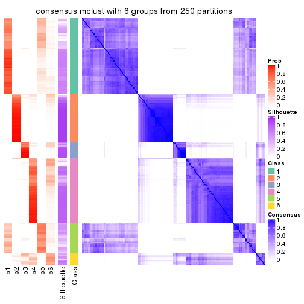</p>

</div>
</div>

Heatmaps for the membership of samples in all partitions to see how consistent they are:


<script>
$( function() {
	$( '#tabs-CV-mclust-membership-heatmap' ).tabs();
} );
</script>
<div id='tabs-CV-mclust-membership-heatmap'>
<ul>
<li><a href='#tab-CV-mclust-membership-heatmap-1'>k = 2</a></li>
<li><a href='#tab-CV-mclust-membership-heatmap-2'>k = 3</a></li>
<li><a href='#tab-CV-mclust-membership-heatmap-3'>k = 4</a></li>
<li><a href='#tab-CV-mclust-membership-heatmap-4'>k = 5</a></li>
<li><a href='#tab-CV-mclust-membership-heatmap-5'>k = 6</a></li>
</ul>
<div id='tab-CV-mclust-membership-heatmap-1'>
<pre><code class="r">membership_heatmap(res, k = 2)
</code></pre>

<p></p>

</div>
<div id='tab-CV-mclust-membership-heatmap-2'>
<pre><code class="r">membership_heatmap(res, k = 3)
</code></pre>

<p></p>

</div>
<div id='tab-CV-mclust-membership-heatmap-3'>
<pre><code class="r">membership_heatmap(res, k = 4)
</code></pre>

<p></p>

</div>
<div id='tab-CV-mclust-membership-heatmap-4'>
<pre><code class="r">membership_heatmap(res, k = 5)
</code></pre>

<p></p>

</div>
<div id='tab-CV-mclust-membership-heatmap-5'>
<pre><code class="r">membership_heatmap(res, k = 6)
</code></pre>

<p></p>

</div>
</div>

As soon as we have had the classes for columns, we can look for signatures
which are significantly different between classes which can be candidate marks
for certain classes. Following are the heatmaps for signatures.


Signature heatmaps where rows are scaled:


<script>
$( function() {
	$( '#tabs-CV-mclust-get-signatures' ).tabs();
} );
</script>
<div id='tabs-CV-mclust-get-signatures'>
<ul>
<li><a href='#tab-CV-mclust-get-signatures-1'>k = 2</a></li>
<li><a href='#tab-CV-mclust-get-signatures-2'>k = 3</a></li>
<li><a href='#tab-CV-mclust-get-signatures-3'>k = 4</a></li>
<li><a href='#tab-CV-mclust-get-signatures-4'>k = 5</a></li>
<li><a href='#tab-CV-mclust-get-signatures-5'>k = 6</a></li>
</ul>
<div id='tab-CV-mclust-get-signatures-1'>
<pre><code class="r">get_signatures(res, k = 2)
</code></pre>

<p></p>

</div>
<div id='tab-CV-mclust-get-signatures-2'>
<pre><code class="r">get_signatures(res, k = 3)
</code></pre>

<p></p>

</div>
<div id='tab-CV-mclust-get-signatures-3'>
<pre><code class="r">get_signatures(res, k = 4)
</code></pre>

<p></p>

</div>
<div id='tab-CV-mclust-get-signatures-4'>
<pre><code class="r">get_signatures(res, k = 5)
</code></pre>

<p></p>

</div>
<div id='tab-CV-mclust-get-signatures-5'>
<pre><code class="r">get_signatures(res, k = 6)
</code></pre>

<p></p>

</div>
</div>


Signature heatmaps where rows are not scaled:


<script>
$( function() {
	$( '#tabs-CV-mclust-get-signatures-no-scale' ).tabs();
} );
</script>
<div id='tabs-CV-mclust-get-signatures-no-scale'>
<ul>
<li><a href='#tab-CV-mclust-get-signatures-no-scale-1'>k = 2</a></li>
<li><a href='#tab-CV-mclust-get-signatures-no-scale-2'>k = 3</a></li>
<li><a href='#tab-CV-mclust-get-signatures-no-scale-3'>k = 4</a></li>
<li><a href='#tab-CV-mclust-get-signatures-no-scale-4'>k = 5</a></li>
<li><a href='#tab-CV-mclust-get-signatures-no-scale-5'>k = 6</a></li>
</ul>
<div id='tab-CV-mclust-get-signatures-no-scale-1'>
<pre><code class="r">get_signatures(res, k = 2, scale_rows = FALSE)
</code></pre>

<p></p>

</div>
<div id='tab-CV-mclust-get-signatures-no-scale-2'>
<pre><code class="r">get_signatures(res, k = 3, scale_rows = FALSE)
</code></pre>

<p></p>

</div>
<div id='tab-CV-mclust-get-signatures-no-scale-3'>
<pre><code class="r">get_signatures(res, k = 4, scale_rows = FALSE)
</code></pre>

<p></p>

</div>
<div id='tab-CV-mclust-get-signatures-no-scale-4'>
<pre><code class="r">get_signatures(res, k = 5, scale_rows = FALSE)
</code></pre>

<p></p>

</div>
<div id='tab-CV-mclust-get-signatures-no-scale-5'>
<pre><code class="r">get_signatures(res, k = 6, scale_rows = FALSE)
</code></pre>

<p></p>

</div>
</div>


Compare the overlap of signatures from different k:

```r
compare_signatures(res)
```


`get_signature()` returns a data frame invisibly. TO get the list of signatures, the function
call should be assigned to a variable explicitly. In following code, if `plot` argument is set
to `FALSE`, no heatmap is plotted while only the differential analysis is performed.

```r
# code only for demonstration
tb = get_signature(res, k = ..., plot = FALSE)
```

An example of the output of `tb` is:

```
#>   which_row         fdr    mean_1    mean_2 scaled_mean_1 scaled_mean_2 km
#> 1        38 0.042760348  8.373488  9.131774    -0.5533452     0.5164555  1
#> 2        40 0.018707592  7.106213  8.469186    -0.6173731     0.5762149  1
#> 3        55 0.019134737 10.221463 11.207825    -0.6159697     0.5749050  1
#> 4        59 0.006059896  5.921854  7.869574    -0.6899429     0.6439467  1
#> 5        60 0.018055526  8.928898 10.211722    -0.6204761     0.5791110  1
#> 6        98 0.009384629 15.714769 14.887706     0.6635654    -0.6193277  2
...
```

The columns in `tb` are:

1. `which_row`: row indices corresponding to the input matrix.
2. `fdr`: FDR for the differential test. 
3. `mean_x`: The mean value in group x.
4. `scaled_mean_x`: The mean value in group x after rows are scaled.
5. `km`: Row groups if k-means clustering is applied to rows.


UMAP plot which shows how samples are separated.


<script>
$( function() {
	$( '#tabs-CV-mclust-dimension-reduction' ).tabs();
} );
</script>
<div id='tabs-CV-mclust-dimension-reduction'>
<ul>
<li><a href='#tab-CV-mclust-dimension-reduction-1'>k = 2</a></li>
<li><a href='#tab-CV-mclust-dimension-reduction-2'>k = 3</a></li>
<li><a href='#tab-CV-mclust-dimension-reduction-3'>k = 4</a></li>
<li><a href='#tab-CV-mclust-dimension-reduction-4'>k = 5</a></li>
<li><a href='#tab-CV-mclust-dimension-reduction-5'>k = 6</a></li>
</ul>
<div id='tab-CV-mclust-dimension-reduction-1'>
<pre><code class="r">dimension_reduction(res, k = 2, method = &quot;UMAP&quot;)
</code></pre>

<p></p>

</div>
<div id='tab-CV-mclust-dimension-reduction-2'>
<pre><code class="r">dimension_reduction(res, k = 3, method = &quot;UMAP&quot;)
</code></pre>

<p></p>

</div>
<div id='tab-CV-mclust-dimension-reduction-3'>
<pre><code class="r">dimension_reduction(res, k = 4, method = &quot;UMAP&quot;)
</code></pre>

<p></p>

</div>
<div id='tab-CV-mclust-dimension-reduction-4'>
<pre><code class="r">dimension_reduction(res, k = 5, method = &quot;UMAP&quot;)
</code></pre>

<p></p>

</div>
<div id='tab-CV-mclust-dimension-reduction-5'>
<pre><code class="r">dimension_reduction(res, k = 6, method = &quot;UMAP&quot;)
</code></pre>

<p></p>

</div>
</div>


Following heatmap shows how subgroups are split when increasing `k`:

```r
collect_classes(res)
```


If matrix rows can be associated to genes, consider to use `functional_enrichment(res,
...)` to perform function enrichment for the signature genes. See [this vignette](http://bioconductor.org/packages/devel/bioc/vignettes/cola/inst/doc/functional_enrichment.html) for more detailed explanations.


 

---------------------------------------------------


### CV:NMF**


The object with results only for a single top-value method and a single partition method 
can be extracted as:

```r
res = res_list["CV", "NMF"]
# you can also extract it by
# res = res_list["CV:NMF"]
```

A summary of `res` and all the functions that can be applied to it:

```r
res
```

```
#> A 'ConsensusPartition' object with k = 2, 3, 4, 5, 6.
#>   On a matrix with 9126 rows and 192 columns.
#>   Top rows (913, 1826, 2738, 3650, 4563) are extracted by 'CV' method.
#>   Subgroups are detected by 'NMF' method.
#>   Performed in total 1250 partitions by row resampling.
#>   Best k for subgroups seems to be 2.
#> 
#> Following methods can be applied to this 'ConsensusPartition' object:
#>  [1] "cola_report"             "collect_classes"         "collect_plots"          
#>  [4] "collect_stats"           "colnames"                "compare_signatures"     
#>  [7] "consensus_heatmap"       "dimension_reduction"     "functional_enrichment"  
#> [10] "get_anno_col"            "get_anno"                "get_classes"            
#> [13] "get_consensus"           "get_matrix"              "get_membership"         
#> [16] "get_param"               "get_signatures"          "get_stats"              
#> [19] "is_best_k"               "is_stable_k"             "membership_heatmap"     
#> [22] "ncol"                    "nrow"                    "plot_ecdf"              
#> [25] "rownames"                "select_partition_number" "show"                   
#> [28] "suggest_best_k"          "test_to_known_factors"
```

`collect_plots()` function collects all the plots made from `res` for all `k` (number of partitions)
into one single page to provide an easy and fast comparison between different `k`.

```r
collect_plots(res)
```


The plots are:

- The first row: a plot of the ECDF (empirical cumulative distribution
  function) curves of the consensus matrix for each `k` and the heatmap of
  predicted classes for each `k`.
- The second row: heatmaps of the consensus matrix for each `k`.
- The third row: heatmaps of the membership matrix for each `k`.
- The fouth row: heatmaps of the signatures for each `k`.

All the plots in panels can be made by individual functions and they are
plotted later in this section.

`select_partition_number()` produces several plots showing different
statistics for choosing "optimized" `k`. There are following statistics:

- ECDF curves of the consensus matrix for each `k`;
- 1-PAC. [The PAC
  score](https://en.wikipedia.org/wiki/Consensus_clustering#Over-interpretation_potential_of_consensus_clustering)
  measures the proportion of the ambiguous subgrouping.
- Mean silhouette score.
- Concordance. The mean probability of fiting the consensus class ids in all
  partitions.
- Area increased. Denote $A_k$ as the area under the ECDF curve for current
  `k`, the area increased is defined as $A_k - A_{k-1}$.
- Rand index. The percent of pairs of samples that are both in a same cluster
  or both are not in a same cluster in the partition of k and k-1.
- Jaccard index. The ratio of pairs of samples are both in a same cluster in
  the partition of k and k-1 and the pairs of samples are both in a same
  cluster in the partition k or k-1.

The detailed explanations of these statistics can be found in [the _cola_
vignette](http://bioconductor.org/packages/devel/bioc/vignettes/cola/inst/doc/cola.html#toc_13).

Generally speaking, lower PAC score, higher mean silhouette score or higher
concordance corresponds to better partition. Rand index and Jaccard index
measure how similar the current partition is compared to partition with `k-1`.
If they are too similar, we won't accept `k` is better than `k-1`.

```r
select_partition_number(res)
```


The numeric values for all these statistics can be obtained by `get_stats()`.

```r
get_stats(res)
```

```
#>   k 1-PAC mean_silhouette concordance area_increased  Rand Jaccard
#> 2 2 1.000           0.995       0.998         0.4989 0.502   0.502
#> 3 3 0.814           0.859       0.920         0.1658 0.925   0.852
#> 4 4 0.753           0.882       0.902         0.0319 0.978   0.952
#> 5 5 0.671           0.819       0.863         0.0396 0.999   0.997
#> 6 6 0.687           0.687       0.842         0.0223 0.958   0.905
```

`suggest_best_k()` suggests the best $k$ based on these statistics. The rules are as follows:

- All $k$ with Jaccard index larger than 0.95 are removed because increasing
  $k$ does not provide enough extra information. If all $k$ are removed, it is
  marked as no subgroup is detected.
- For all $k$ with 1-PAC score larger than 0.9, the maximal $k$ is taken as
  the best $k$, and other $k$ are marked as optional $k$.
- If it does not fit the second rule. The $k$ with the maximal vote of the
  highest 1-PAC score, highest mean silhouette, and highest concordance is
  taken as the best $k$.

```r
suggest_best_k(res)
```

```
#> [1] 2
```


Following shows the table of the partitions (You need to click the **show/hide
code output** link to see it). The membership matrix (columns with name `p*`)
is inferred by
[`clue::cl_consensus()`](https://www.rdocumentation.org/link/cl_consensus?package=clue)
function with the `SE` method. Basically the value in the membership matrix
represents the probability to belong to a certain group. The finall class
label for an item is determined with the group with highest probability it
belongs to.

In `get_classes()` function, the entropy is calculated from the membership
matrix and the silhouette score is calculated from the consensus matrix.


<script>
$( function() {
	$( '#tabs-CV-NMF-get-classes' ).tabs();
} );
</script>
<div id='tabs-CV-NMF-get-classes'>
<ul>
<li><a href='#tab-CV-NMF-get-classes-1'>k = 2</a></li>
<li><a href='#tab-CV-NMF-get-classes-2'>k = 3</a></li>
<li><a href='#tab-CV-NMF-get-classes-3'>k = 4</a></li>
<li><a href='#tab-CV-NMF-get-classes-4'>k = 5</a></li>
<li><a href='#tab-CV-NMF-get-classes-5'>k = 6</a></li>
</ul>

<div id='tab-CV-NMF-get-classes-1'>
<p><a id='tab-CV-NMF-get-classes-1-a' style='color:#0366d6' href='#'>show/hide code output</a></p>
<pre><code class="r">cbind(get_classes(res, k = 2), get_membership(res, k = 2))
</code></pre>

<pre><code>#&gt;            class entropy silhouette    p1    p2
#&gt; SRR2074921     2   0.000      0.997 0.000 1.000
#&gt; SRR2074919     2   0.000      0.997 0.000 1.000
#&gt; SRR2074920     2   0.000      0.997 0.000 1.000
#&gt; SRR2074917     1   0.000      0.999 1.000 0.000
#&gt; SRR2074918     2   0.000      0.997 0.000 1.000
#&gt; SRR2074916     2   0.000      0.997 0.000 1.000
#&gt; SRR2074915     2   0.000      0.997 0.000 1.000
#&gt; SRR2074914     1   0.000      0.999 1.000 0.000
#&gt; SRR2074913     2   0.000      0.997 0.000 1.000
#&gt; SRR2074912     1   0.000      0.999 1.000 0.000
#&gt; SRR2074911     2   0.000      0.997 0.000 1.000
#&gt; SRR2074910     2   0.000      0.997 0.000 1.000
#&gt; SRR2074909     1   0.000      0.999 1.000 0.000
#&gt; SRR2074907     1   0.000      0.999 1.000 0.000
#&gt; SRR2074908     2   0.000      0.997 0.000 1.000
#&gt; SRR2074906     2   0.000      0.997 0.000 1.000
#&gt; SRR2074905     1   0.000      0.999 1.000 0.000
#&gt; SRR2074904     2   0.000      0.997 0.000 1.000
#&gt; SRR2074903     2   0.000      0.997 0.000 1.000
#&gt; SRR2074902     1   0.000      0.999 1.000 0.000
#&gt; SRR2074901     2   0.000      0.997 0.000 1.000
#&gt; SRR2074900     1   0.000      0.999 1.000 0.000
#&gt; SRR2074899     2   0.000      0.997 0.000 1.000
#&gt; SRR2074898     2   0.000      0.997 0.000 1.000
#&gt; SRR2074897     2   0.000      0.997 0.000 1.000
#&gt; SRR2074896     2   0.000      0.997 0.000 1.000
#&gt; SRR2074895     1   0.000      0.999 1.000 0.000
#&gt; SRR2074894     2   0.900      0.537 0.316 0.684
#&gt; SRR2074893     2   0.000      0.997 0.000 1.000
#&gt; SRR2074892     1   0.000      0.999 1.000 0.000
#&gt; SRR2074891     1   0.000      0.999 1.000 0.000
#&gt; SRR2074890     2   0.000      0.997 0.000 1.000
#&gt; SRR2074887     2   0.000      0.997 0.000 1.000
#&gt; SRR2074889     2   0.000      0.997 0.000 1.000
#&gt; SRR2074886     2   0.000      0.997 0.000 1.000
#&gt; SRR2074888     2   0.000      0.997 0.000 1.000
#&gt; SRR2074885     1   0.000      0.999 1.000 0.000
#&gt; SRR2074884     2   0.000      0.997 0.000 1.000
#&gt; SRR2074883     2   0.000      0.997 0.000 1.000
#&gt; SRR2074882     1   0.000      0.999 1.000 0.000
#&gt; SRR2074880     2   0.000      0.997 0.000 1.000
#&gt; SRR2074881     2   0.000      0.997 0.000 1.000
#&gt; SRR2074879     1   0.443      0.898 0.908 0.092
#&gt; SRR2074878     1   0.000      0.999 1.000 0.000
#&gt; SRR2074877     2   0.000      0.997 0.000 1.000
#&gt; SRR2074876     1   0.000      0.999 1.000 0.000
#&gt; SRR2074875     2   0.000      0.997 0.000 1.000
#&gt; SRR2074874     1   0.000      0.999 1.000 0.000
#&gt; SRR2074873     2   0.000      0.997 0.000 1.000
#&gt; SRR2074872     1   0.000      0.999 1.000 0.000
#&gt; SRR2074871     2   0.000      0.997 0.000 1.000
#&gt; SRR2074870     1   0.000      0.999 1.000 0.000
#&gt; SRR2074869     1   0.000      0.999 1.000 0.000
#&gt; SRR2074868     1   0.000      0.999 1.000 0.000
#&gt; SRR2074867     2   0.000      0.997 0.000 1.000
#&gt; SRR2074866     2   0.000      0.997 0.000 1.000
#&gt; SRR2074865     1   0.000      0.999 1.000 0.000
#&gt; SRR2074864     1   0.000      0.999 1.000 0.000
#&gt; SRR2074863     1   0.000      0.999 1.000 0.000
#&gt; SRR2074862     1   0.000      0.999 1.000 0.000
#&gt; SRR2074861     1   0.000      0.999 1.000 0.000
#&gt; SRR2074860     1   0.000      0.999 1.000 0.000
#&gt; SRR2074859     1   0.000      0.999 1.000 0.000
#&gt; SRR2074858     2   0.000      0.997 0.000 1.000
#&gt; SRR2074855     2   0.000      0.997 0.000 1.000
#&gt; SRR2074857     1   0.000      0.999 1.000 0.000
#&gt; SRR2074856     1   0.000      0.999 1.000 0.000
#&gt; SRR2074854     1   0.000      0.999 1.000 0.000
#&gt; SRR2074853     1   0.000      0.999 1.000 0.000
#&gt; SRR2074852     2   0.000      0.997 0.000 1.000
#&gt; SRR2074851     1   0.000      0.999 1.000 0.000
#&gt; SRR2074850     1   0.000      0.999 1.000 0.000
#&gt; SRR2074849     1   0.000      0.999 1.000 0.000
#&gt; SRR2074848     1   0.000      0.999 1.000 0.000
#&gt; SRR2074847     1   0.000      0.999 1.000 0.000
#&gt; SRR2074846     1   0.000      0.999 1.000 0.000
#&gt; SRR2074845     1   0.000      0.999 1.000 0.000
#&gt; SRR2074843     1   0.000      0.999 1.000 0.000
#&gt; SRR2074842     2   0.000      0.997 0.000 1.000
#&gt; SRR2074844     2   0.000      0.997 0.000 1.000
#&gt; SRR2074841     2   0.000      0.997 0.000 1.000
#&gt; SRR2074840     2   0.000      0.997 0.000 1.000
#&gt; SRR2074839     1   0.000      0.999 1.000 0.000
#&gt; SRR2074838     2   0.000      0.997 0.000 1.000
#&gt; SRR2074836     2   0.000      0.997 0.000 1.000
#&gt; SRR2074835     2   0.000      0.997 0.000 1.000
#&gt; SRR2074837     1   0.000      0.999 1.000 0.000
#&gt; SRR2074834     2   0.000      0.997 0.000 1.000
#&gt; SRR2074833     1   0.000      0.999 1.000 0.000
#&gt; SRR2074832     2   0.000      0.997 0.000 1.000
#&gt; SRR2074831     1   0.000      0.999 1.000 0.000
#&gt; SRR2074829     1   0.000      0.999 1.000 0.000
#&gt; SRR2074830     1   0.000      0.999 1.000 0.000
#&gt; SRR2074828     1   0.000      0.999 1.000 0.000
#&gt; SRR2074827     2   0.000      0.997 0.000 1.000
#&gt; SRR2074826     2   0.000      0.997 0.000 1.000
#&gt; SRR2074825     2   0.000      0.997 0.000 1.000
#&gt; SRR2074824     2   0.000      0.997 0.000 1.000
#&gt; SRR2074823     1   0.000      0.999 1.000 0.000
#&gt; SRR2074822     2   0.000      0.997 0.000 1.000
#&gt; SRR2074821     2   0.000      0.997 0.000 1.000
#&gt; SRR2074820     2   0.000      0.997 0.000 1.000
#&gt; SRR2074819     2   0.000      0.997 0.000 1.000
#&gt; SRR2074817     2   0.000      0.997 0.000 1.000
#&gt; SRR2074818     2   0.000      0.997 0.000 1.000
#&gt; SRR2074816     1   0.000      0.999 1.000 0.000
#&gt; SRR2074815     2   0.000      0.997 0.000 1.000
#&gt; SRR2074814     1   0.000      0.999 1.000 0.000
#&gt; SRR2074812     2   0.000      0.997 0.000 1.000
#&gt; SRR2074813     2   0.000      0.997 0.000 1.000
#&gt; SRR2074809     2   0.000      0.997 0.000 1.000
#&gt; SRR2074810     2   0.000      0.997 0.000 1.000
#&gt; SRR2074811     2   0.000      0.997 0.000 1.000
#&gt; SRR2074808     2   0.000      0.997 0.000 1.000
#&gt; SRR2074807     2   0.000      0.997 0.000 1.000
#&gt; SRR2074806     1   0.000      0.999 1.000 0.000
#&gt; SRR2074805     2   0.000      0.997 0.000 1.000
#&gt; SRR2074804     1   0.000      0.999 1.000 0.000
#&gt; SRR2074803     1   0.000      0.999 1.000 0.000
#&gt; SRR2074801     1   0.000      0.999 1.000 0.000
#&gt; SRR2074802     2   0.000      0.997 0.000 1.000
#&gt; SRR2074799     2   0.000      0.997 0.000 1.000
#&gt; SRR2074800     1   0.000      0.999 1.000 0.000
#&gt; SRR2074798     1   0.000      0.999 1.000 0.000
#&gt; SRR2074797     1   0.000      0.999 1.000 0.000
#&gt; SRR2074795     2   0.000      0.997 0.000 1.000
#&gt; SRR2074796     2   0.000      0.997 0.000 1.000
#&gt; SRR2074794     2   0.000      0.997 0.000 1.000
#&gt; SRR2074793     2   0.000      0.997 0.000 1.000
#&gt; SRR2074792     1   0.000      0.999 1.000 0.000
#&gt; SRR2074791     1   0.000      0.999 1.000 0.000
#&gt; SRR2074790     2   0.000      0.997 0.000 1.000
#&gt; SRR2074789     1   0.000      0.999 1.000 0.000
#&gt; SRR2074788     1   0.000      0.999 1.000 0.000
#&gt; SRR2074787     1   0.000      0.999 1.000 0.000
#&gt; SRR2074786     2   0.000      0.997 0.000 1.000
#&gt; SRR2074785     1   0.000      0.999 1.000 0.000
#&gt; SRR2074784     1   0.000      0.999 1.000 0.000
#&gt; SRR2074783     2   0.000      0.997 0.000 1.000
#&gt; SRR2074782     1   0.000      0.999 1.000 0.000
#&gt; SRR2074779     2   0.000      0.997 0.000 1.000
#&gt; SRR2074781     2   0.000      0.997 0.000 1.000
#&gt; SRR2074780     1   0.000      0.999 1.000 0.000
#&gt; SRR2074778     2   0.000      0.997 0.000 1.000
#&gt; SRR2074777     2   0.000      0.997 0.000 1.000
#&gt; SRR2074776     2   0.000      0.997 0.000 1.000
#&gt; SRR2074775     1   0.000      0.999 1.000 0.000
#&gt; SRR2074774     1   0.000      0.999 1.000 0.000
#&gt; SRR2074773     2   0.000      0.997 0.000 1.000
#&gt; SRR2074771     2   0.000      0.997 0.000 1.000
#&gt; SRR2074772     1   0.000      0.999 1.000 0.000
#&gt; SRR2074770     1   0.000      0.999 1.000 0.000
#&gt; SRR2074769     2   0.000      0.997 0.000 1.000
#&gt; SRR2074768     2   0.000      0.997 0.000 1.000
#&gt; SRR2074766     2   0.000      0.997 0.000 1.000
#&gt; SRR2074767     1   0.000      0.999 1.000 0.000
#&gt; SRR2074765     1   0.000      0.999 1.000 0.000
#&gt; SRR2074764     2   0.000      0.997 0.000 1.000
#&gt; SRR2074763     2   0.000      0.997 0.000 1.000
#&gt; SRR2074761     1   0.000      0.999 1.000 0.000
#&gt; SRR2074762     2   0.000      0.997 0.000 1.000
#&gt; SRR2074760     2   0.000      0.997 0.000 1.000
#&gt; SRR2074759     1   0.000      0.999 1.000 0.000
#&gt; SRR2074757     2   0.000      0.997 0.000 1.000
#&gt; SRR2074758     2   0.000      0.997 0.000 1.000
#&gt; SRR2074756     2   0.000      0.997 0.000 1.000
#&gt; SRR2074755     1   0.000      0.999 1.000 0.000
#&gt; SRR2074754     1   0.000      0.999 1.000 0.000
#&gt; SRR2074753     2   0.000      0.997 0.000 1.000
#&gt; SRR2074752     1   0.000      0.999 1.000 0.000
#&gt; SRR2074751     1   0.000      0.999 1.000 0.000
#&gt; SRR2074749     2   0.000      0.997 0.000 1.000
#&gt; SRR2074750     1   0.000      0.999 1.000 0.000
#&gt; SRR2074748     1   0.000      0.999 1.000 0.000
#&gt; SRR2074747     2   0.000      0.997 0.000 1.000
#&gt; SRR2074745     1   0.000      0.999 1.000 0.000
#&gt; SRR2074746     1   0.000      0.999 1.000 0.000
#&gt; SRR2074744     2   0.000      0.997 0.000 1.000
#&gt; SRR2074743     2   0.000      0.997 0.000 1.000
#&gt; SRR2074742     2   0.000      0.997 0.000 1.000
#&gt; SRR2074741     1   0.000      0.999 1.000 0.000
#&gt; SRR2074740     2   0.000      0.997 0.000 1.000
#&gt; SRR2074739     1   0.000      0.999 1.000 0.000
#&gt; SRR2074738     2   0.000      0.997 0.000 1.000
#&gt; SRR2074737     2   0.000      0.997 0.000 1.000
#&gt; SRR2074736     2   0.000      0.997 0.000 1.000
#&gt; SRR2074735     1   0.000      0.999 1.000 0.000
#&gt; SRR2074734     2   0.000      0.997 0.000 1.000
#&gt; SRR2074733     1   0.000      0.999 1.000 0.000
#&gt; SRR2074732     2   0.000      0.997 0.000 1.000
#&gt; SRR2074731     2   0.000      0.997 0.000 1.000
#&gt; SRR2074730     1   0.000      0.999 1.000 0.000
</code></pre>

<script>
$('#tab-CV-NMF-get-classes-1-a').parent().next().next().hide();
$('#tab-CV-NMF-get-classes-1-a').click(function(){
  $('#tab-CV-NMF-get-classes-1-a').parent().next().next().toggle();
  return(false);
});
</script>
</div>

<div id='tab-CV-NMF-get-classes-2'>
<p><a id='tab-CV-NMF-get-classes-2-a' style='color:#0366d6' href='#'>show/hide code output</a></p>
<pre><code class="r">cbind(get_classes(res, k = 3), get_membership(res, k = 3))
</code></pre>

<pre><code>#&gt;            class entropy silhouette    p1    p2    p3
#&gt; SRR2074921     3  0.3686      0.835 0.000 0.140 0.860
#&gt; SRR2074919     3  0.3816      0.838 0.000 0.148 0.852
#&gt; SRR2074920     3  0.3816      0.839 0.000 0.148 0.852
#&gt; SRR2074917     1  0.1964      0.958 0.944 0.000 0.056
#&gt; SRR2074918     3  0.3551      0.832 0.000 0.132 0.868
#&gt; SRR2074916     3  0.5968      0.609 0.000 0.364 0.636
#&gt; SRR2074915     3  0.5178      0.772 0.000 0.256 0.744
#&gt; SRR2074914     1  0.0000      0.986 1.000 0.000 0.000
#&gt; SRR2074913     3  0.4178      0.833 0.000 0.172 0.828
#&gt; SRR2074912     1  0.2845      0.935 0.920 0.012 0.068
#&gt; SRR2074911     3  0.3752      0.839 0.000 0.144 0.856
#&gt; SRR2074910     3  0.3941      0.840 0.000 0.156 0.844
#&gt; SRR2074909     1  0.0000      0.986 1.000 0.000 0.000
#&gt; SRR2074907     1  0.0000      0.986 1.000 0.000 0.000
#&gt; SRR2074908     2  0.4887      0.736 0.000 0.772 0.228
#&gt; SRR2074906     2  0.0747      0.832 0.000 0.984 0.016
#&gt; SRR2074905     1  0.0000      0.986 1.000 0.000 0.000
#&gt; SRR2074904     2  0.5621      0.604 0.000 0.692 0.308
#&gt; SRR2074903     2  0.4555      0.772 0.000 0.800 0.200
#&gt; SRR2074902     1  0.0892      0.981 0.980 0.000 0.020
#&gt; SRR2074901     2  0.4555      0.764 0.000 0.800 0.200
#&gt; SRR2074900     1  0.0592      0.984 0.988 0.000 0.012
#&gt; SRR2074899     2  0.2878      0.833 0.000 0.904 0.096
#&gt; SRR2074898     2  0.0424      0.837 0.000 0.992 0.008
#&gt; SRR2074897     2  0.0747      0.833 0.000 0.984 0.016
#&gt; SRR2074896     2  0.5785      0.544 0.000 0.668 0.332
#&gt; SRR2074895     1  0.0000      0.986 1.000 0.000 0.000
#&gt; SRR2074894     1  0.8143      0.275 0.560 0.080 0.360
#&gt; SRR2074893     2  0.0892      0.842 0.000 0.980 0.020
#&gt; SRR2074892     1  0.0892      0.981 0.980 0.000 0.020
#&gt; SRR2074891     1  0.0000      0.986 1.000 0.000 0.000
#&gt; SRR2074890     2  0.5733      0.573 0.000 0.676 0.324
#&gt; SRR2074887     2  0.4702      0.756 0.000 0.788 0.212
#&gt; SRR2074889     2  0.0592      0.833 0.000 0.988 0.012
#&gt; SRR2074886     2  0.0424      0.839 0.000 0.992 0.008
#&gt; SRR2074888     2  0.0424      0.836 0.000 0.992 0.008
#&gt; SRR2074885     1  0.0000      0.986 1.000 0.000 0.000
#&gt; SRR2074884     2  0.0592      0.838 0.000 0.988 0.012
#&gt; SRR2074883     2  0.0237      0.839 0.000 0.996 0.004
#&gt; SRR2074882     1  0.1529      0.971 0.960 0.000 0.040
#&gt; SRR2074880     2  0.0424      0.839 0.000 0.992 0.008
#&gt; SRR2074881     2  0.4121      0.796 0.000 0.832 0.168
#&gt; SRR2074879     1  0.2939      0.928 0.916 0.012 0.072
#&gt; SRR2074878     1  0.1964      0.959 0.944 0.000 0.056
#&gt; SRR2074877     2  0.6215      0.219 0.000 0.572 0.428
#&gt; SRR2074876     1  0.0000      0.986 1.000 0.000 0.000
#&gt; SRR2074875     2  0.0592      0.833 0.000 0.988 0.012
#&gt; SRR2074874     1  0.1529      0.971 0.960 0.000 0.040
#&gt; SRR2074873     2  0.1031      0.841 0.000 0.976 0.024
#&gt; SRR2074872     1  0.2066      0.956 0.940 0.000 0.060
#&gt; SRR2074871     2  0.4842      0.744 0.000 0.776 0.224
#&gt; SRR2074870     1  0.0000      0.986 1.000 0.000 0.000
#&gt; SRR2074869     1  0.0000      0.986 1.000 0.000 0.000
#&gt; SRR2074868     1  0.1860      0.962 0.948 0.000 0.052
#&gt; SRR2074867     2  0.5327      0.679 0.000 0.728 0.272
#&gt; SRR2074866     3  0.6274      0.315 0.000 0.456 0.544
#&gt; SRR2074865     1  0.0000      0.986 1.000 0.000 0.000
#&gt; SRR2074864     1  0.0000      0.986 1.000 0.000 0.000
#&gt; SRR2074863     1  0.0000      0.986 1.000 0.000 0.000
#&gt; SRR2074862     1  0.1529      0.971 0.960 0.000 0.040
#&gt; SRR2074861     1  0.0000      0.986 1.000 0.000 0.000
#&gt; SRR2074860     1  0.0000      0.986 1.000 0.000 0.000
#&gt; SRR2074859     1  0.0237      0.985 0.996 0.000 0.004
#&gt; SRR2074858     2  0.5397      0.661 0.000 0.720 0.280
#&gt; SRR2074855     2  0.0892      0.831 0.000 0.980 0.020
#&gt; SRR2074857     1  0.0424      0.985 0.992 0.000 0.008
#&gt; SRR2074856     1  0.1411      0.973 0.964 0.000 0.036
#&gt; SRR2074854     1  0.0592      0.984 0.988 0.000 0.012
#&gt; SRR2074853     1  0.0000      0.986 1.000 0.000 0.000
#&gt; SRR2074852     2  0.0592      0.839 0.000 0.988 0.012
#&gt; SRR2074851     1  0.0424      0.985 0.992 0.000 0.008
#&gt; SRR2074850     1  0.0892      0.981 0.980 0.000 0.020
#&gt; SRR2074849     1  0.1289      0.975 0.968 0.000 0.032
#&gt; SRR2074848     1  0.0747      0.983 0.984 0.000 0.016
#&gt; SRR2074847     1  0.0000      0.986 1.000 0.000 0.000
#&gt; SRR2074846     1  0.0747      0.983 0.984 0.000 0.016
#&gt; SRR2074845     1  0.0592      0.984 0.988 0.000 0.012
#&gt; SRR2074843     1  0.0892      0.981 0.980 0.000 0.020
#&gt; SRR2074842     2  0.5948      0.475 0.000 0.640 0.360
#&gt; SRR2074844     2  0.3192      0.828 0.000 0.888 0.112
#&gt; SRR2074841     2  0.0747      0.834 0.000 0.984 0.016
#&gt; SRR2074840     2  0.0747      0.832 0.000 0.984 0.016
#&gt; SRR2074839     1  0.0592      0.984 0.988 0.000 0.012
#&gt; SRR2074838     2  0.0592      0.833 0.000 0.988 0.012
#&gt; SRR2074836     2  0.2878      0.833 0.000 0.904 0.096
#&gt; SRR2074835     2  0.0592      0.833 0.000 0.988 0.012
#&gt; SRR2074837     1  0.0000      0.986 1.000 0.000 0.000
#&gt; SRR2074834     2  0.3752      0.817 0.000 0.856 0.144
#&gt; SRR2074833     1  0.0592      0.984 0.988 0.000 0.012
#&gt; SRR2074832     2  0.3267      0.827 0.000 0.884 0.116
#&gt; SRR2074831     1  0.1031      0.979 0.976 0.000 0.024
#&gt; SRR2074829     1  0.0892      0.981 0.980 0.000 0.020
#&gt; SRR2074830     1  0.0592      0.984 0.988 0.000 0.012
#&gt; SRR2074828     1  0.0000      0.986 1.000 0.000 0.000
#&gt; SRR2074827     2  0.4002      0.803 0.000 0.840 0.160
#&gt; SRR2074826     3  0.6204      0.442 0.000 0.424 0.576
#&gt; SRR2074825     2  0.0592      0.841 0.000 0.988 0.012
#&gt; SRR2074824     2  0.0592      0.833 0.000 0.988 0.012
#&gt; SRR2074823     1  0.0592      0.984 0.988 0.000 0.012
#&gt; SRR2074822     2  0.0747      0.831 0.000 0.984 0.016
#&gt; SRR2074821     2  0.0592      0.833 0.000 0.988 0.012
#&gt; SRR2074820     2  0.0747      0.834 0.000 0.984 0.016
#&gt; SRR2074819     2  0.4605      0.766 0.000 0.796 0.204
#&gt; SRR2074817     2  0.3482      0.823 0.000 0.872 0.128
#&gt; SRR2074818     2  0.1031      0.836 0.000 0.976 0.024
#&gt; SRR2074816     1  0.0000      0.986 1.000 0.000 0.000
#&gt; SRR2074815     2  0.0592      0.840 0.000 0.988 0.012
#&gt; SRR2074814     1  0.0592      0.984 0.988 0.000 0.012
#&gt; SRR2074812     2  0.0892      0.832 0.000 0.980 0.020
#&gt; SRR2074813     2  0.5706      0.581 0.000 0.680 0.320
#&gt; SRR2074809     2  0.0592      0.833 0.000 0.988 0.012
#&gt; SRR2074810     2  0.3482      0.823 0.000 0.872 0.128
#&gt; SRR2074811     2  0.0892      0.830 0.000 0.980 0.020
#&gt; SRR2074808     2  0.5529      0.635 0.000 0.704 0.296
#&gt; SRR2074807     2  0.5621      0.606 0.000 0.692 0.308
#&gt; SRR2074806     1  0.0000      0.986 1.000 0.000 0.000
#&gt; SRR2074805     2  0.2356      0.839 0.000 0.928 0.072
#&gt; SRR2074804     1  0.0000      0.986 1.000 0.000 0.000
#&gt; SRR2074803     1  0.0000      0.986 1.000 0.000 0.000
#&gt; SRR2074801     1  0.0237      0.985 0.996 0.000 0.004
#&gt; SRR2074802     2  0.5254      0.693 0.000 0.736 0.264
#&gt; SRR2074799     2  0.0592      0.835 0.000 0.988 0.012
#&gt; SRR2074800     1  0.0592      0.984 0.988 0.000 0.012
#&gt; SRR2074798     1  0.0000      0.986 1.000 0.000 0.000
#&gt; SRR2074797     1  0.0892      0.981 0.980 0.000 0.020
#&gt; SRR2074795     2  0.1964      0.841 0.000 0.944 0.056
#&gt; SRR2074796     2  0.5178      0.698 0.000 0.744 0.256
#&gt; SRR2074794     2  0.0237      0.839 0.000 0.996 0.004
#&gt; SRR2074793     2  0.3941      0.806 0.000 0.844 0.156
#&gt; SRR2074792     1  0.0000      0.986 1.000 0.000 0.000
#&gt; SRR2074791     1  0.1031      0.979 0.976 0.000 0.024
#&gt; SRR2074790     2  0.0592      0.834 0.000 0.988 0.012
#&gt; SRR2074789     1  0.0424      0.985 0.992 0.000 0.008
#&gt; SRR2074788     1  0.0424      0.985 0.992 0.000 0.008
#&gt; SRR2074787     1  0.0424      0.985 0.992 0.000 0.008
#&gt; SRR2074786     2  0.4504      0.772 0.000 0.804 0.196
#&gt; SRR2074785     1  0.0000      0.986 1.000 0.000 0.000
#&gt; SRR2074784     1  0.0000      0.986 1.000 0.000 0.000
#&gt; SRR2074783     2  0.1163      0.841 0.000 0.972 0.028
#&gt; SRR2074782     1  0.0000      0.986 1.000 0.000 0.000
#&gt; SRR2074779     2  0.2878      0.834 0.000 0.904 0.096
#&gt; SRR2074781     2  0.6168      0.301 0.000 0.588 0.412
#&gt; SRR2074780     1  0.0424      0.985 0.992 0.000 0.008
#&gt; SRR2074778     2  0.4605      0.762 0.000 0.796 0.204
#&gt; SRR2074777     2  0.5733      0.569 0.000 0.676 0.324
#&gt; SRR2074776     2  0.0892      0.841 0.000 0.980 0.020
#&gt; SRR2074775     1  0.0000      0.986 1.000 0.000 0.000
#&gt; SRR2074774     1  0.0237      0.985 0.996 0.000 0.004
#&gt; SRR2074773     2  0.5254      0.695 0.000 0.736 0.264
#&gt; SRR2074771     2  0.4842      0.743 0.000 0.776 0.224
#&gt; SRR2074772     1  0.0000      0.986 1.000 0.000 0.000
#&gt; SRR2074770     1  0.0000      0.986 1.000 0.000 0.000
#&gt; SRR2074769     2  0.2448      0.839 0.000 0.924 0.076
#&gt; SRR2074768     2  0.3879      0.811 0.000 0.848 0.152
#&gt; SRR2074766     2  0.5254      0.687 0.000 0.736 0.264
#&gt; SRR2074767     1  0.0000      0.986 1.000 0.000 0.000
#&gt; SRR2074765     1  0.1753      0.965 0.952 0.000 0.048
#&gt; SRR2074764     3  0.5905      0.637 0.000 0.352 0.648
#&gt; SRR2074763     2  0.0592      0.833 0.000 0.988 0.012
#&gt; SRR2074761     1  0.0000      0.986 1.000 0.000 0.000
#&gt; SRR2074762     2  0.4974      0.731 0.000 0.764 0.236
#&gt; SRR2074760     2  0.2959      0.832 0.000 0.900 0.100
#&gt; SRR2074759     1  0.0000      0.986 1.000 0.000 0.000
#&gt; SRR2074757     2  0.3267      0.827 0.000 0.884 0.116
#&gt; SRR2074758     2  0.0747      0.834 0.000 0.984 0.016
#&gt; SRR2074756     2  0.3619      0.818 0.000 0.864 0.136
#&gt; SRR2074755     1  0.0000      0.986 1.000 0.000 0.000
#&gt; SRR2074754     1  0.0000      0.986 1.000 0.000 0.000
#&gt; SRR2074753     2  0.5216      0.700 0.000 0.740 0.260
#&gt; SRR2074752     1  0.0000      0.986 1.000 0.000 0.000
#&gt; SRR2074751     1  0.0000      0.986 1.000 0.000 0.000
#&gt; SRR2074749     2  0.0747      0.834 0.000 0.984 0.016
#&gt; SRR2074750     1  0.0424      0.985 0.992 0.000 0.008
#&gt; SRR2074748     1  0.0000      0.986 1.000 0.000 0.000
#&gt; SRR2074747     2  0.1753      0.841 0.000 0.952 0.048
#&gt; SRR2074745     1  0.1031      0.979 0.976 0.000 0.024
#&gt; SRR2074746     1  0.0237      0.984 0.996 0.004 0.000
#&gt; SRR2074744     2  0.2356      0.839 0.000 0.928 0.072
#&gt; SRR2074743     2  0.3551      0.820 0.000 0.868 0.132
#&gt; SRR2074742     3  0.3752      0.836 0.000 0.144 0.856
#&gt; SRR2074741     1  0.0000      0.986 1.000 0.000 0.000
#&gt; SRR2074740     2  0.6295     -0.014 0.000 0.528 0.472
#&gt; SRR2074739     1  0.0237      0.985 0.996 0.000 0.004
#&gt; SRR2074738     2  0.3340      0.826 0.000 0.880 0.120
#&gt; SRR2074737     2  0.0892      0.835 0.000 0.980 0.020
#&gt; SRR2074736     2  0.0747      0.841 0.000 0.984 0.016
#&gt; SRR2074735     1  0.0000      0.986 1.000 0.000 0.000
#&gt; SRR2074734     2  0.0592      0.840 0.000 0.988 0.012
#&gt; SRR2074733     1  0.0000      0.986 1.000 0.000 0.000
#&gt; SRR2074732     2  0.0592      0.833 0.000 0.988 0.012
#&gt; SRR2074731     2  0.0747      0.831 0.000 0.984 0.016
#&gt; SRR2074730     1  0.0892      0.981 0.980 0.000 0.020
</code></pre>

<script>
$('#tab-CV-NMF-get-classes-2-a').parent().next().next().hide();
$('#tab-CV-NMF-get-classes-2-a').click(function(){
  $('#tab-CV-NMF-get-classes-2-a').parent().next().next().toggle();
  return(false);
});
</script>
</div>

<div id='tab-CV-NMF-get-classes-3'>
<p><a id='tab-CV-NMF-get-classes-3-a' style='color:#0366d6' href='#'>show/hide code output</a></p>
<pre><code class="r">cbind(get_classes(res, k = 4), get_membership(res, k = 4))
</code></pre>

<pre><code>#&gt;            class entropy silhouette    p1    p2    p3    p4
#&gt; SRR2074921     3  0.4740      0.826 0.000 0.080 0.788 0.132
#&gt; SRR2074919     3  0.3734      0.827 0.000 0.044 0.848 0.108
#&gt; SRR2074920     3  0.2699      0.824 0.000 0.028 0.904 0.068
#&gt; SRR2074917     1  0.3837      0.827 0.776 0.000 0.000 0.224
#&gt; SRR2074918     3  0.3128      0.826 0.000 0.040 0.884 0.076
#&gt; SRR2074916     3  0.7673      0.354 0.000 0.368 0.416 0.216
#&gt; SRR2074915     3  0.7627      0.633 0.000 0.256 0.472 0.272
#&gt; SRR2074914     1  0.0921      0.939 0.972 0.000 0.000 0.028
#&gt; SRR2074913     3  0.7375      0.748 0.000 0.172 0.480 0.348
#&gt; SRR2074912     1  0.5182      0.666 0.676 0.012 0.008 0.304
#&gt; SRR2074911     3  0.4581      0.823 0.000 0.080 0.800 0.120
#&gt; SRR2074910     3  0.6574      0.803 0.000 0.088 0.548 0.364
#&gt; SRR2074909     1  0.0817      0.936 0.976 0.000 0.000 0.024
#&gt; SRR2074907     1  0.0336      0.939 0.992 0.000 0.000 0.008
#&gt; SRR2074908     2  0.2928      0.894 0.000 0.880 0.108 0.012
#&gt; SRR2074906     2  0.1970      0.899 0.000 0.932 0.008 0.060
#&gt; SRR2074905     1  0.0707      0.941 0.980 0.000 0.000 0.020
#&gt; SRR2074904     2  0.2988      0.887 0.000 0.876 0.112 0.012
#&gt; SRR2074903     2  0.2675      0.897 0.000 0.892 0.100 0.008
#&gt; SRR2074902     1  0.2647      0.911 0.880 0.000 0.000 0.120
#&gt; SRR2074901     2  0.2124      0.905 0.000 0.924 0.068 0.008
#&gt; SRR2074900     1  0.2011      0.927 0.920 0.000 0.000 0.080
#&gt; SRR2074899     2  0.2197      0.913 0.000 0.928 0.048 0.024
#&gt; SRR2074898     2  0.1635      0.908 0.000 0.948 0.008 0.044
#&gt; SRR2074897     2  0.0927      0.911 0.000 0.976 0.008 0.016
#&gt; SRR2074896     2  0.4379      0.810 0.000 0.792 0.172 0.036
#&gt; SRR2074895     1  0.0336      0.940 0.992 0.000 0.000 0.008
#&gt; SRR2074894     3  0.8114      0.267 0.372 0.032 0.444 0.152
#&gt; SRR2074893     2  0.1059      0.913 0.000 0.972 0.012 0.016
#&gt; SRR2074892     1  0.2647      0.908 0.880 0.000 0.000 0.120
#&gt; SRR2074891     1  0.0707      0.937 0.980 0.000 0.000 0.020
#&gt; SRR2074890     2  0.4842      0.778 0.000 0.760 0.192 0.048
#&gt; SRR2074887     2  0.2542      0.904 0.000 0.904 0.084 0.012
#&gt; SRR2074889     2  0.1388      0.911 0.000 0.960 0.012 0.028
#&gt; SRR2074886     2  0.1488      0.915 0.000 0.956 0.012 0.032
#&gt; SRR2074888     2  0.1545      0.905 0.000 0.952 0.008 0.040
#&gt; SRR2074885     1  0.0469      0.939 0.988 0.000 0.000 0.012
#&gt; SRR2074884     2  0.0779      0.913 0.000 0.980 0.004 0.016
#&gt; SRR2074883     2  0.0927      0.913 0.000 0.976 0.008 0.016
#&gt; SRR2074882     1  0.3528      0.861 0.808 0.000 0.000 0.192
#&gt; SRR2074880     2  0.1398      0.907 0.000 0.956 0.004 0.040
#&gt; SRR2074881     2  0.3015      0.895 0.000 0.884 0.092 0.024
#&gt; SRR2074879     1  0.6786      0.466 0.572 0.020 0.064 0.344
#&gt; SRR2074878     1  0.3801      0.835 0.780 0.000 0.000 0.220
#&gt; SRR2074877     2  0.4741      0.747 0.000 0.744 0.228 0.028
#&gt; SRR2074876     1  0.0707      0.940 0.980 0.000 0.000 0.020
#&gt; SRR2074875     2  0.1488      0.907 0.000 0.956 0.012 0.032
#&gt; SRR2074874     1  0.3764      0.840 0.784 0.000 0.000 0.216
#&gt; SRR2074873     2  0.0927      0.915 0.000 0.976 0.008 0.016
#&gt; SRR2074872     1  0.3907      0.824 0.768 0.000 0.000 0.232
#&gt; SRR2074871     2  0.2342      0.903 0.000 0.912 0.080 0.008
#&gt; SRR2074870     1  0.0000      0.940 1.000 0.000 0.000 0.000
#&gt; SRR2074869     1  0.0592      0.940 0.984 0.000 0.000 0.016
#&gt; SRR2074868     1  0.3649      0.850 0.796 0.000 0.000 0.204
#&gt; SRR2074867     2  0.3280      0.875 0.000 0.860 0.124 0.016
#&gt; SRR2074866     2  0.5989      0.578 0.000 0.656 0.264 0.080
#&gt; SRR2074865     1  0.0707      0.937 0.980 0.000 0.000 0.020
#&gt; SRR2074864     1  0.0188      0.940 0.996 0.000 0.000 0.004
#&gt; SRR2074863     1  0.0469      0.938 0.988 0.000 0.000 0.012
#&gt; SRR2074862     1  0.3486      0.860 0.812 0.000 0.000 0.188
#&gt; SRR2074861     1  0.0817      0.940 0.976 0.000 0.000 0.024
#&gt; SRR2074860     1  0.0707      0.938 0.980 0.000 0.000 0.020
#&gt; SRR2074859     1  0.0469      0.940 0.988 0.000 0.000 0.012
#&gt; SRR2074858     2  0.3377      0.870 0.000 0.848 0.140 0.012
#&gt; SRR2074855     2  0.1635      0.906 0.000 0.948 0.008 0.044
#&gt; SRR2074857     1  0.1389      0.937 0.952 0.000 0.000 0.048
#&gt; SRR2074856     1  0.3726      0.843 0.788 0.000 0.000 0.212
#&gt; SRR2074854     1  0.2408      0.917 0.896 0.000 0.000 0.104
#&gt; SRR2074853     1  0.0336      0.939 0.992 0.000 0.000 0.008
#&gt; SRR2074852     2  0.1284      0.916 0.000 0.964 0.012 0.024
#&gt; SRR2074851     1  0.1557      0.934 0.944 0.000 0.000 0.056
#&gt; SRR2074850     1  0.2814      0.903 0.868 0.000 0.000 0.132
#&gt; SRR2074849     1  0.3172      0.881 0.840 0.000 0.000 0.160
#&gt; SRR2074848     1  0.2530      0.913 0.888 0.000 0.000 0.112
#&gt; SRR2074847     1  0.0592      0.940 0.984 0.000 0.000 0.016
#&gt; SRR2074846     1  0.1474      0.937 0.948 0.000 0.000 0.052
#&gt; SRR2074845     1  0.0707      0.941 0.980 0.000 0.000 0.020
#&gt; SRR2074843     1  0.2216      0.925 0.908 0.000 0.000 0.092
#&gt; SRR2074842     2  0.4323      0.798 0.000 0.776 0.204 0.020
#&gt; SRR2074844     2  0.2142      0.912 0.000 0.928 0.056 0.016
#&gt; SRR2074841     2  0.1584      0.909 0.000 0.952 0.012 0.036
#&gt; SRR2074840     2  0.1854      0.908 0.000 0.940 0.012 0.048
#&gt; SRR2074839     1  0.1389      0.936 0.952 0.000 0.000 0.048
#&gt; SRR2074838     2  0.1356      0.906 0.000 0.960 0.008 0.032
#&gt; SRR2074836     2  0.2227      0.916 0.000 0.928 0.036 0.036
#&gt; SRR2074835     2  0.1356      0.909 0.000 0.960 0.008 0.032
#&gt; SRR2074837     1  0.0469      0.938 0.988 0.000 0.000 0.012
#&gt; SRR2074834     2  0.3128      0.905 0.000 0.884 0.076 0.040
#&gt; SRR2074833     1  0.1022      0.940 0.968 0.000 0.000 0.032
#&gt; SRR2074832     2  0.2670      0.914 0.000 0.908 0.052 0.040
#&gt; SRR2074831     1  0.2921      0.896 0.860 0.000 0.000 0.140
#&gt; SRR2074829     1  0.2647      0.909 0.880 0.000 0.000 0.120
#&gt; SRR2074830     1  0.1940      0.929 0.924 0.000 0.000 0.076
#&gt; SRR2074828     1  0.0592      0.938 0.984 0.000 0.000 0.016
#&gt; SRR2074827     2  0.3308      0.899 0.000 0.872 0.092 0.036
#&gt; SRR2074826     2  0.6147      0.341 0.000 0.564 0.380 0.056
#&gt; SRR2074825     2  0.0804      0.914 0.000 0.980 0.008 0.012
#&gt; SRR2074824     2  0.1722      0.903 0.000 0.944 0.008 0.048
#&gt; SRR2074823     1  0.1867      0.934 0.928 0.000 0.000 0.072
#&gt; SRR2074822     2  0.2222      0.894 0.000 0.924 0.016 0.060
#&gt; SRR2074821     2  0.1488      0.909 0.000 0.956 0.012 0.032
#&gt; SRR2074820     2  0.1807      0.902 0.000 0.940 0.008 0.052
#&gt; SRR2074819     2  0.3325      0.883 0.000 0.864 0.112 0.024
#&gt; SRR2074817     2  0.1970      0.910 0.000 0.932 0.060 0.008
#&gt; SRR2074818     2  0.2060      0.907 0.000 0.932 0.016 0.052
#&gt; SRR2074816     1  0.0707      0.937 0.980 0.000 0.000 0.020
#&gt; SRR2074815     2  0.1488      0.913 0.000 0.956 0.012 0.032
#&gt; SRR2074814     1  0.2149      0.924 0.912 0.000 0.000 0.088
#&gt; SRR2074812     2  0.1488      0.910 0.000 0.956 0.012 0.032
#&gt; SRR2074813     2  0.3962      0.848 0.000 0.820 0.152 0.028
#&gt; SRR2074809     2  0.1256      0.907 0.000 0.964 0.008 0.028
#&gt; SRR2074810     2  0.2256      0.912 0.000 0.924 0.056 0.020
#&gt; SRR2074811     2  0.2124      0.897 0.000 0.924 0.008 0.068
#&gt; SRR2074808     2  0.3161      0.879 0.000 0.864 0.124 0.012
#&gt; SRR2074807     2  0.3351      0.864 0.000 0.844 0.148 0.008
#&gt; SRR2074806     1  0.0707      0.939 0.980 0.000 0.000 0.020
#&gt; SRR2074805     2  0.1635      0.915 0.000 0.948 0.044 0.008
#&gt; SRR2074804     1  0.0817      0.936 0.976 0.000 0.000 0.024
#&gt; SRR2074803     1  0.0188      0.939 0.996 0.000 0.000 0.004
#&gt; SRR2074801     1  0.0188      0.940 0.996 0.000 0.000 0.004
#&gt; SRR2074802     2  0.3659      0.875 0.000 0.840 0.136 0.024
#&gt; SRR2074799     2  0.0895      0.913 0.000 0.976 0.004 0.020
#&gt; SRR2074800     1  0.1118      0.938 0.964 0.000 0.000 0.036
#&gt; SRR2074798     1  0.0707      0.937 0.980 0.000 0.000 0.020
#&gt; SRR2074797     1  0.2647      0.909 0.880 0.000 0.000 0.120
#&gt; SRR2074795     2  0.2761      0.902 0.000 0.904 0.048 0.048
#&gt; SRR2074796     2  0.3105      0.888 0.000 0.868 0.120 0.012
#&gt; SRR2074794     2  0.0657      0.911 0.000 0.984 0.004 0.012
#&gt; SRR2074793     2  0.2623      0.908 0.000 0.908 0.064 0.028
#&gt; SRR2074792     1  0.0707      0.937 0.980 0.000 0.000 0.020
#&gt; SRR2074791     1  0.3266      0.877 0.832 0.000 0.000 0.168
#&gt; SRR2074790     2  0.1545      0.907 0.000 0.952 0.008 0.040
#&gt; SRR2074789     1  0.2149      0.925 0.912 0.000 0.000 0.088
#&gt; SRR2074788     1  0.1022      0.940 0.968 0.000 0.000 0.032
#&gt; SRR2074787     1  0.1389      0.937 0.952 0.000 0.000 0.048
#&gt; SRR2074786     2  0.2255      0.908 0.000 0.920 0.068 0.012
#&gt; SRR2074785     1  0.0592      0.938 0.984 0.000 0.000 0.016
#&gt; SRR2074784     1  0.0707      0.937 0.980 0.000 0.000 0.020
#&gt; SRR2074783     2  0.1182      0.916 0.000 0.968 0.016 0.016
#&gt; SRR2074782     1  0.0817      0.940 0.976 0.000 0.000 0.024
#&gt; SRR2074779     2  0.1798      0.914 0.000 0.944 0.040 0.016
#&gt; SRR2074781     2  0.5106      0.712 0.000 0.720 0.240 0.040
#&gt; SRR2074780     1  0.1118      0.938 0.964 0.000 0.000 0.036
#&gt; SRR2074778     2  0.2635      0.902 0.000 0.904 0.076 0.020
#&gt; SRR2074777     2  0.4499      0.807 0.000 0.792 0.160 0.048
#&gt; SRR2074776     2  0.1297      0.914 0.000 0.964 0.016 0.020
#&gt; SRR2074775     1  0.0469      0.938 0.988 0.000 0.000 0.012
#&gt; SRR2074774     1  0.1118      0.939 0.964 0.000 0.000 0.036
#&gt; SRR2074773     2  0.3280      0.882 0.000 0.860 0.124 0.016
#&gt; SRR2074771     2  0.2775      0.900 0.000 0.896 0.084 0.020
#&gt; SRR2074772     1  0.0707      0.937 0.980 0.000 0.000 0.020
#&gt; SRR2074770     1  0.0469      0.938 0.988 0.000 0.000 0.012
#&gt; SRR2074769     2  0.1174      0.915 0.000 0.968 0.020 0.012
#&gt; SRR2074768     2  0.2840      0.910 0.000 0.900 0.056 0.044
#&gt; SRR2074766     2  0.2805      0.894 0.000 0.888 0.100 0.012
#&gt; SRR2074767     1  0.1792      0.922 0.932 0.000 0.000 0.068
#&gt; SRR2074765     1  0.3837      0.833 0.776 0.000 0.000 0.224
#&gt; SRR2074764     2  0.5987      0.178 0.000 0.520 0.440 0.040
#&gt; SRR2074763     2  0.1297      0.913 0.000 0.964 0.020 0.016
#&gt; SRR2074761     1  0.0707      0.940 0.980 0.000 0.000 0.020
#&gt; SRR2074762     2  0.2611      0.899 0.000 0.896 0.096 0.008
#&gt; SRR2074760     2  0.2197      0.915 0.000 0.928 0.048 0.024
#&gt; SRR2074759     1  0.0188      0.940 0.996 0.000 0.000 0.004
#&gt; SRR2074757     2  0.1635      0.914 0.000 0.948 0.044 0.008
#&gt; SRR2074758     2  0.1388      0.909 0.000 0.960 0.012 0.028
#&gt; SRR2074756     2  0.2174      0.915 0.000 0.928 0.052 0.020
#&gt; SRR2074755     1  0.0592      0.939 0.984 0.000 0.000 0.016
#&gt; SRR2074754     1  0.0707      0.937 0.980 0.000 0.000 0.020
#&gt; SRR2074753     2  0.4931      0.781 0.000 0.776 0.132 0.092
#&gt; SRR2074752     1  0.0188      0.939 0.996 0.000 0.000 0.004
#&gt; SRR2074751     1  0.0592      0.939 0.984 0.000 0.000 0.016
#&gt; SRR2074749     2  0.1635      0.907 0.000 0.948 0.008 0.044
#&gt; SRR2074750     1  0.0592      0.940 0.984 0.000 0.000 0.016
#&gt; SRR2074748     1  0.0592      0.938 0.984 0.000 0.000 0.016
#&gt; SRR2074747     2  0.1929      0.915 0.000 0.940 0.036 0.024
#&gt; SRR2074745     1  0.3400      0.870 0.820 0.000 0.000 0.180
#&gt; SRR2074746     1  0.2845      0.884 0.896 0.000 0.076 0.028
#&gt; SRR2074744     2  0.2131      0.916 0.000 0.932 0.032 0.036
#&gt; SRR2074743     2  0.2996      0.908 0.000 0.892 0.064 0.044
#&gt; SRR2074742     3  0.4307      0.825 0.000 0.048 0.808 0.144
#&gt; SRR2074741     1  0.0817      0.936 0.976 0.000 0.000 0.024
#&gt; SRR2074740     2  0.5137      0.636 0.000 0.680 0.296 0.024
#&gt; SRR2074739     1  0.1637      0.936 0.940 0.000 0.000 0.060
#&gt; SRR2074738     2  0.2385      0.914 0.000 0.920 0.052 0.028
#&gt; SRR2074737     2  0.1767      0.905 0.000 0.944 0.012 0.044
#&gt; SRR2074736     2  0.0895      0.915 0.000 0.976 0.004 0.020
#&gt; SRR2074735     1  0.0707      0.937 0.980 0.000 0.000 0.020
#&gt; SRR2074734     2  0.1256      0.914 0.000 0.964 0.008 0.028
#&gt; SRR2074733     1  0.0469      0.938 0.988 0.000 0.000 0.012
#&gt; SRR2074732     2  0.1722      0.902 0.000 0.944 0.008 0.048
#&gt; SRR2074731     2  0.1890      0.900 0.000 0.936 0.008 0.056
#&gt; SRR2074730     1  0.2814      0.901 0.868 0.000 0.000 0.132
</code></pre>

<script>
$('#tab-CV-NMF-get-classes-3-a').parent().next().next().hide();
$('#tab-CV-NMF-get-classes-3-a').click(function(){
  $('#tab-CV-NMF-get-classes-3-a').parent().next().next().toggle();
  return(false);
});
</script>
</div>

<div id='tab-CV-NMF-get-classes-4'>
<p><a id='tab-CV-NMF-get-classes-4-a' style='color:#0366d6' href='#'>show/hide code output</a></p>
<pre><code class="r">cbind(get_classes(res, k = 5), get_membership(res, k = 5))
</code></pre>

<pre><code>#&gt;            class entropy silhouette    p1    p2    p3    p4 p5
#&gt; SRR2074921     3  0.5419    0.39406 0.000 0.036 0.696 0.204 NA
#&gt; SRR2074919     3  0.5805    0.39244 0.000 0.040 0.632 0.272 NA
#&gt; SRR2074920     3  0.4536    0.43561 0.000 0.020 0.740 0.212 NA
#&gt; SRR2074917     1  0.4885    0.61120 0.572 0.000 0.000 0.028 NA
#&gt; SRR2074918     3  0.2228    0.45702 0.000 0.012 0.912 0.068 NA
#&gt; SRR2074916     4  0.7588    0.33515 0.000 0.272 0.228 0.440 NA
#&gt; SRR2074915     4  0.7055    0.28798 0.000 0.160 0.292 0.504 NA
#&gt; SRR2074914     1  0.1915    0.87427 0.928 0.000 0.000 0.032 NA
#&gt; SRR2074913     3  0.8026   -0.05908 0.000 0.112 0.396 0.296 NA
#&gt; SRR2074912     1  0.7275    0.34920 0.500 0.024 0.040 0.108 NA
#&gt; SRR2074911     3  0.6338    0.31462 0.000 0.064 0.604 0.260 NA
#&gt; SRR2074910     4  0.7123   -0.35235 0.000 0.052 0.384 0.436 NA
#&gt; SRR2074909     1  0.1364    0.86159 0.952 0.000 0.000 0.012 NA
#&gt; SRR2074907     1  0.0324    0.87154 0.992 0.000 0.000 0.004 NA
#&gt; SRR2074908     2  0.2853    0.90917 0.000 0.884 0.040 0.068 NA
#&gt; SRR2074906     2  0.2036    0.90283 0.000 0.920 0.000 0.056 NA
#&gt; SRR2074905     1  0.1082    0.87564 0.964 0.000 0.000 0.008 NA
#&gt; SRR2074904     2  0.2929    0.90505 0.000 0.880 0.044 0.068 NA
#&gt; SRR2074903     2  0.2989    0.89986 0.000 0.872 0.044 0.080 NA
#&gt; SRR2074902     1  0.3132    0.84944 0.820 0.000 0.000 0.008 NA
#&gt; SRR2074901     2  0.2236    0.91002 0.000 0.908 0.024 0.068 NA
#&gt; SRR2074900     1  0.3246    0.84452 0.808 0.000 0.000 0.008 NA
#&gt; SRR2074899     2  0.1764    0.92079 0.000 0.928 0.008 0.064 NA
#&gt; SRR2074898     2  0.0880    0.91697 0.000 0.968 0.000 0.032 NA
#&gt; SRR2074897     2  0.1251    0.92057 0.000 0.956 0.000 0.036 NA
#&gt; SRR2074896     2  0.3718    0.85602 0.000 0.824 0.048 0.120 NA
#&gt; SRR2074895     1  0.1251    0.87294 0.956 0.000 0.000 0.008 NA
#&gt; SRR2074894     3  0.8044    0.14363 0.300 0.040 0.468 0.088 NA
#&gt; SRR2074893     2  0.0955    0.91871 0.000 0.968 0.000 0.028 NA
#&gt; SRR2074892     1  0.3395    0.81699 0.764 0.000 0.000 0.000 NA
#&gt; SRR2074891     1  0.0955    0.86681 0.968 0.000 0.000 0.004 NA
#&gt; SRR2074890     2  0.5216    0.65925 0.000 0.692 0.092 0.208 NA
#&gt; SRR2074887     2  0.2535    0.91247 0.000 0.892 0.032 0.076 NA
#&gt; SRR2074889     2  0.1251    0.91727 0.000 0.956 0.000 0.036 NA
#&gt; SRR2074886     2  0.1605    0.92003 0.000 0.944 0.004 0.040 NA
#&gt; SRR2074888     2  0.0865    0.91678 0.000 0.972 0.000 0.024 NA
#&gt; SRR2074885     1  0.0566    0.87265 0.984 0.000 0.000 0.004 NA
#&gt; SRR2074884     2  0.0955    0.91954 0.000 0.968 0.000 0.028 NA
#&gt; SRR2074883     2  0.0794    0.91738 0.000 0.972 0.000 0.028 NA
#&gt; SRR2074882     1  0.4235    0.73103 0.656 0.000 0.000 0.008 NA
#&gt; SRR2074880     2  0.0963    0.92094 0.000 0.964 0.000 0.036 NA
#&gt; SRR2074881     2  0.2284    0.91381 0.000 0.912 0.028 0.056 NA
#&gt; SRR2074879     1  0.7796    0.00214 0.412 0.020 0.064 0.132 NA
#&gt; SRR2074878     1  0.4415    0.67966 0.604 0.000 0.000 0.008 NA
#&gt; SRR2074877     2  0.4440    0.78543 0.000 0.776 0.072 0.140 NA
#&gt; SRR2074876     1  0.1894    0.87559 0.920 0.000 0.000 0.008 NA
#&gt; SRR2074875     2  0.1082    0.91622 0.000 0.964 0.000 0.028 NA
#&gt; SRR2074874     1  0.4350    0.65981 0.588 0.000 0.000 0.004 NA
#&gt; SRR2074873     2  0.1041    0.91937 0.000 0.964 0.000 0.032 NA
#&gt; SRR2074872     1  0.4617    0.60631 0.552 0.000 0.000 0.012 NA
#&gt; SRR2074871     2  0.2423    0.90816 0.000 0.896 0.024 0.080 NA
#&gt; SRR2074870     1  0.0510    0.87340 0.984 0.000 0.000 0.000 NA
#&gt; SRR2074869     1  0.1281    0.87556 0.956 0.000 0.000 0.012 NA
#&gt; SRR2074868     1  0.4101    0.70444 0.628 0.000 0.000 0.000 NA
#&gt; SRR2074867     2  0.3646    0.84810 0.000 0.816 0.036 0.144 NA
#&gt; SRR2074866     2  0.5693    0.58595 0.000 0.676 0.092 0.200 NA
#&gt; SRR2074865     1  0.0880    0.86740 0.968 0.000 0.000 0.000 NA
#&gt; SRR2074864     1  0.1195    0.87480 0.960 0.000 0.000 0.012 NA
#&gt; SRR2074863     1  0.0510    0.87038 0.984 0.000 0.000 0.000 NA
#&gt; SRR2074862     1  0.4415    0.67521 0.604 0.000 0.000 0.008 NA
#&gt; SRR2074861     1  0.1608    0.87637 0.928 0.000 0.000 0.000 NA
#&gt; SRR2074860     1  0.1444    0.87298 0.948 0.000 0.000 0.012 NA
#&gt; SRR2074859     1  0.1571    0.87754 0.936 0.000 0.000 0.004 NA
#&gt; SRR2074858     2  0.3062    0.89565 0.000 0.868 0.048 0.080 NA
#&gt; SRR2074855     2  0.1522    0.91360 0.000 0.944 0.000 0.044 NA
#&gt; SRR2074857     1  0.2719    0.85900 0.852 0.000 0.000 0.004 NA
#&gt; SRR2074856     1  0.4497    0.63691 0.568 0.000 0.000 0.008 NA
#&gt; SRR2074854     1  0.3700    0.80877 0.752 0.000 0.000 0.008 NA
#&gt; SRR2074853     1  0.0162    0.87267 0.996 0.000 0.000 0.004 NA
#&gt; SRR2074852     2  0.1270    0.92282 0.000 0.948 0.000 0.052 NA
#&gt; SRR2074851     1  0.2848    0.85842 0.840 0.000 0.000 0.004 NA
#&gt; SRR2074850     1  0.3662    0.80754 0.744 0.000 0.000 0.004 NA
#&gt; SRR2074849     1  0.4060    0.70890 0.640 0.000 0.000 0.000 NA
#&gt; SRR2074848     1  0.3300    0.83620 0.792 0.000 0.000 0.004 NA
#&gt; SRR2074847     1  0.0609    0.87460 0.980 0.000 0.000 0.000 NA
#&gt; SRR2074846     1  0.2719    0.86147 0.852 0.000 0.000 0.004 NA
#&gt; SRR2074845     1  0.2074    0.87135 0.896 0.000 0.000 0.000 NA
#&gt; SRR2074843     1  0.3940    0.82103 0.756 0.000 0.000 0.024 NA
#&gt; SRR2074842     2  0.3815    0.86076 0.000 0.824 0.080 0.088 NA
#&gt; SRR2074844     2  0.2116    0.91627 0.000 0.912 0.008 0.076 NA
#&gt; SRR2074841     2  0.1251    0.91627 0.000 0.956 0.000 0.036 NA
#&gt; SRR2074840     2  0.1205    0.92032 0.000 0.956 0.000 0.040 NA
#&gt; SRR2074839     1  0.2719    0.86436 0.852 0.000 0.000 0.004 NA
#&gt; SRR2074838     2  0.1124    0.91881 0.000 0.960 0.000 0.036 NA
#&gt; SRR2074836     2  0.2069    0.92104 0.000 0.912 0.012 0.076 NA
#&gt; SRR2074835     2  0.0566    0.91532 0.000 0.984 0.000 0.012 NA
#&gt; SRR2074837     1  0.0693    0.87268 0.980 0.000 0.000 0.008 NA
#&gt; SRR2074834     2  0.2992    0.90286 0.000 0.876 0.044 0.072 NA
#&gt; SRR2074833     1  0.2017    0.87549 0.912 0.000 0.000 0.008 NA
#&gt; SRR2074832     2  0.2228    0.91412 0.000 0.916 0.020 0.056 NA
#&gt; SRR2074831     1  0.3990    0.75860 0.688 0.000 0.000 0.004 NA
#&gt; SRR2074829     1  0.3700    0.81097 0.752 0.000 0.000 0.008 NA
#&gt; SRR2074830     1  0.3163    0.85306 0.824 0.000 0.000 0.012 NA
#&gt; SRR2074828     1  0.0693    0.87010 0.980 0.000 0.000 0.008 NA
#&gt; SRR2074827     2  0.2446    0.91593 0.000 0.900 0.044 0.056 NA
#&gt; SRR2074826     2  0.5619    0.45208 0.000 0.628 0.272 0.092 NA
#&gt; SRR2074825     2  0.1197    0.91958 0.000 0.952 0.000 0.048 NA
#&gt; SRR2074824     2  0.1469    0.91128 0.000 0.948 0.000 0.036 NA
#&gt; SRR2074823     1  0.3586    0.83854 0.792 0.000 0.000 0.020 NA
#&gt; SRR2074822     2  0.1965    0.90431 0.000 0.924 0.000 0.052 NA
#&gt; SRR2074821     2  0.1251    0.91751 0.000 0.956 0.000 0.036 NA
#&gt; SRR2074820     2  0.1845    0.91495 0.000 0.928 0.000 0.056 NA
#&gt; SRR2074819     2  0.3001    0.88128 0.000 0.844 0.008 0.144 NA
#&gt; SRR2074817     2  0.1725    0.92037 0.000 0.936 0.020 0.044 NA
#&gt; SRR2074818     2  0.1970    0.92038 0.000 0.924 0.012 0.060 NA
#&gt; SRR2074816     1  0.0671    0.86904 0.980 0.000 0.000 0.004 NA
#&gt; SRR2074815     2  0.1168    0.92168 0.000 0.960 0.000 0.032 NA
#&gt; SRR2074814     1  0.3074    0.84035 0.804 0.000 0.000 0.000 NA
#&gt; SRR2074812     2  0.1444    0.91707 0.000 0.948 0.000 0.040 NA
#&gt; SRR2074813     2  0.3984    0.83534 0.000 0.808 0.064 0.120 NA
#&gt; SRR2074809     2  0.0865    0.91902 0.000 0.972 0.000 0.024 NA
#&gt; SRR2074810     2  0.2414    0.91616 0.000 0.900 0.012 0.080 NA
#&gt; SRR2074811     2  0.1408    0.91584 0.000 0.948 0.000 0.044 NA
#&gt; SRR2074808     2  0.2504    0.90585 0.000 0.896 0.040 0.064 NA
#&gt; SRR2074807     2  0.2972    0.89094 0.000 0.872 0.040 0.084 NA
#&gt; SRR2074806     1  0.0609    0.87074 0.980 0.000 0.000 0.000 NA
#&gt; SRR2074805     2  0.1202    0.92317 0.000 0.960 0.004 0.032 NA
#&gt; SRR2074804     1  0.1281    0.86328 0.956 0.000 0.000 0.012 NA
#&gt; SRR2074803     1  0.0579    0.87325 0.984 0.000 0.000 0.008 NA
#&gt; SRR2074801     1  0.1408    0.87775 0.948 0.000 0.000 0.008 NA
#&gt; SRR2074802     2  0.3120    0.89663 0.000 0.864 0.048 0.084 NA
#&gt; SRR2074799     2  0.0880    0.92149 0.000 0.968 0.000 0.032 NA
#&gt; SRR2074800     1  0.2707    0.86731 0.860 0.000 0.000 0.008 NA
#&gt; SRR2074798     1  0.1484    0.86303 0.944 0.000 0.000 0.008 NA
#&gt; SRR2074797     1  0.3635    0.81087 0.748 0.000 0.000 0.004 NA
#&gt; SRR2074795     2  0.2672    0.88658 0.000 0.872 0.004 0.116 NA
#&gt; SRR2074796     2  0.2853    0.90126 0.000 0.880 0.040 0.076 NA
#&gt; SRR2074794     2  0.0865    0.91621 0.000 0.972 0.000 0.024 NA
#&gt; SRR2074793     2  0.2177    0.91729 0.000 0.908 0.008 0.080 NA
#&gt; SRR2074792     1  0.0798    0.86931 0.976 0.000 0.000 0.008 NA
#&gt; SRR2074791     1  0.4354    0.70295 0.624 0.000 0.000 0.008 NA
#&gt; SRR2074790     2  0.1195    0.91646 0.000 0.960 0.000 0.028 NA
#&gt; SRR2074789     1  0.3093    0.85355 0.824 0.000 0.000 0.008 NA
#&gt; SRR2074788     1  0.2389    0.86709 0.880 0.000 0.000 0.004 NA
#&gt; SRR2074787     1  0.2439    0.86757 0.876 0.000 0.000 0.004 NA
#&gt; SRR2074786     2  0.2367    0.91031 0.000 0.904 0.020 0.072 NA
#&gt; SRR2074785     1  0.0404    0.86987 0.988 0.000 0.000 0.000 NA
#&gt; SRR2074784     1  0.0955    0.86601 0.968 0.000 0.000 0.004 NA
#&gt; SRR2074783     2  0.1026    0.91824 0.000 0.968 0.004 0.024 NA
#&gt; SRR2074782     1  0.1597    0.87560 0.940 0.000 0.000 0.012 NA
#&gt; SRR2074779     2  0.1630    0.92236 0.000 0.944 0.016 0.036 NA
#&gt; SRR2074781     2  0.4366    0.78533 0.000 0.776 0.096 0.124 NA
#&gt; SRR2074780     1  0.2286    0.86958 0.888 0.000 0.000 0.004 NA
#&gt; SRR2074778     2  0.2189    0.91041 0.000 0.904 0.012 0.084 NA
#&gt; SRR2074777     2  0.3880    0.82262 0.000 0.800 0.044 0.152 NA
#&gt; SRR2074776     2  0.1571    0.91780 0.000 0.936 0.000 0.060 NA
#&gt; SRR2074775     1  0.0671    0.87202 0.980 0.000 0.000 0.004 NA
#&gt; SRR2074774     1  0.1638    0.87681 0.932 0.000 0.000 0.004 NA
#&gt; SRR2074773     2  0.2889    0.90560 0.000 0.872 0.044 0.084 NA
#&gt; SRR2074771     2  0.2012    0.91554 0.000 0.920 0.020 0.060 NA
#&gt; SRR2074772     1  0.0794    0.86760 0.972 0.000 0.000 0.000 NA
#&gt; SRR2074770     1  0.0510    0.87038 0.984 0.000 0.000 0.000 NA
#&gt; SRR2074769     2  0.1605    0.92251 0.000 0.944 0.012 0.040 NA
#&gt; SRR2074768     2  0.2338    0.91567 0.000 0.916 0.032 0.036 NA
#&gt; SRR2074766     2  0.2595    0.90940 0.000 0.888 0.032 0.080 NA
#&gt; SRR2074767     1  0.2915    0.82477 0.860 0.000 0.000 0.024 NA
#&gt; SRR2074765     1  0.4415    0.61690 0.552 0.000 0.000 0.004 NA
#&gt; SRR2074764     2  0.6315    0.38172 0.000 0.596 0.220 0.164 NA
#&gt; SRR2074763     2  0.1430    0.92022 0.000 0.944 0.000 0.052 NA
#&gt; SRR2074761     1  0.1410    0.87681 0.940 0.000 0.000 0.000 NA
#&gt; SRR2074762     2  0.2473    0.91354 0.000 0.896 0.032 0.072 NA
#&gt; SRR2074760     2  0.1469    0.92244 0.000 0.948 0.016 0.036 NA
#&gt; SRR2074759     1  0.0324    0.87212 0.992 0.000 0.000 0.004 NA
#&gt; SRR2074757     2  0.2074    0.91962 0.000 0.920 0.016 0.060 NA
#&gt; SRR2074758     2  0.1282    0.91979 0.000 0.952 0.000 0.044 NA
#&gt; SRR2074756     2  0.2367    0.91992 0.000 0.904 0.020 0.072 NA
#&gt; SRR2074755     1  0.0404    0.87184 0.988 0.000 0.000 0.000 NA
#&gt; SRR2074754     1  0.1041    0.86466 0.964 0.000 0.000 0.004 NA
#&gt; SRR2074753     2  0.3678    0.82115 0.000 0.804 0.020 0.168 NA
#&gt; SRR2074752     1  0.0404    0.87396 0.988 0.000 0.000 0.000 NA
#&gt; SRR2074751     1  0.0865    0.87148 0.972 0.000 0.000 0.004 NA
#&gt; SRR2074749     2  0.1365    0.91977 0.000 0.952 0.004 0.040 NA
#&gt; SRR2074750     1  0.1830    0.87545 0.924 0.000 0.000 0.008 NA
#&gt; SRR2074748     1  0.0566    0.86972 0.984 0.000 0.000 0.004 NA
#&gt; SRR2074747     2  0.2177    0.91968 0.000 0.908 0.008 0.080 NA
#&gt; SRR2074745     1  0.4135    0.73533 0.656 0.000 0.000 0.004 NA
#&gt; SRR2074746     1  0.4423    0.72062 0.780 0.000 0.148 0.024 NA
#&gt; SRR2074744     2  0.1041    0.92013 0.000 0.964 0.004 0.032 NA
#&gt; SRR2074743     2  0.3226    0.90025 0.000 0.868 0.060 0.056 NA
#&gt; SRR2074742     3  0.4330    0.44349 0.000 0.028 0.800 0.104 NA
#&gt; SRR2074741     1  0.1331    0.86123 0.952 0.000 0.000 0.008 NA
#&gt; SRR2074740     2  0.4783    0.68532 0.000 0.724 0.176 0.100 NA
#&gt; SRR2074739     1  0.2189    0.87347 0.904 0.000 0.000 0.012 NA
#&gt; SRR2074738     2  0.2142    0.91933 0.000 0.920 0.028 0.048 NA
#&gt; SRR2074737     2  0.1281    0.92016 0.000 0.956 0.000 0.032 NA
#&gt; SRR2074736     2  0.1408    0.92158 0.000 0.948 0.000 0.044 NA
#&gt; SRR2074735     1  0.0671    0.86938 0.980 0.000 0.000 0.004 NA
#&gt; SRR2074734     2  0.1412    0.92065 0.000 0.952 0.008 0.036 NA
#&gt; SRR2074733     1  0.0451    0.87072 0.988 0.000 0.000 0.004 NA
#&gt; SRR2074732     2  0.1364    0.91512 0.000 0.952 0.000 0.036 NA
#&gt; SRR2074731     2  0.1893    0.90707 0.000 0.928 0.000 0.048 NA
#&gt; SRR2074730     1  0.3910    0.79005 0.720 0.000 0.000 0.008 NA
</code></pre>

<script>
$('#tab-CV-NMF-get-classes-4-a').parent().next().next().hide();
$('#tab-CV-NMF-get-classes-4-a').click(function(){
  $('#tab-CV-NMF-get-classes-4-a').parent().next().next().toggle();
  return(false);
});
</script>
</div>

<div id='tab-CV-NMF-get-classes-5'>
<p><a id='tab-CV-NMF-get-classes-5-a' style='color:#0366d6' href='#'>show/hide code output</a></p>
<pre><code class="r">cbind(get_classes(res, k = 6), get_membership(res, k = 6))
</code></pre>

<pre><code>#&gt;            class entropy silhouette    p1    p2    p3    p4    p5    p6
#&gt; SRR2074921     3  0.5907    0.28500 0.000 0.032 0.552 0.324 0.080 0.012
#&gt; SRR2074919     3  0.5009    0.36711 0.000 0.032 0.672 0.244 0.044 0.008
#&gt; SRR2074920     3  0.4892    0.37651 0.000 0.012 0.676 0.244 0.056 0.012
#&gt; SRR2074917     1  0.4535   -0.56928 0.484 0.000 0.000 0.000 0.032 0.484
#&gt; SRR2074918     3  0.4570    0.37839 0.000 0.008 0.716 0.192 0.080 0.004
#&gt; SRR2074916     4  0.7520    0.00346 0.000 0.188 0.144 0.472 0.168 0.028
#&gt; SRR2074915     4  0.4692    0.02443 0.000 0.120 0.120 0.736 0.012 0.012
#&gt; SRR2074914     1  0.2493    0.67773 0.884 0.000 0.000 0.004 0.036 0.076
#&gt; SRR2074913     5  0.8341    0.00000 0.000 0.104 0.260 0.224 0.328 0.084
#&gt; SRR2074912     6  0.7251    0.43613 0.360 0.000 0.028 0.072 0.140 0.400
#&gt; SRR2074911     3  0.5513    0.31734 0.000 0.028 0.672 0.184 0.092 0.024
#&gt; SRR2074910     4  0.7666   -0.27795 0.000 0.024 0.268 0.400 0.196 0.112
#&gt; SRR2074909     1  0.1657    0.68672 0.928 0.000 0.000 0.000 0.056 0.016
#&gt; SRR2074907     1  0.0806    0.72051 0.972 0.000 0.000 0.000 0.020 0.008
#&gt; SRR2074908     2  0.1082    0.94504 0.000 0.956 0.000 0.040 0.004 0.000
#&gt; SRR2074906     2  0.2101    0.91457 0.000 0.892 0.000 0.004 0.100 0.004
#&gt; SRR2074905     1  0.1124    0.71728 0.956 0.000 0.000 0.000 0.008 0.036
#&gt; SRR2074904     2  0.1599    0.94513 0.000 0.940 0.008 0.028 0.024 0.000
#&gt; SRR2074903     2  0.1933    0.94546 0.000 0.920 0.004 0.044 0.032 0.000
#&gt; SRR2074902     1  0.4302    0.14420 0.644 0.000 0.000 0.004 0.028 0.324
#&gt; SRR2074901     2  0.2044    0.94027 0.000 0.920 0.008 0.028 0.040 0.004
#&gt; SRR2074900     1  0.3703    0.29254 0.688 0.000 0.000 0.004 0.004 0.304
#&gt; SRR2074899     2  0.0837    0.94262 0.000 0.972 0.004 0.020 0.004 0.000
#&gt; SRR2074898     2  0.0777    0.94089 0.000 0.972 0.000 0.004 0.024 0.000
#&gt; SRR2074897     2  0.1492    0.94370 0.000 0.940 0.000 0.024 0.036 0.000
#&gt; SRR2074896     2  0.2563    0.92972 0.000 0.884 0.008 0.068 0.040 0.000
#&gt; SRR2074895     1  0.0806    0.71758 0.972 0.000 0.000 0.000 0.008 0.020
#&gt; SRR2074894     3  0.8022    0.02111 0.212 0.028 0.456 0.048 0.180 0.076
#&gt; SRR2074893     2  0.0622    0.94106 0.000 0.980 0.000 0.012 0.008 0.000
#&gt; SRR2074892     1  0.4009    0.03303 0.632 0.000 0.000 0.004 0.008 0.356
#&gt; SRR2074891     1  0.1088    0.70448 0.960 0.000 0.000 0.000 0.024 0.016
#&gt; SRR2074890     2  0.2933    0.90064 0.000 0.860 0.004 0.096 0.032 0.008
#&gt; SRR2074887     2  0.1636    0.94573 0.000 0.936 0.000 0.036 0.024 0.004
#&gt; SRR2074889     2  0.1528    0.94003 0.000 0.936 0.000 0.016 0.048 0.000
#&gt; SRR2074886     2  0.1333    0.94351 0.000 0.944 0.000 0.008 0.048 0.000
#&gt; SRR2074888     2  0.1333    0.94041 0.000 0.944 0.000 0.008 0.048 0.000
#&gt; SRR2074885     1  0.0820    0.71991 0.972 0.000 0.000 0.000 0.016 0.012
#&gt; SRR2074884     2  0.0914    0.94383 0.000 0.968 0.000 0.016 0.016 0.000
#&gt; SRR2074883     2  0.0508    0.93909 0.000 0.984 0.000 0.004 0.012 0.000
#&gt; SRR2074882     1  0.4524   -0.57344 0.520 0.000 0.000 0.004 0.024 0.452
#&gt; SRR2074880     2  0.0806    0.94064 0.000 0.972 0.000 0.008 0.020 0.000
#&gt; SRR2074881     2  0.1500    0.94485 0.000 0.936 0.000 0.052 0.012 0.000
#&gt; SRR2074879     6  0.8204    0.10635 0.308 0.012 0.052 0.116 0.148 0.364
#&gt; SRR2074878     6  0.4220    0.66955 0.468 0.000 0.000 0.004 0.008 0.520
#&gt; SRR2074877     2  0.3765    0.84890 0.000 0.808 0.044 0.112 0.036 0.000
#&gt; SRR2074876     1  0.2006    0.69107 0.892 0.000 0.000 0.000 0.004 0.104
#&gt; SRR2074875     2  0.1563    0.93824 0.000 0.932 0.000 0.012 0.056 0.000
#&gt; SRR2074874     6  0.3838    0.70899 0.448 0.000 0.000 0.000 0.000 0.552
#&gt; SRR2074873     2  0.1245    0.94336 0.000 0.952 0.000 0.016 0.032 0.000
#&gt; SRR2074872     6  0.4219    0.70977 0.388 0.000 0.000 0.000 0.020 0.592
#&gt; SRR2074871     2  0.2186    0.93779 0.000 0.908 0.008 0.048 0.036 0.000
#&gt; SRR2074870     1  0.1151    0.72021 0.956 0.000 0.000 0.000 0.012 0.032
#&gt; SRR2074869     1  0.1536    0.71619 0.940 0.000 0.000 0.004 0.016 0.040
#&gt; SRR2074868     6  0.4086    0.69002 0.464 0.000 0.000 0.000 0.008 0.528
#&gt; SRR2074867     2  0.2532    0.91848 0.000 0.884 0.012 0.080 0.024 0.000
#&gt; SRR2074866     2  0.5003    0.71373 0.000 0.728 0.036 0.136 0.084 0.016
#&gt; SRR2074865     1  0.0820    0.71612 0.972 0.000 0.000 0.000 0.012 0.016
#&gt; SRR2074864     1  0.0909    0.71841 0.968 0.000 0.000 0.000 0.012 0.020
#&gt; SRR2074863     1  0.0508    0.71493 0.984 0.000 0.000 0.000 0.004 0.012
#&gt; SRR2074862     6  0.3955    0.72113 0.436 0.000 0.000 0.000 0.004 0.560
#&gt; SRR2074861     1  0.2531    0.66616 0.860 0.000 0.000 0.004 0.008 0.128
#&gt; SRR2074860     1  0.1930    0.69122 0.916 0.000 0.000 0.000 0.048 0.036
#&gt; SRR2074859     1  0.2101    0.68588 0.892 0.000 0.000 0.004 0.004 0.100
#&gt; SRR2074858     2  0.1511    0.94440 0.000 0.944 0.012 0.032 0.012 0.000
#&gt; SRR2074855     2  0.1701    0.93852 0.000 0.920 0.000 0.008 0.072 0.000
#&gt; SRR2074857     1  0.3290    0.47211 0.744 0.000 0.000 0.000 0.004 0.252
#&gt; SRR2074856     6  0.4067    0.71450 0.444 0.000 0.000 0.000 0.008 0.548
#&gt; SRR2074854     1  0.4496    0.12126 0.644 0.000 0.000 0.004 0.044 0.308
#&gt; SRR2074853     1  0.0725    0.72002 0.976 0.000 0.000 0.000 0.012 0.012
#&gt; SRR2074852     2  0.1498    0.94390 0.000 0.940 0.000 0.028 0.032 0.000
#&gt; SRR2074851     1  0.3287    0.52866 0.768 0.000 0.000 0.000 0.012 0.220
#&gt; SRR2074850     1  0.3944   -0.31345 0.568 0.000 0.000 0.000 0.004 0.428
#&gt; SRR2074849     1  0.4095   -0.57898 0.512 0.000 0.000 0.000 0.008 0.480
#&gt; SRR2074848     1  0.3547    0.21585 0.668 0.000 0.000 0.000 0.000 0.332
#&gt; SRR2074847     1  0.1151    0.72031 0.956 0.000 0.000 0.000 0.012 0.032
#&gt; SRR2074846     1  0.3559    0.46969 0.744 0.000 0.000 0.004 0.012 0.240
#&gt; SRR2074845     1  0.2378    0.64243 0.848 0.000 0.000 0.000 0.000 0.152
#&gt; SRR2074843     1  0.4568    0.00609 0.612 0.000 0.000 0.004 0.040 0.344
#&gt; SRR2074842     2  0.2714    0.91430 0.000 0.880 0.020 0.064 0.036 0.000
#&gt; SRR2074844     2  0.1434    0.94411 0.000 0.940 0.000 0.048 0.012 0.000
#&gt; SRR2074841     2  0.1074    0.94135 0.000 0.960 0.000 0.012 0.028 0.000
#&gt; SRR2074840     2  0.1802    0.94161 0.000 0.916 0.000 0.012 0.072 0.000
#&gt; SRR2074839     1  0.3404    0.52388 0.760 0.000 0.000 0.000 0.016 0.224
#&gt; SRR2074838     2  0.0777    0.94127 0.000 0.972 0.000 0.004 0.024 0.000
#&gt; SRR2074836     2  0.2340    0.93247 0.000 0.896 0.004 0.056 0.044 0.000
#&gt; SRR2074835     2  0.0632    0.94014 0.000 0.976 0.000 0.000 0.024 0.000
#&gt; SRR2074837     1  0.0520    0.71753 0.984 0.000 0.000 0.000 0.008 0.008
#&gt; SRR2074834     2  0.2066    0.93696 0.000 0.920 0.012 0.024 0.040 0.004
#&gt; SRR2074833     1  0.4024    0.46247 0.732 0.000 0.000 0.004 0.044 0.220
#&gt; SRR2074832     2  0.2563    0.91312 0.000 0.888 0.008 0.016 0.076 0.012
#&gt; SRR2074831     1  0.4246   -0.48671 0.532 0.000 0.000 0.000 0.016 0.452
#&gt; SRR2074829     1  0.4237   -0.20426 0.584 0.000 0.000 0.000 0.020 0.396
#&gt; SRR2074830     1  0.3905    0.38525 0.716 0.000 0.000 0.004 0.024 0.256
#&gt; SRR2074828     1  0.0508    0.71619 0.984 0.000 0.000 0.000 0.012 0.004
#&gt; SRR2074827     2  0.1693    0.94164 0.000 0.932 0.004 0.044 0.020 0.000
#&gt; SRR2074826     2  0.4711    0.75694 0.000 0.752 0.088 0.096 0.060 0.004
#&gt; SRR2074825     2  0.1649    0.93960 0.000 0.932 0.000 0.032 0.036 0.000
#&gt; SRR2074824     2  0.1387    0.93534 0.000 0.932 0.000 0.000 0.068 0.000
#&gt; SRR2074823     1  0.4204    0.32092 0.688 0.000 0.000 0.004 0.036 0.272
#&gt; SRR2074822     2  0.1765    0.92223 0.000 0.904 0.000 0.000 0.096 0.000
#&gt; SRR2074821     2  0.1951    0.93105 0.000 0.908 0.000 0.016 0.076 0.000
#&gt; SRR2074820     2  0.1398    0.94320 0.000 0.940 0.000 0.008 0.052 0.000
#&gt; SRR2074819     2  0.3075    0.90179 0.000 0.856 0.012 0.088 0.040 0.004
#&gt; SRR2074817     2  0.2007    0.93884 0.000 0.916 0.004 0.036 0.044 0.000
#&gt; SRR2074818     2  0.1500    0.94459 0.000 0.936 0.000 0.012 0.052 0.000
#&gt; SRR2074816     1  0.1480    0.69137 0.940 0.000 0.000 0.000 0.040 0.020
#&gt; SRR2074815     2  0.1124    0.94390 0.000 0.956 0.000 0.008 0.036 0.000
#&gt; SRR2074814     1  0.3428    0.33862 0.696 0.000 0.000 0.000 0.000 0.304
#&gt; SRR2074812     2  0.2237    0.92603 0.000 0.896 0.000 0.020 0.080 0.004
#&gt; SRR2074813     2  0.4025    0.84498 0.000 0.800 0.020 0.064 0.104 0.012
#&gt; SRR2074809     2  0.0858    0.94298 0.000 0.968 0.000 0.004 0.028 0.000
#&gt; SRR2074810     2  0.2134    0.93475 0.000 0.904 0.000 0.052 0.044 0.000
#&gt; SRR2074811     2  0.1007    0.94522 0.000 0.956 0.000 0.000 0.044 0.000
#&gt; SRR2074808     2  0.1448    0.94528 0.000 0.948 0.012 0.024 0.016 0.000
#&gt; SRR2074807     2  0.1649    0.93961 0.000 0.936 0.008 0.040 0.016 0.000
#&gt; SRR2074806     1  0.0405    0.71753 0.988 0.000 0.000 0.000 0.004 0.008
#&gt; SRR2074805     2  0.1478    0.94645 0.000 0.944 0.000 0.020 0.032 0.004
#&gt; SRR2074804     1  0.1682    0.68904 0.928 0.000 0.000 0.000 0.052 0.020
#&gt; SRR2074803     1  0.0972    0.71882 0.964 0.000 0.000 0.000 0.028 0.008
#&gt; SRR2074801     1  0.2011    0.70441 0.912 0.000 0.000 0.004 0.020 0.064
#&gt; SRR2074802     2  0.2045    0.93453 0.000 0.916 0.016 0.052 0.016 0.000
#&gt; SRR2074799     2  0.1480    0.94389 0.000 0.940 0.000 0.020 0.040 0.000
#&gt; SRR2074800     1  0.3403    0.54421 0.768 0.000 0.000 0.000 0.020 0.212
#&gt; SRR2074798     1  0.1003    0.70551 0.964 0.000 0.000 0.000 0.020 0.016
#&gt; SRR2074797     1  0.4153    0.08320 0.636 0.000 0.000 0.000 0.024 0.340
#&gt; SRR2074795     2  0.2988    0.89476 0.000 0.852 0.004 0.084 0.060 0.000
#&gt; SRR2074796     2  0.1232    0.94481 0.000 0.956 0.000 0.024 0.016 0.004
#&gt; SRR2074794     2  0.0777    0.94208 0.000 0.972 0.000 0.004 0.024 0.000
#&gt; SRR2074793     2  0.1873    0.94119 0.000 0.924 0.008 0.020 0.048 0.000
#&gt; SRR2074792     1  0.1196    0.71165 0.952 0.000 0.000 0.000 0.040 0.008
#&gt; SRR2074791     6  0.4184    0.60009 0.488 0.000 0.000 0.000 0.012 0.500
#&gt; SRR2074790     2  0.0937    0.94184 0.000 0.960 0.000 0.000 0.040 0.000
#&gt; SRR2074789     1  0.3656    0.40177 0.728 0.000 0.000 0.004 0.012 0.256
#&gt; SRR2074788     1  0.3697    0.46420 0.732 0.000 0.000 0.004 0.016 0.248
#&gt; SRR2074787     1  0.3183    0.55650 0.788 0.000 0.000 0.004 0.008 0.200
#&gt; SRR2074786     2  0.1503    0.94303 0.000 0.944 0.008 0.032 0.016 0.000
#&gt; SRR2074785     1  0.0508    0.71459 0.984 0.000 0.000 0.000 0.004 0.012
#&gt; SRR2074784     1  0.1003    0.70601 0.964 0.000 0.000 0.000 0.020 0.016
#&gt; SRR2074783     2  0.1082    0.94443 0.000 0.956 0.000 0.004 0.040 0.000
#&gt; SRR2074782     1  0.1605    0.71353 0.936 0.000 0.000 0.004 0.016 0.044
#&gt; SRR2074779     2  0.0767    0.94265 0.000 0.976 0.008 0.004 0.012 0.000
#&gt; SRR2074781     2  0.3145    0.89635 0.000 0.856 0.028 0.060 0.056 0.000
#&gt; SRR2074780     1  0.2504    0.65930 0.856 0.000 0.000 0.004 0.004 0.136
#&gt; SRR2074778     2  0.1780    0.94247 0.000 0.924 0.000 0.048 0.028 0.000
#&gt; SRR2074777     2  0.2945    0.90495 0.000 0.860 0.004 0.084 0.048 0.004
#&gt; SRR2074776     2  0.1713    0.93945 0.000 0.928 0.000 0.028 0.044 0.000
#&gt; SRR2074775     1  0.0520    0.71523 0.984 0.000 0.000 0.000 0.008 0.008
#&gt; SRR2074774     1  0.2743    0.62608 0.828 0.000 0.000 0.000 0.008 0.164
#&gt; SRR2074773     2  0.2251    0.93620 0.000 0.904 0.008 0.052 0.036 0.000
#&gt; SRR2074771     2  0.1666    0.94616 0.000 0.936 0.008 0.036 0.020 0.000
#&gt; SRR2074772     1  0.0717    0.71314 0.976 0.000 0.000 0.000 0.016 0.008
#&gt; SRR2074770     1  0.0725    0.71401 0.976 0.000 0.000 0.000 0.012 0.012
#&gt; SRR2074769     2  0.1819    0.94488 0.000 0.932 0.004 0.024 0.032 0.008
#&gt; SRR2074768     2  0.2051    0.93569 0.000 0.920 0.012 0.020 0.044 0.004
#&gt; SRR2074766     2  0.1838    0.94026 0.000 0.928 0.012 0.040 0.020 0.000
#&gt; SRR2074767     1  0.4141    0.42413 0.740 0.000 0.000 0.000 0.092 0.168
#&gt; SRR2074765     6  0.4116    0.72146 0.416 0.000 0.000 0.000 0.012 0.572
#&gt; SRR2074764     2  0.4896    0.67311 0.000 0.708 0.116 0.148 0.028 0.000
#&gt; SRR2074763     2  0.1492    0.94202 0.000 0.940 0.000 0.024 0.036 0.000
#&gt; SRR2074761     1  0.2062    0.69612 0.900 0.000 0.000 0.004 0.008 0.088
#&gt; SRR2074762     2  0.1768    0.94282 0.000 0.932 0.004 0.020 0.040 0.004
#&gt; SRR2074760     2  0.1622    0.94769 0.000 0.940 0.016 0.016 0.028 0.000
#&gt; SRR2074759     1  0.0837    0.71932 0.972 0.000 0.000 0.004 0.004 0.020
#&gt; SRR2074757     2  0.1297    0.94380 0.000 0.948 0.000 0.040 0.012 0.000
#&gt; SRR2074758     2  0.1745    0.94396 0.000 0.924 0.000 0.020 0.056 0.000
#&gt; SRR2074756     2  0.1623    0.94606 0.000 0.940 0.004 0.020 0.032 0.004
#&gt; SRR2074755     1  0.0725    0.71801 0.976 0.000 0.000 0.000 0.012 0.012
#&gt; SRR2074754     1  0.0909    0.70637 0.968 0.000 0.000 0.000 0.012 0.020
#&gt; SRR2074753     2  0.3652    0.83840 0.000 0.796 0.004 0.148 0.048 0.004
#&gt; SRR2074752     1  0.0692    0.71848 0.976 0.000 0.000 0.000 0.004 0.020
#&gt; SRR2074751     1  0.0520    0.71664 0.984 0.000 0.000 0.000 0.008 0.008
#&gt; SRR2074749     2  0.1075    0.93954 0.000 0.952 0.000 0.000 0.048 0.000
#&gt; SRR2074750     1  0.2118    0.68582 0.888 0.000 0.000 0.000 0.008 0.104
#&gt; SRR2074748     1  0.0405    0.71484 0.988 0.000 0.000 0.000 0.004 0.008
#&gt; SRR2074747     2  0.2258    0.93265 0.000 0.896 0.000 0.060 0.044 0.000
#&gt; SRR2074745     1  0.3868   -0.57915 0.508 0.000 0.000 0.000 0.000 0.492
#&gt; SRR2074746     1  0.5939    0.12061 0.632 0.000 0.192 0.012 0.104 0.060
#&gt; SRR2074744     2  0.1391    0.94445 0.000 0.944 0.000 0.016 0.040 0.000
#&gt; SRR2074743     2  0.1773    0.94202 0.000 0.932 0.016 0.036 0.016 0.000
#&gt; SRR2074742     3  0.5173    0.24109 0.000 0.020 0.712 0.088 0.148 0.032
#&gt; SRR2074741     1  0.1257    0.69910 0.952 0.000 0.000 0.000 0.028 0.020
#&gt; SRR2074740     2  0.3623    0.87738 0.000 0.832 0.052 0.068 0.044 0.004
#&gt; SRR2074739     1  0.2980    0.57054 0.800 0.000 0.000 0.000 0.008 0.192
#&gt; SRR2074738     2  0.1528    0.94413 0.000 0.936 0.000 0.016 0.048 0.000
#&gt; SRR2074737     2  0.1265    0.94562 0.000 0.948 0.000 0.008 0.044 0.000
#&gt; SRR2074736     2  0.1010    0.94483 0.000 0.960 0.000 0.004 0.036 0.000
#&gt; SRR2074735     1  0.0508    0.71738 0.984 0.000 0.000 0.000 0.012 0.004
#&gt; SRR2074734     2  0.1147    0.94444 0.000 0.960 0.004 0.004 0.028 0.004
#&gt; SRR2074733     1  0.0508    0.71730 0.984 0.000 0.000 0.000 0.012 0.004
#&gt; SRR2074732     2  0.1124    0.94330 0.000 0.956 0.000 0.008 0.036 0.000
#&gt; SRR2074731     2  0.1219    0.94320 0.000 0.948 0.000 0.004 0.048 0.000
#&gt; SRR2074730     1  0.4002   -0.24135 0.588 0.000 0.000 0.000 0.008 0.404
</code></pre>

<script>
$('#tab-CV-NMF-get-classes-5-a').parent().next().next().hide();
$('#tab-CV-NMF-get-classes-5-a').click(function(){
  $('#tab-CV-NMF-get-classes-5-a').parent().next().next().toggle();
  return(false);
});
</script>
</div>
</div>

Heatmaps for the consensus matrix. It visualizes the probability of two
samples to be in a same group.


<script>
$( function() {
	$( '#tabs-CV-NMF-consensus-heatmap' ).tabs();
} );
</script>
<div id='tabs-CV-NMF-consensus-heatmap'>
<ul>
<li><a href='#tab-CV-NMF-consensus-heatmap-1'>k = 2</a></li>
<li><a href='#tab-CV-NMF-consensus-heatmap-2'>k = 3</a></li>
<li><a href='#tab-CV-NMF-consensus-heatmap-3'>k = 4</a></li>
<li><a href='#tab-CV-NMF-consensus-heatmap-4'>k = 5</a></li>
<li><a href='#tab-CV-NMF-consensus-heatmap-5'>k = 6</a></li>
</ul>
<div id='tab-CV-NMF-consensus-heatmap-1'>
<pre><code class="r">consensus_heatmap(res, k = 2)
</code></pre>

<p></p>

</div>
<div id='tab-CV-NMF-consensus-heatmap-2'>
<pre><code class="r">consensus_heatmap(res, k = 3)
</code></pre>

<p></p>

</div>
<div id='tab-CV-NMF-consensus-heatmap-3'>
<pre><code class="r">consensus_heatmap(res, k = 4)
</code></pre>

<p></p>

</div>
<div id='tab-CV-NMF-consensus-heatmap-4'>
<pre><code class="r">consensus_heatmap(res, k = 5)
</code></pre>

<p></p>

</div>
<div id='tab-CV-NMF-consensus-heatmap-5'>
<pre><code class="r">consensus_heatmap(res, k = 6)
</code></pre>

<p>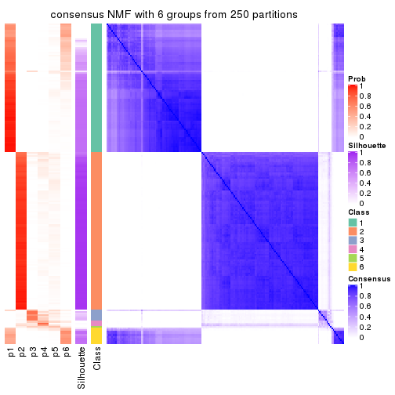</p>

</div>
</div>

Heatmaps for the membership of samples in all partitions to see how consistent they are:


<script>
$( function() {
	$( '#tabs-CV-NMF-membership-heatmap' ).tabs();
} );
</script>
<div id='tabs-CV-NMF-membership-heatmap'>
<ul>
<li><a href='#tab-CV-NMF-membership-heatmap-1'>k = 2</a></li>
<li><a href='#tab-CV-NMF-membership-heatmap-2'>k = 3</a></li>
<li><a href='#tab-CV-NMF-membership-heatmap-3'>k = 4</a></li>
<li><a href='#tab-CV-NMF-membership-heatmap-4'>k = 5</a></li>
<li><a href='#tab-CV-NMF-membership-heatmap-5'>k = 6</a></li>
</ul>
<div id='tab-CV-NMF-membership-heatmap-1'>
<pre><code class="r">membership_heatmap(res, k = 2)
</code></pre>

<p></p>

</div>
<div id='tab-CV-NMF-membership-heatmap-2'>
<pre><code class="r">membership_heatmap(res, k = 3)
</code></pre>

<p></p>

</div>
<div id='tab-CV-NMF-membership-heatmap-3'>
<pre><code class="r">membership_heatmap(res, k = 4)
</code></pre>

<p></p>

</div>
<div id='tab-CV-NMF-membership-heatmap-4'>
<pre><code class="r">membership_heatmap(res, k = 5)
</code></pre>

<p></p>

</div>
<div id='tab-CV-NMF-membership-heatmap-5'>
<pre><code class="r">membership_heatmap(res, k = 6)
</code></pre>

<p></p>

</div>
</div>

As soon as we have had the classes for columns, we can look for signatures
which are significantly different between classes which can be candidate marks
for certain classes. Following are the heatmaps for signatures.


Signature heatmaps where rows are scaled:


<script>
$( function() {
	$( '#tabs-CV-NMF-get-signatures' ).tabs();
} );
</script>
<div id='tabs-CV-NMF-get-signatures'>
<ul>
<li><a href='#tab-CV-NMF-get-signatures-1'>k = 2</a></li>
<li><a href='#tab-CV-NMF-get-signatures-2'>k = 3</a></li>
<li><a href='#tab-CV-NMF-get-signatures-3'>k = 4</a></li>
<li><a href='#tab-CV-NMF-get-signatures-4'>k = 5</a></li>
<li><a href='#tab-CV-NMF-get-signatures-5'>k = 6</a></li>
</ul>
<div id='tab-CV-NMF-get-signatures-1'>
<pre><code class="r">get_signatures(res, k = 2)
</code></pre>

<p></p>

</div>
<div id='tab-CV-NMF-get-signatures-2'>
<pre><code class="r">get_signatures(res, k = 3)
</code></pre>

<p></p>

</div>
<div id='tab-CV-NMF-get-signatures-3'>
<pre><code class="r">get_signatures(res, k = 4)
</code></pre>

<p></p>

</div>
<div id='tab-CV-NMF-get-signatures-4'>
<pre><code class="r">get_signatures(res, k = 5)
</code></pre>

<p></p>

</div>
<div id='tab-CV-NMF-get-signatures-5'>
<pre><code class="r">get_signatures(res, k = 6)
</code></pre>

<p></p>

</div>
</div>


Signature heatmaps where rows are not scaled:


<script>
$( function() {
	$( '#tabs-CV-NMF-get-signatures-no-scale' ).tabs();
} );
</script>
<div id='tabs-CV-NMF-get-signatures-no-scale'>
<ul>
<li><a href='#tab-CV-NMF-get-signatures-no-scale-1'>k = 2</a></li>
<li><a href='#tab-CV-NMF-get-signatures-no-scale-2'>k = 3</a></li>
<li><a href='#tab-CV-NMF-get-signatures-no-scale-3'>k = 4</a></li>
<li><a href='#tab-CV-NMF-get-signatures-no-scale-4'>k = 5</a></li>
<li><a href='#tab-CV-NMF-get-signatures-no-scale-5'>k = 6</a></li>
</ul>
<div id='tab-CV-NMF-get-signatures-no-scale-1'>
<pre><code class="r">get_signatures(res, k = 2, scale_rows = FALSE)
</code></pre>

<p></p>

</div>
<div id='tab-CV-NMF-get-signatures-no-scale-2'>
<pre><code class="r">get_signatures(res, k = 3, scale_rows = FALSE)
</code></pre>

<p></p>

</div>
<div id='tab-CV-NMF-get-signatures-no-scale-3'>
<pre><code class="r">get_signatures(res, k = 4, scale_rows = FALSE)
</code></pre>

<p></p>

</div>
<div id='tab-CV-NMF-get-signatures-no-scale-4'>
<pre><code class="r">get_signatures(res, k = 5, scale_rows = FALSE)
</code></pre>

<p></p>

</div>
<div id='tab-CV-NMF-get-signatures-no-scale-5'>
<pre><code class="r">get_signatures(res, k = 6, scale_rows = FALSE)
</code></pre>

<p>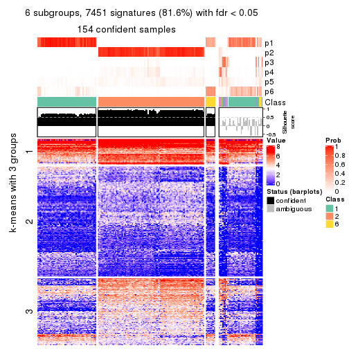</p>

</div>
</div>


Compare the overlap of signatures from different k:

```r
compare_signatures(res)
```


`get_signature()` returns a data frame invisibly. TO get the list of signatures, the function
call should be assigned to a variable explicitly. In following code, if `plot` argument is set
to `FALSE`, no heatmap is plotted while only the differential analysis is performed.

```r
# code only for demonstration
tb = get_signature(res, k = ..., plot = FALSE)
```

An example of the output of `tb` is:

```
#>   which_row         fdr    mean_1    mean_2 scaled_mean_1 scaled_mean_2 km
#> 1        38 0.042760348  8.373488  9.131774    -0.5533452     0.5164555  1
#> 2        40 0.018707592  7.106213  8.469186    -0.6173731     0.5762149  1
#> 3        55 0.019134737 10.221463 11.207825    -0.6159697     0.5749050  1
#> 4        59 0.006059896  5.921854  7.869574    -0.6899429     0.6439467  1
#> 5        60 0.018055526  8.928898 10.211722    -0.6204761     0.5791110  1
#> 6        98 0.009384629 15.714769 14.887706     0.6635654    -0.6193277  2
...
```

The columns in `tb` are:

1. `which_row`: row indices corresponding to the input matrix.
2. `fdr`: FDR for the differential test. 
3. `mean_x`: The mean value in group x.
4. `scaled_mean_x`: The mean value in group x after rows are scaled.
5. `km`: Row groups if k-means clustering is applied to rows.


UMAP plot which shows how samples are separated.


<script>
$( function() {
	$( '#tabs-CV-NMF-dimension-reduction' ).tabs();
} );
</script>
<div id='tabs-CV-NMF-dimension-reduction'>
<ul>
<li><a href='#tab-CV-NMF-dimension-reduction-1'>k = 2</a></li>
<li><a href='#tab-CV-NMF-dimension-reduction-2'>k = 3</a></li>
<li><a href='#tab-CV-NMF-dimension-reduction-3'>k = 4</a></li>
<li><a href='#tab-CV-NMF-dimension-reduction-4'>k = 5</a></li>
<li><a href='#tab-CV-NMF-dimension-reduction-5'>k = 6</a></li>
</ul>
<div id='tab-CV-NMF-dimension-reduction-1'>
<pre><code class="r">dimension_reduction(res, k = 2, method = &quot;UMAP&quot;)
</code></pre>

<p></p>

</div>
<div id='tab-CV-NMF-dimension-reduction-2'>
<pre><code class="r">dimension_reduction(res, k = 3, method = &quot;UMAP&quot;)
</code></pre>

<p></p>

</div>
<div id='tab-CV-NMF-dimension-reduction-3'>
<pre><code class="r">dimension_reduction(res, k = 4, method = &quot;UMAP&quot;)
</code></pre>

<p></p>

</div>
<div id='tab-CV-NMF-dimension-reduction-4'>
<pre><code class="r">dimension_reduction(res, k = 5, method = &quot;UMAP&quot;)
</code></pre>

<p></p>

</div>
<div id='tab-CV-NMF-dimension-reduction-5'>
<pre><code class="r">dimension_reduction(res, k = 6, method = &quot;UMAP&quot;)
</code></pre>

<p></p>

</div>
</div>


Following heatmap shows how subgroups are split when increasing `k`:

```r
collect_classes(res)
```


If matrix rows can be associated to genes, consider to use `functional_enrichment(res,
...)` to perform function enrichment for the signature genes. See [this vignette](http://bioconductor.org/packages/devel/bioc/vignettes/cola/inst/doc/functional_enrichment.html) for more detailed explanations.


 

---------------------------------------------------


### MAD:hclust**


The object with results only for a single top-value method and a single partition method 
can be extracted as:

```r
res = res_list["MAD", "hclust"]
# you can also extract it by
# res = res_list["MAD:hclust"]
```

A summary of `res` and all the functions that can be applied to it:

```r
res
```

```
#> A 'ConsensusPartition' object with k = 2, 3, 4, 5, 6.
#>   On a matrix with 9126 rows and 192 columns.
#>   Top rows (913, 1826, 2738, 3650, 4563) are extracted by 'MAD' method.
#>   Subgroups are detected by 'hclust' method.
#>   Performed in total 1250 partitions by row resampling.
#>   Best k for subgroups seems to be 3.
#> 
#> Following methods can be applied to this 'ConsensusPartition' object:
#>  [1] "cola_report"             "collect_classes"         "collect_plots"          
#>  [4] "collect_stats"           "colnames"                "compare_signatures"     
#>  [7] "consensus_heatmap"       "dimension_reduction"     "functional_enrichment"  
#> [10] "get_anno_col"            "get_anno"                "get_classes"            
#> [13] "get_consensus"           "get_matrix"              "get_membership"         
#> [16] "get_param"               "get_signatures"          "get_stats"              
#> [19] "is_best_k"               "is_stable_k"             "membership_heatmap"     
#> [22] "ncol"                    "nrow"                    "plot_ecdf"              
#> [25] "rownames"                "select_partition_number" "show"                   
#> [28] "suggest_best_k"          "test_to_known_factors"
```

`collect_plots()` function collects all the plots made from `res` for all `k` (number of partitions)
into one single page to provide an easy and fast comparison between different `k`.

```r
collect_plots(res)
```


The plots are:

- The first row: a plot of the ECDF (empirical cumulative distribution
  function) curves of the consensus matrix for each `k` and the heatmap of
  predicted classes for each `k`.
- The second row: heatmaps of the consensus matrix for each `k`.
- The third row: heatmaps of the membership matrix for each `k`.
- The fouth row: heatmaps of the signatures for each `k`.

All the plots in panels can be made by individual functions and they are
plotted later in this section.

`select_partition_number()` produces several plots showing different
statistics for choosing "optimized" `k`. There are following statistics:

- ECDF curves of the consensus matrix for each `k`;
- 1-PAC. [The PAC
  score](https://en.wikipedia.org/wiki/Consensus_clustering#Over-interpretation_potential_of_consensus_clustering)
  measures the proportion of the ambiguous subgrouping.
- Mean silhouette score.
- Concordance. The mean probability of fiting the consensus class ids in all
  partitions.
- Area increased. Denote $A_k$ as the area under the ECDF curve for current
  `k`, the area increased is defined as $A_k - A_{k-1}$.
- Rand index. The percent of pairs of samples that are both in a same cluster
  or both are not in a same cluster in the partition of k and k-1.
- Jaccard index. The ratio of pairs of samples are both in a same cluster in
  the partition of k and k-1 and the pairs of samples are both in a same
  cluster in the partition k or k-1.

The detailed explanations of these statistics can be found in [the _cola_
vignette](http://bioconductor.org/packages/devel/bioc/vignettes/cola/inst/doc/cola.html#toc_13).

Generally speaking, lower PAC score, higher mean silhouette score or higher
concordance corresponds to better partition. Rand index and Jaccard index
measure how similar the current partition is compared to partition with `k-1`.
If they are too similar, we won't accept `k` is better than `k-1`.

```r
select_partition_number(res)
```


The numeric values for all these statistics can be obtained by `get_stats()`.

```r
get_stats(res)
```

```
#>   k 1-PAC mean_silhouette concordance area_increased  Rand Jaccard
#> 2 2 1.000           0.998       0.999         0.5005 0.500   0.500
#> 3 3 1.000           0.995       0.998         0.0524 0.973   0.946
#> 4 4 1.000           0.975       0.991         0.0333 0.984   0.965
#> 5 5 1.000           0.968       0.988         0.0179 0.984   0.965
#> 6 6 0.994           0.963       0.991         0.0113 0.994   0.988
```

`suggest_best_k()` suggests the best $k$ based on these statistics. The rules are as follows:

- All $k$ with Jaccard index larger than 0.95 are removed because increasing
  $k$ does not provide enough extra information. If all $k$ are removed, it is
  marked as no subgroup is detected.
- For all $k$ with 1-PAC score larger than 0.9, the maximal $k$ is taken as
  the best $k$, and other $k$ are marked as optional $k$.
- If it does not fit the second rule. The $k$ with the maximal vote of the
  highest 1-PAC score, highest mean silhouette, and highest concordance is
  taken as the best $k$.

```r
suggest_best_k(res)
```

```
#> [1] 3
#> attr(,"optional")
#> [1] 2
```

There is also optional best $k$ = 2 that is worth to check.

Following shows the table of the partitions (You need to click the **show/hide
code output** link to see it). The membership matrix (columns with name `p*`)
is inferred by
[`clue::cl_consensus()`](https://www.rdocumentation.org/link/cl_consensus?package=clue)
function with the `SE` method. Basically the value in the membership matrix
represents the probability to belong to a certain group. The finall class
label for an item is determined with the group with highest probability it
belongs to.

In `get_classes()` function, the entropy is calculated from the membership
matrix and the silhouette score is calculated from the consensus matrix.


<script>
$( function() {
	$( '#tabs-MAD-hclust-get-classes' ).tabs();
} );
</script>
<div id='tabs-MAD-hclust-get-classes'>
<ul>
<li><a href='#tab-MAD-hclust-get-classes-1'>k = 2</a></li>
<li><a href='#tab-MAD-hclust-get-classes-2'>k = 3</a></li>
<li><a href='#tab-MAD-hclust-get-classes-3'>k = 4</a></li>
<li><a href='#tab-MAD-hclust-get-classes-4'>k = 5</a></li>
<li><a href='#tab-MAD-hclust-get-classes-5'>k = 6</a></li>
</ul>

<div id='tab-MAD-hclust-get-classes-1'>
<p><a id='tab-MAD-hclust-get-classes-1-a' style='color:#0366d6' href='#'>show/hide code output</a></p>
<pre><code class="r">cbind(get_classes(res, k = 2), get_membership(res, k = 2))
</code></pre>

<pre><code>#&gt;            class entropy silhouette    p1    p2
#&gt; SRR2074921     1  0.0000      1.000 1.000 0.000
#&gt; SRR2074919     1  0.0000      1.000 1.000 0.000
#&gt; SRR2074920     1  0.0000      1.000 1.000 0.000
#&gt; SRR2074917     1  0.0000      1.000 1.000 0.000
#&gt; SRR2074918     2  0.0376      0.995 0.004 0.996
#&gt; SRR2074916     2  0.0000      0.999 0.000 1.000
#&gt; SRR2074915     2  0.0000      0.999 0.000 1.000
#&gt; SRR2074914     1  0.0000      1.000 1.000 0.000
#&gt; SRR2074913     2  0.0000      0.999 0.000 1.000
#&gt; SRR2074912     1  0.0000      1.000 1.000 0.000
#&gt; SRR2074911     2  0.0000      0.999 0.000 1.000
#&gt; SRR2074910     2  0.0000      0.999 0.000 1.000
#&gt; SRR2074909     1  0.0000      1.000 1.000 0.000
#&gt; SRR2074907     1  0.0000      1.000 1.000 0.000
#&gt; SRR2074908     2  0.0000      0.999 0.000 1.000
#&gt; SRR2074906     2  0.0000      0.999 0.000 1.000
#&gt; SRR2074905     1  0.0000      1.000 1.000 0.000
#&gt; SRR2074904     2  0.0000      0.999 0.000 1.000
#&gt; SRR2074903     2  0.0000      0.999 0.000 1.000
#&gt; SRR2074902     1  0.0000      1.000 1.000 0.000
#&gt; SRR2074901     2  0.0000      0.999 0.000 1.000
#&gt; SRR2074900     1  0.0000      1.000 1.000 0.000
#&gt; SRR2074899     2  0.0000      0.999 0.000 1.000
#&gt; SRR2074898     2  0.0000      0.999 0.000 1.000
#&gt; SRR2074897     2  0.0000      0.999 0.000 1.000
#&gt; SRR2074896     2  0.0000      0.999 0.000 1.000
#&gt; SRR2074895     1  0.0000      1.000 1.000 0.000
#&gt; SRR2074894     2  0.1633      0.975 0.024 0.976
#&gt; SRR2074893     2  0.0000      0.999 0.000 1.000
#&gt; SRR2074892     1  0.0000      1.000 1.000 0.000
#&gt; SRR2074891     1  0.0000      1.000 1.000 0.000
#&gt; SRR2074890     2  0.0000      0.999 0.000 1.000
#&gt; SRR2074887     2  0.0000      0.999 0.000 1.000
#&gt; SRR2074889     2  0.0000      0.999 0.000 1.000
#&gt; SRR2074886     2  0.0000      0.999 0.000 1.000
#&gt; SRR2074888     2  0.0000      0.999 0.000 1.000
#&gt; SRR2074885     1  0.0000      1.000 1.000 0.000
#&gt; SRR2074884     2  0.0000      0.999 0.000 1.000
#&gt; SRR2074883     2  0.0000      0.999 0.000 1.000
#&gt; SRR2074882     1  0.0000      1.000 1.000 0.000
#&gt; SRR2074880     2  0.0000      0.999 0.000 1.000
#&gt; SRR2074881     2  0.0000      0.999 0.000 1.000
#&gt; SRR2074879     1  0.0000      1.000 1.000 0.000
#&gt; SRR2074878     1  0.0000      1.000 1.000 0.000
#&gt; SRR2074877     2  0.0000      0.999 0.000 1.000
#&gt; SRR2074876     1  0.0000      1.000 1.000 0.000
#&gt; SRR2074875     2  0.0000      0.999 0.000 1.000
#&gt; SRR2074874     1  0.0000      1.000 1.000 0.000
#&gt; SRR2074873     2  0.0000      0.999 0.000 1.000
#&gt; SRR2074872     1  0.0000      1.000 1.000 0.000
#&gt; SRR2074871     2  0.0000      0.999 0.000 1.000
#&gt; SRR2074870     1  0.0000      1.000 1.000 0.000
#&gt; SRR2074869     1  0.0000      1.000 1.000 0.000
#&gt; SRR2074868     1  0.0000      1.000 1.000 0.000
#&gt; SRR2074867     2  0.0000      0.999 0.000 1.000
#&gt; SRR2074866     2  0.0000      0.999 0.000 1.000
#&gt; SRR2074865     1  0.0000      1.000 1.000 0.000
#&gt; SRR2074864     1  0.0000      1.000 1.000 0.000
#&gt; SRR2074863     1  0.0000      1.000 1.000 0.000
#&gt; SRR2074862     1  0.0000      1.000 1.000 0.000
#&gt; SRR2074861     1  0.0000      1.000 1.000 0.000
#&gt; SRR2074860     1  0.0000      1.000 1.000 0.000
#&gt; SRR2074859     1  0.0000      1.000 1.000 0.000
#&gt; SRR2074858     2  0.0000      0.999 0.000 1.000
#&gt; SRR2074855     2  0.0000      0.999 0.000 1.000
#&gt; SRR2074857     1  0.0000      1.000 1.000 0.000
#&gt; SRR2074856     1  0.0000      1.000 1.000 0.000
#&gt; SRR2074854     1  0.0000      1.000 1.000 0.000
#&gt; SRR2074853     1  0.0000      1.000 1.000 0.000
#&gt; SRR2074852     2  0.0000      0.999 0.000 1.000
#&gt; SRR2074851     1  0.0000      1.000 1.000 0.000
#&gt; SRR2074850     1  0.0000      1.000 1.000 0.000
#&gt; SRR2074849     1  0.0000      1.000 1.000 0.000
#&gt; SRR2074848     1  0.0000      1.000 1.000 0.000
#&gt; SRR2074847     1  0.0000      1.000 1.000 0.000
#&gt; SRR2074846     1  0.0000      1.000 1.000 0.000
#&gt; SRR2074845     1  0.0000      1.000 1.000 0.000
#&gt; SRR2074843     1  0.0000      1.000 1.000 0.000
#&gt; SRR2074842     2  0.0000      0.999 0.000 1.000
#&gt; SRR2074844     2  0.0000      0.999 0.000 1.000
#&gt; SRR2074841     2  0.0000      0.999 0.000 1.000
#&gt; SRR2074840     2  0.0000      0.999 0.000 1.000
#&gt; SRR2074839     1  0.0000      1.000 1.000 0.000
#&gt; SRR2074838     2  0.0000      0.999 0.000 1.000
#&gt; SRR2074836     2  0.0000      0.999 0.000 1.000
#&gt; SRR2074835     2  0.0000      0.999 0.000 1.000
#&gt; SRR2074837     1  0.0000      1.000 1.000 0.000
#&gt; SRR2074834     2  0.0000      0.999 0.000 1.000
#&gt; SRR2074833     1  0.0000      1.000 1.000 0.000
#&gt; SRR2074832     2  0.0000      0.999 0.000 1.000
#&gt; SRR2074831     1  0.0000      1.000 1.000 0.000
#&gt; SRR2074829     1  0.0000      1.000 1.000 0.000
#&gt; SRR2074830     1  0.0000      1.000 1.000 0.000
#&gt; SRR2074828     1  0.0000      1.000 1.000 0.000
#&gt; SRR2074827     2  0.0000      0.999 0.000 1.000
#&gt; SRR2074826     2  0.0000      0.999 0.000 1.000
#&gt; SRR2074825     2  0.0000      0.999 0.000 1.000
#&gt; SRR2074824     2  0.0000      0.999 0.000 1.000
#&gt; SRR2074823     1  0.0000      1.000 1.000 0.000
#&gt; SRR2074822     2  0.0000      0.999 0.000 1.000
#&gt; SRR2074821     2  0.0000      0.999 0.000 1.000
#&gt; SRR2074820     2  0.0000      0.999 0.000 1.000
#&gt; SRR2074819     2  0.0000      0.999 0.000 1.000
#&gt; SRR2074817     2  0.0000      0.999 0.000 1.000
#&gt; SRR2074818     2  0.0000      0.999 0.000 1.000
#&gt; SRR2074816     1  0.0000      1.000 1.000 0.000
#&gt; SRR2074815     2  0.0000      0.999 0.000 1.000
#&gt; SRR2074814     1  0.0000      1.000 1.000 0.000
#&gt; SRR2074812     2  0.0000      0.999 0.000 1.000
#&gt; SRR2074813     2  0.0000      0.999 0.000 1.000
#&gt; SRR2074809     2  0.0000      0.999 0.000 1.000
#&gt; SRR2074810     2  0.0000      0.999 0.000 1.000
#&gt; SRR2074811     2  0.0000      0.999 0.000 1.000
#&gt; SRR2074808     2  0.0000      0.999 0.000 1.000
#&gt; SRR2074807     2  0.0000      0.999 0.000 1.000
#&gt; SRR2074806     1  0.0000      1.000 1.000 0.000
#&gt; SRR2074805     2  0.0000      0.999 0.000 1.000
#&gt; SRR2074804     1  0.0000      1.000 1.000 0.000
#&gt; SRR2074803     1  0.0000      1.000 1.000 0.000
#&gt; SRR2074801     1  0.0000      1.000 1.000 0.000
#&gt; SRR2074802     2  0.0000      0.999 0.000 1.000
#&gt; SRR2074799     2  0.0000      0.999 0.000 1.000
#&gt; SRR2074800     1  0.0000      1.000 1.000 0.000
#&gt; SRR2074798     1  0.0000      1.000 1.000 0.000
#&gt; SRR2074797     1  0.0000      1.000 1.000 0.000
#&gt; SRR2074795     2  0.0000      0.999 0.000 1.000
#&gt; SRR2074796     2  0.0000      0.999 0.000 1.000
#&gt; SRR2074794     2  0.0000      0.999 0.000 1.000
#&gt; SRR2074793     2  0.0000      0.999 0.000 1.000
#&gt; SRR2074792     1  0.0000      1.000 1.000 0.000
#&gt; SRR2074791     1  0.0000      1.000 1.000 0.000
#&gt; SRR2074790     2  0.0000      0.999 0.000 1.000
#&gt; SRR2074789     1  0.0000      1.000 1.000 0.000
#&gt; SRR2074788     1  0.0000      1.000 1.000 0.000
#&gt; SRR2074787     1  0.0000      1.000 1.000 0.000
#&gt; SRR2074786     2  0.0000      0.999 0.000 1.000
#&gt; SRR2074785     1  0.0000      1.000 1.000 0.000
#&gt; SRR2074784     1  0.0000      1.000 1.000 0.000
#&gt; SRR2074783     2  0.0000      0.999 0.000 1.000
#&gt; SRR2074782     1  0.0000      1.000 1.000 0.000
#&gt; SRR2074779     2  0.0000      0.999 0.000 1.000
#&gt; SRR2074781     2  0.0000      0.999 0.000 1.000
#&gt; SRR2074780     1  0.0000      1.000 1.000 0.000
#&gt; SRR2074778     2  0.0000      0.999 0.000 1.000
#&gt; SRR2074777     2  0.0000      0.999 0.000 1.000
#&gt; SRR2074776     2  0.0000      0.999 0.000 1.000
#&gt; SRR2074775     1  0.0000      1.000 1.000 0.000
#&gt; SRR2074774     1  0.0000      1.000 1.000 0.000
#&gt; SRR2074773     2  0.0000      0.999 0.000 1.000
#&gt; SRR2074771     2  0.0000      0.999 0.000 1.000
#&gt; SRR2074772     1  0.0000      1.000 1.000 0.000
#&gt; SRR2074770     1  0.0000      1.000 1.000 0.000
#&gt; SRR2074769     2  0.0000      0.999 0.000 1.000
#&gt; SRR2074768     2  0.0000      0.999 0.000 1.000
#&gt; SRR2074766     2  0.0000      0.999 0.000 1.000
#&gt; SRR2074767     1  0.0000      1.000 1.000 0.000
#&gt; SRR2074765     1  0.0000      1.000 1.000 0.000
#&gt; SRR2074764     2  0.0000      0.999 0.000 1.000
#&gt; SRR2074763     2  0.0000      0.999 0.000 1.000
#&gt; SRR2074761     1  0.0000      1.000 1.000 0.000
#&gt; SRR2074762     2  0.0000      0.999 0.000 1.000
#&gt; SRR2074760     2  0.0000      0.999 0.000 1.000
#&gt; SRR2074759     1  0.0000      1.000 1.000 0.000
#&gt; SRR2074757     2  0.0000      0.999 0.000 1.000
#&gt; SRR2074758     2  0.0000      0.999 0.000 1.000
#&gt; SRR2074756     2  0.0000      0.999 0.000 1.000
#&gt; SRR2074755     1  0.0000      1.000 1.000 0.000
#&gt; SRR2074754     1  0.0000      1.000 1.000 0.000
#&gt; SRR2074753     2  0.0000      0.999 0.000 1.000
#&gt; SRR2074752     1  0.0000      1.000 1.000 0.000
#&gt; SRR2074751     1  0.0000      1.000 1.000 0.000
#&gt; SRR2074749     2  0.0000      0.999 0.000 1.000
#&gt; SRR2074750     1  0.0000      1.000 1.000 0.000
#&gt; SRR2074748     1  0.0000      1.000 1.000 0.000
#&gt; SRR2074747     2  0.0000      0.999 0.000 1.000
#&gt; SRR2074745     1  0.0000      1.000 1.000 0.000
#&gt; SRR2074746     2  0.5059      0.874 0.112 0.888
#&gt; SRR2074744     2  0.0000      0.999 0.000 1.000
#&gt; SRR2074743     2  0.0000      0.999 0.000 1.000
#&gt; SRR2074742     2  0.0376      0.995 0.004 0.996
#&gt; SRR2074741     1  0.0000      1.000 1.000 0.000
#&gt; SRR2074740     2  0.0000      0.999 0.000 1.000
#&gt; SRR2074739     1  0.0000      1.000 1.000 0.000
#&gt; SRR2074738     2  0.0000      0.999 0.000 1.000
#&gt; SRR2074737     2  0.0000      0.999 0.000 1.000
#&gt; SRR2074736     2  0.0000      0.999 0.000 1.000
#&gt; SRR2074735     1  0.0000      1.000 1.000 0.000
#&gt; SRR2074734     2  0.0000      0.999 0.000 1.000
#&gt; SRR2074733     1  0.0000      1.000 1.000 0.000
#&gt; SRR2074732     2  0.0000      0.999 0.000 1.000
#&gt; SRR2074731     2  0.0000      0.999 0.000 1.000
#&gt; SRR2074730     1  0.0000      1.000 1.000 0.000
</code></pre>

<script>
$('#tab-MAD-hclust-get-classes-1-a').parent().next().next().hide();
$('#tab-MAD-hclust-get-classes-1-a').click(function(){
  $('#tab-MAD-hclust-get-classes-1-a').parent().next().next().toggle();
  return(false);
});
</script>
</div>

<div id='tab-MAD-hclust-get-classes-2'>
<p><a id='tab-MAD-hclust-get-classes-2-a' style='color:#0366d6' href='#'>show/hide code output</a></p>
<pre><code class="r">cbind(get_classes(res, k = 3), get_membership(res, k = 3))
</code></pre>

<pre><code>#&gt;            class entropy silhouette    p1    p2    p3
#&gt; SRR2074921     3  0.0000      0.951 0.000 0.000 1.000
#&gt; SRR2074919     3  0.0000      0.951 0.000 0.000 1.000
#&gt; SRR2074920     3  0.0000      0.951 0.000 0.000 1.000
#&gt; SRR2074917     3  0.5058      0.677 0.244 0.000 0.756
#&gt; SRR2074918     2  0.0237      0.994 0.000 0.996 0.004
#&gt; SRR2074916     2  0.0000      0.998 0.000 1.000 0.000
#&gt; SRR2074915     2  0.0000      0.998 0.000 1.000 0.000
#&gt; SRR2074914     1  0.0000      1.000 1.000 0.000 0.000
#&gt; SRR2074913     2  0.0000      0.998 0.000 1.000 0.000
#&gt; SRR2074912     3  0.0000      0.951 0.000 0.000 1.000
#&gt; SRR2074911     2  0.0000      0.998 0.000 1.000 0.000
#&gt; SRR2074910     2  0.0000      0.998 0.000 1.000 0.000
#&gt; SRR2074909     1  0.0000      1.000 1.000 0.000 0.000
#&gt; SRR2074907     1  0.0000      1.000 1.000 0.000 0.000
#&gt; SRR2074908     2  0.0000      0.998 0.000 1.000 0.000
#&gt; SRR2074906     2  0.0000      0.998 0.000 1.000 0.000
#&gt; SRR2074905     1  0.0000      1.000 1.000 0.000 0.000
#&gt; SRR2074904     2  0.0000      0.998 0.000 1.000 0.000
#&gt; SRR2074903     2  0.0000      0.998 0.000 1.000 0.000
#&gt; SRR2074902     1  0.0000      1.000 1.000 0.000 0.000
#&gt; SRR2074901     2  0.0000      0.998 0.000 1.000 0.000
#&gt; SRR2074900     1  0.0000      1.000 1.000 0.000 0.000
#&gt; SRR2074899     2  0.0000      0.998 0.000 1.000 0.000
#&gt; SRR2074898     2  0.0000      0.998 0.000 1.000 0.000
#&gt; SRR2074897     2  0.0000      0.998 0.000 1.000 0.000
#&gt; SRR2074896     2  0.0000      0.998 0.000 1.000 0.000
#&gt; SRR2074895     1  0.0000      1.000 1.000 0.000 0.000
#&gt; SRR2074894     2  0.1031      0.967 0.024 0.976 0.000
#&gt; SRR2074893     2  0.0000      0.998 0.000 1.000 0.000
#&gt; SRR2074892     1  0.0000      1.000 1.000 0.000 0.000
#&gt; SRR2074891     1  0.0000      1.000 1.000 0.000 0.000
#&gt; SRR2074890     2  0.0000      0.998 0.000 1.000 0.000
#&gt; SRR2074887     2  0.0000      0.998 0.000 1.000 0.000
#&gt; SRR2074889     2  0.0000      0.998 0.000 1.000 0.000
#&gt; SRR2074886     2  0.0000      0.998 0.000 1.000 0.000
#&gt; SRR2074888     2  0.0000      0.998 0.000 1.000 0.000
#&gt; SRR2074885     1  0.0000      1.000 1.000 0.000 0.000
#&gt; SRR2074884     2  0.0000      0.998 0.000 1.000 0.000
#&gt; SRR2074883     2  0.0000      0.998 0.000 1.000 0.000
#&gt; SRR2074882     1  0.0000      1.000 1.000 0.000 0.000
#&gt; SRR2074880     2  0.0000      0.998 0.000 1.000 0.000
#&gt; SRR2074881     2  0.0000      0.998 0.000 1.000 0.000
#&gt; SRR2074879     3  0.0000      0.951 0.000 0.000 1.000
#&gt; SRR2074878     1  0.0000      1.000 1.000 0.000 0.000
#&gt; SRR2074877     2  0.0000      0.998 0.000 1.000 0.000
#&gt; SRR2074876     1  0.0000      1.000 1.000 0.000 0.000
#&gt; SRR2074875     2  0.0000      0.998 0.000 1.000 0.000
#&gt; SRR2074874     1  0.0000      1.000 1.000 0.000 0.000
#&gt; SRR2074873     2  0.0000      0.998 0.000 1.000 0.000
#&gt; SRR2074872     1  0.0000      1.000 1.000 0.000 0.000
#&gt; SRR2074871     2  0.0000      0.998 0.000 1.000 0.000
#&gt; SRR2074870     1  0.0000      1.000 1.000 0.000 0.000
#&gt; SRR2074869     1  0.0000      1.000 1.000 0.000 0.000
#&gt; SRR2074868     1  0.0000      1.000 1.000 0.000 0.000
#&gt; SRR2074867     2  0.0000      0.998 0.000 1.000 0.000
#&gt; SRR2074866     2  0.0000      0.998 0.000 1.000 0.000
#&gt; SRR2074865     1  0.0000      1.000 1.000 0.000 0.000
#&gt; SRR2074864     1  0.0000      1.000 1.000 0.000 0.000
#&gt; SRR2074863     1  0.0000      1.000 1.000 0.000 0.000
#&gt; SRR2074862     1  0.0000      1.000 1.000 0.000 0.000
#&gt; SRR2074861     1  0.0000      1.000 1.000 0.000 0.000
#&gt; SRR2074860     1  0.0592      0.987 0.988 0.000 0.012
#&gt; SRR2074859     1  0.0000      1.000 1.000 0.000 0.000
#&gt; SRR2074858     2  0.0000      0.998 0.000 1.000 0.000
#&gt; SRR2074855     2  0.0000      0.998 0.000 1.000 0.000
#&gt; SRR2074857     1  0.0000      1.000 1.000 0.000 0.000
#&gt; SRR2074856     1  0.0000      1.000 1.000 0.000 0.000
#&gt; SRR2074854     1  0.0000      1.000 1.000 0.000 0.000
#&gt; SRR2074853     1  0.0000      1.000 1.000 0.000 0.000
#&gt; SRR2074852     2  0.0000      0.998 0.000 1.000 0.000
#&gt; SRR2074851     1  0.0000      1.000 1.000 0.000 0.000
#&gt; SRR2074850     1  0.0000      1.000 1.000 0.000 0.000
#&gt; SRR2074849     1  0.0000      1.000 1.000 0.000 0.000
#&gt; SRR2074848     1  0.0000      1.000 1.000 0.000 0.000
#&gt; SRR2074847     1  0.0000      1.000 1.000 0.000 0.000
#&gt; SRR2074846     1  0.0000      1.000 1.000 0.000 0.000
#&gt; SRR2074845     1  0.0000      1.000 1.000 0.000 0.000
#&gt; SRR2074843     1  0.0000      1.000 1.000 0.000 0.000
#&gt; SRR2074842     2  0.0000      0.998 0.000 1.000 0.000
#&gt; SRR2074844     2  0.0000      0.998 0.000 1.000 0.000
#&gt; SRR2074841     2  0.0000      0.998 0.000 1.000 0.000
#&gt; SRR2074840     2  0.0000      0.998 0.000 1.000 0.000
#&gt; SRR2074839     1  0.0000      1.000 1.000 0.000 0.000
#&gt; SRR2074838     2  0.0000      0.998 0.000 1.000 0.000
#&gt; SRR2074836     2  0.0000      0.998 0.000 1.000 0.000
#&gt; SRR2074835     2  0.0000      0.998 0.000 1.000 0.000
#&gt; SRR2074837     1  0.0000      1.000 1.000 0.000 0.000
#&gt; SRR2074834     2  0.0000      0.998 0.000 1.000 0.000
#&gt; SRR2074833     1  0.0000      1.000 1.000 0.000 0.000
#&gt; SRR2074832     2  0.0000      0.998 0.000 1.000 0.000
#&gt; SRR2074831     1  0.0000      1.000 1.000 0.000 0.000
#&gt; SRR2074829     1  0.0000      1.000 1.000 0.000 0.000
#&gt; SRR2074830     1  0.0000      1.000 1.000 0.000 0.000
#&gt; SRR2074828     1  0.0000      1.000 1.000 0.000 0.000
#&gt; SRR2074827     2  0.0000      0.998 0.000 1.000 0.000
#&gt; SRR2074826     2  0.0000      0.998 0.000 1.000 0.000
#&gt; SRR2074825     2  0.0000      0.998 0.000 1.000 0.000
#&gt; SRR2074824     2  0.0000      0.998 0.000 1.000 0.000
#&gt; SRR2074823     1  0.0000      1.000 1.000 0.000 0.000
#&gt; SRR2074822     2  0.0000      0.998 0.000 1.000 0.000
#&gt; SRR2074821     2  0.0000      0.998 0.000 1.000 0.000
#&gt; SRR2074820     2  0.0000      0.998 0.000 1.000 0.000
#&gt; SRR2074819     2  0.0000      0.998 0.000 1.000 0.000
#&gt; SRR2074817     2  0.0000      0.998 0.000 1.000 0.000
#&gt; SRR2074818     2  0.0000      0.998 0.000 1.000 0.000
#&gt; SRR2074816     1  0.0000      1.000 1.000 0.000 0.000
#&gt; SRR2074815     2  0.0000      0.998 0.000 1.000 0.000
#&gt; SRR2074814     1  0.0000      1.000 1.000 0.000 0.000
#&gt; SRR2074812     2  0.0000      0.998 0.000 1.000 0.000
#&gt; SRR2074813     2  0.0000      0.998 0.000 1.000 0.000
#&gt; SRR2074809     2  0.0000      0.998 0.000 1.000 0.000
#&gt; SRR2074810     2  0.0000      0.998 0.000 1.000 0.000
#&gt; SRR2074811     2  0.0000      0.998 0.000 1.000 0.000
#&gt; SRR2074808     2  0.0000      0.998 0.000 1.000 0.000
#&gt; SRR2074807     2  0.0000      0.998 0.000 1.000 0.000
#&gt; SRR2074806     1  0.0000      1.000 1.000 0.000 0.000
#&gt; SRR2074805     2  0.0000      0.998 0.000 1.000 0.000
#&gt; SRR2074804     1  0.0000      1.000 1.000 0.000 0.000
#&gt; SRR2074803     1  0.0000      1.000 1.000 0.000 0.000
#&gt; SRR2074801     1  0.0000      1.000 1.000 0.000 0.000
#&gt; SRR2074802     2  0.0000      0.998 0.000 1.000 0.000
#&gt; SRR2074799     2  0.0000      0.998 0.000 1.000 0.000
#&gt; SRR2074800     1  0.0000      1.000 1.000 0.000 0.000
#&gt; SRR2074798     1  0.0000      1.000 1.000 0.000 0.000
#&gt; SRR2074797     1  0.0000      1.000 1.000 0.000 0.000
#&gt; SRR2074795     2  0.0000      0.998 0.000 1.000 0.000
#&gt; SRR2074796     2  0.0000      0.998 0.000 1.000 0.000
#&gt; SRR2074794     2  0.0000      0.998 0.000 1.000 0.000
#&gt; SRR2074793     2  0.0000      0.998 0.000 1.000 0.000
#&gt; SRR2074792     1  0.0000      1.000 1.000 0.000 0.000
#&gt; SRR2074791     1  0.0000      1.000 1.000 0.000 0.000
#&gt; SRR2074790     2  0.0000      0.998 0.000 1.000 0.000
#&gt; SRR2074789     1  0.0000      1.000 1.000 0.000 0.000
#&gt; SRR2074788     1  0.0000      1.000 1.000 0.000 0.000
#&gt; SRR2074787     1  0.0000      1.000 1.000 0.000 0.000
#&gt; SRR2074786     2  0.0000      0.998 0.000 1.000 0.000
#&gt; SRR2074785     1  0.0000      1.000 1.000 0.000 0.000
#&gt; SRR2074784     1  0.0000      1.000 1.000 0.000 0.000
#&gt; SRR2074783     2  0.0000      0.998 0.000 1.000 0.000
#&gt; SRR2074782     1  0.0000      1.000 1.000 0.000 0.000
#&gt; SRR2074779     2  0.0000      0.998 0.000 1.000 0.000
#&gt; SRR2074781     2  0.0000      0.998 0.000 1.000 0.000
#&gt; SRR2074780     1  0.0000      1.000 1.000 0.000 0.000
#&gt; SRR2074778     2  0.0000      0.998 0.000 1.000 0.000
#&gt; SRR2074777     2  0.0000      0.998 0.000 1.000 0.000
#&gt; SRR2074776     2  0.0000      0.998 0.000 1.000 0.000
#&gt; SRR2074775     1  0.0000      1.000 1.000 0.000 0.000
#&gt; SRR2074774     1  0.0000      1.000 1.000 0.000 0.000
#&gt; SRR2074773     2  0.0000      0.998 0.000 1.000 0.000
#&gt; SRR2074771     2  0.0000      0.998 0.000 1.000 0.000
#&gt; SRR2074772     1  0.0000      1.000 1.000 0.000 0.000
#&gt; SRR2074770     1  0.0000      1.000 1.000 0.000 0.000
#&gt; SRR2074769     2  0.0000      0.998 0.000 1.000 0.000
#&gt; SRR2074768     2  0.0000      0.998 0.000 1.000 0.000
#&gt; SRR2074766     2  0.0000      0.998 0.000 1.000 0.000
#&gt; SRR2074767     1  0.0000      1.000 1.000 0.000 0.000
#&gt; SRR2074765     1  0.0000      1.000 1.000 0.000 0.000
#&gt; SRR2074764     2  0.0000      0.998 0.000 1.000 0.000
#&gt; SRR2074763     2  0.0000      0.998 0.000 1.000 0.000
#&gt; SRR2074761     1  0.0000      1.000 1.000 0.000 0.000
#&gt; SRR2074762     2  0.0000      0.998 0.000 1.000 0.000
#&gt; SRR2074760     2  0.0000      0.998 0.000 1.000 0.000
#&gt; SRR2074759     1  0.0000      1.000 1.000 0.000 0.000
#&gt; SRR2074757     2  0.0000      0.998 0.000 1.000 0.000
#&gt; SRR2074758     2  0.0000      0.998 0.000 1.000 0.000
#&gt; SRR2074756     2  0.0000      0.998 0.000 1.000 0.000
#&gt; SRR2074755     1  0.0000      1.000 1.000 0.000 0.000
#&gt; SRR2074754     1  0.0000      1.000 1.000 0.000 0.000
#&gt; SRR2074753     2  0.0000      0.998 0.000 1.000 0.000
#&gt; SRR2074752     1  0.0000      1.000 1.000 0.000 0.000
#&gt; SRR2074751     1  0.0000      1.000 1.000 0.000 0.000
#&gt; SRR2074749     2  0.0000      0.998 0.000 1.000 0.000
#&gt; SRR2074750     1  0.0000      1.000 1.000 0.000 0.000
#&gt; SRR2074748     1  0.0000      1.000 1.000 0.000 0.000
#&gt; SRR2074747     2  0.0000      0.998 0.000 1.000 0.000
#&gt; SRR2074745     1  0.0000      1.000 1.000 0.000 0.000
#&gt; SRR2074746     2  0.3192      0.838 0.112 0.888 0.000
#&gt; SRR2074744     2  0.0000      0.998 0.000 1.000 0.000
#&gt; SRR2074743     2  0.0000      0.998 0.000 1.000 0.000
#&gt; SRR2074742     2  0.0237      0.994 0.000 0.996 0.004
#&gt; SRR2074741     1  0.0000      1.000 1.000 0.000 0.000
#&gt; SRR2074740     2  0.0000      0.998 0.000 1.000 0.000
#&gt; SRR2074739     1  0.0000      1.000 1.000 0.000 0.000
#&gt; SRR2074738     2  0.0000      0.998 0.000 1.000 0.000
#&gt; SRR2074737     2  0.0000      0.998 0.000 1.000 0.000
#&gt; SRR2074736     2  0.0000      0.998 0.000 1.000 0.000
#&gt; SRR2074735     1  0.0000      1.000 1.000 0.000 0.000
#&gt; SRR2074734     2  0.0000      0.998 0.000 1.000 0.000
#&gt; SRR2074733     1  0.0000      1.000 1.000 0.000 0.000
#&gt; SRR2074732     2  0.0000      0.998 0.000 1.000 0.000
#&gt; SRR2074731     2  0.0000      0.998 0.000 1.000 0.000
#&gt; SRR2074730     1  0.0000      1.000 1.000 0.000 0.000
</code></pre>

<script>
$('#tab-MAD-hclust-get-classes-2-a').parent().next().next().hide();
$('#tab-MAD-hclust-get-classes-2-a').click(function(){
  $('#tab-MAD-hclust-get-classes-2-a').parent().next().next().toggle();
  return(false);
});
</script>
</div>

<div id='tab-MAD-hclust-get-classes-3'>
<p><a id='tab-MAD-hclust-get-classes-3-a' style='color:#0366d6' href='#'>show/hide code output</a></p>
<pre><code class="r">cbind(get_classes(res, k = 4), get_membership(res, k = 4))
</code></pre>

<pre><code>#&gt;            class entropy silhouette    p1    p2    p3    p4
#&gt; SRR2074921     3  0.0000      0.866 0.000 0.000 1.000 0.000
#&gt; SRR2074919     3  0.0000      0.866 0.000 0.000 1.000 0.000
#&gt; SRR2074920     3  0.0000      0.866 0.000 0.000 1.000 0.000
#&gt; SRR2074917     3  0.4008      0.407 0.244 0.000 0.756 0.000
#&gt; SRR2074918     4  0.2973      0.813 0.000 0.144 0.000 0.856
#&gt; SRR2074916     2  0.0000      0.988 0.000 1.000 0.000 0.000
#&gt; SRR2074915     2  0.0000      0.988 0.000 1.000 0.000 0.000
#&gt; SRR2074914     1  0.0000      1.000 1.000 0.000 0.000 0.000
#&gt; SRR2074913     2  0.1940      0.893 0.000 0.924 0.000 0.076
#&gt; SRR2074912     3  0.0000      0.866 0.000 0.000 1.000 0.000
#&gt; SRR2074911     4  0.4193      0.687 0.000 0.268 0.000 0.732
#&gt; SRR2074910     2  0.3975      0.610 0.000 0.760 0.000 0.240
#&gt; SRR2074909     1  0.0000      1.000 1.000 0.000 0.000 0.000
#&gt; SRR2074907     1  0.0000      1.000 1.000 0.000 0.000 0.000
#&gt; SRR2074908     2  0.0000      0.988 0.000 1.000 0.000 0.000
#&gt; SRR2074906     2  0.0000      0.988 0.000 1.000 0.000 0.000
#&gt; SRR2074905     1  0.0000      1.000 1.000 0.000 0.000 0.000
#&gt; SRR2074904     2  0.0000      0.988 0.000 1.000 0.000 0.000
#&gt; SRR2074903     2  0.0000      0.988 0.000 1.000 0.000 0.000
#&gt; SRR2074902     1  0.0000      1.000 1.000 0.000 0.000 0.000
#&gt; SRR2074901     2  0.0000      0.988 0.000 1.000 0.000 0.000
#&gt; SRR2074900     1  0.0000      1.000 1.000 0.000 0.000 0.000
#&gt; SRR2074899     2  0.0000      0.988 0.000 1.000 0.000 0.000
#&gt; SRR2074898     2  0.0000      0.988 0.000 1.000 0.000 0.000
#&gt; SRR2074897     2  0.0000      0.988 0.000 1.000 0.000 0.000
#&gt; SRR2074896     2  0.0000      0.988 0.000 1.000 0.000 0.000
#&gt; SRR2074895     1  0.0000      1.000 1.000 0.000 0.000 0.000
#&gt; SRR2074894     2  0.4744      0.556 0.024 0.736 0.000 0.240
#&gt; SRR2074893     2  0.0000      0.988 0.000 1.000 0.000 0.000
#&gt; SRR2074892     1  0.0000      1.000 1.000 0.000 0.000 0.000
#&gt; SRR2074891     1  0.0000      1.000 1.000 0.000 0.000 0.000
#&gt; SRR2074890     2  0.0000      0.988 0.000 1.000 0.000 0.000
#&gt; SRR2074887     2  0.0000      0.988 0.000 1.000 0.000 0.000
#&gt; SRR2074889     2  0.0000      0.988 0.000 1.000 0.000 0.000
#&gt; SRR2074886     2  0.0000      0.988 0.000 1.000 0.000 0.000
#&gt; SRR2074888     2  0.0000      0.988 0.000 1.000 0.000 0.000
#&gt; SRR2074885     1  0.0000      1.000 1.000 0.000 0.000 0.000
#&gt; SRR2074884     2  0.0000      0.988 0.000 1.000 0.000 0.000
#&gt; SRR2074883     2  0.0000      0.988 0.000 1.000 0.000 0.000
#&gt; SRR2074882     1  0.0000      1.000 1.000 0.000 0.000 0.000
#&gt; SRR2074880     2  0.0000      0.988 0.000 1.000 0.000 0.000
#&gt; SRR2074881     2  0.0000      0.988 0.000 1.000 0.000 0.000
#&gt; SRR2074879     3  0.0000      0.866 0.000 0.000 1.000 0.000
#&gt; SRR2074878     1  0.0000      1.000 1.000 0.000 0.000 0.000
#&gt; SRR2074877     2  0.0000      0.988 0.000 1.000 0.000 0.000
#&gt; SRR2074876     1  0.0000      1.000 1.000 0.000 0.000 0.000
#&gt; SRR2074875     2  0.0000      0.988 0.000 1.000 0.000 0.000
#&gt; SRR2074874     1  0.0000      1.000 1.000 0.000 0.000 0.000
#&gt; SRR2074873     2  0.0000      0.988 0.000 1.000 0.000 0.000
#&gt; SRR2074872     1  0.0000      1.000 1.000 0.000 0.000 0.000
#&gt; SRR2074871     2  0.0000      0.988 0.000 1.000 0.000 0.000
#&gt; SRR2074870     1  0.0000      1.000 1.000 0.000 0.000 0.000
#&gt; SRR2074869     1  0.0000      1.000 1.000 0.000 0.000 0.000
#&gt; SRR2074868     1  0.0000      1.000 1.000 0.000 0.000 0.000
#&gt; SRR2074867     2  0.0000      0.988 0.000 1.000 0.000 0.000
#&gt; SRR2074866     2  0.0000      0.988 0.000 1.000 0.000 0.000
#&gt; SRR2074865     1  0.0000      1.000 1.000 0.000 0.000 0.000
#&gt; SRR2074864     1  0.0000      1.000 1.000 0.000 0.000 0.000
#&gt; SRR2074863     1  0.0000      1.000 1.000 0.000 0.000 0.000
#&gt; SRR2074862     1  0.0000      1.000 1.000 0.000 0.000 0.000
#&gt; SRR2074861     1  0.0000      1.000 1.000 0.000 0.000 0.000
#&gt; SRR2074860     1  0.0469      0.987 0.988 0.000 0.012 0.000
#&gt; SRR2074859     1  0.0000      1.000 1.000 0.000 0.000 0.000
#&gt; SRR2074858     2  0.0000      0.988 0.000 1.000 0.000 0.000
#&gt; SRR2074855     2  0.0000      0.988 0.000 1.000 0.000 0.000
#&gt; SRR2074857     1  0.0000      1.000 1.000 0.000 0.000 0.000
#&gt; SRR2074856     1  0.0000      1.000 1.000 0.000 0.000 0.000
#&gt; SRR2074854     1  0.0000      1.000 1.000 0.000 0.000 0.000
#&gt; SRR2074853     1  0.0000      1.000 1.000 0.000 0.000 0.000
#&gt; SRR2074852     2  0.0000      0.988 0.000 1.000 0.000 0.000
#&gt; SRR2074851     1  0.0000      1.000 1.000 0.000 0.000 0.000
#&gt; SRR2074850     1  0.0000      1.000 1.000 0.000 0.000 0.000
#&gt; SRR2074849     1  0.0000      1.000 1.000 0.000 0.000 0.000
#&gt; SRR2074848     1  0.0000      1.000 1.000 0.000 0.000 0.000
#&gt; SRR2074847     1  0.0000      1.000 1.000 0.000 0.000 0.000
#&gt; SRR2074846     1  0.0000      1.000 1.000 0.000 0.000 0.000
#&gt; SRR2074845     1  0.0000      1.000 1.000 0.000 0.000 0.000
#&gt; SRR2074843     1  0.0000      1.000 1.000 0.000 0.000 0.000
#&gt; SRR2074842     2  0.0000      0.988 0.000 1.000 0.000 0.000
#&gt; SRR2074844     2  0.0000      0.988 0.000 1.000 0.000 0.000
#&gt; SRR2074841     2  0.0000      0.988 0.000 1.000 0.000 0.000
#&gt; SRR2074840     2  0.0000      0.988 0.000 1.000 0.000 0.000
#&gt; SRR2074839     1  0.0000      1.000 1.000 0.000 0.000 0.000
#&gt; SRR2074838     2  0.0000      0.988 0.000 1.000 0.000 0.000
#&gt; SRR2074836     2  0.0000      0.988 0.000 1.000 0.000 0.000
#&gt; SRR2074835     2  0.0000      0.988 0.000 1.000 0.000 0.000
#&gt; SRR2074837     1  0.0000      1.000 1.000 0.000 0.000 0.000
#&gt; SRR2074834     2  0.0000      0.988 0.000 1.000 0.000 0.000
#&gt; SRR2074833     1  0.0000      1.000 1.000 0.000 0.000 0.000
#&gt; SRR2074832     2  0.0000      0.988 0.000 1.000 0.000 0.000
#&gt; SRR2074831     1  0.0000      1.000 1.000 0.000 0.000 0.000
#&gt; SRR2074829     1  0.0000      1.000 1.000 0.000 0.000 0.000
#&gt; SRR2074830     1  0.0000      1.000 1.000 0.000 0.000 0.000
#&gt; SRR2074828     1  0.0000      1.000 1.000 0.000 0.000 0.000
#&gt; SRR2074827     2  0.0000      0.988 0.000 1.000 0.000 0.000
#&gt; SRR2074826     2  0.0000      0.988 0.000 1.000 0.000 0.000
#&gt; SRR2074825     2  0.0000      0.988 0.000 1.000 0.000 0.000
#&gt; SRR2074824     2  0.0000      0.988 0.000 1.000 0.000 0.000
#&gt; SRR2074823     1  0.0000      1.000 1.000 0.000 0.000 0.000
#&gt; SRR2074822     2  0.0000      0.988 0.000 1.000 0.000 0.000
#&gt; SRR2074821     2  0.0000      0.988 0.000 1.000 0.000 0.000
#&gt; SRR2074820     2  0.0000      0.988 0.000 1.000 0.000 0.000
#&gt; SRR2074819     2  0.0000      0.988 0.000 1.000 0.000 0.000
#&gt; SRR2074817     2  0.0000      0.988 0.000 1.000 0.000 0.000
#&gt; SRR2074818     2  0.0000      0.988 0.000 1.000 0.000 0.000
#&gt; SRR2074816     1  0.0000      1.000 1.000 0.000 0.000 0.000
#&gt; SRR2074815     2  0.0000      0.988 0.000 1.000 0.000 0.000
#&gt; SRR2074814     1  0.0000      1.000 1.000 0.000 0.000 0.000
#&gt; SRR2074812     2  0.0000      0.988 0.000 1.000 0.000 0.000
#&gt; SRR2074813     2  0.0000      0.988 0.000 1.000 0.000 0.000
#&gt; SRR2074809     2  0.0000      0.988 0.000 1.000 0.000 0.000
#&gt; SRR2074810     2  0.0000      0.988 0.000 1.000 0.000 0.000
#&gt; SRR2074811     2  0.0000      0.988 0.000 1.000 0.000 0.000
#&gt; SRR2074808     2  0.0000      0.988 0.000 1.000 0.000 0.000
#&gt; SRR2074807     2  0.0000      0.988 0.000 1.000 0.000 0.000
#&gt; SRR2074806     1  0.0000      1.000 1.000 0.000 0.000 0.000
#&gt; SRR2074805     2  0.0000      0.988 0.000 1.000 0.000 0.000
#&gt; SRR2074804     1  0.0000      1.000 1.000 0.000 0.000 0.000
#&gt; SRR2074803     1  0.0000      1.000 1.000 0.000 0.000 0.000
#&gt; SRR2074801     1  0.0000      1.000 1.000 0.000 0.000 0.000
#&gt; SRR2074802     2  0.0000      0.988 0.000 1.000 0.000 0.000
#&gt; SRR2074799     2  0.0000      0.988 0.000 1.000 0.000 0.000
#&gt; SRR2074800     1  0.0000      1.000 1.000 0.000 0.000 0.000
#&gt; SRR2074798     1  0.0000      1.000 1.000 0.000 0.000 0.000
#&gt; SRR2074797     1  0.0000      1.000 1.000 0.000 0.000 0.000
#&gt; SRR2074795     2  0.0000      0.988 0.000 1.000 0.000 0.000
#&gt; SRR2074796     2  0.0000      0.988 0.000 1.000 0.000 0.000
#&gt; SRR2074794     2  0.0000      0.988 0.000 1.000 0.000 0.000
#&gt; SRR2074793     2  0.0000      0.988 0.000 1.000 0.000 0.000
#&gt; SRR2074792     1  0.0000      1.000 1.000 0.000 0.000 0.000
#&gt; SRR2074791     1  0.0000      1.000 1.000 0.000 0.000 0.000
#&gt; SRR2074790     2  0.0000      0.988 0.000 1.000 0.000 0.000
#&gt; SRR2074789     1  0.0000      1.000 1.000 0.000 0.000 0.000
#&gt; SRR2074788     1  0.0000      1.000 1.000 0.000 0.000 0.000
#&gt; SRR2074787     1  0.0000      1.000 1.000 0.000 0.000 0.000
#&gt; SRR2074786     2  0.0000      0.988 0.000 1.000 0.000 0.000
#&gt; SRR2074785     1  0.0000      1.000 1.000 0.000 0.000 0.000
#&gt; SRR2074784     1  0.0000      1.000 1.000 0.000 0.000 0.000
#&gt; SRR2074783     2  0.0000      0.988 0.000 1.000 0.000 0.000
#&gt; SRR2074782     1  0.0000      1.000 1.000 0.000 0.000 0.000
#&gt; SRR2074779     2  0.0000      0.988 0.000 1.000 0.000 0.000
#&gt; SRR2074781     2  0.0000      0.988 0.000 1.000 0.000 0.000
#&gt; SRR2074780     1  0.0000      1.000 1.000 0.000 0.000 0.000
#&gt; SRR2074778     2  0.0000      0.988 0.000 1.000 0.000 0.000
#&gt; SRR2074777     2  0.0000      0.988 0.000 1.000 0.000 0.000
#&gt; SRR2074776     2  0.0000      0.988 0.000 1.000 0.000 0.000
#&gt; SRR2074775     1  0.0000      1.000 1.000 0.000 0.000 0.000
#&gt; SRR2074774     1  0.0000      1.000 1.000 0.000 0.000 0.000
#&gt; SRR2074773     2  0.0000      0.988 0.000 1.000 0.000 0.000
#&gt; SRR2074771     2  0.0000      0.988 0.000 1.000 0.000 0.000
#&gt; SRR2074772     1  0.0000      1.000 1.000 0.000 0.000 0.000
#&gt; SRR2074770     1  0.0000      1.000 1.000 0.000 0.000 0.000
#&gt; SRR2074769     2  0.0000      0.988 0.000 1.000 0.000 0.000
#&gt; SRR2074768     2  0.0000      0.988 0.000 1.000 0.000 0.000
#&gt; SRR2074766     2  0.0000      0.988 0.000 1.000 0.000 0.000
#&gt; SRR2074767     1  0.0000      1.000 1.000 0.000 0.000 0.000
#&gt; SRR2074765     1  0.0000      1.000 1.000 0.000 0.000 0.000
#&gt; SRR2074764     2  0.0000      0.988 0.000 1.000 0.000 0.000
#&gt; SRR2074763     2  0.0000      0.988 0.000 1.000 0.000 0.000
#&gt; SRR2074761     1  0.0000      1.000 1.000 0.000 0.000 0.000
#&gt; SRR2074762     2  0.0000      0.988 0.000 1.000 0.000 0.000
#&gt; SRR2074760     2  0.0000      0.988 0.000 1.000 0.000 0.000
#&gt; SRR2074759     1  0.0000      1.000 1.000 0.000 0.000 0.000
#&gt; SRR2074757     2  0.0000      0.988 0.000 1.000 0.000 0.000
#&gt; SRR2074758     2  0.0000      0.988 0.000 1.000 0.000 0.000
#&gt; SRR2074756     2  0.0000      0.988 0.000 1.000 0.000 0.000
#&gt; SRR2074755     1  0.0000      1.000 1.000 0.000 0.000 0.000
#&gt; SRR2074754     1  0.0000      1.000 1.000 0.000 0.000 0.000
#&gt; SRR2074753     2  0.0000      0.988 0.000 1.000 0.000 0.000
#&gt; SRR2074752     1  0.0000      1.000 1.000 0.000 0.000 0.000
#&gt; SRR2074751     1  0.0000      1.000 1.000 0.000 0.000 0.000
#&gt; SRR2074749     2  0.0000      0.988 0.000 1.000 0.000 0.000
#&gt; SRR2074750     1  0.0000      1.000 1.000 0.000 0.000 0.000
#&gt; SRR2074748     1  0.0000      1.000 1.000 0.000 0.000 0.000
#&gt; SRR2074747     2  0.0000      0.988 0.000 1.000 0.000 0.000
#&gt; SRR2074745     1  0.0000      1.000 1.000 0.000 0.000 0.000
#&gt; SRR2074746     2  0.6267      0.303 0.112 0.648 0.000 0.240
#&gt; SRR2074744     2  0.0000      0.988 0.000 1.000 0.000 0.000
#&gt; SRR2074743     2  0.0000      0.988 0.000 1.000 0.000 0.000
#&gt; SRR2074742     4  0.2973      0.813 0.000 0.144 0.000 0.856
#&gt; SRR2074741     1  0.0000      1.000 1.000 0.000 0.000 0.000
#&gt; SRR2074740     2  0.0000      0.988 0.000 1.000 0.000 0.000
#&gt; SRR2074739     1  0.0000      1.000 1.000 0.000 0.000 0.000
#&gt; SRR2074738     2  0.0000      0.988 0.000 1.000 0.000 0.000
#&gt; SRR2074737     2  0.0000      0.988 0.000 1.000 0.000 0.000
#&gt; SRR2074736     2  0.0000      0.988 0.000 1.000 0.000 0.000
#&gt; SRR2074735     1  0.0000      1.000 1.000 0.000 0.000 0.000
#&gt; SRR2074734     2  0.0000      0.988 0.000 1.000 0.000 0.000
#&gt; SRR2074733     1  0.0000      1.000 1.000 0.000 0.000 0.000
#&gt; SRR2074732     2  0.0000      0.988 0.000 1.000 0.000 0.000
#&gt; SRR2074731     2  0.0000      0.988 0.000 1.000 0.000 0.000
#&gt; SRR2074730     1  0.0000      1.000 1.000 0.000 0.000 0.000
</code></pre>

<script>
$('#tab-MAD-hclust-get-classes-3-a').parent().next().next().hide();
$('#tab-MAD-hclust-get-classes-3-a').click(function(){
  $('#tab-MAD-hclust-get-classes-3-a').parent().next().next().toggle();
  return(false);
});
</script>
</div>

<div id='tab-MAD-hclust-get-classes-4'>
<p><a id='tab-MAD-hclust-get-classes-4-a' style='color:#0366d6' href='#'>show/hide code output</a></p>
<pre><code class="r">cbind(get_classes(res, k = 5), get_membership(res, k = 5))
</code></pre>

<pre><code>#&gt;            class entropy silhouette    p1    p2    p3    p4    p5
#&gt; SRR2074921     3  0.0404     0.8424 0.000 0.000 0.988 0.012 0.000
#&gt; SRR2074919     3  0.0000     0.8487 0.000 0.000 1.000 0.000 0.000
#&gt; SRR2074920     3  0.0000     0.8487 0.000 0.000 1.000 0.000 0.000
#&gt; SRR2074917     3  0.3452     0.3563 0.244 0.000 0.756 0.000 0.000
#&gt; SRR2074918     5  0.0000     0.5143 0.000 0.000 0.000 0.000 1.000
#&gt; SRR2074916     2  0.0000     0.9943 0.000 1.000 0.000 0.000 0.000
#&gt; SRR2074915     2  0.0609     0.9655 0.000 0.980 0.000 0.020 0.000
#&gt; SRR2074914     1  0.0000     0.9998 1.000 0.000 0.000 0.000 0.000
#&gt; SRR2074913     2  0.4060    -0.0476 0.000 0.640 0.000 0.360 0.000
#&gt; SRR2074912     3  0.0000     0.8487 0.000 0.000 1.000 0.000 0.000
#&gt; SRR2074911     5  0.6717    -0.2038 0.000 0.264 0.000 0.320 0.416
#&gt; SRR2074910     4  0.3949     0.7666 0.000 0.332 0.000 0.668 0.000
#&gt; SRR2074909     1  0.0000     0.9998 1.000 0.000 0.000 0.000 0.000
#&gt; SRR2074907     1  0.0000     0.9998 1.000 0.000 0.000 0.000 0.000
#&gt; SRR2074908     2  0.0000     0.9943 0.000 1.000 0.000 0.000 0.000
#&gt; SRR2074906     2  0.0000     0.9943 0.000 1.000 0.000 0.000 0.000
#&gt; SRR2074905     1  0.0000     0.9998 1.000 0.000 0.000 0.000 0.000
#&gt; SRR2074904     2  0.0000     0.9943 0.000 1.000 0.000 0.000 0.000
#&gt; SRR2074903     2  0.0000     0.9943 0.000 1.000 0.000 0.000 0.000
#&gt; SRR2074902     1  0.0000     0.9998 1.000 0.000 0.000 0.000 0.000
#&gt; SRR2074901     2  0.0000     0.9943 0.000 1.000 0.000 0.000 0.000
#&gt; SRR2074900     1  0.0000     0.9998 1.000 0.000 0.000 0.000 0.000
#&gt; SRR2074899     2  0.0000     0.9943 0.000 1.000 0.000 0.000 0.000
#&gt; SRR2074898     2  0.0000     0.9943 0.000 1.000 0.000 0.000 0.000
#&gt; SRR2074897     2  0.0000     0.9943 0.000 1.000 0.000 0.000 0.000
#&gt; SRR2074896     2  0.0000     0.9943 0.000 1.000 0.000 0.000 0.000
#&gt; SRR2074895     1  0.0000     0.9998 1.000 0.000 0.000 0.000 0.000
#&gt; SRR2074894     4  0.4575     0.7938 0.024 0.328 0.000 0.648 0.000
#&gt; SRR2074893     2  0.0000     0.9943 0.000 1.000 0.000 0.000 0.000
#&gt; SRR2074892     1  0.0000     0.9998 1.000 0.000 0.000 0.000 0.000
#&gt; SRR2074891     1  0.0000     0.9998 1.000 0.000 0.000 0.000 0.000
#&gt; SRR2074890     2  0.0000     0.9943 0.000 1.000 0.000 0.000 0.000
#&gt; SRR2074887     2  0.0000     0.9943 0.000 1.000 0.000 0.000 0.000
#&gt; SRR2074889     2  0.0000     0.9943 0.000 1.000 0.000 0.000 0.000
#&gt; SRR2074886     2  0.0000     0.9943 0.000 1.000 0.000 0.000 0.000
#&gt; SRR2074888     2  0.0000     0.9943 0.000 1.000 0.000 0.000 0.000
#&gt; SRR2074885     1  0.0000     0.9998 1.000 0.000 0.000 0.000 0.000
#&gt; SRR2074884     2  0.0000     0.9943 0.000 1.000 0.000 0.000 0.000
#&gt; SRR2074883     2  0.0000     0.9943 0.000 1.000 0.000 0.000 0.000
#&gt; SRR2074882     1  0.0000     0.9998 1.000 0.000 0.000 0.000 0.000
#&gt; SRR2074880     2  0.0000     0.9943 0.000 1.000 0.000 0.000 0.000
#&gt; SRR2074881     2  0.0000     0.9943 0.000 1.000 0.000 0.000 0.000
#&gt; SRR2074879     3  0.0000     0.8487 0.000 0.000 1.000 0.000 0.000
#&gt; SRR2074878     1  0.0000     0.9998 1.000 0.000 0.000 0.000 0.000
#&gt; SRR2074877     2  0.0000     0.9943 0.000 1.000 0.000 0.000 0.000
#&gt; SRR2074876     1  0.0000     0.9998 1.000 0.000 0.000 0.000 0.000
#&gt; SRR2074875     2  0.0000     0.9943 0.000 1.000 0.000 0.000 0.000
#&gt; SRR2074874     1  0.0000     0.9998 1.000 0.000 0.000 0.000 0.000
#&gt; SRR2074873     2  0.0000     0.9943 0.000 1.000 0.000 0.000 0.000
#&gt; SRR2074872     1  0.0000     0.9998 1.000 0.000 0.000 0.000 0.000
#&gt; SRR2074871     2  0.0000     0.9943 0.000 1.000 0.000 0.000 0.000
#&gt; SRR2074870     1  0.0000     0.9998 1.000 0.000 0.000 0.000 0.000
#&gt; SRR2074869     1  0.0000     0.9998 1.000 0.000 0.000 0.000 0.000
#&gt; SRR2074868     1  0.0000     0.9998 1.000 0.000 0.000 0.000 0.000
#&gt; SRR2074867     2  0.0000     0.9943 0.000 1.000 0.000 0.000 0.000
#&gt; SRR2074866     2  0.0000     0.9943 0.000 1.000 0.000 0.000 0.000
#&gt; SRR2074865     1  0.0000     0.9998 1.000 0.000 0.000 0.000 0.000
#&gt; SRR2074864     1  0.0000     0.9998 1.000 0.000 0.000 0.000 0.000
#&gt; SRR2074863     1  0.0000     0.9998 1.000 0.000 0.000 0.000 0.000
#&gt; SRR2074862     1  0.0000     0.9998 1.000 0.000 0.000 0.000 0.000
#&gt; SRR2074861     1  0.0000     0.9998 1.000 0.000 0.000 0.000 0.000
#&gt; SRR2074860     1  0.0404     0.9871 0.988 0.000 0.012 0.000 0.000
#&gt; SRR2074859     1  0.0000     0.9998 1.000 0.000 0.000 0.000 0.000
#&gt; SRR2074858     2  0.0000     0.9943 0.000 1.000 0.000 0.000 0.000
#&gt; SRR2074855     2  0.0000     0.9943 0.000 1.000 0.000 0.000 0.000
#&gt; SRR2074857     1  0.0000     0.9998 1.000 0.000 0.000 0.000 0.000
#&gt; SRR2074856     1  0.0000     0.9998 1.000 0.000 0.000 0.000 0.000
#&gt; SRR2074854     1  0.0000     0.9998 1.000 0.000 0.000 0.000 0.000
#&gt; SRR2074853     1  0.0000     0.9998 1.000 0.000 0.000 0.000 0.000
#&gt; SRR2074852     2  0.0000     0.9943 0.000 1.000 0.000 0.000 0.000
#&gt; SRR2074851     1  0.0000     0.9998 1.000 0.000 0.000 0.000 0.000
#&gt; SRR2074850     1  0.0000     0.9998 1.000 0.000 0.000 0.000 0.000
#&gt; SRR2074849     1  0.0000     0.9998 1.000 0.000 0.000 0.000 0.000
#&gt; SRR2074848     1  0.0000     0.9998 1.000 0.000 0.000 0.000 0.000
#&gt; SRR2074847     1  0.0000     0.9998 1.000 0.000 0.000 0.000 0.000
#&gt; SRR2074846     1  0.0000     0.9998 1.000 0.000 0.000 0.000 0.000
#&gt; SRR2074845     1  0.0000     0.9998 1.000 0.000 0.000 0.000 0.000
#&gt; SRR2074843     1  0.0000     0.9998 1.000 0.000 0.000 0.000 0.000
#&gt; SRR2074842     2  0.0000     0.9943 0.000 1.000 0.000 0.000 0.000
#&gt; SRR2074844     2  0.0000     0.9943 0.000 1.000 0.000 0.000 0.000
#&gt; SRR2074841     2  0.0000     0.9943 0.000 1.000 0.000 0.000 0.000
#&gt; SRR2074840     2  0.0000     0.9943 0.000 1.000 0.000 0.000 0.000
#&gt; SRR2074839     1  0.0000     0.9998 1.000 0.000 0.000 0.000 0.000
#&gt; SRR2074838     2  0.0000     0.9943 0.000 1.000 0.000 0.000 0.000
#&gt; SRR2074836     2  0.0000     0.9943 0.000 1.000 0.000 0.000 0.000
#&gt; SRR2074835     2  0.0000     0.9943 0.000 1.000 0.000 0.000 0.000
#&gt; SRR2074837     1  0.0000     0.9998 1.000 0.000 0.000 0.000 0.000
#&gt; SRR2074834     2  0.0000     0.9943 0.000 1.000 0.000 0.000 0.000
#&gt; SRR2074833     1  0.0000     0.9998 1.000 0.000 0.000 0.000 0.000
#&gt; SRR2074832     2  0.0000     0.9943 0.000 1.000 0.000 0.000 0.000
#&gt; SRR2074831     1  0.0000     0.9998 1.000 0.000 0.000 0.000 0.000
#&gt; SRR2074829     1  0.0000     0.9998 1.000 0.000 0.000 0.000 0.000
#&gt; SRR2074830     1  0.0000     0.9998 1.000 0.000 0.000 0.000 0.000
#&gt; SRR2074828     1  0.0000     0.9998 1.000 0.000 0.000 0.000 0.000
#&gt; SRR2074827     2  0.0000     0.9943 0.000 1.000 0.000 0.000 0.000
#&gt; SRR2074826     2  0.0000     0.9943 0.000 1.000 0.000 0.000 0.000
#&gt; SRR2074825     2  0.0000     0.9943 0.000 1.000 0.000 0.000 0.000
#&gt; SRR2074824     2  0.0000     0.9943 0.000 1.000 0.000 0.000 0.000
#&gt; SRR2074823     1  0.0000     0.9998 1.000 0.000 0.000 0.000 0.000
#&gt; SRR2074822     2  0.0000     0.9943 0.000 1.000 0.000 0.000 0.000
#&gt; SRR2074821     2  0.0000     0.9943 0.000 1.000 0.000 0.000 0.000
#&gt; SRR2074820     2  0.0000     0.9943 0.000 1.000 0.000 0.000 0.000
#&gt; SRR2074819     2  0.0000     0.9943 0.000 1.000 0.000 0.000 0.000
#&gt; SRR2074817     2  0.0000     0.9943 0.000 1.000 0.000 0.000 0.000
#&gt; SRR2074818     2  0.0000     0.9943 0.000 1.000 0.000 0.000 0.000
#&gt; SRR2074816     1  0.0000     0.9998 1.000 0.000 0.000 0.000 0.000
#&gt; SRR2074815     2  0.0000     0.9943 0.000 1.000 0.000 0.000 0.000
#&gt; SRR2074814     1  0.0000     0.9998 1.000 0.000 0.000 0.000 0.000
#&gt; SRR2074812     2  0.0000     0.9943 0.000 1.000 0.000 0.000 0.000
#&gt; SRR2074813     2  0.0000     0.9943 0.000 1.000 0.000 0.000 0.000
#&gt; SRR2074809     2  0.0000     0.9943 0.000 1.000 0.000 0.000 0.000
#&gt; SRR2074810     2  0.0000     0.9943 0.000 1.000 0.000 0.000 0.000
#&gt; SRR2074811     2  0.0000     0.9943 0.000 1.000 0.000 0.000 0.000
#&gt; SRR2074808     2  0.0000     0.9943 0.000 1.000 0.000 0.000 0.000
#&gt; SRR2074807     2  0.0000     0.9943 0.000 1.000 0.000 0.000 0.000
#&gt; SRR2074806     1  0.0000     0.9998 1.000 0.000 0.000 0.000 0.000
#&gt; SRR2074805     2  0.0000     0.9943 0.000 1.000 0.000 0.000 0.000
#&gt; SRR2074804     1  0.0000     0.9998 1.000 0.000 0.000 0.000 0.000
#&gt; SRR2074803     1  0.0000     0.9998 1.000 0.000 0.000 0.000 0.000
#&gt; SRR2074801     1  0.0000     0.9998 1.000 0.000 0.000 0.000 0.000
#&gt; SRR2074802     2  0.0000     0.9943 0.000 1.000 0.000 0.000 0.000
#&gt; SRR2074799     2  0.0000     0.9943 0.000 1.000 0.000 0.000 0.000
#&gt; SRR2074800     1  0.0000     0.9998 1.000 0.000 0.000 0.000 0.000
#&gt; SRR2074798     1  0.0000     0.9998 1.000 0.000 0.000 0.000 0.000
#&gt; SRR2074797     1  0.0000     0.9998 1.000 0.000 0.000 0.000 0.000
#&gt; SRR2074795     2  0.0000     0.9943 0.000 1.000 0.000 0.000 0.000
#&gt; SRR2074796     2  0.0000     0.9943 0.000 1.000 0.000 0.000 0.000
#&gt; SRR2074794     2  0.0000     0.9943 0.000 1.000 0.000 0.000 0.000
#&gt; SRR2074793     2  0.0000     0.9943 0.000 1.000 0.000 0.000 0.000
#&gt; SRR2074792     1  0.0000     0.9998 1.000 0.000 0.000 0.000 0.000
#&gt; SRR2074791     1  0.0000     0.9998 1.000 0.000 0.000 0.000 0.000
#&gt; SRR2074790     2  0.0000     0.9943 0.000 1.000 0.000 0.000 0.000
#&gt; SRR2074789     1  0.0000     0.9998 1.000 0.000 0.000 0.000 0.000
#&gt; SRR2074788     1  0.0000     0.9998 1.000 0.000 0.000 0.000 0.000
#&gt; SRR2074787     1  0.0000     0.9998 1.000 0.000 0.000 0.000 0.000
#&gt; SRR2074786     2  0.0000     0.9943 0.000 1.000 0.000 0.000 0.000
#&gt; SRR2074785     1  0.0000     0.9998 1.000 0.000 0.000 0.000 0.000
#&gt; SRR2074784     1  0.0000     0.9998 1.000 0.000 0.000 0.000 0.000
#&gt; SRR2074783     2  0.0000     0.9943 0.000 1.000 0.000 0.000 0.000
#&gt; SRR2074782     1  0.0000     0.9998 1.000 0.000 0.000 0.000 0.000
#&gt; SRR2074779     2  0.0000     0.9943 0.000 1.000 0.000 0.000 0.000
#&gt; SRR2074781     2  0.0000     0.9943 0.000 1.000 0.000 0.000 0.000
#&gt; SRR2074780     1  0.0000     0.9998 1.000 0.000 0.000 0.000 0.000
#&gt; SRR2074778     2  0.0000     0.9943 0.000 1.000 0.000 0.000 0.000
#&gt; SRR2074777     2  0.0000     0.9943 0.000 1.000 0.000 0.000 0.000
#&gt; SRR2074776     2  0.0000     0.9943 0.000 1.000 0.000 0.000 0.000
#&gt; SRR2074775     1  0.0000     0.9998 1.000 0.000 0.000 0.000 0.000
#&gt; SRR2074774     1  0.0000     0.9998 1.000 0.000 0.000 0.000 0.000
#&gt; SRR2074773     2  0.0000     0.9943 0.000 1.000 0.000 0.000 0.000
#&gt; SRR2074771     2  0.0000     0.9943 0.000 1.000 0.000 0.000 0.000
#&gt; SRR2074772     1  0.0000     0.9998 1.000 0.000 0.000 0.000 0.000
#&gt; SRR2074770     1  0.0000     0.9998 1.000 0.000 0.000 0.000 0.000
#&gt; SRR2074769     2  0.0000     0.9943 0.000 1.000 0.000 0.000 0.000
#&gt; SRR2074768     2  0.0000     0.9943 0.000 1.000 0.000 0.000 0.000
#&gt; SRR2074766     2  0.0000     0.9943 0.000 1.000 0.000 0.000 0.000
#&gt; SRR2074767     1  0.0000     0.9998 1.000 0.000 0.000 0.000 0.000
#&gt; SRR2074765     1  0.0000     0.9998 1.000 0.000 0.000 0.000 0.000
#&gt; SRR2074764     2  0.0000     0.9943 0.000 1.000 0.000 0.000 0.000
#&gt; SRR2074763     2  0.0000     0.9943 0.000 1.000 0.000 0.000 0.000
#&gt; SRR2074761     1  0.0000     0.9998 1.000 0.000 0.000 0.000 0.000
#&gt; SRR2074762     2  0.0000     0.9943 0.000 1.000 0.000 0.000 0.000
#&gt; SRR2074760     2  0.0000     0.9943 0.000 1.000 0.000 0.000 0.000
#&gt; SRR2074759     1  0.0000     0.9998 1.000 0.000 0.000 0.000 0.000
#&gt; SRR2074757     2  0.0000     0.9943 0.000 1.000 0.000 0.000 0.000
#&gt; SRR2074758     2  0.0000     0.9943 0.000 1.000 0.000 0.000 0.000
#&gt; SRR2074756     2  0.0000     0.9943 0.000 1.000 0.000 0.000 0.000
#&gt; SRR2074755     1  0.0000     0.9998 1.000 0.000 0.000 0.000 0.000
#&gt; SRR2074754     1  0.0000     0.9998 1.000 0.000 0.000 0.000 0.000
#&gt; SRR2074753     2  0.0000     0.9943 0.000 1.000 0.000 0.000 0.000
#&gt; SRR2074752     1  0.0000     0.9998 1.000 0.000 0.000 0.000 0.000
#&gt; SRR2074751     1  0.0000     0.9998 1.000 0.000 0.000 0.000 0.000
#&gt; SRR2074749     2  0.0000     0.9943 0.000 1.000 0.000 0.000 0.000
#&gt; SRR2074750     1  0.0000     0.9998 1.000 0.000 0.000 0.000 0.000
#&gt; SRR2074748     1  0.0000     0.9998 1.000 0.000 0.000 0.000 0.000
#&gt; SRR2074747     2  0.0000     0.9943 0.000 1.000 0.000 0.000 0.000
#&gt; SRR2074745     1  0.0000     0.9998 1.000 0.000 0.000 0.000 0.000
#&gt; SRR2074746     4  0.5423     0.5900 0.112 0.244 0.000 0.644 0.000
#&gt; SRR2074744     2  0.0000     0.9943 0.000 1.000 0.000 0.000 0.000
#&gt; SRR2074743     2  0.0000     0.9943 0.000 1.000 0.000 0.000 0.000
#&gt; SRR2074742     5  0.0000     0.5143 0.000 0.000 0.000 0.000 1.000
#&gt; SRR2074741     1  0.0000     0.9998 1.000 0.000 0.000 0.000 0.000
#&gt; SRR2074740     2  0.0000     0.9943 0.000 1.000 0.000 0.000 0.000
#&gt; SRR2074739     1  0.0000     0.9998 1.000 0.000 0.000 0.000 0.000
#&gt; SRR2074738     2  0.0000     0.9943 0.000 1.000 0.000 0.000 0.000
#&gt; SRR2074737     2  0.0000     0.9943 0.000 1.000 0.000 0.000 0.000
#&gt; SRR2074736     2  0.0000     0.9943 0.000 1.000 0.000 0.000 0.000
#&gt; SRR2074735     1  0.0000     0.9998 1.000 0.000 0.000 0.000 0.000
#&gt; SRR2074734     2  0.0000     0.9943 0.000 1.000 0.000 0.000 0.000
#&gt; SRR2074733     1  0.0000     0.9998 1.000 0.000 0.000 0.000 0.000
#&gt; SRR2074732     2  0.0000     0.9943 0.000 1.000 0.000 0.000 0.000
#&gt; SRR2074731     2  0.0000     0.9943 0.000 1.000 0.000 0.000 0.000
#&gt; SRR2074730     1  0.0000     0.9998 1.000 0.000 0.000 0.000 0.000
</code></pre>

<script>
$('#tab-MAD-hclust-get-classes-4-a').parent().next().next().hide();
$('#tab-MAD-hclust-get-classes-4-a').click(function(){
  $('#tab-MAD-hclust-get-classes-4-a').parent().next().next().toggle();
  return(false);
});
</script>
</div>

<div id='tab-MAD-hclust-get-classes-5'>
<p><a id='tab-MAD-hclust-get-classes-5-a' style='color:#0366d6' href='#'>show/hide code output</a></p>
<pre><code class="r">cbind(get_classes(res, k = 6), get_membership(res, k = 6))
</code></pre>

<pre><code>#&gt;            class entropy silhouette    p1    p2    p3    p4    p5   p6
#&gt; SRR2074921     3  0.3741      0.501 0.000 0.000 0.672 0.008 0.000 0.32
#&gt; SRR2074919     3  0.0000      0.766 0.000 0.000 1.000 0.000 0.000 0.00
#&gt; SRR2074920     3  0.0000      0.766 0.000 0.000 1.000 0.000 0.000 0.00
#&gt; SRR2074917     3  0.3240      0.282 0.244 0.000 0.752 0.004 0.000 0.00
#&gt; SRR2074918     5  0.0000      1.000 0.000 0.000 0.000 0.000 1.000 0.00
#&gt; SRR2074916     2  0.0000      0.999 0.000 1.000 0.000 0.000 0.000 0.00
#&gt; SRR2074915     2  0.1814      0.859 0.000 0.900 0.000 0.100 0.000 0.00
#&gt; SRR2074914     1  0.0000      1.000 1.000 0.000 0.000 0.000 0.000 0.00
#&gt; SRR2074913     4  0.3774     -0.251 0.000 0.408 0.000 0.592 0.000 0.00
#&gt; SRR2074912     3  0.0000      0.766 0.000 0.000 1.000 0.000 0.000 0.00
#&gt; SRR2074911     6  0.4716      0.000 0.000 0.184 0.000 0.000 0.136 0.68
#&gt; SRR2074910     4  0.0458      0.150 0.000 0.016 0.000 0.984 0.000 0.00
#&gt; SRR2074909     1  0.0000      1.000 1.000 0.000 0.000 0.000 0.000 0.00
#&gt; SRR2074907     1  0.0000      1.000 1.000 0.000 0.000 0.000 0.000 0.00
#&gt; SRR2074908     2  0.0000      0.999 0.000 1.000 0.000 0.000 0.000 0.00
#&gt; SRR2074906     2  0.0000      0.999 0.000 1.000 0.000 0.000 0.000 0.00
#&gt; SRR2074905     1  0.0000      1.000 1.000 0.000 0.000 0.000 0.000 0.00
#&gt; SRR2074904     2  0.0000      0.999 0.000 1.000 0.000 0.000 0.000 0.00
#&gt; SRR2074903     2  0.0000      0.999 0.000 1.000 0.000 0.000 0.000 0.00
#&gt; SRR2074902     1  0.0000      1.000 1.000 0.000 0.000 0.000 0.000 0.00
#&gt; SRR2074901     2  0.0000      0.999 0.000 1.000 0.000 0.000 0.000 0.00
#&gt; SRR2074900     1  0.0000      1.000 1.000 0.000 0.000 0.000 0.000 0.00
#&gt; SRR2074899     2  0.0000      0.999 0.000 1.000 0.000 0.000 0.000 0.00
#&gt; SRR2074898     2  0.0000      0.999 0.000 1.000 0.000 0.000 0.000 0.00
#&gt; SRR2074897     2  0.0000      0.999 0.000 1.000 0.000 0.000 0.000 0.00
#&gt; SRR2074896     2  0.0000      0.999 0.000 1.000 0.000 0.000 0.000 0.00
#&gt; SRR2074895     1  0.0000      1.000 1.000 0.000 0.000 0.000 0.000 0.00
#&gt; SRR2074894     4  0.2250      0.231 0.020 0.092 0.000 0.888 0.000 0.00
#&gt; SRR2074893     2  0.0000      0.999 0.000 1.000 0.000 0.000 0.000 0.00
#&gt; SRR2074892     1  0.0000      1.000 1.000 0.000 0.000 0.000 0.000 0.00
#&gt; SRR2074891     1  0.0000      1.000 1.000 0.000 0.000 0.000 0.000 0.00
#&gt; SRR2074890     2  0.0000      0.999 0.000 1.000 0.000 0.000 0.000 0.00
#&gt; SRR2074887     2  0.0000      0.999 0.000 1.000 0.000 0.000 0.000 0.00
#&gt; SRR2074889     2  0.0000      0.999 0.000 1.000 0.000 0.000 0.000 0.00
#&gt; SRR2074886     2  0.0000      0.999 0.000 1.000 0.000 0.000 0.000 0.00
#&gt; SRR2074888     2  0.0000      0.999 0.000 1.000 0.000 0.000 0.000 0.00
#&gt; SRR2074885     1  0.0000      1.000 1.000 0.000 0.000 0.000 0.000 0.00
#&gt; SRR2074884     2  0.0000      0.999 0.000 1.000 0.000 0.000 0.000 0.00
#&gt; SRR2074883     2  0.0000      0.999 0.000 1.000 0.000 0.000 0.000 0.00
#&gt; SRR2074882     1  0.0000      1.000 1.000 0.000 0.000 0.000 0.000 0.00
#&gt; SRR2074880     2  0.0000      0.999 0.000 1.000 0.000 0.000 0.000 0.00
#&gt; SRR2074881     2  0.0000      0.999 0.000 1.000 0.000 0.000 0.000 0.00
#&gt; SRR2074879     3  0.0000      0.766 0.000 0.000 1.000 0.000 0.000 0.00
#&gt; SRR2074878     1  0.0000      1.000 1.000 0.000 0.000 0.000 0.000 0.00
#&gt; SRR2074877     2  0.0000      0.999 0.000 1.000 0.000 0.000 0.000 0.00
#&gt; SRR2074876     1  0.0000      1.000 1.000 0.000 0.000 0.000 0.000 0.00
#&gt; SRR2074875     2  0.0000      0.999 0.000 1.000 0.000 0.000 0.000 0.00
#&gt; SRR2074874     1  0.0000      1.000 1.000 0.000 0.000 0.000 0.000 0.00
#&gt; SRR2074873     2  0.0000      0.999 0.000 1.000 0.000 0.000 0.000 0.00
#&gt; SRR2074872     1  0.0000      1.000 1.000 0.000 0.000 0.000 0.000 0.00
#&gt; SRR2074871     2  0.0000      0.999 0.000 1.000 0.000 0.000 0.000 0.00
#&gt; SRR2074870     1  0.0000      1.000 1.000 0.000 0.000 0.000 0.000 0.00
#&gt; SRR2074869     1  0.0000      1.000 1.000 0.000 0.000 0.000 0.000 0.00
#&gt; SRR2074868     1  0.0000      1.000 1.000 0.000 0.000 0.000 0.000 0.00
#&gt; SRR2074867     2  0.0000      0.999 0.000 1.000 0.000 0.000 0.000 0.00
#&gt; SRR2074866     2  0.0000      0.999 0.000 1.000 0.000 0.000 0.000 0.00
#&gt; SRR2074865     1  0.0000      1.000 1.000 0.000 0.000 0.000 0.000 0.00
#&gt; SRR2074864     1  0.0000      1.000 1.000 0.000 0.000 0.000 0.000 0.00
#&gt; SRR2074863     1  0.0000      1.000 1.000 0.000 0.000 0.000 0.000 0.00
#&gt; SRR2074862     1  0.0000      1.000 1.000 0.000 0.000 0.000 0.000 0.00
#&gt; SRR2074861     1  0.0000      1.000 1.000 0.000 0.000 0.000 0.000 0.00
#&gt; SRR2074860     1  0.0405      0.987 0.988 0.000 0.008 0.004 0.000 0.00
#&gt; SRR2074859     1  0.0000      1.000 1.000 0.000 0.000 0.000 0.000 0.00
#&gt; SRR2074858     2  0.0000      0.999 0.000 1.000 0.000 0.000 0.000 0.00
#&gt; SRR2074855     2  0.0000      0.999 0.000 1.000 0.000 0.000 0.000 0.00
#&gt; SRR2074857     1  0.0000      1.000 1.000 0.000 0.000 0.000 0.000 0.00
#&gt; SRR2074856     1  0.0000      1.000 1.000 0.000 0.000 0.000 0.000 0.00
#&gt; SRR2074854     1  0.0000      1.000 1.000 0.000 0.000 0.000 0.000 0.00
#&gt; SRR2074853     1  0.0000      1.000 1.000 0.000 0.000 0.000 0.000 0.00
#&gt; SRR2074852     2  0.0000      0.999 0.000 1.000 0.000 0.000 0.000 0.00
#&gt; SRR2074851     1  0.0000      1.000 1.000 0.000 0.000 0.000 0.000 0.00
#&gt; SRR2074850     1  0.0000      1.000 1.000 0.000 0.000 0.000 0.000 0.00
#&gt; SRR2074849     1  0.0000      1.000 1.000 0.000 0.000 0.000 0.000 0.00
#&gt; SRR2074848     1  0.0000      1.000 1.000 0.000 0.000 0.000 0.000 0.00
#&gt; SRR2074847     1  0.0000      1.000 1.000 0.000 0.000 0.000 0.000 0.00
#&gt; SRR2074846     1  0.0000      1.000 1.000 0.000 0.000 0.000 0.000 0.00
#&gt; SRR2074845     1  0.0000      1.000 1.000 0.000 0.000 0.000 0.000 0.00
#&gt; SRR2074843     1  0.0000      1.000 1.000 0.000 0.000 0.000 0.000 0.00
#&gt; SRR2074842     2  0.0000      0.999 0.000 1.000 0.000 0.000 0.000 0.00
#&gt; SRR2074844     2  0.0000      0.999 0.000 1.000 0.000 0.000 0.000 0.00
#&gt; SRR2074841     2  0.0000      0.999 0.000 1.000 0.000 0.000 0.000 0.00
#&gt; SRR2074840     2  0.0000      0.999 0.000 1.000 0.000 0.000 0.000 0.00
#&gt; SRR2074839     1  0.0000      1.000 1.000 0.000 0.000 0.000 0.000 0.00
#&gt; SRR2074838     2  0.0000      0.999 0.000 1.000 0.000 0.000 0.000 0.00
#&gt; SRR2074836     2  0.0000      0.999 0.000 1.000 0.000 0.000 0.000 0.00
#&gt; SRR2074835     2  0.0000      0.999 0.000 1.000 0.000 0.000 0.000 0.00
#&gt; SRR2074837     1  0.0000      1.000 1.000 0.000 0.000 0.000 0.000 0.00
#&gt; SRR2074834     2  0.0000      0.999 0.000 1.000 0.000 0.000 0.000 0.00
#&gt; SRR2074833     1  0.0000      1.000 1.000 0.000 0.000 0.000 0.000 0.00
#&gt; SRR2074832     2  0.0000      0.999 0.000 1.000 0.000 0.000 0.000 0.00
#&gt; SRR2074831     1  0.0000      1.000 1.000 0.000 0.000 0.000 0.000 0.00
#&gt; SRR2074829     1  0.0000      1.000 1.000 0.000 0.000 0.000 0.000 0.00
#&gt; SRR2074830     1  0.0000      1.000 1.000 0.000 0.000 0.000 0.000 0.00
#&gt; SRR2074828     1  0.0000      1.000 1.000 0.000 0.000 0.000 0.000 0.00
#&gt; SRR2074827     2  0.0000      0.999 0.000 1.000 0.000 0.000 0.000 0.00
#&gt; SRR2074826     2  0.0000      0.999 0.000 1.000 0.000 0.000 0.000 0.00
#&gt; SRR2074825     2  0.0000      0.999 0.000 1.000 0.000 0.000 0.000 0.00
#&gt; SRR2074824     2  0.0000      0.999 0.000 1.000 0.000 0.000 0.000 0.00
#&gt; SRR2074823     1  0.0000      1.000 1.000 0.000 0.000 0.000 0.000 0.00
#&gt; SRR2074822     2  0.0000      0.999 0.000 1.000 0.000 0.000 0.000 0.00
#&gt; SRR2074821     2  0.0000      0.999 0.000 1.000 0.000 0.000 0.000 0.00
#&gt; SRR2074820     2  0.0000      0.999 0.000 1.000 0.000 0.000 0.000 0.00
#&gt; SRR2074819     2  0.0000      0.999 0.000 1.000 0.000 0.000 0.000 0.00
#&gt; SRR2074817     2  0.0000      0.999 0.000 1.000 0.000 0.000 0.000 0.00
#&gt; SRR2074818     2  0.0000      0.999 0.000 1.000 0.000 0.000 0.000 0.00
#&gt; SRR2074816     1  0.0000      1.000 1.000 0.000 0.000 0.000 0.000 0.00
#&gt; SRR2074815     2  0.0000      0.999 0.000 1.000 0.000 0.000 0.000 0.00
#&gt; SRR2074814     1  0.0000      1.000 1.000 0.000 0.000 0.000 0.000 0.00
#&gt; SRR2074812     2  0.0000      0.999 0.000 1.000 0.000 0.000 0.000 0.00
#&gt; SRR2074813     2  0.0000      0.999 0.000 1.000 0.000 0.000 0.000 0.00
#&gt; SRR2074809     2  0.0000      0.999 0.000 1.000 0.000 0.000 0.000 0.00
#&gt; SRR2074810     2  0.0000      0.999 0.000 1.000 0.000 0.000 0.000 0.00
#&gt; SRR2074811     2  0.0000      0.999 0.000 1.000 0.000 0.000 0.000 0.00
#&gt; SRR2074808     2  0.0000      0.999 0.000 1.000 0.000 0.000 0.000 0.00
#&gt; SRR2074807     2  0.0000      0.999 0.000 1.000 0.000 0.000 0.000 0.00
#&gt; SRR2074806     1  0.0000      1.000 1.000 0.000 0.000 0.000 0.000 0.00
#&gt; SRR2074805     2  0.0000      0.999 0.000 1.000 0.000 0.000 0.000 0.00
#&gt; SRR2074804     1  0.0000      1.000 1.000 0.000 0.000 0.000 0.000 0.00
#&gt; SRR2074803     1  0.0000      1.000 1.000 0.000 0.000 0.000 0.000 0.00
#&gt; SRR2074801     1  0.0000      1.000 1.000 0.000 0.000 0.000 0.000 0.00
#&gt; SRR2074802     2  0.0000      0.999 0.000 1.000 0.000 0.000 0.000 0.00
#&gt; SRR2074799     2  0.0000      0.999 0.000 1.000 0.000 0.000 0.000 0.00
#&gt; SRR2074800     1  0.0000      1.000 1.000 0.000 0.000 0.000 0.000 0.00
#&gt; SRR2074798     1  0.0000      1.000 1.000 0.000 0.000 0.000 0.000 0.00
#&gt; SRR2074797     1  0.0000      1.000 1.000 0.000 0.000 0.000 0.000 0.00
#&gt; SRR2074795     2  0.0000      0.999 0.000 1.000 0.000 0.000 0.000 0.00
#&gt; SRR2074796     2  0.0000      0.999 0.000 1.000 0.000 0.000 0.000 0.00
#&gt; SRR2074794     2  0.0000      0.999 0.000 1.000 0.000 0.000 0.000 0.00
#&gt; SRR2074793     2  0.0000      0.999 0.000 1.000 0.000 0.000 0.000 0.00
#&gt; SRR2074792     1  0.0000      1.000 1.000 0.000 0.000 0.000 0.000 0.00
#&gt; SRR2074791     1  0.0000      1.000 1.000 0.000 0.000 0.000 0.000 0.00
#&gt; SRR2074790     2  0.0000      0.999 0.000 1.000 0.000 0.000 0.000 0.00
#&gt; SRR2074789     1  0.0000      1.000 1.000 0.000 0.000 0.000 0.000 0.00
#&gt; SRR2074788     1  0.0000      1.000 1.000 0.000 0.000 0.000 0.000 0.00
#&gt; SRR2074787     1  0.0000      1.000 1.000 0.000 0.000 0.000 0.000 0.00
#&gt; SRR2074786     2  0.0000      0.999 0.000 1.000 0.000 0.000 0.000 0.00
#&gt; SRR2074785     1  0.0000      1.000 1.000 0.000 0.000 0.000 0.000 0.00
#&gt; SRR2074784     1  0.0000      1.000 1.000 0.000 0.000 0.000 0.000 0.00
#&gt; SRR2074783     2  0.0000      0.999 0.000 1.000 0.000 0.000 0.000 0.00
#&gt; SRR2074782     1  0.0000      1.000 1.000 0.000 0.000 0.000 0.000 0.00
#&gt; SRR2074779     2  0.0000      0.999 0.000 1.000 0.000 0.000 0.000 0.00
#&gt; SRR2074781     2  0.0000      0.999 0.000 1.000 0.000 0.000 0.000 0.00
#&gt; SRR2074780     1  0.0000      1.000 1.000 0.000 0.000 0.000 0.000 0.00
#&gt; SRR2074778     2  0.0000      0.999 0.000 1.000 0.000 0.000 0.000 0.00
#&gt; SRR2074777     2  0.0000      0.999 0.000 1.000 0.000 0.000 0.000 0.00
#&gt; SRR2074776     2  0.0000      0.999 0.000 1.000 0.000 0.000 0.000 0.00
#&gt; SRR2074775     1  0.0000      1.000 1.000 0.000 0.000 0.000 0.000 0.00
#&gt; SRR2074774     1  0.0000      1.000 1.000 0.000 0.000 0.000 0.000 0.00
#&gt; SRR2074773     2  0.0000      0.999 0.000 1.000 0.000 0.000 0.000 0.00
#&gt; SRR2074771     2  0.0000      0.999 0.000 1.000 0.000 0.000 0.000 0.00
#&gt; SRR2074772     1  0.0000      1.000 1.000 0.000 0.000 0.000 0.000 0.00
#&gt; SRR2074770     1  0.0000      1.000 1.000 0.000 0.000 0.000 0.000 0.00
#&gt; SRR2074769     2  0.0000      0.999 0.000 1.000 0.000 0.000 0.000 0.00
#&gt; SRR2074768     2  0.0000      0.999 0.000 1.000 0.000 0.000 0.000 0.00
#&gt; SRR2074766     2  0.0000      0.999 0.000 1.000 0.000 0.000 0.000 0.00
#&gt; SRR2074767     1  0.0000      1.000 1.000 0.000 0.000 0.000 0.000 0.00
#&gt; SRR2074765     1  0.0000      1.000 1.000 0.000 0.000 0.000 0.000 0.00
#&gt; SRR2074764     2  0.0000      0.999 0.000 1.000 0.000 0.000 0.000 0.00
#&gt; SRR2074763     2  0.0000      0.999 0.000 1.000 0.000 0.000 0.000 0.00
#&gt; SRR2074761     1  0.0000      1.000 1.000 0.000 0.000 0.000 0.000 0.00
#&gt; SRR2074762     2  0.0000      0.999 0.000 1.000 0.000 0.000 0.000 0.00
#&gt; SRR2074760     2  0.0000      0.999 0.000 1.000 0.000 0.000 0.000 0.00
#&gt; SRR2074759     1  0.0000      1.000 1.000 0.000 0.000 0.000 0.000 0.00
#&gt; SRR2074757     2  0.0000      0.999 0.000 1.000 0.000 0.000 0.000 0.00
#&gt; SRR2074758     2  0.0000      0.999 0.000 1.000 0.000 0.000 0.000 0.00
#&gt; SRR2074756     2  0.0000      0.999 0.000 1.000 0.000 0.000 0.000 0.00
#&gt; SRR2074755     1  0.0000      1.000 1.000 0.000 0.000 0.000 0.000 0.00
#&gt; SRR2074754     1  0.0000      1.000 1.000 0.000 0.000 0.000 0.000 0.00
#&gt; SRR2074753     2  0.0000      0.999 0.000 1.000 0.000 0.000 0.000 0.00
#&gt; SRR2074752     1  0.0000      1.000 1.000 0.000 0.000 0.000 0.000 0.00
#&gt; SRR2074751     1  0.0000      1.000 1.000 0.000 0.000 0.000 0.000 0.00
#&gt; SRR2074749     2  0.0000      0.999 0.000 1.000 0.000 0.000 0.000 0.00
#&gt; SRR2074750     1  0.0000      1.000 1.000 0.000 0.000 0.000 0.000 0.00
#&gt; SRR2074748     1  0.0000      1.000 1.000 0.000 0.000 0.000 0.000 0.00
#&gt; SRR2074747     2  0.0000      0.999 0.000 1.000 0.000 0.000 0.000 0.00
#&gt; SRR2074745     1  0.0000      1.000 1.000 0.000 0.000 0.000 0.000 0.00
#&gt; SRR2074746     4  0.2358      0.165 0.108 0.016 0.000 0.876 0.000 0.00
#&gt; SRR2074744     2  0.0000      0.999 0.000 1.000 0.000 0.000 0.000 0.00
#&gt; SRR2074743     2  0.0000      0.999 0.000 1.000 0.000 0.000 0.000 0.00
#&gt; SRR2074742     5  0.0000      1.000 0.000 0.000 0.000 0.000 1.000 0.00
#&gt; SRR2074741     1  0.0000      1.000 1.000 0.000 0.000 0.000 0.000 0.00
#&gt; SRR2074740     2  0.0000      0.999 0.000 1.000 0.000 0.000 0.000 0.00
#&gt; SRR2074739     1  0.0000      1.000 1.000 0.000 0.000 0.000 0.000 0.00
#&gt; SRR2074738     2  0.0000      0.999 0.000 1.000 0.000 0.000 0.000 0.00
#&gt; SRR2074737     2  0.0000      0.999 0.000 1.000 0.000 0.000 0.000 0.00
#&gt; SRR2074736     2  0.0000      0.999 0.000 1.000 0.000 0.000 0.000 0.00
#&gt; SRR2074735     1  0.0000      1.000 1.000 0.000 0.000 0.000 0.000 0.00
#&gt; SRR2074734     2  0.0000      0.999 0.000 1.000 0.000 0.000 0.000 0.00
#&gt; SRR2074733     1  0.0000      1.000 1.000 0.000 0.000 0.000 0.000 0.00
#&gt; SRR2074732     2  0.0000      0.999 0.000 1.000 0.000 0.000 0.000 0.00
#&gt; SRR2074731     2  0.0000      0.999 0.000 1.000 0.000 0.000 0.000 0.00
#&gt; SRR2074730     1  0.0000      1.000 1.000 0.000 0.000 0.000 0.000 0.00
</code></pre>

<script>
$('#tab-MAD-hclust-get-classes-5-a').parent().next().next().hide();
$('#tab-MAD-hclust-get-classes-5-a').click(function(){
  $('#tab-MAD-hclust-get-classes-5-a').parent().next().next().toggle();
  return(false);
});
</script>
</div>
</div>

Heatmaps for the consensus matrix. It visualizes the probability of two
samples to be in a same group.


<script>
$( function() {
	$( '#tabs-MAD-hclust-consensus-heatmap' ).tabs();
} );
</script>
<div id='tabs-MAD-hclust-consensus-heatmap'>
<ul>
<li><a href='#tab-MAD-hclust-consensus-heatmap-1'>k = 2</a></li>
<li><a href='#tab-MAD-hclust-consensus-heatmap-2'>k = 3</a></li>
<li><a href='#tab-MAD-hclust-consensus-heatmap-3'>k = 4</a></li>
<li><a href='#tab-MAD-hclust-consensus-heatmap-4'>k = 5</a></li>
<li><a href='#tab-MAD-hclust-consensus-heatmap-5'>k = 6</a></li>
</ul>
<div id='tab-MAD-hclust-consensus-heatmap-1'>
<pre><code class="r">consensus_heatmap(res, k = 2)
</code></pre>

<p></p>

</div>
<div id='tab-MAD-hclust-consensus-heatmap-2'>
<pre><code class="r">consensus_heatmap(res, k = 3)
</code></pre>

<p></p>

</div>
<div id='tab-MAD-hclust-consensus-heatmap-3'>
<pre><code class="r">consensus_heatmap(res, k = 4)
</code></pre>

<p></p>

</div>
<div id='tab-MAD-hclust-consensus-heatmap-4'>
<pre><code class="r">consensus_heatmap(res, k = 5)
</code></pre>

<p></p>

</div>
<div id='tab-MAD-hclust-consensus-heatmap-5'>
<pre><code class="r">consensus_heatmap(res, k = 6)
</code></pre>

<p></p>

</div>
</div>

Heatmaps for the membership of samples in all partitions to see how consistent they are:


<script>
$( function() {
	$( '#tabs-MAD-hclust-membership-heatmap' ).tabs();
} );
</script>
<div id='tabs-MAD-hclust-membership-heatmap'>
<ul>
<li><a href='#tab-MAD-hclust-membership-heatmap-1'>k = 2</a></li>
<li><a href='#tab-MAD-hclust-membership-heatmap-2'>k = 3</a></li>
<li><a href='#tab-MAD-hclust-membership-heatmap-3'>k = 4</a></li>
<li><a href='#tab-MAD-hclust-membership-heatmap-4'>k = 5</a></li>
<li><a href='#tab-MAD-hclust-membership-heatmap-5'>k = 6</a></li>
</ul>
<div id='tab-MAD-hclust-membership-heatmap-1'>
<pre><code class="r">membership_heatmap(res, k = 2)
</code></pre>

<p></p>

</div>
<div id='tab-MAD-hclust-membership-heatmap-2'>
<pre><code class="r">membership_heatmap(res, k = 3)
</code></pre>

<p></p>

</div>
<div id='tab-MAD-hclust-membership-heatmap-3'>
<pre><code class="r">membership_heatmap(res, k = 4)
</code></pre>

<p></p>

</div>
<div id='tab-MAD-hclust-membership-heatmap-4'>
<pre><code class="r">membership_heatmap(res, k = 5)
</code></pre>

<p></p>

</div>
<div id='tab-MAD-hclust-membership-heatmap-5'>
<pre><code class="r">membership_heatmap(res, k = 6)
</code></pre>

<p></p>

</div>
</div>

As soon as we have had the classes for columns, we can look for signatures
which are significantly different between classes which can be candidate marks
for certain classes. Following are the heatmaps for signatures.


Signature heatmaps where rows are scaled:


<script>
$( function() {
	$( '#tabs-MAD-hclust-get-signatures' ).tabs();
} );
</script>
<div id='tabs-MAD-hclust-get-signatures'>
<ul>
<li><a href='#tab-MAD-hclust-get-signatures-1'>k = 2</a></li>
<li><a href='#tab-MAD-hclust-get-signatures-2'>k = 3</a></li>
<li><a href='#tab-MAD-hclust-get-signatures-3'>k = 4</a></li>
<li><a href='#tab-MAD-hclust-get-signatures-4'>k = 5</a></li>
<li><a href='#tab-MAD-hclust-get-signatures-5'>k = 6</a></li>
</ul>
<div id='tab-MAD-hclust-get-signatures-1'>
<pre><code class="r">get_signatures(res, k = 2)
</code></pre>

<p></p>

</div>
<div id='tab-MAD-hclust-get-signatures-2'>
<pre><code class="r">get_signatures(res, k = 3)
</code></pre>

<p></p>

</div>
<div id='tab-MAD-hclust-get-signatures-3'>
<pre><code class="r">get_signatures(res, k = 4)
</code></pre>

<p></p>

</div>
<div id='tab-MAD-hclust-get-signatures-4'>
<pre><code class="r">get_signatures(res, k = 5)
</code></pre>

<p></p>

</div>
<div id='tab-MAD-hclust-get-signatures-5'>
<pre><code class="r">get_signatures(res, k = 6)
</code></pre>

<p></p>

</div>
</div>


Signature heatmaps where rows are not scaled:


<script>
$( function() {
	$( '#tabs-MAD-hclust-get-signatures-no-scale' ).tabs();
} );
</script>
<div id='tabs-MAD-hclust-get-signatures-no-scale'>
<ul>
<li><a href='#tab-MAD-hclust-get-signatures-no-scale-1'>k = 2</a></li>
<li><a href='#tab-MAD-hclust-get-signatures-no-scale-2'>k = 3</a></li>
<li><a href='#tab-MAD-hclust-get-signatures-no-scale-3'>k = 4</a></li>
<li><a href='#tab-MAD-hclust-get-signatures-no-scale-4'>k = 5</a></li>
<li><a href='#tab-MAD-hclust-get-signatures-no-scale-5'>k = 6</a></li>
</ul>
<div id='tab-MAD-hclust-get-signatures-no-scale-1'>
<pre><code class="r">get_signatures(res, k = 2, scale_rows = FALSE)
</code></pre>

<p></p>

</div>
<div id='tab-MAD-hclust-get-signatures-no-scale-2'>
<pre><code class="r">get_signatures(res, k = 3, scale_rows = FALSE)
</code></pre>

<p></p>

</div>
<div id='tab-MAD-hclust-get-signatures-no-scale-3'>
<pre><code class="r">get_signatures(res, k = 4, scale_rows = FALSE)
</code></pre>

<p></p>

</div>
<div id='tab-MAD-hclust-get-signatures-no-scale-4'>
<pre><code class="r">get_signatures(res, k = 5, scale_rows = FALSE)
</code></pre>

<p></p>

</div>
<div id='tab-MAD-hclust-get-signatures-no-scale-5'>
<pre><code class="r">get_signatures(res, k = 6, scale_rows = FALSE)
</code></pre>

<p></p>

</div>
</div>


Compare the overlap of signatures from different k:

```r
compare_signatures(res)
```


`get_signature()` returns a data frame invisibly. TO get the list of signatures, the function
call should be assigned to a variable explicitly. In following code, if `plot` argument is set
to `FALSE`, no heatmap is plotted while only the differential analysis is performed.

```r
# code only for demonstration
tb = get_signature(res, k = ..., plot = FALSE)
```

An example of the output of `tb` is:

```
#>   which_row         fdr    mean_1    mean_2 scaled_mean_1 scaled_mean_2 km
#> 1        38 0.042760348  8.373488  9.131774    -0.5533452     0.5164555  1
#> 2        40 0.018707592  7.106213  8.469186    -0.6173731     0.5762149  1
#> 3        55 0.019134737 10.221463 11.207825    -0.6159697     0.5749050  1
#> 4        59 0.006059896  5.921854  7.869574    -0.6899429     0.6439467  1
#> 5        60 0.018055526  8.928898 10.211722    -0.6204761     0.5791110  1
#> 6        98 0.009384629 15.714769 14.887706     0.6635654    -0.6193277  2
...
```

The columns in `tb` are:

1. `which_row`: row indices corresponding to the input matrix.
2. `fdr`: FDR for the differential test. 
3. `mean_x`: The mean value in group x.
4. `scaled_mean_x`: The mean value in group x after rows are scaled.
5. `km`: Row groups if k-means clustering is applied to rows.


UMAP plot which shows how samples are separated.


<script>
$( function() {
	$( '#tabs-MAD-hclust-dimension-reduction' ).tabs();
} );
</script>
<div id='tabs-MAD-hclust-dimension-reduction'>
<ul>
<li><a href='#tab-MAD-hclust-dimension-reduction-1'>k = 2</a></li>
<li><a href='#tab-MAD-hclust-dimension-reduction-2'>k = 3</a></li>
<li><a href='#tab-MAD-hclust-dimension-reduction-3'>k = 4</a></li>
<li><a href='#tab-MAD-hclust-dimension-reduction-4'>k = 5</a></li>
<li><a href='#tab-MAD-hclust-dimension-reduction-5'>k = 6</a></li>
</ul>
<div id='tab-MAD-hclust-dimension-reduction-1'>
<pre><code class="r">dimension_reduction(res, k = 2, method = &quot;UMAP&quot;)
</code></pre>

<p></p>

</div>
<div id='tab-MAD-hclust-dimension-reduction-2'>
<pre><code class="r">dimension_reduction(res, k = 3, method = &quot;UMAP&quot;)
</code></pre>

<p></p>

</div>
<div id='tab-MAD-hclust-dimension-reduction-3'>
<pre><code class="r">dimension_reduction(res, k = 4, method = &quot;UMAP&quot;)
</code></pre>

<p></p>

</div>
<div id='tab-MAD-hclust-dimension-reduction-4'>
<pre><code class="r">dimension_reduction(res, k = 5, method = &quot;UMAP&quot;)
</code></pre>

<p></p>

</div>
<div id='tab-MAD-hclust-dimension-reduction-5'>
<pre><code class="r">dimension_reduction(res, k = 6, method = &quot;UMAP&quot;)
</code></pre>

<p></p>

</div>
</div>


Following heatmap shows how subgroups are split when increasing `k`:

```r
collect_classes(res)
```


If matrix rows can be associated to genes, consider to use `functional_enrichment(res,
...)` to perform function enrichment for the signature genes. See [this vignette](http://bioconductor.org/packages/devel/bioc/vignettes/cola/inst/doc/functional_enrichment.html) for more detailed explanations.


 

---------------------------------------------------


### MAD:kmeans**


The object with results only for a single top-value method and a single partition method 
can be extracted as:

```r
res = res_list["MAD", "kmeans"]
# you can also extract it by
# res = res_list["MAD:kmeans"]
```

A summary of `res` and all the functions that can be applied to it:

```r
res
```

```
#> A 'ConsensusPartition' object with k = 2, 3, 4, 5, 6.
#>   On a matrix with 9126 rows and 192 columns.
#>   Top rows (913, 1826, 2738, 3650, 4563) are extracted by 'MAD' method.
#>   Subgroups are detected by 'kmeans' method.
#>   Performed in total 1250 partitions by row resampling.
#>   Best k for subgroups seems to be 2.
#> 
#> Following methods can be applied to this 'ConsensusPartition' object:
#>  [1] "cola_report"             "collect_classes"         "collect_plots"          
#>  [4] "collect_stats"           "colnames"                "compare_signatures"     
#>  [7] "consensus_heatmap"       "dimension_reduction"     "functional_enrichment"  
#> [10] "get_anno_col"            "get_anno"                "get_classes"            
#> [13] "get_consensus"           "get_matrix"              "get_membership"         
#> [16] "get_param"               "get_signatures"          "get_stats"              
#> [19] "is_best_k"               "is_stable_k"             "membership_heatmap"     
#> [22] "ncol"                    "nrow"                    "plot_ecdf"              
#> [25] "rownames"                "select_partition_number" "show"                   
#> [28] "suggest_best_k"          "test_to_known_factors"
```

`collect_plots()` function collects all the plots made from `res` for all `k` (number of partitions)
into one single page to provide an easy and fast comparison between different `k`.

```r
collect_plots(res)
```


The plots are:

- The first row: a plot of the ECDF (empirical cumulative distribution
  function) curves of the consensus matrix for each `k` and the heatmap of
  predicted classes for each `k`.
- The second row: heatmaps of the consensus matrix for each `k`.
- The third row: heatmaps of the membership matrix for each `k`.
- The fouth row: heatmaps of the signatures for each `k`.

All the plots in panels can be made by individual functions and they are
plotted later in this section.

`select_partition_number()` produces several plots showing different
statistics for choosing "optimized" `k`. There are following statistics:

- ECDF curves of the consensus matrix for each `k`;
- 1-PAC. [The PAC
  score](https://en.wikipedia.org/wiki/Consensus_clustering#Over-interpretation_potential_of_consensus_clustering)
  measures the proportion of the ambiguous subgrouping.
- Mean silhouette score.
- Concordance. The mean probability of fiting the consensus class ids in all
  partitions.
- Area increased. Denote $A_k$ as the area under the ECDF curve for current
  `k`, the area increased is defined as $A_k - A_{k-1}$.
- Rand index. The percent of pairs of samples that are both in a same cluster
  or both are not in a same cluster in the partition of k and k-1.
- Jaccard index. The ratio of pairs of samples are both in a same cluster in
  the partition of k and k-1 and the pairs of samples are both in a same
  cluster in the partition k or k-1.

The detailed explanations of these statistics can be found in [the _cola_
vignette](http://bioconductor.org/packages/devel/bioc/vignettes/cola/inst/doc/cola.html#toc_13).

Generally speaking, lower PAC score, higher mean silhouette score or higher
concordance corresponds to better partition. Rand index and Jaccard index
measure how similar the current partition is compared to partition with `k-1`.
If they are too similar, we won't accept `k` is better than `k-1`.

```r
select_partition_number(res)
```


The numeric values for all these statistics can be obtained by `get_stats()`.

```r
get_stats(res)
```

```
#>   k 1-PAC mean_silhouette concordance area_increased  Rand Jaccard
#> 2 2 1.000           0.999       0.995         0.4966 0.499   0.499
#> 3 3 0.838           0.893       0.917         0.1440 0.967   0.933
#> 4 4 0.768           0.918       0.860         0.1276 0.867   0.715
#> 5 5 0.749           0.746       0.820         0.0818 0.979   0.938
#> 6 6 0.736           0.880       0.847         0.0539 0.908   0.710
```

`suggest_best_k()` suggests the best $k$ based on these statistics. The rules are as follows:

- All $k$ with Jaccard index larger than 0.95 are removed because increasing
  $k$ does not provide enough extra information. If all $k$ are removed, it is
  marked as no subgroup is detected.
- For all $k$ with 1-PAC score larger than 0.9, the maximal $k$ is taken as
  the best $k$, and other $k$ are marked as optional $k$.
- If it does not fit the second rule. The $k$ with the maximal vote of the
  highest 1-PAC score, highest mean silhouette, and highest concordance is
  taken as the best $k$.

```r
suggest_best_k(res)
```

```
#> [1] 2
```


Following shows the table of the partitions (You need to click the **show/hide
code output** link to see it). The membership matrix (columns with name `p*`)
is inferred by
[`clue::cl_consensus()`](https://www.rdocumentation.org/link/cl_consensus?package=clue)
function with the `SE` method. Basically the value in the membership matrix
represents the probability to belong to a certain group. The finall class
label for an item is determined with the group with highest probability it
belongs to.

In `get_classes()` function, the entropy is calculated from the membership
matrix and the silhouette score is calculated from the consensus matrix.


<script>
$( function() {
	$( '#tabs-MAD-kmeans-get-classes' ).tabs();
} );
</script>
<div id='tabs-MAD-kmeans-get-classes'>
<ul>
<li><a href='#tab-MAD-kmeans-get-classes-1'>k = 2</a></li>
<li><a href='#tab-MAD-kmeans-get-classes-2'>k = 3</a></li>
<li><a href='#tab-MAD-kmeans-get-classes-3'>k = 4</a></li>
<li><a href='#tab-MAD-kmeans-get-classes-4'>k = 5</a></li>
<li><a href='#tab-MAD-kmeans-get-classes-5'>k = 6</a></li>
</ul>

<div id='tab-MAD-kmeans-get-classes-1'>
<p><a id='tab-MAD-kmeans-get-classes-1-a' style='color:#0366d6' href='#'>show/hide code output</a></p>
<pre><code class="r">cbind(get_classes(res, k = 2), get_membership(res, k = 2))
</code></pre>

<pre><code>#&gt;            class entropy silhouette    p1    p2
#&gt; SRR2074921     1  0.0000      0.989 1.000 0.000
#&gt; SRR2074919     1  0.0000      0.989 1.000 0.000
#&gt; SRR2074920     1  0.0000      0.989 1.000 0.000
#&gt; SRR2074917     1  0.0000      0.989 1.000 0.000
#&gt; SRR2074918     2  0.0938      0.988 0.012 0.988
#&gt; SRR2074916     2  0.0000      1.000 0.000 1.000
#&gt; SRR2074915     2  0.0000      1.000 0.000 1.000
#&gt; SRR2074914     1  0.0938      0.999 0.988 0.012
#&gt; SRR2074913     2  0.0000      1.000 0.000 1.000
#&gt; SRR2074912     1  0.0000      0.989 1.000 0.000
#&gt; SRR2074911     2  0.0000      1.000 0.000 1.000
#&gt; SRR2074910     2  0.0000      1.000 0.000 1.000
#&gt; SRR2074909     1  0.0938      0.999 0.988 0.012
#&gt; SRR2074907     1  0.0938      0.999 0.988 0.012
#&gt; SRR2074908     2  0.0000      1.000 0.000 1.000
#&gt; SRR2074906     2  0.0000      1.000 0.000 1.000
#&gt; SRR2074905     1  0.0938      0.999 0.988 0.012
#&gt; SRR2074904     2  0.0000      1.000 0.000 1.000
#&gt; SRR2074903     2  0.0000      1.000 0.000 1.000
#&gt; SRR2074902     1  0.0938      0.999 0.988 0.012
#&gt; SRR2074901     2  0.0000      1.000 0.000 1.000
#&gt; SRR2074900     1  0.0938      0.999 0.988 0.012
#&gt; SRR2074899     2  0.0000      1.000 0.000 1.000
#&gt; SRR2074898     2  0.0000      1.000 0.000 1.000
#&gt; SRR2074897     2  0.0000      1.000 0.000 1.000
#&gt; SRR2074896     2  0.0000      1.000 0.000 1.000
#&gt; SRR2074895     1  0.0938      0.999 0.988 0.012
#&gt; SRR2074894     2  0.0000      1.000 0.000 1.000
#&gt; SRR2074893     2  0.0000      1.000 0.000 1.000
#&gt; SRR2074892     1  0.0938      0.999 0.988 0.012
#&gt; SRR2074891     1  0.0938      0.999 0.988 0.012
#&gt; SRR2074890     2  0.0000      1.000 0.000 1.000
#&gt; SRR2074887     2  0.0000      1.000 0.000 1.000
#&gt; SRR2074889     2  0.0000      1.000 0.000 1.000
#&gt; SRR2074886     2  0.0000      1.000 0.000 1.000
#&gt; SRR2074888     2  0.0000      1.000 0.000 1.000
#&gt; SRR2074885     1  0.0938      0.999 0.988 0.012
#&gt; SRR2074884     2  0.0000      1.000 0.000 1.000
#&gt; SRR2074883     2  0.0000      1.000 0.000 1.000
#&gt; SRR2074882     1  0.0938      0.999 0.988 0.012
#&gt; SRR2074880     2  0.0000      1.000 0.000 1.000
#&gt; SRR2074881     2  0.0000      1.000 0.000 1.000
#&gt; SRR2074879     1  0.0000      0.989 1.000 0.000
#&gt; SRR2074878     1  0.0938      0.999 0.988 0.012
#&gt; SRR2074877     2  0.0000      1.000 0.000 1.000
#&gt; SRR2074876     1  0.0938      0.999 0.988 0.012
#&gt; SRR2074875     2  0.0000      1.000 0.000 1.000
#&gt; SRR2074874     1  0.0938      0.999 0.988 0.012
#&gt; SRR2074873     2  0.0000      1.000 0.000 1.000
#&gt; SRR2074872     1  0.0938      0.999 0.988 0.012
#&gt; SRR2074871     2  0.0000      1.000 0.000 1.000
#&gt; SRR2074870     1  0.0938      0.999 0.988 0.012
#&gt; SRR2074869     1  0.0938      0.999 0.988 0.012
#&gt; SRR2074868     1  0.0938      0.999 0.988 0.012
#&gt; SRR2074867     2  0.0000      1.000 0.000 1.000
#&gt; SRR2074866     2  0.0000      1.000 0.000 1.000
#&gt; SRR2074865     1  0.0938      0.999 0.988 0.012
#&gt; SRR2074864     1  0.0938      0.999 0.988 0.012
#&gt; SRR2074863     1  0.0938      0.999 0.988 0.012
#&gt; SRR2074862     1  0.0938      0.999 0.988 0.012
#&gt; SRR2074861     1  0.0938      0.999 0.988 0.012
#&gt; SRR2074860     1  0.0000      0.989 1.000 0.000
#&gt; SRR2074859     1  0.0938      0.999 0.988 0.012
#&gt; SRR2074858     2  0.0000      1.000 0.000 1.000
#&gt; SRR2074855     2  0.0000      1.000 0.000 1.000
#&gt; SRR2074857     1  0.0938      0.999 0.988 0.012
#&gt; SRR2074856     1  0.0938      0.999 0.988 0.012
#&gt; SRR2074854     1  0.0938      0.999 0.988 0.012
#&gt; SRR2074853     1  0.0938      0.999 0.988 0.012
#&gt; SRR2074852     2  0.0000      1.000 0.000 1.000
#&gt; SRR2074851     1  0.0938      0.999 0.988 0.012
#&gt; SRR2074850     1  0.0938      0.999 0.988 0.012
#&gt; SRR2074849     1  0.0938      0.999 0.988 0.012
#&gt; SRR2074848     1  0.0938      0.999 0.988 0.012
#&gt; SRR2074847     1  0.0938      0.999 0.988 0.012
#&gt; SRR2074846     1  0.0938      0.999 0.988 0.012
#&gt; SRR2074845     1  0.0938      0.999 0.988 0.012
#&gt; SRR2074843     1  0.0938      0.999 0.988 0.012
#&gt; SRR2074842     2  0.0000      1.000 0.000 1.000
#&gt; SRR2074844     2  0.0000      1.000 0.000 1.000
#&gt; SRR2074841     2  0.0000      1.000 0.000 1.000
#&gt; SRR2074840     2  0.0000      1.000 0.000 1.000
#&gt; SRR2074839     1  0.0938      0.999 0.988 0.012
#&gt; SRR2074838     2  0.0000      1.000 0.000 1.000
#&gt; SRR2074836     2  0.0000      1.000 0.000 1.000
#&gt; SRR2074835     2  0.0000      1.000 0.000 1.000
#&gt; SRR2074837     1  0.0938      0.999 0.988 0.012
#&gt; SRR2074834     2  0.0000      1.000 0.000 1.000
#&gt; SRR2074833     1  0.0938      0.999 0.988 0.012
#&gt; SRR2074832     2  0.0000      1.000 0.000 1.000
#&gt; SRR2074831     1  0.0938      0.999 0.988 0.012
#&gt; SRR2074829     1  0.0938      0.999 0.988 0.012
#&gt; SRR2074830     1  0.0938      0.999 0.988 0.012
#&gt; SRR2074828     1  0.0938      0.999 0.988 0.012
#&gt; SRR2074827     2  0.0000      1.000 0.000 1.000
#&gt; SRR2074826     2  0.0000      1.000 0.000 1.000
#&gt; SRR2074825     2  0.0000      1.000 0.000 1.000
#&gt; SRR2074824     2  0.0000      1.000 0.000 1.000
#&gt; SRR2074823     1  0.0938      0.999 0.988 0.012
#&gt; SRR2074822     2  0.0000      1.000 0.000 1.000
#&gt; SRR2074821     2  0.0000      1.000 0.000 1.000
#&gt; SRR2074820     2  0.0000      1.000 0.000 1.000
#&gt; SRR2074819     2  0.0000      1.000 0.000 1.000
#&gt; SRR2074817     2  0.0000      1.000 0.000 1.000
#&gt; SRR2074818     2  0.0000      1.000 0.000 1.000
#&gt; SRR2074816     1  0.0938      0.999 0.988 0.012
#&gt; SRR2074815     2  0.0000      1.000 0.000 1.000
#&gt; SRR2074814     1  0.0938      0.999 0.988 0.012
#&gt; SRR2074812     2  0.0000      1.000 0.000 1.000
#&gt; SRR2074813     2  0.0000      1.000 0.000 1.000
#&gt; SRR2074809     2  0.0000      1.000 0.000 1.000
#&gt; SRR2074810     2  0.0000      1.000 0.000 1.000
#&gt; SRR2074811     2  0.0000      1.000 0.000 1.000
#&gt; SRR2074808     2  0.0000      1.000 0.000 1.000
#&gt; SRR2074807     2  0.0000      1.000 0.000 1.000
#&gt; SRR2074806     1  0.0938      0.999 0.988 0.012
#&gt; SRR2074805     2  0.0000      1.000 0.000 1.000
#&gt; SRR2074804     1  0.0938      0.999 0.988 0.012
#&gt; SRR2074803     1  0.0938      0.999 0.988 0.012
#&gt; SRR2074801     1  0.0938      0.999 0.988 0.012
#&gt; SRR2074802     2  0.0000      1.000 0.000 1.000
#&gt; SRR2074799     2  0.0000      1.000 0.000 1.000
#&gt; SRR2074800     1  0.0938      0.999 0.988 0.012
#&gt; SRR2074798     1  0.0938      0.999 0.988 0.012
#&gt; SRR2074797     1  0.0938      0.999 0.988 0.012
#&gt; SRR2074795     2  0.0000      1.000 0.000 1.000
#&gt; SRR2074796     2  0.0000      1.000 0.000 1.000
#&gt; SRR2074794     2  0.0000      1.000 0.000 1.000
#&gt; SRR2074793     2  0.0000      1.000 0.000 1.000
#&gt; SRR2074792     1  0.0938      0.999 0.988 0.012
#&gt; SRR2074791     1  0.0938      0.999 0.988 0.012
#&gt; SRR2074790     2  0.0000      1.000 0.000 1.000
#&gt; SRR2074789     1  0.0938      0.999 0.988 0.012
#&gt; SRR2074788     1  0.0938      0.999 0.988 0.012
#&gt; SRR2074787     1  0.0938      0.999 0.988 0.012
#&gt; SRR2074786     2  0.0000      1.000 0.000 1.000
#&gt; SRR2074785     1  0.0938      0.999 0.988 0.012
#&gt; SRR2074784     1  0.0938      0.999 0.988 0.012
#&gt; SRR2074783     2  0.0000      1.000 0.000 1.000
#&gt; SRR2074782     1  0.0938      0.999 0.988 0.012
#&gt; SRR2074779     2  0.0000      1.000 0.000 1.000
#&gt; SRR2074781     2  0.0000      1.000 0.000 1.000
#&gt; SRR2074780     1  0.0938      0.999 0.988 0.012
#&gt; SRR2074778     2  0.0000      1.000 0.000 1.000
#&gt; SRR2074777     2  0.0000      1.000 0.000 1.000
#&gt; SRR2074776     2  0.0000      1.000 0.000 1.000
#&gt; SRR2074775     1  0.0938      0.999 0.988 0.012
#&gt; SRR2074774     1  0.0938      0.999 0.988 0.012
#&gt; SRR2074773     2  0.0000      1.000 0.000 1.000
#&gt; SRR2074771     2  0.0000      1.000 0.000 1.000
#&gt; SRR2074772     1  0.0938      0.999 0.988 0.012
#&gt; SRR2074770     1  0.0938      0.999 0.988 0.012
#&gt; SRR2074769     2  0.0000      1.000 0.000 1.000
#&gt; SRR2074768     2  0.0000      1.000 0.000 1.000
#&gt; SRR2074766     2  0.0000      1.000 0.000 1.000
#&gt; SRR2074767     1  0.0938      0.999 0.988 0.012
#&gt; SRR2074765     1  0.0938      0.999 0.988 0.012
#&gt; SRR2074764     2  0.0000      1.000 0.000 1.000
#&gt; SRR2074763     2  0.0000      1.000 0.000 1.000
#&gt; SRR2074761     1  0.0938      0.999 0.988 0.012
#&gt; SRR2074762     2  0.0000      1.000 0.000 1.000
#&gt; SRR2074760     2  0.0000      1.000 0.000 1.000
#&gt; SRR2074759     1  0.0938      0.999 0.988 0.012
#&gt; SRR2074757     2  0.0000      1.000 0.000 1.000
#&gt; SRR2074758     2  0.0000      1.000 0.000 1.000
#&gt; SRR2074756     2  0.0000      1.000 0.000 1.000
#&gt; SRR2074755     1  0.0938      0.999 0.988 0.012
#&gt; SRR2074754     1  0.0938      0.999 0.988 0.012
#&gt; SRR2074753     2  0.0000      1.000 0.000 1.000
#&gt; SRR2074752     1  0.0938      0.999 0.988 0.012
#&gt; SRR2074751     1  0.0938      0.999 0.988 0.012
#&gt; SRR2074749     2  0.0000      1.000 0.000 1.000
#&gt; SRR2074750     1  0.0938      0.999 0.988 0.012
#&gt; SRR2074748     1  0.0938      0.999 0.988 0.012
#&gt; SRR2074747     2  0.0000      1.000 0.000 1.000
#&gt; SRR2074745     1  0.0938      0.999 0.988 0.012
#&gt; SRR2074746     1  0.0938      0.999 0.988 0.012
#&gt; SRR2074744     2  0.0000      1.000 0.000 1.000
#&gt; SRR2074743     2  0.0000      1.000 0.000 1.000
#&gt; SRR2074742     2  0.0938      0.988 0.012 0.988
#&gt; SRR2074741     1  0.0938      0.999 0.988 0.012
#&gt; SRR2074740     2  0.0000      1.000 0.000 1.000
#&gt; SRR2074739     1  0.0938      0.999 0.988 0.012
#&gt; SRR2074738     2  0.0000      1.000 0.000 1.000
#&gt; SRR2074737     2  0.0000      1.000 0.000 1.000
#&gt; SRR2074736     2  0.0000      1.000 0.000 1.000
#&gt; SRR2074735     1  0.0938      0.999 0.988 0.012
#&gt; SRR2074734     2  0.0000      1.000 0.000 1.000
#&gt; SRR2074733     1  0.0938      0.999 0.988 0.012
#&gt; SRR2074732     2  0.0000      1.000 0.000 1.000
#&gt; SRR2074731     2  0.0000      1.000 0.000 1.000
#&gt; SRR2074730     1  0.0938      0.999 0.988 0.012
</code></pre>

<script>
$('#tab-MAD-kmeans-get-classes-1-a').parent().next().next().hide();
$('#tab-MAD-kmeans-get-classes-1-a').click(function(){
  $('#tab-MAD-kmeans-get-classes-1-a').parent().next().next().toggle();
  return(false);
});
</script>
</div>

<div id='tab-MAD-kmeans-get-classes-2'>
<p><a id='tab-MAD-kmeans-get-classes-2-a' style='color:#0366d6' href='#'>show/hide code output</a></p>
<pre><code class="r">cbind(get_classes(res, k = 3), get_membership(res, k = 3))
</code></pre>

<pre><code>#&gt;            class entropy silhouette    p1    p2    p3
#&gt; SRR2074921     3  0.5733      0.871 0.324 0.000 0.676
#&gt; SRR2074919     3  0.5733      0.871 0.324 0.000 0.676
#&gt; SRR2074920     3  0.5733      0.871 0.324 0.000 0.676
#&gt; SRR2074917     3  0.5810      0.855 0.336 0.000 0.664
#&gt; SRR2074918     3  0.6280      0.141 0.000 0.460 0.540
#&gt; SRR2074916     2  0.5733      0.771 0.000 0.676 0.324
#&gt; SRR2074915     2  0.0000      0.851 0.000 1.000 0.000
#&gt; SRR2074914     1  0.0000      1.000 1.000 0.000 0.000
#&gt; SRR2074913     2  0.0000      0.851 0.000 1.000 0.000
#&gt; SRR2074912     3  0.5733      0.871 0.324 0.000 0.676
#&gt; SRR2074911     2  0.1860      0.839 0.000 0.948 0.052
#&gt; SRR2074910     2  0.0000      0.851 0.000 1.000 0.000
#&gt; SRR2074909     1  0.0000      1.000 1.000 0.000 0.000
#&gt; SRR2074907     1  0.0000      1.000 1.000 0.000 0.000
#&gt; SRR2074908     2  0.0000      0.851 0.000 1.000 0.000
#&gt; SRR2074906     2  0.5733      0.771 0.000 0.676 0.324
#&gt; SRR2074905     1  0.0000      1.000 1.000 0.000 0.000
#&gt; SRR2074904     2  0.0000      0.851 0.000 1.000 0.000
#&gt; SRR2074903     2  0.0000      0.851 0.000 1.000 0.000
#&gt; SRR2074902     1  0.0000      1.000 1.000 0.000 0.000
#&gt; SRR2074901     2  0.0000      0.851 0.000 1.000 0.000
#&gt; SRR2074900     1  0.0000      1.000 1.000 0.000 0.000
#&gt; SRR2074899     2  0.0000      0.851 0.000 1.000 0.000
#&gt; SRR2074898     2  0.5733      0.771 0.000 0.676 0.324
#&gt; SRR2074897     2  0.5733      0.771 0.000 0.676 0.324
#&gt; SRR2074896     2  0.0000      0.851 0.000 1.000 0.000
#&gt; SRR2074895     1  0.0000      1.000 1.000 0.000 0.000
#&gt; SRR2074894     2  0.0000      0.851 0.000 1.000 0.000
#&gt; SRR2074893     2  0.0000      0.851 0.000 1.000 0.000
#&gt; SRR2074892     1  0.0000      1.000 1.000 0.000 0.000
#&gt; SRR2074891     1  0.0000      1.000 1.000 0.000 0.000
#&gt; SRR2074890     2  0.0000      0.851 0.000 1.000 0.000
#&gt; SRR2074887     2  0.0000      0.851 0.000 1.000 0.000
#&gt; SRR2074889     2  0.5733      0.771 0.000 0.676 0.324
#&gt; SRR2074886     2  0.0000      0.851 0.000 1.000 0.000
#&gt; SRR2074888     2  0.5733      0.771 0.000 0.676 0.324
#&gt; SRR2074885     1  0.0000      1.000 1.000 0.000 0.000
#&gt; SRR2074884     2  0.5733      0.771 0.000 0.676 0.324
#&gt; SRR2074883     2  0.5733      0.771 0.000 0.676 0.324
#&gt; SRR2074882     1  0.0000      1.000 1.000 0.000 0.000
#&gt; SRR2074880     2  0.5733      0.771 0.000 0.676 0.324
#&gt; SRR2074881     2  0.0000      0.851 0.000 1.000 0.000
#&gt; SRR2074879     3  0.5733      0.871 0.324 0.000 0.676
#&gt; SRR2074878     1  0.0000      1.000 1.000 0.000 0.000
#&gt; SRR2074877     2  0.0000      0.851 0.000 1.000 0.000
#&gt; SRR2074876     1  0.0000      1.000 1.000 0.000 0.000
#&gt; SRR2074875     2  0.5733      0.771 0.000 0.676 0.324
#&gt; SRR2074874     1  0.0000      1.000 1.000 0.000 0.000
#&gt; SRR2074873     2  0.5733      0.771 0.000 0.676 0.324
#&gt; SRR2074872     1  0.0000      1.000 1.000 0.000 0.000
#&gt; SRR2074871     2  0.0000      0.851 0.000 1.000 0.000
#&gt; SRR2074870     1  0.0000      1.000 1.000 0.000 0.000
#&gt; SRR2074869     1  0.0000      1.000 1.000 0.000 0.000
#&gt; SRR2074868     1  0.0000      1.000 1.000 0.000 0.000
#&gt; SRR2074867     2  0.0000      0.851 0.000 1.000 0.000
#&gt; SRR2074866     2  0.0000      0.851 0.000 1.000 0.000
#&gt; SRR2074865     1  0.0000      1.000 1.000 0.000 0.000
#&gt; SRR2074864     1  0.0000      1.000 1.000 0.000 0.000
#&gt; SRR2074863     1  0.0000      1.000 1.000 0.000 0.000
#&gt; SRR2074862     1  0.0000      1.000 1.000 0.000 0.000
#&gt; SRR2074861     1  0.0000      1.000 1.000 0.000 0.000
#&gt; SRR2074860     1  0.0000      1.000 1.000 0.000 0.000
#&gt; SRR2074859     1  0.0000      1.000 1.000 0.000 0.000
#&gt; SRR2074858     2  0.0000      0.851 0.000 1.000 0.000
#&gt; SRR2074855     2  0.5733      0.771 0.000 0.676 0.324
#&gt; SRR2074857     1  0.0000      1.000 1.000 0.000 0.000
#&gt; SRR2074856     1  0.0000      1.000 1.000 0.000 0.000
#&gt; SRR2074854     1  0.0000      1.000 1.000 0.000 0.000
#&gt; SRR2074853     1  0.0000      1.000 1.000 0.000 0.000
#&gt; SRR2074852     2  0.5733      0.771 0.000 0.676 0.324
#&gt; SRR2074851     1  0.0000      1.000 1.000 0.000 0.000
#&gt; SRR2074850     1  0.0000      1.000 1.000 0.000 0.000
#&gt; SRR2074849     1  0.0000      1.000 1.000 0.000 0.000
#&gt; SRR2074848     1  0.0000      1.000 1.000 0.000 0.000
#&gt; SRR2074847     1  0.0000      1.000 1.000 0.000 0.000
#&gt; SRR2074846     1  0.0000      1.000 1.000 0.000 0.000
#&gt; SRR2074845     1  0.0000      1.000 1.000 0.000 0.000
#&gt; SRR2074843     1  0.0000      1.000 1.000 0.000 0.000
#&gt; SRR2074842     2  0.0000      0.851 0.000 1.000 0.000
#&gt; SRR2074844     2  0.0000      0.851 0.000 1.000 0.000
#&gt; SRR2074841     2  0.5733      0.771 0.000 0.676 0.324
#&gt; SRR2074840     2  0.5733      0.771 0.000 0.676 0.324
#&gt; SRR2074839     1  0.0000      1.000 1.000 0.000 0.000
#&gt; SRR2074838     2  0.5733      0.771 0.000 0.676 0.324
#&gt; SRR2074836     2  0.0000      0.851 0.000 1.000 0.000
#&gt; SRR2074835     2  0.5733      0.771 0.000 0.676 0.324
#&gt; SRR2074837     1  0.0000      1.000 1.000 0.000 0.000
#&gt; SRR2074834     2  0.0000      0.851 0.000 1.000 0.000
#&gt; SRR2074833     1  0.0000      1.000 1.000 0.000 0.000
#&gt; SRR2074832     2  0.0000      0.851 0.000 1.000 0.000
#&gt; SRR2074831     1  0.0000      1.000 1.000 0.000 0.000
#&gt; SRR2074829     1  0.0000      1.000 1.000 0.000 0.000
#&gt; SRR2074830     1  0.0000      1.000 1.000 0.000 0.000
#&gt; SRR2074828     1  0.0000      1.000 1.000 0.000 0.000
#&gt; SRR2074827     2  0.0000      0.851 0.000 1.000 0.000
#&gt; SRR2074826     2  0.0000      0.851 0.000 1.000 0.000
#&gt; SRR2074825     2  0.5733      0.771 0.000 0.676 0.324
#&gt; SRR2074824     2  0.5733      0.771 0.000 0.676 0.324
#&gt; SRR2074823     1  0.0000      1.000 1.000 0.000 0.000
#&gt; SRR2074822     2  0.5733      0.771 0.000 0.676 0.324
#&gt; SRR2074821     2  0.0747      0.848 0.000 0.984 0.016
#&gt; SRR2074820     2  0.5733      0.771 0.000 0.676 0.324
#&gt; SRR2074819     2  0.0000      0.851 0.000 1.000 0.000
#&gt; SRR2074817     2  0.0000      0.851 0.000 1.000 0.000
#&gt; SRR2074818     2  0.5733      0.771 0.000 0.676 0.324
#&gt; SRR2074816     1  0.0000      1.000 1.000 0.000 0.000
#&gt; SRR2074815     2  0.0000      0.851 0.000 1.000 0.000
#&gt; SRR2074814     1  0.0000      1.000 1.000 0.000 0.000
#&gt; SRR2074812     2  0.5733      0.771 0.000 0.676 0.324
#&gt; SRR2074813     2  0.5733      0.771 0.000 0.676 0.324
#&gt; SRR2074809     2  0.5733      0.771 0.000 0.676 0.324
#&gt; SRR2074810     2  0.0000      0.851 0.000 1.000 0.000
#&gt; SRR2074811     2  0.5733      0.771 0.000 0.676 0.324
#&gt; SRR2074808     2  0.0000      0.851 0.000 1.000 0.000
#&gt; SRR2074807     2  0.0000      0.851 0.000 1.000 0.000
#&gt; SRR2074806     1  0.0000      1.000 1.000 0.000 0.000
#&gt; SRR2074805     2  0.5733      0.771 0.000 0.676 0.324
#&gt; SRR2074804     1  0.0000      1.000 1.000 0.000 0.000
#&gt; SRR2074803     1  0.0000      1.000 1.000 0.000 0.000
#&gt; SRR2074801     1  0.0000      1.000 1.000 0.000 0.000
#&gt; SRR2074802     2  0.0000      0.851 0.000 1.000 0.000
#&gt; SRR2074799     2  0.5733      0.771 0.000 0.676 0.324
#&gt; SRR2074800     1  0.0000      1.000 1.000 0.000 0.000
#&gt; SRR2074798     1  0.0000      1.000 1.000 0.000 0.000
#&gt; SRR2074797     1  0.0000      1.000 1.000 0.000 0.000
#&gt; SRR2074795     2  0.5733      0.771 0.000 0.676 0.324
#&gt; SRR2074796     2  0.0000      0.851 0.000 1.000 0.000
#&gt; SRR2074794     2  0.5733      0.771 0.000 0.676 0.324
#&gt; SRR2074793     2  0.0000      0.851 0.000 1.000 0.000
#&gt; SRR2074792     1  0.0000      1.000 1.000 0.000 0.000
#&gt; SRR2074791     1  0.0000      1.000 1.000 0.000 0.000
#&gt; SRR2074790     2  0.5733      0.771 0.000 0.676 0.324
#&gt; SRR2074789     1  0.0000      1.000 1.000 0.000 0.000
#&gt; SRR2074788     1  0.0000      1.000 1.000 0.000 0.000
#&gt; SRR2074787     1  0.0000      1.000 1.000 0.000 0.000
#&gt; SRR2074786     2  0.0000      0.851 0.000 1.000 0.000
#&gt; SRR2074785     1  0.0000      1.000 1.000 0.000 0.000
#&gt; SRR2074784     1  0.0000      1.000 1.000 0.000 0.000
#&gt; SRR2074783     2  0.5733      0.771 0.000 0.676 0.324
#&gt; SRR2074782     1  0.0000      1.000 1.000 0.000 0.000
#&gt; SRR2074779     2  0.0000      0.851 0.000 1.000 0.000
#&gt; SRR2074781     2  0.0000      0.851 0.000 1.000 0.000
#&gt; SRR2074780     1  0.0000      1.000 1.000 0.000 0.000
#&gt; SRR2074778     2  0.0000      0.851 0.000 1.000 0.000
#&gt; SRR2074777     2  0.0000      0.851 0.000 1.000 0.000
#&gt; SRR2074776     2  0.5733      0.771 0.000 0.676 0.324
#&gt; SRR2074775     1  0.0000      1.000 1.000 0.000 0.000
#&gt; SRR2074774     1  0.0000      1.000 1.000 0.000 0.000
#&gt; SRR2074773     2  0.0000      0.851 0.000 1.000 0.000
#&gt; SRR2074771     2  0.0000      0.851 0.000 1.000 0.000
#&gt; SRR2074772     1  0.0000      1.000 1.000 0.000 0.000
#&gt; SRR2074770     1  0.0000      1.000 1.000 0.000 0.000
#&gt; SRR2074769     2  0.5733      0.771 0.000 0.676 0.324
#&gt; SRR2074768     2  0.5733      0.771 0.000 0.676 0.324
#&gt; SRR2074766     2  0.0000      0.851 0.000 1.000 0.000
#&gt; SRR2074767     1  0.0000      1.000 1.000 0.000 0.000
#&gt; SRR2074765     1  0.0000      1.000 1.000 0.000 0.000
#&gt; SRR2074764     2  0.0000      0.851 0.000 1.000 0.000
#&gt; SRR2074763     2  0.5733      0.771 0.000 0.676 0.324
#&gt; SRR2074761     1  0.0000      1.000 1.000 0.000 0.000
#&gt; SRR2074762     2  0.0000      0.851 0.000 1.000 0.000
#&gt; SRR2074760     2  0.0000      0.851 0.000 1.000 0.000
#&gt; SRR2074759     1  0.0000      1.000 1.000 0.000 0.000
#&gt; SRR2074757     2  0.0000      0.851 0.000 1.000 0.000
#&gt; SRR2074758     2  0.5733      0.771 0.000 0.676 0.324
#&gt; SRR2074756     2  0.0000      0.851 0.000 1.000 0.000
#&gt; SRR2074755     1  0.0000      1.000 1.000 0.000 0.000
#&gt; SRR2074754     1  0.0000      1.000 1.000 0.000 0.000
#&gt; SRR2074753     2  0.0000      0.851 0.000 1.000 0.000
#&gt; SRR2074752     1  0.0000      1.000 1.000 0.000 0.000
#&gt; SRR2074751     1  0.0000      1.000 1.000 0.000 0.000
#&gt; SRR2074749     2  0.0892      0.847 0.000 0.980 0.020
#&gt; SRR2074750     1  0.0000      1.000 1.000 0.000 0.000
#&gt; SRR2074748     1  0.0000      1.000 1.000 0.000 0.000
#&gt; SRR2074747     2  0.0000      0.851 0.000 1.000 0.000
#&gt; SRR2074745     1  0.0000      1.000 1.000 0.000 0.000
#&gt; SRR2074746     1  0.0000      1.000 1.000 0.000 0.000
#&gt; SRR2074744     2  0.0000      0.851 0.000 1.000 0.000
#&gt; SRR2074743     2  0.0000      0.851 0.000 1.000 0.000
#&gt; SRR2074742     2  0.5905      0.311 0.000 0.648 0.352
#&gt; SRR2074741     1  0.0000      1.000 1.000 0.000 0.000
#&gt; SRR2074740     2  0.0000      0.851 0.000 1.000 0.000
#&gt; SRR2074739     1  0.0000      1.000 1.000 0.000 0.000
#&gt; SRR2074738     2  0.0000      0.851 0.000 1.000 0.000
#&gt; SRR2074737     2  0.5733      0.771 0.000 0.676 0.324
#&gt; SRR2074736     2  0.0000      0.851 0.000 1.000 0.000
#&gt; SRR2074735     1  0.0000      1.000 1.000 0.000 0.000
#&gt; SRR2074734     2  0.1753      0.841 0.000 0.952 0.048
#&gt; SRR2074733     1  0.0000      1.000 1.000 0.000 0.000
#&gt; SRR2074732     2  0.5733      0.771 0.000 0.676 0.324
#&gt; SRR2074731     2  0.5733      0.771 0.000 0.676 0.324
#&gt; SRR2074730     1  0.0000      1.000 1.000 0.000 0.000
</code></pre>

<script>
$('#tab-MAD-kmeans-get-classes-2-a').parent().next().next().hide();
$('#tab-MAD-kmeans-get-classes-2-a').click(function(){
  $('#tab-MAD-kmeans-get-classes-2-a').parent().next().next().toggle();
  return(false);
});
</script>
</div>

<div id='tab-MAD-kmeans-get-classes-3'>
<p><a id='tab-MAD-kmeans-get-classes-3-a' style='color:#0366d6' href='#'>show/hide code output</a></p>
<pre><code class="r">cbind(get_classes(res, k = 4), get_membership(res, k = 4))
</code></pre>

<pre><code>#&gt;            class entropy silhouette    p1    p2    p3    p4
#&gt; SRR2074921     3  0.0188     0.9430 0.004 0.000 0.996 0.000
#&gt; SRR2074919     3  0.0188     0.9430 0.004 0.000 0.996 0.000
#&gt; SRR2074920     3  0.0188     0.9430 0.004 0.000 0.996 0.000
#&gt; SRR2074917     3  0.1256     0.9224 0.028 0.008 0.964 0.000
#&gt; SRR2074918     3  0.5954     0.6196 0.000 0.344 0.604 0.052
#&gt; SRR2074916     4  0.0188     0.9927 0.000 0.004 0.000 0.996
#&gt; SRR2074915     2  0.4164     0.7634 0.000 0.736 0.000 0.264
#&gt; SRR2074914     1  0.3975     0.8453 0.760 0.240 0.000 0.000
#&gt; SRR2074913     2  0.4164     0.7634 0.000 0.736 0.000 0.264
#&gt; SRR2074912     3  0.0188     0.9430 0.004 0.000 0.996 0.000
#&gt; SRR2074911     2  0.4761     0.6239 0.000 0.628 0.000 0.372
#&gt; SRR2074910     2  0.4164     0.7634 0.000 0.736 0.000 0.264
#&gt; SRR2074909     1  0.4008     0.8437 0.756 0.244 0.000 0.000
#&gt; SRR2074907     1  0.3907     0.8485 0.768 0.232 0.000 0.000
#&gt; SRR2074908     2  0.4888     0.9595 0.000 0.588 0.000 0.412
#&gt; SRR2074906     4  0.0188     0.9970 0.000 0.000 0.004 0.996
#&gt; SRR2074905     1  0.0921     0.8997 0.972 0.028 0.000 0.000
#&gt; SRR2074904     2  0.4888     0.9595 0.000 0.588 0.000 0.412
#&gt; SRR2074903     2  0.4888     0.9595 0.000 0.588 0.000 0.412
#&gt; SRR2074902     1  0.0000     0.9006 1.000 0.000 0.000 0.000
#&gt; SRR2074901     2  0.4888     0.9595 0.000 0.588 0.000 0.412
#&gt; SRR2074900     1  0.0000     0.9006 1.000 0.000 0.000 0.000
#&gt; SRR2074899     2  0.4888     0.9595 0.000 0.588 0.000 0.412
#&gt; SRR2074898     4  0.0000     0.9981 0.000 0.000 0.000 1.000
#&gt; SRR2074897     4  0.0000     0.9981 0.000 0.000 0.000 1.000
#&gt; SRR2074896     2  0.4888     0.9595 0.000 0.588 0.000 0.412
#&gt; SRR2074895     1  0.3528     0.8611 0.808 0.192 0.000 0.000
#&gt; SRR2074894     2  0.4134     0.7583 0.000 0.740 0.000 0.260
#&gt; SRR2074893     2  0.4888     0.9595 0.000 0.588 0.000 0.412
#&gt; SRR2074892     1  0.0592     0.8996 0.984 0.016 0.000 0.000
#&gt; SRR2074891     1  0.3975     0.8453 0.760 0.240 0.000 0.000
#&gt; SRR2074890     2  0.4888     0.9595 0.000 0.588 0.000 0.412
#&gt; SRR2074887     2  0.4888     0.9595 0.000 0.588 0.000 0.412
#&gt; SRR2074889     4  0.0188     0.9970 0.000 0.000 0.004 0.996
#&gt; SRR2074886     2  0.4888     0.9595 0.000 0.588 0.000 0.412
#&gt; SRR2074888     4  0.0000     0.9981 0.000 0.000 0.000 1.000
#&gt; SRR2074885     1  0.0707     0.9004 0.980 0.020 0.000 0.000
#&gt; SRR2074884     4  0.0000     0.9981 0.000 0.000 0.000 1.000
#&gt; SRR2074883     4  0.0000     0.9981 0.000 0.000 0.000 1.000
#&gt; SRR2074882     1  0.0000     0.9006 1.000 0.000 0.000 0.000
#&gt; SRR2074880     4  0.0000     0.9981 0.000 0.000 0.000 1.000
#&gt; SRR2074881     2  0.4888     0.9595 0.000 0.588 0.000 0.412
#&gt; SRR2074879     3  0.0188     0.9430 0.004 0.000 0.996 0.000
#&gt; SRR2074878     1  0.0000     0.9006 1.000 0.000 0.000 0.000
#&gt; SRR2074877     2  0.4888     0.9595 0.000 0.588 0.000 0.412
#&gt; SRR2074876     1  0.0000     0.9006 1.000 0.000 0.000 0.000
#&gt; SRR2074875     4  0.0000     0.9981 0.000 0.000 0.000 1.000
#&gt; SRR2074874     1  0.0000     0.9006 1.000 0.000 0.000 0.000
#&gt; SRR2074873     4  0.0000     0.9981 0.000 0.000 0.000 1.000
#&gt; SRR2074872     1  0.0188     0.8995 0.996 0.004 0.000 0.000
#&gt; SRR2074871     2  0.4888     0.9595 0.000 0.588 0.000 0.412
#&gt; SRR2074870     1  0.2149     0.8877 0.912 0.088 0.000 0.000
#&gt; SRR2074869     1  0.3123     0.8719 0.844 0.156 0.000 0.000
#&gt; SRR2074868     1  0.0188     0.8995 0.996 0.004 0.000 0.000
#&gt; SRR2074867     2  0.4888     0.9595 0.000 0.588 0.000 0.412
#&gt; SRR2074866     2  0.4888     0.9595 0.000 0.588 0.000 0.412
#&gt; SRR2074865     1  0.3975     0.8453 0.760 0.240 0.000 0.000
#&gt; SRR2074864     1  0.3975     0.8453 0.760 0.240 0.000 0.000
#&gt; SRR2074863     1  0.3975     0.8453 0.760 0.240 0.000 0.000
#&gt; SRR2074862     1  0.0000     0.9006 1.000 0.000 0.000 0.000
#&gt; SRR2074861     1  0.0000     0.9006 1.000 0.000 0.000 0.000
#&gt; SRR2074860     1  0.3528     0.8615 0.808 0.192 0.000 0.000
#&gt; SRR2074859     1  0.0469     0.9009 0.988 0.012 0.000 0.000
#&gt; SRR2074858     2  0.4888     0.9595 0.000 0.588 0.000 0.412
#&gt; SRR2074855     4  0.0188     0.9970 0.000 0.000 0.004 0.996
#&gt; SRR2074857     1  0.0000     0.9006 1.000 0.000 0.000 0.000
#&gt; SRR2074856     1  0.0000     0.9006 1.000 0.000 0.000 0.000
#&gt; SRR2074854     1  0.0188     0.8993 0.996 0.004 0.000 0.000
#&gt; SRR2074853     1  0.0817     0.9000 0.976 0.024 0.000 0.000
#&gt; SRR2074852     4  0.0000     0.9981 0.000 0.000 0.000 1.000
#&gt; SRR2074851     1  0.0000     0.9006 1.000 0.000 0.000 0.000
#&gt; SRR2074850     1  0.0592     0.8946 0.984 0.016 0.000 0.000
#&gt; SRR2074849     1  0.0000     0.9006 1.000 0.000 0.000 0.000
#&gt; SRR2074848     1  0.0000     0.9006 1.000 0.000 0.000 0.000
#&gt; SRR2074847     1  0.0707     0.9004 0.980 0.020 0.000 0.000
#&gt; SRR2074846     1  0.0000     0.9006 1.000 0.000 0.000 0.000
#&gt; SRR2074845     1  0.0000     0.9006 1.000 0.000 0.000 0.000
#&gt; SRR2074843     1  0.0817     0.8963 0.976 0.024 0.000 0.000
#&gt; SRR2074842     2  0.4888     0.9595 0.000 0.588 0.000 0.412
#&gt; SRR2074844     2  0.4888     0.9595 0.000 0.588 0.000 0.412
#&gt; SRR2074841     4  0.0188     0.9970 0.000 0.000 0.004 0.996
#&gt; SRR2074840     4  0.0188     0.9970 0.000 0.000 0.004 0.996
#&gt; SRR2074839     1  0.0592     0.8946 0.984 0.016 0.000 0.000
#&gt; SRR2074838     4  0.0000     0.9981 0.000 0.000 0.000 1.000
#&gt; SRR2074836     2  0.4888     0.9595 0.000 0.588 0.000 0.412
#&gt; SRR2074835     4  0.0000     0.9981 0.000 0.000 0.000 1.000
#&gt; SRR2074837     1  0.3975     0.8453 0.760 0.240 0.000 0.000
#&gt; SRR2074834     2  0.4888     0.9595 0.000 0.588 0.000 0.412
#&gt; SRR2074833     1  0.3356     0.8662 0.824 0.176 0.000 0.000
#&gt; SRR2074832     2  0.5060     0.9551 0.000 0.584 0.004 0.412
#&gt; SRR2074831     1  0.0592     0.8946 0.984 0.016 0.000 0.000
#&gt; SRR2074829     1  0.0000     0.9006 1.000 0.000 0.000 0.000
#&gt; SRR2074830     1  0.0000     0.9006 1.000 0.000 0.000 0.000
#&gt; SRR2074828     1  0.3975     0.8453 0.760 0.240 0.000 0.000
#&gt; SRR2074827     2  0.4888     0.9595 0.000 0.588 0.000 0.412
#&gt; SRR2074826     2  0.4830     0.9342 0.000 0.608 0.000 0.392
#&gt; SRR2074825     4  0.0000     0.9981 0.000 0.000 0.000 1.000
#&gt; SRR2074824     4  0.0188     0.9970 0.000 0.000 0.004 0.996
#&gt; SRR2074823     1  0.0592     0.8946 0.984 0.016 0.000 0.000
#&gt; SRR2074822     4  0.0188     0.9970 0.000 0.000 0.004 0.996
#&gt; SRR2074821     2  0.5060     0.9551 0.000 0.584 0.004 0.412
#&gt; SRR2074820     4  0.0188     0.9970 0.000 0.000 0.004 0.996
#&gt; SRR2074819     2  0.4888     0.9595 0.000 0.588 0.000 0.412
#&gt; SRR2074817     2  0.4888     0.9595 0.000 0.588 0.000 0.412
#&gt; SRR2074818     4  0.0188     0.9970 0.000 0.000 0.004 0.996
#&gt; SRR2074816     1  0.4008     0.8437 0.756 0.244 0.000 0.000
#&gt; SRR2074815     2  0.4888     0.9595 0.000 0.588 0.000 0.412
#&gt; SRR2074814     1  0.0000     0.9006 1.000 0.000 0.000 0.000
#&gt; SRR2074812     4  0.0188     0.9970 0.000 0.000 0.004 0.996
#&gt; SRR2074813     4  0.0000     0.9981 0.000 0.000 0.000 1.000
#&gt; SRR2074809     4  0.0188     0.9970 0.000 0.000 0.004 0.996
#&gt; SRR2074810     2  0.4888     0.9595 0.000 0.588 0.000 0.412
#&gt; SRR2074811     4  0.0188     0.9970 0.000 0.000 0.004 0.996
#&gt; SRR2074808     2  0.4888     0.9595 0.000 0.588 0.000 0.412
#&gt; SRR2074807     2  0.4888     0.9595 0.000 0.588 0.000 0.412
#&gt; SRR2074806     1  0.3975     0.8453 0.760 0.240 0.000 0.000
#&gt; SRR2074805     4  0.0000     0.9981 0.000 0.000 0.000 1.000
#&gt; SRR2074804     1  0.3975     0.8453 0.760 0.240 0.000 0.000
#&gt; SRR2074803     1  0.2760     0.8781 0.872 0.128 0.000 0.000
#&gt; SRR2074801     1  0.3907     0.8493 0.768 0.232 0.000 0.000
#&gt; SRR2074802     2  0.4888     0.9595 0.000 0.588 0.000 0.412
#&gt; SRR2074799     4  0.0000     0.9981 0.000 0.000 0.000 1.000
#&gt; SRR2074800     1  0.0592     0.8946 0.984 0.016 0.000 0.000
#&gt; SRR2074798     1  0.4008     0.8437 0.756 0.244 0.000 0.000
#&gt; SRR2074797     1  0.0817     0.8963 0.976 0.024 0.000 0.000
#&gt; SRR2074795     4  0.0000     0.9981 0.000 0.000 0.000 1.000
#&gt; SRR2074796     2  0.4888     0.9595 0.000 0.588 0.000 0.412
#&gt; SRR2074794     4  0.0000     0.9981 0.000 0.000 0.000 1.000
#&gt; SRR2074793     2  0.4888     0.9595 0.000 0.588 0.000 0.412
#&gt; SRR2074792     1  0.3975     0.8453 0.760 0.240 0.000 0.000
#&gt; SRR2074791     1  0.0592     0.8946 0.984 0.016 0.000 0.000
#&gt; SRR2074790     4  0.0000     0.9981 0.000 0.000 0.000 1.000
#&gt; SRR2074789     1  0.0592     0.9006 0.984 0.016 0.000 0.000
#&gt; SRR2074788     1  0.0000     0.9006 1.000 0.000 0.000 0.000
#&gt; SRR2074787     1  0.0000     0.9006 1.000 0.000 0.000 0.000
#&gt; SRR2074786     2  0.4888     0.9595 0.000 0.588 0.000 0.412
#&gt; SRR2074785     1  0.3975     0.8453 0.760 0.240 0.000 0.000
#&gt; SRR2074784     1  0.3975     0.8453 0.760 0.240 0.000 0.000
#&gt; SRR2074783     4  0.0000     0.9981 0.000 0.000 0.000 1.000
#&gt; SRR2074782     1  0.0817     0.9000 0.976 0.024 0.000 0.000
#&gt; SRR2074779     2  0.4888     0.9595 0.000 0.588 0.000 0.412
#&gt; SRR2074781     2  0.4888     0.9595 0.000 0.588 0.000 0.412
#&gt; SRR2074780     1  0.0000     0.9006 1.000 0.000 0.000 0.000
#&gt; SRR2074778     2  0.4888     0.9595 0.000 0.588 0.000 0.412
#&gt; SRR2074777     2  0.4888     0.9595 0.000 0.588 0.000 0.412
#&gt; SRR2074776     4  0.0000     0.9981 0.000 0.000 0.000 1.000
#&gt; SRR2074775     1  0.3975     0.8453 0.760 0.240 0.000 0.000
#&gt; SRR2074774     1  0.0000     0.9006 1.000 0.000 0.000 0.000
#&gt; SRR2074773     2  0.4888     0.9595 0.000 0.588 0.000 0.412
#&gt; SRR2074771     2  0.4888     0.9595 0.000 0.588 0.000 0.412
#&gt; SRR2074772     1  0.3975     0.8453 0.760 0.240 0.000 0.000
#&gt; SRR2074770     1  0.3975     0.8453 0.760 0.240 0.000 0.000
#&gt; SRR2074769     4  0.0000     0.9981 0.000 0.000 0.000 1.000
#&gt; SRR2074768     4  0.0000     0.9981 0.000 0.000 0.000 1.000
#&gt; SRR2074766     2  0.4888     0.9595 0.000 0.588 0.000 0.412
#&gt; SRR2074767     1  0.0921     0.8991 0.972 0.028 0.000 0.000
#&gt; SRR2074765     1  0.0000     0.9006 1.000 0.000 0.000 0.000
#&gt; SRR2074764     2  0.4888     0.9595 0.000 0.588 0.000 0.412
#&gt; SRR2074763     4  0.0000     0.9981 0.000 0.000 0.000 1.000
#&gt; SRR2074761     1  0.0000     0.9006 1.000 0.000 0.000 0.000
#&gt; SRR2074762     2  0.4888     0.9595 0.000 0.588 0.000 0.412
#&gt; SRR2074760     2  0.4888     0.9595 0.000 0.588 0.000 0.412
#&gt; SRR2074759     1  0.3975     0.8453 0.760 0.240 0.000 0.000
#&gt; SRR2074757     2  0.4888     0.9595 0.000 0.588 0.000 0.412
#&gt; SRR2074758     4  0.0000     0.9981 0.000 0.000 0.000 1.000
#&gt; SRR2074756     2  0.4888     0.9595 0.000 0.588 0.000 0.412
#&gt; SRR2074755     1  0.3975     0.8453 0.760 0.240 0.000 0.000
#&gt; SRR2074754     1  0.3975     0.8453 0.760 0.240 0.000 0.000
#&gt; SRR2074753     2  0.4277     0.7847 0.000 0.720 0.000 0.280
#&gt; SRR2074752     1  0.0817     0.9000 0.976 0.024 0.000 0.000
#&gt; SRR2074751     1  0.3975     0.8453 0.760 0.240 0.000 0.000
#&gt; SRR2074749     2  0.5060     0.9551 0.000 0.584 0.004 0.412
#&gt; SRR2074750     1  0.0188     0.8996 0.996 0.004 0.000 0.000
#&gt; SRR2074748     1  0.4008     0.8437 0.756 0.244 0.000 0.000
#&gt; SRR2074747     2  0.4888     0.9595 0.000 0.588 0.000 0.412
#&gt; SRR2074745     1  0.0000     0.9006 1.000 0.000 0.000 0.000
#&gt; SRR2074746     1  0.3975     0.8461 0.760 0.240 0.000 0.000
#&gt; SRR2074744     2  0.4888     0.9595 0.000 0.588 0.000 0.412
#&gt; SRR2074743     2  0.4888     0.9595 0.000 0.588 0.000 0.412
#&gt; SRR2074742     2  0.6897     0.0491 0.000 0.544 0.332 0.124
#&gt; SRR2074741     1  0.3975     0.8453 0.760 0.240 0.000 0.000
#&gt; SRR2074740     2  0.4888     0.9595 0.000 0.588 0.000 0.412
#&gt; SRR2074739     1  0.0000     0.9006 1.000 0.000 0.000 0.000
#&gt; SRR2074738     2  0.4888     0.9595 0.000 0.588 0.000 0.412
#&gt; SRR2074737     4  0.0188     0.9970 0.000 0.000 0.004 0.996
#&gt; SRR2074736     2  0.4888     0.9595 0.000 0.588 0.000 0.412
#&gt; SRR2074735     1  0.3975     0.8453 0.760 0.240 0.000 0.000
#&gt; SRR2074734     2  0.4985     0.8668 0.000 0.532 0.000 0.468
#&gt; SRR2074733     1  0.3975     0.8453 0.760 0.240 0.000 0.000
#&gt; SRR2074732     4  0.0188     0.9970 0.000 0.000 0.004 0.996
#&gt; SRR2074731     4  0.0188     0.9970 0.000 0.000 0.004 0.996
#&gt; SRR2074730     1  0.0000     0.9006 1.000 0.000 0.000 0.000
</code></pre>

<script>
$('#tab-MAD-kmeans-get-classes-3-a').parent().next().next().hide();
$('#tab-MAD-kmeans-get-classes-3-a').click(function(){
  $('#tab-MAD-kmeans-get-classes-3-a').parent().next().next().toggle();
  return(false);
});
</script>
</div>

<div id='tab-MAD-kmeans-get-classes-4'>
<p><a id='tab-MAD-kmeans-get-classes-4-a' style='color:#0366d6' href='#'>show/hide code output</a></p>
<pre><code class="r">cbind(get_classes(res, k = 5), get_membership(res, k = 5))
</code></pre>

<pre><code>#&gt;            class entropy silhouette    p1    p2    p3    p4    p5
#&gt; SRR2074921     3  0.0290      0.988 0.000 0.000 0.992 0.000 0.008
#&gt; SRR2074919     3  0.0000      0.991 0.000 0.000 1.000 0.000 0.000
#&gt; SRR2074920     3  0.0000      0.991 0.000 0.000 1.000 0.000 0.000
#&gt; SRR2074917     3  0.1949      0.957 0.012 0.040 0.932 0.000 0.016
#&gt; SRR2074918     5  0.7449     -0.494 0.000 0.140 0.288 0.088 0.484
#&gt; SRR2074916     2  0.3942      0.988 0.000 0.728 0.000 0.260 0.012
#&gt; SRR2074915     4  0.6036      0.325 0.000 0.144 0.000 0.548 0.308
#&gt; SRR2074914     1  0.4307      0.269 0.504 0.000 0.000 0.000 0.496
#&gt; SRR2074913     4  0.6113      0.275 0.000 0.144 0.000 0.524 0.332
#&gt; SRR2074912     3  0.0000      0.991 0.000 0.000 1.000 0.000 0.000
#&gt; SRR2074911     5  0.6432     -0.221 0.000 0.196 0.000 0.320 0.484
#&gt; SRR2074910     4  0.6236      0.115 0.000 0.144 0.000 0.456 0.400
#&gt; SRR2074909     5  0.4307     -0.392 0.500 0.000 0.000 0.000 0.500
#&gt; SRR2074907     1  0.4287      0.324 0.540 0.000 0.000 0.000 0.460
#&gt; SRR2074908     4  0.0000      0.962 0.000 0.000 0.000 1.000 0.000
#&gt; SRR2074906     2  0.3586      1.000 0.000 0.736 0.000 0.264 0.000
#&gt; SRR2074905     1  0.1410      0.712 0.940 0.000 0.000 0.000 0.060
#&gt; SRR2074904     4  0.0000      0.962 0.000 0.000 0.000 1.000 0.000
#&gt; SRR2074903     4  0.0000      0.962 0.000 0.000 0.000 1.000 0.000
#&gt; SRR2074902     1  0.0609      0.725 0.980 0.020 0.000 0.000 0.000
#&gt; SRR2074901     4  0.0000      0.962 0.000 0.000 0.000 1.000 0.000
#&gt; SRR2074900     1  0.0865      0.722 0.972 0.024 0.000 0.000 0.004
#&gt; SRR2074899     4  0.0000      0.962 0.000 0.000 0.000 1.000 0.000
#&gt; SRR2074898     2  0.3586      1.000 0.000 0.736 0.000 0.264 0.000
#&gt; SRR2074897     2  0.3586      1.000 0.000 0.736 0.000 0.264 0.000
#&gt; SRR2074896     4  0.0000      0.962 0.000 0.000 0.000 1.000 0.000
#&gt; SRR2074895     1  0.4444      0.449 0.624 0.012 0.000 0.000 0.364
#&gt; SRR2074894     4  0.3399      0.722 0.000 0.168 0.000 0.812 0.020
#&gt; SRR2074893     4  0.0000      0.962 0.000 0.000 0.000 1.000 0.000
#&gt; SRR2074892     1  0.1648      0.715 0.940 0.040 0.000 0.000 0.020
#&gt; SRR2074891     1  0.4307      0.269 0.504 0.000 0.000 0.000 0.496
#&gt; SRR2074890     4  0.0000      0.962 0.000 0.000 0.000 1.000 0.000
#&gt; SRR2074887     4  0.0000      0.962 0.000 0.000 0.000 1.000 0.000
#&gt; SRR2074889     2  0.3586      1.000 0.000 0.736 0.000 0.264 0.000
#&gt; SRR2074886     4  0.0000      0.962 0.000 0.000 0.000 1.000 0.000
#&gt; SRR2074888     2  0.3586      1.000 0.000 0.736 0.000 0.264 0.000
#&gt; SRR2074885     1  0.0865      0.723 0.972 0.004 0.000 0.000 0.024
#&gt; SRR2074884     2  0.3586      1.000 0.000 0.736 0.000 0.264 0.000
#&gt; SRR2074883     2  0.3586      1.000 0.000 0.736 0.000 0.264 0.000
#&gt; SRR2074882     1  0.0510      0.723 0.984 0.016 0.000 0.000 0.000
#&gt; SRR2074880     2  0.3586      1.000 0.000 0.736 0.000 0.264 0.000
#&gt; SRR2074881     4  0.0000      0.962 0.000 0.000 0.000 1.000 0.000
#&gt; SRR2074879     3  0.0000      0.991 0.000 0.000 1.000 0.000 0.000
#&gt; SRR2074878     1  0.0703      0.721 0.976 0.024 0.000 0.000 0.000
#&gt; SRR2074877     4  0.0000      0.962 0.000 0.000 0.000 1.000 0.000
#&gt; SRR2074876     1  0.0609      0.724 0.980 0.020 0.000 0.000 0.000
#&gt; SRR2074875     2  0.3586      1.000 0.000 0.736 0.000 0.264 0.000
#&gt; SRR2074874     1  0.0404      0.725 0.988 0.012 0.000 0.000 0.000
#&gt; SRR2074873     2  0.3586      1.000 0.000 0.736 0.000 0.264 0.000
#&gt; SRR2074872     1  0.0703      0.721 0.976 0.024 0.000 0.000 0.000
#&gt; SRR2074871     4  0.0000      0.962 0.000 0.000 0.000 1.000 0.000
#&gt; SRR2074870     1  0.4021      0.605 0.764 0.036 0.000 0.000 0.200
#&gt; SRR2074869     1  0.4218      0.493 0.660 0.008 0.000 0.000 0.332
#&gt; SRR2074868     1  0.0609      0.723 0.980 0.020 0.000 0.000 0.000
#&gt; SRR2074867     4  0.0000      0.962 0.000 0.000 0.000 1.000 0.000
#&gt; SRR2074866     4  0.0000      0.962 0.000 0.000 0.000 1.000 0.000
#&gt; SRR2074865     1  0.4307      0.269 0.504 0.000 0.000 0.000 0.496
#&gt; SRR2074864     1  0.4307      0.269 0.504 0.000 0.000 0.000 0.496
#&gt; SRR2074863     1  0.4307      0.269 0.504 0.000 0.000 0.000 0.496
#&gt; SRR2074862     1  0.0290      0.725 0.992 0.008 0.000 0.000 0.000
#&gt; SRR2074861     1  0.0290      0.725 0.992 0.008 0.000 0.000 0.000
#&gt; SRR2074860     1  0.4905      0.451 0.624 0.040 0.000 0.000 0.336
#&gt; SRR2074859     1  0.1117      0.722 0.964 0.016 0.000 0.000 0.020
#&gt; SRR2074858     4  0.0000      0.962 0.000 0.000 0.000 1.000 0.000
#&gt; SRR2074855     2  0.3586      1.000 0.000 0.736 0.000 0.264 0.000
#&gt; SRR2074857     1  0.0290      0.724 0.992 0.008 0.000 0.000 0.000
#&gt; SRR2074856     1  0.0451      0.724 0.988 0.008 0.000 0.000 0.004
#&gt; SRR2074854     1  0.0798      0.719 0.976 0.016 0.000 0.000 0.008
#&gt; SRR2074853     1  0.1124      0.720 0.960 0.004 0.000 0.000 0.036
#&gt; SRR2074852     2  0.3586      1.000 0.000 0.736 0.000 0.264 0.000
#&gt; SRR2074851     1  0.0566      0.724 0.984 0.012 0.000 0.000 0.004
#&gt; SRR2074850     1  0.1877      0.704 0.924 0.064 0.000 0.000 0.012
#&gt; SRR2074849     1  0.0290      0.725 0.992 0.008 0.000 0.000 0.000
#&gt; SRR2074848     1  0.0290      0.725 0.992 0.008 0.000 0.000 0.000
#&gt; SRR2074847     1  0.1168      0.721 0.960 0.008 0.000 0.000 0.032
#&gt; SRR2074846     1  0.0880      0.725 0.968 0.032 0.000 0.000 0.000
#&gt; SRR2074845     1  0.0290      0.725 0.992 0.008 0.000 0.000 0.000
#&gt; SRR2074843     1  0.2409      0.697 0.900 0.068 0.000 0.000 0.032
#&gt; SRR2074842     4  0.0000      0.962 0.000 0.000 0.000 1.000 0.000
#&gt; SRR2074844     4  0.0000      0.962 0.000 0.000 0.000 1.000 0.000
#&gt; SRR2074841     2  0.3586      1.000 0.000 0.736 0.000 0.264 0.000
#&gt; SRR2074840     2  0.3586      1.000 0.000 0.736 0.000 0.264 0.000
#&gt; SRR2074839     1  0.2046      0.701 0.916 0.068 0.000 0.000 0.016
#&gt; SRR2074838     2  0.3586      1.000 0.000 0.736 0.000 0.264 0.000
#&gt; SRR2074836     4  0.0000      0.962 0.000 0.000 0.000 1.000 0.000
#&gt; SRR2074835     2  0.3586      1.000 0.000 0.736 0.000 0.264 0.000
#&gt; SRR2074837     1  0.4307      0.269 0.504 0.000 0.000 0.000 0.496
#&gt; SRR2074834     4  0.0000      0.962 0.000 0.000 0.000 1.000 0.000
#&gt; SRR2074833     1  0.4642      0.504 0.660 0.032 0.000 0.000 0.308
#&gt; SRR2074832     4  0.0000      0.962 0.000 0.000 0.000 1.000 0.000
#&gt; SRR2074831     1  0.1740      0.707 0.932 0.056 0.000 0.000 0.012
#&gt; SRR2074829     1  0.0771      0.723 0.976 0.020 0.000 0.000 0.004
#&gt; SRR2074830     1  0.0290      0.725 0.992 0.008 0.000 0.000 0.000
#&gt; SRR2074828     1  0.4307      0.269 0.504 0.000 0.000 0.000 0.496
#&gt; SRR2074827     4  0.0000      0.962 0.000 0.000 0.000 1.000 0.000
#&gt; SRR2074826     4  0.0771      0.935 0.000 0.020 0.000 0.976 0.004
#&gt; SRR2074825     2  0.3586      1.000 0.000 0.736 0.000 0.264 0.000
#&gt; SRR2074824     2  0.3586      1.000 0.000 0.736 0.000 0.264 0.000
#&gt; SRR2074823     1  0.2046      0.701 0.916 0.068 0.000 0.000 0.016
#&gt; SRR2074822     2  0.3586      1.000 0.000 0.736 0.000 0.264 0.000
#&gt; SRR2074821     4  0.0000      0.962 0.000 0.000 0.000 1.000 0.000
#&gt; SRR2074820     2  0.3586      1.000 0.000 0.736 0.000 0.264 0.000
#&gt; SRR2074819     4  0.0000      0.962 0.000 0.000 0.000 1.000 0.000
#&gt; SRR2074817     4  0.0000      0.962 0.000 0.000 0.000 1.000 0.000
#&gt; SRR2074818     2  0.3586      1.000 0.000 0.736 0.000 0.264 0.000
#&gt; SRR2074816     5  0.4307     -0.392 0.500 0.000 0.000 0.000 0.500
#&gt; SRR2074815     4  0.0000      0.962 0.000 0.000 0.000 1.000 0.000
#&gt; SRR2074814     1  0.0290      0.725 0.992 0.008 0.000 0.000 0.000
#&gt; SRR2074812     2  0.3586      1.000 0.000 0.736 0.000 0.264 0.000
#&gt; SRR2074813     2  0.3586      1.000 0.000 0.736 0.000 0.264 0.000
#&gt; SRR2074809     2  0.3586      1.000 0.000 0.736 0.000 0.264 0.000
#&gt; SRR2074810     4  0.0000      0.962 0.000 0.000 0.000 1.000 0.000
#&gt; SRR2074811     2  0.3586      1.000 0.000 0.736 0.000 0.264 0.000
#&gt; SRR2074808     4  0.0000      0.962 0.000 0.000 0.000 1.000 0.000
#&gt; SRR2074807     4  0.0000      0.962 0.000 0.000 0.000 1.000 0.000
#&gt; SRR2074806     1  0.4307      0.269 0.504 0.000 0.000 0.000 0.496
#&gt; SRR2074805     2  0.3586      1.000 0.000 0.736 0.000 0.264 0.000
#&gt; SRR2074804     1  0.4307      0.269 0.504 0.000 0.000 0.000 0.496
#&gt; SRR2074803     1  0.4297      0.573 0.728 0.036 0.000 0.000 0.236
#&gt; SRR2074801     1  0.4627      0.343 0.544 0.012 0.000 0.000 0.444
#&gt; SRR2074802     4  0.0000      0.962 0.000 0.000 0.000 1.000 0.000
#&gt; SRR2074799     2  0.3586      1.000 0.000 0.736 0.000 0.264 0.000
#&gt; SRR2074800     1  0.1942      0.701 0.920 0.068 0.000 0.000 0.012
#&gt; SRR2074798     5  0.4452     -0.389 0.496 0.004 0.000 0.000 0.500
#&gt; SRR2074797     1  0.2325      0.698 0.904 0.068 0.000 0.000 0.028
#&gt; SRR2074795     2  0.3586      1.000 0.000 0.736 0.000 0.264 0.000
#&gt; SRR2074796     4  0.0000      0.962 0.000 0.000 0.000 1.000 0.000
#&gt; SRR2074794     2  0.3586      1.000 0.000 0.736 0.000 0.264 0.000
#&gt; SRR2074793     4  0.0000      0.962 0.000 0.000 0.000 1.000 0.000
#&gt; SRR2074792     1  0.4307      0.269 0.504 0.000 0.000 0.000 0.496
#&gt; SRR2074791     1  0.1670      0.708 0.936 0.052 0.000 0.000 0.012
#&gt; SRR2074790     2  0.3586      1.000 0.000 0.736 0.000 0.264 0.000
#&gt; SRR2074789     1  0.1216      0.721 0.960 0.020 0.000 0.000 0.020
#&gt; SRR2074788     1  0.0404      0.724 0.988 0.012 0.000 0.000 0.000
#&gt; SRR2074787     1  0.0290      0.725 0.992 0.008 0.000 0.000 0.000
#&gt; SRR2074786     4  0.0000      0.962 0.000 0.000 0.000 1.000 0.000
#&gt; SRR2074785     1  0.4307      0.269 0.504 0.000 0.000 0.000 0.496
#&gt; SRR2074784     1  0.4307      0.269 0.504 0.000 0.000 0.000 0.496
#&gt; SRR2074783     2  0.3586      1.000 0.000 0.736 0.000 0.264 0.000
#&gt; SRR2074782     1  0.1364      0.718 0.952 0.012 0.000 0.000 0.036
#&gt; SRR2074779     4  0.0000      0.962 0.000 0.000 0.000 1.000 0.000
#&gt; SRR2074781     4  0.0000      0.962 0.000 0.000 0.000 1.000 0.000
#&gt; SRR2074780     1  0.0290      0.725 0.992 0.008 0.000 0.000 0.000
#&gt; SRR2074778     4  0.0000      0.962 0.000 0.000 0.000 1.000 0.000
#&gt; SRR2074777     4  0.0000      0.962 0.000 0.000 0.000 1.000 0.000
#&gt; SRR2074776     2  0.3586      1.000 0.000 0.736 0.000 0.264 0.000
#&gt; SRR2074775     1  0.4307      0.269 0.504 0.000 0.000 0.000 0.496
#&gt; SRR2074774     1  0.0290      0.725 0.992 0.008 0.000 0.000 0.000
#&gt; SRR2074773     4  0.0000      0.962 0.000 0.000 0.000 1.000 0.000
#&gt; SRR2074771     4  0.0000      0.962 0.000 0.000 0.000 1.000 0.000
#&gt; SRR2074772     1  0.4307      0.269 0.504 0.000 0.000 0.000 0.496
#&gt; SRR2074770     1  0.4307      0.269 0.504 0.000 0.000 0.000 0.496
#&gt; SRR2074769     2  0.3586      1.000 0.000 0.736 0.000 0.264 0.000
#&gt; SRR2074768     2  0.3586      1.000 0.000 0.736 0.000 0.264 0.000
#&gt; SRR2074766     4  0.0000      0.962 0.000 0.000 0.000 1.000 0.000
#&gt; SRR2074767     1  0.1300      0.725 0.956 0.028 0.000 0.000 0.016
#&gt; SRR2074765     1  0.0404      0.724 0.988 0.012 0.000 0.000 0.000
#&gt; SRR2074764     4  0.0000      0.962 0.000 0.000 0.000 1.000 0.000
#&gt; SRR2074763     2  0.3586      1.000 0.000 0.736 0.000 0.264 0.000
#&gt; SRR2074761     1  0.0771      0.723 0.976 0.020 0.000 0.000 0.004
#&gt; SRR2074762     4  0.0000      0.962 0.000 0.000 0.000 1.000 0.000
#&gt; SRR2074760     4  0.0000      0.962 0.000 0.000 0.000 1.000 0.000
#&gt; SRR2074759     1  0.4306      0.273 0.508 0.000 0.000 0.000 0.492
#&gt; SRR2074757     4  0.0000      0.962 0.000 0.000 0.000 1.000 0.000
#&gt; SRR2074758     2  0.3586      1.000 0.000 0.736 0.000 0.264 0.000
#&gt; SRR2074756     4  0.0000      0.962 0.000 0.000 0.000 1.000 0.000
#&gt; SRR2074755     1  0.4307      0.269 0.504 0.000 0.000 0.000 0.496
#&gt; SRR2074754     1  0.4307      0.269 0.504 0.000 0.000 0.000 0.496
#&gt; SRR2074753     4  0.3152      0.764 0.000 0.136 0.000 0.840 0.024
#&gt; SRR2074752     1  0.1364      0.718 0.952 0.012 0.000 0.000 0.036
#&gt; SRR2074751     1  0.4307      0.269 0.504 0.000 0.000 0.000 0.496
#&gt; SRR2074749     4  0.0000      0.962 0.000 0.000 0.000 1.000 0.000
#&gt; SRR2074750     1  0.1251      0.719 0.956 0.036 0.000 0.000 0.008
#&gt; SRR2074748     1  0.4307      0.261 0.500 0.000 0.000 0.000 0.500
#&gt; SRR2074747     4  0.0000      0.962 0.000 0.000 0.000 1.000 0.000
#&gt; SRR2074745     1  0.0290      0.725 0.992 0.008 0.000 0.000 0.000
#&gt; SRR2074746     1  0.5211      0.327 0.524 0.044 0.000 0.000 0.432
#&gt; SRR2074744     4  0.0000      0.962 0.000 0.000 0.000 1.000 0.000
#&gt; SRR2074743     4  0.0000      0.962 0.000 0.000 0.000 1.000 0.000
#&gt; SRR2074742     5  0.7778     -0.336 0.000 0.140 0.164 0.212 0.484
#&gt; SRR2074741     1  0.4307      0.269 0.504 0.000 0.000 0.000 0.496
#&gt; SRR2074740     4  0.0000      0.962 0.000 0.000 0.000 1.000 0.000
#&gt; SRR2074739     1  0.1124      0.719 0.960 0.036 0.000 0.000 0.004
#&gt; SRR2074738     4  0.0000      0.962 0.000 0.000 0.000 1.000 0.000
#&gt; SRR2074737     2  0.3586      1.000 0.000 0.736 0.000 0.264 0.000
#&gt; SRR2074736     4  0.0000      0.962 0.000 0.000 0.000 1.000 0.000
#&gt; SRR2074735     1  0.4307      0.269 0.504 0.000 0.000 0.000 0.496
#&gt; SRR2074734     4  0.0794      0.926 0.000 0.028 0.000 0.972 0.000
#&gt; SRR2074733     1  0.4307      0.269 0.504 0.000 0.000 0.000 0.496
#&gt; SRR2074732     2  0.3586      1.000 0.000 0.736 0.000 0.264 0.000
#&gt; SRR2074731     2  0.3586      1.000 0.000 0.736 0.000 0.264 0.000
#&gt; SRR2074730     1  0.0162      0.724 0.996 0.000 0.000 0.000 0.004
</code></pre>

<script>
$('#tab-MAD-kmeans-get-classes-4-a').parent().next().next().hide();
$('#tab-MAD-kmeans-get-classes-4-a').click(function(){
  $('#tab-MAD-kmeans-get-classes-4-a').parent().next().next().toggle();
  return(false);
});
</script>
</div>

<div id='tab-MAD-kmeans-get-classes-5'>
<p><a id='tab-MAD-kmeans-get-classes-5-a' style='color:#0366d6' href='#'>show/hide code output</a></p>
<pre><code class="r">cbind(get_classes(res, k = 6), get_membership(res, k = 6))
</code></pre>

<pre><code>#&gt;            class entropy silhouette    p1    p2    p3    p4    p5    p6
#&gt; SRR2074921     3  0.0547      0.971 0.000 0.000 0.980 0.000 0.020 0.000
#&gt; SRR2074919     3  0.0000      0.981 0.000 0.000 1.000 0.000 0.000 0.000
#&gt; SRR2074920     3  0.0000      0.981 0.000 0.000 1.000 0.000 0.000 0.000
#&gt; SRR2074917     3  0.2315      0.923 0.004 0.040 0.908 0.000 0.016 0.032
#&gt; SRR2074918     5  0.1970      0.458 0.000 0.000 0.060 0.028 0.912 0.000
#&gt; SRR2074916     2  0.4450      0.843 0.000 0.732 0.000 0.128 0.008 0.132
#&gt; SRR2074915     5  0.6368      0.578 0.000 0.012 0.000 0.312 0.392 0.284
#&gt; SRR2074914     6  0.3862      0.981 0.388 0.004 0.000 0.000 0.000 0.608
#&gt; SRR2074913     5  0.6358      0.590 0.000 0.012 0.000 0.300 0.400 0.288
#&gt; SRR2074912     3  0.0000      0.981 0.000 0.000 1.000 0.000 0.000 0.000
#&gt; SRR2074911     5  0.4236      0.563 0.000 0.020 0.000 0.072 0.760 0.148
#&gt; SRR2074910     5  0.5954      0.626 0.000 0.012 0.000 0.184 0.512 0.292
#&gt; SRR2074909     6  0.3737      0.986 0.392 0.000 0.000 0.000 0.000 0.608
#&gt; SRR2074907     6  0.3782      0.957 0.412 0.000 0.000 0.000 0.000 0.588
#&gt; SRR2074908     4  0.1610      0.929 0.000 0.000 0.000 0.916 0.000 0.084
#&gt; SRR2074906     2  0.2750      0.982 0.000 0.844 0.000 0.136 0.000 0.020
#&gt; SRR2074905     1  0.1471      0.811 0.932 0.004 0.000 0.000 0.000 0.064
#&gt; SRR2074904     4  0.1444      0.935 0.000 0.000 0.000 0.928 0.000 0.072
#&gt; SRR2074903     4  0.0458      0.953 0.000 0.000 0.000 0.984 0.000 0.016
#&gt; SRR2074902     1  0.1498      0.853 0.940 0.028 0.000 0.000 0.032 0.000
#&gt; SRR2074901     4  0.0363      0.954 0.000 0.000 0.000 0.988 0.000 0.012
#&gt; SRR2074900     1  0.1794      0.846 0.924 0.036 0.000 0.000 0.040 0.000
#&gt; SRR2074899     4  0.0363      0.954 0.000 0.000 0.000 0.988 0.000 0.012
#&gt; SRR2074898     2  0.2362      0.987 0.000 0.860 0.000 0.136 0.000 0.004
#&gt; SRR2074897     2  0.2362      0.988 0.000 0.860 0.000 0.136 0.000 0.004
#&gt; SRR2074896     4  0.1327      0.939 0.000 0.000 0.000 0.936 0.000 0.064
#&gt; SRR2074895     1  0.3991     -0.688 0.524 0.004 0.000 0.000 0.000 0.472
#&gt; SRR2074894     4  0.4264      0.677 0.000 0.020 0.000 0.764 0.100 0.116
#&gt; SRR2074893     4  0.0363      0.954 0.000 0.000 0.000 0.988 0.000 0.012
#&gt; SRR2074892     1  0.3014      0.808 0.860 0.068 0.000 0.000 0.056 0.016
#&gt; SRR2074891     6  0.3872      0.986 0.392 0.004 0.000 0.000 0.000 0.604
#&gt; SRR2074890     4  0.1501      0.932 0.000 0.000 0.000 0.924 0.000 0.076
#&gt; SRR2074887     4  0.1444      0.935 0.000 0.000 0.000 0.928 0.000 0.072
#&gt; SRR2074889     2  0.2362      0.987 0.000 0.860 0.000 0.136 0.000 0.004
#&gt; SRR2074886     4  0.0363      0.954 0.000 0.000 0.000 0.988 0.000 0.012
#&gt; SRR2074888     2  0.2219      0.988 0.000 0.864 0.000 0.136 0.000 0.000
#&gt; SRR2074885     1  0.1230      0.845 0.956 0.008 0.000 0.000 0.008 0.028
#&gt; SRR2074884     2  0.2362      0.988 0.000 0.860 0.000 0.136 0.000 0.004
#&gt; SRR2074883     2  0.2362      0.988 0.000 0.860 0.000 0.136 0.000 0.004
#&gt; SRR2074882     1  0.0436      0.860 0.988 0.004 0.000 0.000 0.004 0.004
#&gt; SRR2074880     2  0.2362      0.988 0.000 0.860 0.000 0.136 0.000 0.004
#&gt; SRR2074881     4  0.0000      0.956 0.000 0.000 0.000 1.000 0.000 0.000
#&gt; SRR2074879     3  0.0000      0.981 0.000 0.000 1.000 0.000 0.000 0.000
#&gt; SRR2074878     1  0.0436      0.860 0.988 0.004 0.000 0.000 0.004 0.004
#&gt; SRR2074877     4  0.0865      0.951 0.000 0.000 0.000 0.964 0.000 0.036
#&gt; SRR2074876     1  0.1575      0.851 0.936 0.032 0.000 0.000 0.032 0.000
#&gt; SRR2074875     2  0.2572      0.985 0.000 0.852 0.000 0.136 0.000 0.012
#&gt; SRR2074874     1  0.0914      0.860 0.968 0.016 0.000 0.000 0.016 0.000
#&gt; SRR2074873     2  0.2362      0.988 0.000 0.860 0.000 0.136 0.000 0.004
#&gt; SRR2074872     1  0.0976      0.851 0.968 0.016 0.000 0.000 0.008 0.008
#&gt; SRR2074871     4  0.0865      0.951 0.000 0.000 0.000 0.964 0.000 0.036
#&gt; SRR2074870     1  0.5030      0.409 0.692 0.064 0.000 0.000 0.052 0.192
#&gt; SRR2074869     1  0.3828     -0.609 0.560 0.000 0.000 0.000 0.000 0.440
#&gt; SRR2074868     1  0.0976      0.851 0.968 0.016 0.000 0.000 0.008 0.008
#&gt; SRR2074867     4  0.1075      0.946 0.000 0.000 0.000 0.952 0.000 0.048
#&gt; SRR2074866     4  0.1141      0.947 0.000 0.000 0.000 0.948 0.000 0.052
#&gt; SRR2074865     6  0.3872      0.986 0.392 0.004 0.000 0.000 0.000 0.604
#&gt; SRR2074864     6  0.3737      0.986 0.392 0.000 0.000 0.000 0.000 0.608
#&gt; SRR2074863     6  0.3872      0.986 0.392 0.004 0.000 0.000 0.000 0.604
#&gt; SRR2074862     1  0.0000      0.861 1.000 0.000 0.000 0.000 0.000 0.000
#&gt; SRR2074861     1  0.0000      0.861 1.000 0.000 0.000 0.000 0.000 0.000
#&gt; SRR2074860     1  0.5045     -0.484 0.536 0.044 0.000 0.000 0.016 0.404
#&gt; SRR2074859     1  0.1138      0.846 0.960 0.012 0.000 0.000 0.004 0.024
#&gt; SRR2074858     4  0.0632      0.954 0.000 0.000 0.000 0.976 0.000 0.024
#&gt; SRR2074855     2  0.2664      0.984 0.000 0.848 0.000 0.136 0.000 0.016
#&gt; SRR2074857     1  0.0260      0.860 0.992 0.008 0.000 0.000 0.000 0.000
#&gt; SRR2074856     1  0.0000      0.861 1.000 0.000 0.000 0.000 0.000 0.000
#&gt; SRR2074854     1  0.1364      0.854 0.952 0.020 0.000 0.000 0.012 0.016
#&gt; SRR2074853     1  0.1296      0.836 0.952 0.012 0.000 0.000 0.004 0.032
#&gt; SRR2074852     2  0.2362      0.988 0.000 0.860 0.000 0.136 0.000 0.004
#&gt; SRR2074851     1  0.0767      0.859 0.976 0.008 0.000 0.000 0.004 0.012
#&gt; SRR2074850     1  0.3301      0.794 0.840 0.072 0.000 0.000 0.072 0.016
#&gt; SRR2074849     1  0.1092      0.859 0.960 0.020 0.000 0.000 0.020 0.000
#&gt; SRR2074848     1  0.0622      0.862 0.980 0.008 0.000 0.000 0.012 0.000
#&gt; SRR2074847     1  0.1138      0.843 0.960 0.012 0.000 0.000 0.004 0.024
#&gt; SRR2074846     1  0.1649      0.849 0.932 0.036 0.000 0.000 0.032 0.000
#&gt; SRR2074845     1  0.0000      0.861 1.000 0.000 0.000 0.000 0.000 0.000
#&gt; SRR2074843     1  0.3468      0.787 0.832 0.072 0.000 0.000 0.072 0.024
#&gt; SRR2074842     4  0.1075      0.948 0.000 0.000 0.000 0.952 0.000 0.048
#&gt; SRR2074844     4  0.0146      0.955 0.000 0.000 0.000 0.996 0.000 0.004
#&gt; SRR2074841     2  0.2572      0.985 0.000 0.852 0.000 0.136 0.000 0.012
#&gt; SRR2074840     2  0.2664      0.984 0.000 0.848 0.000 0.136 0.000 0.016
#&gt; SRR2074839     1  0.3301      0.794 0.840 0.072 0.000 0.000 0.072 0.016
#&gt; SRR2074838     2  0.2219      0.988 0.000 0.864 0.000 0.136 0.000 0.000
#&gt; SRR2074836     4  0.0000      0.956 0.000 0.000 0.000 1.000 0.000 0.000
#&gt; SRR2074835     2  0.2219      0.988 0.000 0.864 0.000 0.136 0.000 0.000
#&gt; SRR2074837     6  0.3872      0.986 0.392 0.004 0.000 0.000 0.000 0.604
#&gt; SRR2074834     4  0.0363      0.956 0.000 0.000 0.000 0.988 0.000 0.012
#&gt; SRR2074833     1  0.5459     -0.372 0.552 0.052 0.000 0.000 0.040 0.356
#&gt; SRR2074832     4  0.0547      0.952 0.000 0.000 0.000 0.980 0.000 0.020
#&gt; SRR2074831     1  0.3246      0.797 0.844 0.072 0.000 0.000 0.068 0.016
#&gt; SRR2074829     1  0.1649      0.850 0.932 0.036 0.000 0.000 0.032 0.000
#&gt; SRR2074830     1  0.0146      0.861 0.996 0.000 0.000 0.000 0.000 0.004
#&gt; SRR2074828     6  0.3737      0.986 0.392 0.000 0.000 0.000 0.000 0.608
#&gt; SRR2074827     4  0.0260      0.956 0.000 0.000 0.000 0.992 0.000 0.008
#&gt; SRR2074826     4  0.2384      0.893 0.000 0.000 0.000 0.884 0.032 0.084
#&gt; SRR2074825     2  0.2362      0.988 0.000 0.860 0.000 0.136 0.000 0.004
#&gt; SRR2074824     2  0.2664      0.984 0.000 0.848 0.000 0.136 0.000 0.016
#&gt; SRR2074823     1  0.3301      0.794 0.840 0.072 0.000 0.000 0.072 0.016
#&gt; SRR2074822     2  0.2750      0.982 0.000 0.844 0.000 0.136 0.000 0.020
#&gt; SRR2074821     4  0.0547      0.952 0.000 0.000 0.000 0.980 0.000 0.020
#&gt; SRR2074820     2  0.2572      0.985 0.000 0.852 0.000 0.136 0.000 0.012
#&gt; SRR2074819     4  0.0458      0.954 0.000 0.000 0.000 0.984 0.000 0.016
#&gt; SRR2074817     4  0.0865      0.952 0.000 0.000 0.000 0.964 0.000 0.036
#&gt; SRR2074818     2  0.2572      0.985 0.000 0.852 0.000 0.136 0.000 0.012
#&gt; SRR2074816     6  0.3737      0.986 0.392 0.000 0.000 0.000 0.000 0.608
#&gt; SRR2074815     4  0.0547      0.952 0.000 0.000 0.000 0.980 0.000 0.020
#&gt; SRR2074814     1  0.0146      0.862 0.996 0.004 0.000 0.000 0.000 0.000
#&gt; SRR2074812     2  0.2750      0.982 0.000 0.844 0.000 0.136 0.000 0.020
#&gt; SRR2074813     2  0.2362      0.988 0.000 0.860 0.000 0.136 0.000 0.004
#&gt; SRR2074809     2  0.2473      0.986 0.000 0.856 0.000 0.136 0.000 0.008
#&gt; SRR2074810     4  0.1141      0.947 0.000 0.000 0.000 0.948 0.000 0.052
#&gt; SRR2074811     2  0.2664      0.984 0.000 0.848 0.000 0.136 0.000 0.016
#&gt; SRR2074808     4  0.0260      0.955 0.000 0.000 0.000 0.992 0.000 0.008
#&gt; SRR2074807     4  0.0260      0.955 0.000 0.000 0.000 0.992 0.000 0.008
#&gt; SRR2074806     6  0.3872      0.986 0.392 0.004 0.000 0.000 0.000 0.604
#&gt; SRR2074805     2  0.2362      0.988 0.000 0.860 0.000 0.136 0.000 0.004
#&gt; SRR2074804     6  0.3872      0.986 0.392 0.004 0.000 0.000 0.000 0.604
#&gt; SRR2074803     1  0.5288      0.242 0.652 0.064 0.000 0.000 0.052 0.232
#&gt; SRR2074801     6  0.4820      0.865 0.428 0.032 0.000 0.000 0.012 0.528
#&gt; SRR2074802     4  0.1075      0.948 0.000 0.000 0.000 0.952 0.000 0.048
#&gt; SRR2074799     2  0.2362      0.988 0.000 0.860 0.000 0.136 0.000 0.004
#&gt; SRR2074800     1  0.3301      0.794 0.840 0.072 0.000 0.000 0.072 0.016
#&gt; SRR2074798     6  0.3872      0.986 0.392 0.004 0.000 0.000 0.000 0.604
#&gt; SRR2074797     1  0.3468      0.787 0.832 0.072 0.000 0.000 0.072 0.024
#&gt; SRR2074795     2  0.2362      0.988 0.000 0.860 0.000 0.136 0.000 0.004
#&gt; SRR2074796     4  0.0363      0.954 0.000 0.000 0.000 0.988 0.000 0.012
#&gt; SRR2074794     2  0.2362      0.988 0.000 0.860 0.000 0.136 0.000 0.004
#&gt; SRR2074793     4  0.0363      0.954 0.000 0.000 0.000 0.988 0.000 0.012
#&gt; SRR2074792     6  0.3737      0.986 0.392 0.000 0.000 0.000 0.000 0.608
#&gt; SRR2074791     1  0.3246      0.797 0.844 0.072 0.000 0.000 0.068 0.016
#&gt; SRR2074790     2  0.2219      0.988 0.000 0.864 0.000 0.136 0.000 0.000
#&gt; SRR2074789     1  0.1503      0.837 0.944 0.016 0.000 0.000 0.008 0.032
#&gt; SRR2074788     1  0.0000      0.861 1.000 0.000 0.000 0.000 0.000 0.000
#&gt; SRR2074787     1  0.0000      0.861 1.000 0.000 0.000 0.000 0.000 0.000
#&gt; SRR2074786     4  0.0547      0.955 0.000 0.000 0.000 0.980 0.000 0.020
#&gt; SRR2074785     6  0.3872      0.986 0.392 0.004 0.000 0.000 0.000 0.604
#&gt; SRR2074784     6  0.3872      0.986 0.392 0.004 0.000 0.000 0.000 0.604
#&gt; SRR2074783     2  0.2362      0.988 0.000 0.860 0.000 0.136 0.000 0.004
#&gt; SRR2074782     1  0.1138      0.843 0.960 0.012 0.000 0.000 0.004 0.024
#&gt; SRR2074779     4  0.0146      0.955 0.000 0.000 0.000 0.996 0.000 0.004
#&gt; SRR2074781     4  0.1387      0.937 0.000 0.000 0.000 0.932 0.000 0.068
#&gt; SRR2074780     1  0.0520      0.860 0.984 0.008 0.000 0.000 0.008 0.000
#&gt; SRR2074778     4  0.0363      0.954 0.000 0.000 0.000 0.988 0.000 0.012
#&gt; SRR2074777     4  0.1444      0.935 0.000 0.000 0.000 0.928 0.000 0.072
#&gt; SRR2074776     2  0.2362      0.988 0.000 0.860 0.000 0.136 0.000 0.004
#&gt; SRR2074775     6  0.3872      0.986 0.392 0.004 0.000 0.000 0.000 0.604
#&gt; SRR2074774     1  0.0806      0.863 0.972 0.008 0.000 0.000 0.020 0.000
#&gt; SRR2074773     4  0.1007      0.949 0.000 0.000 0.000 0.956 0.000 0.044
#&gt; SRR2074771     4  0.1204      0.946 0.000 0.000 0.000 0.944 0.000 0.056
#&gt; SRR2074772     6  0.3872      0.986 0.392 0.004 0.000 0.000 0.000 0.604
#&gt; SRR2074770     6  0.3737      0.986 0.392 0.000 0.000 0.000 0.000 0.608
#&gt; SRR2074769     2  0.2362      0.988 0.000 0.860 0.000 0.136 0.000 0.004
#&gt; SRR2074768     2  0.2362      0.988 0.000 0.860 0.000 0.136 0.000 0.004
#&gt; SRR2074766     4  0.1387      0.938 0.000 0.000 0.000 0.932 0.000 0.068
#&gt; SRR2074767     1  0.2322      0.838 0.904 0.048 0.000 0.000 0.024 0.024
#&gt; SRR2074765     1  0.0653      0.856 0.980 0.012 0.000 0.000 0.004 0.004
#&gt; SRR2074764     4  0.1556      0.929 0.000 0.000 0.000 0.920 0.000 0.080
#&gt; SRR2074763     2  0.2362      0.988 0.000 0.860 0.000 0.136 0.000 0.004
#&gt; SRR2074761     1  0.1575      0.851 0.936 0.032 0.000 0.000 0.032 0.000
#&gt; SRR2074762     4  0.1501      0.933 0.000 0.000 0.000 0.924 0.000 0.076
#&gt; SRR2074760     4  0.0547      0.952 0.000 0.000 0.000 0.980 0.000 0.020
#&gt; SRR2074759     6  0.3756      0.977 0.400 0.000 0.000 0.000 0.000 0.600
#&gt; SRR2074757     4  0.0363      0.954 0.000 0.000 0.000 0.988 0.000 0.012
#&gt; SRR2074758     2  0.2362      0.987 0.000 0.860 0.000 0.136 0.000 0.004
#&gt; SRR2074756     4  0.1204      0.945 0.000 0.000 0.000 0.944 0.000 0.056
#&gt; SRR2074755     6  0.3737      0.986 0.392 0.000 0.000 0.000 0.000 0.608
#&gt; SRR2074754     6  0.3737      0.986 0.392 0.000 0.000 0.000 0.000 0.608
#&gt; SRR2074753     4  0.3913      0.717 0.000 0.012 0.000 0.788 0.096 0.104
#&gt; SRR2074752     1  0.1138      0.843 0.960 0.012 0.000 0.000 0.004 0.024
#&gt; SRR2074751     6  0.3737      0.986 0.392 0.000 0.000 0.000 0.000 0.608
#&gt; SRR2074749     4  0.0547      0.952 0.000 0.000 0.000 0.980 0.000 0.020
#&gt; SRR2074750     1  0.2511      0.819 0.880 0.064 0.000 0.000 0.056 0.000
#&gt; SRR2074748     6  0.3737      0.986 0.392 0.000 0.000 0.000 0.000 0.608
#&gt; SRR2074747     4  0.0632      0.954 0.000 0.000 0.000 0.976 0.000 0.024
#&gt; SRR2074745     1  0.0000      0.861 1.000 0.000 0.000 0.000 0.000 0.000
#&gt; SRR2074746     6  0.5265      0.847 0.408 0.044 0.000 0.000 0.028 0.520
#&gt; SRR2074744     4  0.0790      0.953 0.000 0.000 0.000 0.968 0.000 0.032
#&gt; SRR2074743     4  0.0547      0.955 0.000 0.000 0.000 0.980 0.000 0.020
#&gt; SRR2074742     5  0.2001      0.507 0.000 0.000 0.040 0.048 0.912 0.000
#&gt; SRR2074741     6  0.3862      0.981 0.388 0.004 0.000 0.000 0.000 0.608
#&gt; SRR2074740     4  0.1204      0.947 0.000 0.000 0.000 0.944 0.000 0.056
#&gt; SRR2074739     1  0.2448      0.822 0.884 0.064 0.000 0.000 0.052 0.000
#&gt; SRR2074738     4  0.0547      0.952 0.000 0.000 0.000 0.980 0.000 0.020
#&gt; SRR2074737     2  0.3345      0.913 0.000 0.788 0.000 0.184 0.000 0.028
#&gt; SRR2074736     4  0.0547      0.952 0.000 0.000 0.000 0.980 0.000 0.020
#&gt; SRR2074735     6  0.3737      0.986 0.392 0.000 0.000 0.000 0.000 0.608
#&gt; SRR2074734     4  0.0914      0.941 0.000 0.016 0.000 0.968 0.000 0.016
#&gt; SRR2074733     6  0.3737      0.986 0.392 0.000 0.000 0.000 0.000 0.608
#&gt; SRR2074732     2  0.2664      0.984 0.000 0.848 0.000 0.136 0.000 0.016
#&gt; SRR2074731     2  0.2572      0.985 0.000 0.852 0.000 0.136 0.000 0.012
#&gt; SRR2074730     1  0.0508      0.861 0.984 0.000 0.000 0.000 0.004 0.012
</code></pre>

<script>
$('#tab-MAD-kmeans-get-classes-5-a').parent().next().next().hide();
$('#tab-MAD-kmeans-get-classes-5-a').click(function(){
  $('#tab-MAD-kmeans-get-classes-5-a').parent().next().next().toggle();
  return(false);
});
</script>
</div>
</div>

Heatmaps for the consensus matrix. It visualizes the probability of two
samples to be in a same group.


<script>
$( function() {
	$( '#tabs-MAD-kmeans-consensus-heatmap' ).tabs();
} );
</script>
<div id='tabs-MAD-kmeans-consensus-heatmap'>
<ul>
<li><a href='#tab-MAD-kmeans-consensus-heatmap-1'>k = 2</a></li>
<li><a href='#tab-MAD-kmeans-consensus-heatmap-2'>k = 3</a></li>
<li><a href='#tab-MAD-kmeans-consensus-heatmap-3'>k = 4</a></li>
<li><a href='#tab-MAD-kmeans-consensus-heatmap-4'>k = 5</a></li>
<li><a href='#tab-MAD-kmeans-consensus-heatmap-5'>k = 6</a></li>
</ul>
<div id='tab-MAD-kmeans-consensus-heatmap-1'>
<pre><code class="r">consensus_heatmap(res, k = 2)
</code></pre>

<p></p>

</div>
<div id='tab-MAD-kmeans-consensus-heatmap-2'>
<pre><code class="r">consensus_heatmap(res, k = 3)
</code></pre>

<p></p>

</div>
<div id='tab-MAD-kmeans-consensus-heatmap-3'>
<pre><code class="r">consensus_heatmap(res, k = 4)
</code></pre>

<p></p>

</div>
<div id='tab-MAD-kmeans-consensus-heatmap-4'>
<pre><code class="r">consensus_heatmap(res, k = 5)
</code></pre>

<p>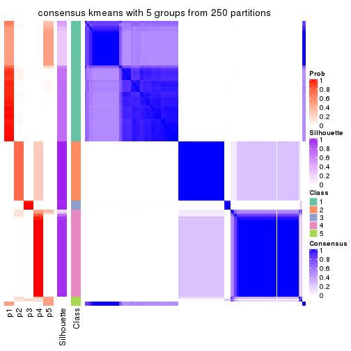</p>

</div>
<div id='tab-MAD-kmeans-consensus-heatmap-5'>
<pre><code class="r">consensus_heatmap(res, k = 6)
</code></pre>

<p></p>

</div>
</div>

Heatmaps for the membership of samples in all partitions to see how consistent they are:


<script>
$( function() {
	$( '#tabs-MAD-kmeans-membership-heatmap' ).tabs();
} );
</script>
<div id='tabs-MAD-kmeans-membership-heatmap'>
<ul>
<li><a href='#tab-MAD-kmeans-membership-heatmap-1'>k = 2</a></li>
<li><a href='#tab-MAD-kmeans-membership-heatmap-2'>k = 3</a></li>
<li><a href='#tab-MAD-kmeans-membership-heatmap-3'>k = 4</a></li>
<li><a href='#tab-MAD-kmeans-membership-heatmap-4'>k = 5</a></li>
<li><a href='#tab-MAD-kmeans-membership-heatmap-5'>k = 6</a></li>
</ul>
<div id='tab-MAD-kmeans-membership-heatmap-1'>
<pre><code class="r">membership_heatmap(res, k = 2)
</code></pre>

<p></p>

</div>
<div id='tab-MAD-kmeans-membership-heatmap-2'>
<pre><code class="r">membership_heatmap(res, k = 3)
</code></pre>

<p></p>

</div>
<div id='tab-MAD-kmeans-membership-heatmap-3'>
<pre><code class="r">membership_heatmap(res, k = 4)
</code></pre>

<p></p>

</div>
<div id='tab-MAD-kmeans-membership-heatmap-4'>
<pre><code class="r">membership_heatmap(res, k = 5)
</code></pre>

<p></p>

</div>
<div id='tab-MAD-kmeans-membership-heatmap-5'>
<pre><code class="r">membership_heatmap(res, k = 6)
</code></pre>

<p></p>

</div>
</div>

As soon as we have had the classes for columns, we can look for signatures
which are significantly different between classes which can be candidate marks
for certain classes. Following are the heatmaps for signatures.


Signature heatmaps where rows are scaled:


<script>
$( function() {
	$( '#tabs-MAD-kmeans-get-signatures' ).tabs();
} );
</script>
<div id='tabs-MAD-kmeans-get-signatures'>
<ul>
<li><a href='#tab-MAD-kmeans-get-signatures-1'>k = 2</a></li>
<li><a href='#tab-MAD-kmeans-get-signatures-2'>k = 3</a></li>
<li><a href='#tab-MAD-kmeans-get-signatures-3'>k = 4</a></li>
<li><a href='#tab-MAD-kmeans-get-signatures-4'>k = 5</a></li>
<li><a href='#tab-MAD-kmeans-get-signatures-5'>k = 6</a></li>
</ul>
<div id='tab-MAD-kmeans-get-signatures-1'>
<pre><code class="r">get_signatures(res, k = 2)
</code></pre>

<p></p>

</div>
<div id='tab-MAD-kmeans-get-signatures-2'>
<pre><code class="r">get_signatures(res, k = 3)
</code></pre>

<p></p>

</div>
<div id='tab-MAD-kmeans-get-signatures-3'>
<pre><code class="r">get_signatures(res, k = 4)
</code></pre>

<p></p>

</div>
<div id='tab-MAD-kmeans-get-signatures-4'>
<pre><code class="r">get_signatures(res, k = 5)
</code></pre>

<p></p>

</div>
<div id='tab-MAD-kmeans-get-signatures-5'>
<pre><code class="r">get_signatures(res, k = 6)
</code></pre>

<p></p>

</div>
</div>


Signature heatmaps where rows are not scaled:


<script>
$( function() {
	$( '#tabs-MAD-kmeans-get-signatures-no-scale' ).tabs();
} );
</script>
<div id='tabs-MAD-kmeans-get-signatures-no-scale'>
<ul>
<li><a href='#tab-MAD-kmeans-get-signatures-no-scale-1'>k = 2</a></li>
<li><a href='#tab-MAD-kmeans-get-signatures-no-scale-2'>k = 3</a></li>
<li><a href='#tab-MAD-kmeans-get-signatures-no-scale-3'>k = 4</a></li>
<li><a href='#tab-MAD-kmeans-get-signatures-no-scale-4'>k = 5</a></li>
<li><a href='#tab-MAD-kmeans-get-signatures-no-scale-5'>k = 6</a></li>
</ul>
<div id='tab-MAD-kmeans-get-signatures-no-scale-1'>
<pre><code class="r">get_signatures(res, k = 2, scale_rows = FALSE)
</code></pre>

<p></p>

</div>
<div id='tab-MAD-kmeans-get-signatures-no-scale-2'>
<pre><code class="r">get_signatures(res, k = 3, scale_rows = FALSE)
</code></pre>

<p></p>

</div>
<div id='tab-MAD-kmeans-get-signatures-no-scale-3'>
<pre><code class="r">get_signatures(res, k = 4, scale_rows = FALSE)
</code></pre>

<p></p>

</div>
<div id='tab-MAD-kmeans-get-signatures-no-scale-4'>
<pre><code class="r">get_signatures(res, k = 5, scale_rows = FALSE)
</code></pre>

<p></p>

</div>
<div id='tab-MAD-kmeans-get-signatures-no-scale-5'>
<pre><code class="r">get_signatures(res, k = 6, scale_rows = FALSE)
</code></pre>

<p></p>

</div>
</div>


Compare the overlap of signatures from different k:

```r
compare_signatures(res)
```


`get_signature()` returns a data frame invisibly. TO get the list of signatures, the function
call should be assigned to a variable explicitly. In following code, if `plot` argument is set
to `FALSE`, no heatmap is plotted while only the differential analysis is performed.

```r
# code only for demonstration
tb = get_signature(res, k = ..., plot = FALSE)
```

An example of the output of `tb` is:

```
#>   which_row         fdr    mean_1    mean_2 scaled_mean_1 scaled_mean_2 km
#> 1        38 0.042760348  8.373488  9.131774    -0.5533452     0.5164555  1
#> 2        40 0.018707592  7.106213  8.469186    -0.6173731     0.5762149  1
#> 3        55 0.019134737 10.221463 11.207825    -0.6159697     0.5749050  1
#> 4        59 0.006059896  5.921854  7.869574    -0.6899429     0.6439467  1
#> 5        60 0.018055526  8.928898 10.211722    -0.6204761     0.5791110  1
#> 6        98 0.009384629 15.714769 14.887706     0.6635654    -0.6193277  2
...
```

The columns in `tb` are:

1. `which_row`: row indices corresponding to the input matrix.
2. `fdr`: FDR for the differential test. 
3. `mean_x`: The mean value in group x.
4. `scaled_mean_x`: The mean value in group x after rows are scaled.
5. `km`: Row groups if k-means clustering is applied to rows.


UMAP plot which shows how samples are separated.


<script>
$( function() {
	$( '#tabs-MAD-kmeans-dimension-reduction' ).tabs();
} );
</script>
<div id='tabs-MAD-kmeans-dimension-reduction'>
<ul>
<li><a href='#tab-MAD-kmeans-dimension-reduction-1'>k = 2</a></li>
<li><a href='#tab-MAD-kmeans-dimension-reduction-2'>k = 3</a></li>
<li><a href='#tab-MAD-kmeans-dimension-reduction-3'>k = 4</a></li>
<li><a href='#tab-MAD-kmeans-dimension-reduction-4'>k = 5</a></li>
<li><a href='#tab-MAD-kmeans-dimension-reduction-5'>k = 6</a></li>
</ul>
<div id='tab-MAD-kmeans-dimension-reduction-1'>
<pre><code class="r">dimension_reduction(res, k = 2, method = &quot;UMAP&quot;)
</code></pre>

<p></p>

</div>
<div id='tab-MAD-kmeans-dimension-reduction-2'>
<pre><code class="r">dimension_reduction(res, k = 3, method = &quot;UMAP&quot;)
</code></pre>

<p></p>

</div>
<div id='tab-MAD-kmeans-dimension-reduction-3'>
<pre><code class="r">dimension_reduction(res, k = 4, method = &quot;UMAP&quot;)
</code></pre>

<p></p>

</div>
<div id='tab-MAD-kmeans-dimension-reduction-4'>
<pre><code class="r">dimension_reduction(res, k = 5, method = &quot;UMAP&quot;)
</code></pre>

<p></p>

</div>
<div id='tab-MAD-kmeans-dimension-reduction-5'>
<pre><code class="r">dimension_reduction(res, k = 6, method = &quot;UMAP&quot;)
</code></pre>

<p></p>

</div>
</div>


Following heatmap shows how subgroups are split when increasing `k`:

```r
collect_classes(res)
```


If matrix rows can be associated to genes, consider to use `functional_enrichment(res,
...)` to perform function enrichment for the signature genes. See [this vignette](http://bioconductor.org/packages/devel/bioc/vignettes/cola/inst/doc/functional_enrichment.html) for more detailed explanations.


 

---------------------------------------------------


### MAD:skmeans**


The object with results only for a single top-value method and a single partition method 
can be extracted as:

```r
res = res_list["MAD", "skmeans"]
# you can also extract it by
# res = res_list["MAD:skmeans"]
```

A summary of `res` and all the functions that can be applied to it:

```r
res
```

```
#> A 'ConsensusPartition' object with k = 2, 3, 4, 5, 6.
#>   On a matrix with 9126 rows and 192 columns.
#>   Top rows (913, 1826, 2738, 3650, 4563) are extracted by 'MAD' method.
#>   Subgroups are detected by 'skmeans' method.
#>   Performed in total 1250 partitions by row resampling.
#>   Best k for subgroups seems to be 2.
#> 
#> Following methods can be applied to this 'ConsensusPartition' object:
#>  [1] "cola_report"             "collect_classes"         "collect_plots"          
#>  [4] "collect_stats"           "colnames"                "compare_signatures"     
#>  [7] "consensus_heatmap"       "dimension_reduction"     "functional_enrichment"  
#> [10] "get_anno_col"            "get_anno"                "get_classes"            
#> [13] "get_consensus"           "get_matrix"              "get_membership"         
#> [16] "get_param"               "get_signatures"          "get_stats"              
#> [19] "is_best_k"               "is_stable_k"             "membership_heatmap"     
#> [22] "ncol"                    "nrow"                    "plot_ecdf"              
#> [25] "rownames"                "select_partition_number" "show"                   
#> [28] "suggest_best_k"          "test_to_known_factors"
```

`collect_plots()` function collects all the plots made from `res` for all `k` (number of partitions)
into one single page to provide an easy and fast comparison between different `k`.

```r
collect_plots(res)
```


The plots are:

- The first row: a plot of the ECDF (empirical cumulative distribution
  function) curves of the consensus matrix for each `k` and the heatmap of
  predicted classes for each `k`.
- The second row: heatmaps of the consensus matrix for each `k`.
- The third row: heatmaps of the membership matrix for each `k`.
- The fouth row: heatmaps of the signatures for each `k`.

All the plots in panels can be made by individual functions and they are
plotted later in this section.

`select_partition_number()` produces several plots showing different
statistics for choosing "optimized" `k`. There are following statistics:

- ECDF curves of the consensus matrix for each `k`;
- 1-PAC. [The PAC
  score](https://en.wikipedia.org/wiki/Consensus_clustering#Over-interpretation_potential_of_consensus_clustering)
  measures the proportion of the ambiguous subgrouping.
- Mean silhouette score.
- Concordance. The mean probability of fiting the consensus class ids in all
  partitions.
- Area increased. Denote $A_k$ as the area under the ECDF curve for current
  `k`, the area increased is defined as $A_k - A_{k-1}$.
- Rand index. The percent of pairs of samples that are both in a same cluster
  or both are not in a same cluster in the partition of k and k-1.
- Jaccard index. The ratio of pairs of samples are both in a same cluster in
  the partition of k and k-1 and the pairs of samples are both in a same
  cluster in the partition k or k-1.

The detailed explanations of these statistics can be found in [the _cola_
vignette](http://bioconductor.org/packages/devel/bioc/vignettes/cola/inst/doc/cola.html#toc_13).

Generally speaking, lower PAC score, higher mean silhouette score or higher
concordance corresponds to better partition. Rand index and Jaccard index
measure how similar the current partition is compared to partition with `k-1`.
If they are too similar, we won't accept `k` is better than `k-1`.

```r
select_partition_number(res)
```


The numeric values for all these statistics can be obtained by `get_stats()`.

```r
get_stats(res)
```

```
#>   k 1-PAC mean_silhouette concordance area_increased  Rand Jaccard
#> 2 2 1.000           0.997       0.999         0.5013 0.499   0.499
#> 3 3 0.841           0.930       0.950         0.1240 0.950   0.900
#> 4 4 0.792           0.889       0.830         0.1362 0.865   0.705
#> 5 5 0.726           0.778       0.762         0.0596 0.967   0.904
#> 6 6 0.669           0.350       0.615         0.0391 0.801   0.508
```

`suggest_best_k()` suggests the best $k$ based on these statistics. The rules are as follows:

- All $k$ with Jaccard index larger than 0.95 are removed because increasing
  $k$ does not provide enough extra information. If all $k$ are removed, it is
  marked as no subgroup is detected.
- For all $k$ with 1-PAC score larger than 0.9, the maximal $k$ is taken as
  the best $k$, and other $k$ are marked as optional $k$.
- If it does not fit the second rule. The $k$ with the maximal vote of the
  highest 1-PAC score, highest mean silhouette, and highest concordance is
  taken as the best $k$.

```r
suggest_best_k(res)
```

```
#> [1] 2
```


Following shows the table of the partitions (You need to click the **show/hide
code output** link to see it). The membership matrix (columns with name `p*`)
is inferred by
[`clue::cl_consensus()`](https://www.rdocumentation.org/link/cl_consensus?package=clue)
function with the `SE` method. Basically the value in the membership matrix
represents the probability to belong to a certain group. The finall class
label for an item is determined with the group with highest probability it
belongs to.

In `get_classes()` function, the entropy is calculated from the membership
matrix and the silhouette score is calculated from the consensus matrix.


<script>
$( function() {
	$( '#tabs-MAD-skmeans-get-classes' ).tabs();
} );
</script>
<div id='tabs-MAD-skmeans-get-classes'>
<ul>
<li><a href='#tab-MAD-skmeans-get-classes-1'>k = 2</a></li>
<li><a href='#tab-MAD-skmeans-get-classes-2'>k = 3</a></li>
<li><a href='#tab-MAD-skmeans-get-classes-3'>k = 4</a></li>
<li><a href='#tab-MAD-skmeans-get-classes-4'>k = 5</a></li>
<li><a href='#tab-MAD-skmeans-get-classes-5'>k = 6</a></li>
</ul>

<div id='tab-MAD-skmeans-get-classes-1'>
<p><a id='tab-MAD-skmeans-get-classes-1-a' style='color:#0366d6' href='#'>show/hide code output</a></p>
<pre><code class="r">cbind(get_classes(res, k = 2), get_membership(res, k = 2))
</code></pre>

<pre><code>#&gt;            class entropy silhouette    p1    p2
#&gt; SRR2074921     1    0.00      1.000 1.000 0.000
#&gt; SRR2074919     1    0.00      1.000 1.000 0.000
#&gt; SRR2074920     1    0.00      1.000 1.000 0.000
#&gt; SRR2074917     1    0.00      1.000 1.000 0.000
#&gt; SRR2074918     2    0.00      0.997 0.000 1.000
#&gt; SRR2074916     2    0.00      0.997 0.000 1.000
#&gt; SRR2074915     2    0.00      0.997 0.000 1.000
#&gt; SRR2074914     1    0.00      1.000 1.000 0.000
#&gt; SRR2074913     2    0.00      0.997 0.000 1.000
#&gt; SRR2074912     1    0.00      1.000 1.000 0.000
#&gt; SRR2074911     2    0.00      0.997 0.000 1.000
#&gt; SRR2074910     2    0.00      0.997 0.000 1.000
#&gt; SRR2074909     1    0.00      1.000 1.000 0.000
#&gt; SRR2074907     1    0.00      1.000 1.000 0.000
#&gt; SRR2074908     2    0.00      0.997 0.000 1.000
#&gt; SRR2074906     2    0.00      0.997 0.000 1.000
#&gt; SRR2074905     1    0.00      1.000 1.000 0.000
#&gt; SRR2074904     2    0.00      0.997 0.000 1.000
#&gt; SRR2074903     2    0.00      0.997 0.000 1.000
#&gt; SRR2074902     1    0.00      1.000 1.000 0.000
#&gt; SRR2074901     2    0.00      0.997 0.000 1.000
#&gt; SRR2074900     1    0.00      1.000 1.000 0.000
#&gt; SRR2074899     2    0.00      0.997 0.000 1.000
#&gt; SRR2074898     2    0.00      0.997 0.000 1.000
#&gt; SRR2074897     2    0.00      0.997 0.000 1.000
#&gt; SRR2074896     2    0.00      0.997 0.000 1.000
#&gt; SRR2074895     1    0.00      1.000 1.000 0.000
#&gt; SRR2074894     2    0.85      0.619 0.276 0.724
#&gt; SRR2074893     2    0.00      0.997 0.000 1.000
#&gt; SRR2074892     1    0.00      1.000 1.000 0.000
#&gt; SRR2074891     1    0.00      1.000 1.000 0.000
#&gt; SRR2074890     2    0.00      0.997 0.000 1.000
#&gt; SRR2074887     2    0.00      0.997 0.000 1.000
#&gt; SRR2074889     2    0.00      0.997 0.000 1.000
#&gt; SRR2074886     2    0.00      0.997 0.000 1.000
#&gt; SRR2074888     2    0.00      0.997 0.000 1.000
#&gt; SRR2074885     1    0.00      1.000 1.000 0.000
#&gt; SRR2074884     2    0.00      0.997 0.000 1.000
#&gt; SRR2074883     2    0.00      0.997 0.000 1.000
#&gt; SRR2074882     1    0.00      1.000 1.000 0.000
#&gt; SRR2074880     2    0.00      0.997 0.000 1.000
#&gt; SRR2074881     2    0.00      0.997 0.000 1.000
#&gt; SRR2074879     1    0.00      1.000 1.000 0.000
#&gt; SRR2074878     1    0.00      1.000 1.000 0.000
#&gt; SRR2074877     2    0.00      0.997 0.000 1.000
#&gt; SRR2074876     1    0.00      1.000 1.000 0.000
#&gt; SRR2074875     2    0.00      0.997 0.000 1.000
#&gt; SRR2074874     1    0.00      1.000 1.000 0.000
#&gt; SRR2074873     2    0.00      0.997 0.000 1.000
#&gt; SRR2074872     1    0.00      1.000 1.000 0.000
#&gt; SRR2074871     2    0.00      0.997 0.000 1.000
#&gt; SRR2074870     1    0.00      1.000 1.000 0.000
#&gt; SRR2074869     1    0.00      1.000 1.000 0.000
#&gt; SRR2074868     1    0.00      1.000 1.000 0.000
#&gt; SRR2074867     2    0.00      0.997 0.000 1.000
#&gt; SRR2074866     2    0.00      0.997 0.000 1.000
#&gt; SRR2074865     1    0.00      1.000 1.000 0.000
#&gt; SRR2074864     1    0.00      1.000 1.000 0.000
#&gt; SRR2074863     1    0.00      1.000 1.000 0.000
#&gt; SRR2074862     1    0.00      1.000 1.000 0.000
#&gt; SRR2074861     1    0.00      1.000 1.000 0.000
#&gt; SRR2074860     1    0.00      1.000 1.000 0.000
#&gt; SRR2074859     1    0.00      1.000 1.000 0.000
#&gt; SRR2074858     2    0.00      0.997 0.000 1.000
#&gt; SRR2074855     2    0.00      0.997 0.000 1.000
#&gt; SRR2074857     1    0.00      1.000 1.000 0.000
#&gt; SRR2074856     1    0.00      1.000 1.000 0.000
#&gt; SRR2074854     1    0.00      1.000 1.000 0.000
#&gt; SRR2074853     1    0.00      1.000 1.000 0.000
#&gt; SRR2074852     2    0.00      0.997 0.000 1.000
#&gt; SRR2074851     1    0.00      1.000 1.000 0.000
#&gt; SRR2074850     1    0.00      1.000 1.000 0.000
#&gt; SRR2074849     1    0.00      1.000 1.000 0.000
#&gt; SRR2074848     1    0.00      1.000 1.000 0.000
#&gt; SRR2074847     1    0.00      1.000 1.000 0.000
#&gt; SRR2074846     1    0.00      1.000 1.000 0.000
#&gt; SRR2074845     1    0.00      1.000 1.000 0.000
#&gt; SRR2074843     1    0.00      1.000 1.000 0.000
#&gt; SRR2074842     2    0.00      0.997 0.000 1.000
#&gt; SRR2074844     2    0.00      0.997 0.000 1.000
#&gt; SRR2074841     2    0.00      0.997 0.000 1.000
#&gt; SRR2074840     2    0.00      0.997 0.000 1.000
#&gt; SRR2074839     1    0.00      1.000 1.000 0.000
#&gt; SRR2074838     2    0.00      0.997 0.000 1.000
#&gt; SRR2074836     2    0.00      0.997 0.000 1.000
#&gt; SRR2074835     2    0.00      0.997 0.000 1.000
#&gt; SRR2074837     1    0.00      1.000 1.000 0.000
#&gt; SRR2074834     2    0.00      0.997 0.000 1.000
#&gt; SRR2074833     1    0.00      1.000 1.000 0.000
#&gt; SRR2074832     2    0.00      0.997 0.000 1.000
#&gt; SRR2074831     1    0.00      1.000 1.000 0.000
#&gt; SRR2074829     1    0.00      1.000 1.000 0.000
#&gt; SRR2074830     1    0.00      1.000 1.000 0.000
#&gt; SRR2074828     1    0.00      1.000 1.000 0.000
#&gt; SRR2074827     2    0.00      0.997 0.000 1.000
#&gt; SRR2074826     2    0.00      0.997 0.000 1.000
#&gt; SRR2074825     2    0.00      0.997 0.000 1.000
#&gt; SRR2074824     2    0.00      0.997 0.000 1.000
#&gt; SRR2074823     1    0.00      1.000 1.000 0.000
#&gt; SRR2074822     2    0.00      0.997 0.000 1.000
#&gt; SRR2074821     2    0.00      0.997 0.000 1.000
#&gt; SRR2074820     2    0.00      0.997 0.000 1.000
#&gt; SRR2074819     2    0.00      0.997 0.000 1.000
#&gt; SRR2074817     2    0.00      0.997 0.000 1.000
#&gt; SRR2074818     2    0.00      0.997 0.000 1.000
#&gt; SRR2074816     1    0.00      1.000 1.000 0.000
#&gt; SRR2074815     2    0.00      0.997 0.000 1.000
#&gt; SRR2074814     1    0.00      1.000 1.000 0.000
#&gt; SRR2074812     2    0.00      0.997 0.000 1.000
#&gt; SRR2074813     2    0.00      0.997 0.000 1.000
#&gt; SRR2074809     2    0.00      0.997 0.000 1.000
#&gt; SRR2074810     2    0.00      0.997 0.000 1.000
#&gt; SRR2074811     2    0.00      0.997 0.000 1.000
#&gt; SRR2074808     2    0.00      0.997 0.000 1.000
#&gt; SRR2074807     2    0.00      0.997 0.000 1.000
#&gt; SRR2074806     1    0.00      1.000 1.000 0.000
#&gt; SRR2074805     2    0.00      0.997 0.000 1.000
#&gt; SRR2074804     1    0.00      1.000 1.000 0.000
#&gt; SRR2074803     1    0.00      1.000 1.000 0.000
#&gt; SRR2074801     1    0.00      1.000 1.000 0.000
#&gt; SRR2074802     2    0.00      0.997 0.000 1.000
#&gt; SRR2074799     2    0.00      0.997 0.000 1.000
#&gt; SRR2074800     1    0.00      1.000 1.000 0.000
#&gt; SRR2074798     1    0.00      1.000 1.000 0.000
#&gt; SRR2074797     1    0.00      1.000 1.000 0.000
#&gt; SRR2074795     2    0.00      0.997 0.000 1.000
#&gt; SRR2074796     2    0.00      0.997 0.000 1.000
#&gt; SRR2074794     2    0.00      0.997 0.000 1.000
#&gt; SRR2074793     2    0.00      0.997 0.000 1.000
#&gt; SRR2074792     1    0.00      1.000 1.000 0.000
#&gt; SRR2074791     1    0.00      1.000 1.000 0.000
#&gt; SRR2074790     2    0.00      0.997 0.000 1.000
#&gt; SRR2074789     1    0.00      1.000 1.000 0.000
#&gt; SRR2074788     1    0.00      1.000 1.000 0.000
#&gt; SRR2074787     1    0.00      1.000 1.000 0.000
#&gt; SRR2074786     2    0.00      0.997 0.000 1.000
#&gt; SRR2074785     1    0.00      1.000 1.000 0.000
#&gt; SRR2074784     1    0.00      1.000 1.000 0.000
#&gt; SRR2074783     2    0.00      0.997 0.000 1.000
#&gt; SRR2074782     1    0.00      1.000 1.000 0.000
#&gt; SRR2074779     2    0.00      0.997 0.000 1.000
#&gt; SRR2074781     2    0.00      0.997 0.000 1.000
#&gt; SRR2074780     1    0.00      1.000 1.000 0.000
#&gt; SRR2074778     2    0.00      0.997 0.000 1.000
#&gt; SRR2074777     2    0.00      0.997 0.000 1.000
#&gt; SRR2074776     2    0.00      0.997 0.000 1.000
#&gt; SRR2074775     1    0.00      1.000 1.000 0.000
#&gt; SRR2074774     1    0.00      1.000 1.000 0.000
#&gt; SRR2074773     2    0.00      0.997 0.000 1.000
#&gt; SRR2074771     2    0.00      0.997 0.000 1.000
#&gt; SRR2074772     1    0.00      1.000 1.000 0.000
#&gt; SRR2074770     1    0.00      1.000 1.000 0.000
#&gt; SRR2074769     2    0.00      0.997 0.000 1.000
#&gt; SRR2074768     2    0.00      0.997 0.000 1.000
#&gt; SRR2074766     2    0.00      0.997 0.000 1.000
#&gt; SRR2074767     1    0.00      1.000 1.000 0.000
#&gt; SRR2074765     1    0.00      1.000 1.000 0.000
#&gt; SRR2074764     2    0.00      0.997 0.000 1.000
#&gt; SRR2074763     2    0.00      0.997 0.000 1.000
#&gt; SRR2074761     1    0.00      1.000 1.000 0.000
#&gt; SRR2074762     2    0.00      0.997 0.000 1.000
#&gt; SRR2074760     2    0.00      0.997 0.000 1.000
#&gt; SRR2074759     1    0.00      1.000 1.000 0.000
#&gt; SRR2074757     2    0.00      0.997 0.000 1.000
#&gt; SRR2074758     2    0.00      0.997 0.000 1.000
#&gt; SRR2074756     2    0.00      0.997 0.000 1.000
#&gt; SRR2074755     1    0.00      1.000 1.000 0.000
#&gt; SRR2074754     1    0.00      1.000 1.000 0.000
#&gt; SRR2074753     2    0.00      0.997 0.000 1.000
#&gt; SRR2074752     1    0.00      1.000 1.000 0.000
#&gt; SRR2074751     1    0.00      1.000 1.000 0.000
#&gt; SRR2074749     2    0.00      0.997 0.000 1.000
#&gt; SRR2074750     1    0.00      1.000 1.000 0.000
#&gt; SRR2074748     1    0.00      1.000 1.000 0.000
#&gt; SRR2074747     2    0.00      0.997 0.000 1.000
#&gt; SRR2074745     1    0.00      1.000 1.000 0.000
#&gt; SRR2074746     1    0.00      1.000 1.000 0.000
#&gt; SRR2074744     2    0.00      0.997 0.000 1.000
#&gt; SRR2074743     2    0.00      0.997 0.000 1.000
#&gt; SRR2074742     2    0.00      0.997 0.000 1.000
#&gt; SRR2074741     1    0.00      1.000 1.000 0.000
#&gt; SRR2074740     2    0.00      0.997 0.000 1.000
#&gt; SRR2074739     1    0.00      1.000 1.000 0.000
#&gt; SRR2074738     2    0.00      0.997 0.000 1.000
#&gt; SRR2074737     2    0.00      0.997 0.000 1.000
#&gt; SRR2074736     2    0.00      0.997 0.000 1.000
#&gt; SRR2074735     1    0.00      1.000 1.000 0.000
#&gt; SRR2074734     2    0.00      0.997 0.000 1.000
#&gt; SRR2074733     1    0.00      1.000 1.000 0.000
#&gt; SRR2074732     2    0.00      0.997 0.000 1.000
#&gt; SRR2074731     2    0.00      0.997 0.000 1.000
#&gt; SRR2074730     1    0.00      1.000 1.000 0.000
</code></pre>

<script>
$('#tab-MAD-skmeans-get-classes-1-a').parent().next().next().hide();
$('#tab-MAD-skmeans-get-classes-1-a').click(function(){
  $('#tab-MAD-skmeans-get-classes-1-a').parent().next().next().toggle();
  return(false);
});
</script>
</div>

<div id='tab-MAD-skmeans-get-classes-2'>
<p><a id='tab-MAD-skmeans-get-classes-2-a' style='color:#0366d6' href='#'>show/hide code output</a></p>
<pre><code class="r">cbind(get_classes(res, k = 3), get_membership(res, k = 3))
</code></pre>

<pre><code>#&gt;            class entropy silhouette    p1    p2    p3
#&gt; SRR2074921     3  0.4235      0.835 0.176 0.000 0.824
#&gt; SRR2074919     3  0.4235      0.835 0.176 0.000 0.824
#&gt; SRR2074920     3  0.4235      0.835 0.176 0.000 0.824
#&gt; SRR2074917     3  0.4887      0.777 0.228 0.000 0.772
#&gt; SRR2074918     3  0.4235      0.776 0.000 0.176 0.824
#&gt; SRR2074916     2  0.0000      0.881 0.000 1.000 0.000
#&gt; SRR2074915     2  0.0000      0.881 0.000 1.000 0.000
#&gt; SRR2074914     1  0.0000      1.000 1.000 0.000 0.000
#&gt; SRR2074913     2  0.0892      0.884 0.000 0.980 0.020
#&gt; SRR2074912     3  0.4235      0.835 0.176 0.000 0.824
#&gt; SRR2074911     3  0.6079      0.546 0.000 0.388 0.612
#&gt; SRR2074910     3  0.5621      0.508 0.000 0.308 0.692
#&gt; SRR2074909     1  0.0000      1.000 1.000 0.000 0.000
#&gt; SRR2074907     1  0.0000      1.000 1.000 0.000 0.000
#&gt; SRR2074908     2  0.4235      0.908 0.000 0.824 0.176
#&gt; SRR2074906     2  0.0000      0.881 0.000 1.000 0.000
#&gt; SRR2074905     1  0.0000      1.000 1.000 0.000 0.000
#&gt; SRR2074904     2  0.4235      0.908 0.000 0.824 0.176
#&gt; SRR2074903     2  0.4235      0.908 0.000 0.824 0.176
#&gt; SRR2074902     1  0.0000      1.000 1.000 0.000 0.000
#&gt; SRR2074901     2  0.4235      0.908 0.000 0.824 0.176
#&gt; SRR2074900     1  0.0000      1.000 1.000 0.000 0.000
#&gt; SRR2074899     2  0.4235      0.908 0.000 0.824 0.176
#&gt; SRR2074898     2  0.0000      0.881 0.000 1.000 0.000
#&gt; SRR2074897     2  0.0000      0.881 0.000 1.000 0.000
#&gt; SRR2074896     2  0.4235      0.908 0.000 0.824 0.176
#&gt; SRR2074895     1  0.0000      1.000 1.000 0.000 0.000
#&gt; SRR2074894     2  0.9886      0.067 0.276 0.404 0.320
#&gt; SRR2074893     2  0.4235      0.908 0.000 0.824 0.176
#&gt; SRR2074892     1  0.0000      1.000 1.000 0.000 0.000
#&gt; SRR2074891     1  0.0000      1.000 1.000 0.000 0.000
#&gt; SRR2074890     2  0.4235      0.908 0.000 0.824 0.176
#&gt; SRR2074887     2  0.4235      0.908 0.000 0.824 0.176
#&gt; SRR2074889     2  0.0000      0.881 0.000 1.000 0.000
#&gt; SRR2074886     2  0.4235      0.908 0.000 0.824 0.176
#&gt; SRR2074888     2  0.0000      0.881 0.000 1.000 0.000
#&gt; SRR2074885     1  0.0000      1.000 1.000 0.000 0.000
#&gt; SRR2074884     2  0.0000      0.881 0.000 1.000 0.000
#&gt; SRR2074883     2  0.0000      0.881 0.000 1.000 0.000
#&gt; SRR2074882     1  0.0000      1.000 1.000 0.000 0.000
#&gt; SRR2074880     2  0.0000      0.881 0.000 1.000 0.000
#&gt; SRR2074881     2  0.4235      0.908 0.000 0.824 0.176
#&gt; SRR2074879     3  0.4235      0.835 0.176 0.000 0.824
#&gt; SRR2074878     1  0.0000      1.000 1.000 0.000 0.000
#&gt; SRR2074877     2  0.0237      0.882 0.000 0.996 0.004
#&gt; SRR2074876     1  0.0000      1.000 1.000 0.000 0.000
#&gt; SRR2074875     2  0.0000      0.881 0.000 1.000 0.000
#&gt; SRR2074874     1  0.0000      1.000 1.000 0.000 0.000
#&gt; SRR2074873     2  0.0000      0.881 0.000 1.000 0.000
#&gt; SRR2074872     1  0.0000      1.000 1.000 0.000 0.000
#&gt; SRR2074871     2  0.4235      0.908 0.000 0.824 0.176
#&gt; SRR2074870     1  0.0000      1.000 1.000 0.000 0.000
#&gt; SRR2074869     1  0.0000      1.000 1.000 0.000 0.000
#&gt; SRR2074868     1  0.0000      1.000 1.000 0.000 0.000
#&gt; SRR2074867     2  0.4235      0.908 0.000 0.824 0.176
#&gt; SRR2074866     2  0.4062      0.907 0.000 0.836 0.164
#&gt; SRR2074865     1  0.0000      1.000 1.000 0.000 0.000
#&gt; SRR2074864     1  0.0000      1.000 1.000 0.000 0.000
#&gt; SRR2074863     1  0.0000      1.000 1.000 0.000 0.000
#&gt; SRR2074862     1  0.0000      1.000 1.000 0.000 0.000
#&gt; SRR2074861     1  0.0000      1.000 1.000 0.000 0.000
#&gt; SRR2074860     1  0.0000      1.000 1.000 0.000 0.000
#&gt; SRR2074859     1  0.0000      1.000 1.000 0.000 0.000
#&gt; SRR2074858     2  0.4235      0.908 0.000 0.824 0.176
#&gt; SRR2074855     2  0.0000      0.881 0.000 1.000 0.000
#&gt; SRR2074857     1  0.0000      1.000 1.000 0.000 0.000
#&gt; SRR2074856     1  0.0000      1.000 1.000 0.000 0.000
#&gt; SRR2074854     1  0.0000      1.000 1.000 0.000 0.000
#&gt; SRR2074853     1  0.0000      1.000 1.000 0.000 0.000
#&gt; SRR2074852     2  0.0000      0.881 0.000 1.000 0.000
#&gt; SRR2074851     1  0.0000      1.000 1.000 0.000 0.000
#&gt; SRR2074850     1  0.0000      1.000 1.000 0.000 0.000
#&gt; SRR2074849     1  0.0000      1.000 1.000 0.000 0.000
#&gt; SRR2074848     1  0.0000      1.000 1.000 0.000 0.000
#&gt; SRR2074847     1  0.0000      1.000 1.000 0.000 0.000
#&gt; SRR2074846     1  0.0000      1.000 1.000 0.000 0.000
#&gt; SRR2074845     1  0.0000      1.000 1.000 0.000 0.000
#&gt; SRR2074843     1  0.0000      1.000 1.000 0.000 0.000
#&gt; SRR2074842     2  0.4235      0.908 0.000 0.824 0.176
#&gt; SRR2074844     2  0.4235      0.908 0.000 0.824 0.176
#&gt; SRR2074841     2  0.0000      0.881 0.000 1.000 0.000
#&gt; SRR2074840     2  0.0000      0.881 0.000 1.000 0.000
#&gt; SRR2074839     1  0.0000      1.000 1.000 0.000 0.000
#&gt; SRR2074838     2  0.0000      0.881 0.000 1.000 0.000
#&gt; SRR2074836     2  0.4235      0.908 0.000 0.824 0.176
#&gt; SRR2074835     2  0.0000      0.881 0.000 1.000 0.000
#&gt; SRR2074837     1  0.0000      1.000 1.000 0.000 0.000
#&gt; SRR2074834     2  0.4235      0.908 0.000 0.824 0.176
#&gt; SRR2074833     1  0.0000      1.000 1.000 0.000 0.000
#&gt; SRR2074832     2  0.4235      0.908 0.000 0.824 0.176
#&gt; SRR2074831     1  0.0000      1.000 1.000 0.000 0.000
#&gt; SRR2074829     1  0.0000      1.000 1.000 0.000 0.000
#&gt; SRR2074830     1  0.0000      1.000 1.000 0.000 0.000
#&gt; SRR2074828     1  0.0000      1.000 1.000 0.000 0.000
#&gt; SRR2074827     2  0.4235      0.908 0.000 0.824 0.176
#&gt; SRR2074826     2  0.4235      0.908 0.000 0.824 0.176
#&gt; SRR2074825     2  0.0000      0.881 0.000 1.000 0.000
#&gt; SRR2074824     2  0.0000      0.881 0.000 1.000 0.000
#&gt; SRR2074823     1  0.0000      1.000 1.000 0.000 0.000
#&gt; SRR2074822     2  0.0000      0.881 0.000 1.000 0.000
#&gt; SRR2074821     2  0.4235      0.908 0.000 0.824 0.176
#&gt; SRR2074820     2  0.0000      0.881 0.000 1.000 0.000
#&gt; SRR2074819     2  0.4235      0.908 0.000 0.824 0.176
#&gt; SRR2074817     2  0.4235      0.908 0.000 0.824 0.176
#&gt; SRR2074818     2  0.0000      0.881 0.000 1.000 0.000
#&gt; SRR2074816     1  0.0000      1.000 1.000 0.000 0.000
#&gt; SRR2074815     2  0.4235      0.908 0.000 0.824 0.176
#&gt; SRR2074814     1  0.0000      1.000 1.000 0.000 0.000
#&gt; SRR2074812     2  0.0000      0.881 0.000 1.000 0.000
#&gt; SRR2074813     2  0.0000      0.881 0.000 1.000 0.000
#&gt; SRR2074809     2  0.0000      0.881 0.000 1.000 0.000
#&gt; SRR2074810     2  0.4235      0.908 0.000 0.824 0.176
#&gt; SRR2074811     2  0.0000      0.881 0.000 1.000 0.000
#&gt; SRR2074808     2  0.4235      0.908 0.000 0.824 0.176
#&gt; SRR2074807     2  0.4235      0.908 0.000 0.824 0.176
#&gt; SRR2074806     1  0.0000      1.000 1.000 0.000 0.000
#&gt; SRR2074805     2  0.0000      0.881 0.000 1.000 0.000
#&gt; SRR2074804     1  0.0000      1.000 1.000 0.000 0.000
#&gt; SRR2074803     1  0.0000      1.000 1.000 0.000 0.000
#&gt; SRR2074801     1  0.0000      1.000 1.000 0.000 0.000
#&gt; SRR2074802     2  0.4235      0.908 0.000 0.824 0.176
#&gt; SRR2074799     2  0.0000      0.881 0.000 1.000 0.000
#&gt; SRR2074800     1  0.0000      1.000 1.000 0.000 0.000
#&gt; SRR2074798     1  0.0000      1.000 1.000 0.000 0.000
#&gt; SRR2074797     1  0.0000      1.000 1.000 0.000 0.000
#&gt; SRR2074795     2  0.0000      0.881 0.000 1.000 0.000
#&gt; SRR2074796     2  0.4235      0.908 0.000 0.824 0.176
#&gt; SRR2074794     2  0.0000      0.881 0.000 1.000 0.000
#&gt; SRR2074793     2  0.4235      0.908 0.000 0.824 0.176
#&gt; SRR2074792     1  0.0000      1.000 1.000 0.000 0.000
#&gt; SRR2074791     1  0.0000      1.000 1.000 0.000 0.000
#&gt; SRR2074790     2  0.0000      0.881 0.000 1.000 0.000
#&gt; SRR2074789     1  0.0000      1.000 1.000 0.000 0.000
#&gt; SRR2074788     1  0.0000      1.000 1.000 0.000 0.000
#&gt; SRR2074787     1  0.0000      1.000 1.000 0.000 0.000
#&gt; SRR2074786     2  0.4235      0.908 0.000 0.824 0.176
#&gt; SRR2074785     1  0.0000      1.000 1.000 0.000 0.000
#&gt; SRR2074784     1  0.0000      1.000 1.000 0.000 0.000
#&gt; SRR2074783     2  0.0000      0.881 0.000 1.000 0.000
#&gt; SRR2074782     1  0.0000      1.000 1.000 0.000 0.000
#&gt; SRR2074779     2  0.4235      0.908 0.000 0.824 0.176
#&gt; SRR2074781     2  0.4235      0.908 0.000 0.824 0.176
#&gt; SRR2074780     1  0.0000      1.000 1.000 0.000 0.000
#&gt; SRR2074778     2  0.4235      0.908 0.000 0.824 0.176
#&gt; SRR2074777     2  0.4235      0.908 0.000 0.824 0.176
#&gt; SRR2074776     2  0.0000      0.881 0.000 1.000 0.000
#&gt; SRR2074775     1  0.0000      1.000 1.000 0.000 0.000
#&gt; SRR2074774     1  0.0000      1.000 1.000 0.000 0.000
#&gt; SRR2074773     2  0.4235      0.908 0.000 0.824 0.176
#&gt; SRR2074771     2  0.4235      0.908 0.000 0.824 0.176
#&gt; SRR2074772     1  0.0000      1.000 1.000 0.000 0.000
#&gt; SRR2074770     1  0.0000      1.000 1.000 0.000 0.000
#&gt; SRR2074769     2  0.0000      0.881 0.000 1.000 0.000
#&gt; SRR2074768     2  0.0000      0.881 0.000 1.000 0.000
#&gt; SRR2074766     2  0.4178      0.908 0.000 0.828 0.172
#&gt; SRR2074767     1  0.0000      1.000 1.000 0.000 0.000
#&gt; SRR2074765     1  0.0000      1.000 1.000 0.000 0.000
#&gt; SRR2074764     2  0.4235      0.908 0.000 0.824 0.176
#&gt; SRR2074763     2  0.0000      0.881 0.000 1.000 0.000
#&gt; SRR2074761     1  0.0000      1.000 1.000 0.000 0.000
#&gt; SRR2074762     2  0.4235      0.908 0.000 0.824 0.176
#&gt; SRR2074760     2  0.4235      0.908 0.000 0.824 0.176
#&gt; SRR2074759     1  0.0000      1.000 1.000 0.000 0.000
#&gt; SRR2074757     2  0.4235      0.908 0.000 0.824 0.176
#&gt; SRR2074758     2  0.0000      0.881 0.000 1.000 0.000
#&gt; SRR2074756     2  0.4235      0.908 0.000 0.824 0.176
#&gt; SRR2074755     1  0.0000      1.000 1.000 0.000 0.000
#&gt; SRR2074754     1  0.0000      1.000 1.000 0.000 0.000
#&gt; SRR2074753     2  0.3879      0.906 0.000 0.848 0.152
#&gt; SRR2074752     1  0.0000      1.000 1.000 0.000 0.000
#&gt; SRR2074751     1  0.0000      1.000 1.000 0.000 0.000
#&gt; SRR2074749     2  0.4235      0.908 0.000 0.824 0.176
#&gt; SRR2074750     1  0.0000      1.000 1.000 0.000 0.000
#&gt; SRR2074748     1  0.0000      1.000 1.000 0.000 0.000
#&gt; SRR2074747     2  0.4235      0.908 0.000 0.824 0.176
#&gt; SRR2074745     1  0.0000      1.000 1.000 0.000 0.000
#&gt; SRR2074746     1  0.0000      1.000 1.000 0.000 0.000
#&gt; SRR2074744     2  0.4235      0.908 0.000 0.824 0.176
#&gt; SRR2074743     2  0.4235      0.908 0.000 0.824 0.176
#&gt; SRR2074742     3  0.4235      0.776 0.000 0.176 0.824
#&gt; SRR2074741     1  0.0000      1.000 1.000 0.000 0.000
#&gt; SRR2074740     2  0.4235      0.908 0.000 0.824 0.176
#&gt; SRR2074739     1  0.0000      1.000 1.000 0.000 0.000
#&gt; SRR2074738     2  0.4235      0.908 0.000 0.824 0.176
#&gt; SRR2074737     2  0.3551      0.903 0.000 0.868 0.132
#&gt; SRR2074736     2  0.4235      0.908 0.000 0.824 0.176
#&gt; SRR2074735     1  0.0000      1.000 1.000 0.000 0.000
#&gt; SRR2074734     2  0.3192      0.900 0.000 0.888 0.112
#&gt; SRR2074733     1  0.0000      1.000 1.000 0.000 0.000
#&gt; SRR2074732     2  0.0000      0.881 0.000 1.000 0.000
#&gt; SRR2074731     2  0.0000      0.881 0.000 1.000 0.000
#&gt; SRR2074730     1  0.0000      1.000 1.000 0.000 0.000
</code></pre>

<script>
$('#tab-MAD-skmeans-get-classes-2-a').parent().next().next().hide();
$('#tab-MAD-skmeans-get-classes-2-a').click(function(){
  $('#tab-MAD-skmeans-get-classes-2-a').parent().next().next().toggle();
  return(false);
});
</script>
</div>

<div id='tab-MAD-skmeans-get-classes-3'>
<p><a id='tab-MAD-skmeans-get-classes-3-a' style='color:#0366d6' href='#'>show/hide code output</a></p>
<pre><code class="r">cbind(get_classes(res, k = 4), get_membership(res, k = 4))
</code></pre>

<pre><code>#&gt;            class entropy silhouette    p1    p2    p3    p4
#&gt; SRR2074921     3  0.0000      0.950 0.000 0.000 1.000 0.000
#&gt; SRR2074919     3  0.0188      0.953 0.004 0.000 0.996 0.000
#&gt; SRR2074920     3  0.0188      0.953 0.004 0.000 0.996 0.000
#&gt; SRR2074917     3  0.2081      0.882 0.084 0.000 0.916 0.000
#&gt; SRR2074918     3  0.2704      0.913 0.000 0.000 0.876 0.124
#&gt; SRR2074916     4  0.4624      0.849 0.000 0.340 0.000 0.660
#&gt; SRR2074915     4  0.3975      0.689 0.000 0.240 0.000 0.760
#&gt; SRR2074914     1  0.2647      0.927 0.880 0.000 0.000 0.120
#&gt; SRR2074913     4  0.4072      0.574 0.000 0.252 0.000 0.748
#&gt; SRR2074912     3  0.0188      0.953 0.004 0.000 0.996 0.000
#&gt; SRR2074911     4  0.5284     -0.316 0.000 0.016 0.368 0.616
#&gt; SRR2074910     4  0.7146     -0.558 0.000 0.132 0.412 0.456
#&gt; SRR2074909     1  0.2589      0.928 0.884 0.000 0.000 0.116
#&gt; SRR2074907     1  0.1389      0.952 0.952 0.000 0.000 0.048
#&gt; SRR2074908     2  0.0817      0.899 0.000 0.976 0.000 0.024
#&gt; SRR2074906     4  0.4843      0.931 0.000 0.396 0.000 0.604
#&gt; SRR2074905     1  0.0469      0.959 0.988 0.000 0.000 0.012
#&gt; SRR2074904     2  0.1022      0.901 0.000 0.968 0.000 0.032
#&gt; SRR2074903     2  0.2149      0.851 0.000 0.912 0.000 0.088
#&gt; SRR2074902     1  0.0000      0.958 1.000 0.000 0.000 0.000
#&gt; SRR2074901     2  0.0469      0.905 0.000 0.988 0.000 0.012
#&gt; SRR2074900     1  0.0188      0.958 0.996 0.000 0.000 0.004
#&gt; SRR2074899     2  0.3311      0.688 0.000 0.828 0.000 0.172
#&gt; SRR2074898     4  0.4843      0.931 0.000 0.396 0.000 0.604
#&gt; SRR2074897     4  0.4843      0.931 0.000 0.396 0.000 0.604
#&gt; SRR2074896     2  0.0707      0.898 0.000 0.980 0.000 0.020
#&gt; SRR2074895     1  0.0817      0.957 0.976 0.000 0.000 0.024
#&gt; SRR2074894     2  0.5994      0.288 0.016 0.632 0.032 0.320
#&gt; SRR2074893     2  0.2149      0.852 0.000 0.912 0.000 0.088
#&gt; SRR2074892     1  0.1022      0.955 0.968 0.000 0.000 0.032
#&gt; SRR2074891     1  0.2647      0.927 0.880 0.000 0.000 0.120
#&gt; SRR2074890     2  0.0817      0.905 0.000 0.976 0.000 0.024
#&gt; SRR2074887     2  0.0707      0.904 0.000 0.980 0.000 0.020
#&gt; SRR2074889     4  0.4843      0.931 0.000 0.396 0.000 0.604
#&gt; SRR2074886     2  0.2216      0.846 0.000 0.908 0.000 0.092
#&gt; SRR2074888     4  0.4843      0.931 0.000 0.396 0.000 0.604
#&gt; SRR2074885     1  0.0000      0.958 1.000 0.000 0.000 0.000
#&gt; SRR2074884     4  0.4843      0.931 0.000 0.396 0.000 0.604
#&gt; SRR2074883     4  0.4843      0.931 0.000 0.396 0.000 0.604
#&gt; SRR2074882     1  0.0000      0.958 1.000 0.000 0.000 0.000
#&gt; SRR2074880     4  0.4843      0.931 0.000 0.396 0.000 0.604
#&gt; SRR2074881     2  0.0921      0.903 0.000 0.972 0.000 0.028
#&gt; SRR2074879     3  0.0188      0.953 0.004 0.000 0.996 0.000
#&gt; SRR2074878     1  0.0000      0.958 1.000 0.000 0.000 0.000
#&gt; SRR2074877     4  0.4843      0.931 0.000 0.396 0.000 0.604
#&gt; SRR2074876     1  0.0000      0.958 1.000 0.000 0.000 0.000
#&gt; SRR2074875     4  0.4843      0.931 0.000 0.396 0.000 0.604
#&gt; SRR2074874     1  0.0000      0.958 1.000 0.000 0.000 0.000
#&gt; SRR2074873     4  0.4843      0.931 0.000 0.396 0.000 0.604
#&gt; SRR2074872     1  0.0000      0.958 1.000 0.000 0.000 0.000
#&gt; SRR2074871     2  0.0921      0.902 0.000 0.972 0.000 0.028
#&gt; SRR2074870     1  0.1716      0.948 0.936 0.000 0.000 0.064
#&gt; SRR2074869     1  0.0592      0.958 0.984 0.000 0.000 0.016
#&gt; SRR2074868     1  0.0000      0.958 1.000 0.000 0.000 0.000
#&gt; SRR2074867     2  0.1389      0.891 0.000 0.952 0.000 0.048
#&gt; SRR2074866     2  0.4898     -0.401 0.000 0.584 0.000 0.416
#&gt; SRR2074865     1  0.2647      0.927 0.880 0.000 0.000 0.120
#&gt; SRR2074864     1  0.2589      0.928 0.884 0.000 0.000 0.116
#&gt; SRR2074863     1  0.2589      0.929 0.884 0.000 0.000 0.116
#&gt; SRR2074862     1  0.0000      0.958 1.000 0.000 0.000 0.000
#&gt; SRR2074861     1  0.0000      0.958 1.000 0.000 0.000 0.000
#&gt; SRR2074860     1  0.1059      0.954 0.972 0.000 0.012 0.016
#&gt; SRR2074859     1  0.0000      0.958 1.000 0.000 0.000 0.000
#&gt; SRR2074858     2  0.2973      0.753 0.000 0.856 0.000 0.144
#&gt; SRR2074855     4  0.4843      0.931 0.000 0.396 0.000 0.604
#&gt; SRR2074857     1  0.0000      0.958 1.000 0.000 0.000 0.000
#&gt; SRR2074856     1  0.0000      0.958 1.000 0.000 0.000 0.000
#&gt; SRR2074854     1  0.0000      0.958 1.000 0.000 0.000 0.000
#&gt; SRR2074853     1  0.0000      0.958 1.000 0.000 0.000 0.000
#&gt; SRR2074852     4  0.4843      0.931 0.000 0.396 0.000 0.604
#&gt; SRR2074851     1  0.0000      0.958 1.000 0.000 0.000 0.000
#&gt; SRR2074850     1  0.0469      0.958 0.988 0.000 0.000 0.012
#&gt; SRR2074849     1  0.0000      0.958 1.000 0.000 0.000 0.000
#&gt; SRR2074848     1  0.0000      0.958 1.000 0.000 0.000 0.000
#&gt; SRR2074847     1  0.0000      0.958 1.000 0.000 0.000 0.000
#&gt; SRR2074846     1  0.0000      0.958 1.000 0.000 0.000 0.000
#&gt; SRR2074845     1  0.0000      0.958 1.000 0.000 0.000 0.000
#&gt; SRR2074843     1  0.0817      0.957 0.976 0.000 0.000 0.024
#&gt; SRR2074842     2  0.0817      0.905 0.000 0.976 0.000 0.024
#&gt; SRR2074844     2  0.1792      0.872 0.000 0.932 0.000 0.068
#&gt; SRR2074841     4  0.4843      0.931 0.000 0.396 0.000 0.604
#&gt; SRR2074840     4  0.4843      0.931 0.000 0.396 0.000 0.604
#&gt; SRR2074839     1  0.0707      0.957 0.980 0.000 0.000 0.020
#&gt; SRR2074838     4  0.4843      0.931 0.000 0.396 0.000 0.604
#&gt; SRR2074836     2  0.0336      0.900 0.000 0.992 0.000 0.008
#&gt; SRR2074835     4  0.4843      0.931 0.000 0.396 0.000 0.604
#&gt; SRR2074837     1  0.2647      0.927 0.880 0.000 0.000 0.120
#&gt; SRR2074834     2  0.0707      0.897 0.000 0.980 0.000 0.020
#&gt; SRR2074833     1  0.1716      0.948 0.936 0.000 0.000 0.064
#&gt; SRR2074832     2  0.0592      0.904 0.000 0.984 0.000 0.016
#&gt; SRR2074831     1  0.0000      0.958 1.000 0.000 0.000 0.000
#&gt; SRR2074829     1  0.0000      0.958 1.000 0.000 0.000 0.000
#&gt; SRR2074830     1  0.0000      0.958 1.000 0.000 0.000 0.000
#&gt; SRR2074828     1  0.2469      0.932 0.892 0.000 0.000 0.108
#&gt; SRR2074827     2  0.0707      0.904 0.000 0.980 0.000 0.020
#&gt; SRR2074826     2  0.0921      0.897 0.000 0.972 0.000 0.028
#&gt; SRR2074825     4  0.4843      0.931 0.000 0.396 0.000 0.604
#&gt; SRR2074824     4  0.4843      0.931 0.000 0.396 0.000 0.604
#&gt; SRR2074823     1  0.0707      0.957 0.980 0.000 0.000 0.020
#&gt; SRR2074822     4  0.4843      0.931 0.000 0.396 0.000 0.604
#&gt; SRR2074821     2  0.2281      0.844 0.000 0.904 0.000 0.096
#&gt; SRR2074820     4  0.4843      0.931 0.000 0.396 0.000 0.604
#&gt; SRR2074819     2  0.1022      0.901 0.000 0.968 0.000 0.032
#&gt; SRR2074817     2  0.0469      0.901 0.000 0.988 0.000 0.012
#&gt; SRR2074818     4  0.4843      0.931 0.000 0.396 0.000 0.604
#&gt; SRR2074816     1  0.2647      0.927 0.880 0.000 0.000 0.120
#&gt; SRR2074815     2  0.0592      0.894 0.000 0.984 0.000 0.016
#&gt; SRR2074814     1  0.0000      0.958 1.000 0.000 0.000 0.000
#&gt; SRR2074812     4  0.4843      0.931 0.000 0.396 0.000 0.604
#&gt; SRR2074813     4  0.4843      0.931 0.000 0.396 0.000 0.604
#&gt; SRR2074809     4  0.4843      0.931 0.000 0.396 0.000 0.604
#&gt; SRR2074810     2  0.0707      0.897 0.000 0.980 0.000 0.020
#&gt; SRR2074811     4  0.4843      0.931 0.000 0.396 0.000 0.604
#&gt; SRR2074808     2  0.1022      0.903 0.000 0.968 0.000 0.032
#&gt; SRR2074807     2  0.2469      0.820 0.000 0.892 0.000 0.108
#&gt; SRR2074806     1  0.2647      0.927 0.880 0.000 0.000 0.120
#&gt; SRR2074805     4  0.4843      0.931 0.000 0.396 0.000 0.604
#&gt; SRR2074804     1  0.2647      0.927 0.880 0.000 0.000 0.120
#&gt; SRR2074803     1  0.2216      0.938 0.908 0.000 0.000 0.092
#&gt; SRR2074801     1  0.2011      0.943 0.920 0.000 0.000 0.080
#&gt; SRR2074802     2  0.0592      0.894 0.000 0.984 0.000 0.016
#&gt; SRR2074799     4  0.4843      0.931 0.000 0.396 0.000 0.604
#&gt; SRR2074800     1  0.0188      0.958 0.996 0.000 0.000 0.004
#&gt; SRR2074798     1  0.2647      0.927 0.880 0.000 0.000 0.120
#&gt; SRR2074797     1  0.0817      0.957 0.976 0.000 0.000 0.024
#&gt; SRR2074795     4  0.4843      0.931 0.000 0.396 0.000 0.604
#&gt; SRR2074796     2  0.0921      0.904 0.000 0.972 0.000 0.028
#&gt; SRR2074794     4  0.4843      0.931 0.000 0.396 0.000 0.604
#&gt; SRR2074793     2  0.3024      0.741 0.000 0.852 0.000 0.148
#&gt; SRR2074792     1  0.2647      0.927 0.880 0.000 0.000 0.120
#&gt; SRR2074791     1  0.0188      0.958 0.996 0.000 0.000 0.004
#&gt; SRR2074790     4  0.4843      0.931 0.000 0.396 0.000 0.604
#&gt; SRR2074789     1  0.0000      0.958 1.000 0.000 0.000 0.000
#&gt; SRR2074788     1  0.0000      0.958 1.000 0.000 0.000 0.000
#&gt; SRR2074787     1  0.0000      0.958 1.000 0.000 0.000 0.000
#&gt; SRR2074786     2  0.1302      0.895 0.000 0.956 0.000 0.044
#&gt; SRR2074785     1  0.2647      0.927 0.880 0.000 0.000 0.120
#&gt; SRR2074784     1  0.2647      0.927 0.880 0.000 0.000 0.120
#&gt; SRR2074783     4  0.4843      0.931 0.000 0.396 0.000 0.604
#&gt; SRR2074782     1  0.0000      0.958 1.000 0.000 0.000 0.000
#&gt; SRR2074779     2  0.1211      0.897 0.000 0.960 0.000 0.040
#&gt; SRR2074781     2  0.0707      0.905 0.000 0.980 0.000 0.020
#&gt; SRR2074780     1  0.0000      0.958 1.000 0.000 0.000 0.000
#&gt; SRR2074778     2  0.1474      0.889 0.000 0.948 0.000 0.052
#&gt; SRR2074777     2  0.1557      0.890 0.000 0.944 0.000 0.056
#&gt; SRR2074776     4  0.4843      0.931 0.000 0.396 0.000 0.604
#&gt; SRR2074775     1  0.2647      0.927 0.880 0.000 0.000 0.120
#&gt; SRR2074774     1  0.0336      0.958 0.992 0.000 0.000 0.008
#&gt; SRR2074773     2  0.0336      0.904 0.000 0.992 0.000 0.008
#&gt; SRR2074771     2  0.0817      0.904 0.000 0.976 0.000 0.024
#&gt; SRR2074772     1  0.2647      0.927 0.880 0.000 0.000 0.120
#&gt; SRR2074770     1  0.2281      0.937 0.904 0.000 0.000 0.096
#&gt; SRR2074769     4  0.4843      0.931 0.000 0.396 0.000 0.604
#&gt; SRR2074768     4  0.4843      0.931 0.000 0.396 0.000 0.604
#&gt; SRR2074766     2  0.2081      0.854 0.000 0.916 0.000 0.084
#&gt; SRR2074767     1  0.0469      0.959 0.988 0.000 0.000 0.012
#&gt; SRR2074765     1  0.0000      0.958 1.000 0.000 0.000 0.000
#&gt; SRR2074764     2  0.0817      0.903 0.000 0.976 0.000 0.024
#&gt; SRR2074763     4  0.4843      0.931 0.000 0.396 0.000 0.604
#&gt; SRR2074761     1  0.0000      0.958 1.000 0.000 0.000 0.000
#&gt; SRR2074762     2  0.0469      0.905 0.000 0.988 0.000 0.012
#&gt; SRR2074760     2  0.1211      0.898 0.000 0.960 0.000 0.040
#&gt; SRR2074759     1  0.1867      0.945 0.928 0.000 0.000 0.072
#&gt; SRR2074757     2  0.1557      0.886 0.000 0.944 0.000 0.056
#&gt; SRR2074758     4  0.4843      0.931 0.000 0.396 0.000 0.604
#&gt; SRR2074756     2  0.0592      0.894 0.000 0.984 0.000 0.016
#&gt; SRR2074755     1  0.2647      0.927 0.880 0.000 0.000 0.120
#&gt; SRR2074754     1  0.2647      0.927 0.880 0.000 0.000 0.120
#&gt; SRR2074753     2  0.4955      0.109 0.000 0.556 0.000 0.444
#&gt; SRR2074752     1  0.0000      0.958 1.000 0.000 0.000 0.000
#&gt; SRR2074751     1  0.2647      0.927 0.880 0.000 0.000 0.120
#&gt; SRR2074749     2  0.0817      0.902 0.000 0.976 0.000 0.024
#&gt; SRR2074750     1  0.0592      0.958 0.984 0.000 0.000 0.016
#&gt; SRR2074748     1  0.2647      0.927 0.880 0.000 0.000 0.120
#&gt; SRR2074747     2  0.1867      0.869 0.000 0.928 0.000 0.072
#&gt; SRR2074745     1  0.0000      0.958 1.000 0.000 0.000 0.000
#&gt; SRR2074746     1  0.2345      0.934 0.900 0.000 0.000 0.100
#&gt; SRR2074744     2  0.0817      0.904 0.000 0.976 0.000 0.024
#&gt; SRR2074743     2  0.0817      0.898 0.000 0.976 0.000 0.024
#&gt; SRR2074742     3  0.3801      0.844 0.000 0.000 0.780 0.220
#&gt; SRR2074741     1  0.2647      0.927 0.880 0.000 0.000 0.120
#&gt; SRR2074740     2  0.0592      0.894 0.000 0.984 0.000 0.016
#&gt; SRR2074739     1  0.0336      0.958 0.992 0.000 0.000 0.008
#&gt; SRR2074738     2  0.0817      0.898 0.000 0.976 0.000 0.024
#&gt; SRR2074737     2  0.3837      0.529 0.000 0.776 0.000 0.224
#&gt; SRR2074736     2  0.0592      0.899 0.000 0.984 0.000 0.016
#&gt; SRR2074735     1  0.2647      0.927 0.880 0.000 0.000 0.120
#&gt; SRR2074734     4  0.4999      0.722 0.000 0.492 0.000 0.508
#&gt; SRR2074733     1  0.2647      0.927 0.880 0.000 0.000 0.120
#&gt; SRR2074732     4  0.4843      0.931 0.000 0.396 0.000 0.604
#&gt; SRR2074731     4  0.4843      0.931 0.000 0.396 0.000 0.604
#&gt; SRR2074730     1  0.0000      0.958 1.000 0.000 0.000 0.000
</code></pre>

<script>
$('#tab-MAD-skmeans-get-classes-3-a').parent().next().next().hide();
$('#tab-MAD-skmeans-get-classes-3-a').click(function(){
  $('#tab-MAD-skmeans-get-classes-3-a').parent().next().next().toggle();
  return(false);
});
</script>
</div>

<div id='tab-MAD-skmeans-get-classes-4'>
<p><a id='tab-MAD-skmeans-get-classes-4-a' style='color:#0366d6' href='#'>show/hide code output</a></p>
<pre><code class="r">cbind(get_classes(res, k = 5), get_membership(res, k = 5))
</code></pre>

<pre><code>#&gt;            class entropy silhouette    p1    p2    p3    p4    p5
#&gt; SRR2074921     3  0.0162      0.818 0.000 0.000 0.996 0.000 0.004
#&gt; SRR2074919     3  0.0000      0.820 0.000 0.000 1.000 0.000 0.000
#&gt; SRR2074920     3  0.0000      0.820 0.000 0.000 1.000 0.000 0.000
#&gt; SRR2074917     3  0.2068      0.614 0.092 0.000 0.904 0.000 0.004
#&gt; SRR2074918     3  0.4997      0.471 0.000 0.040 0.704 0.024 0.232
#&gt; SRR2074916     2  0.1965      0.771 0.000 0.924 0.000 0.024 0.052
#&gt; SRR2074915     2  0.4981      0.304 0.000 0.704 0.000 0.108 0.188
#&gt; SRR2074914     1  0.4088      0.754 0.632 0.000 0.000 0.000 0.368
#&gt; SRR2074913     2  0.6554     -0.380 0.000 0.464 0.000 0.224 0.312
#&gt; SRR2074912     3  0.0000      0.820 0.000 0.000 1.000 0.000 0.000
#&gt; SRR2074911     2  0.8087     -0.722 0.000 0.336 0.276 0.092 0.296
#&gt; SRR2074910     5  0.8169      0.000 0.000 0.144 0.232 0.216 0.408
#&gt; SRR2074909     1  0.4045      0.762 0.644 0.000 0.000 0.000 0.356
#&gt; SRR2074907     1  0.3366      0.816 0.768 0.000 0.000 0.000 0.232
#&gt; SRR2074908     4  0.4135      0.918 0.000 0.340 0.000 0.656 0.004
#&gt; SRR2074906     2  0.0000      0.875 0.000 1.000 0.000 0.000 0.000
#&gt; SRR2074905     1  0.2329      0.849 0.876 0.000 0.000 0.000 0.124
#&gt; SRR2074904     4  0.4182      0.915 0.000 0.352 0.000 0.644 0.004
#&gt; SRR2074903     4  0.4341      0.869 0.000 0.404 0.000 0.592 0.004
#&gt; SRR2074902     1  0.0703      0.859 0.976 0.000 0.000 0.000 0.024
#&gt; SRR2074901     4  0.3895      0.913 0.000 0.320 0.000 0.680 0.000
#&gt; SRR2074900     1  0.0609      0.859 0.980 0.000 0.000 0.000 0.020
#&gt; SRR2074899     2  0.4268     -0.547 0.000 0.556 0.000 0.444 0.000
#&gt; SRR2074898     2  0.0000      0.875 0.000 1.000 0.000 0.000 0.000
#&gt; SRR2074897     2  0.0000      0.875 0.000 1.000 0.000 0.000 0.000
#&gt; SRR2074896     4  0.3990      0.906 0.000 0.308 0.000 0.688 0.004
#&gt; SRR2074895     1  0.3109      0.826 0.800 0.000 0.000 0.000 0.200
#&gt; SRR2074894     4  0.5220     -0.597 0.000 0.012 0.024 0.536 0.428
#&gt; SRR2074893     4  0.4262      0.824 0.000 0.440 0.000 0.560 0.000
#&gt; SRR2074892     1  0.1792      0.856 0.916 0.000 0.000 0.000 0.084
#&gt; SRR2074891     1  0.4088      0.754 0.632 0.000 0.000 0.000 0.368
#&gt; SRR2074890     4  0.4252      0.918 0.000 0.340 0.000 0.652 0.008
#&gt; SRR2074887     4  0.4166      0.916 0.000 0.348 0.000 0.648 0.004
#&gt; SRR2074889     2  0.0000      0.875 0.000 1.000 0.000 0.000 0.000
#&gt; SRR2074886     4  0.4300      0.749 0.000 0.476 0.000 0.524 0.000
#&gt; SRR2074888     2  0.0000      0.875 0.000 1.000 0.000 0.000 0.000
#&gt; SRR2074885     1  0.1121      0.860 0.956 0.000 0.000 0.000 0.044
#&gt; SRR2074884     2  0.0000      0.875 0.000 1.000 0.000 0.000 0.000
#&gt; SRR2074883     2  0.0000      0.875 0.000 1.000 0.000 0.000 0.000
#&gt; SRR2074882     1  0.0404      0.858 0.988 0.000 0.000 0.000 0.012
#&gt; SRR2074880     2  0.0000      0.875 0.000 1.000 0.000 0.000 0.000
#&gt; SRR2074881     4  0.4211      0.913 0.000 0.360 0.000 0.636 0.004
#&gt; SRR2074879     3  0.0000      0.820 0.000 0.000 1.000 0.000 0.000
#&gt; SRR2074878     1  0.0000      0.855 1.000 0.000 0.000 0.000 0.000
#&gt; SRR2074877     2  0.0290      0.867 0.000 0.992 0.000 0.008 0.000
#&gt; SRR2074876     1  0.0510      0.858 0.984 0.000 0.000 0.000 0.016
#&gt; SRR2074875     2  0.0000      0.875 0.000 1.000 0.000 0.000 0.000
#&gt; SRR2074874     1  0.0000      0.855 1.000 0.000 0.000 0.000 0.000
#&gt; SRR2074873     2  0.0000      0.875 0.000 1.000 0.000 0.000 0.000
#&gt; SRR2074872     1  0.0000      0.855 1.000 0.000 0.000 0.000 0.000
#&gt; SRR2074871     4  0.4135      0.917 0.000 0.340 0.000 0.656 0.004
#&gt; SRR2074870     1  0.2773      0.840 0.836 0.000 0.000 0.000 0.164
#&gt; SRR2074869     1  0.2690      0.841 0.844 0.000 0.000 0.000 0.156
#&gt; SRR2074868     1  0.0000      0.855 1.000 0.000 0.000 0.000 0.000
#&gt; SRR2074867     4  0.4238      0.905 0.000 0.368 0.000 0.628 0.004
#&gt; SRR2074866     2  0.3282      0.495 0.000 0.804 0.000 0.188 0.008
#&gt; SRR2074865     1  0.4088      0.754 0.632 0.000 0.000 0.000 0.368
#&gt; SRR2074864     1  0.4045      0.761 0.644 0.000 0.000 0.000 0.356
#&gt; SRR2074863     1  0.4088      0.754 0.632 0.000 0.000 0.000 0.368
#&gt; SRR2074862     1  0.0000      0.855 1.000 0.000 0.000 0.000 0.000
#&gt; SRR2074861     1  0.0000      0.855 1.000 0.000 0.000 0.000 0.000
#&gt; SRR2074860     1  0.3695      0.817 0.800 0.000 0.036 0.000 0.164
#&gt; SRR2074859     1  0.0290      0.857 0.992 0.000 0.000 0.000 0.008
#&gt; SRR2074858     2  0.4420     -0.572 0.000 0.548 0.000 0.448 0.004
#&gt; SRR2074855     2  0.0000      0.875 0.000 1.000 0.000 0.000 0.000
#&gt; SRR2074857     1  0.0000      0.855 1.000 0.000 0.000 0.000 0.000
#&gt; SRR2074856     1  0.0000      0.855 1.000 0.000 0.000 0.000 0.000
#&gt; SRR2074854     1  0.0290      0.856 0.992 0.000 0.000 0.000 0.008
#&gt; SRR2074853     1  0.1410      0.860 0.940 0.000 0.000 0.000 0.060
#&gt; SRR2074852     2  0.0000      0.875 0.000 1.000 0.000 0.000 0.000
#&gt; SRR2074851     1  0.0000      0.855 1.000 0.000 0.000 0.000 0.000
#&gt; SRR2074850     1  0.1197      0.858 0.952 0.000 0.000 0.000 0.048
#&gt; SRR2074849     1  0.0000      0.855 1.000 0.000 0.000 0.000 0.000
#&gt; SRR2074848     1  0.0162      0.856 0.996 0.000 0.000 0.000 0.004
#&gt; SRR2074847     1  0.0609      0.859 0.980 0.000 0.000 0.000 0.020
#&gt; SRR2074846     1  0.0510      0.859 0.984 0.000 0.000 0.000 0.016
#&gt; SRR2074845     1  0.0000      0.855 1.000 0.000 0.000 0.000 0.000
#&gt; SRR2074843     1  0.1851      0.854 0.912 0.000 0.000 0.000 0.088
#&gt; SRR2074842     4  0.4196      0.916 0.000 0.356 0.000 0.640 0.004
#&gt; SRR2074844     4  0.4242      0.843 0.000 0.428 0.000 0.572 0.000
#&gt; SRR2074841     2  0.0000      0.875 0.000 1.000 0.000 0.000 0.000
#&gt; SRR2074840     2  0.0000      0.875 0.000 1.000 0.000 0.000 0.000
#&gt; SRR2074839     1  0.1410      0.857 0.940 0.000 0.000 0.000 0.060
#&gt; SRR2074838     2  0.0000      0.875 0.000 1.000 0.000 0.000 0.000
#&gt; SRR2074836     4  0.3949      0.917 0.000 0.332 0.000 0.668 0.000
#&gt; SRR2074835     2  0.0000      0.875 0.000 1.000 0.000 0.000 0.000
#&gt; SRR2074837     1  0.4088      0.754 0.632 0.000 0.000 0.000 0.368
#&gt; SRR2074834     4  0.3774      0.897 0.000 0.296 0.000 0.704 0.000
#&gt; SRR2074833     1  0.2929      0.835 0.820 0.000 0.000 0.000 0.180
#&gt; SRR2074832     4  0.3913      0.913 0.000 0.324 0.000 0.676 0.000
#&gt; SRR2074831     1  0.0510      0.855 0.984 0.000 0.000 0.000 0.016
#&gt; SRR2074829     1  0.0162      0.853 0.996 0.000 0.000 0.000 0.004
#&gt; SRR2074830     1  0.0000      0.855 1.000 0.000 0.000 0.000 0.000
#&gt; SRR2074828     1  0.4045      0.761 0.644 0.000 0.000 0.000 0.356
#&gt; SRR2074827     4  0.3983      0.917 0.000 0.340 0.000 0.660 0.000
#&gt; SRR2074826     4  0.4138      0.871 0.000 0.276 0.000 0.708 0.016
#&gt; SRR2074825     2  0.0000      0.875 0.000 1.000 0.000 0.000 0.000
#&gt; SRR2074824     2  0.0000      0.875 0.000 1.000 0.000 0.000 0.000
#&gt; SRR2074823     1  0.1270      0.857 0.948 0.000 0.000 0.000 0.052
#&gt; SRR2074822     2  0.0000      0.875 0.000 1.000 0.000 0.000 0.000
#&gt; SRR2074821     4  0.4268      0.807 0.000 0.444 0.000 0.556 0.000
#&gt; SRR2074820     2  0.0000      0.875 0.000 1.000 0.000 0.000 0.000
#&gt; SRR2074819     4  0.4015      0.918 0.000 0.348 0.000 0.652 0.000
#&gt; SRR2074817     4  0.3913      0.914 0.000 0.324 0.000 0.676 0.000
#&gt; SRR2074818     2  0.0000      0.875 0.000 1.000 0.000 0.000 0.000
#&gt; SRR2074816     1  0.4101      0.752 0.628 0.000 0.000 0.000 0.372
#&gt; SRR2074815     4  0.3837      0.904 0.000 0.308 0.000 0.692 0.000
#&gt; SRR2074814     1  0.0000      0.855 1.000 0.000 0.000 0.000 0.000
#&gt; SRR2074812     2  0.0000      0.875 0.000 1.000 0.000 0.000 0.000
#&gt; SRR2074813     2  0.0162      0.870 0.000 0.996 0.000 0.000 0.004
#&gt; SRR2074809     2  0.0000      0.875 0.000 1.000 0.000 0.000 0.000
#&gt; SRR2074810     4  0.3796      0.901 0.000 0.300 0.000 0.700 0.000
#&gt; SRR2074811     2  0.0000      0.875 0.000 1.000 0.000 0.000 0.000
#&gt; SRR2074808     4  0.4088      0.910 0.000 0.368 0.000 0.632 0.000
#&gt; SRR2074807     4  0.4297      0.760 0.000 0.472 0.000 0.528 0.000
#&gt; SRR2074806     1  0.4088      0.754 0.632 0.000 0.000 0.000 0.368
#&gt; SRR2074805     2  0.0000      0.875 0.000 1.000 0.000 0.000 0.000
#&gt; SRR2074804     1  0.4088      0.754 0.632 0.000 0.000 0.000 0.368
#&gt; SRR2074803     1  0.3305      0.821 0.776 0.000 0.000 0.000 0.224
#&gt; SRR2074801     1  0.3305      0.821 0.776 0.000 0.000 0.000 0.224
#&gt; SRR2074802     4  0.3774      0.895 0.000 0.296 0.000 0.704 0.000
#&gt; SRR2074799     2  0.0000      0.875 0.000 1.000 0.000 0.000 0.000
#&gt; SRR2074800     1  0.1043      0.857 0.960 0.000 0.000 0.000 0.040
#&gt; SRR2074798     1  0.4126      0.747 0.620 0.000 0.000 0.000 0.380
#&gt; SRR2074797     1  0.1732      0.854 0.920 0.000 0.000 0.000 0.080
#&gt; SRR2074795     2  0.0000      0.875 0.000 1.000 0.000 0.000 0.000
#&gt; SRR2074796     4  0.4182      0.917 0.000 0.352 0.000 0.644 0.004
#&gt; SRR2074794     2  0.0000      0.875 0.000 1.000 0.000 0.000 0.000
#&gt; SRR2074793     2  0.4449     -0.673 0.000 0.512 0.000 0.484 0.004
#&gt; SRR2074792     1  0.4088      0.754 0.632 0.000 0.000 0.000 0.368
#&gt; SRR2074791     1  0.0880      0.856 0.968 0.000 0.000 0.000 0.032
#&gt; SRR2074790     2  0.0000      0.875 0.000 1.000 0.000 0.000 0.000
#&gt; SRR2074789     1  0.0404      0.857 0.988 0.000 0.000 0.000 0.012
#&gt; SRR2074788     1  0.0000      0.855 1.000 0.000 0.000 0.000 0.000
#&gt; SRR2074787     1  0.0000      0.855 1.000 0.000 0.000 0.000 0.000
#&gt; SRR2074786     4  0.4060      0.913 0.000 0.360 0.000 0.640 0.000
#&gt; SRR2074785     1  0.4088      0.754 0.632 0.000 0.000 0.000 0.368
#&gt; SRR2074784     1  0.4088      0.754 0.632 0.000 0.000 0.000 0.368
#&gt; SRR2074783     2  0.0000      0.875 0.000 1.000 0.000 0.000 0.000
#&gt; SRR2074782     1  0.0703      0.858 0.976 0.000 0.000 0.000 0.024
#&gt; SRR2074779     4  0.4310      0.889 0.000 0.392 0.000 0.604 0.004
#&gt; SRR2074781     4  0.4356      0.916 0.000 0.340 0.000 0.648 0.012
#&gt; SRR2074780     1  0.0000      0.855 1.000 0.000 0.000 0.000 0.000
#&gt; SRR2074778     4  0.4276      0.901 0.000 0.380 0.000 0.616 0.004
#&gt; SRR2074777     4  0.4288      0.890 0.000 0.384 0.000 0.612 0.004
#&gt; SRR2074776     2  0.0000      0.875 0.000 1.000 0.000 0.000 0.000
#&gt; SRR2074775     1  0.4088      0.754 0.632 0.000 0.000 0.000 0.368
#&gt; SRR2074774     1  0.0794      0.860 0.972 0.000 0.000 0.000 0.028
#&gt; SRR2074773     4  0.4015      0.917 0.000 0.348 0.000 0.652 0.000
#&gt; SRR2074771     4  0.4166      0.916 0.000 0.348 0.000 0.648 0.004
#&gt; SRR2074772     1  0.4088      0.754 0.632 0.000 0.000 0.000 0.368
#&gt; SRR2074770     1  0.3816      0.787 0.696 0.000 0.000 0.000 0.304
#&gt; SRR2074769     2  0.0000      0.875 0.000 1.000 0.000 0.000 0.000
#&gt; SRR2074768     2  0.0000      0.875 0.000 1.000 0.000 0.000 0.000
#&gt; SRR2074766     4  0.4440      0.760 0.000 0.468 0.000 0.528 0.004
#&gt; SRR2074767     1  0.1121      0.860 0.956 0.000 0.000 0.000 0.044
#&gt; SRR2074765     1  0.0000      0.855 1.000 0.000 0.000 0.000 0.000
#&gt; SRR2074764     4  0.4232      0.903 0.000 0.312 0.000 0.676 0.012
#&gt; SRR2074763     2  0.0000      0.875 0.000 1.000 0.000 0.000 0.000
#&gt; SRR2074761     1  0.0000      0.855 1.000 0.000 0.000 0.000 0.000
#&gt; SRR2074762     4  0.4183      0.914 0.000 0.324 0.000 0.668 0.008
#&gt; SRR2074760     4  0.4074      0.912 0.000 0.364 0.000 0.636 0.000
#&gt; SRR2074759     1  0.3636      0.800 0.728 0.000 0.000 0.000 0.272
#&gt; SRR2074757     4  0.4310      0.891 0.000 0.392 0.000 0.604 0.004
#&gt; SRR2074758     2  0.0000      0.875 0.000 1.000 0.000 0.000 0.000
#&gt; SRR2074756     4  0.3684      0.883 0.000 0.280 0.000 0.720 0.000
#&gt; SRR2074755     1  0.4088      0.754 0.632 0.000 0.000 0.000 0.368
#&gt; SRR2074754     1  0.4088      0.754 0.632 0.000 0.000 0.000 0.368
#&gt; SRR2074753     2  0.6588     -0.105 0.000 0.436 0.000 0.348 0.216
#&gt; SRR2074752     1  0.0609      0.858 0.980 0.000 0.000 0.000 0.020
#&gt; SRR2074751     1  0.4088      0.754 0.632 0.000 0.000 0.000 0.368
#&gt; SRR2074749     4  0.3876      0.909 0.000 0.316 0.000 0.684 0.000
#&gt; SRR2074750     1  0.1341      0.859 0.944 0.000 0.000 0.000 0.056
#&gt; SRR2074748     1  0.4101      0.752 0.628 0.000 0.000 0.000 0.372
#&gt; SRR2074747     4  0.4192      0.874 0.000 0.404 0.000 0.596 0.000
#&gt; SRR2074745     1  0.0000      0.855 1.000 0.000 0.000 0.000 0.000
#&gt; SRR2074746     1  0.4946      0.678 0.596 0.000 0.000 0.036 0.368
#&gt; SRR2074744     4  0.4060      0.914 0.000 0.360 0.000 0.640 0.000
#&gt; SRR2074743     4  0.3816      0.902 0.000 0.304 0.000 0.696 0.000
#&gt; SRR2074742     3  0.6174      0.144 0.000 0.080 0.600 0.040 0.280
#&gt; SRR2074741     1  0.4088      0.754 0.632 0.000 0.000 0.000 0.368
#&gt; SRR2074740     4  0.3861      0.886 0.000 0.284 0.000 0.712 0.004
#&gt; SRR2074739     1  0.1121      0.859 0.956 0.000 0.000 0.000 0.044
#&gt; SRR2074738     4  0.3816      0.902 0.000 0.304 0.000 0.696 0.000
#&gt; SRR2074737     2  0.4235     -0.447 0.000 0.576 0.000 0.424 0.000
#&gt; SRR2074736     4  0.3913      0.914 0.000 0.324 0.000 0.676 0.000
#&gt; SRR2074735     1  0.4088      0.754 0.632 0.000 0.000 0.000 0.368
#&gt; SRR2074734     2  0.1851      0.741 0.000 0.912 0.000 0.088 0.000
#&gt; SRR2074733     1  0.4045      0.761 0.644 0.000 0.000 0.000 0.356
#&gt; SRR2074732     2  0.0000      0.875 0.000 1.000 0.000 0.000 0.000
#&gt; SRR2074731     2  0.0000      0.875 0.000 1.000 0.000 0.000 0.000
#&gt; SRR2074730     1  0.0000      0.855 1.000 0.000 0.000 0.000 0.000
</code></pre>

<script>
$('#tab-MAD-skmeans-get-classes-4-a').parent().next().next().hide();
$('#tab-MAD-skmeans-get-classes-4-a').click(function(){
  $('#tab-MAD-skmeans-get-classes-4-a').parent().next().next().toggle();
  return(false);
});
</script>
</div>

<div id='tab-MAD-skmeans-get-classes-5'>
<p><a id='tab-MAD-skmeans-get-classes-5-a' style='color:#0366d6' href='#'>show/hide code output</a></p>
<pre><code class="r">cbind(get_classes(res, k = 6), get_membership(res, k = 6))
</code></pre>

<pre><code>#&gt;            class entropy silhouette    p1    p2    p3    p4    p5    p6
#&gt; SRR2074921     3  0.0260     0.8241 0.000 0.000 0.992 0.000 0.000 0.008
#&gt; SRR2074919     3  0.0000     0.8265 0.000 0.000 1.000 0.000 0.000 0.000
#&gt; SRR2074920     3  0.0000     0.8265 0.000 0.000 1.000 0.000 0.000 0.000
#&gt; SRR2074917     3  0.0909     0.7749 0.020 0.012 0.968 0.000 0.000 0.000
#&gt; SRR2074918     3  0.5917     0.4406 0.000 0.024 0.552 0.000 0.156 0.268
#&gt; SRR2074916     6  0.6232     0.1245 0.000 0.348 0.000 0.244 0.008 0.400
#&gt; SRR2074915     6  0.5687     0.3606 0.000 0.240 0.000 0.064 0.080 0.616
#&gt; SRR2074914     1  0.0405     0.7366 0.988 0.008 0.000 0.000 0.004 0.000
#&gt; SRR2074913     6  0.5772     0.1573 0.000 0.116 0.000 0.068 0.184 0.632
#&gt; SRR2074912     3  0.0000     0.8265 0.000 0.000 1.000 0.000 0.000 0.000
#&gt; SRR2074911     6  0.6452    -0.0546 0.000 0.084 0.184 0.004 0.160 0.568
#&gt; SRR2074910     6  0.6355    -0.4630 0.000 0.016 0.104 0.052 0.276 0.552
#&gt; SRR2074909     1  0.0260     0.7370 0.992 0.008 0.000 0.000 0.000 0.000
#&gt; SRR2074907     1  0.2883     0.7426 0.788 0.212 0.000 0.000 0.000 0.000
#&gt; SRR2074908     4  0.1749     0.8785 0.000 0.008 0.000 0.932 0.024 0.036
#&gt; SRR2074906     2  0.6117    -0.0385 0.000 0.352 0.000 0.348 0.000 0.300
#&gt; SRR2074905     1  0.3634     0.6881 0.644 0.356 0.000 0.000 0.000 0.000
#&gt; SRR2074904     4  0.1974     0.8798 0.000 0.012 0.000 0.920 0.020 0.048
#&gt; SRR2074903     4  0.1829     0.8609 0.000 0.028 0.000 0.928 0.008 0.036
#&gt; SRR2074902     2  0.4124    -0.5661 0.476 0.516 0.000 0.000 0.004 0.004
#&gt; SRR2074901     4  0.1059     0.8818 0.000 0.016 0.000 0.964 0.016 0.004
#&gt; SRR2074900     2  0.3995    -0.5657 0.480 0.516 0.000 0.000 0.000 0.004
#&gt; SRR2074899     4  0.3740     0.6435 0.000 0.120 0.000 0.784 0.000 0.096
#&gt; SRR2074898     2  0.6117    -0.0385 0.000 0.352 0.000 0.348 0.000 0.300
#&gt; SRR2074897     2  0.6117    -0.0385 0.000 0.352 0.000 0.348 0.000 0.300
#&gt; SRR2074896     4  0.2038     0.8730 0.000 0.020 0.000 0.920 0.032 0.028
#&gt; SRR2074895     1  0.3314     0.7311 0.740 0.256 0.000 0.000 0.004 0.000
#&gt; SRR2074894     5  0.3058     0.0000 0.012 0.000 0.000 0.104 0.848 0.036
#&gt; SRR2074893     4  0.2128     0.8288 0.000 0.032 0.000 0.908 0.004 0.056
#&gt; SRR2074892     1  0.4088     0.6302 0.556 0.436 0.000 0.000 0.004 0.004
#&gt; SRR2074891     1  0.0146     0.7337 0.996 0.000 0.000 0.000 0.000 0.004
#&gt; SRR2074890     4  0.2007     0.8741 0.000 0.012 0.000 0.920 0.032 0.036
#&gt; SRR2074887     4  0.1757     0.8797 0.000 0.008 0.000 0.928 0.012 0.052
#&gt; SRR2074889     2  0.6117    -0.0385 0.000 0.352 0.000 0.348 0.000 0.300
#&gt; SRR2074886     4  0.2390     0.7987 0.000 0.056 0.000 0.888 0.000 0.056
#&gt; SRR2074888     2  0.6117    -0.0385 0.000 0.352 0.000 0.348 0.000 0.300
#&gt; SRR2074885     1  0.3961     0.6366 0.556 0.440 0.000 0.000 0.004 0.000
#&gt; SRR2074884     2  0.6117    -0.0385 0.000 0.352 0.000 0.348 0.000 0.300
#&gt; SRR2074883     2  0.6117    -0.0385 0.000 0.352 0.000 0.348 0.000 0.300
#&gt; SRR2074882     2  0.3864    -0.5692 0.480 0.520 0.000 0.000 0.000 0.000
#&gt; SRR2074880     2  0.6117    -0.0385 0.000 0.352 0.000 0.348 0.000 0.300
#&gt; SRR2074881     4  0.1151     0.8818 0.000 0.012 0.000 0.956 0.000 0.032
#&gt; SRR2074879     3  0.0000     0.8265 0.000 0.000 1.000 0.000 0.000 0.000
#&gt; SRR2074878     2  0.3851    -0.5442 0.460 0.540 0.000 0.000 0.000 0.000
#&gt; SRR2074877     2  0.6126    -0.0992 0.000 0.352 0.000 0.332 0.000 0.316
#&gt; SRR2074876     1  0.3997     0.5864 0.508 0.488 0.000 0.000 0.004 0.000
#&gt; SRR2074875     2  0.6117    -0.0385 0.000 0.352 0.000 0.348 0.000 0.300
#&gt; SRR2074874     2  0.3851    -0.5442 0.460 0.540 0.000 0.000 0.000 0.000
#&gt; SRR2074873     2  0.6117    -0.0385 0.000 0.352 0.000 0.348 0.000 0.300
#&gt; SRR2074872     2  0.3851    -0.5442 0.460 0.540 0.000 0.000 0.000 0.000
#&gt; SRR2074871     4  0.1410     0.8780 0.000 0.004 0.000 0.944 0.008 0.044
#&gt; SRR2074870     1  0.4034     0.6896 0.648 0.336 0.000 0.000 0.012 0.004
#&gt; SRR2074869     1  0.3482     0.7104 0.684 0.316 0.000 0.000 0.000 0.000
#&gt; SRR2074868     2  0.3851    -0.5442 0.460 0.540 0.000 0.000 0.000 0.000
#&gt; SRR2074867     4  0.2252     0.8729 0.000 0.020 0.000 0.908 0.028 0.044
#&gt; SRR2074866     4  0.5933     0.0512 0.000 0.248 0.000 0.496 0.004 0.252
#&gt; SRR2074865     1  0.0260     0.7321 0.992 0.000 0.000 0.000 0.008 0.000
#&gt; SRR2074864     1  0.0547     0.7399 0.980 0.020 0.000 0.000 0.000 0.000
#&gt; SRR2074863     1  0.0891     0.7405 0.968 0.024 0.000 0.000 0.008 0.000
#&gt; SRR2074862     2  0.3851    -0.5442 0.460 0.540 0.000 0.000 0.000 0.000
#&gt; SRR2074861     2  0.3851    -0.5442 0.460 0.540 0.000 0.000 0.000 0.000
#&gt; SRR2074860     1  0.4641     0.7063 0.664 0.248 0.088 0.000 0.000 0.000
#&gt; SRR2074859     2  0.3868    -0.5888 0.496 0.504 0.000 0.000 0.000 0.000
#&gt; SRR2074858     4  0.3472     0.7273 0.000 0.092 0.000 0.808 0.000 0.100
#&gt; SRR2074855     2  0.6117    -0.0385 0.000 0.352 0.000 0.348 0.000 0.300
#&gt; SRR2074857     2  0.3982    -0.5454 0.460 0.536 0.000 0.000 0.004 0.000
#&gt; SRR2074856     2  0.3979    -0.5450 0.456 0.540 0.000 0.000 0.004 0.000
#&gt; SRR2074854     2  0.3857    -0.5516 0.468 0.532 0.000 0.000 0.000 0.000
#&gt; SRR2074853     1  0.3817     0.6421 0.568 0.432 0.000 0.000 0.000 0.000
#&gt; SRR2074852     2  0.6117    -0.0385 0.000 0.352 0.000 0.348 0.000 0.300
#&gt; SRR2074851     2  0.3851    -0.5442 0.460 0.540 0.000 0.000 0.000 0.000
#&gt; SRR2074850     2  0.4465    -0.5721 0.472 0.504 0.000 0.000 0.020 0.004
#&gt; SRR2074849     2  0.3851    -0.5442 0.460 0.540 0.000 0.000 0.000 0.000
#&gt; SRR2074848     2  0.3860    -0.5555 0.472 0.528 0.000 0.000 0.000 0.000
#&gt; SRR2074847     1  0.3857     0.6125 0.532 0.468 0.000 0.000 0.000 0.000
#&gt; SRR2074846     1  0.3868     0.5855 0.504 0.496 0.000 0.000 0.000 0.000
#&gt; SRR2074845     2  0.3851    -0.5442 0.460 0.540 0.000 0.000 0.000 0.000
#&gt; SRR2074843     1  0.4513     0.6207 0.532 0.440 0.000 0.000 0.024 0.004
#&gt; SRR2074842     4  0.2240     0.8677 0.000 0.016 0.000 0.908 0.032 0.044
#&gt; SRR2074844     4  0.1829     0.8603 0.000 0.024 0.000 0.920 0.000 0.056
#&gt; SRR2074841     2  0.6117    -0.0385 0.000 0.352 0.000 0.348 0.000 0.300
#&gt; SRR2074840     2  0.6117    -0.0385 0.000 0.352 0.000 0.348 0.000 0.300
#&gt; SRR2074839     1  0.4466     0.5879 0.500 0.476 0.000 0.000 0.020 0.004
#&gt; SRR2074838     2  0.6117    -0.0385 0.000 0.352 0.000 0.348 0.000 0.300
#&gt; SRR2074836     4  0.1452     0.8802 0.000 0.020 0.000 0.948 0.020 0.012
#&gt; SRR2074835     2  0.6117    -0.0385 0.000 0.352 0.000 0.348 0.000 0.300
#&gt; SRR2074837     1  0.0000     0.7331 1.000 0.000 0.000 0.000 0.000 0.000
#&gt; SRR2074834     4  0.2602     0.8366 0.000 0.052 0.000 0.888 0.040 0.020
#&gt; SRR2074833     1  0.3827     0.7095 0.680 0.308 0.000 0.000 0.008 0.004
#&gt; SRR2074832     4  0.1794     0.8758 0.000 0.028 0.000 0.932 0.024 0.016
#&gt; SRR2074831     2  0.4312    -0.5689 0.476 0.508 0.000 0.000 0.012 0.004
#&gt; SRR2074829     2  0.3851    -0.5442 0.460 0.540 0.000 0.000 0.000 0.000
#&gt; SRR2074830     2  0.3851    -0.5442 0.460 0.540 0.000 0.000 0.000 0.000
#&gt; SRR2074828     1  0.0458     0.7393 0.984 0.016 0.000 0.000 0.000 0.000
#&gt; SRR2074827     4  0.2201     0.8716 0.000 0.028 0.000 0.912 0.032 0.028
#&gt; SRR2074826     4  0.3474     0.7688 0.000 0.044 0.000 0.836 0.072 0.048
#&gt; SRR2074825     2  0.6117    -0.0385 0.000 0.352 0.000 0.348 0.000 0.300
#&gt; SRR2074824     2  0.6117    -0.0385 0.000 0.352 0.000 0.348 0.000 0.300
#&gt; SRR2074823     1  0.4390     0.5989 0.508 0.472 0.000 0.000 0.016 0.004
#&gt; SRR2074822     2  0.6117    -0.0385 0.000 0.352 0.000 0.348 0.000 0.300
#&gt; SRR2074821     4  0.2739     0.8223 0.000 0.064 0.000 0.876 0.012 0.048
#&gt; SRR2074820     2  0.6117    -0.0385 0.000 0.352 0.000 0.348 0.000 0.300
#&gt; SRR2074819     4  0.1078     0.8817 0.000 0.012 0.000 0.964 0.008 0.016
#&gt; SRR2074817     4  0.1794     0.8775 0.000 0.016 0.000 0.932 0.024 0.028
#&gt; SRR2074818     2  0.6117    -0.0385 0.000 0.352 0.000 0.348 0.000 0.300
#&gt; SRR2074816     1  0.0260     0.7321 0.992 0.000 0.000 0.000 0.008 0.000
#&gt; SRR2074815     4  0.2240     0.8554 0.000 0.032 0.000 0.908 0.044 0.016
#&gt; SRR2074814     2  0.3851    -0.5442 0.460 0.540 0.000 0.000 0.000 0.000
#&gt; SRR2074812     2  0.6117    -0.0385 0.000 0.352 0.000 0.348 0.000 0.300
#&gt; SRR2074813     2  0.6117    -0.0385 0.000 0.352 0.000 0.348 0.000 0.300
#&gt; SRR2074809     2  0.6117    -0.0385 0.000 0.352 0.000 0.348 0.000 0.300
#&gt; SRR2074810     4  0.2677     0.8386 0.000 0.036 0.000 0.884 0.056 0.024
#&gt; SRR2074811     2  0.6117    -0.0385 0.000 0.352 0.000 0.348 0.000 0.300
#&gt; SRR2074808     4  0.1173     0.8795 0.000 0.016 0.000 0.960 0.016 0.008
#&gt; SRR2074807     4  0.2852     0.7672 0.000 0.064 0.000 0.856 0.000 0.080
#&gt; SRR2074806     1  0.0146     0.7328 0.996 0.000 0.000 0.000 0.004 0.000
#&gt; SRR2074805     2  0.6117    -0.0385 0.000 0.352 0.000 0.348 0.000 0.300
#&gt; SRR2074804     1  0.0260     0.7321 0.992 0.000 0.000 0.000 0.008 0.000
#&gt; SRR2074803     1  0.3746     0.7155 0.712 0.272 0.000 0.000 0.012 0.004
#&gt; SRR2074801     1  0.2902     0.7459 0.800 0.196 0.000 0.000 0.004 0.000
#&gt; SRR2074802     4  0.2709     0.8425 0.000 0.040 0.000 0.884 0.044 0.032
#&gt; SRR2074799     2  0.6117    -0.0385 0.000 0.352 0.000 0.348 0.000 0.300
#&gt; SRR2074800     2  0.4315    -0.5829 0.488 0.496 0.000 0.000 0.012 0.004
#&gt; SRR2074798     1  0.0458     0.7282 0.984 0.000 0.000 0.000 0.016 0.000
#&gt; SRR2074797     1  0.4442     0.6207 0.536 0.440 0.000 0.000 0.020 0.004
#&gt; SRR2074795     2  0.6117    -0.0385 0.000 0.352 0.000 0.348 0.000 0.300
#&gt; SRR2074796     4  0.0725     0.8796 0.000 0.000 0.000 0.976 0.012 0.012
#&gt; SRR2074794     2  0.6117    -0.0385 0.000 0.352 0.000 0.348 0.000 0.300
#&gt; SRR2074793     4  0.3244     0.7696 0.000 0.064 0.000 0.832 0.004 0.100
#&gt; SRR2074792     1  0.0000     0.7331 1.000 0.000 0.000 0.000 0.000 0.000
#&gt; SRR2074791     2  0.4313    -0.5740 0.480 0.504 0.000 0.000 0.012 0.004
#&gt; SRR2074790     2  0.6117    -0.0385 0.000 0.352 0.000 0.348 0.000 0.300
#&gt; SRR2074789     1  0.3868     0.5895 0.508 0.492 0.000 0.000 0.000 0.000
#&gt; SRR2074788     2  0.3854    -0.5490 0.464 0.536 0.000 0.000 0.000 0.000
#&gt; SRR2074787     2  0.3851    -0.5442 0.460 0.540 0.000 0.000 0.000 0.000
#&gt; SRR2074786     4  0.0717     0.8733 0.000 0.000 0.000 0.976 0.008 0.016
#&gt; SRR2074785     1  0.0146     0.7327 0.996 0.000 0.000 0.000 0.004 0.000
#&gt; SRR2074784     1  0.0260     0.7321 0.992 0.000 0.000 0.000 0.008 0.000
#&gt; SRR2074783     2  0.6117    -0.0385 0.000 0.352 0.000 0.348 0.000 0.300
#&gt; SRR2074782     1  0.3843     0.6278 0.548 0.452 0.000 0.000 0.000 0.000
#&gt; SRR2074779     4  0.1434     0.8772 0.000 0.012 0.000 0.948 0.012 0.028
#&gt; SRR2074781     4  0.2704     0.8460 0.000 0.036 0.000 0.884 0.032 0.048
#&gt; SRR2074780     2  0.3982    -0.5454 0.460 0.536 0.000 0.000 0.004 0.000
#&gt; SRR2074778     4  0.0777     0.8729 0.000 0.004 0.000 0.972 0.000 0.024
#&gt; SRR2074777     4  0.2858     0.8469 0.000 0.016 0.000 0.864 0.028 0.092
#&gt; SRR2074776     2  0.6117    -0.0385 0.000 0.352 0.000 0.348 0.000 0.300
#&gt; SRR2074775     1  0.0146     0.7327 0.996 0.000 0.000 0.000 0.004 0.000
#&gt; SRR2074774     1  0.3868     0.5872 0.508 0.492 0.000 0.000 0.000 0.000
#&gt; SRR2074773     4  0.1346     0.8824 0.000 0.008 0.000 0.952 0.016 0.024
#&gt; SRR2074771     4  0.1364     0.8827 0.000 0.012 0.000 0.952 0.016 0.020
#&gt; SRR2074772     1  0.0000     0.7331 1.000 0.000 0.000 0.000 0.000 0.000
#&gt; SRR2074770     1  0.2631     0.7510 0.840 0.152 0.000 0.000 0.008 0.000
#&gt; SRR2074769     2  0.6117    -0.0385 0.000 0.352 0.000 0.348 0.000 0.300
#&gt; SRR2074768     2  0.6117    -0.0385 0.000 0.352 0.000 0.348 0.000 0.300
#&gt; SRR2074766     4  0.3469     0.7662 0.000 0.072 0.000 0.824 0.012 0.092
#&gt; SRR2074767     1  0.4067     0.6300 0.548 0.444 0.000 0.000 0.008 0.000
#&gt; SRR2074765     2  0.3851    -0.5442 0.460 0.540 0.000 0.000 0.000 0.000
#&gt; SRR2074764     4  0.2941     0.8319 0.000 0.024 0.000 0.868 0.048 0.060
#&gt; SRR2074763     2  0.6117    -0.0385 0.000 0.352 0.000 0.348 0.000 0.300
#&gt; SRR2074761     2  0.3857    -0.5517 0.468 0.532 0.000 0.000 0.000 0.000
#&gt; SRR2074762     4  0.2016     0.8760 0.000 0.016 0.000 0.920 0.024 0.040
#&gt; SRR2074760     4  0.1346     0.8740 0.000 0.016 0.000 0.952 0.008 0.024
#&gt; SRR2074759     1  0.2219     0.7523 0.864 0.136 0.000 0.000 0.000 0.000
#&gt; SRR2074757     4  0.1313     0.8732 0.000 0.016 0.000 0.952 0.004 0.028
#&gt; SRR2074758     2  0.6117    -0.0385 0.000 0.352 0.000 0.348 0.000 0.300
#&gt; SRR2074756     4  0.2769     0.8468 0.000 0.032 0.000 0.880 0.052 0.036
#&gt; SRR2074755     1  0.0000     0.7331 1.000 0.000 0.000 0.000 0.000 0.000
#&gt; SRR2074754     1  0.0146     0.7328 0.996 0.000 0.000 0.000 0.004 0.000
#&gt; SRR2074753     6  0.7141     0.0254 0.000 0.140 0.000 0.276 0.152 0.432
#&gt; SRR2074752     1  0.3857     0.6140 0.532 0.468 0.000 0.000 0.000 0.000
#&gt; SRR2074751     1  0.0146     0.7328 0.996 0.000 0.000 0.000 0.004 0.000
#&gt; SRR2074749     4  0.1930     0.8733 0.000 0.036 0.000 0.924 0.028 0.012
#&gt; SRR2074750     1  0.4217     0.6037 0.524 0.464 0.000 0.000 0.008 0.004
#&gt; SRR2074748     1  0.0146     0.7327 0.996 0.000 0.000 0.000 0.004 0.000
#&gt; SRR2074747     4  0.2152     0.8565 0.000 0.024 0.000 0.904 0.004 0.068
#&gt; SRR2074745     2  0.3851    -0.5442 0.460 0.540 0.000 0.000 0.000 0.000
#&gt; SRR2074746     1  0.5013     0.5569 0.656 0.148 0.000 0.000 0.192 0.004
#&gt; SRR2074744     4  0.1710     0.8810 0.000 0.020 0.000 0.936 0.016 0.028
#&gt; SRR2074743     4  0.2007     0.8601 0.000 0.036 0.000 0.920 0.032 0.012
#&gt; SRR2074742     3  0.6562     0.2225 0.000 0.032 0.396 0.000 0.216 0.356
#&gt; SRR2074741     1  0.0260     0.7321 0.992 0.000 0.000 0.000 0.008 0.000
#&gt; SRR2074740     4  0.2815     0.8274 0.000 0.044 0.000 0.876 0.056 0.024
#&gt; SRR2074739     1  0.4128     0.5826 0.504 0.488 0.000 0.000 0.004 0.004
#&gt; SRR2074738     4  0.1933     0.8690 0.000 0.032 0.000 0.924 0.032 0.012
#&gt; SRR2074737     4  0.4800     0.4105 0.000 0.168 0.000 0.672 0.000 0.160
#&gt; SRR2074736     4  0.1577     0.8772 0.000 0.036 0.000 0.940 0.008 0.016
#&gt; SRR2074735     1  0.0000     0.7331 1.000 0.000 0.000 0.000 0.000 0.000
#&gt; SRR2074734     4  0.5930    -0.0949 0.000 0.304 0.000 0.456 0.000 0.240
#&gt; SRR2074733     1  0.0363     0.7380 0.988 0.012 0.000 0.000 0.000 0.000
#&gt; SRR2074732     2  0.6117    -0.0385 0.000 0.352 0.000 0.348 0.000 0.300
#&gt; SRR2074731     2  0.6117    -0.0385 0.000 0.352 0.000 0.348 0.000 0.300
#&gt; SRR2074730     2  0.3979    -0.5450 0.456 0.540 0.000 0.000 0.004 0.000
</code></pre>

<script>
$('#tab-MAD-skmeans-get-classes-5-a').parent().next().next().hide();
$('#tab-MAD-skmeans-get-classes-5-a').click(function(){
  $('#tab-MAD-skmeans-get-classes-5-a').parent().next().next().toggle();
  return(false);
});
</script>
</div>
</div>

Heatmaps for the consensus matrix. It visualizes the probability of two
samples to be in a same group.


<script>
$( function() {
	$( '#tabs-MAD-skmeans-consensus-heatmap' ).tabs();
} );
</script>
<div id='tabs-MAD-skmeans-consensus-heatmap'>
<ul>
<li><a href='#tab-MAD-skmeans-consensus-heatmap-1'>k = 2</a></li>
<li><a href='#tab-MAD-skmeans-consensus-heatmap-2'>k = 3</a></li>
<li><a href='#tab-MAD-skmeans-consensus-heatmap-3'>k = 4</a></li>
<li><a href='#tab-MAD-skmeans-consensus-heatmap-4'>k = 5</a></li>
<li><a href='#tab-MAD-skmeans-consensus-heatmap-5'>k = 6</a></li>
</ul>
<div id='tab-MAD-skmeans-consensus-heatmap-1'>
<pre><code class="r">consensus_heatmap(res, k = 2)
</code></pre>

<p></p>

</div>
<div id='tab-MAD-skmeans-consensus-heatmap-2'>
<pre><code class="r">consensus_heatmap(res, k = 3)
</code></pre>

<p>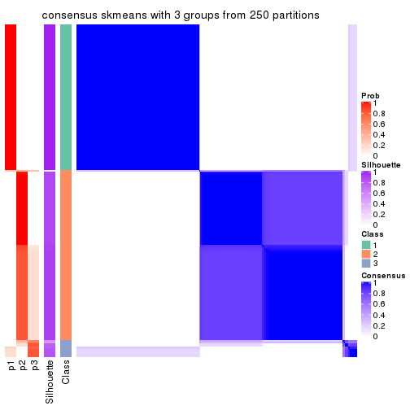</p>

</div>
<div id='tab-MAD-skmeans-consensus-heatmap-3'>
<pre><code class="r">consensus_heatmap(res, k = 4)
</code></pre>

<p></p>

</div>
<div id='tab-MAD-skmeans-consensus-heatmap-4'>
<pre><code class="r">consensus_heatmap(res, k = 5)
</code></pre>

<p></p>

</div>
<div id='tab-MAD-skmeans-consensus-heatmap-5'>
<pre><code class="r">consensus_heatmap(res, k = 6)
</code></pre>

<p></p>

</div>
</div>

Heatmaps for the membership of samples in all partitions to see how consistent they are:


<script>
$( function() {
	$( '#tabs-MAD-skmeans-membership-heatmap' ).tabs();
} );
</script>
<div id='tabs-MAD-skmeans-membership-heatmap'>
<ul>
<li><a href='#tab-MAD-skmeans-membership-heatmap-1'>k = 2</a></li>
<li><a href='#tab-MAD-skmeans-membership-heatmap-2'>k = 3</a></li>
<li><a href='#tab-MAD-skmeans-membership-heatmap-3'>k = 4</a></li>
<li><a href='#tab-MAD-skmeans-membership-heatmap-4'>k = 5</a></li>
<li><a href='#tab-MAD-skmeans-membership-heatmap-5'>k = 6</a></li>
</ul>
<div id='tab-MAD-skmeans-membership-heatmap-1'>
<pre><code class="r">membership_heatmap(res, k = 2)
</code></pre>

<p></p>

</div>
<div id='tab-MAD-skmeans-membership-heatmap-2'>
<pre><code class="r">membership_heatmap(res, k = 3)
</code></pre>

<p></p>

</div>
<div id='tab-MAD-skmeans-membership-heatmap-3'>
<pre><code class="r">membership_heatmap(res, k = 4)
</code></pre>

<p></p>

</div>
<div id='tab-MAD-skmeans-membership-heatmap-4'>
<pre><code class="r">membership_heatmap(res, k = 5)
</code></pre>

<p></p>

</div>
<div id='tab-MAD-skmeans-membership-heatmap-5'>
<pre><code class="r">membership_heatmap(res, k = 6)
</code></pre>

<p></p>

</div>
</div>

As soon as we have had the classes for columns, we can look for signatures
which are significantly different between classes which can be candidate marks
for certain classes. Following are the heatmaps for signatures.


Signature heatmaps where rows are scaled:


<script>
$( function() {
	$( '#tabs-MAD-skmeans-get-signatures' ).tabs();
} );
</script>
<div id='tabs-MAD-skmeans-get-signatures'>
<ul>
<li><a href='#tab-MAD-skmeans-get-signatures-1'>k = 2</a></li>
<li><a href='#tab-MAD-skmeans-get-signatures-2'>k = 3</a></li>
<li><a href='#tab-MAD-skmeans-get-signatures-3'>k = 4</a></li>
<li><a href='#tab-MAD-skmeans-get-signatures-4'>k = 5</a></li>
<li><a href='#tab-MAD-skmeans-get-signatures-5'>k = 6</a></li>
</ul>
<div id='tab-MAD-skmeans-get-signatures-1'>
<pre><code class="r">get_signatures(res, k = 2)
</code></pre>

<p></p>

</div>
<div id='tab-MAD-skmeans-get-signatures-2'>
<pre><code class="r">get_signatures(res, k = 3)
</code></pre>

<p></p>

</div>
<div id='tab-MAD-skmeans-get-signatures-3'>
<pre><code class="r">get_signatures(res, k = 4)
</code></pre>

<p></p>

</div>
<div id='tab-MAD-skmeans-get-signatures-4'>
<pre><code class="r">get_signatures(res, k = 5)
</code></pre>

<p></p>

</div>
<div id='tab-MAD-skmeans-get-signatures-5'>
<pre><code class="r">get_signatures(res, k = 6)
</code></pre>

<p></p>

</div>
</div>


Signature heatmaps where rows are not scaled:


<script>
$( function() {
	$( '#tabs-MAD-skmeans-get-signatures-no-scale' ).tabs();
} );
</script>
<div id='tabs-MAD-skmeans-get-signatures-no-scale'>
<ul>
<li><a href='#tab-MAD-skmeans-get-signatures-no-scale-1'>k = 2</a></li>
<li><a href='#tab-MAD-skmeans-get-signatures-no-scale-2'>k = 3</a></li>
<li><a href='#tab-MAD-skmeans-get-signatures-no-scale-3'>k = 4</a></li>
<li><a href='#tab-MAD-skmeans-get-signatures-no-scale-4'>k = 5</a></li>
<li><a href='#tab-MAD-skmeans-get-signatures-no-scale-5'>k = 6</a></li>
</ul>
<div id='tab-MAD-skmeans-get-signatures-no-scale-1'>
<pre><code class="r">get_signatures(res, k = 2, scale_rows = FALSE)
</code></pre>

<p></p>

</div>
<div id='tab-MAD-skmeans-get-signatures-no-scale-2'>
<pre><code class="r">get_signatures(res, k = 3, scale_rows = FALSE)
</code></pre>

<p></p>

</div>
<div id='tab-MAD-skmeans-get-signatures-no-scale-3'>
<pre><code class="r">get_signatures(res, k = 4, scale_rows = FALSE)
</code></pre>

<p></p>

</div>
<div id='tab-MAD-skmeans-get-signatures-no-scale-4'>
<pre><code class="r">get_signatures(res, k = 5, scale_rows = FALSE)
</code></pre>

<p></p>

</div>
<div id='tab-MAD-skmeans-get-signatures-no-scale-5'>
<pre><code class="r">get_signatures(res, k = 6, scale_rows = FALSE)
</code></pre>

<p></p>

</div>
</div>


Compare the overlap of signatures from different k:

```r
compare_signatures(res)
```


`get_signature()` returns a data frame invisibly. TO get the list of signatures, the function
call should be assigned to a variable explicitly. In following code, if `plot` argument is set
to `FALSE`, no heatmap is plotted while only the differential analysis is performed.

```r
# code only for demonstration
tb = get_signature(res, k = ..., plot = FALSE)
```

An example of the output of `tb` is:

```
#>   which_row         fdr    mean_1    mean_2 scaled_mean_1 scaled_mean_2 km
#> 1        38 0.042760348  8.373488  9.131774    -0.5533452     0.5164555  1
#> 2        40 0.018707592  7.106213  8.469186    -0.6173731     0.5762149  1
#> 3        55 0.019134737 10.221463 11.207825    -0.6159697     0.5749050  1
#> 4        59 0.006059896  5.921854  7.869574    -0.6899429     0.6439467  1
#> 5        60 0.018055526  8.928898 10.211722    -0.6204761     0.5791110  1
#> 6        98 0.009384629 15.714769 14.887706     0.6635654    -0.6193277  2
...
```

The columns in `tb` are:

1. `which_row`: row indices corresponding to the input matrix.
2. `fdr`: FDR for the differential test. 
3. `mean_x`: The mean value in group x.
4. `scaled_mean_x`: The mean value in group x after rows are scaled.
5. `km`: Row groups if k-means clustering is applied to rows.


UMAP plot which shows how samples are separated.


<script>
$( function() {
	$( '#tabs-MAD-skmeans-dimension-reduction' ).tabs();
} );
</script>
<div id='tabs-MAD-skmeans-dimension-reduction'>
<ul>
<li><a href='#tab-MAD-skmeans-dimension-reduction-1'>k = 2</a></li>
<li><a href='#tab-MAD-skmeans-dimension-reduction-2'>k = 3</a></li>
<li><a href='#tab-MAD-skmeans-dimension-reduction-3'>k = 4</a></li>
<li><a href='#tab-MAD-skmeans-dimension-reduction-4'>k = 5</a></li>
<li><a href='#tab-MAD-skmeans-dimension-reduction-5'>k = 6</a></li>
</ul>
<div id='tab-MAD-skmeans-dimension-reduction-1'>
<pre><code class="r">dimension_reduction(res, k = 2, method = &quot;UMAP&quot;)
</code></pre>

<p></p>

</div>
<div id='tab-MAD-skmeans-dimension-reduction-2'>
<pre><code class="r">dimension_reduction(res, k = 3, method = &quot;UMAP&quot;)
</code></pre>

<p></p>

</div>
<div id='tab-MAD-skmeans-dimension-reduction-3'>
<pre><code class="r">dimension_reduction(res, k = 4, method = &quot;UMAP&quot;)
</code></pre>

<p></p>

</div>
<div id='tab-MAD-skmeans-dimension-reduction-4'>
<pre><code class="r">dimension_reduction(res, k = 5, method = &quot;UMAP&quot;)
</code></pre>

<p></p>

</div>
<div id='tab-MAD-skmeans-dimension-reduction-5'>
<pre><code class="r">dimension_reduction(res, k = 6, method = &quot;UMAP&quot;)
</code></pre>

<p></p>

</div>
</div>


Following heatmap shows how subgroups are split when increasing `k`:

```r
collect_classes(res)
```


If matrix rows can be associated to genes, consider to use `functional_enrichment(res,
...)` to perform function enrichment for the signature genes. See [this vignette](http://bioconductor.org/packages/devel/bioc/vignettes/cola/inst/doc/functional_enrichment.html) for more detailed explanations.


 

---------------------------------------------------


### MAD:pam*


The object with results only for a single top-value method and a single partition method 
can be extracted as:

```r
res = res_list["MAD", "pam"]
# you can also extract it by
# res = res_list["MAD:pam"]
```

A summary of `res` and all the functions that can be applied to it:

```r
res
```

```
#> A 'ConsensusPartition' object with k = 2, 3, 4, 5, 6.
#>   On a matrix with 9126 rows and 192 columns.
#>   Top rows (913, 1826, 2738, 3650, 4563) are extracted by 'MAD' method.
#>   Subgroups are detected by 'pam' method.
#>   Performed in total 1250 partitions by row resampling.
#>   Best k for subgroups seems to be 4.
#> 
#> Following methods can be applied to this 'ConsensusPartition' object:
#>  [1] "cola_report"             "collect_classes"         "collect_plots"          
#>  [4] "collect_stats"           "colnames"                "compare_signatures"     
#>  [7] "consensus_heatmap"       "dimension_reduction"     "functional_enrichment"  
#> [10] "get_anno_col"            "get_anno"                "get_classes"            
#> [13] "get_consensus"           "get_matrix"              "get_membership"         
#> [16] "get_param"               "get_signatures"          "get_stats"              
#> [19] "is_best_k"               "is_stable_k"             "membership_heatmap"     
#> [22] "ncol"                    "nrow"                    "plot_ecdf"              
#> [25] "rownames"                "select_partition_number" "show"                   
#> [28] "suggest_best_k"          "test_to_known_factors"
```

`collect_plots()` function collects all the plots made from `res` for all `k` (number of partitions)
into one single page to provide an easy and fast comparison between different `k`.

```r
collect_plots(res)
```


The plots are:

- The first row: a plot of the ECDF (empirical cumulative distribution
  function) curves of the consensus matrix for each `k` and the heatmap of
  predicted classes for each `k`.
- The second row: heatmaps of the consensus matrix for each `k`.
- The third row: heatmaps of the membership matrix for each `k`.
- The fouth row: heatmaps of the signatures for each `k`.

All the plots in panels can be made by individual functions and they are
plotted later in this section.

`select_partition_number()` produces several plots showing different
statistics for choosing "optimized" `k`. There are following statistics:

- ECDF curves of the consensus matrix for each `k`;
- 1-PAC. [The PAC
  score](https://en.wikipedia.org/wiki/Consensus_clustering#Over-interpretation_potential_of_consensus_clustering)
  measures the proportion of the ambiguous subgrouping.
- Mean silhouette score.
- Concordance. The mean probability of fiting the consensus class ids in all
  partitions.
- Area increased. Denote $A_k$ as the area under the ECDF curve for current
  `k`, the area increased is defined as $A_k - A_{k-1}$.
- Rand index. The percent of pairs of samples that are both in a same cluster
  or both are not in a same cluster in the partition of k and k-1.
- Jaccard index. The ratio of pairs of samples are both in a same cluster in
  the partition of k and k-1 and the pairs of samples are both in a same
  cluster in the partition k or k-1.

The detailed explanations of these statistics can be found in [the _cola_
vignette](http://bioconductor.org/packages/devel/bioc/vignettes/cola/inst/doc/cola.html#toc_13).

Generally speaking, lower PAC score, higher mean silhouette score or higher
concordance corresponds to better partition. Rand index and Jaccard index
measure how similar the current partition is compared to partition with `k-1`.
If they are too similar, we won't accept `k` is better than `k-1`.

```r
select_partition_number(res)
```


The numeric values for all these statistics can be obtained by `get_stats()`.

```r
get_stats(res)
```

```
#>   k 1-PAC mean_silhouette concordance area_increased  Rand Jaccard
#> 2 2 1.000           1.000       1.000         0.5018 0.499   0.499
#> 3 3 0.823           0.884       0.897         0.2211 0.856   0.713
#> 4 4 0.948           0.903       0.964         0.0916 0.914   0.778
#> 5 5 0.761           0.680       0.786         0.0877 0.893   0.681
#> 6 6 0.772           0.760       0.868         0.0158 0.948   0.801
```

`suggest_best_k()` suggests the best $k$ based on these statistics. The rules are as follows:

- All $k$ with Jaccard index larger than 0.95 are removed because increasing
  $k$ does not provide enough extra information. If all $k$ are removed, it is
  marked as no subgroup is detected.
- For all $k$ with 1-PAC score larger than 0.9, the maximal $k$ is taken as
  the best $k$, and other $k$ are marked as optional $k$.
- If it does not fit the second rule. The $k$ with the maximal vote of the
  highest 1-PAC score, highest mean silhouette, and highest concordance is
  taken as the best $k$.

```r
suggest_best_k(res)
```

```
#> [1] 4
#> attr(,"optional")
#> [1] 2
```

There is also optional best $k$ = 2 that is worth to check.

Following shows the table of the partitions (You need to click the **show/hide
code output** link to see it). The membership matrix (columns with name `p*`)
is inferred by
[`clue::cl_consensus()`](https://www.rdocumentation.org/link/cl_consensus?package=clue)
function with the `SE` method. Basically the value in the membership matrix
represents the probability to belong to a certain group. The finall class
label for an item is determined with the group with highest probability it
belongs to.

In `get_classes()` function, the entropy is calculated from the membership
matrix and the silhouette score is calculated from the consensus matrix.


<script>
$( function() {
	$( '#tabs-MAD-pam-get-classes' ).tabs();
} );
</script>
<div id='tabs-MAD-pam-get-classes'>
<ul>
<li><a href='#tab-MAD-pam-get-classes-1'>k = 2</a></li>
<li><a href='#tab-MAD-pam-get-classes-2'>k = 3</a></li>
<li><a href='#tab-MAD-pam-get-classes-3'>k = 4</a></li>
<li><a href='#tab-MAD-pam-get-classes-4'>k = 5</a></li>
<li><a href='#tab-MAD-pam-get-classes-5'>k = 6</a></li>
</ul>

<div id='tab-MAD-pam-get-classes-1'>
<p><a id='tab-MAD-pam-get-classes-1-a' style='color:#0366d6' href='#'>show/hide code output</a></p>
<pre><code class="r">cbind(get_classes(res, k = 2), get_membership(res, k = 2))
</code></pre>

<pre><code>#&gt;            class entropy silhouette p1 p2
#&gt; SRR2074921     1       0          1  1  0
#&gt; SRR2074919     1       0          1  1  0
#&gt; SRR2074920     1       0          1  1  0
#&gt; SRR2074917     1       0          1  1  0
#&gt; SRR2074918     2       0          1  0  1
#&gt; SRR2074916     2       0          1  0  1
#&gt; SRR2074915     2       0          1  0  1
#&gt; SRR2074914     1       0          1  1  0
#&gt; SRR2074913     2       0          1  0  1
#&gt; SRR2074912     1       0          1  1  0
#&gt; SRR2074911     2       0          1  0  1
#&gt; SRR2074910     2       0          1  0  1
#&gt; SRR2074909     1       0          1  1  0
#&gt; SRR2074907     1       0          1  1  0
#&gt; SRR2074908     2       0          1  0  1
#&gt; SRR2074906     2       0          1  0  1
#&gt; SRR2074905     1       0          1  1  0
#&gt; SRR2074904     2       0          1  0  1
#&gt; SRR2074903     2       0          1  0  1
#&gt; SRR2074902     1       0          1  1  0
#&gt; SRR2074901     2       0          1  0  1
#&gt; SRR2074900     1       0          1  1  0
#&gt; SRR2074899     2       0          1  0  1
#&gt; SRR2074898     2       0          1  0  1
#&gt; SRR2074897     2       0          1  0  1
#&gt; SRR2074896     2       0          1  0  1
#&gt; SRR2074895     1       0          1  1  0
#&gt; SRR2074894     1       0          1  1  0
#&gt; SRR2074893     2       0          1  0  1
#&gt; SRR2074892     1       0          1  1  0
#&gt; SRR2074891     1       0          1  1  0
#&gt; SRR2074890     2       0          1  0  1
#&gt; SRR2074887     2       0          1  0  1
#&gt; SRR2074889     2       0          1  0  1
#&gt; SRR2074886     2       0          1  0  1
#&gt; SRR2074888     2       0          1  0  1
#&gt; SRR2074885     1       0          1  1  0
#&gt; SRR2074884     2       0          1  0  1
#&gt; SRR2074883     2       0          1  0  1
#&gt; SRR2074882     1       0          1  1  0
#&gt; SRR2074880     2       0          1  0  1
#&gt; SRR2074881     2       0          1  0  1
#&gt; SRR2074879     1       0          1  1  0
#&gt; SRR2074878     1       0          1  1  0
#&gt; SRR2074877     2       0          1  0  1
#&gt; SRR2074876     1       0          1  1  0
#&gt; SRR2074875     2       0          1  0  1
#&gt; SRR2074874     1       0          1  1  0
#&gt; SRR2074873     2       0          1  0  1
#&gt; SRR2074872     1       0          1  1  0
#&gt; SRR2074871     2       0          1  0  1
#&gt; SRR2074870     1       0          1  1  0
#&gt; SRR2074869     1       0          1  1  0
#&gt; SRR2074868     1       0          1  1  0
#&gt; SRR2074867     2       0          1  0  1
#&gt; SRR2074866     2       0          1  0  1
#&gt; SRR2074865     1       0          1  1  0
#&gt; SRR2074864     1       0          1  1  0
#&gt; SRR2074863     1       0          1  1  0
#&gt; SRR2074862     1       0          1  1  0
#&gt; SRR2074861     1       0          1  1  0
#&gt; SRR2074860     1       0          1  1  0
#&gt; SRR2074859     1       0          1  1  0
#&gt; SRR2074858     2       0          1  0  1
#&gt; SRR2074855     2       0          1  0  1
#&gt; SRR2074857     1       0          1  1  0
#&gt; SRR2074856     1       0          1  1  0
#&gt; SRR2074854     1       0          1  1  0
#&gt; SRR2074853     1       0          1  1  0
#&gt; SRR2074852     2       0          1  0  1
#&gt; SRR2074851     1       0          1  1  0
#&gt; SRR2074850     1       0          1  1  0
#&gt; SRR2074849     1       0          1  1  0
#&gt; SRR2074848     1       0          1  1  0
#&gt; SRR2074847     1       0          1  1  0
#&gt; SRR2074846     1       0          1  1  0
#&gt; SRR2074845     1       0          1  1  0
#&gt; SRR2074843     1       0          1  1  0
#&gt; SRR2074842     2       0          1  0  1
#&gt; SRR2074844     2       0          1  0  1
#&gt; SRR2074841     2       0          1  0  1
#&gt; SRR2074840     2       0          1  0  1
#&gt; SRR2074839     1       0          1  1  0
#&gt; SRR2074838     2       0          1  0  1
#&gt; SRR2074836     2       0          1  0  1
#&gt; SRR2074835     2       0          1  0  1
#&gt; SRR2074837     1       0          1  1  0
#&gt; SRR2074834     2       0          1  0  1
#&gt; SRR2074833     1       0          1  1  0
#&gt; SRR2074832     2       0          1  0  1
#&gt; SRR2074831     1       0          1  1  0
#&gt; SRR2074829     1       0          1  1  0
#&gt; SRR2074830     1       0          1  1  0
#&gt; SRR2074828     1       0          1  1  0
#&gt; SRR2074827     2       0          1  0  1
#&gt; SRR2074826     2       0          1  0  1
#&gt; SRR2074825     2       0          1  0  1
#&gt; SRR2074824     2       0          1  0  1
#&gt; SRR2074823     1       0          1  1  0
#&gt; SRR2074822     2       0          1  0  1
#&gt; SRR2074821     2       0          1  0  1
#&gt; SRR2074820     2       0          1  0  1
#&gt; SRR2074819     2       0          1  0  1
#&gt; SRR2074817     2       0          1  0  1
#&gt; SRR2074818     2       0          1  0  1
#&gt; SRR2074816     1       0          1  1  0
#&gt; SRR2074815     2       0          1  0  1
#&gt; SRR2074814     1       0          1  1  0
#&gt; SRR2074812     2       0          1  0  1
#&gt; SRR2074813     2       0          1  0  1
#&gt; SRR2074809     2       0          1  0  1
#&gt; SRR2074810     2       0          1  0  1
#&gt; SRR2074811     2       0          1  0  1
#&gt; SRR2074808     2       0          1  0  1
#&gt; SRR2074807     2       0          1  0  1
#&gt; SRR2074806     1       0          1  1  0
#&gt; SRR2074805     2       0          1  0  1
#&gt; SRR2074804     1       0          1  1  0
#&gt; SRR2074803     1       0          1  1  0
#&gt; SRR2074801     1       0          1  1  0
#&gt; SRR2074802     2       0          1  0  1
#&gt; SRR2074799     2       0          1  0  1
#&gt; SRR2074800     1       0          1  1  0
#&gt; SRR2074798     1       0          1  1  0
#&gt; SRR2074797     1       0          1  1  0
#&gt; SRR2074795     2       0          1  0  1
#&gt; SRR2074796     2       0          1  0  1
#&gt; SRR2074794     2       0          1  0  1
#&gt; SRR2074793     2       0          1  0  1
#&gt; SRR2074792     1       0          1  1  0
#&gt; SRR2074791     1       0          1  1  0
#&gt; SRR2074790     2       0          1  0  1
#&gt; SRR2074789     1       0          1  1  0
#&gt; SRR2074788     1       0          1  1  0
#&gt; SRR2074787     1       0          1  1  0
#&gt; SRR2074786     2       0          1  0  1
#&gt; SRR2074785     1       0          1  1  0
#&gt; SRR2074784     1       0          1  1  0
#&gt; SRR2074783     2       0          1  0  1
#&gt; SRR2074782     1       0          1  1  0
#&gt; SRR2074779     2       0          1  0  1
#&gt; SRR2074781     2       0          1  0  1
#&gt; SRR2074780     1       0          1  1  0
#&gt; SRR2074778     2       0          1  0  1
#&gt; SRR2074777     2       0          1  0  1
#&gt; SRR2074776     2       0          1  0  1
#&gt; SRR2074775     1       0          1  1  0
#&gt; SRR2074774     1       0          1  1  0
#&gt; SRR2074773     2       0          1  0  1
#&gt; SRR2074771     2       0          1  0  1
#&gt; SRR2074772     1       0          1  1  0
#&gt; SRR2074770     1       0          1  1  0
#&gt; SRR2074769     2       0          1  0  1
#&gt; SRR2074768     2       0          1  0  1
#&gt; SRR2074766     2       0          1  0  1
#&gt; SRR2074767     1       0          1  1  0
#&gt; SRR2074765     1       0          1  1  0
#&gt; SRR2074764     2       0          1  0  1
#&gt; SRR2074763     2       0          1  0  1
#&gt; SRR2074761     1       0          1  1  0
#&gt; SRR2074762     2       0          1  0  1
#&gt; SRR2074760     2       0          1  0  1
#&gt; SRR2074759     1       0          1  1  0
#&gt; SRR2074757     2       0          1  0  1
#&gt; SRR2074758     2       0          1  0  1
#&gt; SRR2074756     2       0          1  0  1
#&gt; SRR2074755     1       0          1  1  0
#&gt; SRR2074754     1       0          1  1  0
#&gt; SRR2074753     2       0          1  0  1
#&gt; SRR2074752     1       0          1  1  0
#&gt; SRR2074751     1       0          1  1  0
#&gt; SRR2074749     2       0          1  0  1
#&gt; SRR2074750     1       0          1  1  0
#&gt; SRR2074748     1       0          1  1  0
#&gt; SRR2074747     2       0          1  0  1
#&gt; SRR2074745     1       0          1  1  0
#&gt; SRR2074746     1       0          1  1  0
#&gt; SRR2074744     2       0          1  0  1
#&gt; SRR2074743     2       0          1  0  1
#&gt; SRR2074742     2       0          1  0  1
#&gt; SRR2074741     1       0          1  1  0
#&gt; SRR2074740     2       0          1  0  1
#&gt; SRR2074739     1       0          1  1  0
#&gt; SRR2074738     2       0          1  0  1
#&gt; SRR2074737     2       0          1  0  1
#&gt; SRR2074736     2       0          1  0  1
#&gt; SRR2074735     1       0          1  1  0
#&gt; SRR2074734     2       0          1  0  1
#&gt; SRR2074733     1       0          1  1  0
#&gt; SRR2074732     2       0          1  0  1
#&gt; SRR2074731     2       0          1  0  1
#&gt; SRR2074730     1       0          1  1  0
</code></pre>

<script>
$('#tab-MAD-pam-get-classes-1-a').parent().next().next().hide();
$('#tab-MAD-pam-get-classes-1-a').click(function(){
  $('#tab-MAD-pam-get-classes-1-a').parent().next().next().toggle();
  return(false);
});
</script>
</div>

<div id='tab-MAD-pam-get-classes-2'>
<p><a id='tab-MAD-pam-get-classes-2-a' style='color:#0366d6' href='#'>show/hide code output</a></p>
<pre><code class="r">cbind(get_classes(res, k = 3), get_membership(res, k = 3))
</code></pre>

<pre><code>#&gt;            class entropy silhouette    p1    p2    p3
#&gt; SRR2074921     1  0.6161     0.7309 0.708 0.020 0.272
#&gt; SRR2074919     1  0.5327     0.7527 0.728 0.000 0.272
#&gt; SRR2074920     1  0.5327     0.7527 0.728 0.000 0.272
#&gt; SRR2074917     1  0.5327     0.7527 0.728 0.000 0.272
#&gt; SRR2074918     3  0.6307    -0.2926 0.000 0.488 0.512
#&gt; SRR2074916     3  0.5327     0.9722 0.000 0.272 0.728
#&gt; SRR2074915     2  0.0000     0.8760 0.000 1.000 0.000
#&gt; SRR2074914     1  0.0000     0.9848 1.000 0.000 0.000
#&gt; SRR2074913     2  0.0000     0.8760 0.000 1.000 0.000
#&gt; SRR2074912     1  0.5327     0.7527 0.728 0.000 0.272
#&gt; SRR2074911     2  0.6095    -0.0572 0.000 0.608 0.392
#&gt; SRR2074910     2  0.0000     0.8760 0.000 1.000 0.000
#&gt; SRR2074909     1  0.0000     0.9848 1.000 0.000 0.000
#&gt; SRR2074907     1  0.0000     0.9848 1.000 0.000 0.000
#&gt; SRR2074908     2  0.0000     0.8760 0.000 1.000 0.000
#&gt; SRR2074906     3  0.5327     0.9722 0.000 0.272 0.728
#&gt; SRR2074905     1  0.0000     0.9848 1.000 0.000 0.000
#&gt; SRR2074904     2  0.0000     0.8760 0.000 1.000 0.000
#&gt; SRR2074903     2  0.5988     0.1359 0.000 0.632 0.368
#&gt; SRR2074902     1  0.0000     0.9848 1.000 0.000 0.000
#&gt; SRR2074901     2  0.0000     0.8760 0.000 1.000 0.000
#&gt; SRR2074900     1  0.0000     0.9848 1.000 0.000 0.000
#&gt; SRR2074899     2  0.6244    -0.2309 0.000 0.560 0.440
#&gt; SRR2074898     3  0.5327     0.9722 0.000 0.272 0.728
#&gt; SRR2074897     3  0.5327     0.9722 0.000 0.272 0.728
#&gt; SRR2074896     2  0.0000     0.8760 0.000 1.000 0.000
#&gt; SRR2074895     1  0.0000     0.9848 1.000 0.000 0.000
#&gt; SRR2074894     2  0.5327     0.4698 0.272 0.728 0.000
#&gt; SRR2074893     2  0.4346     0.6483 0.000 0.816 0.184
#&gt; SRR2074892     1  0.0000     0.9848 1.000 0.000 0.000
#&gt; SRR2074891     1  0.0000     0.9848 1.000 0.000 0.000
#&gt; SRR2074890     2  0.0000     0.8760 0.000 1.000 0.000
#&gt; SRR2074887     2  0.0000     0.8760 0.000 1.000 0.000
#&gt; SRR2074889     3  0.5327     0.9722 0.000 0.272 0.728
#&gt; SRR2074886     2  0.4931     0.5567 0.000 0.768 0.232
#&gt; SRR2074888     3  0.5327     0.9722 0.000 0.272 0.728
#&gt; SRR2074885     1  0.0000     0.9848 1.000 0.000 0.000
#&gt; SRR2074884     3  0.5327     0.9722 0.000 0.272 0.728
#&gt; SRR2074883     3  0.5327     0.9722 0.000 0.272 0.728
#&gt; SRR2074882     1  0.0000     0.9848 1.000 0.000 0.000
#&gt; SRR2074880     3  0.5327     0.9722 0.000 0.272 0.728
#&gt; SRR2074881     2  0.0000     0.8760 0.000 1.000 0.000
#&gt; SRR2074879     1  0.5327     0.7527 0.728 0.000 0.272
#&gt; SRR2074878     1  0.0000     0.9848 1.000 0.000 0.000
#&gt; SRR2074877     3  0.6267     0.6047 0.000 0.452 0.548
#&gt; SRR2074876     1  0.0000     0.9848 1.000 0.000 0.000
#&gt; SRR2074875     3  0.5327     0.9722 0.000 0.272 0.728
#&gt; SRR2074874     1  0.0000     0.9848 1.000 0.000 0.000
#&gt; SRR2074873     3  0.5327     0.9722 0.000 0.272 0.728
#&gt; SRR2074872     1  0.0000     0.9848 1.000 0.000 0.000
#&gt; SRR2074871     2  0.0000     0.8760 0.000 1.000 0.000
#&gt; SRR2074870     1  0.0000     0.9848 1.000 0.000 0.000
#&gt; SRR2074869     1  0.0000     0.9848 1.000 0.000 0.000
#&gt; SRR2074868     1  0.0000     0.9848 1.000 0.000 0.000
#&gt; SRR2074867     2  0.0000     0.8760 0.000 1.000 0.000
#&gt; SRR2074866     2  0.0592     0.8659 0.000 0.988 0.012
#&gt; SRR2074865     1  0.0000     0.9848 1.000 0.000 0.000
#&gt; SRR2074864     1  0.0000     0.9848 1.000 0.000 0.000
#&gt; SRR2074863     1  0.0000     0.9848 1.000 0.000 0.000
#&gt; SRR2074862     1  0.0000     0.9848 1.000 0.000 0.000
#&gt; SRR2074861     1  0.0000     0.9848 1.000 0.000 0.000
#&gt; SRR2074860     1  0.0000     0.9848 1.000 0.000 0.000
#&gt; SRR2074859     1  0.0000     0.9848 1.000 0.000 0.000
#&gt; SRR2074858     2  0.0000     0.8760 0.000 1.000 0.000
#&gt; SRR2074855     3  0.5327     0.9722 0.000 0.272 0.728
#&gt; SRR2074857     1  0.0000     0.9848 1.000 0.000 0.000
#&gt; SRR2074856     1  0.0000     0.9848 1.000 0.000 0.000
#&gt; SRR2074854     1  0.0000     0.9848 1.000 0.000 0.000
#&gt; SRR2074853     1  0.0000     0.9848 1.000 0.000 0.000
#&gt; SRR2074852     3  0.5327     0.9722 0.000 0.272 0.728
#&gt; SRR2074851     1  0.0000     0.9848 1.000 0.000 0.000
#&gt; SRR2074850     1  0.0000     0.9848 1.000 0.000 0.000
#&gt; SRR2074849     1  0.0000     0.9848 1.000 0.000 0.000
#&gt; SRR2074848     1  0.0000     0.9848 1.000 0.000 0.000
#&gt; SRR2074847     1  0.0000     0.9848 1.000 0.000 0.000
#&gt; SRR2074846     1  0.0000     0.9848 1.000 0.000 0.000
#&gt; SRR2074845     1  0.0000     0.9848 1.000 0.000 0.000
#&gt; SRR2074843     1  0.0000     0.9848 1.000 0.000 0.000
#&gt; SRR2074842     2  0.0000     0.8760 0.000 1.000 0.000
#&gt; SRR2074844     2  0.0000     0.8760 0.000 1.000 0.000
#&gt; SRR2074841     3  0.5327     0.9722 0.000 0.272 0.728
#&gt; SRR2074840     3  0.5327     0.9722 0.000 0.272 0.728
#&gt; SRR2074839     1  0.0000     0.9848 1.000 0.000 0.000
#&gt; SRR2074838     3  0.5327     0.9722 0.000 0.272 0.728
#&gt; SRR2074836     2  0.0000     0.8760 0.000 1.000 0.000
#&gt; SRR2074835     3  0.5327     0.9722 0.000 0.272 0.728
#&gt; SRR2074837     1  0.0000     0.9848 1.000 0.000 0.000
#&gt; SRR2074834     2  0.0000     0.8760 0.000 1.000 0.000
#&gt; SRR2074833     1  0.0000     0.9848 1.000 0.000 0.000
#&gt; SRR2074832     2  0.4931     0.5579 0.000 0.768 0.232
#&gt; SRR2074831     1  0.0000     0.9848 1.000 0.000 0.000
#&gt; SRR2074829     1  0.0000     0.9848 1.000 0.000 0.000
#&gt; SRR2074830     1  0.0000     0.9848 1.000 0.000 0.000
#&gt; SRR2074828     1  0.0000     0.9848 1.000 0.000 0.000
#&gt; SRR2074827     2  0.0000     0.8760 0.000 1.000 0.000
#&gt; SRR2074826     2  0.0000     0.8760 0.000 1.000 0.000
#&gt; SRR2074825     3  0.5327     0.9722 0.000 0.272 0.728
#&gt; SRR2074824     3  0.5327     0.9722 0.000 0.272 0.728
#&gt; SRR2074823     1  0.0000     0.9848 1.000 0.000 0.000
#&gt; SRR2074822     3  0.5327     0.9722 0.000 0.272 0.728
#&gt; SRR2074821     2  0.6274    -0.2809 0.000 0.544 0.456
#&gt; SRR2074820     3  0.5327     0.9722 0.000 0.272 0.728
#&gt; SRR2074819     2  0.0592     0.8666 0.000 0.988 0.012
#&gt; SRR2074817     2  0.0000     0.8760 0.000 1.000 0.000
#&gt; SRR2074818     3  0.5327     0.9722 0.000 0.272 0.728
#&gt; SRR2074816     1  0.0000     0.9848 1.000 0.000 0.000
#&gt; SRR2074815     2  0.0000     0.8760 0.000 1.000 0.000
#&gt; SRR2074814     1  0.0000     0.9848 1.000 0.000 0.000
#&gt; SRR2074812     3  0.5327     0.9722 0.000 0.272 0.728
#&gt; SRR2074813     3  0.5327     0.9722 0.000 0.272 0.728
#&gt; SRR2074809     3  0.5327     0.9722 0.000 0.272 0.728
#&gt; SRR2074810     2  0.0000     0.8760 0.000 1.000 0.000
#&gt; SRR2074811     3  0.5327     0.9722 0.000 0.272 0.728
#&gt; SRR2074808     2  0.0000     0.8760 0.000 1.000 0.000
#&gt; SRR2074807     2  0.0424     0.8699 0.000 0.992 0.008
#&gt; SRR2074806     1  0.0000     0.9848 1.000 0.000 0.000
#&gt; SRR2074805     3  0.5327     0.9722 0.000 0.272 0.728
#&gt; SRR2074804     1  0.0000     0.9848 1.000 0.000 0.000
#&gt; SRR2074803     1  0.0000     0.9848 1.000 0.000 0.000
#&gt; SRR2074801     1  0.0000     0.9848 1.000 0.000 0.000
#&gt; SRR2074802     2  0.0000     0.8760 0.000 1.000 0.000
#&gt; SRR2074799     3  0.5327     0.9722 0.000 0.272 0.728
#&gt; SRR2074800     1  0.0000     0.9848 1.000 0.000 0.000
#&gt; SRR2074798     1  0.0000     0.9848 1.000 0.000 0.000
#&gt; SRR2074797     1  0.0000     0.9848 1.000 0.000 0.000
#&gt; SRR2074795     3  0.5327     0.9722 0.000 0.272 0.728
#&gt; SRR2074796     2  0.0000     0.8760 0.000 1.000 0.000
#&gt; SRR2074794     3  0.5327     0.9722 0.000 0.272 0.728
#&gt; SRR2074793     2  0.5254     0.4856 0.000 0.736 0.264
#&gt; SRR2074792     1  0.0000     0.9848 1.000 0.000 0.000
#&gt; SRR2074791     1  0.0000     0.9848 1.000 0.000 0.000
#&gt; SRR2074790     3  0.5327     0.9722 0.000 0.272 0.728
#&gt; SRR2074789     1  0.0000     0.9848 1.000 0.000 0.000
#&gt; SRR2074788     1  0.0000     0.9848 1.000 0.000 0.000
#&gt; SRR2074787     1  0.0000     0.9848 1.000 0.000 0.000
#&gt; SRR2074786     2  0.0000     0.8760 0.000 1.000 0.000
#&gt; SRR2074785     1  0.0000     0.9848 1.000 0.000 0.000
#&gt; SRR2074784     1  0.0000     0.9848 1.000 0.000 0.000
#&gt; SRR2074783     3  0.5327     0.9722 0.000 0.272 0.728
#&gt; SRR2074782     1  0.0000     0.9848 1.000 0.000 0.000
#&gt; SRR2074779     2  0.0000     0.8760 0.000 1.000 0.000
#&gt; SRR2074781     2  0.0000     0.8760 0.000 1.000 0.000
#&gt; SRR2074780     1  0.0000     0.9848 1.000 0.000 0.000
#&gt; SRR2074778     2  0.0424     0.8700 0.000 0.992 0.008
#&gt; SRR2074777     2  0.0000     0.8760 0.000 1.000 0.000
#&gt; SRR2074776     3  0.5327     0.9722 0.000 0.272 0.728
#&gt; SRR2074775     1  0.0000     0.9848 1.000 0.000 0.000
#&gt; SRR2074774     1  0.0000     0.9848 1.000 0.000 0.000
#&gt; SRR2074773     2  0.0000     0.8760 0.000 1.000 0.000
#&gt; SRR2074771     2  0.0000     0.8760 0.000 1.000 0.000
#&gt; SRR2074772     1  0.0000     0.9848 1.000 0.000 0.000
#&gt; SRR2074770     1  0.0000     0.9848 1.000 0.000 0.000
#&gt; SRR2074769     3  0.5327     0.9722 0.000 0.272 0.728
#&gt; SRR2074768     3  0.5327     0.9722 0.000 0.272 0.728
#&gt; SRR2074766     2  0.0000     0.8760 0.000 1.000 0.000
#&gt; SRR2074767     1  0.0000     0.9848 1.000 0.000 0.000
#&gt; SRR2074765     1  0.0000     0.9848 1.000 0.000 0.000
#&gt; SRR2074764     2  0.0000     0.8760 0.000 1.000 0.000
#&gt; SRR2074763     3  0.5327     0.9722 0.000 0.272 0.728
#&gt; SRR2074761     1  0.0000     0.9848 1.000 0.000 0.000
#&gt; SRR2074762     2  0.0000     0.8760 0.000 1.000 0.000
#&gt; SRR2074760     2  0.5291     0.4755 0.000 0.732 0.268
#&gt; SRR2074759     1  0.0000     0.9848 1.000 0.000 0.000
#&gt; SRR2074757     2  0.6095     0.0159 0.000 0.608 0.392
#&gt; SRR2074758     3  0.5327     0.9722 0.000 0.272 0.728
#&gt; SRR2074756     2  0.0000     0.8760 0.000 1.000 0.000
#&gt; SRR2074755     1  0.0000     0.9848 1.000 0.000 0.000
#&gt; SRR2074754     1  0.0000     0.9848 1.000 0.000 0.000
#&gt; SRR2074753     2  0.0000     0.8760 0.000 1.000 0.000
#&gt; SRR2074752     1  0.0000     0.9848 1.000 0.000 0.000
#&gt; SRR2074751     1  0.0000     0.9848 1.000 0.000 0.000
#&gt; SRR2074749     2  0.6154    -0.0601 0.000 0.592 0.408
#&gt; SRR2074750     1  0.0000     0.9848 1.000 0.000 0.000
#&gt; SRR2074748     1  0.0000     0.9848 1.000 0.000 0.000
#&gt; SRR2074747     2  0.0000     0.8760 0.000 1.000 0.000
#&gt; SRR2074745     1  0.0000     0.9848 1.000 0.000 0.000
#&gt; SRR2074746     1  0.0000     0.9848 1.000 0.000 0.000
#&gt; SRR2074744     2  0.0000     0.8760 0.000 1.000 0.000
#&gt; SRR2074743     2  0.1031     0.8552 0.000 0.976 0.024
#&gt; SRR2074742     2  0.5591     0.3095 0.000 0.696 0.304
#&gt; SRR2074741     1  0.0000     0.9848 1.000 0.000 0.000
#&gt; SRR2074740     2  0.0000     0.8760 0.000 1.000 0.000
#&gt; SRR2074739     1  0.0000     0.9848 1.000 0.000 0.000
#&gt; SRR2074738     2  0.5835     0.2489 0.000 0.660 0.340
#&gt; SRR2074737     3  0.5327     0.9722 0.000 0.272 0.728
#&gt; SRR2074736     2  0.5216     0.4971 0.000 0.740 0.260
#&gt; SRR2074735     1  0.0000     0.9848 1.000 0.000 0.000
#&gt; SRR2074734     3  0.5327     0.9722 0.000 0.272 0.728
#&gt; SRR2074733     1  0.0000     0.9848 1.000 0.000 0.000
#&gt; SRR2074732     3  0.5327     0.9722 0.000 0.272 0.728
#&gt; SRR2074731     3  0.5327     0.9722 0.000 0.272 0.728
#&gt; SRR2074730     1  0.0000     0.9848 1.000 0.000 0.000
</code></pre>

<script>
$('#tab-MAD-pam-get-classes-2-a').parent().next().next().hide();
$('#tab-MAD-pam-get-classes-2-a').click(function(){
  $('#tab-MAD-pam-get-classes-2-a').parent().next().next().toggle();
  return(false);
});
</script>
</div>

<div id='tab-MAD-pam-get-classes-3'>
<p><a id='tab-MAD-pam-get-classes-3-a' style='color:#0366d6' href='#'>show/hide code output</a></p>
<pre><code class="r">cbind(get_classes(res, k = 4), get_membership(res, k = 4))
</code></pre>

<pre><code>#&gt;            class entropy silhouette    p1    p2    p3    p4
#&gt; SRR2074921     3  0.0000      0.999 0.000 0.000 1.000 0.000
#&gt; SRR2074919     3  0.0000      0.999 0.000 0.000 1.000 0.000
#&gt; SRR2074920     3  0.0000      0.999 0.000 0.000 1.000 0.000
#&gt; SRR2074917     3  0.0188      0.995 0.004 0.000 0.996 0.000
#&gt; SRR2074918     4  0.3975      0.622 0.000 0.240 0.000 0.760
#&gt; SRR2074916     2  0.0000      0.883 0.000 1.000 0.000 0.000
#&gt; SRR2074915     4  0.0000      0.932 0.000 0.000 0.000 1.000
#&gt; SRR2074914     1  0.0000      1.000 1.000 0.000 0.000 0.000
#&gt; SRR2074913     4  0.0000      0.932 0.000 0.000 0.000 1.000
#&gt; SRR2074912     3  0.0000      0.999 0.000 0.000 1.000 0.000
#&gt; SRR2074911     4  0.4830      0.328 0.000 0.392 0.000 0.608
#&gt; SRR2074910     4  0.0000      0.932 0.000 0.000 0.000 1.000
#&gt; SRR2074909     1  0.0000      1.000 1.000 0.000 0.000 0.000
#&gt; SRR2074907     1  0.0000      1.000 1.000 0.000 0.000 0.000
#&gt; SRR2074908     4  0.0000      0.932 0.000 0.000 0.000 1.000
#&gt; SRR2074906     2  0.0000      0.883 0.000 1.000 0.000 0.000
#&gt; SRR2074905     1  0.0000      1.000 1.000 0.000 0.000 0.000
#&gt; SRR2074904     4  0.0000      0.932 0.000 0.000 0.000 1.000
#&gt; SRR2074903     2  0.4713      0.477 0.000 0.640 0.000 0.360
#&gt; SRR2074902     1  0.0000      1.000 1.000 0.000 0.000 0.000
#&gt; SRR2074901     4  0.1716      0.880 0.000 0.064 0.000 0.936
#&gt; SRR2074900     1  0.0000      1.000 1.000 0.000 0.000 0.000
#&gt; SRR2074899     2  0.4331      0.607 0.000 0.712 0.000 0.288
#&gt; SRR2074898     2  0.0000      0.883 0.000 1.000 0.000 0.000
#&gt; SRR2074897     2  0.0000      0.883 0.000 1.000 0.000 0.000
#&gt; SRR2074896     4  0.0000      0.932 0.000 0.000 0.000 1.000
#&gt; SRR2074895     1  0.0000      1.000 1.000 0.000 0.000 0.000
#&gt; SRR2074894     4  0.0000      0.932 0.000 0.000 0.000 1.000
#&gt; SRR2074893     4  0.4967      0.065 0.000 0.452 0.000 0.548
#&gt; SRR2074892     1  0.0000      1.000 1.000 0.000 0.000 0.000
#&gt; SRR2074891     1  0.0000      1.000 1.000 0.000 0.000 0.000
#&gt; SRR2074890     4  0.0000      0.932 0.000 0.000 0.000 1.000
#&gt; SRR2074887     4  0.0000      0.932 0.000 0.000 0.000 1.000
#&gt; SRR2074889     2  0.0000      0.883 0.000 1.000 0.000 0.000
#&gt; SRR2074886     2  0.5000      0.112 0.000 0.504 0.000 0.496
#&gt; SRR2074888     2  0.0000      0.883 0.000 1.000 0.000 0.000
#&gt; SRR2074885     1  0.0000      1.000 1.000 0.000 0.000 0.000
#&gt; SRR2074884     2  0.0000      0.883 0.000 1.000 0.000 0.000
#&gt; SRR2074883     2  0.0000      0.883 0.000 1.000 0.000 0.000
#&gt; SRR2074882     1  0.0000      1.000 1.000 0.000 0.000 0.000
#&gt; SRR2074880     2  0.0000      0.883 0.000 1.000 0.000 0.000
#&gt; SRR2074881     4  0.0000      0.932 0.000 0.000 0.000 1.000
#&gt; SRR2074879     3  0.0000      0.999 0.000 0.000 1.000 0.000
#&gt; SRR2074878     1  0.0000      1.000 1.000 0.000 0.000 0.000
#&gt; SRR2074877     2  0.3726      0.683 0.000 0.788 0.000 0.212
#&gt; SRR2074876     1  0.0000      1.000 1.000 0.000 0.000 0.000
#&gt; SRR2074875     2  0.0000      0.883 0.000 1.000 0.000 0.000
#&gt; SRR2074874     1  0.0000      1.000 1.000 0.000 0.000 0.000
#&gt; SRR2074873     2  0.0000      0.883 0.000 1.000 0.000 0.000
#&gt; SRR2074872     1  0.0000      1.000 1.000 0.000 0.000 0.000
#&gt; SRR2074871     4  0.0000      0.932 0.000 0.000 0.000 1.000
#&gt; SRR2074870     1  0.0000      1.000 1.000 0.000 0.000 0.000
#&gt; SRR2074869     1  0.0000      1.000 1.000 0.000 0.000 0.000
#&gt; SRR2074868     1  0.0000      1.000 1.000 0.000 0.000 0.000
#&gt; SRR2074867     4  0.0000      0.932 0.000 0.000 0.000 1.000
#&gt; SRR2074866     4  0.0469      0.923 0.000 0.012 0.000 0.988
#&gt; SRR2074865     1  0.0000      1.000 1.000 0.000 0.000 0.000
#&gt; SRR2074864     1  0.0000      1.000 1.000 0.000 0.000 0.000
#&gt; SRR2074863     1  0.0000      1.000 1.000 0.000 0.000 0.000
#&gt; SRR2074862     1  0.0000      1.000 1.000 0.000 0.000 0.000
#&gt; SRR2074861     1  0.0000      1.000 1.000 0.000 0.000 0.000
#&gt; SRR2074860     1  0.0000      1.000 1.000 0.000 0.000 0.000
#&gt; SRR2074859     1  0.0000      1.000 1.000 0.000 0.000 0.000
#&gt; SRR2074858     4  0.0000      0.932 0.000 0.000 0.000 1.000
#&gt; SRR2074855     2  0.0000      0.883 0.000 1.000 0.000 0.000
#&gt; SRR2074857     1  0.0000      1.000 1.000 0.000 0.000 0.000
#&gt; SRR2074856     1  0.0000      1.000 1.000 0.000 0.000 0.000
#&gt; SRR2074854     1  0.0000      1.000 1.000 0.000 0.000 0.000
#&gt; SRR2074853     1  0.0000      1.000 1.000 0.000 0.000 0.000
#&gt; SRR2074852     2  0.0000      0.883 0.000 1.000 0.000 0.000
#&gt; SRR2074851     1  0.0000      1.000 1.000 0.000 0.000 0.000
#&gt; SRR2074850     1  0.0000      1.000 1.000 0.000 0.000 0.000
#&gt; SRR2074849     1  0.0000      1.000 1.000 0.000 0.000 0.000
#&gt; SRR2074848     1  0.0000      1.000 1.000 0.000 0.000 0.000
#&gt; SRR2074847     1  0.0000      1.000 1.000 0.000 0.000 0.000
#&gt; SRR2074846     1  0.0000      1.000 1.000 0.000 0.000 0.000
#&gt; SRR2074845     1  0.0000      1.000 1.000 0.000 0.000 0.000
#&gt; SRR2074843     1  0.0000      1.000 1.000 0.000 0.000 0.000
#&gt; SRR2074842     4  0.0000      0.932 0.000 0.000 0.000 1.000
#&gt; SRR2074844     4  0.1474      0.891 0.000 0.052 0.000 0.948
#&gt; SRR2074841     2  0.0000      0.883 0.000 1.000 0.000 0.000
#&gt; SRR2074840     2  0.0000      0.883 0.000 1.000 0.000 0.000
#&gt; SRR2074839     1  0.0000      1.000 1.000 0.000 0.000 0.000
#&gt; SRR2074838     2  0.0000      0.883 0.000 1.000 0.000 0.000
#&gt; SRR2074836     4  0.0000      0.932 0.000 0.000 0.000 1.000
#&gt; SRR2074835     2  0.0000      0.883 0.000 1.000 0.000 0.000
#&gt; SRR2074837     1  0.0000      1.000 1.000 0.000 0.000 0.000
#&gt; SRR2074834     4  0.0000      0.932 0.000 0.000 0.000 1.000
#&gt; SRR2074833     1  0.0000      1.000 1.000 0.000 0.000 0.000
#&gt; SRR2074832     2  0.5000      0.111 0.000 0.504 0.000 0.496
#&gt; SRR2074831     1  0.0000      1.000 1.000 0.000 0.000 0.000
#&gt; SRR2074829     1  0.0000      1.000 1.000 0.000 0.000 0.000
#&gt; SRR2074830     1  0.0000      1.000 1.000 0.000 0.000 0.000
#&gt; SRR2074828     1  0.0000      1.000 1.000 0.000 0.000 0.000
#&gt; SRR2074827     4  0.0000      0.932 0.000 0.000 0.000 1.000
#&gt; SRR2074826     4  0.0000      0.932 0.000 0.000 0.000 1.000
#&gt; SRR2074825     2  0.0000      0.883 0.000 1.000 0.000 0.000
#&gt; SRR2074824     2  0.0000      0.883 0.000 1.000 0.000 0.000
#&gt; SRR2074823     1  0.0000      1.000 1.000 0.000 0.000 0.000
#&gt; SRR2074822     2  0.0000      0.883 0.000 1.000 0.000 0.000
#&gt; SRR2074821     2  0.4222      0.624 0.000 0.728 0.000 0.272
#&gt; SRR2074820     2  0.0000      0.883 0.000 1.000 0.000 0.000
#&gt; SRR2074819     4  0.3219      0.764 0.000 0.164 0.000 0.836
#&gt; SRR2074817     4  0.0000      0.932 0.000 0.000 0.000 1.000
#&gt; SRR2074818     2  0.0000      0.883 0.000 1.000 0.000 0.000
#&gt; SRR2074816     1  0.0000      1.000 1.000 0.000 0.000 0.000
#&gt; SRR2074815     4  0.0592      0.922 0.000 0.016 0.000 0.984
#&gt; SRR2074814     1  0.0000      1.000 1.000 0.000 0.000 0.000
#&gt; SRR2074812     2  0.0000      0.883 0.000 1.000 0.000 0.000
#&gt; SRR2074813     2  0.0000      0.883 0.000 1.000 0.000 0.000
#&gt; SRR2074809     2  0.0000      0.883 0.000 1.000 0.000 0.000
#&gt; SRR2074810     4  0.0000      0.932 0.000 0.000 0.000 1.000
#&gt; SRR2074811     2  0.0000      0.883 0.000 1.000 0.000 0.000
#&gt; SRR2074808     4  0.0707      0.919 0.000 0.020 0.000 0.980
#&gt; SRR2074807     4  0.2469      0.833 0.000 0.108 0.000 0.892
#&gt; SRR2074806     1  0.0000      1.000 1.000 0.000 0.000 0.000
#&gt; SRR2074805     2  0.0000      0.883 0.000 1.000 0.000 0.000
#&gt; SRR2074804     1  0.0000      1.000 1.000 0.000 0.000 0.000
#&gt; SRR2074803     1  0.0000      1.000 1.000 0.000 0.000 0.000
#&gt; SRR2074801     1  0.0000      1.000 1.000 0.000 0.000 0.000
#&gt; SRR2074802     4  0.0000      0.932 0.000 0.000 0.000 1.000
#&gt; SRR2074799     2  0.0000      0.883 0.000 1.000 0.000 0.000
#&gt; SRR2074800     1  0.0000      1.000 1.000 0.000 0.000 0.000
#&gt; SRR2074798     1  0.0000      1.000 1.000 0.000 0.000 0.000
#&gt; SRR2074797     1  0.0000      1.000 1.000 0.000 0.000 0.000
#&gt; SRR2074795     2  0.0000      0.883 0.000 1.000 0.000 0.000
#&gt; SRR2074796     4  0.0817      0.917 0.000 0.024 0.000 0.976
#&gt; SRR2074794     2  0.0000      0.883 0.000 1.000 0.000 0.000
#&gt; SRR2074793     2  0.4981      0.219 0.000 0.536 0.000 0.464
#&gt; SRR2074792     1  0.0000      1.000 1.000 0.000 0.000 0.000
#&gt; SRR2074791     1  0.0000      1.000 1.000 0.000 0.000 0.000
#&gt; SRR2074790     2  0.0000      0.883 0.000 1.000 0.000 0.000
#&gt; SRR2074789     1  0.0000      1.000 1.000 0.000 0.000 0.000
#&gt; SRR2074788     1  0.0000      1.000 1.000 0.000 0.000 0.000
#&gt; SRR2074787     1  0.0000      1.000 1.000 0.000 0.000 0.000
#&gt; SRR2074786     4  0.0921      0.913 0.000 0.028 0.000 0.972
#&gt; SRR2074785     1  0.0000      1.000 1.000 0.000 0.000 0.000
#&gt; SRR2074784     1  0.0000      1.000 1.000 0.000 0.000 0.000
#&gt; SRR2074783     2  0.0000      0.883 0.000 1.000 0.000 0.000
#&gt; SRR2074782     1  0.0000      1.000 1.000 0.000 0.000 0.000
#&gt; SRR2074779     4  0.0000      0.932 0.000 0.000 0.000 1.000
#&gt; SRR2074781     4  0.0000      0.932 0.000 0.000 0.000 1.000
#&gt; SRR2074780     1  0.0000      1.000 1.000 0.000 0.000 0.000
#&gt; SRR2074778     4  0.3907      0.666 0.000 0.232 0.000 0.768
#&gt; SRR2074777     4  0.0000      0.932 0.000 0.000 0.000 1.000
#&gt; SRR2074776     2  0.0000      0.883 0.000 1.000 0.000 0.000
#&gt; SRR2074775     1  0.0000      1.000 1.000 0.000 0.000 0.000
#&gt; SRR2074774     1  0.0000      1.000 1.000 0.000 0.000 0.000
#&gt; SRR2074773     4  0.0000      0.932 0.000 0.000 0.000 1.000
#&gt; SRR2074771     4  0.0000      0.932 0.000 0.000 0.000 1.000
#&gt; SRR2074772     1  0.0000      1.000 1.000 0.000 0.000 0.000
#&gt; SRR2074770     1  0.0000      1.000 1.000 0.000 0.000 0.000
#&gt; SRR2074769     2  0.0000      0.883 0.000 1.000 0.000 0.000
#&gt; SRR2074768     2  0.0000      0.883 0.000 1.000 0.000 0.000
#&gt; SRR2074766     4  0.0000      0.932 0.000 0.000 0.000 1.000
#&gt; SRR2074767     1  0.0000      1.000 1.000 0.000 0.000 0.000
#&gt; SRR2074765     1  0.0000      1.000 1.000 0.000 0.000 0.000
#&gt; SRR2074764     4  0.0000      0.932 0.000 0.000 0.000 1.000
#&gt; SRR2074763     2  0.0000      0.883 0.000 1.000 0.000 0.000
#&gt; SRR2074761     1  0.0000      1.000 1.000 0.000 0.000 0.000
#&gt; SRR2074762     4  0.0000      0.932 0.000 0.000 0.000 1.000
#&gt; SRR2074760     2  0.4977      0.231 0.000 0.540 0.000 0.460
#&gt; SRR2074759     1  0.0000      1.000 1.000 0.000 0.000 0.000
#&gt; SRR2074757     2  0.4605      0.523 0.000 0.664 0.000 0.336
#&gt; SRR2074758     2  0.0000      0.883 0.000 1.000 0.000 0.000
#&gt; SRR2074756     4  0.0000      0.932 0.000 0.000 0.000 1.000
#&gt; SRR2074755     1  0.0000      1.000 1.000 0.000 0.000 0.000
#&gt; SRR2074754     1  0.0000      1.000 1.000 0.000 0.000 0.000
#&gt; SRR2074753     4  0.0000      0.932 0.000 0.000 0.000 1.000
#&gt; SRR2074752     1  0.0000      1.000 1.000 0.000 0.000 0.000
#&gt; SRR2074751     1  0.0000      1.000 1.000 0.000 0.000 0.000
#&gt; SRR2074749     2  0.4522      0.550 0.000 0.680 0.000 0.320
#&gt; SRR2074750     1  0.0000      1.000 1.000 0.000 0.000 0.000
#&gt; SRR2074748     1  0.0000      1.000 1.000 0.000 0.000 0.000
#&gt; SRR2074747     4  0.0000      0.932 0.000 0.000 0.000 1.000
#&gt; SRR2074745     1  0.0000      1.000 1.000 0.000 0.000 0.000
#&gt; SRR2074746     1  0.0000      1.000 1.000 0.000 0.000 0.000
#&gt; SRR2074744     4  0.1211      0.903 0.000 0.040 0.000 0.960
#&gt; SRR2074743     4  0.4250      0.580 0.000 0.276 0.000 0.724
#&gt; SRR2074742     4  0.4431      0.517 0.000 0.304 0.000 0.696
#&gt; SRR2074741     1  0.0000      1.000 1.000 0.000 0.000 0.000
#&gt; SRR2074740     4  0.0000      0.932 0.000 0.000 0.000 1.000
#&gt; SRR2074739     1  0.0000      1.000 1.000 0.000 0.000 0.000
#&gt; SRR2074738     2  0.4817      0.417 0.000 0.612 0.000 0.388
#&gt; SRR2074737     2  0.0000      0.883 0.000 1.000 0.000 0.000
#&gt; SRR2074736     2  0.4985      0.204 0.000 0.532 0.000 0.468
#&gt; SRR2074735     1  0.0000      1.000 1.000 0.000 0.000 0.000
#&gt; SRR2074734     2  0.0000      0.883 0.000 1.000 0.000 0.000
#&gt; SRR2074733     1  0.0000      1.000 1.000 0.000 0.000 0.000
#&gt; SRR2074732     2  0.0000      0.883 0.000 1.000 0.000 0.000
#&gt; SRR2074731     2  0.0000      0.883 0.000 1.000 0.000 0.000
#&gt; SRR2074730     1  0.0000      1.000 1.000 0.000 0.000 0.000
</code></pre>

<script>
$('#tab-MAD-pam-get-classes-3-a').parent().next().next().hide();
$('#tab-MAD-pam-get-classes-3-a').click(function(){
  $('#tab-MAD-pam-get-classes-3-a').parent().next().next().toggle();
  return(false);
});
</script>
</div>

<div id='tab-MAD-pam-get-classes-4'>
<p><a id='tab-MAD-pam-get-classes-4-a' style='color:#0366d6' href='#'>show/hide code output</a></p>
<pre><code class="r">cbind(get_classes(res, k = 5), get_membership(res, k = 5))
</code></pre>

<pre><code>#&gt;            class entropy silhouette    p1    p2   p3    p4    p5
#&gt; SRR2074921     3  0.0000    0.99645 0.000 0.000 1.00 0.000 0.000
#&gt; SRR2074919     3  0.0000    0.99645 0.000 0.000 1.00 0.000 0.000
#&gt; SRR2074920     3  0.0000    0.99645 0.000 0.000 1.00 0.000 0.000
#&gt; SRR2074917     3  0.0609    0.98204 0.000 0.000 0.98 0.000 0.020
#&gt; SRR2074918     4  0.6662    0.06302 0.000 0.236 0.00 0.420 0.344
#&gt; SRR2074916     2  0.0000    0.90136 0.000 1.000 0.00 0.000 0.000
#&gt; SRR2074915     4  0.0000    0.90300 0.000 0.000 0.00 1.000 0.000
#&gt; SRR2074914     1  0.2732    0.57191 0.840 0.000 0.00 0.000 0.160
#&gt; SRR2074913     4  0.0000    0.90300 0.000 0.000 0.00 1.000 0.000
#&gt; SRR2074912     3  0.0000    0.99645 0.000 0.000 1.00 0.000 0.000
#&gt; SRR2074911     4  0.4227    0.25778 0.000 0.420 0.00 0.580 0.000
#&gt; SRR2074910     4  0.0000    0.90300 0.000 0.000 0.00 1.000 0.000
#&gt; SRR2074909     1  0.3305    0.41799 0.776 0.000 0.00 0.000 0.224
#&gt; SRR2074907     1  0.1410    0.61290 0.940 0.000 0.00 0.000 0.060
#&gt; SRR2074908     4  0.0000    0.90300 0.000 0.000 0.00 1.000 0.000
#&gt; SRR2074906     2  0.0000    0.90136 0.000 1.000 0.00 0.000 0.000
#&gt; SRR2074905     5  0.4294    0.71706 0.468 0.000 0.00 0.000 0.532
#&gt; SRR2074904     4  0.0000    0.90300 0.000 0.000 0.00 1.000 0.000
#&gt; SRR2074903     2  0.4126    0.39282 0.000 0.620 0.00 0.380 0.000
#&gt; SRR2074902     1  0.4300   -0.68703 0.524 0.000 0.00 0.000 0.476
#&gt; SRR2074901     4  0.1478    0.85572 0.000 0.064 0.00 0.936 0.000
#&gt; SRR2074900     5  0.4305    0.76096 0.488 0.000 0.00 0.000 0.512
#&gt; SRR2074899     2  0.3730    0.58786 0.000 0.712 0.00 0.288 0.000
#&gt; SRR2074898     2  0.0000    0.90136 0.000 1.000 0.00 0.000 0.000
#&gt; SRR2074897     2  0.0000    0.90136 0.000 1.000 0.00 0.000 0.000
#&gt; SRR2074896     4  0.0000    0.90300 0.000 0.000 0.00 1.000 0.000
#&gt; SRR2074895     5  0.4302    0.63631 0.480 0.000 0.00 0.000 0.520
#&gt; SRR2074894     4  0.0000    0.90300 0.000 0.000 0.00 1.000 0.000
#&gt; SRR2074893     4  0.4262    0.17461 0.000 0.440 0.00 0.560 0.000
#&gt; SRR2074892     1  0.3177    0.40508 0.792 0.000 0.00 0.000 0.208
#&gt; SRR2074891     1  0.2020    0.61087 0.900 0.000 0.00 0.000 0.100
#&gt; SRR2074890     4  0.0000    0.90300 0.000 0.000 0.00 1.000 0.000
#&gt; SRR2074887     4  0.0000    0.90300 0.000 0.000 0.00 1.000 0.000
#&gt; SRR2074889     2  0.0000    0.90136 0.000 1.000 0.00 0.000 0.000
#&gt; SRR2074886     4  0.4300    0.04115 0.000 0.476 0.00 0.524 0.000
#&gt; SRR2074888     2  0.0000    0.90136 0.000 1.000 0.00 0.000 0.000
#&gt; SRR2074885     5  0.4192    0.79721 0.404 0.000 0.00 0.000 0.596
#&gt; SRR2074884     2  0.0000    0.90136 0.000 1.000 0.00 0.000 0.000
#&gt; SRR2074883     2  0.0000    0.90136 0.000 1.000 0.00 0.000 0.000
#&gt; SRR2074882     1  0.4307   -0.60555 0.504 0.000 0.00 0.000 0.496
#&gt; SRR2074880     2  0.0000    0.90136 0.000 1.000 0.00 0.000 0.000
#&gt; SRR2074881     4  0.0000    0.90300 0.000 0.000 0.00 1.000 0.000
#&gt; SRR2074879     3  0.0000    0.99645 0.000 0.000 1.00 0.000 0.000
#&gt; SRR2074878     5  0.4201    0.84495 0.408 0.000 0.00 0.000 0.592
#&gt; SRR2074877     2  0.3210    0.68405 0.000 0.788 0.00 0.212 0.000
#&gt; SRR2074876     1  0.4294   -0.68223 0.532 0.000 0.00 0.000 0.468
#&gt; SRR2074875     2  0.0000    0.90136 0.000 1.000 0.00 0.000 0.000
#&gt; SRR2074874     5  0.4192    0.84543 0.404 0.000 0.00 0.000 0.596
#&gt; SRR2074873     2  0.0000    0.90136 0.000 1.000 0.00 0.000 0.000
#&gt; SRR2074872     5  0.4015    0.83782 0.348 0.000 0.00 0.000 0.652
#&gt; SRR2074871     4  0.0000    0.90300 0.000 0.000 0.00 1.000 0.000
#&gt; SRR2074870     1  0.3242    0.42210 0.784 0.000 0.00 0.000 0.216
#&gt; SRR2074869     1  0.3305    0.50858 0.776 0.000 0.00 0.000 0.224
#&gt; SRR2074868     5  0.3999    0.83742 0.344 0.000 0.00 0.000 0.656
#&gt; SRR2074867     4  0.0000    0.90300 0.000 0.000 0.00 1.000 0.000
#&gt; SRR2074866     4  0.0404    0.89490 0.000 0.012 0.00 0.988 0.000
#&gt; SRR2074865     1  0.1732    0.61145 0.920 0.000 0.00 0.000 0.080
#&gt; SRR2074864     1  0.2648    0.57232 0.848 0.000 0.00 0.000 0.152
#&gt; SRR2074863     1  0.3074    0.55736 0.804 0.000 0.00 0.000 0.196
#&gt; SRR2074862     5  0.4227    0.83859 0.420 0.000 0.00 0.000 0.580
#&gt; SRR2074861     5  0.4088    0.85344 0.368 0.000 0.00 0.000 0.632
#&gt; SRR2074860     1  0.4227   -0.04335 0.580 0.000 0.00 0.000 0.420
#&gt; SRR2074859     5  0.4015    0.83578 0.348 0.000 0.00 0.000 0.652
#&gt; SRR2074858     4  0.0000    0.90300 0.000 0.000 0.00 1.000 0.000
#&gt; SRR2074855     2  0.0000    0.90136 0.000 1.000 0.00 0.000 0.000
#&gt; SRR2074857     5  0.4088    0.85400 0.368 0.000 0.00 0.000 0.632
#&gt; SRR2074856     5  0.4074    0.85027 0.364 0.000 0.00 0.000 0.636
#&gt; SRR2074854     5  0.4060    0.84863 0.360 0.000 0.00 0.000 0.640
#&gt; SRR2074853     1  0.4242   -0.35361 0.572 0.000 0.00 0.000 0.428
#&gt; SRR2074852     2  0.0000    0.90136 0.000 1.000 0.00 0.000 0.000
#&gt; SRR2074851     5  0.4030    0.84058 0.352 0.000 0.00 0.000 0.648
#&gt; SRR2074850     1  0.4088   -0.29111 0.632 0.000 0.00 0.000 0.368
#&gt; SRR2074849     5  0.4305    0.76252 0.488 0.000 0.00 0.000 0.512
#&gt; SRR2074848     5  0.4302    0.77534 0.480 0.000 0.00 0.000 0.520
#&gt; SRR2074847     5  0.4126    0.80530 0.380 0.000 0.00 0.000 0.620
#&gt; SRR2074846     5  0.4227    0.83591 0.420 0.000 0.00 0.000 0.580
#&gt; SRR2074845     5  0.4060    0.84825 0.360 0.000 0.00 0.000 0.640
#&gt; SRR2074843     5  0.4307    0.74265 0.496 0.000 0.00 0.000 0.504
#&gt; SRR2074842     4  0.0000    0.90300 0.000 0.000 0.00 1.000 0.000
#&gt; SRR2074844     4  0.1270    0.86610 0.000 0.052 0.00 0.948 0.000
#&gt; SRR2074841     2  0.0000    0.90136 0.000 1.000 0.00 0.000 0.000
#&gt; SRR2074840     2  0.0000    0.90136 0.000 1.000 0.00 0.000 0.000
#&gt; SRR2074839     5  0.4294    0.78270 0.468 0.000 0.00 0.000 0.532
#&gt; SRR2074838     2  0.0000    0.90136 0.000 1.000 0.00 0.000 0.000
#&gt; SRR2074836     4  0.0000    0.90300 0.000 0.000 0.00 1.000 0.000
#&gt; SRR2074835     2  0.0000    0.90136 0.000 1.000 0.00 0.000 0.000
#&gt; SRR2074837     1  0.4045   -0.04434 0.644 0.000 0.00 0.000 0.356
#&gt; SRR2074834     4  0.0000    0.90300 0.000 0.000 0.00 1.000 0.000
#&gt; SRR2074833     1  0.4256   -0.56001 0.564 0.000 0.00 0.000 0.436
#&gt; SRR2074832     4  0.4304    0.00986 0.000 0.484 0.00 0.516 0.000
#&gt; SRR2074831     5  0.4302    0.76950 0.480 0.000 0.00 0.000 0.520
#&gt; SRR2074829     5  0.4210    0.84210 0.412 0.000 0.00 0.000 0.588
#&gt; SRR2074830     5  0.4138    0.84884 0.384 0.000 0.00 0.000 0.616
#&gt; SRR2074828     1  0.2690    0.50928 0.844 0.000 0.00 0.000 0.156
#&gt; SRR2074827     4  0.0000    0.90300 0.000 0.000 0.00 1.000 0.000
#&gt; SRR2074826     4  0.0000    0.90300 0.000 0.000 0.00 1.000 0.000
#&gt; SRR2074825     2  0.0000    0.90136 0.000 1.000 0.00 0.000 0.000
#&gt; SRR2074824     2  0.0000    0.90136 0.000 1.000 0.00 0.000 0.000
#&gt; SRR2074823     5  0.4306    0.74901 0.492 0.000 0.00 0.000 0.508
#&gt; SRR2074822     2  0.0000    0.90136 0.000 1.000 0.00 0.000 0.000
#&gt; SRR2074821     2  0.3752    0.57580 0.000 0.708 0.00 0.292 0.000
#&gt; SRR2074820     2  0.0000    0.90136 0.000 1.000 0.00 0.000 0.000
#&gt; SRR2074819     4  0.2773    0.74985 0.000 0.164 0.00 0.836 0.000
#&gt; SRR2074817     4  0.0000    0.90300 0.000 0.000 0.00 1.000 0.000
#&gt; SRR2074818     2  0.0000    0.90136 0.000 1.000 0.00 0.000 0.000
#&gt; SRR2074816     1  0.0162    0.61496 0.996 0.000 0.00 0.000 0.004
#&gt; SRR2074815     4  0.0510    0.89428 0.000 0.016 0.00 0.984 0.000
#&gt; SRR2074814     5  0.4302    0.77179 0.480 0.000 0.00 0.000 0.520
#&gt; SRR2074812     2  0.0000    0.90136 0.000 1.000 0.00 0.000 0.000
#&gt; SRR2074813     2  0.0000    0.90136 0.000 1.000 0.00 0.000 0.000
#&gt; SRR2074809     2  0.0000    0.90136 0.000 1.000 0.00 0.000 0.000
#&gt; SRR2074810     4  0.0000    0.90300 0.000 0.000 0.00 1.000 0.000
#&gt; SRR2074811     2  0.0000    0.90136 0.000 1.000 0.00 0.000 0.000
#&gt; SRR2074808     4  0.0609    0.89176 0.000 0.020 0.00 0.980 0.000
#&gt; SRR2074807     4  0.2127    0.81279 0.000 0.108 0.00 0.892 0.000
#&gt; SRR2074806     1  0.1851    0.60227 0.912 0.000 0.00 0.000 0.088
#&gt; SRR2074805     2  0.0000    0.90136 0.000 1.000 0.00 0.000 0.000
#&gt; SRR2074804     1  0.3684    0.35606 0.720 0.000 0.00 0.000 0.280
#&gt; SRR2074803     1  0.4291   -0.66878 0.536 0.000 0.00 0.000 0.464
#&gt; SRR2074801     1  0.2813    0.55201 0.832 0.000 0.00 0.000 0.168
#&gt; SRR2074802     4  0.0000    0.90300 0.000 0.000 0.00 1.000 0.000
#&gt; SRR2074799     2  0.0000    0.90136 0.000 1.000 0.00 0.000 0.000
#&gt; SRR2074800     5  0.4302    0.76950 0.480 0.000 0.00 0.000 0.520
#&gt; SRR2074798     1  0.0510    0.61489 0.984 0.000 0.00 0.000 0.016
#&gt; SRR2074797     1  0.4307   -0.74082 0.504 0.000 0.00 0.000 0.496
#&gt; SRR2074795     2  0.0000    0.90136 0.000 1.000 0.00 0.000 0.000
#&gt; SRR2074796     4  0.0703    0.88924 0.000 0.024 0.00 0.976 0.000
#&gt; SRR2074794     2  0.0000    0.90136 0.000 1.000 0.00 0.000 0.000
#&gt; SRR2074793     2  0.4302    0.09534 0.000 0.520 0.00 0.480 0.000
#&gt; SRR2074792     1  0.0404    0.61737 0.988 0.000 0.00 0.000 0.012
#&gt; SRR2074791     5  0.4307    0.74697 0.496 0.000 0.00 0.000 0.504
#&gt; SRR2074790     2  0.0000    0.90136 0.000 1.000 0.00 0.000 0.000
#&gt; SRR2074789     5  0.4114    0.81098 0.376 0.000 0.00 0.000 0.624
#&gt; SRR2074788     5  0.4074    0.85232 0.364 0.000 0.00 0.000 0.636
#&gt; SRR2074787     5  0.4126    0.84801 0.380 0.000 0.00 0.000 0.620
#&gt; SRR2074786     4  0.0794    0.88618 0.000 0.028 0.00 0.972 0.000
#&gt; SRR2074785     1  0.3395    0.36805 0.764 0.000 0.00 0.000 0.236
#&gt; SRR2074784     1  0.1270    0.61322 0.948 0.000 0.00 0.000 0.052
#&gt; SRR2074783     2  0.0000    0.90136 0.000 1.000 0.00 0.000 0.000
#&gt; SRR2074782     5  0.4171    0.77613 0.396 0.000 0.00 0.000 0.604
#&gt; SRR2074779     4  0.0000    0.90300 0.000 0.000 0.00 1.000 0.000
#&gt; SRR2074781     4  0.0000    0.90300 0.000 0.000 0.00 1.000 0.000
#&gt; SRR2074780     5  0.4045    0.83089 0.356 0.000 0.00 0.000 0.644
#&gt; SRR2074778     4  0.3366    0.66654 0.000 0.232 0.00 0.768 0.000
#&gt; SRR2074777     4  0.0000    0.90300 0.000 0.000 0.00 1.000 0.000
#&gt; SRR2074776     2  0.0000    0.90136 0.000 1.000 0.00 0.000 0.000
#&gt; SRR2074775     1  0.2471    0.56867 0.864 0.000 0.00 0.000 0.136
#&gt; SRR2074774     5  0.4138    0.85518 0.384 0.000 0.00 0.000 0.616
#&gt; SRR2074773     4  0.0000    0.90300 0.000 0.000 0.00 1.000 0.000
#&gt; SRR2074771     4  0.0000    0.90300 0.000 0.000 0.00 1.000 0.000
#&gt; SRR2074772     1  0.1410    0.62290 0.940 0.000 0.00 0.000 0.060
#&gt; SRR2074770     1  0.4182    0.05293 0.600 0.000 0.00 0.000 0.400
#&gt; SRR2074769     2  0.0000    0.90136 0.000 1.000 0.00 0.000 0.000
#&gt; SRR2074768     2  0.0000    0.90136 0.000 1.000 0.00 0.000 0.000
#&gt; SRR2074766     4  0.0000    0.90300 0.000 0.000 0.00 1.000 0.000
#&gt; SRR2074767     5  0.4060    0.84038 0.360 0.000 0.00 0.000 0.640
#&gt; SRR2074765     5  0.3999    0.83742 0.344 0.000 0.00 0.000 0.656
#&gt; SRR2074764     4  0.0000    0.90300 0.000 0.000 0.00 1.000 0.000
#&gt; SRR2074763     2  0.0000    0.90136 0.000 1.000 0.00 0.000 0.000
#&gt; SRR2074761     5  0.4304    0.76545 0.484 0.000 0.00 0.000 0.516
#&gt; SRR2074762     4  0.0000    0.90300 0.000 0.000 0.00 1.000 0.000
#&gt; SRR2074760     2  0.4302    0.09498 0.000 0.520 0.00 0.480 0.000
#&gt; SRR2074759     1  0.1410    0.61986 0.940 0.000 0.00 0.000 0.060
#&gt; SRR2074757     2  0.3966    0.49287 0.000 0.664 0.00 0.336 0.000
#&gt; SRR2074758     2  0.0000    0.90136 0.000 1.000 0.00 0.000 0.000
#&gt; SRR2074756     4  0.0000    0.90300 0.000 0.000 0.00 1.000 0.000
#&gt; SRR2074755     1  0.0290    0.61490 0.992 0.000 0.00 0.000 0.008
#&gt; SRR2074754     1  0.0000    0.61396 1.000 0.000 0.00 0.000 0.000
#&gt; SRR2074753     4  0.0000    0.90300 0.000 0.000 0.00 1.000 0.000
#&gt; SRR2074752     5  0.4201    0.74598 0.408 0.000 0.00 0.000 0.592
#&gt; SRR2074751     1  0.0794    0.61811 0.972 0.000 0.00 0.000 0.028
#&gt; SRR2074749     2  0.3949    0.49826 0.000 0.668 0.00 0.332 0.000
#&gt; SRR2074750     1  0.4307   -0.74652 0.500 0.000 0.00 0.000 0.500
#&gt; SRR2074748     1  0.0000    0.61396 1.000 0.000 0.00 0.000 0.000
#&gt; SRR2074747     4  0.0000    0.90300 0.000 0.000 0.00 1.000 0.000
#&gt; SRR2074745     5  0.4150    0.85434 0.388 0.000 0.00 0.000 0.612
#&gt; SRR2074746     1  0.4201   -0.17667 0.592 0.000 0.00 0.000 0.408
#&gt; SRR2074744     4  0.1043    0.87688 0.000 0.040 0.00 0.960 0.000
#&gt; SRR2074743     4  0.3661    0.59017 0.000 0.276 0.00 0.724 0.000
#&gt; SRR2074742     4  0.4029    0.48047 0.000 0.316 0.00 0.680 0.004
#&gt; SRR2074741     1  0.1544    0.60891 0.932 0.000 0.00 0.000 0.068
#&gt; SRR2074740     4  0.0000    0.90300 0.000 0.000 0.00 1.000 0.000
#&gt; SRR2074739     1  0.4268   -0.59332 0.556 0.000 0.00 0.000 0.444
#&gt; SRR2074738     2  0.4219    0.29830 0.000 0.584 0.00 0.416 0.000
#&gt; SRR2074737     2  0.0000    0.90136 0.000 1.000 0.00 0.000 0.000
#&gt; SRR2074736     2  0.4302    0.09295 0.000 0.520 0.00 0.480 0.000
#&gt; SRR2074735     1  0.0290    0.61682 0.992 0.000 0.00 0.000 0.008
#&gt; SRR2074734     2  0.0000    0.90136 0.000 1.000 0.00 0.000 0.000
#&gt; SRR2074733     1  0.0963    0.61952 0.964 0.000 0.00 0.000 0.036
#&gt; SRR2074732     2  0.0000    0.90136 0.000 1.000 0.00 0.000 0.000
#&gt; SRR2074731     2  0.0000    0.90136 0.000 1.000 0.00 0.000 0.000
#&gt; SRR2074730     5  0.4287    0.79193 0.460 0.000 0.00 0.000 0.540
</code></pre>

<script>
$('#tab-MAD-pam-get-classes-4-a').parent().next().next().hide();
$('#tab-MAD-pam-get-classes-4-a').click(function(){
  $('#tab-MAD-pam-get-classes-4-a').parent().next().next().toggle();
  return(false);
});
</script>
</div>

<div id='tab-MAD-pam-get-classes-5'>
<p><a id='tab-MAD-pam-get-classes-5-a' style='color:#0366d6' href='#'>show/hide code output</a></p>
<pre><code class="r">cbind(get_classes(res, k = 6), get_membership(res, k = 6))
</code></pre>

<pre><code>#&gt;            class entropy silhouette    p1    p2   p3    p4    p5    p6
#&gt; SRR2074921     3  0.0000     0.9910 0.000 0.000 1.00 0.000 0.000 0.000
#&gt; SRR2074919     3  0.0000     0.9910 0.000 0.000 1.00 0.000 0.000 0.000
#&gt; SRR2074920     3  0.0000     0.9910 0.000 0.000 1.00 0.000 0.000 0.000
#&gt; SRR2074917     3  0.0547     0.9547 0.020 0.000 0.98 0.000 0.000 0.000
#&gt; SRR2074918     5  0.0632     0.0000 0.000 0.000 0.00 0.024 0.976 0.000
#&gt; SRR2074916     2  0.0000     0.8828 0.000 1.000 0.00 0.000 0.000 0.000
#&gt; SRR2074915     4  0.0146     0.9133 0.000 0.000 0.00 0.996 0.004 0.000
#&gt; SRR2074914     6  0.2823     0.6615 0.204 0.000 0.00 0.000 0.000 0.796
#&gt; SRR2074913     4  0.0000     0.9132 0.000 0.000 0.00 1.000 0.000 0.000
#&gt; SRR2074912     3  0.0000     0.9910 0.000 0.000 1.00 0.000 0.000 0.000
#&gt; SRR2074911     2  0.5705    -0.0204 0.164 0.456 0.00 0.380 0.000 0.000
#&gt; SRR2074910     4  0.0260     0.9131 0.000 0.000 0.00 0.992 0.008 0.000
#&gt; SRR2074909     6  0.3528     0.3196 0.296 0.000 0.00 0.000 0.004 0.700
#&gt; SRR2074907     6  0.1753     0.7452 0.084 0.000 0.00 0.000 0.004 0.912
#&gt; SRR2074908     4  0.0363     0.9125 0.000 0.000 0.00 0.988 0.012 0.000
#&gt; SRR2074906     2  0.0000     0.8828 0.000 1.000 0.00 0.000 0.000 0.000
#&gt; SRR2074905     1  0.3807     0.7997 0.628 0.000 0.00 0.000 0.004 0.368
#&gt; SRR2074904     4  0.0146     0.9134 0.000 0.000 0.00 0.996 0.004 0.000
#&gt; SRR2074903     2  0.4066     0.3440 0.000 0.596 0.00 0.392 0.012 0.000
#&gt; SRR2074902     1  0.4123     0.7859 0.568 0.000 0.00 0.000 0.012 0.420
#&gt; SRR2074901     4  0.1471     0.8617 0.000 0.064 0.00 0.932 0.004 0.000
#&gt; SRR2074900     1  0.4047     0.8235 0.604 0.000 0.00 0.000 0.012 0.384
#&gt; SRR2074899     2  0.3595     0.5556 0.000 0.704 0.00 0.288 0.008 0.000
#&gt; SRR2074898     2  0.0000     0.8828 0.000 1.000 0.00 0.000 0.000 0.000
#&gt; SRR2074897     2  0.0000     0.8828 0.000 1.000 0.00 0.000 0.000 0.000
#&gt; SRR2074896     4  0.0363     0.9125 0.000 0.000 0.00 0.988 0.012 0.000
#&gt; SRR2074895     1  0.3706     0.7453 0.620 0.000 0.00 0.000 0.000 0.380
#&gt; SRR2074894     4  0.0000     0.9132 0.000 0.000 0.00 1.000 0.000 0.000
#&gt; SRR2074893     4  0.4051     0.1878 0.000 0.432 0.00 0.560 0.008 0.000
#&gt; SRR2074892     6  0.3271     0.4869 0.232 0.000 0.00 0.000 0.008 0.760
#&gt; SRR2074891     6  0.2048     0.7543 0.120 0.000 0.00 0.000 0.000 0.880
#&gt; SRR2074890     4  0.0000     0.9132 0.000 0.000 0.00 1.000 0.000 0.000
#&gt; SRR2074887     4  0.0000     0.9132 0.000 0.000 0.00 1.000 0.000 0.000
#&gt; SRR2074889     2  0.0000     0.8828 0.000 1.000 0.00 0.000 0.000 0.000
#&gt; SRR2074886     4  0.3847     0.1056 0.000 0.456 0.00 0.544 0.000 0.000
#&gt; SRR2074888     2  0.0000     0.8828 0.000 1.000 0.00 0.000 0.000 0.000
#&gt; SRR2074885     1  0.3565     0.8256 0.692 0.000 0.00 0.000 0.004 0.304
#&gt; SRR2074884     2  0.0000     0.8828 0.000 1.000 0.00 0.000 0.000 0.000
#&gt; SRR2074883     2  0.0000     0.8828 0.000 1.000 0.00 0.000 0.000 0.000
#&gt; SRR2074882     1  0.3833     0.6118 0.556 0.000 0.00 0.000 0.000 0.444
#&gt; SRR2074880     2  0.0000     0.8828 0.000 1.000 0.00 0.000 0.000 0.000
#&gt; SRR2074881     4  0.0260     0.9131 0.000 0.000 0.00 0.992 0.008 0.000
#&gt; SRR2074879     3  0.0000     0.9910 0.000 0.000 1.00 0.000 0.000 0.000
#&gt; SRR2074878     1  0.3446     0.8540 0.692 0.000 0.00 0.000 0.000 0.308
#&gt; SRR2074877     2  0.3046     0.6720 0.000 0.800 0.00 0.188 0.012 0.000
#&gt; SRR2074876     1  0.4045     0.7869 0.564 0.000 0.00 0.000 0.008 0.428
#&gt; SRR2074875     2  0.0000     0.8828 0.000 1.000 0.00 0.000 0.000 0.000
#&gt; SRR2074874     1  0.3547     0.8534 0.696 0.000 0.00 0.000 0.004 0.300
#&gt; SRR2074873     2  0.0000     0.8828 0.000 1.000 0.00 0.000 0.000 0.000
#&gt; SRR2074872     1  0.3126     0.8363 0.752 0.000 0.00 0.000 0.000 0.248
#&gt; SRR2074871     4  0.0000     0.9132 0.000 0.000 0.00 1.000 0.000 0.000
#&gt; SRR2074870     6  0.3245     0.5298 0.228 0.000 0.00 0.000 0.008 0.764
#&gt; SRR2074869     6  0.3151     0.6071 0.252 0.000 0.00 0.000 0.000 0.748
#&gt; SRR2074868     1  0.3076     0.8368 0.760 0.000 0.00 0.000 0.000 0.240
#&gt; SRR2074867     4  0.0363     0.9125 0.000 0.000 0.00 0.988 0.012 0.000
#&gt; SRR2074866     4  0.0363     0.9063 0.000 0.012 0.00 0.988 0.000 0.000
#&gt; SRR2074865     6  0.1663     0.7585 0.088 0.000 0.00 0.000 0.000 0.912
#&gt; SRR2074864     6  0.2416     0.7176 0.156 0.000 0.00 0.000 0.000 0.844
#&gt; SRR2074863     6  0.3126     0.6342 0.248 0.000 0.00 0.000 0.000 0.752
#&gt; SRR2074862     1  0.3515     0.8533 0.676 0.000 0.00 0.000 0.000 0.324
#&gt; SRR2074861     1  0.3244     0.8526 0.732 0.000 0.00 0.000 0.000 0.268
#&gt; SRR2074860     1  0.3866     0.3064 0.516 0.000 0.00 0.000 0.000 0.484
#&gt; SRR2074859     1  0.3240     0.8359 0.752 0.000 0.00 0.000 0.004 0.244
#&gt; SRR2074858     4  0.0363     0.9125 0.000 0.000 0.00 0.988 0.012 0.000
#&gt; SRR2074855     2  0.0000     0.8828 0.000 1.000 0.00 0.000 0.000 0.000
#&gt; SRR2074857     1  0.3468     0.8521 0.728 0.000 0.00 0.000 0.008 0.264
#&gt; SRR2074856     1  0.3221     0.8467 0.736 0.000 0.00 0.000 0.000 0.264
#&gt; SRR2074854     1  0.3314     0.8468 0.740 0.000 0.00 0.000 0.004 0.256
#&gt; SRR2074853     1  0.3991     0.5754 0.524 0.000 0.00 0.000 0.004 0.472
#&gt; SRR2074852     2  0.0000     0.8828 0.000 1.000 0.00 0.000 0.000 0.000
#&gt; SRR2074851     1  0.3290     0.8393 0.744 0.000 0.00 0.000 0.004 0.252
#&gt; SRR2074850     6  0.4076    -0.5193 0.452 0.000 0.00 0.000 0.008 0.540
#&gt; SRR2074849     1  0.3862     0.8249 0.608 0.000 0.00 0.000 0.004 0.388
#&gt; SRR2074848     1  0.3923     0.8325 0.620 0.000 0.00 0.000 0.008 0.372
#&gt; SRR2074847     1  0.3426     0.8234 0.720 0.000 0.00 0.000 0.004 0.276
#&gt; SRR2074846     1  0.3499     0.8516 0.680 0.000 0.00 0.000 0.000 0.320
#&gt; SRR2074845     1  0.3314     0.8457 0.740 0.000 0.00 0.000 0.004 0.256
#&gt; SRR2074843     1  0.4066     0.8148 0.596 0.000 0.00 0.000 0.012 0.392
#&gt; SRR2074842     4  0.0000     0.9132 0.000 0.000 0.00 1.000 0.000 0.000
#&gt; SRR2074844     4  0.1141     0.8745 0.000 0.052 0.00 0.948 0.000 0.000
#&gt; SRR2074841     2  0.0000     0.8828 0.000 1.000 0.00 0.000 0.000 0.000
#&gt; SRR2074840     2  0.0000     0.8828 0.000 1.000 0.00 0.000 0.000 0.000
#&gt; SRR2074839     1  0.3979     0.8337 0.628 0.000 0.00 0.000 0.012 0.360
#&gt; SRR2074838     2  0.0000     0.8828 0.000 1.000 0.00 0.000 0.000 0.000
#&gt; SRR2074836     4  0.0146     0.9133 0.000 0.000 0.00 0.996 0.004 0.000
#&gt; SRR2074835     2  0.0000     0.8828 0.000 1.000 0.00 0.000 0.000 0.000
#&gt; SRR2074837     6  0.3847    -0.3969 0.456 0.000 0.00 0.000 0.000 0.544
#&gt; SRR2074834     4  0.0260     0.9132 0.000 0.000 0.00 0.992 0.008 0.000
#&gt; SRR2074833     1  0.4083     0.7143 0.532 0.000 0.00 0.000 0.008 0.460
#&gt; SRR2074832     4  0.4177     0.0537 0.000 0.468 0.00 0.520 0.012 0.000
#&gt; SRR2074831     1  0.4015     0.8270 0.616 0.000 0.00 0.000 0.012 0.372
#&gt; SRR2074829     1  0.3464     0.8539 0.688 0.000 0.00 0.000 0.000 0.312
#&gt; SRR2074830     1  0.3448     0.8512 0.716 0.000 0.00 0.000 0.004 0.280
#&gt; SRR2074828     6  0.3109     0.4867 0.224 0.000 0.00 0.000 0.004 0.772
#&gt; SRR2074827     4  0.0363     0.9125 0.000 0.000 0.00 0.988 0.012 0.000
#&gt; SRR2074826     4  0.0363     0.9125 0.000 0.000 0.00 0.988 0.012 0.000
#&gt; SRR2074825     2  0.0000     0.8828 0.000 1.000 0.00 0.000 0.000 0.000
#&gt; SRR2074824     2  0.0000     0.8828 0.000 1.000 0.00 0.000 0.000 0.000
#&gt; SRR2074823     1  0.4057     0.8169 0.600 0.000 0.00 0.000 0.012 0.388
#&gt; SRR2074822     2  0.0000     0.8828 0.000 1.000 0.00 0.000 0.000 0.000
#&gt; SRR2074821     2  0.3748     0.5307 0.000 0.688 0.00 0.300 0.012 0.000
#&gt; SRR2074820     2  0.0000     0.8828 0.000 1.000 0.00 0.000 0.000 0.000
#&gt; SRR2074819     4  0.2841     0.7369 0.000 0.164 0.00 0.824 0.012 0.000
#&gt; SRR2074817     4  0.0000     0.9132 0.000 0.000 0.00 1.000 0.000 0.000
#&gt; SRR2074818     2  0.0000     0.8828 0.000 1.000 0.00 0.000 0.000 0.000
#&gt; SRR2074816     6  0.0146     0.7615 0.004 0.000 0.00 0.000 0.000 0.996
#&gt; SRR2074815     4  0.0458     0.9065 0.000 0.016 0.00 0.984 0.000 0.000
#&gt; SRR2074814     1  0.4015     0.8298 0.616 0.000 0.00 0.000 0.012 0.372
#&gt; SRR2074812     2  0.0000     0.8828 0.000 1.000 0.00 0.000 0.000 0.000
#&gt; SRR2074813     2  0.0000     0.8828 0.000 1.000 0.00 0.000 0.000 0.000
#&gt; SRR2074809     2  0.0000     0.8828 0.000 1.000 0.00 0.000 0.000 0.000
#&gt; SRR2074810     4  0.0260     0.9131 0.000 0.000 0.00 0.992 0.008 0.000
#&gt; SRR2074811     2  0.0000     0.8828 0.000 1.000 0.00 0.000 0.000 0.000
#&gt; SRR2074808     4  0.0909     0.9015 0.000 0.020 0.00 0.968 0.012 0.000
#&gt; SRR2074807     4  0.1910     0.8125 0.000 0.108 0.00 0.892 0.000 0.000
#&gt; SRR2074806     6  0.1610     0.7503 0.084 0.000 0.00 0.000 0.000 0.916
#&gt; SRR2074805     2  0.0000     0.8828 0.000 1.000 0.00 0.000 0.000 0.000
#&gt; SRR2074804     6  0.3607     0.2381 0.348 0.000 0.00 0.000 0.000 0.652
#&gt; SRR2074803     1  0.4051     0.7770 0.560 0.000 0.00 0.000 0.008 0.432
#&gt; SRR2074801     6  0.2738     0.6839 0.176 0.000 0.00 0.000 0.004 0.820
#&gt; SRR2074802     4  0.0363     0.9125 0.000 0.000 0.00 0.988 0.012 0.000
#&gt; SRR2074799     2  0.0000     0.8828 0.000 1.000 0.00 0.000 0.000 0.000
#&gt; SRR2074800     1  0.4015     0.8270 0.616 0.000 0.00 0.000 0.012 0.372
#&gt; SRR2074798     6  0.0458     0.7613 0.016 0.000 0.00 0.000 0.000 0.984
#&gt; SRR2074797     1  0.4084     0.8099 0.588 0.000 0.00 0.000 0.012 0.400
#&gt; SRR2074795     2  0.0000     0.8828 0.000 1.000 0.00 0.000 0.000 0.000
#&gt; SRR2074796     4  0.0632     0.9009 0.000 0.024 0.00 0.976 0.000 0.000
#&gt; SRR2074794     2  0.0000     0.8828 0.000 1.000 0.00 0.000 0.000 0.000
#&gt; SRR2074793     2  0.4184     0.0548 0.000 0.504 0.00 0.484 0.012 0.000
#&gt; SRR2074792     6  0.0363     0.7641 0.012 0.000 0.00 0.000 0.000 0.988
#&gt; SRR2074791     1  0.3881     0.8185 0.600 0.000 0.00 0.000 0.004 0.396
#&gt; SRR2074790     2  0.0000     0.8828 0.000 1.000 0.00 0.000 0.000 0.000
#&gt; SRR2074789     1  0.3266     0.8265 0.728 0.000 0.00 0.000 0.000 0.272
#&gt; SRR2074788     1  0.3198     0.8492 0.740 0.000 0.00 0.000 0.000 0.260
#&gt; SRR2074787     1  0.3330     0.8500 0.716 0.000 0.00 0.000 0.000 0.284
#&gt; SRR2074786     4  0.0713     0.8975 0.000 0.028 0.00 0.972 0.000 0.000
#&gt; SRR2074785     6  0.3515     0.1666 0.324 0.000 0.00 0.000 0.000 0.676
#&gt; SRR2074784     6  0.1141     0.7599 0.052 0.000 0.00 0.000 0.000 0.948
#&gt; SRR2074783     2  0.0000     0.8828 0.000 1.000 0.00 0.000 0.000 0.000
#&gt; SRR2074782     1  0.3409     0.7998 0.700 0.000 0.00 0.000 0.000 0.300
#&gt; SRR2074779     4  0.0146     0.9134 0.000 0.000 0.00 0.996 0.004 0.000
#&gt; SRR2074781     4  0.0000     0.9132 0.000 0.000 0.00 1.000 0.000 0.000
#&gt; SRR2074780     1  0.3265     0.8349 0.748 0.000 0.00 0.000 0.004 0.248
#&gt; SRR2074778     4  0.3163     0.6431 0.000 0.232 0.00 0.764 0.004 0.000
#&gt; SRR2074777     4  0.0000     0.9132 0.000 0.000 0.00 1.000 0.000 0.000
#&gt; SRR2074776     2  0.0000     0.8828 0.000 1.000 0.00 0.000 0.000 0.000
#&gt; SRR2074775     6  0.2178     0.7167 0.132 0.000 0.00 0.000 0.000 0.868
#&gt; SRR2074774     1  0.3330     0.8542 0.716 0.000 0.00 0.000 0.000 0.284
#&gt; SRR2074773     4  0.0000     0.9132 0.000 0.000 0.00 1.000 0.000 0.000
#&gt; SRR2074771     4  0.0363     0.9125 0.000 0.000 0.00 0.988 0.012 0.000
#&gt; SRR2074772     6  0.1556     0.7634 0.080 0.000 0.00 0.000 0.000 0.920
#&gt; SRR2074770     6  0.3860    -0.1699 0.472 0.000 0.00 0.000 0.000 0.528
#&gt; SRR2074769     2  0.0000     0.8828 0.000 1.000 0.00 0.000 0.000 0.000
#&gt; SRR2074768     2  0.0000     0.8828 0.000 1.000 0.00 0.000 0.000 0.000
#&gt; SRR2074766     4  0.0000     0.9132 0.000 0.000 0.00 1.000 0.000 0.000
#&gt; SRR2074767     1  0.3314     0.8427 0.740 0.000 0.00 0.000 0.004 0.256
#&gt; SRR2074765     1  0.3076     0.8368 0.760 0.000 0.00 0.000 0.000 0.240
#&gt; SRR2074764     4  0.0260     0.9131 0.000 0.000 0.00 0.992 0.008 0.000
#&gt; SRR2074763     2  0.0000     0.8828 0.000 1.000 0.00 0.000 0.000 0.000
#&gt; SRR2074761     1  0.4037     0.8251 0.608 0.000 0.00 0.000 0.012 0.380
#&gt; SRR2074762     4  0.0146     0.9134 0.000 0.000 0.00 0.996 0.004 0.000
#&gt; SRR2074760     2  0.4177     0.1147 0.000 0.520 0.00 0.468 0.012 0.000
#&gt; SRR2074759     6  0.1584     0.7671 0.064 0.000 0.00 0.000 0.008 0.928
#&gt; SRR2074757     2  0.3531     0.5110 0.000 0.672 0.00 0.328 0.000 0.000
#&gt; SRR2074758     2  0.0000     0.8828 0.000 1.000 0.00 0.000 0.000 0.000
#&gt; SRR2074756     4  0.0000     0.9132 0.000 0.000 0.00 1.000 0.000 0.000
#&gt; SRR2074755     6  0.0363     0.7615 0.012 0.000 0.00 0.000 0.000 0.988
#&gt; SRR2074754     6  0.0146     0.7612 0.004 0.000 0.00 0.000 0.000 0.996
#&gt; SRR2074753     4  0.0000     0.9132 0.000 0.000 0.00 1.000 0.000 0.000
#&gt; SRR2074752     1  0.3584     0.7912 0.688 0.000 0.00 0.000 0.004 0.308
#&gt; SRR2074751     6  0.0713     0.7649 0.028 0.000 0.00 0.000 0.000 0.972
#&gt; SRR2074749     2  0.3954     0.4391 0.000 0.636 0.00 0.352 0.012 0.000
#&gt; SRR2074750     1  0.4076     0.8115 0.592 0.000 0.00 0.000 0.012 0.396
#&gt; SRR2074748     6  0.0146     0.7612 0.004 0.000 0.00 0.000 0.000 0.996
#&gt; SRR2074747     4  0.0000     0.9132 0.000 0.000 0.00 1.000 0.000 0.000
#&gt; SRR2074745     1  0.3468     0.8558 0.712 0.000 0.00 0.000 0.004 0.284
#&gt; SRR2074746     1  0.3868     0.4533 0.504 0.000 0.00 0.000 0.000 0.496
#&gt; SRR2074744     4  0.1082     0.8862 0.000 0.040 0.00 0.956 0.004 0.000
#&gt; SRR2074743     4  0.3629     0.5737 0.000 0.276 0.00 0.712 0.012 0.000
#&gt; SRR2074742     4  0.4783     0.2839 0.076 0.308 0.00 0.616 0.000 0.000
#&gt; SRR2074741     6  0.1327     0.7562 0.064 0.000 0.00 0.000 0.000 0.936
#&gt; SRR2074740     4  0.0363     0.9125 0.000 0.000 0.00 0.988 0.012 0.000
#&gt; SRR2074739     1  0.4076     0.7333 0.540 0.000 0.00 0.000 0.008 0.452
#&gt; SRR2074738     2  0.4141     0.2299 0.000 0.556 0.00 0.432 0.012 0.000
#&gt; SRR2074737     2  0.0000     0.8828 0.000 1.000 0.00 0.000 0.000 0.000
#&gt; SRR2074736     2  0.4179     0.0997 0.000 0.516 0.00 0.472 0.012 0.000
#&gt; SRR2074735     6  0.0260     0.7635 0.008 0.000 0.00 0.000 0.000 0.992
#&gt; SRR2074734     2  0.0000     0.8828 0.000 1.000 0.00 0.000 0.000 0.000
#&gt; SRR2074733     6  0.1152     0.7656 0.044 0.000 0.00 0.000 0.004 0.952
#&gt; SRR2074732     2  0.0000     0.8828 0.000 1.000 0.00 0.000 0.000 0.000
#&gt; SRR2074731     2  0.0000     0.8828 0.000 1.000 0.00 0.000 0.000 0.000
#&gt; SRR2074730     1  0.3954     0.8370 0.636 0.000 0.00 0.000 0.012 0.352
</code></pre>

<script>
$('#tab-MAD-pam-get-classes-5-a').parent().next().next().hide();
$('#tab-MAD-pam-get-classes-5-a').click(function(){
  $('#tab-MAD-pam-get-classes-5-a').parent().next().next().toggle();
  return(false);
});
</script>
</div>
</div>

Heatmaps for the consensus matrix. It visualizes the probability of two
samples to be in a same group.


<script>
$( function() {
	$( '#tabs-MAD-pam-consensus-heatmap' ).tabs();
} );
</script>
<div id='tabs-MAD-pam-consensus-heatmap'>
<ul>
<li><a href='#tab-MAD-pam-consensus-heatmap-1'>k = 2</a></li>
<li><a href='#tab-MAD-pam-consensus-heatmap-2'>k = 3</a></li>
<li><a href='#tab-MAD-pam-consensus-heatmap-3'>k = 4</a></li>
<li><a href='#tab-MAD-pam-consensus-heatmap-4'>k = 5</a></li>
<li><a href='#tab-MAD-pam-consensus-heatmap-5'>k = 6</a></li>
</ul>
<div id='tab-MAD-pam-consensus-heatmap-1'>
<pre><code class="r">consensus_heatmap(res, k = 2)
</code></pre>

<p></p>

</div>
<div id='tab-MAD-pam-consensus-heatmap-2'>
<pre><code class="r">consensus_heatmap(res, k = 3)
</code></pre>

<p></p>

</div>
<div id='tab-MAD-pam-consensus-heatmap-3'>
<pre><code class="r">consensus_heatmap(res, k = 4)
</code></pre>

<p></p>

</div>
<div id='tab-MAD-pam-consensus-heatmap-4'>
<pre><code class="r">consensus_heatmap(res, k = 5)
</code></pre>

<p></p>

</div>
<div id='tab-MAD-pam-consensus-heatmap-5'>
<pre><code class="r">consensus_heatmap(res, k = 6)
</code></pre>

<p></p>

</div>
</div>

Heatmaps for the membership of samples in all partitions to see how consistent they are:


<script>
$( function() {
	$( '#tabs-MAD-pam-membership-heatmap' ).tabs();
} );
</script>
<div id='tabs-MAD-pam-membership-heatmap'>
<ul>
<li><a href='#tab-MAD-pam-membership-heatmap-1'>k = 2</a></li>
<li><a href='#tab-MAD-pam-membership-heatmap-2'>k = 3</a></li>
<li><a href='#tab-MAD-pam-membership-heatmap-3'>k = 4</a></li>
<li><a href='#tab-MAD-pam-membership-heatmap-4'>k = 5</a></li>
<li><a href='#tab-MAD-pam-membership-heatmap-5'>k = 6</a></li>
</ul>
<div id='tab-MAD-pam-membership-heatmap-1'>
<pre><code class="r">membership_heatmap(res, k = 2)
</code></pre>

<p></p>

</div>
<div id='tab-MAD-pam-membership-heatmap-2'>
<pre><code class="r">membership_heatmap(res, k = 3)
</code></pre>

<p></p>

</div>
<div id='tab-MAD-pam-membership-heatmap-3'>
<pre><code class="r">membership_heatmap(res, k = 4)
</code></pre>

<p></p>

</div>
<div id='tab-MAD-pam-membership-heatmap-4'>
<pre><code class="r">membership_heatmap(res, k = 5)
</code></pre>

<p></p>

</div>
<div id='tab-MAD-pam-membership-heatmap-5'>
<pre><code class="r">membership_heatmap(res, k = 6)
</code></pre>

<p></p>

</div>
</div>

As soon as we have had the classes for columns, we can look for signatures
which are significantly different between classes which can be candidate marks
for certain classes. Following are the heatmaps for signatures.


Signature heatmaps where rows are scaled:


<script>
$( function() {
	$( '#tabs-MAD-pam-get-signatures' ).tabs();
} );
</script>
<div id='tabs-MAD-pam-get-signatures'>
<ul>
<li><a href='#tab-MAD-pam-get-signatures-1'>k = 2</a></li>
<li><a href='#tab-MAD-pam-get-signatures-2'>k = 3</a></li>
<li><a href='#tab-MAD-pam-get-signatures-3'>k = 4</a></li>
<li><a href='#tab-MAD-pam-get-signatures-4'>k = 5</a></li>
<li><a href='#tab-MAD-pam-get-signatures-5'>k = 6</a></li>
</ul>
<div id='tab-MAD-pam-get-signatures-1'>
<pre><code class="r">get_signatures(res, k = 2)
</code></pre>

<p></p>

</div>
<div id='tab-MAD-pam-get-signatures-2'>
<pre><code class="r">get_signatures(res, k = 3)
</code></pre>

<p></p>

</div>
<div id='tab-MAD-pam-get-signatures-3'>
<pre><code class="r">get_signatures(res, k = 4)
</code></pre>

<p></p>

</div>
<div id='tab-MAD-pam-get-signatures-4'>
<pre><code class="r">get_signatures(res, k = 5)
</code></pre>

<p></p>

</div>
<div id='tab-MAD-pam-get-signatures-5'>
<pre><code class="r">get_signatures(res, k = 6)
</code></pre>

<p></p>

</div>
</div>


Signature heatmaps where rows are not scaled:


<script>
$( function() {
	$( '#tabs-MAD-pam-get-signatures-no-scale' ).tabs();
} );
</script>
<div id='tabs-MAD-pam-get-signatures-no-scale'>
<ul>
<li><a href='#tab-MAD-pam-get-signatures-no-scale-1'>k = 2</a></li>
<li><a href='#tab-MAD-pam-get-signatures-no-scale-2'>k = 3</a></li>
<li><a href='#tab-MAD-pam-get-signatures-no-scale-3'>k = 4</a></li>
<li><a href='#tab-MAD-pam-get-signatures-no-scale-4'>k = 5</a></li>
<li><a href='#tab-MAD-pam-get-signatures-no-scale-5'>k = 6</a></li>
</ul>
<div id='tab-MAD-pam-get-signatures-no-scale-1'>
<pre><code class="r">get_signatures(res, k = 2, scale_rows = FALSE)
</code></pre>

<p></p>

</div>
<div id='tab-MAD-pam-get-signatures-no-scale-2'>
<pre><code class="r">get_signatures(res, k = 3, scale_rows = FALSE)
</code></pre>

<p></p>

</div>
<div id='tab-MAD-pam-get-signatures-no-scale-3'>
<pre><code class="r">get_signatures(res, k = 4, scale_rows = FALSE)
</code></pre>

<p></p>

</div>
<div id='tab-MAD-pam-get-signatures-no-scale-4'>
<pre><code class="r">get_signatures(res, k = 5, scale_rows = FALSE)
</code></pre>

<p></p>

</div>
<div id='tab-MAD-pam-get-signatures-no-scale-5'>
<pre><code class="r">get_signatures(res, k = 6, scale_rows = FALSE)
</code></pre>

<p></p>

</div>
</div>


Compare the overlap of signatures from different k:

```r
compare_signatures(res)
```


`get_signature()` returns a data frame invisibly. TO get the list of signatures, the function
call should be assigned to a variable explicitly. In following code, if `plot` argument is set
to `FALSE`, no heatmap is plotted while only the differential analysis is performed.

```r
# code only for demonstration
tb = get_signature(res, k = ..., plot = FALSE)
```

An example of the output of `tb` is:

```
#>   which_row         fdr    mean_1    mean_2 scaled_mean_1 scaled_mean_2 km
#> 1        38 0.042760348  8.373488  9.131774    -0.5533452     0.5164555  1
#> 2        40 0.018707592  7.106213  8.469186    -0.6173731     0.5762149  1
#> 3        55 0.019134737 10.221463 11.207825    -0.6159697     0.5749050  1
#> 4        59 0.006059896  5.921854  7.869574    -0.6899429     0.6439467  1
#> 5        60 0.018055526  8.928898 10.211722    -0.6204761     0.5791110  1
#> 6        98 0.009384629 15.714769 14.887706     0.6635654    -0.6193277  2
...
```

The columns in `tb` are:

1. `which_row`: row indices corresponding to the input matrix.
2. `fdr`: FDR for the differential test. 
3. `mean_x`: The mean value in group x.
4. `scaled_mean_x`: The mean value in group x after rows are scaled.
5. `km`: Row groups if k-means clustering is applied to rows.


UMAP plot which shows how samples are separated.


<script>
$( function() {
	$( '#tabs-MAD-pam-dimension-reduction' ).tabs();
} );
</script>
<div id='tabs-MAD-pam-dimension-reduction'>
<ul>
<li><a href='#tab-MAD-pam-dimension-reduction-1'>k = 2</a></li>
<li><a href='#tab-MAD-pam-dimension-reduction-2'>k = 3</a></li>
<li><a href='#tab-MAD-pam-dimension-reduction-3'>k = 4</a></li>
<li><a href='#tab-MAD-pam-dimension-reduction-4'>k = 5</a></li>
<li><a href='#tab-MAD-pam-dimension-reduction-5'>k = 6</a></li>
</ul>
<div id='tab-MAD-pam-dimension-reduction-1'>
<pre><code class="r">dimension_reduction(res, k = 2, method = &quot;UMAP&quot;)
</code></pre>

<p></p>

</div>
<div id='tab-MAD-pam-dimension-reduction-2'>
<pre><code class="r">dimension_reduction(res, k = 3, method = &quot;UMAP&quot;)
</code></pre>

<p></p>

</div>
<div id='tab-MAD-pam-dimension-reduction-3'>
<pre><code class="r">dimension_reduction(res, k = 4, method = &quot;UMAP&quot;)
</code></pre>

<p></p>

</div>
<div id='tab-MAD-pam-dimension-reduction-4'>
<pre><code class="r">dimension_reduction(res, k = 5, method = &quot;UMAP&quot;)
</code></pre>

<p></p>

</div>
<div id='tab-MAD-pam-dimension-reduction-5'>
<pre><code class="r">dimension_reduction(res, k = 6, method = &quot;UMAP&quot;)
</code></pre>

<p></p>

</div>
</div>


Following heatmap shows how subgroups are split when increasing `k`:

```r
collect_classes(res)
```


If matrix rows can be associated to genes, consider to use `functional_enrichment(res,
...)` to perform function enrichment for the signature genes. See [this vignette](http://bioconductor.org/packages/devel/bioc/vignettes/cola/inst/doc/functional_enrichment.html) for more detailed explanations.


 

---------------------------------------------------


### MAD:mclust**


The object with results only for a single top-value method and a single partition method 
can be extracted as:

```r
res = res_list["MAD", "mclust"]
# you can also extract it by
# res = res_list["MAD:mclust"]
```

A summary of `res` and all the functions that can be applied to it:

```r
res
```

```
#> A 'ConsensusPartition' object with k = 2, 3, 4, 5, 6.
#>   On a matrix with 9126 rows and 192 columns.
#>   Top rows (913, 1826, 2738, 3650, 4563) are extracted by 'MAD' method.
#>   Subgroups are detected by 'mclust' method.
#>   Performed in total 1250 partitions by row resampling.
#>   Best k for subgroups seems to be 4.
#> 
#> Following methods can be applied to this 'ConsensusPartition' object:
#>  [1] "cola_report"             "collect_classes"         "collect_plots"          
#>  [4] "collect_stats"           "colnames"                "compare_signatures"     
#>  [7] "consensus_heatmap"       "dimension_reduction"     "functional_enrichment"  
#> [10] "get_anno_col"            "get_anno"                "get_classes"            
#> [13] "get_consensus"           "get_matrix"              "get_membership"         
#> [16] "get_param"               "get_signatures"          "get_stats"              
#> [19] "is_best_k"               "is_stable_k"             "membership_heatmap"     
#> [22] "ncol"                    "nrow"                    "plot_ecdf"              
#> [25] "rownames"                "select_partition_number" "show"                   
#> [28] "suggest_best_k"          "test_to_known_factors"
```

`collect_plots()` function collects all the plots made from `res` for all `k` (number of partitions)
into one single page to provide an easy and fast comparison between different `k`.

```r
collect_plots(res)
```


The plots are:

- The first row: a plot of the ECDF (empirical cumulative distribution
  function) curves of the consensus matrix for each `k` and the heatmap of
  predicted classes for each `k`.
- The second row: heatmaps of the consensus matrix for each `k`.
- The third row: heatmaps of the membership matrix for each `k`.
- The fouth row: heatmaps of the signatures for each `k`.

All the plots in panels can be made by individual functions and they are
plotted later in this section.

`select_partition_number()` produces several plots showing different
statistics for choosing "optimized" `k`. There are following statistics:

- ECDF curves of the consensus matrix for each `k`;
- 1-PAC. [The PAC
  score](https://en.wikipedia.org/wiki/Consensus_clustering#Over-interpretation_potential_of_consensus_clustering)
  measures the proportion of the ambiguous subgrouping.
- Mean silhouette score.
- Concordance. The mean probability of fiting the consensus class ids in all
  partitions.
- Area increased. Denote $A_k$ as the area under the ECDF curve for current
  `k`, the area increased is defined as $A_k - A_{k-1}$.
- Rand index. The percent of pairs of samples that are both in a same cluster
  or both are not in a same cluster in the partition of k and k-1.
- Jaccard index. The ratio of pairs of samples are both in a same cluster in
  the partition of k and k-1 and the pairs of samples are both in a same
  cluster in the partition k or k-1.

The detailed explanations of these statistics can be found in [the _cola_
vignette](http://bioconductor.org/packages/devel/bioc/vignettes/cola/inst/doc/cola.html#toc_13).

Generally speaking, lower PAC score, higher mean silhouette score or higher
concordance corresponds to better partition. Rand index and Jaccard index
measure how similar the current partition is compared to partition with `k-1`.
If they are too similar, we won't accept `k` is better than `k-1`.

```r
select_partition_number(res)
```


The numeric values for all these statistics can be obtained by `get_stats()`.

```r
get_stats(res)
```

```
#>   k 1-PAC mean_silhouette concordance area_increased  Rand Jaccard
#> 2 2 1.000           0.988       0.994         0.4934 0.507   0.507
#> 3 3 0.881           0.918       0.939         0.2897 0.855   0.713
#> 4 4 1.000           0.966       0.983         0.0911 0.933   0.816
#> 5 5 0.883           0.890       0.921         0.0908 0.924   0.752
#> 6 6 0.781           0.753       0.845         0.0387 0.968   0.863
```

`suggest_best_k()` suggests the best $k$ based on these statistics. The rules are as follows:

- All $k$ with Jaccard index larger than 0.95 are removed because increasing
  $k$ does not provide enough extra information. If all $k$ are removed, it is
  marked as no subgroup is detected.
- For all $k$ with 1-PAC score larger than 0.9, the maximal $k$ is taken as
  the best $k$, and other $k$ are marked as optional $k$.
- If it does not fit the second rule. The $k$ with the maximal vote of the
  highest 1-PAC score, highest mean silhouette, and highest concordance is
  taken as the best $k$.

```r
suggest_best_k(res)
```

```
#> [1] 4
#> attr(,"optional")
#> [1] 2
```

There is also optional best $k$ = 2 that is worth to check.

Following shows the table of the partitions (You need to click the **show/hide
code output** link to see it). The membership matrix (columns with name `p*`)
is inferred by
[`clue::cl_consensus()`](https://www.rdocumentation.org/link/cl_consensus?package=clue)
function with the `SE` method. Basically the value in the membership matrix
represents the probability to belong to a certain group. The finall class
label for an item is determined with the group with highest probability it
belongs to.

In `get_classes()` function, the entropy is calculated from the membership
matrix and the silhouette score is calculated from the consensus matrix.


<script>
$( function() {
	$( '#tabs-MAD-mclust-get-classes' ).tabs();
} );
</script>
<div id='tabs-MAD-mclust-get-classes'>
<ul>
<li><a href='#tab-MAD-mclust-get-classes-1'>k = 2</a></li>
<li><a href='#tab-MAD-mclust-get-classes-2'>k = 3</a></li>
<li><a href='#tab-MAD-mclust-get-classes-3'>k = 4</a></li>
<li><a href='#tab-MAD-mclust-get-classes-4'>k = 5</a></li>
<li><a href='#tab-MAD-mclust-get-classes-5'>k = 6</a></li>
</ul>

<div id='tab-MAD-mclust-get-classes-1'>
<p><a id='tab-MAD-mclust-get-classes-1-a' style='color:#0366d6' href='#'>show/hide code output</a></p>
<pre><code class="r">cbind(get_classes(res, k = 2), get_membership(res, k = 2))
</code></pre>

<pre><code>#&gt;            class entropy silhouette    p1    p2
#&gt; SRR2074921     2   0.343      0.934 0.064 0.936
#&gt; SRR2074919     2   0.358      0.930 0.068 0.932
#&gt; SRR2074920     2   0.358      0.930 0.068 0.932
#&gt; SRR2074917     2   0.358      0.930 0.068 0.932
#&gt; SRR2074918     2   0.000      0.996 0.000 1.000
#&gt; SRR2074916     2   0.000      0.996 0.000 1.000
#&gt; SRR2074915     2   0.000      0.996 0.000 1.000
#&gt; SRR2074914     1   0.000      0.992 1.000 0.000
#&gt; SRR2074913     2   0.000      0.996 0.000 1.000
#&gt; SRR2074912     2   0.358      0.930 0.068 0.932
#&gt; SRR2074911     2   0.000      0.996 0.000 1.000
#&gt; SRR2074910     2   0.000      0.996 0.000 1.000
#&gt; SRR2074909     1   0.000      0.992 1.000 0.000
#&gt; SRR2074907     1   0.000      0.992 1.000 0.000
#&gt; SRR2074908     2   0.000      0.996 0.000 1.000
#&gt; SRR2074906     2   0.000      0.996 0.000 1.000
#&gt; SRR2074905     1   0.000      0.992 1.000 0.000
#&gt; SRR2074904     2   0.000      0.996 0.000 1.000
#&gt; SRR2074903     2   0.000      0.996 0.000 1.000
#&gt; SRR2074902     1   0.000      0.992 1.000 0.000
#&gt; SRR2074901     2   0.000      0.996 0.000 1.000
#&gt; SRR2074900     1   0.000      0.992 1.000 0.000
#&gt; SRR2074899     2   0.000      0.996 0.000 1.000
#&gt; SRR2074898     2   0.000      0.996 0.000 1.000
#&gt; SRR2074897     2   0.000      0.996 0.000 1.000
#&gt; SRR2074896     2   0.000      0.996 0.000 1.000
#&gt; SRR2074895     1   0.000      0.992 1.000 0.000
#&gt; SRR2074894     2   0.000      0.996 0.000 1.000
#&gt; SRR2074893     2   0.000      0.996 0.000 1.000
#&gt; SRR2074892     1   0.000      0.992 1.000 0.000
#&gt; SRR2074891     1   0.000      0.992 1.000 0.000
#&gt; SRR2074890     2   0.000      0.996 0.000 1.000
#&gt; SRR2074887     2   0.000      0.996 0.000 1.000
#&gt; SRR2074889     2   0.000      0.996 0.000 1.000
#&gt; SRR2074886     2   0.000      0.996 0.000 1.000
#&gt; SRR2074888     2   0.000      0.996 0.000 1.000
#&gt; SRR2074885     1   0.000      0.992 1.000 0.000
#&gt; SRR2074884     2   0.000      0.996 0.000 1.000
#&gt; SRR2074883     2   0.000      0.996 0.000 1.000
#&gt; SRR2074882     1   0.000      0.992 1.000 0.000
#&gt; SRR2074880     2   0.000      0.996 0.000 1.000
#&gt; SRR2074881     2   0.000      0.996 0.000 1.000
#&gt; SRR2074879     2   0.358      0.930 0.068 0.932
#&gt; SRR2074878     1   0.000      0.992 1.000 0.000
#&gt; SRR2074877     2   0.000      0.996 0.000 1.000
#&gt; SRR2074876     1   0.000      0.992 1.000 0.000
#&gt; SRR2074875     2   0.000      0.996 0.000 1.000
#&gt; SRR2074874     1   0.000      0.992 1.000 0.000
#&gt; SRR2074873     2   0.000      0.996 0.000 1.000
#&gt; SRR2074872     1   0.000      0.992 1.000 0.000
#&gt; SRR2074871     2   0.000      0.996 0.000 1.000
#&gt; SRR2074870     1   0.000      0.992 1.000 0.000
#&gt; SRR2074869     1   0.000      0.992 1.000 0.000
#&gt; SRR2074868     1   0.000      0.992 1.000 0.000
#&gt; SRR2074867     2   0.000      0.996 0.000 1.000
#&gt; SRR2074866     2   0.000      0.996 0.000 1.000
#&gt; SRR2074865     1   0.000      0.992 1.000 0.000
#&gt; SRR2074864     1   0.000      0.992 1.000 0.000
#&gt; SRR2074863     1   0.000      0.992 1.000 0.000
#&gt; SRR2074862     1   0.000      0.992 1.000 0.000
#&gt; SRR2074861     1   0.000      0.992 1.000 0.000
#&gt; SRR2074860     1   0.671      0.788 0.824 0.176
#&gt; SRR2074859     1   0.000      0.992 1.000 0.000
#&gt; SRR2074858     2   0.000      0.996 0.000 1.000
#&gt; SRR2074855     2   0.000      0.996 0.000 1.000
#&gt; SRR2074857     1   0.000      0.992 1.000 0.000
#&gt; SRR2074856     1   0.000      0.992 1.000 0.000
#&gt; SRR2074854     1   0.000      0.992 1.000 0.000
#&gt; SRR2074853     1   0.000      0.992 1.000 0.000
#&gt; SRR2074852     2   0.000      0.996 0.000 1.000
#&gt; SRR2074851     1   0.000      0.992 1.000 0.000
#&gt; SRR2074850     1   0.000      0.992 1.000 0.000
#&gt; SRR2074849     1   0.000      0.992 1.000 0.000
#&gt; SRR2074848     1   0.000      0.992 1.000 0.000
#&gt; SRR2074847     1   0.000      0.992 1.000 0.000
#&gt; SRR2074846     1   0.855      0.614 0.720 0.280
#&gt; SRR2074845     1   0.000      0.992 1.000 0.000
#&gt; SRR2074843     1   0.000      0.992 1.000 0.000
#&gt; SRR2074842     2   0.000      0.996 0.000 1.000
#&gt; SRR2074844     2   0.000      0.996 0.000 1.000
#&gt; SRR2074841     2   0.000      0.996 0.000 1.000
#&gt; SRR2074840     2   0.000      0.996 0.000 1.000
#&gt; SRR2074839     1   0.000      0.992 1.000 0.000
#&gt; SRR2074838     2   0.000      0.996 0.000 1.000
#&gt; SRR2074836     2   0.000      0.996 0.000 1.000
#&gt; SRR2074835     2   0.000      0.996 0.000 1.000
#&gt; SRR2074837     1   0.000      0.992 1.000 0.000
#&gt; SRR2074834     2   0.000      0.996 0.000 1.000
#&gt; SRR2074833     1   0.000      0.992 1.000 0.000
#&gt; SRR2074832     2   0.000      0.996 0.000 1.000
#&gt; SRR2074831     1   0.000      0.992 1.000 0.000
#&gt; SRR2074829     1   0.000      0.992 1.000 0.000
#&gt; SRR2074830     1   0.000      0.992 1.000 0.000
#&gt; SRR2074828     1   0.000      0.992 1.000 0.000
#&gt; SRR2074827     2   0.000      0.996 0.000 1.000
#&gt; SRR2074826     2   0.000      0.996 0.000 1.000
#&gt; SRR2074825     2   0.000      0.996 0.000 1.000
#&gt; SRR2074824     2   0.000      0.996 0.000 1.000
#&gt; SRR2074823     1   0.000      0.992 1.000 0.000
#&gt; SRR2074822     2   0.000      0.996 0.000 1.000
#&gt; SRR2074821     2   0.000      0.996 0.000 1.000
#&gt; SRR2074820     2   0.000      0.996 0.000 1.000
#&gt; SRR2074819     2   0.000      0.996 0.000 1.000
#&gt; SRR2074817     2   0.000      0.996 0.000 1.000
#&gt; SRR2074818     2   0.000      0.996 0.000 1.000
#&gt; SRR2074816     1   0.000      0.992 1.000 0.000
#&gt; SRR2074815     2   0.000      0.996 0.000 1.000
#&gt; SRR2074814     1   0.000      0.992 1.000 0.000
#&gt; SRR2074812     2   0.000      0.996 0.000 1.000
#&gt; SRR2074813     2   0.000      0.996 0.000 1.000
#&gt; SRR2074809     2   0.000      0.996 0.000 1.000
#&gt; SRR2074810     2   0.000      0.996 0.000 1.000
#&gt; SRR2074811     2   0.000      0.996 0.000 1.000
#&gt; SRR2074808     2   0.000      0.996 0.000 1.000
#&gt; SRR2074807     2   0.000      0.996 0.000 1.000
#&gt; SRR2074806     1   0.000      0.992 1.000 0.000
#&gt; SRR2074805     2   0.000      0.996 0.000 1.000
#&gt; SRR2074804     1   0.000      0.992 1.000 0.000
#&gt; SRR2074803     1   0.000      0.992 1.000 0.000
#&gt; SRR2074801     1   0.000      0.992 1.000 0.000
#&gt; SRR2074802     2   0.000      0.996 0.000 1.000
#&gt; SRR2074799     2   0.000      0.996 0.000 1.000
#&gt; SRR2074800     1   0.000      0.992 1.000 0.000
#&gt; SRR2074798     1   0.000      0.992 1.000 0.000
#&gt; SRR2074797     1   0.000      0.992 1.000 0.000
#&gt; SRR2074795     2   0.000      0.996 0.000 1.000
#&gt; SRR2074796     2   0.000      0.996 0.000 1.000
#&gt; SRR2074794     2   0.000      0.996 0.000 1.000
#&gt; SRR2074793     2   0.000      0.996 0.000 1.000
#&gt; SRR2074792     1   0.000      0.992 1.000 0.000
#&gt; SRR2074791     1   0.000      0.992 1.000 0.000
#&gt; SRR2074790     2   0.000      0.996 0.000 1.000
#&gt; SRR2074789     1   0.000      0.992 1.000 0.000
#&gt; SRR2074788     1   0.000      0.992 1.000 0.000
#&gt; SRR2074787     1   0.000      0.992 1.000 0.000
#&gt; SRR2074786     2   0.000      0.996 0.000 1.000
#&gt; SRR2074785     1   0.000      0.992 1.000 0.000
#&gt; SRR2074784     1   0.000      0.992 1.000 0.000
#&gt; SRR2074783     2   0.000      0.996 0.000 1.000
#&gt; SRR2074782     1   0.000      0.992 1.000 0.000
#&gt; SRR2074779     2   0.000      0.996 0.000 1.000
#&gt; SRR2074781     2   0.000      0.996 0.000 1.000
#&gt; SRR2074780     1   0.000      0.992 1.000 0.000
#&gt; SRR2074778     2   0.000      0.996 0.000 1.000
#&gt; SRR2074777     2   0.000      0.996 0.000 1.000
#&gt; SRR2074776     2   0.000      0.996 0.000 1.000
#&gt; SRR2074775     1   0.689      0.776 0.816 0.184
#&gt; SRR2074774     1   0.000      0.992 1.000 0.000
#&gt; SRR2074773     2   0.000      0.996 0.000 1.000
#&gt; SRR2074771     2   0.000      0.996 0.000 1.000
#&gt; SRR2074772     1   0.000      0.992 1.000 0.000
#&gt; SRR2074770     1   0.000      0.992 1.000 0.000
#&gt; SRR2074769     2   0.000      0.996 0.000 1.000
#&gt; SRR2074768     2   0.000      0.996 0.000 1.000
#&gt; SRR2074766     2   0.000      0.996 0.000 1.000
#&gt; SRR2074767     1   0.000      0.992 1.000 0.000
#&gt; SRR2074765     1   0.000      0.992 1.000 0.000
#&gt; SRR2074764     2   0.000      0.996 0.000 1.000
#&gt; SRR2074763     2   0.000      0.996 0.000 1.000
#&gt; SRR2074761     1   0.000      0.992 1.000 0.000
#&gt; SRR2074762     2   0.000      0.996 0.000 1.000
#&gt; SRR2074760     2   0.000      0.996 0.000 1.000
#&gt; SRR2074759     1   0.000      0.992 1.000 0.000
#&gt; SRR2074757     2   0.000      0.996 0.000 1.000
#&gt; SRR2074758     2   0.000      0.996 0.000 1.000
#&gt; SRR2074756     2   0.000      0.996 0.000 1.000
#&gt; SRR2074755     1   0.000      0.992 1.000 0.000
#&gt; SRR2074754     1   0.000      0.992 1.000 0.000
#&gt; SRR2074753     2   0.000      0.996 0.000 1.000
#&gt; SRR2074752     1   0.000      0.992 1.000 0.000
#&gt; SRR2074751     1   0.000      0.992 1.000 0.000
#&gt; SRR2074749     2   0.000      0.996 0.000 1.000
#&gt; SRR2074750     1   0.000      0.992 1.000 0.000
#&gt; SRR2074748     1   0.000      0.992 1.000 0.000
#&gt; SRR2074747     2   0.000      0.996 0.000 1.000
#&gt; SRR2074745     1   0.000      0.992 1.000 0.000
#&gt; SRR2074746     2   0.343      0.934 0.064 0.936
#&gt; SRR2074744     2   0.000      0.996 0.000 1.000
#&gt; SRR2074743     2   0.000      0.996 0.000 1.000
#&gt; SRR2074742     2   0.000      0.996 0.000 1.000
#&gt; SRR2074741     1   0.000      0.992 1.000 0.000
#&gt; SRR2074740     2   0.000      0.996 0.000 1.000
#&gt; SRR2074739     1   0.000      0.992 1.000 0.000
#&gt; SRR2074738     2   0.000      0.996 0.000 1.000
#&gt; SRR2074737     2   0.000      0.996 0.000 1.000
#&gt; SRR2074736     2   0.000      0.996 0.000 1.000
#&gt; SRR2074735     1   0.000      0.992 1.000 0.000
#&gt; SRR2074734     2   0.000      0.996 0.000 1.000
#&gt; SRR2074733     1   0.000      0.992 1.000 0.000
#&gt; SRR2074732     2   0.000      0.996 0.000 1.000
#&gt; SRR2074731     2   0.000      0.996 0.000 1.000
#&gt; SRR2074730     1   0.000      0.992 1.000 0.000
</code></pre>

<script>
$('#tab-MAD-mclust-get-classes-1-a').parent().next().next().hide();
$('#tab-MAD-mclust-get-classes-1-a').click(function(){
  $('#tab-MAD-mclust-get-classes-1-a').parent().next().next().toggle();
  return(false);
});
</script>
</div>

<div id='tab-MAD-mclust-get-classes-2'>
<p><a id='tab-MAD-mclust-get-classes-2-a' style='color:#0366d6' href='#'>show/hide code output</a></p>
<pre><code class="r">cbind(get_classes(res, k = 3), get_membership(res, k = 3))
</code></pre>

<pre><code>#&gt;            class entropy silhouette    p1    p2    p3
#&gt; SRR2074921     2  0.6180      0.545 0.000 0.584 0.416
#&gt; SRR2074919     2  0.7080      0.521 0.024 0.564 0.412
#&gt; SRR2074920     2  0.7192      0.515 0.028 0.560 0.412
#&gt; SRR2074917     2  0.8690      0.523 0.132 0.560 0.308
#&gt; SRR2074918     2  0.6180      0.545 0.000 0.584 0.416
#&gt; SRR2074916     2  0.5760      0.577 0.000 0.672 0.328
#&gt; SRR2074915     2  0.5098      0.725 0.000 0.752 0.248
#&gt; SRR2074914     1  0.0000      0.987 1.000 0.000 0.000
#&gt; SRR2074913     2  0.4842      0.752 0.000 0.776 0.224
#&gt; SRR2074912     2  0.8434      0.535 0.104 0.560 0.336
#&gt; SRR2074911     2  0.6180      0.545 0.000 0.584 0.416
#&gt; SRR2074910     2  0.5327      0.723 0.000 0.728 0.272
#&gt; SRR2074909     1  0.0000      0.987 1.000 0.000 0.000
#&gt; SRR2074907     1  0.0000      0.987 1.000 0.000 0.000
#&gt; SRR2074908     2  0.0237      0.896 0.000 0.996 0.004
#&gt; SRR2074906     3  0.2878      0.999 0.000 0.096 0.904
#&gt; SRR2074905     1  0.0000      0.987 1.000 0.000 0.000
#&gt; SRR2074904     2  0.0000      0.898 0.000 1.000 0.000
#&gt; SRR2074903     2  0.0000      0.898 0.000 1.000 0.000
#&gt; SRR2074902     1  0.0000      0.987 1.000 0.000 0.000
#&gt; SRR2074901     2  0.0000      0.898 0.000 1.000 0.000
#&gt; SRR2074900     1  0.0000      0.987 1.000 0.000 0.000
#&gt; SRR2074899     2  0.0000      0.898 0.000 1.000 0.000
#&gt; SRR2074898     3  0.2878      0.999 0.000 0.096 0.904
#&gt; SRR2074897     3  0.2878      0.999 0.000 0.096 0.904
#&gt; SRR2074896     2  0.0000      0.898 0.000 1.000 0.000
#&gt; SRR2074895     1  0.0000      0.987 1.000 0.000 0.000
#&gt; SRR2074894     2  0.4931      0.747 0.000 0.768 0.232
#&gt; SRR2074893     2  0.0000      0.898 0.000 1.000 0.000
#&gt; SRR2074892     1  0.0000      0.987 1.000 0.000 0.000
#&gt; SRR2074891     1  0.0000      0.987 1.000 0.000 0.000
#&gt; SRR2074890     2  0.0000      0.898 0.000 1.000 0.000
#&gt; SRR2074887     2  0.0000      0.898 0.000 1.000 0.000
#&gt; SRR2074889     3  0.2878      0.999 0.000 0.096 0.904
#&gt; SRR2074886     2  0.0000      0.898 0.000 1.000 0.000
#&gt; SRR2074888     3  0.2878      0.999 0.000 0.096 0.904
#&gt; SRR2074885     1  0.0000      0.987 1.000 0.000 0.000
#&gt; SRR2074884     3  0.2878      0.999 0.000 0.096 0.904
#&gt; SRR2074883     3  0.2878      0.999 0.000 0.096 0.904
#&gt; SRR2074882     1  0.0000      0.987 1.000 0.000 0.000
#&gt; SRR2074880     3  0.2878      0.999 0.000 0.096 0.904
#&gt; SRR2074881     2  0.0000      0.898 0.000 1.000 0.000
#&gt; SRR2074879     2  0.8434      0.535 0.104 0.560 0.336
#&gt; SRR2074878     1  0.0000      0.987 1.000 0.000 0.000
#&gt; SRR2074877     2  0.4605      0.747 0.000 0.796 0.204
#&gt; SRR2074876     1  0.0000      0.987 1.000 0.000 0.000
#&gt; SRR2074875     3  0.2878      0.999 0.000 0.096 0.904
#&gt; SRR2074874     1  0.0000      0.987 1.000 0.000 0.000
#&gt; SRR2074873     3  0.2878      0.999 0.000 0.096 0.904
#&gt; SRR2074872     1  0.0000      0.987 1.000 0.000 0.000
#&gt; SRR2074871     2  0.0000      0.898 0.000 1.000 0.000
#&gt; SRR2074870     1  0.0000      0.987 1.000 0.000 0.000
#&gt; SRR2074869     1  0.0000      0.987 1.000 0.000 0.000
#&gt; SRR2074868     1  0.0000      0.987 1.000 0.000 0.000
#&gt; SRR2074867     2  0.0000      0.898 0.000 1.000 0.000
#&gt; SRR2074866     2  0.1411      0.879 0.000 0.964 0.036
#&gt; SRR2074865     1  0.0000      0.987 1.000 0.000 0.000
#&gt; SRR2074864     1  0.0000      0.987 1.000 0.000 0.000
#&gt; SRR2074863     1  0.0000      0.987 1.000 0.000 0.000
#&gt; SRR2074862     1  0.0000      0.987 1.000 0.000 0.000
#&gt; SRR2074861     1  0.0000      0.987 1.000 0.000 0.000
#&gt; SRR2074860     1  0.7515      0.570 0.680 0.220 0.100
#&gt; SRR2074859     1  0.0000      0.987 1.000 0.000 0.000
#&gt; SRR2074858     2  0.0000      0.898 0.000 1.000 0.000
#&gt; SRR2074855     3  0.2878      0.999 0.000 0.096 0.904
#&gt; SRR2074857     1  0.0000      0.987 1.000 0.000 0.000
#&gt; SRR2074856     1  0.0000      0.987 1.000 0.000 0.000
#&gt; SRR2074854     1  0.0000      0.987 1.000 0.000 0.000
#&gt; SRR2074853     1  0.0000      0.987 1.000 0.000 0.000
#&gt; SRR2074852     3  0.2878      0.999 0.000 0.096 0.904
#&gt; SRR2074851     1  0.0000      0.987 1.000 0.000 0.000
#&gt; SRR2074850     1  0.0000      0.987 1.000 0.000 0.000
#&gt; SRR2074849     1  0.0000      0.987 1.000 0.000 0.000
#&gt; SRR2074848     1  0.0000      0.987 1.000 0.000 0.000
#&gt; SRR2074847     1  0.0000      0.987 1.000 0.000 0.000
#&gt; SRR2074846     1  0.8261      0.286 0.568 0.340 0.092
#&gt; SRR2074845     1  0.0000      0.987 1.000 0.000 0.000
#&gt; SRR2074843     1  0.0000      0.987 1.000 0.000 0.000
#&gt; SRR2074842     2  0.0000      0.898 0.000 1.000 0.000
#&gt; SRR2074844     2  0.0000      0.898 0.000 1.000 0.000
#&gt; SRR2074841     3  0.2878      0.999 0.000 0.096 0.904
#&gt; SRR2074840     3  0.2878      0.999 0.000 0.096 0.904
#&gt; SRR2074839     1  0.0000      0.987 1.000 0.000 0.000
#&gt; SRR2074838     3  0.2878      0.999 0.000 0.096 0.904
#&gt; SRR2074836     2  0.0000      0.898 0.000 1.000 0.000
#&gt; SRR2074835     3  0.2878      0.999 0.000 0.096 0.904
#&gt; SRR2074837     1  0.0000      0.987 1.000 0.000 0.000
#&gt; SRR2074834     2  0.0000      0.898 0.000 1.000 0.000
#&gt; SRR2074833     1  0.0000      0.987 1.000 0.000 0.000
#&gt; SRR2074832     2  0.1643      0.875 0.000 0.956 0.044
#&gt; SRR2074831     1  0.0000      0.987 1.000 0.000 0.000
#&gt; SRR2074829     1  0.0000      0.987 1.000 0.000 0.000
#&gt; SRR2074830     1  0.0000      0.987 1.000 0.000 0.000
#&gt; SRR2074828     1  0.0000      0.987 1.000 0.000 0.000
#&gt; SRR2074827     2  0.0000      0.898 0.000 1.000 0.000
#&gt; SRR2074826     2  0.0000      0.898 0.000 1.000 0.000
#&gt; SRR2074825     3  0.2878      0.999 0.000 0.096 0.904
#&gt; SRR2074824     3  0.2878      0.999 0.000 0.096 0.904
#&gt; SRR2074823     1  0.0000      0.987 1.000 0.000 0.000
#&gt; SRR2074822     3  0.2878      0.999 0.000 0.096 0.904
#&gt; SRR2074821     2  0.4291      0.772 0.000 0.820 0.180
#&gt; SRR2074820     3  0.3116      0.984 0.000 0.108 0.892
#&gt; SRR2074819     2  0.0000      0.898 0.000 1.000 0.000
#&gt; SRR2074817     2  0.0000      0.898 0.000 1.000 0.000
#&gt; SRR2074818     3  0.2959      0.995 0.000 0.100 0.900
#&gt; SRR2074816     1  0.0000      0.987 1.000 0.000 0.000
#&gt; SRR2074815     2  0.0000      0.898 0.000 1.000 0.000
#&gt; SRR2074814     1  0.0000      0.987 1.000 0.000 0.000
#&gt; SRR2074812     3  0.2878      0.999 0.000 0.096 0.904
#&gt; SRR2074813     2  0.6111      0.408 0.000 0.604 0.396
#&gt; SRR2074809     3  0.2878      0.999 0.000 0.096 0.904
#&gt; SRR2074810     2  0.0000      0.898 0.000 1.000 0.000
#&gt; SRR2074811     3  0.2878      0.999 0.000 0.096 0.904
#&gt; SRR2074808     2  0.0000      0.898 0.000 1.000 0.000
#&gt; SRR2074807     2  0.0000      0.898 0.000 1.000 0.000
#&gt; SRR2074806     1  0.0000      0.987 1.000 0.000 0.000
#&gt; SRR2074805     3  0.2878      0.999 0.000 0.096 0.904
#&gt; SRR2074804     1  0.0000      0.987 1.000 0.000 0.000
#&gt; SRR2074803     1  0.0000      0.987 1.000 0.000 0.000
#&gt; SRR2074801     1  0.0000      0.987 1.000 0.000 0.000
#&gt; SRR2074802     2  0.0000      0.898 0.000 1.000 0.000
#&gt; SRR2074799     3  0.2878      0.999 0.000 0.096 0.904
#&gt; SRR2074800     1  0.0000      0.987 1.000 0.000 0.000
#&gt; SRR2074798     1  0.0000      0.987 1.000 0.000 0.000
#&gt; SRR2074797     1  0.0000      0.987 1.000 0.000 0.000
#&gt; SRR2074795     3  0.2878      0.999 0.000 0.096 0.904
#&gt; SRR2074796     2  0.0000      0.898 0.000 1.000 0.000
#&gt; SRR2074794     3  0.2878      0.999 0.000 0.096 0.904
#&gt; SRR2074793     2  0.0000      0.898 0.000 1.000 0.000
#&gt; SRR2074792     1  0.0000      0.987 1.000 0.000 0.000
#&gt; SRR2074791     1  0.0000      0.987 1.000 0.000 0.000
#&gt; SRR2074790     3  0.2878      0.999 0.000 0.096 0.904
#&gt; SRR2074789     1  0.0000      0.987 1.000 0.000 0.000
#&gt; SRR2074788     1  0.0000      0.987 1.000 0.000 0.000
#&gt; SRR2074787     1  0.0000      0.987 1.000 0.000 0.000
#&gt; SRR2074786     2  0.0000      0.898 0.000 1.000 0.000
#&gt; SRR2074785     1  0.0000      0.987 1.000 0.000 0.000
#&gt; SRR2074784     1  0.0000      0.987 1.000 0.000 0.000
#&gt; SRR2074783     3  0.2878      0.999 0.000 0.096 0.904
#&gt; SRR2074782     1  0.0000      0.987 1.000 0.000 0.000
#&gt; SRR2074779     2  0.0000      0.898 0.000 1.000 0.000
#&gt; SRR2074781     2  0.0000      0.898 0.000 1.000 0.000
#&gt; SRR2074780     1  0.0000      0.987 1.000 0.000 0.000
#&gt; SRR2074778     2  0.0000      0.898 0.000 1.000 0.000
#&gt; SRR2074777     2  0.0000      0.898 0.000 1.000 0.000
#&gt; SRR2074776     3  0.2878      0.999 0.000 0.096 0.904
#&gt; SRR2074775     1  0.6302      0.665 0.744 0.208 0.048
#&gt; SRR2074774     1  0.0000      0.987 1.000 0.000 0.000
#&gt; SRR2074773     2  0.0000      0.898 0.000 1.000 0.000
#&gt; SRR2074771     2  0.0000      0.898 0.000 1.000 0.000
#&gt; SRR2074772     1  0.0000      0.987 1.000 0.000 0.000
#&gt; SRR2074770     1  0.0000      0.987 1.000 0.000 0.000
#&gt; SRR2074769     3  0.2878      0.999 0.000 0.096 0.904
#&gt; SRR2074768     3  0.2878      0.999 0.000 0.096 0.904
#&gt; SRR2074766     2  0.0000      0.898 0.000 1.000 0.000
#&gt; SRR2074767     1  0.0000      0.987 1.000 0.000 0.000
#&gt; SRR2074765     1  0.0000      0.987 1.000 0.000 0.000
#&gt; SRR2074764     2  0.0000      0.898 0.000 1.000 0.000
#&gt; SRR2074763     3  0.2878      0.999 0.000 0.096 0.904
#&gt; SRR2074761     1  0.0000      0.987 1.000 0.000 0.000
#&gt; SRR2074762     2  0.0000      0.898 0.000 1.000 0.000
#&gt; SRR2074760     2  0.0000      0.898 0.000 1.000 0.000
#&gt; SRR2074759     1  0.0000      0.987 1.000 0.000 0.000
#&gt; SRR2074757     2  0.0000      0.898 0.000 1.000 0.000
#&gt; SRR2074758     3  0.2878      0.999 0.000 0.096 0.904
#&gt; SRR2074756     2  0.0000      0.898 0.000 1.000 0.000
#&gt; SRR2074755     1  0.0000      0.987 1.000 0.000 0.000
#&gt; SRR2074754     1  0.0000      0.987 1.000 0.000 0.000
#&gt; SRR2074753     2  0.5138      0.731 0.000 0.748 0.252
#&gt; SRR2074752     1  0.0000      0.987 1.000 0.000 0.000
#&gt; SRR2074751     1  0.0000      0.987 1.000 0.000 0.000
#&gt; SRR2074749     2  0.4235      0.776 0.000 0.824 0.176
#&gt; SRR2074750     1  0.0000      0.987 1.000 0.000 0.000
#&gt; SRR2074748     1  0.0000      0.987 1.000 0.000 0.000
#&gt; SRR2074747     2  0.0000      0.898 0.000 1.000 0.000
#&gt; SRR2074745     1  0.0000      0.987 1.000 0.000 0.000
#&gt; SRR2074746     2  0.5397      0.713 0.000 0.720 0.280
#&gt; SRR2074744     2  0.0000      0.898 0.000 1.000 0.000
#&gt; SRR2074743     2  0.1163      0.884 0.000 0.972 0.028
#&gt; SRR2074742     2  0.6180      0.545 0.000 0.584 0.416
#&gt; SRR2074741     1  0.0000      0.987 1.000 0.000 0.000
#&gt; SRR2074740     2  0.0000      0.898 0.000 1.000 0.000
#&gt; SRR2074739     1  0.0000      0.987 1.000 0.000 0.000
#&gt; SRR2074738     2  0.0000      0.898 0.000 1.000 0.000
#&gt; SRR2074737     2  0.3619      0.809 0.000 0.864 0.136
#&gt; SRR2074736     2  0.0000      0.898 0.000 1.000 0.000
#&gt; SRR2074735     1  0.0000      0.987 1.000 0.000 0.000
#&gt; SRR2074734     2  0.4399      0.764 0.000 0.812 0.188
#&gt; SRR2074733     1  0.0000      0.987 1.000 0.000 0.000
#&gt; SRR2074732     3  0.2959      0.995 0.000 0.100 0.900
#&gt; SRR2074731     3  0.2878      0.999 0.000 0.096 0.904
#&gt; SRR2074730     1  0.0000      0.987 1.000 0.000 0.000
</code></pre>

<script>
$('#tab-MAD-mclust-get-classes-2-a').parent().next().next().hide();
$('#tab-MAD-mclust-get-classes-2-a').click(function(){
  $('#tab-MAD-mclust-get-classes-2-a').parent().next().next().toggle();
  return(false);
});
</script>
</div>

<div id='tab-MAD-mclust-get-classes-3'>
<p><a id='tab-MAD-mclust-get-classes-3-a' style='color:#0366d6' href='#'>show/hide code output</a></p>
<pre><code class="r">cbind(get_classes(res, k = 4), get_membership(res, k = 4))
</code></pre>

<pre><code>#&gt;            class entropy silhouette    p1    p2    p3    p4
#&gt; SRR2074921     3  0.0524      0.895 0.000 0.008 0.988 0.004
#&gt; SRR2074919     3  0.0336      0.896 0.000 0.008 0.992 0.000
#&gt; SRR2074920     3  0.0336      0.896 0.000 0.008 0.992 0.000
#&gt; SRR2074917     3  0.0336      0.896 0.000 0.008 0.992 0.000
#&gt; SRR2074918     3  0.0524      0.895 0.000 0.008 0.988 0.004
#&gt; SRR2074916     3  0.5386      0.675 0.000 0.236 0.708 0.056
#&gt; SRR2074915     3  0.4866      0.378 0.000 0.404 0.596 0.000
#&gt; SRR2074914     1  0.0524      0.992 0.988 0.000 0.008 0.004
#&gt; SRR2074913     2  0.4898      0.190 0.000 0.584 0.416 0.000
#&gt; SRR2074912     3  0.0336      0.896 0.000 0.008 0.992 0.000
#&gt; SRR2074911     3  0.0524      0.895 0.000 0.008 0.988 0.004
#&gt; SRR2074910     3  0.1118      0.882 0.000 0.036 0.964 0.000
#&gt; SRR2074909     1  0.0672      0.990 0.984 0.000 0.008 0.008
#&gt; SRR2074907     1  0.0188      0.994 0.996 0.000 0.000 0.004
#&gt; SRR2074908     2  0.0000      0.992 0.000 1.000 0.000 0.000
#&gt; SRR2074906     4  0.0336      0.986 0.000 0.008 0.000 0.992
#&gt; SRR2074905     1  0.0000      0.996 1.000 0.000 0.000 0.000
#&gt; SRR2074904     2  0.0000      0.992 0.000 1.000 0.000 0.000
#&gt; SRR2074903     2  0.0000      0.992 0.000 1.000 0.000 0.000
#&gt; SRR2074902     1  0.0000      0.996 1.000 0.000 0.000 0.000
#&gt; SRR2074901     2  0.0000      0.992 0.000 1.000 0.000 0.000
#&gt; SRR2074900     1  0.0000      0.996 1.000 0.000 0.000 0.000
#&gt; SRR2074899     2  0.0000      0.992 0.000 1.000 0.000 0.000
#&gt; SRR2074898     4  0.0336      0.986 0.000 0.008 0.000 0.992
#&gt; SRR2074897     4  0.0336      0.986 0.000 0.008 0.000 0.992
#&gt; SRR2074896     2  0.0000      0.992 0.000 1.000 0.000 0.000
#&gt; SRR2074895     1  0.0188      0.994 0.996 0.000 0.000 0.004
#&gt; SRR2074894     3  0.0592      0.894 0.000 0.016 0.984 0.000
#&gt; SRR2074893     2  0.0000      0.992 0.000 1.000 0.000 0.000
#&gt; SRR2074892     1  0.0000      0.996 1.000 0.000 0.000 0.000
#&gt; SRR2074891     1  0.0672      0.990 0.984 0.000 0.008 0.008
#&gt; SRR2074890     2  0.0000      0.992 0.000 1.000 0.000 0.000
#&gt; SRR2074887     2  0.0000      0.992 0.000 1.000 0.000 0.000
#&gt; SRR2074889     4  0.0336      0.986 0.000 0.008 0.000 0.992
#&gt; SRR2074886     2  0.0000      0.992 0.000 1.000 0.000 0.000
#&gt; SRR2074888     4  0.0336      0.986 0.000 0.008 0.000 0.992
#&gt; SRR2074885     1  0.0000      0.996 1.000 0.000 0.000 0.000
#&gt; SRR2074884     4  0.0336      0.986 0.000 0.008 0.000 0.992
#&gt; SRR2074883     4  0.0336      0.986 0.000 0.008 0.000 0.992
#&gt; SRR2074882     1  0.0000      0.996 1.000 0.000 0.000 0.000
#&gt; SRR2074880     4  0.0336      0.986 0.000 0.008 0.000 0.992
#&gt; SRR2074881     2  0.0000      0.992 0.000 1.000 0.000 0.000
#&gt; SRR2074879     3  0.0336      0.896 0.000 0.008 0.992 0.000
#&gt; SRR2074878     1  0.0000      0.996 1.000 0.000 0.000 0.000
#&gt; SRR2074877     2  0.0000      0.992 0.000 1.000 0.000 0.000
#&gt; SRR2074876     1  0.0000      0.996 1.000 0.000 0.000 0.000
#&gt; SRR2074875     4  0.0336      0.986 0.000 0.008 0.000 0.992
#&gt; SRR2074874     1  0.0000      0.996 1.000 0.000 0.000 0.000
#&gt; SRR2074873     4  0.0336      0.986 0.000 0.008 0.000 0.992
#&gt; SRR2074872     1  0.0000      0.996 1.000 0.000 0.000 0.000
#&gt; SRR2074871     2  0.0000      0.992 0.000 1.000 0.000 0.000
#&gt; SRR2074870     1  0.0188      0.994 0.996 0.000 0.000 0.004
#&gt; SRR2074869     1  0.0188      0.994 0.996 0.000 0.000 0.004
#&gt; SRR2074868     1  0.0000      0.996 1.000 0.000 0.000 0.000
#&gt; SRR2074867     2  0.0000      0.992 0.000 1.000 0.000 0.000
#&gt; SRR2074866     2  0.0000      0.992 0.000 1.000 0.000 0.000
#&gt; SRR2074865     1  0.0672      0.990 0.984 0.000 0.008 0.008
#&gt; SRR2074864     1  0.0672      0.990 0.984 0.000 0.008 0.008
#&gt; SRR2074863     1  0.0188      0.994 0.996 0.000 0.000 0.004
#&gt; SRR2074862     1  0.0000      0.996 1.000 0.000 0.000 0.000
#&gt; SRR2074861     1  0.0000      0.996 1.000 0.000 0.000 0.000
#&gt; SRR2074860     3  0.2546      0.814 0.092 0.008 0.900 0.000
#&gt; SRR2074859     1  0.0000      0.996 1.000 0.000 0.000 0.000
#&gt; SRR2074858     2  0.0000      0.992 0.000 1.000 0.000 0.000
#&gt; SRR2074855     4  0.0336      0.986 0.000 0.008 0.000 0.992
#&gt; SRR2074857     1  0.0000      0.996 1.000 0.000 0.000 0.000
#&gt; SRR2074856     1  0.0000      0.996 1.000 0.000 0.000 0.000
#&gt; SRR2074854     1  0.0000      0.996 1.000 0.000 0.000 0.000
#&gt; SRR2074853     1  0.0000      0.996 1.000 0.000 0.000 0.000
#&gt; SRR2074852     4  0.0336      0.986 0.000 0.008 0.000 0.992
#&gt; SRR2074851     1  0.0000      0.996 1.000 0.000 0.000 0.000
#&gt; SRR2074850     1  0.0000      0.996 1.000 0.000 0.000 0.000
#&gt; SRR2074849     1  0.0000      0.996 1.000 0.000 0.000 0.000
#&gt; SRR2074848     1  0.0000      0.996 1.000 0.000 0.000 0.000
#&gt; SRR2074847     1  0.0000      0.996 1.000 0.000 0.000 0.000
#&gt; SRR2074846     3  0.0524      0.885 0.008 0.000 0.988 0.004
#&gt; SRR2074845     1  0.0000      0.996 1.000 0.000 0.000 0.000
#&gt; SRR2074843     1  0.0000      0.996 1.000 0.000 0.000 0.000
#&gt; SRR2074842     2  0.0000      0.992 0.000 1.000 0.000 0.000
#&gt; SRR2074844     2  0.0000      0.992 0.000 1.000 0.000 0.000
#&gt; SRR2074841     4  0.0336      0.986 0.000 0.008 0.000 0.992
#&gt; SRR2074840     4  0.0336      0.986 0.000 0.008 0.000 0.992
#&gt; SRR2074839     1  0.0000      0.996 1.000 0.000 0.000 0.000
#&gt; SRR2074838     4  0.0336      0.986 0.000 0.008 0.000 0.992
#&gt; SRR2074836     2  0.0000      0.992 0.000 1.000 0.000 0.000
#&gt; SRR2074835     4  0.0336      0.986 0.000 0.008 0.000 0.992
#&gt; SRR2074837     1  0.0524      0.992 0.988 0.000 0.008 0.004
#&gt; SRR2074834     2  0.0000      0.992 0.000 1.000 0.000 0.000
#&gt; SRR2074833     1  0.0524      0.991 0.988 0.000 0.008 0.004
#&gt; SRR2074832     2  0.0000      0.992 0.000 1.000 0.000 0.000
#&gt; SRR2074831     1  0.0000      0.996 1.000 0.000 0.000 0.000
#&gt; SRR2074829     1  0.0000      0.996 1.000 0.000 0.000 0.000
#&gt; SRR2074830     1  0.0000      0.996 1.000 0.000 0.000 0.000
#&gt; SRR2074828     1  0.0672      0.990 0.984 0.000 0.008 0.008
#&gt; SRR2074827     2  0.0000      0.992 0.000 1.000 0.000 0.000
#&gt; SRR2074826     2  0.0000      0.992 0.000 1.000 0.000 0.000
#&gt; SRR2074825     4  0.0336      0.986 0.000 0.008 0.000 0.992
#&gt; SRR2074824     4  0.0336      0.986 0.000 0.008 0.000 0.992
#&gt; SRR2074823     1  0.0000      0.996 1.000 0.000 0.000 0.000
#&gt; SRR2074822     4  0.0336      0.986 0.000 0.008 0.000 0.992
#&gt; SRR2074821     2  0.0000      0.992 0.000 1.000 0.000 0.000
#&gt; SRR2074820     4  0.0336      0.986 0.000 0.008 0.000 0.992
#&gt; SRR2074819     2  0.0000      0.992 0.000 1.000 0.000 0.000
#&gt; SRR2074817     2  0.0000      0.992 0.000 1.000 0.000 0.000
#&gt; SRR2074818     4  0.0469      0.981 0.000 0.012 0.000 0.988
#&gt; SRR2074816     1  0.0672      0.990 0.984 0.000 0.008 0.008
#&gt; SRR2074815     2  0.0000      0.992 0.000 1.000 0.000 0.000
#&gt; SRR2074814     1  0.0000      0.996 1.000 0.000 0.000 0.000
#&gt; SRR2074812     4  0.0336      0.986 0.000 0.008 0.000 0.992
#&gt; SRR2074813     4  0.7445      0.163 0.000 0.224 0.268 0.508
#&gt; SRR2074809     4  0.0336      0.986 0.000 0.008 0.000 0.992
#&gt; SRR2074810     2  0.0000      0.992 0.000 1.000 0.000 0.000
#&gt; SRR2074811     4  0.0336      0.986 0.000 0.008 0.000 0.992
#&gt; SRR2074808     2  0.0000      0.992 0.000 1.000 0.000 0.000
#&gt; SRR2074807     2  0.0000      0.992 0.000 1.000 0.000 0.000
#&gt; SRR2074806     1  0.0672      0.990 0.984 0.000 0.008 0.008
#&gt; SRR2074805     4  0.0336      0.986 0.000 0.008 0.000 0.992
#&gt; SRR2074804     1  0.0672      0.990 0.984 0.000 0.008 0.008
#&gt; SRR2074803     1  0.0000      0.996 1.000 0.000 0.000 0.000
#&gt; SRR2074801     1  0.0524      0.992 0.988 0.000 0.004 0.008
#&gt; SRR2074802     2  0.0000      0.992 0.000 1.000 0.000 0.000
#&gt; SRR2074799     4  0.0336      0.986 0.000 0.008 0.000 0.992
#&gt; SRR2074800     1  0.0000      0.996 1.000 0.000 0.000 0.000
#&gt; SRR2074798     1  0.0188      0.994 0.996 0.000 0.000 0.004
#&gt; SRR2074797     1  0.0000      0.996 1.000 0.000 0.000 0.000
#&gt; SRR2074795     4  0.0336      0.986 0.000 0.008 0.000 0.992
#&gt; SRR2074796     2  0.0000      0.992 0.000 1.000 0.000 0.000
#&gt; SRR2074794     4  0.0336      0.986 0.000 0.008 0.000 0.992
#&gt; SRR2074793     2  0.0000      0.992 0.000 1.000 0.000 0.000
#&gt; SRR2074792     1  0.0672      0.990 0.984 0.000 0.008 0.008
#&gt; SRR2074791     1  0.0000      0.996 1.000 0.000 0.000 0.000
#&gt; SRR2074790     4  0.0336      0.986 0.000 0.008 0.000 0.992
#&gt; SRR2074789     1  0.0000      0.996 1.000 0.000 0.000 0.000
#&gt; SRR2074788     1  0.0000      0.996 1.000 0.000 0.000 0.000
#&gt; SRR2074787     1  0.0000      0.996 1.000 0.000 0.000 0.000
#&gt; SRR2074786     2  0.0000      0.992 0.000 1.000 0.000 0.000
#&gt; SRR2074785     1  0.0672      0.990 0.984 0.000 0.008 0.008
#&gt; SRR2074784     1  0.0672      0.990 0.984 0.000 0.008 0.008
#&gt; SRR2074783     4  0.0336      0.986 0.000 0.008 0.000 0.992
#&gt; SRR2074782     1  0.0000      0.996 1.000 0.000 0.000 0.000
#&gt; SRR2074779     2  0.0000      0.992 0.000 1.000 0.000 0.000
#&gt; SRR2074781     2  0.0000      0.992 0.000 1.000 0.000 0.000
#&gt; SRR2074780     1  0.0000      0.996 1.000 0.000 0.000 0.000
#&gt; SRR2074778     2  0.0000      0.992 0.000 1.000 0.000 0.000
#&gt; SRR2074777     2  0.0000      0.992 0.000 1.000 0.000 0.000
#&gt; SRR2074776     4  0.0336      0.986 0.000 0.008 0.000 0.992
#&gt; SRR2074775     3  0.4876      0.509 0.320 0.004 0.672 0.004
#&gt; SRR2074774     1  0.0000      0.996 1.000 0.000 0.000 0.000
#&gt; SRR2074773     2  0.0000      0.992 0.000 1.000 0.000 0.000
#&gt; SRR2074771     2  0.0000      0.992 0.000 1.000 0.000 0.000
#&gt; SRR2074772     1  0.0672      0.990 0.984 0.000 0.008 0.008
#&gt; SRR2074770     1  0.0524      0.992 0.988 0.000 0.008 0.004
#&gt; SRR2074769     4  0.0336      0.986 0.000 0.008 0.000 0.992
#&gt; SRR2074768     4  0.0336      0.986 0.000 0.008 0.000 0.992
#&gt; SRR2074766     2  0.0000      0.992 0.000 1.000 0.000 0.000
#&gt; SRR2074767     1  0.0000      0.996 1.000 0.000 0.000 0.000
#&gt; SRR2074765     1  0.0000      0.996 1.000 0.000 0.000 0.000
#&gt; SRR2074764     2  0.0000      0.992 0.000 1.000 0.000 0.000
#&gt; SRR2074763     4  0.0336      0.986 0.000 0.008 0.000 0.992
#&gt; SRR2074761     1  0.0000      0.996 1.000 0.000 0.000 0.000
#&gt; SRR2074762     2  0.0000      0.992 0.000 1.000 0.000 0.000
#&gt; SRR2074760     2  0.0000      0.992 0.000 1.000 0.000 0.000
#&gt; SRR2074759     1  0.0188      0.994 0.996 0.000 0.000 0.004
#&gt; SRR2074757     2  0.0000      0.992 0.000 1.000 0.000 0.000
#&gt; SRR2074758     4  0.0336      0.986 0.000 0.008 0.000 0.992
#&gt; SRR2074756     2  0.0000      0.992 0.000 1.000 0.000 0.000
#&gt; SRR2074755     1  0.0672      0.990 0.984 0.000 0.008 0.008
#&gt; SRR2074754     1  0.0672      0.990 0.984 0.000 0.008 0.008
#&gt; SRR2074753     3  0.4500      0.571 0.000 0.316 0.684 0.000
#&gt; SRR2074752     1  0.0000      0.996 1.000 0.000 0.000 0.000
#&gt; SRR2074751     1  0.0672      0.990 0.984 0.000 0.008 0.008
#&gt; SRR2074749     2  0.0000      0.992 0.000 1.000 0.000 0.000
#&gt; SRR2074750     1  0.0000      0.996 1.000 0.000 0.000 0.000
#&gt; SRR2074748     1  0.0672      0.990 0.984 0.000 0.008 0.008
#&gt; SRR2074747     2  0.0000      0.992 0.000 1.000 0.000 0.000
#&gt; SRR2074745     1  0.0000      0.996 1.000 0.000 0.000 0.000
#&gt; SRR2074746     3  0.0469      0.895 0.000 0.012 0.988 0.000
#&gt; SRR2074744     2  0.0000      0.992 0.000 1.000 0.000 0.000
#&gt; SRR2074743     2  0.0000      0.992 0.000 1.000 0.000 0.000
#&gt; SRR2074742     3  0.0524      0.895 0.000 0.008 0.988 0.004
#&gt; SRR2074741     1  0.0672      0.990 0.984 0.000 0.008 0.008
#&gt; SRR2074740     2  0.0000      0.992 0.000 1.000 0.000 0.000
#&gt; SRR2074739     1  0.0000      0.996 1.000 0.000 0.000 0.000
#&gt; SRR2074738     2  0.0000      0.992 0.000 1.000 0.000 0.000
#&gt; SRR2074737     2  0.0000      0.992 0.000 1.000 0.000 0.000
#&gt; SRR2074736     2  0.0000      0.992 0.000 1.000 0.000 0.000
#&gt; SRR2074735     1  0.0672      0.990 0.984 0.000 0.008 0.008
#&gt; SRR2074734     2  0.0000      0.992 0.000 1.000 0.000 0.000
#&gt; SRR2074733     1  0.0672      0.990 0.984 0.000 0.008 0.008
#&gt; SRR2074732     4  0.0469      0.981 0.000 0.012 0.000 0.988
#&gt; SRR2074731     4  0.0336      0.986 0.000 0.008 0.000 0.992
#&gt; SRR2074730     1  0.0000      0.996 1.000 0.000 0.000 0.000
</code></pre>

<script>
$('#tab-MAD-mclust-get-classes-3-a').parent().next().next().hide();
$('#tab-MAD-mclust-get-classes-3-a').click(function(){
  $('#tab-MAD-mclust-get-classes-3-a').parent().next().next().toggle();
  return(false);
});
</script>
</div>

<div id='tab-MAD-mclust-get-classes-4'>
<p><a id='tab-MAD-mclust-get-classes-4-a' style='color:#0366d6' href='#'>show/hide code output</a></p>
<pre><code class="r">cbind(get_classes(res, k = 5), get_membership(res, k = 5))
</code></pre>

<pre><code>#&gt;            class entropy silhouette    p1    p2    p3    p4    p5
#&gt; SRR2074921     3  0.0162     0.8712 0.000 0.000 0.996 0.000 0.004
#&gt; SRR2074919     3  0.0162     0.8712 0.000 0.000 0.996 0.000 0.004
#&gt; SRR2074920     3  0.0162     0.8712 0.000 0.000 0.996 0.000 0.004
#&gt; SRR2074917     3  0.0162     0.8712 0.000 0.000 0.996 0.000 0.004
#&gt; SRR2074918     3  0.0000     0.8710 0.000 0.000 1.000 0.000 0.000
#&gt; SRR2074916     3  0.4489     0.7737 0.000 0.036 0.792 0.068 0.104
#&gt; SRR2074915     3  0.4674     0.6689 0.000 0.000 0.708 0.232 0.060
#&gt; SRR2074914     1  0.3796     0.3242 0.700 0.000 0.000 0.000 0.300
#&gt; SRR2074913     3  0.5381     0.2457 0.000 0.000 0.516 0.428 0.056
#&gt; SRR2074912     3  0.0162     0.8712 0.000 0.000 0.996 0.000 0.004
#&gt; SRR2074911     3  0.0000     0.8710 0.000 0.000 1.000 0.000 0.000
#&gt; SRR2074910     3  0.1106     0.8600 0.000 0.000 0.964 0.024 0.012
#&gt; SRR2074909     5  0.3424     0.8546 0.240 0.000 0.000 0.000 0.760
#&gt; SRR2074907     1  0.4060     0.0571 0.640 0.000 0.000 0.000 0.360
#&gt; SRR2074908     4  0.0703     0.9707 0.000 0.000 0.000 0.976 0.024
#&gt; SRR2074906     2  0.0404     0.9756 0.000 0.988 0.000 0.000 0.012
#&gt; SRR2074905     1  0.0880     0.9078 0.968 0.000 0.000 0.000 0.032
#&gt; SRR2074904     4  0.0000     0.9779 0.000 0.000 0.000 1.000 0.000
#&gt; SRR2074903     4  0.0162     0.9776 0.000 0.000 0.000 0.996 0.004
#&gt; SRR2074902     1  0.1544     0.8882 0.932 0.000 0.000 0.000 0.068
#&gt; SRR2074901     4  0.0000     0.9779 0.000 0.000 0.000 1.000 0.000
#&gt; SRR2074900     1  0.0794     0.9162 0.972 0.000 0.000 0.000 0.028
#&gt; SRR2074899     4  0.1792     0.9367 0.000 0.000 0.000 0.916 0.084
#&gt; SRR2074898     2  0.0000     0.9810 0.000 1.000 0.000 0.000 0.000
#&gt; SRR2074897     2  0.0000     0.9810 0.000 1.000 0.000 0.000 0.000
#&gt; SRR2074896     4  0.0162     0.9776 0.000 0.000 0.000 0.996 0.004
#&gt; SRR2074895     1  0.1851     0.8604 0.912 0.000 0.000 0.000 0.088
#&gt; SRR2074894     3  0.0609     0.8645 0.000 0.000 0.980 0.020 0.000
#&gt; SRR2074893     4  0.1043     0.9633 0.000 0.000 0.000 0.960 0.040
#&gt; SRR2074892     1  0.2773     0.7413 0.836 0.000 0.000 0.000 0.164
#&gt; SRR2074891     5  0.3452     0.8605 0.244 0.000 0.000 0.000 0.756
#&gt; SRR2074890     4  0.0290     0.9776 0.000 0.000 0.000 0.992 0.008
#&gt; SRR2074887     4  0.0162     0.9776 0.000 0.000 0.000 0.996 0.004
#&gt; SRR2074889     2  0.0000     0.9810 0.000 1.000 0.000 0.000 0.000
#&gt; SRR2074886     4  0.1851     0.9337 0.000 0.000 0.000 0.912 0.088
#&gt; SRR2074888     2  0.0000     0.9810 0.000 1.000 0.000 0.000 0.000
#&gt; SRR2074885     1  0.0290     0.9138 0.992 0.000 0.000 0.000 0.008
#&gt; SRR2074884     2  0.0000     0.9810 0.000 1.000 0.000 0.000 0.000
#&gt; SRR2074883     2  0.0000     0.9810 0.000 1.000 0.000 0.000 0.000
#&gt; SRR2074882     1  0.0880     0.9073 0.968 0.000 0.000 0.000 0.032
#&gt; SRR2074880     2  0.0162     0.9797 0.000 0.996 0.000 0.000 0.004
#&gt; SRR2074881     4  0.0162     0.9776 0.000 0.000 0.000 0.996 0.004
#&gt; SRR2074879     3  0.0162     0.8712 0.000 0.000 0.996 0.000 0.004
#&gt; SRR2074878     1  0.0963     0.9093 0.964 0.000 0.000 0.000 0.036
#&gt; SRR2074877     4  0.2020     0.9245 0.000 0.000 0.000 0.900 0.100
#&gt; SRR2074876     1  0.0963     0.9064 0.964 0.000 0.000 0.000 0.036
#&gt; SRR2074875     2  0.0404     0.9756 0.000 0.988 0.000 0.000 0.012
#&gt; SRR2074874     1  0.0000     0.9147 1.000 0.000 0.000 0.000 0.000
#&gt; SRR2074873     2  0.0000     0.9810 0.000 1.000 0.000 0.000 0.000
#&gt; SRR2074872     1  0.1608     0.9042 0.928 0.000 0.000 0.000 0.072
#&gt; SRR2074871     4  0.0162     0.9776 0.000 0.000 0.000 0.996 0.004
#&gt; SRR2074870     1  0.2471     0.8001 0.864 0.000 0.000 0.000 0.136
#&gt; SRR2074869     1  0.2179     0.8286 0.888 0.000 0.000 0.000 0.112
#&gt; SRR2074868     1  0.1608     0.9043 0.928 0.000 0.000 0.000 0.072
#&gt; SRR2074867     4  0.0000     0.9779 0.000 0.000 0.000 1.000 0.000
#&gt; SRR2074866     4  0.1732     0.9394 0.000 0.000 0.000 0.920 0.080
#&gt; SRR2074865     5  0.3796     0.8611 0.300 0.000 0.000 0.000 0.700
#&gt; SRR2074864     5  0.4101     0.8133 0.372 0.000 0.000 0.000 0.628
#&gt; SRR2074863     1  0.1043     0.9052 0.960 0.000 0.000 0.000 0.040
#&gt; SRR2074862     1  0.0880     0.9078 0.968 0.000 0.000 0.000 0.032
#&gt; SRR2074861     1  0.1341     0.8957 0.944 0.000 0.000 0.000 0.056
#&gt; SRR2074860     3  0.3215     0.7412 0.092 0.000 0.852 0.000 0.056
#&gt; SRR2074859     1  0.1197     0.9126 0.952 0.000 0.000 0.000 0.048
#&gt; SRR2074858     4  0.0162     0.9775 0.000 0.000 0.000 0.996 0.004
#&gt; SRR2074855     2  0.0000     0.9810 0.000 1.000 0.000 0.000 0.000
#&gt; SRR2074857     1  0.0000     0.9147 1.000 0.000 0.000 0.000 0.000
#&gt; SRR2074856     1  0.0404     0.9145 0.988 0.000 0.000 0.000 0.012
#&gt; SRR2074854     1  0.1043     0.9035 0.960 0.000 0.000 0.000 0.040
#&gt; SRR2074853     1  0.1043     0.9116 0.960 0.000 0.000 0.000 0.040
#&gt; SRR2074852     2  0.0162     0.9797 0.000 0.996 0.000 0.000 0.004
#&gt; SRR2074851     1  0.0963     0.9054 0.964 0.000 0.000 0.000 0.036
#&gt; SRR2074850     1  0.1410     0.8866 0.940 0.000 0.000 0.000 0.060
#&gt; SRR2074849     1  0.1270     0.8976 0.948 0.000 0.000 0.000 0.052
#&gt; SRR2074848     1  0.1043     0.9059 0.960 0.000 0.000 0.000 0.040
#&gt; SRR2074847     1  0.1270     0.9124 0.948 0.000 0.000 0.000 0.052
#&gt; SRR2074846     3  0.4560     0.2854 0.008 0.000 0.508 0.000 0.484
#&gt; SRR2074845     1  0.1197     0.9094 0.952 0.000 0.000 0.000 0.048
#&gt; SRR2074843     1  0.1851     0.8633 0.912 0.000 0.000 0.000 0.088
#&gt; SRR2074842     4  0.0162     0.9776 0.000 0.000 0.000 0.996 0.004
#&gt; SRR2074844     4  0.0000     0.9779 0.000 0.000 0.000 1.000 0.000
#&gt; SRR2074841     2  0.0000     0.9810 0.000 1.000 0.000 0.000 0.000
#&gt; SRR2074840     2  0.0000     0.9810 0.000 1.000 0.000 0.000 0.000
#&gt; SRR2074839     1  0.1851     0.8633 0.912 0.000 0.000 0.000 0.088
#&gt; SRR2074838     2  0.0000     0.9810 0.000 1.000 0.000 0.000 0.000
#&gt; SRR2074836     4  0.0162     0.9776 0.000 0.000 0.000 0.996 0.004
#&gt; SRR2074835     2  0.0162     0.9797 0.000 0.996 0.000 0.000 0.004
#&gt; SRR2074837     5  0.4161     0.7855 0.392 0.000 0.000 0.000 0.608
#&gt; SRR2074834     4  0.0451     0.9764 0.000 0.000 0.004 0.988 0.008
#&gt; SRR2074833     5  0.4242     0.6691 0.428 0.000 0.000 0.000 0.572
#&gt; SRR2074832     4  0.2020     0.9245 0.000 0.000 0.000 0.900 0.100
#&gt; SRR2074831     1  0.1270     0.8918 0.948 0.000 0.000 0.000 0.052
#&gt; SRR2074829     1  0.0404     0.9127 0.988 0.000 0.000 0.000 0.012
#&gt; SRR2074830     1  0.1410     0.8986 0.940 0.000 0.000 0.000 0.060
#&gt; SRR2074828     5  0.3424     0.8573 0.240 0.000 0.000 0.000 0.760
#&gt; SRR2074827     4  0.0000     0.9779 0.000 0.000 0.000 1.000 0.000
#&gt; SRR2074826     4  0.0290     0.9768 0.000 0.000 0.000 0.992 0.008
#&gt; SRR2074825     2  0.0000     0.9810 0.000 1.000 0.000 0.000 0.000
#&gt; SRR2074824     2  0.0404     0.9756 0.000 0.988 0.000 0.000 0.012
#&gt; SRR2074823     1  0.1851     0.8633 0.912 0.000 0.000 0.000 0.088
#&gt; SRR2074822     2  0.0404     0.9756 0.000 0.988 0.000 0.000 0.012
#&gt; SRR2074821     4  0.2179     0.9213 0.000 0.000 0.004 0.896 0.100
#&gt; SRR2074820     2  0.0324     0.9770 0.000 0.992 0.000 0.004 0.004
#&gt; SRR2074819     4  0.0290     0.9766 0.000 0.000 0.000 0.992 0.008
#&gt; SRR2074817     4  0.0162     0.9776 0.000 0.000 0.000 0.996 0.004
#&gt; SRR2074818     2  0.0566     0.9713 0.000 0.984 0.000 0.004 0.012
#&gt; SRR2074816     5  0.4235     0.7315 0.424 0.000 0.000 0.000 0.576
#&gt; SRR2074815     4  0.1121     0.9615 0.000 0.000 0.000 0.956 0.044
#&gt; SRR2074814     1  0.0290     0.9146 0.992 0.000 0.000 0.000 0.008
#&gt; SRR2074812     2  0.0404     0.9756 0.000 0.988 0.000 0.000 0.012
#&gt; SRR2074813     2  0.7132    -0.1172 0.000 0.428 0.400 0.068 0.104
#&gt; SRR2074809     2  0.0000     0.9810 0.000 1.000 0.000 0.000 0.000
#&gt; SRR2074810     4  0.0162     0.9776 0.000 0.000 0.000 0.996 0.004
#&gt; SRR2074811     2  0.0000     0.9810 0.000 1.000 0.000 0.000 0.000
#&gt; SRR2074808     4  0.0000     0.9779 0.000 0.000 0.000 1.000 0.000
#&gt; SRR2074807     4  0.0162     0.9776 0.000 0.000 0.000 0.996 0.004
#&gt; SRR2074806     5  0.3366     0.8523 0.232 0.000 0.000 0.000 0.768
#&gt; SRR2074805     2  0.0000     0.9810 0.000 1.000 0.000 0.000 0.000
#&gt; SRR2074804     5  0.3636     0.8640 0.272 0.000 0.000 0.000 0.728
#&gt; SRR2074803     1  0.0880     0.9129 0.968 0.000 0.000 0.000 0.032
#&gt; SRR2074801     5  0.4235     0.7210 0.424 0.000 0.000 0.000 0.576
#&gt; SRR2074802     4  0.0162     0.9776 0.000 0.000 0.000 0.996 0.004
#&gt; SRR2074799     2  0.0000     0.9810 0.000 1.000 0.000 0.000 0.000
#&gt; SRR2074800     1  0.1851     0.8633 0.912 0.000 0.000 0.000 0.088
#&gt; SRR2074798     1  0.1671     0.8838 0.924 0.000 0.000 0.000 0.076
#&gt; SRR2074797     1  0.1851     0.8633 0.912 0.000 0.000 0.000 0.088
#&gt; SRR2074795     2  0.0162     0.9797 0.000 0.996 0.000 0.000 0.004
#&gt; SRR2074796     4  0.0162     0.9776 0.000 0.000 0.000 0.996 0.004
#&gt; SRR2074794     2  0.0000     0.9810 0.000 1.000 0.000 0.000 0.000
#&gt; SRR2074793     4  0.1851     0.9337 0.000 0.000 0.000 0.912 0.088
#&gt; SRR2074792     5  0.3424     0.8587 0.240 0.000 0.000 0.000 0.760
#&gt; SRR2074791     1  0.1043     0.9013 0.960 0.000 0.000 0.000 0.040
#&gt; SRR2074790     2  0.0000     0.9810 0.000 1.000 0.000 0.000 0.000
#&gt; SRR2074789     1  0.1732     0.8984 0.920 0.000 0.000 0.000 0.080
#&gt; SRR2074788     1  0.0963     0.9090 0.964 0.000 0.000 0.000 0.036
#&gt; SRR2074787     1  0.0963     0.9097 0.964 0.000 0.000 0.000 0.036
#&gt; SRR2074786     4  0.0290     0.9766 0.000 0.000 0.000 0.992 0.008
#&gt; SRR2074785     5  0.3336     0.8491 0.228 0.000 0.000 0.000 0.772
#&gt; SRR2074784     5  0.4150     0.7864 0.388 0.000 0.000 0.000 0.612
#&gt; SRR2074783     2  0.0000     0.9810 0.000 1.000 0.000 0.000 0.000
#&gt; SRR2074782     1  0.0794     0.9119 0.972 0.000 0.000 0.000 0.028
#&gt; SRR2074779     4  0.0162     0.9776 0.000 0.000 0.000 0.996 0.004
#&gt; SRR2074781     4  0.0290     0.9768 0.000 0.000 0.000 0.992 0.008
#&gt; SRR2074780     1  0.0290     0.9139 0.992 0.000 0.000 0.000 0.008
#&gt; SRR2074778     4  0.0162     0.9776 0.000 0.000 0.000 0.996 0.004
#&gt; SRR2074777     4  0.0000     0.9779 0.000 0.000 0.000 1.000 0.000
#&gt; SRR2074776     2  0.0000     0.9810 0.000 1.000 0.000 0.000 0.000
#&gt; SRR2074775     5  0.6127     0.0433 0.128 0.000 0.416 0.000 0.456
#&gt; SRR2074774     1  0.0404     0.9150 0.988 0.000 0.000 0.000 0.012
#&gt; SRR2074773     4  0.0162     0.9776 0.000 0.000 0.000 0.996 0.004
#&gt; SRR2074771     4  0.0404     0.9755 0.000 0.000 0.000 0.988 0.012
#&gt; SRR2074772     5  0.4045     0.8241 0.356 0.000 0.000 0.000 0.644
#&gt; SRR2074770     1  0.4015     0.2239 0.652 0.000 0.000 0.000 0.348
#&gt; SRR2074769     2  0.0000     0.9810 0.000 1.000 0.000 0.000 0.000
#&gt; SRR2074768     2  0.0162     0.9797 0.000 0.996 0.000 0.000 0.004
#&gt; SRR2074766     4  0.0290     0.9768 0.000 0.000 0.000 0.992 0.008
#&gt; SRR2074767     1  0.1732     0.8735 0.920 0.000 0.000 0.000 0.080
#&gt; SRR2074765     1  0.0880     0.9135 0.968 0.000 0.000 0.000 0.032
#&gt; SRR2074764     4  0.0000     0.9779 0.000 0.000 0.000 1.000 0.000
#&gt; SRR2074763     2  0.0000     0.9810 0.000 1.000 0.000 0.000 0.000
#&gt; SRR2074761     1  0.0609     0.9120 0.980 0.000 0.000 0.000 0.020
#&gt; SRR2074762     4  0.0000     0.9779 0.000 0.000 0.000 1.000 0.000
#&gt; SRR2074760     4  0.1544     0.9476 0.000 0.000 0.000 0.932 0.068
#&gt; SRR2074759     1  0.2424     0.7939 0.868 0.000 0.000 0.000 0.132
#&gt; SRR2074757     4  0.0000     0.9779 0.000 0.000 0.000 1.000 0.000
#&gt; SRR2074758     2  0.0000     0.9810 0.000 1.000 0.000 0.000 0.000
#&gt; SRR2074756     4  0.0162     0.9776 0.000 0.000 0.000 0.996 0.004
#&gt; SRR2074755     5  0.3661     0.8623 0.276 0.000 0.000 0.000 0.724
#&gt; SRR2074754     5  0.3480     0.8616 0.248 0.000 0.000 0.000 0.752
#&gt; SRR2074753     3  0.4352     0.6706 0.000 0.000 0.720 0.244 0.036
#&gt; SRR2074752     1  0.0609     0.9160 0.980 0.000 0.000 0.000 0.020
#&gt; SRR2074751     5  0.3949     0.8517 0.332 0.000 0.000 0.000 0.668
#&gt; SRR2074749     4  0.2179     0.9213 0.000 0.000 0.004 0.896 0.100
#&gt; SRR2074750     1  0.0880     0.9099 0.968 0.000 0.000 0.000 0.032
#&gt; SRR2074748     5  0.4182     0.7807 0.400 0.000 0.000 0.000 0.600
#&gt; SRR2074747     4  0.0000     0.9779 0.000 0.000 0.000 1.000 0.000
#&gt; SRR2074745     1  0.0000     0.9147 1.000 0.000 0.000 0.000 0.000
#&gt; SRR2074746     3  0.0162     0.8706 0.000 0.000 0.996 0.004 0.000
#&gt; SRR2074744     4  0.0510     0.9742 0.000 0.000 0.000 0.984 0.016
#&gt; SRR2074743     4  0.1608     0.9446 0.000 0.000 0.000 0.928 0.072
#&gt; SRR2074742     3  0.0000     0.8710 0.000 0.000 1.000 0.000 0.000
#&gt; SRR2074741     5  0.3895     0.8406 0.320 0.000 0.000 0.000 0.680
#&gt; SRR2074740     4  0.0162     0.9776 0.000 0.000 0.000 0.996 0.004
#&gt; SRR2074739     1  0.0703     0.9152 0.976 0.000 0.000 0.000 0.024
#&gt; SRR2074738     4  0.0162     0.9775 0.000 0.000 0.000 0.996 0.004
#&gt; SRR2074737     4  0.1357     0.9572 0.000 0.000 0.004 0.948 0.048
#&gt; SRR2074736     4  0.0404     0.9754 0.000 0.000 0.000 0.988 0.012
#&gt; SRR2074735     5  0.3395     0.8556 0.236 0.000 0.000 0.000 0.764
#&gt; SRR2074734     4  0.2179     0.9213 0.000 0.000 0.004 0.896 0.100
#&gt; SRR2074733     5  0.3932     0.8453 0.328 0.000 0.000 0.000 0.672
#&gt; SRR2074732     2  0.1549     0.9326 0.000 0.944 0.000 0.016 0.040
#&gt; SRR2074731     2  0.0000     0.9810 0.000 1.000 0.000 0.000 0.000
#&gt; SRR2074730     1  0.1043     0.9035 0.960 0.000 0.000 0.000 0.040
</code></pre>

<script>
$('#tab-MAD-mclust-get-classes-4-a').parent().next().next().hide();
$('#tab-MAD-mclust-get-classes-4-a').click(function(){
  $('#tab-MAD-mclust-get-classes-4-a').parent().next().next().toggle();
  return(false);
});
</script>
</div>

<div id='tab-MAD-mclust-get-classes-5'>
<p><a id='tab-MAD-mclust-get-classes-5-a' style='color:#0366d6' href='#'>show/hide code output</a></p>
<pre><code class="r">cbind(get_classes(res, k = 6), get_membership(res, k = 6))
</code></pre>

<pre><code>#&gt;            class entropy silhouette    p1    p2    p3    p4    p5    p6
#&gt; SRR2074921     3  0.0363     0.8465 0.000 0.000 0.988 0.000 0.000 0.012
#&gt; SRR2074919     3  0.0000     0.8457 0.000 0.000 1.000 0.000 0.000 0.000
#&gt; SRR2074920     3  0.0000     0.8457 0.000 0.000 1.000 0.000 0.000 0.000
#&gt; SRR2074917     3  0.0000     0.8457 0.000 0.000 1.000 0.000 0.000 0.000
#&gt; SRR2074918     3  0.2996     0.8315 0.000 0.000 0.772 0.000 0.000 0.228
#&gt; SRR2074916     6  0.3756    -0.3088 0.000 0.004 0.352 0.000 0.000 0.644
#&gt; SRR2074915     6  0.5112    -0.2137 0.000 0.000 0.400 0.084 0.000 0.516
#&gt; SRR2074914     1  0.3390     0.3757 0.704 0.000 0.000 0.000 0.296 0.000
#&gt; SRR2074913     6  0.5449    -0.0570 0.000 0.000 0.368 0.128 0.000 0.504
#&gt; SRR2074912     3  0.0000     0.8457 0.000 0.000 1.000 0.000 0.000 0.000
#&gt; SRR2074911     3  0.3101     0.8263 0.000 0.000 0.756 0.000 0.000 0.244
#&gt; SRR2074910     3  0.3969     0.7336 0.000 0.000 0.668 0.020 0.000 0.312
#&gt; SRR2074909     5  0.2597     0.7742 0.176 0.000 0.000 0.000 0.824 0.000
#&gt; SRR2074907     1  0.3810    -0.2066 0.572 0.000 0.000 0.000 0.428 0.000
#&gt; SRR2074908     4  0.2969     0.7292 0.000 0.000 0.000 0.776 0.000 0.224
#&gt; SRR2074906     2  0.1204     0.9637 0.000 0.944 0.000 0.000 0.000 0.056
#&gt; SRR2074905     1  0.0937     0.8577 0.960 0.000 0.000 0.000 0.040 0.000
#&gt; SRR2074904     4  0.0865     0.8359 0.000 0.000 0.000 0.964 0.000 0.036
#&gt; SRR2074903     4  0.0458     0.8261 0.000 0.000 0.000 0.984 0.000 0.016
#&gt; SRR2074902     1  0.1327     0.8509 0.936 0.000 0.000 0.000 0.064 0.000
#&gt; SRR2074901     4  0.0937     0.8322 0.000 0.000 0.000 0.960 0.000 0.040
#&gt; SRR2074900     1  0.0790     0.8589 0.968 0.000 0.000 0.000 0.032 0.000
#&gt; SRR2074899     6  0.3868     0.0719 0.000 0.000 0.000 0.492 0.000 0.508
#&gt; SRR2074898     2  0.0000     0.9857 0.000 1.000 0.000 0.000 0.000 0.000
#&gt; SRR2074897     2  0.0146     0.9852 0.000 0.996 0.000 0.000 0.000 0.004
#&gt; SRR2074896     4  0.0937     0.8343 0.000 0.000 0.000 0.960 0.000 0.040
#&gt; SRR2074895     1  0.1663     0.8249 0.912 0.000 0.000 0.000 0.088 0.000
#&gt; SRR2074894     3  0.3383     0.8004 0.000 0.000 0.728 0.004 0.000 0.268
#&gt; SRR2074893     4  0.3782     0.2507 0.000 0.000 0.000 0.588 0.000 0.412
#&gt; SRR2074892     1  0.2912     0.6438 0.784 0.000 0.000 0.000 0.216 0.000
#&gt; SRR2074891     5  0.2730     0.7959 0.192 0.000 0.000 0.000 0.808 0.000
#&gt; SRR2074890     4  0.1501     0.8191 0.000 0.000 0.000 0.924 0.000 0.076
#&gt; SRR2074887     4  0.0865     0.8375 0.000 0.000 0.000 0.964 0.000 0.036
#&gt; SRR2074889     2  0.0790     0.9759 0.000 0.968 0.000 0.000 0.000 0.032
#&gt; SRR2074886     6  0.3833     0.2295 0.000 0.000 0.000 0.444 0.000 0.556
#&gt; SRR2074888     2  0.0000     0.9857 0.000 1.000 0.000 0.000 0.000 0.000
#&gt; SRR2074885     1  0.0291     0.8654 0.992 0.000 0.000 0.000 0.004 0.004
#&gt; SRR2074884     2  0.0000     0.9857 0.000 1.000 0.000 0.000 0.000 0.000
#&gt; SRR2074883     2  0.0000     0.9857 0.000 1.000 0.000 0.000 0.000 0.000
#&gt; SRR2074882     1  0.1141     0.8562 0.948 0.000 0.000 0.000 0.052 0.000
#&gt; SRR2074880     2  0.0363     0.9837 0.000 0.988 0.000 0.000 0.000 0.012
#&gt; SRR2074881     4  0.0146     0.8208 0.000 0.000 0.000 0.996 0.000 0.004
#&gt; SRR2074879     3  0.0000     0.8457 0.000 0.000 1.000 0.000 0.000 0.000
#&gt; SRR2074878     1  0.1444     0.8653 0.928 0.000 0.000 0.000 0.072 0.000
#&gt; SRR2074877     6  0.3868     0.2229 0.000 0.000 0.000 0.492 0.000 0.508
#&gt; SRR2074876     1  0.1812     0.8598 0.912 0.000 0.000 0.000 0.080 0.008
#&gt; SRR2074875     2  0.1204     0.9637 0.000 0.944 0.000 0.000 0.000 0.056
#&gt; SRR2074874     1  0.0260     0.8645 0.992 0.000 0.000 0.000 0.008 0.000
#&gt; SRR2074873     2  0.0000     0.9857 0.000 1.000 0.000 0.000 0.000 0.000
#&gt; SRR2074872     1  0.1714     0.8433 0.908 0.000 0.000 0.000 0.092 0.000
#&gt; SRR2074871     4  0.2092     0.8238 0.000 0.000 0.000 0.876 0.000 0.124
#&gt; SRR2074870     1  0.2597     0.7056 0.824 0.000 0.000 0.000 0.176 0.000
#&gt; SRR2074869     1  0.2416     0.7471 0.844 0.000 0.000 0.000 0.156 0.000
#&gt; SRR2074868     1  0.1663     0.8421 0.912 0.000 0.000 0.000 0.088 0.000
#&gt; SRR2074867     4  0.0937     0.8330 0.000 0.000 0.000 0.960 0.000 0.040
#&gt; SRR2074866     4  0.3578     0.3816 0.000 0.000 0.000 0.660 0.000 0.340
#&gt; SRR2074865     5  0.3221     0.8082 0.264 0.000 0.000 0.000 0.736 0.000
#&gt; SRR2074864     5  0.3695     0.7333 0.376 0.000 0.000 0.000 0.624 0.000
#&gt; SRR2074863     1  0.1349     0.8608 0.940 0.000 0.000 0.000 0.056 0.004
#&gt; SRR2074862     1  0.0937     0.8602 0.960 0.000 0.000 0.000 0.040 0.000
#&gt; SRR2074861     1  0.1204     0.8542 0.944 0.000 0.000 0.000 0.056 0.000
#&gt; SRR2074860     3  0.5381     0.5335 0.224 0.000 0.648 0.000 0.080 0.048
#&gt; SRR2074859     1  0.1501     0.8580 0.924 0.000 0.000 0.000 0.076 0.000
#&gt; SRR2074858     4  0.1387     0.8303 0.000 0.000 0.000 0.932 0.000 0.068
#&gt; SRR2074855     2  0.0632     0.9798 0.000 0.976 0.000 0.000 0.000 0.024
#&gt; SRR2074857     1  0.0622     0.8662 0.980 0.000 0.000 0.000 0.008 0.012
#&gt; SRR2074856     1  0.1075     0.8583 0.952 0.000 0.000 0.000 0.048 0.000
#&gt; SRR2074854     1  0.2145     0.8389 0.900 0.000 0.000 0.000 0.072 0.028
#&gt; SRR2074853     1  0.1327     0.8639 0.936 0.000 0.000 0.000 0.064 0.000
#&gt; SRR2074852     2  0.0363     0.9837 0.000 0.988 0.000 0.000 0.000 0.012
#&gt; SRR2074851     1  0.1686     0.8473 0.924 0.000 0.000 0.000 0.064 0.012
#&gt; SRR2074850     1  0.3261     0.7731 0.824 0.000 0.000 0.000 0.104 0.072
#&gt; SRR2074849     1  0.1141     0.8550 0.948 0.000 0.000 0.000 0.052 0.000
#&gt; SRR2074848     1  0.0865     0.8607 0.964 0.000 0.000 0.000 0.036 0.000
#&gt; SRR2074847     1  0.2020     0.8517 0.896 0.000 0.000 0.000 0.096 0.008
#&gt; SRR2074846     5  0.6394    -0.1787 0.144 0.000 0.372 0.000 0.440 0.044
#&gt; SRR2074845     1  0.2053     0.8552 0.888 0.000 0.000 0.000 0.108 0.004
#&gt; SRR2074843     1  0.4416     0.6656 0.716 0.000 0.000 0.000 0.160 0.124
#&gt; SRR2074842     4  0.0547     0.8303 0.000 0.000 0.000 0.980 0.000 0.020
#&gt; SRR2074844     4  0.0632     0.8253 0.000 0.000 0.000 0.976 0.000 0.024
#&gt; SRR2074841     2  0.0000     0.9857 0.000 1.000 0.000 0.000 0.000 0.000
#&gt; SRR2074840     2  0.0000     0.9857 0.000 1.000 0.000 0.000 0.000 0.000
#&gt; SRR2074839     1  0.4416     0.6656 0.716 0.000 0.000 0.000 0.160 0.124
#&gt; SRR2074838     2  0.0000     0.9857 0.000 1.000 0.000 0.000 0.000 0.000
#&gt; SRR2074836     4  0.0000     0.8209 0.000 0.000 0.000 1.000 0.000 0.000
#&gt; SRR2074835     2  0.0260     0.9845 0.000 0.992 0.000 0.000 0.000 0.008
#&gt; SRR2074837     5  0.3737     0.7025 0.392 0.000 0.000 0.000 0.608 0.000
#&gt; SRR2074834     4  0.2431     0.7708 0.000 0.000 0.008 0.860 0.000 0.132
#&gt; SRR2074833     5  0.3789     0.4988 0.416 0.000 0.000 0.000 0.584 0.000
#&gt; SRR2074832     6  0.3634     0.4103 0.000 0.000 0.000 0.356 0.000 0.644
#&gt; SRR2074831     1  0.3103     0.7844 0.836 0.000 0.000 0.000 0.064 0.100
#&gt; SRR2074829     1  0.0622     0.8650 0.980 0.000 0.000 0.000 0.008 0.012
#&gt; SRR2074830     1  0.1411     0.8568 0.936 0.000 0.000 0.000 0.060 0.004
#&gt; SRR2074828     5  0.2883     0.8050 0.212 0.000 0.000 0.000 0.788 0.000
#&gt; SRR2074827     4  0.1957     0.8287 0.000 0.000 0.000 0.888 0.000 0.112
#&gt; SRR2074826     4  0.3081     0.7422 0.000 0.000 0.004 0.776 0.000 0.220
#&gt; SRR2074825     2  0.0000     0.9857 0.000 1.000 0.000 0.000 0.000 0.000
#&gt; SRR2074824     2  0.1204     0.9637 0.000 0.944 0.000 0.000 0.000 0.056
#&gt; SRR2074823     1  0.4382     0.6711 0.720 0.000 0.000 0.000 0.156 0.124
#&gt; SRR2074822     2  0.1204     0.9637 0.000 0.944 0.000 0.000 0.000 0.056
#&gt; SRR2074821     6  0.3531     0.4457 0.000 0.000 0.000 0.328 0.000 0.672
#&gt; SRR2074820     2  0.0713     0.9783 0.000 0.972 0.000 0.000 0.000 0.028
#&gt; SRR2074819     4  0.2969     0.7411 0.000 0.000 0.000 0.776 0.000 0.224
#&gt; SRR2074817     4  0.1501     0.8275 0.000 0.000 0.000 0.924 0.000 0.076
#&gt; SRR2074818     2  0.1141     0.9641 0.000 0.948 0.000 0.000 0.000 0.052
#&gt; SRR2074816     5  0.3804     0.6549 0.424 0.000 0.000 0.000 0.576 0.000
#&gt; SRR2074815     4  0.3390     0.6187 0.000 0.000 0.000 0.704 0.000 0.296
#&gt; SRR2074814     1  0.0000     0.8646 1.000 0.000 0.000 0.000 0.000 0.000
#&gt; SRR2074812     2  0.1204     0.9637 0.000 0.944 0.000 0.000 0.000 0.056
#&gt; SRR2074813     6  0.5316    -0.1249 0.000 0.240 0.168 0.000 0.000 0.592
#&gt; SRR2074809     2  0.0000     0.9857 0.000 1.000 0.000 0.000 0.000 0.000
#&gt; SRR2074810     4  0.1444     0.8276 0.000 0.000 0.000 0.928 0.000 0.072
#&gt; SRR2074811     2  0.0000     0.9857 0.000 1.000 0.000 0.000 0.000 0.000
#&gt; SRR2074808     4  0.2219     0.8225 0.000 0.000 0.000 0.864 0.000 0.136
#&gt; SRR2074807     4  0.1327     0.8319 0.000 0.000 0.000 0.936 0.000 0.064
#&gt; SRR2074806     5  0.2697     0.7874 0.188 0.000 0.000 0.000 0.812 0.000
#&gt; SRR2074805     2  0.0547     0.9815 0.000 0.980 0.000 0.000 0.000 0.020
#&gt; SRR2074804     5  0.2996     0.8112 0.228 0.000 0.000 0.000 0.772 0.000
#&gt; SRR2074803     1  0.1625     0.8514 0.928 0.000 0.000 0.000 0.060 0.012
#&gt; SRR2074801     5  0.3747     0.6939 0.396 0.000 0.000 0.000 0.604 0.000
#&gt; SRR2074802     4  0.1765     0.8283 0.000 0.000 0.000 0.904 0.000 0.096
#&gt; SRR2074799     2  0.0000     0.9857 0.000 1.000 0.000 0.000 0.000 0.000
#&gt; SRR2074800     1  0.4382     0.6711 0.720 0.000 0.000 0.000 0.156 0.124
#&gt; SRR2074798     1  0.3481     0.7521 0.792 0.000 0.000 0.000 0.160 0.048
#&gt; SRR2074797     1  0.4416     0.6656 0.716 0.000 0.000 0.000 0.160 0.124
#&gt; SRR2074795     2  0.0713     0.9784 0.000 0.972 0.000 0.000 0.000 0.028
#&gt; SRR2074796     4  0.0260     0.8230 0.000 0.000 0.000 0.992 0.000 0.008
#&gt; SRR2074794     2  0.0000     0.9857 0.000 1.000 0.000 0.000 0.000 0.000
#&gt; SRR2074793     6  0.3847     0.1933 0.000 0.000 0.000 0.456 0.000 0.544
#&gt; SRR2074792     5  0.2996     0.8100 0.228 0.000 0.000 0.000 0.772 0.000
#&gt; SRR2074791     1  0.2258     0.8345 0.896 0.000 0.000 0.000 0.060 0.044
#&gt; SRR2074790     2  0.0000     0.9857 0.000 1.000 0.000 0.000 0.000 0.000
#&gt; SRR2074789     1  0.1863     0.8418 0.896 0.000 0.000 0.000 0.104 0.000
#&gt; SRR2074788     1  0.1610     0.8575 0.916 0.000 0.000 0.000 0.084 0.000
#&gt; SRR2074787     1  0.0790     0.8649 0.968 0.000 0.000 0.000 0.032 0.000
#&gt; SRR2074786     4  0.2969     0.7479 0.000 0.000 0.000 0.776 0.000 0.224
#&gt; SRR2074785     5  0.2664     0.7828 0.184 0.000 0.000 0.000 0.816 0.000
#&gt; SRR2074784     5  0.3872     0.6792 0.392 0.000 0.000 0.000 0.604 0.004
#&gt; SRR2074783     2  0.0146     0.9852 0.000 0.996 0.000 0.000 0.000 0.004
#&gt; SRR2074782     1  0.0713     0.8683 0.972 0.000 0.000 0.000 0.028 0.000
#&gt; SRR2074779     4  0.0790     0.8357 0.000 0.000 0.000 0.968 0.000 0.032
#&gt; SRR2074781     4  0.2527     0.7516 0.000 0.000 0.000 0.832 0.000 0.168
#&gt; SRR2074780     1  0.0725     0.8656 0.976 0.000 0.000 0.000 0.012 0.012
#&gt; SRR2074778     4  0.0260     0.8230 0.000 0.000 0.000 0.992 0.000 0.008
#&gt; SRR2074777     4  0.1204     0.8380 0.000 0.000 0.000 0.944 0.000 0.056
#&gt; SRR2074776     2  0.0000     0.9857 0.000 1.000 0.000 0.000 0.000 0.000
#&gt; SRR2074775     5  0.6517    -0.1373 0.144 0.000 0.352 0.000 0.448 0.056
#&gt; SRR2074774     1  0.0632     0.8615 0.976 0.000 0.000 0.000 0.024 0.000
#&gt; SRR2074773     4  0.2048     0.8257 0.000 0.000 0.000 0.880 0.000 0.120
#&gt; SRR2074771     4  0.1765     0.8339 0.000 0.000 0.000 0.904 0.000 0.096
#&gt; SRR2074772     5  0.3428     0.7939 0.304 0.000 0.000 0.000 0.696 0.000
#&gt; SRR2074770     1  0.3620     0.4017 0.648 0.000 0.000 0.000 0.352 0.000
#&gt; SRR2074769     2  0.0000     0.9857 0.000 1.000 0.000 0.000 0.000 0.000
#&gt; SRR2074768     2  0.0458     0.9827 0.000 0.984 0.000 0.000 0.000 0.016
#&gt; SRR2074766     4  0.2664     0.7661 0.000 0.000 0.000 0.816 0.000 0.184
#&gt; SRR2074767     1  0.3493     0.7442 0.796 0.000 0.000 0.000 0.148 0.056
#&gt; SRR2074765     1  0.1701     0.8611 0.920 0.000 0.000 0.000 0.072 0.008
#&gt; SRR2074764     4  0.1863     0.8289 0.000 0.000 0.000 0.896 0.000 0.104
#&gt; SRR2074763     2  0.0000     0.9857 0.000 1.000 0.000 0.000 0.000 0.000
#&gt; SRR2074761     1  0.0993     0.8650 0.964 0.000 0.000 0.000 0.024 0.012
#&gt; SRR2074762     4  0.1663     0.8322 0.000 0.000 0.000 0.912 0.000 0.088
#&gt; SRR2074760     6  0.3862     0.0964 0.000 0.000 0.000 0.476 0.000 0.524
#&gt; SRR2074759     1  0.2300     0.7578 0.856 0.000 0.000 0.000 0.144 0.000
#&gt; SRR2074757     4  0.1075     0.8366 0.000 0.000 0.000 0.952 0.000 0.048
#&gt; SRR2074758     2  0.0000     0.9857 0.000 1.000 0.000 0.000 0.000 0.000
#&gt; SRR2074756     4  0.1556     0.8294 0.000 0.000 0.000 0.920 0.000 0.080
#&gt; SRR2074755     5  0.3288     0.8080 0.276 0.000 0.000 0.000 0.724 0.000
#&gt; SRR2074754     5  0.2969     0.8125 0.224 0.000 0.000 0.000 0.776 0.000
#&gt; SRR2074753     6  0.5737    -0.2031 0.000 0.000 0.392 0.168 0.000 0.440
#&gt; SRR2074752     1  0.0632     0.8676 0.976 0.000 0.000 0.000 0.024 0.000
#&gt; SRR2074751     5  0.3563     0.7805 0.336 0.000 0.000 0.000 0.664 0.000
#&gt; SRR2074749     6  0.3221     0.4767 0.000 0.000 0.000 0.264 0.000 0.736
#&gt; SRR2074750     1  0.1500     0.8563 0.936 0.000 0.000 0.000 0.052 0.012
#&gt; SRR2074748     5  0.3756     0.7062 0.400 0.000 0.000 0.000 0.600 0.000
#&gt; SRR2074747     4  0.0865     0.8310 0.000 0.000 0.000 0.964 0.000 0.036
#&gt; SRR2074745     1  0.0000     0.8646 1.000 0.000 0.000 0.000 0.000 0.000
#&gt; SRR2074746     3  0.3023     0.8292 0.000 0.000 0.768 0.000 0.000 0.232
#&gt; SRR2074744     4  0.3515     0.5799 0.000 0.000 0.000 0.676 0.000 0.324
#&gt; SRR2074743     4  0.3847     0.1329 0.000 0.000 0.000 0.544 0.000 0.456
#&gt; SRR2074742     3  0.3050     0.8292 0.000 0.000 0.764 0.000 0.000 0.236
#&gt; SRR2074741     5  0.3512     0.7562 0.272 0.000 0.000 0.000 0.720 0.008
#&gt; SRR2074740     4  0.1957     0.8271 0.000 0.000 0.000 0.888 0.000 0.112
#&gt; SRR2074739     1  0.1075     0.8532 0.952 0.000 0.000 0.000 0.048 0.000
#&gt; SRR2074738     4  0.2793     0.7570 0.000 0.000 0.000 0.800 0.000 0.200
#&gt; SRR2074737     4  0.3993    -0.0915 0.000 0.000 0.004 0.520 0.000 0.476
#&gt; SRR2074736     4  0.3531     0.5788 0.000 0.000 0.000 0.672 0.000 0.328
#&gt; SRR2074735     5  0.2793     0.7940 0.200 0.000 0.000 0.000 0.800 0.000
#&gt; SRR2074734     6  0.3672     0.4058 0.000 0.000 0.000 0.368 0.000 0.632
#&gt; SRR2074733     5  0.3482     0.7829 0.316 0.000 0.000 0.000 0.684 0.000
#&gt; SRR2074732     2  0.1957     0.9047 0.000 0.888 0.000 0.000 0.000 0.112
#&gt; SRR2074731     2  0.0146     0.9852 0.000 0.996 0.000 0.000 0.000 0.004
#&gt; SRR2074730     1  0.2030     0.8438 0.908 0.000 0.000 0.000 0.064 0.028
</code></pre>

<script>
$('#tab-MAD-mclust-get-classes-5-a').parent().next().next().hide();
$('#tab-MAD-mclust-get-classes-5-a').click(function(){
  $('#tab-MAD-mclust-get-classes-5-a').parent().next().next().toggle();
  return(false);
});
</script>
</div>
</div>

Heatmaps for the consensus matrix. It visualizes the probability of two
samples to be in a same group.


<script>
$( function() {
	$( '#tabs-MAD-mclust-consensus-heatmap' ).tabs();
} );
</script>
<div id='tabs-MAD-mclust-consensus-heatmap'>
<ul>
<li><a href='#tab-MAD-mclust-consensus-heatmap-1'>k = 2</a></li>
<li><a href='#tab-MAD-mclust-consensus-heatmap-2'>k = 3</a></li>
<li><a href='#tab-MAD-mclust-consensus-heatmap-3'>k = 4</a></li>
<li><a href='#tab-MAD-mclust-consensus-heatmap-4'>k = 5</a></li>
<li><a href='#tab-MAD-mclust-consensus-heatmap-5'>k = 6</a></li>
</ul>
<div id='tab-MAD-mclust-consensus-heatmap-1'>
<pre><code class="r">consensus_heatmap(res, k = 2)
</code></pre>

<p></p>

</div>
<div id='tab-MAD-mclust-consensus-heatmap-2'>
<pre><code class="r">consensus_heatmap(res, k = 3)
</code></pre>

<p></p>

</div>
<div id='tab-MAD-mclust-consensus-heatmap-3'>
<pre><code class="r">consensus_heatmap(res, k = 4)
</code></pre>

<p></p>

</div>
<div id='tab-MAD-mclust-consensus-heatmap-4'>
<pre><code class="r">consensus_heatmap(res, k = 5)
</code></pre>

<p></p>

</div>
<div id='tab-MAD-mclust-consensus-heatmap-5'>
<pre><code class="r">consensus_heatmap(res, k = 6)
</code></pre>

<p></p>

</div>
</div>

Heatmaps for the membership of samples in all partitions to see how consistent they are:


<script>
$( function() {
	$( '#tabs-MAD-mclust-membership-heatmap' ).tabs();
} );
</script>
<div id='tabs-MAD-mclust-membership-heatmap'>
<ul>
<li><a href='#tab-MAD-mclust-membership-heatmap-1'>k = 2</a></li>
<li><a href='#tab-MAD-mclust-membership-heatmap-2'>k = 3</a></li>
<li><a href='#tab-MAD-mclust-membership-heatmap-3'>k = 4</a></li>
<li><a href='#tab-MAD-mclust-membership-heatmap-4'>k = 5</a></li>
<li><a href='#tab-MAD-mclust-membership-heatmap-5'>k = 6</a></li>
</ul>
<div id='tab-MAD-mclust-membership-heatmap-1'>
<pre><code class="r">membership_heatmap(res, k = 2)
</code></pre>

<p></p>

</div>
<div id='tab-MAD-mclust-membership-heatmap-2'>
<pre><code class="r">membership_heatmap(res, k = 3)
</code></pre>

<p></p>

</div>
<div id='tab-MAD-mclust-membership-heatmap-3'>
<pre><code class="r">membership_heatmap(res, k = 4)
</code></pre>

<p></p>

</div>
<div id='tab-MAD-mclust-membership-heatmap-4'>
<pre><code class="r">membership_heatmap(res, k = 5)
</code></pre>

<p></p>

</div>
<div id='tab-MAD-mclust-membership-heatmap-5'>
<pre><code class="r">membership_heatmap(res, k = 6)
</code></pre>

<p></p>

</div>
</div>

As soon as we have had the classes for columns, we can look for signatures
which are significantly different between classes which can be candidate marks
for certain classes. Following are the heatmaps for signatures.


Signature heatmaps where rows are scaled:


<script>
$( function() {
	$( '#tabs-MAD-mclust-get-signatures' ).tabs();
} );
</script>
<div id='tabs-MAD-mclust-get-signatures'>
<ul>
<li><a href='#tab-MAD-mclust-get-signatures-1'>k = 2</a></li>
<li><a href='#tab-MAD-mclust-get-signatures-2'>k = 3</a></li>
<li><a href='#tab-MAD-mclust-get-signatures-3'>k = 4</a></li>
<li><a href='#tab-MAD-mclust-get-signatures-4'>k = 5</a></li>
<li><a href='#tab-MAD-mclust-get-signatures-5'>k = 6</a></li>
</ul>
<div id='tab-MAD-mclust-get-signatures-1'>
<pre><code class="r">get_signatures(res, k = 2)
</code></pre>

<p></p>

</div>
<div id='tab-MAD-mclust-get-signatures-2'>
<pre><code class="r">get_signatures(res, k = 3)
</code></pre>

<p></p>

</div>
<div id='tab-MAD-mclust-get-signatures-3'>
<pre><code class="r">get_signatures(res, k = 4)
</code></pre>

<p></p>

</div>
<div id='tab-MAD-mclust-get-signatures-4'>
<pre><code class="r">get_signatures(res, k = 5)
</code></pre>

<p>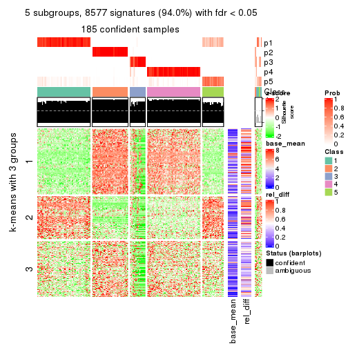</p>

</div>
<div id='tab-MAD-mclust-get-signatures-5'>
<pre><code class="r">get_signatures(res, k = 6)
</code></pre>

<p></p>

</div>
</div>


Signature heatmaps where rows are not scaled:


<script>
$( function() {
	$( '#tabs-MAD-mclust-get-signatures-no-scale' ).tabs();
} );
</script>
<div id='tabs-MAD-mclust-get-signatures-no-scale'>
<ul>
<li><a href='#tab-MAD-mclust-get-signatures-no-scale-1'>k = 2</a></li>
<li><a href='#tab-MAD-mclust-get-signatures-no-scale-2'>k = 3</a></li>
<li><a href='#tab-MAD-mclust-get-signatures-no-scale-3'>k = 4</a></li>
<li><a href='#tab-MAD-mclust-get-signatures-no-scale-4'>k = 5</a></li>
<li><a href='#tab-MAD-mclust-get-signatures-no-scale-5'>k = 6</a></li>
</ul>
<div id='tab-MAD-mclust-get-signatures-no-scale-1'>
<pre><code class="r">get_signatures(res, k = 2, scale_rows = FALSE)
</code></pre>

<p></p>

</div>
<div id='tab-MAD-mclust-get-signatures-no-scale-2'>
<pre><code class="r">get_signatures(res, k = 3, scale_rows = FALSE)
</code></pre>

<p></p>

</div>
<div id='tab-MAD-mclust-get-signatures-no-scale-3'>
<pre><code class="r">get_signatures(res, k = 4, scale_rows = FALSE)
</code></pre>

<p></p>

</div>
<div id='tab-MAD-mclust-get-signatures-no-scale-4'>
<pre><code class="r">get_signatures(res, k = 5, scale_rows = FALSE)
</code></pre>

<p></p>

</div>
<div id='tab-MAD-mclust-get-signatures-no-scale-5'>
<pre><code class="r">get_signatures(res, k = 6, scale_rows = FALSE)
</code></pre>

<p></p>

</div>
</div>


Compare the overlap of signatures from different k:

```r
compare_signatures(res)
```


`get_signature()` returns a data frame invisibly. TO get the list of signatures, the function
call should be assigned to a variable explicitly. In following code, if `plot` argument is set
to `FALSE`, no heatmap is plotted while only the differential analysis is performed.

```r
# code only for demonstration
tb = get_signature(res, k = ..., plot = FALSE)
```

An example of the output of `tb` is:

```
#>   which_row         fdr    mean_1    mean_2 scaled_mean_1 scaled_mean_2 km
#> 1        38 0.042760348  8.373488  9.131774    -0.5533452     0.5164555  1
#> 2        40 0.018707592  7.106213  8.469186    -0.6173731     0.5762149  1
#> 3        55 0.019134737 10.221463 11.207825    -0.6159697     0.5749050  1
#> 4        59 0.006059896  5.921854  7.869574    -0.6899429     0.6439467  1
#> 5        60 0.018055526  8.928898 10.211722    -0.6204761     0.5791110  1
#> 6        98 0.009384629 15.714769 14.887706     0.6635654    -0.6193277  2
...
```

The columns in `tb` are:

1. `which_row`: row indices corresponding to the input matrix.
2. `fdr`: FDR for the differential test. 
3. `mean_x`: The mean value in group x.
4. `scaled_mean_x`: The mean value in group x after rows are scaled.
5. `km`: Row groups if k-means clustering is applied to rows.


UMAP plot which shows how samples are separated.


<script>
$( function() {
	$( '#tabs-MAD-mclust-dimension-reduction' ).tabs();
} );
</script>
<div id='tabs-MAD-mclust-dimension-reduction'>
<ul>
<li><a href='#tab-MAD-mclust-dimension-reduction-1'>k = 2</a></li>
<li><a href='#tab-MAD-mclust-dimension-reduction-2'>k = 3</a></li>
<li><a href='#tab-MAD-mclust-dimension-reduction-3'>k = 4</a></li>
<li><a href='#tab-MAD-mclust-dimension-reduction-4'>k = 5</a></li>
<li><a href='#tab-MAD-mclust-dimension-reduction-5'>k = 6</a></li>
</ul>
<div id='tab-MAD-mclust-dimension-reduction-1'>
<pre><code class="r">dimension_reduction(res, k = 2, method = &quot;UMAP&quot;)
</code></pre>

<p></p>

</div>
<div id='tab-MAD-mclust-dimension-reduction-2'>
<pre><code class="r">dimension_reduction(res, k = 3, method = &quot;UMAP&quot;)
</code></pre>

<p></p>

</div>
<div id='tab-MAD-mclust-dimension-reduction-3'>
<pre><code class="r">dimension_reduction(res, k = 4, method = &quot;UMAP&quot;)
</code></pre>

<p></p>

</div>
<div id='tab-MAD-mclust-dimension-reduction-4'>
<pre><code class="r">dimension_reduction(res, k = 5, method = &quot;UMAP&quot;)
</code></pre>

<p></p>

</div>
<div id='tab-MAD-mclust-dimension-reduction-5'>
<pre><code class="r">dimension_reduction(res, k = 6, method = &quot;UMAP&quot;)
</code></pre>

<p></p>

</div>
</div>


Following heatmap shows how subgroups are split when increasing `k`:

```r
collect_classes(res)
```


If matrix rows can be associated to genes, consider to use `functional_enrichment(res,
...)` to perform function enrichment for the signature genes. See [this vignette](http://bioconductor.org/packages/devel/bioc/vignettes/cola/inst/doc/functional_enrichment.html) for more detailed explanations.


 

---------------------------------------------------


### MAD:NMF**


The object with results only for a single top-value method and a single partition method 
can be extracted as:

```r
res = res_list["MAD", "NMF"]
# you can also extract it by
# res = res_list["MAD:NMF"]
```

A summary of `res` and all the functions that can be applied to it:

```r
res
```

```
#> A 'ConsensusPartition' object with k = 2, 3, 4, 5, 6.
#>   On a matrix with 9126 rows and 192 columns.
#>   Top rows (913, 1826, 2738, 3650, 4563) are extracted by 'MAD' method.
#>   Subgroups are detected by 'NMF' method.
#>   Performed in total 1250 partitions by row resampling.
#>   Best k for subgroups seems to be 2.
#> 
#> Following methods can be applied to this 'ConsensusPartition' object:
#>  [1] "cola_report"             "collect_classes"         "collect_plots"          
#>  [4] "collect_stats"           "colnames"                "compare_signatures"     
#>  [7] "consensus_heatmap"       "dimension_reduction"     "functional_enrichment"  
#> [10] "get_anno_col"            "get_anno"                "get_classes"            
#> [13] "get_consensus"           "get_matrix"              "get_membership"         
#> [16] "get_param"               "get_signatures"          "get_stats"              
#> [19] "is_best_k"               "is_stable_k"             "membership_heatmap"     
#> [22] "ncol"                    "nrow"                    "plot_ecdf"              
#> [25] "rownames"                "select_partition_number" "show"                   
#> [28] "suggest_best_k"          "test_to_known_factors"
```

`collect_plots()` function collects all the plots made from `res` for all `k` (number of partitions)
into one single page to provide an easy and fast comparison between different `k`.

```r
collect_plots(res)
```


The plots are:

- The first row: a plot of the ECDF (empirical cumulative distribution
  function) curves of the consensus matrix for each `k` and the heatmap of
  predicted classes for each `k`.
- The second row: heatmaps of the consensus matrix for each `k`.
- The third row: heatmaps of the membership matrix for each `k`.
- The fouth row: heatmaps of the signatures for each `k`.

All the plots in panels can be made by individual functions and they are
plotted later in this section.

`select_partition_number()` produces several plots showing different
statistics for choosing "optimized" `k`. There are following statistics:

- ECDF curves of the consensus matrix for each `k`;
- 1-PAC. [The PAC
  score](https://en.wikipedia.org/wiki/Consensus_clustering#Over-interpretation_potential_of_consensus_clustering)
  measures the proportion of the ambiguous subgrouping.
- Mean silhouette score.
- Concordance. The mean probability of fiting the consensus class ids in all
  partitions.
- Area increased. Denote $A_k$ as the area under the ECDF curve for current
  `k`, the area increased is defined as $A_k - A_{k-1}$.
- Rand index. The percent of pairs of samples that are both in a same cluster
  or both are not in a same cluster in the partition of k and k-1.
- Jaccard index. The ratio of pairs of samples are both in a same cluster in
  the partition of k and k-1 and the pairs of samples are both in a same
  cluster in the partition k or k-1.

The detailed explanations of these statistics can be found in [the _cola_
vignette](http://bioconductor.org/packages/devel/bioc/vignettes/cola/inst/doc/cola.html#toc_13).

Generally speaking, lower PAC score, higher mean silhouette score or higher
concordance corresponds to better partition. Rand index and Jaccard index
measure how similar the current partition is compared to partition with `k-1`.
If they are too similar, we won't accept `k` is better than `k-1`.

```r
select_partition_number(res)
```


The numeric values for all these statistics can be obtained by `get_stats()`.

```r
get_stats(res)
```

```
#>   k 1-PAC mean_silhouette concordance area_increased  Rand Jaccard
#> 2 2 1.000           0.997       0.999         0.4989 0.502   0.502
#> 3 3 0.832           0.713       0.916         0.1169 0.984   0.968
#> 4 4 0.760           0.844       0.902         0.0402 0.973   0.946
#> 5 5 0.656           0.677       0.852         0.0563 0.977   0.952
#> 6 6 0.665           0.666       0.821         0.0367 0.953   0.896
```

`suggest_best_k()` suggests the best $k$ based on these statistics. The rules are as follows:

- All $k$ with Jaccard index larger than 0.95 are removed because increasing
  $k$ does not provide enough extra information. If all $k$ are removed, it is
  marked as no subgroup is detected.
- For all $k$ with 1-PAC score larger than 0.9, the maximal $k$ is taken as
  the best $k$, and other $k$ are marked as optional $k$.
- If it does not fit the second rule. The $k$ with the maximal vote of the
  highest 1-PAC score, highest mean silhouette, and highest concordance is
  taken as the best $k$.

```r
suggest_best_k(res)
```

```
#> [1] 2
```


Following shows the table of the partitions (You need to click the **show/hide
code output** link to see it). The membership matrix (columns with name `p*`)
is inferred by
[`clue::cl_consensus()`](https://www.rdocumentation.org/link/cl_consensus?package=clue)
function with the `SE` method. Basically the value in the membership matrix
represents the probability to belong to a certain group. The finall class
label for an item is determined with the group with highest probability it
belongs to.

In `get_classes()` function, the entropy is calculated from the membership
matrix and the silhouette score is calculated from the consensus matrix.


<script>
$( function() {
	$( '#tabs-MAD-NMF-get-classes' ).tabs();
} );
</script>
<div id='tabs-MAD-NMF-get-classes'>
<ul>
<li><a href='#tab-MAD-NMF-get-classes-1'>k = 2</a></li>
<li><a href='#tab-MAD-NMF-get-classes-2'>k = 3</a></li>
<li><a href='#tab-MAD-NMF-get-classes-3'>k = 4</a></li>
<li><a href='#tab-MAD-NMF-get-classes-4'>k = 5</a></li>
<li><a href='#tab-MAD-NMF-get-classes-5'>k = 6</a></li>
</ul>

<div id='tab-MAD-NMF-get-classes-1'>
<p><a id='tab-MAD-NMF-get-classes-1-a' style='color:#0366d6' href='#'>show/hide code output</a></p>
<pre><code class="r">cbind(get_classes(res, k = 2), get_membership(res, k = 2))
</code></pre>

<pre><code>#&gt;            class entropy silhouette   p1   p2
#&gt; SRR2074921     2   0.000      0.998 0.00 1.00
#&gt; SRR2074919     2   0.000      0.998 0.00 1.00
#&gt; SRR2074920     2   0.000      0.998 0.00 1.00
#&gt; SRR2074917     1   0.000      1.000 1.00 0.00
#&gt; SRR2074918     2   0.000      0.998 0.00 1.00
#&gt; SRR2074916     2   0.000      0.998 0.00 1.00
#&gt; SRR2074915     2   0.000      0.998 0.00 1.00
#&gt; SRR2074914     1   0.000      1.000 1.00 0.00
#&gt; SRR2074913     2   0.000      0.998 0.00 1.00
#&gt; SRR2074912     1   0.000      1.000 1.00 0.00
#&gt; SRR2074911     2   0.000      0.998 0.00 1.00
#&gt; SRR2074910     2   0.000      0.998 0.00 1.00
#&gt; SRR2074909     1   0.000      1.000 1.00 0.00
#&gt; SRR2074907     1   0.000      1.000 1.00 0.00
#&gt; SRR2074908     2   0.000      0.998 0.00 1.00
#&gt; SRR2074906     2   0.000      0.998 0.00 1.00
#&gt; SRR2074905     1   0.000      1.000 1.00 0.00
#&gt; SRR2074904     2   0.000      0.998 0.00 1.00
#&gt; SRR2074903     2   0.000      0.998 0.00 1.00
#&gt; SRR2074902     1   0.000      1.000 1.00 0.00
#&gt; SRR2074901     2   0.000      0.998 0.00 1.00
#&gt; SRR2074900     1   0.000      1.000 1.00 0.00
#&gt; SRR2074899     2   0.000      0.998 0.00 1.00
#&gt; SRR2074898     2   0.000      0.998 0.00 1.00
#&gt; SRR2074897     2   0.000      0.998 0.00 1.00
#&gt; SRR2074896     2   0.000      0.998 0.00 1.00
#&gt; SRR2074895     1   0.000      1.000 1.00 0.00
#&gt; SRR2074894     2   0.795      0.684 0.24 0.76
#&gt; SRR2074893     2   0.000      0.998 0.00 1.00
#&gt; SRR2074892     1   0.000      1.000 1.00 0.00
#&gt; SRR2074891     1   0.000      1.000 1.00 0.00
#&gt; SRR2074890     2   0.000      0.998 0.00 1.00
#&gt; SRR2074887     2   0.000      0.998 0.00 1.00
#&gt; SRR2074889     2   0.000      0.998 0.00 1.00
#&gt; SRR2074886     2   0.000      0.998 0.00 1.00
#&gt; SRR2074888     2   0.000      0.998 0.00 1.00
#&gt; SRR2074885     1   0.000      1.000 1.00 0.00
#&gt; SRR2074884     2   0.000      0.998 0.00 1.00
#&gt; SRR2074883     2   0.000      0.998 0.00 1.00
#&gt; SRR2074882     1   0.000      1.000 1.00 0.00
#&gt; SRR2074880     2   0.000      0.998 0.00 1.00
#&gt; SRR2074881     2   0.000      0.998 0.00 1.00
#&gt; SRR2074879     1   0.000      1.000 1.00 0.00
#&gt; SRR2074878     1   0.000      1.000 1.00 0.00
#&gt; SRR2074877     2   0.000      0.998 0.00 1.00
#&gt; SRR2074876     1   0.000      1.000 1.00 0.00
#&gt; SRR2074875     2   0.000      0.998 0.00 1.00
#&gt; SRR2074874     1   0.000      1.000 1.00 0.00
#&gt; SRR2074873     2   0.000      0.998 0.00 1.00
#&gt; SRR2074872     1   0.000      1.000 1.00 0.00
#&gt; SRR2074871     2   0.000      0.998 0.00 1.00
#&gt; SRR2074870     1   0.000      1.000 1.00 0.00
#&gt; SRR2074869     1   0.000      1.000 1.00 0.00
#&gt; SRR2074868     1   0.000      1.000 1.00 0.00
#&gt; SRR2074867     2   0.000      0.998 0.00 1.00
#&gt; SRR2074866     2   0.000      0.998 0.00 1.00
#&gt; SRR2074865     1   0.000      1.000 1.00 0.00
#&gt; SRR2074864     1   0.000      1.000 1.00 0.00
#&gt; SRR2074863     1   0.000      1.000 1.00 0.00
#&gt; SRR2074862     1   0.000      1.000 1.00 0.00
#&gt; SRR2074861     1   0.000      1.000 1.00 0.00
#&gt; SRR2074860     1   0.000      1.000 1.00 0.00
#&gt; SRR2074859     1   0.000      1.000 1.00 0.00
#&gt; SRR2074858     2   0.000      0.998 0.00 1.00
#&gt; SRR2074855     2   0.000      0.998 0.00 1.00
#&gt; SRR2074857     1   0.000      1.000 1.00 0.00
#&gt; SRR2074856     1   0.000      1.000 1.00 0.00
#&gt; SRR2074854     1   0.000      1.000 1.00 0.00
#&gt; SRR2074853     1   0.000      1.000 1.00 0.00
#&gt; SRR2074852     2   0.000      0.998 0.00 1.00
#&gt; SRR2074851     1   0.000      1.000 1.00 0.00
#&gt; SRR2074850     1   0.000      1.000 1.00 0.00
#&gt; SRR2074849     1   0.000      1.000 1.00 0.00
#&gt; SRR2074848     1   0.000      1.000 1.00 0.00
#&gt; SRR2074847     1   0.000      1.000 1.00 0.00
#&gt; SRR2074846     1   0.000      1.000 1.00 0.00
#&gt; SRR2074845     1   0.000      1.000 1.00 0.00
#&gt; SRR2074843     1   0.000      1.000 1.00 0.00
#&gt; SRR2074842     2   0.000      0.998 0.00 1.00
#&gt; SRR2074844     2   0.000      0.998 0.00 1.00
#&gt; SRR2074841     2   0.000      0.998 0.00 1.00
#&gt; SRR2074840     2   0.000      0.998 0.00 1.00
#&gt; SRR2074839     1   0.000      1.000 1.00 0.00
#&gt; SRR2074838     2   0.000      0.998 0.00 1.00
#&gt; SRR2074836     2   0.000      0.998 0.00 1.00
#&gt; SRR2074835     2   0.000      0.998 0.00 1.00
#&gt; SRR2074837     1   0.000      1.000 1.00 0.00
#&gt; SRR2074834     2   0.000      0.998 0.00 1.00
#&gt; SRR2074833     1   0.000      1.000 1.00 0.00
#&gt; SRR2074832     2   0.000      0.998 0.00 1.00
#&gt; SRR2074831     1   0.000      1.000 1.00 0.00
#&gt; SRR2074829     1   0.000      1.000 1.00 0.00
#&gt; SRR2074830     1   0.000      1.000 1.00 0.00
#&gt; SRR2074828     1   0.000      1.000 1.00 0.00
#&gt; SRR2074827     2   0.000      0.998 0.00 1.00
#&gt; SRR2074826     2   0.000      0.998 0.00 1.00
#&gt; SRR2074825     2   0.000      0.998 0.00 1.00
#&gt; SRR2074824     2   0.000      0.998 0.00 1.00
#&gt; SRR2074823     1   0.000      1.000 1.00 0.00
#&gt; SRR2074822     2   0.000      0.998 0.00 1.00
#&gt; SRR2074821     2   0.000      0.998 0.00 1.00
#&gt; SRR2074820     2   0.000      0.998 0.00 1.00
#&gt; SRR2074819     2   0.000      0.998 0.00 1.00
#&gt; SRR2074817     2   0.000      0.998 0.00 1.00
#&gt; SRR2074818     2   0.000      0.998 0.00 1.00
#&gt; SRR2074816     1   0.000      1.000 1.00 0.00
#&gt; SRR2074815     2   0.000      0.998 0.00 1.00
#&gt; SRR2074814     1   0.000      1.000 1.00 0.00
#&gt; SRR2074812     2   0.000      0.998 0.00 1.00
#&gt; SRR2074813     2   0.000      0.998 0.00 1.00
#&gt; SRR2074809     2   0.000      0.998 0.00 1.00
#&gt; SRR2074810     2   0.000      0.998 0.00 1.00
#&gt; SRR2074811     2   0.000      0.998 0.00 1.00
#&gt; SRR2074808     2   0.000      0.998 0.00 1.00
#&gt; SRR2074807     2   0.000      0.998 0.00 1.00
#&gt; SRR2074806     1   0.000      1.000 1.00 0.00
#&gt; SRR2074805     2   0.000      0.998 0.00 1.00
#&gt; SRR2074804     1   0.000      1.000 1.00 0.00
#&gt; SRR2074803     1   0.000      1.000 1.00 0.00
#&gt; SRR2074801     1   0.000      1.000 1.00 0.00
#&gt; SRR2074802     2   0.000      0.998 0.00 1.00
#&gt; SRR2074799     2   0.000      0.998 0.00 1.00
#&gt; SRR2074800     1   0.000      1.000 1.00 0.00
#&gt; SRR2074798     1   0.000      1.000 1.00 0.00
#&gt; SRR2074797     1   0.000      1.000 1.00 0.00
#&gt; SRR2074795     2   0.000      0.998 0.00 1.00
#&gt; SRR2074796     2   0.000      0.998 0.00 1.00
#&gt; SRR2074794     2   0.000      0.998 0.00 1.00
#&gt; SRR2074793     2   0.000      0.998 0.00 1.00
#&gt; SRR2074792     1   0.000      1.000 1.00 0.00
#&gt; SRR2074791     1   0.000      1.000 1.00 0.00
#&gt; SRR2074790     2   0.000      0.998 0.00 1.00
#&gt; SRR2074789     1   0.000      1.000 1.00 0.00
#&gt; SRR2074788     1   0.000      1.000 1.00 0.00
#&gt; SRR2074787     1   0.000      1.000 1.00 0.00
#&gt; SRR2074786     2   0.000      0.998 0.00 1.00
#&gt; SRR2074785     1   0.000      1.000 1.00 0.00
#&gt; SRR2074784     1   0.000      1.000 1.00 0.00
#&gt; SRR2074783     2   0.000      0.998 0.00 1.00
#&gt; SRR2074782     1   0.000      1.000 1.00 0.00
#&gt; SRR2074779     2   0.000      0.998 0.00 1.00
#&gt; SRR2074781     2   0.000      0.998 0.00 1.00
#&gt; SRR2074780     1   0.000      1.000 1.00 0.00
#&gt; SRR2074778     2   0.000      0.998 0.00 1.00
#&gt; SRR2074777     2   0.000      0.998 0.00 1.00
#&gt; SRR2074776     2   0.000      0.998 0.00 1.00
#&gt; SRR2074775     1   0.000      1.000 1.00 0.00
#&gt; SRR2074774     1   0.000      1.000 1.00 0.00
#&gt; SRR2074773     2   0.000      0.998 0.00 1.00
#&gt; SRR2074771     2   0.000      0.998 0.00 1.00
#&gt; SRR2074772     1   0.000      1.000 1.00 0.00
#&gt; SRR2074770     1   0.000      1.000 1.00 0.00
#&gt; SRR2074769     2   0.000      0.998 0.00 1.00
#&gt; SRR2074768     2   0.000      0.998 0.00 1.00
#&gt; SRR2074766     2   0.000      0.998 0.00 1.00
#&gt; SRR2074767     1   0.000      1.000 1.00 0.00
#&gt; SRR2074765     1   0.000      1.000 1.00 0.00
#&gt; SRR2074764     2   0.000      0.998 0.00 1.00
#&gt; SRR2074763     2   0.000      0.998 0.00 1.00
#&gt; SRR2074761     1   0.000      1.000 1.00 0.00
#&gt; SRR2074762     2   0.000      0.998 0.00 1.00
#&gt; SRR2074760     2   0.000      0.998 0.00 1.00
#&gt; SRR2074759     1   0.000      1.000 1.00 0.00
#&gt; SRR2074757     2   0.000      0.998 0.00 1.00
#&gt; SRR2074758     2   0.000      0.998 0.00 1.00
#&gt; SRR2074756     2   0.000      0.998 0.00 1.00
#&gt; SRR2074755     1   0.000      1.000 1.00 0.00
#&gt; SRR2074754     1   0.000      1.000 1.00 0.00
#&gt; SRR2074753     2   0.000      0.998 0.00 1.00
#&gt; SRR2074752     1   0.000      1.000 1.00 0.00
#&gt; SRR2074751     1   0.000      1.000 1.00 0.00
#&gt; SRR2074749     2   0.000      0.998 0.00 1.00
#&gt; SRR2074750     1   0.000      1.000 1.00 0.00
#&gt; SRR2074748     1   0.000      1.000 1.00 0.00
#&gt; SRR2074747     2   0.000      0.998 0.00 1.00
#&gt; SRR2074745     1   0.000      1.000 1.00 0.00
#&gt; SRR2074746     1   0.000      1.000 1.00 0.00
#&gt; SRR2074744     2   0.000      0.998 0.00 1.00
#&gt; SRR2074743     2   0.000      0.998 0.00 1.00
#&gt; SRR2074742     2   0.000      0.998 0.00 1.00
#&gt; SRR2074741     1   0.000      1.000 1.00 0.00
#&gt; SRR2074740     2   0.000      0.998 0.00 1.00
#&gt; SRR2074739     1   0.000      1.000 1.00 0.00
#&gt; SRR2074738     2   0.000      0.998 0.00 1.00
#&gt; SRR2074737     2   0.000      0.998 0.00 1.00
#&gt; SRR2074736     2   0.000      0.998 0.00 1.00
#&gt; SRR2074735     1   0.000      1.000 1.00 0.00
#&gt; SRR2074734     2   0.000      0.998 0.00 1.00
#&gt; SRR2074733     1   0.000      1.000 1.00 0.00
#&gt; SRR2074732     2   0.000      0.998 0.00 1.00
#&gt; SRR2074731     2   0.000      0.998 0.00 1.00
#&gt; SRR2074730     1   0.000      1.000 1.00 0.00
</code></pre>

<script>
$('#tab-MAD-NMF-get-classes-1-a').parent().next().next().hide();
$('#tab-MAD-NMF-get-classes-1-a').click(function(){
  $('#tab-MAD-NMF-get-classes-1-a').parent().next().next().toggle();
  return(false);
});
</script>
</div>

<div id='tab-MAD-NMF-get-classes-2'>
<p><a id='tab-MAD-NMF-get-classes-2-a' style='color:#0366d6' href='#'>show/hide code output</a></p>
<pre><code class="r">cbind(get_classes(res, k = 3), get_membership(res, k = 3))
</code></pre>

<pre><code>#&gt;            class entropy silhouette    p1    p2    p3
#&gt; SRR2074921     2  0.6299    -0.8583 0.000 0.524 0.476
#&gt; SRR2074919     2  0.6309    -0.9396 0.000 0.500 0.500
#&gt; SRR2074920     3  0.6302     0.0000 0.000 0.480 0.520
#&gt; SRR2074917     1  0.1860     0.9560 0.948 0.000 0.052
#&gt; SRR2074918     2  0.6267    -0.7687 0.000 0.548 0.452
#&gt; SRR2074916     2  0.5431     0.1752 0.000 0.716 0.284
#&gt; SRR2074915     2  0.6192    -0.6507 0.000 0.580 0.420
#&gt; SRR2074914     1  0.0000     0.9925 1.000 0.000 0.000
#&gt; SRR2074913     2  0.6204    -0.6547 0.000 0.576 0.424
#&gt; SRR2074912     1  0.1529     0.9652 0.960 0.000 0.040
#&gt; SRR2074911     2  0.6252    -0.7376 0.000 0.556 0.444
#&gt; SRR2074910     2  0.6225    -0.7015 0.000 0.568 0.432
#&gt; SRR2074909     1  0.0000     0.9925 1.000 0.000 0.000
#&gt; SRR2074907     1  0.0000     0.9925 1.000 0.000 0.000
#&gt; SRR2074908     2  0.3941     0.5887 0.000 0.844 0.156
#&gt; SRR2074906     2  0.3267     0.6358 0.000 0.884 0.116
#&gt; SRR2074905     1  0.0000     0.9925 1.000 0.000 0.000
#&gt; SRR2074904     2  0.4931     0.4166 0.000 0.768 0.232
#&gt; SRR2074903     2  0.3816     0.5974 0.000 0.852 0.148
#&gt; SRR2074902     1  0.0000     0.9925 1.000 0.000 0.000
#&gt; SRR2074901     2  0.3686     0.6096 0.000 0.860 0.140
#&gt; SRR2074900     1  0.0000     0.9925 1.000 0.000 0.000
#&gt; SRR2074899     2  0.1753     0.6710 0.000 0.952 0.048
#&gt; SRR2074898     2  0.2878     0.6582 0.000 0.904 0.096
#&gt; SRR2074897     2  0.2448     0.6705 0.000 0.924 0.076
#&gt; SRR2074896     2  0.4002     0.5839 0.000 0.840 0.160
#&gt; SRR2074895     1  0.0000     0.9925 1.000 0.000 0.000
#&gt; SRR2074894     1  0.5529     0.4528 0.704 0.296 0.000
#&gt; SRR2074893     2  0.0592     0.6818 0.000 0.988 0.012
#&gt; SRR2074892     1  0.0000     0.9925 1.000 0.000 0.000
#&gt; SRR2074891     1  0.0000     0.9925 1.000 0.000 0.000
#&gt; SRR2074890     2  0.5216     0.3085 0.000 0.740 0.260
#&gt; SRR2074887     2  0.5016     0.3804 0.000 0.760 0.240
#&gt; SRR2074889     2  0.3192     0.6411 0.000 0.888 0.112
#&gt; SRR2074886     2  0.2537     0.6575 0.000 0.920 0.080
#&gt; SRR2074888     2  0.2959     0.6542 0.000 0.900 0.100
#&gt; SRR2074885     1  0.0000     0.9925 1.000 0.000 0.000
#&gt; SRR2074884     2  0.2711     0.6639 0.000 0.912 0.088
#&gt; SRR2074883     2  0.2165     0.6803 0.000 0.936 0.064
#&gt; SRR2074882     1  0.0237     0.9904 0.996 0.000 0.004
#&gt; SRR2074880     2  0.0892     0.6840 0.000 0.980 0.020
#&gt; SRR2074881     2  0.3412     0.6260 0.000 0.876 0.124
#&gt; SRR2074879     1  0.2165     0.9459 0.936 0.000 0.064
#&gt; SRR2074878     1  0.0000     0.9925 1.000 0.000 0.000
#&gt; SRR2074877     2  0.4974     0.4019 0.000 0.764 0.236
#&gt; SRR2074876     1  0.0000     0.9925 1.000 0.000 0.000
#&gt; SRR2074875     2  0.3116     0.6459 0.000 0.892 0.108
#&gt; SRR2074874     1  0.0424     0.9881 0.992 0.000 0.008
#&gt; SRR2074873     2  0.2711     0.6640 0.000 0.912 0.088
#&gt; SRR2074872     1  0.1411     0.9686 0.964 0.000 0.036
#&gt; SRR2074871     2  0.3879     0.5953 0.000 0.848 0.152
#&gt; SRR2074870     1  0.0000     0.9925 1.000 0.000 0.000
#&gt; SRR2074869     1  0.0000     0.9925 1.000 0.000 0.000
#&gt; SRR2074868     1  0.1031     0.9774 0.976 0.000 0.024
#&gt; SRR2074867     2  0.4842     0.4357 0.000 0.776 0.224
#&gt; SRR2074866     2  0.4974     0.4033 0.000 0.764 0.236
#&gt; SRR2074865     1  0.0000     0.9925 1.000 0.000 0.000
#&gt; SRR2074864     1  0.0000     0.9925 1.000 0.000 0.000
#&gt; SRR2074863     1  0.0000     0.9925 1.000 0.000 0.000
#&gt; SRR2074862     1  0.0000     0.9925 1.000 0.000 0.000
#&gt; SRR2074861     1  0.0000     0.9925 1.000 0.000 0.000
#&gt; SRR2074860     1  0.0237     0.9903 0.996 0.000 0.004
#&gt; SRR2074859     1  0.0000     0.9925 1.000 0.000 0.000
#&gt; SRR2074858     2  0.4842     0.4422 0.000 0.776 0.224
#&gt; SRR2074855     2  0.3192     0.6411 0.000 0.888 0.112
#&gt; SRR2074857     1  0.0000     0.9925 1.000 0.000 0.000
#&gt; SRR2074856     1  0.1031     0.9774 0.976 0.000 0.024
#&gt; SRR2074854     1  0.0892     0.9802 0.980 0.000 0.020
#&gt; SRR2074853     1  0.0000     0.9925 1.000 0.000 0.000
#&gt; SRR2074852     2  0.1753     0.6819 0.000 0.952 0.048
#&gt; SRR2074851     1  0.0424     0.9880 0.992 0.000 0.008
#&gt; SRR2074850     1  0.0000     0.9925 1.000 0.000 0.000
#&gt; SRR2074849     1  0.0000     0.9925 1.000 0.000 0.000
#&gt; SRR2074848     1  0.0000     0.9925 1.000 0.000 0.000
#&gt; SRR2074847     1  0.0000     0.9925 1.000 0.000 0.000
#&gt; SRR2074846     1  0.0000     0.9925 1.000 0.000 0.000
#&gt; SRR2074845     1  0.0000     0.9925 1.000 0.000 0.000
#&gt; SRR2074843     1  0.0000     0.9925 1.000 0.000 0.000
#&gt; SRR2074842     2  0.4555     0.5001 0.000 0.800 0.200
#&gt; SRR2074844     2  0.4346     0.5411 0.000 0.816 0.184
#&gt; SRR2074841     2  0.2878     0.6581 0.000 0.904 0.096
#&gt; SRR2074840     2  0.2261     0.6775 0.000 0.932 0.068
#&gt; SRR2074839     1  0.0000     0.9925 1.000 0.000 0.000
#&gt; SRR2074838     2  0.2537     0.6689 0.000 0.920 0.080
#&gt; SRR2074836     2  0.4452     0.5243 0.000 0.808 0.192
#&gt; SRR2074835     2  0.2878     0.6581 0.000 0.904 0.096
#&gt; SRR2074837     1  0.0000     0.9925 1.000 0.000 0.000
#&gt; SRR2074834     2  0.3619     0.6146 0.000 0.864 0.136
#&gt; SRR2074833     1  0.0000     0.9925 1.000 0.000 0.000
#&gt; SRR2074832     2  0.2625     0.6697 0.000 0.916 0.084
#&gt; SRR2074831     1  0.0237     0.9904 0.996 0.000 0.004
#&gt; SRR2074829     1  0.0000     0.9925 1.000 0.000 0.000
#&gt; SRR2074830     1  0.0000     0.9925 1.000 0.000 0.000
#&gt; SRR2074828     1  0.0000     0.9925 1.000 0.000 0.000
#&gt; SRR2074827     2  0.3941     0.5896 0.000 0.844 0.156
#&gt; SRR2074826     2  0.5529     0.1188 0.000 0.704 0.296
#&gt; SRR2074825     2  0.1860     0.6824 0.000 0.948 0.052
#&gt; SRR2074824     2  0.3267     0.6358 0.000 0.884 0.116
#&gt; SRR2074823     1  0.0000     0.9925 1.000 0.000 0.000
#&gt; SRR2074822     2  0.3267     0.6358 0.000 0.884 0.116
#&gt; SRR2074821     2  0.2959     0.6543 0.000 0.900 0.100
#&gt; SRR2074820     2  0.2959     0.6542 0.000 0.900 0.100
#&gt; SRR2074819     2  0.3038     0.6414 0.000 0.896 0.104
#&gt; SRR2074817     2  0.3551     0.6176 0.000 0.868 0.132
#&gt; SRR2074818     2  0.1289     0.6783 0.000 0.968 0.032
#&gt; SRR2074816     1  0.0000     0.9925 1.000 0.000 0.000
#&gt; SRR2074815     2  0.1163     0.6844 0.000 0.972 0.028
#&gt; SRR2074814     1  0.0000     0.9925 1.000 0.000 0.000
#&gt; SRR2074812     2  0.3116     0.6459 0.000 0.892 0.108
#&gt; SRR2074813     2  0.4062     0.5832 0.000 0.836 0.164
#&gt; SRR2074809     2  0.2959     0.6542 0.000 0.900 0.100
#&gt; SRR2074810     2  0.2959     0.6456 0.000 0.900 0.100
#&gt; SRR2074811     2  0.2878     0.6577 0.000 0.904 0.096
#&gt; SRR2074808     2  0.3340     0.6294 0.000 0.880 0.120
#&gt; SRR2074807     2  0.3816     0.5983 0.000 0.852 0.148
#&gt; SRR2074806     1  0.0000     0.9925 1.000 0.000 0.000
#&gt; SRR2074805     2  0.1753     0.6830 0.000 0.952 0.048
#&gt; SRR2074804     1  0.0000     0.9925 1.000 0.000 0.000
#&gt; SRR2074803     1  0.0000     0.9925 1.000 0.000 0.000
#&gt; SRR2074801     1  0.0000     0.9925 1.000 0.000 0.000
#&gt; SRR2074802     2  0.3340     0.6305 0.000 0.880 0.120
#&gt; SRR2074799     2  0.2796     0.6614 0.000 0.908 0.092
#&gt; SRR2074800     1  0.0000     0.9925 1.000 0.000 0.000
#&gt; SRR2074798     1  0.0237     0.9903 0.996 0.000 0.004
#&gt; SRR2074797     1  0.0000     0.9925 1.000 0.000 0.000
#&gt; SRR2074795     2  0.1411     0.6838 0.000 0.964 0.036
#&gt; SRR2074796     2  0.3879     0.5951 0.000 0.848 0.152
#&gt; SRR2074794     2  0.2448     0.6707 0.000 0.924 0.076
#&gt; SRR2074793     2  0.1964     0.6682 0.000 0.944 0.056
#&gt; SRR2074792     1  0.0000     0.9925 1.000 0.000 0.000
#&gt; SRR2074791     1  0.0237     0.9904 0.996 0.000 0.004
#&gt; SRR2074790     2  0.2796     0.6613 0.000 0.908 0.092
#&gt; SRR2074789     1  0.0000     0.9925 1.000 0.000 0.000
#&gt; SRR2074788     1  0.0000     0.9925 1.000 0.000 0.000
#&gt; SRR2074787     1  0.0000     0.9925 1.000 0.000 0.000
#&gt; SRR2074786     2  0.2356     0.6603 0.000 0.928 0.072
#&gt; SRR2074785     1  0.0000     0.9925 1.000 0.000 0.000
#&gt; SRR2074784     1  0.0237     0.9903 0.996 0.000 0.004
#&gt; SRR2074783     2  0.2959     0.6548 0.000 0.900 0.100
#&gt; SRR2074782     1  0.0000     0.9925 1.000 0.000 0.000
#&gt; SRR2074779     2  0.3267     0.6327 0.000 0.884 0.116
#&gt; SRR2074781     2  0.5497     0.1433 0.000 0.708 0.292
#&gt; SRR2074780     1  0.0000     0.9925 1.000 0.000 0.000
#&gt; SRR2074778     2  0.4399     0.5328 0.000 0.812 0.188
#&gt; SRR2074777     2  0.4842     0.4415 0.000 0.776 0.224
#&gt; SRR2074776     2  0.1860     0.6806 0.000 0.948 0.052
#&gt; SRR2074775     1  0.0000     0.9925 1.000 0.000 0.000
#&gt; SRR2074774     1  0.0000     0.9925 1.000 0.000 0.000
#&gt; SRR2074773     2  0.3482     0.6206 0.000 0.872 0.128
#&gt; SRR2074771     2  0.4555     0.5056 0.000 0.800 0.200
#&gt; SRR2074772     1  0.0000     0.9925 1.000 0.000 0.000
#&gt; SRR2074770     1  0.0000     0.9925 1.000 0.000 0.000
#&gt; SRR2074769     2  0.1529     0.6832 0.000 0.960 0.040
#&gt; SRR2074768     2  0.1031     0.6800 0.000 0.976 0.024
#&gt; SRR2074766     2  0.4452     0.5232 0.000 0.808 0.192
#&gt; SRR2074767     1  0.0000     0.9925 1.000 0.000 0.000
#&gt; SRR2074765     1  0.1411     0.9686 0.964 0.000 0.036
#&gt; SRR2074764     2  0.4974     0.3948 0.000 0.764 0.236
#&gt; SRR2074763     2  0.2878     0.6582 0.000 0.904 0.096
#&gt; SRR2074761     1  0.0000     0.9925 1.000 0.000 0.000
#&gt; SRR2074762     2  0.4796     0.4536 0.000 0.780 0.220
#&gt; SRR2074760     2  0.1964     0.6804 0.000 0.944 0.056
#&gt; SRR2074759     1  0.0000     0.9925 1.000 0.000 0.000
#&gt; SRR2074757     2  0.2625     0.6547 0.000 0.916 0.084
#&gt; SRR2074758     2  0.2959     0.6587 0.000 0.900 0.100
#&gt; SRR2074756     2  0.3879     0.5943 0.000 0.848 0.152
#&gt; SRR2074755     1  0.0000     0.9925 1.000 0.000 0.000
#&gt; SRR2074754     1  0.0000     0.9925 1.000 0.000 0.000
#&gt; SRR2074753     2  0.5560     0.0909 0.000 0.700 0.300
#&gt; SRR2074752     1  0.0000     0.9925 1.000 0.000 0.000
#&gt; SRR2074751     1  0.0000     0.9925 1.000 0.000 0.000
#&gt; SRR2074749     2  0.3192     0.6411 0.000 0.888 0.112
#&gt; SRR2074750     1  0.0000     0.9925 1.000 0.000 0.000
#&gt; SRR2074748     1  0.0000     0.9925 1.000 0.000 0.000
#&gt; SRR2074747     2  0.3619     0.6120 0.000 0.864 0.136
#&gt; SRR2074745     1  0.0592     0.9855 0.988 0.000 0.012
#&gt; SRR2074746     1  0.0000     0.9925 1.000 0.000 0.000
#&gt; SRR2074744     2  0.2448     0.6594 0.000 0.924 0.076
#&gt; SRR2074743     2  0.1753     0.6839 0.000 0.952 0.048
#&gt; SRR2074742     2  0.6244    -0.7217 0.000 0.560 0.440
#&gt; SRR2074741     1  0.0237     0.9903 0.996 0.000 0.004
#&gt; SRR2074740     2  0.4555     0.5056 0.000 0.800 0.200
#&gt; SRR2074739     1  0.0000     0.9925 1.000 0.000 0.000
#&gt; SRR2074738     2  0.1289     0.6787 0.000 0.968 0.032
#&gt; SRR2074737     2  0.1964     0.6798 0.000 0.944 0.056
#&gt; SRR2074736     2  0.1289     0.6830 0.000 0.968 0.032
#&gt; SRR2074735     1  0.0000     0.9925 1.000 0.000 0.000
#&gt; SRR2074734     2  0.2066     0.6803 0.000 0.940 0.060
#&gt; SRR2074733     1  0.0000     0.9925 1.000 0.000 0.000
#&gt; SRR2074732     2  0.3116     0.6459 0.000 0.892 0.108
#&gt; SRR2074731     2  0.3038     0.6502 0.000 0.896 0.104
#&gt; SRR2074730     1  0.0237     0.9904 0.996 0.000 0.004
</code></pre>

<script>
$('#tab-MAD-NMF-get-classes-2-a').parent().next().next().hide();
$('#tab-MAD-NMF-get-classes-2-a').click(function(){
  $('#tab-MAD-NMF-get-classes-2-a').parent().next().next().toggle();
  return(false);
});
</script>
</div>

<div id='tab-MAD-NMF-get-classes-3'>
<p><a id='tab-MAD-NMF-get-classes-3-a' style='color:#0366d6' href='#'>show/hide code output</a></p>
<pre><code class="r">cbind(get_classes(res, k = 4), get_membership(res, k = 4))
</code></pre>

<pre><code>#&gt;            class entropy silhouette    p1    p2    p3 p4
#&gt; SRR2074921     3  0.5496      0.887 0.000 0.312 0.652 NA
#&gt; SRR2074919     3  0.5022      0.852 0.000 0.264 0.708 NA
#&gt; SRR2074920     3  0.4983      0.865 0.000 0.272 0.704 NA
#&gt; SRR2074917     1  0.5268      0.597 0.592 0.000 0.012 NA
#&gt; SRR2074918     3  0.5855      0.876 0.000 0.356 0.600 NA
#&gt; SRR2074916     2  0.4647      0.492 0.000 0.704 0.288 NA
#&gt; SRR2074915     2  0.5220     -0.198 0.000 0.568 0.424 NA
#&gt; SRR2074914     1  0.1022      0.935 0.968 0.000 0.000 NA
#&gt; SRR2074913     2  0.5731     -0.322 0.000 0.544 0.428 NA
#&gt; SRR2074912     1  0.5010      0.719 0.700 0.000 0.024 NA
#&gt; SRR2074911     3  0.5313      0.847 0.000 0.376 0.608 NA
#&gt; SRR2074910     2  0.6145     -0.531 0.000 0.492 0.460 NA
#&gt; SRR2074909     1  0.1302      0.932 0.956 0.000 0.000 NA
#&gt; SRR2074907     1  0.0817      0.936 0.976 0.000 0.000 NA
#&gt; SRR2074908     2  0.2589      0.822 0.000 0.884 0.116 NA
#&gt; SRR2074906     2  0.3570      0.772 0.000 0.860 0.048 NA
#&gt; SRR2074905     1  0.0707      0.935 0.980 0.000 0.000 NA
#&gt; SRR2074904     2  0.3074      0.785 0.000 0.848 0.152 NA
#&gt; SRR2074903     2  0.1940      0.849 0.000 0.924 0.076 NA
#&gt; SRR2074902     1  0.0707      0.936 0.980 0.000 0.000 NA
#&gt; SRR2074901     2  0.2149      0.837 0.000 0.912 0.088 NA
#&gt; SRR2074900     1  0.1474      0.931 0.948 0.000 0.000 NA
#&gt; SRR2074899     2  0.0469      0.861 0.000 0.988 0.012 NA
#&gt; SRR2074898     2  0.2623      0.828 0.000 0.908 0.028 NA
#&gt; SRR2074897     2  0.1510      0.858 0.000 0.956 0.016 NA
#&gt; SRR2074896     2  0.2593      0.829 0.000 0.892 0.104 NA
#&gt; SRR2074895     1  0.0707      0.935 0.980 0.000 0.000 NA
#&gt; SRR2074894     1  0.5898      0.615 0.724 0.184 0.068 NA
#&gt; SRR2074893     2  0.0592      0.863 0.000 0.984 0.016 NA
#&gt; SRR2074892     1  0.0707      0.936 0.980 0.000 0.000 NA
#&gt; SRR2074891     1  0.1474      0.928 0.948 0.000 0.000 NA
#&gt; SRR2074890     2  0.3266      0.760 0.000 0.832 0.168 NA
#&gt; SRR2074887     2  0.3172      0.771 0.000 0.840 0.160 NA
#&gt; SRR2074889     2  0.2699      0.820 0.000 0.904 0.028 NA
#&gt; SRR2074886     2  0.1302      0.859 0.000 0.956 0.044 NA
#&gt; SRR2074888     2  0.2142      0.840 0.000 0.928 0.016 NA
#&gt; SRR2074885     1  0.0469      0.937 0.988 0.000 0.000 NA
#&gt; SRR2074884     2  0.1677      0.853 0.000 0.948 0.012 NA
#&gt; SRR2074883     2  0.1388      0.860 0.000 0.960 0.028 NA
#&gt; SRR2074882     1  0.1867      0.928 0.928 0.000 0.000 NA
#&gt; SRR2074880     2  0.0672      0.860 0.000 0.984 0.008 NA
#&gt; SRR2074881     2  0.1557      0.854 0.000 0.944 0.056 NA
#&gt; SRR2074879     1  0.5713      0.596 0.604 0.000 0.036 NA
#&gt; SRR2074878     1  0.3219      0.878 0.836 0.000 0.000 NA
#&gt; SRR2074877     2  0.3311      0.753 0.000 0.828 0.172 NA
#&gt; SRR2074876     1  0.1022      0.935 0.968 0.000 0.000 NA
#&gt; SRR2074875     2  0.2739      0.825 0.000 0.904 0.036 NA
#&gt; SRR2074874     1  0.2814      0.898 0.868 0.000 0.000 NA
#&gt; SRR2074873     2  0.1452      0.857 0.000 0.956 0.008 NA
#&gt; SRR2074872     1  0.4776      0.656 0.624 0.000 0.000 NA
#&gt; SRR2074871     2  0.2944      0.811 0.000 0.868 0.128 NA
#&gt; SRR2074870     1  0.0817      0.937 0.976 0.000 0.000 NA
#&gt; SRR2074869     1  0.0817      0.936 0.976 0.000 0.000 NA
#&gt; SRR2074868     1  0.4193      0.783 0.732 0.000 0.000 NA
#&gt; SRR2074867     2  0.2921      0.800 0.000 0.860 0.140 NA
#&gt; SRR2074866     2  0.2973      0.791 0.000 0.856 0.144 NA
#&gt; SRR2074865     1  0.1474      0.928 0.948 0.000 0.000 NA
#&gt; SRR2074864     1  0.1022      0.934 0.968 0.000 0.000 NA
#&gt; SRR2074863     1  0.1302      0.931 0.956 0.000 0.000 NA
#&gt; SRR2074862     1  0.1637      0.931 0.940 0.000 0.000 NA
#&gt; SRR2074861     1  0.0921      0.936 0.972 0.000 0.000 NA
#&gt; SRR2074860     1  0.1474      0.932 0.948 0.000 0.000 NA
#&gt; SRR2074859     1  0.0817      0.936 0.976 0.000 0.000 NA
#&gt; SRR2074858     2  0.2760      0.809 0.000 0.872 0.128 NA
#&gt; SRR2074855     2  0.2623      0.825 0.000 0.908 0.028 NA
#&gt; SRR2074857     1  0.1211      0.933 0.960 0.000 0.000 NA
#&gt; SRR2074856     1  0.4164      0.790 0.736 0.000 0.000 NA
#&gt; SRR2074854     1  0.3791      0.844 0.796 0.000 0.004 NA
#&gt; SRR2074853     1  0.0592      0.936 0.984 0.000 0.000 NA
#&gt; SRR2074852     2  0.1545      0.855 0.000 0.952 0.008 NA
#&gt; SRR2074851     1  0.2973      0.889 0.856 0.000 0.000 NA
#&gt; SRR2074850     1  0.1474      0.931 0.948 0.000 0.000 NA
#&gt; SRR2074849     1  0.2408      0.912 0.896 0.000 0.000 NA
#&gt; SRR2074848     1  0.1211      0.934 0.960 0.000 0.000 NA
#&gt; SRR2074847     1  0.0707      0.936 0.980 0.000 0.000 NA
#&gt; SRR2074846     1  0.1474      0.934 0.948 0.000 0.000 NA
#&gt; SRR2074845     1  0.1022      0.935 0.968 0.000 0.000 NA
#&gt; SRR2074843     1  0.2011      0.929 0.920 0.000 0.000 NA
#&gt; SRR2074842     2  0.2760      0.808 0.000 0.872 0.128 NA
#&gt; SRR2074844     2  0.2589      0.821 0.000 0.884 0.116 NA
#&gt; SRR2074841     2  0.2089      0.849 0.000 0.932 0.020 NA
#&gt; SRR2074840     2  0.1677      0.854 0.000 0.948 0.012 NA
#&gt; SRR2074839     1  0.2530      0.908 0.888 0.000 0.000 NA
#&gt; SRR2074838     2  0.2385      0.839 0.000 0.920 0.028 NA
#&gt; SRR2074836     2  0.2469      0.829 0.000 0.892 0.108 NA
#&gt; SRR2074835     2  0.1938      0.846 0.000 0.936 0.012 NA
#&gt; SRR2074837     1  0.1474      0.928 0.948 0.000 0.000 NA
#&gt; SRR2074834     2  0.3383      0.841 0.000 0.872 0.076 NA
#&gt; SRR2074833     1  0.1022      0.933 0.968 0.000 0.000 NA
#&gt; SRR2074832     2  0.0927      0.860 0.000 0.976 0.008 NA
#&gt; SRR2074831     1  0.2281      0.916 0.904 0.000 0.000 NA
#&gt; SRR2074829     1  0.1940      0.923 0.924 0.000 0.000 NA
#&gt; SRR2074830     1  0.2704      0.904 0.876 0.000 0.000 NA
#&gt; SRR2074828     1  0.1022      0.933 0.968 0.000 0.000 NA
#&gt; SRR2074827     2  0.2401      0.840 0.000 0.904 0.092 NA
#&gt; SRR2074826     2  0.4353      0.614 0.000 0.756 0.232 NA
#&gt; SRR2074825     2  0.1452      0.860 0.000 0.956 0.008 NA
#&gt; SRR2074824     2  0.3486      0.776 0.000 0.864 0.044 NA
#&gt; SRR2074823     1  0.1637      0.933 0.940 0.000 0.000 NA
#&gt; SRR2074822     2  0.3634      0.766 0.000 0.856 0.048 NA
#&gt; SRR2074821     2  0.2282      0.847 0.000 0.924 0.024 NA
#&gt; SRR2074820     2  0.2300      0.839 0.000 0.920 0.016 NA
#&gt; SRR2074819     2  0.2081      0.847 0.000 0.916 0.084 NA
#&gt; SRR2074817     2  0.2149      0.840 0.000 0.912 0.088 NA
#&gt; SRR2074818     2  0.2131      0.856 0.000 0.932 0.032 NA
#&gt; SRR2074816     1  0.1474      0.928 0.948 0.000 0.000 NA
#&gt; SRR2074815     2  0.0927      0.863 0.000 0.976 0.008 NA
#&gt; SRR2074814     1  0.2011      0.921 0.920 0.000 0.000 NA
#&gt; SRR2074812     2  0.2546      0.832 0.000 0.912 0.028 NA
#&gt; SRR2074813     2  0.2281      0.841 0.000 0.904 0.096 NA
#&gt; SRR2074809     2  0.2413      0.832 0.000 0.916 0.020 NA
#&gt; SRR2074810     2  0.1637      0.856 0.000 0.940 0.060 NA
#&gt; SRR2074811     2  0.1975      0.846 0.000 0.936 0.016 NA
#&gt; SRR2074808     2  0.1716      0.851 0.000 0.936 0.064 NA
#&gt; SRR2074807     2  0.1940      0.844 0.000 0.924 0.076 NA
#&gt; SRR2074806     1  0.1661      0.927 0.944 0.000 0.004 NA
#&gt; SRR2074805     2  0.1356      0.863 0.000 0.960 0.032 NA
#&gt; SRR2074804     1  0.1474      0.928 0.948 0.000 0.000 NA
#&gt; SRR2074803     1  0.0817      0.935 0.976 0.000 0.000 NA
#&gt; SRR2074801     1  0.1022      0.933 0.968 0.000 0.000 NA
#&gt; SRR2074802     2  0.2011      0.845 0.000 0.920 0.080 NA
#&gt; SRR2074799     2  0.1975      0.845 0.000 0.936 0.016 NA
#&gt; SRR2074800     1  0.2973      0.890 0.856 0.000 0.000 NA
#&gt; SRR2074798     1  0.1743      0.926 0.940 0.000 0.004 NA
#&gt; SRR2074797     1  0.1474      0.934 0.948 0.000 0.000 NA
#&gt; SRR2074795     2  0.1151      0.862 0.000 0.968 0.024 NA
#&gt; SRR2074796     2  0.1389      0.856 0.000 0.952 0.048 NA
#&gt; SRR2074794     2  0.1284      0.857 0.000 0.964 0.012 NA
#&gt; SRR2074793     2  0.1302      0.861 0.000 0.956 0.044 NA
#&gt; SRR2074792     1  0.1474      0.930 0.948 0.000 0.000 NA
#&gt; SRR2074791     1  0.2281      0.917 0.904 0.000 0.000 NA
#&gt; SRR2074790     2  0.1890      0.846 0.000 0.936 0.008 NA
#&gt; SRR2074789     1  0.2408      0.914 0.896 0.000 0.000 NA
#&gt; SRR2074788     1  0.1211      0.933 0.960 0.000 0.000 NA
#&gt; SRR2074787     1  0.1637      0.930 0.940 0.000 0.000 NA
#&gt; SRR2074786     2  0.1118      0.859 0.000 0.964 0.036 NA
#&gt; SRR2074785     1  0.1211      0.931 0.960 0.000 0.000 NA
#&gt; SRR2074784     1  0.1978      0.921 0.928 0.000 0.004 NA
#&gt; SRR2074783     2  0.1624      0.856 0.000 0.952 0.028 NA
#&gt; SRR2074782     1  0.0336      0.936 0.992 0.000 0.000 NA
#&gt; SRR2074779     2  0.0592      0.861 0.000 0.984 0.016 NA
#&gt; SRR2074781     2  0.3831      0.684 0.000 0.792 0.204 NA
#&gt; SRR2074780     1  0.1637      0.928 0.940 0.000 0.000 NA
#&gt; SRR2074778     2  0.2469      0.826 0.000 0.892 0.108 NA
#&gt; SRR2074777     2  0.2921      0.796 0.000 0.860 0.140 NA
#&gt; SRR2074776     2  0.1151      0.858 0.000 0.968 0.008 NA
#&gt; SRR2074775     1  0.1474      0.930 0.948 0.000 0.000 NA
#&gt; SRR2074774     1  0.0469      0.936 0.988 0.000 0.000 NA
#&gt; SRR2074773     2  0.2281      0.835 0.000 0.904 0.096 NA
#&gt; SRR2074771     2  0.2760      0.809 0.000 0.872 0.128 NA
#&gt; SRR2074772     1  0.1661      0.927 0.944 0.000 0.004 NA
#&gt; SRR2074770     1  0.1211      0.932 0.960 0.000 0.000 NA
#&gt; SRR2074769     2  0.1388      0.859 0.000 0.960 0.012 NA
#&gt; SRR2074768     2  0.1182      0.864 0.000 0.968 0.016 NA
#&gt; SRR2074766     2  0.2704      0.814 0.000 0.876 0.124 NA
#&gt; SRR2074767     1  0.1022      0.937 0.968 0.000 0.000 NA
#&gt; SRR2074765     1  0.4164      0.790 0.736 0.000 0.000 NA
#&gt; SRR2074764     2  0.3486      0.733 0.000 0.812 0.188 NA
#&gt; SRR2074763     2  0.2089      0.843 0.000 0.932 0.020 NA
#&gt; SRR2074761     1  0.1557      0.930 0.944 0.000 0.000 NA
#&gt; SRR2074762     2  0.3266      0.763 0.000 0.832 0.168 NA
#&gt; SRR2074760     2  0.1256      0.858 0.000 0.964 0.008 NA
#&gt; SRR2074759     1  0.0817      0.935 0.976 0.000 0.000 NA
#&gt; SRR2074757     2  0.1388      0.863 0.000 0.960 0.028 NA
#&gt; SRR2074758     2  0.2596      0.825 0.000 0.908 0.024 NA
#&gt; SRR2074756     2  0.2408      0.832 0.000 0.896 0.104 NA
#&gt; SRR2074755     1  0.1474      0.928 0.948 0.000 0.000 NA
#&gt; SRR2074754     1  0.1557      0.928 0.944 0.000 0.000 NA
#&gt; SRR2074753     2  0.3486      0.728 0.000 0.812 0.188 NA
#&gt; SRR2074752     1  0.0000      0.937 1.000 0.000 0.000 NA
#&gt; SRR2074751     1  0.1474      0.930 0.948 0.000 0.000 NA
#&gt; SRR2074749     2  0.3051      0.802 0.000 0.884 0.028 NA
#&gt; SRR2074750     1  0.0707      0.936 0.980 0.000 0.000 NA
#&gt; SRR2074748     1  0.1661      0.927 0.944 0.000 0.004 NA
#&gt; SRR2074747     2  0.1867      0.849 0.000 0.928 0.072 NA
#&gt; SRR2074745     1  0.2868      0.896 0.864 0.000 0.000 NA
#&gt; SRR2074746     1  0.1256      0.936 0.964 0.000 0.008 NA
#&gt; SRR2074744     2  0.1557      0.856 0.000 0.944 0.056 NA
#&gt; SRR2074743     2  0.1256      0.863 0.000 0.964 0.008 NA
#&gt; SRR2074742     3  0.5999      0.800 0.000 0.404 0.552 NA
#&gt; SRR2074741     1  0.1902      0.923 0.932 0.000 0.004 NA
#&gt; SRR2074740     2  0.3306      0.775 0.000 0.840 0.156 NA
#&gt; SRR2074739     1  0.0000      0.937 1.000 0.000 0.000 NA
#&gt; SRR2074738     2  0.1724      0.863 0.000 0.948 0.020 NA
#&gt; SRR2074737     2  0.1767      0.854 0.000 0.944 0.012 NA
#&gt; SRR2074736     2  0.0524      0.861 0.000 0.988 0.004 NA
#&gt; SRR2074735     1  0.1661      0.927 0.944 0.000 0.004 NA
#&gt; SRR2074734     2  0.0927      0.861 0.000 0.976 0.008 NA
#&gt; SRR2074733     1  0.0921      0.934 0.972 0.000 0.000 NA
#&gt; SRR2074732     2  0.2742      0.818 0.000 0.900 0.024 NA
#&gt; SRR2074731     2  0.2773      0.818 0.000 0.900 0.028 NA
#&gt; SRR2074730     1  0.2647      0.903 0.880 0.000 0.000 NA
</code></pre>

<script>
$('#tab-MAD-NMF-get-classes-3-a').parent().next().next().hide();
$('#tab-MAD-NMF-get-classes-3-a').click(function(){
  $('#tab-MAD-NMF-get-classes-3-a').parent().next().next().toggle();
  return(false);
});
</script>
</div>

<div id='tab-MAD-NMF-get-classes-4'>
<p><a id='tab-MAD-NMF-get-classes-4-a' style='color:#0366d6' href='#'>show/hide code output</a></p>
<pre><code class="r">cbind(get_classes(res, k = 5), get_membership(res, k = 5))
</code></pre>

<pre><code>#&gt;            class entropy silhouette    p1    p2    p3    p4 p5
#&gt; SRR2074921     3  0.4541     0.8016 0.000 0.136 0.752 0.000 NA
#&gt; SRR2074919     3  0.4913     0.7618 0.000 0.092 0.752 0.024 NA
#&gt; SRR2074920     3  0.4350     0.7845 0.000 0.108 0.784 0.008 NA
#&gt; SRR2074917     4  0.5980     0.5300 0.412 0.000 0.004 0.488 NA
#&gt; SRR2074918     3  0.5393     0.8118 0.000 0.204 0.672 0.004 NA
#&gt; SRR2074916     2  0.5215     0.6978 0.000 0.732 0.152 0.040 NA
#&gt; SRR2074915     2  0.5524     0.5173 0.000 0.672 0.232 0.028 NA
#&gt; SRR2074914     1  0.0693     0.6754 0.980 0.000 0.000 0.008 NA
#&gt; SRR2074913     2  0.6120     0.4754 0.000 0.656 0.192 0.072 NA
#&gt; SRR2074912     1  0.6418    -0.4034 0.532 0.000 0.028 0.340 NA
#&gt; SRR2074911     3  0.5731     0.5880 0.000 0.364 0.556 0.008 NA
#&gt; SRR2074910     2  0.6516     0.2553 0.000 0.580 0.272 0.096 NA
#&gt; SRR2074909     1  0.1121     0.6632 0.956 0.000 0.000 0.000 NA
#&gt; SRR2074907     1  0.0807     0.6750 0.976 0.000 0.000 0.012 NA
#&gt; SRR2074908     2  0.2517     0.8805 0.000 0.884 0.104 0.004 NA
#&gt; SRR2074906     2  0.2753     0.8456 0.000 0.856 0.008 0.000 NA
#&gt; SRR2074905     1  0.0912     0.6765 0.972 0.000 0.000 0.016 NA
#&gt; SRR2074904     2  0.2920     0.8539 0.000 0.852 0.132 0.000 NA
#&gt; SRR2074903     2  0.1701     0.9046 0.000 0.936 0.048 0.000 NA
#&gt; SRR2074902     1  0.3051     0.6232 0.852 0.000 0.000 0.120 NA
#&gt; SRR2074901     2  0.1704     0.9005 0.000 0.928 0.068 0.000 NA
#&gt; SRR2074900     1  0.3491     0.4976 0.768 0.000 0.000 0.228 NA
#&gt; SRR2074899     2  0.0912     0.9095 0.000 0.972 0.012 0.000 NA
#&gt; SRR2074898     2  0.2068     0.8866 0.000 0.904 0.004 0.000 NA
#&gt; SRR2074897     2  0.1522     0.9028 0.000 0.944 0.012 0.000 NA
#&gt; SRR2074896     2  0.2625     0.8730 0.000 0.876 0.108 0.000 NA
#&gt; SRR2074895     1  0.0912     0.6755 0.972 0.000 0.000 0.016 NA
#&gt; SRR2074894     1  0.5381     0.1477 0.712 0.184 0.076 0.008 NA
#&gt; SRR2074893     2  0.1216     0.9096 0.000 0.960 0.020 0.000 NA
#&gt; SRR2074892     1  0.2953     0.6125 0.844 0.000 0.000 0.144 NA
#&gt; SRR2074891     1  0.1341     0.6566 0.944 0.000 0.000 0.000 NA
#&gt; SRR2074890     2  0.2674     0.8668 0.000 0.868 0.120 0.000 NA
#&gt; SRR2074887     2  0.2825     0.8572 0.000 0.860 0.124 0.000 NA
#&gt; SRR2074889     2  0.2625     0.8676 0.000 0.876 0.016 0.000 NA
#&gt; SRR2074886     2  0.1818     0.9077 0.000 0.932 0.044 0.000 NA
#&gt; SRR2074888     2  0.2006     0.8907 0.000 0.916 0.012 0.000 NA
#&gt; SRR2074885     1  0.1956     0.6628 0.916 0.000 0.000 0.076 NA
#&gt; SRR2074884     2  0.1628     0.8992 0.000 0.936 0.008 0.000 NA
#&gt; SRR2074883     2  0.1205     0.9073 0.000 0.956 0.004 0.000 NA
#&gt; SRR2074882     1  0.3953     0.5328 0.784 0.000 0.000 0.168 NA
#&gt; SRR2074880     2  0.1041     0.9043 0.000 0.964 0.004 0.000 NA
#&gt; SRR2074881     2  0.1740     0.9030 0.000 0.932 0.056 0.000 NA
#&gt; SRR2074879     1  0.7070    -0.5100 0.436 0.000 0.060 0.396 NA
#&gt; SRR2074878     1  0.4517    -0.1803 0.600 0.000 0.000 0.388 NA
#&gt; SRR2074877     2  0.2777     0.8620 0.000 0.864 0.120 0.000 NA
#&gt; SRR2074876     1  0.2886     0.6126 0.844 0.000 0.000 0.148 NA
#&gt; SRR2074875     2  0.2331     0.8849 0.000 0.900 0.020 0.000 NA
#&gt; SRR2074874     1  0.4359    -0.2639 0.584 0.000 0.000 0.412 NA
#&gt; SRR2074873     2  0.1502     0.9023 0.000 0.940 0.004 0.000 NA
#&gt; SRR2074872     4  0.4470     0.7317 0.372 0.000 0.000 0.616 NA
#&gt; SRR2074871     2  0.2017     0.8986 0.000 0.912 0.080 0.000 NA
#&gt; SRR2074870     1  0.1740     0.6688 0.932 0.000 0.000 0.056 NA
#&gt; SRR2074869     1  0.0693     0.6757 0.980 0.000 0.000 0.008 NA
#&gt; SRR2074868     1  0.4747    -0.6521 0.500 0.000 0.000 0.484 NA
#&gt; SRR2074867     2  0.2351     0.8838 0.000 0.896 0.088 0.000 NA
#&gt; SRR2074866     2  0.3124     0.8475 0.000 0.844 0.136 0.004 NA
#&gt; SRR2074865     1  0.1121     0.6629 0.956 0.000 0.000 0.000 NA
#&gt; SRR2074864     1  0.0566     0.6731 0.984 0.000 0.000 0.004 NA
#&gt; SRR2074863     1  0.0703     0.6711 0.976 0.000 0.000 0.000 NA
#&gt; SRR2074862     1  0.4065     0.3908 0.720 0.000 0.000 0.264 NA
#&gt; SRR2074861     1  0.3521     0.5908 0.820 0.000 0.000 0.140 NA
#&gt; SRR2074860     1  0.2149     0.6370 0.916 0.000 0.000 0.048 NA
#&gt; SRR2074859     1  0.2969     0.6203 0.852 0.000 0.000 0.128 NA
#&gt; SRR2074858     2  0.2464     0.8813 0.000 0.888 0.096 0.000 NA
#&gt; SRR2074855     2  0.2020     0.8841 0.000 0.900 0.000 0.000 NA
#&gt; SRR2074857     1  0.3305     0.5106 0.776 0.000 0.000 0.224 NA
#&gt; SRR2074856     4  0.4517     0.7518 0.436 0.000 0.000 0.556 NA
#&gt; SRR2074854     4  0.4708     0.7245 0.436 0.000 0.000 0.548 NA
#&gt; SRR2074853     1  0.1012     0.6769 0.968 0.000 0.000 0.020 NA
#&gt; SRR2074852     2  0.1502     0.9040 0.000 0.940 0.004 0.000 NA
#&gt; SRR2074851     1  0.4375    -0.2789 0.576 0.000 0.000 0.420 NA
#&gt; SRR2074850     1  0.3837     0.2984 0.692 0.000 0.000 0.308 NA
#&gt; SRR2074849     1  0.4232     0.2325 0.676 0.000 0.000 0.312 NA
#&gt; SRR2074848     1  0.4040     0.3998 0.724 0.000 0.000 0.260 NA
#&gt; SRR2074847     1  0.2769     0.6432 0.876 0.000 0.000 0.092 NA
#&gt; SRR2074846     1  0.2818     0.6237 0.856 0.000 0.000 0.132 NA
#&gt; SRR2074845     1  0.3492     0.5513 0.796 0.000 0.000 0.188 NA
#&gt; SRR2074843     1  0.4341     0.0172 0.628 0.000 0.000 0.364 NA
#&gt; SRR2074842     2  0.2511     0.8920 0.000 0.892 0.088 0.004 NA
#&gt; SRR2074844     2  0.1892     0.8959 0.000 0.916 0.080 0.000 NA
#&gt; SRR2074841     2  0.1697     0.8964 0.000 0.932 0.008 0.000 NA
#&gt; SRR2074840     2  0.1697     0.9046 0.000 0.932 0.008 0.000 NA
#&gt; SRR2074839     1  0.4622    -0.4149 0.548 0.000 0.000 0.440 NA
#&gt; SRR2074838     2  0.1942     0.8937 0.000 0.920 0.012 0.000 NA
#&gt; SRR2074836     2  0.2249     0.8914 0.000 0.896 0.096 0.000 NA
#&gt; SRR2074835     2  0.2130     0.8898 0.000 0.908 0.012 0.000 NA
#&gt; SRR2074837     1  0.0771     0.6709 0.976 0.000 0.000 0.004 NA
#&gt; SRR2074834     2  0.3142     0.8870 0.004 0.864 0.056 0.000 NA
#&gt; SRR2074833     1  0.1216     0.6772 0.960 0.000 0.000 0.020 NA
#&gt; SRR2074832     2  0.0898     0.9078 0.000 0.972 0.008 0.000 NA
#&gt; SRR2074831     1  0.4464    -0.2472 0.584 0.000 0.000 0.408 NA
#&gt; SRR2074829     1  0.4045     0.1061 0.644 0.000 0.000 0.356 NA
#&gt; SRR2074830     1  0.4484     0.1974 0.668 0.000 0.000 0.308 NA
#&gt; SRR2074828     1  0.0671     0.6719 0.980 0.000 0.000 0.004 NA
#&gt; SRR2074827     2  0.2650     0.8980 0.000 0.892 0.068 0.004 NA
#&gt; SRR2074826     2  0.3722     0.7987 0.000 0.796 0.176 0.004 NA
#&gt; SRR2074825     2  0.1018     0.9089 0.000 0.968 0.016 0.000 NA
#&gt; SRR2074824     2  0.2843     0.8355 0.000 0.848 0.008 0.000 NA
#&gt; SRR2074823     1  0.3752     0.3553 0.708 0.000 0.000 0.292 NA
#&gt; SRR2074822     2  0.2886     0.8339 0.000 0.844 0.008 0.000 NA
#&gt; SRR2074821     2  0.2006     0.8932 0.000 0.916 0.012 0.000 NA
#&gt; SRR2074820     2  0.1732     0.8950 0.000 0.920 0.000 0.000 NA
#&gt; SRR2074819     2  0.1408     0.9029 0.000 0.948 0.044 0.000 NA
#&gt; SRR2074817     2  0.1386     0.9057 0.000 0.952 0.032 0.000 NA
#&gt; SRR2074818     2  0.2331     0.9011 0.000 0.908 0.024 0.004 NA
#&gt; SRR2074816     1  0.1270     0.6617 0.948 0.000 0.000 0.000 NA
#&gt; SRR2074815     2  0.1403     0.9105 0.000 0.952 0.024 0.000 NA
#&gt; SRR2074814     1  0.3796     0.3215 0.700 0.000 0.000 0.300 NA
#&gt; SRR2074812     2  0.2448     0.8830 0.000 0.892 0.020 0.000 NA
#&gt; SRR2074813     2  0.2248     0.8936 0.000 0.900 0.088 0.000 NA
#&gt; SRR2074809     2  0.2189     0.8839 0.000 0.904 0.012 0.000 NA
#&gt; SRR2074810     2  0.1774     0.9060 0.000 0.932 0.052 0.000 NA
#&gt; SRR2074811     2  0.2189     0.8886 0.000 0.904 0.012 0.000 NA
#&gt; SRR2074808     2  0.1628     0.9033 0.000 0.936 0.056 0.000 NA
#&gt; SRR2074807     2  0.1484     0.9025 0.000 0.944 0.048 0.000 NA
#&gt; SRR2074806     1  0.1410     0.6562 0.940 0.000 0.000 0.000 NA
#&gt; SRR2074805     2  0.1117     0.9093 0.000 0.964 0.016 0.000 NA
#&gt; SRR2074804     1  0.1478     0.6517 0.936 0.000 0.000 0.000 NA
#&gt; SRR2074803     1  0.1281     0.6784 0.956 0.000 0.000 0.032 NA
#&gt; SRR2074801     1  0.0798     0.6763 0.976 0.000 0.000 0.008 NA
#&gt; SRR2074802     2  0.1670     0.9004 0.000 0.936 0.052 0.000 NA
#&gt; SRR2074799     2  0.1740     0.8991 0.000 0.932 0.012 0.000 NA
#&gt; SRR2074800     1  0.4653    -0.5340 0.516 0.000 0.000 0.472 NA
#&gt; SRR2074798     1  0.2068     0.6242 0.904 0.000 0.000 0.004 NA
#&gt; SRR2074797     1  0.4218     0.1739 0.660 0.000 0.000 0.332 NA
#&gt; SRR2074795     2  0.1399     0.9108 0.000 0.952 0.020 0.000 NA
#&gt; SRR2074796     2  0.1626     0.9058 0.000 0.940 0.044 0.000 NA
#&gt; SRR2074794     2  0.1502     0.9010 0.000 0.940 0.004 0.000 NA
#&gt; SRR2074793     2  0.1568     0.9102 0.000 0.944 0.036 0.000 NA
#&gt; SRR2074792     1  0.0703     0.6708 0.976 0.000 0.000 0.000 NA
#&gt; SRR2074791     1  0.4161    -0.1054 0.608 0.000 0.000 0.392 NA
#&gt; SRR2074790     2  0.1764     0.8939 0.000 0.928 0.008 0.000 NA
#&gt; SRR2074789     1  0.4397     0.3043 0.696 0.000 0.000 0.276 NA
#&gt; SRR2074788     1  0.3242     0.5761 0.816 0.000 0.000 0.172 NA
#&gt; SRR2074787     1  0.3934     0.4432 0.740 0.000 0.000 0.244 NA
#&gt; SRR2074786     2  0.1364     0.9081 0.000 0.952 0.036 0.000 NA
#&gt; SRR2074785     1  0.0865     0.6697 0.972 0.000 0.000 0.004 NA
#&gt; SRR2074784     1  0.2068     0.6190 0.904 0.000 0.000 0.004 NA
#&gt; SRR2074783     2  0.1364     0.9050 0.000 0.952 0.012 0.000 NA
#&gt; SRR2074782     1  0.1725     0.6724 0.936 0.000 0.000 0.044 NA
#&gt; SRR2074779     2  0.1386     0.9069 0.000 0.952 0.032 0.000 NA
#&gt; SRR2074781     2  0.3061     0.8413 0.000 0.844 0.136 0.000 NA
#&gt; SRR2074780     1  0.3579     0.4826 0.756 0.000 0.000 0.240 NA
#&gt; SRR2074778     2  0.2193     0.8867 0.000 0.900 0.092 0.000 NA
#&gt; SRR2074777     2  0.2761     0.8720 0.000 0.872 0.104 0.000 NA
#&gt; SRR2074776     2  0.0798     0.9074 0.000 0.976 0.008 0.000 NA
#&gt; SRR2074775     1  0.0880     0.6699 0.968 0.000 0.000 0.000 NA
#&gt; SRR2074774     1  0.1942     0.6642 0.920 0.000 0.000 0.068 NA
#&gt; SRR2074773     2  0.1648     0.9053 0.000 0.940 0.040 0.000 NA
#&gt; SRR2074771     2  0.2470     0.8770 0.000 0.884 0.104 0.000 NA
#&gt; SRR2074772     1  0.1341     0.6575 0.944 0.000 0.000 0.000 NA
#&gt; SRR2074770     1  0.0865     0.6697 0.972 0.000 0.000 0.004 NA
#&gt; SRR2074769     2  0.1195     0.9084 0.000 0.960 0.012 0.000 NA
#&gt; SRR2074768     2  0.2053     0.9093 0.000 0.924 0.024 0.004 NA
#&gt; SRR2074766     2  0.2352     0.8913 0.000 0.896 0.092 0.004 NA
#&gt; SRR2074767     1  0.3355     0.5649 0.804 0.000 0.000 0.184 NA
#&gt; SRR2074765     4  0.4287     0.7124 0.460 0.000 0.000 0.540 NA
#&gt; SRR2074764     2  0.2964     0.8551 0.000 0.856 0.120 0.000 NA
#&gt; SRR2074763     2  0.1809     0.8940 0.000 0.928 0.012 0.000 NA
#&gt; SRR2074761     1  0.3835     0.4507 0.744 0.000 0.000 0.244 NA
#&gt; SRR2074762     2  0.2972     0.8715 0.000 0.864 0.108 0.004 NA
#&gt; SRR2074760     2  0.1364     0.9058 0.000 0.952 0.012 0.000 NA
#&gt; SRR2074759     1  0.0451     0.6741 0.988 0.000 0.000 0.004 NA
#&gt; SRR2074757     2  0.1281     0.9082 0.000 0.956 0.032 0.000 NA
#&gt; SRR2074758     2  0.1952     0.8890 0.000 0.912 0.004 0.000 NA
#&gt; SRR2074756     2  0.2144     0.9001 0.000 0.912 0.068 0.000 NA
#&gt; SRR2074755     1  0.0963     0.6677 0.964 0.000 0.000 0.000 NA
#&gt; SRR2074754     1  0.1410     0.6515 0.940 0.000 0.000 0.000 NA
#&gt; SRR2074753     2  0.3510     0.8325 0.000 0.832 0.128 0.008 NA
#&gt; SRR2074752     1  0.2249     0.6513 0.896 0.000 0.000 0.096 NA
#&gt; SRR2074751     1  0.0865     0.6714 0.972 0.000 0.000 0.004 NA
#&gt; SRR2074749     2  0.2573     0.8682 0.000 0.880 0.016 0.000 NA
#&gt; SRR2074750     1  0.2843     0.6179 0.848 0.000 0.000 0.144 NA
#&gt; SRR2074748     1  0.1341     0.6568 0.944 0.000 0.000 0.000 NA
#&gt; SRR2074747     2  0.1701     0.9065 0.000 0.936 0.048 0.000 NA
#&gt; SRR2074745     1  0.4210    -0.2551 0.588 0.000 0.000 0.412 NA
#&gt; SRR2074746     1  0.1074     0.6730 0.968 0.004 0.000 0.016 NA
#&gt; SRR2074744     2  0.1281     0.9083 0.000 0.956 0.032 0.000 NA
#&gt; SRR2074743     2  0.1026     0.9104 0.000 0.968 0.004 0.004 NA
#&gt; SRR2074742     3  0.6507     0.7853 0.000 0.256 0.544 0.012 NA
#&gt; SRR2074741     1  0.1952     0.6276 0.912 0.000 0.000 0.004 NA
#&gt; SRR2074740     2  0.2548     0.8772 0.000 0.876 0.116 0.004 NA
#&gt; SRR2074739     1  0.1942     0.6657 0.920 0.000 0.000 0.068 NA
#&gt; SRR2074738     2  0.1943     0.9084 0.000 0.924 0.020 0.000 NA
#&gt; SRR2074737     2  0.1914     0.9003 0.000 0.924 0.016 0.000 NA
#&gt; SRR2074736     2  0.0912     0.9081 0.000 0.972 0.012 0.000 NA
#&gt; SRR2074735     1  0.1544     0.6473 0.932 0.000 0.000 0.000 NA
#&gt; SRR2074734     2  0.1281     0.9067 0.000 0.956 0.012 0.000 NA
#&gt; SRR2074733     1  0.0671     0.6719 0.980 0.000 0.000 0.004 NA
#&gt; SRR2074732     2  0.2411     0.8725 0.000 0.884 0.008 0.000 NA
#&gt; SRR2074731     2  0.2439     0.8638 0.000 0.876 0.004 0.000 NA
#&gt; SRR2074730     1  0.4331    -0.1755 0.596 0.000 0.000 0.400 NA
</code></pre>

<script>
$('#tab-MAD-NMF-get-classes-4-a').parent().next().next().hide();
$('#tab-MAD-NMF-get-classes-4-a').click(function(){
  $('#tab-MAD-NMF-get-classes-4-a').parent().next().next().toggle();
  return(false);
});
</script>
</div>

<div id='tab-MAD-NMF-get-classes-5'>
<p><a id='tab-MAD-NMF-get-classes-5-a' style='color:#0366d6' href='#'>show/hide code output</a></p>
<pre><code class="r">cbind(get_classes(res, k = 6), get_membership(res, k = 6))
</code></pre>

<pre><code>#&gt;            class entropy silhouette    p1    p2    p3 p4    p5    p6
#&gt; SRR2074921     3  0.5298  -0.042658 0.000 0.080 0.612 NA 0.288 0.004
#&gt; SRR2074919     3  0.5313   0.205640 0.000 0.056 0.624 NA 0.284 0.008
#&gt; SRR2074920     3  0.4755   0.216445 0.000 0.028 0.708 NA 0.216 0.016
#&gt; SRR2074917     6  0.5831   0.148327 0.172 0.000 0.000 NA 0.008 0.516
#&gt; SRR2074918     5  0.5654   0.494090 0.000 0.124 0.372 NA 0.496 0.000
#&gt; SRR2074916     2  0.5115   0.601335 0.000 0.660 0.244 NA 0.028 0.004
#&gt; SRR2074915     2  0.5844   0.349794 0.000 0.568 0.316 NA 0.024 0.024
#&gt; SRR2074914     1  0.1788   0.671803 0.928 0.000 0.004 NA 0.004 0.012
#&gt; SRR2074913     2  0.6735   0.202898 0.000 0.528 0.288 NA 0.048 0.064
#&gt; SRR2074912     6  0.6733   0.085412 0.276 0.000 0.020 NA 0.008 0.360
#&gt; SRR2074911     3  0.5634  -0.255976 0.000 0.204 0.612 NA 0.164 0.004
#&gt; SRR2074910     2  0.7632  -0.262753 0.004 0.424 0.320 NA 0.064 0.112
#&gt; SRR2074909     1  0.1511   0.667658 0.940 0.000 0.000 NA 0.012 0.004
#&gt; SRR2074907     1  0.1682   0.673750 0.928 0.000 0.000 NA 0.000 0.020
#&gt; SRR2074908     2  0.2020   0.901802 0.000 0.896 0.096 NA 0.008 0.000
#&gt; SRR2074906     2  0.2508   0.881527 0.000 0.884 0.016 NA 0.016 0.000
#&gt; SRR2074905     1  0.1780   0.675500 0.924 0.000 0.000 NA 0.000 0.028
#&gt; SRR2074904     2  0.2070   0.894620 0.000 0.892 0.100 NA 0.008 0.000
#&gt; SRR2074903     2  0.1668   0.918453 0.000 0.928 0.060 NA 0.004 0.000
#&gt; SRR2074902     1  0.4035   0.543857 0.744 0.000 0.000 NA 0.004 0.196
#&gt; SRR2074901     2  0.1387   0.911749 0.000 0.932 0.068 NA 0.000 0.000
#&gt; SRR2074900     1  0.4489   0.295041 0.632 0.000 0.000 NA 0.008 0.328
#&gt; SRR2074899     2  0.0622   0.921002 0.000 0.980 0.012 NA 0.000 0.000
#&gt; SRR2074898     2  0.1219   0.912440 0.000 0.948 0.004 NA 0.000 0.000
#&gt; SRR2074897     2  0.1605   0.914444 0.000 0.936 0.016 NA 0.004 0.000
#&gt; SRR2074896     2  0.2551   0.888823 0.004 0.872 0.108 NA 0.012 0.004
#&gt; SRR2074895     1  0.2339   0.664563 0.896 0.000 0.000 NA 0.020 0.012
#&gt; SRR2074894     1  0.7272  -0.024270 0.516 0.132 0.080 NA 0.232 0.012
#&gt; SRR2074893     2  0.0993   0.921871 0.000 0.964 0.024 NA 0.000 0.000
#&gt; SRR2074892     1  0.3860   0.558536 0.756 0.000 0.000 NA 0.008 0.200
#&gt; SRR2074891     1  0.1471   0.661303 0.932 0.000 0.000 NA 0.004 0.000
#&gt; SRR2074890     2  0.2655   0.869475 0.000 0.848 0.140 NA 0.008 0.004
#&gt; SRR2074887     2  0.2100   0.897799 0.000 0.884 0.112 NA 0.004 0.000
#&gt; SRR2074889     2  0.2182   0.898035 0.000 0.900 0.020 NA 0.004 0.000
#&gt; SRR2074886     2  0.0858   0.920268 0.000 0.968 0.028 NA 0.000 0.000
#&gt; SRR2074888     2  0.1398   0.912686 0.000 0.940 0.008 NA 0.000 0.000
#&gt; SRR2074885     1  0.3000   0.635695 0.840 0.000 0.000 NA 0.004 0.124
#&gt; SRR2074884     2  0.1333   0.913250 0.000 0.944 0.008 NA 0.000 0.000
#&gt; SRR2074883     2  0.0858   0.919210 0.000 0.968 0.004 NA 0.000 0.000
#&gt; SRR2074882     1  0.5223   0.250985 0.616 0.000 0.000 NA 0.012 0.272
#&gt; SRR2074880     2  0.0777   0.918348 0.000 0.972 0.004 NA 0.000 0.000
#&gt; SRR2074881     2  0.1578   0.920560 0.000 0.936 0.048 NA 0.004 0.000
#&gt; SRR2074879     6  0.7334   0.036265 0.208 0.000 0.060 NA 0.024 0.400
#&gt; SRR2074878     6  0.5025   0.518216 0.392 0.000 0.000 NA 0.016 0.548
#&gt; SRR2074877     2  0.2504   0.884947 0.000 0.856 0.136 NA 0.000 0.004
#&gt; SRR2074876     1  0.4013   0.510576 0.728 0.000 0.000 NA 0.004 0.228
#&gt; SRR2074875     2  0.2133   0.903559 0.000 0.912 0.020 NA 0.016 0.000
#&gt; SRR2074874     6  0.4690   0.384494 0.452 0.000 0.000 NA 0.008 0.512
#&gt; SRR2074873     2  0.0993   0.920053 0.000 0.964 0.012 NA 0.000 0.000
#&gt; SRR2074872     6  0.3427   0.496574 0.156 0.000 0.000 NA 0.008 0.804
#&gt; SRR2074871     2  0.1700   0.908560 0.000 0.916 0.080 NA 0.004 0.000
#&gt; SRR2074870     1  0.2798   0.648903 0.860 0.000 0.000 NA 0.012 0.108
#&gt; SRR2074869     1  0.1780   0.672290 0.924 0.000 0.000 NA 0.000 0.028
#&gt; SRR2074868     6  0.3938   0.588944 0.324 0.000 0.000 NA 0.000 0.660
#&gt; SRR2074867     2  0.2191   0.889059 0.000 0.876 0.120 NA 0.004 0.000
#&gt; SRR2074866     2  0.2884   0.873216 0.000 0.848 0.128 NA 0.012 0.004
#&gt; SRR2074865     1  0.1349   0.663731 0.940 0.000 0.000 NA 0.004 0.000
#&gt; SRR2074864     1  0.0717   0.677868 0.976 0.000 0.000 NA 0.000 0.008
#&gt; SRR2074863     1  0.0935   0.672073 0.964 0.000 0.000 NA 0.000 0.004
#&gt; SRR2074862     1  0.4453   0.177528 0.592 0.000 0.000 NA 0.000 0.372
#&gt; SRR2074861     1  0.4203   0.499286 0.716 0.000 0.000 NA 0.000 0.216
#&gt; SRR2074860     1  0.3743   0.532843 0.788 0.000 0.000 NA 0.024 0.028
#&gt; SRR2074859     1  0.4082   0.551741 0.748 0.000 0.000 NA 0.008 0.188
#&gt; SRR2074858     2  0.2070   0.897484 0.000 0.896 0.092 NA 0.012 0.000
#&gt; SRR2074855     2  0.1668   0.910464 0.000 0.928 0.008 NA 0.004 0.000
#&gt; SRR2074857     1  0.4375   0.345136 0.648 0.000 0.000 NA 0.008 0.316
#&gt; SRR2074856     6  0.3895   0.599138 0.284 0.000 0.000 NA 0.004 0.696
#&gt; SRR2074854     6  0.4818   0.583923 0.336 0.000 0.000 NA 0.008 0.604
#&gt; SRR2074853     1  0.2575   0.660356 0.880 0.000 0.000 NA 0.004 0.072
#&gt; SRR2074852     2  0.1194   0.918519 0.000 0.956 0.008 NA 0.004 0.000
#&gt; SRR2074851     6  0.4752   0.441636 0.448 0.000 0.004 NA 0.008 0.516
#&gt; SRR2074850     1  0.4662  -0.016679 0.560 0.000 0.000 NA 0.016 0.404
#&gt; SRR2074849     1  0.4836  -0.079129 0.536 0.000 0.000 NA 0.008 0.416
#&gt; SRR2074848     1  0.4432   0.185505 0.600 0.000 0.000 NA 0.000 0.364
#&gt; SRR2074847     1  0.3852   0.599895 0.784 0.000 0.000 NA 0.008 0.136
#&gt; SRR2074846     1  0.4447   0.488760 0.704 0.000 0.000 NA 0.008 0.224
#&gt; SRR2074845     1  0.4468   0.376782 0.660 0.000 0.000 NA 0.004 0.288
#&gt; SRR2074843     1  0.4965  -0.355112 0.476 0.000 0.000 NA 0.012 0.472
#&gt; SRR2074842     2  0.2212   0.893294 0.000 0.880 0.112 NA 0.008 0.000
#&gt; SRR2074844     2  0.1957   0.895349 0.000 0.888 0.112 NA 0.000 0.000
#&gt; SRR2074841     2  0.1624   0.916357 0.000 0.936 0.020 NA 0.004 0.000
#&gt; SRR2074840     2  0.1564   0.920587 0.000 0.936 0.024 NA 0.000 0.000
#&gt; SRR2074839     6  0.5022   0.436036 0.440 0.000 0.000 NA 0.004 0.496
#&gt; SRR2074838     2  0.1204   0.912166 0.000 0.944 0.000 NA 0.000 0.000
#&gt; SRR2074836     2  0.1838   0.907472 0.000 0.916 0.068 NA 0.016 0.000
#&gt; SRR2074835     2  0.1075   0.913189 0.000 0.952 0.000 NA 0.000 0.000
#&gt; SRR2074837     1  0.1010   0.669462 0.960 0.000 0.000 NA 0.004 0.000
#&gt; SRR2074834     2  0.2541   0.908695 0.004 0.884 0.080 NA 0.004 0.000
#&gt; SRR2074833     1  0.2434   0.670346 0.896 0.000 0.000 NA 0.032 0.056
#&gt; SRR2074832     2  0.0951   0.921781 0.000 0.968 0.008 NA 0.004 0.000
#&gt; SRR2074831     6  0.4602   0.330448 0.484 0.000 0.000 NA 0.004 0.484
#&gt; SRR2074829     1  0.4471  -0.151250 0.532 0.000 0.000 NA 0.008 0.444
#&gt; SRR2074830     1  0.4703  -0.039014 0.544 0.000 0.000 NA 0.000 0.408
#&gt; SRR2074828     1  0.1049   0.674277 0.960 0.000 0.000 NA 0.008 0.000
#&gt; SRR2074827     2  0.1838   0.909932 0.000 0.916 0.068 NA 0.016 0.000
#&gt; SRR2074826     2  0.3622   0.805427 0.000 0.800 0.124 NA 0.072 0.004
#&gt; SRR2074825     2  0.0972   0.918103 0.000 0.964 0.008 NA 0.000 0.000
#&gt; SRR2074824     2  0.2365   0.890671 0.000 0.896 0.012 NA 0.024 0.000
#&gt; SRR2074823     1  0.4942  -0.157702 0.532 0.000 0.000 NA 0.008 0.412
#&gt; SRR2074822     2  0.2698   0.870123 0.000 0.872 0.016 NA 0.020 0.000
#&gt; SRR2074821     2  0.1889   0.909939 0.000 0.920 0.020 NA 0.004 0.000
#&gt; SRR2074820     2  0.1285   0.911770 0.000 0.944 0.004 NA 0.000 0.000
#&gt; SRR2074819     2  0.1858   0.910330 0.000 0.904 0.092 NA 0.000 0.000
#&gt; SRR2074817     2  0.1204   0.917739 0.000 0.944 0.056 NA 0.000 0.000
#&gt; SRR2074818     2  0.1409   0.920723 0.000 0.948 0.012 NA 0.008 0.000
#&gt; SRR2074816     1  0.1606   0.661397 0.932 0.000 0.000 NA 0.008 0.004
#&gt; SRR2074815     2  0.1148   0.922086 0.000 0.960 0.020 NA 0.004 0.000
#&gt; SRR2074814     1  0.4262  -0.000944 0.560 0.000 0.000 NA 0.004 0.424
#&gt; SRR2074812     2  0.2186   0.899206 0.000 0.908 0.024 NA 0.012 0.000
#&gt; SRR2074813     2  0.2169   0.907530 0.000 0.900 0.080 NA 0.012 0.000
#&gt; SRR2074809     2  0.1411   0.908978 0.000 0.936 0.004 NA 0.000 0.000
#&gt; SRR2074810     2  0.1787   0.915089 0.000 0.920 0.068 NA 0.008 0.000
#&gt; SRR2074811     2  0.1152   0.914404 0.000 0.952 0.004 NA 0.000 0.000
#&gt; SRR2074808     2  0.1141   0.913477 0.000 0.948 0.052 NA 0.000 0.000
#&gt; SRR2074807     2  0.1364   0.917519 0.000 0.944 0.048 NA 0.004 0.000
#&gt; SRR2074806     1  0.1141   0.664131 0.948 0.000 0.000 NA 0.000 0.000
#&gt; SRR2074805     2  0.1679   0.921698 0.000 0.936 0.036 NA 0.012 0.000
#&gt; SRR2074804     1  0.1411   0.661035 0.936 0.000 0.000 NA 0.004 0.000
#&gt; SRR2074803     1  0.1851   0.677327 0.928 0.000 0.000 NA 0.012 0.036
#&gt; SRR2074801     1  0.2102   0.675271 0.920 0.000 0.004 NA 0.024 0.032
#&gt; SRR2074802     2  0.1644   0.912790 0.000 0.920 0.076 NA 0.004 0.000
#&gt; SRR2074799     2  0.1528   0.914258 0.000 0.936 0.016 NA 0.000 0.000
#&gt; SRR2074800     6  0.5095   0.570252 0.344 0.000 0.000 NA 0.008 0.576
#&gt; SRR2074798     1  0.2114   0.648353 0.904 0.000 0.000 NA 0.012 0.008
#&gt; SRR2074797     1  0.4910  -0.210082 0.520 0.000 0.000 NA 0.004 0.424
#&gt; SRR2074795     2  0.1708   0.920911 0.000 0.932 0.024 NA 0.004 0.000
#&gt; SRR2074796     2  0.1285   0.917304 0.000 0.944 0.052 NA 0.000 0.000
#&gt; SRR2074794     2  0.1265   0.914538 0.000 0.948 0.008 NA 0.000 0.000
#&gt; SRR2074793     2  0.0632   0.922206 0.000 0.976 0.024 NA 0.000 0.000
#&gt; SRR2074792     1  0.1082   0.668791 0.956 0.000 0.000 NA 0.004 0.000
#&gt; SRR2074791     6  0.4712   0.428219 0.452 0.000 0.000 NA 0.012 0.512
#&gt; SRR2074790     2  0.1219   0.913680 0.000 0.948 0.004 NA 0.000 0.000
#&gt; SRR2074789     1  0.4868   0.178785 0.592 0.000 0.000 NA 0.000 0.332
#&gt; SRR2074788     1  0.4306   0.469348 0.700 0.000 0.000 NA 0.008 0.248
#&gt; SRR2074787     1  0.4513   0.181347 0.596 0.000 0.000 NA 0.004 0.368
#&gt; SRR2074786     2  0.0858   0.920127 0.000 0.968 0.028 NA 0.004 0.000
#&gt; SRR2074785     1  0.0777   0.673032 0.972 0.000 0.000 NA 0.004 0.000
#&gt; SRR2074784     1  0.1588   0.653735 0.924 0.000 0.000 NA 0.000 0.004
#&gt; SRR2074783     2  0.1313   0.920702 0.000 0.952 0.016 NA 0.004 0.000
#&gt; SRR2074782     1  0.2767   0.654016 0.868 0.000 0.000 NA 0.004 0.072
#&gt; SRR2074779     2  0.0935   0.919497 0.000 0.964 0.032 NA 0.000 0.000
#&gt; SRR2074781     2  0.2377   0.883300 0.000 0.868 0.124 NA 0.004 0.000
#&gt; SRR2074780     1  0.4303   0.242673 0.616 0.000 0.000 NA 0.008 0.360
#&gt; SRR2074778     2  0.1714   0.902868 0.000 0.908 0.092 NA 0.000 0.000
#&gt; SRR2074777     2  0.2504   0.884545 0.000 0.856 0.136 NA 0.000 0.004
#&gt; SRR2074776     2  0.0935   0.918080 0.000 0.964 0.004 NA 0.000 0.000
#&gt; SRR2074775     1  0.1219   0.668241 0.948 0.000 0.000 NA 0.004 0.000
#&gt; SRR2074774     1  0.3370   0.614775 0.812 0.000 0.000 NA 0.004 0.140
#&gt; SRR2074773     2  0.1327   0.914936 0.000 0.936 0.064 NA 0.000 0.000
#&gt; SRR2074771     2  0.2118   0.899651 0.000 0.888 0.104 NA 0.008 0.000
#&gt; SRR2074772     1  0.1411   0.660593 0.936 0.000 0.000 NA 0.000 0.004
#&gt; SRR2074770     1  0.0922   0.674130 0.968 0.000 0.000 NA 0.004 0.004
#&gt; SRR2074769     2  0.1116   0.921032 0.000 0.960 0.008 NA 0.004 0.000
#&gt; SRR2074768     2  0.1340   0.917343 0.000 0.948 0.008 NA 0.004 0.000
#&gt; SRR2074766     2  0.1701   0.907515 0.000 0.920 0.072 NA 0.008 0.000
#&gt; SRR2074767     1  0.4107   0.470263 0.708 0.000 0.000 NA 0.012 0.256
#&gt; SRR2074765     6  0.4053   0.601879 0.300 0.000 0.000 NA 0.004 0.676
#&gt; SRR2074764     2  0.2320   0.880983 0.000 0.864 0.132 NA 0.004 0.000
#&gt; SRR2074763     2  0.1531   0.906841 0.000 0.928 0.004 NA 0.000 0.000
#&gt; SRR2074761     1  0.4360   0.280259 0.628 0.000 0.000 NA 0.004 0.340
#&gt; SRR2074762     2  0.2350   0.895271 0.000 0.880 0.100 NA 0.020 0.000
#&gt; SRR2074760     2  0.0858   0.916685 0.000 0.968 0.004 NA 0.000 0.000
#&gt; SRR2074759     1  0.0777   0.675778 0.972 0.000 0.000 NA 0.000 0.004
#&gt; SRR2074757     2  0.1265   0.921241 0.000 0.948 0.044 NA 0.000 0.000
#&gt; SRR2074758     2  0.1606   0.909809 0.000 0.932 0.004 NA 0.008 0.000
#&gt; SRR2074756     2  0.2146   0.894341 0.000 0.880 0.116 NA 0.004 0.000
#&gt; SRR2074755     1  0.1219   0.667262 0.948 0.000 0.000 NA 0.000 0.004
#&gt; SRR2074754     1  0.1411   0.659763 0.936 0.000 0.000 NA 0.000 0.004
#&gt; SRR2074753     2  0.3444   0.824196 0.000 0.800 0.168 NA 0.020 0.008
#&gt; SRR2074752     1  0.3293   0.628276 0.824 0.000 0.000 NA 0.008 0.128
#&gt; SRR2074751     1  0.1285   0.668195 0.944 0.000 0.004 NA 0.000 0.000
#&gt; SRR2074749     2  0.2058   0.898513 0.000 0.908 0.008 NA 0.012 0.000
#&gt; SRR2074750     1  0.3912   0.549074 0.748 0.000 0.000 NA 0.004 0.204
#&gt; SRR2074748     1  0.1219   0.665477 0.948 0.000 0.000 NA 0.000 0.004
#&gt; SRR2074747     2  0.1801   0.920741 0.000 0.924 0.056 NA 0.004 0.000
#&gt; SRR2074745     1  0.4635  -0.305548 0.492 0.000 0.000 NA 0.008 0.476
#&gt; SRR2074746     1  0.3186   0.649036 0.860 0.008 0.000 NA 0.036 0.028
#&gt; SRR2074744     2  0.0972   0.921998 0.000 0.964 0.028 NA 0.000 0.000
#&gt; SRR2074743     2  0.1552   0.922864 0.000 0.940 0.036 NA 0.004 0.000
#&gt; SRR2074742     5  0.6082   0.568839 0.000 0.140 0.248 NA 0.564 0.000
#&gt; SRR2074741     1  0.2200   0.635796 0.900 0.000 0.004 NA 0.012 0.004
#&gt; SRR2074740     2  0.2333   0.894230 0.000 0.884 0.092 NA 0.024 0.000
#&gt; SRR2074739     1  0.3111   0.635479 0.836 0.000 0.000 NA 0.008 0.124
#&gt; SRR2074738     2  0.1492   0.922107 0.000 0.940 0.036 NA 0.000 0.000
#&gt; SRR2074737     2  0.1080   0.916423 0.000 0.960 0.004 NA 0.004 0.000
#&gt; SRR2074736     2  0.0622   0.920494 0.000 0.980 0.008 NA 0.000 0.000
#&gt; SRR2074735     1  0.1829   0.650399 0.920 0.000 0.000 NA 0.012 0.004
#&gt; SRR2074734     2  0.0692   0.920707 0.000 0.976 0.004 NA 0.000 0.000
#&gt; SRR2074733     1  0.0692   0.676147 0.976 0.000 0.000 NA 0.000 0.004
#&gt; SRR2074732     2  0.1531   0.907210 0.000 0.928 0.004 NA 0.000 0.000
#&gt; SRR2074731     2  0.1895   0.898298 0.000 0.912 0.000 NA 0.016 0.000
#&gt; SRR2074730     6  0.4225   0.322111 0.480 0.000 0.000 NA 0.004 0.508
</code></pre>

<script>
$('#tab-MAD-NMF-get-classes-5-a').parent().next().next().hide();
$('#tab-MAD-NMF-get-classes-5-a').click(function(){
  $('#tab-MAD-NMF-get-classes-5-a').parent().next().next().toggle();
  return(false);
});
</script>
</div>
</div>

Heatmaps for the consensus matrix. It visualizes the probability of two
samples to be in a same group.


<script>
$( function() {
	$( '#tabs-MAD-NMF-consensus-heatmap' ).tabs();
} );
</script>
<div id='tabs-MAD-NMF-consensus-heatmap'>
<ul>
<li><a href='#tab-MAD-NMF-consensus-heatmap-1'>k = 2</a></li>
<li><a href='#tab-MAD-NMF-consensus-heatmap-2'>k = 3</a></li>
<li><a href='#tab-MAD-NMF-consensus-heatmap-3'>k = 4</a></li>
<li><a href='#tab-MAD-NMF-consensus-heatmap-4'>k = 5</a></li>
<li><a href='#tab-MAD-NMF-consensus-heatmap-5'>k = 6</a></li>
</ul>
<div id='tab-MAD-NMF-consensus-heatmap-1'>
<pre><code class="r">consensus_heatmap(res, k = 2)
</code></pre>

<p></p>

</div>
<div id='tab-MAD-NMF-consensus-heatmap-2'>
<pre><code class="r">consensus_heatmap(res, k = 3)
</code></pre>

<p></p>

</div>
<div id='tab-MAD-NMF-consensus-heatmap-3'>
<pre><code class="r">consensus_heatmap(res, k = 4)
</code></pre>

<p></p>

</div>
<div id='tab-MAD-NMF-consensus-heatmap-4'>
<pre><code class="r">consensus_heatmap(res, k = 5)
</code></pre>

<p></p>

</div>
<div id='tab-MAD-NMF-consensus-heatmap-5'>
<pre><code class="r">consensus_heatmap(res, k = 6)
</code></pre>

<p></p>

</div>
</div>

Heatmaps for the membership of samples in all partitions to see how consistent they are:


<script>
$( function() {
	$( '#tabs-MAD-NMF-membership-heatmap' ).tabs();
} );
</script>
<div id='tabs-MAD-NMF-membership-heatmap'>
<ul>
<li><a href='#tab-MAD-NMF-membership-heatmap-1'>k = 2</a></li>
<li><a href='#tab-MAD-NMF-membership-heatmap-2'>k = 3</a></li>
<li><a href='#tab-MAD-NMF-membership-heatmap-3'>k = 4</a></li>
<li><a href='#tab-MAD-NMF-membership-heatmap-4'>k = 5</a></li>
<li><a href='#tab-MAD-NMF-membership-heatmap-5'>k = 6</a></li>
</ul>
<div id='tab-MAD-NMF-membership-heatmap-1'>
<pre><code class="r">membership_heatmap(res, k = 2)
</code></pre>

<p></p>

</div>
<div id='tab-MAD-NMF-membership-heatmap-2'>
<pre><code class="r">membership_heatmap(res, k = 3)
</code></pre>

<p></p>

</div>
<div id='tab-MAD-NMF-membership-heatmap-3'>
<pre><code class="r">membership_heatmap(res, k = 4)
</code></pre>

<p></p>

</div>
<div id='tab-MAD-NMF-membership-heatmap-4'>
<pre><code class="r">membership_heatmap(res, k = 5)
</code></pre>

<p></p>

</div>
<div id='tab-MAD-NMF-membership-heatmap-5'>
<pre><code class="r">membership_heatmap(res, k = 6)
</code></pre>

<p></p>

</div>
</div>

As soon as we have had the classes for columns, we can look for signatures
which are significantly different between classes which can be candidate marks
for certain classes. Following are the heatmaps for signatures.


Signature heatmaps where rows are scaled:


<script>
$( function() {
	$( '#tabs-MAD-NMF-get-signatures' ).tabs();
} );
</script>
<div id='tabs-MAD-NMF-get-signatures'>
<ul>
<li><a href='#tab-MAD-NMF-get-signatures-1'>k = 2</a></li>
<li><a href='#tab-MAD-NMF-get-signatures-2'>k = 3</a></li>
<li><a href='#tab-MAD-NMF-get-signatures-3'>k = 4</a></li>
<li><a href='#tab-MAD-NMF-get-signatures-4'>k = 5</a></li>
<li><a href='#tab-MAD-NMF-get-signatures-5'>k = 6</a></li>
</ul>
<div id='tab-MAD-NMF-get-signatures-1'>
<pre><code class="r">get_signatures(res, k = 2)
</code></pre>

<p></p>

</div>
<div id='tab-MAD-NMF-get-signatures-2'>
<pre><code class="r">get_signatures(res, k = 3)
</code></pre>

<p></p>

</div>
<div id='tab-MAD-NMF-get-signatures-3'>
<pre><code class="r">get_signatures(res, k = 4)
</code></pre>

<p></p>

</div>
<div id='tab-MAD-NMF-get-signatures-4'>
<pre><code class="r">get_signatures(res, k = 5)
</code></pre>

<p></p>

</div>
<div id='tab-MAD-NMF-get-signatures-5'>
<pre><code class="r">get_signatures(res, k = 6)
</code></pre>

<p></p>

</div>
</div>


Signature heatmaps where rows are not scaled:


<script>
$( function() {
	$( '#tabs-MAD-NMF-get-signatures-no-scale' ).tabs();
} );
</script>
<div id='tabs-MAD-NMF-get-signatures-no-scale'>
<ul>
<li><a href='#tab-MAD-NMF-get-signatures-no-scale-1'>k = 2</a></li>
<li><a href='#tab-MAD-NMF-get-signatures-no-scale-2'>k = 3</a></li>
<li><a href='#tab-MAD-NMF-get-signatures-no-scale-3'>k = 4</a></li>
<li><a href='#tab-MAD-NMF-get-signatures-no-scale-4'>k = 5</a></li>
<li><a href='#tab-MAD-NMF-get-signatures-no-scale-5'>k = 6</a></li>
</ul>
<div id='tab-MAD-NMF-get-signatures-no-scale-1'>
<pre><code class="r">get_signatures(res, k = 2, scale_rows = FALSE)
</code></pre>

<p></p>

</div>
<div id='tab-MAD-NMF-get-signatures-no-scale-2'>
<pre><code class="r">get_signatures(res, k = 3, scale_rows = FALSE)
</code></pre>

<p>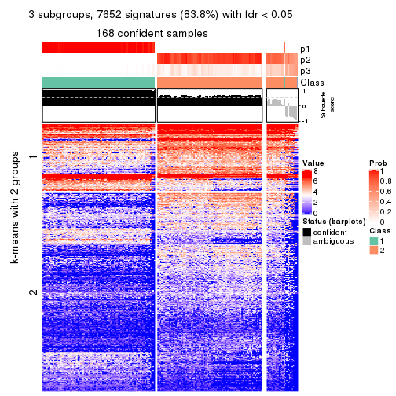</p>

</div>
<div id='tab-MAD-NMF-get-signatures-no-scale-3'>
<pre><code class="r">get_signatures(res, k = 4, scale_rows = FALSE)
</code></pre>

<p></p>

</div>
<div id='tab-MAD-NMF-get-signatures-no-scale-4'>
<pre><code class="r">get_signatures(res, k = 5, scale_rows = FALSE)
</code></pre>

<p></p>

</div>
<div id='tab-MAD-NMF-get-signatures-no-scale-5'>
<pre><code class="r">get_signatures(res, k = 6, scale_rows = FALSE)
</code></pre>

<p></p>

</div>
</div>


Compare the overlap of signatures from different k:

```r
compare_signatures(res)
```


`get_signature()` returns a data frame invisibly. TO get the list of signatures, the function
call should be assigned to a variable explicitly. In following code, if `plot` argument is set
to `FALSE`, no heatmap is plotted while only the differential analysis is performed.

```r
# code only for demonstration
tb = get_signature(res, k = ..., plot = FALSE)
```

An example of the output of `tb` is:

```
#>   which_row         fdr    mean_1    mean_2 scaled_mean_1 scaled_mean_2 km
#> 1        38 0.042760348  8.373488  9.131774    -0.5533452     0.5164555  1
#> 2        40 0.018707592  7.106213  8.469186    -0.6173731     0.5762149  1
#> 3        55 0.019134737 10.221463 11.207825    -0.6159697     0.5749050  1
#> 4        59 0.006059896  5.921854  7.869574    -0.6899429     0.6439467  1
#> 5        60 0.018055526  8.928898 10.211722    -0.6204761     0.5791110  1
#> 6        98 0.009384629 15.714769 14.887706     0.6635654    -0.6193277  2
...
```

The columns in `tb` are:

1. `which_row`: row indices corresponding to the input matrix.
2. `fdr`: FDR for the differential test. 
3. `mean_x`: The mean value in group x.
4. `scaled_mean_x`: The mean value in group x after rows are scaled.
5. `km`: Row groups if k-means clustering is applied to rows.


UMAP plot which shows how samples are separated.


<script>
$( function() {
	$( '#tabs-MAD-NMF-dimension-reduction' ).tabs();
} );
</script>
<div id='tabs-MAD-NMF-dimension-reduction'>
<ul>
<li><a href='#tab-MAD-NMF-dimension-reduction-1'>k = 2</a></li>
<li><a href='#tab-MAD-NMF-dimension-reduction-2'>k = 3</a></li>
<li><a href='#tab-MAD-NMF-dimension-reduction-3'>k = 4</a></li>
<li><a href='#tab-MAD-NMF-dimension-reduction-4'>k = 5</a></li>
<li><a href='#tab-MAD-NMF-dimension-reduction-5'>k = 6</a></li>
</ul>
<div id='tab-MAD-NMF-dimension-reduction-1'>
<pre><code class="r">dimension_reduction(res, k = 2, method = &quot;UMAP&quot;)
</code></pre>

<p></p>

</div>
<div id='tab-MAD-NMF-dimension-reduction-2'>
<pre><code class="r">dimension_reduction(res, k = 3, method = &quot;UMAP&quot;)
</code></pre>

<p></p>

</div>
<div id='tab-MAD-NMF-dimension-reduction-3'>
<pre><code class="r">dimension_reduction(res, k = 4, method = &quot;UMAP&quot;)
</code></pre>

<p></p>

</div>
<div id='tab-MAD-NMF-dimension-reduction-4'>
<pre><code class="r">dimension_reduction(res, k = 5, method = &quot;UMAP&quot;)
</code></pre>

<p></p>

</div>
<div id='tab-MAD-NMF-dimension-reduction-5'>
<pre><code class="r">dimension_reduction(res, k = 6, method = &quot;UMAP&quot;)
</code></pre>

<p></p>

</div>
</div>


Following heatmap shows how subgroups are split when increasing `k`:

```r
collect_classes(res)
```


If matrix rows can be associated to genes, consider to use `functional_enrichment(res,
...)` to perform function enrichment for the signature genes. See [this vignette](http://bioconductor.org/packages/devel/bioc/vignettes/cola/inst/doc/functional_enrichment.html) for more detailed explanations.


 

---------------------------------------------------


### ATC:hclust**


The object with results only for a single top-value method and a single partition method 
can be extracted as:

```r
res = res_list["ATC", "hclust"]
# you can also extract it by
# res = res_list["ATC:hclust"]
```

A summary of `res` and all the functions that can be applied to it:

```r
res
```

```
#> A 'ConsensusPartition' object with k = 2, 3, 4, 5, 6.
#>   On a matrix with 9126 rows and 192 columns.
#>   Top rows (913, 1826, 2738, 3650, 4563) are extracted by 'ATC' method.
#>   Subgroups are detected by 'hclust' method.
#>   Performed in total 1250 partitions by row resampling.
#>   Best k for subgroups seems to be 4.
#> 
#> Following methods can be applied to this 'ConsensusPartition' object:
#>  [1] "cola_report"             "collect_classes"         "collect_plots"          
#>  [4] "collect_stats"           "colnames"                "compare_signatures"     
#>  [7] "consensus_heatmap"       "dimension_reduction"     "functional_enrichment"  
#> [10] "get_anno_col"            "get_anno"                "get_classes"            
#> [13] "get_consensus"           "get_matrix"              "get_membership"         
#> [16] "get_param"               "get_signatures"          "get_stats"              
#> [19] "is_best_k"               "is_stable_k"             "membership_heatmap"     
#> [22] "ncol"                    "nrow"                    "plot_ecdf"              
#> [25] "rownames"                "select_partition_number" "show"                   
#> [28] "suggest_best_k"          "test_to_known_factors"
```

`collect_plots()` function collects all the plots made from `res` for all `k` (number of partitions)
into one single page to provide an easy and fast comparison between different `k`.

```r
collect_plots(res)
```


The plots are:

- The first row: a plot of the ECDF (empirical cumulative distribution
  function) curves of the consensus matrix for each `k` and the heatmap of
  predicted classes for each `k`.
- The second row: heatmaps of the consensus matrix for each `k`.
- The third row: heatmaps of the membership matrix for each `k`.
- The fouth row: heatmaps of the signatures for each `k`.

All the plots in panels can be made by individual functions and they are
plotted later in this section.

`select_partition_number()` produces several plots showing different
statistics for choosing "optimized" `k`. There are following statistics:

- ECDF curves of the consensus matrix for each `k`;
- 1-PAC. [The PAC
  score](https://en.wikipedia.org/wiki/Consensus_clustering#Over-interpretation_potential_of_consensus_clustering)
  measures the proportion of the ambiguous subgrouping.
- Mean silhouette score.
- Concordance. The mean probability of fiting the consensus class ids in all
  partitions.
- Area increased. Denote $A_k$ as the area under the ECDF curve for current
  `k`, the area increased is defined as $A_k - A_{k-1}$.
- Rand index. The percent of pairs of samples that are both in a same cluster
  or both are not in a same cluster in the partition of k and k-1.
- Jaccard index. The ratio of pairs of samples are both in a same cluster in
  the partition of k and k-1 and the pairs of samples are both in a same
  cluster in the partition k or k-1.

The detailed explanations of these statistics can be found in [the _cola_
vignette](http://bioconductor.org/packages/devel/bioc/vignettes/cola/inst/doc/cola.html#toc_13).

Generally speaking, lower PAC score, higher mean silhouette score or higher
concordance corresponds to better partition. Rand index and Jaccard index
measure how similar the current partition is compared to partition with `k-1`.
If they are too similar, we won't accept `k` is better than `k-1`.

```r
select_partition_number(res)
```


The numeric values for all these statistics can be obtained by `get_stats()`.

```r
get_stats(res)
```

```
#>   k 1-PAC mean_silhouette concordance area_increased  Rand Jaccard
#> 2 2  1.00           0.995       0.998         0.5007 0.500   0.500
#> 3 3  1.00           0.978       0.985         0.0318 0.977   0.954
#> 4 4  0.98           0.964       0.980         0.0340 0.973   0.944
#> 5 5  1.00           0.969       0.985         0.0124 1.000   0.999
#> 6 6  1.00           0.962       0.990         0.0160 1.000   1.000
```

`suggest_best_k()` suggests the best $k$ based on these statistics. The rules are as follows:

- All $k$ with Jaccard index larger than 0.95 are removed because increasing
  $k$ does not provide enough extra information. If all $k$ are removed, it is
  marked as no subgroup is detected.
- For all $k$ with 1-PAC score larger than 0.9, the maximal $k$ is taken as
  the best $k$, and other $k$ are marked as optional $k$.
- If it does not fit the second rule. The $k$ with the maximal vote of the
  highest 1-PAC score, highest mean silhouette, and highest concordance is
  taken as the best $k$.

```r
suggest_best_k(res)
```

```
#> [1] 4
#> attr(,"optional")
#> [1] 2
```

There is also optional best $k$ = 2 that is worth to check.

Following shows the table of the partitions (You need to click the **show/hide
code output** link to see it). The membership matrix (columns with name `p*`)
is inferred by
[`clue::cl_consensus()`](https://www.rdocumentation.org/link/cl_consensus?package=clue)
function with the `SE` method. Basically the value in the membership matrix
represents the probability to belong to a certain group. The finall class
label for an item is determined with the group with highest probability it
belongs to.

In `get_classes()` function, the entropy is calculated from the membership
matrix and the silhouette score is calculated from the consensus matrix.


<script>
$( function() {
	$( '#tabs-ATC-hclust-get-classes' ).tabs();
} );
</script>
<div id='tabs-ATC-hclust-get-classes'>
<ul>
<li><a href='#tab-ATC-hclust-get-classes-1'>k = 2</a></li>
<li><a href='#tab-ATC-hclust-get-classes-2'>k = 3</a></li>
<li><a href='#tab-ATC-hclust-get-classes-3'>k = 4</a></li>
<li><a href='#tab-ATC-hclust-get-classes-4'>k = 5</a></li>
<li><a href='#tab-ATC-hclust-get-classes-5'>k = 6</a></li>
</ul>

<div id='tab-ATC-hclust-get-classes-1'>
<p><a id='tab-ATC-hclust-get-classes-1-a' style='color:#0366d6' href='#'>show/hide code output</a></p>
<pre><code class="r">cbind(get_classes(res, k = 2), get_membership(res, k = 2))
</code></pre>

<pre><code>#&gt;            class entropy silhouette    p1    p2
#&gt; SRR2074921     1  0.0376      0.996 0.996 0.004
#&gt; SRR2074919     1  0.0000      1.000 1.000 0.000
#&gt; SRR2074920     1  0.0000      1.000 1.000 0.000
#&gt; SRR2074917     1  0.0000      1.000 1.000 0.000
#&gt; SRR2074918     2  0.0000      0.996 0.000 1.000
#&gt; SRR2074916     2  0.0000      0.996 0.000 1.000
#&gt; SRR2074915     2  0.0000      0.996 0.000 1.000
#&gt; SRR2074914     1  0.0000      1.000 1.000 0.000
#&gt; SRR2074913     2  0.0000      0.996 0.000 1.000
#&gt; SRR2074912     1  0.0000      1.000 1.000 0.000
#&gt; SRR2074911     2  0.0000      0.996 0.000 1.000
#&gt; SRR2074910     2  0.0672      0.988 0.008 0.992
#&gt; SRR2074909     1  0.0000      1.000 1.000 0.000
#&gt; SRR2074907     1  0.0000      1.000 1.000 0.000
#&gt; SRR2074908     2  0.0000      0.996 0.000 1.000
#&gt; SRR2074906     2  0.0000      0.996 0.000 1.000
#&gt; SRR2074905     1  0.0000      1.000 1.000 0.000
#&gt; SRR2074904     2  0.0000      0.996 0.000 1.000
#&gt; SRR2074903     2  0.0000      0.996 0.000 1.000
#&gt; SRR2074902     1  0.0000      1.000 1.000 0.000
#&gt; SRR2074901     2  0.0000      0.996 0.000 1.000
#&gt; SRR2074900     1  0.0000      1.000 1.000 0.000
#&gt; SRR2074899     2  0.0000      0.996 0.000 1.000
#&gt; SRR2074898     2  0.0000      0.996 0.000 1.000
#&gt; SRR2074897     2  0.0000      0.996 0.000 1.000
#&gt; SRR2074896     2  0.0000      0.996 0.000 1.000
#&gt; SRR2074895     1  0.0000      1.000 1.000 0.000
#&gt; SRR2074894     2  0.7602      0.721 0.220 0.780
#&gt; SRR2074893     2  0.0000      0.996 0.000 1.000
#&gt; SRR2074892     1  0.0000      1.000 1.000 0.000
#&gt; SRR2074891     1  0.0000      1.000 1.000 0.000
#&gt; SRR2074890     2  0.0000      0.996 0.000 1.000
#&gt; SRR2074887     2  0.0000      0.996 0.000 1.000
#&gt; SRR2074889     2  0.0000      0.996 0.000 1.000
#&gt; SRR2074886     2  0.0000      0.996 0.000 1.000
#&gt; SRR2074888     2  0.0000      0.996 0.000 1.000
#&gt; SRR2074885     1  0.0000      1.000 1.000 0.000
#&gt; SRR2074884     2  0.0000      0.996 0.000 1.000
#&gt; SRR2074883     2  0.0000      0.996 0.000 1.000
#&gt; SRR2074882     1  0.0000      1.000 1.000 0.000
#&gt; SRR2074880     2  0.0000      0.996 0.000 1.000
#&gt; SRR2074881     2  0.0000      0.996 0.000 1.000
#&gt; SRR2074879     1  0.0000      1.000 1.000 0.000
#&gt; SRR2074878     1  0.0000      1.000 1.000 0.000
#&gt; SRR2074877     2  0.0000      0.996 0.000 1.000
#&gt; SRR2074876     1  0.0000      1.000 1.000 0.000
#&gt; SRR2074875     2  0.0000      0.996 0.000 1.000
#&gt; SRR2074874     1  0.0000      1.000 1.000 0.000
#&gt; SRR2074873     2  0.0000      0.996 0.000 1.000
#&gt; SRR2074872     1  0.0000      1.000 1.000 0.000
#&gt; SRR2074871     2  0.0000      0.996 0.000 1.000
#&gt; SRR2074870     1  0.0000      1.000 1.000 0.000
#&gt; SRR2074869     1  0.0000      1.000 1.000 0.000
#&gt; SRR2074868     1  0.0000      1.000 1.000 0.000
#&gt; SRR2074867     2  0.0000      0.996 0.000 1.000
#&gt; SRR2074866     2  0.0000      0.996 0.000 1.000
#&gt; SRR2074865     1  0.0000      1.000 1.000 0.000
#&gt; SRR2074864     1  0.0000      1.000 1.000 0.000
#&gt; SRR2074863     1  0.0000      1.000 1.000 0.000
#&gt; SRR2074862     1  0.0000      1.000 1.000 0.000
#&gt; SRR2074861     1  0.0000      1.000 1.000 0.000
#&gt; SRR2074860     1  0.0000      1.000 1.000 0.000
#&gt; SRR2074859     1  0.0000      1.000 1.000 0.000
#&gt; SRR2074858     2  0.0000      0.996 0.000 1.000
#&gt; SRR2074855     2  0.0000      0.996 0.000 1.000
#&gt; SRR2074857     1  0.0000      1.000 1.000 0.000
#&gt; SRR2074856     1  0.0000      1.000 1.000 0.000
#&gt; SRR2074854     1  0.0000      1.000 1.000 0.000
#&gt; SRR2074853     1  0.0000      1.000 1.000 0.000
#&gt; SRR2074852     2  0.0000      0.996 0.000 1.000
#&gt; SRR2074851     1  0.0000      1.000 1.000 0.000
#&gt; SRR2074850     1  0.0000      1.000 1.000 0.000
#&gt; SRR2074849     1  0.0000      1.000 1.000 0.000
#&gt; SRR2074848     1  0.0000      1.000 1.000 0.000
#&gt; SRR2074847     1  0.0000      1.000 1.000 0.000
#&gt; SRR2074846     1  0.0000      1.000 1.000 0.000
#&gt; SRR2074845     1  0.0000      1.000 1.000 0.000
#&gt; SRR2074843     1  0.0000      1.000 1.000 0.000
#&gt; SRR2074842     2  0.0000      0.996 0.000 1.000
#&gt; SRR2074844     2  0.0000      0.996 0.000 1.000
#&gt; SRR2074841     2  0.0000      0.996 0.000 1.000
#&gt; SRR2074840     2  0.0000      0.996 0.000 1.000
#&gt; SRR2074839     1  0.0000      1.000 1.000 0.000
#&gt; SRR2074838     2  0.0000      0.996 0.000 1.000
#&gt; SRR2074836     2  0.0000      0.996 0.000 1.000
#&gt; SRR2074835     2  0.0000      0.996 0.000 1.000
#&gt; SRR2074837     1  0.0000      1.000 1.000 0.000
#&gt; SRR2074834     2  0.0000      0.996 0.000 1.000
#&gt; SRR2074833     1  0.0000      1.000 1.000 0.000
#&gt; SRR2074832     2  0.0000      0.996 0.000 1.000
#&gt; SRR2074831     1  0.0000      1.000 1.000 0.000
#&gt; SRR2074829     1  0.0000      1.000 1.000 0.000
#&gt; SRR2074830     1  0.0000      1.000 1.000 0.000
#&gt; SRR2074828     1  0.0000      1.000 1.000 0.000
#&gt; SRR2074827     2  0.0000      0.996 0.000 1.000
#&gt; SRR2074826     2  0.0000      0.996 0.000 1.000
#&gt; SRR2074825     2  0.0000      0.996 0.000 1.000
#&gt; SRR2074824     2  0.0000      0.996 0.000 1.000
#&gt; SRR2074823     1  0.0000      1.000 1.000 0.000
#&gt; SRR2074822     2  0.0000      0.996 0.000 1.000
#&gt; SRR2074821     2  0.0000      0.996 0.000 1.000
#&gt; SRR2074820     2  0.0000      0.996 0.000 1.000
#&gt; SRR2074819     2  0.0000      0.996 0.000 1.000
#&gt; SRR2074817     2  0.0000      0.996 0.000 1.000
#&gt; SRR2074818     2  0.0000      0.996 0.000 1.000
#&gt; SRR2074816     1  0.0000      1.000 1.000 0.000
#&gt; SRR2074815     2  0.0000      0.996 0.000 1.000
#&gt; SRR2074814     1  0.0000      1.000 1.000 0.000
#&gt; SRR2074812     2  0.0000      0.996 0.000 1.000
#&gt; SRR2074813     2  0.0000      0.996 0.000 1.000
#&gt; SRR2074809     2  0.0000      0.996 0.000 1.000
#&gt; SRR2074810     2  0.0000      0.996 0.000 1.000
#&gt; SRR2074811     2  0.0000      0.996 0.000 1.000
#&gt; SRR2074808     2  0.0000      0.996 0.000 1.000
#&gt; SRR2074807     2  0.0000      0.996 0.000 1.000
#&gt; SRR2074806     1  0.0000      1.000 1.000 0.000
#&gt; SRR2074805     2  0.0000      0.996 0.000 1.000
#&gt; SRR2074804     1  0.0000      1.000 1.000 0.000
#&gt; SRR2074803     1  0.0000      1.000 1.000 0.000
#&gt; SRR2074801     1  0.0000      1.000 1.000 0.000
#&gt; SRR2074802     2  0.0000      0.996 0.000 1.000
#&gt; SRR2074799     2  0.0000      0.996 0.000 1.000
#&gt; SRR2074800     1  0.0000      1.000 1.000 0.000
#&gt; SRR2074798     1  0.0000      1.000 1.000 0.000
#&gt; SRR2074797     1  0.0000      1.000 1.000 0.000
#&gt; SRR2074795     2  0.0000      0.996 0.000 1.000
#&gt; SRR2074796     2  0.0000      0.996 0.000 1.000
#&gt; SRR2074794     2  0.0000      0.996 0.000 1.000
#&gt; SRR2074793     2  0.0000      0.996 0.000 1.000
#&gt; SRR2074792     1  0.0000      1.000 1.000 0.000
#&gt; SRR2074791     1  0.0000      1.000 1.000 0.000
#&gt; SRR2074790     2  0.0000      0.996 0.000 1.000
#&gt; SRR2074789     1  0.0000      1.000 1.000 0.000
#&gt; SRR2074788     1  0.0000      1.000 1.000 0.000
#&gt; SRR2074787     1  0.0000      1.000 1.000 0.000
#&gt; SRR2074786     2  0.0000      0.996 0.000 1.000
#&gt; SRR2074785     1  0.0000      1.000 1.000 0.000
#&gt; SRR2074784     1  0.0000      1.000 1.000 0.000
#&gt; SRR2074783     2  0.0000      0.996 0.000 1.000
#&gt; SRR2074782     1  0.0000      1.000 1.000 0.000
#&gt; SRR2074779     2  0.0000      0.996 0.000 1.000
#&gt; SRR2074781     2  0.0000      0.996 0.000 1.000
#&gt; SRR2074780     1  0.0000      1.000 1.000 0.000
#&gt; SRR2074778     2  0.0000      0.996 0.000 1.000
#&gt; SRR2074777     2  0.0000      0.996 0.000 1.000
#&gt; SRR2074776     2  0.0000      0.996 0.000 1.000
#&gt; SRR2074775     1  0.0000      1.000 1.000 0.000
#&gt; SRR2074774     1  0.0000      1.000 1.000 0.000
#&gt; SRR2074773     2  0.0000      0.996 0.000 1.000
#&gt; SRR2074771     2  0.0000      0.996 0.000 1.000
#&gt; SRR2074772     1  0.0000      1.000 1.000 0.000
#&gt; SRR2074770     1  0.0000      1.000 1.000 0.000
#&gt; SRR2074769     2  0.0000      0.996 0.000 1.000
#&gt; SRR2074768     2  0.0000      0.996 0.000 1.000
#&gt; SRR2074766     2  0.0000      0.996 0.000 1.000
#&gt; SRR2074767     1  0.0000      1.000 1.000 0.000
#&gt; SRR2074765     1  0.0000      1.000 1.000 0.000
#&gt; SRR2074764     2  0.0000      0.996 0.000 1.000
#&gt; SRR2074763     2  0.0000      0.996 0.000 1.000
#&gt; SRR2074761     1  0.0000      1.000 1.000 0.000
#&gt; SRR2074762     2  0.0000      0.996 0.000 1.000
#&gt; SRR2074760     2  0.0000      0.996 0.000 1.000
#&gt; SRR2074759     1  0.0000      1.000 1.000 0.000
#&gt; SRR2074757     2  0.0000      0.996 0.000 1.000
#&gt; SRR2074758     2  0.0000      0.996 0.000 1.000
#&gt; SRR2074756     2  0.0000      0.996 0.000 1.000
#&gt; SRR2074755     1  0.0000      1.000 1.000 0.000
#&gt; SRR2074754     1  0.0000      1.000 1.000 0.000
#&gt; SRR2074753     2  0.0000      0.996 0.000 1.000
#&gt; SRR2074752     1  0.0000      1.000 1.000 0.000
#&gt; SRR2074751     1  0.0000      1.000 1.000 0.000
#&gt; SRR2074749     2  0.0000      0.996 0.000 1.000
#&gt; SRR2074750     1  0.0000      1.000 1.000 0.000
#&gt; SRR2074748     1  0.0000      1.000 1.000 0.000
#&gt; SRR2074747     2  0.0000      0.996 0.000 1.000
#&gt; SRR2074745     1  0.0000      1.000 1.000 0.000
#&gt; SRR2074746     2  0.7602      0.721 0.220 0.780
#&gt; SRR2074744     2  0.0000      0.996 0.000 1.000
#&gt; SRR2074743     2  0.0000      0.996 0.000 1.000
#&gt; SRR2074742     2  0.0000      0.996 0.000 1.000
#&gt; SRR2074741     1  0.0000      1.000 1.000 0.000
#&gt; SRR2074740     2  0.0000      0.996 0.000 1.000
#&gt; SRR2074739     1  0.0000      1.000 1.000 0.000
#&gt; SRR2074738     2  0.0000      0.996 0.000 1.000
#&gt; SRR2074737     2  0.0000      0.996 0.000 1.000
#&gt; SRR2074736     2  0.0000      0.996 0.000 1.000
#&gt; SRR2074735     1  0.0000      1.000 1.000 0.000
#&gt; SRR2074734     2  0.0000      0.996 0.000 1.000
#&gt; SRR2074733     1  0.0000      1.000 1.000 0.000
#&gt; SRR2074732     2  0.0000      0.996 0.000 1.000
#&gt; SRR2074731     2  0.0000      0.996 0.000 1.000
#&gt; SRR2074730     1  0.0000      1.000 1.000 0.000
</code></pre>

<script>
$('#tab-ATC-hclust-get-classes-1-a').parent().next().next().hide();
$('#tab-ATC-hclust-get-classes-1-a').click(function(){
  $('#tab-ATC-hclust-get-classes-1-a').parent().next().next().toggle();
  return(false);
});
</script>
</div>

<div id='tab-ATC-hclust-get-classes-2'>
<p><a id='tab-ATC-hclust-get-classes-2-a' style='color:#0366d6' href='#'>show/hide code output</a></p>
<pre><code class="r">cbind(get_classes(res, k = 3), get_membership(res, k = 3))
</code></pre>

<pre><code>#&gt;            class entropy silhouette    p1    p2    p3
#&gt; SRR2074921     3  0.1643      0.517 0.044 0.000 0.956
#&gt; SRR2074919     3  0.6308      0.777 0.492 0.000 0.508
#&gt; SRR2074920     3  0.6308      0.777 0.492 0.000 0.508
#&gt; SRR2074917     1  0.5363      0.128 0.724 0.000 0.276
#&gt; SRR2074918     2  0.0237      0.990 0.000 0.996 0.004
#&gt; SRR2074916     2  0.0000      0.993 0.000 1.000 0.000
#&gt; SRR2074915     2  0.0000      0.993 0.000 1.000 0.000
#&gt; SRR2074914     1  0.0000      0.994 1.000 0.000 0.000
#&gt; SRR2074913     2  0.0000      0.993 0.000 1.000 0.000
#&gt; SRR2074912     3  0.6308      0.777 0.492 0.000 0.508
#&gt; SRR2074911     2  0.0000      0.993 0.000 1.000 0.000
#&gt; SRR2074910     2  0.2173      0.942 0.008 0.944 0.048
#&gt; SRR2074909     1  0.0000      0.994 1.000 0.000 0.000
#&gt; SRR2074907     1  0.0000      0.994 1.000 0.000 0.000
#&gt; SRR2074908     2  0.0000      0.993 0.000 1.000 0.000
#&gt; SRR2074906     2  0.0000      0.993 0.000 1.000 0.000
#&gt; SRR2074905     1  0.0000      0.994 1.000 0.000 0.000
#&gt; SRR2074904     2  0.0000      0.993 0.000 1.000 0.000
#&gt; SRR2074903     2  0.0000      0.993 0.000 1.000 0.000
#&gt; SRR2074902     1  0.0000      0.994 1.000 0.000 0.000
#&gt; SRR2074901     2  0.0000      0.993 0.000 1.000 0.000
#&gt; SRR2074900     1  0.0000      0.994 1.000 0.000 0.000
#&gt; SRR2074899     2  0.0000      0.993 0.000 1.000 0.000
#&gt; SRR2074898     2  0.0000      0.993 0.000 1.000 0.000
#&gt; SRR2074897     2  0.0000      0.993 0.000 1.000 0.000
#&gt; SRR2074896     2  0.0000      0.993 0.000 1.000 0.000
#&gt; SRR2074895     1  0.0000      0.994 1.000 0.000 0.000
#&gt; SRR2074894     2  0.6437      0.590 0.220 0.732 0.048
#&gt; SRR2074893     2  0.0000      0.993 0.000 1.000 0.000
#&gt; SRR2074892     1  0.0000      0.994 1.000 0.000 0.000
#&gt; SRR2074891     1  0.0000      0.994 1.000 0.000 0.000
#&gt; SRR2074890     2  0.0000      0.993 0.000 1.000 0.000
#&gt; SRR2074887     2  0.0000      0.993 0.000 1.000 0.000
#&gt; SRR2074889     2  0.0000      0.993 0.000 1.000 0.000
#&gt; SRR2074886     2  0.0000      0.993 0.000 1.000 0.000
#&gt; SRR2074888     2  0.0000      0.993 0.000 1.000 0.000
#&gt; SRR2074885     1  0.0000      0.994 1.000 0.000 0.000
#&gt; SRR2074884     2  0.0000      0.993 0.000 1.000 0.000
#&gt; SRR2074883     2  0.0000      0.993 0.000 1.000 0.000
#&gt; SRR2074882     1  0.0000      0.994 1.000 0.000 0.000
#&gt; SRR2074880     2  0.0000      0.993 0.000 1.000 0.000
#&gt; SRR2074881     2  0.0000      0.993 0.000 1.000 0.000
#&gt; SRR2074879     3  0.6308      0.777 0.492 0.000 0.508
#&gt; SRR2074878     1  0.0000      0.994 1.000 0.000 0.000
#&gt; SRR2074877     2  0.0000      0.993 0.000 1.000 0.000
#&gt; SRR2074876     1  0.0000      0.994 1.000 0.000 0.000
#&gt; SRR2074875     2  0.0000      0.993 0.000 1.000 0.000
#&gt; SRR2074874     1  0.0000      0.994 1.000 0.000 0.000
#&gt; SRR2074873     2  0.0000      0.993 0.000 1.000 0.000
#&gt; SRR2074872     1  0.0000      0.994 1.000 0.000 0.000
#&gt; SRR2074871     2  0.0000      0.993 0.000 1.000 0.000
#&gt; SRR2074870     1  0.0000      0.994 1.000 0.000 0.000
#&gt; SRR2074869     1  0.0000      0.994 1.000 0.000 0.000
#&gt; SRR2074868     1  0.0000      0.994 1.000 0.000 0.000
#&gt; SRR2074867     2  0.0000      0.993 0.000 1.000 0.000
#&gt; SRR2074866     2  0.0000      0.993 0.000 1.000 0.000
#&gt; SRR2074865     1  0.0000      0.994 1.000 0.000 0.000
#&gt; SRR2074864     1  0.0000      0.994 1.000 0.000 0.000
#&gt; SRR2074863     1  0.0000      0.994 1.000 0.000 0.000
#&gt; SRR2074862     1  0.0000      0.994 1.000 0.000 0.000
#&gt; SRR2074861     1  0.0000      0.994 1.000 0.000 0.000
#&gt; SRR2074860     1  0.0000      0.994 1.000 0.000 0.000
#&gt; SRR2074859     1  0.0000      0.994 1.000 0.000 0.000
#&gt; SRR2074858     2  0.0000      0.993 0.000 1.000 0.000
#&gt; SRR2074855     2  0.0000      0.993 0.000 1.000 0.000
#&gt; SRR2074857     1  0.0000      0.994 1.000 0.000 0.000
#&gt; SRR2074856     1  0.0000      0.994 1.000 0.000 0.000
#&gt; SRR2074854     1  0.0000      0.994 1.000 0.000 0.000
#&gt; SRR2074853     1  0.0000      0.994 1.000 0.000 0.000
#&gt; SRR2074852     2  0.0000      0.993 0.000 1.000 0.000
#&gt; SRR2074851     1  0.0000      0.994 1.000 0.000 0.000
#&gt; SRR2074850     1  0.0000      0.994 1.000 0.000 0.000
#&gt; SRR2074849     1  0.0000      0.994 1.000 0.000 0.000
#&gt; SRR2074848     1  0.0000      0.994 1.000 0.000 0.000
#&gt; SRR2074847     1  0.0000      0.994 1.000 0.000 0.000
#&gt; SRR2074846     1  0.0000      0.994 1.000 0.000 0.000
#&gt; SRR2074845     1  0.0000      0.994 1.000 0.000 0.000
#&gt; SRR2074843     1  0.0000      0.994 1.000 0.000 0.000
#&gt; SRR2074842     2  0.0000      0.993 0.000 1.000 0.000
#&gt; SRR2074844     2  0.0000      0.993 0.000 1.000 0.000
#&gt; SRR2074841     2  0.0000      0.993 0.000 1.000 0.000
#&gt; SRR2074840     2  0.0000      0.993 0.000 1.000 0.000
#&gt; SRR2074839     1  0.0000      0.994 1.000 0.000 0.000
#&gt; SRR2074838     2  0.0000      0.993 0.000 1.000 0.000
#&gt; SRR2074836     2  0.0000      0.993 0.000 1.000 0.000
#&gt; SRR2074835     2  0.0000      0.993 0.000 1.000 0.000
#&gt; SRR2074837     1  0.0000      0.994 1.000 0.000 0.000
#&gt; SRR2074834     2  0.0000      0.993 0.000 1.000 0.000
#&gt; SRR2074833     1  0.0000      0.994 1.000 0.000 0.000
#&gt; SRR2074832     2  0.0000      0.993 0.000 1.000 0.000
#&gt; SRR2074831     1  0.0000      0.994 1.000 0.000 0.000
#&gt; SRR2074829     1  0.0000      0.994 1.000 0.000 0.000
#&gt; SRR2074830     1  0.0000      0.994 1.000 0.000 0.000
#&gt; SRR2074828     1  0.0000      0.994 1.000 0.000 0.000
#&gt; SRR2074827     2  0.0000      0.993 0.000 1.000 0.000
#&gt; SRR2074826     2  0.0000      0.993 0.000 1.000 0.000
#&gt; SRR2074825     2  0.0000      0.993 0.000 1.000 0.000
#&gt; SRR2074824     2  0.0000      0.993 0.000 1.000 0.000
#&gt; SRR2074823     1  0.0000      0.994 1.000 0.000 0.000
#&gt; SRR2074822     2  0.0000      0.993 0.000 1.000 0.000
#&gt; SRR2074821     2  0.0000      0.993 0.000 1.000 0.000
#&gt; SRR2074820     2  0.0000      0.993 0.000 1.000 0.000
#&gt; SRR2074819     2  0.0000      0.993 0.000 1.000 0.000
#&gt; SRR2074817     2  0.0000      0.993 0.000 1.000 0.000
#&gt; SRR2074818     2  0.0000      0.993 0.000 1.000 0.000
#&gt; SRR2074816     1  0.0000      0.994 1.000 0.000 0.000
#&gt; SRR2074815     2  0.0000      0.993 0.000 1.000 0.000
#&gt; SRR2074814     1  0.0000      0.994 1.000 0.000 0.000
#&gt; SRR2074812     2  0.0000      0.993 0.000 1.000 0.000
#&gt; SRR2074813     2  0.0000      0.993 0.000 1.000 0.000
#&gt; SRR2074809     2  0.0000      0.993 0.000 1.000 0.000
#&gt; SRR2074810     2  0.0000      0.993 0.000 1.000 0.000
#&gt; SRR2074811     2  0.0000      0.993 0.000 1.000 0.000
#&gt; SRR2074808     2  0.0000      0.993 0.000 1.000 0.000
#&gt; SRR2074807     2  0.0000      0.993 0.000 1.000 0.000
#&gt; SRR2074806     1  0.0000      0.994 1.000 0.000 0.000
#&gt; SRR2074805     2  0.0000      0.993 0.000 1.000 0.000
#&gt; SRR2074804     1  0.0000      0.994 1.000 0.000 0.000
#&gt; SRR2074803     1  0.0000      0.994 1.000 0.000 0.000
#&gt; SRR2074801     1  0.0000      0.994 1.000 0.000 0.000
#&gt; SRR2074802     2  0.0000      0.993 0.000 1.000 0.000
#&gt; SRR2074799     2  0.0000      0.993 0.000 1.000 0.000
#&gt; SRR2074800     1  0.0000      0.994 1.000 0.000 0.000
#&gt; SRR2074798     1  0.0000      0.994 1.000 0.000 0.000
#&gt; SRR2074797     1  0.0000      0.994 1.000 0.000 0.000
#&gt; SRR2074795     2  0.0000      0.993 0.000 1.000 0.000
#&gt; SRR2074796     2  0.0000      0.993 0.000 1.000 0.000
#&gt; SRR2074794     2  0.0000      0.993 0.000 1.000 0.000
#&gt; SRR2074793     2  0.0000      0.993 0.000 1.000 0.000
#&gt; SRR2074792     1  0.0000      0.994 1.000 0.000 0.000
#&gt; SRR2074791     1  0.0000      0.994 1.000 0.000 0.000
#&gt; SRR2074790     2  0.0000      0.993 0.000 1.000 0.000
#&gt; SRR2074789     1  0.0000      0.994 1.000 0.000 0.000
#&gt; SRR2074788     1  0.0000      0.994 1.000 0.000 0.000
#&gt; SRR2074787     1  0.0000      0.994 1.000 0.000 0.000
#&gt; SRR2074786     2  0.0000      0.993 0.000 1.000 0.000
#&gt; SRR2074785     1  0.0000      0.994 1.000 0.000 0.000
#&gt; SRR2074784     1  0.0000      0.994 1.000 0.000 0.000
#&gt; SRR2074783     2  0.0000      0.993 0.000 1.000 0.000
#&gt; SRR2074782     1  0.0000      0.994 1.000 0.000 0.000
#&gt; SRR2074779     2  0.0000      0.993 0.000 1.000 0.000
#&gt; SRR2074781     2  0.0000      0.993 0.000 1.000 0.000
#&gt; SRR2074780     1  0.0000      0.994 1.000 0.000 0.000
#&gt; SRR2074778     2  0.0000      0.993 0.000 1.000 0.000
#&gt; SRR2074777     2  0.0000      0.993 0.000 1.000 0.000
#&gt; SRR2074776     2  0.0000      0.993 0.000 1.000 0.000
#&gt; SRR2074775     1  0.0000      0.994 1.000 0.000 0.000
#&gt; SRR2074774     1  0.0000      0.994 1.000 0.000 0.000
#&gt; SRR2074773     2  0.0000      0.993 0.000 1.000 0.000
#&gt; SRR2074771     2  0.0000      0.993 0.000 1.000 0.000
#&gt; SRR2074772     1  0.0000      0.994 1.000 0.000 0.000
#&gt; SRR2074770     1  0.0000      0.994 1.000 0.000 0.000
#&gt; SRR2074769     2  0.0000      0.993 0.000 1.000 0.000
#&gt; SRR2074768     2  0.0000      0.993 0.000 1.000 0.000
#&gt; SRR2074766     2  0.0000      0.993 0.000 1.000 0.000
#&gt; SRR2074767     1  0.0000      0.994 1.000 0.000 0.000
#&gt; SRR2074765     1  0.0000      0.994 1.000 0.000 0.000
#&gt; SRR2074764     2  0.0000      0.993 0.000 1.000 0.000
#&gt; SRR2074763     2  0.0000      0.993 0.000 1.000 0.000
#&gt; SRR2074761     1  0.0000      0.994 1.000 0.000 0.000
#&gt; SRR2074762     2  0.0000      0.993 0.000 1.000 0.000
#&gt; SRR2074760     2  0.0000      0.993 0.000 1.000 0.000
#&gt; SRR2074759     1  0.0000      0.994 1.000 0.000 0.000
#&gt; SRR2074757     2  0.0000      0.993 0.000 1.000 0.000
#&gt; SRR2074758     2  0.0000      0.993 0.000 1.000 0.000
#&gt; SRR2074756     2  0.0000      0.993 0.000 1.000 0.000
#&gt; SRR2074755     1  0.0000      0.994 1.000 0.000 0.000
#&gt; SRR2074754     1  0.0000      0.994 1.000 0.000 0.000
#&gt; SRR2074753     2  0.0000      0.993 0.000 1.000 0.000
#&gt; SRR2074752     1  0.0000      0.994 1.000 0.000 0.000
#&gt; SRR2074751     1  0.0000      0.994 1.000 0.000 0.000
#&gt; SRR2074749     2  0.0000      0.993 0.000 1.000 0.000
#&gt; SRR2074750     1  0.0000      0.994 1.000 0.000 0.000
#&gt; SRR2074748     1  0.0000      0.994 1.000 0.000 0.000
#&gt; SRR2074747     2  0.0000      0.993 0.000 1.000 0.000
#&gt; SRR2074745     1  0.0000      0.994 1.000 0.000 0.000
#&gt; SRR2074746     2  0.6437      0.590 0.220 0.732 0.048
#&gt; SRR2074744     2  0.0000      0.993 0.000 1.000 0.000
#&gt; SRR2074743     2  0.0000      0.993 0.000 1.000 0.000
#&gt; SRR2074742     2  0.0237      0.990 0.000 0.996 0.004
#&gt; SRR2074741     1  0.0000      0.994 1.000 0.000 0.000
#&gt; SRR2074740     2  0.0000      0.993 0.000 1.000 0.000
#&gt; SRR2074739     1  0.0000      0.994 1.000 0.000 0.000
#&gt; SRR2074738     2  0.0000      0.993 0.000 1.000 0.000
#&gt; SRR2074737     2  0.0000      0.993 0.000 1.000 0.000
#&gt; SRR2074736     2  0.0000      0.993 0.000 1.000 0.000
#&gt; SRR2074735     1  0.0000      0.994 1.000 0.000 0.000
#&gt; SRR2074734     2  0.0000      0.993 0.000 1.000 0.000
#&gt; SRR2074733     1  0.0000      0.994 1.000 0.000 0.000
#&gt; SRR2074732     2  0.0000      0.993 0.000 1.000 0.000
#&gt; SRR2074731     2  0.0000      0.993 0.000 1.000 0.000
#&gt; SRR2074730     1  0.0000      0.994 1.000 0.000 0.000
</code></pre>

<script>
$('#tab-ATC-hclust-get-classes-2-a').parent().next().next().hide();
$('#tab-ATC-hclust-get-classes-2-a').click(function(){
  $('#tab-ATC-hclust-get-classes-2-a').parent().next().next().toggle();
  return(false);
});
</script>
</div>

<div id='tab-ATC-hclust-get-classes-3'>
<p><a id='tab-ATC-hclust-get-classes-3-a' style='color:#0366d6' href='#'>show/hide code output</a></p>
<pre><code class="r">cbind(get_classes(res, k = 4), get_membership(res, k = 4))
</code></pre>

<pre><code>#&gt;            class entropy silhouette    p1    p2    p3    p4
#&gt; SRR2074921     3  0.0000     -0.177 0.000 0.000 1.000 0.000
#&gt; SRR2074919     3  0.4999      0.755 0.492 0.000 0.508 0.000
#&gt; SRR2074920     3  0.4999      0.755 0.492 0.000 0.508 0.000
#&gt; SRR2074917     1  0.4250      0.152 0.724 0.000 0.276 0.000
#&gt; SRR2074918     4  0.4961      0.461 0.000 0.448 0.000 0.552
#&gt; SRR2074916     2  0.0000      1.000 0.000 1.000 0.000 0.000
#&gt; SRR2074915     2  0.0000      1.000 0.000 1.000 0.000 0.000
#&gt; SRR2074914     1  0.0000      0.994 1.000 0.000 0.000 0.000
#&gt; SRR2074913     2  0.0000      1.000 0.000 1.000 0.000 0.000
#&gt; SRR2074912     3  0.4999      0.755 0.492 0.000 0.508 0.000
#&gt; SRR2074911     2  0.0469      0.984 0.000 0.988 0.000 0.012
#&gt; SRR2074910     4  0.4222      0.500 0.000 0.272 0.000 0.728
#&gt; SRR2074909     1  0.0000      0.994 1.000 0.000 0.000 0.000
#&gt; SRR2074907     1  0.0000      0.994 1.000 0.000 0.000 0.000
#&gt; SRR2074908     2  0.0000      1.000 0.000 1.000 0.000 0.000
#&gt; SRR2074906     2  0.0000      1.000 0.000 1.000 0.000 0.000
#&gt; SRR2074905     1  0.0000      0.994 1.000 0.000 0.000 0.000
#&gt; SRR2074904     2  0.0000      1.000 0.000 1.000 0.000 0.000
#&gt; SRR2074903     2  0.0000      1.000 0.000 1.000 0.000 0.000
#&gt; SRR2074902     1  0.0000      0.994 1.000 0.000 0.000 0.000
#&gt; SRR2074901     2  0.0000      1.000 0.000 1.000 0.000 0.000
#&gt; SRR2074900     1  0.0000      0.994 1.000 0.000 0.000 0.000
#&gt; SRR2074899     2  0.0000      1.000 0.000 1.000 0.000 0.000
#&gt; SRR2074898     2  0.0000      1.000 0.000 1.000 0.000 0.000
#&gt; SRR2074897     2  0.0000      1.000 0.000 1.000 0.000 0.000
#&gt; SRR2074896     2  0.0000      1.000 0.000 1.000 0.000 0.000
#&gt; SRR2074895     1  0.0000      0.994 1.000 0.000 0.000 0.000
#&gt; SRR2074894     4  0.4501      0.109 0.212 0.024 0.000 0.764
#&gt; SRR2074893     2  0.0000      1.000 0.000 1.000 0.000 0.000
#&gt; SRR2074892     1  0.0000      0.994 1.000 0.000 0.000 0.000
#&gt; SRR2074891     1  0.0000      0.994 1.000 0.000 0.000 0.000
#&gt; SRR2074890     2  0.0000      1.000 0.000 1.000 0.000 0.000
#&gt; SRR2074887     2  0.0000      1.000 0.000 1.000 0.000 0.000
#&gt; SRR2074889     2  0.0000      1.000 0.000 1.000 0.000 0.000
#&gt; SRR2074886     2  0.0000      1.000 0.000 1.000 0.000 0.000
#&gt; SRR2074888     2  0.0000      1.000 0.000 1.000 0.000 0.000
#&gt; SRR2074885     1  0.0000      0.994 1.000 0.000 0.000 0.000
#&gt; SRR2074884     2  0.0000      1.000 0.000 1.000 0.000 0.000
#&gt; SRR2074883     2  0.0000      1.000 0.000 1.000 0.000 0.000
#&gt; SRR2074882     1  0.0000      0.994 1.000 0.000 0.000 0.000
#&gt; SRR2074880     2  0.0000      1.000 0.000 1.000 0.000 0.000
#&gt; SRR2074881     2  0.0000      1.000 0.000 1.000 0.000 0.000
#&gt; SRR2074879     3  0.4999      0.755 0.492 0.000 0.508 0.000
#&gt; SRR2074878     1  0.0000      0.994 1.000 0.000 0.000 0.000
#&gt; SRR2074877     2  0.0000      1.000 0.000 1.000 0.000 0.000
#&gt; SRR2074876     1  0.0000      0.994 1.000 0.000 0.000 0.000
#&gt; SRR2074875     2  0.0000      1.000 0.000 1.000 0.000 0.000
#&gt; SRR2074874     1  0.0000      0.994 1.000 0.000 0.000 0.000
#&gt; SRR2074873     2  0.0000      1.000 0.000 1.000 0.000 0.000
#&gt; SRR2074872     1  0.0000      0.994 1.000 0.000 0.000 0.000
#&gt; SRR2074871     2  0.0000      1.000 0.000 1.000 0.000 0.000
#&gt; SRR2074870     1  0.0000      0.994 1.000 0.000 0.000 0.000
#&gt; SRR2074869     1  0.0000      0.994 1.000 0.000 0.000 0.000
#&gt; SRR2074868     1  0.0000      0.994 1.000 0.000 0.000 0.000
#&gt; SRR2074867     2  0.0000      1.000 0.000 1.000 0.000 0.000
#&gt; SRR2074866     2  0.0000      1.000 0.000 1.000 0.000 0.000
#&gt; SRR2074865     1  0.0000      0.994 1.000 0.000 0.000 0.000
#&gt; SRR2074864     1  0.0000      0.994 1.000 0.000 0.000 0.000
#&gt; SRR2074863     1  0.0000      0.994 1.000 0.000 0.000 0.000
#&gt; SRR2074862     1  0.0000      0.994 1.000 0.000 0.000 0.000
#&gt; SRR2074861     1  0.0000      0.994 1.000 0.000 0.000 0.000
#&gt; SRR2074860     1  0.0000      0.994 1.000 0.000 0.000 0.000
#&gt; SRR2074859     1  0.0000      0.994 1.000 0.000 0.000 0.000
#&gt; SRR2074858     2  0.0000      1.000 0.000 1.000 0.000 0.000
#&gt; SRR2074855     2  0.0000      1.000 0.000 1.000 0.000 0.000
#&gt; SRR2074857     1  0.0000      0.994 1.000 0.000 0.000 0.000
#&gt; SRR2074856     1  0.0000      0.994 1.000 0.000 0.000 0.000
#&gt; SRR2074854     1  0.0000      0.994 1.000 0.000 0.000 0.000
#&gt; SRR2074853     1  0.0000      0.994 1.000 0.000 0.000 0.000
#&gt; SRR2074852     2  0.0000      1.000 0.000 1.000 0.000 0.000
#&gt; SRR2074851     1  0.0000      0.994 1.000 0.000 0.000 0.000
#&gt; SRR2074850     1  0.0000      0.994 1.000 0.000 0.000 0.000
#&gt; SRR2074849     1  0.0000      0.994 1.000 0.000 0.000 0.000
#&gt; SRR2074848     1  0.0000      0.994 1.000 0.000 0.000 0.000
#&gt; SRR2074847     1  0.0000      0.994 1.000 0.000 0.000 0.000
#&gt; SRR2074846     1  0.0000      0.994 1.000 0.000 0.000 0.000
#&gt; SRR2074845     1  0.0000      0.994 1.000 0.000 0.000 0.000
#&gt; SRR2074843     1  0.0000      0.994 1.000 0.000 0.000 0.000
#&gt; SRR2074842     2  0.0000      1.000 0.000 1.000 0.000 0.000
#&gt; SRR2074844     2  0.0000      1.000 0.000 1.000 0.000 0.000
#&gt; SRR2074841     2  0.0000      1.000 0.000 1.000 0.000 0.000
#&gt; SRR2074840     2  0.0000      1.000 0.000 1.000 0.000 0.000
#&gt; SRR2074839     1  0.0000      0.994 1.000 0.000 0.000 0.000
#&gt; SRR2074838     2  0.0000      1.000 0.000 1.000 0.000 0.000
#&gt; SRR2074836     2  0.0000      1.000 0.000 1.000 0.000 0.000
#&gt; SRR2074835     2  0.0000      1.000 0.000 1.000 0.000 0.000
#&gt; SRR2074837     1  0.0000      0.994 1.000 0.000 0.000 0.000
#&gt; SRR2074834     2  0.0000      1.000 0.000 1.000 0.000 0.000
#&gt; SRR2074833     1  0.0000      0.994 1.000 0.000 0.000 0.000
#&gt; SRR2074832     2  0.0000      1.000 0.000 1.000 0.000 0.000
#&gt; SRR2074831     1  0.0000      0.994 1.000 0.000 0.000 0.000
#&gt; SRR2074829     1  0.0000      0.994 1.000 0.000 0.000 0.000
#&gt; SRR2074830     1  0.0000      0.994 1.000 0.000 0.000 0.000
#&gt; SRR2074828     1  0.0000      0.994 1.000 0.000 0.000 0.000
#&gt; SRR2074827     2  0.0000      1.000 0.000 1.000 0.000 0.000
#&gt; SRR2074826     2  0.0000      1.000 0.000 1.000 0.000 0.000
#&gt; SRR2074825     2  0.0000      1.000 0.000 1.000 0.000 0.000
#&gt; SRR2074824     2  0.0000      1.000 0.000 1.000 0.000 0.000
#&gt; SRR2074823     1  0.0000      0.994 1.000 0.000 0.000 0.000
#&gt; SRR2074822     2  0.0000      1.000 0.000 1.000 0.000 0.000
#&gt; SRR2074821     2  0.0000      1.000 0.000 1.000 0.000 0.000
#&gt; SRR2074820     2  0.0000      1.000 0.000 1.000 0.000 0.000
#&gt; SRR2074819     2  0.0000      1.000 0.000 1.000 0.000 0.000
#&gt; SRR2074817     2  0.0000      1.000 0.000 1.000 0.000 0.000
#&gt; SRR2074818     2  0.0000      1.000 0.000 1.000 0.000 0.000
#&gt; SRR2074816     1  0.0000      0.994 1.000 0.000 0.000 0.000
#&gt; SRR2074815     2  0.0000      1.000 0.000 1.000 0.000 0.000
#&gt; SRR2074814     1  0.0000      0.994 1.000 0.000 0.000 0.000
#&gt; SRR2074812     2  0.0000      1.000 0.000 1.000 0.000 0.000
#&gt; SRR2074813     2  0.0000      1.000 0.000 1.000 0.000 0.000
#&gt; SRR2074809     2  0.0000      1.000 0.000 1.000 0.000 0.000
#&gt; SRR2074810     2  0.0000      1.000 0.000 1.000 0.000 0.000
#&gt; SRR2074811     2  0.0000      1.000 0.000 1.000 0.000 0.000
#&gt; SRR2074808     2  0.0000      1.000 0.000 1.000 0.000 0.000
#&gt; SRR2074807     2  0.0000      1.000 0.000 1.000 0.000 0.000
#&gt; SRR2074806     1  0.0000      0.994 1.000 0.000 0.000 0.000
#&gt; SRR2074805     2  0.0000      1.000 0.000 1.000 0.000 0.000
#&gt; SRR2074804     1  0.0000      0.994 1.000 0.000 0.000 0.000
#&gt; SRR2074803     1  0.0000      0.994 1.000 0.000 0.000 0.000
#&gt; SRR2074801     1  0.0000      0.994 1.000 0.000 0.000 0.000
#&gt; SRR2074802     2  0.0000      1.000 0.000 1.000 0.000 0.000
#&gt; SRR2074799     2  0.0000      1.000 0.000 1.000 0.000 0.000
#&gt; SRR2074800     1  0.0000      0.994 1.000 0.000 0.000 0.000
#&gt; SRR2074798     1  0.0000      0.994 1.000 0.000 0.000 0.000
#&gt; SRR2074797     1  0.0000      0.994 1.000 0.000 0.000 0.000
#&gt; SRR2074795     2  0.0000      1.000 0.000 1.000 0.000 0.000
#&gt; SRR2074796     2  0.0000      1.000 0.000 1.000 0.000 0.000
#&gt; SRR2074794     2  0.0000      1.000 0.000 1.000 0.000 0.000
#&gt; SRR2074793     2  0.0000      1.000 0.000 1.000 0.000 0.000
#&gt; SRR2074792     1  0.0000      0.994 1.000 0.000 0.000 0.000
#&gt; SRR2074791     1  0.0000      0.994 1.000 0.000 0.000 0.000
#&gt; SRR2074790     2  0.0000      1.000 0.000 1.000 0.000 0.000
#&gt; SRR2074789     1  0.0000      0.994 1.000 0.000 0.000 0.000
#&gt; SRR2074788     1  0.0000      0.994 1.000 0.000 0.000 0.000
#&gt; SRR2074787     1  0.0000      0.994 1.000 0.000 0.000 0.000
#&gt; SRR2074786     2  0.0000      1.000 0.000 1.000 0.000 0.000
#&gt; SRR2074785     1  0.0000      0.994 1.000 0.000 0.000 0.000
#&gt; SRR2074784     1  0.0000      0.994 1.000 0.000 0.000 0.000
#&gt; SRR2074783     2  0.0000      1.000 0.000 1.000 0.000 0.000
#&gt; SRR2074782     1  0.0000      0.994 1.000 0.000 0.000 0.000
#&gt; SRR2074779     2  0.0000      1.000 0.000 1.000 0.000 0.000
#&gt; SRR2074781     2  0.0000      1.000 0.000 1.000 0.000 0.000
#&gt; SRR2074780     1  0.0000      0.994 1.000 0.000 0.000 0.000
#&gt; SRR2074778     2  0.0000      1.000 0.000 1.000 0.000 0.000
#&gt; SRR2074777     2  0.0000      1.000 0.000 1.000 0.000 0.000
#&gt; SRR2074776     2  0.0000      1.000 0.000 1.000 0.000 0.000
#&gt; SRR2074775     1  0.0000      0.994 1.000 0.000 0.000 0.000
#&gt; SRR2074774     1  0.0000      0.994 1.000 0.000 0.000 0.000
#&gt; SRR2074773     2  0.0000      1.000 0.000 1.000 0.000 0.000
#&gt; SRR2074771     2  0.0000      1.000 0.000 1.000 0.000 0.000
#&gt; SRR2074772     1  0.0000      0.994 1.000 0.000 0.000 0.000
#&gt; SRR2074770     1  0.0000      0.994 1.000 0.000 0.000 0.000
#&gt; SRR2074769     2  0.0000      1.000 0.000 1.000 0.000 0.000
#&gt; SRR2074768     2  0.0000      1.000 0.000 1.000 0.000 0.000
#&gt; SRR2074766     2  0.0000      1.000 0.000 1.000 0.000 0.000
#&gt; SRR2074767     1  0.0000      0.994 1.000 0.000 0.000 0.000
#&gt; SRR2074765     1  0.0000      0.994 1.000 0.000 0.000 0.000
#&gt; SRR2074764     2  0.0000      1.000 0.000 1.000 0.000 0.000
#&gt; SRR2074763     2  0.0000      1.000 0.000 1.000 0.000 0.000
#&gt; SRR2074761     1  0.0000      0.994 1.000 0.000 0.000 0.000
#&gt; SRR2074762     2  0.0000      1.000 0.000 1.000 0.000 0.000
#&gt; SRR2074760     2  0.0000      1.000 0.000 1.000 0.000 0.000
#&gt; SRR2074759     1  0.0000      0.994 1.000 0.000 0.000 0.000
#&gt; SRR2074757     2  0.0000      1.000 0.000 1.000 0.000 0.000
#&gt; SRR2074758     2  0.0000      1.000 0.000 1.000 0.000 0.000
#&gt; SRR2074756     2  0.0000      1.000 0.000 1.000 0.000 0.000
#&gt; SRR2074755     1  0.0000      0.994 1.000 0.000 0.000 0.000
#&gt; SRR2074754     1  0.0000      0.994 1.000 0.000 0.000 0.000
#&gt; SRR2074753     2  0.0000      1.000 0.000 1.000 0.000 0.000
#&gt; SRR2074752     1  0.0000      0.994 1.000 0.000 0.000 0.000
#&gt; SRR2074751     1  0.0000      0.994 1.000 0.000 0.000 0.000
#&gt; SRR2074749     2  0.0000      1.000 0.000 1.000 0.000 0.000
#&gt; SRR2074750     1  0.0000      0.994 1.000 0.000 0.000 0.000
#&gt; SRR2074748     1  0.0000      0.994 1.000 0.000 0.000 0.000
#&gt; SRR2074747     2  0.0000      1.000 0.000 1.000 0.000 0.000
#&gt; SRR2074745     1  0.0000      0.994 1.000 0.000 0.000 0.000
#&gt; SRR2074746     4  0.4501      0.109 0.212 0.024 0.000 0.764
#&gt; SRR2074744     2  0.0000      1.000 0.000 1.000 0.000 0.000
#&gt; SRR2074743     2  0.0000      1.000 0.000 1.000 0.000 0.000
#&gt; SRR2074742     4  0.4961      0.461 0.000 0.448 0.000 0.552
#&gt; SRR2074741     1  0.0000      0.994 1.000 0.000 0.000 0.000
#&gt; SRR2074740     2  0.0000      1.000 0.000 1.000 0.000 0.000
#&gt; SRR2074739     1  0.0000      0.994 1.000 0.000 0.000 0.000
#&gt; SRR2074738     2  0.0000      1.000 0.000 1.000 0.000 0.000
#&gt; SRR2074737     2  0.0000      1.000 0.000 1.000 0.000 0.000
#&gt; SRR2074736     2  0.0000      1.000 0.000 1.000 0.000 0.000
#&gt; SRR2074735     1  0.0000      0.994 1.000 0.000 0.000 0.000
#&gt; SRR2074734     2  0.0000      1.000 0.000 1.000 0.000 0.000
#&gt; SRR2074733     1  0.0000      0.994 1.000 0.000 0.000 0.000
#&gt; SRR2074732     2  0.0000      1.000 0.000 1.000 0.000 0.000
#&gt; SRR2074731     2  0.0000      1.000 0.000 1.000 0.000 0.000
#&gt; SRR2074730     1  0.0000      0.994 1.000 0.000 0.000 0.000
</code></pre>

<script>
$('#tab-ATC-hclust-get-classes-3-a').parent().next().next().hide();
$('#tab-ATC-hclust-get-classes-3-a').click(function(){
  $('#tab-ATC-hclust-get-classes-3-a').parent().next().next().toggle();
  return(false);
});
</script>
</div>

<div id='tab-ATC-hclust-get-classes-4'>
<p><a id='tab-ATC-hclust-get-classes-4-a' style='color:#0366d6' href='#'>show/hide code output</a></p>
<pre><code class="r">cbind(get_classes(res, k = 5), get_membership(res, k = 5))
</code></pre>

<pre><code>#&gt;            class entropy silhouette    p1    p2    p3    p4    p5
#&gt; SRR2074921     3   0.241    -0.4970 0.000 0.000 0.900 0.032 0.068
#&gt; SRR2074919     3   0.484     0.6788 0.416 0.000 0.564 0.012 0.008
#&gt; SRR2074920     3   0.426     0.7025 0.436 0.000 0.564 0.000 0.000
#&gt; SRR2074917     1   0.380     0.1334 0.700 0.000 0.300 0.000 0.000
#&gt; SRR2074918     5   0.177     1.0000 0.000 0.072 0.000 0.004 0.924
#&gt; SRR2074916     2   0.000     0.9996 0.000 1.000 0.000 0.000 0.000
#&gt; SRR2074915     2   0.000     0.9996 0.000 1.000 0.000 0.000 0.000
#&gt; SRR2074914     1   0.000     0.9944 1.000 0.000 0.000 0.000 0.000
#&gt; SRR2074913     2   0.051     0.9825 0.000 0.984 0.000 0.016 0.000
#&gt; SRR2074912     3   0.427     0.7018 0.448 0.000 0.552 0.000 0.000
#&gt; SRR2074911     2   0.051     0.9827 0.000 0.984 0.000 0.016 0.000
#&gt; SRR2074910     4   0.167    -0.0506 0.000 0.076 0.000 0.924 0.000
#&gt; SRR2074909     1   0.000     0.9944 1.000 0.000 0.000 0.000 0.000
#&gt; SRR2074907     1   0.000     0.9944 1.000 0.000 0.000 0.000 0.000
#&gt; SRR2074908     2   0.000     0.9996 0.000 1.000 0.000 0.000 0.000
#&gt; SRR2074906     2   0.000     0.9996 0.000 1.000 0.000 0.000 0.000
#&gt; SRR2074905     1   0.000     0.9944 1.000 0.000 0.000 0.000 0.000
#&gt; SRR2074904     2   0.000     0.9996 0.000 1.000 0.000 0.000 0.000
#&gt; SRR2074903     2   0.000     0.9996 0.000 1.000 0.000 0.000 0.000
#&gt; SRR2074902     1   0.000     0.9944 1.000 0.000 0.000 0.000 0.000
#&gt; SRR2074901     2   0.000     0.9996 0.000 1.000 0.000 0.000 0.000
#&gt; SRR2074900     1   0.000     0.9944 1.000 0.000 0.000 0.000 0.000
#&gt; SRR2074899     2   0.000     0.9996 0.000 1.000 0.000 0.000 0.000
#&gt; SRR2074898     2   0.000     0.9996 0.000 1.000 0.000 0.000 0.000
#&gt; SRR2074897     2   0.000     0.9996 0.000 1.000 0.000 0.000 0.000
#&gt; SRR2074896     2   0.000     0.9996 0.000 1.000 0.000 0.000 0.000
#&gt; SRR2074895     1   0.000     0.9944 1.000 0.000 0.000 0.000 0.000
#&gt; SRR2074894     4   0.379     0.6393 0.212 0.000 0.000 0.768 0.020
#&gt; SRR2074893     2   0.000     0.9996 0.000 1.000 0.000 0.000 0.000
#&gt; SRR2074892     1   0.000     0.9944 1.000 0.000 0.000 0.000 0.000
#&gt; SRR2074891     1   0.000     0.9944 1.000 0.000 0.000 0.000 0.000
#&gt; SRR2074890     2   0.000     0.9996 0.000 1.000 0.000 0.000 0.000
#&gt; SRR2074887     2   0.000     0.9996 0.000 1.000 0.000 0.000 0.000
#&gt; SRR2074889     2   0.000     0.9996 0.000 1.000 0.000 0.000 0.000
#&gt; SRR2074886     2   0.000     0.9996 0.000 1.000 0.000 0.000 0.000
#&gt; SRR2074888     2   0.000     0.9996 0.000 1.000 0.000 0.000 0.000
#&gt; SRR2074885     1   0.000     0.9944 1.000 0.000 0.000 0.000 0.000
#&gt; SRR2074884     2   0.000     0.9996 0.000 1.000 0.000 0.000 0.000
#&gt; SRR2074883     2   0.000     0.9996 0.000 1.000 0.000 0.000 0.000
#&gt; SRR2074882     1   0.000     0.9944 1.000 0.000 0.000 0.000 0.000
#&gt; SRR2074880     2   0.000     0.9996 0.000 1.000 0.000 0.000 0.000
#&gt; SRR2074881     2   0.000     0.9996 0.000 1.000 0.000 0.000 0.000
#&gt; SRR2074879     3   0.427     0.7018 0.448 0.000 0.552 0.000 0.000
#&gt; SRR2074878     1   0.000     0.9944 1.000 0.000 0.000 0.000 0.000
#&gt; SRR2074877     2   0.000     0.9996 0.000 1.000 0.000 0.000 0.000
#&gt; SRR2074876     1   0.000     0.9944 1.000 0.000 0.000 0.000 0.000
#&gt; SRR2074875     2   0.000     0.9996 0.000 1.000 0.000 0.000 0.000
#&gt; SRR2074874     1   0.000     0.9944 1.000 0.000 0.000 0.000 0.000
#&gt; SRR2074873     2   0.000     0.9996 0.000 1.000 0.000 0.000 0.000
#&gt; SRR2074872     1   0.000     0.9944 1.000 0.000 0.000 0.000 0.000
#&gt; SRR2074871     2   0.000     0.9996 0.000 1.000 0.000 0.000 0.000
#&gt; SRR2074870     1   0.000     0.9944 1.000 0.000 0.000 0.000 0.000
#&gt; SRR2074869     1   0.000     0.9944 1.000 0.000 0.000 0.000 0.000
#&gt; SRR2074868     1   0.000     0.9944 1.000 0.000 0.000 0.000 0.000
#&gt; SRR2074867     2   0.000     0.9996 0.000 1.000 0.000 0.000 0.000
#&gt; SRR2074866     2   0.000     0.9996 0.000 1.000 0.000 0.000 0.000
#&gt; SRR2074865     1   0.000     0.9944 1.000 0.000 0.000 0.000 0.000
#&gt; SRR2074864     1   0.000     0.9944 1.000 0.000 0.000 0.000 0.000
#&gt; SRR2074863     1   0.000     0.9944 1.000 0.000 0.000 0.000 0.000
#&gt; SRR2074862     1   0.000     0.9944 1.000 0.000 0.000 0.000 0.000
#&gt; SRR2074861     1   0.000     0.9944 1.000 0.000 0.000 0.000 0.000
#&gt; SRR2074860     1   0.000     0.9944 1.000 0.000 0.000 0.000 0.000
#&gt; SRR2074859     1   0.000     0.9944 1.000 0.000 0.000 0.000 0.000
#&gt; SRR2074858     2   0.000     0.9996 0.000 1.000 0.000 0.000 0.000
#&gt; SRR2074855     2   0.000     0.9996 0.000 1.000 0.000 0.000 0.000
#&gt; SRR2074857     1   0.000     0.9944 1.000 0.000 0.000 0.000 0.000
#&gt; SRR2074856     1   0.000     0.9944 1.000 0.000 0.000 0.000 0.000
#&gt; SRR2074854     1   0.000     0.9944 1.000 0.000 0.000 0.000 0.000
#&gt; SRR2074853     1   0.000     0.9944 1.000 0.000 0.000 0.000 0.000
#&gt; SRR2074852     2   0.000     0.9996 0.000 1.000 0.000 0.000 0.000
#&gt; SRR2074851     1   0.000     0.9944 1.000 0.000 0.000 0.000 0.000
#&gt; SRR2074850     1   0.000     0.9944 1.000 0.000 0.000 0.000 0.000
#&gt; SRR2074849     1   0.000     0.9944 1.000 0.000 0.000 0.000 0.000
#&gt; SRR2074848     1   0.000     0.9944 1.000 0.000 0.000 0.000 0.000
#&gt; SRR2074847     1   0.000     0.9944 1.000 0.000 0.000 0.000 0.000
#&gt; SRR2074846     1   0.000     0.9944 1.000 0.000 0.000 0.000 0.000
#&gt; SRR2074845     1   0.000     0.9944 1.000 0.000 0.000 0.000 0.000
#&gt; SRR2074843     1   0.000     0.9944 1.000 0.000 0.000 0.000 0.000
#&gt; SRR2074842     2   0.000     0.9996 0.000 1.000 0.000 0.000 0.000
#&gt; SRR2074844     2   0.000     0.9996 0.000 1.000 0.000 0.000 0.000
#&gt; SRR2074841     2   0.000     0.9996 0.000 1.000 0.000 0.000 0.000
#&gt; SRR2074840     2   0.000     0.9996 0.000 1.000 0.000 0.000 0.000
#&gt; SRR2074839     1   0.000     0.9944 1.000 0.000 0.000 0.000 0.000
#&gt; SRR2074838     2   0.000     0.9996 0.000 1.000 0.000 0.000 0.000
#&gt; SRR2074836     2   0.000     0.9996 0.000 1.000 0.000 0.000 0.000
#&gt; SRR2074835     2   0.000     0.9996 0.000 1.000 0.000 0.000 0.000
#&gt; SRR2074837     1   0.000     0.9944 1.000 0.000 0.000 0.000 0.000
#&gt; SRR2074834     2   0.000     0.9996 0.000 1.000 0.000 0.000 0.000
#&gt; SRR2074833     1   0.000     0.9944 1.000 0.000 0.000 0.000 0.000
#&gt; SRR2074832     2   0.000     0.9996 0.000 1.000 0.000 0.000 0.000
#&gt; SRR2074831     1   0.000     0.9944 1.000 0.000 0.000 0.000 0.000
#&gt; SRR2074829     1   0.000     0.9944 1.000 0.000 0.000 0.000 0.000
#&gt; SRR2074830     1   0.000     0.9944 1.000 0.000 0.000 0.000 0.000
#&gt; SRR2074828     1   0.000     0.9944 1.000 0.000 0.000 0.000 0.000
#&gt; SRR2074827     2   0.000     0.9996 0.000 1.000 0.000 0.000 0.000
#&gt; SRR2074826     2   0.000     0.9996 0.000 1.000 0.000 0.000 0.000
#&gt; SRR2074825     2   0.000     0.9996 0.000 1.000 0.000 0.000 0.000
#&gt; SRR2074824     2   0.000     0.9996 0.000 1.000 0.000 0.000 0.000
#&gt; SRR2074823     1   0.000     0.9944 1.000 0.000 0.000 0.000 0.000
#&gt; SRR2074822     2   0.000     0.9996 0.000 1.000 0.000 0.000 0.000
#&gt; SRR2074821     2   0.000     0.9996 0.000 1.000 0.000 0.000 0.000
#&gt; SRR2074820     2   0.000     0.9996 0.000 1.000 0.000 0.000 0.000
#&gt; SRR2074819     2   0.000     0.9996 0.000 1.000 0.000 0.000 0.000
#&gt; SRR2074817     2   0.000     0.9996 0.000 1.000 0.000 0.000 0.000
#&gt; SRR2074818     2   0.000     0.9996 0.000 1.000 0.000 0.000 0.000
#&gt; SRR2074816     1   0.000     0.9944 1.000 0.000 0.000 0.000 0.000
#&gt; SRR2074815     2   0.000     0.9996 0.000 1.000 0.000 0.000 0.000
#&gt; SRR2074814     1   0.000     0.9944 1.000 0.000 0.000 0.000 0.000
#&gt; SRR2074812     2   0.000     0.9996 0.000 1.000 0.000 0.000 0.000
#&gt; SRR2074813     2   0.000     0.9996 0.000 1.000 0.000 0.000 0.000
#&gt; SRR2074809     2   0.000     0.9996 0.000 1.000 0.000 0.000 0.000
#&gt; SRR2074810     2   0.000     0.9996 0.000 1.000 0.000 0.000 0.000
#&gt; SRR2074811     2   0.000     0.9996 0.000 1.000 0.000 0.000 0.000
#&gt; SRR2074808     2   0.000     0.9996 0.000 1.000 0.000 0.000 0.000
#&gt; SRR2074807     2   0.000     0.9996 0.000 1.000 0.000 0.000 0.000
#&gt; SRR2074806     1   0.000     0.9944 1.000 0.000 0.000 0.000 0.000
#&gt; SRR2074805     2   0.000     0.9996 0.000 1.000 0.000 0.000 0.000
#&gt; SRR2074804     1   0.000     0.9944 1.000 0.000 0.000 0.000 0.000
#&gt; SRR2074803     1   0.000     0.9944 1.000 0.000 0.000 0.000 0.000
#&gt; SRR2074801     1   0.000     0.9944 1.000 0.000 0.000 0.000 0.000
#&gt; SRR2074802     2   0.000     0.9996 0.000 1.000 0.000 0.000 0.000
#&gt; SRR2074799     2   0.000     0.9996 0.000 1.000 0.000 0.000 0.000
#&gt; SRR2074800     1   0.000     0.9944 1.000 0.000 0.000 0.000 0.000
#&gt; SRR2074798     1   0.000     0.9944 1.000 0.000 0.000 0.000 0.000
#&gt; SRR2074797     1   0.000     0.9944 1.000 0.000 0.000 0.000 0.000
#&gt; SRR2074795     2   0.000     0.9996 0.000 1.000 0.000 0.000 0.000
#&gt; SRR2074796     2   0.000     0.9996 0.000 1.000 0.000 0.000 0.000
#&gt; SRR2074794     2   0.000     0.9996 0.000 1.000 0.000 0.000 0.000
#&gt; SRR2074793     2   0.000     0.9996 0.000 1.000 0.000 0.000 0.000
#&gt; SRR2074792     1   0.000     0.9944 1.000 0.000 0.000 0.000 0.000
#&gt; SRR2074791     1   0.000     0.9944 1.000 0.000 0.000 0.000 0.000
#&gt; SRR2074790     2   0.000     0.9996 0.000 1.000 0.000 0.000 0.000
#&gt; SRR2074789     1   0.000     0.9944 1.000 0.000 0.000 0.000 0.000
#&gt; SRR2074788     1   0.000     0.9944 1.000 0.000 0.000 0.000 0.000
#&gt; SRR2074787     1   0.000     0.9944 1.000 0.000 0.000 0.000 0.000
#&gt; SRR2074786     2   0.000     0.9996 0.000 1.000 0.000 0.000 0.000
#&gt; SRR2074785     1   0.000     0.9944 1.000 0.000 0.000 0.000 0.000
#&gt; SRR2074784     1   0.000     0.9944 1.000 0.000 0.000 0.000 0.000
#&gt; SRR2074783     2   0.000     0.9996 0.000 1.000 0.000 0.000 0.000
#&gt; SRR2074782     1   0.000     0.9944 1.000 0.000 0.000 0.000 0.000
#&gt; SRR2074779     2   0.000     0.9996 0.000 1.000 0.000 0.000 0.000
#&gt; SRR2074781     2   0.000     0.9996 0.000 1.000 0.000 0.000 0.000
#&gt; SRR2074780     1   0.000     0.9944 1.000 0.000 0.000 0.000 0.000
#&gt; SRR2074778     2   0.000     0.9996 0.000 1.000 0.000 0.000 0.000
#&gt; SRR2074777     2   0.000     0.9996 0.000 1.000 0.000 0.000 0.000
#&gt; SRR2074776     2   0.000     0.9996 0.000 1.000 0.000 0.000 0.000
#&gt; SRR2074775     1   0.000     0.9944 1.000 0.000 0.000 0.000 0.000
#&gt; SRR2074774     1   0.000     0.9944 1.000 0.000 0.000 0.000 0.000
#&gt; SRR2074773     2   0.000     0.9996 0.000 1.000 0.000 0.000 0.000
#&gt; SRR2074771     2   0.000     0.9996 0.000 1.000 0.000 0.000 0.000
#&gt; SRR2074772     1   0.000     0.9944 1.000 0.000 0.000 0.000 0.000
#&gt; SRR2074770     1   0.000     0.9944 1.000 0.000 0.000 0.000 0.000
#&gt; SRR2074769     2   0.000     0.9996 0.000 1.000 0.000 0.000 0.000
#&gt; SRR2074768     2   0.000     0.9996 0.000 1.000 0.000 0.000 0.000
#&gt; SRR2074766     2   0.000     0.9996 0.000 1.000 0.000 0.000 0.000
#&gt; SRR2074767     1   0.000     0.9944 1.000 0.000 0.000 0.000 0.000
#&gt; SRR2074765     1   0.000     0.9944 1.000 0.000 0.000 0.000 0.000
#&gt; SRR2074764     2   0.000     0.9996 0.000 1.000 0.000 0.000 0.000
#&gt; SRR2074763     2   0.000     0.9996 0.000 1.000 0.000 0.000 0.000
#&gt; SRR2074761     1   0.000     0.9944 1.000 0.000 0.000 0.000 0.000
#&gt; SRR2074762     2   0.000     0.9996 0.000 1.000 0.000 0.000 0.000
#&gt; SRR2074760     2   0.000     0.9996 0.000 1.000 0.000 0.000 0.000
#&gt; SRR2074759     1   0.000     0.9944 1.000 0.000 0.000 0.000 0.000
#&gt; SRR2074757     2   0.000     0.9996 0.000 1.000 0.000 0.000 0.000
#&gt; SRR2074758     2   0.000     0.9996 0.000 1.000 0.000 0.000 0.000
#&gt; SRR2074756     2   0.000     0.9996 0.000 1.000 0.000 0.000 0.000
#&gt; SRR2074755     1   0.000     0.9944 1.000 0.000 0.000 0.000 0.000
#&gt; SRR2074754     1   0.000     0.9944 1.000 0.000 0.000 0.000 0.000
#&gt; SRR2074753     2   0.000     0.9996 0.000 1.000 0.000 0.000 0.000
#&gt; SRR2074752     1   0.000     0.9944 1.000 0.000 0.000 0.000 0.000
#&gt; SRR2074751     1   0.000     0.9944 1.000 0.000 0.000 0.000 0.000
#&gt; SRR2074749     2   0.000     0.9996 0.000 1.000 0.000 0.000 0.000
#&gt; SRR2074750     1   0.000     0.9944 1.000 0.000 0.000 0.000 0.000
#&gt; SRR2074748     1   0.000     0.9944 1.000 0.000 0.000 0.000 0.000
#&gt; SRR2074747     2   0.000     0.9996 0.000 1.000 0.000 0.000 0.000
#&gt; SRR2074745     1   0.000     0.9944 1.000 0.000 0.000 0.000 0.000
#&gt; SRR2074746     4   0.379     0.6393 0.212 0.000 0.000 0.768 0.020
#&gt; SRR2074744     2   0.000     0.9996 0.000 1.000 0.000 0.000 0.000
#&gt; SRR2074743     2   0.000     0.9996 0.000 1.000 0.000 0.000 0.000
#&gt; SRR2074742     5   0.177     1.0000 0.000 0.072 0.000 0.004 0.924
#&gt; SRR2074741     1   0.000     0.9944 1.000 0.000 0.000 0.000 0.000
#&gt; SRR2074740     2   0.000     0.9996 0.000 1.000 0.000 0.000 0.000
#&gt; SRR2074739     1   0.000     0.9944 1.000 0.000 0.000 0.000 0.000
#&gt; SRR2074738     2   0.000     0.9996 0.000 1.000 0.000 0.000 0.000
#&gt; SRR2074737     2   0.000     0.9996 0.000 1.000 0.000 0.000 0.000
#&gt; SRR2074736     2   0.000     0.9996 0.000 1.000 0.000 0.000 0.000
#&gt; SRR2074735     1   0.000     0.9944 1.000 0.000 0.000 0.000 0.000
#&gt; SRR2074734     2   0.000     0.9996 0.000 1.000 0.000 0.000 0.000
#&gt; SRR2074733     1   0.000     0.9944 1.000 0.000 0.000 0.000 0.000
#&gt; SRR2074732     2   0.000     0.9996 0.000 1.000 0.000 0.000 0.000
#&gt; SRR2074731     2   0.000     0.9996 0.000 1.000 0.000 0.000 0.000
#&gt; SRR2074730     1   0.000     0.9944 1.000 0.000 0.000 0.000 0.000
</code></pre>

<script>
$('#tab-ATC-hclust-get-classes-4-a').parent().next().next().hide();
$('#tab-ATC-hclust-get-classes-4-a').click(function(){
  $('#tab-ATC-hclust-get-classes-4-a').parent().next().next().toggle();
  return(false);
});
</script>
</div>

<div id='tab-ATC-hclust-get-classes-5'>
<p><a id='tab-ATC-hclust-get-classes-5-a' style='color:#0366d6' href='#'>show/hide code output</a></p>
<pre><code class="r">cbind(get_classes(res, k = 6), get_membership(res, k = 6))
</code></pre>

<pre><code>#&gt;            class entropy silhouette    p1    p2    p3    p4 p5    p6
#&gt; SRR2074921     6  0.3266     0.0000 0.000 0.000 0.272 0.000  0 0.728
#&gt; SRR2074919     3  0.0000     0.0520 0.000 0.000 1.000 0.000  0 0.000
#&gt; SRR2074920     3  0.1075     0.3032 0.048 0.000 0.952 0.000  0 0.000
#&gt; SRR2074917     1  0.3795     0.2865 0.632 0.000 0.364 0.000  0 0.004
#&gt; SRR2074918     5  0.0000     1.0000 0.000 0.000 0.000 0.000  1 0.000
#&gt; SRR2074916     2  0.0000     0.9969 0.000 1.000 0.000 0.000  0 0.000
#&gt; SRR2074915     2  0.0000     0.9969 0.000 1.000 0.000 0.000  0 0.000
#&gt; SRR2074914     1  0.0000     0.9948 1.000 0.000 0.000 0.000  0 0.000
#&gt; SRR2074913     2  0.0458     0.9810 0.000 0.984 0.000 0.016  0 0.000
#&gt; SRR2074912     3  0.2793     0.5427 0.200 0.000 0.800 0.000  0 0.000
#&gt; SRR2074911     2  0.3674     0.6104 0.000 0.716 0.000 0.016  0 0.268
#&gt; SRR2074910     4  0.1141    -0.0594 0.000 0.052 0.000 0.948  0 0.000
#&gt; SRR2074909     1  0.0000     0.9948 1.000 0.000 0.000 0.000  0 0.000
#&gt; SRR2074907     1  0.0000     0.9948 1.000 0.000 0.000 0.000  0 0.000
#&gt; SRR2074908     2  0.0000     0.9969 0.000 1.000 0.000 0.000  0 0.000
#&gt; SRR2074906     2  0.0000     0.9969 0.000 1.000 0.000 0.000  0 0.000
#&gt; SRR2074905     1  0.0000     0.9948 1.000 0.000 0.000 0.000  0 0.000
#&gt; SRR2074904     2  0.0000     0.9969 0.000 1.000 0.000 0.000  0 0.000
#&gt; SRR2074903     2  0.0000     0.9969 0.000 1.000 0.000 0.000  0 0.000
#&gt; SRR2074902     1  0.0000     0.9948 1.000 0.000 0.000 0.000  0 0.000
#&gt; SRR2074901     2  0.0000     0.9969 0.000 1.000 0.000 0.000  0 0.000
#&gt; SRR2074900     1  0.0000     0.9948 1.000 0.000 0.000 0.000  0 0.000
#&gt; SRR2074899     2  0.0000     0.9969 0.000 1.000 0.000 0.000  0 0.000
#&gt; SRR2074898     2  0.0000     0.9969 0.000 1.000 0.000 0.000  0 0.000
#&gt; SRR2074897     2  0.0000     0.9969 0.000 1.000 0.000 0.000  0 0.000
#&gt; SRR2074896     2  0.0000     0.9969 0.000 1.000 0.000 0.000  0 0.000
#&gt; SRR2074895     1  0.0000     0.9948 1.000 0.000 0.000 0.000  0 0.000
#&gt; SRR2074894     4  0.2883     0.6292 0.212 0.000 0.000 0.788  0 0.000
#&gt; SRR2074893     2  0.0000     0.9969 0.000 1.000 0.000 0.000  0 0.000
#&gt; SRR2074892     1  0.0000     0.9948 1.000 0.000 0.000 0.000  0 0.000
#&gt; SRR2074891     1  0.0000     0.9948 1.000 0.000 0.000 0.000  0 0.000
#&gt; SRR2074890     2  0.0000     0.9969 0.000 1.000 0.000 0.000  0 0.000
#&gt; SRR2074887     2  0.0000     0.9969 0.000 1.000 0.000 0.000  0 0.000
#&gt; SRR2074889     2  0.0000     0.9969 0.000 1.000 0.000 0.000  0 0.000
#&gt; SRR2074886     2  0.0000     0.9969 0.000 1.000 0.000 0.000  0 0.000
#&gt; SRR2074888     2  0.0000     0.9969 0.000 1.000 0.000 0.000  0 0.000
#&gt; SRR2074885     1  0.0000     0.9948 1.000 0.000 0.000 0.000  0 0.000
#&gt; SRR2074884     2  0.0000     0.9969 0.000 1.000 0.000 0.000  0 0.000
#&gt; SRR2074883     2  0.0000     0.9969 0.000 1.000 0.000 0.000  0 0.000
#&gt; SRR2074882     1  0.0000     0.9948 1.000 0.000 0.000 0.000  0 0.000
#&gt; SRR2074880     2  0.0000     0.9969 0.000 1.000 0.000 0.000  0 0.000
#&gt; SRR2074881     2  0.0000     0.9969 0.000 1.000 0.000 0.000  0 0.000
#&gt; SRR2074879     3  0.2793     0.5427 0.200 0.000 0.800 0.000  0 0.000
#&gt; SRR2074878     1  0.0000     0.9948 1.000 0.000 0.000 0.000  0 0.000
#&gt; SRR2074877     2  0.0000     0.9969 0.000 1.000 0.000 0.000  0 0.000
#&gt; SRR2074876     1  0.0000     0.9948 1.000 0.000 0.000 0.000  0 0.000
#&gt; SRR2074875     2  0.0000     0.9969 0.000 1.000 0.000 0.000  0 0.000
#&gt; SRR2074874     1  0.0000     0.9948 1.000 0.000 0.000 0.000  0 0.000
#&gt; SRR2074873     2  0.0000     0.9969 0.000 1.000 0.000 0.000  0 0.000
#&gt; SRR2074872     1  0.0000     0.9948 1.000 0.000 0.000 0.000  0 0.000
#&gt; SRR2074871     2  0.0000     0.9969 0.000 1.000 0.000 0.000  0 0.000
#&gt; SRR2074870     1  0.0000     0.9948 1.000 0.000 0.000 0.000  0 0.000
#&gt; SRR2074869     1  0.0000     0.9948 1.000 0.000 0.000 0.000  0 0.000
#&gt; SRR2074868     1  0.0000     0.9948 1.000 0.000 0.000 0.000  0 0.000
#&gt; SRR2074867     2  0.0000     0.9969 0.000 1.000 0.000 0.000  0 0.000
#&gt; SRR2074866     2  0.0000     0.9969 0.000 1.000 0.000 0.000  0 0.000
#&gt; SRR2074865     1  0.0000     0.9948 1.000 0.000 0.000 0.000  0 0.000
#&gt; SRR2074864     1  0.0000     0.9948 1.000 0.000 0.000 0.000  0 0.000
#&gt; SRR2074863     1  0.0000     0.9948 1.000 0.000 0.000 0.000  0 0.000
#&gt; SRR2074862     1  0.0000     0.9948 1.000 0.000 0.000 0.000  0 0.000
#&gt; SRR2074861     1  0.0000     0.9948 1.000 0.000 0.000 0.000  0 0.000
#&gt; SRR2074860     1  0.0000     0.9948 1.000 0.000 0.000 0.000  0 0.000
#&gt; SRR2074859     1  0.0000     0.9948 1.000 0.000 0.000 0.000  0 0.000
#&gt; SRR2074858     2  0.0000     0.9969 0.000 1.000 0.000 0.000  0 0.000
#&gt; SRR2074855     2  0.0000     0.9969 0.000 1.000 0.000 0.000  0 0.000
#&gt; SRR2074857     1  0.0000     0.9948 1.000 0.000 0.000 0.000  0 0.000
#&gt; SRR2074856     1  0.0000     0.9948 1.000 0.000 0.000 0.000  0 0.000
#&gt; SRR2074854     1  0.0000     0.9948 1.000 0.000 0.000 0.000  0 0.000
#&gt; SRR2074853     1  0.0000     0.9948 1.000 0.000 0.000 0.000  0 0.000
#&gt; SRR2074852     2  0.0000     0.9969 0.000 1.000 0.000 0.000  0 0.000
#&gt; SRR2074851     1  0.0000     0.9948 1.000 0.000 0.000 0.000  0 0.000
#&gt; SRR2074850     1  0.0000     0.9948 1.000 0.000 0.000 0.000  0 0.000
#&gt; SRR2074849     1  0.0000     0.9948 1.000 0.000 0.000 0.000  0 0.000
#&gt; SRR2074848     1  0.0000     0.9948 1.000 0.000 0.000 0.000  0 0.000
#&gt; SRR2074847     1  0.0000     0.9948 1.000 0.000 0.000 0.000  0 0.000
#&gt; SRR2074846     1  0.0000     0.9948 1.000 0.000 0.000 0.000  0 0.000
#&gt; SRR2074845     1  0.0000     0.9948 1.000 0.000 0.000 0.000  0 0.000
#&gt; SRR2074843     1  0.0000     0.9948 1.000 0.000 0.000 0.000  0 0.000
#&gt; SRR2074842     2  0.0000     0.9969 0.000 1.000 0.000 0.000  0 0.000
#&gt; SRR2074844     2  0.0000     0.9969 0.000 1.000 0.000 0.000  0 0.000
#&gt; SRR2074841     2  0.0000     0.9969 0.000 1.000 0.000 0.000  0 0.000
#&gt; SRR2074840     2  0.0000     0.9969 0.000 1.000 0.000 0.000  0 0.000
#&gt; SRR2074839     1  0.0000     0.9948 1.000 0.000 0.000 0.000  0 0.000
#&gt; SRR2074838     2  0.0000     0.9969 0.000 1.000 0.000 0.000  0 0.000
#&gt; SRR2074836     2  0.0000     0.9969 0.000 1.000 0.000 0.000  0 0.000
#&gt; SRR2074835     2  0.0000     0.9969 0.000 1.000 0.000 0.000  0 0.000
#&gt; SRR2074837     1  0.0000     0.9948 1.000 0.000 0.000 0.000  0 0.000
#&gt; SRR2074834     2  0.0000     0.9969 0.000 1.000 0.000 0.000  0 0.000
#&gt; SRR2074833     1  0.0000     0.9948 1.000 0.000 0.000 0.000  0 0.000
#&gt; SRR2074832     2  0.0000     0.9969 0.000 1.000 0.000 0.000  0 0.000
#&gt; SRR2074831     1  0.0000     0.9948 1.000 0.000 0.000 0.000  0 0.000
#&gt; SRR2074829     1  0.0000     0.9948 1.000 0.000 0.000 0.000  0 0.000
#&gt; SRR2074830     1  0.0000     0.9948 1.000 0.000 0.000 0.000  0 0.000
#&gt; SRR2074828     1  0.0000     0.9948 1.000 0.000 0.000 0.000  0 0.000
#&gt; SRR2074827     2  0.0000     0.9969 0.000 1.000 0.000 0.000  0 0.000
#&gt; SRR2074826     2  0.0000     0.9969 0.000 1.000 0.000 0.000  0 0.000
#&gt; SRR2074825     2  0.0000     0.9969 0.000 1.000 0.000 0.000  0 0.000
#&gt; SRR2074824     2  0.0000     0.9969 0.000 1.000 0.000 0.000  0 0.000
#&gt; SRR2074823     1  0.0000     0.9948 1.000 0.000 0.000 0.000  0 0.000
#&gt; SRR2074822     2  0.0000     0.9969 0.000 1.000 0.000 0.000  0 0.000
#&gt; SRR2074821     2  0.0000     0.9969 0.000 1.000 0.000 0.000  0 0.000
#&gt; SRR2074820     2  0.0000     0.9969 0.000 1.000 0.000 0.000  0 0.000
#&gt; SRR2074819     2  0.0000     0.9969 0.000 1.000 0.000 0.000  0 0.000
#&gt; SRR2074817     2  0.0000     0.9969 0.000 1.000 0.000 0.000  0 0.000
#&gt; SRR2074818     2  0.0000     0.9969 0.000 1.000 0.000 0.000  0 0.000
#&gt; SRR2074816     1  0.0000     0.9948 1.000 0.000 0.000 0.000  0 0.000
#&gt; SRR2074815     2  0.0000     0.9969 0.000 1.000 0.000 0.000  0 0.000
#&gt; SRR2074814     1  0.0000     0.9948 1.000 0.000 0.000 0.000  0 0.000
#&gt; SRR2074812     2  0.0000     0.9969 0.000 1.000 0.000 0.000  0 0.000
#&gt; SRR2074813     2  0.0000     0.9969 0.000 1.000 0.000 0.000  0 0.000
#&gt; SRR2074809     2  0.0000     0.9969 0.000 1.000 0.000 0.000  0 0.000
#&gt; SRR2074810     2  0.0000     0.9969 0.000 1.000 0.000 0.000  0 0.000
#&gt; SRR2074811     2  0.0000     0.9969 0.000 1.000 0.000 0.000  0 0.000
#&gt; SRR2074808     2  0.0000     0.9969 0.000 1.000 0.000 0.000  0 0.000
#&gt; SRR2074807     2  0.0000     0.9969 0.000 1.000 0.000 0.000  0 0.000
#&gt; SRR2074806     1  0.0000     0.9948 1.000 0.000 0.000 0.000  0 0.000
#&gt; SRR2074805     2  0.0000     0.9969 0.000 1.000 0.000 0.000  0 0.000
#&gt; SRR2074804     1  0.0000     0.9948 1.000 0.000 0.000 0.000  0 0.000
#&gt; SRR2074803     1  0.0000     0.9948 1.000 0.000 0.000 0.000  0 0.000
#&gt; SRR2074801     1  0.0000     0.9948 1.000 0.000 0.000 0.000  0 0.000
#&gt; SRR2074802     2  0.0000     0.9969 0.000 1.000 0.000 0.000  0 0.000
#&gt; SRR2074799     2  0.0000     0.9969 0.000 1.000 0.000 0.000  0 0.000
#&gt; SRR2074800     1  0.0000     0.9948 1.000 0.000 0.000 0.000  0 0.000
#&gt; SRR2074798     1  0.0000     0.9948 1.000 0.000 0.000 0.000  0 0.000
#&gt; SRR2074797     1  0.0000     0.9948 1.000 0.000 0.000 0.000  0 0.000
#&gt; SRR2074795     2  0.0000     0.9969 0.000 1.000 0.000 0.000  0 0.000
#&gt; SRR2074796     2  0.0000     0.9969 0.000 1.000 0.000 0.000  0 0.000
#&gt; SRR2074794     2  0.0000     0.9969 0.000 1.000 0.000 0.000  0 0.000
#&gt; SRR2074793     2  0.0000     0.9969 0.000 1.000 0.000 0.000  0 0.000
#&gt; SRR2074792     1  0.0000     0.9948 1.000 0.000 0.000 0.000  0 0.000
#&gt; SRR2074791     1  0.0000     0.9948 1.000 0.000 0.000 0.000  0 0.000
#&gt; SRR2074790     2  0.0000     0.9969 0.000 1.000 0.000 0.000  0 0.000
#&gt; SRR2074789     1  0.0000     0.9948 1.000 0.000 0.000 0.000  0 0.000
#&gt; SRR2074788     1  0.0000     0.9948 1.000 0.000 0.000 0.000  0 0.000
#&gt; SRR2074787     1  0.0000     0.9948 1.000 0.000 0.000 0.000  0 0.000
#&gt; SRR2074786     2  0.0000     0.9969 0.000 1.000 0.000 0.000  0 0.000
#&gt; SRR2074785     1  0.0000     0.9948 1.000 0.000 0.000 0.000  0 0.000
#&gt; SRR2074784     1  0.0000     0.9948 1.000 0.000 0.000 0.000  0 0.000
#&gt; SRR2074783     2  0.0000     0.9969 0.000 1.000 0.000 0.000  0 0.000
#&gt; SRR2074782     1  0.0000     0.9948 1.000 0.000 0.000 0.000  0 0.000
#&gt; SRR2074779     2  0.0000     0.9969 0.000 1.000 0.000 0.000  0 0.000
#&gt; SRR2074781     2  0.0000     0.9969 0.000 1.000 0.000 0.000  0 0.000
#&gt; SRR2074780     1  0.0000     0.9948 1.000 0.000 0.000 0.000  0 0.000
#&gt; SRR2074778     2  0.0000     0.9969 0.000 1.000 0.000 0.000  0 0.000
#&gt; SRR2074777     2  0.0000     0.9969 0.000 1.000 0.000 0.000  0 0.000
#&gt; SRR2074776     2  0.0000     0.9969 0.000 1.000 0.000 0.000  0 0.000
#&gt; SRR2074775     1  0.0000     0.9948 1.000 0.000 0.000 0.000  0 0.000
#&gt; SRR2074774     1  0.0000     0.9948 1.000 0.000 0.000 0.000  0 0.000
#&gt; SRR2074773     2  0.0000     0.9969 0.000 1.000 0.000 0.000  0 0.000
#&gt; SRR2074771     2  0.0000     0.9969 0.000 1.000 0.000 0.000  0 0.000
#&gt; SRR2074772     1  0.0000     0.9948 1.000 0.000 0.000 0.000  0 0.000
#&gt; SRR2074770     1  0.0000     0.9948 1.000 0.000 0.000 0.000  0 0.000
#&gt; SRR2074769     2  0.0000     0.9969 0.000 1.000 0.000 0.000  0 0.000
#&gt; SRR2074768     2  0.0000     0.9969 0.000 1.000 0.000 0.000  0 0.000
#&gt; SRR2074766     2  0.0000     0.9969 0.000 1.000 0.000 0.000  0 0.000
#&gt; SRR2074767     1  0.0000     0.9948 1.000 0.000 0.000 0.000  0 0.000
#&gt; SRR2074765     1  0.0000     0.9948 1.000 0.000 0.000 0.000  0 0.000
#&gt; SRR2074764     2  0.0000     0.9969 0.000 1.000 0.000 0.000  0 0.000
#&gt; SRR2074763     2  0.0000     0.9969 0.000 1.000 0.000 0.000  0 0.000
#&gt; SRR2074761     1  0.0000     0.9948 1.000 0.000 0.000 0.000  0 0.000
#&gt; SRR2074762     2  0.0000     0.9969 0.000 1.000 0.000 0.000  0 0.000
#&gt; SRR2074760     2  0.0000     0.9969 0.000 1.000 0.000 0.000  0 0.000
#&gt; SRR2074759     1  0.0000     0.9948 1.000 0.000 0.000 0.000  0 0.000
#&gt; SRR2074757     2  0.0000     0.9969 0.000 1.000 0.000 0.000  0 0.000
#&gt; SRR2074758     2  0.0000     0.9969 0.000 1.000 0.000 0.000  0 0.000
#&gt; SRR2074756     2  0.0000     0.9969 0.000 1.000 0.000 0.000  0 0.000
#&gt; SRR2074755     1  0.0000     0.9948 1.000 0.000 0.000 0.000  0 0.000
#&gt; SRR2074754     1  0.0000     0.9948 1.000 0.000 0.000 0.000  0 0.000
#&gt; SRR2074753     2  0.0000     0.9969 0.000 1.000 0.000 0.000  0 0.000
#&gt; SRR2074752     1  0.0000     0.9948 1.000 0.000 0.000 0.000  0 0.000
#&gt; SRR2074751     1  0.0000     0.9948 1.000 0.000 0.000 0.000  0 0.000
#&gt; SRR2074749     2  0.0000     0.9969 0.000 1.000 0.000 0.000  0 0.000
#&gt; SRR2074750     1  0.0000     0.9948 1.000 0.000 0.000 0.000  0 0.000
#&gt; SRR2074748     1  0.0000     0.9948 1.000 0.000 0.000 0.000  0 0.000
#&gt; SRR2074747     2  0.0000     0.9969 0.000 1.000 0.000 0.000  0 0.000
#&gt; SRR2074745     1  0.0000     0.9948 1.000 0.000 0.000 0.000  0 0.000
#&gt; SRR2074746     4  0.2883     0.6292 0.212 0.000 0.000 0.788  0 0.000
#&gt; SRR2074744     2  0.0000     0.9969 0.000 1.000 0.000 0.000  0 0.000
#&gt; SRR2074743     2  0.0000     0.9969 0.000 1.000 0.000 0.000  0 0.000
#&gt; SRR2074742     5  0.0000     1.0000 0.000 0.000 0.000 0.000  1 0.000
#&gt; SRR2074741     1  0.0000     0.9948 1.000 0.000 0.000 0.000  0 0.000
#&gt; SRR2074740     2  0.0000     0.9969 0.000 1.000 0.000 0.000  0 0.000
#&gt; SRR2074739     1  0.0000     0.9948 1.000 0.000 0.000 0.000  0 0.000
#&gt; SRR2074738     2  0.0000     0.9969 0.000 1.000 0.000 0.000  0 0.000
#&gt; SRR2074737     2  0.0000     0.9969 0.000 1.000 0.000 0.000  0 0.000
#&gt; SRR2074736     2  0.0000     0.9969 0.000 1.000 0.000 0.000  0 0.000
#&gt; SRR2074735     1  0.0000     0.9948 1.000 0.000 0.000 0.000  0 0.000
#&gt; SRR2074734     2  0.0000     0.9969 0.000 1.000 0.000 0.000  0 0.000
#&gt; SRR2074733     1  0.0000     0.9948 1.000 0.000 0.000 0.000  0 0.000
#&gt; SRR2074732     2  0.0000     0.9969 0.000 1.000 0.000 0.000  0 0.000
#&gt; SRR2074731     2  0.0000     0.9969 0.000 1.000 0.000 0.000  0 0.000
#&gt; SRR2074730     1  0.0000     0.9948 1.000 0.000 0.000 0.000  0 0.000
</code></pre>

<script>
$('#tab-ATC-hclust-get-classes-5-a').parent().next().next().hide();
$('#tab-ATC-hclust-get-classes-5-a').click(function(){
  $('#tab-ATC-hclust-get-classes-5-a').parent().next().next().toggle();
  return(false);
});
</script>
</div>
</div>

Heatmaps for the consensus matrix. It visualizes the probability of two
samples to be in a same group.


<script>
$( function() {
	$( '#tabs-ATC-hclust-consensus-heatmap' ).tabs();
} );
</script>
<div id='tabs-ATC-hclust-consensus-heatmap'>
<ul>
<li><a href='#tab-ATC-hclust-consensus-heatmap-1'>k = 2</a></li>
<li><a href='#tab-ATC-hclust-consensus-heatmap-2'>k = 3</a></li>
<li><a href='#tab-ATC-hclust-consensus-heatmap-3'>k = 4</a></li>
<li><a href='#tab-ATC-hclust-consensus-heatmap-4'>k = 5</a></li>
<li><a href='#tab-ATC-hclust-consensus-heatmap-5'>k = 6</a></li>
</ul>
<div id='tab-ATC-hclust-consensus-heatmap-1'>
<pre><code class="r">consensus_heatmap(res, k = 2)
</code></pre>

<p></p>

</div>
<div id='tab-ATC-hclust-consensus-heatmap-2'>
<pre><code class="r">consensus_heatmap(res, k = 3)
</code></pre>

<p></p>

</div>
<div id='tab-ATC-hclust-consensus-heatmap-3'>
<pre><code class="r">consensus_heatmap(res, k = 4)
</code></pre>

<p></p>

</div>
<div id='tab-ATC-hclust-consensus-heatmap-4'>
<pre><code class="r">consensus_heatmap(res, k = 5)
</code></pre>

<p></p>

</div>
<div id='tab-ATC-hclust-consensus-heatmap-5'>
<pre><code class="r">consensus_heatmap(res, k = 6)
</code></pre>

<p></p>

</div>
</div>

Heatmaps for the membership of samples in all partitions to see how consistent they are:


<script>
$( function() {
	$( '#tabs-ATC-hclust-membership-heatmap' ).tabs();
} );
</script>
<div id='tabs-ATC-hclust-membership-heatmap'>
<ul>
<li><a href='#tab-ATC-hclust-membership-heatmap-1'>k = 2</a></li>
<li><a href='#tab-ATC-hclust-membership-heatmap-2'>k = 3</a></li>
<li><a href='#tab-ATC-hclust-membership-heatmap-3'>k = 4</a></li>
<li><a href='#tab-ATC-hclust-membership-heatmap-4'>k = 5</a></li>
<li><a href='#tab-ATC-hclust-membership-heatmap-5'>k = 6</a></li>
</ul>
<div id='tab-ATC-hclust-membership-heatmap-1'>
<pre><code class="r">membership_heatmap(res, k = 2)
</code></pre>

<p></p>

</div>
<div id='tab-ATC-hclust-membership-heatmap-2'>
<pre><code class="r">membership_heatmap(res, k = 3)
</code></pre>

<p></p>

</div>
<div id='tab-ATC-hclust-membership-heatmap-3'>
<pre><code class="r">membership_heatmap(res, k = 4)
</code></pre>

<p>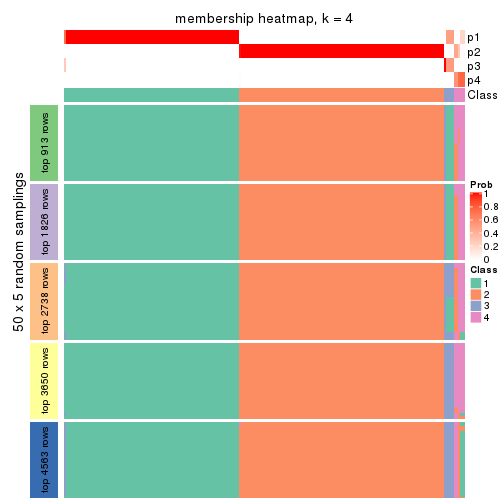</p>

</div>
<div id='tab-ATC-hclust-membership-heatmap-4'>
<pre><code class="r">membership_heatmap(res, k = 5)
</code></pre>

<p></p>

</div>
<div id='tab-ATC-hclust-membership-heatmap-5'>
<pre><code class="r">membership_heatmap(res, k = 6)
</code></pre>

<p></p>

</div>
</div>

As soon as we have had the classes for columns, we can look for signatures
which are significantly different between classes which can be candidate marks
for certain classes. Following are the heatmaps for signatures.


Signature heatmaps where rows are scaled:


<script>
$( function() {
	$( '#tabs-ATC-hclust-get-signatures' ).tabs();
} );
</script>
<div id='tabs-ATC-hclust-get-signatures'>
<ul>
<li><a href='#tab-ATC-hclust-get-signatures-1'>k = 2</a></li>
<li><a href='#tab-ATC-hclust-get-signatures-2'>k = 3</a></li>
<li><a href='#tab-ATC-hclust-get-signatures-3'>k = 4</a></li>
<li><a href='#tab-ATC-hclust-get-signatures-4'>k = 5</a></li>
<li><a href='#tab-ATC-hclust-get-signatures-5'>k = 6</a></li>
</ul>
<div id='tab-ATC-hclust-get-signatures-1'>
<pre><code class="r">get_signatures(res, k = 2)
</code></pre>

<p></p>

</div>
<div id='tab-ATC-hclust-get-signatures-2'>
<pre><code class="r">get_signatures(res, k = 3)
</code></pre>

<p></p>

</div>
<div id='tab-ATC-hclust-get-signatures-3'>
<pre><code class="r">get_signatures(res, k = 4)
</code></pre>

<p></p>

</div>
<div id='tab-ATC-hclust-get-signatures-4'>
<pre><code class="r">get_signatures(res, k = 5)
</code></pre>

<p></p>

</div>
<div id='tab-ATC-hclust-get-signatures-5'>
<pre><code class="r">get_signatures(res, k = 6)
</code></pre>

<p></p>

</div>
</div>


Signature heatmaps where rows are not scaled:


<script>
$( function() {
	$( '#tabs-ATC-hclust-get-signatures-no-scale' ).tabs();
} );
</script>
<div id='tabs-ATC-hclust-get-signatures-no-scale'>
<ul>
<li><a href='#tab-ATC-hclust-get-signatures-no-scale-1'>k = 2</a></li>
<li><a href='#tab-ATC-hclust-get-signatures-no-scale-2'>k = 3</a></li>
<li><a href='#tab-ATC-hclust-get-signatures-no-scale-3'>k = 4</a></li>
<li><a href='#tab-ATC-hclust-get-signatures-no-scale-4'>k = 5</a></li>
<li><a href='#tab-ATC-hclust-get-signatures-no-scale-5'>k = 6</a></li>
</ul>
<div id='tab-ATC-hclust-get-signatures-no-scale-1'>
<pre><code class="r">get_signatures(res, k = 2, scale_rows = FALSE)
</code></pre>

<p></p>

</div>
<div id='tab-ATC-hclust-get-signatures-no-scale-2'>
<pre><code class="r">get_signatures(res, k = 3, scale_rows = FALSE)
</code></pre>

<p></p>

</div>
<div id='tab-ATC-hclust-get-signatures-no-scale-3'>
<pre><code class="r">get_signatures(res, k = 4, scale_rows = FALSE)
</code></pre>

<p></p>

</div>
<div id='tab-ATC-hclust-get-signatures-no-scale-4'>
<pre><code class="r">get_signatures(res, k = 5, scale_rows = FALSE)
</code></pre>

<p></p>

</div>
<div id='tab-ATC-hclust-get-signatures-no-scale-5'>
<pre><code class="r">get_signatures(res, k = 6, scale_rows = FALSE)
</code></pre>

<p></p>

</div>
</div>


Compare the overlap of signatures from different k:

```r
compare_signatures(res)
```


`get_signature()` returns a data frame invisibly. TO get the list of signatures, the function
call should be assigned to a variable explicitly. In following code, if `plot` argument is set
to `FALSE`, no heatmap is plotted while only the differential analysis is performed.

```r
# code only for demonstration
tb = get_signature(res, k = ..., plot = FALSE)
```

An example of the output of `tb` is:

```
#>   which_row         fdr    mean_1    mean_2 scaled_mean_1 scaled_mean_2 km
#> 1        38 0.042760348  8.373488  9.131774    -0.5533452     0.5164555  1
#> 2        40 0.018707592  7.106213  8.469186    -0.6173731     0.5762149  1
#> 3        55 0.019134737 10.221463 11.207825    -0.6159697     0.5749050  1
#> 4        59 0.006059896  5.921854  7.869574    -0.6899429     0.6439467  1
#> 5        60 0.018055526  8.928898 10.211722    -0.6204761     0.5791110  1
#> 6        98 0.009384629 15.714769 14.887706     0.6635654    -0.6193277  2
...
```

The columns in `tb` are:

1. `which_row`: row indices corresponding to the input matrix.
2. `fdr`: FDR for the differential test. 
3. `mean_x`: The mean value in group x.
4. `scaled_mean_x`: The mean value in group x after rows are scaled.
5. `km`: Row groups if k-means clustering is applied to rows.


UMAP plot which shows how samples are separated.


<script>
$( function() {
	$( '#tabs-ATC-hclust-dimension-reduction' ).tabs();
} );
</script>
<div id='tabs-ATC-hclust-dimension-reduction'>
<ul>
<li><a href='#tab-ATC-hclust-dimension-reduction-1'>k = 2</a></li>
<li><a href='#tab-ATC-hclust-dimension-reduction-2'>k = 3</a></li>
<li><a href='#tab-ATC-hclust-dimension-reduction-3'>k = 4</a></li>
<li><a href='#tab-ATC-hclust-dimension-reduction-4'>k = 5</a></li>
<li><a href='#tab-ATC-hclust-dimension-reduction-5'>k = 6</a></li>
</ul>
<div id='tab-ATC-hclust-dimension-reduction-1'>
<pre><code class="r">dimension_reduction(res, k = 2, method = &quot;UMAP&quot;)
</code></pre>

<p></p>

</div>
<div id='tab-ATC-hclust-dimension-reduction-2'>
<pre><code class="r">dimension_reduction(res, k = 3, method = &quot;UMAP&quot;)
</code></pre>

<p></p>

</div>
<div id='tab-ATC-hclust-dimension-reduction-3'>
<pre><code class="r">dimension_reduction(res, k = 4, method = &quot;UMAP&quot;)
</code></pre>

<p></p>

</div>
<div id='tab-ATC-hclust-dimension-reduction-4'>
<pre><code class="r">dimension_reduction(res, k = 5, method = &quot;UMAP&quot;)
</code></pre>

<p></p>

</div>
<div id='tab-ATC-hclust-dimension-reduction-5'>
<pre><code class="r">dimension_reduction(res, k = 6, method = &quot;UMAP&quot;)
</code></pre>

<p></p>

</div>
</div>


Following heatmap shows how subgroups are split when increasing `k`:

```r
collect_classes(res)
```


If matrix rows can be associated to genes, consider to use `functional_enrichment(res,
...)` to perform function enrichment for the signature genes. See [this vignette](http://bioconductor.org/packages/devel/bioc/vignettes/cola/inst/doc/functional_enrichment.html) for more detailed explanations.


 

---------------------------------------------------


### ATC:kmeans**


The object with results only for a single top-value method and a single partition method 
can be extracted as:

```r
res = res_list["ATC", "kmeans"]
# you can also extract it by
# res = res_list["ATC:kmeans"]
```

A summary of `res` and all the functions that can be applied to it:

```r
res
```

```
#> A 'ConsensusPartition' object with k = 2, 3, 4, 5, 6.
#>   On a matrix with 9126 rows and 192 columns.
#>   Top rows (913, 1826, 2738, 3650, 4563) are extracted by 'ATC' method.
#>   Subgroups are detected by 'kmeans' method.
#>   Performed in total 1250 partitions by row resampling.
#>   Best k for subgroups seems to be 2.
#> 
#> Following methods can be applied to this 'ConsensusPartition' object:
#>  [1] "cola_report"             "collect_classes"         "collect_plots"          
#>  [4] "collect_stats"           "colnames"                "compare_signatures"     
#>  [7] "consensus_heatmap"       "dimension_reduction"     "functional_enrichment"  
#> [10] "get_anno_col"            "get_anno"                "get_classes"            
#> [13] "get_consensus"           "get_matrix"              "get_membership"         
#> [16] "get_param"               "get_signatures"          "get_stats"              
#> [19] "is_best_k"               "is_stable_k"             "membership_heatmap"     
#> [22] "ncol"                    "nrow"                    "plot_ecdf"              
#> [25] "rownames"                "select_partition_number" "show"                   
#> [28] "suggest_best_k"          "test_to_known_factors"
```

`collect_plots()` function collects all the plots made from `res` for all `k` (number of partitions)
into one single page to provide an easy and fast comparison between different `k`.

```r
collect_plots(res)
```


The plots are:

- The first row: a plot of the ECDF (empirical cumulative distribution
  function) curves of the consensus matrix for each `k` and the heatmap of
  predicted classes for each `k`.
- The second row: heatmaps of the consensus matrix for each `k`.
- The third row: heatmaps of the membership matrix for each `k`.
- The fouth row: heatmaps of the signatures for each `k`.

All the plots in panels can be made by individual functions and they are
plotted later in this section.

`select_partition_number()` produces several plots showing different
statistics for choosing "optimized" `k`. There are following statistics:

- ECDF curves of the consensus matrix for each `k`;
- 1-PAC. [The PAC
  score](https://en.wikipedia.org/wiki/Consensus_clustering#Over-interpretation_potential_of_consensus_clustering)
  measures the proportion of the ambiguous subgrouping.
- Mean silhouette score.
- Concordance. The mean probability of fiting the consensus class ids in all
  partitions.
- Area increased. Denote $A_k$ as the area under the ECDF curve for current
  `k`, the area increased is defined as $A_k - A_{k-1}$.
- Rand index. The percent of pairs of samples that are both in a same cluster
  or both are not in a same cluster in the partition of k and k-1.
- Jaccard index. The ratio of pairs of samples are both in a same cluster in
  the partition of k and k-1 and the pairs of samples are both in a same
  cluster in the partition k or k-1.

The detailed explanations of these statistics can be found in [the _cola_
vignette](http://bioconductor.org/packages/devel/bioc/vignettes/cola/inst/doc/cola.html#toc_13).

Generally speaking, lower PAC score, higher mean silhouette score or higher
concordance corresponds to better partition. Rand index and Jaccard index
measure how similar the current partition is compared to partition with `k-1`.
If they are too similar, we won't accept `k` is better than `k-1`.

```r
select_partition_number(res)
```


The numeric values for all these statistics can be obtained by `get_stats()`.

```r
get_stats(res)
```

```
#>   k 1-PAC mean_silhouette concordance area_increased  Rand Jaccard
#> 2 2 1.000           1.000       1.000         0.5012 0.499   0.499
#> 3 3 0.844           0.878       0.911         0.1311 0.967   0.933
#> 4 4 0.764           0.913       0.857         0.1234 0.863   0.709
#> 5 5 0.752           0.809       0.843         0.0864 0.989   0.967
#> 6 6 0.726           0.898       0.857         0.0611 0.894   0.678
```

`suggest_best_k()` suggests the best $k$ based on these statistics. The rules are as follows:

- All $k$ with Jaccard index larger than 0.95 are removed because increasing
  $k$ does not provide enough extra information. If all $k$ are removed, it is
  marked as no subgroup is detected.
- For all $k$ with 1-PAC score larger than 0.9, the maximal $k$ is taken as
  the best $k$, and other $k$ are marked as optional $k$.
- If it does not fit the second rule. The $k$ with the maximal vote of the
  highest 1-PAC score, highest mean silhouette, and highest concordance is
  taken as the best $k$.

```r
suggest_best_k(res)
```

```
#> [1] 2
```


Following shows the table of the partitions (You need to click the **show/hide
code output** link to see it). The membership matrix (columns with name `p*`)
is inferred by
[`clue::cl_consensus()`](https://www.rdocumentation.org/link/cl_consensus?package=clue)
function with the `SE` method. Basically the value in the membership matrix
represents the probability to belong to a certain group. The finall class
label for an item is determined with the group with highest probability it
belongs to.

In `get_classes()` function, the entropy is calculated from the membership
matrix and the silhouette score is calculated from the consensus matrix.


<script>
$( function() {
	$( '#tabs-ATC-kmeans-get-classes' ).tabs();
} );
</script>
<div id='tabs-ATC-kmeans-get-classes'>
<ul>
<li><a href='#tab-ATC-kmeans-get-classes-1'>k = 2</a></li>
<li><a href='#tab-ATC-kmeans-get-classes-2'>k = 3</a></li>
<li><a href='#tab-ATC-kmeans-get-classes-3'>k = 4</a></li>
<li><a href='#tab-ATC-kmeans-get-classes-4'>k = 5</a></li>
<li><a href='#tab-ATC-kmeans-get-classes-5'>k = 6</a></li>
</ul>

<div id='tab-ATC-kmeans-get-classes-1'>
<p><a id='tab-ATC-kmeans-get-classes-1-a' style='color:#0366d6' href='#'>show/hide code output</a></p>
<pre><code class="r">cbind(get_classes(res, k = 2), get_membership(res, k = 2))
</code></pre>

<pre><code>#&gt;            class entropy silhouette   p1   p2
#&gt; SRR2074921     1   0.000       1.00 1.00 0.00
#&gt; SRR2074919     1   0.000       1.00 1.00 0.00
#&gt; SRR2074920     1   0.000       1.00 1.00 0.00
#&gt; SRR2074917     1   0.000       1.00 1.00 0.00
#&gt; SRR2074918     2   0.000       1.00 0.00 1.00
#&gt; SRR2074916     2   0.000       1.00 0.00 1.00
#&gt; SRR2074915     2   0.000       1.00 0.00 1.00
#&gt; SRR2074914     1   0.000       1.00 1.00 0.00
#&gt; SRR2074913     2   0.000       1.00 0.00 1.00
#&gt; SRR2074912     1   0.000       1.00 1.00 0.00
#&gt; SRR2074911     2   0.000       1.00 0.00 1.00
#&gt; SRR2074910     2   0.000       1.00 0.00 1.00
#&gt; SRR2074909     1   0.000       1.00 1.00 0.00
#&gt; SRR2074907     1   0.000       1.00 1.00 0.00
#&gt; SRR2074908     2   0.000       1.00 0.00 1.00
#&gt; SRR2074906     2   0.000       1.00 0.00 1.00
#&gt; SRR2074905     1   0.000       1.00 1.00 0.00
#&gt; SRR2074904     2   0.000       1.00 0.00 1.00
#&gt; SRR2074903     2   0.000       1.00 0.00 1.00
#&gt; SRR2074902     1   0.000       1.00 1.00 0.00
#&gt; SRR2074901     2   0.000       1.00 0.00 1.00
#&gt; SRR2074900     1   0.000       1.00 1.00 0.00
#&gt; SRR2074899     2   0.000       1.00 0.00 1.00
#&gt; SRR2074898     2   0.000       1.00 0.00 1.00
#&gt; SRR2074897     2   0.000       1.00 0.00 1.00
#&gt; SRR2074896     2   0.000       1.00 0.00 1.00
#&gt; SRR2074895     1   0.000       1.00 1.00 0.00
#&gt; SRR2074894     2   0.141       0.98 0.02 0.98
#&gt; SRR2074893     2   0.000       1.00 0.00 1.00
#&gt; SRR2074892     1   0.000       1.00 1.00 0.00
#&gt; SRR2074891     1   0.000       1.00 1.00 0.00
#&gt; SRR2074890     2   0.000       1.00 0.00 1.00
#&gt; SRR2074887     2   0.000       1.00 0.00 1.00
#&gt; SRR2074889     2   0.000       1.00 0.00 1.00
#&gt; SRR2074886     2   0.000       1.00 0.00 1.00
#&gt; SRR2074888     2   0.000       1.00 0.00 1.00
#&gt; SRR2074885     1   0.000       1.00 1.00 0.00
#&gt; SRR2074884     2   0.000       1.00 0.00 1.00
#&gt; SRR2074883     2   0.000       1.00 0.00 1.00
#&gt; SRR2074882     1   0.000       1.00 1.00 0.00
#&gt; SRR2074880     2   0.000       1.00 0.00 1.00
#&gt; SRR2074881     2   0.000       1.00 0.00 1.00
#&gt; SRR2074879     1   0.000       1.00 1.00 0.00
#&gt; SRR2074878     1   0.000       1.00 1.00 0.00
#&gt; SRR2074877     2   0.000       1.00 0.00 1.00
#&gt; SRR2074876     1   0.000       1.00 1.00 0.00
#&gt; SRR2074875     2   0.000       1.00 0.00 1.00
#&gt; SRR2074874     1   0.000       1.00 1.00 0.00
#&gt; SRR2074873     2   0.000       1.00 0.00 1.00
#&gt; SRR2074872     1   0.000       1.00 1.00 0.00
#&gt; SRR2074871     2   0.000       1.00 0.00 1.00
#&gt; SRR2074870     1   0.000       1.00 1.00 0.00
#&gt; SRR2074869     1   0.000       1.00 1.00 0.00
#&gt; SRR2074868     1   0.000       1.00 1.00 0.00
#&gt; SRR2074867     2   0.000       1.00 0.00 1.00
#&gt; SRR2074866     2   0.000       1.00 0.00 1.00
#&gt; SRR2074865     1   0.000       1.00 1.00 0.00
#&gt; SRR2074864     1   0.000       1.00 1.00 0.00
#&gt; SRR2074863     1   0.000       1.00 1.00 0.00
#&gt; SRR2074862     1   0.000       1.00 1.00 0.00
#&gt; SRR2074861     1   0.000       1.00 1.00 0.00
#&gt; SRR2074860     1   0.000       1.00 1.00 0.00
#&gt; SRR2074859     1   0.000       1.00 1.00 0.00
#&gt; SRR2074858     2   0.000       1.00 0.00 1.00
#&gt; SRR2074855     2   0.000       1.00 0.00 1.00
#&gt; SRR2074857     1   0.000       1.00 1.00 0.00
#&gt; SRR2074856     1   0.000       1.00 1.00 0.00
#&gt; SRR2074854     1   0.000       1.00 1.00 0.00
#&gt; SRR2074853     1   0.000       1.00 1.00 0.00
#&gt; SRR2074852     2   0.000       1.00 0.00 1.00
#&gt; SRR2074851     1   0.000       1.00 1.00 0.00
#&gt; SRR2074850     1   0.000       1.00 1.00 0.00
#&gt; SRR2074849     1   0.000       1.00 1.00 0.00
#&gt; SRR2074848     1   0.000       1.00 1.00 0.00
#&gt; SRR2074847     1   0.000       1.00 1.00 0.00
#&gt; SRR2074846     1   0.000       1.00 1.00 0.00
#&gt; SRR2074845     1   0.000       1.00 1.00 0.00
#&gt; SRR2074843     1   0.000       1.00 1.00 0.00
#&gt; SRR2074842     2   0.000       1.00 0.00 1.00
#&gt; SRR2074844     2   0.000       1.00 0.00 1.00
#&gt; SRR2074841     2   0.000       1.00 0.00 1.00
#&gt; SRR2074840     2   0.000       1.00 0.00 1.00
#&gt; SRR2074839     1   0.000       1.00 1.00 0.00
#&gt; SRR2074838     2   0.000       1.00 0.00 1.00
#&gt; SRR2074836     2   0.000       1.00 0.00 1.00
#&gt; SRR2074835     2   0.000       1.00 0.00 1.00
#&gt; SRR2074837     1   0.000       1.00 1.00 0.00
#&gt; SRR2074834     2   0.000       1.00 0.00 1.00
#&gt; SRR2074833     1   0.000       1.00 1.00 0.00
#&gt; SRR2074832     2   0.000       1.00 0.00 1.00
#&gt; SRR2074831     1   0.000       1.00 1.00 0.00
#&gt; SRR2074829     1   0.000       1.00 1.00 0.00
#&gt; SRR2074830     1   0.000       1.00 1.00 0.00
#&gt; SRR2074828     1   0.000       1.00 1.00 0.00
#&gt; SRR2074827     2   0.000       1.00 0.00 1.00
#&gt; SRR2074826     2   0.000       1.00 0.00 1.00
#&gt; SRR2074825     2   0.000       1.00 0.00 1.00
#&gt; SRR2074824     2   0.000       1.00 0.00 1.00
#&gt; SRR2074823     1   0.000       1.00 1.00 0.00
#&gt; SRR2074822     2   0.000       1.00 0.00 1.00
#&gt; SRR2074821     2   0.000       1.00 0.00 1.00
#&gt; SRR2074820     2   0.000       1.00 0.00 1.00
#&gt; SRR2074819     2   0.000       1.00 0.00 1.00
#&gt; SRR2074817     2   0.000       1.00 0.00 1.00
#&gt; SRR2074818     2   0.000       1.00 0.00 1.00
#&gt; SRR2074816     1   0.000       1.00 1.00 0.00
#&gt; SRR2074815     2   0.000       1.00 0.00 1.00
#&gt; SRR2074814     1   0.000       1.00 1.00 0.00
#&gt; SRR2074812     2   0.000       1.00 0.00 1.00
#&gt; SRR2074813     2   0.000       1.00 0.00 1.00
#&gt; SRR2074809     2   0.000       1.00 0.00 1.00
#&gt; SRR2074810     2   0.000       1.00 0.00 1.00
#&gt; SRR2074811     2   0.000       1.00 0.00 1.00
#&gt; SRR2074808     2   0.000       1.00 0.00 1.00
#&gt; SRR2074807     2   0.000       1.00 0.00 1.00
#&gt; SRR2074806     1   0.000       1.00 1.00 0.00
#&gt; SRR2074805     2   0.000       1.00 0.00 1.00
#&gt; SRR2074804     1   0.000       1.00 1.00 0.00
#&gt; SRR2074803     1   0.000       1.00 1.00 0.00
#&gt; SRR2074801     1   0.000       1.00 1.00 0.00
#&gt; SRR2074802     2   0.000       1.00 0.00 1.00
#&gt; SRR2074799     2   0.000       1.00 0.00 1.00
#&gt; SRR2074800     1   0.000       1.00 1.00 0.00
#&gt; SRR2074798     1   0.000       1.00 1.00 0.00
#&gt; SRR2074797     1   0.000       1.00 1.00 0.00
#&gt; SRR2074795     2   0.000       1.00 0.00 1.00
#&gt; SRR2074796     2   0.000       1.00 0.00 1.00
#&gt; SRR2074794     2   0.000       1.00 0.00 1.00
#&gt; SRR2074793     2   0.000       1.00 0.00 1.00
#&gt; SRR2074792     1   0.000       1.00 1.00 0.00
#&gt; SRR2074791     1   0.000       1.00 1.00 0.00
#&gt; SRR2074790     2   0.000       1.00 0.00 1.00
#&gt; SRR2074789     1   0.000       1.00 1.00 0.00
#&gt; SRR2074788     1   0.000       1.00 1.00 0.00
#&gt; SRR2074787     1   0.000       1.00 1.00 0.00
#&gt; SRR2074786     2   0.000       1.00 0.00 1.00
#&gt; SRR2074785     1   0.000       1.00 1.00 0.00
#&gt; SRR2074784     1   0.000       1.00 1.00 0.00
#&gt; SRR2074783     2   0.000       1.00 0.00 1.00
#&gt; SRR2074782     1   0.000       1.00 1.00 0.00
#&gt; SRR2074779     2   0.000       1.00 0.00 1.00
#&gt; SRR2074781     2   0.000       1.00 0.00 1.00
#&gt; SRR2074780     1   0.000       1.00 1.00 0.00
#&gt; SRR2074778     2   0.000       1.00 0.00 1.00
#&gt; SRR2074777     2   0.000       1.00 0.00 1.00
#&gt; SRR2074776     2   0.000       1.00 0.00 1.00
#&gt; SRR2074775     1   0.000       1.00 1.00 0.00
#&gt; SRR2074774     1   0.000       1.00 1.00 0.00
#&gt; SRR2074773     2   0.000       1.00 0.00 1.00
#&gt; SRR2074771     2   0.000       1.00 0.00 1.00
#&gt; SRR2074772     1   0.000       1.00 1.00 0.00
#&gt; SRR2074770     1   0.000       1.00 1.00 0.00
#&gt; SRR2074769     2   0.000       1.00 0.00 1.00
#&gt; SRR2074768     2   0.000       1.00 0.00 1.00
#&gt; SRR2074766     2   0.000       1.00 0.00 1.00
#&gt; SRR2074767     1   0.000       1.00 1.00 0.00
#&gt; SRR2074765     1   0.000       1.00 1.00 0.00
#&gt; SRR2074764     2   0.000       1.00 0.00 1.00
#&gt; SRR2074763     2   0.000       1.00 0.00 1.00
#&gt; SRR2074761     1   0.000       1.00 1.00 0.00
#&gt; SRR2074762     2   0.000       1.00 0.00 1.00
#&gt; SRR2074760     2   0.000       1.00 0.00 1.00
#&gt; SRR2074759     1   0.000       1.00 1.00 0.00
#&gt; SRR2074757     2   0.000       1.00 0.00 1.00
#&gt; SRR2074758     2   0.000       1.00 0.00 1.00
#&gt; SRR2074756     2   0.000       1.00 0.00 1.00
#&gt; SRR2074755     1   0.000       1.00 1.00 0.00
#&gt; SRR2074754     1   0.000       1.00 1.00 0.00
#&gt; SRR2074753     2   0.000       1.00 0.00 1.00
#&gt; SRR2074752     1   0.000       1.00 1.00 0.00
#&gt; SRR2074751     1   0.000       1.00 1.00 0.00
#&gt; SRR2074749     2   0.000       1.00 0.00 1.00
#&gt; SRR2074750     1   0.000       1.00 1.00 0.00
#&gt; SRR2074748     1   0.000       1.00 1.00 0.00
#&gt; SRR2074747     2   0.000       1.00 0.00 1.00
#&gt; SRR2074745     1   0.000       1.00 1.00 0.00
#&gt; SRR2074746     1   0.000       1.00 1.00 0.00
#&gt; SRR2074744     2   0.000       1.00 0.00 1.00
#&gt; SRR2074743     2   0.000       1.00 0.00 1.00
#&gt; SRR2074742     2   0.000       1.00 0.00 1.00
#&gt; SRR2074741     1   0.000       1.00 1.00 0.00
#&gt; SRR2074740     2   0.000       1.00 0.00 1.00
#&gt; SRR2074739     1   0.000       1.00 1.00 0.00
#&gt; SRR2074738     2   0.000       1.00 0.00 1.00
#&gt; SRR2074737     2   0.000       1.00 0.00 1.00
#&gt; SRR2074736     2   0.000       1.00 0.00 1.00
#&gt; SRR2074735     1   0.000       1.00 1.00 0.00
#&gt; SRR2074734     2   0.000       1.00 0.00 1.00
#&gt; SRR2074733     1   0.000       1.00 1.00 0.00
#&gt; SRR2074732     2   0.000       1.00 0.00 1.00
#&gt; SRR2074731     2   0.000       1.00 0.00 1.00
#&gt; SRR2074730     1   0.000       1.00 1.00 0.00
</code></pre>

<script>
$('#tab-ATC-kmeans-get-classes-1-a').parent().next().next().hide();
$('#tab-ATC-kmeans-get-classes-1-a').click(function(){
  $('#tab-ATC-kmeans-get-classes-1-a').parent().next().next().toggle();
  return(false);
});
</script>
</div>

<div id='tab-ATC-kmeans-get-classes-2'>
<p><a id='tab-ATC-kmeans-get-classes-2-a' style='color:#0366d6' href='#'>show/hide code output</a></p>
<pre><code class="r">cbind(get_classes(res, k = 3), get_membership(res, k = 3))
</code></pre>

<pre><code>#&gt;            class entropy silhouette    p1    p2    p3
#&gt; SRR2074921     3  0.5882      0.739 0.348 0.000 0.652
#&gt; SRR2074919     3  0.6026      0.756 0.376 0.000 0.624
#&gt; SRR2074920     3  0.6026      0.756 0.376 0.000 0.624
#&gt; SRR2074917     3  0.6299      0.574 0.476 0.000 0.524
#&gt; SRR2074918     3  0.6008     -0.539 0.000 0.372 0.628
#&gt; SRR2074916     2  0.0000      0.750 0.000 1.000 0.000
#&gt; SRR2074915     2  0.5859      0.841 0.000 0.656 0.344
#&gt; SRR2074914     1  0.0000      0.997 1.000 0.000 0.000
#&gt; SRR2074913     2  0.5882      0.838 0.000 0.652 0.348
#&gt; SRR2074912     3  0.6045      0.754 0.380 0.000 0.620
#&gt; SRR2074911     2  0.5905      0.835 0.000 0.648 0.352
#&gt; SRR2074910     2  0.6026      0.817 0.000 0.624 0.376
#&gt; SRR2074909     1  0.0000      0.997 1.000 0.000 0.000
#&gt; SRR2074907     1  0.0237      0.996 0.996 0.000 0.004
#&gt; SRR2074908     2  0.5859      0.841 0.000 0.656 0.344
#&gt; SRR2074906     2  0.0000      0.750 0.000 1.000 0.000
#&gt; SRR2074905     1  0.0237      0.996 0.996 0.000 0.004
#&gt; SRR2074904     2  0.5859      0.841 0.000 0.656 0.344
#&gt; SRR2074903     2  0.5859      0.841 0.000 0.656 0.344
#&gt; SRR2074902     1  0.0000      0.997 1.000 0.000 0.000
#&gt; SRR2074901     2  0.5859      0.841 0.000 0.656 0.344
#&gt; SRR2074900     1  0.0237      0.996 0.996 0.000 0.004
#&gt; SRR2074899     2  0.5859      0.841 0.000 0.656 0.344
#&gt; SRR2074898     2  0.0000      0.750 0.000 1.000 0.000
#&gt; SRR2074897     2  0.0000      0.750 0.000 1.000 0.000
#&gt; SRR2074896     2  0.5859      0.841 0.000 0.656 0.344
#&gt; SRR2074895     1  0.0000      0.997 1.000 0.000 0.000
#&gt; SRR2074894     2  0.7567      0.760 0.048 0.576 0.376
#&gt; SRR2074893     2  0.5859      0.841 0.000 0.656 0.344
#&gt; SRR2074892     1  0.0000      0.997 1.000 0.000 0.000
#&gt; SRR2074891     1  0.0000      0.997 1.000 0.000 0.000
#&gt; SRR2074890     2  0.5859      0.841 0.000 0.656 0.344
#&gt; SRR2074887     2  0.5859      0.841 0.000 0.656 0.344
#&gt; SRR2074889     2  0.0000      0.750 0.000 1.000 0.000
#&gt; SRR2074886     2  0.5859      0.841 0.000 0.656 0.344
#&gt; SRR2074888     2  0.0000      0.750 0.000 1.000 0.000
#&gt; SRR2074885     1  0.0000      0.997 1.000 0.000 0.000
#&gt; SRR2074884     2  0.0000      0.750 0.000 1.000 0.000
#&gt; SRR2074883     2  0.0000      0.750 0.000 1.000 0.000
#&gt; SRR2074882     1  0.0237      0.996 0.996 0.000 0.004
#&gt; SRR2074880     2  0.0000      0.750 0.000 1.000 0.000
#&gt; SRR2074881     2  0.5859      0.841 0.000 0.656 0.344
#&gt; SRR2074879     3  0.6045      0.754 0.380 0.000 0.620
#&gt; SRR2074878     1  0.0237      0.996 0.996 0.000 0.004
#&gt; SRR2074877     2  0.5859      0.841 0.000 0.656 0.344
#&gt; SRR2074876     1  0.0000      0.997 1.000 0.000 0.000
#&gt; SRR2074875     2  0.0000      0.750 0.000 1.000 0.000
#&gt; SRR2074874     1  0.0237      0.996 0.996 0.000 0.004
#&gt; SRR2074873     2  0.0000      0.750 0.000 1.000 0.000
#&gt; SRR2074872     1  0.0237      0.996 0.996 0.000 0.004
#&gt; SRR2074871     2  0.5859      0.841 0.000 0.656 0.344
#&gt; SRR2074870     1  0.0000      0.997 1.000 0.000 0.000
#&gt; SRR2074869     1  0.0000      0.997 1.000 0.000 0.000
#&gt; SRR2074868     1  0.0237      0.996 0.996 0.000 0.004
#&gt; SRR2074867     2  0.5859      0.841 0.000 0.656 0.344
#&gt; SRR2074866     2  0.5859      0.841 0.000 0.656 0.344
#&gt; SRR2074865     1  0.0000      0.997 1.000 0.000 0.000
#&gt; SRR2074864     1  0.0000      0.997 1.000 0.000 0.000
#&gt; SRR2074863     1  0.0000      0.997 1.000 0.000 0.000
#&gt; SRR2074862     1  0.0237      0.996 0.996 0.000 0.004
#&gt; SRR2074861     1  0.0237      0.996 0.996 0.000 0.004
#&gt; SRR2074860     1  0.0000      0.997 1.000 0.000 0.000
#&gt; SRR2074859     1  0.0237      0.996 0.996 0.000 0.004
#&gt; SRR2074858     2  0.5859      0.841 0.000 0.656 0.344
#&gt; SRR2074855     2  0.0000      0.750 0.000 1.000 0.000
#&gt; SRR2074857     1  0.0237      0.996 0.996 0.000 0.004
#&gt; SRR2074856     1  0.0237      0.996 0.996 0.000 0.004
#&gt; SRR2074854     1  0.0237      0.996 0.996 0.000 0.004
#&gt; SRR2074853     1  0.0237      0.996 0.996 0.000 0.004
#&gt; SRR2074852     2  0.0000      0.750 0.000 1.000 0.000
#&gt; SRR2074851     1  0.0237      0.996 0.996 0.000 0.004
#&gt; SRR2074850     1  0.0000      0.997 1.000 0.000 0.000
#&gt; SRR2074849     1  0.0237      0.996 0.996 0.000 0.004
#&gt; SRR2074848     1  0.0237      0.996 0.996 0.000 0.004
#&gt; SRR2074847     1  0.0237      0.996 0.996 0.000 0.004
#&gt; SRR2074846     1  0.0000      0.997 1.000 0.000 0.000
#&gt; SRR2074845     1  0.0237      0.996 0.996 0.000 0.004
#&gt; SRR2074843     1  0.0000      0.997 1.000 0.000 0.000
#&gt; SRR2074842     2  0.5859      0.841 0.000 0.656 0.344
#&gt; SRR2074844     2  0.5859      0.841 0.000 0.656 0.344
#&gt; SRR2074841     2  0.0000      0.750 0.000 1.000 0.000
#&gt; SRR2074840     2  0.0000      0.750 0.000 1.000 0.000
#&gt; SRR2074839     1  0.0000      0.997 1.000 0.000 0.000
#&gt; SRR2074838     2  0.0000      0.750 0.000 1.000 0.000
#&gt; SRR2074836     2  0.5859      0.841 0.000 0.656 0.344
#&gt; SRR2074835     2  0.0000      0.750 0.000 1.000 0.000
#&gt; SRR2074837     1  0.0000      0.997 1.000 0.000 0.000
#&gt; SRR2074834     2  0.5859      0.841 0.000 0.656 0.344
#&gt; SRR2074833     1  0.0000      0.997 1.000 0.000 0.000
#&gt; SRR2074832     2  0.5859      0.841 0.000 0.656 0.344
#&gt; SRR2074831     1  0.0000      0.997 1.000 0.000 0.000
#&gt; SRR2074829     1  0.0237      0.996 0.996 0.000 0.004
#&gt; SRR2074830     1  0.0237      0.996 0.996 0.000 0.004
#&gt; SRR2074828     1  0.0000      0.997 1.000 0.000 0.000
#&gt; SRR2074827     2  0.5859      0.841 0.000 0.656 0.344
#&gt; SRR2074826     2  0.5859      0.841 0.000 0.656 0.344
#&gt; SRR2074825     2  0.0000      0.750 0.000 1.000 0.000
#&gt; SRR2074824     2  0.0000      0.750 0.000 1.000 0.000
#&gt; SRR2074823     1  0.0000      0.997 1.000 0.000 0.000
#&gt; SRR2074822     2  0.0000      0.750 0.000 1.000 0.000
#&gt; SRR2074821     2  0.5785      0.838 0.000 0.668 0.332
#&gt; SRR2074820     2  0.0000      0.750 0.000 1.000 0.000
#&gt; SRR2074819     2  0.5859      0.841 0.000 0.656 0.344
#&gt; SRR2074817     2  0.5859      0.841 0.000 0.656 0.344
#&gt; SRR2074818     2  0.0000      0.750 0.000 1.000 0.000
#&gt; SRR2074816     1  0.0000      0.997 1.000 0.000 0.000
#&gt; SRR2074815     2  0.5859      0.841 0.000 0.656 0.344
#&gt; SRR2074814     1  0.0237      0.996 0.996 0.000 0.004
#&gt; SRR2074812     2  0.0000      0.750 0.000 1.000 0.000
#&gt; SRR2074813     2  0.0000      0.750 0.000 1.000 0.000
#&gt; SRR2074809     2  0.0000      0.750 0.000 1.000 0.000
#&gt; SRR2074810     2  0.5859      0.841 0.000 0.656 0.344
#&gt; SRR2074811     2  0.0000      0.750 0.000 1.000 0.000
#&gt; SRR2074808     2  0.5859      0.841 0.000 0.656 0.344
#&gt; SRR2074807     2  0.5859      0.841 0.000 0.656 0.344
#&gt; SRR2074806     1  0.0000      0.997 1.000 0.000 0.000
#&gt; SRR2074805     2  0.0000      0.750 0.000 1.000 0.000
#&gt; SRR2074804     1  0.0000      0.997 1.000 0.000 0.000
#&gt; SRR2074803     1  0.0000      0.997 1.000 0.000 0.000
#&gt; SRR2074801     1  0.0000      0.997 1.000 0.000 0.000
#&gt; SRR2074802     2  0.5859      0.841 0.000 0.656 0.344
#&gt; SRR2074799     2  0.0000      0.750 0.000 1.000 0.000
#&gt; SRR2074800     1  0.0000      0.997 1.000 0.000 0.000
#&gt; SRR2074798     1  0.0000      0.997 1.000 0.000 0.000
#&gt; SRR2074797     1  0.0000      0.997 1.000 0.000 0.000
#&gt; SRR2074795     2  0.0000      0.750 0.000 1.000 0.000
#&gt; SRR2074796     2  0.5859      0.841 0.000 0.656 0.344
#&gt; SRR2074794     2  0.0000      0.750 0.000 1.000 0.000
#&gt; SRR2074793     2  0.5859      0.841 0.000 0.656 0.344
#&gt; SRR2074792     1  0.0000      0.997 1.000 0.000 0.000
#&gt; SRR2074791     1  0.0000      0.997 1.000 0.000 0.000
#&gt; SRR2074790     2  0.0000      0.750 0.000 1.000 0.000
#&gt; SRR2074789     1  0.0237      0.996 0.996 0.000 0.004
#&gt; SRR2074788     1  0.0237      0.996 0.996 0.000 0.004
#&gt; SRR2074787     1  0.0237      0.996 0.996 0.000 0.004
#&gt; SRR2074786     2  0.5859      0.841 0.000 0.656 0.344
#&gt; SRR2074785     1  0.0000      0.997 1.000 0.000 0.000
#&gt; SRR2074784     1  0.0000      0.997 1.000 0.000 0.000
#&gt; SRR2074783     2  0.0000      0.750 0.000 1.000 0.000
#&gt; SRR2074782     1  0.0237      0.996 0.996 0.000 0.004
#&gt; SRR2074779     2  0.5859      0.841 0.000 0.656 0.344
#&gt; SRR2074781     2  0.5859      0.841 0.000 0.656 0.344
#&gt; SRR2074780     1  0.0237      0.996 0.996 0.000 0.004
#&gt; SRR2074778     2  0.5859      0.841 0.000 0.656 0.344
#&gt; SRR2074777     2  0.5859      0.841 0.000 0.656 0.344
#&gt; SRR2074776     2  0.0000      0.750 0.000 1.000 0.000
#&gt; SRR2074775     1  0.0000      0.997 1.000 0.000 0.000
#&gt; SRR2074774     1  0.0000      0.997 1.000 0.000 0.000
#&gt; SRR2074773     2  0.5859      0.841 0.000 0.656 0.344
#&gt; SRR2074771     2  0.5859      0.841 0.000 0.656 0.344
#&gt; SRR2074772     1  0.0000      0.997 1.000 0.000 0.000
#&gt; SRR2074770     1  0.0000      0.997 1.000 0.000 0.000
#&gt; SRR2074769     2  0.0000      0.750 0.000 1.000 0.000
#&gt; SRR2074768     2  0.0000      0.750 0.000 1.000 0.000
#&gt; SRR2074766     2  0.5859      0.841 0.000 0.656 0.344
#&gt; SRR2074767     1  0.0000      0.997 1.000 0.000 0.000
#&gt; SRR2074765     1  0.0237      0.996 0.996 0.000 0.004
#&gt; SRR2074764     2  0.5859      0.841 0.000 0.656 0.344
#&gt; SRR2074763     2  0.0000      0.750 0.000 1.000 0.000
#&gt; SRR2074761     1  0.0237      0.996 0.996 0.000 0.004
#&gt; SRR2074762     2  0.5859      0.841 0.000 0.656 0.344
#&gt; SRR2074760     2  0.5859      0.841 0.000 0.656 0.344
#&gt; SRR2074759     1  0.0237      0.996 0.996 0.000 0.004
#&gt; SRR2074757     2  0.5859      0.841 0.000 0.656 0.344
#&gt; SRR2074758     2  0.0000      0.750 0.000 1.000 0.000
#&gt; SRR2074756     2  0.5859      0.841 0.000 0.656 0.344
#&gt; SRR2074755     1  0.0000      0.997 1.000 0.000 0.000
#&gt; SRR2074754     1  0.0000      0.997 1.000 0.000 0.000
#&gt; SRR2074753     2  0.5882      0.838 0.000 0.652 0.348
#&gt; SRR2074752     1  0.0237      0.996 0.996 0.000 0.004
#&gt; SRR2074751     1  0.0000      0.997 1.000 0.000 0.000
#&gt; SRR2074749     2  0.5859      0.841 0.000 0.656 0.344
#&gt; SRR2074750     1  0.0000      0.997 1.000 0.000 0.000
#&gt; SRR2074748     1  0.0000      0.997 1.000 0.000 0.000
#&gt; SRR2074747     2  0.5859      0.841 0.000 0.656 0.344
#&gt; SRR2074745     1  0.0237      0.996 0.996 0.000 0.004
#&gt; SRR2074746     1  0.1031      0.963 0.976 0.000 0.024
#&gt; SRR2074744     2  0.5859      0.841 0.000 0.656 0.344
#&gt; SRR2074743     2  0.5859      0.841 0.000 0.656 0.344
#&gt; SRR2074742     2  0.6045      0.813 0.000 0.620 0.380
#&gt; SRR2074741     1  0.0000      0.997 1.000 0.000 0.000
#&gt; SRR2074740     2  0.5859      0.841 0.000 0.656 0.344
#&gt; SRR2074739     1  0.0000      0.997 1.000 0.000 0.000
#&gt; SRR2074738     2  0.5859      0.841 0.000 0.656 0.344
#&gt; SRR2074737     2  0.0000      0.750 0.000 1.000 0.000
#&gt; SRR2074736     2  0.5859      0.841 0.000 0.656 0.344
#&gt; SRR2074735     1  0.0000      0.997 1.000 0.000 0.000
#&gt; SRR2074734     2  0.5810      0.839 0.000 0.664 0.336
#&gt; SRR2074733     1  0.0000      0.997 1.000 0.000 0.000
#&gt; SRR2074732     2  0.0000      0.750 0.000 1.000 0.000
#&gt; SRR2074731     2  0.0000      0.750 0.000 1.000 0.000
#&gt; SRR2074730     1  0.0237      0.996 0.996 0.000 0.004
</code></pre>

<script>
$('#tab-ATC-kmeans-get-classes-2-a').parent().next().next().hide();
$('#tab-ATC-kmeans-get-classes-2-a').click(function(){
  $('#tab-ATC-kmeans-get-classes-2-a').parent().next().next().toggle();
  return(false);
});
</script>
</div>

<div id='tab-ATC-kmeans-get-classes-3'>
<p><a id='tab-ATC-kmeans-get-classes-3-a' style='color:#0366d6' href='#'>show/hide code output</a></p>
<pre><code class="r">cbind(get_classes(res, k = 4), get_membership(res, k = 4))
</code></pre>

<pre><code>#&gt;            class entropy silhouette    p1    p2    p3    p4
#&gt; SRR2074921     3  0.0592      0.877 0.000 0.000 0.984 0.016
#&gt; SRR2074919     3  0.1389      0.926 0.048 0.000 0.952 0.000
#&gt; SRR2074920     3  0.1389      0.926 0.048 0.000 0.952 0.000
#&gt; SRR2074917     3  0.5548      0.707 0.200 0.000 0.716 0.084
#&gt; SRR2074918     2  0.6992      0.344 0.000 0.576 0.248 0.176
#&gt; SRR2074916     4  0.4877      1.000 0.000 0.408 0.000 0.592
#&gt; SRR2074915     2  0.2704      0.798 0.000 0.876 0.000 0.124
#&gt; SRR2074914     1  0.0188      0.879 0.996 0.000 0.000 0.004
#&gt; SRR2074913     2  0.3172      0.752 0.000 0.840 0.000 0.160
#&gt; SRR2074912     3  0.2335      0.926 0.060 0.000 0.920 0.020
#&gt; SRR2074911     2  0.2814      0.789 0.000 0.868 0.000 0.132
#&gt; SRR2074910     2  0.3681      0.723 0.000 0.816 0.008 0.176
#&gt; SRR2074909     1  0.0469      0.875 0.988 0.000 0.000 0.012
#&gt; SRR2074907     1  0.3610      0.867 0.800 0.000 0.000 0.200
#&gt; SRR2074908     2  0.0188      0.951 0.000 0.996 0.000 0.004
#&gt; SRR2074906     4  0.4877      1.000 0.000 0.408 0.000 0.592
#&gt; SRR2074905     1  0.3764      0.864 0.784 0.000 0.000 0.216
#&gt; SRR2074904     2  0.0000      0.955 0.000 1.000 0.000 0.000
#&gt; SRR2074903     2  0.0000      0.955 0.000 1.000 0.000 0.000
#&gt; SRR2074902     1  0.3486      0.869 0.812 0.000 0.000 0.188
#&gt; SRR2074901     2  0.0000      0.955 0.000 1.000 0.000 0.000
#&gt; SRR2074900     1  0.3764      0.864 0.784 0.000 0.000 0.216
#&gt; SRR2074899     2  0.0000      0.955 0.000 1.000 0.000 0.000
#&gt; SRR2074898     4  0.4877      1.000 0.000 0.408 0.000 0.592
#&gt; SRR2074897     4  0.4877      1.000 0.000 0.408 0.000 0.592
#&gt; SRR2074896     2  0.0000      0.955 0.000 1.000 0.000 0.000
#&gt; SRR2074895     1  0.0188      0.879 0.996 0.000 0.000 0.004
#&gt; SRR2074894     2  0.6484      0.562 0.072 0.696 0.048 0.184
#&gt; SRR2074893     2  0.0000      0.955 0.000 1.000 0.000 0.000
#&gt; SRR2074892     1  0.0469      0.877 0.988 0.000 0.000 0.012
#&gt; SRR2074891     1  0.0188      0.879 0.996 0.000 0.000 0.004
#&gt; SRR2074890     2  0.0000      0.955 0.000 1.000 0.000 0.000
#&gt; SRR2074887     2  0.0000      0.955 0.000 1.000 0.000 0.000
#&gt; SRR2074889     4  0.4877      1.000 0.000 0.408 0.000 0.592
#&gt; SRR2074886     2  0.0000      0.955 0.000 1.000 0.000 0.000
#&gt; SRR2074888     4  0.4877      1.000 0.000 0.408 0.000 0.592
#&gt; SRR2074885     1  0.3074      0.873 0.848 0.000 0.000 0.152
#&gt; SRR2074884     4  0.4877      1.000 0.000 0.408 0.000 0.592
#&gt; SRR2074883     4  0.4877      1.000 0.000 0.408 0.000 0.592
#&gt; SRR2074882     1  0.3801      0.862 0.780 0.000 0.000 0.220
#&gt; SRR2074880     4  0.4877      1.000 0.000 0.408 0.000 0.592
#&gt; SRR2074881     2  0.0000      0.955 0.000 1.000 0.000 0.000
#&gt; SRR2074879     3  0.2335      0.926 0.060 0.000 0.920 0.020
#&gt; SRR2074878     1  0.3764      0.864 0.784 0.000 0.000 0.216
#&gt; SRR2074877     2  0.0000      0.955 0.000 1.000 0.000 0.000
#&gt; SRR2074876     1  0.1118      0.881 0.964 0.000 0.000 0.036
#&gt; SRR2074875     4  0.4877      1.000 0.000 0.408 0.000 0.592
#&gt; SRR2074874     1  0.3801      0.862 0.780 0.000 0.000 0.220
#&gt; SRR2074873     4  0.4877      1.000 0.000 0.408 0.000 0.592
#&gt; SRR2074872     1  0.3801      0.862 0.780 0.000 0.000 0.220
#&gt; SRR2074871     2  0.0000      0.955 0.000 1.000 0.000 0.000
#&gt; SRR2074870     1  0.0188      0.879 0.996 0.000 0.000 0.004
#&gt; SRR2074869     1  0.3688      0.865 0.792 0.000 0.000 0.208
#&gt; SRR2074868     1  0.3801      0.862 0.780 0.000 0.000 0.220
#&gt; SRR2074867     2  0.0000      0.955 0.000 1.000 0.000 0.000
#&gt; SRR2074866     2  0.0000      0.955 0.000 1.000 0.000 0.000
#&gt; SRR2074865     1  0.0188      0.879 0.996 0.000 0.000 0.004
#&gt; SRR2074864     1  0.0188      0.879 0.996 0.000 0.000 0.004
#&gt; SRR2074863     1  0.0188      0.879 0.996 0.000 0.000 0.004
#&gt; SRR2074862     1  0.3726      0.865 0.788 0.000 0.000 0.212
#&gt; SRR2074861     1  0.3801      0.862 0.780 0.000 0.000 0.220
#&gt; SRR2074860     1  0.3486      0.870 0.812 0.000 0.000 0.188
#&gt; SRR2074859     1  0.3801      0.862 0.780 0.000 0.000 0.220
#&gt; SRR2074858     2  0.0000      0.955 0.000 1.000 0.000 0.000
#&gt; SRR2074855     4  0.4877      1.000 0.000 0.408 0.000 0.592
#&gt; SRR2074857     1  0.3801      0.862 0.780 0.000 0.000 0.220
#&gt; SRR2074856     1  0.3764      0.864 0.784 0.000 0.000 0.216
#&gt; SRR2074854     1  0.3801      0.862 0.780 0.000 0.000 0.220
#&gt; SRR2074853     1  0.3726      0.865 0.788 0.000 0.000 0.212
#&gt; SRR2074852     4  0.4877      1.000 0.000 0.408 0.000 0.592
#&gt; SRR2074851     1  0.3801      0.862 0.780 0.000 0.000 0.220
#&gt; SRR2074850     1  0.0469      0.877 0.988 0.000 0.000 0.012
#&gt; SRR2074849     1  0.3801      0.862 0.780 0.000 0.000 0.220
#&gt; SRR2074848     1  0.3764      0.864 0.784 0.000 0.000 0.216
#&gt; SRR2074847     1  0.3801      0.862 0.780 0.000 0.000 0.220
#&gt; SRR2074846     1  0.1118      0.881 0.964 0.000 0.000 0.036
#&gt; SRR2074845     1  0.3801      0.862 0.780 0.000 0.000 0.220
#&gt; SRR2074843     1  0.0336      0.876 0.992 0.000 0.000 0.008
#&gt; SRR2074842     2  0.0000      0.955 0.000 1.000 0.000 0.000
#&gt; SRR2074844     2  0.0000      0.955 0.000 1.000 0.000 0.000
#&gt; SRR2074841     4  0.4877      1.000 0.000 0.408 0.000 0.592
#&gt; SRR2074840     4  0.4877      1.000 0.000 0.408 0.000 0.592
#&gt; SRR2074839     1  0.0469      0.877 0.988 0.000 0.000 0.012
#&gt; SRR2074838     4  0.4877      1.000 0.000 0.408 0.000 0.592
#&gt; SRR2074836     2  0.0000      0.955 0.000 1.000 0.000 0.000
#&gt; SRR2074835     4  0.4877      1.000 0.000 0.408 0.000 0.592
#&gt; SRR2074837     1  0.0188      0.879 0.996 0.000 0.000 0.004
#&gt; SRR2074834     2  0.0000      0.955 0.000 1.000 0.000 0.000
#&gt; SRR2074833     1  0.0336      0.876 0.992 0.000 0.000 0.008
#&gt; SRR2074832     2  0.0000      0.955 0.000 1.000 0.000 0.000
#&gt; SRR2074831     1  0.1022      0.880 0.968 0.000 0.000 0.032
#&gt; SRR2074829     1  0.3764      0.864 0.784 0.000 0.000 0.216
#&gt; SRR2074830     1  0.3801      0.862 0.780 0.000 0.000 0.220
#&gt; SRR2074828     1  0.0188      0.879 0.996 0.000 0.000 0.004
#&gt; SRR2074827     2  0.0000      0.955 0.000 1.000 0.000 0.000
#&gt; SRR2074826     2  0.0188      0.951 0.000 0.996 0.000 0.004
#&gt; SRR2074825     4  0.4877      1.000 0.000 0.408 0.000 0.592
#&gt; SRR2074824     4  0.4877      1.000 0.000 0.408 0.000 0.592
#&gt; SRR2074823     1  0.0469      0.877 0.988 0.000 0.000 0.012
#&gt; SRR2074822     4  0.4877      1.000 0.000 0.408 0.000 0.592
#&gt; SRR2074821     2  0.0188      0.949 0.000 0.996 0.000 0.004
#&gt; SRR2074820     4  0.4877      1.000 0.000 0.408 0.000 0.592
#&gt; SRR2074819     2  0.0000      0.955 0.000 1.000 0.000 0.000
#&gt; SRR2074817     2  0.0000      0.955 0.000 1.000 0.000 0.000
#&gt; SRR2074818     4  0.4877      1.000 0.000 0.408 0.000 0.592
#&gt; SRR2074816     1  0.0188      0.879 0.996 0.000 0.000 0.004
#&gt; SRR2074815     2  0.0000      0.955 0.000 1.000 0.000 0.000
#&gt; SRR2074814     1  0.3801      0.862 0.780 0.000 0.000 0.220
#&gt; SRR2074812     4  0.4877      1.000 0.000 0.408 0.000 0.592
#&gt; SRR2074813     4  0.4877      1.000 0.000 0.408 0.000 0.592
#&gt; SRR2074809     4  0.4877      1.000 0.000 0.408 0.000 0.592
#&gt; SRR2074810     2  0.0000      0.955 0.000 1.000 0.000 0.000
#&gt; SRR2074811     4  0.4877      1.000 0.000 0.408 0.000 0.592
#&gt; SRR2074808     2  0.0000      0.955 0.000 1.000 0.000 0.000
#&gt; SRR2074807     2  0.0000      0.955 0.000 1.000 0.000 0.000
#&gt; SRR2074806     1  0.0188      0.879 0.996 0.000 0.000 0.004
#&gt; SRR2074805     4  0.4877      1.000 0.000 0.408 0.000 0.592
#&gt; SRR2074804     1  0.0188      0.879 0.996 0.000 0.000 0.004
#&gt; SRR2074803     1  0.0469      0.875 0.988 0.000 0.000 0.012
#&gt; SRR2074801     1  0.0469      0.875 0.988 0.000 0.000 0.012
#&gt; SRR2074802     2  0.0000      0.955 0.000 1.000 0.000 0.000
#&gt; SRR2074799     4  0.4877      1.000 0.000 0.408 0.000 0.592
#&gt; SRR2074800     1  0.0469      0.877 0.988 0.000 0.000 0.012
#&gt; SRR2074798     1  0.0469      0.875 0.988 0.000 0.000 0.012
#&gt; SRR2074797     1  0.0469      0.877 0.988 0.000 0.000 0.012
#&gt; SRR2074795     4  0.4877      1.000 0.000 0.408 0.000 0.592
#&gt; SRR2074796     2  0.0000      0.955 0.000 1.000 0.000 0.000
#&gt; SRR2074794     4  0.4877      1.000 0.000 0.408 0.000 0.592
#&gt; SRR2074793     2  0.0000      0.955 0.000 1.000 0.000 0.000
#&gt; SRR2074792     1  0.0188      0.879 0.996 0.000 0.000 0.004
#&gt; SRR2074791     1  0.0469      0.877 0.988 0.000 0.000 0.012
#&gt; SRR2074790     4  0.4877      1.000 0.000 0.408 0.000 0.592
#&gt; SRR2074789     1  0.3801      0.862 0.780 0.000 0.000 0.220
#&gt; SRR2074788     1  0.3764      0.864 0.784 0.000 0.000 0.216
#&gt; SRR2074787     1  0.3764      0.864 0.784 0.000 0.000 0.216
#&gt; SRR2074786     2  0.0000      0.955 0.000 1.000 0.000 0.000
#&gt; SRR2074785     1  0.0188      0.879 0.996 0.000 0.000 0.004
#&gt; SRR2074784     1  0.0188      0.879 0.996 0.000 0.000 0.004
#&gt; SRR2074783     4  0.4877      1.000 0.000 0.408 0.000 0.592
#&gt; SRR2074782     1  0.3801      0.862 0.780 0.000 0.000 0.220
#&gt; SRR2074779     2  0.0000      0.955 0.000 1.000 0.000 0.000
#&gt; SRR2074781     2  0.0000      0.955 0.000 1.000 0.000 0.000
#&gt; SRR2074780     1  0.3764      0.864 0.784 0.000 0.000 0.216
#&gt; SRR2074778     2  0.0000      0.955 0.000 1.000 0.000 0.000
#&gt; SRR2074777     2  0.0000      0.955 0.000 1.000 0.000 0.000
#&gt; SRR2074776     4  0.4877      1.000 0.000 0.408 0.000 0.592
#&gt; SRR2074775     1  0.0188      0.879 0.996 0.000 0.000 0.004
#&gt; SRR2074774     1  0.3444      0.870 0.816 0.000 0.000 0.184
#&gt; SRR2074773     2  0.0000      0.955 0.000 1.000 0.000 0.000
#&gt; SRR2074771     2  0.0000      0.955 0.000 1.000 0.000 0.000
#&gt; SRR2074772     1  0.0188      0.879 0.996 0.000 0.000 0.004
#&gt; SRR2074770     1  0.0188      0.879 0.996 0.000 0.000 0.004
#&gt; SRR2074769     4  0.4877      1.000 0.000 0.408 0.000 0.592
#&gt; SRR2074768     4  0.4877      1.000 0.000 0.408 0.000 0.592
#&gt; SRR2074766     2  0.0000      0.955 0.000 1.000 0.000 0.000
#&gt; SRR2074767     1  0.0469      0.877 0.988 0.000 0.000 0.012
#&gt; SRR2074765     1  0.3801      0.862 0.780 0.000 0.000 0.220
#&gt; SRR2074764     2  0.0188      0.951 0.000 0.996 0.000 0.004
#&gt; SRR2074763     4  0.4877      1.000 0.000 0.408 0.000 0.592
#&gt; SRR2074761     1  0.3764      0.864 0.784 0.000 0.000 0.216
#&gt; SRR2074762     2  0.0000      0.955 0.000 1.000 0.000 0.000
#&gt; SRR2074760     2  0.0000      0.955 0.000 1.000 0.000 0.000
#&gt; SRR2074759     1  0.3801      0.863 0.780 0.000 0.000 0.220
#&gt; SRR2074757     2  0.0000      0.955 0.000 1.000 0.000 0.000
#&gt; SRR2074758     4  0.4877      1.000 0.000 0.408 0.000 0.592
#&gt; SRR2074756     2  0.0000      0.955 0.000 1.000 0.000 0.000
#&gt; SRR2074755     1  0.0707      0.880 0.980 0.000 0.000 0.020
#&gt; SRR2074754     1  0.0188      0.879 0.996 0.000 0.000 0.004
#&gt; SRR2074753     2  0.3172      0.752 0.000 0.840 0.000 0.160
#&gt; SRR2074752     1  0.3801      0.862 0.780 0.000 0.000 0.220
#&gt; SRR2074751     1  0.0188      0.879 0.996 0.000 0.000 0.004
#&gt; SRR2074749     2  0.0000      0.955 0.000 1.000 0.000 0.000
#&gt; SRR2074750     1  0.0188      0.880 0.996 0.000 0.000 0.004
#&gt; SRR2074748     1  0.0188      0.879 0.996 0.000 0.000 0.004
#&gt; SRR2074747     2  0.0000      0.955 0.000 1.000 0.000 0.000
#&gt; SRR2074745     1  0.3801      0.862 0.780 0.000 0.000 0.220
#&gt; SRR2074746     1  0.2926      0.789 0.896 0.000 0.048 0.056
#&gt; SRR2074744     2  0.0000      0.955 0.000 1.000 0.000 0.000
#&gt; SRR2074743     2  0.0000      0.955 0.000 1.000 0.000 0.000
#&gt; SRR2074742     2  0.4756      0.674 0.000 0.772 0.052 0.176
#&gt; SRR2074741     1  0.0188      0.879 0.996 0.000 0.000 0.004
#&gt; SRR2074740     2  0.0000      0.955 0.000 1.000 0.000 0.000
#&gt; SRR2074739     1  0.3074      0.873 0.848 0.000 0.000 0.152
#&gt; SRR2074738     2  0.0000      0.955 0.000 1.000 0.000 0.000
#&gt; SRR2074737     4  0.4877      1.000 0.000 0.408 0.000 0.592
#&gt; SRR2074736     2  0.0000      0.955 0.000 1.000 0.000 0.000
#&gt; SRR2074735     1  0.0188      0.879 0.996 0.000 0.000 0.004
#&gt; SRR2074734     2  0.0188      0.949 0.000 0.996 0.000 0.004
#&gt; SRR2074733     1  0.0592      0.881 0.984 0.000 0.000 0.016
#&gt; SRR2074732     4  0.4877      1.000 0.000 0.408 0.000 0.592
#&gt; SRR2074731     4  0.4877      1.000 0.000 0.408 0.000 0.592
#&gt; SRR2074730     1  0.3801      0.862 0.780 0.000 0.000 0.220
</code></pre>

<script>
$('#tab-ATC-kmeans-get-classes-3-a').parent().next().next().hide();
$('#tab-ATC-kmeans-get-classes-3-a').click(function(){
  $('#tab-ATC-kmeans-get-classes-3-a').parent().next().next().toggle();
  return(false);
});
</script>
</div>

<div id='tab-ATC-kmeans-get-classes-4'>
<p><a id='tab-ATC-kmeans-get-classes-4-a' style='color:#0366d6' href='#'>show/hide code output</a></p>
<pre><code class="r">cbind(get_classes(res, k = 5), get_membership(res, k = 5))
</code></pre>

<pre><code>#&gt;            class entropy silhouette    p1    p2    p3    p4    p5
#&gt; SRR2074921     3  0.2482     0.8118 0.000 0.024 0.892 0.000 0.084
#&gt; SRR2074919     3  0.0703     0.8717 0.024 0.000 0.976 0.000 0.000
#&gt; SRR2074920     3  0.0703     0.8717 0.024 0.000 0.976 0.000 0.000
#&gt; SRR2074917     3  0.4122     0.5306 0.304 0.004 0.688 0.000 0.004
#&gt; SRR2074918     5  0.7243    -0.0156 0.000 0.124 0.088 0.268 0.520
#&gt; SRR2074916     2  0.3143     1.0000 0.000 0.796 0.000 0.204 0.000
#&gt; SRR2074915     4  0.4751     0.5760 0.000 0.116 0.000 0.732 0.152
#&gt; SRR2074914     1  0.4256     0.6755 0.564 0.000 0.000 0.000 0.436
#&gt; SRR2074913     4  0.5327     0.4391 0.000 0.120 0.000 0.664 0.216
#&gt; SRR2074912     3  0.1341     0.8732 0.056 0.000 0.944 0.000 0.000
#&gt; SRR2074911     4  0.6037    -0.2168 0.000 0.116 0.000 0.444 0.440
#&gt; SRR2074910     4  0.5831     0.2253 0.000 0.128 0.000 0.580 0.292
#&gt; SRR2074909     1  0.4760     0.6724 0.564 0.020 0.000 0.000 0.416
#&gt; SRR2074907     1  0.1043     0.7088 0.960 0.000 0.000 0.000 0.040
#&gt; SRR2074908     4  0.0162     0.9522 0.000 0.004 0.000 0.996 0.000
#&gt; SRR2074906     2  0.3143     1.0000 0.000 0.796 0.000 0.204 0.000
#&gt; SRR2074905     1  0.0290     0.7106 0.992 0.000 0.000 0.000 0.008
#&gt; SRR2074904     4  0.0000     0.9567 0.000 0.000 0.000 1.000 0.000
#&gt; SRR2074903     4  0.0000     0.9567 0.000 0.000 0.000 1.000 0.000
#&gt; SRR2074902     1  0.1270     0.7147 0.948 0.000 0.000 0.000 0.052
#&gt; SRR2074901     4  0.0000     0.9567 0.000 0.000 0.000 1.000 0.000
#&gt; SRR2074900     1  0.0000     0.7095 1.000 0.000 0.000 0.000 0.000
#&gt; SRR2074899     4  0.0000     0.9567 0.000 0.000 0.000 1.000 0.000
#&gt; SRR2074898     2  0.3143     1.0000 0.000 0.796 0.000 0.204 0.000
#&gt; SRR2074897     2  0.3143     1.0000 0.000 0.796 0.000 0.204 0.000
#&gt; SRR2074896     4  0.0000     0.9567 0.000 0.000 0.000 1.000 0.000
#&gt; SRR2074895     1  0.4262     0.6726 0.560 0.000 0.000 0.000 0.440
#&gt; SRR2074894     4  0.6476     0.2026 0.000 0.168 0.024 0.580 0.228
#&gt; SRR2074893     4  0.0000     0.9567 0.000 0.000 0.000 1.000 0.000
#&gt; SRR2074892     1  0.5107     0.6751 0.596 0.048 0.000 0.000 0.356
#&gt; SRR2074891     1  0.4256     0.6755 0.564 0.000 0.000 0.000 0.436
#&gt; SRR2074890     4  0.0000     0.9567 0.000 0.000 0.000 1.000 0.000
#&gt; SRR2074887     4  0.0000     0.9567 0.000 0.000 0.000 1.000 0.000
#&gt; SRR2074889     2  0.3143     1.0000 0.000 0.796 0.000 0.204 0.000
#&gt; SRR2074886     4  0.0000     0.9567 0.000 0.000 0.000 1.000 0.000
#&gt; SRR2074888     2  0.3143     1.0000 0.000 0.796 0.000 0.204 0.000
#&gt; SRR2074885     1  0.1671     0.7150 0.924 0.000 0.000 0.000 0.076
#&gt; SRR2074884     2  0.3143     1.0000 0.000 0.796 0.000 0.204 0.000
#&gt; SRR2074883     2  0.3143     1.0000 0.000 0.796 0.000 0.204 0.000
#&gt; SRR2074882     1  0.0162     0.7090 0.996 0.004 0.000 0.000 0.000
#&gt; SRR2074880     2  0.3143     1.0000 0.000 0.796 0.000 0.204 0.000
#&gt; SRR2074881     4  0.0000     0.9567 0.000 0.000 0.000 1.000 0.000
#&gt; SRR2074879     3  0.1341     0.8732 0.056 0.000 0.944 0.000 0.000
#&gt; SRR2074878     1  0.0162     0.7102 0.996 0.000 0.000 0.000 0.004
#&gt; SRR2074877     4  0.0000     0.9567 0.000 0.000 0.000 1.000 0.000
#&gt; SRR2074876     1  0.3612     0.7038 0.732 0.000 0.000 0.000 0.268
#&gt; SRR2074875     2  0.3143     1.0000 0.000 0.796 0.000 0.204 0.000
#&gt; SRR2074874     1  0.0000     0.7095 1.000 0.000 0.000 0.000 0.000
#&gt; SRR2074873     2  0.3143     1.0000 0.000 0.796 0.000 0.204 0.000
#&gt; SRR2074872     1  0.0324     0.7063 0.992 0.004 0.000 0.000 0.004
#&gt; SRR2074871     4  0.0000     0.9567 0.000 0.000 0.000 1.000 0.000
#&gt; SRR2074870     1  0.4390     0.6761 0.568 0.004 0.000 0.000 0.428
#&gt; SRR2074869     1  0.1270     0.7078 0.948 0.000 0.000 0.000 0.052
#&gt; SRR2074868     1  0.0324     0.7063 0.992 0.004 0.000 0.000 0.004
#&gt; SRR2074867     4  0.0000     0.9567 0.000 0.000 0.000 1.000 0.000
#&gt; SRR2074866     4  0.0000     0.9567 0.000 0.000 0.000 1.000 0.000
#&gt; SRR2074865     1  0.4256     0.6755 0.564 0.000 0.000 0.000 0.436
#&gt; SRR2074864     1  0.4249     0.6763 0.568 0.000 0.000 0.000 0.432
#&gt; SRR2074863     1  0.4256     0.6755 0.564 0.000 0.000 0.000 0.436
#&gt; SRR2074862     1  0.0000     0.7095 1.000 0.000 0.000 0.000 0.000
#&gt; SRR2074861     1  0.0162     0.7090 0.996 0.004 0.000 0.000 0.000
#&gt; SRR2074860     1  0.2605     0.7033 0.852 0.000 0.000 0.000 0.148
#&gt; SRR2074859     1  0.0162     0.7090 0.996 0.004 0.000 0.000 0.000
#&gt; SRR2074858     4  0.0000     0.9567 0.000 0.000 0.000 1.000 0.000
#&gt; SRR2074855     2  0.3143     1.0000 0.000 0.796 0.000 0.204 0.000
#&gt; SRR2074857     1  0.0162     0.7090 0.996 0.004 0.000 0.000 0.000
#&gt; SRR2074856     1  0.0000     0.7095 1.000 0.000 0.000 0.000 0.000
#&gt; SRR2074854     1  0.0324     0.7075 0.992 0.004 0.000 0.000 0.004
#&gt; SRR2074853     1  0.0290     0.7110 0.992 0.000 0.000 0.000 0.008
#&gt; SRR2074852     2  0.3143     1.0000 0.000 0.796 0.000 0.204 0.000
#&gt; SRR2074851     1  0.0162     0.7090 0.996 0.004 0.000 0.000 0.000
#&gt; SRR2074850     1  0.5202     0.6726 0.596 0.056 0.000 0.000 0.348
#&gt; SRR2074849     1  0.0000     0.7095 1.000 0.000 0.000 0.000 0.000
#&gt; SRR2074848     1  0.0000     0.7095 1.000 0.000 0.000 0.000 0.000
#&gt; SRR2074847     1  0.0162     0.7090 0.996 0.004 0.000 0.000 0.000
#&gt; SRR2074846     1  0.4687     0.6935 0.672 0.040 0.000 0.000 0.288
#&gt; SRR2074845     1  0.0162     0.7090 0.996 0.004 0.000 0.000 0.000
#&gt; SRR2074843     1  0.5240     0.6697 0.584 0.056 0.000 0.000 0.360
#&gt; SRR2074842     4  0.0000     0.9567 0.000 0.000 0.000 1.000 0.000
#&gt; SRR2074844     4  0.0000     0.9567 0.000 0.000 0.000 1.000 0.000
#&gt; SRR2074841     2  0.3143     1.0000 0.000 0.796 0.000 0.204 0.000
#&gt; SRR2074840     2  0.3143     1.0000 0.000 0.796 0.000 0.204 0.000
#&gt; SRR2074839     1  0.5202     0.6726 0.596 0.056 0.000 0.000 0.348
#&gt; SRR2074838     2  0.3143     1.0000 0.000 0.796 0.000 0.204 0.000
#&gt; SRR2074836     4  0.0000     0.9567 0.000 0.000 0.000 1.000 0.000
#&gt; SRR2074835     2  0.3143     1.0000 0.000 0.796 0.000 0.204 0.000
#&gt; SRR2074837     1  0.4256     0.6755 0.564 0.000 0.000 0.000 0.436
#&gt; SRR2074834     4  0.0000     0.9567 0.000 0.000 0.000 1.000 0.000
#&gt; SRR2074833     1  0.5176     0.6699 0.572 0.048 0.000 0.000 0.380
#&gt; SRR2074832     4  0.0000     0.9567 0.000 0.000 0.000 1.000 0.000
#&gt; SRR2074831     1  0.5063     0.6825 0.632 0.056 0.000 0.000 0.312
#&gt; SRR2074829     1  0.0000     0.7095 1.000 0.000 0.000 0.000 0.000
#&gt; SRR2074830     1  0.0162     0.7090 0.996 0.004 0.000 0.000 0.000
#&gt; SRR2074828     1  0.4256     0.6755 0.564 0.000 0.000 0.000 0.436
#&gt; SRR2074827     4  0.0000     0.9567 0.000 0.000 0.000 1.000 0.000
#&gt; SRR2074826     4  0.0290     0.9475 0.000 0.008 0.000 0.992 0.000
#&gt; SRR2074825     2  0.3143     1.0000 0.000 0.796 0.000 0.204 0.000
#&gt; SRR2074824     2  0.3143     1.0000 0.000 0.796 0.000 0.204 0.000
#&gt; SRR2074823     1  0.5215     0.6722 0.592 0.056 0.000 0.000 0.352
#&gt; SRR2074822     2  0.3143     1.0000 0.000 0.796 0.000 0.204 0.000
#&gt; SRR2074821     4  0.0000     0.9567 0.000 0.000 0.000 1.000 0.000
#&gt; SRR2074820     2  0.3143     1.0000 0.000 0.796 0.000 0.204 0.000
#&gt; SRR2074819     4  0.0000     0.9567 0.000 0.000 0.000 1.000 0.000
#&gt; SRR2074817     4  0.0000     0.9567 0.000 0.000 0.000 1.000 0.000
#&gt; SRR2074818     2  0.3143     1.0000 0.000 0.796 0.000 0.204 0.000
#&gt; SRR2074816     1  0.4256     0.6755 0.564 0.000 0.000 0.000 0.436
#&gt; SRR2074815     4  0.0000     0.9567 0.000 0.000 0.000 1.000 0.000
#&gt; SRR2074814     1  0.0162     0.7090 0.996 0.004 0.000 0.000 0.000
#&gt; SRR2074812     2  0.3143     1.0000 0.000 0.796 0.000 0.204 0.000
#&gt; SRR2074813     2  0.3143     1.0000 0.000 0.796 0.000 0.204 0.000
#&gt; SRR2074809     2  0.3143     1.0000 0.000 0.796 0.000 0.204 0.000
#&gt; SRR2074810     4  0.0000     0.9567 0.000 0.000 0.000 1.000 0.000
#&gt; SRR2074811     2  0.3143     1.0000 0.000 0.796 0.000 0.204 0.000
#&gt; SRR2074808     4  0.0000     0.9567 0.000 0.000 0.000 1.000 0.000
#&gt; SRR2074807     4  0.0000     0.9567 0.000 0.000 0.000 1.000 0.000
#&gt; SRR2074806     1  0.4256     0.6755 0.564 0.000 0.000 0.000 0.436
#&gt; SRR2074805     2  0.3143     1.0000 0.000 0.796 0.000 0.204 0.000
#&gt; SRR2074804     1  0.4256     0.6755 0.564 0.000 0.000 0.000 0.436
#&gt; SRR2074803     1  0.4674     0.6751 0.568 0.016 0.000 0.000 0.416
#&gt; SRR2074801     1  0.4689     0.6707 0.560 0.016 0.000 0.000 0.424
#&gt; SRR2074802     4  0.0000     0.9567 0.000 0.000 0.000 1.000 0.000
#&gt; SRR2074799     2  0.3143     1.0000 0.000 0.796 0.000 0.204 0.000
#&gt; SRR2074800     1  0.4935     0.6820 0.616 0.040 0.000 0.000 0.344
#&gt; SRR2074798     1  0.4262     0.6726 0.560 0.000 0.000 0.000 0.440
#&gt; SRR2074797     1  0.5202     0.6726 0.596 0.056 0.000 0.000 0.348
#&gt; SRR2074795     2  0.3143     1.0000 0.000 0.796 0.000 0.204 0.000
#&gt; SRR2074796     4  0.0000     0.9567 0.000 0.000 0.000 1.000 0.000
#&gt; SRR2074794     2  0.3143     1.0000 0.000 0.796 0.000 0.204 0.000
#&gt; SRR2074793     4  0.0000     0.9567 0.000 0.000 0.000 1.000 0.000
#&gt; SRR2074792     1  0.4256     0.6755 0.564 0.000 0.000 0.000 0.436
#&gt; SRR2074791     1  0.5202     0.6726 0.596 0.056 0.000 0.000 0.348
#&gt; SRR2074790     2  0.3143     1.0000 0.000 0.796 0.000 0.204 0.000
#&gt; SRR2074789     1  0.0324     0.7063 0.992 0.004 0.000 0.000 0.004
#&gt; SRR2074788     1  0.0162     0.7102 0.996 0.000 0.000 0.000 0.004
#&gt; SRR2074787     1  0.0000     0.7095 1.000 0.000 0.000 0.000 0.000
#&gt; SRR2074786     4  0.0000     0.9567 0.000 0.000 0.000 1.000 0.000
#&gt; SRR2074785     1  0.4256     0.6755 0.564 0.000 0.000 0.000 0.436
#&gt; SRR2074784     1  0.4256     0.6755 0.564 0.000 0.000 0.000 0.436
#&gt; SRR2074783     2  0.3143     1.0000 0.000 0.796 0.000 0.204 0.000
#&gt; SRR2074782     1  0.0162     0.7090 0.996 0.004 0.000 0.000 0.000
#&gt; SRR2074779     4  0.0000     0.9567 0.000 0.000 0.000 1.000 0.000
#&gt; SRR2074781     4  0.0000     0.9567 0.000 0.000 0.000 1.000 0.000
#&gt; SRR2074780     1  0.0162     0.7102 0.996 0.000 0.000 0.000 0.004
#&gt; SRR2074778     4  0.0000     0.9567 0.000 0.000 0.000 1.000 0.000
#&gt; SRR2074777     4  0.0000     0.9567 0.000 0.000 0.000 1.000 0.000
#&gt; SRR2074776     2  0.3143     1.0000 0.000 0.796 0.000 0.204 0.000
#&gt; SRR2074775     1  0.4597     0.6735 0.564 0.012 0.000 0.000 0.424
#&gt; SRR2074774     1  0.1197     0.7151 0.952 0.000 0.000 0.000 0.048
#&gt; SRR2074773     4  0.0000     0.9567 0.000 0.000 0.000 1.000 0.000
#&gt; SRR2074771     4  0.0000     0.9567 0.000 0.000 0.000 1.000 0.000
#&gt; SRR2074772     1  0.4256     0.6755 0.564 0.000 0.000 0.000 0.436
#&gt; SRR2074770     1  0.4256     0.6755 0.564 0.000 0.000 0.000 0.436
#&gt; SRR2074769     2  0.3143     1.0000 0.000 0.796 0.000 0.204 0.000
#&gt; SRR2074768     2  0.3143     1.0000 0.000 0.796 0.000 0.204 0.000
#&gt; SRR2074766     4  0.0000     0.9567 0.000 0.000 0.000 1.000 0.000
#&gt; SRR2074767     1  0.5215     0.6722 0.592 0.056 0.000 0.000 0.352
#&gt; SRR2074765     1  0.0162     0.7090 0.996 0.004 0.000 0.000 0.000
#&gt; SRR2074764     4  0.0290     0.9475 0.000 0.008 0.000 0.992 0.000
#&gt; SRR2074763     2  0.3143     1.0000 0.000 0.796 0.000 0.204 0.000
#&gt; SRR2074761     1  0.0000     0.7095 1.000 0.000 0.000 0.000 0.000
#&gt; SRR2074762     4  0.0000     0.9567 0.000 0.000 0.000 1.000 0.000
#&gt; SRR2074760     4  0.0000     0.9567 0.000 0.000 0.000 1.000 0.000
#&gt; SRR2074759     1  0.1282     0.7054 0.952 0.004 0.000 0.000 0.044
#&gt; SRR2074757     4  0.0000     0.9567 0.000 0.000 0.000 1.000 0.000
#&gt; SRR2074758     2  0.3143     1.0000 0.000 0.796 0.000 0.204 0.000
#&gt; SRR2074756     4  0.0000     0.9567 0.000 0.000 0.000 1.000 0.000
#&gt; SRR2074755     1  0.4171     0.6848 0.604 0.000 0.000 0.000 0.396
#&gt; SRR2074754     1  0.4256     0.6755 0.564 0.000 0.000 0.000 0.436
#&gt; SRR2074753     4  0.2824     0.7609 0.000 0.116 0.000 0.864 0.020
#&gt; SRR2074752     1  0.0162     0.7090 0.996 0.004 0.000 0.000 0.000
#&gt; SRR2074751     1  0.4256     0.6755 0.564 0.000 0.000 0.000 0.436
#&gt; SRR2074749     4  0.0000     0.9567 0.000 0.000 0.000 1.000 0.000
#&gt; SRR2074750     1  0.3999     0.6967 0.656 0.000 0.000 0.000 0.344
#&gt; SRR2074748     1  0.4256     0.6755 0.564 0.000 0.000 0.000 0.436
#&gt; SRR2074747     4  0.0000     0.9567 0.000 0.000 0.000 1.000 0.000
#&gt; SRR2074745     1  0.0162     0.7090 0.996 0.004 0.000 0.000 0.000
#&gt; SRR2074746     5  0.6146    -0.6353 0.444 0.068 0.024 0.000 0.464
#&gt; SRR2074744     4  0.0000     0.9567 0.000 0.000 0.000 1.000 0.000
#&gt; SRR2074743     4  0.0000     0.9567 0.000 0.000 0.000 1.000 0.000
#&gt; SRR2074742     5  0.6552     0.0706 0.000 0.124 0.024 0.332 0.520
#&gt; SRR2074741     1  0.4256     0.6755 0.564 0.000 0.000 0.000 0.436
#&gt; SRR2074740     4  0.0000     0.9567 0.000 0.000 0.000 1.000 0.000
#&gt; SRR2074739     1  0.1671     0.7150 0.924 0.000 0.000 0.000 0.076
#&gt; SRR2074738     4  0.0000     0.9567 0.000 0.000 0.000 1.000 0.000
#&gt; SRR2074737     2  0.3143     1.0000 0.000 0.796 0.000 0.204 0.000
#&gt; SRR2074736     4  0.0000     0.9567 0.000 0.000 0.000 1.000 0.000
#&gt; SRR2074735     1  0.4256     0.6755 0.564 0.000 0.000 0.000 0.436
#&gt; SRR2074734     4  0.0000     0.9567 0.000 0.000 0.000 1.000 0.000
#&gt; SRR2074733     1  0.4210     0.6839 0.588 0.000 0.000 0.000 0.412
#&gt; SRR2074732     2  0.3143     1.0000 0.000 0.796 0.000 0.204 0.000
#&gt; SRR2074731     2  0.3143     1.0000 0.000 0.796 0.000 0.204 0.000
#&gt; SRR2074730     1  0.0162     0.7090 0.996 0.004 0.000 0.000 0.000
</code></pre>

<script>
$('#tab-ATC-kmeans-get-classes-4-a').parent().next().next().hide();
$('#tab-ATC-kmeans-get-classes-4-a').click(function(){
  $('#tab-ATC-kmeans-get-classes-4-a').parent().next().next().toggle();
  return(false);
});
</script>
</div>

<div id='tab-ATC-kmeans-get-classes-5'>
<p><a id='tab-ATC-kmeans-get-classes-5-a' style='color:#0366d6' href='#'>show/hide code output</a></p>
<pre><code class="r">cbind(get_classes(res, k = 6), get_membership(res, k = 6))
</code></pre>

<pre><code>#&gt;            class entropy silhouette    p1    p2    p3    p4    p5    p6
#&gt; SRR2074921     3  0.3597      0.761 0.000 0.036 0.824 0.000 0.048 0.092
#&gt; SRR2074919     3  0.0260      0.832 0.008 0.000 0.992 0.000 0.000 0.000
#&gt; SRR2074920     3  0.0260      0.832 0.008 0.000 0.992 0.000 0.000 0.000
#&gt; SRR2074917     3  0.4834      0.503 0.076 0.004 0.672 0.000 0.008 0.240
#&gt; SRR2074918     5  0.5248      0.524 0.000 0.000 0.020 0.116 0.648 0.216
#&gt; SRR2074916     2  0.4087      0.895 0.000 0.776 0.000 0.116 0.092 0.016
#&gt; SRR2074915     4  0.3950     -0.222 0.000 0.000 0.000 0.564 0.432 0.004
#&gt; SRR2074914     1  0.0291      0.892 0.992 0.000 0.000 0.000 0.004 0.004
#&gt; SRR2074913     5  0.3854      0.439 0.000 0.000 0.000 0.464 0.536 0.000
#&gt; SRR2074912     3  0.1333      0.836 0.008 0.000 0.944 0.000 0.000 0.048
#&gt; SRR2074911     5  0.3807      0.621 0.000 0.000 0.000 0.192 0.756 0.052
#&gt; SRR2074910     5  0.3804      0.616 0.000 0.000 0.000 0.336 0.656 0.008
#&gt; SRR2074909     1  0.1633      0.884 0.932 0.024 0.000 0.000 0.044 0.000
#&gt; SRR2074907     6  0.4015      0.893 0.396 0.004 0.000 0.000 0.004 0.596
#&gt; SRR2074908     4  0.0508      0.960 0.000 0.000 0.000 0.984 0.012 0.004
#&gt; SRR2074906     2  0.2838      0.980 0.000 0.852 0.000 0.116 0.004 0.028
#&gt; SRR2074905     6  0.3607      0.951 0.348 0.000 0.000 0.000 0.000 0.652
#&gt; SRR2074904     4  0.0146      0.967 0.000 0.000 0.000 0.996 0.000 0.004
#&gt; SRR2074903     4  0.0000      0.968 0.000 0.000 0.000 1.000 0.000 0.000
#&gt; SRR2074902     6  0.4039      0.834 0.424 0.000 0.000 0.000 0.008 0.568
#&gt; SRR2074901     4  0.0000      0.968 0.000 0.000 0.000 1.000 0.000 0.000
#&gt; SRR2074900     6  0.3699      0.956 0.336 0.000 0.000 0.000 0.004 0.660
#&gt; SRR2074899     4  0.0000      0.968 0.000 0.000 0.000 1.000 0.000 0.000
#&gt; SRR2074898     2  0.2146      0.988 0.000 0.880 0.000 0.116 0.000 0.004
#&gt; SRR2074897     2  0.2003      0.989 0.000 0.884 0.000 0.116 0.000 0.000
#&gt; SRR2074896     4  0.0508      0.960 0.000 0.000 0.000 0.984 0.012 0.004
#&gt; SRR2074895     1  0.1180      0.887 0.960 0.016 0.000 0.000 0.012 0.012
#&gt; SRR2074894     4  0.4682     -0.309 0.000 0.000 0.004 0.540 0.420 0.036
#&gt; SRR2074893     4  0.0000      0.968 0.000 0.000 0.000 1.000 0.000 0.000
#&gt; SRR2074892     1  0.3797      0.829 0.812 0.072 0.000 0.000 0.080 0.036
#&gt; SRR2074891     1  0.0000      0.893 1.000 0.000 0.000 0.000 0.000 0.000
#&gt; SRR2074890     4  0.0000      0.968 0.000 0.000 0.000 1.000 0.000 0.000
#&gt; SRR2074887     4  0.0000      0.968 0.000 0.000 0.000 1.000 0.000 0.000
#&gt; SRR2074889     2  0.2678      0.982 0.000 0.860 0.000 0.116 0.004 0.020
#&gt; SRR2074886     4  0.0000      0.968 0.000 0.000 0.000 1.000 0.000 0.000
#&gt; SRR2074888     2  0.2146      0.989 0.000 0.880 0.000 0.116 0.000 0.004
#&gt; SRR2074885     6  0.4300      0.754 0.456 0.004 0.000 0.000 0.012 0.528
#&gt; SRR2074884     2  0.2146      0.988 0.000 0.880 0.000 0.116 0.000 0.004
#&gt; SRR2074883     2  0.2146      0.988 0.000 0.880 0.000 0.116 0.000 0.004
#&gt; SRR2074882     6  0.3684      0.958 0.332 0.000 0.000 0.000 0.004 0.664
#&gt; SRR2074880     2  0.2146      0.988 0.000 0.880 0.000 0.116 0.000 0.004
#&gt; SRR2074881     4  0.0146      0.967 0.000 0.000 0.000 0.996 0.000 0.004
#&gt; SRR2074879     3  0.1265      0.838 0.008 0.000 0.948 0.000 0.000 0.044
#&gt; SRR2074878     6  0.3684      0.958 0.332 0.000 0.000 0.000 0.004 0.664
#&gt; SRR2074877     4  0.0000      0.968 0.000 0.000 0.000 1.000 0.000 0.000
#&gt; SRR2074876     1  0.3404      0.449 0.744 0.004 0.000 0.000 0.004 0.248
#&gt; SRR2074875     2  0.2357      0.987 0.000 0.872 0.000 0.116 0.000 0.012
#&gt; SRR2074874     6  0.3668      0.958 0.328 0.000 0.000 0.000 0.004 0.668
#&gt; SRR2074873     2  0.2146      0.988 0.000 0.880 0.000 0.116 0.000 0.004
#&gt; SRR2074872     6  0.3774      0.957 0.328 0.000 0.000 0.000 0.008 0.664
#&gt; SRR2074871     4  0.0000      0.968 0.000 0.000 0.000 1.000 0.000 0.000
#&gt; SRR2074870     1  0.1168      0.890 0.956 0.016 0.000 0.000 0.028 0.000
#&gt; SRR2074869     6  0.3915      0.873 0.412 0.000 0.000 0.000 0.004 0.584
#&gt; SRR2074868     6  0.3774      0.957 0.328 0.000 0.000 0.000 0.008 0.664
#&gt; SRR2074867     4  0.0146      0.967 0.000 0.000 0.000 0.996 0.000 0.004
#&gt; SRR2074866     4  0.0405      0.963 0.000 0.000 0.000 0.988 0.008 0.004
#&gt; SRR2074865     1  0.0146      0.893 0.996 0.000 0.000 0.000 0.004 0.000
#&gt; SRR2074864     1  0.0622      0.891 0.980 0.000 0.000 0.000 0.008 0.012
#&gt; SRR2074863     1  0.0000      0.893 1.000 0.000 0.000 0.000 0.000 0.000
#&gt; SRR2074862     6  0.3835      0.955 0.336 0.004 0.000 0.000 0.004 0.656
#&gt; SRR2074861     6  0.3668      0.958 0.328 0.000 0.000 0.000 0.004 0.668
#&gt; SRR2074860     1  0.4226     -0.458 0.580 0.004 0.000 0.000 0.012 0.404
#&gt; SRR2074859     6  0.3668      0.958 0.328 0.000 0.000 0.000 0.004 0.668
#&gt; SRR2074858     4  0.0000      0.968 0.000 0.000 0.000 1.000 0.000 0.000
#&gt; SRR2074855     2  0.2450      0.988 0.000 0.868 0.000 0.116 0.000 0.016
#&gt; SRR2074857     6  0.3668      0.958 0.328 0.000 0.000 0.000 0.004 0.668
#&gt; SRR2074856     6  0.3684      0.959 0.332 0.000 0.000 0.000 0.004 0.664
#&gt; SRR2074854     6  0.4241      0.929 0.316 0.016 0.000 0.000 0.012 0.656
#&gt; SRR2074853     6  0.4046      0.919 0.368 0.004 0.000 0.000 0.008 0.620
#&gt; SRR2074852     2  0.2257      0.989 0.000 0.876 0.000 0.116 0.000 0.008
#&gt; SRR2074851     6  0.3758      0.954 0.324 0.000 0.000 0.000 0.008 0.668
#&gt; SRR2074850     1  0.3742      0.830 0.816 0.068 0.000 0.000 0.080 0.036
#&gt; SRR2074849     6  0.3805      0.958 0.328 0.004 0.000 0.000 0.004 0.664
#&gt; SRR2074848     6  0.3547      0.959 0.332 0.000 0.000 0.000 0.000 0.668
#&gt; SRR2074847     6  0.3774      0.957 0.328 0.000 0.000 0.000 0.008 0.664
#&gt; SRR2074846     1  0.4679      0.668 0.740 0.056 0.000 0.000 0.068 0.136
#&gt; SRR2074845     6  0.3668      0.958 0.328 0.000 0.000 0.000 0.004 0.668
#&gt; SRR2074843     1  0.3300      0.842 0.840 0.068 0.000 0.000 0.076 0.016
#&gt; SRR2074842     4  0.0000      0.968 0.000 0.000 0.000 1.000 0.000 0.000
#&gt; SRR2074844     4  0.0000      0.968 0.000 0.000 0.000 1.000 0.000 0.000
#&gt; SRR2074841     2  0.2257      0.989 0.000 0.876 0.000 0.116 0.000 0.008
#&gt; SRR2074840     2  0.2760      0.982 0.000 0.856 0.000 0.116 0.004 0.024
#&gt; SRR2074839     1  0.3618      0.833 0.824 0.068 0.000 0.000 0.076 0.032
#&gt; SRR2074838     2  0.2003      0.989 0.000 0.884 0.000 0.116 0.000 0.000
#&gt; SRR2074836     4  0.0000      0.968 0.000 0.000 0.000 1.000 0.000 0.000
#&gt; SRR2074835     2  0.2003      0.989 0.000 0.884 0.000 0.116 0.000 0.000
#&gt; SRR2074837     1  0.0146      0.892 0.996 0.000 0.000 0.000 0.000 0.004
#&gt; SRR2074834     4  0.0000      0.968 0.000 0.000 0.000 1.000 0.000 0.000
#&gt; SRR2074833     1  0.2767      0.860 0.868 0.056 0.000 0.000 0.072 0.004
#&gt; SRR2074832     4  0.0000      0.968 0.000 0.000 0.000 1.000 0.000 0.000
#&gt; SRR2074831     1  0.4443      0.781 0.768 0.072 0.000 0.000 0.084 0.076
#&gt; SRR2074829     6  0.3835      0.955 0.336 0.004 0.000 0.000 0.004 0.656
#&gt; SRR2074830     6  0.3531      0.958 0.328 0.000 0.000 0.000 0.000 0.672
#&gt; SRR2074828     1  0.0665      0.890 0.980 0.004 0.000 0.000 0.008 0.008
#&gt; SRR2074827     4  0.0146      0.967 0.000 0.000 0.000 0.996 0.000 0.004
#&gt; SRR2074826     4  0.0508      0.960 0.000 0.000 0.000 0.984 0.012 0.004
#&gt; SRR2074825     2  0.2146      0.989 0.000 0.880 0.000 0.116 0.000 0.004
#&gt; SRR2074824     2  0.2536      0.987 0.000 0.864 0.000 0.116 0.000 0.020
#&gt; SRR2074823     1  0.3618      0.833 0.824 0.068 0.000 0.000 0.076 0.032
#&gt; SRR2074822     2  0.2838      0.980 0.000 0.852 0.000 0.116 0.004 0.028
#&gt; SRR2074821     4  0.0146      0.965 0.000 0.000 0.000 0.996 0.000 0.004
#&gt; SRR2074820     2  0.2357      0.988 0.000 0.872 0.000 0.116 0.000 0.012
#&gt; SRR2074819     4  0.0000      0.968 0.000 0.000 0.000 1.000 0.000 0.000
#&gt; SRR2074817     4  0.0405      0.963 0.000 0.000 0.000 0.988 0.008 0.004
#&gt; SRR2074818     2  0.2357      0.988 0.000 0.872 0.000 0.116 0.000 0.012
#&gt; SRR2074816     1  0.0291      0.893 0.992 0.000 0.000 0.000 0.004 0.004
#&gt; SRR2074815     4  0.0000      0.968 0.000 0.000 0.000 1.000 0.000 0.000
#&gt; SRR2074814     6  0.3531      0.958 0.328 0.000 0.000 0.000 0.000 0.672
#&gt; SRR2074812     2  0.2838      0.980 0.000 0.852 0.000 0.116 0.004 0.028
#&gt; SRR2074813     2  0.2678      0.982 0.000 0.860 0.000 0.116 0.004 0.020
#&gt; SRR2074809     2  0.2146      0.989 0.000 0.880 0.000 0.116 0.000 0.004
#&gt; SRR2074810     4  0.0508      0.960 0.000 0.000 0.000 0.984 0.012 0.004
#&gt; SRR2074811     2  0.2760      0.982 0.000 0.856 0.000 0.116 0.004 0.024
#&gt; SRR2074808     4  0.0146      0.967 0.000 0.000 0.000 0.996 0.000 0.004
#&gt; SRR2074807     4  0.0000      0.968 0.000 0.000 0.000 1.000 0.000 0.000
#&gt; SRR2074806     1  0.0000      0.893 1.000 0.000 0.000 0.000 0.000 0.000
#&gt; SRR2074805     2  0.2257      0.989 0.000 0.876 0.000 0.116 0.000 0.008
#&gt; SRR2074804     1  0.0436      0.892 0.988 0.004 0.000 0.000 0.004 0.004
#&gt; SRR2074803     1  0.1980      0.882 0.920 0.036 0.000 0.000 0.036 0.008
#&gt; SRR2074801     1  0.1867      0.882 0.924 0.036 0.000 0.000 0.036 0.004
#&gt; SRR2074802     4  0.0508      0.960 0.000 0.000 0.000 0.984 0.012 0.004
#&gt; SRR2074799     2  0.2146      0.989 0.000 0.880 0.000 0.116 0.000 0.004
#&gt; SRR2074800     1  0.3689      0.831 0.820 0.068 0.000 0.000 0.076 0.036
#&gt; SRR2074798     1  0.0508      0.891 0.984 0.000 0.000 0.000 0.004 0.012
#&gt; SRR2074797     1  0.3618      0.833 0.824 0.068 0.000 0.000 0.076 0.032
#&gt; SRR2074795     2  0.2146      0.988 0.000 0.880 0.000 0.116 0.000 0.004
#&gt; SRR2074796     4  0.0000      0.968 0.000 0.000 0.000 1.000 0.000 0.000
#&gt; SRR2074794     2  0.2003      0.989 0.000 0.884 0.000 0.116 0.000 0.000
#&gt; SRR2074793     4  0.0000      0.968 0.000 0.000 0.000 1.000 0.000 0.000
#&gt; SRR2074792     1  0.0551      0.891 0.984 0.004 0.000 0.000 0.008 0.004
#&gt; SRR2074791     1  0.3797      0.828 0.812 0.072 0.000 0.000 0.080 0.036
#&gt; SRR2074790     2  0.2357      0.989 0.000 0.872 0.000 0.116 0.000 0.012
#&gt; SRR2074789     6  0.3774      0.957 0.328 0.000 0.000 0.000 0.008 0.664
#&gt; SRR2074788     6  0.3940      0.953 0.336 0.004 0.000 0.000 0.008 0.652
#&gt; SRR2074787     6  0.3684      0.958 0.332 0.000 0.000 0.000 0.004 0.664
#&gt; SRR2074786     4  0.0000      0.968 0.000 0.000 0.000 1.000 0.000 0.000
#&gt; SRR2074785     1  0.0146      0.894 0.996 0.004 0.000 0.000 0.000 0.000
#&gt; SRR2074784     1  0.0146      0.893 0.996 0.000 0.000 0.000 0.004 0.000
#&gt; SRR2074783     2  0.2257      0.989 0.000 0.876 0.000 0.116 0.000 0.008
#&gt; SRR2074782     6  0.3668      0.958 0.328 0.000 0.000 0.000 0.004 0.668
#&gt; SRR2074779     4  0.0000      0.968 0.000 0.000 0.000 1.000 0.000 0.000
#&gt; SRR2074781     4  0.0405      0.963 0.000 0.000 0.000 0.988 0.008 0.004
#&gt; SRR2074780     6  0.3578      0.956 0.340 0.000 0.000 0.000 0.000 0.660
#&gt; SRR2074778     4  0.0000      0.968 0.000 0.000 0.000 1.000 0.000 0.000
#&gt; SRR2074777     4  0.0508      0.960 0.000 0.000 0.000 0.984 0.012 0.004
#&gt; SRR2074776     2  0.2003      0.989 0.000 0.884 0.000 0.116 0.000 0.000
#&gt; SRR2074775     1  0.1088      0.891 0.960 0.016 0.000 0.000 0.024 0.000
#&gt; SRR2074774     6  0.4195      0.799 0.440 0.004 0.000 0.000 0.008 0.548
#&gt; SRR2074773     4  0.0146      0.967 0.000 0.000 0.000 0.996 0.000 0.004
#&gt; SRR2074771     4  0.0508      0.960 0.000 0.000 0.000 0.984 0.012 0.004
#&gt; SRR2074772     1  0.0000      0.893 1.000 0.000 0.000 0.000 0.000 0.000
#&gt; SRR2074770     1  0.0603      0.894 0.980 0.004 0.000 0.000 0.016 0.000
#&gt; SRR2074769     2  0.2257      0.989 0.000 0.876 0.000 0.116 0.000 0.008
#&gt; SRR2074768     2  0.2257      0.989 0.000 0.876 0.000 0.116 0.000 0.008
#&gt; SRR2074766     4  0.0146      0.967 0.000 0.000 0.000 0.996 0.000 0.004
#&gt; SRR2074767     1  0.3726      0.832 0.816 0.072 0.000 0.000 0.080 0.032
#&gt; SRR2074765     6  0.3774      0.957 0.328 0.000 0.000 0.000 0.008 0.664
#&gt; SRR2074764     4  0.0508      0.960 0.000 0.000 0.000 0.984 0.012 0.004
#&gt; SRR2074763     2  0.2003      0.989 0.000 0.884 0.000 0.116 0.000 0.000
#&gt; SRR2074761     6  0.3728      0.951 0.344 0.000 0.000 0.000 0.004 0.652
#&gt; SRR2074762     4  0.0508      0.960 0.000 0.000 0.000 0.984 0.012 0.004
#&gt; SRR2074760     4  0.0000      0.968 0.000 0.000 0.000 1.000 0.000 0.000
#&gt; SRR2074759     6  0.3795      0.928 0.364 0.000 0.000 0.000 0.004 0.632
#&gt; SRR2074757     4  0.0000      0.968 0.000 0.000 0.000 1.000 0.000 0.000
#&gt; SRR2074758     2  0.2257      0.989 0.000 0.876 0.000 0.116 0.000 0.008
#&gt; SRR2074756     4  0.0405      0.963 0.000 0.000 0.000 0.988 0.008 0.004
#&gt; SRR2074755     1  0.1387      0.832 0.932 0.000 0.000 0.000 0.000 0.068
#&gt; SRR2074754     1  0.0291      0.892 0.992 0.000 0.000 0.000 0.004 0.004
#&gt; SRR2074753     4  0.2772      0.651 0.000 0.000 0.000 0.816 0.180 0.004
#&gt; SRR2074752     6  0.3668      0.958 0.328 0.000 0.000 0.000 0.004 0.668
#&gt; SRR2074751     1  0.0291      0.892 0.992 0.000 0.000 0.000 0.004 0.004
#&gt; SRR2074749     4  0.0000      0.968 0.000 0.000 0.000 1.000 0.000 0.000
#&gt; SRR2074750     1  0.3310      0.727 0.816 0.016 0.000 0.000 0.020 0.148
#&gt; SRR2074748     1  0.0291      0.893 0.992 0.000 0.000 0.000 0.004 0.004
#&gt; SRR2074747     4  0.0000      0.968 0.000 0.000 0.000 1.000 0.000 0.000
#&gt; SRR2074745     6  0.3774      0.957 0.328 0.000 0.000 0.000 0.008 0.664
#&gt; SRR2074746     1  0.4259      0.773 0.776 0.056 0.004 0.000 0.128 0.036
#&gt; SRR2074744     4  0.0146      0.967 0.000 0.000 0.000 0.996 0.000 0.004
#&gt; SRR2074743     4  0.0146      0.967 0.000 0.000 0.000 0.996 0.000 0.004
#&gt; SRR2074742     5  0.5101      0.553 0.000 0.000 0.008 0.128 0.648 0.216
#&gt; SRR2074741     1  0.0146      0.893 0.996 0.000 0.000 0.000 0.004 0.000
#&gt; SRR2074740     4  0.0508      0.960 0.000 0.000 0.000 0.984 0.012 0.004
#&gt; SRR2074739     6  0.4564      0.686 0.472 0.008 0.000 0.000 0.020 0.500
#&gt; SRR2074738     4  0.0000      0.968 0.000 0.000 0.000 1.000 0.000 0.000
#&gt; SRR2074737     2  0.2838      0.980 0.000 0.852 0.000 0.116 0.004 0.028
#&gt; SRR2074736     4  0.0000      0.968 0.000 0.000 0.000 1.000 0.000 0.000
#&gt; SRR2074735     1  0.0436      0.892 0.988 0.004 0.000 0.000 0.004 0.004
#&gt; SRR2074734     4  0.0146      0.964 0.000 0.004 0.000 0.996 0.000 0.000
#&gt; SRR2074733     1  0.1668      0.849 0.928 0.004 0.000 0.000 0.008 0.060
#&gt; SRR2074732     2  0.2838      0.980 0.000 0.852 0.000 0.116 0.004 0.028
#&gt; SRR2074731     2  0.2257      0.989 0.000 0.876 0.000 0.116 0.000 0.008
#&gt; SRR2074730     6  0.3774      0.957 0.328 0.000 0.000 0.000 0.008 0.664
</code></pre>

<script>
$('#tab-ATC-kmeans-get-classes-5-a').parent().next().next().hide();
$('#tab-ATC-kmeans-get-classes-5-a').click(function(){
  $('#tab-ATC-kmeans-get-classes-5-a').parent().next().next().toggle();
  return(false);
});
</script>
</div>
</div>

Heatmaps for the consensus matrix. It visualizes the probability of two
samples to be in a same group.


<script>
$( function() {
	$( '#tabs-ATC-kmeans-consensus-heatmap' ).tabs();
} );
</script>
<div id='tabs-ATC-kmeans-consensus-heatmap'>
<ul>
<li><a href='#tab-ATC-kmeans-consensus-heatmap-1'>k = 2</a></li>
<li><a href='#tab-ATC-kmeans-consensus-heatmap-2'>k = 3</a></li>
<li><a href='#tab-ATC-kmeans-consensus-heatmap-3'>k = 4</a></li>
<li><a href='#tab-ATC-kmeans-consensus-heatmap-4'>k = 5</a></li>
<li><a href='#tab-ATC-kmeans-consensus-heatmap-5'>k = 6</a></li>
</ul>
<div id='tab-ATC-kmeans-consensus-heatmap-1'>
<pre><code class="r">consensus_heatmap(res, k = 2)
</code></pre>

<p></p>

</div>
<div id='tab-ATC-kmeans-consensus-heatmap-2'>
<pre><code class="r">consensus_heatmap(res, k = 3)
</code></pre>

<p></p>

</div>
<div id='tab-ATC-kmeans-consensus-heatmap-3'>
<pre><code class="r">consensus_heatmap(res, k = 4)
</code></pre>

<p></p>

</div>
<div id='tab-ATC-kmeans-consensus-heatmap-4'>
<pre><code class="r">consensus_heatmap(res, k = 5)
</code></pre>

<p></p>

</div>
<div id='tab-ATC-kmeans-consensus-heatmap-5'>
<pre><code class="r">consensus_heatmap(res, k = 6)
</code></pre>

<p></p>

</div>
</div>

Heatmaps for the membership of samples in all partitions to see how consistent they are:


<script>
$( function() {
	$( '#tabs-ATC-kmeans-membership-heatmap' ).tabs();
} );
</script>
<div id='tabs-ATC-kmeans-membership-heatmap'>
<ul>
<li><a href='#tab-ATC-kmeans-membership-heatmap-1'>k = 2</a></li>
<li><a href='#tab-ATC-kmeans-membership-heatmap-2'>k = 3</a></li>
<li><a href='#tab-ATC-kmeans-membership-heatmap-3'>k = 4</a></li>
<li><a href='#tab-ATC-kmeans-membership-heatmap-4'>k = 5</a></li>
<li><a href='#tab-ATC-kmeans-membership-heatmap-5'>k = 6</a></li>
</ul>
<div id='tab-ATC-kmeans-membership-heatmap-1'>
<pre><code class="r">membership_heatmap(res, k = 2)
</code></pre>

<p></p>

</div>
<div id='tab-ATC-kmeans-membership-heatmap-2'>
<pre><code class="r">membership_heatmap(res, k = 3)
</code></pre>

<p></p>

</div>
<div id='tab-ATC-kmeans-membership-heatmap-3'>
<pre><code class="r">membership_heatmap(res, k = 4)
</code></pre>

<p></p>

</div>
<div id='tab-ATC-kmeans-membership-heatmap-4'>
<pre><code class="r">membership_heatmap(res, k = 5)
</code></pre>

<p></p>

</div>
<div id='tab-ATC-kmeans-membership-heatmap-5'>
<pre><code class="r">membership_heatmap(res, k = 6)
</code></pre>

<p></p>

</div>
</div>

As soon as we have had the classes for columns, we can look for signatures
which are significantly different between classes which can be candidate marks
for certain classes. Following are the heatmaps for signatures.


Signature heatmaps where rows are scaled:


<script>
$( function() {
	$( '#tabs-ATC-kmeans-get-signatures' ).tabs();
} );
</script>
<div id='tabs-ATC-kmeans-get-signatures'>
<ul>
<li><a href='#tab-ATC-kmeans-get-signatures-1'>k = 2</a></li>
<li><a href='#tab-ATC-kmeans-get-signatures-2'>k = 3</a></li>
<li><a href='#tab-ATC-kmeans-get-signatures-3'>k = 4</a></li>
<li><a href='#tab-ATC-kmeans-get-signatures-4'>k = 5</a></li>
<li><a href='#tab-ATC-kmeans-get-signatures-5'>k = 6</a></li>
</ul>
<div id='tab-ATC-kmeans-get-signatures-1'>
<pre><code class="r">get_signatures(res, k = 2)
</code></pre>

<p></p>

</div>
<div id='tab-ATC-kmeans-get-signatures-2'>
<pre><code class="r">get_signatures(res, k = 3)
</code></pre>

<p></p>

</div>
<div id='tab-ATC-kmeans-get-signatures-3'>
<pre><code class="r">get_signatures(res, k = 4)
</code></pre>

<p></p>

</div>
<div id='tab-ATC-kmeans-get-signatures-4'>
<pre><code class="r">get_signatures(res, k = 5)
</code></pre>

<p></p>

</div>
<div id='tab-ATC-kmeans-get-signatures-5'>
<pre><code class="r">get_signatures(res, k = 6)
</code></pre>

<p></p>

</div>
</div>


Signature heatmaps where rows are not scaled:


<script>
$( function() {
	$( '#tabs-ATC-kmeans-get-signatures-no-scale' ).tabs();
} );
</script>
<div id='tabs-ATC-kmeans-get-signatures-no-scale'>
<ul>
<li><a href='#tab-ATC-kmeans-get-signatures-no-scale-1'>k = 2</a></li>
<li><a href='#tab-ATC-kmeans-get-signatures-no-scale-2'>k = 3</a></li>
<li><a href='#tab-ATC-kmeans-get-signatures-no-scale-3'>k = 4</a></li>
<li><a href='#tab-ATC-kmeans-get-signatures-no-scale-4'>k = 5</a></li>
<li><a href='#tab-ATC-kmeans-get-signatures-no-scale-5'>k = 6</a></li>
</ul>
<div id='tab-ATC-kmeans-get-signatures-no-scale-1'>
<pre><code class="r">get_signatures(res, k = 2, scale_rows = FALSE)
</code></pre>

<p></p>

</div>
<div id='tab-ATC-kmeans-get-signatures-no-scale-2'>
<pre><code class="r">get_signatures(res, k = 3, scale_rows = FALSE)
</code></pre>

<p></p>

</div>
<div id='tab-ATC-kmeans-get-signatures-no-scale-3'>
<pre><code class="r">get_signatures(res, k = 4, scale_rows = FALSE)
</code></pre>

<p></p>

</div>
<div id='tab-ATC-kmeans-get-signatures-no-scale-4'>
<pre><code class="r">get_signatures(res, k = 5, scale_rows = FALSE)
</code></pre>

<p></p>

</div>
<div id='tab-ATC-kmeans-get-signatures-no-scale-5'>
<pre><code class="r">get_signatures(res, k = 6, scale_rows = FALSE)
</code></pre>

<p></p>

</div>
</div>


Compare the overlap of signatures from different k:

```r
compare_signatures(res)
```


`get_signature()` returns a data frame invisibly. TO get the list of signatures, the function
call should be assigned to a variable explicitly. In following code, if `plot` argument is set
to `FALSE`, no heatmap is plotted while only the differential analysis is performed.

```r
# code only for demonstration
tb = get_signature(res, k = ..., plot = FALSE)
```

An example of the output of `tb` is:

```
#>   which_row         fdr    mean_1    mean_2 scaled_mean_1 scaled_mean_2 km
#> 1        38 0.042760348  8.373488  9.131774    -0.5533452     0.5164555  1
#> 2        40 0.018707592  7.106213  8.469186    -0.6173731     0.5762149  1
#> 3        55 0.019134737 10.221463 11.207825    -0.6159697     0.5749050  1
#> 4        59 0.006059896  5.921854  7.869574    -0.6899429     0.6439467  1
#> 5        60 0.018055526  8.928898 10.211722    -0.6204761     0.5791110  1
#> 6        98 0.009384629 15.714769 14.887706     0.6635654    -0.6193277  2
...
```

The columns in `tb` are:

1. `which_row`: row indices corresponding to the input matrix.
2. `fdr`: FDR for the differential test. 
3. `mean_x`: The mean value in group x.
4. `scaled_mean_x`: The mean value in group x after rows are scaled.
5. `km`: Row groups if k-means clustering is applied to rows.


UMAP plot which shows how samples are separated.


<script>
$( function() {
	$( '#tabs-ATC-kmeans-dimension-reduction' ).tabs();
} );
</script>
<div id='tabs-ATC-kmeans-dimension-reduction'>
<ul>
<li><a href='#tab-ATC-kmeans-dimension-reduction-1'>k = 2</a></li>
<li><a href='#tab-ATC-kmeans-dimension-reduction-2'>k = 3</a></li>
<li><a href='#tab-ATC-kmeans-dimension-reduction-3'>k = 4</a></li>
<li><a href='#tab-ATC-kmeans-dimension-reduction-4'>k = 5</a></li>
<li><a href='#tab-ATC-kmeans-dimension-reduction-5'>k = 6</a></li>
</ul>
<div id='tab-ATC-kmeans-dimension-reduction-1'>
<pre><code class="r">dimension_reduction(res, k = 2, method = &quot;UMAP&quot;)
</code></pre>

<p></p>

</div>
<div id='tab-ATC-kmeans-dimension-reduction-2'>
<pre><code class="r">dimension_reduction(res, k = 3, method = &quot;UMAP&quot;)
</code></pre>

<p></p>

</div>
<div id='tab-ATC-kmeans-dimension-reduction-3'>
<pre><code class="r">dimension_reduction(res, k = 4, method = &quot;UMAP&quot;)
</code></pre>

<p></p>

</div>
<div id='tab-ATC-kmeans-dimension-reduction-4'>
<pre><code class="r">dimension_reduction(res, k = 5, method = &quot;UMAP&quot;)
</code></pre>

<p></p>

</div>
<div id='tab-ATC-kmeans-dimension-reduction-5'>
<pre><code class="r">dimension_reduction(res, k = 6, method = &quot;UMAP&quot;)
</code></pre>

<p></p>

</div>
</div>


Following heatmap shows how subgroups are split when increasing `k`:

```r
collect_classes(res)
```


If matrix rows can be associated to genes, consider to use `functional_enrichment(res,
...)` to perform function enrichment for the signature genes. See [this vignette](http://bioconductor.org/packages/devel/bioc/vignettes/cola/inst/doc/functional_enrichment.html) for more detailed explanations.


 

---------------------------------------------------


### ATC:skmeans**


The object with results only for a single top-value method and a single partition method 
can be extracted as:

```r
res = res_list["ATC", "skmeans"]
# you can also extract it by
# res = res_list["ATC:skmeans"]
```

A summary of `res` and all the functions that can be applied to it:

```r
res
```

```
#> A 'ConsensusPartition' object with k = 2, 3, 4, 5, 6.
#>   On a matrix with 9126 rows and 192 columns.
#>   Top rows (913, 1826, 2738, 3650, 4563) are extracted by 'ATC' method.
#>   Subgroups are detected by 'skmeans' method.
#>   Performed in total 1250 partitions by row resampling.
#>   Best k for subgroups seems to be 2.
#> 
#> Following methods can be applied to this 'ConsensusPartition' object:
#>  [1] "cola_report"             "collect_classes"         "collect_plots"          
#>  [4] "collect_stats"           "colnames"                "compare_signatures"     
#>  [7] "consensus_heatmap"       "dimension_reduction"     "functional_enrichment"  
#> [10] "get_anno_col"            "get_anno"                "get_classes"            
#> [13] "get_consensus"           "get_matrix"              "get_membership"         
#> [16] "get_param"               "get_signatures"          "get_stats"              
#> [19] "is_best_k"               "is_stable_k"             "membership_heatmap"     
#> [22] "ncol"                    "nrow"                    "plot_ecdf"              
#> [25] "rownames"                "select_partition_number" "show"                   
#> [28] "suggest_best_k"          "test_to_known_factors"
```

`collect_plots()` function collects all the plots made from `res` for all `k` (number of partitions)
into one single page to provide an easy and fast comparison between different `k`.

```r
collect_plots(res)
```


The plots are:

- The first row: a plot of the ECDF (empirical cumulative distribution
  function) curves of the consensus matrix for each `k` and the heatmap of
  predicted classes for each `k`.
- The second row: heatmaps of the consensus matrix for each `k`.
- The third row: heatmaps of the membership matrix for each `k`.
- The fouth row: heatmaps of the signatures for each `k`.

All the plots in panels can be made by individual functions and they are
plotted later in this section.

`select_partition_number()` produces several plots showing different
statistics for choosing "optimized" `k`. There are following statistics:

- ECDF curves of the consensus matrix for each `k`;
- 1-PAC. [The PAC
  score](https://en.wikipedia.org/wiki/Consensus_clustering#Over-interpretation_potential_of_consensus_clustering)
  measures the proportion of the ambiguous subgrouping.
- Mean silhouette score.
- Concordance. The mean probability of fiting the consensus class ids in all
  partitions.
- Area increased. Denote $A_k$ as the area under the ECDF curve for current
  `k`, the area increased is defined as $A_k - A_{k-1}$.
- Rand index. The percent of pairs of samples that are both in a same cluster
  or both are not in a same cluster in the partition of k and k-1.
- Jaccard index. The ratio of pairs of samples are both in a same cluster in
  the partition of k and k-1 and the pairs of samples are both in a same
  cluster in the partition k or k-1.

The detailed explanations of these statistics can be found in [the _cola_
vignette](http://bioconductor.org/packages/devel/bioc/vignettes/cola/inst/doc/cola.html#toc_13).

Generally speaking, lower PAC score, higher mean silhouette score or higher
concordance corresponds to better partition. Rand index and Jaccard index
measure how similar the current partition is compared to partition with `k-1`.
If they are too similar, we won't accept `k` is better than `k-1`.

```r
select_partition_number(res)
```


The numeric values for all these statistics can be obtained by `get_stats()`.

```r
get_stats(res)
```

```
#>   k 1-PAC mean_silhouette concordance area_increased  Rand Jaccard
#> 2 2 1.000           0.994       0.998         0.5014 0.499   0.499
#> 3 3 0.845           0.919       0.939         0.1121 0.951   0.903
#> 4 4 0.832           0.723       0.866         0.0929 0.973   0.942
#> 5 5 0.821           0.887       0.875         0.0659 0.871   0.709
#> 6 6 0.725           0.857       0.850         0.0510 0.987   0.960
```

`suggest_best_k()` suggests the best $k$ based on these statistics. The rules are as follows:

- All $k$ with Jaccard index larger than 0.95 are removed because increasing
  $k$ does not provide enough extra information. If all $k$ are removed, it is
  marked as no subgroup is detected.
- For all $k$ with 1-PAC score larger than 0.9, the maximal $k$ is taken as
  the best $k$, and other $k$ are marked as optional $k$.
- If it does not fit the second rule. The $k$ with the maximal vote of the
  highest 1-PAC score, highest mean silhouette, and highest concordance is
  taken as the best $k$.

```r
suggest_best_k(res)
```

```
#> [1] 2
```


Following shows the table of the partitions (You need to click the **show/hide
code output** link to see it). The membership matrix (columns with name `p*`)
is inferred by
[`clue::cl_consensus()`](https://www.rdocumentation.org/link/cl_consensus?package=clue)
function with the `SE` method. Basically the value in the membership matrix
represents the probability to belong to a certain group. The finall class
label for an item is determined with the group with highest probability it
belongs to.

In `get_classes()` function, the entropy is calculated from the membership
matrix and the silhouette score is calculated from the consensus matrix.


<script>
$( function() {
	$( '#tabs-ATC-skmeans-get-classes' ).tabs();
} );
</script>
<div id='tabs-ATC-skmeans-get-classes'>
<ul>
<li><a href='#tab-ATC-skmeans-get-classes-1'>k = 2</a></li>
<li><a href='#tab-ATC-skmeans-get-classes-2'>k = 3</a></li>
<li><a href='#tab-ATC-skmeans-get-classes-3'>k = 4</a></li>
<li><a href='#tab-ATC-skmeans-get-classes-4'>k = 5</a></li>
<li><a href='#tab-ATC-skmeans-get-classes-5'>k = 6</a></li>
</ul>

<div id='tab-ATC-skmeans-get-classes-1'>
<p><a id='tab-ATC-skmeans-get-classes-1-a' style='color:#0366d6' href='#'>show/hide code output</a></p>
<pre><code class="r">cbind(get_classes(res, k = 2), get_membership(res, k = 2))
</code></pre>

<pre><code>#&gt;            class entropy silhouette    p1    p2
#&gt; SRR2074921     1   0.000      1.000 1.000 0.000
#&gt; SRR2074919     1   0.000      1.000 1.000 0.000
#&gt; SRR2074920     1   0.000      1.000 1.000 0.000
#&gt; SRR2074917     1   0.000      1.000 1.000 0.000
#&gt; SRR2074918     2   0.000      0.996 0.000 1.000
#&gt; SRR2074916     2   0.000      0.996 0.000 1.000
#&gt; SRR2074915     2   0.000      0.996 0.000 1.000
#&gt; SRR2074914     1   0.000      1.000 1.000 0.000
#&gt; SRR2074913     2   0.000      0.996 0.000 1.000
#&gt; SRR2074912     1   0.000      1.000 1.000 0.000
#&gt; SRR2074911     2   0.000      0.996 0.000 1.000
#&gt; SRR2074910     2   0.000      0.996 0.000 1.000
#&gt; SRR2074909     1   0.000      1.000 1.000 0.000
#&gt; SRR2074907     1   0.000      1.000 1.000 0.000
#&gt; SRR2074908     2   0.000      0.996 0.000 1.000
#&gt; SRR2074906     2   0.000      0.996 0.000 1.000
#&gt; SRR2074905     1   0.000      1.000 1.000 0.000
#&gt; SRR2074904     2   0.000      0.996 0.000 1.000
#&gt; SRR2074903     2   0.000      0.996 0.000 1.000
#&gt; SRR2074902     1   0.000      1.000 1.000 0.000
#&gt; SRR2074901     2   0.000      0.996 0.000 1.000
#&gt; SRR2074900     1   0.000      1.000 1.000 0.000
#&gt; SRR2074899     2   0.000      0.996 0.000 1.000
#&gt; SRR2074898     2   0.000      0.996 0.000 1.000
#&gt; SRR2074897     2   0.000      0.996 0.000 1.000
#&gt; SRR2074896     2   0.000      0.996 0.000 1.000
#&gt; SRR2074895     1   0.000      1.000 1.000 0.000
#&gt; SRR2074894     2   0.985      0.252 0.428 0.572
#&gt; SRR2074893     2   0.000      0.996 0.000 1.000
#&gt; SRR2074892     1   0.000      1.000 1.000 0.000
#&gt; SRR2074891     1   0.000      1.000 1.000 0.000
#&gt; SRR2074890     2   0.000      0.996 0.000 1.000
#&gt; SRR2074887     2   0.000      0.996 0.000 1.000
#&gt; SRR2074889     2   0.000      0.996 0.000 1.000
#&gt; SRR2074886     2   0.000      0.996 0.000 1.000
#&gt; SRR2074888     2   0.000      0.996 0.000 1.000
#&gt; SRR2074885     1   0.000      1.000 1.000 0.000
#&gt; SRR2074884     2   0.000      0.996 0.000 1.000
#&gt; SRR2074883     2   0.000      0.996 0.000 1.000
#&gt; SRR2074882     1   0.000      1.000 1.000 0.000
#&gt; SRR2074880     2   0.000      0.996 0.000 1.000
#&gt; SRR2074881     2   0.000      0.996 0.000 1.000
#&gt; SRR2074879     1   0.000      1.000 1.000 0.000
#&gt; SRR2074878     1   0.000      1.000 1.000 0.000
#&gt; SRR2074877     2   0.000      0.996 0.000 1.000
#&gt; SRR2074876     1   0.000      1.000 1.000 0.000
#&gt; SRR2074875     2   0.000      0.996 0.000 1.000
#&gt; SRR2074874     1   0.000      1.000 1.000 0.000
#&gt; SRR2074873     2   0.000      0.996 0.000 1.000
#&gt; SRR2074872     1   0.000      1.000 1.000 0.000
#&gt; SRR2074871     2   0.000      0.996 0.000 1.000
#&gt; SRR2074870     1   0.000      1.000 1.000 0.000
#&gt; SRR2074869     1   0.000      1.000 1.000 0.000
#&gt; SRR2074868     1   0.000      1.000 1.000 0.000
#&gt; SRR2074867     2   0.000      0.996 0.000 1.000
#&gt; SRR2074866     2   0.000      0.996 0.000 1.000
#&gt; SRR2074865     1   0.000      1.000 1.000 0.000
#&gt; SRR2074864     1   0.000      1.000 1.000 0.000
#&gt; SRR2074863     1   0.000      1.000 1.000 0.000
#&gt; SRR2074862     1   0.000      1.000 1.000 0.000
#&gt; SRR2074861     1   0.000      1.000 1.000 0.000
#&gt; SRR2074860     1   0.000      1.000 1.000 0.000
#&gt; SRR2074859     1   0.000      1.000 1.000 0.000
#&gt; SRR2074858     2   0.000      0.996 0.000 1.000
#&gt; SRR2074855     2   0.000      0.996 0.000 1.000
#&gt; SRR2074857     1   0.000      1.000 1.000 0.000
#&gt; SRR2074856     1   0.000      1.000 1.000 0.000
#&gt; SRR2074854     1   0.000      1.000 1.000 0.000
#&gt; SRR2074853     1   0.000      1.000 1.000 0.000
#&gt; SRR2074852     2   0.000      0.996 0.000 1.000
#&gt; SRR2074851     1   0.000      1.000 1.000 0.000
#&gt; SRR2074850     1   0.000      1.000 1.000 0.000
#&gt; SRR2074849     1   0.000      1.000 1.000 0.000
#&gt; SRR2074848     1   0.000      1.000 1.000 0.000
#&gt; SRR2074847     1   0.000      1.000 1.000 0.000
#&gt; SRR2074846     1   0.000      1.000 1.000 0.000
#&gt; SRR2074845     1   0.000      1.000 1.000 0.000
#&gt; SRR2074843     1   0.000      1.000 1.000 0.000
#&gt; SRR2074842     2   0.000      0.996 0.000 1.000
#&gt; SRR2074844     2   0.000      0.996 0.000 1.000
#&gt; SRR2074841     2   0.000      0.996 0.000 1.000
#&gt; SRR2074840     2   0.000      0.996 0.000 1.000
#&gt; SRR2074839     1   0.000      1.000 1.000 0.000
#&gt; SRR2074838     2   0.000      0.996 0.000 1.000
#&gt; SRR2074836     2   0.000      0.996 0.000 1.000
#&gt; SRR2074835     2   0.000      0.996 0.000 1.000
#&gt; SRR2074837     1   0.000      1.000 1.000 0.000
#&gt; SRR2074834     2   0.000      0.996 0.000 1.000
#&gt; SRR2074833     1   0.000      1.000 1.000 0.000
#&gt; SRR2074832     2   0.000      0.996 0.000 1.000
#&gt; SRR2074831     1   0.000      1.000 1.000 0.000
#&gt; SRR2074829     1   0.000      1.000 1.000 0.000
#&gt; SRR2074830     1   0.000      1.000 1.000 0.000
#&gt; SRR2074828     1   0.000      1.000 1.000 0.000
#&gt; SRR2074827     2   0.000      0.996 0.000 1.000
#&gt; SRR2074826     2   0.000      0.996 0.000 1.000
#&gt; SRR2074825     2   0.000      0.996 0.000 1.000
#&gt; SRR2074824     2   0.000      0.996 0.000 1.000
#&gt; SRR2074823     1   0.000      1.000 1.000 0.000
#&gt; SRR2074822     2   0.000      0.996 0.000 1.000
#&gt; SRR2074821     2   0.000      0.996 0.000 1.000
#&gt; SRR2074820     2   0.000      0.996 0.000 1.000
#&gt; SRR2074819     2   0.000      0.996 0.000 1.000
#&gt; SRR2074817     2   0.000      0.996 0.000 1.000
#&gt; SRR2074818     2   0.000      0.996 0.000 1.000
#&gt; SRR2074816     1   0.000      1.000 1.000 0.000
#&gt; SRR2074815     2   0.000      0.996 0.000 1.000
#&gt; SRR2074814     1   0.000      1.000 1.000 0.000
#&gt; SRR2074812     2   0.000      0.996 0.000 1.000
#&gt; SRR2074813     2   0.000      0.996 0.000 1.000
#&gt; SRR2074809     2   0.000      0.996 0.000 1.000
#&gt; SRR2074810     2   0.000      0.996 0.000 1.000
#&gt; SRR2074811     2   0.000      0.996 0.000 1.000
#&gt; SRR2074808     2   0.000      0.996 0.000 1.000
#&gt; SRR2074807     2   0.000      0.996 0.000 1.000
#&gt; SRR2074806     1   0.000      1.000 1.000 0.000
#&gt; SRR2074805     2   0.000      0.996 0.000 1.000
#&gt; SRR2074804     1   0.000      1.000 1.000 0.000
#&gt; SRR2074803     1   0.000      1.000 1.000 0.000
#&gt; SRR2074801     1   0.000      1.000 1.000 0.000
#&gt; SRR2074802     2   0.000      0.996 0.000 1.000
#&gt; SRR2074799     2   0.000      0.996 0.000 1.000
#&gt; SRR2074800     1   0.000      1.000 1.000 0.000
#&gt; SRR2074798     1   0.000      1.000 1.000 0.000
#&gt; SRR2074797     1   0.000      1.000 1.000 0.000
#&gt; SRR2074795     2   0.000      0.996 0.000 1.000
#&gt; SRR2074796     2   0.000      0.996 0.000 1.000
#&gt; SRR2074794     2   0.000      0.996 0.000 1.000
#&gt; SRR2074793     2   0.000      0.996 0.000 1.000
#&gt; SRR2074792     1   0.000      1.000 1.000 0.000
#&gt; SRR2074791     1   0.000      1.000 1.000 0.000
#&gt; SRR2074790     2   0.000      0.996 0.000 1.000
#&gt; SRR2074789     1   0.000      1.000 1.000 0.000
#&gt; SRR2074788     1   0.000      1.000 1.000 0.000
#&gt; SRR2074787     1   0.000      1.000 1.000 0.000
#&gt; SRR2074786     2   0.000      0.996 0.000 1.000
#&gt; SRR2074785     1   0.000      1.000 1.000 0.000
#&gt; SRR2074784     1   0.000      1.000 1.000 0.000
#&gt; SRR2074783     2   0.000      0.996 0.000 1.000
#&gt; SRR2074782     1   0.000      1.000 1.000 0.000
#&gt; SRR2074779     2   0.000      0.996 0.000 1.000
#&gt; SRR2074781     2   0.000      0.996 0.000 1.000
#&gt; SRR2074780     1   0.000      1.000 1.000 0.000
#&gt; SRR2074778     2   0.000      0.996 0.000 1.000
#&gt; SRR2074777     2   0.000      0.996 0.000 1.000
#&gt; SRR2074776     2   0.000      0.996 0.000 1.000
#&gt; SRR2074775     1   0.000      1.000 1.000 0.000
#&gt; SRR2074774     1   0.000      1.000 1.000 0.000
#&gt; SRR2074773     2   0.000      0.996 0.000 1.000
#&gt; SRR2074771     2   0.000      0.996 0.000 1.000
#&gt; SRR2074772     1   0.000      1.000 1.000 0.000
#&gt; SRR2074770     1   0.000      1.000 1.000 0.000
#&gt; SRR2074769     2   0.000      0.996 0.000 1.000
#&gt; SRR2074768     2   0.000      0.996 0.000 1.000
#&gt; SRR2074766     2   0.000      0.996 0.000 1.000
#&gt; SRR2074767     1   0.000      1.000 1.000 0.000
#&gt; SRR2074765     1   0.000      1.000 1.000 0.000
#&gt; SRR2074764     2   0.000      0.996 0.000 1.000
#&gt; SRR2074763     2   0.000      0.996 0.000 1.000
#&gt; SRR2074761     1   0.000      1.000 1.000 0.000
#&gt; SRR2074762     2   0.000      0.996 0.000 1.000
#&gt; SRR2074760     2   0.000      0.996 0.000 1.000
#&gt; SRR2074759     1   0.000      1.000 1.000 0.000
#&gt; SRR2074757     2   0.000      0.996 0.000 1.000
#&gt; SRR2074758     2   0.000      0.996 0.000 1.000
#&gt; SRR2074756     2   0.000      0.996 0.000 1.000
#&gt; SRR2074755     1   0.000      1.000 1.000 0.000
#&gt; SRR2074754     1   0.000      1.000 1.000 0.000
#&gt; SRR2074753     2   0.000      0.996 0.000 1.000
#&gt; SRR2074752     1   0.000      1.000 1.000 0.000
#&gt; SRR2074751     1   0.000      1.000 1.000 0.000
#&gt; SRR2074749     2   0.000      0.996 0.000 1.000
#&gt; SRR2074750     1   0.000      1.000 1.000 0.000
#&gt; SRR2074748     1   0.000      1.000 1.000 0.000
#&gt; SRR2074747     2   0.000      0.996 0.000 1.000
#&gt; SRR2074745     1   0.000      1.000 1.000 0.000
#&gt; SRR2074746     1   0.000      1.000 1.000 0.000
#&gt; SRR2074744     2   0.000      0.996 0.000 1.000
#&gt; SRR2074743     2   0.000      0.996 0.000 1.000
#&gt; SRR2074742     2   0.000      0.996 0.000 1.000
#&gt; SRR2074741     1   0.000      1.000 1.000 0.000
#&gt; SRR2074740     2   0.000      0.996 0.000 1.000
#&gt; SRR2074739     1   0.000      1.000 1.000 0.000
#&gt; SRR2074738     2   0.000      0.996 0.000 1.000
#&gt; SRR2074737     2   0.000      0.996 0.000 1.000
#&gt; SRR2074736     2   0.000      0.996 0.000 1.000
#&gt; SRR2074735     1   0.000      1.000 1.000 0.000
#&gt; SRR2074734     2   0.000      0.996 0.000 1.000
#&gt; SRR2074733     1   0.000      1.000 1.000 0.000
#&gt; SRR2074732     2   0.000      0.996 0.000 1.000
#&gt; SRR2074731     2   0.000      0.996 0.000 1.000
#&gt; SRR2074730     1   0.000      1.000 1.000 0.000
</code></pre>

<script>
$('#tab-ATC-skmeans-get-classes-1-a').parent().next().next().hide();
$('#tab-ATC-skmeans-get-classes-1-a').click(function(){
  $('#tab-ATC-skmeans-get-classes-1-a').parent().next().next().toggle();
  return(false);
});
</script>
</div>

<div id='tab-ATC-skmeans-get-classes-2'>
<p><a id='tab-ATC-skmeans-get-classes-2-a' style='color:#0366d6' href='#'>show/hide code output</a></p>
<pre><code class="r">cbind(get_classes(res, k = 3), get_membership(res, k = 3))
</code></pre>

<pre><code>#&gt;            class entropy silhouette    p1    p2    p3
#&gt; SRR2074921     3  0.5178      0.750 0.256 0.000 0.744
#&gt; SRR2074919     3  0.6026      0.768 0.376 0.000 0.624
#&gt; SRR2074920     3  0.6026      0.768 0.376 0.000 0.624
#&gt; SRR2074917     3  0.6274      0.616 0.456 0.000 0.544
#&gt; SRR2074918     3  0.0237      0.607 0.000 0.004 0.996
#&gt; SRR2074916     2  0.4504      0.877 0.000 0.804 0.196
#&gt; SRR2074915     2  0.4452      0.877 0.000 0.808 0.192
#&gt; SRR2074914     1  0.0000      0.990 1.000 0.000 0.000
#&gt; SRR2074913     2  0.4235      0.880 0.000 0.824 0.176
#&gt; SRR2074912     3  0.6026      0.768 0.376 0.000 0.624
#&gt; SRR2074911     2  0.6026      0.679 0.000 0.624 0.376
#&gt; SRR2074910     2  0.6111      0.524 0.000 0.604 0.396
#&gt; SRR2074909     1  0.0000      0.990 1.000 0.000 0.000
#&gt; SRR2074907     1  0.0000      0.990 1.000 0.000 0.000
#&gt; SRR2074908     2  0.0000      0.908 0.000 1.000 0.000
#&gt; SRR2074906     2  0.4504      0.877 0.000 0.804 0.196
#&gt; SRR2074905     1  0.0000      0.990 1.000 0.000 0.000
#&gt; SRR2074904     2  0.0000      0.908 0.000 1.000 0.000
#&gt; SRR2074903     2  0.0237      0.907 0.000 0.996 0.004
#&gt; SRR2074902     1  0.0000      0.990 1.000 0.000 0.000
#&gt; SRR2074901     2  0.0000      0.908 0.000 1.000 0.000
#&gt; SRR2074900     1  0.0000      0.990 1.000 0.000 0.000
#&gt; SRR2074899     2  0.0000      0.908 0.000 1.000 0.000
#&gt; SRR2074898     2  0.4504      0.877 0.000 0.804 0.196
#&gt; SRR2074897     2  0.4504      0.877 0.000 0.804 0.196
#&gt; SRR2074896     2  0.0000      0.908 0.000 1.000 0.000
#&gt; SRR2074895     1  0.0000      0.990 1.000 0.000 0.000
#&gt; SRR2074894     1  0.9490     -0.286 0.444 0.368 0.188
#&gt; SRR2074893     2  0.0000      0.908 0.000 1.000 0.000
#&gt; SRR2074892     1  0.0000      0.990 1.000 0.000 0.000
#&gt; SRR2074891     1  0.0000      0.990 1.000 0.000 0.000
#&gt; SRR2074890     2  0.0000      0.908 0.000 1.000 0.000
#&gt; SRR2074887     2  0.0000      0.908 0.000 1.000 0.000
#&gt; SRR2074889     2  0.4504      0.877 0.000 0.804 0.196
#&gt; SRR2074886     2  0.0000      0.908 0.000 1.000 0.000
#&gt; SRR2074888     2  0.4504      0.877 0.000 0.804 0.196
#&gt; SRR2074885     1  0.0000      0.990 1.000 0.000 0.000
#&gt; SRR2074884     2  0.4504      0.877 0.000 0.804 0.196
#&gt; SRR2074883     2  0.4504      0.877 0.000 0.804 0.196
#&gt; SRR2074882     1  0.0000      0.990 1.000 0.000 0.000
#&gt; SRR2074880     2  0.4504      0.877 0.000 0.804 0.196
#&gt; SRR2074881     2  0.0000      0.908 0.000 1.000 0.000
#&gt; SRR2074879     3  0.6026      0.768 0.376 0.000 0.624
#&gt; SRR2074878     1  0.0000      0.990 1.000 0.000 0.000
#&gt; SRR2074877     2  0.1411      0.903 0.000 0.964 0.036
#&gt; SRR2074876     1  0.0000      0.990 1.000 0.000 0.000
#&gt; SRR2074875     2  0.4504      0.877 0.000 0.804 0.196
#&gt; SRR2074874     1  0.0000      0.990 1.000 0.000 0.000
#&gt; SRR2074873     2  0.4504      0.877 0.000 0.804 0.196
#&gt; SRR2074872     1  0.0000      0.990 1.000 0.000 0.000
#&gt; SRR2074871     2  0.0000      0.908 0.000 1.000 0.000
#&gt; SRR2074870     1  0.0000      0.990 1.000 0.000 0.000
#&gt; SRR2074869     1  0.0000      0.990 1.000 0.000 0.000
#&gt; SRR2074868     1  0.0000      0.990 1.000 0.000 0.000
#&gt; SRR2074867     2  0.0000      0.908 0.000 1.000 0.000
#&gt; SRR2074866     2  0.0747      0.906 0.000 0.984 0.016
#&gt; SRR2074865     1  0.0000      0.990 1.000 0.000 0.000
#&gt; SRR2074864     1  0.0000      0.990 1.000 0.000 0.000
#&gt; SRR2074863     1  0.0000      0.990 1.000 0.000 0.000
#&gt; SRR2074862     1  0.0000      0.990 1.000 0.000 0.000
#&gt; SRR2074861     1  0.0000      0.990 1.000 0.000 0.000
#&gt; SRR2074860     1  0.0000      0.990 1.000 0.000 0.000
#&gt; SRR2074859     1  0.0000      0.990 1.000 0.000 0.000
#&gt; SRR2074858     2  0.0000      0.908 0.000 1.000 0.000
#&gt; SRR2074855     2  0.4504      0.877 0.000 0.804 0.196
#&gt; SRR2074857     1  0.0000      0.990 1.000 0.000 0.000
#&gt; SRR2074856     1  0.0000      0.990 1.000 0.000 0.000
#&gt; SRR2074854     1  0.0000      0.990 1.000 0.000 0.000
#&gt; SRR2074853     1  0.0000      0.990 1.000 0.000 0.000
#&gt; SRR2074852     2  0.4504      0.877 0.000 0.804 0.196
#&gt; SRR2074851     1  0.0000      0.990 1.000 0.000 0.000
#&gt; SRR2074850     1  0.0000      0.990 1.000 0.000 0.000
#&gt; SRR2074849     1  0.0000      0.990 1.000 0.000 0.000
#&gt; SRR2074848     1  0.0000      0.990 1.000 0.000 0.000
#&gt; SRR2074847     1  0.0000      0.990 1.000 0.000 0.000
#&gt; SRR2074846     1  0.0000      0.990 1.000 0.000 0.000
#&gt; SRR2074845     1  0.0000      0.990 1.000 0.000 0.000
#&gt; SRR2074843     1  0.0000      0.990 1.000 0.000 0.000
#&gt; SRR2074842     2  0.0000      0.908 0.000 1.000 0.000
#&gt; SRR2074844     2  0.0000      0.908 0.000 1.000 0.000
#&gt; SRR2074841     2  0.4504      0.877 0.000 0.804 0.196
#&gt; SRR2074840     2  0.4504      0.877 0.000 0.804 0.196
#&gt; SRR2074839     1  0.0000      0.990 1.000 0.000 0.000
#&gt; SRR2074838     2  0.4504      0.877 0.000 0.804 0.196
#&gt; SRR2074836     2  0.0000      0.908 0.000 1.000 0.000
#&gt; SRR2074835     2  0.4504      0.877 0.000 0.804 0.196
#&gt; SRR2074837     1  0.0000      0.990 1.000 0.000 0.000
#&gt; SRR2074834     2  0.0000      0.908 0.000 1.000 0.000
#&gt; SRR2074833     1  0.0000      0.990 1.000 0.000 0.000
#&gt; SRR2074832     2  0.0000      0.908 0.000 1.000 0.000
#&gt; SRR2074831     1  0.0000      0.990 1.000 0.000 0.000
#&gt; SRR2074829     1  0.0000      0.990 1.000 0.000 0.000
#&gt; SRR2074830     1  0.0000      0.990 1.000 0.000 0.000
#&gt; SRR2074828     1  0.0000      0.990 1.000 0.000 0.000
#&gt; SRR2074827     2  0.0000      0.908 0.000 1.000 0.000
#&gt; SRR2074826     2  0.0000      0.908 0.000 1.000 0.000
#&gt; SRR2074825     2  0.4504      0.877 0.000 0.804 0.196
#&gt; SRR2074824     2  0.4504      0.877 0.000 0.804 0.196
#&gt; SRR2074823     1  0.0000      0.990 1.000 0.000 0.000
#&gt; SRR2074822     2  0.4504      0.877 0.000 0.804 0.196
#&gt; SRR2074821     2  0.0747      0.906 0.000 0.984 0.016
#&gt; SRR2074820     2  0.4504      0.877 0.000 0.804 0.196
#&gt; SRR2074819     2  0.0000      0.908 0.000 1.000 0.000
#&gt; SRR2074817     2  0.0000      0.908 0.000 1.000 0.000
#&gt; SRR2074818     2  0.4504      0.877 0.000 0.804 0.196
#&gt; SRR2074816     1  0.0000      0.990 1.000 0.000 0.000
#&gt; SRR2074815     2  0.0000      0.908 0.000 1.000 0.000
#&gt; SRR2074814     1  0.0000      0.990 1.000 0.000 0.000
#&gt; SRR2074812     2  0.4504      0.877 0.000 0.804 0.196
#&gt; SRR2074813     2  0.4504      0.877 0.000 0.804 0.196
#&gt; SRR2074809     2  0.4504      0.877 0.000 0.804 0.196
#&gt; SRR2074810     2  0.0000      0.908 0.000 1.000 0.000
#&gt; SRR2074811     2  0.4504      0.877 0.000 0.804 0.196
#&gt; SRR2074808     2  0.0000      0.908 0.000 1.000 0.000
#&gt; SRR2074807     2  0.0000      0.908 0.000 1.000 0.000
#&gt; SRR2074806     1  0.0000      0.990 1.000 0.000 0.000
#&gt; SRR2074805     2  0.4504      0.877 0.000 0.804 0.196
#&gt; SRR2074804     1  0.0000      0.990 1.000 0.000 0.000
#&gt; SRR2074803     1  0.0000      0.990 1.000 0.000 0.000
#&gt; SRR2074801     1  0.0000      0.990 1.000 0.000 0.000
#&gt; SRR2074802     2  0.0000      0.908 0.000 1.000 0.000
#&gt; SRR2074799     2  0.4504      0.877 0.000 0.804 0.196
#&gt; SRR2074800     1  0.0000      0.990 1.000 0.000 0.000
#&gt; SRR2074798     1  0.0000      0.990 1.000 0.000 0.000
#&gt; SRR2074797     1  0.0000      0.990 1.000 0.000 0.000
#&gt; SRR2074795     2  0.4504      0.877 0.000 0.804 0.196
#&gt; SRR2074796     2  0.0000      0.908 0.000 1.000 0.000
#&gt; SRR2074794     2  0.4504      0.877 0.000 0.804 0.196
#&gt; SRR2074793     2  0.0000      0.908 0.000 1.000 0.000
#&gt; SRR2074792     1  0.0000      0.990 1.000 0.000 0.000
#&gt; SRR2074791     1  0.0000      0.990 1.000 0.000 0.000
#&gt; SRR2074790     2  0.4504      0.877 0.000 0.804 0.196
#&gt; SRR2074789     1  0.0000      0.990 1.000 0.000 0.000
#&gt; SRR2074788     1  0.0000      0.990 1.000 0.000 0.000
#&gt; SRR2074787     1  0.0000      0.990 1.000 0.000 0.000
#&gt; SRR2074786     2  0.0000      0.908 0.000 1.000 0.000
#&gt; SRR2074785     1  0.0000      0.990 1.000 0.000 0.000
#&gt; SRR2074784     1  0.0000      0.990 1.000 0.000 0.000
#&gt; SRR2074783     2  0.4504      0.877 0.000 0.804 0.196
#&gt; SRR2074782     1  0.0000      0.990 1.000 0.000 0.000
#&gt; SRR2074779     2  0.0000      0.908 0.000 1.000 0.000
#&gt; SRR2074781     2  0.0000      0.908 0.000 1.000 0.000
#&gt; SRR2074780     1  0.0000      0.990 1.000 0.000 0.000
#&gt; SRR2074778     2  0.0000      0.908 0.000 1.000 0.000
#&gt; SRR2074777     2  0.0000      0.908 0.000 1.000 0.000
#&gt; SRR2074776     2  0.4504      0.877 0.000 0.804 0.196
#&gt; SRR2074775     1  0.0000      0.990 1.000 0.000 0.000
#&gt; SRR2074774     1  0.0000      0.990 1.000 0.000 0.000
#&gt; SRR2074773     2  0.0000      0.908 0.000 1.000 0.000
#&gt; SRR2074771     2  0.0000      0.908 0.000 1.000 0.000
#&gt; SRR2074772     1  0.0000      0.990 1.000 0.000 0.000
#&gt; SRR2074770     1  0.0000      0.990 1.000 0.000 0.000
#&gt; SRR2074769     2  0.4504      0.877 0.000 0.804 0.196
#&gt; SRR2074768     2  0.4504      0.877 0.000 0.804 0.196
#&gt; SRR2074766     2  0.0000      0.908 0.000 1.000 0.000
#&gt; SRR2074767     1  0.0000      0.990 1.000 0.000 0.000
#&gt; SRR2074765     1  0.0000      0.990 1.000 0.000 0.000
#&gt; SRR2074764     2  0.0000      0.908 0.000 1.000 0.000
#&gt; SRR2074763     2  0.4504      0.877 0.000 0.804 0.196
#&gt; SRR2074761     1  0.0000      0.990 1.000 0.000 0.000
#&gt; SRR2074762     2  0.0000      0.908 0.000 1.000 0.000
#&gt; SRR2074760     2  0.0000      0.908 0.000 1.000 0.000
#&gt; SRR2074759     1  0.0000      0.990 1.000 0.000 0.000
#&gt; SRR2074757     2  0.0000      0.908 0.000 1.000 0.000
#&gt; SRR2074758     2  0.4504      0.877 0.000 0.804 0.196
#&gt; SRR2074756     2  0.0000      0.908 0.000 1.000 0.000
#&gt; SRR2074755     1  0.0000      0.990 1.000 0.000 0.000
#&gt; SRR2074754     1  0.0000      0.990 1.000 0.000 0.000
#&gt; SRR2074753     2  0.0000      0.908 0.000 1.000 0.000
#&gt; SRR2074752     1  0.0000      0.990 1.000 0.000 0.000
#&gt; SRR2074751     1  0.0000      0.990 1.000 0.000 0.000
#&gt; SRR2074749     2  0.0000      0.908 0.000 1.000 0.000
#&gt; SRR2074750     1  0.0000      0.990 1.000 0.000 0.000
#&gt; SRR2074748     1  0.0000      0.990 1.000 0.000 0.000
#&gt; SRR2074747     2  0.0000      0.908 0.000 1.000 0.000
#&gt; SRR2074745     1  0.0000      0.990 1.000 0.000 0.000
#&gt; SRR2074746     1  0.0000      0.990 1.000 0.000 0.000
#&gt; SRR2074744     2  0.0000      0.908 0.000 1.000 0.000
#&gt; SRR2074743     2  0.0000      0.908 0.000 1.000 0.000
#&gt; SRR2074742     3  0.1643      0.572 0.000 0.044 0.956
#&gt; SRR2074741     1  0.0000      0.990 1.000 0.000 0.000
#&gt; SRR2074740     2  0.0000      0.908 0.000 1.000 0.000
#&gt; SRR2074739     1  0.0000      0.990 1.000 0.000 0.000
#&gt; SRR2074738     2  0.0000      0.908 0.000 1.000 0.000
#&gt; SRR2074737     2  0.2356      0.898 0.000 0.928 0.072
#&gt; SRR2074736     2  0.0000      0.908 0.000 1.000 0.000
#&gt; SRR2074735     1  0.0000      0.990 1.000 0.000 0.000
#&gt; SRR2074734     2  0.0237      0.907 0.000 0.996 0.004
#&gt; SRR2074733     1  0.0000      0.990 1.000 0.000 0.000
#&gt; SRR2074732     2  0.4504      0.877 0.000 0.804 0.196
#&gt; SRR2074731     2  0.4504      0.877 0.000 0.804 0.196
#&gt; SRR2074730     1  0.0000      0.990 1.000 0.000 0.000
</code></pre>

<script>
$('#tab-ATC-skmeans-get-classes-2-a').parent().next().next().hide();
$('#tab-ATC-skmeans-get-classes-2-a').click(function(){
  $('#tab-ATC-skmeans-get-classes-2-a').parent().next().next().toggle();
  return(false);
});
</script>
</div>

<div id='tab-ATC-skmeans-get-classes-3'>
<p><a id='tab-ATC-skmeans-get-classes-3-a' style='color:#0366d6' href='#'>show/hide code output</a></p>
<pre><code class="r">cbind(get_classes(res, k = 4), get_membership(res, k = 4))
</code></pre>

<pre><code>#&gt;            class entropy silhouette    p1    p2    p3    p4
#&gt; SRR2074921     3  0.1022     0.7742 0.032 0.000 0.968 0.000
#&gt; SRR2074919     3  0.2345     0.8918 0.100 0.000 0.900 0.000
#&gt; SRR2074920     3  0.2345     0.8918 0.100 0.000 0.900 0.000
#&gt; SRR2074917     3  0.3873     0.7565 0.228 0.000 0.772 0.000
#&gt; SRR2074918     4  0.4967    -0.3310 0.000 0.000 0.452 0.548
#&gt; SRR2074916     2  0.4998     0.3750 0.000 0.512 0.000 0.488
#&gt; SRR2074915     4  0.4981    -0.3169 0.000 0.464 0.000 0.536
#&gt; SRR2074914     1  0.0000     0.9978 1.000 0.000 0.000 0.000
#&gt; SRR2074913     4  0.4925    -0.0474 0.000 0.428 0.000 0.572
#&gt; SRR2074912     3  0.2973     0.8782 0.144 0.000 0.856 0.000
#&gt; SRR2074911     4  0.4904     0.3285 0.000 0.216 0.040 0.744
#&gt; SRR2074910     4  0.6192     0.3704 0.000 0.244 0.104 0.652
#&gt; SRR2074909     1  0.0000     0.9978 1.000 0.000 0.000 0.000
#&gt; SRR2074907     1  0.0000     0.9978 1.000 0.000 0.000 0.000
#&gt; SRR2074908     2  0.0336     0.6407 0.000 0.992 0.000 0.008
#&gt; SRR2074906     2  0.4996     0.3845 0.000 0.516 0.000 0.484
#&gt; SRR2074905     1  0.0000     0.9978 1.000 0.000 0.000 0.000
#&gt; SRR2074904     2  0.0188     0.6434 0.000 0.996 0.000 0.004
#&gt; SRR2074903     2  0.1557     0.6250 0.000 0.944 0.000 0.056
#&gt; SRR2074902     1  0.0000     0.9978 1.000 0.000 0.000 0.000
#&gt; SRR2074901     2  0.0188     0.6434 0.000 0.996 0.000 0.004
#&gt; SRR2074900     1  0.0188     0.9972 0.996 0.000 0.000 0.004
#&gt; SRR2074899     2  0.0817     0.6386 0.000 0.976 0.000 0.024
#&gt; SRR2074898     2  0.4996     0.3845 0.000 0.516 0.000 0.484
#&gt; SRR2074897     2  0.4996     0.3845 0.000 0.516 0.000 0.484
#&gt; SRR2074896     2  0.0336     0.6407 0.000 0.992 0.000 0.008
#&gt; SRR2074895     1  0.0000     0.9978 1.000 0.000 0.000 0.000
#&gt; SRR2074894     4  0.8134    -0.1349 0.084 0.348 0.080 0.488
#&gt; SRR2074893     2  0.0188     0.6444 0.000 0.996 0.000 0.004
#&gt; SRR2074892     1  0.0000     0.9978 1.000 0.000 0.000 0.000
#&gt; SRR2074891     1  0.0000     0.9978 1.000 0.000 0.000 0.000
#&gt; SRR2074890     2  0.0188     0.6434 0.000 0.996 0.000 0.004
#&gt; SRR2074887     2  0.0188     0.6434 0.000 0.996 0.000 0.004
#&gt; SRR2074889     2  0.4996     0.3845 0.000 0.516 0.000 0.484
#&gt; SRR2074886     2  0.0336     0.6438 0.000 0.992 0.000 0.008
#&gt; SRR2074888     2  0.4996     0.3845 0.000 0.516 0.000 0.484
#&gt; SRR2074885     1  0.0188     0.9972 0.996 0.000 0.000 0.004
#&gt; SRR2074884     2  0.4996     0.3845 0.000 0.516 0.000 0.484
#&gt; SRR2074883     2  0.4996     0.3845 0.000 0.516 0.000 0.484
#&gt; SRR2074882     1  0.0188     0.9972 0.996 0.000 0.000 0.004
#&gt; SRR2074880     2  0.4996     0.3845 0.000 0.516 0.000 0.484
#&gt; SRR2074881     2  0.0188     0.6430 0.000 0.996 0.000 0.004
#&gt; SRR2074879     3  0.2704     0.8929 0.124 0.000 0.876 0.000
#&gt; SRR2074878     1  0.0188     0.9972 0.996 0.000 0.000 0.004
#&gt; SRR2074877     2  0.4356     0.4845 0.000 0.708 0.000 0.292
#&gt; SRR2074876     1  0.0000     0.9978 1.000 0.000 0.000 0.000
#&gt; SRR2074875     2  0.4996     0.3845 0.000 0.516 0.000 0.484
#&gt; SRR2074874     1  0.0188     0.9972 0.996 0.000 0.000 0.004
#&gt; SRR2074873     2  0.4996     0.3845 0.000 0.516 0.000 0.484
#&gt; SRR2074872     1  0.0188     0.9972 0.996 0.000 0.000 0.004
#&gt; SRR2074871     2  0.0188     0.6430 0.000 0.996 0.000 0.004
#&gt; SRR2074870     1  0.0000     0.9978 1.000 0.000 0.000 0.000
#&gt; SRR2074869     1  0.0000     0.9978 1.000 0.000 0.000 0.000
#&gt; SRR2074868     1  0.0188     0.9972 0.996 0.000 0.000 0.004
#&gt; SRR2074867     2  0.0188     0.6434 0.000 0.996 0.000 0.004
#&gt; SRR2074866     2  0.3688     0.5396 0.000 0.792 0.000 0.208
#&gt; SRR2074865     1  0.0000     0.9978 1.000 0.000 0.000 0.000
#&gt; SRR2074864     1  0.0000     0.9978 1.000 0.000 0.000 0.000
#&gt; SRR2074863     1  0.0000     0.9978 1.000 0.000 0.000 0.000
#&gt; SRR2074862     1  0.0188     0.9972 0.996 0.000 0.000 0.004
#&gt; SRR2074861     1  0.0188     0.9972 0.996 0.000 0.000 0.004
#&gt; SRR2074860     1  0.0188     0.9972 0.996 0.000 0.000 0.004
#&gt; SRR2074859     1  0.0188     0.9972 0.996 0.000 0.000 0.004
#&gt; SRR2074858     2  0.0188     0.6444 0.000 0.996 0.000 0.004
#&gt; SRR2074855     2  0.4996     0.3845 0.000 0.516 0.000 0.484
#&gt; SRR2074857     1  0.0188     0.9972 0.996 0.000 0.000 0.004
#&gt; SRR2074856     1  0.0188     0.9972 0.996 0.000 0.000 0.004
#&gt; SRR2074854     1  0.0188     0.9972 0.996 0.000 0.000 0.004
#&gt; SRR2074853     1  0.0188     0.9972 0.996 0.000 0.000 0.004
#&gt; SRR2074852     2  0.4996     0.3845 0.000 0.516 0.000 0.484
#&gt; SRR2074851     1  0.0188     0.9972 0.996 0.000 0.000 0.004
#&gt; SRR2074850     1  0.0000     0.9978 1.000 0.000 0.000 0.000
#&gt; SRR2074849     1  0.0188     0.9972 0.996 0.000 0.000 0.004
#&gt; SRR2074848     1  0.0188     0.9972 0.996 0.000 0.000 0.004
#&gt; SRR2074847     1  0.0188     0.9972 0.996 0.000 0.000 0.004
#&gt; SRR2074846     1  0.0188     0.9972 0.996 0.000 0.000 0.004
#&gt; SRR2074845     1  0.0188     0.9972 0.996 0.000 0.000 0.004
#&gt; SRR2074843     1  0.0000     0.9978 1.000 0.000 0.000 0.000
#&gt; SRR2074842     2  0.0188     0.6434 0.000 0.996 0.000 0.004
#&gt; SRR2074844     2  0.0336     0.6440 0.000 0.992 0.000 0.008
#&gt; SRR2074841     2  0.4996     0.3845 0.000 0.516 0.000 0.484
#&gt; SRR2074840     2  0.4996     0.3845 0.000 0.516 0.000 0.484
#&gt; SRR2074839     1  0.0000     0.9978 1.000 0.000 0.000 0.000
#&gt; SRR2074838     2  0.4996     0.3845 0.000 0.516 0.000 0.484
#&gt; SRR2074836     2  0.0188     0.6434 0.000 0.996 0.000 0.004
#&gt; SRR2074835     2  0.4996     0.3845 0.000 0.516 0.000 0.484
#&gt; SRR2074837     1  0.0000     0.9978 1.000 0.000 0.000 0.000
#&gt; SRR2074834     2  0.0336     0.6407 0.000 0.992 0.000 0.008
#&gt; SRR2074833     1  0.0000     0.9978 1.000 0.000 0.000 0.000
#&gt; SRR2074832     2  0.0921     0.6383 0.000 0.972 0.000 0.028
#&gt; SRR2074831     1  0.0000     0.9978 1.000 0.000 0.000 0.000
#&gt; SRR2074829     1  0.0188     0.9972 0.996 0.000 0.000 0.004
#&gt; SRR2074830     1  0.0188     0.9972 0.996 0.000 0.000 0.004
#&gt; SRR2074828     1  0.0000     0.9978 1.000 0.000 0.000 0.000
#&gt; SRR2074827     2  0.0188     0.6434 0.000 0.996 0.000 0.004
#&gt; SRR2074826     2  0.0592     0.6327 0.000 0.984 0.000 0.016
#&gt; SRR2074825     2  0.4996     0.3845 0.000 0.516 0.000 0.484
#&gt; SRR2074824     2  0.4996     0.3845 0.000 0.516 0.000 0.484
#&gt; SRR2074823     1  0.0000     0.9978 1.000 0.000 0.000 0.000
#&gt; SRR2074822     2  0.4996     0.3845 0.000 0.516 0.000 0.484
#&gt; SRR2074821     2  0.4543     0.4668 0.000 0.676 0.000 0.324
#&gt; SRR2074820     2  0.4996     0.3845 0.000 0.516 0.000 0.484
#&gt; SRR2074819     2  0.0000     0.6444 0.000 1.000 0.000 0.000
#&gt; SRR2074817     2  0.0000     0.6444 0.000 1.000 0.000 0.000
#&gt; SRR2074818     2  0.4996     0.3845 0.000 0.516 0.000 0.484
#&gt; SRR2074816     1  0.0000     0.9978 1.000 0.000 0.000 0.000
#&gt; SRR2074815     2  0.0188     0.6430 0.000 0.996 0.000 0.004
#&gt; SRR2074814     1  0.0188     0.9972 0.996 0.000 0.000 0.004
#&gt; SRR2074812     2  0.4996     0.3845 0.000 0.516 0.000 0.484
#&gt; SRR2074813     2  0.4996     0.3845 0.000 0.516 0.000 0.484
#&gt; SRR2074809     2  0.4996     0.3845 0.000 0.516 0.000 0.484
#&gt; SRR2074810     2  0.0000     0.6444 0.000 1.000 0.000 0.000
#&gt; SRR2074811     2  0.4996     0.3845 0.000 0.516 0.000 0.484
#&gt; SRR2074808     2  0.0188     0.6430 0.000 0.996 0.000 0.004
#&gt; SRR2074807     2  0.0000     0.6444 0.000 1.000 0.000 0.000
#&gt; SRR2074806     1  0.0000     0.9978 1.000 0.000 0.000 0.000
#&gt; SRR2074805     2  0.4996     0.3845 0.000 0.516 0.000 0.484
#&gt; SRR2074804     1  0.0000     0.9978 1.000 0.000 0.000 0.000
#&gt; SRR2074803     1  0.0000     0.9978 1.000 0.000 0.000 0.000
#&gt; SRR2074801     1  0.0000     0.9978 1.000 0.000 0.000 0.000
#&gt; SRR2074802     2  0.0336     0.6407 0.000 0.992 0.000 0.008
#&gt; SRR2074799     2  0.4996     0.3845 0.000 0.516 0.000 0.484
#&gt; SRR2074800     1  0.0000     0.9978 1.000 0.000 0.000 0.000
#&gt; SRR2074798     1  0.0000     0.9978 1.000 0.000 0.000 0.000
#&gt; SRR2074797     1  0.0000     0.9978 1.000 0.000 0.000 0.000
#&gt; SRR2074795     2  0.4996     0.3845 0.000 0.516 0.000 0.484
#&gt; SRR2074796     2  0.0188     0.6434 0.000 0.996 0.000 0.004
#&gt; SRR2074794     2  0.4996     0.3845 0.000 0.516 0.000 0.484
#&gt; SRR2074793     2  0.0469     0.6426 0.000 0.988 0.000 0.012
#&gt; SRR2074792     1  0.0000     0.9978 1.000 0.000 0.000 0.000
#&gt; SRR2074791     1  0.0000     0.9978 1.000 0.000 0.000 0.000
#&gt; SRR2074790     2  0.4996     0.3845 0.000 0.516 0.000 0.484
#&gt; SRR2074789     1  0.0188     0.9972 0.996 0.000 0.000 0.004
#&gt; SRR2074788     1  0.0188     0.9972 0.996 0.000 0.000 0.004
#&gt; SRR2074787     1  0.0188     0.9972 0.996 0.000 0.000 0.004
#&gt; SRR2074786     2  0.0188     0.6434 0.000 0.996 0.000 0.004
#&gt; SRR2074785     1  0.0000     0.9978 1.000 0.000 0.000 0.000
#&gt; SRR2074784     1  0.0000     0.9978 1.000 0.000 0.000 0.000
#&gt; SRR2074783     2  0.4996     0.3845 0.000 0.516 0.000 0.484
#&gt; SRR2074782     1  0.0188     0.9972 0.996 0.000 0.000 0.004
#&gt; SRR2074779     2  0.0000     0.6444 0.000 1.000 0.000 0.000
#&gt; SRR2074781     2  0.0188     0.6434 0.000 0.996 0.000 0.004
#&gt; SRR2074780     1  0.0188     0.9972 0.996 0.000 0.000 0.004
#&gt; SRR2074778     2  0.0188     0.6444 0.000 0.996 0.000 0.004
#&gt; SRR2074777     2  0.0336     0.6430 0.000 0.992 0.000 0.008
#&gt; SRR2074776     2  0.4996     0.3845 0.000 0.516 0.000 0.484
#&gt; SRR2074775     1  0.0000     0.9978 1.000 0.000 0.000 0.000
#&gt; SRR2074774     1  0.0188     0.9972 0.996 0.000 0.000 0.004
#&gt; SRR2074773     2  0.0188     0.6434 0.000 0.996 0.000 0.004
#&gt; SRR2074771     2  0.0188     0.6430 0.000 0.996 0.000 0.004
#&gt; SRR2074772     1  0.0000     0.9978 1.000 0.000 0.000 0.000
#&gt; SRR2074770     1  0.0000     0.9978 1.000 0.000 0.000 0.000
#&gt; SRR2074769     2  0.4996     0.3845 0.000 0.516 0.000 0.484
#&gt; SRR2074768     2  0.4996     0.3845 0.000 0.516 0.000 0.484
#&gt; SRR2074766     2  0.0188     0.6434 0.000 0.996 0.000 0.004
#&gt; SRR2074767     1  0.0000     0.9978 1.000 0.000 0.000 0.000
#&gt; SRR2074765     1  0.0188     0.9972 0.996 0.000 0.000 0.004
#&gt; SRR2074764     2  0.0469     0.6372 0.000 0.988 0.000 0.012
#&gt; SRR2074763     2  0.4996     0.3845 0.000 0.516 0.000 0.484
#&gt; SRR2074761     1  0.0188     0.9972 0.996 0.000 0.000 0.004
#&gt; SRR2074762     2  0.0188     0.6434 0.000 0.996 0.000 0.004
#&gt; SRR2074760     2  0.0188     0.6434 0.000 0.996 0.000 0.004
#&gt; SRR2074759     1  0.0188     0.9972 0.996 0.000 0.000 0.004
#&gt; SRR2074757     2  0.0336     0.6437 0.000 0.992 0.000 0.008
#&gt; SRR2074758     2  0.4996     0.3845 0.000 0.516 0.000 0.484
#&gt; SRR2074756     2  0.0336     0.6407 0.000 0.992 0.000 0.008
#&gt; SRR2074755     1  0.0000     0.9978 1.000 0.000 0.000 0.000
#&gt; SRR2074754     1  0.0000     0.9978 1.000 0.000 0.000 0.000
#&gt; SRR2074753     2  0.2760     0.5694 0.000 0.872 0.000 0.128
#&gt; SRR2074752     1  0.0188     0.9972 0.996 0.000 0.000 0.004
#&gt; SRR2074751     1  0.0000     0.9978 1.000 0.000 0.000 0.000
#&gt; SRR2074749     2  0.0188     0.6430 0.000 0.996 0.000 0.004
#&gt; SRR2074750     1  0.0000     0.9978 1.000 0.000 0.000 0.000
#&gt; SRR2074748     1  0.0000     0.9978 1.000 0.000 0.000 0.000
#&gt; SRR2074747     2  0.0000     0.6444 0.000 1.000 0.000 0.000
#&gt; SRR2074745     1  0.0188     0.9972 0.996 0.000 0.000 0.004
#&gt; SRR2074746     1  0.0804     0.9773 0.980 0.000 0.008 0.012
#&gt; SRR2074744     2  0.0000     0.6444 0.000 1.000 0.000 0.000
#&gt; SRR2074743     2  0.0336     0.6407 0.000 0.992 0.000 0.008
#&gt; SRR2074742     4  0.4661    -0.1468 0.000 0.000 0.348 0.652
#&gt; SRR2074741     1  0.0000     0.9978 1.000 0.000 0.000 0.000
#&gt; SRR2074740     2  0.0336     0.6407 0.000 0.992 0.000 0.008
#&gt; SRR2074739     1  0.0000     0.9978 1.000 0.000 0.000 0.000
#&gt; SRR2074738     2  0.0188     0.6430 0.000 0.996 0.000 0.004
#&gt; SRR2074737     2  0.4817     0.4246 0.000 0.612 0.000 0.388
#&gt; SRR2074736     2  0.0188     0.6430 0.000 0.996 0.000 0.004
#&gt; SRR2074735     1  0.0000     0.9978 1.000 0.000 0.000 0.000
#&gt; SRR2074734     2  0.2647     0.5925 0.000 0.880 0.000 0.120
#&gt; SRR2074733     1  0.0000     0.9978 1.000 0.000 0.000 0.000
#&gt; SRR2074732     2  0.4996     0.3845 0.000 0.516 0.000 0.484
#&gt; SRR2074731     2  0.4996     0.3845 0.000 0.516 0.000 0.484
#&gt; SRR2074730     1  0.0188     0.9972 0.996 0.000 0.000 0.004
</code></pre>

<script>
$('#tab-ATC-skmeans-get-classes-3-a').parent().next().next().hide();
$('#tab-ATC-skmeans-get-classes-3-a').click(function(){
  $('#tab-ATC-skmeans-get-classes-3-a').parent().next().next().toggle();
  return(false);
});
</script>
</div>

<div id='tab-ATC-skmeans-get-classes-4'>
<p><a id='tab-ATC-skmeans-get-classes-4-a' style='color:#0366d6' href='#'>show/hide code output</a></p>
<pre><code class="r">cbind(get_classes(res, k = 5), get_membership(res, k = 5))
</code></pre>

<pre><code>#&gt;            class entropy silhouette    p1    p2    p3    p4    p5
#&gt; SRR2074921     3  0.0162     0.6328 0.000 0.000 0.996 0.000 0.004
#&gt; SRR2074919     3  0.0510     0.6880 0.016 0.000 0.984 0.000 0.000
#&gt; SRR2074920     3  0.0510     0.6880 0.016 0.000 0.984 0.000 0.000
#&gt; SRR2074917     3  0.3662     0.3439 0.252 0.000 0.744 0.000 0.004
#&gt; SRR2074918     5  0.6109     0.6619 0.000 0.172 0.272 0.000 0.556
#&gt; SRR2074916     2  0.3636     0.8829 0.000 0.728 0.000 0.272 0.000
#&gt; SRR2074915     2  0.3988     0.6945 0.000 0.768 0.000 0.196 0.036
#&gt; SRR2074914     1  0.1851     0.9442 0.912 0.000 0.000 0.000 0.088
#&gt; SRR2074913     2  0.5329     0.2830 0.000 0.656 0.000 0.236 0.108
#&gt; SRR2074912     3  0.1908     0.6690 0.092 0.000 0.908 0.000 0.000
#&gt; SRR2074911     2  0.4093     0.3072 0.000 0.800 0.008 0.068 0.124
#&gt; SRR2074910     2  0.7089    -0.5693 0.000 0.468 0.032 0.184 0.316
#&gt; SRR2074909     1  0.1851     0.9451 0.912 0.000 0.000 0.000 0.088
#&gt; SRR2074907     1  0.0510     0.9594 0.984 0.000 0.000 0.000 0.016
#&gt; SRR2074908     4  0.0451     0.9306 0.000 0.008 0.000 0.988 0.004
#&gt; SRR2074906     2  0.3895     0.9439 0.000 0.680 0.000 0.320 0.000
#&gt; SRR2074905     1  0.0162     0.9577 0.996 0.000 0.000 0.000 0.004
#&gt; SRR2074904     4  0.0290     0.9335 0.000 0.008 0.000 0.992 0.000
#&gt; SRR2074903     4  0.2389     0.7986 0.000 0.116 0.000 0.880 0.004
#&gt; SRR2074902     1  0.0566     0.9592 0.984 0.004 0.000 0.000 0.012
#&gt; SRR2074901     4  0.0451     0.9337 0.000 0.008 0.000 0.988 0.004
#&gt; SRR2074900     1  0.0404     0.9578 0.988 0.000 0.000 0.000 0.012
#&gt; SRR2074899     4  0.1544     0.8777 0.000 0.068 0.000 0.932 0.000
#&gt; SRR2074898     2  0.3895     0.9439 0.000 0.680 0.000 0.320 0.000
#&gt; SRR2074897     2  0.3895     0.9439 0.000 0.680 0.000 0.320 0.000
#&gt; SRR2074896     4  0.0451     0.9246 0.000 0.004 0.000 0.988 0.008
#&gt; SRR2074895     1  0.1908     0.9430 0.908 0.000 0.000 0.000 0.092
#&gt; SRR2074894     5  0.4107     0.5740 0.020 0.056 0.032 0.056 0.836
#&gt; SRR2074893     4  0.0865     0.9267 0.000 0.024 0.000 0.972 0.004
#&gt; SRR2074892     1  0.1121     0.9572 0.956 0.000 0.000 0.000 0.044
#&gt; SRR2074891     1  0.2020     0.9385 0.900 0.000 0.000 0.000 0.100
#&gt; SRR2074890     4  0.0162     0.9337 0.000 0.004 0.000 0.996 0.000
#&gt; SRR2074887     4  0.0290     0.9335 0.000 0.008 0.000 0.992 0.000
#&gt; SRR2074889     2  0.3895     0.9439 0.000 0.680 0.000 0.320 0.000
#&gt; SRR2074886     4  0.1270     0.9000 0.000 0.052 0.000 0.948 0.000
#&gt; SRR2074888     2  0.3895     0.9439 0.000 0.680 0.000 0.320 0.000
#&gt; SRR2074885     1  0.0324     0.9582 0.992 0.004 0.000 0.000 0.004
#&gt; SRR2074884     2  0.3895     0.9439 0.000 0.680 0.000 0.320 0.000
#&gt; SRR2074883     2  0.3895     0.9439 0.000 0.680 0.000 0.320 0.000
#&gt; SRR2074882     1  0.0324     0.9569 0.992 0.004 0.000 0.000 0.004
#&gt; SRR2074880     2  0.3895     0.9439 0.000 0.680 0.000 0.320 0.000
#&gt; SRR2074881     4  0.0290     0.9335 0.000 0.008 0.000 0.992 0.000
#&gt; SRR2074879     3  0.1608     0.6953 0.072 0.000 0.928 0.000 0.000
#&gt; SRR2074878     1  0.0290     0.9569 0.992 0.000 0.000 0.000 0.008
#&gt; SRR2074877     4  0.4227    -0.2910 0.000 0.420 0.000 0.580 0.000
#&gt; SRR2074876     1  0.0963     0.9596 0.964 0.000 0.000 0.000 0.036
#&gt; SRR2074875     2  0.3895     0.9439 0.000 0.680 0.000 0.320 0.000
#&gt; SRR2074874     1  0.0451     0.9560 0.988 0.004 0.000 0.000 0.008
#&gt; SRR2074873     2  0.3895     0.9439 0.000 0.680 0.000 0.320 0.000
#&gt; SRR2074872     1  0.0451     0.9560 0.988 0.004 0.000 0.000 0.008
#&gt; SRR2074871     4  0.0671     0.9332 0.000 0.016 0.000 0.980 0.004
#&gt; SRR2074870     1  0.1732     0.9472 0.920 0.000 0.000 0.000 0.080
#&gt; SRR2074869     1  0.0703     0.9593 0.976 0.000 0.000 0.000 0.024
#&gt; SRR2074868     1  0.0451     0.9560 0.988 0.004 0.000 0.000 0.008
#&gt; SRR2074867     4  0.0609     0.9326 0.000 0.020 0.000 0.980 0.000
#&gt; SRR2074866     4  0.4030     0.0386 0.000 0.352 0.000 0.648 0.000
#&gt; SRR2074865     1  0.1965     0.9404 0.904 0.000 0.000 0.000 0.096
#&gt; SRR2074864     1  0.1671     0.9487 0.924 0.000 0.000 0.000 0.076
#&gt; SRR2074863     1  0.1851     0.9442 0.912 0.000 0.000 0.000 0.088
#&gt; SRR2074862     1  0.0451     0.9560 0.988 0.004 0.000 0.000 0.008
#&gt; SRR2074861     1  0.0451     0.9560 0.988 0.004 0.000 0.000 0.008
#&gt; SRR2074860     1  0.0865     0.9585 0.972 0.004 0.000 0.000 0.024
#&gt; SRR2074859     1  0.0451     0.9560 0.988 0.004 0.000 0.000 0.008
#&gt; SRR2074858     4  0.0880     0.9206 0.000 0.032 0.000 0.968 0.000
#&gt; SRR2074855     2  0.3895     0.9439 0.000 0.680 0.000 0.320 0.000
#&gt; SRR2074857     1  0.0451     0.9560 0.988 0.004 0.000 0.000 0.008
#&gt; SRR2074856     1  0.0451     0.9560 0.988 0.004 0.000 0.000 0.008
#&gt; SRR2074854     1  0.0566     0.9570 0.984 0.004 0.000 0.000 0.012
#&gt; SRR2074853     1  0.0324     0.9570 0.992 0.004 0.000 0.000 0.004
#&gt; SRR2074852     2  0.3895     0.9439 0.000 0.680 0.000 0.320 0.000
#&gt; SRR2074851     1  0.0451     0.9560 0.988 0.004 0.000 0.000 0.008
#&gt; SRR2074850     1  0.1410     0.9539 0.940 0.000 0.000 0.000 0.060
#&gt; SRR2074849     1  0.0451     0.9560 0.988 0.004 0.000 0.000 0.008
#&gt; SRR2074848     1  0.0451     0.9560 0.988 0.004 0.000 0.000 0.008
#&gt; SRR2074847     1  0.0451     0.9560 0.988 0.004 0.000 0.000 0.008
#&gt; SRR2074846     1  0.0609     0.9594 0.980 0.000 0.000 0.000 0.020
#&gt; SRR2074845     1  0.0451     0.9560 0.988 0.004 0.000 0.000 0.008
#&gt; SRR2074843     1  0.1410     0.9538 0.940 0.000 0.000 0.000 0.060
#&gt; SRR2074842     4  0.0566     0.9336 0.000 0.012 0.000 0.984 0.004
#&gt; SRR2074844     4  0.0880     0.9206 0.000 0.032 0.000 0.968 0.000
#&gt; SRR2074841     2  0.3895     0.9439 0.000 0.680 0.000 0.320 0.000
#&gt; SRR2074840     2  0.3895     0.9439 0.000 0.680 0.000 0.320 0.000
#&gt; SRR2074839     1  0.1341     0.9544 0.944 0.000 0.000 0.000 0.056
#&gt; SRR2074838     2  0.3895     0.9439 0.000 0.680 0.000 0.320 0.000
#&gt; SRR2074836     4  0.0290     0.9335 0.000 0.008 0.000 0.992 0.000
#&gt; SRR2074835     2  0.3895     0.9439 0.000 0.680 0.000 0.320 0.000
#&gt; SRR2074837     1  0.1908     0.9424 0.908 0.000 0.000 0.000 0.092
#&gt; SRR2074834     4  0.0290     0.9305 0.000 0.000 0.000 0.992 0.008
#&gt; SRR2074833     1  0.1270     0.9562 0.948 0.000 0.000 0.000 0.052
#&gt; SRR2074832     4  0.0865     0.9230 0.000 0.024 0.000 0.972 0.004
#&gt; SRR2074831     1  0.0510     0.9589 0.984 0.000 0.000 0.000 0.016
#&gt; SRR2074829     1  0.0451     0.9560 0.988 0.004 0.000 0.000 0.008
#&gt; SRR2074830     1  0.0451     0.9560 0.988 0.004 0.000 0.000 0.008
#&gt; SRR2074828     1  0.1410     0.9542 0.940 0.000 0.000 0.000 0.060
#&gt; SRR2074827     4  0.0566     0.9323 0.000 0.012 0.000 0.984 0.004
#&gt; SRR2074826     4  0.0912     0.9226 0.000 0.016 0.000 0.972 0.012
#&gt; SRR2074825     2  0.3895     0.9439 0.000 0.680 0.000 0.320 0.000
#&gt; SRR2074824     2  0.3895     0.9439 0.000 0.680 0.000 0.320 0.000
#&gt; SRR2074823     1  0.1270     0.9551 0.948 0.000 0.000 0.000 0.052
#&gt; SRR2074822     2  0.3895     0.9439 0.000 0.680 0.000 0.320 0.000
#&gt; SRR2074821     4  0.4450    -0.5453 0.000 0.488 0.000 0.508 0.004
#&gt; SRR2074820     2  0.3895     0.9439 0.000 0.680 0.000 0.320 0.000
#&gt; SRR2074819     4  0.0162     0.9334 0.000 0.004 0.000 0.996 0.000
#&gt; SRR2074817     4  0.0324     0.9328 0.000 0.004 0.000 0.992 0.004
#&gt; SRR2074818     2  0.3895     0.9439 0.000 0.680 0.000 0.320 0.000
#&gt; SRR2074816     1  0.1908     0.9424 0.908 0.000 0.000 0.000 0.092
#&gt; SRR2074815     4  0.0324     0.9328 0.000 0.004 0.000 0.992 0.004
#&gt; SRR2074814     1  0.0451     0.9560 0.988 0.004 0.000 0.000 0.008
#&gt; SRR2074812     2  0.3895     0.9439 0.000 0.680 0.000 0.320 0.000
#&gt; SRR2074813     2  0.3895     0.9439 0.000 0.680 0.000 0.320 0.000
#&gt; SRR2074809     2  0.3895     0.9439 0.000 0.680 0.000 0.320 0.000
#&gt; SRR2074810     4  0.0693     0.9297 0.000 0.012 0.000 0.980 0.008
#&gt; SRR2074811     2  0.3895     0.9439 0.000 0.680 0.000 0.320 0.000
#&gt; SRR2074808     4  0.0451     0.9335 0.000 0.008 0.000 0.988 0.004
#&gt; SRR2074807     4  0.0703     0.9269 0.000 0.024 0.000 0.976 0.000
#&gt; SRR2074806     1  0.1965     0.9404 0.904 0.000 0.000 0.000 0.096
#&gt; SRR2074805     2  0.3895     0.9439 0.000 0.680 0.000 0.320 0.000
#&gt; SRR2074804     1  0.1908     0.9424 0.908 0.000 0.000 0.000 0.092
#&gt; SRR2074803     1  0.1608     0.9500 0.928 0.000 0.000 0.000 0.072
#&gt; SRR2074801     1  0.1792     0.9465 0.916 0.000 0.000 0.000 0.084
#&gt; SRR2074802     4  0.0162     0.9306 0.000 0.000 0.000 0.996 0.004
#&gt; SRR2074799     2  0.3895     0.9439 0.000 0.680 0.000 0.320 0.000
#&gt; SRR2074800     1  0.1270     0.9567 0.948 0.000 0.000 0.000 0.052
#&gt; SRR2074798     1  0.1965     0.9404 0.904 0.000 0.000 0.000 0.096
#&gt; SRR2074797     1  0.1341     0.9546 0.944 0.000 0.000 0.000 0.056
#&gt; SRR2074795     2  0.3895     0.9439 0.000 0.680 0.000 0.320 0.000
#&gt; SRR2074796     4  0.0290     0.9335 0.000 0.008 0.000 0.992 0.000
#&gt; SRR2074794     2  0.3895     0.9439 0.000 0.680 0.000 0.320 0.000
#&gt; SRR2074793     4  0.1571     0.8885 0.000 0.060 0.000 0.936 0.004
#&gt; SRR2074792     1  0.1851     0.9442 0.912 0.000 0.000 0.000 0.088
#&gt; SRR2074791     1  0.0963     0.9579 0.964 0.000 0.000 0.000 0.036
#&gt; SRR2074790     2  0.3895     0.9439 0.000 0.680 0.000 0.320 0.000
#&gt; SRR2074789     1  0.0451     0.9560 0.988 0.004 0.000 0.000 0.008
#&gt; SRR2074788     1  0.0451     0.9560 0.988 0.004 0.000 0.000 0.008
#&gt; SRR2074787     1  0.0451     0.9560 0.988 0.004 0.000 0.000 0.008
#&gt; SRR2074786     4  0.0162     0.9334 0.000 0.004 0.000 0.996 0.000
#&gt; SRR2074785     1  0.1908     0.9424 0.908 0.000 0.000 0.000 0.092
#&gt; SRR2074784     1  0.1965     0.9404 0.904 0.000 0.000 0.000 0.096
#&gt; SRR2074783     2  0.3895     0.9439 0.000 0.680 0.000 0.320 0.000
#&gt; SRR2074782     1  0.0451     0.9560 0.988 0.004 0.000 0.000 0.008
#&gt; SRR2074779     4  0.0510     0.9310 0.000 0.016 0.000 0.984 0.000
#&gt; SRR2074781     4  0.0162     0.9305 0.000 0.004 0.000 0.996 0.000
#&gt; SRR2074780     1  0.0290     0.9569 0.992 0.000 0.000 0.000 0.008
#&gt; SRR2074778     4  0.0404     0.9325 0.000 0.012 0.000 0.988 0.000
#&gt; SRR2074777     4  0.0865     0.9293 0.000 0.024 0.000 0.972 0.004
#&gt; SRR2074776     2  0.3895     0.9439 0.000 0.680 0.000 0.320 0.000
#&gt; SRR2074775     1  0.1965     0.9404 0.904 0.000 0.000 0.000 0.096
#&gt; SRR2074774     1  0.0290     0.9569 0.992 0.000 0.000 0.000 0.008
#&gt; SRR2074773     4  0.0579     0.9338 0.000 0.008 0.000 0.984 0.008
#&gt; SRR2074771     4  0.0162     0.9305 0.000 0.004 0.000 0.996 0.000
#&gt; SRR2074772     1  0.1965     0.9404 0.904 0.000 0.000 0.000 0.096
#&gt; SRR2074770     1  0.1478     0.9533 0.936 0.000 0.000 0.000 0.064
#&gt; SRR2074769     2  0.3895     0.9439 0.000 0.680 0.000 0.320 0.000
#&gt; SRR2074768     2  0.3895     0.9439 0.000 0.680 0.000 0.320 0.000
#&gt; SRR2074766     4  0.0404     0.9328 0.000 0.012 0.000 0.988 0.000
#&gt; SRR2074767     1  0.0510     0.9589 0.984 0.000 0.000 0.000 0.016
#&gt; SRR2074765     1  0.0451     0.9560 0.988 0.004 0.000 0.000 0.008
#&gt; SRR2074764     4  0.0451     0.9243 0.000 0.004 0.000 0.988 0.008
#&gt; SRR2074763     2  0.3895     0.9439 0.000 0.680 0.000 0.320 0.000
#&gt; SRR2074761     1  0.0290     0.9569 0.992 0.000 0.000 0.000 0.008
#&gt; SRR2074762     4  0.0566     0.9323 0.000 0.012 0.000 0.984 0.004
#&gt; SRR2074760     4  0.0162     0.9333 0.000 0.004 0.000 0.996 0.000
#&gt; SRR2074759     1  0.0703     0.9594 0.976 0.000 0.000 0.000 0.024
#&gt; SRR2074757     4  0.0703     0.9259 0.000 0.024 0.000 0.976 0.000
#&gt; SRR2074758     2  0.3895     0.9439 0.000 0.680 0.000 0.320 0.000
#&gt; SRR2074756     4  0.0566     0.9241 0.000 0.004 0.000 0.984 0.012
#&gt; SRR2074755     1  0.1908     0.9424 0.908 0.000 0.000 0.000 0.092
#&gt; SRR2074754     1  0.1965     0.9404 0.904 0.000 0.000 0.000 0.096
#&gt; SRR2074753     4  0.4506     0.4975 0.000 0.296 0.000 0.676 0.028
#&gt; SRR2074752     1  0.0451     0.9560 0.988 0.004 0.000 0.000 0.008
#&gt; SRR2074751     1  0.1965     0.9404 0.904 0.000 0.000 0.000 0.096
#&gt; SRR2074749     4  0.0451     0.9323 0.000 0.008 0.000 0.988 0.004
#&gt; SRR2074750     1  0.1121     0.9567 0.956 0.000 0.000 0.000 0.044
#&gt; SRR2074748     1  0.1908     0.9424 0.908 0.000 0.000 0.000 0.092
#&gt; SRR2074747     4  0.1251     0.9152 0.000 0.036 0.000 0.956 0.008
#&gt; SRR2074745     1  0.0451     0.9560 0.988 0.004 0.000 0.000 0.008
#&gt; SRR2074746     1  0.2846     0.8745 0.864 0.008 0.008 0.000 0.120
#&gt; SRR2074744     4  0.0865     0.9319 0.000 0.024 0.000 0.972 0.004
#&gt; SRR2074743     4  0.0162     0.9333 0.000 0.004 0.000 0.996 0.000
#&gt; SRR2074742     5  0.5773     0.7056 0.000 0.216 0.168 0.000 0.616
#&gt; SRR2074741     1  0.1965     0.9404 0.904 0.000 0.000 0.000 0.096
#&gt; SRR2074740     4  0.0162     0.9305 0.000 0.004 0.000 0.996 0.000
#&gt; SRR2074739     1  0.0324     0.9582 0.992 0.004 0.000 0.000 0.004
#&gt; SRR2074738     4  0.0290     0.9336 0.000 0.008 0.000 0.992 0.000
#&gt; SRR2074737     2  0.4256     0.7349 0.000 0.564 0.000 0.436 0.000
#&gt; SRR2074736     4  0.0579     0.9330 0.000 0.008 0.000 0.984 0.008
#&gt; SRR2074735     1  0.1851     0.9442 0.912 0.000 0.000 0.000 0.088
#&gt; SRR2074734     4  0.3177     0.6051 0.000 0.208 0.000 0.792 0.000
#&gt; SRR2074733     1  0.1043     0.9578 0.960 0.000 0.000 0.000 0.040
#&gt; SRR2074732     2  0.3895     0.9439 0.000 0.680 0.000 0.320 0.000
#&gt; SRR2074731     2  0.3895     0.9439 0.000 0.680 0.000 0.320 0.000
#&gt; SRR2074730     1  0.0451     0.9560 0.988 0.004 0.000 0.000 0.008
</code></pre>

<script>
$('#tab-ATC-skmeans-get-classes-4-a').parent().next().next().hide();
$('#tab-ATC-skmeans-get-classes-4-a').click(function(){
  $('#tab-ATC-skmeans-get-classes-4-a').parent().next().next().toggle();
  return(false);
});
</script>
</div>

<div id='tab-ATC-skmeans-get-classes-5'>
<p><a id='tab-ATC-skmeans-get-classes-5-a' style='color:#0366d6' href='#'>show/hide code output</a></p>
<pre><code class="r">cbind(get_classes(res, k = 6), get_membership(res, k = 6))
</code></pre>

<pre><code>#&gt;            class entropy silhouette    p1    p2    p3    p4    p5    p6
#&gt; SRR2074921     3  0.0603     0.6331 0.000 0.004 0.980 0.000 0.016 0.000
#&gt; SRR2074919     3  0.0363     0.6890 0.012 0.000 0.988 0.000 0.000 0.000
#&gt; SRR2074920     3  0.0363     0.6890 0.012 0.000 0.988 0.000 0.000 0.000
#&gt; SRR2074917     3  0.3555     0.3408 0.280 0.000 0.712 0.000 0.008 0.000
#&gt; SRR2074918     5  0.7066     0.2331 0.000 0.088 0.192 0.000 0.368 0.352
#&gt; SRR2074916     2  0.2838     0.9301 0.000 0.808 0.000 0.188 0.004 0.000
#&gt; SRR2074915     2  0.3930     0.6648 0.000 0.788 0.000 0.120 0.076 0.016
#&gt; SRR2074914     1  0.3101     0.8476 0.756 0.000 0.000 0.000 0.244 0.000
#&gt; SRR2074913     2  0.6639    -0.1462 0.000 0.516 0.000 0.208 0.196 0.080
#&gt; SRR2074912     3  0.1858     0.6843 0.092 0.000 0.904 0.000 0.004 0.000
#&gt; SRR2074911     2  0.5063     0.0492 0.000 0.660 0.008 0.020 0.252 0.060
#&gt; SRR2074910     5  0.7174     0.0433 0.000 0.200 0.016 0.092 0.484 0.208
#&gt; SRR2074909     1  0.3126     0.8455 0.752 0.000 0.000 0.000 0.248 0.000
#&gt; SRR2074907     1  0.1387     0.8908 0.932 0.000 0.000 0.000 0.068 0.000
#&gt; SRR2074908     4  0.1059     0.9424 0.000 0.016 0.000 0.964 0.016 0.004
#&gt; SRR2074906     2  0.2793     0.9487 0.000 0.800 0.000 0.200 0.000 0.000
#&gt; SRR2074905     1  0.1584     0.8896 0.928 0.000 0.008 0.000 0.064 0.000
#&gt; SRR2074904     4  0.1036     0.9489 0.000 0.024 0.000 0.964 0.008 0.004
#&gt; SRR2074903     4  0.2219     0.8293 0.000 0.136 0.000 0.864 0.000 0.000
#&gt; SRR2074902     1  0.1007     0.8889 0.956 0.000 0.000 0.000 0.044 0.000
#&gt; SRR2074901     4  0.0777     0.9494 0.000 0.024 0.000 0.972 0.004 0.000
#&gt; SRR2074900     1  0.0806     0.8836 0.972 0.000 0.008 0.000 0.020 0.000
#&gt; SRR2074899     4  0.1444     0.9208 0.000 0.072 0.000 0.928 0.000 0.000
#&gt; SRR2074898     2  0.2793     0.9487 0.000 0.800 0.000 0.200 0.000 0.000
#&gt; SRR2074897     2  0.2793     0.9487 0.000 0.800 0.000 0.200 0.000 0.000
#&gt; SRR2074896     4  0.0622     0.9393 0.000 0.008 0.000 0.980 0.012 0.000
#&gt; SRR2074895     1  0.3175     0.8407 0.744 0.000 0.000 0.000 0.256 0.000
#&gt; SRR2074894     6  0.0436     0.0000 0.004 0.000 0.000 0.004 0.004 0.988
#&gt; SRR2074893     4  0.1082     0.9449 0.000 0.040 0.000 0.956 0.004 0.000
#&gt; SRR2074892     1  0.2092     0.8862 0.876 0.000 0.000 0.000 0.124 0.000
#&gt; SRR2074891     1  0.3221     0.8345 0.736 0.000 0.000 0.000 0.264 0.000
#&gt; SRR2074890     4  0.0858     0.9484 0.000 0.028 0.000 0.968 0.004 0.000
#&gt; SRR2074887     4  0.0922     0.9498 0.000 0.024 0.000 0.968 0.004 0.004
#&gt; SRR2074889     2  0.2793     0.9487 0.000 0.800 0.000 0.200 0.000 0.000
#&gt; SRR2074886     4  0.1588     0.9192 0.000 0.072 0.000 0.924 0.004 0.000
#&gt; SRR2074888     2  0.2793     0.9487 0.000 0.800 0.000 0.200 0.000 0.000
#&gt; SRR2074885     1  0.0692     0.8858 0.976 0.000 0.004 0.000 0.020 0.000
#&gt; SRR2074884     2  0.2793     0.9487 0.000 0.800 0.000 0.200 0.000 0.000
#&gt; SRR2074883     2  0.2793     0.9487 0.000 0.800 0.000 0.200 0.000 0.000
#&gt; SRR2074882     1  0.0603     0.8815 0.980 0.000 0.004 0.000 0.016 0.000
#&gt; SRR2074880     2  0.2793     0.9487 0.000 0.800 0.000 0.200 0.000 0.000
#&gt; SRR2074881     4  0.0547     0.9491 0.000 0.020 0.000 0.980 0.000 0.000
#&gt; SRR2074879     3  0.1700     0.6984 0.080 0.000 0.916 0.000 0.004 0.000
#&gt; SRR2074878     1  0.0622     0.8808 0.980 0.000 0.008 0.000 0.012 0.000
#&gt; SRR2074877     2  0.3810     0.5405 0.000 0.572 0.000 0.428 0.000 0.000
#&gt; SRR2074876     1  0.1644     0.8903 0.920 0.000 0.004 0.000 0.076 0.000
#&gt; SRR2074875     2  0.2793     0.9487 0.000 0.800 0.000 0.200 0.000 0.000
#&gt; SRR2074874     1  0.0622     0.8764 0.980 0.000 0.008 0.000 0.012 0.000
#&gt; SRR2074873     2  0.2793     0.9487 0.000 0.800 0.000 0.200 0.000 0.000
#&gt; SRR2074872     1  0.0622     0.8764 0.980 0.000 0.008 0.000 0.012 0.000
#&gt; SRR2074871     4  0.0937     0.9455 0.000 0.040 0.000 0.960 0.000 0.000
#&gt; SRR2074870     1  0.3023     0.8533 0.768 0.000 0.000 0.000 0.232 0.000
#&gt; SRR2074869     1  0.1556     0.8892 0.920 0.000 0.000 0.000 0.080 0.000
#&gt; SRR2074868     1  0.0622     0.8764 0.980 0.000 0.008 0.000 0.012 0.000
#&gt; SRR2074867     4  0.0777     0.9502 0.000 0.024 0.000 0.972 0.004 0.000
#&gt; SRR2074866     4  0.4076    -0.1598 0.000 0.452 0.000 0.540 0.008 0.000
#&gt; SRR2074865     1  0.3151     0.8416 0.748 0.000 0.000 0.000 0.252 0.000
#&gt; SRR2074864     1  0.2969     0.8568 0.776 0.000 0.000 0.000 0.224 0.000
#&gt; SRR2074863     1  0.3126     0.8452 0.752 0.000 0.000 0.000 0.248 0.000
#&gt; SRR2074862     1  0.0405     0.8792 0.988 0.000 0.008 0.000 0.004 0.000
#&gt; SRR2074861     1  0.0622     0.8764 0.980 0.000 0.008 0.000 0.012 0.000
#&gt; SRR2074860     1  0.1700     0.8862 0.916 0.000 0.004 0.000 0.080 0.000
#&gt; SRR2074859     1  0.0622     0.8764 0.980 0.000 0.008 0.000 0.012 0.000
#&gt; SRR2074858     4  0.1141     0.9377 0.000 0.052 0.000 0.948 0.000 0.000
#&gt; SRR2074855     2  0.2793     0.9487 0.000 0.800 0.000 0.200 0.000 0.000
#&gt; SRR2074857     1  0.0622     0.8764 0.980 0.000 0.008 0.000 0.012 0.000
#&gt; SRR2074856     1  0.0622     0.8764 0.980 0.000 0.008 0.000 0.012 0.000
#&gt; SRR2074854     1  0.0717     0.8827 0.976 0.000 0.008 0.000 0.016 0.000
#&gt; SRR2074853     1  0.0291     0.8826 0.992 0.000 0.004 0.000 0.004 0.000
#&gt; SRR2074852     2  0.2793     0.9487 0.000 0.800 0.000 0.200 0.000 0.000
#&gt; SRR2074851     1  0.0622     0.8764 0.980 0.000 0.008 0.000 0.012 0.000
#&gt; SRR2074850     1  0.2416     0.8789 0.844 0.000 0.000 0.000 0.156 0.000
#&gt; SRR2074849     1  0.0622     0.8764 0.980 0.000 0.008 0.000 0.012 0.000
#&gt; SRR2074848     1  0.0520     0.8776 0.984 0.000 0.008 0.000 0.008 0.000
#&gt; SRR2074847     1  0.0622     0.8764 0.980 0.000 0.008 0.000 0.012 0.000
#&gt; SRR2074846     1  0.0790     0.8866 0.968 0.000 0.000 0.000 0.032 0.000
#&gt; SRR2074845     1  0.0622     0.8764 0.980 0.000 0.008 0.000 0.012 0.000
#&gt; SRR2074843     1  0.2730     0.8684 0.808 0.000 0.000 0.000 0.192 0.000
#&gt; SRR2074842     4  0.1074     0.9501 0.000 0.028 0.000 0.960 0.012 0.000
#&gt; SRR2074844     4  0.1285     0.9375 0.000 0.052 0.000 0.944 0.004 0.000
#&gt; SRR2074841     2  0.2793     0.9487 0.000 0.800 0.000 0.200 0.000 0.000
#&gt; SRR2074840     2  0.2793     0.9487 0.000 0.800 0.000 0.200 0.000 0.000
#&gt; SRR2074839     1  0.2454     0.8782 0.840 0.000 0.000 0.000 0.160 0.000
#&gt; SRR2074838     2  0.2793     0.9487 0.000 0.800 0.000 0.200 0.000 0.000
#&gt; SRR2074836     4  0.0972     0.9487 0.000 0.028 0.000 0.964 0.008 0.000
#&gt; SRR2074835     2  0.2793     0.9487 0.000 0.800 0.000 0.200 0.000 0.000
#&gt; SRR2074837     1  0.2996     0.8539 0.772 0.000 0.000 0.000 0.228 0.000
#&gt; SRR2074834     4  0.0767     0.9442 0.000 0.012 0.000 0.976 0.008 0.004
#&gt; SRR2074833     1  0.2300     0.8829 0.856 0.000 0.000 0.000 0.144 0.000
#&gt; SRR2074832     4  0.1226     0.9434 0.000 0.040 0.000 0.952 0.004 0.004
#&gt; SRR2074831     1  0.1501     0.8886 0.924 0.000 0.000 0.000 0.076 0.000
#&gt; SRR2074829     1  0.0622     0.8764 0.980 0.000 0.008 0.000 0.012 0.000
#&gt; SRR2074830     1  0.0520     0.8776 0.984 0.000 0.008 0.000 0.008 0.000
#&gt; SRR2074828     1  0.2416     0.8804 0.844 0.000 0.000 0.000 0.156 0.000
#&gt; SRR2074827     4  0.0964     0.9468 0.000 0.016 0.000 0.968 0.012 0.004
#&gt; SRR2074826     4  0.1116     0.9145 0.000 0.008 0.000 0.960 0.028 0.004
#&gt; SRR2074825     2  0.2793     0.9487 0.000 0.800 0.000 0.200 0.000 0.000
#&gt; SRR2074824     2  0.2793     0.9487 0.000 0.800 0.000 0.200 0.000 0.000
#&gt; SRR2074823     1  0.2454     0.8781 0.840 0.000 0.000 0.000 0.160 0.000
#&gt; SRR2074822     2  0.2793     0.9487 0.000 0.800 0.000 0.200 0.000 0.000
#&gt; SRR2074821     2  0.3971     0.5021 0.000 0.548 0.000 0.448 0.004 0.000
#&gt; SRR2074820     2  0.2793     0.9487 0.000 0.800 0.000 0.200 0.000 0.000
#&gt; SRR2074819     4  0.1010     0.9482 0.000 0.036 0.000 0.960 0.004 0.000
#&gt; SRR2074817     4  0.1049     0.9387 0.000 0.032 0.000 0.960 0.008 0.000
#&gt; SRR2074818     2  0.2793     0.9487 0.000 0.800 0.000 0.200 0.000 0.000
#&gt; SRR2074816     1  0.3076     0.8488 0.760 0.000 0.000 0.000 0.240 0.000
#&gt; SRR2074815     4  0.0622     0.9458 0.000 0.008 0.000 0.980 0.012 0.000
#&gt; SRR2074814     1  0.0622     0.8764 0.980 0.000 0.008 0.000 0.012 0.000
#&gt; SRR2074812     2  0.2793     0.9487 0.000 0.800 0.000 0.200 0.000 0.000
#&gt; SRR2074813     2  0.2793     0.9487 0.000 0.800 0.000 0.200 0.000 0.000
#&gt; SRR2074809     2  0.2793     0.9487 0.000 0.800 0.000 0.200 0.000 0.000
#&gt; SRR2074810     4  0.0914     0.9451 0.000 0.016 0.000 0.968 0.016 0.000
#&gt; SRR2074811     2  0.2793     0.9487 0.000 0.800 0.000 0.200 0.000 0.000
#&gt; SRR2074808     4  0.0806     0.9498 0.000 0.020 0.000 0.972 0.008 0.000
#&gt; SRR2074807     4  0.1141     0.9382 0.000 0.052 0.000 0.948 0.000 0.000
#&gt; SRR2074806     1  0.3221     0.8345 0.736 0.000 0.000 0.000 0.264 0.000
#&gt; SRR2074805     2  0.2793     0.9487 0.000 0.800 0.000 0.200 0.000 0.000
#&gt; SRR2074804     1  0.3101     0.8463 0.756 0.000 0.000 0.000 0.244 0.000
#&gt; SRR2074803     1  0.2730     0.8686 0.808 0.000 0.000 0.000 0.192 0.000
#&gt; SRR2074801     1  0.3076     0.8493 0.760 0.000 0.000 0.000 0.240 0.000
#&gt; SRR2074802     4  0.0508     0.9363 0.000 0.000 0.000 0.984 0.012 0.004
#&gt; SRR2074799     2  0.2793     0.9487 0.000 0.800 0.000 0.200 0.000 0.000
#&gt; SRR2074800     1  0.2135     0.8840 0.872 0.000 0.000 0.000 0.128 0.000
#&gt; SRR2074798     1  0.3221     0.8345 0.736 0.000 0.000 0.000 0.264 0.000
#&gt; SRR2074797     1  0.2260     0.8820 0.860 0.000 0.000 0.000 0.140 0.000
#&gt; SRR2074795     2  0.2793     0.9487 0.000 0.800 0.000 0.200 0.000 0.000
#&gt; SRR2074796     4  0.0632     0.9501 0.000 0.024 0.000 0.976 0.000 0.000
#&gt; SRR2074794     2  0.2793     0.9487 0.000 0.800 0.000 0.200 0.000 0.000
#&gt; SRR2074793     4  0.1588     0.9194 0.000 0.072 0.000 0.924 0.004 0.000
#&gt; SRR2074792     1  0.3050     0.8515 0.764 0.000 0.000 0.000 0.236 0.000
#&gt; SRR2074791     1  0.2048     0.8854 0.880 0.000 0.000 0.000 0.120 0.000
#&gt; SRR2074790     2  0.2793     0.9487 0.000 0.800 0.000 0.200 0.000 0.000
#&gt; SRR2074789     1  0.0622     0.8764 0.980 0.000 0.008 0.000 0.012 0.000
#&gt; SRR2074788     1  0.0622     0.8764 0.980 0.000 0.008 0.000 0.012 0.000
#&gt; SRR2074787     1  0.0622     0.8764 0.980 0.000 0.008 0.000 0.012 0.000
#&gt; SRR2074786     4  0.0806     0.9497 0.000 0.020 0.000 0.972 0.008 0.000
#&gt; SRR2074785     1  0.3175     0.8399 0.744 0.000 0.000 0.000 0.256 0.000
#&gt; SRR2074784     1  0.3151     0.8417 0.748 0.000 0.000 0.000 0.252 0.000
#&gt; SRR2074783     2  0.2793     0.9487 0.000 0.800 0.000 0.200 0.000 0.000
#&gt; SRR2074782     1  0.0622     0.8764 0.980 0.000 0.008 0.000 0.012 0.000
#&gt; SRR2074779     4  0.1082     0.9450 0.000 0.040 0.000 0.956 0.004 0.000
#&gt; SRR2074781     4  0.0862     0.9366 0.000 0.016 0.000 0.972 0.004 0.008
#&gt; SRR2074780     1  0.0806     0.8820 0.972 0.000 0.008 0.000 0.020 0.000
#&gt; SRR2074778     4  0.0713     0.9492 0.000 0.028 0.000 0.972 0.000 0.000
#&gt; SRR2074777     4  0.1296     0.9485 0.000 0.044 0.000 0.948 0.004 0.004
#&gt; SRR2074776     2  0.2793     0.9487 0.000 0.800 0.000 0.200 0.000 0.000
#&gt; SRR2074775     1  0.3151     0.8425 0.748 0.000 0.000 0.000 0.252 0.000
#&gt; SRR2074774     1  0.0858     0.8866 0.968 0.000 0.004 0.000 0.028 0.000
#&gt; SRR2074773     4  0.0820     0.9480 0.000 0.016 0.000 0.972 0.012 0.000
#&gt; SRR2074771     4  0.0909     0.9412 0.000 0.020 0.000 0.968 0.012 0.000
#&gt; SRR2074772     1  0.3221     0.8345 0.736 0.000 0.000 0.000 0.264 0.000
#&gt; SRR2074770     1  0.2697     0.8715 0.812 0.000 0.000 0.000 0.188 0.000
#&gt; SRR2074769     2  0.2793     0.9487 0.000 0.800 0.000 0.200 0.000 0.000
#&gt; SRR2074768     2  0.2793     0.9487 0.000 0.800 0.000 0.200 0.000 0.000
#&gt; SRR2074766     4  0.0603     0.9496 0.000 0.016 0.000 0.980 0.004 0.000
#&gt; SRR2074767     1  0.1863     0.8890 0.896 0.000 0.000 0.000 0.104 0.000
#&gt; SRR2074765     1  0.0622     0.8764 0.980 0.000 0.008 0.000 0.012 0.000
#&gt; SRR2074764     4  0.1275     0.9221 0.000 0.016 0.000 0.956 0.012 0.016
#&gt; SRR2074763     2  0.2793     0.9487 0.000 0.800 0.000 0.200 0.000 0.000
#&gt; SRR2074761     1  0.0405     0.8817 0.988 0.000 0.004 0.000 0.008 0.000
#&gt; SRR2074762     4  0.0622     0.9395 0.000 0.012 0.000 0.980 0.008 0.000
#&gt; SRR2074760     4  0.0935     0.9473 0.000 0.032 0.000 0.964 0.004 0.000
#&gt; SRR2074759     1  0.1858     0.8885 0.904 0.000 0.004 0.000 0.092 0.000
#&gt; SRR2074757     4  0.1075     0.9406 0.000 0.048 0.000 0.952 0.000 0.000
#&gt; SRR2074758     2  0.2793     0.9487 0.000 0.800 0.000 0.200 0.000 0.000
#&gt; SRR2074756     4  0.1232     0.9242 0.000 0.016 0.000 0.956 0.024 0.004
#&gt; SRR2074755     1  0.3023     0.8523 0.768 0.000 0.000 0.000 0.232 0.000
#&gt; SRR2074754     1  0.3151     0.8417 0.748 0.000 0.000 0.000 0.252 0.000
#&gt; SRR2074753     4  0.4760     0.6827 0.000 0.168 0.000 0.716 0.088 0.028
#&gt; SRR2074752     1  0.0622     0.8764 0.980 0.000 0.008 0.000 0.012 0.000
#&gt; SRR2074751     1  0.3175     0.8394 0.744 0.000 0.000 0.000 0.256 0.000
#&gt; SRR2074749     4  0.1194     0.9473 0.000 0.032 0.000 0.956 0.008 0.004
#&gt; SRR2074750     1  0.1957     0.8870 0.888 0.000 0.000 0.000 0.112 0.000
#&gt; SRR2074748     1  0.3076     0.8487 0.760 0.000 0.000 0.000 0.240 0.000
#&gt; SRR2074747     4  0.1152     0.9420 0.000 0.044 0.000 0.952 0.004 0.000
#&gt; SRR2074745     1  0.0622     0.8764 0.980 0.000 0.008 0.000 0.012 0.000
#&gt; SRR2074746     1  0.4882     0.6660 0.672 0.000 0.004 0.000 0.136 0.188
#&gt; SRR2074744     4  0.1168     0.9474 0.000 0.028 0.000 0.956 0.016 0.000
#&gt; SRR2074743     4  0.1036     0.9456 0.000 0.024 0.000 0.964 0.004 0.008
#&gt; SRR2074742     5  0.6691     0.2320 0.000 0.104 0.100 0.000 0.404 0.392
#&gt; SRR2074741     1  0.3175     0.8394 0.744 0.000 0.000 0.000 0.256 0.000
#&gt; SRR2074740     4  0.1053     0.9318 0.000 0.020 0.000 0.964 0.012 0.004
#&gt; SRR2074739     1  0.0935     0.8877 0.964 0.000 0.004 0.000 0.032 0.000
#&gt; SRR2074738     4  0.0777     0.9489 0.000 0.024 0.000 0.972 0.004 0.000
#&gt; SRR2074737     2  0.3652     0.7797 0.000 0.672 0.000 0.324 0.004 0.000
#&gt; SRR2074736     4  0.0858     0.9497 0.000 0.028 0.000 0.968 0.004 0.000
#&gt; SRR2074735     1  0.3076     0.8489 0.760 0.000 0.000 0.000 0.240 0.000
#&gt; SRR2074734     4  0.3175     0.5981 0.000 0.256 0.000 0.744 0.000 0.000
#&gt; SRR2074733     1  0.2260     0.8834 0.860 0.000 0.000 0.000 0.140 0.000
#&gt; SRR2074732     2  0.2793     0.9487 0.000 0.800 0.000 0.200 0.000 0.000
#&gt; SRR2074731     2  0.2793     0.9487 0.000 0.800 0.000 0.200 0.000 0.000
#&gt; SRR2074730     1  0.0622     0.8764 0.980 0.000 0.008 0.000 0.012 0.000
</code></pre>

<script>
$('#tab-ATC-skmeans-get-classes-5-a').parent().next().next().hide();
$('#tab-ATC-skmeans-get-classes-5-a').click(function(){
  $('#tab-ATC-skmeans-get-classes-5-a').parent().next().next().toggle();
  return(false);
});
</script>
</div>
</div>

Heatmaps for the consensus matrix. It visualizes the probability of two
samples to be in a same group.


<script>
$( function() {
	$( '#tabs-ATC-skmeans-consensus-heatmap' ).tabs();
} );
</script>
<div id='tabs-ATC-skmeans-consensus-heatmap'>
<ul>
<li><a href='#tab-ATC-skmeans-consensus-heatmap-1'>k = 2</a></li>
<li><a href='#tab-ATC-skmeans-consensus-heatmap-2'>k = 3</a></li>
<li><a href='#tab-ATC-skmeans-consensus-heatmap-3'>k = 4</a></li>
<li><a href='#tab-ATC-skmeans-consensus-heatmap-4'>k = 5</a></li>
<li><a href='#tab-ATC-skmeans-consensus-heatmap-5'>k = 6</a></li>
</ul>
<div id='tab-ATC-skmeans-consensus-heatmap-1'>
<pre><code class="r">consensus_heatmap(res, k = 2)
</code></pre>

<p></p>

</div>
<div id='tab-ATC-skmeans-consensus-heatmap-2'>
<pre><code class="r">consensus_heatmap(res, k = 3)
</code></pre>

<p></p>

</div>
<div id='tab-ATC-skmeans-consensus-heatmap-3'>
<pre><code class="r">consensus_heatmap(res, k = 4)
</code></pre>

<p></p>

</div>
<div id='tab-ATC-skmeans-consensus-heatmap-4'>
<pre><code class="r">consensus_heatmap(res, k = 5)
</code></pre>

<p></p>

</div>
<div id='tab-ATC-skmeans-consensus-heatmap-5'>
<pre><code class="r">consensus_heatmap(res, k = 6)
</code></pre>

<p></p>

</div>
</div>

Heatmaps for the membership of samples in all partitions to see how consistent they are:


<script>
$( function() {
	$( '#tabs-ATC-skmeans-membership-heatmap' ).tabs();
} );
</script>
<div id='tabs-ATC-skmeans-membership-heatmap'>
<ul>
<li><a href='#tab-ATC-skmeans-membership-heatmap-1'>k = 2</a></li>
<li><a href='#tab-ATC-skmeans-membership-heatmap-2'>k = 3</a></li>
<li><a href='#tab-ATC-skmeans-membership-heatmap-3'>k = 4</a></li>
<li><a href='#tab-ATC-skmeans-membership-heatmap-4'>k = 5</a></li>
<li><a href='#tab-ATC-skmeans-membership-heatmap-5'>k = 6</a></li>
</ul>
<div id='tab-ATC-skmeans-membership-heatmap-1'>
<pre><code class="r">membership_heatmap(res, k = 2)
</code></pre>

<p></p>

</div>
<div id='tab-ATC-skmeans-membership-heatmap-2'>
<pre><code class="r">membership_heatmap(res, k = 3)
</code></pre>

<p></p>

</div>
<div id='tab-ATC-skmeans-membership-heatmap-3'>
<pre><code class="r">membership_heatmap(res, k = 4)
</code></pre>

<p></p>

</div>
<div id='tab-ATC-skmeans-membership-heatmap-4'>
<pre><code class="r">membership_heatmap(res, k = 5)
</code></pre>

<p></p>

</div>
<div id='tab-ATC-skmeans-membership-heatmap-5'>
<pre><code class="r">membership_heatmap(res, k = 6)
</code></pre>

<p></p>

</div>
</div>

As soon as we have had the classes for columns, we can look for signatures
which are significantly different between classes which can be candidate marks
for certain classes. Following are the heatmaps for signatures.


Signature heatmaps where rows are scaled:


<script>
$( function() {
	$( '#tabs-ATC-skmeans-get-signatures' ).tabs();
} );
</script>
<div id='tabs-ATC-skmeans-get-signatures'>
<ul>
<li><a href='#tab-ATC-skmeans-get-signatures-1'>k = 2</a></li>
<li><a href='#tab-ATC-skmeans-get-signatures-2'>k = 3</a></li>
<li><a href='#tab-ATC-skmeans-get-signatures-3'>k = 4</a></li>
<li><a href='#tab-ATC-skmeans-get-signatures-4'>k = 5</a></li>
<li><a href='#tab-ATC-skmeans-get-signatures-5'>k = 6</a></li>
</ul>
<div id='tab-ATC-skmeans-get-signatures-1'>
<pre><code class="r">get_signatures(res, k = 2)
</code></pre>

<p></p>

</div>
<div id='tab-ATC-skmeans-get-signatures-2'>
<pre><code class="r">get_signatures(res, k = 3)
</code></pre>

<p></p>

</div>
<div id='tab-ATC-skmeans-get-signatures-3'>
<pre><code class="r">get_signatures(res, k = 4)
</code></pre>

<p></p>

</div>
<div id='tab-ATC-skmeans-get-signatures-4'>
<pre><code class="r">get_signatures(res, k = 5)
</code></pre>

<p></p>

</div>
<div id='tab-ATC-skmeans-get-signatures-5'>
<pre><code class="r">get_signatures(res, k = 6)
</code></pre>

<p></p>

</div>
</div>


Signature heatmaps where rows are not scaled:


<script>
$( function() {
	$( '#tabs-ATC-skmeans-get-signatures-no-scale' ).tabs();
} );
</script>
<div id='tabs-ATC-skmeans-get-signatures-no-scale'>
<ul>
<li><a href='#tab-ATC-skmeans-get-signatures-no-scale-1'>k = 2</a></li>
<li><a href='#tab-ATC-skmeans-get-signatures-no-scale-2'>k = 3</a></li>
<li><a href='#tab-ATC-skmeans-get-signatures-no-scale-3'>k = 4</a></li>
<li><a href='#tab-ATC-skmeans-get-signatures-no-scale-4'>k = 5</a></li>
<li><a href='#tab-ATC-skmeans-get-signatures-no-scale-5'>k = 6</a></li>
</ul>
<div id='tab-ATC-skmeans-get-signatures-no-scale-1'>
<pre><code class="r">get_signatures(res, k = 2, scale_rows = FALSE)
</code></pre>

<p></p>

</div>
<div id='tab-ATC-skmeans-get-signatures-no-scale-2'>
<pre><code class="r">get_signatures(res, k = 3, scale_rows = FALSE)
</code></pre>

<p></p>

</div>
<div id='tab-ATC-skmeans-get-signatures-no-scale-3'>
<pre><code class="r">get_signatures(res, k = 4, scale_rows = FALSE)
</code></pre>

<p></p>

</div>
<div id='tab-ATC-skmeans-get-signatures-no-scale-4'>
<pre><code class="r">get_signatures(res, k = 5, scale_rows = FALSE)
</code></pre>

<p>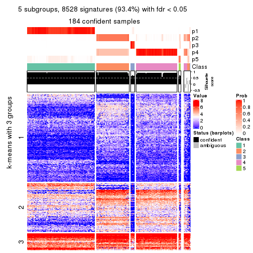</p>

</div>
<div id='tab-ATC-skmeans-get-signatures-no-scale-5'>
<pre><code class="r">get_signatures(res, k = 6, scale_rows = FALSE)
</code></pre>

<p></p>

</div>
</div>


Compare the overlap of signatures from different k:

```r
compare_signatures(res)
```


`get_signature()` returns a data frame invisibly. TO get the list of signatures, the function
call should be assigned to a variable explicitly. In following code, if `plot` argument is set
to `FALSE`, no heatmap is plotted while only the differential analysis is performed.

```r
# code only for demonstration
tb = get_signature(res, k = ..., plot = FALSE)
```

An example of the output of `tb` is:

```
#>   which_row         fdr    mean_1    mean_2 scaled_mean_1 scaled_mean_2 km
#> 1        38 0.042760348  8.373488  9.131774    -0.5533452     0.5164555  1
#> 2        40 0.018707592  7.106213  8.469186    -0.6173731     0.5762149  1
#> 3        55 0.019134737 10.221463 11.207825    -0.6159697     0.5749050  1
#> 4        59 0.006059896  5.921854  7.869574    -0.6899429     0.6439467  1
#> 5        60 0.018055526  8.928898 10.211722    -0.6204761     0.5791110  1
#> 6        98 0.009384629 15.714769 14.887706     0.6635654    -0.6193277  2
...
```

The columns in `tb` are:

1. `which_row`: row indices corresponding to the input matrix.
2. `fdr`: FDR for the differential test. 
3. `mean_x`: The mean value in group x.
4. `scaled_mean_x`: The mean value in group x after rows are scaled.
5. `km`: Row groups if k-means clustering is applied to rows.


UMAP plot which shows how samples are separated.


<script>
$( function() {
	$( '#tabs-ATC-skmeans-dimension-reduction' ).tabs();
} );
</script>
<div id='tabs-ATC-skmeans-dimension-reduction'>
<ul>
<li><a href='#tab-ATC-skmeans-dimension-reduction-1'>k = 2</a></li>
<li><a href='#tab-ATC-skmeans-dimension-reduction-2'>k = 3</a></li>
<li><a href='#tab-ATC-skmeans-dimension-reduction-3'>k = 4</a></li>
<li><a href='#tab-ATC-skmeans-dimension-reduction-4'>k = 5</a></li>
<li><a href='#tab-ATC-skmeans-dimension-reduction-5'>k = 6</a></li>
</ul>
<div id='tab-ATC-skmeans-dimension-reduction-1'>
<pre><code class="r">dimension_reduction(res, k = 2, method = &quot;UMAP&quot;)
</code></pre>

<p></p>

</div>
<div id='tab-ATC-skmeans-dimension-reduction-2'>
<pre><code class="r">dimension_reduction(res, k = 3, method = &quot;UMAP&quot;)
</code></pre>

<p></p>

</div>
<div id='tab-ATC-skmeans-dimension-reduction-3'>
<pre><code class="r">dimension_reduction(res, k = 4, method = &quot;UMAP&quot;)
</code></pre>

<p></p>

</div>
<div id='tab-ATC-skmeans-dimension-reduction-4'>
<pre><code class="r">dimension_reduction(res, k = 5, method = &quot;UMAP&quot;)
</code></pre>

<p></p>

</div>
<div id='tab-ATC-skmeans-dimension-reduction-5'>
<pre><code class="r">dimension_reduction(res, k = 6, method = &quot;UMAP&quot;)
</code></pre>

<p></p>

</div>
</div>


Following heatmap shows how subgroups are split when increasing `k`:

```r
collect_classes(res)
```


If matrix rows can be associated to genes, consider to use `functional_enrichment(res,
...)` to perform function enrichment for the signature genes. See [this vignette](http://bioconductor.org/packages/devel/bioc/vignettes/cola/inst/doc/functional_enrichment.html) for more detailed explanations.


 

---------------------------------------------------


### ATC:pam*


The object with results only for a single top-value method and a single partition method 
can be extracted as:

```r
res = res_list["ATC", "pam"]
# you can also extract it by
# res = res_list["ATC:pam"]
```

A summary of `res` and all the functions that can be applied to it:

```r
res
```

```
#> A 'ConsensusPartition' object with k = 2, 3, 4, 5, 6.
#>   On a matrix with 9126 rows and 192 columns.
#>   Top rows (913, 1826, 2738, 3650, 4563) are extracted by 'ATC' method.
#>   Subgroups are detected by 'pam' method.
#>   Performed in total 1250 partitions by row resampling.
#>   Best k for subgroups seems to be 4.
#> 
#> Following methods can be applied to this 'ConsensusPartition' object:
#>  [1] "cola_report"             "collect_classes"         "collect_plots"          
#>  [4] "collect_stats"           "colnames"                "compare_signatures"     
#>  [7] "consensus_heatmap"       "dimension_reduction"     "functional_enrichment"  
#> [10] "get_anno_col"            "get_anno"                "get_classes"            
#> [13] "get_consensus"           "get_matrix"              "get_membership"         
#> [16] "get_param"               "get_signatures"          "get_stats"              
#> [19] "is_best_k"               "is_stable_k"             "membership_heatmap"     
#> [22] "ncol"                    "nrow"                    "plot_ecdf"              
#> [25] "rownames"                "select_partition_number" "show"                   
#> [28] "suggest_best_k"          "test_to_known_factors"
```

`collect_plots()` function collects all the plots made from `res` for all `k` (number of partitions)
into one single page to provide an easy and fast comparison between different `k`.

```r
collect_plots(res)
```


The plots are:

- The first row: a plot of the ECDF (empirical cumulative distribution
  function) curves of the consensus matrix for each `k` and the heatmap of
  predicted classes for each `k`.
- The second row: heatmaps of the consensus matrix for each `k`.
- The third row: heatmaps of the membership matrix for each `k`.
- The fouth row: heatmaps of the signatures for each `k`.

All the plots in panels can be made by individual functions and they are
plotted later in this section.

`select_partition_number()` produces several plots showing different
statistics for choosing "optimized" `k`. There are following statistics:

- ECDF curves of the consensus matrix for each `k`;
- 1-PAC. [The PAC
  score](https://en.wikipedia.org/wiki/Consensus_clustering#Over-interpretation_potential_of_consensus_clustering)
  measures the proportion of the ambiguous subgrouping.
- Mean silhouette score.
- Concordance. The mean probability of fiting the consensus class ids in all
  partitions.
- Area increased. Denote $A_k$ as the area under the ECDF curve for current
  `k`, the area increased is defined as $A_k - A_{k-1}$.
- Rand index. The percent of pairs of samples that are both in a same cluster
  or both are not in a same cluster in the partition of k and k-1.
- Jaccard index. The ratio of pairs of samples are both in a same cluster in
  the partition of k and k-1 and the pairs of samples are both in a same
  cluster in the partition k or k-1.

The detailed explanations of these statistics can be found in [the _cola_
vignette](http://bioconductor.org/packages/devel/bioc/vignettes/cola/inst/doc/cola.html#toc_13).

Generally speaking, lower PAC score, higher mean silhouette score or higher
concordance corresponds to better partition. Rand index and Jaccard index
measure how similar the current partition is compared to partition with `k-1`.
If they are too similar, we won't accept `k` is better than `k-1`.

```r
select_partition_number(res)
```


The numeric values for all these statistics can be obtained by `get_stats()`.

```r
get_stats(res)
```

```
#>   k 1-PAC mean_silhouette concordance area_increased  Rand Jaccard
#> 2 2 1.000           0.997       0.999         0.5016 0.499   0.499
#> 3 3 0.963           0.923       0.970         0.2765 0.854   0.709
#> 4 4 0.942           0.906       0.960         0.0346 0.977   0.935
#> 5 5 0.774           0.801       0.846         0.1037 0.909   0.728
#> 6 6 0.759           0.759       0.864         0.0173 0.974   0.897
```

`suggest_best_k()` suggests the best $k$ based on these statistics. The rules are as follows:

- All $k$ with Jaccard index larger than 0.95 are removed because increasing
  $k$ does not provide enough extra information. If all $k$ are removed, it is
  marked as no subgroup is detected.
- For all $k$ with 1-PAC score larger than 0.9, the maximal $k$ is taken as
  the best $k$, and other $k$ are marked as optional $k$.
- If it does not fit the second rule. The $k$ with the maximal vote of the
  highest 1-PAC score, highest mean silhouette, and highest concordance is
  taken as the best $k$.

```r
suggest_best_k(res)
```

```
#> [1] 4
#> attr(,"optional")
#> [1] 2 3
```

There is also optional best $k$ = 2 3 that is worth to check.

Following shows the table of the partitions (You need to click the **show/hide
code output** link to see it). The membership matrix (columns with name `p*`)
is inferred by
[`clue::cl_consensus()`](https://www.rdocumentation.org/link/cl_consensus?package=clue)
function with the `SE` method. Basically the value in the membership matrix
represents the probability to belong to a certain group. The finall class
label for an item is determined with the group with highest probability it
belongs to.

In `get_classes()` function, the entropy is calculated from the membership
matrix and the silhouette score is calculated from the consensus matrix.


<script>
$( function() {
	$( '#tabs-ATC-pam-get-classes' ).tabs();
} );
</script>
<div id='tabs-ATC-pam-get-classes'>
<ul>
<li><a href='#tab-ATC-pam-get-classes-1'>k = 2</a></li>
<li><a href='#tab-ATC-pam-get-classes-2'>k = 3</a></li>
<li><a href='#tab-ATC-pam-get-classes-3'>k = 4</a></li>
<li><a href='#tab-ATC-pam-get-classes-4'>k = 5</a></li>
<li><a href='#tab-ATC-pam-get-classes-5'>k = 6</a></li>
</ul>

<div id='tab-ATC-pam-get-classes-1'>
<p><a id='tab-ATC-pam-get-classes-1-a' style='color:#0366d6' href='#'>show/hide code output</a></p>
<pre><code class="r">cbind(get_classes(res, k = 2), get_membership(res, k = 2))
</code></pre>

<pre><code>#&gt;            class entropy silhouette    p1    p2
#&gt; SRR2074921     1   0.000      0.997 1.000 0.000
#&gt; SRR2074919     1   0.000      0.997 1.000 0.000
#&gt; SRR2074920     1   0.000      0.997 1.000 0.000
#&gt; SRR2074917     1   0.000      0.997 1.000 0.000
#&gt; SRR2074918     2   0.000      1.000 0.000 1.000
#&gt; SRR2074916     2   0.000      1.000 0.000 1.000
#&gt; SRR2074915     2   0.000      1.000 0.000 1.000
#&gt; SRR2074914     1   0.000      0.997 1.000 0.000
#&gt; SRR2074913     2   0.000      1.000 0.000 1.000
#&gt; SRR2074912     1   0.000      0.997 1.000 0.000
#&gt; SRR2074911     2   0.000      1.000 0.000 1.000
#&gt; SRR2074910     2   0.000      1.000 0.000 1.000
#&gt; SRR2074909     1   0.000      0.997 1.000 0.000
#&gt; SRR2074907     1   0.000      0.997 1.000 0.000
#&gt; SRR2074908     2   0.000      1.000 0.000 1.000
#&gt; SRR2074906     2   0.000      1.000 0.000 1.000
#&gt; SRR2074905     1   0.000      0.997 1.000 0.000
#&gt; SRR2074904     2   0.000      1.000 0.000 1.000
#&gt; SRR2074903     2   0.000      1.000 0.000 1.000
#&gt; SRR2074902     1   0.000      0.997 1.000 0.000
#&gt; SRR2074901     2   0.000      1.000 0.000 1.000
#&gt; SRR2074900     1   0.000      0.997 1.000 0.000
#&gt; SRR2074899     2   0.000      1.000 0.000 1.000
#&gt; SRR2074898     2   0.000      1.000 0.000 1.000
#&gt; SRR2074897     2   0.000      1.000 0.000 1.000
#&gt; SRR2074896     2   0.000      1.000 0.000 1.000
#&gt; SRR2074895     1   0.000      0.997 1.000 0.000
#&gt; SRR2074894     1   0.802      0.677 0.756 0.244
#&gt; SRR2074893     2   0.000      1.000 0.000 1.000
#&gt; SRR2074892     1   0.000      0.997 1.000 0.000
#&gt; SRR2074891     1   0.000      0.997 1.000 0.000
#&gt; SRR2074890     2   0.000      1.000 0.000 1.000
#&gt; SRR2074887     2   0.000      1.000 0.000 1.000
#&gt; SRR2074889     2   0.000      1.000 0.000 1.000
#&gt; SRR2074886     2   0.000      1.000 0.000 1.000
#&gt; SRR2074888     2   0.000      1.000 0.000 1.000
#&gt; SRR2074885     1   0.000      0.997 1.000 0.000
#&gt; SRR2074884     2   0.000      1.000 0.000 1.000
#&gt; SRR2074883     2   0.000      1.000 0.000 1.000
#&gt; SRR2074882     1   0.000      0.997 1.000 0.000
#&gt; SRR2074880     2   0.000      1.000 0.000 1.000
#&gt; SRR2074881     2   0.000      1.000 0.000 1.000
#&gt; SRR2074879     1   0.000      0.997 1.000 0.000
#&gt; SRR2074878     1   0.000      0.997 1.000 0.000
#&gt; SRR2074877     2   0.000      1.000 0.000 1.000
#&gt; SRR2074876     1   0.000      0.997 1.000 0.000
#&gt; SRR2074875     2   0.000      1.000 0.000 1.000
#&gt; SRR2074874     1   0.000      0.997 1.000 0.000
#&gt; SRR2074873     2   0.000      1.000 0.000 1.000
#&gt; SRR2074872     1   0.000      0.997 1.000 0.000
#&gt; SRR2074871     2   0.000      1.000 0.000 1.000
#&gt; SRR2074870     1   0.000      0.997 1.000 0.000
#&gt; SRR2074869     1   0.000      0.997 1.000 0.000
#&gt; SRR2074868     1   0.000      0.997 1.000 0.000
#&gt; SRR2074867     2   0.000      1.000 0.000 1.000
#&gt; SRR2074866     2   0.000      1.000 0.000 1.000
#&gt; SRR2074865     1   0.000      0.997 1.000 0.000
#&gt; SRR2074864     1   0.000      0.997 1.000 0.000
#&gt; SRR2074863     1   0.000      0.997 1.000 0.000
#&gt; SRR2074862     1   0.000      0.997 1.000 0.000
#&gt; SRR2074861     1   0.000      0.997 1.000 0.000
#&gt; SRR2074860     1   0.000      0.997 1.000 0.000
#&gt; SRR2074859     1   0.000      0.997 1.000 0.000
#&gt; SRR2074858     2   0.000      1.000 0.000 1.000
#&gt; SRR2074855     2   0.000      1.000 0.000 1.000
#&gt; SRR2074857     1   0.000      0.997 1.000 0.000
#&gt; SRR2074856     1   0.000      0.997 1.000 0.000
#&gt; SRR2074854     1   0.000      0.997 1.000 0.000
#&gt; SRR2074853     1   0.000      0.997 1.000 0.000
#&gt; SRR2074852     2   0.000      1.000 0.000 1.000
#&gt; SRR2074851     1   0.000      0.997 1.000 0.000
#&gt; SRR2074850     1   0.000      0.997 1.000 0.000
#&gt; SRR2074849     1   0.000      0.997 1.000 0.000
#&gt; SRR2074848     1   0.000      0.997 1.000 0.000
#&gt; SRR2074847     1   0.000      0.997 1.000 0.000
#&gt; SRR2074846     1   0.000      0.997 1.000 0.000
#&gt; SRR2074845     1   0.000      0.997 1.000 0.000
#&gt; SRR2074843     1   0.000      0.997 1.000 0.000
#&gt; SRR2074842     2   0.000      1.000 0.000 1.000
#&gt; SRR2074844     2   0.000      1.000 0.000 1.000
#&gt; SRR2074841     2   0.000      1.000 0.000 1.000
#&gt; SRR2074840     2   0.000      1.000 0.000 1.000
#&gt; SRR2074839     1   0.000      0.997 1.000 0.000
#&gt; SRR2074838     2   0.000      1.000 0.000 1.000
#&gt; SRR2074836     2   0.000      1.000 0.000 1.000
#&gt; SRR2074835     2   0.000      1.000 0.000 1.000
#&gt; SRR2074837     1   0.000      0.997 1.000 0.000
#&gt; SRR2074834     2   0.000      1.000 0.000 1.000
#&gt; SRR2074833     1   0.000      0.997 1.000 0.000
#&gt; SRR2074832     2   0.000      1.000 0.000 1.000
#&gt; SRR2074831     1   0.000      0.997 1.000 0.000
#&gt; SRR2074829     1   0.000      0.997 1.000 0.000
#&gt; SRR2074830     1   0.000      0.997 1.000 0.000
#&gt; SRR2074828     1   0.000      0.997 1.000 0.000
#&gt; SRR2074827     2   0.000      1.000 0.000 1.000
#&gt; SRR2074826     2   0.000      1.000 0.000 1.000
#&gt; SRR2074825     2   0.000      1.000 0.000 1.000
#&gt; SRR2074824     2   0.000      1.000 0.000 1.000
#&gt; SRR2074823     1   0.000      0.997 1.000 0.000
#&gt; SRR2074822     2   0.000      1.000 0.000 1.000
#&gt; SRR2074821     2   0.000      1.000 0.000 1.000
#&gt; SRR2074820     2   0.000      1.000 0.000 1.000
#&gt; SRR2074819     2   0.000      1.000 0.000 1.000
#&gt; SRR2074817     2   0.000      1.000 0.000 1.000
#&gt; SRR2074818     2   0.000      1.000 0.000 1.000
#&gt; SRR2074816     1   0.000      0.997 1.000 0.000
#&gt; SRR2074815     2   0.000      1.000 0.000 1.000
#&gt; SRR2074814     1   0.000      0.997 1.000 0.000
#&gt; SRR2074812     2   0.000      1.000 0.000 1.000
#&gt; SRR2074813     2   0.000      1.000 0.000 1.000
#&gt; SRR2074809     2   0.000      1.000 0.000 1.000
#&gt; SRR2074810     2   0.000      1.000 0.000 1.000
#&gt; SRR2074811     2   0.000      1.000 0.000 1.000
#&gt; SRR2074808     2   0.000      1.000 0.000 1.000
#&gt; SRR2074807     2   0.000      1.000 0.000 1.000
#&gt; SRR2074806     1   0.000      0.997 1.000 0.000
#&gt; SRR2074805     2   0.000      1.000 0.000 1.000
#&gt; SRR2074804     1   0.000      0.997 1.000 0.000
#&gt; SRR2074803     1   0.000      0.997 1.000 0.000
#&gt; SRR2074801     1   0.000      0.997 1.000 0.000
#&gt; SRR2074802     2   0.000      1.000 0.000 1.000
#&gt; SRR2074799     2   0.000      1.000 0.000 1.000
#&gt; SRR2074800     1   0.000      0.997 1.000 0.000
#&gt; SRR2074798     1   0.000      0.997 1.000 0.000
#&gt; SRR2074797     1   0.000      0.997 1.000 0.000
#&gt; SRR2074795     2   0.000      1.000 0.000 1.000
#&gt; SRR2074796     2   0.000      1.000 0.000 1.000
#&gt; SRR2074794     2   0.000      1.000 0.000 1.000
#&gt; SRR2074793     2   0.000      1.000 0.000 1.000
#&gt; SRR2074792     1   0.000      0.997 1.000 0.000
#&gt; SRR2074791     1   0.000      0.997 1.000 0.000
#&gt; SRR2074790     2   0.000      1.000 0.000 1.000
#&gt; SRR2074789     1   0.000      0.997 1.000 0.000
#&gt; SRR2074788     1   0.000      0.997 1.000 0.000
#&gt; SRR2074787     1   0.000      0.997 1.000 0.000
#&gt; SRR2074786     2   0.000      1.000 0.000 1.000
#&gt; SRR2074785     1   0.000      0.997 1.000 0.000
#&gt; SRR2074784     1   0.000      0.997 1.000 0.000
#&gt; SRR2074783     2   0.000      1.000 0.000 1.000
#&gt; SRR2074782     1   0.000      0.997 1.000 0.000
#&gt; SRR2074779     2   0.000      1.000 0.000 1.000
#&gt; SRR2074781     2   0.000      1.000 0.000 1.000
#&gt; SRR2074780     1   0.000      0.997 1.000 0.000
#&gt; SRR2074778     2   0.000      1.000 0.000 1.000
#&gt; SRR2074777     2   0.000      1.000 0.000 1.000
#&gt; SRR2074776     2   0.000      1.000 0.000 1.000
#&gt; SRR2074775     1   0.000      0.997 1.000 0.000
#&gt; SRR2074774     1   0.000      0.997 1.000 0.000
#&gt; SRR2074773     2   0.000      1.000 0.000 1.000
#&gt; SRR2074771     2   0.000      1.000 0.000 1.000
#&gt; SRR2074772     1   0.000      0.997 1.000 0.000
#&gt; SRR2074770     1   0.000      0.997 1.000 0.000
#&gt; SRR2074769     2   0.000      1.000 0.000 1.000
#&gt; SRR2074768     2   0.000      1.000 0.000 1.000
#&gt; SRR2074766     2   0.000      1.000 0.000 1.000
#&gt; SRR2074767     1   0.000      0.997 1.000 0.000
#&gt; SRR2074765     1   0.000      0.997 1.000 0.000
#&gt; SRR2074764     2   0.000      1.000 0.000 1.000
#&gt; SRR2074763     2   0.000      1.000 0.000 1.000
#&gt; SRR2074761     1   0.000      0.997 1.000 0.000
#&gt; SRR2074762     2   0.000      1.000 0.000 1.000
#&gt; SRR2074760     2   0.000      1.000 0.000 1.000
#&gt; SRR2074759     1   0.000      0.997 1.000 0.000
#&gt; SRR2074757     2   0.000      1.000 0.000 1.000
#&gt; SRR2074758     2   0.000      1.000 0.000 1.000
#&gt; SRR2074756     2   0.000      1.000 0.000 1.000
#&gt; SRR2074755     1   0.000      0.997 1.000 0.000
#&gt; SRR2074754     1   0.000      0.997 1.000 0.000
#&gt; SRR2074753     2   0.000      1.000 0.000 1.000
#&gt; SRR2074752     1   0.000      0.997 1.000 0.000
#&gt; SRR2074751     1   0.000      0.997 1.000 0.000
#&gt; SRR2074749     2   0.000      1.000 0.000 1.000
#&gt; SRR2074750     1   0.000      0.997 1.000 0.000
#&gt; SRR2074748     1   0.000      0.997 1.000 0.000
#&gt; SRR2074747     2   0.000      1.000 0.000 1.000
#&gt; SRR2074745     1   0.000      0.997 1.000 0.000
#&gt; SRR2074746     1   0.000      0.997 1.000 0.000
#&gt; SRR2074744     2   0.000      1.000 0.000 1.000
#&gt; SRR2074743     2   0.000      1.000 0.000 1.000
#&gt; SRR2074742     2   0.000      1.000 0.000 1.000
#&gt; SRR2074741     1   0.000      0.997 1.000 0.000
#&gt; SRR2074740     2   0.000      1.000 0.000 1.000
#&gt; SRR2074739     1   0.000      0.997 1.000 0.000
#&gt; SRR2074738     2   0.000      1.000 0.000 1.000
#&gt; SRR2074737     2   0.000      1.000 0.000 1.000
#&gt; SRR2074736     2   0.000      1.000 0.000 1.000
#&gt; SRR2074735     1   0.000      0.997 1.000 0.000
#&gt; SRR2074734     2   0.000      1.000 0.000 1.000
#&gt; SRR2074733     1   0.000      0.997 1.000 0.000
#&gt; SRR2074732     2   0.000      1.000 0.000 1.000
#&gt; SRR2074731     2   0.000      1.000 0.000 1.000
#&gt; SRR2074730     1   0.000      0.997 1.000 0.000
</code></pre>

<script>
$('#tab-ATC-pam-get-classes-1-a').parent().next().next().hide();
$('#tab-ATC-pam-get-classes-1-a').click(function(){
  $('#tab-ATC-pam-get-classes-1-a').parent().next().next().toggle();
  return(false);
});
</script>
</div>

<div id='tab-ATC-pam-get-classes-2'>
<p><a id='tab-ATC-pam-get-classes-2-a' style='color:#0366d6' href='#'>show/hide code output</a></p>
<pre><code class="r">cbind(get_classes(res, k = 3), get_membership(res, k = 3))
</code></pre>

<pre><code>#&gt;            class entropy silhouette p1    p2    p3
#&gt; SRR2074921     1  0.0000     1.0000  1 0.000 0.000
#&gt; SRR2074919     1  0.0000     1.0000  1 0.000 0.000
#&gt; SRR2074920     1  0.0000     1.0000  1 0.000 0.000
#&gt; SRR2074917     1  0.0000     1.0000  1 0.000 0.000
#&gt; SRR2074918     2  0.0592     0.9189  0 0.988 0.012
#&gt; SRR2074916     3  0.0000     0.9474  0 0.000 1.000
#&gt; SRR2074915     2  0.0000     0.9271  0 1.000 0.000
#&gt; SRR2074914     1  0.0000     1.0000  1 0.000 0.000
#&gt; SRR2074913     2  0.0000     0.9271  0 1.000 0.000
#&gt; SRR2074912     1  0.0000     1.0000  1 0.000 0.000
#&gt; SRR2074911     2  0.2448     0.8644  0 0.924 0.076
#&gt; SRR2074910     2  0.0000     0.9271  0 1.000 0.000
#&gt; SRR2074909     1  0.0000     1.0000  1 0.000 0.000
#&gt; SRR2074907     1  0.0000     1.0000  1 0.000 0.000
#&gt; SRR2074908     2  0.0000     0.9271  0 1.000 0.000
#&gt; SRR2074906     3  0.0000     0.9474  0 0.000 1.000
#&gt; SRR2074905     1  0.0000     1.0000  1 0.000 0.000
#&gt; SRR2074904     2  0.0000     0.9271  0 1.000 0.000
#&gt; SRR2074903     3  0.3619     0.8044  0 0.136 0.864
#&gt; SRR2074902     1  0.0000     1.0000  1 0.000 0.000
#&gt; SRR2074901     2  0.5591     0.5771  0 0.696 0.304
#&gt; SRR2074900     1  0.0000     1.0000  1 0.000 0.000
#&gt; SRR2074899     2  0.6280     0.1946  0 0.540 0.460
#&gt; SRR2074898     3  0.0000     0.9474  0 0.000 1.000
#&gt; SRR2074897     3  0.0000     0.9474  0 0.000 1.000
#&gt; SRR2074896     2  0.0000     0.9271  0 1.000 0.000
#&gt; SRR2074895     1  0.0000     1.0000  1 0.000 0.000
#&gt; SRR2074894     2  0.0000     0.9271  0 1.000 0.000
#&gt; SRR2074893     2  0.6235     0.2716  0 0.564 0.436
#&gt; SRR2074892     1  0.0000     1.0000  1 0.000 0.000
#&gt; SRR2074891     1  0.0000     1.0000  1 0.000 0.000
#&gt; SRR2074890     2  0.0000     0.9271  0 1.000 0.000
#&gt; SRR2074887     2  0.0000     0.9271  0 1.000 0.000
#&gt; SRR2074889     3  0.0000     0.9474  0 0.000 1.000
#&gt; SRR2074886     2  0.6295     0.1513  0 0.528 0.472
#&gt; SRR2074888     3  0.0000     0.9474  0 0.000 1.000
#&gt; SRR2074885     1  0.0000     1.0000  1 0.000 0.000
#&gt; SRR2074884     3  0.0000     0.9474  0 0.000 1.000
#&gt; SRR2074883     3  0.0000     0.9474  0 0.000 1.000
#&gt; SRR2074882     1  0.0000     1.0000  1 0.000 0.000
#&gt; SRR2074880     3  0.0000     0.9474  0 0.000 1.000
#&gt; SRR2074881     2  0.0000     0.9271  0 1.000 0.000
#&gt; SRR2074879     1  0.0000     1.0000  1 0.000 0.000
#&gt; SRR2074878     1  0.0000     1.0000  1 0.000 0.000
#&gt; SRR2074877     3  0.6225     0.1889  0 0.432 0.568
#&gt; SRR2074876     1  0.0000     1.0000  1 0.000 0.000
#&gt; SRR2074875     3  0.0000     0.9474  0 0.000 1.000
#&gt; SRR2074874     1  0.0000     1.0000  1 0.000 0.000
#&gt; SRR2074873     3  0.0000     0.9474  0 0.000 1.000
#&gt; SRR2074872     1  0.0000     1.0000  1 0.000 0.000
#&gt; SRR2074871     2  0.0000     0.9271  0 1.000 0.000
#&gt; SRR2074870     1  0.0000     1.0000  1 0.000 0.000
#&gt; SRR2074869     1  0.0000     1.0000  1 0.000 0.000
#&gt; SRR2074868     1  0.0000     1.0000  1 0.000 0.000
#&gt; SRR2074867     2  0.0000     0.9271  0 1.000 0.000
#&gt; SRR2074866     2  0.0000     0.9271  0 1.000 0.000
#&gt; SRR2074865     1  0.0000     1.0000  1 0.000 0.000
#&gt; SRR2074864     1  0.0000     1.0000  1 0.000 0.000
#&gt; SRR2074863     1  0.0000     1.0000  1 0.000 0.000
#&gt; SRR2074862     1  0.0000     1.0000  1 0.000 0.000
#&gt; SRR2074861     1  0.0000     1.0000  1 0.000 0.000
#&gt; SRR2074860     1  0.0000     1.0000  1 0.000 0.000
#&gt; SRR2074859     1  0.0000     1.0000  1 0.000 0.000
#&gt; SRR2074858     2  0.0000     0.9271  0 1.000 0.000
#&gt; SRR2074855     3  0.0000     0.9474  0 0.000 1.000
#&gt; SRR2074857     1  0.0000     1.0000  1 0.000 0.000
#&gt; SRR2074856     1  0.0000     1.0000  1 0.000 0.000
#&gt; SRR2074854     1  0.0000     1.0000  1 0.000 0.000
#&gt; SRR2074853     1  0.0000     1.0000  1 0.000 0.000
#&gt; SRR2074852     3  0.0000     0.9474  0 0.000 1.000
#&gt; SRR2074851     1  0.0000     1.0000  1 0.000 0.000
#&gt; SRR2074850     1  0.0000     1.0000  1 0.000 0.000
#&gt; SRR2074849     1  0.0000     1.0000  1 0.000 0.000
#&gt; SRR2074848     1  0.0000     1.0000  1 0.000 0.000
#&gt; SRR2074847     1  0.0000     1.0000  1 0.000 0.000
#&gt; SRR2074846     1  0.0000     1.0000  1 0.000 0.000
#&gt; SRR2074845     1  0.0000     1.0000  1 0.000 0.000
#&gt; SRR2074843     1  0.0000     1.0000  1 0.000 0.000
#&gt; SRR2074842     2  0.0000     0.9271  0 1.000 0.000
#&gt; SRR2074844     2  0.0892     0.9136  0 0.980 0.020
#&gt; SRR2074841     3  0.0000     0.9474  0 0.000 1.000
#&gt; SRR2074840     3  0.0000     0.9474  0 0.000 1.000
#&gt; SRR2074839     1  0.0000     1.0000  1 0.000 0.000
#&gt; SRR2074838     3  0.0000     0.9474  0 0.000 1.000
#&gt; SRR2074836     2  0.0424     0.9222  0 0.992 0.008
#&gt; SRR2074835     3  0.0000     0.9474  0 0.000 1.000
#&gt; SRR2074837     1  0.0000     1.0000  1 0.000 0.000
#&gt; SRR2074834     2  0.0000     0.9271  0 1.000 0.000
#&gt; SRR2074833     1  0.0000     1.0000  1 0.000 0.000
#&gt; SRR2074832     2  0.6111     0.3823  0 0.604 0.396
#&gt; SRR2074831     1  0.0000     1.0000  1 0.000 0.000
#&gt; SRR2074829     1  0.0000     1.0000  1 0.000 0.000
#&gt; SRR2074830     1  0.0000     1.0000  1 0.000 0.000
#&gt; SRR2074828     1  0.0000     1.0000  1 0.000 0.000
#&gt; SRR2074827     2  0.0000     0.9271  0 1.000 0.000
#&gt; SRR2074826     2  0.0000     0.9271  0 1.000 0.000
#&gt; SRR2074825     3  0.0000     0.9474  0 0.000 1.000
#&gt; SRR2074824     3  0.0000     0.9474  0 0.000 1.000
#&gt; SRR2074823     1  0.0000     1.0000  1 0.000 0.000
#&gt; SRR2074822     3  0.0000     0.9474  0 0.000 1.000
#&gt; SRR2074821     3  0.6079     0.3205  0 0.388 0.612
#&gt; SRR2074820     3  0.0000     0.9474  0 0.000 1.000
#&gt; SRR2074819     2  0.0000     0.9271  0 1.000 0.000
#&gt; SRR2074817     2  0.0000     0.9271  0 1.000 0.000
#&gt; SRR2074818     3  0.0000     0.9474  0 0.000 1.000
#&gt; SRR2074816     1  0.0000     1.0000  1 0.000 0.000
#&gt; SRR2074815     2  0.0000     0.9271  0 1.000 0.000
#&gt; SRR2074814     1  0.0000     1.0000  1 0.000 0.000
#&gt; SRR2074812     3  0.0000     0.9474  0 0.000 1.000
#&gt; SRR2074813     3  0.0000     0.9474  0 0.000 1.000
#&gt; SRR2074809     3  0.0000     0.9474  0 0.000 1.000
#&gt; SRR2074810     2  0.0000     0.9271  0 1.000 0.000
#&gt; SRR2074811     3  0.0000     0.9474  0 0.000 1.000
#&gt; SRR2074808     2  0.0000     0.9271  0 1.000 0.000
#&gt; SRR2074807     3  0.6307    -0.0131  0 0.488 0.512
#&gt; SRR2074806     1  0.0000     1.0000  1 0.000 0.000
#&gt; SRR2074805     3  0.0000     0.9474  0 0.000 1.000
#&gt; SRR2074804     1  0.0000     1.0000  1 0.000 0.000
#&gt; SRR2074803     1  0.0000     1.0000  1 0.000 0.000
#&gt; SRR2074801     1  0.0000     1.0000  1 0.000 0.000
#&gt; SRR2074802     2  0.0000     0.9271  0 1.000 0.000
#&gt; SRR2074799     3  0.0000     0.9474  0 0.000 1.000
#&gt; SRR2074800     1  0.0000     1.0000  1 0.000 0.000
#&gt; SRR2074798     1  0.0000     1.0000  1 0.000 0.000
#&gt; SRR2074797     1  0.0000     1.0000  1 0.000 0.000
#&gt; SRR2074795     3  0.0000     0.9474  0 0.000 1.000
#&gt; SRR2074796     2  0.0000     0.9271  0 1.000 0.000
#&gt; SRR2074794     3  0.0000     0.9474  0 0.000 1.000
#&gt; SRR2074793     2  0.5882     0.4928  0 0.652 0.348
#&gt; SRR2074792     1  0.0000     1.0000  1 0.000 0.000
#&gt; SRR2074791     1  0.0000     1.0000  1 0.000 0.000
#&gt; SRR2074790     3  0.0000     0.9474  0 0.000 1.000
#&gt; SRR2074789     1  0.0000     1.0000  1 0.000 0.000
#&gt; SRR2074788     1  0.0000     1.0000  1 0.000 0.000
#&gt; SRR2074787     1  0.0000     1.0000  1 0.000 0.000
#&gt; SRR2074786     2  0.0000     0.9271  0 1.000 0.000
#&gt; SRR2074785     1  0.0000     1.0000  1 0.000 0.000
#&gt; SRR2074784     1  0.0000     1.0000  1 0.000 0.000
#&gt; SRR2074783     3  0.0000     0.9474  0 0.000 1.000
#&gt; SRR2074782     1  0.0000     1.0000  1 0.000 0.000
#&gt; SRR2074779     2  0.0000     0.9271  0 1.000 0.000
#&gt; SRR2074781     2  0.0000     0.9271  0 1.000 0.000
#&gt; SRR2074780     1  0.0000     1.0000  1 0.000 0.000
#&gt; SRR2074778     2  0.3752     0.8042  0 0.856 0.144
#&gt; SRR2074777     2  0.0000     0.9271  0 1.000 0.000
#&gt; SRR2074776     3  0.0000     0.9474  0 0.000 1.000
#&gt; SRR2074775     1  0.0000     1.0000  1 0.000 0.000
#&gt; SRR2074774     1  0.0000     1.0000  1 0.000 0.000
#&gt; SRR2074773     2  0.0000     0.9271  0 1.000 0.000
#&gt; SRR2074771     2  0.0000     0.9271  0 1.000 0.000
#&gt; SRR2074772     1  0.0000     1.0000  1 0.000 0.000
#&gt; SRR2074770     1  0.0000     1.0000  1 0.000 0.000
#&gt; SRR2074769     3  0.0000     0.9474  0 0.000 1.000
#&gt; SRR2074768     3  0.0000     0.9474  0 0.000 1.000
#&gt; SRR2074766     2  0.0000     0.9271  0 1.000 0.000
#&gt; SRR2074767     1  0.0000     1.0000  1 0.000 0.000
#&gt; SRR2074765     1  0.0000     1.0000  1 0.000 0.000
#&gt; SRR2074764     2  0.0000     0.9271  0 1.000 0.000
#&gt; SRR2074763     3  0.0000     0.9474  0 0.000 1.000
#&gt; SRR2074761     1  0.0000     1.0000  1 0.000 0.000
#&gt; SRR2074762     2  0.0000     0.9271  0 1.000 0.000
#&gt; SRR2074760     2  0.3941     0.7921  0 0.844 0.156
#&gt; SRR2074759     1  0.0000     1.0000  1 0.000 0.000
#&gt; SRR2074757     2  0.4504     0.7430  0 0.804 0.196
#&gt; SRR2074758     3  0.0000     0.9474  0 0.000 1.000
#&gt; SRR2074756     2  0.0000     0.9271  0 1.000 0.000
#&gt; SRR2074755     1  0.0000     1.0000  1 0.000 0.000
#&gt; SRR2074754     1  0.0000     1.0000  1 0.000 0.000
#&gt; SRR2074753     2  0.0000     0.9271  0 1.000 0.000
#&gt; SRR2074752     1  0.0000     1.0000  1 0.000 0.000
#&gt; SRR2074751     1  0.0000     1.0000  1 0.000 0.000
#&gt; SRR2074749     3  0.6154     0.2613  0 0.408 0.592
#&gt; SRR2074750     1  0.0000     1.0000  1 0.000 0.000
#&gt; SRR2074748     1  0.0000     1.0000  1 0.000 0.000
#&gt; SRR2074747     2  0.0000     0.9271  0 1.000 0.000
#&gt; SRR2074745     1  0.0000     1.0000  1 0.000 0.000
#&gt; SRR2074746     1  0.0000     1.0000  1 0.000 0.000
#&gt; SRR2074744     2  0.0000     0.9271  0 1.000 0.000
#&gt; SRR2074743     2  0.0000     0.9271  0 1.000 0.000
#&gt; SRR2074742     2  0.0237     0.9245  0 0.996 0.004
#&gt; SRR2074741     1  0.0000     1.0000  1 0.000 0.000
#&gt; SRR2074740     2  0.0000     0.9271  0 1.000 0.000
#&gt; SRR2074739     1  0.0000     1.0000  1 0.000 0.000
#&gt; SRR2074738     2  0.4931     0.6943  0 0.768 0.232
#&gt; SRR2074737     3  0.0000     0.9474  0 0.000 1.000
#&gt; SRR2074736     2  0.6154     0.3513  0 0.592 0.408
#&gt; SRR2074735     1  0.0000     1.0000  1 0.000 0.000
#&gt; SRR2074734     3  0.5178     0.6168  0 0.256 0.744
#&gt; SRR2074733     1  0.0000     1.0000  1 0.000 0.000
#&gt; SRR2074732     3  0.0000     0.9474  0 0.000 1.000
#&gt; SRR2074731     3  0.0000     0.9474  0 0.000 1.000
#&gt; SRR2074730     1  0.0000     1.0000  1 0.000 0.000
</code></pre>

<script>
$('#tab-ATC-pam-get-classes-2-a').parent().next().next().hide();
$('#tab-ATC-pam-get-classes-2-a').click(function(){
  $('#tab-ATC-pam-get-classes-2-a').parent().next().next().toggle();
  return(false);
});
</script>
</div>

<div id='tab-ATC-pam-get-classes-3'>
<p><a id='tab-ATC-pam-get-classes-3-a' style='color:#0366d6' href='#'>show/hide code output</a></p>
<pre><code class="r">cbind(get_classes(res, k = 4), get_membership(res, k = 4))
</code></pre>

<pre><code>#&gt;            class entropy silhouette    p1    p2    p3    p4
#&gt; SRR2074921     3  0.0000     0.7201 0.000 0.000 1.000 0.000
#&gt; SRR2074919     3  0.3610     0.9335 0.200 0.000 0.800 0.000
#&gt; SRR2074920     3  0.3610     0.9335 0.200 0.000 0.800 0.000
#&gt; SRR2074917     1  0.1022     0.9785 0.968 0.000 0.032 0.000
#&gt; SRR2074918     2  0.0469     0.9054 0.000 0.988 0.000 0.012
#&gt; SRR2074916     4  0.0000     0.9357 0.000 0.000 0.000 1.000
#&gt; SRR2074915     2  0.0000     0.9147 0.000 1.000 0.000 0.000
#&gt; SRR2074914     1  0.0000     0.9835 1.000 0.000 0.000 0.000
#&gt; SRR2074913     2  0.0000     0.9147 0.000 1.000 0.000 0.000
#&gt; SRR2074912     3  0.3610     0.9335 0.200 0.000 0.800 0.000
#&gt; SRR2074911     2  0.1940     0.8437 0.000 0.924 0.000 0.076
#&gt; SRR2074910     2  0.0000     0.9147 0.000 1.000 0.000 0.000
#&gt; SRR2074909     1  0.0000     0.9835 1.000 0.000 0.000 0.000
#&gt; SRR2074907     1  0.0336     0.9831 0.992 0.000 0.008 0.000
#&gt; SRR2074908     2  0.0000     0.9147 0.000 1.000 0.000 0.000
#&gt; SRR2074906     4  0.0000     0.9357 0.000 0.000 0.000 1.000
#&gt; SRR2074905     1  0.1022     0.9785 0.968 0.000 0.032 0.000
#&gt; SRR2074904     2  0.0000     0.9147 0.000 1.000 0.000 0.000
#&gt; SRR2074903     4  0.2868     0.7783 0.000 0.136 0.000 0.864
#&gt; SRR2074902     1  0.0817     0.9802 0.976 0.000 0.024 0.000
#&gt; SRR2074901     2  0.4431     0.5771 0.000 0.696 0.000 0.304
#&gt; SRR2074900     1  0.1022     0.9785 0.968 0.000 0.032 0.000
#&gt; SRR2074899     2  0.4977     0.1946 0.000 0.540 0.000 0.460
#&gt; SRR2074898     4  0.0000     0.9357 0.000 0.000 0.000 1.000
#&gt; SRR2074897     4  0.0000     0.9357 0.000 0.000 0.000 1.000
#&gt; SRR2074896     2  0.0000     0.9147 0.000 1.000 0.000 0.000
#&gt; SRR2074895     1  0.0336     0.9831 0.992 0.000 0.008 0.000
#&gt; SRR2074894     2  0.0000     0.9147 0.000 1.000 0.000 0.000
#&gt; SRR2074893     2  0.4941     0.2716 0.000 0.564 0.000 0.436
#&gt; SRR2074892     1  0.0000     0.9835 1.000 0.000 0.000 0.000
#&gt; SRR2074891     1  0.0000     0.9835 1.000 0.000 0.000 0.000
#&gt; SRR2074890     2  0.0000     0.9147 0.000 1.000 0.000 0.000
#&gt; SRR2074887     2  0.0000     0.9147 0.000 1.000 0.000 0.000
#&gt; SRR2074889     4  0.0000     0.9357 0.000 0.000 0.000 1.000
#&gt; SRR2074886     2  0.4989     0.1513 0.000 0.528 0.000 0.472
#&gt; SRR2074888     4  0.0000     0.9357 0.000 0.000 0.000 1.000
#&gt; SRR2074885     1  0.0469     0.9828 0.988 0.000 0.012 0.000
#&gt; SRR2074884     4  0.0000     0.9357 0.000 0.000 0.000 1.000
#&gt; SRR2074883     4  0.0000     0.9357 0.000 0.000 0.000 1.000
#&gt; SRR2074882     1  0.0188     0.9834 0.996 0.000 0.004 0.000
#&gt; SRR2074880     4  0.0000     0.9357 0.000 0.000 0.000 1.000
#&gt; SRR2074881     2  0.0000     0.9147 0.000 1.000 0.000 0.000
#&gt; SRR2074879     3  0.3610     0.9335 0.200 0.000 0.800 0.000
#&gt; SRR2074878     1  0.1022     0.9785 0.968 0.000 0.032 0.000
#&gt; SRR2074877     4  0.4933     0.1889 0.000 0.432 0.000 0.568
#&gt; SRR2074876     1  0.0921     0.9793 0.972 0.000 0.028 0.000
#&gt; SRR2074875     4  0.0000     0.9357 0.000 0.000 0.000 1.000
#&gt; SRR2074874     1  0.1022     0.9785 0.968 0.000 0.032 0.000
#&gt; SRR2074873     4  0.0000     0.9357 0.000 0.000 0.000 1.000
#&gt; SRR2074872     1  0.1022     0.9785 0.968 0.000 0.032 0.000
#&gt; SRR2074871     2  0.0000     0.9147 0.000 1.000 0.000 0.000
#&gt; SRR2074870     1  0.0000     0.9835 1.000 0.000 0.000 0.000
#&gt; SRR2074869     1  0.0469     0.9828 0.988 0.000 0.012 0.000
#&gt; SRR2074868     1  0.1022     0.9785 0.968 0.000 0.032 0.000
#&gt; SRR2074867     2  0.0000     0.9147 0.000 1.000 0.000 0.000
#&gt; SRR2074866     2  0.0000     0.9147 0.000 1.000 0.000 0.000
#&gt; SRR2074865     1  0.0000     0.9835 1.000 0.000 0.000 0.000
#&gt; SRR2074864     1  0.0000     0.9835 1.000 0.000 0.000 0.000
#&gt; SRR2074863     1  0.0000     0.9835 1.000 0.000 0.000 0.000
#&gt; SRR2074862     1  0.1022     0.9785 0.968 0.000 0.032 0.000
#&gt; SRR2074861     1  0.1022     0.9785 0.968 0.000 0.032 0.000
#&gt; SRR2074860     1  0.0000     0.9835 1.000 0.000 0.000 0.000
#&gt; SRR2074859     1  0.1022     0.9785 0.968 0.000 0.032 0.000
#&gt; SRR2074858     2  0.0000     0.9147 0.000 1.000 0.000 0.000
#&gt; SRR2074855     4  0.0000     0.9357 0.000 0.000 0.000 1.000
#&gt; SRR2074857     1  0.1022     0.9785 0.968 0.000 0.032 0.000
#&gt; SRR2074856     1  0.1022     0.9785 0.968 0.000 0.032 0.000
#&gt; SRR2074854     1  0.1022     0.9785 0.968 0.000 0.032 0.000
#&gt; SRR2074853     1  0.0188     0.9835 0.996 0.000 0.004 0.000
#&gt; SRR2074852     4  0.0000     0.9357 0.000 0.000 0.000 1.000
#&gt; SRR2074851     1  0.1022     0.9785 0.968 0.000 0.032 0.000
#&gt; SRR2074850     1  0.0000     0.9835 1.000 0.000 0.000 0.000
#&gt; SRR2074849     1  0.1022     0.9785 0.968 0.000 0.032 0.000
#&gt; SRR2074848     1  0.1022     0.9785 0.968 0.000 0.032 0.000
#&gt; SRR2074847     1  0.1022     0.9785 0.968 0.000 0.032 0.000
#&gt; SRR2074846     1  0.0817     0.9802 0.976 0.000 0.024 0.000
#&gt; SRR2074845     1  0.1022     0.9785 0.968 0.000 0.032 0.000
#&gt; SRR2074843     1  0.0000     0.9835 1.000 0.000 0.000 0.000
#&gt; SRR2074842     2  0.0000     0.9147 0.000 1.000 0.000 0.000
#&gt; SRR2074844     2  0.0707     0.8998 0.000 0.980 0.000 0.020
#&gt; SRR2074841     4  0.0000     0.9357 0.000 0.000 0.000 1.000
#&gt; SRR2074840     4  0.0000     0.9357 0.000 0.000 0.000 1.000
#&gt; SRR2074839     1  0.0000     0.9835 1.000 0.000 0.000 0.000
#&gt; SRR2074838     4  0.0000     0.9357 0.000 0.000 0.000 1.000
#&gt; SRR2074836     2  0.0336     0.9093 0.000 0.992 0.000 0.008
#&gt; SRR2074835     4  0.0000     0.9357 0.000 0.000 0.000 1.000
#&gt; SRR2074837     1  0.0000     0.9835 1.000 0.000 0.000 0.000
#&gt; SRR2074834     2  0.0000     0.9147 0.000 1.000 0.000 0.000
#&gt; SRR2074833     1  0.0000     0.9835 1.000 0.000 0.000 0.000
#&gt; SRR2074832     2  0.4843     0.3823 0.000 0.604 0.000 0.396
#&gt; SRR2074831     1  0.0188     0.9835 0.996 0.000 0.004 0.000
#&gt; SRR2074829     1  0.1022     0.9785 0.968 0.000 0.032 0.000
#&gt; SRR2074830     1  0.1022     0.9785 0.968 0.000 0.032 0.000
#&gt; SRR2074828     1  0.0000     0.9835 1.000 0.000 0.000 0.000
#&gt; SRR2074827     2  0.0000     0.9147 0.000 1.000 0.000 0.000
#&gt; SRR2074826     2  0.0000     0.9147 0.000 1.000 0.000 0.000
#&gt; SRR2074825     4  0.0000     0.9357 0.000 0.000 0.000 1.000
#&gt; SRR2074824     4  0.0000     0.9357 0.000 0.000 0.000 1.000
#&gt; SRR2074823     1  0.0000     0.9835 1.000 0.000 0.000 0.000
#&gt; SRR2074822     4  0.0000     0.9357 0.000 0.000 0.000 1.000
#&gt; SRR2074821     4  0.4817     0.3205 0.000 0.388 0.000 0.612
#&gt; SRR2074820     4  0.0000     0.9357 0.000 0.000 0.000 1.000
#&gt; SRR2074819     2  0.0000     0.9147 0.000 1.000 0.000 0.000
#&gt; SRR2074817     2  0.0000     0.9147 0.000 1.000 0.000 0.000
#&gt; SRR2074818     4  0.0000     0.9357 0.000 0.000 0.000 1.000
#&gt; SRR2074816     1  0.0000     0.9835 1.000 0.000 0.000 0.000
#&gt; SRR2074815     2  0.0000     0.9147 0.000 1.000 0.000 0.000
#&gt; SRR2074814     1  0.1022     0.9785 0.968 0.000 0.032 0.000
#&gt; SRR2074812     4  0.0000     0.9357 0.000 0.000 0.000 1.000
#&gt; SRR2074813     4  0.0000     0.9357 0.000 0.000 0.000 1.000
#&gt; SRR2074809     4  0.0000     0.9357 0.000 0.000 0.000 1.000
#&gt; SRR2074810     2  0.0000     0.9147 0.000 1.000 0.000 0.000
#&gt; SRR2074811     4  0.0000     0.9357 0.000 0.000 0.000 1.000
#&gt; SRR2074808     2  0.0000     0.9147 0.000 1.000 0.000 0.000
#&gt; SRR2074807     4  0.4998    -0.0131 0.000 0.488 0.000 0.512
#&gt; SRR2074806     1  0.0000     0.9835 1.000 0.000 0.000 0.000
#&gt; SRR2074805     4  0.0000     0.9357 0.000 0.000 0.000 1.000
#&gt; SRR2074804     1  0.0000     0.9835 1.000 0.000 0.000 0.000
#&gt; SRR2074803     1  0.0000     0.9835 1.000 0.000 0.000 0.000
#&gt; SRR2074801     1  0.0000     0.9835 1.000 0.000 0.000 0.000
#&gt; SRR2074802     2  0.0000     0.9147 0.000 1.000 0.000 0.000
#&gt; SRR2074799     4  0.0000     0.9357 0.000 0.000 0.000 1.000
#&gt; SRR2074800     1  0.1022     0.9785 0.968 0.000 0.032 0.000
#&gt; SRR2074798     1  0.0000     0.9835 1.000 0.000 0.000 0.000
#&gt; SRR2074797     1  0.0000     0.9835 1.000 0.000 0.000 0.000
#&gt; SRR2074795     4  0.0000     0.9357 0.000 0.000 0.000 1.000
#&gt; SRR2074796     2  0.0000     0.9147 0.000 1.000 0.000 0.000
#&gt; SRR2074794     4  0.0000     0.9357 0.000 0.000 0.000 1.000
#&gt; SRR2074793     2  0.4661     0.4928 0.000 0.652 0.000 0.348
#&gt; SRR2074792     1  0.0000     0.9835 1.000 0.000 0.000 0.000
#&gt; SRR2074791     1  0.0000     0.9835 1.000 0.000 0.000 0.000
#&gt; SRR2074790     4  0.0000     0.9357 0.000 0.000 0.000 1.000
#&gt; SRR2074789     1  0.1022     0.9785 0.968 0.000 0.032 0.000
#&gt; SRR2074788     1  0.1022     0.9785 0.968 0.000 0.032 0.000
#&gt; SRR2074787     1  0.1022     0.9785 0.968 0.000 0.032 0.000
#&gt; SRR2074786     2  0.0000     0.9147 0.000 1.000 0.000 0.000
#&gt; SRR2074785     1  0.0000     0.9835 1.000 0.000 0.000 0.000
#&gt; SRR2074784     1  0.0000     0.9835 1.000 0.000 0.000 0.000
#&gt; SRR2074783     4  0.0000     0.9357 0.000 0.000 0.000 1.000
#&gt; SRR2074782     1  0.1022     0.9785 0.968 0.000 0.032 0.000
#&gt; SRR2074779     2  0.0000     0.9147 0.000 1.000 0.000 0.000
#&gt; SRR2074781     2  0.0000     0.9147 0.000 1.000 0.000 0.000
#&gt; SRR2074780     1  0.1022     0.9785 0.968 0.000 0.032 0.000
#&gt; SRR2074778     2  0.2973     0.7873 0.000 0.856 0.000 0.144
#&gt; SRR2074777     2  0.0000     0.9147 0.000 1.000 0.000 0.000
#&gt; SRR2074776     4  0.0000     0.9357 0.000 0.000 0.000 1.000
#&gt; SRR2074775     1  0.0000     0.9835 1.000 0.000 0.000 0.000
#&gt; SRR2074774     1  0.0592     0.9822 0.984 0.000 0.016 0.000
#&gt; SRR2074773     2  0.0000     0.9147 0.000 1.000 0.000 0.000
#&gt; SRR2074771     2  0.0000     0.9147 0.000 1.000 0.000 0.000
#&gt; SRR2074772     1  0.0000     0.9835 1.000 0.000 0.000 0.000
#&gt; SRR2074770     1  0.0000     0.9835 1.000 0.000 0.000 0.000
#&gt; SRR2074769     4  0.0000     0.9357 0.000 0.000 0.000 1.000
#&gt; SRR2074768     4  0.0000     0.9357 0.000 0.000 0.000 1.000
#&gt; SRR2074766     2  0.0000     0.9147 0.000 1.000 0.000 0.000
#&gt; SRR2074767     1  0.0000     0.9835 1.000 0.000 0.000 0.000
#&gt; SRR2074765     1  0.1022     0.9785 0.968 0.000 0.032 0.000
#&gt; SRR2074764     2  0.0000     0.9147 0.000 1.000 0.000 0.000
#&gt; SRR2074763     4  0.0000     0.9357 0.000 0.000 0.000 1.000
#&gt; SRR2074761     1  0.0921     0.9794 0.972 0.000 0.028 0.000
#&gt; SRR2074762     2  0.0000     0.9147 0.000 1.000 0.000 0.000
#&gt; SRR2074760     2  0.3123     0.7757 0.000 0.844 0.000 0.156
#&gt; SRR2074759     1  0.0469     0.9828 0.988 0.000 0.012 0.000
#&gt; SRR2074757     2  0.3569     0.7313 0.000 0.804 0.000 0.196
#&gt; SRR2074758     4  0.0000     0.9357 0.000 0.000 0.000 1.000
#&gt; SRR2074756     2  0.0000     0.9147 0.000 1.000 0.000 0.000
#&gt; SRR2074755     1  0.0000     0.9835 1.000 0.000 0.000 0.000
#&gt; SRR2074754     1  0.0000     0.9835 1.000 0.000 0.000 0.000
#&gt; SRR2074753     2  0.0000     0.9147 0.000 1.000 0.000 0.000
#&gt; SRR2074752     1  0.1022     0.9785 0.968 0.000 0.032 0.000
#&gt; SRR2074751     1  0.0000     0.9835 1.000 0.000 0.000 0.000
#&gt; SRR2074749     4  0.4877     0.2613 0.000 0.408 0.000 0.592
#&gt; SRR2074750     1  0.0000     0.9835 1.000 0.000 0.000 0.000
#&gt; SRR2074748     1  0.0000     0.9835 1.000 0.000 0.000 0.000
#&gt; SRR2074747     2  0.0000     0.9147 0.000 1.000 0.000 0.000
#&gt; SRR2074745     1  0.1022     0.9785 0.968 0.000 0.032 0.000
#&gt; SRR2074746     1  0.0188     0.9835 0.996 0.000 0.004 0.000
#&gt; SRR2074744     2  0.0000     0.9147 0.000 1.000 0.000 0.000
#&gt; SRR2074743     2  0.0000     0.9147 0.000 1.000 0.000 0.000
#&gt; SRR2074742     2  0.0188     0.9118 0.000 0.996 0.000 0.004
#&gt; SRR2074741     1  0.0000     0.9835 1.000 0.000 0.000 0.000
#&gt; SRR2074740     2  0.0000     0.9147 0.000 1.000 0.000 0.000
#&gt; SRR2074739     1  0.0188     0.9835 0.996 0.000 0.004 0.000
#&gt; SRR2074738     2  0.3907     0.6899 0.000 0.768 0.000 0.232
#&gt; SRR2074737     4  0.0000     0.9357 0.000 0.000 0.000 1.000
#&gt; SRR2074736     2  0.4877     0.3513 0.000 0.592 0.000 0.408
#&gt; SRR2074735     1  0.0000     0.9835 1.000 0.000 0.000 0.000
#&gt; SRR2074734     4  0.4103     0.6156 0.000 0.256 0.000 0.744
#&gt; SRR2074733     1  0.0000     0.9835 1.000 0.000 0.000 0.000
#&gt; SRR2074732     4  0.0000     0.9357 0.000 0.000 0.000 1.000
#&gt; SRR2074731     4  0.0000     0.9357 0.000 0.000 0.000 1.000
#&gt; SRR2074730     1  0.1022     0.9785 0.968 0.000 0.032 0.000
</code></pre>

<script>
$('#tab-ATC-pam-get-classes-3-a').parent().next().next().hide();
$('#tab-ATC-pam-get-classes-3-a').click(function(){
  $('#tab-ATC-pam-get-classes-3-a').parent().next().next().toggle();
  return(false);
});
</script>
</div>

<div id='tab-ATC-pam-get-classes-4'>
<p><a id='tab-ATC-pam-get-classes-4-a' style='color:#0366d6' href='#'>show/hide code output</a></p>
<pre><code class="r">cbind(get_classes(res, k = 5), get_membership(res, k = 5))
</code></pre>

<pre><code>#&gt;            class entropy silhouette    p1    p2    p3    p4    p5
#&gt; SRR2074921     3  0.2561     0.7938 0.000 0.000 0.856 0.000 0.144
#&gt; SRR2074919     3  0.3641     0.8591 0.060 0.000 0.820 0.000 0.120
#&gt; SRR2074920     3  0.3368     0.8760 0.156 0.000 0.820 0.000 0.024
#&gt; SRR2074917     1  0.0000     0.8273 1.000 0.000 0.000 0.000 0.000
#&gt; SRR2074918     4  0.1106     0.8890 0.000 0.012 0.000 0.964 0.024
#&gt; SRR2074916     2  0.0000     0.9337 0.000 1.000 0.000 0.000 0.000
#&gt; SRR2074915     4  0.0000     0.9128 0.000 0.000 0.000 1.000 0.000
#&gt; SRR2074914     5  0.4268     0.6943 0.444 0.000 0.000 0.000 0.556
#&gt; SRR2074913     4  0.0000     0.9128 0.000 0.000 0.000 1.000 0.000
#&gt; SRR2074912     3  0.2929     0.8671 0.180 0.000 0.820 0.000 0.000
#&gt; SRR2074911     4  0.1671     0.8402 0.000 0.076 0.000 0.924 0.000
#&gt; SRR2074910     4  0.0000     0.9128 0.000 0.000 0.000 1.000 0.000
#&gt; SRR2074909     5  0.3534     0.9017 0.256 0.000 0.000 0.000 0.744
#&gt; SRR2074907     1  0.2424     0.7747 0.868 0.000 0.000 0.000 0.132
#&gt; SRR2074908     4  0.0000     0.9128 0.000 0.000 0.000 1.000 0.000
#&gt; SRR2074906     2  0.0000     0.9337 0.000 1.000 0.000 0.000 0.000
#&gt; SRR2074905     1  0.0290     0.8287 0.992 0.000 0.000 0.000 0.008
#&gt; SRR2074904     4  0.0000     0.9128 0.000 0.000 0.000 1.000 0.000
#&gt; SRR2074903     2  0.2516     0.7663 0.000 0.860 0.000 0.140 0.000
#&gt; SRR2074902     1  0.1908     0.8073 0.908 0.000 0.000 0.000 0.092
#&gt; SRR2074901     4  0.3774     0.5915 0.000 0.296 0.000 0.704 0.000
#&gt; SRR2074900     1  0.1908     0.8026 0.908 0.000 0.000 0.000 0.092
#&gt; SRR2074899     4  0.4287     0.1951 0.000 0.460 0.000 0.540 0.000
#&gt; SRR2074898     2  0.0000     0.9337 0.000 1.000 0.000 0.000 0.000
#&gt; SRR2074897     2  0.0000     0.9337 0.000 1.000 0.000 0.000 0.000
#&gt; SRR2074896     4  0.0000     0.9128 0.000 0.000 0.000 1.000 0.000
#&gt; SRR2074895     1  0.2852     0.6942 0.828 0.000 0.000 0.000 0.172
#&gt; SRR2074894     4  0.0000     0.9128 0.000 0.000 0.000 1.000 0.000
#&gt; SRR2074893     4  0.4256     0.2721 0.000 0.436 0.000 0.564 0.000
#&gt; SRR2074892     5  0.4192     0.7356 0.404 0.000 0.000 0.000 0.596
#&gt; SRR2074891     5  0.3534     0.9017 0.256 0.000 0.000 0.000 0.744
#&gt; SRR2074890     4  0.0000     0.9128 0.000 0.000 0.000 1.000 0.000
#&gt; SRR2074887     4  0.0000     0.9128 0.000 0.000 0.000 1.000 0.000
#&gt; SRR2074889     2  0.0000     0.9337 0.000 1.000 0.000 0.000 0.000
#&gt; SRR2074886     4  0.4294     0.1647 0.000 0.468 0.000 0.532 0.000
#&gt; SRR2074888     2  0.0000     0.9337 0.000 1.000 0.000 0.000 0.000
#&gt; SRR2074885     1  0.2424     0.7737 0.868 0.000 0.000 0.000 0.132
#&gt; SRR2074884     2  0.0000     0.9337 0.000 1.000 0.000 0.000 0.000
#&gt; SRR2074883     2  0.0000     0.9337 0.000 1.000 0.000 0.000 0.000
#&gt; SRR2074882     1  0.2773     0.7403 0.836 0.000 0.000 0.000 0.164
#&gt; SRR2074880     2  0.0000     0.9337 0.000 1.000 0.000 0.000 0.000
#&gt; SRR2074881     4  0.0000     0.9128 0.000 0.000 0.000 1.000 0.000
#&gt; SRR2074879     3  0.3489     0.8701 0.144 0.000 0.820 0.000 0.036
#&gt; SRR2074878     1  0.1544     0.8170 0.932 0.000 0.000 0.000 0.068
#&gt; SRR2074877     2  0.4249     0.1886 0.000 0.568 0.000 0.432 0.000
#&gt; SRR2074876     1  0.0609     0.8290 0.980 0.000 0.000 0.000 0.020
#&gt; SRR2074875     2  0.0000     0.9337 0.000 1.000 0.000 0.000 0.000
#&gt; SRR2074874     1  0.1544     0.8183 0.932 0.000 0.000 0.000 0.068
#&gt; SRR2074873     2  0.0000     0.9337 0.000 1.000 0.000 0.000 0.000
#&gt; SRR2074872     1  0.0000     0.8273 1.000 0.000 0.000 0.000 0.000
#&gt; SRR2074871     4  0.0000     0.9128 0.000 0.000 0.000 1.000 0.000
#&gt; SRR2074870     5  0.3661     0.8999 0.276 0.000 0.000 0.000 0.724
#&gt; SRR2074869     1  0.2561     0.7612 0.856 0.000 0.000 0.000 0.144
#&gt; SRR2074868     1  0.0000     0.8273 1.000 0.000 0.000 0.000 0.000
#&gt; SRR2074867     4  0.0000     0.9128 0.000 0.000 0.000 1.000 0.000
#&gt; SRR2074866     4  0.0000     0.9128 0.000 0.000 0.000 1.000 0.000
#&gt; SRR2074865     5  0.3816     0.8856 0.304 0.000 0.000 0.000 0.696
#&gt; SRR2074864     5  0.3837     0.8858 0.308 0.000 0.000 0.000 0.692
#&gt; SRR2074863     5  0.4088     0.8029 0.368 0.000 0.000 0.000 0.632
#&gt; SRR2074862     1  0.2329     0.7911 0.876 0.000 0.000 0.000 0.124
#&gt; SRR2074861     1  0.0794     0.8278 0.972 0.000 0.000 0.000 0.028
#&gt; SRR2074860     1  0.3210     0.6756 0.788 0.000 0.000 0.000 0.212
#&gt; SRR2074859     1  0.0000     0.8273 1.000 0.000 0.000 0.000 0.000
#&gt; SRR2074858     4  0.0000     0.9128 0.000 0.000 0.000 1.000 0.000
#&gt; SRR2074855     2  0.0000     0.9337 0.000 1.000 0.000 0.000 0.000
#&gt; SRR2074857     1  0.0000     0.8273 1.000 0.000 0.000 0.000 0.000
#&gt; SRR2074856     1  0.0162     0.8272 0.996 0.000 0.000 0.000 0.004
#&gt; SRR2074854     1  0.0963     0.8201 0.964 0.000 0.000 0.000 0.036
#&gt; SRR2074853     1  0.3366     0.6494 0.768 0.000 0.000 0.000 0.232
#&gt; SRR2074852     2  0.0000     0.9337 0.000 1.000 0.000 0.000 0.000
#&gt; SRR2074851     1  0.0162     0.8272 0.996 0.000 0.000 0.000 0.004
#&gt; SRR2074850     5  0.4074     0.8196 0.364 0.000 0.000 0.000 0.636
#&gt; SRR2074849     1  0.1270     0.8216 0.948 0.000 0.000 0.000 0.052
#&gt; SRR2074848     1  0.0000     0.8273 1.000 0.000 0.000 0.000 0.000
#&gt; SRR2074847     1  0.0000     0.8273 1.000 0.000 0.000 0.000 0.000
#&gt; SRR2074846     1  0.3109     0.7016 0.800 0.000 0.000 0.000 0.200
#&gt; SRR2074845     1  0.0000     0.8273 1.000 0.000 0.000 0.000 0.000
#&gt; SRR2074843     5  0.4088     0.8178 0.368 0.000 0.000 0.000 0.632
#&gt; SRR2074842     4  0.0000     0.9128 0.000 0.000 0.000 1.000 0.000
#&gt; SRR2074844     4  0.0609     0.8977 0.000 0.020 0.000 0.980 0.000
#&gt; SRR2074841     2  0.0000     0.9337 0.000 1.000 0.000 0.000 0.000
#&gt; SRR2074840     2  0.0000     0.9337 0.000 1.000 0.000 0.000 0.000
#&gt; SRR2074839     1  0.4268    -0.2141 0.556 0.000 0.000 0.000 0.444
#&gt; SRR2074838     2  0.0000     0.9337 0.000 1.000 0.000 0.000 0.000
#&gt; SRR2074836     4  0.0290     0.9073 0.000 0.008 0.000 0.992 0.000
#&gt; SRR2074835     2  0.0000     0.9337 0.000 1.000 0.000 0.000 0.000
#&gt; SRR2074837     5  0.3774     0.8921 0.296 0.000 0.000 0.000 0.704
#&gt; SRR2074834     4  0.0000     0.9128 0.000 0.000 0.000 1.000 0.000
#&gt; SRR2074833     1  0.4278    -0.1515 0.548 0.000 0.000 0.000 0.452
#&gt; SRR2074832     4  0.4161     0.3922 0.000 0.392 0.000 0.608 0.000
#&gt; SRR2074831     1  0.3366     0.6501 0.768 0.000 0.000 0.000 0.232
#&gt; SRR2074829     1  0.1851     0.8065 0.912 0.000 0.000 0.000 0.088
#&gt; SRR2074830     1  0.0162     0.8282 0.996 0.000 0.000 0.000 0.004
#&gt; SRR2074828     1  0.4256    -0.1403 0.564 0.000 0.000 0.000 0.436
#&gt; SRR2074827     4  0.0000     0.9128 0.000 0.000 0.000 1.000 0.000
#&gt; SRR2074826     4  0.0000     0.9128 0.000 0.000 0.000 1.000 0.000
#&gt; SRR2074825     2  0.0000     0.9337 0.000 1.000 0.000 0.000 0.000
#&gt; SRR2074824     2  0.0000     0.9337 0.000 1.000 0.000 0.000 0.000
#&gt; SRR2074823     5  0.3949     0.8603 0.332 0.000 0.000 0.000 0.668
#&gt; SRR2074822     2  0.0000     0.9337 0.000 1.000 0.000 0.000 0.000
#&gt; SRR2074821     2  0.4150     0.3203 0.000 0.612 0.000 0.388 0.000
#&gt; SRR2074820     2  0.0000     0.9337 0.000 1.000 0.000 0.000 0.000
#&gt; SRR2074819     4  0.0000     0.9128 0.000 0.000 0.000 1.000 0.000
#&gt; SRR2074817     4  0.0000     0.9128 0.000 0.000 0.000 1.000 0.000
#&gt; SRR2074818     2  0.0000     0.9337 0.000 1.000 0.000 0.000 0.000
#&gt; SRR2074816     5  0.3561     0.9016 0.260 0.000 0.000 0.000 0.740
#&gt; SRR2074815     4  0.0000     0.9128 0.000 0.000 0.000 1.000 0.000
#&gt; SRR2074814     1  0.0880     0.8266 0.968 0.000 0.000 0.000 0.032
#&gt; SRR2074812     2  0.0000     0.9337 0.000 1.000 0.000 0.000 0.000
#&gt; SRR2074813     2  0.0000     0.9337 0.000 1.000 0.000 0.000 0.000
#&gt; SRR2074809     2  0.0000     0.9337 0.000 1.000 0.000 0.000 0.000
#&gt; SRR2074810     4  0.0000     0.9128 0.000 0.000 0.000 1.000 0.000
#&gt; SRR2074811     2  0.0000     0.9337 0.000 1.000 0.000 0.000 0.000
#&gt; SRR2074808     4  0.0000     0.9128 0.000 0.000 0.000 1.000 0.000
#&gt; SRR2074807     2  0.4306    -0.0285 0.000 0.508 0.000 0.492 0.000
#&gt; SRR2074806     5  0.3561     0.9021 0.260 0.000 0.000 0.000 0.740
#&gt; SRR2074805     2  0.0000     0.9337 0.000 1.000 0.000 0.000 0.000
#&gt; SRR2074804     5  0.3534     0.9017 0.256 0.000 0.000 0.000 0.744
#&gt; SRR2074803     5  0.3586     0.9017 0.264 0.000 0.000 0.000 0.736
#&gt; SRR2074801     5  0.3707     0.8959 0.284 0.000 0.000 0.000 0.716
#&gt; SRR2074802     4  0.0000     0.9128 0.000 0.000 0.000 1.000 0.000
#&gt; SRR2074799     2  0.0000     0.9337 0.000 1.000 0.000 0.000 0.000
#&gt; SRR2074800     1  0.1270     0.8243 0.948 0.000 0.000 0.000 0.052
#&gt; SRR2074798     5  0.3534     0.9017 0.256 0.000 0.000 0.000 0.744
#&gt; SRR2074797     1  0.3966     0.2765 0.664 0.000 0.000 0.000 0.336
#&gt; SRR2074795     2  0.0000     0.9337 0.000 1.000 0.000 0.000 0.000
#&gt; SRR2074796     4  0.0000     0.9128 0.000 0.000 0.000 1.000 0.000
#&gt; SRR2074794     2  0.0000     0.9337 0.000 1.000 0.000 0.000 0.000
#&gt; SRR2074793     4  0.4015     0.4936 0.000 0.348 0.000 0.652 0.000
#&gt; SRR2074792     5  0.3932     0.8574 0.328 0.000 0.000 0.000 0.672
#&gt; SRR2074791     1  0.3452     0.6076 0.756 0.000 0.000 0.000 0.244
#&gt; SRR2074790     2  0.0000     0.9337 0.000 1.000 0.000 0.000 0.000
#&gt; SRR2074789     1  0.0000     0.8273 1.000 0.000 0.000 0.000 0.000
#&gt; SRR2074788     1  0.2605     0.7696 0.852 0.000 0.000 0.000 0.148
#&gt; SRR2074787     1  0.0162     0.8272 0.996 0.000 0.000 0.000 0.004
#&gt; SRR2074786     4  0.0000     0.9128 0.000 0.000 0.000 1.000 0.000
#&gt; SRR2074785     5  0.4088     0.8216 0.368 0.000 0.000 0.000 0.632
#&gt; SRR2074784     5  0.3612     0.9017 0.268 0.000 0.000 0.000 0.732
#&gt; SRR2074783     2  0.0000     0.9337 0.000 1.000 0.000 0.000 0.000
#&gt; SRR2074782     1  0.0000     0.8273 1.000 0.000 0.000 0.000 0.000
#&gt; SRR2074779     4  0.0000     0.9128 0.000 0.000 0.000 1.000 0.000
#&gt; SRR2074781     4  0.0000     0.9128 0.000 0.000 0.000 1.000 0.000
#&gt; SRR2074780     1  0.1121     0.8248 0.956 0.000 0.000 0.000 0.044
#&gt; SRR2074778     4  0.2561     0.7823 0.000 0.144 0.000 0.856 0.000
#&gt; SRR2074777     4  0.0000     0.9128 0.000 0.000 0.000 1.000 0.000
#&gt; SRR2074776     2  0.0000     0.9337 0.000 1.000 0.000 0.000 0.000
#&gt; SRR2074775     5  0.3913     0.8690 0.324 0.000 0.000 0.000 0.676
#&gt; SRR2074774     1  0.2648     0.7607 0.848 0.000 0.000 0.000 0.152
#&gt; SRR2074773     4  0.0000     0.9128 0.000 0.000 0.000 1.000 0.000
#&gt; SRR2074771     4  0.0000     0.9128 0.000 0.000 0.000 1.000 0.000
#&gt; SRR2074772     5  0.4138     0.7992 0.384 0.000 0.000 0.000 0.616
#&gt; SRR2074770     5  0.4273     0.5989 0.448 0.000 0.000 0.000 0.552
#&gt; SRR2074769     2  0.0000     0.9337 0.000 1.000 0.000 0.000 0.000
#&gt; SRR2074768     2  0.0000     0.9337 0.000 1.000 0.000 0.000 0.000
#&gt; SRR2074766     4  0.0000     0.9128 0.000 0.000 0.000 1.000 0.000
#&gt; SRR2074767     1  0.3796     0.5070 0.700 0.000 0.000 0.000 0.300
#&gt; SRR2074765     1  0.0000     0.8273 1.000 0.000 0.000 0.000 0.000
#&gt; SRR2074764     4  0.0000     0.9128 0.000 0.000 0.000 1.000 0.000
#&gt; SRR2074763     2  0.0000     0.9337 0.000 1.000 0.000 0.000 0.000
#&gt; SRR2074761     1  0.1792     0.8107 0.916 0.000 0.000 0.000 0.084
#&gt; SRR2074762     4  0.0000     0.9128 0.000 0.000 0.000 1.000 0.000
#&gt; SRR2074760     4  0.2690     0.7703 0.000 0.156 0.000 0.844 0.000
#&gt; SRR2074759     1  0.2690     0.7417 0.844 0.000 0.000 0.000 0.156
#&gt; SRR2074757     4  0.3074     0.7244 0.000 0.196 0.000 0.804 0.000
#&gt; SRR2074758     2  0.0000     0.9337 0.000 1.000 0.000 0.000 0.000
#&gt; SRR2074756     4  0.0000     0.9128 0.000 0.000 0.000 1.000 0.000
#&gt; SRR2074755     5  0.3612     0.9028 0.268 0.000 0.000 0.000 0.732
#&gt; SRR2074754     5  0.3534     0.9017 0.256 0.000 0.000 0.000 0.744
#&gt; SRR2074753     4  0.0000     0.9128 0.000 0.000 0.000 1.000 0.000
#&gt; SRR2074752     1  0.0000     0.8273 1.000 0.000 0.000 0.000 0.000
#&gt; SRR2074751     5  0.3707     0.8964 0.284 0.000 0.000 0.000 0.716
#&gt; SRR2074749     2  0.4201     0.2610 0.000 0.592 0.000 0.408 0.000
#&gt; SRR2074750     5  0.4304     0.5467 0.484 0.000 0.000 0.000 0.516
#&gt; SRR2074748     5  0.3534     0.9017 0.256 0.000 0.000 0.000 0.744
#&gt; SRR2074747     4  0.0000     0.9128 0.000 0.000 0.000 1.000 0.000
#&gt; SRR2074745     1  0.0000     0.8273 1.000 0.000 0.000 0.000 0.000
#&gt; SRR2074746     1  0.3999     0.3825 0.656 0.000 0.000 0.000 0.344
#&gt; SRR2074744     4  0.0000     0.9128 0.000 0.000 0.000 1.000 0.000
#&gt; SRR2074743     4  0.0000     0.9128 0.000 0.000 0.000 1.000 0.000
#&gt; SRR2074742     4  0.0162     0.9097 0.000 0.004 0.000 0.996 0.000
#&gt; SRR2074741     5  0.3561     0.9022 0.260 0.000 0.000 0.000 0.740
#&gt; SRR2074740     4  0.0000     0.9128 0.000 0.000 0.000 1.000 0.000
#&gt; SRR2074739     1  0.3876     0.4585 0.684 0.000 0.000 0.000 0.316
#&gt; SRR2074738     4  0.3366     0.6814 0.000 0.232 0.000 0.768 0.000
#&gt; SRR2074737     2  0.0000     0.9337 0.000 1.000 0.000 0.000 0.000
#&gt; SRR2074736     4  0.4201     0.3518 0.000 0.408 0.000 0.592 0.000
#&gt; SRR2074735     5  0.3534     0.9017 0.256 0.000 0.000 0.000 0.744
#&gt; SRR2074734     2  0.3534     0.6021 0.000 0.744 0.000 0.256 0.000
#&gt; SRR2074733     1  0.4256    -0.1570 0.564 0.000 0.000 0.000 0.436
#&gt; SRR2074732     2  0.0000     0.9337 0.000 1.000 0.000 0.000 0.000
#&gt; SRR2074731     2  0.0000     0.9337 0.000 1.000 0.000 0.000 0.000
#&gt; SRR2074730     1  0.0000     0.8273 1.000 0.000 0.000 0.000 0.000
</code></pre>

<script>
$('#tab-ATC-pam-get-classes-4-a').parent().next().next().hide();
$('#tab-ATC-pam-get-classes-4-a').click(function(){
  $('#tab-ATC-pam-get-classes-4-a').parent().next().next().toggle();
  return(false);
});
</script>
</div>

<div id='tab-ATC-pam-get-classes-5'>
<p><a id='tab-ATC-pam-get-classes-5-a' style='color:#0366d6' href='#'>show/hide code output</a></p>
<pre><code class="r">cbind(get_classes(res, k = 6), get_membership(res, k = 6))
</code></pre>

<pre><code>#&gt;            class entropy silhouette    p1    p2    p3    p4    p5    p6
#&gt; SRR2074921     3  0.5586    0.54184 0.000 0.000 0.472 0.000 0.384 0.144
#&gt; SRR2074919     3  0.0405    0.66464 0.008 0.000 0.988 0.000 0.000 0.004
#&gt; SRR2074920     3  0.3065    0.78588 0.152 0.000 0.820 0.000 0.000 0.028
#&gt; SRR2074917     1  0.0000    0.84101 1.000 0.000 0.000 0.000 0.000 0.000
#&gt; SRR2074918     5  0.3934    0.00000 0.000 0.008 0.000 0.376 0.616 0.000
#&gt; SRR2074916     2  0.0000    0.94543 0.000 1.000 0.000 0.000 0.000 0.000
#&gt; SRR2074915     4  0.0000    0.83363 0.000 0.000 0.000 1.000 0.000 0.000
#&gt; SRR2074914     6  0.3659    0.68343 0.364 0.000 0.000 0.000 0.000 0.636
#&gt; SRR2074913     4  0.0000    0.83363 0.000 0.000 0.000 1.000 0.000 0.000
#&gt; SRR2074912     3  0.2631    0.76854 0.180 0.000 0.820 0.000 0.000 0.000
#&gt; SRR2074911     4  0.1814    0.64522 0.000 0.100 0.000 0.900 0.000 0.000
#&gt; SRR2074910     4  0.0000    0.83363 0.000 0.000 0.000 1.000 0.000 0.000
#&gt; SRR2074909     6  0.2300    0.86241 0.144 0.000 0.000 0.000 0.000 0.856
#&gt; SRR2074907     1  0.2631    0.74029 0.820 0.000 0.000 0.000 0.000 0.180
#&gt; SRR2074908     4  0.0000    0.83363 0.000 0.000 0.000 1.000 0.000 0.000
#&gt; SRR2074906     2  0.0000    0.94543 0.000 1.000 0.000 0.000 0.000 0.000
#&gt; SRR2074905     1  0.0260    0.84224 0.992 0.000 0.000 0.000 0.000 0.008
#&gt; SRR2074904     4  0.0000    0.83363 0.000 0.000 0.000 1.000 0.000 0.000
#&gt; SRR2074903     2  0.2340    0.73864 0.000 0.852 0.000 0.148 0.000 0.000
#&gt; SRR2074902     1  0.2260    0.78502 0.860 0.000 0.000 0.000 0.000 0.140
#&gt; SRR2074901     4  0.3351    0.29527 0.000 0.288 0.000 0.712 0.000 0.000
#&gt; SRR2074900     1  0.1910    0.80835 0.892 0.000 0.000 0.000 0.000 0.108
#&gt; SRR2074899     4  0.3847    0.00762 0.000 0.456 0.000 0.544 0.000 0.000
#&gt; SRR2074898     2  0.0000    0.94543 0.000 1.000 0.000 0.000 0.000 0.000
#&gt; SRR2074897     2  0.0000    0.94543 0.000 1.000 0.000 0.000 0.000 0.000
#&gt; SRR2074896     4  0.0000    0.83363 0.000 0.000 0.000 1.000 0.000 0.000
#&gt; SRR2074895     1  0.2823    0.67894 0.796 0.000 0.000 0.000 0.000 0.204
#&gt; SRR2074894     4  0.0000    0.83363 0.000 0.000 0.000 1.000 0.000 0.000
#&gt; SRR2074893     4  0.3810    0.04861 0.000 0.428 0.000 0.572 0.000 0.000
#&gt; SRR2074892     6  0.3371    0.76832 0.292 0.000 0.000 0.000 0.000 0.708
#&gt; SRR2074891     6  0.2300    0.86241 0.144 0.000 0.000 0.000 0.000 0.856
#&gt; SRR2074890     4  0.0000    0.83363 0.000 0.000 0.000 1.000 0.000 0.000
#&gt; SRR2074887     4  0.0000    0.83363 0.000 0.000 0.000 1.000 0.000 0.000
#&gt; SRR2074889     2  0.0000    0.94543 0.000 1.000 0.000 0.000 0.000 0.000
#&gt; SRR2074886     4  0.3847    0.00438 0.000 0.456 0.000 0.544 0.000 0.000
#&gt; SRR2074888     2  0.0000    0.94543 0.000 1.000 0.000 0.000 0.000 0.000
#&gt; SRR2074885     1  0.2597    0.74546 0.824 0.000 0.000 0.000 0.000 0.176
#&gt; SRR2074884     2  0.0000    0.94543 0.000 1.000 0.000 0.000 0.000 0.000
#&gt; SRR2074883     2  0.0000    0.94543 0.000 1.000 0.000 0.000 0.000 0.000
#&gt; SRR2074882     1  0.3076    0.65501 0.760 0.000 0.000 0.000 0.000 0.240
#&gt; SRR2074880     2  0.0000    0.94543 0.000 1.000 0.000 0.000 0.000 0.000
#&gt; SRR2074881     4  0.0000    0.83363 0.000 0.000 0.000 1.000 0.000 0.000
#&gt; SRR2074879     3  0.3163    0.77944 0.140 0.000 0.820 0.000 0.000 0.040
#&gt; SRR2074878     1  0.1556    0.82402 0.920 0.000 0.000 0.000 0.000 0.080
#&gt; SRR2074877     2  0.3828    0.02746 0.000 0.560 0.000 0.440 0.000 0.000
#&gt; SRR2074876     1  0.0713    0.84189 0.972 0.000 0.000 0.000 0.000 0.028
#&gt; SRR2074875     2  0.0000    0.94543 0.000 1.000 0.000 0.000 0.000 0.000
#&gt; SRR2074874     1  0.1501    0.82688 0.924 0.000 0.000 0.000 0.000 0.076
#&gt; SRR2074873     2  0.0000    0.94543 0.000 1.000 0.000 0.000 0.000 0.000
#&gt; SRR2074872     1  0.0000    0.84101 1.000 0.000 0.000 0.000 0.000 0.000
#&gt; SRR2074871     4  0.0000    0.83363 0.000 0.000 0.000 1.000 0.000 0.000
#&gt; SRR2074870     6  0.2491    0.86557 0.164 0.000 0.000 0.000 0.000 0.836
#&gt; SRR2074869     1  0.2597    0.74580 0.824 0.000 0.000 0.000 0.000 0.176
#&gt; SRR2074868     1  0.0000    0.84101 1.000 0.000 0.000 0.000 0.000 0.000
#&gt; SRR2074867     4  0.0000    0.83363 0.000 0.000 0.000 1.000 0.000 0.000
#&gt; SRR2074866     4  0.0000    0.83363 0.000 0.000 0.000 1.000 0.000 0.000
#&gt; SRR2074865     6  0.2762    0.85406 0.196 0.000 0.000 0.000 0.000 0.804
#&gt; SRR2074864     6  0.2762    0.85843 0.196 0.000 0.000 0.000 0.000 0.804
#&gt; SRR2074863     6  0.3221    0.79968 0.264 0.000 0.000 0.000 0.000 0.736
#&gt; SRR2074862     1  0.2219    0.79690 0.864 0.000 0.000 0.000 0.000 0.136
#&gt; SRR2074861     1  0.0790    0.84021 0.968 0.000 0.000 0.000 0.000 0.032
#&gt; SRR2074860     1  0.3409    0.54322 0.700 0.000 0.000 0.000 0.000 0.300
#&gt; SRR2074859     1  0.0000    0.84101 1.000 0.000 0.000 0.000 0.000 0.000
#&gt; SRR2074858     4  0.0000    0.83363 0.000 0.000 0.000 1.000 0.000 0.000
#&gt; SRR2074855     2  0.0000    0.94543 0.000 1.000 0.000 0.000 0.000 0.000
#&gt; SRR2074857     1  0.0000    0.84101 1.000 0.000 0.000 0.000 0.000 0.000
#&gt; SRR2074856     1  0.0260    0.84175 0.992 0.000 0.000 0.000 0.000 0.008
#&gt; SRR2074854     1  0.0937    0.83166 0.960 0.000 0.000 0.000 0.000 0.040
#&gt; SRR2074853     1  0.3499    0.50896 0.680 0.000 0.000 0.000 0.000 0.320
#&gt; SRR2074852     2  0.0000    0.94543 0.000 1.000 0.000 0.000 0.000 0.000
#&gt; SRR2074851     1  0.0146    0.84084 0.996 0.000 0.000 0.000 0.000 0.004
#&gt; SRR2074850     6  0.3198    0.81172 0.260 0.000 0.000 0.000 0.000 0.740
#&gt; SRR2074849     1  0.1267    0.83123 0.940 0.000 0.000 0.000 0.000 0.060
#&gt; SRR2074848     1  0.0000    0.84101 1.000 0.000 0.000 0.000 0.000 0.000
#&gt; SRR2074847     1  0.0146    0.84090 0.996 0.000 0.000 0.000 0.000 0.004
#&gt; SRR2074846     1  0.3151    0.65078 0.748 0.000 0.000 0.000 0.000 0.252
#&gt; SRR2074845     1  0.0000    0.84101 1.000 0.000 0.000 0.000 0.000 0.000
#&gt; SRR2074843     6  0.3221    0.80564 0.264 0.000 0.000 0.000 0.000 0.736
#&gt; SRR2074842     4  0.0000    0.83363 0.000 0.000 0.000 1.000 0.000 0.000
#&gt; SRR2074844     4  0.0547    0.80576 0.000 0.020 0.000 0.980 0.000 0.000
#&gt; SRR2074841     2  0.0000    0.94543 0.000 1.000 0.000 0.000 0.000 0.000
#&gt; SRR2074840     2  0.0000    0.94543 0.000 1.000 0.000 0.000 0.000 0.000
#&gt; SRR2074839     6  0.3854    0.36647 0.464 0.000 0.000 0.000 0.000 0.536
#&gt; SRR2074838     2  0.0000    0.94543 0.000 1.000 0.000 0.000 0.000 0.000
#&gt; SRR2074836     4  0.0146    0.82852 0.000 0.004 0.000 0.996 0.000 0.000
#&gt; SRR2074835     2  0.0000    0.94543 0.000 1.000 0.000 0.000 0.000 0.000
#&gt; SRR2074837     6  0.2697    0.85797 0.188 0.000 0.000 0.000 0.000 0.812
#&gt; SRR2074834     4  0.0000    0.83363 0.000 0.000 0.000 1.000 0.000 0.000
#&gt; SRR2074833     6  0.3847    0.32794 0.456 0.000 0.000 0.000 0.000 0.544
#&gt; SRR2074832     4  0.3717    0.12235 0.000 0.384 0.000 0.616 0.000 0.000
#&gt; SRR2074831     1  0.3482    0.52072 0.684 0.000 0.000 0.000 0.000 0.316
#&gt; SRR2074829     1  0.1957    0.80668 0.888 0.000 0.000 0.000 0.000 0.112
#&gt; SRR2074830     1  0.0260    0.84248 0.992 0.000 0.000 0.000 0.000 0.008
#&gt; SRR2074828     6  0.3857    0.33285 0.468 0.000 0.000 0.000 0.000 0.532
#&gt; SRR2074827     4  0.0000    0.83363 0.000 0.000 0.000 1.000 0.000 0.000
#&gt; SRR2074826     4  0.0000    0.83363 0.000 0.000 0.000 1.000 0.000 0.000
#&gt; SRR2074825     2  0.0000    0.94543 0.000 1.000 0.000 0.000 0.000 0.000
#&gt; SRR2074824     2  0.0000    0.94543 0.000 1.000 0.000 0.000 0.000 0.000
#&gt; SRR2074823     6  0.2996    0.83566 0.228 0.000 0.000 0.000 0.000 0.772
#&gt; SRR2074822     2  0.0000    0.94543 0.000 1.000 0.000 0.000 0.000 0.000
#&gt; SRR2074821     2  0.3774    0.12683 0.000 0.592 0.000 0.408 0.000 0.000
#&gt; SRR2074820     2  0.0000    0.94543 0.000 1.000 0.000 0.000 0.000 0.000
#&gt; SRR2074819     4  0.0000    0.83363 0.000 0.000 0.000 1.000 0.000 0.000
#&gt; SRR2074817     4  0.0000    0.83363 0.000 0.000 0.000 1.000 0.000 0.000
#&gt; SRR2074818     2  0.0000    0.94543 0.000 1.000 0.000 0.000 0.000 0.000
#&gt; SRR2074816     6  0.2340    0.86251 0.148 0.000 0.000 0.000 0.000 0.852
#&gt; SRR2074815     4  0.0000    0.83363 0.000 0.000 0.000 1.000 0.000 0.000
#&gt; SRR2074814     1  0.0790    0.83954 0.968 0.000 0.000 0.000 0.000 0.032
#&gt; SRR2074812     2  0.0000    0.94543 0.000 1.000 0.000 0.000 0.000 0.000
#&gt; SRR2074813     2  0.0000    0.94543 0.000 1.000 0.000 0.000 0.000 0.000
#&gt; SRR2074809     2  0.0000    0.94543 0.000 1.000 0.000 0.000 0.000 0.000
#&gt; SRR2074810     4  0.0000    0.83363 0.000 0.000 0.000 1.000 0.000 0.000
#&gt; SRR2074811     2  0.0000    0.94543 0.000 1.000 0.000 0.000 0.000 0.000
#&gt; SRR2074808     4  0.0000    0.83363 0.000 0.000 0.000 1.000 0.000 0.000
#&gt; SRR2074807     4  0.3869   -0.07917 0.000 0.500 0.000 0.500 0.000 0.000
#&gt; SRR2074806     6  0.2378    0.86454 0.152 0.000 0.000 0.000 0.000 0.848
#&gt; SRR2074805     2  0.0000    0.94543 0.000 1.000 0.000 0.000 0.000 0.000
#&gt; SRR2074804     6  0.2300    0.86241 0.144 0.000 0.000 0.000 0.000 0.856
#&gt; SRR2074803     6  0.2416    0.86479 0.156 0.000 0.000 0.000 0.000 0.844
#&gt; SRR2074801     6  0.2562    0.86350 0.172 0.000 0.000 0.000 0.000 0.828
#&gt; SRR2074802     4  0.0000    0.83363 0.000 0.000 0.000 1.000 0.000 0.000
#&gt; SRR2074799     2  0.0000    0.94543 0.000 1.000 0.000 0.000 0.000 0.000
#&gt; SRR2074800     1  0.1327    0.83384 0.936 0.000 0.000 0.000 0.000 0.064
#&gt; SRR2074798     6  0.2300    0.86241 0.144 0.000 0.000 0.000 0.000 0.856
#&gt; SRR2074797     1  0.3797    0.06056 0.580 0.000 0.000 0.000 0.000 0.420
#&gt; SRR2074795     2  0.0000    0.94543 0.000 1.000 0.000 0.000 0.000 0.000
#&gt; SRR2074796     4  0.0000    0.83363 0.000 0.000 0.000 1.000 0.000 0.000
#&gt; SRR2074794     2  0.0000    0.94543 0.000 1.000 0.000 0.000 0.000 0.000
#&gt; SRR2074793     4  0.3578    0.19764 0.000 0.340 0.000 0.660 0.000 0.000
#&gt; SRR2074792     6  0.2969    0.83558 0.224 0.000 0.000 0.000 0.000 0.776
#&gt; SRR2074791     1  0.3547    0.45514 0.668 0.000 0.000 0.000 0.000 0.332
#&gt; SRR2074790     2  0.0000    0.94543 0.000 1.000 0.000 0.000 0.000 0.000
#&gt; SRR2074789     1  0.0000    0.84101 1.000 0.000 0.000 0.000 0.000 0.000
#&gt; SRR2074788     1  0.2562    0.76519 0.828 0.000 0.000 0.000 0.000 0.172
#&gt; SRR2074787     1  0.0146    0.84084 0.996 0.000 0.000 0.000 0.000 0.004
#&gt; SRR2074786     4  0.0000    0.83363 0.000 0.000 0.000 1.000 0.000 0.000
#&gt; SRR2074785     6  0.3221    0.80991 0.264 0.000 0.000 0.000 0.000 0.736
#&gt; SRR2074784     6  0.2454    0.86320 0.160 0.000 0.000 0.000 0.000 0.840
#&gt; SRR2074783     2  0.0000    0.94543 0.000 1.000 0.000 0.000 0.000 0.000
#&gt; SRR2074782     1  0.0000    0.84101 1.000 0.000 0.000 0.000 0.000 0.000
#&gt; SRR2074779     4  0.0000    0.83363 0.000 0.000 0.000 1.000 0.000 0.000
#&gt; SRR2074781     4  0.0000    0.83363 0.000 0.000 0.000 1.000 0.000 0.000
#&gt; SRR2074780     1  0.1007    0.83766 0.956 0.000 0.000 0.000 0.000 0.044
#&gt; SRR2074778     4  0.2340    0.58829 0.000 0.148 0.000 0.852 0.000 0.000
#&gt; SRR2074777     4  0.0000    0.83363 0.000 0.000 0.000 1.000 0.000 0.000
#&gt; SRR2074776     2  0.0000    0.94543 0.000 1.000 0.000 0.000 0.000 0.000
#&gt; SRR2074775     6  0.2941    0.84479 0.220 0.000 0.000 0.000 0.000 0.780
#&gt; SRR2074774     1  0.2941    0.69276 0.780 0.000 0.000 0.000 0.000 0.220
#&gt; SRR2074773     4  0.0000    0.83363 0.000 0.000 0.000 1.000 0.000 0.000
#&gt; SRR2074771     4  0.0000    0.83363 0.000 0.000 0.000 1.000 0.000 0.000
#&gt; SRR2074772     6  0.3309    0.79191 0.280 0.000 0.000 0.000 0.000 0.720
#&gt; SRR2074770     6  0.3634    0.64605 0.356 0.000 0.000 0.000 0.000 0.644
#&gt; SRR2074769     2  0.0000    0.94543 0.000 1.000 0.000 0.000 0.000 0.000
#&gt; SRR2074768     2  0.0000    0.94543 0.000 1.000 0.000 0.000 0.000 0.000
#&gt; SRR2074766     4  0.0000    0.83363 0.000 0.000 0.000 1.000 0.000 0.000
#&gt; SRR2074767     1  0.3737    0.31028 0.608 0.000 0.000 0.000 0.000 0.392
#&gt; SRR2074765     1  0.0000    0.84101 1.000 0.000 0.000 0.000 0.000 0.000
#&gt; SRR2074764     4  0.0000    0.83363 0.000 0.000 0.000 1.000 0.000 0.000
#&gt; SRR2074763     2  0.0000    0.94543 0.000 1.000 0.000 0.000 0.000 0.000
#&gt; SRR2074761     1  0.1765    0.81814 0.904 0.000 0.000 0.000 0.000 0.096
#&gt; SRR2074762     4  0.0000    0.83363 0.000 0.000 0.000 1.000 0.000 0.000
#&gt; SRR2074760     4  0.2454    0.56498 0.000 0.160 0.000 0.840 0.000 0.000
#&gt; SRR2074759     1  0.2631    0.73650 0.820 0.000 0.000 0.000 0.000 0.180
#&gt; SRR2074757     4  0.2762    0.49140 0.000 0.196 0.000 0.804 0.000 0.000
#&gt; SRR2074758     2  0.0000    0.94543 0.000 1.000 0.000 0.000 0.000 0.000
#&gt; SRR2074756     4  0.0000    0.83363 0.000 0.000 0.000 1.000 0.000 0.000
#&gt; SRR2074755     6  0.2416    0.86473 0.156 0.000 0.000 0.000 0.000 0.844
#&gt; SRR2074754     6  0.2300    0.86241 0.144 0.000 0.000 0.000 0.000 0.856
#&gt; SRR2074753     4  0.0000    0.83363 0.000 0.000 0.000 1.000 0.000 0.000
#&gt; SRR2074752     1  0.0000    0.84101 1.000 0.000 0.000 0.000 0.000 0.000
#&gt; SRR2074751     6  0.2597    0.85973 0.176 0.000 0.000 0.000 0.000 0.824
#&gt; SRR2074749     2  0.3823    0.03878 0.000 0.564 0.000 0.436 0.000 0.000
#&gt; SRR2074750     6  0.3717    0.62158 0.384 0.000 0.000 0.000 0.000 0.616
#&gt; SRR2074748     6  0.2300    0.86241 0.144 0.000 0.000 0.000 0.000 0.856
#&gt; SRR2074747     4  0.0000    0.83363 0.000 0.000 0.000 1.000 0.000 0.000
#&gt; SRR2074745     1  0.0000    0.84101 1.000 0.000 0.000 0.000 0.000 0.000
#&gt; SRR2074746     1  0.3823    0.14860 0.564 0.000 0.000 0.000 0.000 0.436
#&gt; SRR2074744     4  0.0000    0.83363 0.000 0.000 0.000 1.000 0.000 0.000
#&gt; SRR2074743     4  0.0000    0.83363 0.000 0.000 0.000 1.000 0.000 0.000
#&gt; SRR2074742     4  0.0146    0.82792 0.000 0.004 0.000 0.996 0.000 0.000
#&gt; SRR2074741     6  0.2340    0.86307 0.148 0.000 0.000 0.000 0.000 0.852
#&gt; SRR2074740     4  0.0000    0.83363 0.000 0.000 0.000 1.000 0.000 0.000
#&gt; SRR2074739     1  0.3782    0.23407 0.588 0.000 0.000 0.000 0.000 0.412
#&gt; SRR2074738     4  0.2996    0.42524 0.000 0.228 0.000 0.772 0.000 0.000
#&gt; SRR2074737     2  0.0000    0.94543 0.000 1.000 0.000 0.000 0.000 0.000
#&gt; SRR2074736     4  0.3747    0.10273 0.000 0.396 0.000 0.604 0.000 0.000
#&gt; SRR2074735     6  0.2300    0.86241 0.144 0.000 0.000 0.000 0.000 0.856
#&gt; SRR2074734     2  0.3175    0.51960 0.000 0.744 0.000 0.256 0.000 0.000
#&gt; SRR2074733     6  0.3860    0.32923 0.472 0.000 0.000 0.000 0.000 0.528
#&gt; SRR2074732     2  0.0000    0.94543 0.000 1.000 0.000 0.000 0.000 0.000
#&gt; SRR2074731     2  0.0000    0.94543 0.000 1.000 0.000 0.000 0.000 0.000
#&gt; SRR2074730     1  0.0000    0.84101 1.000 0.000 0.000 0.000 0.000 0.000
</code></pre>

<script>
$('#tab-ATC-pam-get-classes-5-a').parent().next().next().hide();
$('#tab-ATC-pam-get-classes-5-a').click(function(){
  $('#tab-ATC-pam-get-classes-5-a').parent().next().next().toggle();
  return(false);
});
</script>
</div>
</div>

Heatmaps for the consensus matrix. It visualizes the probability of two
samples to be in a same group.


<script>
$( function() {
	$( '#tabs-ATC-pam-consensus-heatmap' ).tabs();
} );
</script>
<div id='tabs-ATC-pam-consensus-heatmap'>
<ul>
<li><a href='#tab-ATC-pam-consensus-heatmap-1'>k = 2</a></li>
<li><a href='#tab-ATC-pam-consensus-heatmap-2'>k = 3</a></li>
<li><a href='#tab-ATC-pam-consensus-heatmap-3'>k = 4</a></li>
<li><a href='#tab-ATC-pam-consensus-heatmap-4'>k = 5</a></li>
<li><a href='#tab-ATC-pam-consensus-heatmap-5'>k = 6</a></li>
</ul>
<div id='tab-ATC-pam-consensus-heatmap-1'>
<pre><code class="r">consensus_heatmap(res, k = 2)
</code></pre>

<p></p>

</div>
<div id='tab-ATC-pam-consensus-heatmap-2'>
<pre><code class="r">consensus_heatmap(res, k = 3)
</code></pre>

<p></p>

</div>
<div id='tab-ATC-pam-consensus-heatmap-3'>
<pre><code class="r">consensus_heatmap(res, k = 4)
</code></pre>

<p></p>

</div>
<div id='tab-ATC-pam-consensus-heatmap-4'>
<pre><code class="r">consensus_heatmap(res, k = 5)
</code></pre>

<p></p>

</div>
<div id='tab-ATC-pam-consensus-heatmap-5'>
<pre><code class="r">consensus_heatmap(res, k = 6)
</code></pre>

<p></p>

</div>
</div>

Heatmaps for the membership of samples in all partitions to see how consistent they are:


<script>
$( function() {
	$( '#tabs-ATC-pam-membership-heatmap' ).tabs();
} );
</script>
<div id='tabs-ATC-pam-membership-heatmap'>
<ul>
<li><a href='#tab-ATC-pam-membership-heatmap-1'>k = 2</a></li>
<li><a href='#tab-ATC-pam-membership-heatmap-2'>k = 3</a></li>
<li><a href='#tab-ATC-pam-membership-heatmap-3'>k = 4</a></li>
<li><a href='#tab-ATC-pam-membership-heatmap-4'>k = 5</a></li>
<li><a href='#tab-ATC-pam-membership-heatmap-5'>k = 6</a></li>
</ul>
<div id='tab-ATC-pam-membership-heatmap-1'>
<pre><code class="r">membership_heatmap(res, k = 2)
</code></pre>

<p></p>

</div>
<div id='tab-ATC-pam-membership-heatmap-2'>
<pre><code class="r">membership_heatmap(res, k = 3)
</code></pre>

<p></p>

</div>
<div id='tab-ATC-pam-membership-heatmap-3'>
<pre><code class="r">membership_heatmap(res, k = 4)
</code></pre>

<p></p>

</div>
<div id='tab-ATC-pam-membership-heatmap-4'>
<pre><code class="r">membership_heatmap(res, k = 5)
</code></pre>

<p></p>

</div>
<div id='tab-ATC-pam-membership-heatmap-5'>
<pre><code class="r">membership_heatmap(res, k = 6)
</code></pre>

<p></p>

</div>
</div>

As soon as we have had the classes for columns, we can look for signatures
which are significantly different between classes which can be candidate marks
for certain classes. Following are the heatmaps for signatures.


Signature heatmaps where rows are scaled:


<script>
$( function() {
	$( '#tabs-ATC-pam-get-signatures' ).tabs();
} );
</script>
<div id='tabs-ATC-pam-get-signatures'>
<ul>
<li><a href='#tab-ATC-pam-get-signatures-1'>k = 2</a></li>
<li><a href='#tab-ATC-pam-get-signatures-2'>k = 3</a></li>
<li><a href='#tab-ATC-pam-get-signatures-3'>k = 4</a></li>
<li><a href='#tab-ATC-pam-get-signatures-4'>k = 5</a></li>
<li><a href='#tab-ATC-pam-get-signatures-5'>k = 6</a></li>
</ul>
<div id='tab-ATC-pam-get-signatures-1'>
<pre><code class="r">get_signatures(res, k = 2)
</code></pre>

<p></p>

</div>
<div id='tab-ATC-pam-get-signatures-2'>
<pre><code class="r">get_signatures(res, k = 3)
</code></pre>

<p></p>

</div>
<div id='tab-ATC-pam-get-signatures-3'>
<pre><code class="r">get_signatures(res, k = 4)
</code></pre>

<p></p>

</div>
<div id='tab-ATC-pam-get-signatures-4'>
<pre><code class="r">get_signatures(res, k = 5)
</code></pre>

<p></p>

</div>
<div id='tab-ATC-pam-get-signatures-5'>
<pre><code class="r">get_signatures(res, k = 6)
</code></pre>

<p></p>

</div>
</div>


Signature heatmaps where rows are not scaled:


<script>
$( function() {
	$( '#tabs-ATC-pam-get-signatures-no-scale' ).tabs();
} );
</script>
<div id='tabs-ATC-pam-get-signatures-no-scale'>
<ul>
<li><a href='#tab-ATC-pam-get-signatures-no-scale-1'>k = 2</a></li>
<li><a href='#tab-ATC-pam-get-signatures-no-scale-2'>k = 3</a></li>
<li><a href='#tab-ATC-pam-get-signatures-no-scale-3'>k = 4</a></li>
<li><a href='#tab-ATC-pam-get-signatures-no-scale-4'>k = 5</a></li>
<li><a href='#tab-ATC-pam-get-signatures-no-scale-5'>k = 6</a></li>
</ul>
<div id='tab-ATC-pam-get-signatures-no-scale-1'>
<pre><code class="r">get_signatures(res, k = 2, scale_rows = FALSE)
</code></pre>

<p></p>

</div>
<div id='tab-ATC-pam-get-signatures-no-scale-2'>
<pre><code class="r">get_signatures(res, k = 3, scale_rows = FALSE)
</code></pre>

<p></p>

</div>
<div id='tab-ATC-pam-get-signatures-no-scale-3'>
<pre><code class="r">get_signatures(res, k = 4, scale_rows = FALSE)
</code></pre>

<p>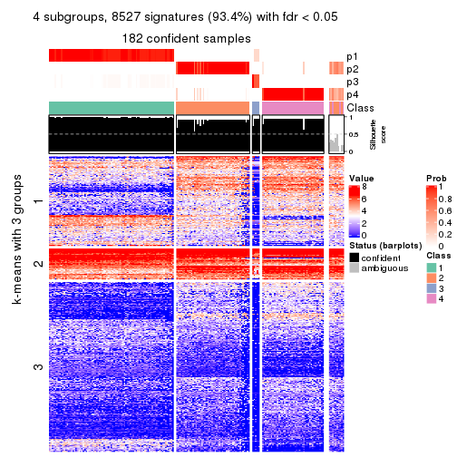</p>

</div>
<div id='tab-ATC-pam-get-signatures-no-scale-4'>
<pre><code class="r">get_signatures(res, k = 5, scale_rows = FALSE)
</code></pre>

<p></p>

</div>
<div id='tab-ATC-pam-get-signatures-no-scale-5'>
<pre><code class="r">get_signatures(res, k = 6, scale_rows = FALSE)
</code></pre>

<p></p>

</div>
</div>


Compare the overlap of signatures from different k:

```r
compare_signatures(res)
```


`get_signature()` returns a data frame invisibly. TO get the list of signatures, the function
call should be assigned to a variable explicitly. In following code, if `plot` argument is set
to `FALSE`, no heatmap is plotted while only the differential analysis is performed.

```r
# code only for demonstration
tb = get_signature(res, k = ..., plot = FALSE)
```

An example of the output of `tb` is:

```
#>   which_row         fdr    mean_1    mean_2 scaled_mean_1 scaled_mean_2 km
#> 1        38 0.042760348  8.373488  9.131774    -0.5533452     0.5164555  1
#> 2        40 0.018707592  7.106213  8.469186    -0.6173731     0.5762149  1
#> 3        55 0.019134737 10.221463 11.207825    -0.6159697     0.5749050  1
#> 4        59 0.006059896  5.921854  7.869574    -0.6899429     0.6439467  1
#> 5        60 0.018055526  8.928898 10.211722    -0.6204761     0.5791110  1
#> 6        98 0.009384629 15.714769 14.887706     0.6635654    -0.6193277  2
...
```

The columns in `tb` are:

1. `which_row`: row indices corresponding to the input matrix.
2. `fdr`: FDR for the differential test. 
3. `mean_x`: The mean value in group x.
4. `scaled_mean_x`: The mean value in group x after rows are scaled.
5. `km`: Row groups if k-means clustering is applied to rows.


UMAP plot which shows how samples are separated.


<script>
$( function() {
	$( '#tabs-ATC-pam-dimension-reduction' ).tabs();
} );
</script>
<div id='tabs-ATC-pam-dimension-reduction'>
<ul>
<li><a href='#tab-ATC-pam-dimension-reduction-1'>k = 2</a></li>
<li><a href='#tab-ATC-pam-dimension-reduction-2'>k = 3</a></li>
<li><a href='#tab-ATC-pam-dimension-reduction-3'>k = 4</a></li>
<li><a href='#tab-ATC-pam-dimension-reduction-4'>k = 5</a></li>
<li><a href='#tab-ATC-pam-dimension-reduction-5'>k = 6</a></li>
</ul>
<div id='tab-ATC-pam-dimension-reduction-1'>
<pre><code class="r">dimension_reduction(res, k = 2, method = &quot;UMAP&quot;)
</code></pre>

<p></p>

</div>
<div id='tab-ATC-pam-dimension-reduction-2'>
<pre><code class="r">dimension_reduction(res, k = 3, method = &quot;UMAP&quot;)
</code></pre>

<p></p>

</div>
<div id='tab-ATC-pam-dimension-reduction-3'>
<pre><code class="r">dimension_reduction(res, k = 4, method = &quot;UMAP&quot;)
</code></pre>

<p></p>

</div>
<div id='tab-ATC-pam-dimension-reduction-4'>
<pre><code class="r">dimension_reduction(res, k = 5, method = &quot;UMAP&quot;)
</code></pre>

<p></p>

</div>
<div id='tab-ATC-pam-dimension-reduction-5'>
<pre><code class="r">dimension_reduction(res, k = 6, method = &quot;UMAP&quot;)
</code></pre>

<p></p>

</div>
</div>


Following heatmap shows how subgroups are split when increasing `k`:

```r
collect_classes(res)
```


If matrix rows can be associated to genes, consider to use `functional_enrichment(res,
...)` to perform function enrichment for the signature genes. See [this vignette](http://bioconductor.org/packages/devel/bioc/vignettes/cola/inst/doc/functional_enrichment.html) for more detailed explanations.


 

---------------------------------------------------


### ATC:mclust**


The object with results only for a single top-value method and a single partition method 
can be extracted as:

```r
res = res_list["ATC", "mclust"]
# you can also extract it by
# res = res_list["ATC:mclust"]
```

A summary of `res` and all the functions that can be applied to it:

```r
res
```

```
#> A 'ConsensusPartition' object with k = 2, 3, 4, 5, 6.
#>   On a matrix with 9126 rows and 192 columns.
#>   Top rows (913, 1826, 2738, 3650, 4563) are extracted by 'ATC' method.
#>   Subgroups are detected by 'mclust' method.
#>   Performed in total 1250 partitions by row resampling.
#>   Best k for subgroups seems to be 4.
#> 
#> Following methods can be applied to this 'ConsensusPartition' object:
#>  [1] "cola_report"             "collect_classes"         "collect_plots"          
#>  [4] "collect_stats"           "colnames"                "compare_signatures"     
#>  [7] "consensus_heatmap"       "dimension_reduction"     "functional_enrichment"  
#> [10] "get_anno_col"            "get_anno"                "get_classes"            
#> [13] "get_consensus"           "get_matrix"              "get_membership"         
#> [16] "get_param"               "get_signatures"          "get_stats"              
#> [19] "is_best_k"               "is_stable_k"             "membership_heatmap"     
#> [22] "ncol"                    "nrow"                    "plot_ecdf"              
#> [25] "rownames"                "select_partition_number" "show"                   
#> [28] "suggest_best_k"          "test_to_known_factors"
```

`collect_plots()` function collects all the plots made from `res` for all `k` (number of partitions)
into one single page to provide an easy and fast comparison between different `k`.

```r
collect_plots(res)
```


The plots are:

- The first row: a plot of the ECDF (empirical cumulative distribution
  function) curves of the consensus matrix for each `k` and the heatmap of
  predicted classes for each `k`.
- The second row: heatmaps of the consensus matrix for each `k`.
- The third row: heatmaps of the membership matrix for each `k`.
- The fouth row: heatmaps of the signatures for each `k`.

All the plots in panels can be made by individual functions and they are
plotted later in this section.

`select_partition_number()` produces several plots showing different
statistics for choosing "optimized" `k`. There are following statistics:

- ECDF curves of the consensus matrix for each `k`;
- 1-PAC. [The PAC
  score](https://en.wikipedia.org/wiki/Consensus_clustering#Over-interpretation_potential_of_consensus_clustering)
  measures the proportion of the ambiguous subgrouping.
- Mean silhouette score.
- Concordance. The mean probability of fiting the consensus class ids in all
  partitions.
- Area increased. Denote $A_k$ as the area under the ECDF curve for current
  `k`, the area increased is defined as $A_k - A_{k-1}$.
- Rand index. The percent of pairs of samples that are both in a same cluster
  or both are not in a same cluster in the partition of k and k-1.
- Jaccard index. The ratio of pairs of samples are both in a same cluster in
  the partition of k and k-1 and the pairs of samples are both in a same
  cluster in the partition k or k-1.

The detailed explanations of these statistics can be found in [the _cola_
vignette](http://bioconductor.org/packages/devel/bioc/vignettes/cola/inst/doc/cola.html#toc_13).

Generally speaking, lower PAC score, higher mean silhouette score or higher
concordance corresponds to better partition. Rand index and Jaccard index
measure how similar the current partition is compared to partition with `k-1`.
If they are too similar, we won't accept `k` is better than `k-1`.

```r
select_partition_number(res)
```


The numeric values for all these statistics can be obtained by `get_stats()`.

```r
get_stats(res)
```

```
#>   k 1-PAC mean_silhouette concordance area_increased  Rand Jaccard
#> 2 2 1.000           0.992       0.997         0.4930 0.507   0.507
#> 3 3 0.828           0.916       0.917         0.2749 0.838   0.680
#> 4 4 1.000           0.966       0.984         0.0988 0.964   0.895
#> 5 5 0.882           0.913       0.920         0.0441 0.996   0.986
#> 6 6 0.824           0.830       0.880         0.0626 0.927   0.759
```

`suggest_best_k()` suggests the best $k$ based on these statistics. The rules are as follows:

- All $k$ with Jaccard index larger than 0.95 are removed because increasing
  $k$ does not provide enough extra information. If all $k$ are removed, it is
  marked as no subgroup is detected.
- For all $k$ with 1-PAC score larger than 0.9, the maximal $k$ is taken as
  the best $k$, and other $k$ are marked as optional $k$.
- If it does not fit the second rule. The $k$ with the maximal vote of the
  highest 1-PAC score, highest mean silhouette, and highest concordance is
  taken as the best $k$.

```r
suggest_best_k(res)
```

```
#> [1] 4
#> attr(,"optional")
#> [1] 2
```

There is also optional best $k$ = 2 that is worth to check.

Following shows the table of the partitions (You need to click the **show/hide
code output** link to see it). The membership matrix (columns with name `p*`)
is inferred by
[`clue::cl_consensus()`](https://www.rdocumentation.org/link/cl_consensus?package=clue)
function with the `SE` method. Basically the value in the membership matrix
represents the probability to belong to a certain group. The finall class
label for an item is determined with the group with highest probability it
belongs to.

In `get_classes()` function, the entropy is calculated from the membership
matrix and the silhouette score is calculated from the consensus matrix.


<script>
$( function() {
	$( '#tabs-ATC-mclust-get-classes' ).tabs();
} );
</script>
<div id='tabs-ATC-mclust-get-classes'>
<ul>
<li><a href='#tab-ATC-mclust-get-classes-1'>k = 2</a></li>
<li><a href='#tab-ATC-mclust-get-classes-2'>k = 3</a></li>
<li><a href='#tab-ATC-mclust-get-classes-3'>k = 4</a></li>
<li><a href='#tab-ATC-mclust-get-classes-4'>k = 5</a></li>
<li><a href='#tab-ATC-mclust-get-classes-5'>k = 6</a></li>
</ul>

<div id='tab-ATC-mclust-get-classes-1'>
<p><a id='tab-ATC-mclust-get-classes-1-a' style='color:#0366d6' href='#'>show/hide code output</a></p>
<pre><code class="r">cbind(get_classes(res, k = 2), get_membership(res, k = 2))
</code></pre>

<pre><code>#&gt;            class entropy silhouette    p1    p2
#&gt; SRR2074921     2  0.0000      1.000 0.000 1.000
#&gt; SRR2074919     2  0.0000      1.000 0.000 1.000
#&gt; SRR2074920     2  0.0000      1.000 0.000 1.000
#&gt; SRR2074917     2  0.0376      0.996 0.004 0.996
#&gt; SRR2074918     2  0.0000      1.000 0.000 1.000
#&gt; SRR2074916     2  0.0000      1.000 0.000 1.000
#&gt; SRR2074915     2  0.0000      1.000 0.000 1.000
#&gt; SRR2074914     1  0.0000      0.993 1.000 0.000
#&gt; SRR2074913     2  0.0000      1.000 0.000 1.000
#&gt; SRR2074912     2  0.0000      1.000 0.000 1.000
#&gt; SRR2074911     2  0.0000      1.000 0.000 1.000
#&gt; SRR2074910     2  0.0000      1.000 0.000 1.000
#&gt; SRR2074909     1  0.0000      0.993 1.000 0.000
#&gt; SRR2074907     1  0.0000      0.993 1.000 0.000
#&gt; SRR2074908     2  0.0000      1.000 0.000 1.000
#&gt; SRR2074906     2  0.0000      1.000 0.000 1.000
#&gt; SRR2074905     1  0.0000      0.993 1.000 0.000
#&gt; SRR2074904     2  0.0000      1.000 0.000 1.000
#&gt; SRR2074903     2  0.0000      1.000 0.000 1.000
#&gt; SRR2074902     1  0.0000      0.993 1.000 0.000
#&gt; SRR2074901     2  0.0000      1.000 0.000 1.000
#&gt; SRR2074900     1  0.0000      0.993 1.000 0.000
#&gt; SRR2074899     2  0.0000      1.000 0.000 1.000
#&gt; SRR2074898     2  0.0000      1.000 0.000 1.000
#&gt; SRR2074897     2  0.0000      1.000 0.000 1.000
#&gt; SRR2074896     2  0.0000      1.000 0.000 1.000
#&gt; SRR2074895     1  0.0000      0.993 1.000 0.000
#&gt; SRR2074894     2  0.0000      1.000 0.000 1.000
#&gt; SRR2074893     2  0.0000      1.000 0.000 1.000
#&gt; SRR2074892     1  0.0000      0.993 1.000 0.000
#&gt; SRR2074891     1  0.0000      0.993 1.000 0.000
#&gt; SRR2074890     2  0.0000      1.000 0.000 1.000
#&gt; SRR2074887     2  0.0000      1.000 0.000 1.000
#&gt; SRR2074889     2  0.0000      1.000 0.000 1.000
#&gt; SRR2074886     2  0.0000      1.000 0.000 1.000
#&gt; SRR2074888     2  0.0000      1.000 0.000 1.000
#&gt; SRR2074885     1  0.0000      0.993 1.000 0.000
#&gt; SRR2074884     2  0.0000      1.000 0.000 1.000
#&gt; SRR2074883     2  0.0000      1.000 0.000 1.000
#&gt; SRR2074882     1  0.0000      0.993 1.000 0.000
#&gt; SRR2074880     2  0.0000      1.000 0.000 1.000
#&gt; SRR2074881     2  0.0000      1.000 0.000 1.000
#&gt; SRR2074879     2  0.0000      1.000 0.000 1.000
#&gt; SRR2074878     1  0.0000      0.993 1.000 0.000
#&gt; SRR2074877     2  0.0000      1.000 0.000 1.000
#&gt; SRR2074876     1  0.0000      0.993 1.000 0.000
#&gt; SRR2074875     2  0.0000      1.000 0.000 1.000
#&gt; SRR2074874     1  0.0000      0.993 1.000 0.000
#&gt; SRR2074873     2  0.0000      1.000 0.000 1.000
#&gt; SRR2074872     1  0.0000      0.993 1.000 0.000
#&gt; SRR2074871     2  0.0000      1.000 0.000 1.000
#&gt; SRR2074870     1  0.0000      0.993 1.000 0.000
#&gt; SRR2074869     1  0.0000      0.993 1.000 0.000
#&gt; SRR2074868     1  0.0000      0.993 1.000 0.000
#&gt; SRR2074867     2  0.0000      1.000 0.000 1.000
#&gt; SRR2074866     2  0.0000      1.000 0.000 1.000
#&gt; SRR2074865     1  0.0000      0.993 1.000 0.000
#&gt; SRR2074864     1  0.0000      0.993 1.000 0.000
#&gt; SRR2074863     1  0.0000      0.993 1.000 0.000
#&gt; SRR2074862     1  0.0000      0.993 1.000 0.000
#&gt; SRR2074861     1  0.0000      0.993 1.000 0.000
#&gt; SRR2074860     1  0.0000      0.993 1.000 0.000
#&gt; SRR2074859     1  0.0000      0.993 1.000 0.000
#&gt; SRR2074858     2  0.0000      1.000 0.000 1.000
#&gt; SRR2074855     2  0.0000      1.000 0.000 1.000
#&gt; SRR2074857     1  0.0000      0.993 1.000 0.000
#&gt; SRR2074856     1  0.0000      0.993 1.000 0.000
#&gt; SRR2074854     1  0.0000      0.993 1.000 0.000
#&gt; SRR2074853     1  0.0000      0.993 1.000 0.000
#&gt; SRR2074852     2  0.0000      1.000 0.000 1.000
#&gt; SRR2074851     1  0.0000      0.993 1.000 0.000
#&gt; SRR2074850     1  0.0000      0.993 1.000 0.000
#&gt; SRR2074849     1  0.0000      0.993 1.000 0.000
#&gt; SRR2074848     1  0.0000      0.993 1.000 0.000
#&gt; SRR2074847     1  0.0000      0.993 1.000 0.000
#&gt; SRR2074846     1  0.8909      0.560 0.692 0.308
#&gt; SRR2074845     1  0.0000      0.993 1.000 0.000
#&gt; SRR2074843     1  0.0000      0.993 1.000 0.000
#&gt; SRR2074842     2  0.0000      1.000 0.000 1.000
#&gt; SRR2074844     2  0.0000      1.000 0.000 1.000
#&gt; SRR2074841     2  0.0000      1.000 0.000 1.000
#&gt; SRR2074840     2  0.0000      1.000 0.000 1.000
#&gt; SRR2074839     1  0.0000      0.993 1.000 0.000
#&gt; SRR2074838     2  0.0000      1.000 0.000 1.000
#&gt; SRR2074836     2  0.0000      1.000 0.000 1.000
#&gt; SRR2074835     2  0.0000      1.000 0.000 1.000
#&gt; SRR2074837     1  0.0000      0.993 1.000 0.000
#&gt; SRR2074834     2  0.0000      1.000 0.000 1.000
#&gt; SRR2074833     1  0.0000      0.993 1.000 0.000
#&gt; SRR2074832     2  0.0000      1.000 0.000 1.000
#&gt; SRR2074831     1  0.0000      0.993 1.000 0.000
#&gt; SRR2074829     1  0.0000      0.993 1.000 0.000
#&gt; SRR2074830     1  0.0000      0.993 1.000 0.000
#&gt; SRR2074828     1  0.0000      0.993 1.000 0.000
#&gt; SRR2074827     2  0.0000      1.000 0.000 1.000
#&gt; SRR2074826     2  0.0000      1.000 0.000 1.000
#&gt; SRR2074825     2  0.0000      1.000 0.000 1.000
#&gt; SRR2074824     2  0.0000      1.000 0.000 1.000
#&gt; SRR2074823     1  0.0000      0.993 1.000 0.000
#&gt; SRR2074822     2  0.0000      1.000 0.000 1.000
#&gt; SRR2074821     2  0.0000      1.000 0.000 1.000
#&gt; SRR2074820     2  0.0000      1.000 0.000 1.000
#&gt; SRR2074819     2  0.0000      1.000 0.000 1.000
#&gt; SRR2074817     2  0.0000      1.000 0.000 1.000
#&gt; SRR2074818     2  0.0000      1.000 0.000 1.000
#&gt; SRR2074816     1  0.0000      0.993 1.000 0.000
#&gt; SRR2074815     2  0.0000      1.000 0.000 1.000
#&gt; SRR2074814     1  0.0000      0.993 1.000 0.000
#&gt; SRR2074812     2  0.0000      1.000 0.000 1.000
#&gt; SRR2074813     2  0.0000      1.000 0.000 1.000
#&gt; SRR2074809     2  0.0000      1.000 0.000 1.000
#&gt; SRR2074810     2  0.0000      1.000 0.000 1.000
#&gt; SRR2074811     2  0.0000      1.000 0.000 1.000
#&gt; SRR2074808     2  0.0000      1.000 0.000 1.000
#&gt; SRR2074807     2  0.0000      1.000 0.000 1.000
#&gt; SRR2074806     1  0.0000      0.993 1.000 0.000
#&gt; SRR2074805     2  0.0000      1.000 0.000 1.000
#&gt; SRR2074804     1  0.0000      0.993 1.000 0.000
#&gt; SRR2074803     1  0.0000      0.993 1.000 0.000
#&gt; SRR2074801     1  0.0000      0.993 1.000 0.000
#&gt; SRR2074802     2  0.0000      1.000 0.000 1.000
#&gt; SRR2074799     2  0.0000      1.000 0.000 1.000
#&gt; SRR2074800     1  0.0000      0.993 1.000 0.000
#&gt; SRR2074798     1  0.0000      0.993 1.000 0.000
#&gt; SRR2074797     1  0.0000      0.993 1.000 0.000
#&gt; SRR2074795     2  0.0000      1.000 0.000 1.000
#&gt; SRR2074796     2  0.0000      1.000 0.000 1.000
#&gt; SRR2074794     2  0.0000      1.000 0.000 1.000
#&gt; SRR2074793     2  0.0000      1.000 0.000 1.000
#&gt; SRR2074792     1  0.0000      0.993 1.000 0.000
#&gt; SRR2074791     1  0.0000      0.993 1.000 0.000
#&gt; SRR2074790     2  0.0000      1.000 0.000 1.000
#&gt; SRR2074789     1  0.0000      0.993 1.000 0.000
#&gt; SRR2074788     1  0.0000      0.993 1.000 0.000
#&gt; SRR2074787     1  0.0000      0.993 1.000 0.000
#&gt; SRR2074786     2  0.0000      1.000 0.000 1.000
#&gt; SRR2074785     1  0.0000      0.993 1.000 0.000
#&gt; SRR2074784     1  0.0000      0.993 1.000 0.000
#&gt; SRR2074783     2  0.0000      1.000 0.000 1.000
#&gt; SRR2074782     1  0.0000      0.993 1.000 0.000
#&gt; SRR2074779     2  0.0000      1.000 0.000 1.000
#&gt; SRR2074781     2  0.0000      1.000 0.000 1.000
#&gt; SRR2074780     1  0.0000      0.993 1.000 0.000
#&gt; SRR2074778     2  0.0000      1.000 0.000 1.000
#&gt; SRR2074777     2  0.0000      1.000 0.000 1.000
#&gt; SRR2074776     2  0.0000      1.000 0.000 1.000
#&gt; SRR2074775     1  0.8763      0.584 0.704 0.296
#&gt; SRR2074774     1  0.0000      0.993 1.000 0.000
#&gt; SRR2074773     2  0.0000      1.000 0.000 1.000
#&gt; SRR2074771     2  0.0000      1.000 0.000 1.000
#&gt; SRR2074772     1  0.0000      0.993 1.000 0.000
#&gt; SRR2074770     1  0.0000      0.993 1.000 0.000
#&gt; SRR2074769     2  0.0000      1.000 0.000 1.000
#&gt; SRR2074768     2  0.0000      1.000 0.000 1.000
#&gt; SRR2074766     2  0.0000      1.000 0.000 1.000
#&gt; SRR2074767     1  0.0000      0.993 1.000 0.000
#&gt; SRR2074765     1  0.0000      0.993 1.000 0.000
#&gt; SRR2074764     2  0.0000      1.000 0.000 1.000
#&gt; SRR2074763     2  0.0000      1.000 0.000 1.000
#&gt; SRR2074761     1  0.0000      0.993 1.000 0.000
#&gt; SRR2074762     2  0.0000      1.000 0.000 1.000
#&gt; SRR2074760     2  0.0000      1.000 0.000 1.000
#&gt; SRR2074759     1  0.0000      0.993 1.000 0.000
#&gt; SRR2074757     2  0.0000      1.000 0.000 1.000
#&gt; SRR2074758     2  0.0000      1.000 0.000 1.000
#&gt; SRR2074756     2  0.0000      1.000 0.000 1.000
#&gt; SRR2074755     1  0.0000      0.993 1.000 0.000
#&gt; SRR2074754     1  0.0000      0.993 1.000 0.000
#&gt; SRR2074753     2  0.0000      1.000 0.000 1.000
#&gt; SRR2074752     1  0.0000      0.993 1.000 0.000
#&gt; SRR2074751     1  0.0000      0.993 1.000 0.000
#&gt; SRR2074749     2  0.0000      1.000 0.000 1.000
#&gt; SRR2074750     1  0.0000      0.993 1.000 0.000
#&gt; SRR2074748     1  0.0000      0.993 1.000 0.000
#&gt; SRR2074747     2  0.0000      1.000 0.000 1.000
#&gt; SRR2074745     1  0.0000      0.993 1.000 0.000
#&gt; SRR2074746     2  0.0000      1.000 0.000 1.000
#&gt; SRR2074744     2  0.0000      1.000 0.000 1.000
#&gt; SRR2074743     2  0.0000      1.000 0.000 1.000
#&gt; SRR2074742     2  0.0000      1.000 0.000 1.000
#&gt; SRR2074741     1  0.0000      0.993 1.000 0.000
#&gt; SRR2074740     2  0.0000      1.000 0.000 1.000
#&gt; SRR2074739     1  0.0000      0.993 1.000 0.000
#&gt; SRR2074738     2  0.0000      1.000 0.000 1.000
#&gt; SRR2074737     2  0.0000      1.000 0.000 1.000
#&gt; SRR2074736     2  0.0000      1.000 0.000 1.000
#&gt; SRR2074735     1  0.0000      0.993 1.000 0.000
#&gt; SRR2074734     2  0.0000      1.000 0.000 1.000
#&gt; SRR2074733     1  0.0000      0.993 1.000 0.000
#&gt; SRR2074732     2  0.0000      1.000 0.000 1.000
#&gt; SRR2074731     2  0.0000      1.000 0.000 1.000
#&gt; SRR2074730     1  0.0000      0.993 1.000 0.000
</code></pre>

<script>
$('#tab-ATC-mclust-get-classes-1-a').parent().next().next().hide();
$('#tab-ATC-mclust-get-classes-1-a').click(function(){
  $('#tab-ATC-mclust-get-classes-1-a').parent().next().next().toggle();
  return(false);
});
</script>
</div>

<div id='tab-ATC-mclust-get-classes-2'>
<p><a id='tab-ATC-mclust-get-classes-2-a' style='color:#0366d6' href='#'>show/hide code output</a></p>
<pre><code class="r">cbind(get_classes(res, k = 3), get_membership(res, k = 3))
</code></pre>

<pre><code>#&gt;            class entropy silhouette    p1    p2    p3
#&gt; SRR2074921     3  0.2625      0.669 0.000 0.084 0.916
#&gt; SRR2074919     3  0.2625      0.669 0.000 0.084 0.916
#&gt; SRR2074920     3  0.2625      0.669 0.000 0.084 0.916
#&gt; SRR2074917     3  0.2625      0.669 0.000 0.084 0.916
#&gt; SRR2074918     3  0.2625      0.669 0.000 0.084 0.916
#&gt; SRR2074916     3  0.3752      0.699 0.000 0.144 0.856
#&gt; SRR2074915     3  0.3941      0.703 0.000 0.156 0.844
#&gt; SRR2074914     1  0.0000      0.992 1.000 0.000 0.000
#&gt; SRR2074913     3  0.3686      0.697 0.000 0.140 0.860
#&gt; SRR2074912     3  0.2625      0.669 0.000 0.084 0.916
#&gt; SRR2074911     3  0.2625      0.669 0.000 0.084 0.916
#&gt; SRR2074910     3  0.2625      0.669 0.000 0.084 0.916
#&gt; SRR2074909     1  0.0000      0.992 1.000 0.000 0.000
#&gt; SRR2074907     1  0.0000      0.992 1.000 0.000 0.000
#&gt; SRR2074908     2  0.0000      0.974 0.000 1.000 0.000
#&gt; SRR2074906     3  0.5706      0.851 0.000 0.320 0.680
#&gt; SRR2074905     1  0.0000      0.992 1.000 0.000 0.000
#&gt; SRR2074904     2  0.0000      0.974 0.000 1.000 0.000
#&gt; SRR2074903     2  0.0000      0.974 0.000 1.000 0.000
#&gt; SRR2074902     1  0.0000      0.992 1.000 0.000 0.000
#&gt; SRR2074901     2  0.0000      0.974 0.000 1.000 0.000
#&gt; SRR2074900     1  0.0000      0.992 1.000 0.000 0.000
#&gt; SRR2074899     2  0.0000      0.974 0.000 1.000 0.000
#&gt; SRR2074898     3  0.5706      0.851 0.000 0.320 0.680
#&gt; SRR2074897     3  0.5706      0.851 0.000 0.320 0.680
#&gt; SRR2074896     2  0.0000      0.974 0.000 1.000 0.000
#&gt; SRR2074895     1  0.0000      0.992 1.000 0.000 0.000
#&gt; SRR2074894     3  0.3816      0.700 0.000 0.148 0.852
#&gt; SRR2074893     2  0.0000      0.974 0.000 1.000 0.000
#&gt; SRR2074892     1  0.0000      0.992 1.000 0.000 0.000
#&gt; SRR2074891     1  0.0000      0.992 1.000 0.000 0.000
#&gt; SRR2074890     2  0.0000      0.974 0.000 1.000 0.000
#&gt; SRR2074887     2  0.0000      0.974 0.000 1.000 0.000
#&gt; SRR2074889     3  0.5706      0.851 0.000 0.320 0.680
#&gt; SRR2074886     2  0.0000      0.974 0.000 1.000 0.000
#&gt; SRR2074888     3  0.5706      0.851 0.000 0.320 0.680
#&gt; SRR2074885     1  0.0000      0.992 1.000 0.000 0.000
#&gt; SRR2074884     3  0.5706      0.851 0.000 0.320 0.680
#&gt; SRR2074883     3  0.5706      0.851 0.000 0.320 0.680
#&gt; SRR2074882     1  0.0000      0.992 1.000 0.000 0.000
#&gt; SRR2074880     3  0.5706      0.851 0.000 0.320 0.680
#&gt; SRR2074881     2  0.0000      0.974 0.000 1.000 0.000
#&gt; SRR2074879     3  0.2625      0.669 0.000 0.084 0.916
#&gt; SRR2074878     1  0.0000      0.992 1.000 0.000 0.000
#&gt; SRR2074877     2  0.4796      0.545 0.000 0.780 0.220
#&gt; SRR2074876     1  0.0000      0.992 1.000 0.000 0.000
#&gt; SRR2074875     3  0.5706      0.851 0.000 0.320 0.680
#&gt; SRR2074874     1  0.0000      0.992 1.000 0.000 0.000
#&gt; SRR2074873     3  0.5706      0.851 0.000 0.320 0.680
#&gt; SRR2074872     1  0.0000      0.992 1.000 0.000 0.000
#&gt; SRR2074871     2  0.0000      0.974 0.000 1.000 0.000
#&gt; SRR2074870     1  0.0000      0.992 1.000 0.000 0.000
#&gt; SRR2074869     1  0.0000      0.992 1.000 0.000 0.000
#&gt; SRR2074868     1  0.0000      0.992 1.000 0.000 0.000
#&gt; SRR2074867     2  0.0000      0.974 0.000 1.000 0.000
#&gt; SRR2074866     2  0.4452      0.622 0.000 0.808 0.192
#&gt; SRR2074865     1  0.0000      0.992 1.000 0.000 0.000
#&gt; SRR2074864     1  0.0000      0.992 1.000 0.000 0.000
#&gt; SRR2074863     1  0.0000      0.992 1.000 0.000 0.000
#&gt; SRR2074862     1  0.0000      0.992 1.000 0.000 0.000
#&gt; SRR2074861     1  0.0000      0.992 1.000 0.000 0.000
#&gt; SRR2074860     1  0.0747      0.978 0.984 0.000 0.016
#&gt; SRR2074859     1  0.0000      0.992 1.000 0.000 0.000
#&gt; SRR2074858     2  0.0000      0.974 0.000 1.000 0.000
#&gt; SRR2074855     3  0.5706      0.851 0.000 0.320 0.680
#&gt; SRR2074857     1  0.0000      0.992 1.000 0.000 0.000
#&gt; SRR2074856     1  0.0000      0.992 1.000 0.000 0.000
#&gt; SRR2074854     1  0.0000      0.992 1.000 0.000 0.000
#&gt; SRR2074853     1  0.0000      0.992 1.000 0.000 0.000
#&gt; SRR2074852     3  0.5706      0.851 0.000 0.320 0.680
#&gt; SRR2074851     1  0.0000      0.992 1.000 0.000 0.000
#&gt; SRR2074850     1  0.0000      0.992 1.000 0.000 0.000
#&gt; SRR2074849     1  0.0000      0.992 1.000 0.000 0.000
#&gt; SRR2074848     1  0.0000      0.992 1.000 0.000 0.000
#&gt; SRR2074847     1  0.0000      0.992 1.000 0.000 0.000
#&gt; SRR2074846     1  0.6318      0.483 0.636 0.008 0.356
#&gt; SRR2074845     1  0.0000      0.992 1.000 0.000 0.000
#&gt; SRR2074843     1  0.0000      0.992 1.000 0.000 0.000
#&gt; SRR2074842     2  0.0000      0.974 0.000 1.000 0.000
#&gt; SRR2074844     2  0.0000      0.974 0.000 1.000 0.000
#&gt; SRR2074841     3  0.5706      0.851 0.000 0.320 0.680
#&gt; SRR2074840     3  0.5706      0.851 0.000 0.320 0.680
#&gt; SRR2074839     1  0.0000      0.992 1.000 0.000 0.000
#&gt; SRR2074838     3  0.5706      0.851 0.000 0.320 0.680
#&gt; SRR2074836     2  0.0000      0.974 0.000 1.000 0.000
#&gt; SRR2074835     3  0.5706      0.851 0.000 0.320 0.680
#&gt; SRR2074837     1  0.0000      0.992 1.000 0.000 0.000
#&gt; SRR2074834     2  0.0000      0.974 0.000 1.000 0.000
#&gt; SRR2074833     1  0.0000      0.992 1.000 0.000 0.000
#&gt; SRR2074832     2  0.2066      0.890 0.000 0.940 0.060
#&gt; SRR2074831     1  0.0000      0.992 1.000 0.000 0.000
#&gt; SRR2074829     1  0.0000      0.992 1.000 0.000 0.000
#&gt; SRR2074830     1  0.0000      0.992 1.000 0.000 0.000
#&gt; SRR2074828     1  0.0000      0.992 1.000 0.000 0.000
#&gt; SRR2074827     2  0.0000      0.974 0.000 1.000 0.000
#&gt; SRR2074826     2  0.0000      0.974 0.000 1.000 0.000
#&gt; SRR2074825     3  0.5706      0.851 0.000 0.320 0.680
#&gt; SRR2074824     3  0.5706      0.851 0.000 0.320 0.680
#&gt; SRR2074823     1  0.0000      0.992 1.000 0.000 0.000
#&gt; SRR2074822     3  0.5706      0.851 0.000 0.320 0.680
#&gt; SRR2074821     3  0.5988      0.759 0.000 0.368 0.632
#&gt; SRR2074820     3  0.5706      0.851 0.000 0.320 0.680
#&gt; SRR2074819     2  0.0000      0.974 0.000 1.000 0.000
#&gt; SRR2074817     2  0.0000      0.974 0.000 1.000 0.000
#&gt; SRR2074818     3  0.5835      0.829 0.000 0.340 0.660
#&gt; SRR2074816     1  0.0000      0.992 1.000 0.000 0.000
#&gt; SRR2074815     2  0.3412      0.776 0.000 0.876 0.124
#&gt; SRR2074814     1  0.0000      0.992 1.000 0.000 0.000
#&gt; SRR2074812     3  0.5706      0.851 0.000 0.320 0.680
#&gt; SRR2074813     3  0.6111      0.756 0.000 0.396 0.604
#&gt; SRR2074809     3  0.5706      0.851 0.000 0.320 0.680
#&gt; SRR2074810     2  0.0000      0.974 0.000 1.000 0.000
#&gt; SRR2074811     3  0.5706      0.851 0.000 0.320 0.680
#&gt; SRR2074808     2  0.0000      0.974 0.000 1.000 0.000
#&gt; SRR2074807     2  0.0000      0.974 0.000 1.000 0.000
#&gt; SRR2074806     1  0.0000      0.992 1.000 0.000 0.000
#&gt; SRR2074805     3  0.5706      0.851 0.000 0.320 0.680
#&gt; SRR2074804     1  0.0000      0.992 1.000 0.000 0.000
#&gt; SRR2074803     1  0.0000      0.992 1.000 0.000 0.000
#&gt; SRR2074801     1  0.0000      0.992 1.000 0.000 0.000
#&gt; SRR2074802     2  0.0000      0.974 0.000 1.000 0.000
#&gt; SRR2074799     3  0.5706      0.851 0.000 0.320 0.680
#&gt; SRR2074800     1  0.0000      0.992 1.000 0.000 0.000
#&gt; SRR2074798     1  0.0000      0.992 1.000 0.000 0.000
#&gt; SRR2074797     1  0.0000      0.992 1.000 0.000 0.000
#&gt; SRR2074795     3  0.5706      0.851 0.000 0.320 0.680
#&gt; SRR2074796     2  0.0000      0.974 0.000 1.000 0.000
#&gt; SRR2074794     3  0.5706      0.851 0.000 0.320 0.680
#&gt; SRR2074793     2  0.0000      0.974 0.000 1.000 0.000
#&gt; SRR2074792     1  0.0000      0.992 1.000 0.000 0.000
#&gt; SRR2074791     1  0.0000      0.992 1.000 0.000 0.000
#&gt; SRR2074790     3  0.5706      0.851 0.000 0.320 0.680
#&gt; SRR2074789     1  0.0000      0.992 1.000 0.000 0.000
#&gt; SRR2074788     1  0.0000      0.992 1.000 0.000 0.000
#&gt; SRR2074787     1  0.0000      0.992 1.000 0.000 0.000
#&gt; SRR2074786     2  0.0000      0.974 0.000 1.000 0.000
#&gt; SRR2074785     1  0.0000      0.992 1.000 0.000 0.000
#&gt; SRR2074784     1  0.0000      0.992 1.000 0.000 0.000
#&gt; SRR2074783     3  0.5706      0.851 0.000 0.320 0.680
#&gt; SRR2074782     1  0.0000      0.992 1.000 0.000 0.000
#&gt; SRR2074779     2  0.0000      0.974 0.000 1.000 0.000
#&gt; SRR2074781     2  0.0237      0.969 0.000 0.996 0.004
#&gt; SRR2074780     1  0.0000      0.992 1.000 0.000 0.000
#&gt; SRR2074778     2  0.0000      0.974 0.000 1.000 0.000
#&gt; SRR2074777     2  0.0000      0.974 0.000 1.000 0.000
#&gt; SRR2074776     3  0.5706      0.851 0.000 0.320 0.680
#&gt; SRR2074775     1  0.6180      0.524 0.660 0.008 0.332
#&gt; SRR2074774     1  0.0000      0.992 1.000 0.000 0.000
#&gt; SRR2074773     2  0.0000      0.974 0.000 1.000 0.000
#&gt; SRR2074771     2  0.0000      0.974 0.000 1.000 0.000
#&gt; SRR2074772     1  0.0000      0.992 1.000 0.000 0.000
#&gt; SRR2074770     1  0.0000      0.992 1.000 0.000 0.000
#&gt; SRR2074769     3  0.5706      0.851 0.000 0.320 0.680
#&gt; SRR2074768     3  0.5706      0.851 0.000 0.320 0.680
#&gt; SRR2074766     2  0.0000      0.974 0.000 1.000 0.000
#&gt; SRR2074767     1  0.0000      0.992 1.000 0.000 0.000
#&gt; SRR2074765     1  0.0000      0.992 1.000 0.000 0.000
#&gt; SRR2074764     2  0.0000      0.974 0.000 1.000 0.000
#&gt; SRR2074763     3  0.5706      0.851 0.000 0.320 0.680
#&gt; SRR2074761     1  0.0000      0.992 1.000 0.000 0.000
#&gt; SRR2074762     2  0.0000      0.974 0.000 1.000 0.000
#&gt; SRR2074760     2  0.0000      0.974 0.000 1.000 0.000
#&gt; SRR2074759     1  0.0000      0.992 1.000 0.000 0.000
#&gt; SRR2074757     2  0.0000      0.974 0.000 1.000 0.000
#&gt; SRR2074758     3  0.5706      0.851 0.000 0.320 0.680
#&gt; SRR2074756     2  0.0000      0.974 0.000 1.000 0.000
#&gt; SRR2074755     1  0.0000      0.992 1.000 0.000 0.000
#&gt; SRR2074754     1  0.0000      0.992 1.000 0.000 0.000
#&gt; SRR2074753     3  0.3752      0.699 0.000 0.144 0.856
#&gt; SRR2074752     1  0.0000      0.992 1.000 0.000 0.000
#&gt; SRR2074751     1  0.0000      0.992 1.000 0.000 0.000
#&gt; SRR2074749     2  0.5706      0.178 0.000 0.680 0.320
#&gt; SRR2074750     1  0.0000      0.992 1.000 0.000 0.000
#&gt; SRR2074748     1  0.0000      0.992 1.000 0.000 0.000
#&gt; SRR2074747     2  0.0000      0.974 0.000 1.000 0.000
#&gt; SRR2074745     1  0.0000      0.992 1.000 0.000 0.000
#&gt; SRR2074746     3  0.2625      0.669 0.000 0.084 0.916
#&gt; SRR2074744     2  0.0000      0.974 0.000 1.000 0.000
#&gt; SRR2074743     2  0.0000      0.974 0.000 1.000 0.000
#&gt; SRR2074742     3  0.2625      0.669 0.000 0.084 0.916
#&gt; SRR2074741     1  0.0000      0.992 1.000 0.000 0.000
#&gt; SRR2074740     2  0.0000      0.974 0.000 1.000 0.000
#&gt; SRR2074739     1  0.0000      0.992 1.000 0.000 0.000
#&gt; SRR2074738     2  0.0000      0.974 0.000 1.000 0.000
#&gt; SRR2074737     2  0.0747      0.954 0.000 0.984 0.016
#&gt; SRR2074736     2  0.0000      0.974 0.000 1.000 0.000
#&gt; SRR2074735     1  0.0000      0.992 1.000 0.000 0.000
#&gt; SRR2074734     2  0.0000      0.974 0.000 1.000 0.000
#&gt; SRR2074733     1  0.0000      0.992 1.000 0.000 0.000
#&gt; SRR2074732     3  0.5706      0.851 0.000 0.320 0.680
#&gt; SRR2074731     3  0.5706      0.851 0.000 0.320 0.680
#&gt; SRR2074730     1  0.0000      0.992 1.000 0.000 0.000
</code></pre>

<script>
$('#tab-ATC-mclust-get-classes-2-a').parent().next().next().hide();
$('#tab-ATC-mclust-get-classes-2-a').click(function(){
  $('#tab-ATC-mclust-get-classes-2-a').parent().next().next().toggle();
  return(false);
});
</script>
</div>

<div id='tab-ATC-mclust-get-classes-3'>
<p><a id='tab-ATC-mclust-get-classes-3-a' style='color:#0366d6' href='#'>show/hide code output</a></p>
<pre><code class="r">cbind(get_classes(res, k = 4), get_membership(res, k = 4))
</code></pre>

<pre><code>#&gt;            class entropy silhouette    p1    p2    p3    p4
#&gt; SRR2074921     3  0.0000      0.868 0.000 0.000 1.000 0.000
#&gt; SRR2074919     3  0.0000      0.868 0.000 0.000 1.000 0.000
#&gt; SRR2074920     3  0.0000      0.868 0.000 0.000 1.000 0.000
#&gt; SRR2074917     3  0.0000      0.868 0.000 0.000 1.000 0.000
#&gt; SRR2074918     3  0.0000      0.868 0.000 0.000 1.000 0.000
#&gt; SRR2074916     3  0.5032      0.770 0.000 0.156 0.764 0.080
#&gt; SRR2074915     3  0.4331      0.672 0.000 0.288 0.712 0.000
#&gt; SRR2074914     1  0.0000      0.990 1.000 0.000 0.000 0.000
#&gt; SRR2074913     3  0.4697      0.560 0.000 0.356 0.644 0.000
#&gt; SRR2074912     3  0.0000      0.868 0.000 0.000 1.000 0.000
#&gt; SRR2074911     3  0.0000      0.868 0.000 0.000 1.000 0.000
#&gt; SRR2074910     3  0.2011      0.840 0.000 0.080 0.920 0.000
#&gt; SRR2074909     1  0.0000      0.990 1.000 0.000 0.000 0.000
#&gt; SRR2074907     1  0.0000      0.990 1.000 0.000 0.000 0.000
#&gt; SRR2074908     2  0.0000      1.000 0.000 1.000 0.000 0.000
#&gt; SRR2074906     4  0.0000      0.998 0.000 0.000 0.000 1.000
#&gt; SRR2074905     1  0.0000      0.990 1.000 0.000 0.000 0.000
#&gt; SRR2074904     2  0.0000      1.000 0.000 1.000 0.000 0.000
#&gt; SRR2074903     2  0.0000      1.000 0.000 1.000 0.000 0.000
#&gt; SRR2074902     1  0.0000      0.990 1.000 0.000 0.000 0.000
#&gt; SRR2074901     2  0.0000      1.000 0.000 1.000 0.000 0.000
#&gt; SRR2074900     1  0.0000      0.990 1.000 0.000 0.000 0.000
#&gt; SRR2074899     2  0.0000      1.000 0.000 1.000 0.000 0.000
#&gt; SRR2074898     4  0.0000      0.998 0.000 0.000 0.000 1.000
#&gt; SRR2074897     4  0.0000      0.998 0.000 0.000 0.000 1.000
#&gt; SRR2074896     2  0.0000      1.000 0.000 1.000 0.000 0.000
#&gt; SRR2074895     1  0.0000      0.990 1.000 0.000 0.000 0.000
#&gt; SRR2074894     3  0.0000      0.868 0.000 0.000 1.000 0.000
#&gt; SRR2074893     2  0.0000      1.000 0.000 1.000 0.000 0.000
#&gt; SRR2074892     1  0.0000      0.990 1.000 0.000 0.000 0.000
#&gt; SRR2074891     1  0.0000      0.990 1.000 0.000 0.000 0.000
#&gt; SRR2074890     2  0.0000      1.000 0.000 1.000 0.000 0.000
#&gt; SRR2074887     2  0.0000      1.000 0.000 1.000 0.000 0.000
#&gt; SRR2074889     4  0.0000      0.998 0.000 0.000 0.000 1.000
#&gt; SRR2074886     2  0.0000      1.000 0.000 1.000 0.000 0.000
#&gt; SRR2074888     4  0.0000      0.998 0.000 0.000 0.000 1.000
#&gt; SRR2074885     1  0.0000      0.990 1.000 0.000 0.000 0.000
#&gt; SRR2074884     4  0.0000      0.998 0.000 0.000 0.000 1.000
#&gt; SRR2074883     4  0.0000      0.998 0.000 0.000 0.000 1.000
#&gt; SRR2074882     1  0.0000      0.990 1.000 0.000 0.000 0.000
#&gt; SRR2074880     4  0.0000      0.998 0.000 0.000 0.000 1.000
#&gt; SRR2074881     2  0.0000      1.000 0.000 1.000 0.000 0.000
#&gt; SRR2074879     3  0.0000      0.868 0.000 0.000 1.000 0.000
#&gt; SRR2074878     1  0.0000      0.990 1.000 0.000 0.000 0.000
#&gt; SRR2074877     2  0.0000      1.000 0.000 1.000 0.000 0.000
#&gt; SRR2074876     1  0.0000      0.990 1.000 0.000 0.000 0.000
#&gt; SRR2074875     4  0.0000      0.998 0.000 0.000 0.000 1.000
#&gt; SRR2074874     1  0.0000      0.990 1.000 0.000 0.000 0.000
#&gt; SRR2074873     4  0.0000      0.998 0.000 0.000 0.000 1.000
#&gt; SRR2074872     1  0.0000      0.990 1.000 0.000 0.000 0.000
#&gt; SRR2074871     2  0.0000      1.000 0.000 1.000 0.000 0.000
#&gt; SRR2074870     1  0.0000      0.990 1.000 0.000 0.000 0.000
#&gt; SRR2074869     1  0.0000      0.990 1.000 0.000 0.000 0.000
#&gt; SRR2074868     1  0.0000      0.990 1.000 0.000 0.000 0.000
#&gt; SRR2074867     2  0.0000      1.000 0.000 1.000 0.000 0.000
#&gt; SRR2074866     2  0.0188      0.995 0.000 0.996 0.004 0.000
#&gt; SRR2074865     1  0.0000      0.990 1.000 0.000 0.000 0.000
#&gt; SRR2074864     1  0.0000      0.990 1.000 0.000 0.000 0.000
#&gt; SRR2074863     1  0.0000      0.990 1.000 0.000 0.000 0.000
#&gt; SRR2074862     1  0.0000      0.990 1.000 0.000 0.000 0.000
#&gt; SRR2074861     1  0.0000      0.990 1.000 0.000 0.000 0.000
#&gt; SRR2074860     1  0.0336      0.982 0.992 0.000 0.008 0.000
#&gt; SRR2074859     1  0.0000      0.990 1.000 0.000 0.000 0.000
#&gt; SRR2074858     2  0.0000      1.000 0.000 1.000 0.000 0.000
#&gt; SRR2074855     4  0.0000      0.998 0.000 0.000 0.000 1.000
#&gt; SRR2074857     1  0.0000      0.990 1.000 0.000 0.000 0.000
#&gt; SRR2074856     1  0.0000      0.990 1.000 0.000 0.000 0.000
#&gt; SRR2074854     1  0.0000      0.990 1.000 0.000 0.000 0.000
#&gt; SRR2074853     1  0.0000      0.990 1.000 0.000 0.000 0.000
#&gt; SRR2074852     4  0.0000      0.998 0.000 0.000 0.000 1.000
#&gt; SRR2074851     1  0.0000      0.990 1.000 0.000 0.000 0.000
#&gt; SRR2074850     1  0.0000      0.990 1.000 0.000 0.000 0.000
#&gt; SRR2074849     1  0.0000      0.990 1.000 0.000 0.000 0.000
#&gt; SRR2074848     1  0.0000      0.990 1.000 0.000 0.000 0.000
#&gt; SRR2074847     1  0.0000      0.990 1.000 0.000 0.000 0.000
#&gt; SRR2074846     1  0.4907      0.293 0.580 0.000 0.420 0.000
#&gt; SRR2074845     1  0.0000      0.990 1.000 0.000 0.000 0.000
#&gt; SRR2074843     1  0.0000      0.990 1.000 0.000 0.000 0.000
#&gt; SRR2074842     2  0.0000      1.000 0.000 1.000 0.000 0.000
#&gt; SRR2074844     2  0.0000      1.000 0.000 1.000 0.000 0.000
#&gt; SRR2074841     4  0.0000      0.998 0.000 0.000 0.000 1.000
#&gt; SRR2074840     4  0.0000      0.998 0.000 0.000 0.000 1.000
#&gt; SRR2074839     1  0.0000      0.990 1.000 0.000 0.000 0.000
#&gt; SRR2074838     4  0.0000      0.998 0.000 0.000 0.000 1.000
#&gt; SRR2074836     2  0.0000      1.000 0.000 1.000 0.000 0.000
#&gt; SRR2074835     4  0.0000      0.998 0.000 0.000 0.000 1.000
#&gt; SRR2074837     1  0.0000      0.990 1.000 0.000 0.000 0.000
#&gt; SRR2074834     2  0.0000      1.000 0.000 1.000 0.000 0.000
#&gt; SRR2074833     1  0.0000      0.990 1.000 0.000 0.000 0.000
#&gt; SRR2074832     2  0.0000      1.000 0.000 1.000 0.000 0.000
#&gt; SRR2074831     1  0.0000      0.990 1.000 0.000 0.000 0.000
#&gt; SRR2074829     1  0.0000      0.990 1.000 0.000 0.000 0.000
#&gt; SRR2074830     1  0.0000      0.990 1.000 0.000 0.000 0.000
#&gt; SRR2074828     1  0.0000      0.990 1.000 0.000 0.000 0.000
#&gt; SRR2074827     2  0.0000      1.000 0.000 1.000 0.000 0.000
#&gt; SRR2074826     2  0.0000      1.000 0.000 1.000 0.000 0.000
#&gt; SRR2074825     4  0.0000      0.998 0.000 0.000 0.000 1.000
#&gt; SRR2074824     4  0.0000      0.998 0.000 0.000 0.000 1.000
#&gt; SRR2074823     1  0.0000      0.990 1.000 0.000 0.000 0.000
#&gt; SRR2074822     4  0.0000      0.998 0.000 0.000 0.000 1.000
#&gt; SRR2074821     3  0.4761      0.526 0.000 0.372 0.628 0.000
#&gt; SRR2074820     4  0.0000      0.998 0.000 0.000 0.000 1.000
#&gt; SRR2074819     2  0.0000      1.000 0.000 1.000 0.000 0.000
#&gt; SRR2074817     2  0.0000      1.000 0.000 1.000 0.000 0.000
#&gt; SRR2074818     4  0.1389      0.930 0.000 0.048 0.000 0.952
#&gt; SRR2074816     1  0.0000      0.990 1.000 0.000 0.000 0.000
#&gt; SRR2074815     2  0.0000      1.000 0.000 1.000 0.000 0.000
#&gt; SRR2074814     1  0.0000      0.990 1.000 0.000 0.000 0.000
#&gt; SRR2074812     4  0.0000      0.998 0.000 0.000 0.000 1.000
#&gt; SRR2074813     3  0.7281      0.318 0.000 0.152 0.468 0.380
#&gt; SRR2074809     4  0.0000      0.998 0.000 0.000 0.000 1.000
#&gt; SRR2074810     2  0.0000      1.000 0.000 1.000 0.000 0.000
#&gt; SRR2074811     4  0.0000      0.998 0.000 0.000 0.000 1.000
#&gt; SRR2074808     2  0.0000      1.000 0.000 1.000 0.000 0.000
#&gt; SRR2074807     2  0.0000      1.000 0.000 1.000 0.000 0.000
#&gt; SRR2074806     1  0.0000      0.990 1.000 0.000 0.000 0.000
#&gt; SRR2074805     4  0.0000      0.998 0.000 0.000 0.000 1.000
#&gt; SRR2074804     1  0.0000      0.990 1.000 0.000 0.000 0.000
#&gt; SRR2074803     1  0.0000      0.990 1.000 0.000 0.000 0.000
#&gt; SRR2074801     1  0.0000      0.990 1.000 0.000 0.000 0.000
#&gt; SRR2074802     2  0.0000      1.000 0.000 1.000 0.000 0.000
#&gt; SRR2074799     4  0.0000      0.998 0.000 0.000 0.000 1.000
#&gt; SRR2074800     1  0.0000      0.990 1.000 0.000 0.000 0.000
#&gt; SRR2074798     1  0.0000      0.990 1.000 0.000 0.000 0.000
#&gt; SRR2074797     1  0.0000      0.990 1.000 0.000 0.000 0.000
#&gt; SRR2074795     4  0.0000      0.998 0.000 0.000 0.000 1.000
#&gt; SRR2074796     2  0.0000      1.000 0.000 1.000 0.000 0.000
#&gt; SRR2074794     4  0.0000      0.998 0.000 0.000 0.000 1.000
#&gt; SRR2074793     2  0.0000      1.000 0.000 1.000 0.000 0.000
#&gt; SRR2074792     1  0.0000      0.990 1.000 0.000 0.000 0.000
#&gt; SRR2074791     1  0.0000      0.990 1.000 0.000 0.000 0.000
#&gt; SRR2074790     4  0.0000      0.998 0.000 0.000 0.000 1.000
#&gt; SRR2074789     1  0.0000      0.990 1.000 0.000 0.000 0.000
#&gt; SRR2074788     1  0.0000      0.990 1.000 0.000 0.000 0.000
#&gt; SRR2074787     1  0.0000      0.990 1.000 0.000 0.000 0.000
#&gt; SRR2074786     2  0.0000      1.000 0.000 1.000 0.000 0.000
#&gt; SRR2074785     1  0.0000      0.990 1.000 0.000 0.000 0.000
#&gt; SRR2074784     1  0.0000      0.990 1.000 0.000 0.000 0.000
#&gt; SRR2074783     4  0.0000      0.998 0.000 0.000 0.000 1.000
#&gt; SRR2074782     1  0.0000      0.990 1.000 0.000 0.000 0.000
#&gt; SRR2074779     2  0.0000      1.000 0.000 1.000 0.000 0.000
#&gt; SRR2074781     2  0.0000      1.000 0.000 1.000 0.000 0.000
#&gt; SRR2074780     1  0.0000      0.990 1.000 0.000 0.000 0.000
#&gt; SRR2074778     2  0.0000      1.000 0.000 1.000 0.000 0.000
#&gt; SRR2074777     2  0.0000      1.000 0.000 1.000 0.000 0.000
#&gt; SRR2074776     4  0.0000      0.998 0.000 0.000 0.000 1.000
#&gt; SRR2074775     1  0.4855      0.348 0.600 0.000 0.400 0.000
#&gt; SRR2074774     1  0.0000      0.990 1.000 0.000 0.000 0.000
#&gt; SRR2074773     2  0.0000      1.000 0.000 1.000 0.000 0.000
#&gt; SRR2074771     2  0.0000      1.000 0.000 1.000 0.000 0.000
#&gt; SRR2074772     1  0.0000      0.990 1.000 0.000 0.000 0.000
#&gt; SRR2074770     1  0.0000      0.990 1.000 0.000 0.000 0.000
#&gt; SRR2074769     4  0.0000      0.998 0.000 0.000 0.000 1.000
#&gt; SRR2074768     4  0.0188      0.994 0.000 0.000 0.004 0.996
#&gt; SRR2074766     2  0.0000      1.000 0.000 1.000 0.000 0.000
#&gt; SRR2074767     1  0.0000      0.990 1.000 0.000 0.000 0.000
#&gt; SRR2074765     1  0.0000      0.990 1.000 0.000 0.000 0.000
#&gt; SRR2074764     2  0.0000      1.000 0.000 1.000 0.000 0.000
#&gt; SRR2074763     4  0.0000      0.998 0.000 0.000 0.000 1.000
#&gt; SRR2074761     1  0.0000      0.990 1.000 0.000 0.000 0.000
#&gt; SRR2074762     2  0.0000      1.000 0.000 1.000 0.000 0.000
#&gt; SRR2074760     2  0.0000      1.000 0.000 1.000 0.000 0.000
#&gt; SRR2074759     1  0.0000      0.990 1.000 0.000 0.000 0.000
#&gt; SRR2074757     2  0.0000      1.000 0.000 1.000 0.000 0.000
#&gt; SRR2074758     4  0.0000      0.998 0.000 0.000 0.000 1.000
#&gt; SRR2074756     2  0.0000      1.000 0.000 1.000 0.000 0.000
#&gt; SRR2074755     1  0.0000      0.990 1.000 0.000 0.000 0.000
#&gt; SRR2074754     1  0.0000      0.990 1.000 0.000 0.000 0.000
#&gt; SRR2074753     3  0.4250      0.687 0.000 0.276 0.724 0.000
#&gt; SRR2074752     1  0.0000      0.990 1.000 0.000 0.000 0.000
#&gt; SRR2074751     1  0.0000      0.990 1.000 0.000 0.000 0.000
#&gt; SRR2074749     2  0.0000      1.000 0.000 1.000 0.000 0.000
#&gt; SRR2074750     1  0.0000      0.990 1.000 0.000 0.000 0.000
#&gt; SRR2074748     1  0.0000      0.990 1.000 0.000 0.000 0.000
#&gt; SRR2074747     2  0.0000      1.000 0.000 1.000 0.000 0.000
#&gt; SRR2074745     1  0.0000      0.990 1.000 0.000 0.000 0.000
#&gt; SRR2074746     3  0.0000      0.868 0.000 0.000 1.000 0.000
#&gt; SRR2074744     2  0.0000      1.000 0.000 1.000 0.000 0.000
#&gt; SRR2074743     2  0.0000      1.000 0.000 1.000 0.000 0.000
#&gt; SRR2074742     3  0.0000      0.868 0.000 0.000 1.000 0.000
#&gt; SRR2074741     1  0.0000      0.990 1.000 0.000 0.000 0.000
#&gt; SRR2074740     2  0.0000      1.000 0.000 1.000 0.000 0.000
#&gt; SRR2074739     1  0.0000      0.990 1.000 0.000 0.000 0.000
#&gt; SRR2074738     2  0.0000      1.000 0.000 1.000 0.000 0.000
#&gt; SRR2074737     2  0.0188      0.995 0.000 0.996 0.000 0.004
#&gt; SRR2074736     2  0.0000      1.000 0.000 1.000 0.000 0.000
#&gt; SRR2074735     1  0.0000      0.990 1.000 0.000 0.000 0.000
#&gt; SRR2074734     2  0.0000      1.000 0.000 1.000 0.000 0.000
#&gt; SRR2074733     1  0.0000      0.990 1.000 0.000 0.000 0.000
#&gt; SRR2074732     4  0.0188      0.993 0.000 0.004 0.000 0.996
#&gt; SRR2074731     4  0.0000      0.998 0.000 0.000 0.000 1.000
#&gt; SRR2074730     1  0.0000      0.990 1.000 0.000 0.000 0.000
</code></pre>

<script>
$('#tab-ATC-mclust-get-classes-3-a').parent().next().next().hide();
$('#tab-ATC-mclust-get-classes-3-a').click(function(){
  $('#tab-ATC-mclust-get-classes-3-a').parent().next().next().toggle();
  return(false);
});
</script>
</div>

<div id='tab-ATC-mclust-get-classes-4'>
<p><a id='tab-ATC-mclust-get-classes-4-a' style='color:#0366d6' href='#'>show/hide code output</a></p>
<pre><code class="r">cbind(get_classes(res, k = 5), get_membership(res, k = 5))
</code></pre>

<pre><code>#&gt;            class entropy silhouette    p1    p2    p3    p4    p5
#&gt; SRR2074921     3  0.0000      0.910 0.000 0.000 1.000 0.000 0.000
#&gt; SRR2074919     3  0.0000      0.910 0.000 0.000 1.000 0.000 0.000
#&gt; SRR2074920     3  0.0000      0.910 0.000 0.000 1.000 0.000 0.000
#&gt; SRR2074917     3  0.0000      0.910 0.000 0.000 1.000 0.000 0.000
#&gt; SRR2074918     3  0.1341      0.887 0.000 0.000 0.944 0.000 0.056
#&gt; SRR2074916     5  0.5657      0.597 0.000 0.084 0.300 0.008 0.608
#&gt; SRR2074915     5  0.5446      0.757 0.000 0.000 0.272 0.100 0.628
#&gt; SRR2074914     1  0.1851      0.915 0.912 0.000 0.000 0.000 0.088
#&gt; SRR2074913     5  0.5619      0.687 0.000 0.000 0.208 0.156 0.636
#&gt; SRR2074912     3  0.0000      0.910 0.000 0.000 1.000 0.000 0.000
#&gt; SRR2074911     3  0.4088      0.195 0.000 0.000 0.632 0.000 0.368
#&gt; SRR2074910     5  0.4925      0.673 0.000 0.000 0.324 0.044 0.632
#&gt; SRR2074909     1  0.0880      0.922 0.968 0.000 0.000 0.000 0.032
#&gt; SRR2074907     1  0.0404      0.918 0.988 0.000 0.000 0.000 0.012
#&gt; SRR2074908     4  0.0404      0.970 0.000 0.000 0.000 0.988 0.012
#&gt; SRR2074906     2  0.0880      0.976 0.000 0.968 0.000 0.000 0.032
#&gt; SRR2074905     1  0.0510      0.920 0.984 0.000 0.000 0.000 0.016
#&gt; SRR2074904     4  0.0162      0.972 0.000 0.000 0.000 0.996 0.004
#&gt; SRR2074903     4  0.0162      0.972 0.000 0.000 0.000 0.996 0.004
#&gt; SRR2074902     1  0.0404      0.917 0.988 0.000 0.000 0.000 0.012
#&gt; SRR2074901     4  0.0000      0.973 0.000 0.000 0.000 1.000 0.000
#&gt; SRR2074900     1  0.0404      0.917 0.988 0.000 0.000 0.000 0.012
#&gt; SRR2074899     4  0.0162      0.972 0.000 0.000 0.000 0.996 0.004
#&gt; SRR2074898     2  0.0000      0.989 0.000 1.000 0.000 0.000 0.000
#&gt; SRR2074897     2  0.0162      0.989 0.000 0.996 0.000 0.000 0.004
#&gt; SRR2074896     4  0.0162      0.973 0.000 0.000 0.000 0.996 0.004
#&gt; SRR2074895     1  0.1197      0.923 0.952 0.000 0.000 0.000 0.048
#&gt; SRR2074894     3  0.2286      0.830 0.000 0.000 0.888 0.004 0.108
#&gt; SRR2074893     4  0.0404      0.969 0.000 0.000 0.000 0.988 0.012
#&gt; SRR2074892     1  0.1544      0.917 0.932 0.000 0.000 0.000 0.068
#&gt; SRR2074891     1  0.0794      0.922 0.972 0.000 0.000 0.000 0.028
#&gt; SRR2074890     4  0.0162      0.973 0.000 0.000 0.000 0.996 0.004
#&gt; SRR2074887     4  0.0290      0.972 0.000 0.000 0.000 0.992 0.008
#&gt; SRR2074889     2  0.0703      0.982 0.000 0.976 0.000 0.000 0.024
#&gt; SRR2074886     4  0.0290      0.971 0.000 0.000 0.000 0.992 0.008
#&gt; SRR2074888     2  0.0404      0.988 0.000 0.988 0.000 0.000 0.012
#&gt; SRR2074885     1  0.1544      0.919 0.932 0.000 0.000 0.000 0.068
#&gt; SRR2074884     2  0.0000      0.989 0.000 1.000 0.000 0.000 0.000
#&gt; SRR2074883     2  0.0000      0.989 0.000 1.000 0.000 0.000 0.000
#&gt; SRR2074882     1  0.0794      0.922 0.972 0.000 0.000 0.000 0.028
#&gt; SRR2074880     2  0.0000      0.989 0.000 1.000 0.000 0.000 0.000
#&gt; SRR2074881     4  0.0162      0.972 0.000 0.000 0.000 0.996 0.004
#&gt; SRR2074879     3  0.0000      0.910 0.000 0.000 1.000 0.000 0.000
#&gt; SRR2074878     1  0.2020      0.912 0.900 0.000 0.000 0.000 0.100
#&gt; SRR2074877     4  0.3662      0.653 0.000 0.000 0.004 0.744 0.252
#&gt; SRR2074876     1  0.3274      0.861 0.780 0.000 0.000 0.000 0.220
#&gt; SRR2074875     2  0.0609      0.984 0.000 0.980 0.000 0.000 0.020
#&gt; SRR2074874     1  0.1121      0.921 0.956 0.000 0.000 0.000 0.044
#&gt; SRR2074873     2  0.0162      0.989 0.000 0.996 0.000 0.000 0.004
#&gt; SRR2074872     1  0.3177      0.867 0.792 0.000 0.000 0.000 0.208
#&gt; SRR2074871     4  0.0000      0.973 0.000 0.000 0.000 1.000 0.000
#&gt; SRR2074870     1  0.0609      0.916 0.980 0.000 0.000 0.000 0.020
#&gt; SRR2074869     1  0.0880      0.922 0.968 0.000 0.000 0.000 0.032
#&gt; SRR2074868     1  0.3177      0.867 0.792 0.000 0.000 0.000 0.208
#&gt; SRR2074867     4  0.0162      0.973 0.000 0.000 0.000 0.996 0.004
#&gt; SRR2074866     4  0.4014      0.609 0.000 0.000 0.016 0.728 0.256
#&gt; SRR2074865     1  0.2471      0.902 0.864 0.000 0.000 0.000 0.136
#&gt; SRR2074864     1  0.1121      0.922 0.956 0.000 0.000 0.000 0.044
#&gt; SRR2074863     1  0.0404      0.917 0.988 0.000 0.000 0.000 0.012
#&gt; SRR2074862     1  0.0162      0.918 0.996 0.000 0.000 0.000 0.004
#&gt; SRR2074861     1  0.0290      0.917 0.992 0.000 0.000 0.000 0.008
#&gt; SRR2074860     1  0.3300      0.866 0.792 0.000 0.004 0.000 0.204
#&gt; SRR2074859     1  0.2074      0.912 0.896 0.000 0.000 0.000 0.104
#&gt; SRR2074858     4  0.0290      0.972 0.000 0.000 0.000 0.992 0.008
#&gt; SRR2074855     2  0.0703      0.978 0.000 0.976 0.000 0.000 0.024
#&gt; SRR2074857     1  0.1851      0.917 0.912 0.000 0.000 0.000 0.088
#&gt; SRR2074856     1  0.3143      0.867 0.796 0.000 0.000 0.000 0.204
#&gt; SRR2074854     1  0.3480      0.842 0.752 0.000 0.000 0.000 0.248
#&gt; SRR2074853     1  0.0510      0.920 0.984 0.000 0.000 0.000 0.016
#&gt; SRR2074852     2  0.0000      0.989 0.000 1.000 0.000 0.000 0.000
#&gt; SRR2074851     1  0.3534      0.838 0.744 0.000 0.000 0.000 0.256
#&gt; SRR2074850     1  0.2648      0.895 0.848 0.000 0.000 0.000 0.152
#&gt; SRR2074849     1  0.0510      0.917 0.984 0.000 0.000 0.000 0.016
#&gt; SRR2074848     1  0.0510      0.918 0.984 0.000 0.000 0.000 0.016
#&gt; SRR2074847     1  0.2891      0.886 0.824 0.000 0.000 0.000 0.176
#&gt; SRR2074846     1  0.6408      0.410 0.508 0.000 0.272 0.000 0.220
#&gt; SRR2074845     1  0.1197      0.921 0.952 0.000 0.000 0.000 0.048
#&gt; SRR2074843     1  0.3508      0.839 0.748 0.000 0.000 0.000 0.252
#&gt; SRR2074842     4  0.0162      0.972 0.000 0.000 0.000 0.996 0.004
#&gt; SRR2074844     4  0.0000      0.973 0.000 0.000 0.000 1.000 0.000
#&gt; SRR2074841     2  0.0404      0.988 0.000 0.988 0.000 0.000 0.012
#&gt; SRR2074840     2  0.0290      0.988 0.000 0.992 0.000 0.000 0.008
#&gt; SRR2074839     1  0.3508      0.839 0.748 0.000 0.000 0.000 0.252
#&gt; SRR2074838     2  0.0162      0.988 0.000 0.996 0.000 0.000 0.004
#&gt; SRR2074836     4  0.0162      0.973 0.000 0.000 0.000 0.996 0.004
#&gt; SRR2074835     2  0.0162      0.988 0.000 0.996 0.000 0.000 0.004
#&gt; SRR2074837     1  0.1121      0.922 0.956 0.000 0.000 0.000 0.044
#&gt; SRR2074834     4  0.0162      0.973 0.000 0.000 0.000 0.996 0.004
#&gt; SRR2074833     1  0.2424      0.901 0.868 0.000 0.000 0.000 0.132
#&gt; SRR2074832     4  0.2377      0.857 0.000 0.000 0.000 0.872 0.128
#&gt; SRR2074831     1  0.0510      0.917 0.984 0.000 0.000 0.000 0.016
#&gt; SRR2074829     1  0.0290      0.917 0.992 0.000 0.000 0.000 0.008
#&gt; SRR2074830     1  0.1792      0.917 0.916 0.000 0.000 0.000 0.084
#&gt; SRR2074828     1  0.0404      0.920 0.988 0.000 0.000 0.000 0.012
#&gt; SRR2074827     4  0.0290      0.972 0.000 0.000 0.000 0.992 0.008
#&gt; SRR2074826     4  0.0510      0.969 0.000 0.000 0.000 0.984 0.016
#&gt; SRR2074825     2  0.0162      0.989 0.000 0.996 0.000 0.000 0.004
#&gt; SRR2074824     2  0.0703      0.982 0.000 0.976 0.000 0.000 0.024
#&gt; SRR2074823     1  0.3508      0.839 0.748 0.000 0.000 0.000 0.252
#&gt; SRR2074822     2  0.0703      0.982 0.000 0.976 0.000 0.000 0.024
#&gt; SRR2074821     5  0.5391      0.746 0.000 0.000 0.232 0.116 0.652
#&gt; SRR2074820     2  0.0404      0.987 0.000 0.988 0.000 0.000 0.012
#&gt; SRR2074819     4  0.0000      0.973 0.000 0.000 0.000 1.000 0.000
#&gt; SRR2074817     4  0.0162      0.973 0.000 0.000 0.000 0.996 0.004
#&gt; SRR2074818     2  0.1704      0.924 0.000 0.928 0.000 0.004 0.068
#&gt; SRR2074816     1  0.0963      0.918 0.964 0.000 0.000 0.000 0.036
#&gt; SRR2074815     4  0.2516      0.847 0.000 0.000 0.000 0.860 0.140
#&gt; SRR2074814     1  0.2020      0.913 0.900 0.000 0.000 0.000 0.100
#&gt; SRR2074812     2  0.0703      0.982 0.000 0.976 0.000 0.000 0.024
#&gt; SRR2074813     5  0.5943      0.452 0.000 0.260 0.128 0.008 0.604
#&gt; SRR2074809     2  0.0000      0.989 0.000 1.000 0.000 0.000 0.000
#&gt; SRR2074810     4  0.0162      0.973 0.000 0.000 0.000 0.996 0.004
#&gt; SRR2074811     2  0.0290      0.989 0.000 0.992 0.000 0.000 0.008
#&gt; SRR2074808     4  0.0162      0.972 0.000 0.000 0.000 0.996 0.004
#&gt; SRR2074807     4  0.0162      0.972 0.000 0.000 0.000 0.996 0.004
#&gt; SRR2074806     1  0.0963      0.920 0.964 0.000 0.000 0.000 0.036
#&gt; SRR2074805     2  0.0000      0.989 0.000 1.000 0.000 0.000 0.000
#&gt; SRR2074804     1  0.0404      0.918 0.988 0.000 0.000 0.000 0.012
#&gt; SRR2074803     1  0.0290      0.918 0.992 0.000 0.000 0.000 0.008
#&gt; SRR2074801     1  0.0609      0.918 0.980 0.000 0.000 0.000 0.020
#&gt; SRR2074802     4  0.0290      0.972 0.000 0.000 0.000 0.992 0.008
#&gt; SRR2074799     2  0.0404      0.988 0.000 0.988 0.000 0.000 0.012
#&gt; SRR2074800     1  0.3508      0.839 0.748 0.000 0.000 0.000 0.252
#&gt; SRR2074798     1  0.3508      0.839 0.748 0.000 0.000 0.000 0.252
#&gt; SRR2074797     1  0.3508      0.839 0.748 0.000 0.000 0.000 0.252
#&gt; SRR2074795     2  0.0000      0.989 0.000 1.000 0.000 0.000 0.000
#&gt; SRR2074796     4  0.0162      0.972 0.000 0.000 0.000 0.996 0.004
#&gt; SRR2074794     2  0.0000      0.989 0.000 1.000 0.000 0.000 0.000
#&gt; SRR2074793     4  0.0000      0.973 0.000 0.000 0.000 1.000 0.000
#&gt; SRR2074792     1  0.0510      0.917 0.984 0.000 0.000 0.000 0.016
#&gt; SRR2074791     1  0.3336      0.855 0.772 0.000 0.000 0.000 0.228
#&gt; SRR2074790     2  0.0404      0.988 0.000 0.988 0.000 0.000 0.012
#&gt; SRR2074789     1  0.3177      0.867 0.792 0.000 0.000 0.000 0.208
#&gt; SRR2074788     1  0.2773      0.886 0.836 0.000 0.000 0.000 0.164
#&gt; SRR2074787     1  0.0404      0.917 0.988 0.000 0.000 0.000 0.012
#&gt; SRR2074786     4  0.0162      0.972 0.000 0.000 0.000 0.996 0.004
#&gt; SRR2074785     1  0.0703      0.922 0.976 0.000 0.000 0.000 0.024
#&gt; SRR2074784     1  0.2813      0.890 0.832 0.000 0.000 0.000 0.168
#&gt; SRR2074783     2  0.0162      0.989 0.000 0.996 0.000 0.000 0.004
#&gt; SRR2074782     1  0.1270      0.921 0.948 0.000 0.000 0.000 0.052
#&gt; SRR2074779     4  0.0162      0.972 0.000 0.000 0.000 0.996 0.004
#&gt; SRR2074781     4  0.0404      0.971 0.000 0.000 0.000 0.988 0.012
#&gt; SRR2074780     1  0.0880      0.923 0.968 0.000 0.000 0.000 0.032
#&gt; SRR2074778     4  0.0162      0.972 0.000 0.000 0.000 0.996 0.004
#&gt; SRR2074777     4  0.0162      0.973 0.000 0.000 0.000 0.996 0.004
#&gt; SRR2074776     2  0.0000      0.989 0.000 1.000 0.000 0.000 0.000
#&gt; SRR2074775     1  0.6408      0.410 0.508 0.000 0.272 0.000 0.220
#&gt; SRR2074774     1  0.1410      0.920 0.940 0.000 0.000 0.000 0.060
#&gt; SRR2074773     4  0.0510      0.968 0.000 0.000 0.000 0.984 0.016
#&gt; SRR2074771     4  0.0162      0.973 0.000 0.000 0.000 0.996 0.004
#&gt; SRR2074772     1  0.0880      0.922 0.968 0.000 0.000 0.000 0.032
#&gt; SRR2074770     1  0.0794      0.923 0.972 0.000 0.000 0.000 0.028
#&gt; SRR2074769     2  0.0162      0.989 0.000 0.996 0.000 0.000 0.004
#&gt; SRR2074768     2  0.1341      0.942 0.000 0.944 0.000 0.000 0.056
#&gt; SRR2074766     4  0.1608      0.915 0.000 0.000 0.000 0.928 0.072
#&gt; SRR2074767     1  0.3534      0.837 0.744 0.000 0.000 0.000 0.256
#&gt; SRR2074765     1  0.1544      0.920 0.932 0.000 0.000 0.000 0.068
#&gt; SRR2074764     4  0.0290      0.972 0.000 0.000 0.000 0.992 0.008
#&gt; SRR2074763     2  0.0290      0.989 0.000 0.992 0.000 0.000 0.008
#&gt; SRR2074761     1  0.0404      0.917 0.988 0.000 0.000 0.000 0.012
#&gt; SRR2074762     4  0.0290      0.972 0.000 0.000 0.000 0.992 0.008
#&gt; SRR2074760     4  0.0162      0.972 0.000 0.000 0.000 0.996 0.004
#&gt; SRR2074759     1  0.0609      0.920 0.980 0.000 0.000 0.000 0.020
#&gt; SRR2074757     4  0.0290      0.971 0.000 0.000 0.000 0.992 0.008
#&gt; SRR2074758     2  0.0290      0.988 0.000 0.992 0.000 0.000 0.008
#&gt; SRR2074756     4  0.0162      0.973 0.000 0.000 0.000 0.996 0.004
#&gt; SRR2074755     1  0.0794      0.918 0.972 0.000 0.000 0.000 0.028
#&gt; SRR2074754     1  0.0609      0.917 0.980 0.000 0.000 0.000 0.020
#&gt; SRR2074753     5  0.5400      0.757 0.000 0.000 0.272 0.096 0.632
#&gt; SRR2074752     1  0.0510      0.918 0.984 0.000 0.000 0.000 0.016
#&gt; SRR2074751     1  0.0404      0.918 0.988 0.000 0.000 0.000 0.012
#&gt; SRR2074749     4  0.2605      0.833 0.000 0.000 0.000 0.852 0.148
#&gt; SRR2074750     1  0.0510      0.917 0.984 0.000 0.000 0.000 0.016
#&gt; SRR2074748     1  0.0510      0.917 0.984 0.000 0.000 0.000 0.016
#&gt; SRR2074747     4  0.0162      0.973 0.000 0.000 0.000 0.996 0.004
#&gt; SRR2074745     1  0.1965      0.917 0.904 0.000 0.000 0.000 0.096
#&gt; SRR2074746     3  0.1671      0.868 0.000 0.000 0.924 0.000 0.076
#&gt; SRR2074744     4  0.0162      0.972 0.000 0.000 0.000 0.996 0.004
#&gt; SRR2074743     4  0.0404      0.971 0.000 0.000 0.000 0.988 0.012
#&gt; SRR2074742     3  0.1341      0.887 0.000 0.000 0.944 0.000 0.056
#&gt; SRR2074741     1  0.3508      0.839 0.748 0.000 0.000 0.000 0.252
#&gt; SRR2074740     4  0.0162      0.973 0.000 0.000 0.000 0.996 0.004
#&gt; SRR2074739     1  0.0290      0.917 0.992 0.000 0.000 0.000 0.008
#&gt; SRR2074738     4  0.0000      0.973 0.000 0.000 0.000 1.000 0.000
#&gt; SRR2074737     4  0.2338      0.872 0.000 0.000 0.004 0.884 0.112
#&gt; SRR2074736     4  0.0510      0.966 0.000 0.000 0.000 0.984 0.016
#&gt; SRR2074735     1  0.3039      0.875 0.808 0.000 0.000 0.000 0.192
#&gt; SRR2074734     4  0.0290      0.971 0.000 0.000 0.000 0.992 0.008
#&gt; SRR2074733     1  0.0703      0.922 0.976 0.000 0.000 0.000 0.024
#&gt; SRR2074732     2  0.0510      0.981 0.000 0.984 0.000 0.000 0.016
#&gt; SRR2074731     2  0.0162      0.988 0.000 0.996 0.000 0.000 0.004
#&gt; SRR2074730     1  0.3395      0.852 0.764 0.000 0.000 0.000 0.236
</code></pre>

<script>
$('#tab-ATC-mclust-get-classes-4-a').parent().next().next().hide();
$('#tab-ATC-mclust-get-classes-4-a').click(function(){
  $('#tab-ATC-mclust-get-classes-4-a').parent().next().next().toggle();
  return(false);
});
</script>
</div>

<div id='tab-ATC-mclust-get-classes-5'>
<p><a id='tab-ATC-mclust-get-classes-5-a' style='color:#0366d6' href='#'>show/hide code output</a></p>
<pre><code class="r">cbind(get_classes(res, k = 6), get_membership(res, k = 6))
</code></pre>

<pre><code>#&gt;            class entropy silhouette    p1    p2    p3    p4    p5    p6
#&gt; SRR2074921     3  0.0000    0.89329 0.000 0.000 1.000 0.000 0.000 0.000
#&gt; SRR2074919     3  0.0000    0.89329 0.000 0.000 1.000 0.000 0.000 0.000
#&gt; SRR2074920     3  0.0000    0.89329 0.000 0.000 1.000 0.000 0.000 0.000
#&gt; SRR2074917     3  0.0260    0.89176 0.000 0.000 0.992 0.000 0.000 0.008
#&gt; SRR2074918     3  0.1387    0.87070 0.000 0.000 0.932 0.000 0.068 0.000
#&gt; SRR2074916     5  0.4373    0.70766 0.000 0.096 0.140 0.000 0.748 0.016
#&gt; SRR2074915     5  0.3225    0.80352 0.000 0.000 0.092 0.080 0.828 0.000
#&gt; SRR2074914     1  0.2491    0.73549 0.836 0.000 0.000 0.000 0.000 0.164
#&gt; SRR2074913     5  0.2837    0.81094 0.000 0.000 0.088 0.056 0.856 0.000
#&gt; SRR2074912     3  0.0146    0.89271 0.000 0.000 0.996 0.000 0.000 0.004
#&gt; SRR2074911     3  0.3868   -0.04528 0.000 0.000 0.508 0.000 0.492 0.000
#&gt; SRR2074910     5  0.3023    0.79199 0.000 0.000 0.140 0.032 0.828 0.000
#&gt; SRR2074909     1  0.1714    0.83477 0.908 0.000 0.000 0.000 0.000 0.092
#&gt; SRR2074907     1  0.0937    0.84453 0.960 0.000 0.000 0.000 0.000 0.040
#&gt; SRR2074908     4  0.1075    0.94365 0.000 0.000 0.000 0.952 0.048 0.000
#&gt; SRR2074906     2  0.3567    0.84711 0.000 0.800 0.000 0.000 0.100 0.100
#&gt; SRR2074905     1  0.0865    0.84194 0.964 0.000 0.000 0.000 0.000 0.036
#&gt; SRR2074904     4  0.0146    0.95260 0.000 0.000 0.000 0.996 0.004 0.000
#&gt; SRR2074903     4  0.0260    0.95277 0.000 0.000 0.000 0.992 0.008 0.000
#&gt; SRR2074902     1  0.0632    0.84089 0.976 0.000 0.000 0.000 0.000 0.024
#&gt; SRR2074901     4  0.0820    0.94631 0.000 0.000 0.000 0.972 0.012 0.016
#&gt; SRR2074900     1  0.0632    0.83937 0.976 0.000 0.000 0.000 0.000 0.024
#&gt; SRR2074899     4  0.0405    0.95124 0.000 0.000 0.000 0.988 0.008 0.004
#&gt; SRR2074898     2  0.0632    0.94425 0.000 0.976 0.000 0.000 0.000 0.024
#&gt; SRR2074897     2  0.0865    0.94240 0.000 0.964 0.000 0.000 0.000 0.036
#&gt; SRR2074896     4  0.0865    0.94567 0.000 0.000 0.000 0.964 0.036 0.000
#&gt; SRR2074895     1  0.2135    0.78919 0.872 0.000 0.000 0.000 0.000 0.128
#&gt; SRR2074894     3  0.2793    0.73316 0.000 0.000 0.800 0.000 0.200 0.000
#&gt; SRR2074893     4  0.0717    0.94847 0.000 0.000 0.000 0.976 0.016 0.008
#&gt; SRR2074892     1  0.2969    0.64764 0.776 0.000 0.000 0.000 0.000 0.224
#&gt; SRR2074891     1  0.1387    0.84256 0.932 0.000 0.000 0.000 0.000 0.068
#&gt; SRR2074890     4  0.0260    0.95271 0.000 0.000 0.000 0.992 0.008 0.000
#&gt; SRR2074887     4  0.0363    0.95273 0.000 0.000 0.000 0.988 0.012 0.000
#&gt; SRR2074889     2  0.3103    0.87814 0.000 0.836 0.000 0.000 0.064 0.100
#&gt; SRR2074886     4  0.0603    0.95022 0.000 0.000 0.000 0.980 0.016 0.004
#&gt; SRR2074888     2  0.1367    0.93585 0.000 0.944 0.000 0.000 0.012 0.044
#&gt; SRR2074885     1  0.3371    0.38839 0.708 0.000 0.000 0.000 0.000 0.292
#&gt; SRR2074884     2  0.0547    0.94074 0.000 0.980 0.000 0.000 0.000 0.020
#&gt; SRR2074883     2  0.0777    0.94291 0.000 0.972 0.000 0.000 0.004 0.024
#&gt; SRR2074882     1  0.1714    0.82861 0.908 0.000 0.000 0.000 0.000 0.092
#&gt; SRR2074880     2  0.0632    0.94193 0.000 0.976 0.000 0.000 0.000 0.024
#&gt; SRR2074881     4  0.0146    0.95260 0.000 0.000 0.000 0.996 0.004 0.000
#&gt; SRR2074879     3  0.0146    0.89271 0.000 0.000 0.996 0.000 0.000 0.004
#&gt; SRR2074878     1  0.2730    0.72408 0.808 0.000 0.000 0.000 0.000 0.192
#&gt; SRR2074877     4  0.3595    0.60739 0.000 0.000 0.000 0.704 0.288 0.008
#&gt; SRR2074876     6  0.3672    0.80626 0.368 0.000 0.000 0.000 0.000 0.632
#&gt; SRR2074875     2  0.2997    0.88418 0.000 0.844 0.000 0.000 0.060 0.096
#&gt; SRR2074874     1  0.1957    0.81665 0.888 0.000 0.000 0.000 0.000 0.112
#&gt; SRR2074873     2  0.1196    0.94299 0.000 0.952 0.000 0.000 0.008 0.040
#&gt; SRR2074872     6  0.3881    0.75634 0.396 0.000 0.000 0.000 0.004 0.600
#&gt; SRR2074871     4  0.0000    0.95235 0.000 0.000 0.000 1.000 0.000 0.000
#&gt; SRR2074870     1  0.1327    0.82823 0.936 0.000 0.000 0.000 0.000 0.064
#&gt; SRR2074869     1  0.0865    0.84680 0.964 0.000 0.000 0.000 0.000 0.036
#&gt; SRR2074868     6  0.3899    0.74752 0.404 0.000 0.000 0.000 0.004 0.592
#&gt; SRR2074867     4  0.0260    0.95271 0.000 0.000 0.000 0.992 0.008 0.000
#&gt; SRR2074866     4  0.3565    0.56319 0.000 0.000 0.000 0.692 0.304 0.004
#&gt; SRR2074865     1  0.3515    0.37092 0.676 0.000 0.000 0.000 0.000 0.324
#&gt; SRR2074864     1  0.1765    0.82592 0.904 0.000 0.000 0.000 0.000 0.096
#&gt; SRR2074863     1  0.0632    0.84094 0.976 0.000 0.000 0.000 0.000 0.024
#&gt; SRR2074862     1  0.1075    0.83963 0.952 0.000 0.000 0.000 0.000 0.048
#&gt; SRR2074861     1  0.1141    0.83599 0.948 0.000 0.000 0.000 0.000 0.052
#&gt; SRR2074860     6  0.3937    0.74996 0.424 0.000 0.000 0.000 0.004 0.572
#&gt; SRR2074859     1  0.2912    0.69114 0.784 0.000 0.000 0.000 0.000 0.216
#&gt; SRR2074858     4  0.0632    0.94910 0.000 0.000 0.000 0.976 0.024 0.000
#&gt; SRR2074855     2  0.0858    0.94289 0.000 0.968 0.000 0.000 0.004 0.028
#&gt; SRR2074857     1  0.3695   -0.00649 0.624 0.000 0.000 0.000 0.000 0.376
#&gt; SRR2074856     6  0.3717    0.78157 0.384 0.000 0.000 0.000 0.000 0.616
#&gt; SRR2074854     6  0.3428    0.82244 0.304 0.000 0.000 0.000 0.000 0.696
#&gt; SRR2074853     1  0.0790    0.84462 0.968 0.000 0.000 0.000 0.000 0.032
#&gt; SRR2074852     2  0.0632    0.93940 0.000 0.976 0.000 0.000 0.000 0.024
#&gt; SRR2074851     6  0.3351    0.81616 0.288 0.000 0.000 0.000 0.000 0.712
#&gt; SRR2074850     1  0.3789   -0.15069 0.584 0.000 0.000 0.000 0.000 0.416
#&gt; SRR2074849     1  0.1267    0.83168 0.940 0.000 0.000 0.000 0.000 0.060
#&gt; SRR2074848     1  0.1075    0.84144 0.952 0.000 0.000 0.000 0.000 0.048
#&gt; SRR2074847     6  0.3868    0.55098 0.496 0.000 0.000 0.000 0.000 0.504
#&gt; SRR2074846     6  0.5587    0.64072 0.240 0.000 0.160 0.000 0.012 0.588
#&gt; SRR2074845     1  0.2260    0.77914 0.860 0.000 0.000 0.000 0.000 0.140
#&gt; SRR2074843     6  0.3428    0.83151 0.304 0.000 0.000 0.000 0.000 0.696
#&gt; SRR2074842     4  0.0146    0.95260 0.000 0.000 0.000 0.996 0.004 0.000
#&gt; SRR2074844     4  0.0000    0.95235 0.000 0.000 0.000 1.000 0.000 0.000
#&gt; SRR2074841     2  0.1500    0.93459 0.000 0.936 0.000 0.000 0.012 0.052
#&gt; SRR2074840     2  0.2361    0.90970 0.000 0.884 0.000 0.000 0.028 0.088
#&gt; SRR2074839     6  0.3428    0.82987 0.304 0.000 0.000 0.000 0.000 0.696
#&gt; SRR2074838     2  0.0547    0.94079 0.000 0.980 0.000 0.000 0.000 0.020
#&gt; SRR2074836     4  0.0260    0.95255 0.000 0.000 0.000 0.992 0.008 0.000
#&gt; SRR2074835     2  0.0713    0.93872 0.000 0.972 0.000 0.000 0.000 0.028
#&gt; SRR2074837     1  0.2178    0.79507 0.868 0.000 0.000 0.000 0.000 0.132
#&gt; SRR2074834     4  0.0632    0.95127 0.000 0.000 0.000 0.976 0.024 0.000
#&gt; SRR2074833     1  0.3515    0.32685 0.676 0.000 0.000 0.000 0.000 0.324
#&gt; SRR2074832     4  0.3037    0.79683 0.000 0.000 0.000 0.808 0.176 0.016
#&gt; SRR2074831     1  0.1501    0.83877 0.924 0.000 0.000 0.000 0.000 0.076
#&gt; SRR2074829     1  0.0865    0.83861 0.964 0.000 0.000 0.000 0.000 0.036
#&gt; SRR2074830     1  0.2941    0.66645 0.780 0.000 0.000 0.000 0.000 0.220
#&gt; SRR2074828     1  0.0865    0.84405 0.964 0.000 0.000 0.000 0.000 0.036
#&gt; SRR2074827     4  0.0713    0.94974 0.000 0.000 0.000 0.972 0.028 0.000
#&gt; SRR2074826     4  0.1957    0.90165 0.000 0.000 0.000 0.888 0.112 0.000
#&gt; SRR2074825     2  0.1196    0.93831 0.000 0.952 0.000 0.000 0.008 0.040
#&gt; SRR2074824     2  0.3423    0.85830 0.000 0.812 0.000 0.000 0.088 0.100
#&gt; SRR2074823     6  0.3409    0.83215 0.300 0.000 0.000 0.000 0.000 0.700
#&gt; SRR2074822     2  0.3472    0.85465 0.000 0.808 0.000 0.000 0.092 0.100
#&gt; SRR2074821     5  0.2422    0.79086 0.000 0.000 0.040 0.052 0.896 0.012
#&gt; SRR2074820     2  0.0858    0.94256 0.000 0.968 0.000 0.000 0.004 0.028
#&gt; SRR2074819     4  0.0146    0.95260 0.000 0.000 0.000 0.996 0.004 0.000
#&gt; SRR2074817     4  0.0865    0.94567 0.000 0.000 0.000 0.964 0.036 0.000
#&gt; SRR2074818     2  0.3338    0.79639 0.000 0.812 0.000 0.012 0.152 0.024
#&gt; SRR2074816     1  0.1814    0.81318 0.900 0.000 0.000 0.000 0.000 0.100
#&gt; SRR2074815     4  0.3348    0.75893 0.000 0.000 0.000 0.768 0.216 0.016
#&gt; SRR2074814     1  0.2762    0.71629 0.804 0.000 0.000 0.000 0.000 0.196
#&gt; SRR2074812     2  0.3472    0.85465 0.000 0.808 0.000 0.000 0.092 0.100
#&gt; SRR2074813     5  0.4439    0.53273 0.000 0.272 0.024 0.000 0.680 0.024
#&gt; SRR2074809     2  0.0363    0.94254 0.000 0.988 0.000 0.000 0.000 0.012
#&gt; SRR2074810     4  0.0865    0.94567 0.000 0.000 0.000 0.964 0.036 0.000
#&gt; SRR2074811     2  0.0865    0.94305 0.000 0.964 0.000 0.000 0.000 0.036
#&gt; SRR2074808     4  0.0146    0.95260 0.000 0.000 0.000 0.996 0.004 0.000
#&gt; SRR2074807     4  0.0146    0.95260 0.000 0.000 0.000 0.996 0.004 0.000
#&gt; SRR2074806     1  0.1663    0.83247 0.912 0.000 0.000 0.000 0.000 0.088
#&gt; SRR2074805     2  0.0547    0.94079 0.000 0.980 0.000 0.000 0.000 0.020
#&gt; SRR2074804     1  0.1007    0.84098 0.956 0.000 0.000 0.000 0.000 0.044
#&gt; SRR2074803     1  0.1444    0.84245 0.928 0.000 0.000 0.000 0.000 0.072
#&gt; SRR2074801     1  0.1387    0.82506 0.932 0.000 0.000 0.000 0.000 0.068
#&gt; SRR2074802     4  0.1010    0.94591 0.000 0.000 0.000 0.960 0.036 0.004
#&gt; SRR2074799     2  0.1528    0.93370 0.000 0.936 0.000 0.000 0.016 0.048
#&gt; SRR2074800     6  0.3409    0.83006 0.300 0.000 0.000 0.000 0.000 0.700
#&gt; SRR2074798     6  0.3464    0.83256 0.312 0.000 0.000 0.000 0.000 0.688
#&gt; SRR2074797     6  0.3390    0.82722 0.296 0.000 0.000 0.000 0.000 0.704
#&gt; SRR2074795     2  0.0713    0.94403 0.000 0.972 0.000 0.000 0.000 0.028
#&gt; SRR2074796     4  0.0146    0.95260 0.000 0.000 0.000 0.996 0.004 0.000
#&gt; SRR2074794     2  0.0547    0.94079 0.000 0.980 0.000 0.000 0.000 0.020
#&gt; SRR2074793     4  0.0508    0.95031 0.000 0.000 0.000 0.984 0.012 0.004
#&gt; SRR2074792     1  0.1075    0.83404 0.952 0.000 0.000 0.000 0.000 0.048
#&gt; SRR2074791     6  0.3634    0.81031 0.356 0.000 0.000 0.000 0.000 0.644
#&gt; SRR2074790     2  0.1265    0.93721 0.000 0.948 0.000 0.000 0.008 0.044
#&gt; SRR2074789     6  0.3881    0.75634 0.396 0.000 0.000 0.000 0.004 0.600
#&gt; SRR2074788     1  0.3843   -0.41759 0.548 0.000 0.000 0.000 0.000 0.452
#&gt; SRR2074787     1  0.0632    0.83962 0.976 0.000 0.000 0.000 0.000 0.024
#&gt; SRR2074786     4  0.0146    0.95260 0.000 0.000 0.000 0.996 0.004 0.000
#&gt; SRR2074785     1  0.1444    0.84286 0.928 0.000 0.000 0.000 0.000 0.072
#&gt; SRR2074784     1  0.3659    0.27080 0.636 0.000 0.000 0.000 0.000 0.364
#&gt; SRR2074783     2  0.0260    0.94309 0.000 0.992 0.000 0.000 0.000 0.008
#&gt; SRR2074782     1  0.1910    0.81529 0.892 0.000 0.000 0.000 0.000 0.108
#&gt; SRR2074779     4  0.0146    0.95260 0.000 0.000 0.000 0.996 0.004 0.000
#&gt; SRR2074781     4  0.1501    0.92977 0.000 0.000 0.000 0.924 0.076 0.000
#&gt; SRR2074780     1  0.2135    0.78522 0.872 0.000 0.000 0.000 0.000 0.128
#&gt; SRR2074778     4  0.0146    0.95260 0.000 0.000 0.000 0.996 0.004 0.000
#&gt; SRR2074777     4  0.0937    0.94509 0.000 0.000 0.000 0.960 0.040 0.000
#&gt; SRR2074776     2  0.0632    0.93940 0.000 0.976 0.000 0.000 0.000 0.024
#&gt; SRR2074775     6  0.5597    0.64732 0.248 0.000 0.156 0.000 0.012 0.584
#&gt; SRR2074774     1  0.2378    0.76212 0.848 0.000 0.000 0.000 0.000 0.152
#&gt; SRR2074773     4  0.0891    0.95091 0.000 0.000 0.000 0.968 0.024 0.008
#&gt; SRR2074771     4  0.0790    0.94865 0.000 0.000 0.000 0.968 0.032 0.000
#&gt; SRR2074772     1  0.1501    0.84198 0.924 0.000 0.000 0.000 0.000 0.076
#&gt; SRR2074770     1  0.1327    0.84547 0.936 0.000 0.000 0.000 0.000 0.064
#&gt; SRR2074769     2  0.1010    0.94269 0.000 0.960 0.000 0.000 0.004 0.036
#&gt; SRR2074768     2  0.1779    0.90252 0.000 0.920 0.000 0.000 0.064 0.016
#&gt; SRR2074766     4  0.2165    0.87645 0.000 0.000 0.000 0.884 0.108 0.008
#&gt; SRR2074767     6  0.3409    0.83215 0.300 0.000 0.000 0.000 0.000 0.700
#&gt; SRR2074765     1  0.2300    0.79928 0.856 0.000 0.000 0.000 0.000 0.144
#&gt; SRR2074764     4  0.1007    0.94459 0.000 0.000 0.000 0.956 0.044 0.000
#&gt; SRR2074763     2  0.1196    0.93844 0.000 0.952 0.000 0.000 0.008 0.040
#&gt; SRR2074761     1  0.0458    0.84163 0.984 0.000 0.000 0.000 0.000 0.016
#&gt; SRR2074762     4  0.0713    0.94848 0.000 0.000 0.000 0.972 0.028 0.000
#&gt; SRR2074760     4  0.0146    0.95260 0.000 0.000 0.000 0.996 0.004 0.000
#&gt; SRR2074759     1  0.1007    0.84086 0.956 0.000 0.000 0.000 0.000 0.044
#&gt; SRR2074757     4  0.0909    0.94515 0.000 0.000 0.000 0.968 0.020 0.012
#&gt; SRR2074758     2  0.0891    0.94349 0.000 0.968 0.000 0.000 0.008 0.024
#&gt; SRR2074756     4  0.0865    0.94567 0.000 0.000 0.000 0.964 0.036 0.000
#&gt; SRR2074755     1  0.1204    0.83424 0.944 0.000 0.000 0.000 0.000 0.056
#&gt; SRR2074754     1  0.1141    0.82978 0.948 0.000 0.000 0.000 0.000 0.052
#&gt; SRR2074753     5  0.2860    0.81460 0.000 0.000 0.100 0.048 0.852 0.000
#&gt; SRR2074752     1  0.1663    0.82184 0.912 0.000 0.000 0.000 0.000 0.088
#&gt; SRR2074751     1  0.1007    0.83392 0.956 0.000 0.000 0.000 0.000 0.044
#&gt; SRR2074749     4  0.3290    0.75594 0.000 0.000 0.000 0.776 0.208 0.016
#&gt; SRR2074750     1  0.1141    0.84581 0.948 0.000 0.000 0.000 0.000 0.052
#&gt; SRR2074748     1  0.1610    0.84166 0.916 0.000 0.000 0.000 0.000 0.084
#&gt; SRR2074747     4  0.0692    0.95263 0.000 0.000 0.000 0.976 0.020 0.004
#&gt; SRR2074745     1  0.2562    0.75655 0.828 0.000 0.000 0.000 0.000 0.172
#&gt; SRR2074746     3  0.1858    0.85230 0.000 0.000 0.904 0.000 0.092 0.004
#&gt; SRR2074744     4  0.0291    0.95165 0.000 0.000 0.000 0.992 0.004 0.004
#&gt; SRR2074743     4  0.1141    0.94331 0.000 0.000 0.000 0.948 0.052 0.000
#&gt; SRR2074742     3  0.1444    0.86857 0.000 0.000 0.928 0.000 0.072 0.000
#&gt; SRR2074741     6  0.3563    0.82443 0.336 0.000 0.000 0.000 0.000 0.664
#&gt; SRR2074740     4  0.0937    0.94566 0.000 0.000 0.000 0.960 0.040 0.000
#&gt; SRR2074739     1  0.0363    0.84021 0.988 0.000 0.000 0.000 0.000 0.012
#&gt; SRR2074738     4  0.0000    0.95235 0.000 0.000 0.000 1.000 0.000 0.000
#&gt; SRR2074737     4  0.3541    0.80426 0.000 0.000 0.032 0.804 0.148 0.016
#&gt; SRR2074736     4  0.1168    0.93886 0.000 0.000 0.000 0.956 0.028 0.016
#&gt; SRR2074735     6  0.3833    0.66882 0.444 0.000 0.000 0.000 0.000 0.556
#&gt; SRR2074734     4  0.1003    0.94383 0.000 0.000 0.000 0.964 0.020 0.016
#&gt; SRR2074733     1  0.1075    0.84607 0.952 0.000 0.000 0.000 0.000 0.048
#&gt; SRR2074732     2  0.2258    0.91298 0.000 0.896 0.000 0.000 0.060 0.044
#&gt; SRR2074731     2  0.0937    0.93958 0.000 0.960 0.000 0.000 0.000 0.040
#&gt; SRR2074730     6  0.3592    0.80950 0.344 0.000 0.000 0.000 0.000 0.656
</code></pre>

<script>
$('#tab-ATC-mclust-get-classes-5-a').parent().next().next().hide();
$('#tab-ATC-mclust-get-classes-5-a').click(function(){
  $('#tab-ATC-mclust-get-classes-5-a').parent().next().next().toggle();
  return(false);
});
</script>
</div>
</div>

Heatmaps for the consensus matrix. It visualizes the probability of two
samples to be in a same group.


<script>
$( function() {
	$( '#tabs-ATC-mclust-consensus-heatmap' ).tabs();
} );
</script>
<div id='tabs-ATC-mclust-consensus-heatmap'>
<ul>
<li><a href='#tab-ATC-mclust-consensus-heatmap-1'>k = 2</a></li>
<li><a href='#tab-ATC-mclust-consensus-heatmap-2'>k = 3</a></li>
<li><a href='#tab-ATC-mclust-consensus-heatmap-3'>k = 4</a></li>
<li><a href='#tab-ATC-mclust-consensus-heatmap-4'>k = 5</a></li>
<li><a href='#tab-ATC-mclust-consensus-heatmap-5'>k = 6</a></li>
</ul>
<div id='tab-ATC-mclust-consensus-heatmap-1'>
<pre><code class="r">consensus_heatmap(res, k = 2)
</code></pre>

<p></p>

</div>
<div id='tab-ATC-mclust-consensus-heatmap-2'>
<pre><code class="r">consensus_heatmap(res, k = 3)
</code></pre>

<p></p>

</div>
<div id='tab-ATC-mclust-consensus-heatmap-3'>
<pre><code class="r">consensus_heatmap(res, k = 4)
</code></pre>

<p></p>

</div>
<div id='tab-ATC-mclust-consensus-heatmap-4'>
<pre><code class="r">consensus_heatmap(res, k = 5)
</code></pre>

<p></p>

</div>
<div id='tab-ATC-mclust-consensus-heatmap-5'>
<pre><code class="r">consensus_heatmap(res, k = 6)
</code></pre>

<p></p>

</div>
</div>

Heatmaps for the membership of samples in all partitions to see how consistent they are:


<script>
$( function() {
	$( '#tabs-ATC-mclust-membership-heatmap' ).tabs();
} );
</script>
<div id='tabs-ATC-mclust-membership-heatmap'>
<ul>
<li><a href='#tab-ATC-mclust-membership-heatmap-1'>k = 2</a></li>
<li><a href='#tab-ATC-mclust-membership-heatmap-2'>k = 3</a></li>
<li><a href='#tab-ATC-mclust-membership-heatmap-3'>k = 4</a></li>
<li><a href='#tab-ATC-mclust-membership-heatmap-4'>k = 5</a></li>
<li><a href='#tab-ATC-mclust-membership-heatmap-5'>k = 6</a></li>
</ul>
<div id='tab-ATC-mclust-membership-heatmap-1'>
<pre><code class="r">membership_heatmap(res, k = 2)
</code></pre>

<p></p>

</div>
<div id='tab-ATC-mclust-membership-heatmap-2'>
<pre><code class="r">membership_heatmap(res, k = 3)
</code></pre>

<p></p>

</div>
<div id='tab-ATC-mclust-membership-heatmap-3'>
<pre><code class="r">membership_heatmap(res, k = 4)
</code></pre>

<p></p>

</div>
<div id='tab-ATC-mclust-membership-heatmap-4'>
<pre><code class="r">membership_heatmap(res, k = 5)
</code></pre>

<p></p>

</div>
<div id='tab-ATC-mclust-membership-heatmap-5'>
<pre><code class="r">membership_heatmap(res, k = 6)
</code></pre>

<p></p>

</div>
</div>

As soon as we have had the classes for columns, we can look for signatures
which are significantly different between classes which can be candidate marks
for certain classes. Following are the heatmaps for signatures.


Signature heatmaps where rows are scaled:


<script>
$( function() {
	$( '#tabs-ATC-mclust-get-signatures' ).tabs();
} );
</script>
<div id='tabs-ATC-mclust-get-signatures'>
<ul>
<li><a href='#tab-ATC-mclust-get-signatures-1'>k = 2</a></li>
<li><a href='#tab-ATC-mclust-get-signatures-2'>k = 3</a></li>
<li><a href='#tab-ATC-mclust-get-signatures-3'>k = 4</a></li>
<li><a href='#tab-ATC-mclust-get-signatures-4'>k = 5</a></li>
<li><a href='#tab-ATC-mclust-get-signatures-5'>k = 6</a></li>
</ul>
<div id='tab-ATC-mclust-get-signatures-1'>
<pre><code class="r">get_signatures(res, k = 2)
</code></pre>

<p></p>

</div>
<div id='tab-ATC-mclust-get-signatures-2'>
<pre><code class="r">get_signatures(res, k = 3)
</code></pre>

<p></p>

</div>
<div id='tab-ATC-mclust-get-signatures-3'>
<pre><code class="r">get_signatures(res, k = 4)
</code></pre>

<p></p>

</div>
<div id='tab-ATC-mclust-get-signatures-4'>
<pre><code class="r">get_signatures(res, k = 5)
</code></pre>

<p></p>

</div>
<div id='tab-ATC-mclust-get-signatures-5'>
<pre><code class="r">get_signatures(res, k = 6)
</code></pre>

<p></p>

</div>
</div>


Signature heatmaps where rows are not scaled:


<script>
$( function() {
	$( '#tabs-ATC-mclust-get-signatures-no-scale' ).tabs();
} );
</script>
<div id='tabs-ATC-mclust-get-signatures-no-scale'>
<ul>
<li><a href='#tab-ATC-mclust-get-signatures-no-scale-1'>k = 2</a></li>
<li><a href='#tab-ATC-mclust-get-signatures-no-scale-2'>k = 3</a></li>
<li><a href='#tab-ATC-mclust-get-signatures-no-scale-3'>k = 4</a></li>
<li><a href='#tab-ATC-mclust-get-signatures-no-scale-4'>k = 5</a></li>
<li><a href='#tab-ATC-mclust-get-signatures-no-scale-5'>k = 6</a></li>
</ul>
<div id='tab-ATC-mclust-get-signatures-no-scale-1'>
<pre><code class="r">get_signatures(res, k = 2, scale_rows = FALSE)
</code></pre>

<p></p>

</div>
<div id='tab-ATC-mclust-get-signatures-no-scale-2'>
<pre><code class="r">get_signatures(res, k = 3, scale_rows = FALSE)
</code></pre>

<p></p>

</div>
<div id='tab-ATC-mclust-get-signatures-no-scale-3'>
<pre><code class="r">get_signatures(res, k = 4, scale_rows = FALSE)
</code></pre>

<p></p>

</div>
<div id='tab-ATC-mclust-get-signatures-no-scale-4'>
<pre><code class="r">get_signatures(res, k = 5, scale_rows = FALSE)
</code></pre>

<p></p>

</div>
<div id='tab-ATC-mclust-get-signatures-no-scale-5'>
<pre><code class="r">get_signatures(res, k = 6, scale_rows = FALSE)
</code></pre>

<p></p>

</div>
</div>


Compare the overlap of signatures from different k:

```r
compare_signatures(res)
```


`get_signature()` returns a data frame invisibly. TO get the list of signatures, the function
call should be assigned to a variable explicitly. In following code, if `plot` argument is set
to `FALSE`, no heatmap is plotted while only the differential analysis is performed.

```r
# code only for demonstration
tb = get_signature(res, k = ..., plot = FALSE)
```

An example of the output of `tb` is:

```
#>   which_row         fdr    mean_1    mean_2 scaled_mean_1 scaled_mean_2 km
#> 1        38 0.042760348  8.373488  9.131774    -0.5533452     0.5164555  1
#> 2        40 0.018707592  7.106213  8.469186    -0.6173731     0.5762149  1
#> 3        55 0.019134737 10.221463 11.207825    -0.6159697     0.5749050  1
#> 4        59 0.006059896  5.921854  7.869574    -0.6899429     0.6439467  1
#> 5        60 0.018055526  8.928898 10.211722    -0.6204761     0.5791110  1
#> 6        98 0.009384629 15.714769 14.887706     0.6635654    -0.6193277  2
...
```

The columns in `tb` are:

1. `which_row`: row indices corresponding to the input matrix.
2. `fdr`: FDR for the differential test. 
3. `mean_x`: The mean value in group x.
4. `scaled_mean_x`: The mean value in group x after rows are scaled.
5. `km`: Row groups if k-means clustering is applied to rows.


UMAP plot which shows how samples are separated.


<script>
$( function() {
	$( '#tabs-ATC-mclust-dimension-reduction' ).tabs();
} );
</script>
<div id='tabs-ATC-mclust-dimension-reduction'>
<ul>
<li><a href='#tab-ATC-mclust-dimension-reduction-1'>k = 2</a></li>
<li><a href='#tab-ATC-mclust-dimension-reduction-2'>k = 3</a></li>
<li><a href='#tab-ATC-mclust-dimension-reduction-3'>k = 4</a></li>
<li><a href='#tab-ATC-mclust-dimension-reduction-4'>k = 5</a></li>
<li><a href='#tab-ATC-mclust-dimension-reduction-5'>k = 6</a></li>
</ul>
<div id='tab-ATC-mclust-dimension-reduction-1'>
<pre><code class="r">dimension_reduction(res, k = 2, method = &quot;UMAP&quot;)
</code></pre>

<p></p>

</div>
<div id='tab-ATC-mclust-dimension-reduction-2'>
<pre><code class="r">dimension_reduction(res, k = 3, method = &quot;UMAP&quot;)
</code></pre>

<p></p>

</div>
<div id='tab-ATC-mclust-dimension-reduction-3'>
<pre><code class="r">dimension_reduction(res, k = 4, method = &quot;UMAP&quot;)
</code></pre>

<p></p>

</div>
<div id='tab-ATC-mclust-dimension-reduction-4'>
<pre><code class="r">dimension_reduction(res, k = 5, method = &quot;UMAP&quot;)
</code></pre>

<p></p>

</div>
<div id='tab-ATC-mclust-dimension-reduction-5'>
<pre><code class="r">dimension_reduction(res, k = 6, method = &quot;UMAP&quot;)
</code></pre>

<p></p>

</div>
</div>


Following heatmap shows how subgroups are split when increasing `k`:

```r
collect_classes(res)
```


If matrix rows can be associated to genes, consider to use `functional_enrichment(res,
...)` to perform function enrichment for the signature genes. See [this vignette](http://bioconductor.org/packages/devel/bioc/vignettes/cola/inst/doc/functional_enrichment.html) for more detailed explanations.


 

---------------------------------------------------


### ATC:NMF**


The object with results only for a single top-value method and a single partition method 
can be extracted as:

```r
res = res_list["ATC", "NMF"]
# you can also extract it by
# res = res_list["ATC:NMF"]
```

A summary of `res` and all the functions that can be applied to it:

```r
res
```

```
#> A 'ConsensusPartition' object with k = 2, 3, 4, 5, 6.
#>   On a matrix with 9126 rows and 192 columns.
#>   Top rows (913, 1826, 2738, 3650, 4563) are extracted by 'ATC' method.
#>   Subgroups are detected by 'NMF' method.
#>   Performed in total 1250 partitions by row resampling.
#>   Best k for subgroups seems to be 3.
#> 
#> Following methods can be applied to this 'ConsensusPartition' object:
#>  [1] "cola_report"             "collect_classes"         "collect_plots"          
#>  [4] "collect_stats"           "colnames"                "compare_signatures"     
#>  [7] "consensus_heatmap"       "dimension_reduction"     "functional_enrichment"  
#> [10] "get_anno_col"            "get_anno"                "get_classes"            
#> [13] "get_consensus"           "get_matrix"              "get_membership"         
#> [16] "get_param"               "get_signatures"          "get_stats"              
#> [19] "is_best_k"               "is_stable_k"             "membership_heatmap"     
#> [22] "ncol"                    "nrow"                    "plot_ecdf"              
#> [25] "rownames"                "select_partition_number" "show"                   
#> [28] "suggest_best_k"          "test_to_known_factors"
```

`collect_plots()` function collects all the plots made from `res` for all `k` (number of partitions)
into one single page to provide an easy and fast comparison between different `k`.

```r
collect_plots(res)
```


The plots are:

- The first row: a plot of the ECDF (empirical cumulative distribution
  function) curves of the consensus matrix for each `k` and the heatmap of
  predicted classes for each `k`.
- The second row: heatmaps of the consensus matrix for each `k`.
- The third row: heatmaps of the membership matrix for each `k`.
- The fouth row: heatmaps of the signatures for each `k`.

All the plots in panels can be made by individual functions and they are
plotted later in this section.

`select_partition_number()` produces several plots showing different
statistics for choosing "optimized" `k`. There are following statistics:

- ECDF curves of the consensus matrix for each `k`;
- 1-PAC. [The PAC
  score](https://en.wikipedia.org/wiki/Consensus_clustering#Over-interpretation_potential_of_consensus_clustering)
  measures the proportion of the ambiguous subgrouping.
- Mean silhouette score.
- Concordance. The mean probability of fiting the consensus class ids in all
  partitions.
- Area increased. Denote $A_k$ as the area under the ECDF curve for current
  `k`, the area increased is defined as $A_k - A_{k-1}$.
- Rand index. The percent of pairs of samples that are both in a same cluster
  or both are not in a same cluster in the partition of k and k-1.
- Jaccard index. The ratio of pairs of samples are both in a same cluster in
  the partition of k and k-1 and the pairs of samples are both in a same
  cluster in the partition k or k-1.

The detailed explanations of these statistics can be found in [the _cola_
vignette](http://bioconductor.org/packages/devel/bioc/vignettes/cola/inst/doc/cola.html#toc_13).

Generally speaking, lower PAC score, higher mean silhouette score or higher
concordance corresponds to better partition. Rand index and Jaccard index
measure how similar the current partition is compared to partition with `k-1`.
If they are too similar, we won't accept `k` is better than `k-1`.

```r
select_partition_number(res)
```


The numeric values for all these statistics can be obtained by `get_stats()`.

```r
get_stats(res)
```

```
#>   k 1-PAC mean_silhouette concordance area_increased  Rand Jaccard
#> 2 2 1.000           0.996       0.998         0.4990 0.502   0.502
#> 3 3 1.000           0.977       0.987         0.0578 0.958   0.916
#> 4 4 0.980           0.934       0.963         0.0430 0.990   0.978
#> 5 5 0.963           0.890       0.938         0.0378 1.000   1.000
#> 6 6 0.851           0.870       0.921         0.0335 0.980   0.956
```

`suggest_best_k()` suggests the best $k$ based on these statistics. The rules are as follows:

- All $k$ with Jaccard index larger than 0.95 are removed because increasing
  $k$ does not provide enough extra information. If all $k$ are removed, it is
  marked as no subgroup is detected.
- For all $k$ with 1-PAC score larger than 0.9, the maximal $k$ is taken as
  the best $k$, and other $k$ are marked as optional $k$.
- If it does not fit the second rule. The $k$ with the maximal vote of the
  highest 1-PAC score, highest mean silhouette, and highest concordance is
  taken as the best $k$.

```r
suggest_best_k(res)
```

```
#> [1] 3
#> attr(,"optional")
#> [1] 2
```

There is also optional best $k$ = 2 that is worth to check.

Following shows the table of the partitions (You need to click the **show/hide
code output** link to see it). The membership matrix (columns with name `p*`)
is inferred by
[`clue::cl_consensus()`](https://www.rdocumentation.org/link/cl_consensus?package=clue)
function with the `SE` method. Basically the value in the membership matrix
represents the probability to belong to a certain group. The finall class
label for an item is determined with the group with highest probability it
belongs to.

In `get_classes()` function, the entropy is calculated from the membership
matrix and the silhouette score is calculated from the consensus matrix.


<script>
$( function() {
	$( '#tabs-ATC-NMF-get-classes' ).tabs();
} );
</script>
<div id='tabs-ATC-NMF-get-classes'>
<ul>
<li><a href='#tab-ATC-NMF-get-classes-1'>k = 2</a></li>
<li><a href='#tab-ATC-NMF-get-classes-2'>k = 3</a></li>
<li><a href='#tab-ATC-NMF-get-classes-3'>k = 4</a></li>
<li><a href='#tab-ATC-NMF-get-classes-4'>k = 5</a></li>
<li><a href='#tab-ATC-NMF-get-classes-5'>k = 6</a></li>
</ul>

<div id='tab-ATC-NMF-get-classes-1'>
<p><a id='tab-ATC-NMF-get-classes-1-a' style='color:#0366d6' href='#'>show/hide code output</a></p>
<pre><code class="r">cbind(get_classes(res, k = 2), get_membership(res, k = 2))
</code></pre>

<pre><code>#&gt;            class entropy silhouette    p1    p2
#&gt; SRR2074921     2   0.000      0.997 0.000 1.000
#&gt; SRR2074919     2   0.000      0.997 0.000 1.000
#&gt; SRR2074920     2   0.000      0.997 0.000 1.000
#&gt; SRR2074917     1   0.000      1.000 1.000 0.000
#&gt; SRR2074918     2   0.000      0.997 0.000 1.000
#&gt; SRR2074916     2   0.000      0.997 0.000 1.000
#&gt; SRR2074915     2   0.000      0.997 0.000 1.000
#&gt; SRR2074914     1   0.000      1.000 1.000 0.000
#&gt; SRR2074913     2   0.000      0.997 0.000 1.000
#&gt; SRR2074912     1   0.000      1.000 1.000 0.000
#&gt; SRR2074911     2   0.000      0.997 0.000 1.000
#&gt; SRR2074910     2   0.000      0.997 0.000 1.000
#&gt; SRR2074909     1   0.000      1.000 1.000 0.000
#&gt; SRR2074907     1   0.000      1.000 1.000 0.000
#&gt; SRR2074908     2   0.000      0.997 0.000 1.000
#&gt; SRR2074906     2   0.000      0.997 0.000 1.000
#&gt; SRR2074905     1   0.000      1.000 1.000 0.000
#&gt; SRR2074904     2   0.000      0.997 0.000 1.000
#&gt; SRR2074903     2   0.000      0.997 0.000 1.000
#&gt; SRR2074902     1   0.000      1.000 1.000 0.000
#&gt; SRR2074901     2   0.000      0.997 0.000 1.000
#&gt; SRR2074900     1   0.000      1.000 1.000 0.000
#&gt; SRR2074899     2   0.000      0.997 0.000 1.000
#&gt; SRR2074898     2   0.000      0.997 0.000 1.000
#&gt; SRR2074897     2   0.000      0.997 0.000 1.000
#&gt; SRR2074896     2   0.000      0.997 0.000 1.000
#&gt; SRR2074895     1   0.000      1.000 1.000 0.000
#&gt; SRR2074894     2   0.921      0.494 0.336 0.664
#&gt; SRR2074893     2   0.000      0.997 0.000 1.000
#&gt; SRR2074892     1   0.000      1.000 1.000 0.000
#&gt; SRR2074891     1   0.000      1.000 1.000 0.000
#&gt; SRR2074890     2   0.000      0.997 0.000 1.000
#&gt; SRR2074887     2   0.000      0.997 0.000 1.000
#&gt; SRR2074889     2   0.000      0.997 0.000 1.000
#&gt; SRR2074886     2   0.000      0.997 0.000 1.000
#&gt; SRR2074888     2   0.000      0.997 0.000 1.000
#&gt; SRR2074885     1   0.000      1.000 1.000 0.000
#&gt; SRR2074884     2   0.000      0.997 0.000 1.000
#&gt; SRR2074883     2   0.000      0.997 0.000 1.000
#&gt; SRR2074882     1   0.000      1.000 1.000 0.000
#&gt; SRR2074880     2   0.000      0.997 0.000 1.000
#&gt; SRR2074881     2   0.000      0.997 0.000 1.000
#&gt; SRR2074879     1   0.000      1.000 1.000 0.000
#&gt; SRR2074878     1   0.000      1.000 1.000 0.000
#&gt; SRR2074877     2   0.000      0.997 0.000 1.000
#&gt; SRR2074876     1   0.000      1.000 1.000 0.000
#&gt; SRR2074875     2   0.000      0.997 0.000 1.000
#&gt; SRR2074874     1   0.000      1.000 1.000 0.000
#&gt; SRR2074873     2   0.000      0.997 0.000 1.000
#&gt; SRR2074872     1   0.000      1.000 1.000 0.000
#&gt; SRR2074871     2   0.000      0.997 0.000 1.000
#&gt; SRR2074870     1   0.000      1.000 1.000 0.000
#&gt; SRR2074869     1   0.000      1.000 1.000 0.000
#&gt; SRR2074868     1   0.000      1.000 1.000 0.000
#&gt; SRR2074867     2   0.000      0.997 0.000 1.000
#&gt; SRR2074866     2   0.000      0.997 0.000 1.000
#&gt; SRR2074865     1   0.000      1.000 1.000 0.000
#&gt; SRR2074864     1   0.000      1.000 1.000 0.000
#&gt; SRR2074863     1   0.000      1.000 1.000 0.000
#&gt; SRR2074862     1   0.000      1.000 1.000 0.000
#&gt; SRR2074861     1   0.000      1.000 1.000 0.000
#&gt; SRR2074860     1   0.000      1.000 1.000 0.000
#&gt; SRR2074859     1   0.000      1.000 1.000 0.000
#&gt; SRR2074858     2   0.000      0.997 0.000 1.000
#&gt; SRR2074855     2   0.000      0.997 0.000 1.000
#&gt; SRR2074857     1   0.000      1.000 1.000 0.000
#&gt; SRR2074856     1   0.000      1.000 1.000 0.000
#&gt; SRR2074854     1   0.000      1.000 1.000 0.000
#&gt; SRR2074853     1   0.000      1.000 1.000 0.000
#&gt; SRR2074852     2   0.000      0.997 0.000 1.000
#&gt; SRR2074851     1   0.000      1.000 1.000 0.000
#&gt; SRR2074850     1   0.000      1.000 1.000 0.000
#&gt; SRR2074849     1   0.000      1.000 1.000 0.000
#&gt; SRR2074848     1   0.000      1.000 1.000 0.000
#&gt; SRR2074847     1   0.000      1.000 1.000 0.000
#&gt; SRR2074846     1   0.000      1.000 1.000 0.000
#&gt; SRR2074845     1   0.000      1.000 1.000 0.000
#&gt; SRR2074843     1   0.000      1.000 1.000 0.000
#&gt; SRR2074842     2   0.000      0.997 0.000 1.000
#&gt; SRR2074844     2   0.000      0.997 0.000 1.000
#&gt; SRR2074841     2   0.000      0.997 0.000 1.000
#&gt; SRR2074840     2   0.000      0.997 0.000 1.000
#&gt; SRR2074839     1   0.000      1.000 1.000 0.000
#&gt; SRR2074838     2   0.000      0.997 0.000 1.000
#&gt; SRR2074836     2   0.000      0.997 0.000 1.000
#&gt; SRR2074835     2   0.000      0.997 0.000 1.000
#&gt; SRR2074837     1   0.000      1.000 1.000 0.000
#&gt; SRR2074834     2   0.000      0.997 0.000 1.000
#&gt; SRR2074833     1   0.000      1.000 1.000 0.000
#&gt; SRR2074832     2   0.000      0.997 0.000 1.000
#&gt; SRR2074831     1   0.000      1.000 1.000 0.000
#&gt; SRR2074829     1   0.000      1.000 1.000 0.000
#&gt; SRR2074830     1   0.000      1.000 1.000 0.000
#&gt; SRR2074828     1   0.000      1.000 1.000 0.000
#&gt; SRR2074827     2   0.000      0.997 0.000 1.000
#&gt; SRR2074826     2   0.000      0.997 0.000 1.000
#&gt; SRR2074825     2   0.000      0.997 0.000 1.000
#&gt; SRR2074824     2   0.000      0.997 0.000 1.000
#&gt; SRR2074823     1   0.000      1.000 1.000 0.000
#&gt; SRR2074822     2   0.000      0.997 0.000 1.000
#&gt; SRR2074821     2   0.000      0.997 0.000 1.000
#&gt; SRR2074820     2   0.000      0.997 0.000 1.000
#&gt; SRR2074819     2   0.000      0.997 0.000 1.000
#&gt; SRR2074817     2   0.000      0.997 0.000 1.000
#&gt; SRR2074818     2   0.000      0.997 0.000 1.000
#&gt; SRR2074816     1   0.000      1.000 1.000 0.000
#&gt; SRR2074815     2   0.000      0.997 0.000 1.000
#&gt; SRR2074814     1   0.000      1.000 1.000 0.000
#&gt; SRR2074812     2   0.000      0.997 0.000 1.000
#&gt; SRR2074813     2   0.000      0.997 0.000 1.000
#&gt; SRR2074809     2   0.000      0.997 0.000 1.000
#&gt; SRR2074810     2   0.000      0.997 0.000 1.000
#&gt; SRR2074811     2   0.000      0.997 0.000 1.000
#&gt; SRR2074808     2   0.000      0.997 0.000 1.000
#&gt; SRR2074807     2   0.000      0.997 0.000 1.000
#&gt; SRR2074806     1   0.000      1.000 1.000 0.000
#&gt; SRR2074805     2   0.000      0.997 0.000 1.000
#&gt; SRR2074804     1   0.000      1.000 1.000 0.000
#&gt; SRR2074803     1   0.000      1.000 1.000 0.000
#&gt; SRR2074801     1   0.000      1.000 1.000 0.000
#&gt; SRR2074802     2   0.000      0.997 0.000 1.000
#&gt; SRR2074799     2   0.000      0.997 0.000 1.000
#&gt; SRR2074800     1   0.000      1.000 1.000 0.000
#&gt; SRR2074798     1   0.000      1.000 1.000 0.000
#&gt; SRR2074797     1   0.000      1.000 1.000 0.000
#&gt; SRR2074795     2   0.000      0.997 0.000 1.000
#&gt; SRR2074796     2   0.000      0.997 0.000 1.000
#&gt; SRR2074794     2   0.000      0.997 0.000 1.000
#&gt; SRR2074793     2   0.000      0.997 0.000 1.000
#&gt; SRR2074792     1   0.000      1.000 1.000 0.000
#&gt; SRR2074791     1   0.000      1.000 1.000 0.000
#&gt; SRR2074790     2   0.000      0.997 0.000 1.000
#&gt; SRR2074789     1   0.000      1.000 1.000 0.000
#&gt; SRR2074788     1   0.000      1.000 1.000 0.000
#&gt; SRR2074787     1   0.000      1.000 1.000 0.000
#&gt; SRR2074786     2   0.000      0.997 0.000 1.000
#&gt; SRR2074785     1   0.000      1.000 1.000 0.000
#&gt; SRR2074784     1   0.000      1.000 1.000 0.000
#&gt; SRR2074783     2   0.000      0.997 0.000 1.000
#&gt; SRR2074782     1   0.000      1.000 1.000 0.000
#&gt; SRR2074779     2   0.000      0.997 0.000 1.000
#&gt; SRR2074781     2   0.000      0.997 0.000 1.000
#&gt; SRR2074780     1   0.000      1.000 1.000 0.000
#&gt; SRR2074778     2   0.000      0.997 0.000 1.000
#&gt; SRR2074777     2   0.000      0.997 0.000 1.000
#&gt; SRR2074776     2   0.000      0.997 0.000 1.000
#&gt; SRR2074775     1   0.000      1.000 1.000 0.000
#&gt; SRR2074774     1   0.000      1.000 1.000 0.000
#&gt; SRR2074773     2   0.000      0.997 0.000 1.000
#&gt; SRR2074771     2   0.000      0.997 0.000 1.000
#&gt; SRR2074772     1   0.000      1.000 1.000 0.000
#&gt; SRR2074770     1   0.000      1.000 1.000 0.000
#&gt; SRR2074769     2   0.000      0.997 0.000 1.000
#&gt; SRR2074768     2   0.000      0.997 0.000 1.000
#&gt; SRR2074766     2   0.000      0.997 0.000 1.000
#&gt; SRR2074767     1   0.000      1.000 1.000 0.000
#&gt; SRR2074765     1   0.000      1.000 1.000 0.000
#&gt; SRR2074764     2   0.000      0.997 0.000 1.000
#&gt; SRR2074763     2   0.000      0.997 0.000 1.000
#&gt; SRR2074761     1   0.000      1.000 1.000 0.000
#&gt; SRR2074762     2   0.000      0.997 0.000 1.000
#&gt; SRR2074760     2   0.000      0.997 0.000 1.000
#&gt; SRR2074759     1   0.000      1.000 1.000 0.000
#&gt; SRR2074757     2   0.000      0.997 0.000 1.000
#&gt; SRR2074758     2   0.000      0.997 0.000 1.000
#&gt; SRR2074756     2   0.000      0.997 0.000 1.000
#&gt; SRR2074755     1   0.000      1.000 1.000 0.000
#&gt; SRR2074754     1   0.000      1.000 1.000 0.000
#&gt; SRR2074753     2   0.000      0.997 0.000 1.000
#&gt; SRR2074752     1   0.000      1.000 1.000 0.000
#&gt; SRR2074751     1   0.000      1.000 1.000 0.000
#&gt; SRR2074749     2   0.000      0.997 0.000 1.000
#&gt; SRR2074750     1   0.000      1.000 1.000 0.000
#&gt; SRR2074748     1   0.000      1.000 1.000 0.000
#&gt; SRR2074747     2   0.000      0.997 0.000 1.000
#&gt; SRR2074745     1   0.000      1.000 1.000 0.000
#&gt; SRR2074746     1   0.000      1.000 1.000 0.000
#&gt; SRR2074744     2   0.000      0.997 0.000 1.000
#&gt; SRR2074743     2   0.000      0.997 0.000 1.000
#&gt; SRR2074742     2   0.000      0.997 0.000 1.000
#&gt; SRR2074741     1   0.000      1.000 1.000 0.000
#&gt; SRR2074740     2   0.000      0.997 0.000 1.000
#&gt; SRR2074739     1   0.000      1.000 1.000 0.000
#&gt; SRR2074738     2   0.000      0.997 0.000 1.000
#&gt; SRR2074737     2   0.000      0.997 0.000 1.000
#&gt; SRR2074736     2   0.000      0.997 0.000 1.000
#&gt; SRR2074735     1   0.000      1.000 1.000 0.000
#&gt; SRR2074734     2   0.000      0.997 0.000 1.000
#&gt; SRR2074733     1   0.000      1.000 1.000 0.000
#&gt; SRR2074732     2   0.000      0.997 0.000 1.000
#&gt; SRR2074731     2   0.000      0.997 0.000 1.000
#&gt; SRR2074730     1   0.000      1.000 1.000 0.000
</code></pre>

<script>
$('#tab-ATC-NMF-get-classes-1-a').parent().next().next().hide();
$('#tab-ATC-NMF-get-classes-1-a').click(function(){
  $('#tab-ATC-NMF-get-classes-1-a').parent().next().next().toggle();
  return(false);
});
</script>
</div>

<div id='tab-ATC-NMF-get-classes-2'>
<p><a id='tab-ATC-NMF-get-classes-2-a' style='color:#0366d6' href='#'>show/hide code output</a></p>
<pre><code class="r">cbind(get_classes(res, k = 3), get_membership(res, k = 3))
</code></pre>

<pre><code>#&gt;            class entropy silhouette    p1    p2    p3
#&gt; SRR2074921     3  0.2625      0.776 0.000 0.084 0.916
#&gt; SRR2074919     3  0.1643      0.766 0.000 0.044 0.956
#&gt; SRR2074920     3  0.1529      0.762 0.000 0.040 0.960
#&gt; SRR2074917     1  0.2066      0.940 0.940 0.000 0.060
#&gt; SRR2074918     3  0.5905      0.686 0.000 0.352 0.648
#&gt; SRR2074916     2  0.0424      0.987 0.000 0.992 0.008
#&gt; SRR2074915     2  0.1289      0.956 0.000 0.968 0.032
#&gt; SRR2074914     1  0.0000      0.990 1.000 0.000 0.000
#&gt; SRR2074913     2  0.2878      0.860 0.000 0.904 0.096
#&gt; SRR2074912     1  0.4062      0.821 0.836 0.000 0.164
#&gt; SRR2074911     3  0.6267      0.492 0.000 0.452 0.548
#&gt; SRR2074910     2  0.3482      0.805 0.000 0.872 0.128
#&gt; SRR2074909     1  0.0000      0.990 1.000 0.000 0.000
#&gt; SRR2074907     1  0.0000      0.990 1.000 0.000 0.000
#&gt; SRR2074908     2  0.0000      0.996 0.000 1.000 0.000
#&gt; SRR2074906     2  0.0000      0.996 0.000 1.000 0.000
#&gt; SRR2074905     1  0.0000      0.990 1.000 0.000 0.000
#&gt; SRR2074904     2  0.0000      0.996 0.000 1.000 0.000
#&gt; SRR2074903     2  0.0000      0.996 0.000 1.000 0.000
#&gt; SRR2074902     1  0.0237      0.989 0.996 0.000 0.004
#&gt; SRR2074901     2  0.0000      0.996 0.000 1.000 0.000
#&gt; SRR2074900     1  0.0237      0.989 0.996 0.000 0.004
#&gt; SRR2074899     2  0.0000      0.996 0.000 1.000 0.000
#&gt; SRR2074898     2  0.0000      0.996 0.000 1.000 0.000
#&gt; SRR2074897     2  0.0000      0.996 0.000 1.000 0.000
#&gt; SRR2074896     2  0.0000      0.996 0.000 1.000 0.000
#&gt; SRR2074895     1  0.0000      0.990 1.000 0.000 0.000
#&gt; SRR2074894     1  0.8196      0.242 0.608 0.284 0.108
#&gt; SRR2074893     2  0.0000      0.996 0.000 1.000 0.000
#&gt; SRR2074892     1  0.0237      0.989 0.996 0.000 0.004
#&gt; SRR2074891     1  0.0000      0.990 1.000 0.000 0.000
#&gt; SRR2074890     2  0.0000      0.996 0.000 1.000 0.000
#&gt; SRR2074887     2  0.0000      0.996 0.000 1.000 0.000
#&gt; SRR2074889     2  0.0000      0.996 0.000 1.000 0.000
#&gt; SRR2074886     2  0.0000      0.996 0.000 1.000 0.000
#&gt; SRR2074888     2  0.0000      0.996 0.000 1.000 0.000
#&gt; SRR2074885     1  0.0000      0.990 1.000 0.000 0.000
#&gt; SRR2074884     2  0.0000      0.996 0.000 1.000 0.000
#&gt; SRR2074883     2  0.0000      0.996 0.000 1.000 0.000
#&gt; SRR2074882     1  0.0237      0.989 0.996 0.000 0.004
#&gt; SRR2074880     2  0.0000      0.996 0.000 1.000 0.000
#&gt; SRR2074881     2  0.0000      0.996 0.000 1.000 0.000
#&gt; SRR2074879     1  0.1411      0.963 0.964 0.000 0.036
#&gt; SRR2074878     1  0.0237      0.989 0.996 0.000 0.004
#&gt; SRR2074877     2  0.0000      0.996 0.000 1.000 0.000
#&gt; SRR2074876     1  0.0237      0.989 0.996 0.000 0.004
#&gt; SRR2074875     2  0.0000      0.996 0.000 1.000 0.000
#&gt; SRR2074874     1  0.0237      0.989 0.996 0.000 0.004
#&gt; SRR2074873     2  0.0000      0.996 0.000 1.000 0.000
#&gt; SRR2074872     1  0.0424      0.987 0.992 0.000 0.008
#&gt; SRR2074871     2  0.0000      0.996 0.000 1.000 0.000
#&gt; SRR2074870     1  0.0000      0.990 1.000 0.000 0.000
#&gt; SRR2074869     1  0.0000      0.990 1.000 0.000 0.000
#&gt; SRR2074868     1  0.0424      0.987 0.992 0.000 0.008
#&gt; SRR2074867     2  0.0000      0.996 0.000 1.000 0.000
#&gt; SRR2074866     2  0.0000      0.996 0.000 1.000 0.000
#&gt; SRR2074865     1  0.0000      0.990 1.000 0.000 0.000
#&gt; SRR2074864     1  0.0000      0.990 1.000 0.000 0.000
#&gt; SRR2074863     1  0.0000      0.990 1.000 0.000 0.000
#&gt; SRR2074862     1  0.0000      0.990 1.000 0.000 0.000
#&gt; SRR2074861     1  0.0237      0.989 0.996 0.000 0.004
#&gt; SRR2074860     1  0.0237      0.988 0.996 0.000 0.004
#&gt; SRR2074859     1  0.0000      0.990 1.000 0.000 0.000
#&gt; SRR2074858     2  0.0000      0.996 0.000 1.000 0.000
#&gt; SRR2074855     2  0.0000      0.996 0.000 1.000 0.000
#&gt; SRR2074857     1  0.0237      0.989 0.996 0.000 0.004
#&gt; SRR2074856     1  0.0424      0.987 0.992 0.000 0.008
#&gt; SRR2074854     1  0.0237      0.989 0.996 0.000 0.004
#&gt; SRR2074853     1  0.0000      0.990 1.000 0.000 0.000
#&gt; SRR2074852     2  0.0000      0.996 0.000 1.000 0.000
#&gt; SRR2074851     1  0.0237      0.989 0.996 0.000 0.004
#&gt; SRR2074850     1  0.0237      0.989 0.996 0.000 0.004
#&gt; SRR2074849     1  0.0000      0.990 1.000 0.000 0.000
#&gt; SRR2074848     1  0.0237      0.989 0.996 0.000 0.004
#&gt; SRR2074847     1  0.0237      0.989 0.996 0.000 0.004
#&gt; SRR2074846     1  0.0000      0.990 1.000 0.000 0.000
#&gt; SRR2074845     1  0.0000      0.990 1.000 0.000 0.000
#&gt; SRR2074843     1  0.0237      0.989 0.996 0.000 0.004
#&gt; SRR2074842     2  0.0000      0.996 0.000 1.000 0.000
#&gt; SRR2074844     2  0.0000      0.996 0.000 1.000 0.000
#&gt; SRR2074841     2  0.0000      0.996 0.000 1.000 0.000
#&gt; SRR2074840     2  0.0000      0.996 0.000 1.000 0.000
#&gt; SRR2074839     1  0.0237      0.989 0.996 0.000 0.004
#&gt; SRR2074838     2  0.0000      0.996 0.000 1.000 0.000
#&gt; SRR2074836     2  0.0000      0.996 0.000 1.000 0.000
#&gt; SRR2074835     2  0.0000      0.996 0.000 1.000 0.000
#&gt; SRR2074837     1  0.0000      0.990 1.000 0.000 0.000
#&gt; SRR2074834     2  0.0000      0.996 0.000 1.000 0.000
#&gt; SRR2074833     1  0.0000      0.990 1.000 0.000 0.000
#&gt; SRR2074832     2  0.0000      0.996 0.000 1.000 0.000
#&gt; SRR2074831     1  0.0000      0.990 1.000 0.000 0.000
#&gt; SRR2074829     1  0.0000      0.990 1.000 0.000 0.000
#&gt; SRR2074830     1  0.0237      0.989 0.996 0.000 0.004
#&gt; SRR2074828     1  0.0000      0.990 1.000 0.000 0.000
#&gt; SRR2074827     2  0.0000      0.996 0.000 1.000 0.000
#&gt; SRR2074826     2  0.0237      0.992 0.000 0.996 0.004
#&gt; SRR2074825     2  0.0000      0.996 0.000 1.000 0.000
#&gt; SRR2074824     2  0.0000      0.996 0.000 1.000 0.000
#&gt; SRR2074823     1  0.0000      0.990 1.000 0.000 0.000
#&gt; SRR2074822     2  0.0000      0.996 0.000 1.000 0.000
#&gt; SRR2074821     2  0.0000      0.996 0.000 1.000 0.000
#&gt; SRR2074820     2  0.0000      0.996 0.000 1.000 0.000
#&gt; SRR2074819     2  0.0000      0.996 0.000 1.000 0.000
#&gt; SRR2074817     2  0.0000      0.996 0.000 1.000 0.000
#&gt; SRR2074818     2  0.0000      0.996 0.000 1.000 0.000
#&gt; SRR2074816     1  0.0000      0.990 1.000 0.000 0.000
#&gt; SRR2074815     2  0.0000      0.996 0.000 1.000 0.000
#&gt; SRR2074814     1  0.0237      0.989 0.996 0.000 0.004
#&gt; SRR2074812     2  0.0000      0.996 0.000 1.000 0.000
#&gt; SRR2074813     2  0.0237      0.992 0.000 0.996 0.004
#&gt; SRR2074809     2  0.0000      0.996 0.000 1.000 0.000
#&gt; SRR2074810     2  0.0000      0.996 0.000 1.000 0.000
#&gt; SRR2074811     2  0.0000      0.996 0.000 1.000 0.000
#&gt; SRR2074808     2  0.0000      0.996 0.000 1.000 0.000
#&gt; SRR2074807     2  0.0000      0.996 0.000 1.000 0.000
#&gt; SRR2074806     1  0.0000      0.990 1.000 0.000 0.000
#&gt; SRR2074805     2  0.0000      0.996 0.000 1.000 0.000
#&gt; SRR2074804     1  0.0000      0.990 1.000 0.000 0.000
#&gt; SRR2074803     1  0.0000      0.990 1.000 0.000 0.000
#&gt; SRR2074801     1  0.0000      0.990 1.000 0.000 0.000
#&gt; SRR2074802     2  0.0000      0.996 0.000 1.000 0.000
#&gt; SRR2074799     2  0.0000      0.996 0.000 1.000 0.000
#&gt; SRR2074800     1  0.0237      0.989 0.996 0.000 0.004
#&gt; SRR2074798     1  0.0000      0.990 1.000 0.000 0.000
#&gt; SRR2074797     1  0.0237      0.989 0.996 0.000 0.004
#&gt; SRR2074795     2  0.0000      0.996 0.000 1.000 0.000
#&gt; SRR2074796     2  0.0000      0.996 0.000 1.000 0.000
#&gt; SRR2074794     2  0.0000      0.996 0.000 1.000 0.000
#&gt; SRR2074793     2  0.0000      0.996 0.000 1.000 0.000
#&gt; SRR2074792     1  0.0000      0.990 1.000 0.000 0.000
#&gt; SRR2074791     1  0.0237      0.989 0.996 0.000 0.004
#&gt; SRR2074790     2  0.0000      0.996 0.000 1.000 0.000
#&gt; SRR2074789     1  0.0424      0.987 0.992 0.000 0.008
#&gt; SRR2074788     1  0.0000      0.990 1.000 0.000 0.000
#&gt; SRR2074787     1  0.0000      0.990 1.000 0.000 0.000
#&gt; SRR2074786     2  0.0000      0.996 0.000 1.000 0.000
#&gt; SRR2074785     1  0.0000      0.990 1.000 0.000 0.000
#&gt; SRR2074784     1  0.0000      0.990 1.000 0.000 0.000
#&gt; SRR2074783     2  0.0000      0.996 0.000 1.000 0.000
#&gt; SRR2074782     1  0.0237      0.989 0.996 0.000 0.004
#&gt; SRR2074779     2  0.0000      0.996 0.000 1.000 0.000
#&gt; SRR2074781     2  0.0000      0.996 0.000 1.000 0.000
#&gt; SRR2074780     1  0.0237      0.989 0.996 0.000 0.004
#&gt; SRR2074778     2  0.0000      0.996 0.000 1.000 0.000
#&gt; SRR2074777     2  0.0000      0.996 0.000 1.000 0.000
#&gt; SRR2074776     2  0.0000      0.996 0.000 1.000 0.000
#&gt; SRR2074775     1  0.0000      0.990 1.000 0.000 0.000
#&gt; SRR2074774     1  0.0000      0.990 1.000 0.000 0.000
#&gt; SRR2074773     2  0.0000      0.996 0.000 1.000 0.000
#&gt; SRR2074771     2  0.0000      0.996 0.000 1.000 0.000
#&gt; SRR2074772     1  0.0000      0.990 1.000 0.000 0.000
#&gt; SRR2074770     1  0.0000      0.990 1.000 0.000 0.000
#&gt; SRR2074769     2  0.0000      0.996 0.000 1.000 0.000
#&gt; SRR2074768     2  0.0000      0.996 0.000 1.000 0.000
#&gt; SRR2074766     2  0.0000      0.996 0.000 1.000 0.000
#&gt; SRR2074767     1  0.0000      0.990 1.000 0.000 0.000
#&gt; SRR2074765     1  0.0424      0.987 0.992 0.000 0.008
#&gt; SRR2074764     2  0.0000      0.996 0.000 1.000 0.000
#&gt; SRR2074763     2  0.0000      0.996 0.000 1.000 0.000
#&gt; SRR2074761     1  0.0237      0.989 0.996 0.000 0.004
#&gt; SRR2074762     2  0.0000      0.996 0.000 1.000 0.000
#&gt; SRR2074760     2  0.0000      0.996 0.000 1.000 0.000
#&gt; SRR2074759     1  0.0000      0.990 1.000 0.000 0.000
#&gt; SRR2074757     2  0.0000      0.996 0.000 1.000 0.000
#&gt; SRR2074758     2  0.0000      0.996 0.000 1.000 0.000
#&gt; SRR2074756     2  0.0000      0.996 0.000 1.000 0.000
#&gt; SRR2074755     1  0.0000      0.990 1.000 0.000 0.000
#&gt; SRR2074754     1  0.0000      0.990 1.000 0.000 0.000
#&gt; SRR2074753     2  0.0000      0.996 0.000 1.000 0.000
#&gt; SRR2074752     1  0.0000      0.990 1.000 0.000 0.000
#&gt; SRR2074751     1  0.0000      0.990 1.000 0.000 0.000
#&gt; SRR2074749     2  0.0000      0.996 0.000 1.000 0.000
#&gt; SRR2074750     1  0.0000      0.990 1.000 0.000 0.000
#&gt; SRR2074748     1  0.0000      0.990 1.000 0.000 0.000
#&gt; SRR2074747     2  0.0000      0.996 0.000 1.000 0.000
#&gt; SRR2074745     1  0.0237      0.989 0.996 0.000 0.004
#&gt; SRR2074746     1  0.0475      0.984 0.992 0.004 0.004
#&gt; SRR2074744     2  0.0000      0.996 0.000 1.000 0.000
#&gt; SRR2074743     2  0.0000      0.996 0.000 1.000 0.000
#&gt; SRR2074742     3  0.5948      0.677 0.000 0.360 0.640
#&gt; SRR2074741     1  0.0000      0.990 1.000 0.000 0.000
#&gt; SRR2074740     2  0.0000      0.996 0.000 1.000 0.000
#&gt; SRR2074739     1  0.0000      0.990 1.000 0.000 0.000
#&gt; SRR2074738     2  0.0000      0.996 0.000 1.000 0.000
#&gt; SRR2074737     2  0.0000      0.996 0.000 1.000 0.000
#&gt; SRR2074736     2  0.0000      0.996 0.000 1.000 0.000
#&gt; SRR2074735     1  0.0000      0.990 1.000 0.000 0.000
#&gt; SRR2074734     2  0.0000      0.996 0.000 1.000 0.000
#&gt; SRR2074733     1  0.0000      0.990 1.000 0.000 0.000
#&gt; SRR2074732     2  0.0000      0.996 0.000 1.000 0.000
#&gt; SRR2074731     2  0.0000      0.996 0.000 1.000 0.000
#&gt; SRR2074730     1  0.0237      0.989 0.996 0.000 0.004
</code></pre>

<script>
$('#tab-ATC-NMF-get-classes-2-a').parent().next().next().hide();
$('#tab-ATC-NMF-get-classes-2-a').click(function(){
  $('#tab-ATC-NMF-get-classes-2-a').parent().next().next().toggle();
  return(false);
});
</script>
</div>

<div id='tab-ATC-NMF-get-classes-3'>
<p><a id='tab-ATC-NMF-get-classes-3-a' style='color:#0366d6' href='#'>show/hide code output</a></p>
<pre><code class="r">cbind(get_classes(res, k = 4), get_membership(res, k = 4))
</code></pre>

<pre><code>#&gt;            class entropy silhouette    p1    p2    p3    p4
#&gt; SRR2074921     3  0.5488     0.1568 0.000 0.016 0.532 0.452
#&gt; SRR2074919     3  0.4819     0.2578 0.000 0.004 0.652 0.344
#&gt; SRR2074920     3  0.5231     0.2379 0.000 0.012 0.604 0.384
#&gt; SRR2074917     1  0.3688     0.7241 0.792 0.000 0.208 0.000
#&gt; SRR2074918     4  0.3761     0.1892 0.000 0.068 0.080 0.852
#&gt; SRR2074916     2  0.2319     0.9341 0.000 0.924 0.036 0.040
#&gt; SRR2074915     2  0.2943     0.8890 0.000 0.892 0.076 0.032
#&gt; SRR2074914     1  0.0188     0.9797 0.996 0.000 0.000 0.004
#&gt; SRR2074913     2  0.5226     0.6415 0.000 0.744 0.076 0.180
#&gt; SRR2074912     3  0.6213    -0.0374 0.464 0.000 0.484 0.052
#&gt; SRR2074911     4  0.7248     0.2621 0.000 0.284 0.184 0.532
#&gt; SRR2074910     2  0.5462     0.6346 0.000 0.736 0.152 0.112
#&gt; SRR2074909     1  0.0779     0.9746 0.980 0.000 0.016 0.004
#&gt; SRR2074907     1  0.0469     0.9775 0.988 0.000 0.012 0.000
#&gt; SRR2074908     2  0.0469     0.9772 0.000 0.988 0.000 0.012
#&gt; SRR2074906     2  0.1059     0.9731 0.000 0.972 0.016 0.012
#&gt; SRR2074905     1  0.0188     0.9797 0.996 0.000 0.004 0.000
#&gt; SRR2074904     2  0.0592     0.9762 0.000 0.984 0.000 0.016
#&gt; SRR2074903     2  0.0592     0.9766 0.000 0.984 0.000 0.016
#&gt; SRR2074902     1  0.0336     0.9790 0.992 0.000 0.008 0.000
#&gt; SRR2074901     2  0.0469     0.9778 0.000 0.988 0.000 0.012
#&gt; SRR2074900     1  0.0188     0.9796 0.996 0.000 0.004 0.000
#&gt; SRR2074899     2  0.0336     0.9782 0.000 0.992 0.000 0.008
#&gt; SRR2074898     2  0.0672     0.9767 0.000 0.984 0.008 0.008
#&gt; SRR2074897     2  0.0469     0.9775 0.000 0.988 0.012 0.000
#&gt; SRR2074896     2  0.0376     0.9781 0.000 0.992 0.004 0.004
#&gt; SRR2074895     1  0.0657     0.9765 0.984 0.000 0.012 0.004
#&gt; SRR2074894     4  0.6925    -0.0273 0.292 0.076 0.028 0.604
#&gt; SRR2074893     2  0.0376     0.9781 0.000 0.992 0.004 0.004
#&gt; SRR2074892     1  0.0336     0.9790 0.992 0.000 0.008 0.000
#&gt; SRR2074891     1  0.0779     0.9746 0.980 0.000 0.016 0.004
#&gt; SRR2074890     2  0.0895     0.9754 0.000 0.976 0.004 0.020
#&gt; SRR2074887     2  0.0469     0.9768 0.000 0.988 0.000 0.012
#&gt; SRR2074889     2  0.1042     0.9724 0.000 0.972 0.020 0.008
#&gt; SRR2074886     2  0.0469     0.9779 0.000 0.988 0.000 0.012
#&gt; SRR2074888     2  0.0657     0.9768 0.000 0.984 0.012 0.004
#&gt; SRR2074885     1  0.0188     0.9797 0.996 0.000 0.004 0.000
#&gt; SRR2074884     2  0.0657     0.9782 0.000 0.984 0.012 0.004
#&gt; SRR2074883     2  0.0804     0.9767 0.000 0.980 0.008 0.012
#&gt; SRR2074882     1  0.0336     0.9794 0.992 0.000 0.008 0.000
#&gt; SRR2074880     2  0.0524     0.9781 0.000 0.988 0.008 0.004
#&gt; SRR2074881     2  0.0592     0.9764 0.000 0.984 0.000 0.016
#&gt; SRR2074879     1  0.4228     0.6589 0.760 0.000 0.232 0.008
#&gt; SRR2074878     1  0.0779     0.9744 0.980 0.000 0.016 0.004
#&gt; SRR2074877     2  0.0937     0.9765 0.000 0.976 0.012 0.012
#&gt; SRR2074876     1  0.0188     0.9796 0.996 0.000 0.004 0.000
#&gt; SRR2074875     2  0.0927     0.9734 0.000 0.976 0.016 0.008
#&gt; SRR2074874     1  0.0657     0.9764 0.984 0.000 0.012 0.004
#&gt; SRR2074873     2  0.0672     0.9776 0.000 0.984 0.008 0.008
#&gt; SRR2074872     1  0.1209     0.9629 0.964 0.000 0.032 0.004
#&gt; SRR2074871     2  0.0336     0.9774 0.000 0.992 0.000 0.008
#&gt; SRR2074870     1  0.0336     0.9799 0.992 0.000 0.008 0.000
#&gt; SRR2074869     1  0.0000     0.9795 1.000 0.000 0.000 0.000
#&gt; SRR2074868     1  0.1004     0.9694 0.972 0.000 0.024 0.004
#&gt; SRR2074867     2  0.0524     0.9781 0.000 0.988 0.008 0.004
#&gt; SRR2074866     2  0.1059     0.9741 0.000 0.972 0.016 0.012
#&gt; SRR2074865     1  0.0592     0.9761 0.984 0.000 0.016 0.000
#&gt; SRR2074864     1  0.0336     0.9788 0.992 0.000 0.008 0.000
#&gt; SRR2074863     1  0.0188     0.9794 0.996 0.000 0.004 0.000
#&gt; SRR2074862     1  0.0376     0.9794 0.992 0.000 0.004 0.004
#&gt; SRR2074861     1  0.0188     0.9799 0.996 0.000 0.004 0.000
#&gt; SRR2074860     1  0.1305     0.9593 0.960 0.000 0.036 0.004
#&gt; SRR2074859     1  0.0524     0.9781 0.988 0.000 0.008 0.004
#&gt; SRR2074858     2  0.0895     0.9737 0.000 0.976 0.004 0.020
#&gt; SRR2074855     2  0.0927     0.9759 0.000 0.976 0.008 0.016
#&gt; SRR2074857     1  0.0524     0.9781 0.988 0.000 0.008 0.004
#&gt; SRR2074856     1  0.0657     0.9764 0.984 0.000 0.012 0.004
#&gt; SRR2074854     1  0.0779     0.9744 0.980 0.000 0.016 0.004
#&gt; SRR2074853     1  0.0000     0.9795 1.000 0.000 0.000 0.000
#&gt; SRR2074852     2  0.0657     0.9768 0.000 0.984 0.012 0.004
#&gt; SRR2074851     1  0.0524     0.9782 0.988 0.000 0.008 0.004
#&gt; SRR2074850     1  0.0336     0.9790 0.992 0.000 0.008 0.000
#&gt; SRR2074849     1  0.0376     0.9794 0.992 0.000 0.004 0.004
#&gt; SRR2074848     1  0.0524     0.9781 0.988 0.000 0.008 0.004
#&gt; SRR2074847     1  0.0469     0.9783 0.988 0.000 0.012 0.000
#&gt; SRR2074846     1  0.0336     0.9788 0.992 0.000 0.008 0.000
#&gt; SRR2074845     1  0.0188     0.9797 0.996 0.000 0.004 0.000
#&gt; SRR2074843     1  0.0376     0.9798 0.992 0.000 0.004 0.004
#&gt; SRR2074842     2  0.0469     0.9772 0.000 0.988 0.000 0.012
#&gt; SRR2074844     2  0.0376     0.9781 0.000 0.992 0.004 0.004
#&gt; SRR2074841     2  0.0937     0.9745 0.000 0.976 0.012 0.012
#&gt; SRR2074840     2  0.0804     0.9760 0.000 0.980 0.012 0.008
#&gt; SRR2074839     1  0.0188     0.9796 0.996 0.000 0.004 0.000
#&gt; SRR2074838     2  0.0524     0.9781 0.000 0.988 0.004 0.008
#&gt; SRR2074836     2  0.0779     0.9769 0.000 0.980 0.004 0.016
#&gt; SRR2074835     2  0.0524     0.9781 0.000 0.988 0.004 0.008
#&gt; SRR2074837     1  0.0469     0.9775 0.988 0.000 0.012 0.000
#&gt; SRR2074834     2  0.1356     0.9661 0.000 0.960 0.008 0.032
#&gt; SRR2074833     1  0.0376     0.9792 0.992 0.000 0.004 0.004
#&gt; SRR2074832     2  0.0524     0.9775 0.000 0.988 0.008 0.004
#&gt; SRR2074831     1  0.0336     0.9795 0.992 0.000 0.008 0.000
#&gt; SRR2074829     1  0.0188     0.9797 0.996 0.000 0.004 0.000
#&gt; SRR2074830     1  0.0895     0.9720 0.976 0.000 0.020 0.004
#&gt; SRR2074828     1  0.0707     0.9744 0.980 0.000 0.020 0.000
#&gt; SRR2074827     2  0.1305     0.9656 0.000 0.960 0.004 0.036
#&gt; SRR2074826     2  0.1807     0.9456 0.000 0.940 0.008 0.052
#&gt; SRR2074825     2  0.0804     0.9754 0.000 0.980 0.012 0.008
#&gt; SRR2074824     2  0.1059     0.9731 0.000 0.972 0.016 0.012
#&gt; SRR2074823     1  0.0188     0.9797 0.996 0.000 0.000 0.004
#&gt; SRR2074822     2  0.0804     0.9757 0.000 0.980 0.012 0.008
#&gt; SRR2074821     2  0.1182     0.9708 0.000 0.968 0.016 0.016
#&gt; SRR2074820     2  0.0672     0.9770 0.000 0.984 0.008 0.008
#&gt; SRR2074819     2  0.0592     0.9764 0.000 0.984 0.000 0.016
#&gt; SRR2074817     2  0.0592     0.9778 0.000 0.984 0.000 0.016
#&gt; SRR2074818     2  0.1488     0.9677 0.000 0.956 0.012 0.032
#&gt; SRR2074816     1  0.0657     0.9765 0.984 0.000 0.012 0.004
#&gt; SRR2074815     2  0.0779     0.9773 0.000 0.980 0.004 0.016
#&gt; SRR2074814     1  0.0524     0.9781 0.988 0.000 0.008 0.004
#&gt; SRR2074812     2  0.0927     0.9747 0.000 0.976 0.016 0.008
#&gt; SRR2074813     2  0.1151     0.9743 0.000 0.968 0.008 0.024
#&gt; SRR2074809     2  0.0524     0.9776 0.000 0.988 0.008 0.004
#&gt; SRR2074810     2  0.0524     0.9782 0.000 0.988 0.004 0.008
#&gt; SRR2074811     2  0.0804     0.9765 0.000 0.980 0.012 0.008
#&gt; SRR2074808     2  0.0592     0.9765 0.000 0.984 0.000 0.016
#&gt; SRR2074807     2  0.0188     0.9776 0.000 0.996 0.000 0.004
#&gt; SRR2074806     1  0.0592     0.9761 0.984 0.000 0.016 0.000
#&gt; SRR2074805     2  0.0804     0.9778 0.000 0.980 0.012 0.008
#&gt; SRR2074804     1  0.0707     0.9744 0.980 0.000 0.020 0.000
#&gt; SRR2074803     1  0.0469     0.9775 0.988 0.000 0.012 0.000
#&gt; SRR2074801     1  0.0657     0.9765 0.984 0.000 0.012 0.004
#&gt; SRR2074802     2  0.0817     0.9754 0.000 0.976 0.000 0.024
#&gt; SRR2074799     2  0.0937     0.9745 0.000 0.976 0.012 0.012
#&gt; SRR2074800     1  0.0336     0.9790 0.992 0.000 0.008 0.000
#&gt; SRR2074798     1  0.0779     0.9751 0.980 0.000 0.016 0.004
#&gt; SRR2074797     1  0.0524     0.9791 0.988 0.000 0.008 0.004
#&gt; SRR2074795     2  0.0804     0.9779 0.000 0.980 0.012 0.008
#&gt; SRR2074796     2  0.0817     0.9736 0.000 0.976 0.000 0.024
#&gt; SRR2074794     2  0.0804     0.9773 0.000 0.980 0.012 0.008
#&gt; SRR2074793     2  0.0469     0.9777 0.000 0.988 0.000 0.012
#&gt; SRR2074792     1  0.0895     0.9725 0.976 0.000 0.020 0.004
#&gt; SRR2074791     1  0.0469     0.9782 0.988 0.000 0.012 0.000
#&gt; SRR2074790     2  0.0804     0.9760 0.000 0.980 0.012 0.008
#&gt; SRR2074789     1  0.1004     0.9694 0.972 0.000 0.024 0.004
#&gt; SRR2074788     1  0.0188     0.9800 0.996 0.000 0.000 0.004
#&gt; SRR2074787     1  0.0524     0.9781 0.988 0.000 0.008 0.004
#&gt; SRR2074786     2  0.0524     0.9781 0.000 0.988 0.004 0.008
#&gt; SRR2074785     1  0.0336     0.9788 0.992 0.000 0.008 0.000
#&gt; SRR2074784     1  0.0895     0.9726 0.976 0.000 0.020 0.004
#&gt; SRR2074783     2  0.0672     0.9770 0.000 0.984 0.008 0.008
#&gt; SRR2074782     1  0.0469     0.9783 0.988 0.000 0.012 0.000
#&gt; SRR2074779     2  0.0336     0.9778 0.000 0.992 0.000 0.008
#&gt; SRR2074781     2  0.1211     0.9637 0.000 0.960 0.000 0.040
#&gt; SRR2074780     1  0.0336     0.9790 0.992 0.000 0.008 0.000
#&gt; SRR2074778     2  0.0592     0.9765 0.000 0.984 0.000 0.016
#&gt; SRR2074777     2  0.1059     0.9738 0.000 0.972 0.012 0.016
#&gt; SRR2074776     2  0.0336     0.9778 0.000 0.992 0.008 0.000
#&gt; SRR2074775     1  0.0707     0.9744 0.980 0.000 0.020 0.000
#&gt; SRR2074774     1  0.0188     0.9794 0.996 0.000 0.004 0.000
#&gt; SRR2074773     2  0.0592     0.9777 0.000 0.984 0.000 0.016
#&gt; SRR2074771     2  0.0657     0.9774 0.000 0.984 0.004 0.012
#&gt; SRR2074772     1  0.0779     0.9746 0.980 0.000 0.016 0.004
#&gt; SRR2074770     1  0.0469     0.9775 0.988 0.000 0.012 0.000
#&gt; SRR2074769     2  0.0804     0.9770 0.000 0.980 0.012 0.008
#&gt; SRR2074768     2  0.1151     0.9749 0.000 0.968 0.008 0.024
#&gt; SRR2074766     2  0.1356     0.9643 0.000 0.960 0.008 0.032
#&gt; SRR2074767     1  0.0376     0.9798 0.992 0.000 0.004 0.004
#&gt; SRR2074765     1  0.1004     0.9696 0.972 0.000 0.024 0.004
#&gt; SRR2074764     2  0.0921     0.9731 0.000 0.972 0.000 0.028
#&gt; SRR2074763     2  0.0937     0.9745 0.000 0.976 0.012 0.012
#&gt; SRR2074761     1  0.0188     0.9796 0.996 0.000 0.004 0.000
#&gt; SRR2074762     2  0.0336     0.9780 0.000 0.992 0.000 0.008
#&gt; SRR2074760     2  0.0895     0.9763 0.000 0.976 0.004 0.020
#&gt; SRR2074759     1  0.0469     0.9775 0.988 0.000 0.012 0.000
#&gt; SRR2074757     2  0.0376     0.9780 0.000 0.992 0.004 0.004
#&gt; SRR2074758     2  0.0657     0.9768 0.000 0.984 0.012 0.004
#&gt; SRR2074756     2  0.0188     0.9776 0.000 0.996 0.000 0.004
#&gt; SRR2074755     1  0.0469     0.9775 0.988 0.000 0.012 0.000
#&gt; SRR2074754     1  0.0592     0.9761 0.984 0.000 0.016 0.000
#&gt; SRR2074753     2  0.1182     0.9714 0.000 0.968 0.016 0.016
#&gt; SRR2074752     1  0.0336     0.9790 0.992 0.000 0.008 0.000
#&gt; SRR2074751     1  0.0592     0.9761 0.984 0.000 0.016 0.000
#&gt; SRR2074749     2  0.0672     0.9768 0.000 0.984 0.008 0.008
#&gt; SRR2074750     1  0.0188     0.9797 0.996 0.000 0.004 0.000
#&gt; SRR2074748     1  0.0469     0.9775 0.988 0.000 0.012 0.000
#&gt; SRR2074747     2  0.0657     0.9768 0.000 0.984 0.004 0.012
#&gt; SRR2074745     1  0.0895     0.9720 0.976 0.000 0.020 0.004
#&gt; SRR2074746     1  0.4567     0.7302 0.796 0.008 0.036 0.160
#&gt; SRR2074744     2  0.0376     0.9781 0.000 0.992 0.004 0.004
#&gt; SRR2074743     2  0.0672     0.9775 0.000 0.984 0.008 0.008
#&gt; SRR2074742     4  0.2662     0.2489 0.000 0.084 0.016 0.900
#&gt; SRR2074741     1  0.0895     0.9726 0.976 0.000 0.020 0.004
#&gt; SRR2074740     2  0.1398     0.9590 0.000 0.956 0.004 0.040
#&gt; SRR2074739     1  0.0188     0.9797 0.996 0.000 0.004 0.000
#&gt; SRR2074738     2  0.0817     0.9759 0.000 0.976 0.000 0.024
#&gt; SRR2074737     2  0.0000     0.9780 0.000 1.000 0.000 0.000
#&gt; SRR2074736     2  0.0000     0.9780 0.000 1.000 0.000 0.000
#&gt; SRR2074735     1  0.0895     0.9725 0.976 0.000 0.020 0.004
#&gt; SRR2074734     2  0.0188     0.9779 0.000 0.996 0.000 0.004
#&gt; SRR2074733     1  0.0469     0.9775 0.988 0.000 0.012 0.000
#&gt; SRR2074732     2  0.0657     0.9768 0.000 0.984 0.012 0.004
#&gt; SRR2074731     2  0.0927     0.9761 0.000 0.976 0.008 0.016
#&gt; SRR2074730     1  0.0657     0.9765 0.984 0.000 0.012 0.004
</code></pre>

<script>
$('#tab-ATC-NMF-get-classes-3-a').parent().next().next().hide();
$('#tab-ATC-NMF-get-classes-3-a').click(function(){
  $('#tab-ATC-NMF-get-classes-3-a').parent().next().next().toggle();
  return(false);
});
</script>
</div>

<div id='tab-ATC-NMF-get-classes-4'>
<p><a id='tab-ATC-NMF-get-classes-4-a' style='color:#0366d6' href='#'>show/hide code output</a></p>
<pre><code class="r">cbind(get_classes(res, k = 5), get_membership(res, k = 5))
</code></pre>

<pre><code>#&gt;            class entropy silhouette    p1    p2    p3    p4    p5
#&gt; SRR2074921     3  0.4668    0.72098 0.000 0.004 0.736 0.188 0.072
#&gt; SRR2074919     3  0.3459    0.79505 0.000 0.000 0.832 0.116 0.052
#&gt; SRR2074920     3  0.3317    0.80358 0.000 0.000 0.840 0.116 0.044
#&gt; SRR2074917     1  0.5550   -0.23433 0.548 0.000 0.076 0.000 0.376
#&gt; SRR2074918     4  0.4672    0.10634 0.000 0.028 0.180 0.752 0.040
#&gt; SRR2074916     2  0.4953    0.67051 0.000 0.740 0.032 0.056 0.172
#&gt; SRR2074915     2  0.5583    0.60414 0.000 0.700 0.052 0.072 0.176
#&gt; SRR2074914     1  0.1043    0.93834 0.960 0.000 0.000 0.000 0.040
#&gt; SRR2074913     2  0.7509   -0.08519 0.000 0.476 0.068 0.248 0.208
#&gt; SRR2074912     5  0.6799    0.00000 0.228 0.000 0.380 0.004 0.388
#&gt; SRR2074911     4  0.8251    0.09661 0.000 0.188 0.172 0.396 0.244
#&gt; SRR2074910     2  0.7638   -0.06340 0.000 0.476 0.120 0.132 0.272
#&gt; SRR2074909     1  0.1638    0.92482 0.932 0.000 0.000 0.004 0.064
#&gt; SRR2074907     1  0.1041    0.93802 0.964 0.000 0.000 0.004 0.032
#&gt; SRR2074908     2  0.0404    0.95914 0.000 0.988 0.000 0.012 0.000
#&gt; SRR2074906     2  0.1310    0.95639 0.000 0.956 0.000 0.024 0.020
#&gt; SRR2074905     1  0.0609    0.94508 0.980 0.000 0.000 0.000 0.020
#&gt; SRR2074904     2  0.0671    0.95882 0.000 0.980 0.000 0.016 0.004
#&gt; SRR2074903     2  0.1281    0.95208 0.000 0.956 0.000 0.032 0.012
#&gt; SRR2074902     1  0.0162    0.94364 0.996 0.000 0.000 0.000 0.004
#&gt; SRR2074901     2  0.0566    0.96071 0.000 0.984 0.000 0.012 0.004
#&gt; SRR2074900     1  0.0404    0.94269 0.988 0.000 0.000 0.000 0.012
#&gt; SRR2074899     2  0.0451    0.96038 0.000 0.988 0.000 0.008 0.004
#&gt; SRR2074898     2  0.1117    0.95797 0.000 0.964 0.000 0.020 0.016
#&gt; SRR2074897     2  0.0912    0.95823 0.000 0.972 0.000 0.012 0.016
#&gt; SRR2074896     2  0.0404    0.95906 0.000 0.988 0.000 0.012 0.000
#&gt; SRR2074895     1  0.0880    0.94018 0.968 0.000 0.000 0.000 0.032
#&gt; SRR2074894     4  0.5725    0.00761 0.172 0.036 0.044 0.712 0.036
#&gt; SRR2074893     2  0.0290    0.96074 0.000 0.992 0.000 0.008 0.000
#&gt; SRR2074892     1  0.0290    0.94346 0.992 0.000 0.000 0.000 0.008
#&gt; SRR2074891     1  0.1704    0.91939 0.928 0.000 0.000 0.004 0.068
#&gt; SRR2074890     2  0.1117    0.95416 0.000 0.964 0.000 0.020 0.016
#&gt; SRR2074887     2  0.0609    0.95861 0.000 0.980 0.000 0.020 0.000
#&gt; SRR2074889     2  0.1211    0.95488 0.000 0.960 0.000 0.016 0.024
#&gt; SRR2074886     2  0.0693    0.95973 0.000 0.980 0.000 0.012 0.008
#&gt; SRR2074888     2  0.0807    0.95907 0.000 0.976 0.000 0.012 0.012
#&gt; SRR2074885     1  0.0404    0.94440 0.988 0.000 0.000 0.000 0.012
#&gt; SRR2074884     2  0.0898    0.96087 0.000 0.972 0.000 0.008 0.020
#&gt; SRR2074883     2  0.0693    0.95994 0.000 0.980 0.000 0.012 0.008
#&gt; SRR2074882     1  0.0703    0.94309 0.976 0.000 0.000 0.000 0.024
#&gt; SRR2074880     2  0.0566    0.96074 0.000 0.984 0.000 0.004 0.012
#&gt; SRR2074881     2  0.0162    0.96083 0.000 0.996 0.000 0.004 0.000
#&gt; SRR2074879     1  0.6108   -0.37721 0.508 0.000 0.136 0.000 0.356
#&gt; SRR2074878     1  0.0794    0.93966 0.972 0.000 0.000 0.000 0.028
#&gt; SRR2074877     2  0.1117    0.95517 0.000 0.964 0.000 0.020 0.016
#&gt; SRR2074876     1  0.0162    0.94399 0.996 0.000 0.000 0.000 0.004
#&gt; SRR2074875     2  0.1195    0.95532 0.000 0.960 0.000 0.012 0.028
#&gt; SRR2074874     1  0.0510    0.94268 0.984 0.000 0.000 0.000 0.016
#&gt; SRR2074873     2  0.0798    0.95995 0.000 0.976 0.000 0.008 0.016
#&gt; SRR2074872     1  0.1792    0.89259 0.916 0.000 0.000 0.000 0.084
#&gt; SRR2074871     2  0.0451    0.95981 0.000 0.988 0.000 0.008 0.004
#&gt; SRR2074870     1  0.0703    0.94134 0.976 0.000 0.000 0.000 0.024
#&gt; SRR2074869     1  0.0510    0.94412 0.984 0.000 0.000 0.000 0.016
#&gt; SRR2074868     1  0.1341    0.91739 0.944 0.000 0.000 0.000 0.056
#&gt; SRR2074867     2  0.0290    0.95925 0.000 0.992 0.000 0.008 0.000
#&gt; SRR2074866     2  0.1943    0.92247 0.000 0.924 0.000 0.020 0.056
#&gt; SRR2074865     1  0.1571    0.92465 0.936 0.000 0.000 0.004 0.060
#&gt; SRR2074864     1  0.1205    0.93924 0.956 0.000 0.000 0.004 0.040
#&gt; SRR2074863     1  0.0703    0.94134 0.976 0.000 0.000 0.000 0.024
#&gt; SRR2074862     1  0.0510    0.94249 0.984 0.000 0.000 0.000 0.016
#&gt; SRR2074861     1  0.0510    0.94168 0.984 0.000 0.000 0.000 0.016
#&gt; SRR2074860     1  0.2339    0.88178 0.892 0.000 0.004 0.004 0.100
#&gt; SRR2074859     1  0.0510    0.94149 0.984 0.000 0.000 0.000 0.016
#&gt; SRR2074858     2  0.1124    0.95162 0.000 0.960 0.000 0.036 0.004
#&gt; SRR2074855     2  0.1117    0.95773 0.000 0.964 0.000 0.020 0.016
#&gt; SRR2074857     1  0.0703    0.93975 0.976 0.000 0.000 0.000 0.024
#&gt; SRR2074856     1  0.1043    0.93249 0.960 0.000 0.000 0.000 0.040
#&gt; SRR2074854     1  0.1121    0.92972 0.956 0.000 0.000 0.000 0.044
#&gt; SRR2074853     1  0.0510    0.94493 0.984 0.000 0.000 0.000 0.016
#&gt; SRR2074852     2  0.0579    0.96059 0.000 0.984 0.000 0.008 0.008
#&gt; SRR2074851     1  0.0703    0.94050 0.976 0.000 0.000 0.000 0.024
#&gt; SRR2074850     1  0.0510    0.94402 0.984 0.000 0.000 0.000 0.016
#&gt; SRR2074849     1  0.0609    0.94110 0.980 0.000 0.000 0.000 0.020
#&gt; SRR2074848     1  0.0609    0.94041 0.980 0.000 0.000 0.000 0.020
#&gt; SRR2074847     1  0.0609    0.94063 0.980 0.000 0.000 0.000 0.020
#&gt; SRR2074846     1  0.0510    0.94515 0.984 0.000 0.000 0.000 0.016
#&gt; SRR2074845     1  0.0510    0.94232 0.984 0.000 0.000 0.000 0.016
#&gt; SRR2074843     1  0.0794    0.94137 0.972 0.000 0.000 0.000 0.028
#&gt; SRR2074842     2  0.0404    0.95914 0.000 0.988 0.000 0.012 0.000
#&gt; SRR2074844     2  0.0290    0.96075 0.000 0.992 0.000 0.008 0.000
#&gt; SRR2074841     2  0.1018    0.95716 0.000 0.968 0.000 0.016 0.016
#&gt; SRR2074840     2  0.1018    0.95716 0.000 0.968 0.000 0.016 0.016
#&gt; SRR2074839     1  0.0290    0.94403 0.992 0.000 0.000 0.000 0.008
#&gt; SRR2074838     2  0.0451    0.96024 0.000 0.988 0.000 0.004 0.008
#&gt; SRR2074836     2  0.1469    0.94871 0.000 0.948 0.000 0.036 0.016
#&gt; SRR2074835     2  0.0579    0.96021 0.000 0.984 0.000 0.008 0.008
#&gt; SRR2074837     1  0.1282    0.93362 0.952 0.000 0.000 0.004 0.044
#&gt; SRR2074834     2  0.1522    0.94647 0.000 0.944 0.000 0.044 0.012
#&gt; SRR2074833     1  0.0510    0.94394 0.984 0.000 0.000 0.000 0.016
#&gt; SRR2074832     2  0.0807    0.95944 0.000 0.976 0.000 0.012 0.012
#&gt; SRR2074831     1  0.0404    0.94376 0.988 0.000 0.000 0.000 0.012
#&gt; SRR2074829     1  0.0703    0.94050 0.976 0.000 0.000 0.000 0.024
#&gt; SRR2074830     1  0.0609    0.94055 0.980 0.000 0.000 0.000 0.020
#&gt; SRR2074828     1  0.1357    0.93133 0.948 0.000 0.000 0.004 0.048
#&gt; SRR2074827     2  0.1809    0.93043 0.000 0.928 0.000 0.060 0.012
#&gt; SRR2074826     2  0.2616    0.88137 0.000 0.880 0.000 0.100 0.020
#&gt; SRR2074825     2  0.1012    0.95777 0.000 0.968 0.000 0.012 0.020
#&gt; SRR2074824     2  0.1310    0.95611 0.000 0.956 0.000 0.020 0.024
#&gt; SRR2074823     1  0.0510    0.94393 0.984 0.000 0.000 0.000 0.016
#&gt; SRR2074822     2  0.1216    0.95593 0.000 0.960 0.000 0.020 0.020
#&gt; SRR2074821     2  0.1012    0.95744 0.000 0.968 0.000 0.012 0.020
#&gt; SRR2074820     2  0.0912    0.95983 0.000 0.972 0.000 0.016 0.012
#&gt; SRR2074819     2  0.0771    0.96026 0.000 0.976 0.000 0.020 0.004
#&gt; SRR2074817     2  0.0693    0.96040 0.000 0.980 0.000 0.012 0.008
#&gt; SRR2074818     2  0.1818    0.93587 0.000 0.932 0.000 0.044 0.024
#&gt; SRR2074816     1  0.1121    0.93533 0.956 0.000 0.000 0.000 0.044
#&gt; SRR2074815     2  0.0693    0.95990 0.000 0.980 0.000 0.008 0.012
#&gt; SRR2074814     1  0.0794    0.93804 0.972 0.000 0.000 0.000 0.028
#&gt; SRR2074812     2  0.1485    0.95143 0.000 0.948 0.000 0.020 0.032
#&gt; SRR2074813     2  0.1408    0.94575 0.000 0.948 0.000 0.044 0.008
#&gt; SRR2074809     2  0.0451    0.96086 0.000 0.988 0.000 0.008 0.004
#&gt; SRR2074810     2  0.0566    0.96103 0.000 0.984 0.000 0.012 0.004
#&gt; SRR2074811     2  0.1310    0.95537 0.000 0.956 0.000 0.020 0.024
#&gt; SRR2074808     2  0.0404    0.95914 0.000 0.988 0.000 0.012 0.000
#&gt; SRR2074807     2  0.0404    0.95914 0.000 0.988 0.000 0.012 0.000
#&gt; SRR2074806     1  0.1430    0.93051 0.944 0.000 0.000 0.004 0.052
#&gt; SRR2074805     2  0.1012    0.96081 0.000 0.968 0.000 0.012 0.020
#&gt; SRR2074804     1  0.1638    0.92195 0.932 0.000 0.000 0.004 0.064
#&gt; SRR2074803     1  0.0794    0.94036 0.972 0.000 0.000 0.000 0.028
#&gt; SRR2074801     1  0.1341    0.93277 0.944 0.000 0.000 0.000 0.056
#&gt; SRR2074802     2  0.0955    0.95526 0.000 0.968 0.000 0.028 0.004
#&gt; SRR2074799     2  0.1012    0.95754 0.000 0.968 0.000 0.012 0.020
#&gt; SRR2074800     1  0.0510    0.94307 0.984 0.000 0.000 0.000 0.016
#&gt; SRR2074798     1  0.1831    0.91535 0.920 0.000 0.000 0.004 0.076
#&gt; SRR2074797     1  0.0609    0.94339 0.980 0.000 0.000 0.000 0.020
#&gt; SRR2074795     2  0.0798    0.96067 0.000 0.976 0.000 0.008 0.016
#&gt; SRR2074796     2  0.0703    0.95748 0.000 0.976 0.000 0.024 0.000
#&gt; SRR2074794     2  0.0451    0.96021 0.000 0.988 0.000 0.008 0.004
#&gt; SRR2074793     2  0.0162    0.95988 0.000 0.996 0.000 0.004 0.000
#&gt; SRR2074792     1  0.1571    0.92465 0.936 0.000 0.000 0.004 0.060
#&gt; SRR2074791     1  0.0404    0.94393 0.988 0.000 0.000 0.000 0.012
#&gt; SRR2074790     2  0.1018    0.95716 0.000 0.968 0.000 0.016 0.016
#&gt; SRR2074789     1  0.1478    0.91281 0.936 0.000 0.000 0.000 0.064
#&gt; SRR2074788     1  0.0290    0.94286 0.992 0.000 0.000 0.000 0.008
#&gt; SRR2074787     1  0.0703    0.93955 0.976 0.000 0.000 0.000 0.024
#&gt; SRR2074786     2  0.0510    0.95874 0.000 0.984 0.000 0.016 0.000
#&gt; SRR2074785     1  0.1043    0.93737 0.960 0.000 0.000 0.000 0.040
#&gt; SRR2074784     1  0.1831    0.91347 0.920 0.000 0.000 0.004 0.076
#&gt; SRR2074783     2  0.0912    0.95997 0.000 0.972 0.000 0.016 0.012
#&gt; SRR2074782     1  0.0963    0.93347 0.964 0.000 0.000 0.000 0.036
#&gt; SRR2074779     2  0.0510    0.96037 0.000 0.984 0.000 0.016 0.000
#&gt; SRR2074781     2  0.1792    0.91549 0.000 0.916 0.000 0.084 0.000
#&gt; SRR2074780     1  0.0510    0.94277 0.984 0.000 0.000 0.000 0.016
#&gt; SRR2074778     2  0.0404    0.95914 0.000 0.988 0.000 0.012 0.000
#&gt; SRR2074777     2  0.1872    0.93106 0.000 0.928 0.000 0.020 0.052
#&gt; SRR2074776     2  0.0807    0.95923 0.000 0.976 0.000 0.012 0.012
#&gt; SRR2074775     1  0.1638    0.92556 0.932 0.000 0.000 0.004 0.064
#&gt; SRR2074774     1  0.0404    0.94356 0.988 0.000 0.000 0.000 0.012
#&gt; SRR2074773     2  0.0609    0.96034 0.000 0.980 0.000 0.020 0.000
#&gt; SRR2074771     2  0.0798    0.95964 0.000 0.976 0.000 0.016 0.008
#&gt; SRR2074772     1  0.1571    0.92482 0.936 0.000 0.000 0.004 0.060
#&gt; SRR2074770     1  0.1124    0.93702 0.960 0.000 0.000 0.004 0.036
#&gt; SRR2074769     2  0.1018    0.96092 0.000 0.968 0.000 0.016 0.016
#&gt; SRR2074768     2  0.1300    0.95352 0.000 0.956 0.000 0.028 0.016
#&gt; SRR2074766     2  0.1331    0.94833 0.000 0.952 0.000 0.040 0.008
#&gt; SRR2074767     1  0.0703    0.94308 0.976 0.000 0.000 0.000 0.024
#&gt; SRR2074765     1  0.1478    0.91077 0.936 0.000 0.000 0.000 0.064
#&gt; SRR2074764     2  0.1251    0.95156 0.000 0.956 0.000 0.036 0.008
#&gt; SRR2074763     2  0.1018    0.95716 0.000 0.968 0.000 0.016 0.016
#&gt; SRR2074761     1  0.0404    0.94271 0.988 0.000 0.000 0.000 0.012
#&gt; SRR2074762     2  0.0566    0.95935 0.000 0.984 0.000 0.012 0.004
#&gt; SRR2074760     2  0.1117    0.95645 0.000 0.964 0.000 0.020 0.016
#&gt; SRR2074759     1  0.1357    0.93670 0.948 0.000 0.000 0.004 0.048
#&gt; SRR2074757     2  0.0404    0.96088 0.000 0.988 0.000 0.012 0.000
#&gt; SRR2074758     2  0.0912    0.95927 0.000 0.972 0.000 0.016 0.012
#&gt; SRR2074756     2  0.0451    0.96142 0.000 0.988 0.000 0.004 0.008
#&gt; SRR2074755     1  0.1430    0.92897 0.944 0.000 0.000 0.004 0.052
#&gt; SRR2074754     1  0.1704    0.91878 0.928 0.000 0.000 0.004 0.068
#&gt; SRR2074753     2  0.1630    0.94536 0.000 0.944 0.004 0.016 0.036
#&gt; SRR2074752     1  0.0404    0.94291 0.988 0.000 0.000 0.000 0.012
#&gt; SRR2074751     1  0.1571    0.92470 0.936 0.000 0.000 0.004 0.060
#&gt; SRR2074749     2  0.1018    0.95924 0.000 0.968 0.000 0.016 0.016
#&gt; SRR2074750     1  0.0290    0.94389 0.992 0.000 0.000 0.000 0.008
#&gt; SRR2074748     1  0.1121    0.93494 0.956 0.000 0.000 0.000 0.044
#&gt; SRR2074747     2  0.0579    0.96084 0.000 0.984 0.000 0.008 0.008
#&gt; SRR2074745     1  0.0880    0.93603 0.968 0.000 0.000 0.000 0.032
#&gt; SRR2074746     1  0.6022    0.30217 0.632 0.016 0.008 0.244 0.100
#&gt; SRR2074744     2  0.0000    0.96011 0.000 1.000 0.000 0.000 0.000
#&gt; SRR2074743     2  0.1117    0.95776 0.000 0.964 0.000 0.020 0.016
#&gt; SRR2074742     4  0.2984    0.18747 0.000 0.028 0.072 0.880 0.020
#&gt; SRR2074741     1  0.1768    0.91595 0.924 0.000 0.000 0.004 0.072
#&gt; SRR2074740     2  0.1478    0.93396 0.000 0.936 0.000 0.064 0.000
#&gt; SRR2074739     1  0.0510    0.94520 0.984 0.000 0.000 0.000 0.016
#&gt; SRR2074738     2  0.1205    0.95321 0.000 0.956 0.000 0.040 0.004
#&gt; SRR2074737     2  0.0451    0.96094 0.000 0.988 0.000 0.004 0.008
#&gt; SRR2074736     2  0.0693    0.96111 0.000 0.980 0.000 0.012 0.008
#&gt; SRR2074735     1  0.1704    0.91878 0.928 0.000 0.000 0.004 0.068
#&gt; SRR2074734     2  0.0290    0.96075 0.000 0.992 0.000 0.008 0.000
#&gt; SRR2074733     1  0.1205    0.93788 0.956 0.000 0.000 0.004 0.040
#&gt; SRR2074732     2  0.1012    0.95865 0.000 0.968 0.000 0.020 0.012
#&gt; SRR2074731     2  0.0912    0.95916 0.000 0.972 0.000 0.016 0.012
#&gt; SRR2074730     1  0.1043    0.93105 0.960 0.000 0.000 0.000 0.040
</code></pre>

<script>
$('#tab-ATC-NMF-get-classes-4-a').parent().next().next().hide();
$('#tab-ATC-NMF-get-classes-4-a').click(function(){
  $('#tab-ATC-NMF-get-classes-4-a').parent().next().next().toggle();
  return(false);
});
</script>
</div>

<div id='tab-ATC-NMF-get-classes-5'>
<p><a id='tab-ATC-NMF-get-classes-5-a' style='color:#0366d6' href='#'>show/hide code output</a></p>
<pre><code class="r">cbind(get_classes(res, k = 6), get_membership(res, k = 6))
</code></pre>

<pre><code>#&gt;            class entropy silhouette    p1    p2    p3    p4    p5    p6
#&gt; SRR2074921     3  0.4402     0.5690 0.000 0.000 0.764 0.088 0.108 0.040
#&gt; SRR2074919     3  0.4852     0.6857 0.000 0.000 0.712 0.048 0.064 0.176
#&gt; SRR2074920     3  0.5333     0.6888 0.000 0.004 0.684 0.060 0.080 0.172
#&gt; SRR2074917     6  0.4474     0.6695 0.360 0.000 0.020 0.012 0.000 0.608
#&gt; SRR2074918     5  0.5562     0.4163 0.000 0.004 0.204 0.120 0.640 0.032
#&gt; SRR2074916     2  0.4346    -0.1118 0.000 0.588 0.004 0.392 0.008 0.008
#&gt; SRR2074915     2  0.4751    -0.2850 0.000 0.552 0.016 0.412 0.008 0.012
#&gt; SRR2074914     1  0.2052     0.8898 0.912 0.000 0.000 0.004 0.056 0.028
#&gt; SRR2074913     4  0.5555     0.6622 0.000 0.336 0.024 0.572 0.052 0.016
#&gt; SRR2074912     6  0.4984     0.0748 0.156 0.000 0.148 0.008 0.004 0.684
#&gt; SRR2074911     4  0.6640     0.2756 0.000 0.160 0.148 0.580 0.092 0.020
#&gt; SRR2074910     4  0.6332     0.6757 0.000 0.288 0.052 0.560 0.040 0.060
#&gt; SRR2074909     1  0.2380     0.8762 0.892 0.000 0.000 0.004 0.068 0.036
#&gt; SRR2074907     1  0.1950     0.8946 0.912 0.000 0.000 0.000 0.064 0.024
#&gt; SRR2074908     2  0.1003     0.9394 0.000 0.964 0.000 0.028 0.004 0.004
#&gt; SRR2074906     2  0.1141     0.9386 0.000 0.948 0.000 0.052 0.000 0.000
#&gt; SRR2074905     1  0.1225     0.9054 0.952 0.000 0.000 0.000 0.036 0.012
#&gt; SRR2074904     2  0.1049     0.9405 0.000 0.960 0.000 0.032 0.008 0.000
#&gt; SRR2074903     2  0.1391     0.9338 0.000 0.944 0.000 0.040 0.016 0.000
#&gt; SRR2074902     1  0.0935     0.9007 0.964 0.000 0.000 0.000 0.004 0.032
#&gt; SRR2074901     2  0.0632     0.9461 0.000 0.976 0.000 0.024 0.000 0.000
#&gt; SRR2074900     1  0.0713     0.9011 0.972 0.000 0.000 0.000 0.000 0.028
#&gt; SRR2074899     2  0.0713     0.9463 0.000 0.972 0.000 0.028 0.000 0.000
#&gt; SRR2074898     2  0.0937     0.9442 0.000 0.960 0.000 0.040 0.000 0.000
#&gt; SRR2074897     2  0.0632     0.9481 0.000 0.976 0.000 0.024 0.000 0.000
#&gt; SRR2074896     2  0.0790     0.9430 0.000 0.968 0.000 0.032 0.000 0.000
#&gt; SRR2074895     1  0.1908     0.8916 0.916 0.000 0.000 0.000 0.056 0.028
#&gt; SRR2074894     5  0.4328     0.4288 0.100 0.008 0.048 0.044 0.792 0.008
#&gt; SRR2074893     2  0.0291     0.9470 0.000 0.992 0.000 0.004 0.000 0.004
#&gt; SRR2074892     1  0.0713     0.9013 0.972 0.000 0.000 0.000 0.000 0.028
#&gt; SRR2074891     1  0.2318     0.8755 0.892 0.000 0.000 0.000 0.064 0.044
#&gt; SRR2074890     2  0.1141     0.9231 0.000 0.948 0.000 0.052 0.000 0.000
#&gt; SRR2074887     2  0.0603     0.9466 0.000 0.980 0.000 0.016 0.000 0.004
#&gt; SRR2074889     2  0.0937     0.9460 0.000 0.960 0.000 0.040 0.000 0.000
#&gt; SRR2074886     2  0.1003     0.9439 0.000 0.964 0.000 0.028 0.004 0.004
#&gt; SRR2074888     2  0.0713     0.9474 0.000 0.972 0.000 0.028 0.000 0.000
#&gt; SRR2074885     1  0.0725     0.9063 0.976 0.000 0.000 0.000 0.012 0.012
#&gt; SRR2074884     2  0.0790     0.9466 0.000 0.968 0.000 0.032 0.000 0.000
#&gt; SRR2074883     2  0.0713     0.9477 0.000 0.972 0.000 0.028 0.000 0.000
#&gt; SRR2074882     1  0.1728     0.8870 0.924 0.000 0.000 0.004 0.008 0.064
#&gt; SRR2074880     2  0.0547     0.9475 0.000 0.980 0.000 0.020 0.000 0.000
#&gt; SRR2074881     2  0.0748     0.9458 0.000 0.976 0.000 0.016 0.004 0.004
#&gt; SRR2074879     6  0.5284     0.6541 0.392 0.000 0.052 0.012 0.008 0.536
#&gt; SRR2074878     1  0.1531     0.8815 0.928 0.000 0.000 0.004 0.000 0.068
#&gt; SRR2074877     2  0.1204     0.9208 0.000 0.944 0.000 0.056 0.000 0.000
#&gt; SRR2074876     1  0.0603     0.9048 0.980 0.000 0.000 0.000 0.004 0.016
#&gt; SRR2074875     2  0.0937     0.9459 0.000 0.960 0.000 0.040 0.000 0.000
#&gt; SRR2074874     1  0.1265     0.8919 0.948 0.000 0.000 0.008 0.000 0.044
#&gt; SRR2074873     2  0.0713     0.9477 0.000 0.972 0.000 0.028 0.000 0.000
#&gt; SRR2074872     1  0.3235     0.7324 0.824 0.000 0.000 0.032 0.008 0.136
#&gt; SRR2074871     2  0.0260     0.9473 0.000 0.992 0.000 0.008 0.000 0.000
#&gt; SRR2074870     1  0.1333     0.8996 0.944 0.000 0.000 0.000 0.048 0.008
#&gt; SRR2074869     1  0.1408     0.9056 0.944 0.000 0.000 0.000 0.036 0.020
#&gt; SRR2074868     1  0.2791     0.7813 0.852 0.000 0.000 0.016 0.008 0.124
#&gt; SRR2074867     2  0.1010     0.9403 0.000 0.960 0.000 0.036 0.000 0.004
#&gt; SRR2074866     2  0.2378     0.7821 0.000 0.848 0.000 0.152 0.000 0.000
#&gt; SRR2074865     1  0.2250     0.8757 0.896 0.000 0.000 0.000 0.064 0.040
#&gt; SRR2074864     1  0.1845     0.8985 0.920 0.000 0.000 0.000 0.052 0.028
#&gt; SRR2074863     1  0.1657     0.8951 0.928 0.000 0.000 0.000 0.056 0.016
#&gt; SRR2074862     1  0.1219     0.8967 0.948 0.000 0.000 0.004 0.000 0.048
#&gt; SRR2074861     1  0.1075     0.8920 0.952 0.000 0.000 0.000 0.000 0.048
#&gt; SRR2074860     1  0.3751     0.7788 0.808 0.000 0.000 0.020 0.080 0.092
#&gt; SRR2074859     1  0.1075     0.8930 0.952 0.000 0.000 0.000 0.000 0.048
#&gt; SRR2074858     2  0.1257     0.9340 0.000 0.952 0.000 0.028 0.020 0.000
#&gt; SRR2074855     2  0.1075     0.9410 0.000 0.952 0.000 0.048 0.000 0.000
#&gt; SRR2074857     1  0.1152     0.8959 0.952 0.000 0.000 0.004 0.000 0.044
#&gt; SRR2074856     1  0.1812     0.8677 0.912 0.000 0.000 0.008 0.000 0.080
#&gt; SRR2074854     1  0.2121     0.8471 0.892 0.000 0.000 0.012 0.000 0.096
#&gt; SRR2074853     1  0.1245     0.9068 0.952 0.000 0.000 0.000 0.032 0.016
#&gt; SRR2074852     2  0.0937     0.9445 0.000 0.960 0.000 0.040 0.000 0.000
#&gt; SRR2074851     1  0.1219     0.8952 0.948 0.000 0.000 0.004 0.000 0.048
#&gt; SRR2074850     1  0.0405     0.9050 0.988 0.000 0.000 0.004 0.000 0.008
#&gt; SRR2074849     1  0.1555     0.8819 0.932 0.000 0.000 0.004 0.004 0.060
#&gt; SRR2074848     1  0.1007     0.8935 0.956 0.000 0.000 0.000 0.000 0.044
#&gt; SRR2074847     1  0.1141     0.8914 0.948 0.000 0.000 0.000 0.000 0.052
#&gt; SRR2074846     1  0.1410     0.9037 0.944 0.000 0.000 0.004 0.008 0.044
#&gt; SRR2074845     1  0.0937     0.8975 0.960 0.000 0.000 0.000 0.000 0.040
#&gt; SRR2074843     1  0.1053     0.9054 0.964 0.000 0.000 0.012 0.004 0.020
#&gt; SRR2074842     2  0.0405     0.9475 0.000 0.988 0.000 0.008 0.004 0.000
#&gt; SRR2074844     2  0.0837     0.9445 0.000 0.972 0.000 0.020 0.004 0.004
#&gt; SRR2074841     2  0.0713     0.9472 0.000 0.972 0.000 0.028 0.000 0.000
#&gt; SRR2074840     2  0.1075     0.9410 0.000 0.952 0.000 0.048 0.000 0.000
#&gt; SRR2074839     1  0.0547     0.9029 0.980 0.000 0.000 0.000 0.000 0.020
#&gt; SRR2074838     2  0.0632     0.9464 0.000 0.976 0.000 0.024 0.000 0.000
#&gt; SRR2074836     2  0.1138     0.9411 0.000 0.960 0.000 0.024 0.012 0.004
#&gt; SRR2074835     2  0.0865     0.9467 0.000 0.964 0.000 0.036 0.000 0.000
#&gt; SRR2074837     1  0.1890     0.8877 0.916 0.000 0.000 0.000 0.060 0.024
#&gt; SRR2074834     2  0.1708     0.9152 0.000 0.932 0.000 0.040 0.024 0.004
#&gt; SRR2074833     1  0.1410     0.9020 0.944 0.000 0.000 0.004 0.044 0.008
#&gt; SRR2074832     2  0.0632     0.9490 0.000 0.976 0.000 0.024 0.000 0.000
#&gt; SRR2074831     1  0.0748     0.9041 0.976 0.000 0.000 0.004 0.004 0.016
#&gt; SRR2074829     1  0.1075     0.8970 0.952 0.000 0.000 0.000 0.000 0.048
#&gt; SRR2074830     1  0.1349     0.8854 0.940 0.000 0.000 0.004 0.000 0.056
#&gt; SRR2074828     1  0.1838     0.8896 0.916 0.000 0.000 0.000 0.068 0.016
#&gt; SRR2074827     2  0.2069     0.8870 0.000 0.908 0.000 0.068 0.020 0.004
#&gt; SRR2074826     2  0.2979     0.8047 0.000 0.852 0.000 0.088 0.056 0.004
#&gt; SRR2074825     2  0.0790     0.9466 0.000 0.968 0.000 0.032 0.000 0.000
#&gt; SRR2074824     2  0.1007     0.9426 0.000 0.956 0.000 0.044 0.000 0.000
#&gt; SRR2074823     1  0.0622     0.9048 0.980 0.000 0.000 0.008 0.000 0.012
#&gt; SRR2074822     2  0.1141     0.9386 0.000 0.948 0.000 0.052 0.000 0.000
#&gt; SRR2074821     2  0.0790     0.9488 0.000 0.968 0.000 0.032 0.000 0.000
#&gt; SRR2074820     2  0.0865     0.9454 0.000 0.964 0.000 0.036 0.000 0.000
#&gt; SRR2074819     2  0.0806     0.9468 0.000 0.972 0.000 0.020 0.008 0.000
#&gt; SRR2074817     2  0.1075     0.9326 0.000 0.952 0.000 0.048 0.000 0.000
#&gt; SRR2074818     2  0.2006     0.9049 0.000 0.904 0.000 0.080 0.016 0.000
#&gt; SRR2074816     1  0.2249     0.8822 0.900 0.000 0.000 0.004 0.064 0.032
#&gt; SRR2074815     2  0.0458     0.9495 0.000 0.984 0.000 0.016 0.000 0.000
#&gt; SRR2074814     1  0.1327     0.8865 0.936 0.000 0.000 0.000 0.000 0.064
#&gt; SRR2074812     2  0.1349     0.9338 0.000 0.940 0.004 0.056 0.000 0.000
#&gt; SRR2074813     2  0.1267     0.9332 0.000 0.940 0.000 0.060 0.000 0.000
#&gt; SRR2074809     2  0.0790     0.9466 0.000 0.968 0.000 0.032 0.000 0.000
#&gt; SRR2074810     2  0.1434     0.9245 0.000 0.940 0.000 0.048 0.012 0.000
#&gt; SRR2074811     2  0.1285     0.9386 0.000 0.944 0.000 0.052 0.004 0.000
#&gt; SRR2074808     2  0.0146     0.9472 0.000 0.996 0.000 0.004 0.000 0.000
#&gt; SRR2074807     2  0.0603     0.9454 0.000 0.980 0.000 0.016 0.004 0.000
#&gt; SRR2074806     1  0.2030     0.8842 0.908 0.000 0.000 0.000 0.064 0.028
#&gt; SRR2074805     2  0.0713     0.9475 0.000 0.972 0.000 0.028 0.000 0.000
#&gt; SRR2074804     1  0.2294     0.8728 0.892 0.000 0.000 0.000 0.072 0.036
#&gt; SRR2074803     1  0.1625     0.8942 0.928 0.000 0.000 0.000 0.060 0.012
#&gt; SRR2074801     1  0.2129     0.8849 0.904 0.000 0.000 0.000 0.056 0.040
#&gt; SRR2074802     2  0.1148     0.9424 0.000 0.960 0.000 0.020 0.016 0.004
#&gt; SRR2074799     2  0.0790     0.9471 0.000 0.968 0.000 0.032 0.000 0.000
#&gt; SRR2074800     1  0.0858     0.9024 0.968 0.000 0.000 0.004 0.000 0.028
#&gt; SRR2074798     1  0.2653     0.8646 0.876 0.000 0.000 0.004 0.064 0.056
#&gt; SRR2074797     1  0.1074     0.9014 0.960 0.000 0.000 0.012 0.000 0.028
#&gt; SRR2074795     2  0.1007     0.9448 0.000 0.956 0.000 0.044 0.000 0.000
#&gt; SRR2074796     2  0.0405     0.9470 0.000 0.988 0.000 0.008 0.004 0.000
#&gt; SRR2074794     2  0.0790     0.9476 0.000 0.968 0.000 0.032 0.000 0.000
#&gt; SRR2074793     2  0.0458     0.9485 0.000 0.984 0.000 0.016 0.000 0.000
#&gt; SRR2074792     1  0.2221     0.8768 0.896 0.000 0.000 0.000 0.072 0.032
#&gt; SRR2074791     1  0.0972     0.9018 0.964 0.000 0.000 0.008 0.000 0.028
#&gt; SRR2074790     2  0.0865     0.9453 0.000 0.964 0.000 0.036 0.000 0.000
#&gt; SRR2074789     1  0.2834     0.7799 0.848 0.000 0.000 0.016 0.008 0.128
#&gt; SRR2074788     1  0.1007     0.8990 0.956 0.000 0.000 0.000 0.000 0.044
#&gt; SRR2074787     1  0.1152     0.8918 0.952 0.000 0.000 0.004 0.000 0.044
#&gt; SRR2074786     2  0.0146     0.9464 0.000 0.996 0.000 0.000 0.004 0.000
#&gt; SRR2074785     1  0.1863     0.8917 0.920 0.000 0.000 0.004 0.060 0.016
#&gt; SRR2074784     1  0.2591     0.8636 0.880 0.000 0.000 0.004 0.064 0.052
#&gt; SRR2074783     2  0.0865     0.9463 0.000 0.964 0.000 0.036 0.000 0.000
#&gt; SRR2074782     1  0.1434     0.9030 0.940 0.000 0.000 0.000 0.012 0.048
#&gt; SRR2074779     2  0.0508     0.9470 0.000 0.984 0.000 0.012 0.004 0.000
#&gt; SRR2074781     2  0.1616     0.9150 0.000 0.932 0.000 0.048 0.020 0.000
#&gt; SRR2074780     1  0.0937     0.8991 0.960 0.000 0.000 0.000 0.000 0.040
#&gt; SRR2074778     2  0.0146     0.9462 0.000 0.996 0.000 0.004 0.000 0.000
#&gt; SRR2074777     2  0.1957     0.8537 0.000 0.888 0.000 0.112 0.000 0.000
#&gt; SRR2074776     2  0.0632     0.9464 0.000 0.976 0.000 0.024 0.000 0.000
#&gt; SRR2074775     1  0.2350     0.8717 0.888 0.000 0.000 0.000 0.076 0.036
#&gt; SRR2074774     1  0.1049     0.9032 0.960 0.000 0.000 0.000 0.032 0.008
#&gt; SRR2074773     2  0.0146     0.9464 0.000 0.996 0.000 0.000 0.004 0.000
#&gt; SRR2074771     2  0.0692     0.9485 0.000 0.976 0.000 0.020 0.000 0.004
#&gt; SRR2074772     1  0.2307     0.8794 0.896 0.000 0.000 0.004 0.068 0.032
#&gt; SRR2074770     1  0.1625     0.8942 0.928 0.000 0.000 0.000 0.060 0.012
#&gt; SRR2074769     2  0.0937     0.9446 0.000 0.960 0.000 0.040 0.000 0.000
#&gt; SRR2074768     2  0.0937     0.9460 0.000 0.960 0.000 0.040 0.000 0.000
#&gt; SRR2074766     2  0.1760     0.9114 0.000 0.928 0.000 0.048 0.020 0.004
#&gt; SRR2074767     1  0.0881     0.9053 0.972 0.000 0.000 0.008 0.008 0.012
#&gt; SRR2074765     1  0.2723     0.7815 0.852 0.000 0.000 0.016 0.004 0.128
#&gt; SRR2074764     2  0.1524     0.9139 0.000 0.932 0.000 0.060 0.008 0.000
#&gt; SRR2074763     2  0.0632     0.9464 0.000 0.976 0.000 0.024 0.000 0.000
#&gt; SRR2074761     1  0.0790     0.8994 0.968 0.000 0.000 0.000 0.000 0.032
#&gt; SRR2074762     2  0.0858     0.9426 0.000 0.968 0.000 0.028 0.000 0.004
#&gt; SRR2074760     2  0.0806     0.9454 0.000 0.972 0.000 0.020 0.008 0.000
#&gt; SRR2074759     1  0.2190     0.8942 0.900 0.000 0.000 0.000 0.060 0.040
#&gt; SRR2074757     2  0.0363     0.9471 0.000 0.988 0.000 0.012 0.000 0.000
#&gt; SRR2074758     2  0.1075     0.9423 0.000 0.952 0.000 0.048 0.000 0.000
#&gt; SRR2074756     2  0.0713     0.9456 0.000 0.972 0.000 0.028 0.000 0.000
#&gt; SRR2074755     1  0.2030     0.8831 0.908 0.000 0.000 0.000 0.064 0.028
#&gt; SRR2074754     1  0.2376     0.8692 0.888 0.000 0.000 0.000 0.068 0.044
#&gt; SRR2074753     2  0.2118     0.8565 0.000 0.888 0.000 0.104 0.000 0.008
#&gt; SRR2074752     1  0.0713     0.9000 0.972 0.000 0.000 0.000 0.000 0.028
#&gt; SRR2074751     1  0.2442     0.8670 0.884 0.000 0.000 0.000 0.068 0.048
#&gt; SRR2074749     2  0.1141     0.9427 0.000 0.948 0.000 0.052 0.000 0.000
#&gt; SRR2074750     1  0.0806     0.9052 0.972 0.000 0.000 0.000 0.020 0.008
#&gt; SRR2074748     1  0.1807     0.8895 0.920 0.000 0.000 0.000 0.060 0.020
#&gt; SRR2074747     2  0.0405     0.9478 0.000 0.988 0.000 0.008 0.000 0.004
#&gt; SRR2074745     1  0.1701     0.8709 0.920 0.000 0.000 0.008 0.000 0.072
#&gt; SRR2074746     1  0.5663    -0.2323 0.496 0.004 0.000 0.032 0.408 0.060
#&gt; SRR2074744     2  0.0146     0.9468 0.000 0.996 0.000 0.004 0.000 0.000
#&gt; SRR2074743     2  0.1196     0.9405 0.000 0.952 0.000 0.040 0.008 0.000
#&gt; SRR2074742     5  0.2945     0.5122 0.000 0.004 0.048 0.084 0.860 0.004
#&gt; SRR2074741     1  0.2830     0.8509 0.864 0.000 0.000 0.004 0.068 0.064
#&gt; SRR2074740     2  0.1636     0.9193 0.000 0.936 0.000 0.036 0.024 0.004
#&gt; SRR2074739     1  0.1616     0.9055 0.932 0.000 0.000 0.000 0.048 0.020
#&gt; SRR2074738     2  0.0748     0.9478 0.000 0.976 0.000 0.016 0.004 0.004
#&gt; SRR2074737     2  0.0508     0.9490 0.000 0.984 0.000 0.012 0.004 0.000
#&gt; SRR2074736     2  0.0146     0.9466 0.000 0.996 0.000 0.004 0.000 0.000
#&gt; SRR2074735     1  0.2767     0.8552 0.868 0.000 0.000 0.004 0.072 0.056
#&gt; SRR2074734     2  0.0777     0.9502 0.000 0.972 0.000 0.024 0.000 0.004
#&gt; SRR2074733     1  0.1584     0.8934 0.928 0.000 0.000 0.000 0.064 0.008
#&gt; SRR2074732     2  0.0713     0.9474 0.000 0.972 0.000 0.028 0.000 0.000
#&gt; SRR2074731     2  0.0632     0.9480 0.000 0.976 0.000 0.024 0.000 0.000
#&gt; SRR2074730     1  0.1588     0.8742 0.924 0.000 0.000 0.004 0.000 0.072
</code></pre>

<script>
$('#tab-ATC-NMF-get-classes-5-a').parent().next().next().hide();
$('#tab-ATC-NMF-get-classes-5-a').click(function(){
  $('#tab-ATC-NMF-get-classes-5-a').parent().next().next().toggle();
  return(false);
});
</script>
</div>
</div>

Heatmaps for the consensus matrix. It visualizes the probability of two
samples to be in a same group.


<script>
$( function() {
	$( '#tabs-ATC-NMF-consensus-heatmap' ).tabs();
} );
</script>
<div id='tabs-ATC-NMF-consensus-heatmap'>
<ul>
<li><a href='#tab-ATC-NMF-consensus-heatmap-1'>k = 2</a></li>
<li><a href='#tab-ATC-NMF-consensus-heatmap-2'>k = 3</a></li>
<li><a href='#tab-ATC-NMF-consensus-heatmap-3'>k = 4</a></li>
<li><a href='#tab-ATC-NMF-consensus-heatmap-4'>k = 5</a></li>
<li><a href='#tab-ATC-NMF-consensus-heatmap-5'>k = 6</a></li>
</ul>
<div id='tab-ATC-NMF-consensus-heatmap-1'>
<pre><code class="r">consensus_heatmap(res, k = 2)
</code></pre>

<p></p>

</div>
<div id='tab-ATC-NMF-consensus-heatmap-2'>
<pre><code class="r">consensus_heatmap(res, k = 3)
</code></pre>

<p>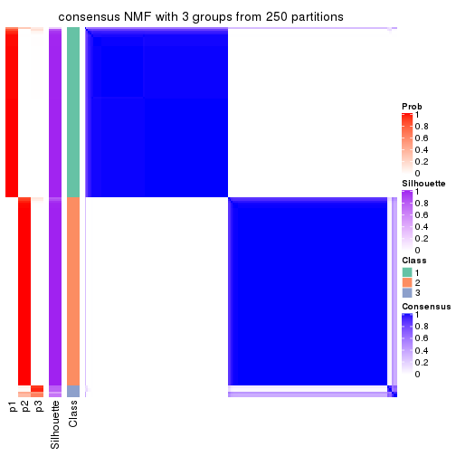</p>

</div>
<div id='tab-ATC-NMF-consensus-heatmap-3'>
<pre><code class="r">consensus_heatmap(res, k = 4)
</code></pre>

<p></p>

</div>
<div id='tab-ATC-NMF-consensus-heatmap-4'>
<pre><code class="r">consensus_heatmap(res, k = 5)
</code></pre>

<p>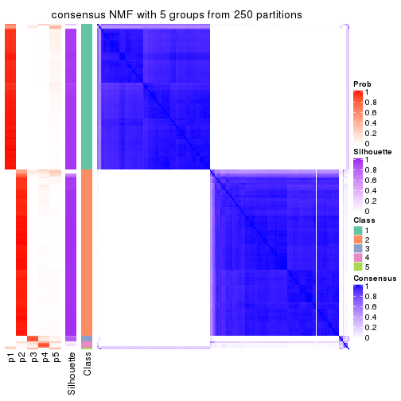</p>

</div>
<div id='tab-ATC-NMF-consensus-heatmap-5'>
<pre><code class="r">consensus_heatmap(res, k = 6)
</code></pre>

<p></p>

</div>
</div>

Heatmaps for the membership of samples in all partitions to see how consistent they are:


<script>
$( function() {
	$( '#tabs-ATC-NMF-membership-heatmap' ).tabs();
} );
</script>
<div id='tabs-ATC-NMF-membership-heatmap'>
<ul>
<li><a href='#tab-ATC-NMF-membership-heatmap-1'>k = 2</a></li>
<li><a href='#tab-ATC-NMF-membership-heatmap-2'>k = 3</a></li>
<li><a href='#tab-ATC-NMF-membership-heatmap-3'>k = 4</a></li>
<li><a href='#tab-ATC-NMF-membership-heatmap-4'>k = 5</a></li>
<li><a href='#tab-ATC-NMF-membership-heatmap-5'>k = 6</a></li>
</ul>
<div id='tab-ATC-NMF-membership-heatmap-1'>
<pre><code class="r">membership_heatmap(res, k = 2)
</code></pre>

<p></p>

</div>
<div id='tab-ATC-NMF-membership-heatmap-2'>
<pre><code class="r">membership_heatmap(res, k = 3)
</code></pre>

<p></p>

</div>
<div id='tab-ATC-NMF-membership-heatmap-3'>
<pre><code class="r">membership_heatmap(res, k = 4)
</code></pre>

<p></p>

</div>
<div id='tab-ATC-NMF-membership-heatmap-4'>
<pre><code class="r">membership_heatmap(res, k = 5)
</code></pre>

<p></p>

</div>
<div id='tab-ATC-NMF-membership-heatmap-5'>
<pre><code class="r">membership_heatmap(res, k = 6)
</code></pre>

<p></p>

</div>
</div>

As soon as we have had the classes for columns, we can look for signatures
which are significantly different between classes which can be candidate marks
for certain classes. Following are the heatmaps for signatures.


Signature heatmaps where rows are scaled:


<script>
$( function() {
	$( '#tabs-ATC-NMF-get-signatures' ).tabs();
} );
</script>
<div id='tabs-ATC-NMF-get-signatures'>
<ul>
<li><a href='#tab-ATC-NMF-get-signatures-1'>k = 2</a></li>
<li><a href='#tab-ATC-NMF-get-signatures-2'>k = 3</a></li>
<li><a href='#tab-ATC-NMF-get-signatures-3'>k = 4</a></li>
<li><a href='#tab-ATC-NMF-get-signatures-4'>k = 5</a></li>
<li><a href='#tab-ATC-NMF-get-signatures-5'>k = 6</a></li>
</ul>
<div id='tab-ATC-NMF-get-signatures-1'>
<pre><code class="r">get_signatures(res, k = 2)
</code></pre>

<p></p>

</div>
<div id='tab-ATC-NMF-get-signatures-2'>
<pre><code class="r">get_signatures(res, k = 3)
</code></pre>

<p></p>

</div>
<div id='tab-ATC-NMF-get-signatures-3'>
<pre><code class="r">get_signatures(res, k = 4)
</code></pre>

<p></p>

</div>
<div id='tab-ATC-NMF-get-signatures-4'>
<pre><code class="r">get_signatures(res, k = 5)
</code></pre>

<p></p>

</div>
<div id='tab-ATC-NMF-get-signatures-5'>
<pre><code class="r">get_signatures(res, k = 6)
</code></pre>

<p></p>

</div>
</div>


Signature heatmaps where rows are not scaled:


<script>
$( function() {
	$( '#tabs-ATC-NMF-get-signatures-no-scale' ).tabs();
} );
</script>
<div id='tabs-ATC-NMF-get-signatures-no-scale'>
<ul>
<li><a href='#tab-ATC-NMF-get-signatures-no-scale-1'>k = 2</a></li>
<li><a href='#tab-ATC-NMF-get-signatures-no-scale-2'>k = 3</a></li>
<li><a href='#tab-ATC-NMF-get-signatures-no-scale-3'>k = 4</a></li>
<li><a href='#tab-ATC-NMF-get-signatures-no-scale-4'>k = 5</a></li>
<li><a href='#tab-ATC-NMF-get-signatures-no-scale-5'>k = 6</a></li>
</ul>
<div id='tab-ATC-NMF-get-signatures-no-scale-1'>
<pre><code class="r">get_signatures(res, k = 2, scale_rows = FALSE)
</code></pre>

<p></p>

</div>
<div id='tab-ATC-NMF-get-signatures-no-scale-2'>
<pre><code class="r">get_signatures(res, k = 3, scale_rows = FALSE)
</code></pre>

<p></p>

</div>
<div id='tab-ATC-NMF-get-signatures-no-scale-3'>
<pre><code class="r">get_signatures(res, k = 4, scale_rows = FALSE)
</code></pre>

<p></p>

</div>
<div id='tab-ATC-NMF-get-signatures-no-scale-4'>
<pre><code class="r">get_signatures(res, k = 5, scale_rows = FALSE)
</code></pre>

<p></p>

</div>
<div id='tab-ATC-NMF-get-signatures-no-scale-5'>
<pre><code class="r">get_signatures(res, k = 6, scale_rows = FALSE)
</code></pre>

<p></p>

</div>
</div>


Compare the overlap of signatures from different k:

```r
compare_signatures(res)
```


`get_signature()` returns a data frame invisibly. TO get the list of signatures, the function
call should be assigned to a variable explicitly. In following code, if `plot` argument is set
to `FALSE`, no heatmap is plotted while only the differential analysis is performed.

```r
# code only for demonstration
tb = get_signature(res, k = ..., plot = FALSE)
```

An example of the output of `tb` is:

```
#>   which_row         fdr    mean_1    mean_2 scaled_mean_1 scaled_mean_2 km
#> 1        38 0.042760348  8.373488  9.131774    -0.5533452     0.5164555  1
#> 2        40 0.018707592  7.106213  8.469186    -0.6173731     0.5762149  1
#> 3        55 0.019134737 10.221463 11.207825    -0.6159697     0.5749050  1
#> 4        59 0.006059896  5.921854  7.869574    -0.6899429     0.6439467  1
#> 5        60 0.018055526  8.928898 10.211722    -0.6204761     0.5791110  1
#> 6        98 0.009384629 15.714769 14.887706     0.6635654    -0.6193277  2
...
```

The columns in `tb` are:

1. `which_row`: row indices corresponding to the input matrix.
2. `fdr`: FDR for the differential test. 
3. `mean_x`: The mean value in group x.
4. `scaled_mean_x`: The mean value in group x after rows are scaled.
5. `km`: Row groups if k-means clustering is applied to rows.


UMAP plot which shows how samples are separated.


<script>
$( function() {
	$( '#tabs-ATC-NMF-dimension-reduction' ).tabs();
} );
</script>
<div id='tabs-ATC-NMF-dimension-reduction'>
<ul>
<li><a href='#tab-ATC-NMF-dimension-reduction-1'>k = 2</a></li>
<li><a href='#tab-ATC-NMF-dimension-reduction-2'>k = 3</a></li>
<li><a href='#tab-ATC-NMF-dimension-reduction-3'>k = 4</a></li>
<li><a href='#tab-ATC-NMF-dimension-reduction-4'>k = 5</a></li>
<li><a href='#tab-ATC-NMF-dimension-reduction-5'>k = 6</a></li>
</ul>
<div id='tab-ATC-NMF-dimension-reduction-1'>
<pre><code class="r">dimension_reduction(res, k = 2, method = &quot;UMAP&quot;)
</code></pre>

<p></p>

</div>
<div id='tab-ATC-NMF-dimension-reduction-2'>
<pre><code class="r">dimension_reduction(res, k = 3, method = &quot;UMAP&quot;)
</code></pre>

<p></p>

</div>
<div id='tab-ATC-NMF-dimension-reduction-3'>
<pre><code class="r">dimension_reduction(res, k = 4, method = &quot;UMAP&quot;)
</code></pre>

<p></p>

</div>
<div id='tab-ATC-NMF-dimension-reduction-4'>
<pre><code class="r">dimension_reduction(res, k = 5, method = &quot;UMAP&quot;)
</code></pre>

<p></p>

</div>
<div id='tab-ATC-NMF-dimension-reduction-5'>
<pre><code class="r">dimension_reduction(res, k = 6, method = &quot;UMAP&quot;)
</code></pre>

<p></p>

</div>
</div>


Following heatmap shows how subgroups are split when increasing `k`:

```r
collect_classes(res)
```


If matrix rows can be associated to genes, consider to use `functional_enrichment(res,
...)` to perform function enrichment for the signature genes. See [this vignette](http://bioconductor.org/packages/devel/bioc/vignettes/cola/inst/doc/functional_enrichment.html) for more detailed explanations.


 

## Session info


```r
sessionInfo()
```

```
#> R version 3.6.0 (2019-04-26)
#> Platform: x86_64-pc-linux-gnu (64-bit)
#> Running under: CentOS Linux 7 (Core)
#> 
#> Matrix products: default
#> BLAS:   /usr/lib64/libblas.so.3.4.2
#> LAPACK: /usr/lib64/liblapack.so.3.4.2
#> 
#> locale:
#>  [1] LC_CTYPE=en_GB.UTF-8       LC_NUMERIC=C               LC_TIME=en_GB.UTF-8       
#>  [4] LC_COLLATE=en_GB.UTF-8     LC_MONETARY=en_GB.UTF-8    LC_MESSAGES=en_GB.UTF-8   
#>  [7] LC_PAPER=en_GB.UTF-8       LC_NAME=C                  LC_ADDRESS=C              
#> [10] LC_TELEPHONE=C             LC_MEASUREMENT=en_GB.UTF-8 LC_IDENTIFICATION=C       
#> 
#> attached base packages:
#> [1] grid      stats     graphics  grDevices utils     datasets  methods   base     
#> 
#> other attached packages:
#> [1] genefilter_1.66.0    ComplexHeatmap_2.3.1 markdown_1.1         knitr_1.26          
#> [5] GetoptLong_0.1.7     cola_1.3.2          
#> 
#> loaded via a namespace (and not attached):
#>  [1] circlize_0.4.8       shape_1.4.4          xfun_0.11            slam_0.1-46         
#>  [5] lattice_0.20-38      splines_3.6.0        colorspace_1.4-1     vctrs_0.2.0         
#>  [9] stats4_3.6.0         blob_1.2.0           XML_3.98-1.20        survival_2.44-1.1   
#> [13] rlang_0.4.2          pillar_1.4.2         DBI_1.0.0            BiocGenerics_0.30.0 
#> [17] bit64_0.9-7          RColorBrewer_1.1-2   matrixStats_0.55.0   stringr_1.4.0       
#> [21] GlobalOptions_0.1.1  evaluate_0.14        memoise_1.1.0        Biobase_2.44.0      
#> [25] IRanges_2.18.3       parallel_3.6.0       AnnotationDbi_1.46.1 highr_0.8           
#> [29] Rcpp_1.0.3           xtable_1.8-4         backports_1.1.5      S4Vectors_0.22.1    
#> [33] annotate_1.62.0      skmeans_0.2-11       bit_1.1-14           microbenchmark_1.4-7
#> [37] brew_1.0-6           impute_1.58.0        rjson_0.2.20         png_0.1-7           
#> [41] digest_0.6.23        stringi_1.4.3        polyclip_1.10-0      clue_0.3-57         
#> [45] tools_3.6.0          bitops_1.0-6         magrittr_1.5         eulerr_6.0.0        
#> [49] RCurl_1.95-4.12      RSQLite_2.1.4        tibble_2.1.3         cluster_2.1.0       
#> [53] crayon_1.3.4         pkgconfig_2.0.3      zeallot_0.1.0        Matrix_1.2-17       
#> [57] xml2_1.2.2           httr_1.4.1           R6_2.4.1             mclust_5.4.5        
#> [61] compiler_3.6.0
```


